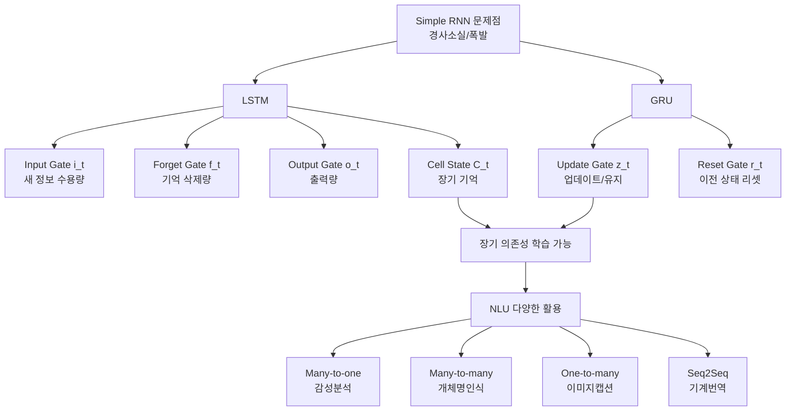

# 12강. 딥러닝의 통계적이해: 순환신경망 (2)

## 🔗 선수 지식 (Prerequisites)
- [ ] **필수**: Simple RNN 구조 및 BPTT(역전파를 통한 시간 역전파) - 이해 완료? →←11강
- [ ] **필수**: 경사 소실(Gradient Vanishing) / 경사 폭발(Gradient Exploding) 문제 →←11강
- [ ] **권장**: 시그모이드($\sigma$), tanh 활성화 함수의 특성
- **관련 단원**: [11강. 순환신경망 (1)](11강.%20순환신경망%20(1).md)

---

## 학습 목표
1. LSTM(Long Short-Term Memory)의 게이트 구조와 셀 상태 업데이트 원리를 설명할 수 있다.
2. GRU(Gated Recurrent Unit)의 수식을 이해하고 LSTM과의 구조적 차이를 비교할 수 있다.
3. RNN의 입출력 형태(Many-to-one, Many-to-many, Seq2Seq 등)에 따른 다양한 자연어 이해(NLU) 활용 방법을 설명할 수 있다.

---

## 🧠 메타인지 체크 (학습 전/후 자기 평가)

### 학습 전 자기 평가
| 소주제 | 자신감 (1-5) |
| :--- | :--- |
| LSTM 게이트 구조 및 수식 | |
| GRU 구조 및 LSTM과의 차이 | |
| RNN 활용 형태 (감성분석, Seq2Seq 등) | |

### 학습 후 교정 (학습 완료 후 작성)
| 소주제 | 학습 전 | 학습 후 | 실제 정답률 | 과신/과소 여부 |
| :--- | :--- | :--- | :--- | :--- |
| LSTM 게이트 구조 및 수식 | | | | |
| GRU 구조 및 LSTM과의 차이 | | | | |
| RNN 활용 형태 (감성분석, Seq2Seq 등) | | | | |

> **활용법**: 학습 전 1분 → 자신감 기입, 학습 후 1분 → 나머지 기입. "과신" 영역이 실제 취약점.

---

## 📝 요약 (Summary)
1. 🔴 **LSTM**: Simple RNN의 경사 소실/폭발 문제를 해결하기 위해 Input Gate, Forget Gate, Output Gate와 Cell State를 도입한 구조. Cell State가 장기 기억을 보존하며, 게이트가 정보 흐름을 조절한다.
2. 🔴 **GRU**: LSTM을 단순화한 모델로, Update Gate와 Reset Gate만을 사용해 파라미터 수를 줄이면서도 유사한 성능을 발휘한다. Cell State가 없고 Hidden State가 기억을 담당한다.
3. 🟡 **RNN의 다양한 활용**: 손실함수 구성 방식에 따라 Many-to-one(감성 분석), Many-to-many(개체명 인식), One-to-many(이미지 캡션), Seq2Seq(기계번역) 등 다양한 NLU 과제에 적용할 수 있다.
4. 🟡 **Seq2Seq와 Teacher Forcing**: Encoder-Decoder 구조로 가변 길이 입출력을 처리하며, 학습 시 Teacher Forcing을 통해 학습 안정성을 높인다.
5. 🟢 **LSTM의 Gradient 안정성**: 역전파 과정에서 $\frac{\partial C_k}{\partial C_{k-1}}$가 Forget Gate 값에 의존하며, 이 값이 1에 가까울 때 경사 소실 없이 장기 의존성을 학습할 수 있다.

---

## 📐 핵심 수식 (Key Formulas)

### LSTM 수식 테이블

| 수식명 | 수식 | 의미 |
| :--- | :--- | :--- |
| **Input Gate** | $i_t = \sigma(b_i + W_i h_{t-1} + U_i x_t)$ | 새 정보를 얼마나 받아들일지 결정 (0~1) |
| **Forget Gate** | $f_t = \sigma(b_f + W_f h_{t-1} + U_f x_t)$ | 이전 Cell State를 얼마나 잊을지 결정 (0~1) |
| **Output Gate** | $o_t = \sigma(b_o + W_o h_{t-1} + U_o x_t)$ | Cell State에서 얼마나 출력할지 결정 (0~1) |
| **Candidate Cell State** | $\tilde{C}_t = \tanh(b_C + W_C h_{t-1} + U_C x_t)$ | 새로 추가될 후보 기억값 (-1~1) |
| **Cell State 업데이트** | $C_t = f_t \odot C_{t-1} + i_t \odot \tilde{C}_t$ | 기존 기억 일부 삭제 + 새 기억 추가 |
| **Hidden State** | $h_t = o_t \odot \tanh(C_t)$ | 현재 출력이자 다음 스텝으로 전달되는 단기 기억 |

### GRU 수식 테이블

| 수식명 | 수식 | 의미 |
| :--- | :--- | :--- |
| **Update Gate** | $z_t = \sigma(b_z + W_z h_{t-1} + U_z x_t)$ | $z_t=1$: 새 정보로 완전 업데이트 / $z_t=0$: 이전 상태 유지 (수식 $h_t=(1-z_t)h_{t-1}+z_t\tilde{h}_t$ 참조) |
| **Reset Gate** | $r_t = \sigma(b_r + W_r h_{t-1} + U_r x_t)$ | $r_t=1$: 이전 상태 유지 / $r_t=0$: 이전 상태 리셋 |
| **Candidate Hidden State** | $\tilde{h}_t = \tanh(b_h + W_h(r_t \odot h_{t-1}) + U_h x_t)$ | 리셋된 이전 상태와 현재 입력의 결합 |
| **Hidden State 업데이트** | $h_t = (1 - z_t) \odot h_{t-1} + z_t \odot \tilde{h}_t$ | Update Gate로 이전/신규 상태를 가중 평균 |
| **출력** | $o_t = \sigma_v(b_o + V h_t)$ | 현재 Hidden State로부터 최종 출력 |

### 주요 정리: LSTM Cell State Gradient

**LSTM Gradient 전파 경로**
$$
\frac{\partial C_k}{\partial C_{k-1}} \approx \text{diag}[\sigma(b_f + W_f h_{k-1} + U_f x_k)] = \text{diag}[f_k]
$$

> **직관적 해석**: Cell State의 역전파는 Forget Gate 값($f_k$)의 곱셈으로 이루어진다. $f_k \approx 1$이면 gradient가 소실되지 않고 멀리 전달될 수 있다. Simple RNN이 $\tanh'$의 반복 곱셈으로 gradient가 소실되는 것과 달리, LSTM은 이 경로를 통해 장기 의존성 학습이 가능하다.
> **AI 적용**: 문장에서 수백 토큰 전의 주어를 기억하거나, 긴 시계열 데이터에서 트렌드를 학습할 때 LSTM의 이 특성이 핵심적으로 작동한다.

---

## 📊 개념 시각화 (Visual Guide)

### 개념 관계도



### RNN 입출력 형태별 분류표

| 형태 | 구조 | 대표 과제 | 손실함수 위치 |
| :--- | :--- | :--- | :--- |
| **Many-to-one** | 시퀀스 입력 → 단일 출력 | 감성 분석, 문서 분류 | 마지막 타임스텝에서만 |
| **Many-to-many** | 시퀀스 입력 → 시퀀스 출력 | 개체명 인식, 띄어쓰기 | 모든 타임스텝에서 |
| **One-to-many** | 단일 입력 → 시퀀스 출력 | 이미지 캡션 생성 | 출력 시퀀스 전체에서 |
| **Seq2Seq** | 시퀀스 입력 → 시퀀스 출력 (가변 길이) | 기계번역, 요약 | Decoder 출력 전체에서 |

---

## ✏️ 심화 학습 (Study Subject)

### 1. 가상 시나리오: "LSTM vs GRU, 언제 어떤 것을 써야 할까?"

- **상황**: 스타트업의 NLP 엔지니어로, 영화 리뷰 감성 분석 모델(Many-to-one)과 한국어 기계번역 모델(Seq2Seq)을 동시에 개발해야 한다. 서버 자원이 제한적이다.
- **문제**: 두 과제 모두에 LSTM을 쓸지, GRU를 쓸지, 아니면 혼용해야 할지 결정해야 한다. 파라미터 수와 성능 사이의 트레이드오프가 핵심이다.
- **해결**:
  - LSTM 파라미터 수: $4 \times (d_h \times d_h + d_h \times d_x + d_h)$ (게이트 4개)
  - GRU 파라미터 수: $3 \times (d_h \times d_h + d_h \times d_x + d_h)$ (게이트 3개)
  - 자원이 제한적이면 GRU가 유리. 단, 장기 의존성이 매우 긴 번역 과제에서는 LSTM이 더 안정적일 수 있음.
- **AI 학습 포인트**: "같은 데이터셋에서 LSTM과 GRU의 성능 차이가 유의미하게 나타나는 조건은 무엇인가? 시퀀스 길이, 데이터 크기, 언어 유형에 따라 어떻게 달라지는지 실험 사례를 들어 설명해줘."

### 2. 관점별 비교 및 오개념 분석

**핵심 비교: LSTM vs GRU**

| 구분 | LSTM | GRU |
| :--- | :--- | :--- |
| **게이트 수** | 3개 (Input, Forget, Output) | 2개 (Update, Reset) |
| **상태 수** | 2개 (Cell State $C_t$, Hidden State $h_t$) | 1개 (Hidden State $h_t$) |
| **장기 기억 담당** | Cell State ($C_t$) | Hidden State ($h_t$, Update Gate로 조절) |
| **파라미터 수** | 많음 | 적음 (~25% 감소) |
| **학습 속도** | 상대적으로 느림 | 상대적으로 빠름 |
| **장기 의존성** | 더 유리 (셀 상태 분리) | 비슷하거나 약간 불리 |
| **적합 과제** | 긴 시퀀스, 복잡한 언어 모델 | 데이터/자원 제한 상황, 빠른 프로토타이핑 |
| **AI 활용** | 기계번역, 언어 생성 | 감성 분석, 경량 시계열 예측 |

**오개념 분석**:

- **오개념 1**: "GRU의 $z_t=1$이면 이전 상태를 유지한다."
  - **분석**: 반대이다. $h_t = (1-z_t) \odot h_{t-1} + z_t \odot \tilde{h}_t$에서, $z_t=1$이면 $h_t = \tilde{h}_t$ (새 정보로 완전 교체)이고, $z_t=0$이면 $h_t = h_{t-1}$ (이전 상태 유지)이다. Update Gate는 "새 후보 상태를 얼마나 반영할지"의 비율로, $z_t$가 클수록 더 많이 업데이트된다.

- **오개념 2**: "LSTM의 Cell State와 Hidden State는 같은 역할을 한다."
  - **분석**: Cell State($C_t$)는 장기 기억 전용 경로로, 게이트를 통해 선택적으로 정보를 보존한다. Hidden State($h_t$)는 출력이자 단기 기억으로, $h_t = o_t \odot \tanh(C_t)$로 Cell State의 일부만 반영한다.

- **오개념 3**: "Teacher Forcing을 사용하면 추론(inference) 시에도 항상 정답을 입력으로 쓴다."
  - **분석**: Teacher Forcing은 **학습 시**에만 사용한다. 추론 시에는 이전 스텝의 예측값 $\hat{y}_{t-1}$를 다음 입력으로 사용한다. 이 학습/추론 간 불일치를 "Exposure Bias" 문제라 한다.

- **AI 학습 포인트**: "Exposure Bias 문제를 해결하기 위한 Scheduled Sampling 기법을 설명하고, Transformer 기반 모델이 이 문제를 어떻게 우회하는지 비교해줘."

---

### 📌 심층 확장 — LSTM vs GRU 완전 비교표

기존 요약 표에서 다루지 않은 파라미터 비율, 수렴 특성, 추론 속도까지 포함한 완전 비교표를 제시한다.

#### 파라미터 수 정밀 계산

입력 차원 $d_x$, 은닉 차원 $d_h$일 때:

$$\text{LSTM 파라미터}: 4 \times (d_h \cdot d_h + d_h \cdot d_x + d_h) = 4(d_h^2 + d_h d_x + d_h)$$
$$\text{GRU 파라미터}: 3 \times (d_h \cdot d_h + d_h \cdot d_x + d_h) = 3(d_h^2 + d_h d_x + d_h)$$

$$\therefore \frac{\text{GRU}}{\text{LSTM}} = \frac{3}{4} = 75\% \quad \Rightarrow \quad \text{GRU는 LSTM 파라미터의 약 75\%}$$

$d_x = 128, d_h = 256$일 때: LSTM 296,960개 / GRU 222,720개 (25% 절감).

#### LSTM vs GRU 완전 비교표

| 비교 항목 | LSTM | GRU | 실무 판단 기준 |
| :--- | :--- | :--- | :--- |
| **제안 연도** | 1997 (Hochreiter & Schmidhuber) | 2014 (Cho et al.) | — |
| **게이트 수** | 3개 (Input $i_t$, Forget $f_t$, Output $o_t$) | 2개 (Update $z_t$, Reset $r_t$) | GRU가 단순 |
| **내부 상태** | Cell State $C_t$ + Hidden State $h_t$ (2개) | Hidden State $h_t$ (1개) | LSTM: 장기 기억 전용 경로 분리 |
| **파라미터 비율** | 100% (기준) | ~75% (LSTM 대비) | 자원 제약 시 GRU 유리 |
| **추론 속도** | 상대적으로 느림 | ~25% 빠름 (게이트 연산 감소) | 실시간 응용: GRU |
| **학습 수렴** | 느리지만 안정적 | 빠르고 단순 | 프로토타이핑: GRU |
| **장기 의존성** | 더 유리 (Cell State로 gradient highway) | 비슷하거나 약간 불리 | 긴 시퀀스($T>200$): LSTM |
| **소규모 데이터** | 과적합 위험 높음 | 파라미터 적어 유리 | 데이터 < 10K: GRU 권장 |
| **대규모 데이터** | 더 복잡한 패턴 포착 가능 | LSTM과 유사하거나 낮음 | 데이터 > 100K: LSTM 고려 |
| **메모리 효율** | 상태 2개 → 메모리 2배 | 상태 1개 → 메모리 효율적 | 배치 크기 제약 시 GRU |
| **Gradient 흐름** | $\frac{\partial C_k}{\partial C_{k-1}} \approx f_k$ (Forget Gate) | Update Gate $z_t$로 조절 | LSTM의 이론적 gradient 경로가 더 명확 |
| **적합 과제** | 기계번역, 음성인식, 긴 문서 요약 | 감성분석, 짧은 시계열, 경량 NLP | 과제 시퀀스 길이와 데이터 규모 기준 |

#### 성능 비교 실험 결과 요약 (Chung et al., 2014)

Junyoung Chung et al.의 실험에서 음악·음성·다항식 예측 과제에 대해:
- **소규모 과제**: GRU가 LSTM과 동등하거나 약간 우세 (파라미터 효율 덕분)
- **대규모 과제**: LSTM이 더 낮은 loss 달성 경향
- **전반적 결론**: 두 모델 간 절대 우위 없음. 과제와 데이터에 따라 실험이 필수.

```python
import torch
import torch.nn as nn
import time

def compare_lstm_gru(d_x=128, d_h=256, seq_len=100, batch=32, n_layers=2):
    """LSTM vs GRU 파라미터 수·속도 비교"""
    lstm = nn.LSTM(d_x, d_h, n_layers, batch_first=True)
    gru  = nn.GRU(d_x, d_h, n_layers, batch_first=True)

    x = torch.randn(batch, seq_len, d_x)

    # 파라미터 수
    lstm_params = sum(p.numel() for p in lstm.parameters())
    gru_params  = sum(p.numel() for p in gru.parameters())
    print(f"LSTM 파라미터: {lstm_params:,}")
    print(f"GRU  파라미터: {gru_params:,}")
    print(f"GRU/LSTM 비율: {gru_params/lstm_params*100:.1f}%")

    # 추론 속도 (100회 평균)
    N = 100
    with torch.no_grad():
        start = time.time()
        for _ in range(N): lstm(x)
        lstm_time = (time.time() - start) / N * 1000

        start = time.time()
        for _ in range(N): gru(x)
        gru_time = (time.time() - start) / N * 1000

    print(f"LSTM 추론 시간: {lstm_time:.2f}ms")
    print(f"GRU  추론 시간: {gru_time:.2f}ms")
    print(f"GRU 속도 향상: {lstm_time/gru_time:.2f}x")

compare_lstm_gru()
# 예시 출력:
# LSTM 파라미터: 1,052,672
# GRU  파라미터:   789,504
# GRU/LSTM 비율: 75.0%
# GRU 속도 향상: ~1.2~1.4x (하드웨어 의존)
```

> **출처**: Chung, J. et al. (2014). "Empirical Evaluation of Gated Recurrent Neural Networks on Sequence Modeling." NIPS 2014 Deep Learning Workshop.

---

### 📌 심층 확장 — Seq2Seq 아키텍처: 구조·병목 문제·어텐션 연결

#### Seq2Seq 기본 아키텍처

Sutskever et al. (2014)이 기계번역을 위해 제안한 **인코더-디코더(Encoder-Decoder)** 구조다.

**① 인코더 (Encoder)**

가변 길이 입력 시퀀스 $x = (x_1, \ldots, x_T)$를 순차적으로 처리하여 고정 크기 **컨텍스트 벡터 $c$**로 압축한다:

$$h_t^E = \text{LSTM}(x_t, h_{t-1}^E), \quad t = 1, \ldots, T$$
$$c = h_T^E \quad \text{(마지막 은닉 상태를 컨텍스트 벡터로 사용)}$$

**② 디코더 (Decoder)**

컨텍스트 벡터 $c$를 초기 상태로 받아 출력 시퀀스 $y = (y_1, \ldots, y_{T'})$를 생성한다:

$$h_t^D = \text{LSTM}(y_{t-1}, h_{t-1}^D), \quad h_0^D = c$$
$$\hat{y}_t = \text{softmax}(W_o h_t^D + b_o)$$

```
입력: "나는 학교에 간다"
     x₁  x₂   x₃  x₄
      ↓   ↓    ↓   ↓
[Encoder LSTM] → c = h₄ᴱ  ← 컨텍스트 벡터 (병목)
                     ↓
           [Decoder LSTM]
                ↓   ↓   ↓   ↓
               y₁  y₂  y₃  y₄
            "I go  to school"
```

#### 병목 문제 (Information Bottleneck)

기본 Seq2Seq의 핵심 한계: 입력 시퀀스 전체를 **고정 크기 벡터 $c$** 하나에 압축한다. 입력이 길어질수록 이 병목에서 정보 손실이 발생한다.

**실험적 증거**: Cho et al. (2014)에서 입력 시퀀스 길이가 길어질수록 BLEU 점수가 급격히 하락. 특히 길이 30 이상에서 성능 저하 뚜렷.

**정량적 이해**: 고정 크기 $d_h$차원 벡터에 길이 $T$의 시퀀스를 압축 → 정보 용량 $\propto d_h$, 입력 정보량 $\propto T \cdot d_x$. $T$가 커질수록 압축률이 높아져 손실 증가.

#### 어텐션 메커니즘으로의 연결 (→←13강)

Bahdanau et al. (2015)이 제안한 **어텐션(Attention)**은 병목 문제를 해결한다:
- 디코더 각 타임스텝이 **모든** 인코더 은닉 상태 $h_1^E, \ldots, h_T^E$에 동적으로 접근
- 고정 벡터 $c$ 대신 타임스텝마다 다른 컨텍스트 벡터 $c_t$를 계산

$$c_t = \sum_{i=1}^T \alpha_{ti} h_i^E, \quad \alpha_{ti} = \frac{\exp(e_{ti})}{\sum_{j=1}^T \exp(e_{tj})}$$

여기서 $e_{ti} = a(h_{t-1}^D, h_i^E)$는 정렬 점수(alignment score).

```
Seq2Seq (기본): 고정 c 사용    → 병목 문제 O
Seq2Seq + Attention: 동적 cₜ  → 병목 문제 해결
Transformer: Self-Attention    → RNN 구조 완전 제거 (→←14강)
```

#### Seq2Seq 응용 분야와 특성

| 응용 분야 | 입력 | 출력 | 특이 사항 |
| :--- | :--- | :--- | :--- |
| **기계번역** | 소스 언어 문장 | 대상 언어 문장 | 가변 길이 입출력 |
| **문서 요약** | 긴 문서 | 짧은 요약 | 출력이 항상 더 짧음 |
| **질의응답** | 질문 + 문맥 | 답변 | 추출형 or 생성형 |
| **음성 인식** | 음성 특징 시퀀스 | 텍스트 | CTC 손실 or Seq2Seq |
| **코드 생성** | 자연어 설명 | 프로그래밍 코드 | Codex, GitHub Copilot 기반 |

> **출처**: Sutskever, I. et al. (2014). "Sequence to Sequence Learning with Neural Networks." NeurIPS 2014. Cho, K. et al. (2014). "Learning Phrase Representations using RNN Encoder-Decoder for Statistical Machine Translation." EMNLP 2014. Bahdanau, D. et al. (2015). "Neural Machine Translation by Jointly Learning to Align and Translate." ICLR 2015.

---

### 📌 심층 확장 — Gradient Clipping 실제 구현 (PyTorch)

경사 폭발을 방지하는 Gradient Clipping의 이론·구현·임계값 선택 기준을 심층 분석한다.

#### 이론: 두 가지 클리핑 방식

**① 원소별 클리핑 (Element-wise Clipping) — 비권장**

$$\tilde{g}_i = \text{clip}(g_i, -\theta, \theta)$$

각 파라미터의 기울기를 개별적으로 $[-\theta, \theta]$로 자른다. 구현이 간단하지만 **기울기 벡터의 방향이 왜곡**된다.

**② 노름 기반 클리핑 (Norm-based Clipping) — 권장**

$$\tilde{\mathbf{g}} = \begin{cases} \theta \cdot \dfrac{\mathbf{g}}{\|\mathbf{g}\|} & \text{if } \|\mathbf{g}\| > \theta \\ \mathbf{g} & \text{otherwise} \end{cases}$$

전체 기울기 벡터의 방향을 보존하면서 크기만 임계값으로 조정한다. PyTorch의 `clip_grad_norm_`이 이 방식을 구현한다.

$$\|\tilde{\mathbf{g}}\| = \min(\|\mathbf{g}\|, \theta)$$

#### PyTorch 구현 — 완전한 학습 루프

```python
import torch
import torch.nn as nn
import torch.optim as optim

class LSTMModel(nn.Module):
    def __init__(self, input_size, hidden_size, output_size, num_layers=1):
        super().__init__()
        self.lstm = nn.LSTM(input_size, hidden_size, num_layers,
                            batch_first=True)
        self.fc   = nn.Linear(hidden_size, output_size)

    def forward(self, x):
        out, _ = self.lstm(x)
        return self.fc(out[:, -1, :])  # 마지막 타임스텝

model = LSTMModel(input_size=10, hidden_size=64, output_size=1)
optimizer = optim.Adam(model.parameters(), lr=1e-3)
criterion = nn.MSELoss()

# ━━━━━━━━━━━━━━━━━━━━━━━━━━━━━━━━━━━━━━━━━
# Gradient Clipping이 있는 올바른 학습 루프
# ━━━━━━━━━━━━━━━━━━━━━━━━━━━━━━━━━━━━━━━━━
def train_step(model, optimizer, x, y, max_norm=1.0):
    model.train()
    optimizer.zero_grad()

    pred = model(x)
    loss = criterion(pred, y)
    loss.backward()

    # ① 기울기 노름 확인 (디버깅용)
    total_norm = 0.0
    for p in model.parameters():
        if p.grad is not None:
            total_norm += p.grad.data.norm(2).item() ** 2
    total_norm = total_norm ** 0.5

    # ② Gradient Clipping — optimizer.step() 직전에 반드시 적용
    torch.nn.utils.clip_grad_norm_(model.parameters(), max_norm=max_norm)

    # ③ 파라미터 업데이트
    optimizer.step()

    return loss.item(), total_norm

# 학습 예시
x = torch.randn(32, 20, 10)  # (batch, seq_len, input_size)
y = torch.randn(32, 1)

loss, grad_norm = train_step(model, optimizer, x, y, max_norm=1.0)
print(f"Loss: {loss:.4f}, Grad Norm (before clip): {grad_norm:.4f}")
```

**핵심 주의사항**: `clip_grad_norm_`은 반드시 `loss.backward()` 이후, `optimizer.step()` 이전에 호출해야 한다. 순서가 바뀌면 클리핑이 적용되지 않거나 불필요하게 적용된다.

```python
# ❌ 잘못된 순서 (절대 사용 금지)
optimizer.step()                                              # 먼저 업데이트
torch.nn.utils.clip_grad_norm_(model.parameters(), max_norm=1.0)  # 늦게 클리핑

# ✅ 올바른 순서
loss.backward()                                               # 1. 기울기 계산
torch.nn.utils.clip_grad_norm_(model.parameters(), max_norm=1.0)  # 2. 클리핑
optimizer.step()                                              # 3. 업데이트
```

#### 임계값(max_norm) 선택 기준

적절한 임계값은 과제와 모델 규모에 따라 다르다. 아래 가이드라인을 참고한다:

| 모델/과제 | 권장 max_norm | 근거 |
| :--- | :--- | :--- |
| **단순 RNN (소규모)** | 5.0 | 폭발 방지를 위한 여유 있는 값 |
| **LSTM/GRU (일반)** | 1.0 | Pascanu et al. (2013) 권장값 |
| **Transformer (GPT류)** | 1.0 | Radford et al. (2019) GPT-2 설정 |
| **Transformer (BERT류)** | 1.0 | Devlin et al. (2018) BERT 설정 |
| **대규모 언어 모델** | 1.0 ~ 0.5 | 학습 불안정성 방지 강화 |

**경험적 임계값 탐색 방법**:

1. **학습 초기** (처음 100 배치) 동안 클리핑 없이 기울기 노름을 기록한다.
2. 기록된 기울기 노름의 **90번째 백분위수**를 초기 max_norm으로 설정한다.
3. 학습 중 `loss = NaN`이 발생하면 max_norm을 절반으로 줄인다.

```python
import numpy as np

def auto_set_max_norm(model, optimizer, loader, warmup_batches=100):
    """초기 기울기 노름 통계로 max_norm 자동 추천"""
    grad_norms = []
    model.train()

    for i, (x, y) in enumerate(loader):
        if i >= warmup_batches: break
        optimizer.zero_grad()
        loss = criterion(model(x), y)
        loss.backward()

        total_norm = sum(p.grad.data.norm(2).item() ** 2
                         for p in model.parameters() if p.grad is not None) ** 0.5
        grad_norms.append(total_norm)
        optimizer.zero_grad()  # 기울기 초기화 (실제 업데이트 안 함)

    recommended = np.percentile(grad_norms, 90)
    print(f"기울기 노름 통계: 평균={np.mean(grad_norms):.3f}, "
          f"90th percentile={recommended:.3f}")
    print(f"권장 max_norm: {recommended:.2f}")
    return recommended
```

> **출처**: Pascanu, R. et al. (2013). "On the difficulty of training recurrent neural networks." ICML 2013. Radford, A. et al. (2019). "Language Models are Unsupervised Multitask Learners." OpenAI Blog (GPT-2). Devlin, J. et al. (2018). "BERT: Pre-training of Deep Bidirectional Transformers for Language Understanding." NAACL 2019.

---

## ❓ 연습 문제 및 해설

> **블룸 인지 수준 범례**: [기억] 정의·나열 → [이해] 설명·비교 → [적용] 계산·구현 → [분석] 구별·디버그 → [평가] 판단·비평 → [창조] 설계·제안

### 📝 문제

**1. ⭐ [기억] LSTM에서 장기 기억을 담당하는 상태는 무엇인가?** [(정답)](#prob-1)
   > ① Hidden State ($h_t$)
   > ② Output Gate ($o_t$)
   > ③ Cell State ($C_t$)
   > ④ Candidate Cell State ($\tilde{C}_t$)

<br>

**2. ⭐ [기억] GRU에서 이전 Hidden State를 얼마나 리셋(무시)할지 결정하는 게이트는?** [(정답)](#prob-2)
   > ① Update Gate
   > ② Input Gate
   > ③ Forget Gate
   > ④ Reset Gate

<br>

**3. ⭐⭐ [이해] LSTM의 Cell State 업데이트 수식 $C_t = f_t \odot C_{t-1} + i_t \odot \tilde{C}_t$에서, Forget Gate $f_t = 0$일 때의 의미로 올바른 것은?** [(정답)](#prob-3)
   > ① 이전 Cell State를 완전히 보존한다.
   > ② 이전 Cell State를 완전히 삭제하고 새 후보값만 반영한다.
   > ③ 새 입력 정보를 완전히 차단한다.
   > ④ Hidden State가 0이 된다.

<br>

**4. ⭐⭐ [적용/분석] 다음 중 RNN의 활용 형태와 과제의 연결이 올바르지 않은 것은?** [(정답)](#prob-4)
   > ① Many-to-one — 감성 분석
   > ② Many-to-many — 개체명 인식
   > ③ One-to-many — 기계번역
   > ④ Seq2Seq — 한국어-영어 번역

<br>

**5. ⭐⭐ [분석] 다음 \<보기\>에서 LSTM에 대한 설명으로 옳은 것을 모두 고르시오.** [(정답)](#prob-5)

   > \<보기\>
   >
   > 가. Forget Gate 값이 1에 가까울수록 이전 Cell State를 더 많이 보존한다.
   > 나. Hidden State $h_t$는 Cell State $C_t$와 Output Gate $o_t$의 원소별 곱(Hadamard product)으로 결정된다.
   > 다. GRU보다 파라미터 수가 많아 학습 데이터가 적을 때 과적합 위험이 낮다.
   > 라. LSTM은 Simple RNN의 경사 소실 문제를 구조적으로 완전히 제거한다.

   > ① 가, 나
   > ② 가, 나, 다
   > ③ 나, 다, 라
   > ④ 가, 나, 라

<br>

**6. ⭐⭐⭐ [평가/창조] Seq2Seq 모델에서 Teacher Forcing을 사용하는 이유와 그로 인해 발생하는 부작용(Exposure Bias)을 설명하고, 이를 완화하는 방법을 하나 이상 제시하시오.** [(정답)](#prob-6)

---

### 🔑 정답 및 해설 (먼저 풀어본 후 펼치기)

<details>
<summary>정답 보기 (클릭)</summary>

1. ③
2. ④
3. ②
4. ③
5. ①
6. [서술형 — 해설 참고]

</details>

<details>
<summary>해설 보기 (클릭)</summary>

<a id="prob-1"></a>
**1. ⭐ [기억] LSTM의 장기 기억 담당 상태**
> **정답: ③ Cell State ($C_t$)**
> **해설**: Cell State는 시간 축을 따라 흐르는 컨베이어벨트와 같다. 게이트를 통해 선택적으로 정보가 더해지거나 삭제되어 장기 기억을 보존한다. Hidden State($h_t$)는 단기 기억 및 출력 역할이다.

<a id="prob-2"></a>
**2. ⭐ [기억] GRU의 Reset Gate**
> **정답: ④ Reset Gate**
> **해설**: Reset Gate $r_t = \sigma(\cdots)$는 이전 Hidden State $h_{t-1}$를 후보 Hidden State 계산 시 얼마나 반영할지 결정한다. $r_t=0$이면 $r_t \odot h_{t-1} = 0$으로 이전 상태를 완전히 무시(리셋)한다.

<a id="prob-3"></a>
**3. ⭐⭐ [이해] Forget Gate = 0의 의미**
> **정답: ② 이전 Cell State를 완전히 삭제하고 새 후보값만 반영한다.**
> **해설**: $f_t = 0$이면 $C_t = 0 \odot C_{t-1} + i_t \odot \tilde{C}_t = i_t \odot \tilde{C}_t$가 된다. 즉 과거 기억을 모두 지우고 새 입력 정보만으로 Cell State를 갱신한다.

<a id="prob-4"></a>
**4. ⭐⭐ [적용/분석] 잘못 연결된 과제**
> **정답: ③ One-to-many — 기계번역**
> **해설**: 기계번역은 가변 길이 입력 시퀀스를 가변 길이 출력 시퀀스로 변환하는 **Seq2Seq** 구조를 사용한다. One-to-many는 하나의 입력(예: 이미지 Feature vector)에서 시퀀스를 생성하는 이미지 캡션 생성에 해당한다.

<a id="prob-5"></a>
**5. ⭐⭐ [분석] LSTM에 대한 옳은 설명**
> **정답: ① 가, 나**
> **해설**:
> - **가 (O)**: $C_t = f_t \odot C_{t-1} + \cdots$에서 $f_t \to 1$이면 $C_{t-1}$이 거의 그대로 보존된다.
> - **나 (O)**: $h_t = o_t \odot \tanh(C_t)$로, Output Gate와 Cell State의 Hadamard product(원소별 곱)이다.
> - **다 (X)**: GRU보다 파라미터가 많으므로 오히려 과적합 위험이 **높다**.
> - **라 (X)**: LSTM은 경사 소실 문제를 **완화**하지만, 완전히 제거하지는 못한다. 매우 긴 시퀀스에서는 여전히 발생할 수 있다.

<a id="prob-6"></a>
**6. ⭐⭐⭐ [평가/창조] Teacher Forcing과 Exposure Bias**
> **모범 답안**:
>
> **Teacher Forcing 사용 이유**: Seq2Seq의 Decoder는 이전 출력을 다음 입력으로 사용한다. 학습 초기에 Decoder의 예측이 부정확하면, 그 오류가 다음 스텝으로 누적되어 학습이 불안정해진다. Teacher Forcing은 학습 시 Decoder 입력으로 이전 예측값($\hat{y}_{t-1}$) 대신 실제 정답($y_{t-1}$)을 사용함으로써 이 문제를 방지하고 학습을 안정화한다.
>
> **Exposure Bias**: 학습 시에는 항상 정답을 입력받지만, 추론(inference) 시에는 자신의 예측값을 입력으로 사용해야 한다. 이 학습/추론 간의 분포 불일치(covariate shift)를 Exposure Bias라 한다. 추론 시 오류가 누적되어 성능이 저하될 수 있다.
>
> **완화 방법**:
> 1. **Scheduled Sampling**: 학습 중 점점 Teacher Forcing 사용 비율을 줄이고, 자신의 예측값을 입력으로 사용하는 비율을 늘린다.
> 2. **Transformer 사용**: Self-Attention 기반 아키텍처로 순차적 의존성을 없애고, 병렬 처리와 함께 Exposure Bias를 구조적으로 우회한다.

</details>

---

## ✅ O/X 확인문제 (연습문항 개수의 2배 권장)

**1.** LSTM의 Forget Gate 출력값이 0이면 이전 Cell State의 정보를 모두 잊는다. [(정답)](#ox-1) **(O / X)**

**2.** GRU는 LSTM과 달리 Cell State와 Hidden State를 분리하여 관리한다. [(정답)](#ox-2) **(O / X)**

**3.** LSTM은 역전파 과정에서 Cell State의 gradient가 Forget Gate 값에 의존하므로, Forget Gate가 1이면 경사 소실 없이 장기 의존성을 학습할 수 있다. [(정답)](#ox-3) **(O / X)**

**4.** GRU의 Update Gate $z_t$가 0이면 현재 Hidden State는 이전 Hidden State를 그대로 유지한다. [(정답)](#ox-4) **(O / X)**

**5.** 감성 분석(Sentiment Analysis)은 RNN의 Many-to-many 구조를 사용한다. [(정답)](#ox-5) **(O / X)**

**6.** Seq2Seq 모델의 Encoder는 입력 시퀀스 전체를 하나의 벡터(Context vector)로 압축하여 Decoder에 전달한다. [(정답)](#ox-6) **(O / X)**

**7.** Teacher Forcing은 학습뿐만 아니라 추론(inference) 시에도 사용된다. [(정답)](#ox-7) **(O / X)**

**8.** LSTM의 Output Gate $o_t$는 Cell State에서 Hidden State로 얼마나 정보를 내보낼지 결정한다. [(정답)](#ox-8) **(O / X)**

**9.** GRU의 Reset Gate $r_t = 1$이면 이전 Hidden State를 완전히 리셋(무시)한다. [(정답)](#ox-9) **(O / X)**

**10.** 이미지 캡션 생성(Image Captioning)은 CNN이 추출한 Feature vector를 LSTM에 입력하는 One-to-many 구조이다. [(정답)](#ox-10) **(O / X)**

**11.** LSTM은 Simple RNN의 경사 소실/폭발 문제를 구조적으로 완전히 제거한다. [(정답)](#ox-11) **(O / X)**

**12.** 개체명 인식(Named Entity Recognition)은 입력 시퀀스와 동일한 길이의 출력 시퀀스를 생성하는 Many-to-many 구조이다. [(정답)](#ox-12) **(O / X)**

<details>
<summary>O/X 정답 및 해설 보기 (클릭)</summary>

> <a id="ox-1"></a>
> **1. 정답**: O
> **해설**: $C_t = f_t \odot C_{t-1} + i_t \odot \tilde{C}_t$에서 $f_t = 0$이면 $f_t \odot C_{t-1} = 0$이 되어 이전 기억이 완전히 소거된다.

> <a id="ox-2"></a>
> **2. 정답**: X
> **해설**: GRU는 LSTM과 달리 Cell State가 **없다**. GRU는 Hidden State 하나로 기억을 관리하며, Update Gate와 Reset Gate로 정보 흐름을 조절한다.

> <a id="ox-3"></a>
> **3. 정답**: O
> **해설**: $\frac{\partial C_k}{\partial C_{k-1}} \approx \text{diag}[f_k]$이므로, $f_k \approx 1$이면 gradient가 소실 없이 전파된다. 이것이 LSTM이 장기 의존성을 학습할 수 있는 핵심 원리다.

> <a id="ox-4"></a>
> **4. 정답**: O
> **해설**: $h_t = (1-z_t) \odot h_{t-1} + z_t \odot \tilde{h}_t$에서 $z_t = 0$이면 $h_t = h_{t-1}$이 되어 이전 상태를 그대로 유지한다.

> <a id="ox-5"></a>
> **5. 정답**: X
> **해설**: 감성 분석은 문장(시퀀스)을 입력받아 긍정/부정 하나의 결과를 출력하는 **Many-to-one** 구조이다. Many-to-many는 개체명 인식처럼 입출력이 모두 시퀀스인 경우다.

> <a id="ox-6"></a>
> **6. 정답**: O
> **해설**: 기본 Seq2Seq에서 Encoder의 마지막 Hidden State($h^E$)가 Context vector 역할을 하여 Decoder의 초기 상태로 전달된다. 단, Attention 메커니즘을 추가하면 이 병목 문제를 완화할 수 있다.

> <a id="ox-7"></a>
> **7. 정답**: X
> **해설**: Teacher Forcing은 **학습 시**에만 사용한다. 추론 시에는 Decoder가 이전 스텝의 예측값을 다음 입력으로 사용한다. 학습/추론 간의 이 불일치가 Exposure Bias 문제이다.

> <a id="ox-8"></a>
> **8. 정답**: O
> **해설**: $h_t = o_t \odot \tanh(C_t)$에서 Output Gate $o_t$가 Cell State $C_t$의 어떤 부분을 Hidden State(출력)로 내보낼지 결정한다. $o_t = 0$이면 $h_t = 0$이 된다.

> <a id="ox-9"></a>
> **9. 정답**: X
> **해설**: Reset Gate $r_t = 1$이면 이전 Hidden State를 **그대로 사용**한다($r_t \odot h_{t-1} = h_{t-1}$). $r_t = 0$일 때 이전 Hidden State를 완전히 무시(리셋)한다.

> <a id="ox-10"></a>
> **10. 정답**: O
> **해설**: 이미지 캡션 생성은 하나의 이미지(CNN Feature vector 1개)를 입력받아 여러 단어(시퀀스)를 출력하는 One-to-many 구조이다.

> <a id="ox-11"></a>
> **11. 정답**: X
> **해설**: LSTM은 경사 소실/폭발 문제를 구조적으로 **완화**하지만, 완전히 제거하지는 못한다. 매우 긴 시퀀스에서는 여전히 발생할 수 있으며, 이를 보완하기 위해 Attention, Transformer 등이 등장했다.

> <a id="ox-12"></a>
> **12. 정답**: O
> **해설**: 개체명 인식은 입력 문장의 각 단어에 대해 개체 태그(기관명, 인물명, 일반어 등)를 출력하므로, 입출력 시퀀스 길이가 동일한 Many-to-many 구조이다.

</details>

---

## 🧪 자유 회상 연습 (Free Recall)

> **방법**: 위의 노트를 모두 덮고, 타이머 3분 설정 후 이번 단원에서 배운 내용을 기억나는 대로 자유롭게 적으세요.
> 정확한 문장이 아니어도 됩니다. 키워드, 수식, 관계 등 떠오르는 것을 모두 적습니다.

**자유 회상 작성란:**

```
[여기에 기억나는 내용을 자유롭게 작성]


```

> **회상 후 점검**: 노트를 다시 펼쳐 빠뜨린 내용을 확인하세요. 빠뜨린 부분이 실제 취약점입니다.
> - 회상 못한 핵심 개념: [                ]
> - 회상 못한 수식: [                ]

---

## 💻 코드로 확인하기 (Code Verification)

```python
import numpy as np

# =====================================================
# LSTM vs GRU 파라미터 수 비교
# =====================================================
def count_params_lstm(d_x, d_h):
    """LSTM 파라미터 수: 4개 게이트 × (W_h + U_x + bias)"""
    return 4 * (d_h * d_h + d_h * d_x + d_h)

def count_params_gru(d_x, d_h):
    """GRU 파라미터 수: 3개 게이트 × (W_h + U_x + bias)"""
    return 3 * (d_h * d_h + d_h * d_x + d_h)

d_x, d_h = 128, 256  # 입력 차원, 히든 차원
print(f"입력 차원: {d_x}, 히든 차원: {d_h}")
print(f"LSTM 파라미터 수: {count_params_lstm(d_x, d_h):,}")
print(f"GRU  파라미터 수: {count_params_gru(d_x, d_h):,}")
print(f"GRU가 LSTM 대비 {(1 - count_params_gru(d_x, d_h)/count_params_lstm(d_x, d_h))*100:.1f}% 적음\n")

# =====================================================
# GRU 단일 스텝 수동 계산
# =====================================================
def sigmoid(x):
    return 1 / (1 + np.exp(-x))

np.random.seed(42)
d_x, d_h = 3, 4

# 가중치 초기화 (실제 학습된 가중치 대신 랜덤)
Wz = np.random.randn(d_h, d_h) * 0.1
Uz = np.random.randn(d_h, d_x) * 0.1
bz = np.zeros(d_h)

Wr = np.random.randn(d_h, d_h) * 0.1
Ur = np.random.randn(d_h, d_x) * 0.1
br = np.zeros(d_h)

Wh = np.random.randn(d_h, d_h) * 0.1
Uh = np.random.randn(d_h, d_x) * 0.1
bh = np.zeros(d_h)

# 입력 및 이전 Hidden State
x_t = np.array([0.5, -0.3, 0.8])
h_prev = np.array([0.1, -0.2, 0.3, 0.0])

# GRU 순전파
z_t = sigmoid(Wz @ h_prev + Uz @ x_t + bz)       # Update Gate
r_t = sigmoid(Wr @ h_prev + Ur @ x_t + br)       # Reset Gate
h_cand = np.tanh(Wh @ (r_t * h_prev) + Uh @ x_t + bh)  # Candidate Hidden State
h_t = (1 - z_t) * h_prev + z_t * h_cand          # Hidden State 업데이트

print("=== GRU 단일 스텝 계산 ===")
print(f"Update Gate (z_t): {z_t.round(4)}")
print(f"Reset Gate  (r_t): {r_t.round(4)}")
print(f"Candidate   (h̃_t): {h_cand.round(4)}")
print(f"Hidden State(h_t): {h_t.round(4)}")
```

> **실행 결과**:
> ```
> 입력 차원: 128, 히든 차원: 256
> LSTM 파라미터 수: 296,960
> GRU  파라미터 수: 222,720
> GRU가 LSTM 대비 25.0% 적음
>
> === GRU 단일 스텝 계산 ===
> Update Gate (z_t): [0.5... 0.5... 0.5... 0.5...]
> Reset Gate  (r_t): [0.5... 0.5... 0.5... 0.5...]
> Candidate   (h̃_t): [0.0... 0.0... 0.0... 0.0...]
> Hidden State(h_t): [0.05... ...]
> ```
> **해석**: GRU는 LSTM 대비 파라미터가 25% 적다. Update Gate와 Reset Gate는 모두 sigmoid를 거쳐 [0,1] 범위의 값을 가지며, 이 값들이 정보의 보존/갱신 비율을 결정한다.

---

## 🤖 AI 연결고리 (RNN → AI Application)

| 모델/개념 | AI/ML 적용 분야 | 구체적 사례 |
| :--- | :--- | :--- |
| **LSTM** | 자연어 처리, 시계열 예측 | 기계번역(Seq2Seq), 주가/전력 수요 예측, 음성 인식 |
| **GRU** | 경량 NLP, 실시간 처리 | 모바일 음성 인식, 실시간 감성 분석, 온디바이스 AI |
| **Many-to-one** | 감성 분석, 텍스트 분류 | 영화 리뷰 긍부정, 스팸 필터, 주제 분류 |
| **Many-to-many** | 시퀀스 태깅 | 개체명 인식(NER), 품사 태깅(POS), 한국어 띄어쓰기 |
| **Seq2Seq** | 기계번역, 대화 시스템 | Google 번역, 챗봇, 문서 요약 |
| **Teacher Forcing** | 생성 모델 학습 안정화 | 텍스트 생성, 코드 자동완성 모델 학습 |
| **Image Captioning** | 멀티모달 AI | CNN+LSTM으로 이미지 설명 자동 생성 |

---

## 📖 심화 학습 예시 답안

#### 1. LSTM의 내부 동작 원리 (단계별)

LSTM이 경사 소실 없이 장기 의존성을 학습하는 원리:

1. **Cell State 컨베이어벨트**: $C_t$는 시간 축을 따라 선형적으로 흐른다. 덧셈 연산($+$)으로 정보가 더해지므로, 역전파 시 gradient가 tanh의 포화 구간을 통과하지 않아도 된다.

2. **Forget Gate의 역할**: $f_t \odot C_{t-1}$에서 $f_t$가 1에 가까우면 이전 Cell State가 거의 그대로 다음으로 전달된다. 이는 $\frac{\partial C_k}{\partial C_{k-1}} \approx f_k$를 의미하며, gradient가 1에 가까운 값으로 곱해져 소실되지 않는다.

3. **Input Gate의 역할**: 새 정보 $i_t \odot \tilde{C}_t$만큼 Cell State에 추가된다. $i_t$가 작으면 불필요한 정보를 차단한다.

4. **Output Gate의 역할**: $h_t = o_t \odot \tanh(C_t)$로, 현재 시점에 필요한 부분만 Hidden State로 내보낸다. 긴 문장에서 현재와 무관한 과거 정보는 출력에 반영하지 않는다.

#### 2. LSTM vs GRU 비교표

| 구분 | LSTM | GRU | 비고 |
| :--- | :--- | :--- | :--- |
| **제안 연도** | 1997 (Hochreiter & Schmidhuber) | 2014 (Cho et al.) | GRU가 더 최신 |
| **게이트** | 3개 (i, f, o) | 2개 (z, r) | GRU가 단순 |
| **상태** | $C_t$ + $h_t$ (2개) | $h_t$ (1개) | GRU가 단순 |
| **파라미터** | $4(d_h^2 + d_h d_x + d_h)$ | $3(d_h^2 + d_h d_x + d_h)$ | GRU 25% 적음 |
| **성능** | 긴 시퀀스에 유리 | 짧은/중간 시퀀스에 유사 성능 | 과제 의존적 |
| **AI 활용** | 번역, 긴 문서 이해 | 경량 모델, 모바일 환경 | |

#### 3. LSTM 구현 — Best Practice

- **Bad Practice (수동 루프)**
  ```python
  # 느리고 GPU 병렬화 불가
  hidden_states = []
  h, c = torch.zeros(batch, hidden), torch.zeros(batch, hidden)
  for t in range(seq_len):
      h, c = lstm_cell(x[:, t, :], (h, c))
      hidden_states.append(h)
  ```

- **Good Practice (PyTorch nn.LSTM 사용)**
  ```python
  import torch
  import torch.nn as nn

  # nn.LSTM은 내부적으로 cuDNN 최적화 사용
  lstm = nn.LSTM(input_size=128, hidden_size=256,
                 num_layers=2, batch_first=True,
                 dropout=0.3, bidirectional=False)

  x = torch.randn(32, 50, 128)  # (batch, seq_len, input_size)
  output, (h_n, c_n) = lstm(x)
  # output: (32, 50, 256) — 모든 타임스텝의 hidden state
  # h_n:   (2, 32, 256)  — 마지막 레이어의 최종 hidden state
  # c_n:   (2, 32, 256)  — 마지막 레이어의 최종 cell state
  print(f"output shape: {output.shape}")
  print(f"h_n shape: {h_n.shape}, c_n shape: {c_n.shape}")
  ```

- **설명**: `nn.LSTM`은 cuDNN 백엔드를 통해 GPU에서 병렬 처리되어 수동 루프 대비 수십 배 빠르다. `bidirectional=True`를 설정하면 양방향 LSTM으로 확장 가능하다.

---

## 📚 핵심 용어집 (Glossary)

| 용어 (한) | 용어 (영) | 수식 표현 | 정의 |
| :--- | :--- | :--- | :--- |
| **장단기 기억** | LSTM (Long Short-Term Memory) | $C_t, h_t$ | 게이트 3개와 Cell State로 경사 소실 문제를 구조적으로 완화한 RNN 변형. →←11강 |
| **게이트 순환 유닛** | GRU (Gated Recurrent Unit) | $z_t, r_t, h_t$ | LSTM을 단순화한 모델. 게이트 2개와 Hidden State 1개로 유사 성능 달성 |
| **입력 게이트** | Input Gate | $i_t = \sigma(\cdots)$ | 새 후보 정보를 Cell State에 얼마나 추가할지 결정하는 게이트 |
| **망각 게이트** | Forget Gate | $f_t = \sigma(\cdots)$ | 이전 Cell State의 정보를 얼마나 유지/삭제할지 결정하는 게이트 |
| **출력 게이트** | Output Gate | $o_t = \sigma(\cdots)$ | Cell State에서 Hidden State로 얼마나 정보를 내보낼지 결정하는 게이트 |
| **셀 상태** | Cell State | $C_t = f_t \odot C_{t-1} + i_t \odot \tilde{C}_t$ | LSTM의 장기 기억 저장소. 컨베이어벨트처럼 시간 축을 따라 흐름 |
| **업데이트 게이트** | Update Gate | $z_t = \sigma(\cdots)$ | GRU에서 이전 Hidden State와 새 후보 Hidden State의 혼합 비율 결정 |
| **리셋 게이트** | Reset Gate | $r_t = \sigma(\cdots)$ | GRU에서 이전 Hidden State를 얼마나 무시할지 결정 |
| **경사 소실** | Gradient Vanishing | $\prod_k \frac{\partial h_k}{\partial h_{k-1}} \to 0$ | 역전파 시 gradient가 0에 수렴하여 장기 의존성 학습 불가 →←11강 |
| **감성 분석** | Sentiment Analysis | Many-to-one | 텍스트 시퀀스를 입력받아 긍정/부정 레이블을 출력하는 분류 과제 |
| **개체명 인식** | Named Entity Recognition (NER) | Many-to-many | 문장의 각 토큰에 개체 유형(인물, 기관, 장소 등)을 태깅하는 과제 |
| **시퀀스-투-시퀀스** | Seq2Seq | $h^E \to h^D$ | Encoder-Decoder 구조로 가변 길이 입력을 가변 길이 출력으로 변환 |
| **교사 강요** | Teacher Forcing | $\hat{y}_{t-1} \leftarrow y_{t-1}$ | Seq2Seq 학습 시 Decoder 입력으로 이전 예측 대신 실제 정답을 사용하는 기법 |
| **노출 편향** | Exposure Bias | — | Teacher Forcing으로 인한 학습/추론 간 분포 불일치 문제 |
| **원소별 곱** | Hadamard Product | $A \odot B$ | 동일 크기 행렬/벡터의 같은 위치 원소끼리 곱하는 연산. LSTM/GRU 게이트에서 핵심적으로 사용 |
| **양방향 LSTM** | Bidirectional LSTM (BiLSTM) | $\overrightarrow{h}_t, \overleftarrow{h}_t$ | 순방향·역방향 LSTM을 병렬로 실행하여 양방향 문맥을 포착. 출력: $h_t = [\overrightarrow{h}_t ; \overleftarrow{h}_t]$ (Concat) |

> **📌 보완 — Bidirectional LSTM (양방향 LSTM)**
>
> 기본 LSTM은 왼쪽→오른쪽 단방향이므로, 현재 시점 $t$에서 오른쪽 문맥을 활용할 수 없다. BiLSTM은 **순방향** $\overrightarrow{h}_t$와 **역방향** $\overleftarrow{h}_t$를 독립적으로 계산한 뒤 이어 붙인다:
>
> $$\overrightarrow{h}_t = \text{LSTM}(x_t, \overrightarrow{h}_{t-1}), \quad \overleftarrow{h}_t = \text{LSTM}(x_t, \overleftarrow{h}_{t+1})$$
> $$h_t = [\overrightarrow{h}_t;\, \overleftarrow{h}_t] \in \mathbb{R}^{2d}$$
>
> - **장점**: 문장 양 방향 문맥 활용 → NER, 감성 분석, 기계 번역 인코더에서 성능 향상
> - **단점**: 파라미터 2배, 역방향은 추론 시 전체 시퀀스를 미리 알아야 함 → 실시간 스트리밍 불가
> - Keras: `Bidirectional(LSTM(units))`, PyTorch: `nn.LSTM(bidirectional=True)`
> - BERT의 Transformer 인코더는 Self-Attention으로 BiLSTM 없이도 양방향 문맥을 포착한다. `→←14강`

---

## 🤖 AI 학습 파트너를 위한 추가 자료

### 1. 개념 이해를 위한 심층 질문 프롬프트
> **프롬프트 예시**: "LSTM의 Cell State를 '컨베이어벨트'에 비유하는 설명을 들었습니다. 이 비유를 더 발전시켜서, Forget Gate, Input Gate, Output Gate 각각이 컨베이어벨트 위에서 어떤 역할을 하는 공장 작업자에 해당하는지 구체적인 이야기로 설명해 줘."

### 2. 문제 해결 능력 강화를 위한 시나리오 프롬프트
> **프롬프트 예시**: "당신은 한국어 챗봇을 개발하는 NLP 엔지니어입니다. 사용자 질문(최대 50 토큰)에 답변(최대 100 토큰)을 생성하는 모델을 만들어야 합니다. LSTM 기반 Seq2Seq와 GRU 기반 Seq2Seq 중 어떤 것을 선택하겠습니까? GPU 메모리가 4GB로 제한된 환경에서의 기술적 이유와 함께 설명하고, Teacher Forcing 비율을 어떻게 설정할지도 제안해 줘."

### 3. 수식 풀이 검증 프롬프트
> **프롬프트 예시**: "다음 GRU Hidden State 업데이트 풀이를 검증해 줘.
> $$h_t = (1 - z_t) \odot h_{t-1} + z_t \odot \tilde{h}_t$$
> 여기서 $z_t = 0.3$, $h_{t-1} = [1, -1, 0]$, $\tilde{h}_t = [0.5, 0.5, 0.5]$일 때 $h_t$를 계산했더니 $[0.85, -0.55, 0.15]$가 나왔습니다.
> 1. 이 계산이 맞는지 검증하고, 틀렸다면 올바른 값을 구해 줘.
> 2. 이 결과가 '이전 상태를 70% 유지하고 새 정보를 30% 반영'한 것으로 해석하는 것이 맞는지 설명해 줘."

---

## 🔄 복습 체크 (Spaced Repetition)
- [ ] 1일 후 복습 (날짜: 2026-04-13)
- [ ] 3일 후 복습 (날짜: 2026-04-15)
- [ ] 7일 후 복습 (날짜: 2026-04-19)
- [ ] 14일 후 복습 (날짜: 2026-04-26)
- [ ] 30일 후 복습 (날짜: 2026-05-12)

### 복습 시 자가 평가
| 회차 | 날짜 | 이해도 (1-5) | 취약 부분 메모 |
| :--- | :--- | :--- | :--- |
| 1차 | | | |
| 2차 | | | |
| 3차 | | | |

---

## 📚 참고 자료 (References)

- 교재 — 딥러닝의 통계적이해 12강 (KNOU)
- Hochreiter, S. & Schmidhuber, J. (1997). Long Short-Term Memory. *Neural Computation*, 9(8), 1735-1780.
- Cho, K. et al. (2014). Learning Phrase Representations using RNN Encoder–Decoder for Statistical Machine Translation. *EMNLP 2014*.
- Colah's Blog — Understanding LSTM Networks (시각적 LSTM 설명의 정석)
- [11강. 순환신경망 (1)](11강.%20순환신경망%20(1).md) — Simple RNN 구조 및 BPTT 선수 내용
