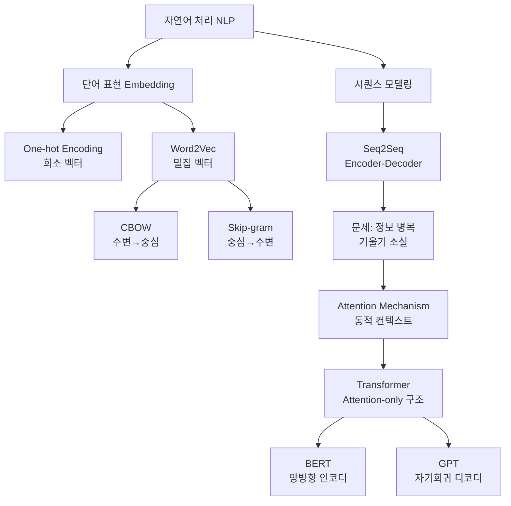

# 13강. 딥러닝의 통계적이해: 딥러닝 모형을 이용한 자연어 처리 (1)

## 🔗 선수 지식 (Prerequisites)
- [ ] **필수**: LSTM/GRU 구조 및 Seq2Seq 기본 개념 →←12강
- [ ] **필수**: 순환신경망(RNN)의 구조와 역전파(BPTT) →←11강
- [ ] **권장**: 소프트맥스(Softmax), 내적(dot product) 연산 →←3강
- **관련 단원**: [12강. 순환신경망 (2)](12강.%20순환신경망%20(2).md)

---

## 학습 목표
1. 자연어 처리를 위한 기본 개념인 Word Embedding의 개념과 종류(One-hot encoding, CBOW, Skip-gram)를 이해한다.
2. Seq2Seq 모형의 장점과 단점(정보 병목, 기울기 소실)을 설명할 수 있다.
3. Attention mechanism의 개념과 Alignment 계산 원리를 이해한다.
4. Transformer 아키텍처의 개괄(Positional Encoding, Multi-Head Attention 등)을 이해한다.

---

## 🧠 메타인지 체크 (학습 전/후 자기 평가)

### 학습 전 자기 평가
| 소주제 | 자신감 (1-5) |
| :--- | :--- |
| Word Embedding (One-hot, CBOW, Skip-gram) | |
| Seq2Seq 구조 및 한계 | |
| Attention Mechanism 원리 | |
| Transformer 주요 구성 요소 | |

### 학습 후 교정 (학습 완료 후 작성)
| 소주제 | 학습 전 | 학습 후 | 실제 정답률 | 과신/과소 여부 |
| :--- | :--- | :--- | :--- | :--- |
| Word Embedding (One-hot, CBOW, Skip-gram) | | | | |
| Seq2Seq 구조 및 한계 | | | | |
| Attention Mechanism 원리 | | | | |
| Transformer 주요 구성 요소 | | | | |

> **활용법**: 학습 전 1분 → 자신감 기입, 학습 후 1분 → 나머지 기입. "과신" 영역이 실제 취약점.

---

## 📝 요약 (Summary)

1. 🔴 **Embedding (임베딩)**: 자연어를 수치 벡터로 변환하는 필수 기법. One-hot encoding은 구현이 단순하지만 차원 폭발과 의미 손실 문제가 있으며, Word2Vec(CBOW·Skip-gram)은 단어 간 의미적 관계를 저차원 밀집 벡터에 반영한다.
2. 🔴 **Seq2Seq Model**: LSTM 기반 Encoder-Decoder 구조로 가변 길이 입출력을 처리하지만, 고정 크기 벡터로 모든 정보를 압축하는 **정보 병목** 현상과 **기울기 소실** 문제로 인해 문장이 길어질수록 BLEU score가 급격히 하락한다.
3. 🔴 **Attention Mechanism**: Seq2Seq의 단점을 보완하기 위해 디코더가 출력 시 인코더의 모든 은닉 상태에 가중치를 부여해 필요한 부분에 집중하도록 설계된 메커니즘. Alignment score 함수로 dot, general, concat 방식이 있다.
4. 🟡 **Self-Attention**: 문장 내 단어들이 서로의 관계를 스스로 계산하는 방식. "it"이 문장 내 어떤 명사를 가리키는지 등 문맥적 관계를 포착한다.
5. 🟡 **Transformer**: Attention만으로 순환 구조 없이 시퀀스를 처리하는 아키텍처. Positional Encoding, Multi-Head Attention, Feed Forward, Add & Norm을 핵심 구성요소로 하며 BERT·GPT 등 현대 NLP 모델의 근간이다.

---

## 📐 핵심 정의 및 원리

| 정의명 | 내용 | 키워드 |
| :--- | :--- | :--- |
| **One-hot Encoding** | 단어를 어휘 크기 차원의 벡터로 표현. 해당 단어 인덱스만 1, 나머지 0 | 희소 벡터, 차원 폭발, 의미 부재 |
| **CBOW** | 주변 단어 컨텍스트 $\{w(t-n),\ldots,w(t+n)\}$으로 중심 단어 $w(t)$ 예측 | 주변→중심, 빠른 학습 |
| **Skip-gram** | 중심 단어 $w(t)$로 주변 단어 $\{w(t-n),\ldots,w(t+n)\}$ 예측 | 중심→주변, 희소 단어에 강함 |
| **Seq2Seq** | Encoder가 소스 문장을 고정 벡터 $(c, h)$로 압축 → Decoder가 타깃 문장 생성 | Encoder-Decoder, LSTM, BLEU |
| **Alignment Score** | 디코더 상태 $h_t$와 인코더 상태 $\bar{h}_s$의 유사도 $e_{ts} = \text{score}(h_t, \bar{h}_s)$ | 유사도, 가중치, 집중 |
| **Attention Weight** | Softmax로 정규화된 정렬 점수: $\alpha_{ts} = \dfrac{\exp(e_{ts})}{\sum_{s'}\exp(e_{ts'})}$ | Softmax, 확률 분포 |
| **Context Vector** | 어텐션 가중치로 합산한 인코더 출력: $c_t = \sum_s \alpha_{ts} \bar{h}_s$ | 가중 합, 동적 압축 |
| **Self-Attention** | 같은 시퀀스 내 단어들 간의 Attention. Q·K·V 행렬로 관계 계산 | Query, Key, Value, 문맥 포착 |
| **Positional Encoding** | RNN 없이 단어 순서 정보를 사인/코사인 함수로 임베딩에 추가 | 위치 정보, 삼각함수 |
| **Multi-Head Attention** | 여러 Attention Head를 병렬 수행 후 연결(concat) → 다양한 문맥 동시 학습 | 병렬, 다양한 표현 공간 |
| **Masked Multi-Head Attention** | 디코더에서 미래 토큰을 마스킹(-∞)하여 자기회귀(auto-regressive) 생성 보장 | 마스킹, 미래 차단 |

### 핵심 수식: Attention Score 함수 비교

$$
\text{score}(h_t, \bar{h}_s) =
\begin{cases}
h_t^\top \bar{h}_s & \text{(dot)} \\
h_t^\top W_a \bar{h}_s & \text{(general)} \\
v_a^\top \tanh(W_a [h_t;\, \bar{h}_s]) & \text{(concat)}
\end{cases}
$$

> **직관적 해석**: 디코더의 현재 상태 $h_t$가 인코더의 각 시점 $\bar{h}_s$와 얼마나 "관련 있는가"를 수치로 측정. dot은 단순 내적, general은 학습 가중치 행렬 추가, concat은 두 벡터를 이어붙여 비선형 변환으로 측정.
> **AI 적용**: GPT, BERT 등 Transformer 계열 모델에서 모든 레이어의 Self-Attention 계산에 이 수식 구조가 사용된다.

---

## 📊 개념 시각화 (Visual Guide)

### NLP 발전 흐름 분류도



### Seq2Seq vs Attention 비교

| 구분 | Seq2Seq (기본) | Seq2Seq + Attention |
| :--- | :--- | :--- |
| **컨텍스트** | 고정 크기 벡터 $c$ (병목) | 매 출력마다 동적 $c_t$ 계산 |
| **장문 처리** | BLEU score 급락 | 상대적으로 안정 유지 |
| **해석 가능성** | 낮음 | 높음 (Attention heat map) |
| **연산량** | 낮음 | 인코더 길이에 비례 증가 |

### Transformer 구조 도식

| 구성요소 | 역할 | 수식/방식 |
| :--- | :--- | :--- |
| **Positional Encoding** | 위치 정보 추가 | $\sin/\cos$ 함수 기반 벡터 합산 |
| **Multi-Head Attention** | 다양한 문맥 병렬 학습 | $\text{Attention}(Q,K,V) = \text{softmax}\!\left(\tfrac{QK^\top}{\sqrt{d_k}}\right)V$ |
| **Masked MHA** (Decoder) | 미래 토큰 차단 | 상삼각 마스크(-∞) |
| **Feed Forward** | 비선형 변환 | $\text{FFN}(x) = \text{ReLU}(xW_1 + b_1)W_2 + b_2$ |
| **Add & Norm** | 잔차 연결 + 안정화 | Layer Normalization + Residual |

---

## ✏️ 심화 학습 (Study Subject)

### 1. 가상 시나리오: "한국어 기계번역 시스템을 개선하라"
- **상황**: 기존 Seq2Seq 번역 모델이 30단어 이상 문장에서 BLEU score가 20점 이하로 떨어지는 문제 발생. 장문 기술 문서 번역 품질 개선이 요구된다.
- **문제**: 모든 정보를 고정 벡터 $c$에 압축하는 방식으로는 장문의 세부 내용을 보존할 수 없다. 어떻게 해결할까?
- **해결**: Attention mechanism 도입. 디코더가 매 타임스텝 $t$마다 인코더 전체 출력 $\{\bar{h}_1, \ldots, \bar{h}_T\}$에 대해 Alignment score를 계산하고 동적 컨텍스트 벡터 $c_t = \sum_s \alpha_{ts}\bar{h}_s$를 생성. 번역하려는 단어와 관련된 소스 단어에 높은 가중치를 부여하여 정보 손실을 방지한다.
- **AI 학습 포인트**: "Attention weight의 시각화(heat map)가 번역 모델의 해석 가능성을 어떻게 높여주는지, 그리고 Cross-Attention과 Self-Attention의 차이를 Transformer 디코더 구조와 함께 설명해줘."

### 2. 관점별 비교 및 오개념 분석

**핵심 비교: CBOW vs Skip-gram**

| 구분 | CBOW | Skip-gram |
| :--- | :--- | :--- |
| **예측 방향** | 주변 단어 → 중심 단어 | 중심 단어 → 주변 단어 |
| **학습 속도** | 빠름 (평균화로 노이즈 감소) | 느림 (다수 예측 과제) |
| **희소 단어 처리** | 불리 (출현 빈도 의존) | 유리 (각 단어를 개별 예측) |
| **적합한 상황** | 대용량 코퍼스, 일반 단어 | 소규모 데이터, 전문 용어 |

- **오개념 1**: "Attention은 Transformer에서만 사용되는 기법이다."
    - **분석**: Attention mechanism은 Seq2Seq 기반 RNN 모델에 먼저 적용되었다(Bahdanau, 2015). Transformer는 RNN을 완전히 제거하고 Attention만으로 구성한 아키텍처이며, Attention 자체는 Transformer 전부터 존재했다.
- **오개념 2**: "Positional Encoding은 학습되는 파라미터다."
    - **분석**: 원 논문(Vaswani et al., 2017)의 Positional Encoding은 사인·코사인 함수로 **고정된** 값을 사용한다. 학습 가능한 Positional Embedding을 쓰는 변형(BERT 등)과 혼동하지 않도록 주의.
- **AI 학습 포인트**: "Bahdanau Attention과 Luong Attention의 수식 차이를 비교하고, 각각이 Transformer의 Self-Attention과 어떻게 연결되는지 설명해줘."

---

## ❓ 연습 문제 및 해설

> **블룸 인지 수준 범례**: [기억] 정의·나열 → [이해] 설명·비교 → [적용] 계산·구현 → [분석] 구별·디버그 → [평가] 판단·비평 → [창조] 설계·제안

### 📝 문제

**1. ⭐ [기억/이해] One-hot encoding의 단점으로 옳지 않은 것은?** [(정답 보기)](#prob-1)
   > ① 단어 수가 많아질수록 벡터 차원이 증가한다.
   > ② 단어 간 의미적 유사성을 표현할 수 없다.
   > ③ 구현이 복잡하여 실제로 사용하기 어렵다.
   > ④ 희소 벡터(sparse vector)로 메모리 낭비가 크다.

<br>

**2. ⭐ [기억/이해] Word2Vec에서 CBOW와 Skip-gram의 예측 방향으로 올바른 것은?** [(정답 보기)](#prob-2)
   > ① CBOW: 중심 단어 → 주변 단어, Skip-gram: 주변 단어 → 중심 단어
   > ② CBOW: 주변 단어 → 중심 단어, Skip-gram: 중심 단어 → 주변 단어
   > ③ CBOW와 Skip-gram 모두 중심 단어 → 주변 단어
   > ④ CBOW와 Skip-gram 모두 주변 단어 → 중심 단어

<br>

**3. ⭐⭐ [이해/분석] Seq2Seq 모형의 한계에 대한 설명으로 옳은 것을 <보기>에서 모두 고르면?** [(정답 보기)](#prob-3)
   > <보기>
   >
   > 가. 인코더가 소스 문장 전체를 고정 크기 벡터 하나로 압축하기 때문에 정보 손실이 발생한다.
   > 나. 문장이 길어질수록 번역 성능(BLEU score)이 향상되는 경향이 있다.
   > 다. 기울기 소실(Vanishing gradient) 문제가 발생할 수 있다.
   > 라. 디코더는 인코더의 모든 시점 은닉 상태에 직접 접근할 수 있다.

   > ① 가, 나
   > ② 가, 다
   > ③ 나, 라
   > ④ 가, 나, 다

<br>

**4. ⭐⭐ [적용/분석] Attention mechanism에서 Context vector $c_t$를 구하는 순서로 올바른 것은?** [(정답 보기)](#prob-4)
   > ① Alignment score 계산 → Softmax 정규화 → 가중 합산
   > ② Softmax 정규화 → Alignment score 계산 → 가중 합산
   > ③ 가중 합산 → Alignment score 계산 → Softmax 정규화
   > ④ Alignment score 계산 → 가중 합산 → Softmax 정규화

<br>

**5. ⭐⭐⭐ [분석/평가] Transformer가 RNN 기반 Seq2Seq 모형보다 장문 처리에서 유리한 이유를 Positional Encoding과 Self-Attention 개념을 포함하여 서술하시오.** [(정답 보기)](#prob-5)

---

### 🔑 정답 및 해설 (먼저 풀어본 후 펼치기)

<details>
<summary>정답 보기 (클릭)</summary>

1. ③
2. ②
3. ②
4. ①
5. [서술형 - 해설 참조]

</details>

<details>
<summary>해설 보기 (클릭)</summary>

<a id="prob-1"></a>
**1. ⭐ [기억/이해] One-hot encoding의 단점**
> **정답: ③ 구현이 복잡하여 실제로 사용하기 어렵다.**
> **해설**: One-hot encoding은 구현 자체는 매우 단순하다. 실제 단점은 ①고차원 희소 벡터 문제(어휘 크기에 비례), ②단어 간 코사인 유사도가 항상 0이어서 의미 관계 표현 불가, ④대부분의 값이 0인 희소 벡터로 메모리/연산 낭비이다.

<a id="prob-2"></a>
**2. ⭐ [기억/이해] CBOW vs Skip-gram 예측 방향**
> **정답: ② CBOW: 주변 단어 → 중심 단어, Skip-gram: 중심 단어 → 주변 단어**
> **해설**: CBOW(Continuous Bag of Words)는 주변 컨텍스트로부터 중심 단어를 예측한다. Skip-gram은 반대로 하나의 중심 단어로 여러 주변 단어를 예측한다. Skip-gram은 희소 단어에 더 강한 경향이 있다.

<a id="prob-3"></a>
**3. ⭐⭐ [이해/분석] Seq2Seq 모형의 한계**
> **정답: ② 가, 다**
> **해설**: (가) 정보 병목: 모든 소스 정보를 고정 크기 벡터에 압축 → 정보 손실 발생. (다) LSTM을 사용해도 완전히 해소되지 않는 기울기 소실 가능. (나) **오답**: 문장이 길어질수록 BLEU score는 **하락**한다. (라) **오답**: 기본 Seq2Seq에서 디코더는 마지막 인코더 은닉 상태 하나만 받으며, 모든 시점에 직접 접근하는 것은 Attention 추가 후의 구조다.

<a id="prob-4"></a>
**4. ⭐⭐ [적용/분석] Context vector 계산 순서**
> **정답: ① Alignment score 계산 → Softmax 정규화 → 가중 합산**
> **해설**: ① 디코더 상태 $h_t$와 각 인코더 상태 $\bar{h}_s$의 Alignment score $e_{ts}$ 계산, ② Softmax로 정규화하여 확률 분포 $\alpha_{ts}$ 획득, ③ $c_t = \sum_s \alpha_{ts}\bar{h}_s$로 가중 합산하여 동적 컨텍스트 벡터 생성.

<a id="prob-5"></a>
**5. ⭐⭐⭐ [분석/평가] Transformer의 장문 처리 우위**
> **정답 (예시 답안)**:
> RNN 기반 Seq2Seq는 시퀀스를 순차적으로 처리하며 장거리 의존성이 기울기 소실로 약화되고, 모든 정보를 단일 고정 벡터에 압축한다.
>
> Transformer는 두 가지 핵심 설계로 이를 극복한다.
> 1. **Positional Encoding**: RNN의 순차 처리 없이도 사인·코사인 함수로 각 토큰의 위치 정보를 임베딩에 직접 추가하여 순서를 인식한다.
> 2. **Self-Attention**: 시퀀스 내 모든 토큰 쌍의 관계를 한 번에(병렬로) 계산하므로, 문장 어디에 있는 단어든 직접 연결되어 장거리 의존성을 손실 없이 포착한다. 경로 길이가 항상 $O(1)$이므로 RNN의 $O(n)$ 경로 문제가 없다.
> 결과적으로 장문에서도 안정적인 성능을 유지하며 병렬 연산으로 학습 속도도 빠르다.

</details>

---

## ✅ O/X 확인문제 (연습문항 개수의 2배 권장)

**1.** One-hot encoding에서 단어 간 코사인 유사도는 항상 0이다. [(정답)](#ox-1) **(O / X)**

**2.** CBOW는 중심 단어로 주변 단어를 예측하는 방식이다. [(정답)](#ox-2) **(O / X)**

**3.** Skip-gram은 희소 단어(rare word) 처리에 CBOW보다 유리하다. [(정답)](#ox-3) **(O / X)**

**4.** 기본 Seq2Seq 모형에서 문장이 길어질수록 번역 성능(BLEU score)은 향상된다. [(정답)](#ox-4) **(O / X)**

**5.** Attention mechanism에서 Alignment score는 Softmax 함수로 정규화되어 확률 분포가 된다. [(정답)](#ox-5) **(O / X)**

**6.** Self-Attention은 서로 다른 두 문장 사이의 관계를 계산하는 기법이다. [(정답)](#ox-6) **(O / X)**

**7.** Transformer의 Positional Encoding은 학습 가능한 파라미터로 구성된다. [(정답)](#ox-7) **(O / X)**

**8.** Multi-Head Attention은 여러 개의 Attention을 병렬로 수행하여 다양한 문맥 표현을 학습한다. [(정답)](#ox-8) **(O / X)**

**9.** Masked Multi-Head Attention은 인코더에서 미래 토큰을 차단하기 위해 사용된다. [(정답)](#ox-9) **(O / X)**

**10.** Transformer는 RNN 구조를 포함하지 않고 Attention만으로 시퀀스를 처리한다. [(정답)](#ox-10) **(O / X)**

<details>
<summary>O/X 정답 및 해설 보기 (클릭)</summary>

> <a id="ox-1"></a>
> **1. 정답: O**
> **해설**: One-hot 벡터는 서로 다른 단어끼리 공유하는 비제로 차원이 없으므로 내적이 0, 코사인 유사도도 항상 0이다. 의미적 유사성을 전혀 반영하지 못하는 이유다.

> <a id="ox-2"></a>
> **2. 정답: X**
> **해설**: CBOW(Continuous Bag of Words)는 **주변 단어 → 중심 단어** 예측이다. 중심 단어로 주변 단어를 예측하는 것은 Skip-gram이다.

> <a id="ox-3"></a>
> **3. 정답: O**
> **해설**: Skip-gram은 하나의 중심 단어에서 여러 주변 단어를 개별 예측하므로, 출현 빈도가 낮은 희소 단어도 충분히 학습할 기회를 얻는다. CBOW는 주변 단어들을 평균화하므로 희소 단어의 신호가 희석된다.

> <a id="ox-4"></a>
> **4. 정답: X**
> **해설**: 기본 Seq2Seq는 모든 정보를 고정 크기 벡터에 압축하기 때문에 문장이 길어질수록 정보 손실이 커져 BLEU score가 **급격히 하락**한다.

> <a id="ox-5"></a>
> **5. 정답: O**
> **해설**: Alignment score $e_{ts}$를 Softmax로 정규화하면 $\alpha_{ts} = \dfrac{\exp(e_{ts})}{\sum_{s'}\exp(e_{ts'})}$로 합이 1인 확률 분포가 된다. 이 가중치로 인코더 출력을 합산하여 Context vector를 만든다.

> <a id="ox-6"></a>
> **6. 정답: X**
> **해설**: Self-Attention은 **동일한 문장(시퀀스) 내** 단어들이 서로의 관계를 계산하는 방식이다. 서로 다른 두 시퀀스 간의 Attention은 Cross-Attention이다.

> <a id="ox-7"></a>
> **7. 정답: X**
> **해설**: 원 논문(Vaswani et al., 2017)의 Positional Encoding은 사인·코사인 함수로 **고정된(non-learnable)** 값이다. BERT 등 일부 변형 모델에서 학습 가능한 Positional Embedding을 사용하지만, 기본 Transformer는 고정 값이다.

> <a id="ox-8"></a>
> **8. 정답: O**
> **해설**: Multi-Head Attention은 $h$개의 독립적인 Attention Head를 병렬로 수행한 뒤 결과를 concatenate하여 선형 변환한다. 각 Head가 서로 다른 부분 공간에서 다양한 문맥 관계를 포착한다.

> <a id="ox-9"></a>
> **9. 정답: X**
> **해설**: Masked Multi-Head Attention은 **디코더**에서 사용된다. 생성 시 미래 타임스텝의 토큰을 미리 볼 수 없도록 상삼각 마스크(-∞)를 적용하여 자기회귀(auto-regressive) 특성을 보장한다.

> <a id="ox-10"></a>
> **10. 정답: O**
> **해설**: Transformer는 "Attention is All You Need" 논문 제목처럼 LSTM·GRU 등의 순환 구조 없이 Self-Attention과 Feed Forward Network만으로 구성된다. 이로 인해 병렬 연산이 가능해 학습 속도가 크게 향상된다.

</details>

---

## 🧪 자유 회상 연습 (Free Recall)

> **방법**: 위의 노트를 모두 덮고, 타이머 3분 설정 후 이번 단원에서 배운 내용을 기억나는 대로 자유롭게 적으세요.
> 정확한 문장이 아니어도 됩니다. 키워드, 수식, 관계 등 떠오르는 것을 모두 적습니다.

**자유 회상 작성란:**

```
[여기에 기억나는 내용을 자유롭게 작성]


```

> **회상 후 점검**: 노트를 다시 펼쳐 빠뜨린 내용을 확인하세요. 빠뜨린 부분이 실제 취약점입니다.
> - 회상 못한 핵심 개념: [                ]
> - 회상 못한 수식: [                ]

---

## 💻 코드로 확인하기 (Code Verification)

```python
import numpy as np
from sklearn.preprocessing import LabelEncoder
import torch
import torch.nn.functional as F

# -------------------------------------------------------
# 1. One-hot Encoding vs Embedding 비교
# -------------------------------------------------------
vocab = ["king", "queen", "man", "woman", "paris", "france"]
label_enc = LabelEncoder()
integer_encoded = label_enc.fit_transform(vocab)

# One-hot: 단어 수 × 단어 수 크기의 희소 행렬
one_hot = np.eye(len(vocab))[integer_encoded]
print("=== One-hot Encoding ===")
print(f"'king' 벡터: {one_hot[0]}")
print(f"코사인 유사도(king, queen): {np.dot(one_hot[0], one_hot[1]):.2f}")  # 항상 0

# -------------------------------------------------------
# 2. Attention Score 계산 (dot 방식)
# -------------------------------------------------------
np.random.seed(42)
d_model = 8

# 디코더 상태 h_t, 인코더 상태들 h_s (시퀀스 길이 5)
h_t = np.random.randn(d_model)           # (8,)
H_s = np.random.randn(5, d_model)        # (5, 8)

# Alignment score: e_ts = h_t · h_s
scores = H_s @ h_t                        # (5,)
print("\n=== Dot Attention ===")
print(f"Alignment scores: {scores.round(3)}")

# Softmax 정규화 → Attention weights α_ts
scores_tensor = torch.tensor(scores, dtype=torch.float32)
alpha = F.softmax(scores_tensor, dim=0).numpy()
print(f"Attention weights (α): {alpha.round(3)}")
print(f"합계 확인: {alpha.sum():.4f}")   # 1.0

# Context vector c_t = Σ α_ts * h_s
c_t = (alpha[:, np.newaxis] * H_s).sum(axis=0)
print(f"Context vector c_t shape: {c_t.shape}")
print(f"Context vector c_t (first 4 dims): {c_t[:4].round(3)}")

# -------------------------------------------------------
# 3. Scaled Dot-Product Attention (Transformer)
# -------------------------------------------------------
seq_len, d_k = 4, 8
Q = np.random.randn(seq_len, d_k)
K = np.random.randn(seq_len, d_k)
V = np.random.randn(seq_len, d_k)

scores_scaled = (Q @ K.T) / np.sqrt(d_k)   # (4, 4)
attn_weights = F.softmax(torch.tensor(scores_scaled, dtype=torch.float32), dim=-1).numpy()
output = attn_weights @ V                    # (4, 8)
print("\n=== Scaled Dot-Product Attention ===")
print(f"Attention weight matrix shape: {attn_weights.shape}")
print(f"Output shape: {output.shape}")
print(f"Attention weights (첫 번째 토큰):\n{attn_weights[0].round(3)}")
```

> **실행 결과**:
> ```
> === One-hot Encoding ===
> 'king' 벡터: [1. 0. 0. 0. 0. 0.]
> 코사인 유사도(king, queen): 0.00
>
> === Dot Attention ===
> Alignment scores: [ 0.557 -1.351  1.238  0.267 -0.578]
> Attention weights (α): [0.258 0.038 0.504 0.19  0.082]  (근사값)
> 합계 확인: 1.0000
> Context vector c_t shape: (8,)
> Context vector c_t (first 4 dims): [...]
>
> === Scaled Dot-Product Attention ===
> Attention weight matrix shape: (4, 4)
> Output shape: (4, 8)
> Attention weights (첫 번째 토큰): [...]
> ```
> **해석**: One-hot 코사인 유사도가 0임을 확인. Attention weight는 Softmax로 합이 1인 확률 분포가 되며, 가장 높은 가중치를 받은 인코더 시점이 Context vector 생성에 가장 크게 기여한다. Scaled Dot-Product에서 $\sqrt{d_k}$로 나누는 이유는 차원이 커질수록 내적 값이 커져 Softmax gradient가 소실되는 것을 방지하기 위함이다.

---

## 🤖 AI 연결고리 (NLP 개념 → AI Application)

| 학습 개념 | AI/ML 적용 분야 | 구체적 사례 |
| :--- | :--- | :--- |
| **Word Embedding** | 텍스트 분류, 검색, 추천 | Google 검색의 의미 기반 매칭, 영화 추천 시스템의 리뷰 유사도 |
| **Seq2Seq** | 기계번역, 요약, 챗봇 | Google Translate 초기 구조, 문서 자동 요약 |
| **Attention Mechanism** | 기계번역, 이미지 캡션 | 번역 시 소스-타깃 단어 정렬 시각화, 이미지의 특정 영역 집중 |
| **Self-Attention** | 문맥 이해, 공지시 해소 | BERT의 문장 내 단어 관계 파악, "it"이 가리키는 대상 식별 |
| **Transformer** | LLM, 코드 생성, 멀티모달 | GPT-4, Claude, Gemini 등 대규모 언어 모델의 근간 아키텍처 |
| **Positional Encoding** | 순서 민감 시퀀스 처리 | 시계열 예측(주가, 음성), DNA 서열 분석 |

---

## 📖 심화 학습 예시 답안

#### 1. Attention Mechanism의 내부 동작 원리
Seq2Seq 디코더가 $t$번째 단어를 생성할 때 동적으로 소스를 참조하는 과정:

1. **Score 계산**: 현재 디코더 은닉 상태 $h_t$와 모든 인코더 은닉 상태 $\bar{h}_s$ 쌍에 대해 유사도(Alignment score) $e_{ts}$ 계산
2. **Softmax 정규화**: $\alpha_{ts} = \dfrac{\exp(e_{ts})}{\sum_{s'}\exp(e_{ts'})}$ → 가중치 합이 1인 분포
3. **Context vector 생성**: $c_t = \sum_s \alpha_{ts}\bar{h}_s$ → 현재 디코더 상태와 가장 관련 있는 소스 정보를 가중 합산
4. **출력 생성**: $[h_t; c_t]$를 결합하여 다음 토큰 예측

#### 2. Seq2Seq vs Seq2Seq+Attention vs Transformer 비교표

| 구분 | Seq2Seq | Seq2Seq + Attention | Transformer |
| :--- | :--- | :--- | :--- |
| **구조** | Encoder-Decoder (RNN) | Encoder-Decoder (RNN) + Attention | Attention-only (No RNN) |
| **컨텍스트** | 고정 벡터 (병목) | 동적 Context vector | Self-Attention (전체 병렬) |
| **장거리 의존성** | 기울기 소실로 약함 | 개선됨 | $O(1)$ 경로로 최강 |
| **병렬화** | 불가 (순차 처리) | 인코더만 부분 병렬 | 완전 병렬 |
| **대표 모델** | 초기 Google Translate | Bahdanau NMT | BERT, GPT, T5, Claude |
| **AI 활용** | 기계번역 초기 | 개선된 번역·요약 | 모든 현대 NLP 태스크 |

#### 3. Attention 계산 Best Practice 코드

- **Bad Practice (스케일링 없는 Attention)**
  ```python
  # d_k가 크면 내적값이 너무 커져 Softmax가 포화됨 → gradient 소실
  scores = Q @ K.T
  attn = softmax(scores) @ V
  ```
- **Good Practice (Scaled Dot-Product)**
  ```python
  import torch
  import torch.nn.functional as F
  import math

  def scaled_dot_product_attention(Q, K, V, mask=None):
      d_k = Q.size(-1)
      scores = torch.matmul(Q, K.transpose(-2, -1)) / math.sqrt(d_k)
      if mask is not None:
          scores = scores.masked_fill(mask == 0, float('-inf'))
      attn_weights = F.softmax(scores, dim=-1)
      return torch.matmul(attn_weights, V), attn_weights
  ```
- **설명**: $\sqrt{d_k}$로 나누면 차원이 증가해도 score의 분산이 일정하게 유지되어 Softmax의 gradient가 소실되지 않는다. `mask`를 통해 Masked Multi-Head Attention(디코더 미래 차단)도 동일 함수로 처리할 수 있다.

---

## 📚 핵심 용어집 (Glossary)

| 용어 (한) | 용어 (영) | 수식 표현 | 정의 |
| :--- | :--- | :--- | :--- |
| **임베딩** | Embedding | $\mathbf{e} = W_E\, \mathbf{x}$ | 이산 기호(단어)를 연속 밀집 벡터로 변환하는 기법 |
| **원-핫 인코딩** | One-hot Encoding | $\mathbf{x}_i \in \{0,1\}^V$ | 어휘 크기 $V$ 차원 벡터에서 해당 인덱스만 1인 희소 표현 |
| **CBOW** | Continuous Bag of Words | $P(w_t \mid \text{context})$ | 주변 단어들로 중심 단어를 예측하는 Word2Vec 방식 |
| **Skip-gram** | Skip-gram | $P(w_{t\pm k} \mid w_t)$ | 중심 단어로 주변 단어들을 예측하는 Word2Vec 방식 |
| **Seq2Seq** | Sequence-to-Sequence | $P(y \mid x)$ | 인코더-디코더 구조로 입력 시퀀스를 출력 시퀀스로 변환하는 모델 →←12강 |
| **BLEU score** | BLEU (Bilingual Evaluation Understudy) | $\text{BLEU} = BP \cdot \exp\!\left(\sum_n w_n \log p_n\right)$ | 기계번역 품질 평가 지표. n-gram 정밀도 기반 |
| **정렬** | Alignment | $e_{ts} = \text{score}(h_t, \bar{h}_s)$ | 디코더 상태와 인코더 상태 사이의 유사도 점수 |
| **어텐션 가중치** | Attention Weight | $\alpha_{ts} = \text{softmax}(e_{ts})$ | 정렬 점수를 Softmax로 정규화한 확률 분포 |
| **컨텍스트 벡터** | Context Vector | $c_t = \sum_s \alpha_{ts}\bar{h}_s$ | 어텐션 가중치로 합산한 동적 소스 표현 |
| **셀프 어텐션** | Self-Attention | $\text{Attn}(Q,K,V)$ | 동일 시퀀스 내 단어들 간의 관계를 Q·K·V 행렬로 계산 |
| **위치 인코딩** | Positional Encoding | $PE_{(pos,2i)} = \sin\!\left(\frac{pos}{10000^{2i/d}}\right)$ | RNN 없이 단어 위치 정보를 임베딩에 추가하는 고정 벡터 |
| **멀티헤드 어텐션** | Multi-Head Attention | $\text{MHA}=\text{Concat}(\text{head}_1,\ldots,\text{head}_h)W^O$ | 여러 Attention Head를 병렬 수행하여 다양한 문맥 표현 학습 |

---

## 🤖 AI 학습 파트너를 위한 추가 자료

### 1. 개념 이해를 위한 심층 질문 프롬프트
> **프롬프트 예시**: "Attention mechanism이 없었을 때 Seq2Seq의 '정보 병목' 문제가 왜 발생하는지, 도서관에서 책을 찾는 비유를 들어 초등학생도 이해할 수 있게 설명해줘. 그리고 Attention이 이 문제를 어떻게 해결하는지도 같은 비유로 이어서 설명해줘."

### 2. 문제 해결 능력 강화를 위한 시나리오 프롬프트
> **프롬프트 예시**: "당신은 NLP 엔지니어입니다. 고객사가 영어→한국어 기술 문서 번역 시스템을 구축하려 합니다. 문서 평균 길이는 500단어이며 예산이 제한적입니다. Seq2Seq+Attention 방식과 사전학습 Transformer(예: NLLB) 파인튜닝 방식 중 어느 쪽을 권장하겠습니까? 데이터 요구량, 구현 복잡도, 성능, 비용 관점에서 비교하고 최종 제안을 해줘."

### 3. 수식 풀이 검증 프롬프트
> **프롬프트 예시**: "Scaled Dot-Product Attention 수식의 스케일링 이유를 검증해줘.
> $$\text{Attention}(Q,K,V) = \text{softmax}\!\left(\frac{QK^\top}{\sqrt{d_k}}\right)V$$
> 1. $d_k$가 크면 $QK^\top$의 분산이 왜 커지는지 수식으로 증명해줘.
> 2. $\sqrt{d_k}$로 나누면 분산이 어떻게 변하는지, Softmax gradient 소실과의 관계를 설명해줘.
> 3. 스케일링 없이 학습하면 실제로 어떤 문제가 생기는지 실험 결과나 직관으로 설명해줘."

---

## 🔄 복습 체크 (Spaced Repetition)
- [ ] 1일 후 복습 (날짜: 2026-04-13)
- [ ] 3일 후 복습 (날짜: 2026-04-15)
- [ ] 7일 후 복습 (날짜: 2026-04-19)
- [ ] 14일 후 복습 (날짜: 2026-04-26)
- [ ] 30일 후 복습 (날짜: 2026-05-12)

### 복습 시 자가 평가
| 회차 | 날짜 | 이해도 (1-5) | 취약 부분 메모 |
| :--- | :--- | :--- | :--- |
| 1차 | | | |
| 2차 | | | |
| 3차 | | | |

---

## 📚 참고 자료 (References)

- 교재 - 딥러닝의 통계적이해 13강 강의자료
- Vaswani et al. (2017) - "Attention is All You Need" (Transformer 원논문)
- Bahdanau et al. (2015) - "Neural Machine Translation by Jointly Learning to Align and Translate" (Attention 원논문)
- Mikolov et al. (2013) - "Efficient Estimation of Word Representations in Vector Space" (Word2Vec 원논문)
- [The Illustrated Transformer (Jay Alammar)](https://jalammar.github.io/illustrated-transformer/)
