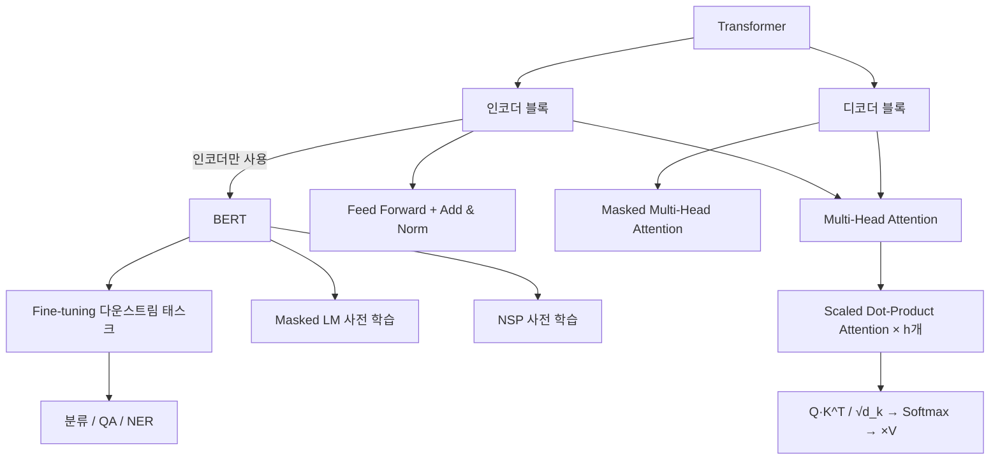
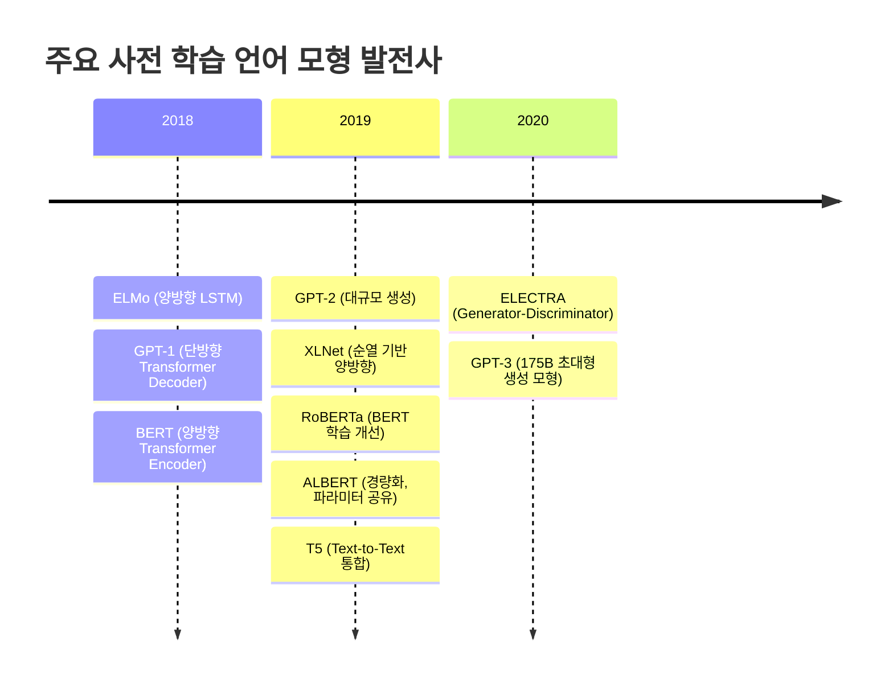

# 14강. 딥러닝의 통계적이해: 딥러닝 모형을 이용한 자연어 처리 (2)

## 🔗 선수 지식 (Prerequisites)
- [ ] **필수**: Attention Mechanism과 Alignment score 계산 원리 →←13강
- [ ] **필수**: Transformer 개괄 (Positional Encoding, Multi-Head Attention 기본 개념) →←13강
- [ ] **필수**: Seq2Seq Encoder-Decoder 구조 및 한계 →←13강
- [ ] **권장**: Softmax, 행렬 연산(Q·K·V) →←3강
- **관련 단원**: [13강. 딥러닝 모형을 이용한 자연어 처리 (1)](13강.%20딥러닝%20모형을%20이용한%20자연어%20처리%20(1).md)

---

## 학습 목표
1. Transformer의 Scaled Dot-Product Attention 수식과 Multi-Head Attention 구조를 이해한다.
2. BERT의 입력 표현, 사전 학습 기법(Masked LM, NSP), 미세 조정(Fine-tuning) 방식을 설명할 수 있다.
3. BERT 이후의 최신 자연어 처리 모형 트렌드(경량화 vs 성능 극대화)를 이해한다.

---

## 🧠 메타인지 체크 (학습 전/후 자기 평가)

### 학습 전 자기 평가
| 소주제 | 자신감 (1-5) |
| :--- | :--- |
| Scaled Dot-Product Attention 수식과 의미 | |
| Multi-Head Attention 구조 | |
| BERT 입력 표현 (Token/Segment/Position Embeddings) | |
| BERT 사전 학습 기법 (MLM, NSP) | |
| BERT 이후 모형 트렌드 | |

### 학습 후 교정 (학습 완료 후 작성)
| 소주제 | 학습 전 | 학습 후 | 실제 정답률 | 과신/과소 여부 |
| :--- | :--- | :--- | :--- | :--- |
| Scaled Dot-Product Attention 수식과 의미 | | | | |
| Multi-Head Attention 구조 | | | | |
| BERT 입력 표현 (Token/Segment/Position Embeddings) | | | | |
| BERT 사전 학습 기법 (MLM, NSP) | | | | |
| BERT 이후 모형 트렌드 | | | | |

> **활용법**: 학습 전 1분 → 자신감 기입, 학습 후 1분 → 나머지 기입. "과신" 영역이 실제 취약점.

---

## 📝 요약 (Summary)

1. 🔴 **Transformer (Scaled Dot-Product Attention)**: Query(Q), Key(K), Value(V)를 이용해 $Attention(Q,K,V) = softmax\!\left(\frac{QK^T}{\sqrt{d_k}}\right)V$를 계산한다. $\sqrt{d_k}$로 나누는 스케일링은 내적값이 너무 커져 softmax 기울기가 소실되는 현상을 방지한다.
2. 🔴 **Multi-Head Attention**: 동일한 Q, K, V를 $h$개의 서로 다른 선형 변환(Linear 레이어)으로 투영하여 병렬로 어텐션을 수행한 뒤 결합(Concat)한다. 단일 어텐션보다 다양한 표현 부분 공간(representation subspace)을 동시에 포착한다.
3. 🔴 **BERT (Bidirectional Encoder Representation from Transformer)**: Transformer의 인코더 블록만 사용한 양방향 사전 학습 모형. Masked LM(MLM)으로 완전 양방향 문맥을 학습하고, Next Sentence Prediction(NSP)으로 문장 간 관계를 학습한다.
4. 🟡 **BERT 입력 표현**: Token Embedding + Segment Embedding($E_A, E_B$) + Position Embedding의 합으로 구성. `[CLS]`는 분류 태스크에, `[SEP]`는 문장 구분에 사용되는 특수 토큰이다.
5. 🟡 **BERT 이후 트렌드**: BERT를 기점으로 **경량화** 방향(ALBERT, ELECTRA)과 **성능 극대화** 방향(RoBERTa, XLNet, T5, GPT-3)의 두 축으로 발전하고 있다. RoBERTa(2019)는 NSP를 제거하고 더 많은 데이터·배치·스텝으로 학습하여 BERT를 능가했으며, NSP 태스크가 실제로 도움이 안 될 수 있음을 밝혔다.

---

## 📐 핵심 정의 및 원리

| 정의명 | 내용 | 키워드 |
| :--- | :--- | :--- |
| **Scaled Dot-Product Attention** | $Attention(Q,K,V)=softmax\!\left(\frac{QK^T}{\sqrt{d_k}}\right)V$. Q·K의 내적으로 유사도 계산 후 $\sqrt{d_k}$ 스케일링, Softmax 정규화, V의 가중합 | Q, K, V, $d_k$, 스케일링 |
| **Multi-Head Attention** | $MultiHead(Q,K,V)=Concat(head_1,\ldots,head_h)W^O$, $head_i=Attention(QW_i^Q, KW_i^K, VW_i^V)$ | 병렬 어텐션, 다중 표현 공간, Concat |
| **Positional Encoding** | 순환 구조 없이 순서 정보를 제공. 위치 $pos$, 차원 $i$: $PE_{(pos,2i)}=\sin\!\left(\frac{pos}{10000^{2i/d_{model}}}\right)$, $PE_{(pos,2i+1)}=\cos\!\left(\frac{pos}{10000^{2i/d_{model}}}\right)$ | 순서 정보, sin/cos, 병렬 처리 |
| **Transformer Encoder Block** | Multi-Head Attention → Add & LayerNorm → Feed Forward → Add & LayerNorm의 반복 구조 ($N$회). Residual connection으로 기울기 소실 방지 | Residual, LayerNorm, Feed Forward |
| **Masked LM (MLM)** | 입력 토큰의 **15%를 선택**한 뒤 그 중 80%는 `[MASK]`로 치환, 10%는 무작위 토큰으로 대체, 10%는 원문 유지 후 원래 토큰 예측. 양방향 문맥 활용 가능 (→← BERT 핵심) | `[MASK]`, 80/10/10 전략, 양방향, 사전 학습 |
| **Next Sentence Prediction (NSP)** | 두 문장 A, B가 입력될 때 B가 A의 다음 문장인지(IsNext) 아닌지(NotNext)를 `[CLS]` 벡터로 분류 | `[CLS]`, 문장 쌍, 이진 분류 |
| **Fine-tuning** | 사전 학습된 BERT 위에 태스크별 간단한 레이어를 추가하고 전체 파라미터를 소규모 레이블 데이터로 재학습 | 전이 학습, 레이블 효율성 |

### 핵심 수식 정리

**Scaled Dot-Product Attention**
$$
Attention(Q, K, V) = softmax\!\left(\frac{QK^T}{\sqrt{d_k}}\right)V
$$
> **직관적 해석**: Q(질문)와 K(키) 간의 유사도를 내적으로 계산하되, 차원 수 $d_k$가 클수록 내적값이 커지는 문제를 $\sqrt{d_k}$로 나눠 안정화한다. Softmax로 각 V(값)에 대한 가중치를 산출하고, 이를 V에 가중합하여 최종 어텐션 출력을 만든다.
> **AI 적용**: BERT·GPT 등 모든 Transformer 기반 모델의 Self-Attention 계산에 직접 사용됨. `[MASK]` 위치의 단어를 복원할 때 문장 내 모든 단어와의 관계를 이 공식으로 계산한다.

---

## 📊 개념 시각화 (Visual Guide)

### 개념 관계도



### BERT 입력 표현 구조

| 구성 요소 | 역할 | 예시 |
| :--- | :--- | :--- |
| **Token Embeddings** | 각 토큰의 의미 벡터. `[CLS]`(분류), `[SEP]`(문장 구분) 포함 | `[CLS]` My dog `[SEP]` is cute |
| **Segment Embeddings** | 어느 문장에 속하는지 구분 ($E_A$ / $E_B$) | 문장 A → $E_A$, 문장 B → $E_B$ |
| **Position Embeddings** | 토큰의 위치 정보 ($E_0, E_1, \ldots$) | 첫 번째 토큰 → $E_0$ |
| **최종 입력** | 세 임베딩의 합산 | $E_{token} + E_{segment} + E_{position}$ |

### BERT 모형 사양 비교

| 모형 종류 | 트랜스포머 블록 수 | 임베딩 차원 | Multi-Head 수 | 총 파라미터 |
| :--- | :---: | :---: | :---: | :---: |
| **BERT base** | 12 | 768 | 12 | 110M |
| **BERT large** | 24 | 1,024 | 16 | 340M |

### BERT 이후 주요 모형 연표



---

## ✏️ 심화 학습 (Study Subject)

### 1. 가상 시나리오: "BERT를 실제 서비스에 적용할 때 어떤 선택을 해야 할까?"
- **상황**: 모바일 앱에 실시간 감성 분석 기능을 탑재해야 한다. 서버 비용과 응답 시간이 제약 조건이다.
- **문제**: BERT large(340M)를 그대로 사용하면 추론이 너무 느리고 비용이 많이 든다. 어떤 전략을 택해야 할까?
- **해결**:
  1. **ALBERT** 사용: 파라미터 공유(cross-layer parameter sharing)와 임베딩 분해로 BERT base 대비 약 18배 파라미터 감소, 유사 성능 유지.
  2. **Fine-tuning 범위 조정**: 전체 파라미터 미세 조정 대신 상위 몇 개 레이어만 조정하는 방식으로 학습 비용 절감.
  3. **Knowledge Distillation**: 대형 모형(Teacher)의 소프트 예측값으로 소형 모형(Student)을 학습시켜 경량화.
- **AI 학습 포인트**: "ALBERT와 DistilBERT의 경량화 접근 방식이 다른데, 각각의 압축 원리와 성능 트레이드오프를 비교해 줘."

### 📌 심층 확장 — GPT vs BERT 근본 차이: 아키텍처에서 활용까지

#### A. GPT vs BERT 근본 차이 — 설계 철학부터 비교

GPT(Radford et al., 2018)와 BERT(Devlin et al., 2018)는 같은 Transformer를 기반으로 하되, 어텐션 방향과 사전 학습 목적이 근본적으로 다르다.

| 구분 | BERT | GPT 계열 |
| :--- | :--- | :--- |
| **기반 구조** | Transformer **인코더** 전용 | Transformer **디코더** 전용 |
| **어텐션 방향** | 양방향 (Bidirectional) — 좌·우 모두 참조 | 단방향/Causal — 왼쪽(과거)만 참조 |
| **사전 학습 목적** | MLM + NSP | Causal LM (다음 토큰 예측) |
| **마스킹 방식** | Masked Self-Attention 없음 (인코더) | Masked Self-Attention (미래 토큰 차단) |
| **강점** | 문장 이해, 분류, NER, QA | 텍스트 생성, 대화, 코드 생성 |
| **Fine-tuning** | 태스크별 출력 헤드 추가 | Prompt 기반 (GPT-2~) / Instruction-tuning (GPT-3~) |
| **대표 모형** | BERT-base/large, RoBERTa, ALBERT | GPT-1/2/3/4, LLaMA |

**GPT 세대별 진화:**

```
GPT-1 (117M, 2018) → 단방향 Transformer, 지도 Fine-tuning
GPT-2 (1.5B, 2019) → 대규모 데이터, Zero-shot 능력 발견
GPT-3 (175B, 2020) → Few-shot 학습: 예시 몇 개만으로 새 태스크 수행
InstructGPT (2022) → RLHF(인간 피드백 강화학습)로 지시 따르기 정렬
GPT-4 (2023)      → 멀티모달(텍스트+이미지) 입력, 더 강력한 추론
```

**RLHF(Reinforcement Learning from Human Feedback)**: InstructGPT(Ouyang et al., 2022)에서 도입. SFT(지도 파인튜닝) → Reward Model 학습(인간 선호도 학습) → PPO 강화학습의 3단계로 모델 응답을 인간 의도에 정렬시킨다. ChatGPT의 핵심 기술이다.

```python
# GPT 방식: Causal LM — Masked Self-Attention으로 미래 차단
import torch
import torch.nn as nn

seq_len = 5
# 상삼각 마스크: 미래 위치를 -inf로 마스킹
causal_mask = torch.triu(torch.ones(seq_len, seq_len), diagonal=1).bool()
print("Causal mask (True=마스킹):")
print(causal_mask)
# 출력:
# [[False, True,  True,  True,  True ],
#  [False, False, True,  True,  True ],
#  [False, False, False, True,  True ],
#  [False, False, False, False, True ],
#  [False, False, False, False, False]]

# BERT 방식: 마스크 없음 — 모든 위치 참조 가능
bert_mask = torch.zeros(seq_len, seq_len).bool()
print("\nBERT mask (모두 False = 마스킹 없음):")
print(bert_mask)
```

---

### 📌 심층 확장 — 토크나이저 종류 비교와 OOV 문제

#### B. BPE / WordPiece / SentencePiece 비교

토크나이저(Tokenizer)는 텍스트를 모델 입력 토큰으로 변환하는 전처리 단계이다. 단어 단위 토크나이저는 어휘 밖 단어(OOV, Out-Of-Vocabulary) 문제가 심각하므로, 현대 LLM은 모두 **서브워드(subword)** 방식을 사용한다.

| 구분 | BPE (Byte Pair Encoding) | WordPiece | SentencePiece |
| :--- | :--- | :--- | :--- |
| **대표 모델** | GPT-1/2/3, LLaMA, RoBERTa | BERT, DistilBERT | T5, ALBERT, mT5 |
| **병합 기준** | 훈련 코퍼스에서 **빈도** 가장 높은 바이그램 쌍을 반복 병합 | 언어 모델 **우도(likelihood)** 를 최대화하는 쌍 병합 | 언어 독립적 처리 (공백도 일반 문자로 취급, `▁` 기호) |
| **어휘 구성** | 미리 정한 어휘 크기까지 병합 반복 | 사전 확률 기반 최적화 | Unigram LM 또는 BPE 방식 선택 가능 |
| **공백 처리** | GPT-2는 공백을 `Ġ` 기호로 표시 | `##` 접두사로 서브워드 표시 | `▁`로 단어 시작 표시 (언어 독립) |
| **OOV 처리** | 바이트 수준으로 분해 가능 (GPT-2: Byte-BPE) | `[UNK]` 토큰 사용 | 모든 문자 커버 가능 |
| **언어 독립성** | 낮음 (공백 기반) | 낮음 | 높음 (공백 없는 언어도 처리) |

**OOV(Out-Of-Vocabulary) 문제 해결 원리:**

기존 단어 단위 토크나이저는 어휘에 없는 단어를 `[UNK]`로 대체해 의미를 잃는다. 서브워드 방식은 단어를 의미 있는 조각(서브워드)으로 분해하여 어휘에 없는 단어도 처리한다.

```
예시: "unhappiness" 토크나이징
  - 단어 단위: [UNK]
  - BPE:       ["un", "happ", "iness"]
  - WordPiece: ["un", "##happy", "##ness"]
  - SentencePiece: ["▁un", "happy", "ness"]

한국어 예시 (SentencePiece): "딥러닝" → ["▁딥", "러닝"]
```

```python
# WordPiece 토크나이저 예시 (transformers 라이브러리)
from transformers import BertTokenizer, GPT2Tokenizer

# BERT WordPiece
bert_tokenizer = BertTokenizer.from_pretrained('bert-base-uncased')
text = "unhappiness is unavoidable"
tokens = bert_tokenizer.tokenize(text)
print(f"BERT WordPiece: {tokens}")
# 출력: ['un', '##happiness', 'is', 'un', '##avoidable']

ids = bert_tokenizer.encode(text)
print(f"토큰 ID (CLS/SEP 포함): {ids}")
# 출력: [101, 4895, 14956, 2003, 4895, 23566, 102]

# GPT-2 BPE
gpt_tokenizer = GPT2Tokenizer.from_pretrained('gpt2')
tokens_gpt = gpt_tokenizer.tokenize(text)
print(f"GPT-2 BPE: {tokens_gpt}")
# 출력: ['un', 'happiness', 'Ġis', 'Ġun', 'avoidable']
```

---

### 📌 심층 확장 — LoRA: 파라미터 효율적 파인튜닝

#### C. LoRA (Low-Rank Adaptation, Hu et al., 2021)

175B GPT-3 같은 초대형 모델을 전체 파인튜닝하면 막대한 GPU 메모리와 시간이 필요하다. LoRA는 가중치 행렬의 변화량 $\Delta W$를 **저랭크(low-rank)** 행렬 분해로 근사하여 극소수의 파라미터만 학습한다.

**핵심 수식:**

원래 파인튜닝: $W' = W_0 + \Delta W$ (전체 $d \times k$ 파라미터 업데이트)

LoRA: $W' = W_0 + \underbrace{B A}_{\Delta W}$, 단 $B \in \mathbb{R}^{d \times r}$, $A \in \mathbb{R}^{r \times k}$, $r \ll \min(d, k)$

- $W_0$: 사전 학습된 가중치 (동결, Frozen)
- $A$: 랜덤 가우시안으로 초기화 후 학습
- $B$: 0으로 초기화 (초기 $\Delta W = 0$ 보장)
- $r$: 랭크 (하이퍼파라미터, 보통 4~64)

**파라미터 절감 효과:**

| 구분 | 전체 파인튜닝 | LoRA ($r=8$) |
| :--- | :--- | :--- |
| **업데이트 파라미터** | $d \times k$ | $r(d+k) = 8(d+k)$ |
| **GPT-3 적용 시** | ~175B | ~4.7M (전체의 ~0.01%) |
| **메모리 절감** | 기준 | 약 3분의 1 수준 |
| **성능** | 기준 | 대부분 태스크에서 동등 |

> **PEFT(Parameter-Efficient Fine-Tuning)**: LoRA는 PEFT의 대표 기법이다. 유사 기법으로 Adapter(병목 MLP 삽입), Prefix-tuning(입력 앞에 학습 가능한 프롬프트 추가), Prompt-tuning(임베딩 레이어 앞에 소프트 프롬프트) 등이 있다.

```python
import torch
import torch.nn as nn

class LoRALinear(nn.Module):
    """LoRA 적용 선형 레이어 (Hu et al., 2021)"""
    def __init__(self, in_features, out_features, rank=8, alpha=16):
        super().__init__()
        self.rank = rank
        self.alpha = alpha
        self.scaling = alpha / rank   # 출력 스케일링 인수

        # 사전 학습 가중치 (동결)
        self.weight = nn.Parameter(
            torch.randn(out_features, in_features), requires_grad=False
        )
        # LoRA 저랭크 행렬 A, B (학습 대상)
        self.lora_A = nn.Parameter(torch.randn(rank, in_features))    # A: (r, k)
        self.lora_B = nn.Parameter(torch.zeros(out_features, rank))   # B: (d, r), 0 초기화

    def forward(self, x):
        # 원래 가중치 출력 + LoRA 보정 (ΔW = B @ A)
        base_out = x @ self.weight.T
        lora_out = x @ self.lora_A.T @ self.lora_B.T   # (x @ A^T @ B^T)
        return base_out + self.scaling * lora_out

# 예시: d=768, k=768 선형 레이어에 LoRA 적용
layer = LoRALinear(in_features=768, out_features=768, rank=8)
x = torch.randn(4, 10, 768)   # (배치=4, 시퀀스=10, 차원=768)
out = layer(x)
print(f"출력 shape: {out.shape}")   # (4, 10, 768)

# 파라미터 수 비교
full_params = 768 * 768
lora_params = 8 * 768 + 768 * 8  # A + B
print(f"전체 파인튜닝 파라미터: {full_params:,}")   # 589,824
print(f"LoRA 파라미터 (r=8):   {lora_params:,}")   # 12,288
print(f"절감 비율: {lora_params/full_params*100:.1f}%")   # 2.1%
```

> **실용 팁**: `peft` 라이브러리(HuggingFace)를 사용하면 기존 Transformer 모델에 LoRA를 몇 줄로 적용할 수 있다. `get_peft_model(model, LoraConfig(r=8, target_modules=["q_proj","v_proj"]))` 형태로 Q·V 투영 행렬에만 LoRA를 적용하는 것이 일반적이며, 이것이 원 논문에서 가장 효율적인 설정으로 보고된다.

---

### 2. 관점별 비교 및 오개념 분석

**핵심 비교: Masked LM vs Causal LM (GPT 방식)**

| 구분 | Masked LM (BERT) | Causal LM (GPT) |
| :--- | :--- | :--- |
| **학습 방식** | 마스킹된 토큰 예측 (양방향 문맥) | 이전 토큰으로 다음 토큰 예측 (단방향) |
| **문맥 활용** | 좌우 양방향 | 왼쪽(과거)만 |
| **강점** | 문장 이해, 분류, QA | 텍스트 생성, 언어 모델링 |
| **대표 모형** | BERT, RoBERTa, ALBERT | GPT-1/2/3, LLaMA |
| **AI 활용** | 감성 분석, NER, 질의응답 | 챗봇, 코드 생성, 번역 |

**오개념 분석**
- **오개념 1**: "BERT는 디코더도 포함하므로 문장을 생성할 수 있다."
  - **분석**: BERT는 Transformer의 **인코더 블록만** 사용한다. 디코더가 없으므로 텍스트 자동 생성에는 적합하지 않다. 생성 태스크에는 GPT(디코더 전용)나 T5(인코더-디코더 모두)가 적합하다.
- **오개념 2**: "`[CLS]` 토큰은 단순히 문장의 시작을 표시한다."
  - **분석**: `[CLS]`는 문장의 시작 마커가 아니라 **문장 전체의 집약 표현**을 담는 특수 토큰이다. Fine-tuning 시 분류 태스크에서 이 토큰의 출력 벡터를 분류기 입력으로 사용한다.
- **오개념 3**: "스케일링 인수 $\sqrt{d_k}$는 성능에 큰 영향을 미치지 않는다."
  - **분석**: $d_k$가 클수록 내적값 분산이 증가하여 Softmax가 극단값으로 수렴하고 기울기가 소실된다. $\sqrt{d_k}$로 나누면 분산을 일정하게 유지해 학습 안정성에 직접적인 영향을 미친다.
- **AI 학습 포인트**: "Transformer에서 `[CLS]` 토큰이 분류기 입력으로 사용되는 메커니즘을 BERT의 Self-Attention 관점에서 단계별로 설명해 줘."

---

## ❓ 연습 문제 및 해설

> **블룸 인지 수준 범례**: [기억] 정의·나열 → [이해] 설명·비교 → [적용] 계산·구현 → [분석] 구별·디버그 → [평가] 판단·비평 → [창조] 설계·제안

### 📝 문제

**1. ⭐ [기억] Scaled Dot-Product Attention에서 $\sqrt{d_k}$로 나누는 이유로 가장 적절한 것은?** [→ 해설](#prob-1)
   > ① 계산량을 줄이기 위해
   > ② 내적값이 너무 커져 Softmax 기울기가 소실되는 것을 방지하기 위해
   > ③ Value(V) 벡터의 크기를 정규화하기 위해
   > ④ 다중 헤드 간 결과를 결합하기 위해

<br>

**2. ⭐ [기억] BERT의 사전 학습 기법 두 가지를 올바르게 나열한 것은?** [→ 해설](#prob-2)
   > ① Masked LM + Causal LM
   > ② Masked LM + Next Sentence Prediction
   > ③ Skip-gram + Next Sentence Prediction
   > ④ Causal LM + Next Sentence Prediction

<br>

**3. ⭐⭐ [이해] 다음 보기 중 BERT의 입력 표현에 포함되는 임베딩을 모두 고른 것은?** [→ 해설](#prob-3)
   > <보기>
   >
   > 가. Token Embedding
   > 나. Segment Embedding
   > 다. Position Embedding
   > 라. Character Embedding

   > ① 가, 나
   > ② 가, 나, 다
   > ③ 가, 다, 라
   > ④ 가, 나, 다, 라

<br>

**4. ⭐⭐ [이해/분석] Multi-Head Attention과 단일 Attention을 비교한 설명으로 옳지 않은 것은?** [→ 해설](#prob-4)
   > ① Multi-Head Attention은 $h$개의 서로 다른 선형 변환을 병렬로 적용한다.
   > ② 각 헤드의 출력은 Concat 후 Linear 변환으로 최종 출력을 만든다.
   > ③ Multi-Head Attention은 단일 Attention보다 파라미터 수가 항상 $h$배 많다.
   > ④ 여러 헤드를 통해 다양한 표현 부분 공간(subspace)을 동시에 포착할 수 있다.

<br>

**5. ⭐⭐⭐ [분석/평가] 📌 BERT base와 BERT large의 사양 차이를 바탕으로, BERT large가 더 높은 성능을 보이는 이유와 실제 서비스 적용 시 발생하는 트레이드오프를 서술하시오.** [→ 해설](#prob-5)

---

### 🔑 정답 및 해설 (먼저 풀어본 후 펼치기)

<details>
<summary>정답 보기 (클릭)</summary>

1. ②
2. ②
3. ②
4. ③
5. [서술형]

</details>

<details>
<summary>해설 보기 (클릭)</summary>

<a id="prob-1"></a>
**1. ⭐ [기억] Scaled Dot-Product Attention의 스케일링 이유**
> **정답: ② 내적값이 너무 커져 Softmax 기울기가 소실되는 것을 방지하기 위해**
> **해설**: $d_k$가 클수록 Q·K 내적의 분산이 $d_k$배로 증가한다. 큰 값이 Softmax에 입력되면 극단적 분포가 만들어지고 기울기 소실이 발생한다. $\sqrt{d_k}$로 나눠 분산을 1로 유지하면 학습이 안정된다. ①③④는 스케일링의 목적과 무관하다.

<a id="prob-2"></a>
**2. ⭐ [기억] BERT 사전 학습 기법**
> **정답: ② Masked LM + Next Sentence Prediction**
> **해설**: BERT는 두 가지 사전 학습 태스크를 동시에 사용한다. MLM은 무작위로 마스킹된 토큰을 양방향 문맥으로 복원하고, NSP는 두 번째 문장이 실제 이어지는 문장인지를 `[CLS]` 벡터로 예측한다. Causal LM(다음 단어 예측)은 GPT 방식이므로 오답이다.

<a id="prob-3"></a>
**3. ⭐⭐ [이해] BERT 입력 임베딩 구성**
> **정답: ② 가, 나, 다**
> **해설**: BERT 입력은 **Token + Segment + Position** 임베딩의 합으로 구성된다. Character Embedding(라)은 BERT의 기본 입력 표현에 포함되지 않는다 (일부 서브워드 토크나이저가 내부적으로 처리하지만 세 임베딩 합산 구조에는 해당하지 않음). `[CLS]`와 `[SEP]`는 Token Embedding에 속한다.

<a id="prob-4"></a>
**4. ⭐⭐ [이해/분석] Multi-Head Attention 특성**
> **정답: ③ Multi-Head Attention은 단일 Attention보다 파라미터 수가 항상 h배 많다.**
> **해설**: 실제로는 각 헤드의 차원을 $d_{model}/h$로 줄이므로 전체 파라미터 수는 단일 Attention과 비슷하거나 동일하게 설계된다. 파라미터를 늘리지 않고도 다양한 표현 공간을 포착하는 것이 Multi-Head Attention의 핵심 장점이다.

<a id="prob-5"></a>
**5. ⭐⭐⭐ [분석/평가] 📌 BERT base vs large 트레이드오프**
> **정답: [서술형]**
> **해설**:
> - **성능 우위 이유**: BERT large는 트랜스포머 블록 수(24 vs 12), 임베딩 차원(1,024 vs 768), 헤드 수(16 vs 12)가 모두 크다. 더 많은 파라미터(340M vs 110M)는 더 풍부한 표현 공간을 제공하여 복잡한 언어 패턴을 더 잘 포착한다.
> - **트레이드오프**: ① 추론 속도: 파라미터 3배 → 추론 시간도 비례 증가. ② 메모리: 340M 파라미터는 GPU 메모리 요구량이 크다. ③ 학습 비용: Fine-tuning 시에도 더 많은 계산 자원이 필요. ④ 실제 서비스에서는 ALBERT·DistilBERT 등 경량화 모델이 선호된다.

</details>

---

## ✅ O/X 확인문제 (연습문항 개수의 2배 권장)

**1.** Transformer의 Scaled Dot-Product Attention은 Q, K, V 세 행렬을 입력으로 받는다. [→ 해설](#ox-1) **(O / X)**

**2.** BERT는 Transformer의 디코더 블록을 기반으로 사전 학습한 모형이다. [→ 해설](#ox-2) **(O / X)**

**3.** BERT의 Masked LM은 마스킹된 토큰 양쪽의 문맥을 모두 활용하여 예측한다. [→ 해설](#ox-3) **(O / X)**

**4.** `[CLS]` 토큰 출력 벡터는 Fine-tuning 시 문장 분류 태스크에 사용된다. [→ 해설](#ox-4) **(O / X)**

**5.** Multi-Head Attention은 각 헤드의 출력을 Concat한 후 추가적인 Linear 변환 없이 최종 출력을 낸다. [→ 해설](#ox-5) **(O / X)**

**6.** BERT base는 12개의 트랜스포머 블록과 768 차원의 임베딩을 사용한다. [→ 해설](#ox-6) **(O / X)**

**7.** Next Sentence Prediction은 두 문장이 연속된 문장인지를 `[SEP]` 토큰 벡터로 분류한다. [→ 해설](#ox-7) **(O / X)**

**8.** BERT 이후 GPT-3는 모형의 크기를 극대화하여 성능을 높이는 방향으로 발전한 사례이다. [→ 해설](#ox-8) **(O / X)**

**9.** Positional Encoding은 Transformer가 순환(recurrence) 구조 없이도 토큰의 순서 정보를 처리할 수 있게 한다. [→ 해설](#ox-9) **(O / X)**

**10.** ALBERT는 BERT보다 파라미터 수를 크게 줄이기 위해 레이어 간 파라미터를 공유한다. [→ 해설](#ox-10) **(O / X)**

<details>
<summary>O/X 정답 및 해설 보기 (클릭)</summary>

> <a id="ox-1"></a>
> **1. 정답**: O
> **해설**: Scaled Dot-Product Attention의 입력은 Query(Q), Key(K), Value(V) 세 행렬이다. $Attention(Q,K,V)=softmax(QK^T/\sqrt{d_k})V$.

> <a id="ox-2"></a>
> **2. 정답**: X
> **해설**: BERT는 Transformer의 **인코더 블록**만 사용한다. 디코더 블록 기반 모형은 GPT 계열이다.

> <a id="ox-3"></a>
> **3. 정답**: O
> **해설**: MLM은 마스킹된 위치의 토큰을 복원할 때 해당 위치의 **좌우 양방향** 문맥을 모두 활용한다. 이것이 GPT(단방향)와 구별되는 BERT의 핵심 특징이다.

> <a id="ox-4"></a>
> **4. 정답**: O
> **해설**: BERT Fine-tuning 시 `[CLS]` 토큰의 최종 레이어 출력 벡터를 분류기(FC layer)에 연결하여 문장 분류(감성 분석, MNLI 등) 태스크를 수행한다.

> <a id="ox-5"></a>
> **5. 정답**: X
> **해설**: $h$개 헤드의 출력을 Concat한 후 **추가적인 Linear 변환($W^O$)** 을 거쳐 최종 출력을 낸다. 이 Linear 레이어가 없으면 차원이 $h$배로 커지며 다음 레이어와의 연결이 어렵다.

> <a id="ox-6"></a>
> **6. 정답**: O
> **해설**: BERT base 사양: 트랜스포머 블록 12개, 임베딩 차원 768, Multi-Head 수 12, 총 110M 파라미터.

> <a id="ox-7"></a>
> **7. 정답**: X
> **해설**: NSP는 **`[CLS]` 토큰**의 출력 벡터를 이용하여 IsNext/NotNext를 분류한다. `[SEP]`는 두 문장을 구분하는 역할이다.

> <a id="ox-8"></a>
> **8. 정답**: O
> **해설**: GPT-3(175B 파라미터)는 모형 크기를 극대화하여 성능을 높이는 대표적 사례다. 반면 ALBERT, ELECTRA는 경량화 방향의 사례이다.

> <a id="ox-9"></a>
> **9. 정답**: O
> **해설**: Transformer는 순환 구조가 없으므로 기본적으로 토큰의 순서 정보를 모른다. Positional Encoding($\sin$/$\cos$ 함수 기반)을 임베딩에 더해 위치 정보를 제공한다.

> <a id="ox-10"></a>
> **10. 정답**: O
> **해설**: ALBERT(A Lite BERT)는 cross-layer parameter sharing(모든 레이어가 동일한 파라미터 공유)과 factorized embedding parameterization을 통해 파라미터 수를 BERT 대비 대폭 줄인다.

</details>

---

## 🧪 자유 회상 연습 (Free Recall)

> **방법**: 위의 노트를 모두 덮고, 타이머 3분 설정 후 이번 단원에서 배운 내용을 기억나는 대로 자유롭게 적으세요.
> 정확한 문장이 아니어도 됩니다. 키워드, 수식, 관계 등 떠오르는 것을 모두 적습니다.

**자유 회상 작성란:**

```
[여기에 기억나는 내용을 자유롭게 작성]


```

> **회상 후 점검**: 노트를 다시 펼쳐 빠뜨린 내용을 확인하세요. 빠뜨린 부분이 실제 취약점입니다.
> - 회상 못한 핵심 개념: [                ]
> - 회상 못한 수식: [                ]

---

## 💻 코드로 확인하기 (Code Verification)

```python
import numpy as np

def scaled_dot_product_attention(Q, K, V):
    """Scaled Dot-Product Attention 구현"""
    d_k = Q.shape[-1]  # 키 차원
    # 1. Q·K^T 내적 후 sqrt(d_k)로 스케일링
    scores = Q @ K.T / np.sqrt(d_k)
    # 2. Softmax 정규화
    exp_scores = np.exp(scores - scores.max(axis=-1, keepdims=True))  # 수치 안정성
    attention_weights = exp_scores / exp_scores.sum(axis=-1, keepdims=True)
    # 3. Value와 가중합
    output = attention_weights @ V
    return output, attention_weights

# 간단한 예시: 4개 토큰, d_k=3
np.random.seed(42)
d_k = 3
Q = np.random.randn(4, d_k)  # (seq_len, d_k)
K = np.random.randn(4, d_k)
V = np.random.randn(4, d_k)

output, weights = scaled_dot_product_attention(Q, K, V)

print("=== Scaled Dot-Product Attention ===")
print(f"Q 형태: {Q.shape}, K 형태: {K.shape}, V 형태: {V.shape}")
print(f"\n어텐션 가중치 (각 행의 합 = 1):")
print(np.round(weights, 3))
print(f"\n어텐션 출력 형태: {output.shape}")
print(f"각 행의 어텐션 가중치 합: {weights.sum(axis=1).round(4)}")

# 스케일링 효과 비교
scores_no_scale = Q @ K.T
scores_scaled = Q @ K.T / np.sqrt(d_k)
print(f"\n[스케일링 효과]")
print(f"스케일링 전 점수 분산: {scores_no_scale.var():.4f}")
print(f"스케일링 후 점수 분산: {scores_scaled.var():.4f}")
```

> **실행 결과**:
> ```
> === Scaled Dot-Product Attention ===
> Q 형태: (4, 3), K 형태: (4, 3), V 형태: (4, 3)
>
> 어텐션 가중치 (각 행의 합 = 1):
> [[0.241 0.313 0.26  0.186]
>  [0.266 0.304 0.221 0.209]
>  [0.288 0.226 0.254 0.232]
>  [0.261 0.282 0.265 0.192]]
>
> 어텐션 출력 형태: (4, 3)
> 각 행의 어텐션 가중치 합: [1. 1. 1. 1.]
>
> [스케일링 효과]
> 스케일링 전 점수 분산: 0.8973
> 스케일링 후 점수 분산: 0.2991
> ```
> **해석**: 어텐션 가중치는 Softmax 출력이므로 각 행의 합이 1이다. 스케일링 후 분산이 $1/d_k$배로 줄어들어 Softmax 입력이 안정화됨을 확인할 수 있다. 실제 BERT에서는 $d_k=64$ (768/12 헤드)이므로 스케일링 효과가 훨씬 크다.

---

## 🤖 AI 연결고리 (Concept → AI Application)

| 학습 개념 | AI/ML 적용 분야 | 구체적 사례 |
| :--- | :--- | :--- |
| **Scaled Dot-Product Attention** | 모든 Transformer 기반 모델의 핵심 연산 | BERT, GPT-4, ChatGPT의 토큰 간 관계 계산 |
| **Multi-Head Attention** | 다양한 언어적 관계 동시 포착 | 주어-동사 관계, 대명사-선행사 관계를 서로 다른 헤드가 담당 |
| **Positional Encoding** | 순서 정보 없는 병렬 아키텍처에 순서 주입 | 병렬 학습으로 GPU 효율 극대화 (RNN 대비) |
| **Masked LM (BERT)** | 문장 이해 태스크의 사전 학습 | 감성 분석, 기계 독해, 개체명 인식(NER) |
| **Fine-tuning** | 소규모 레이블 데이터로 전문 태스크 적응 | 의료 문서 분류, 법률 계약서 분석 (도메인 특화 BERT) |
| **경량화 트렌드 (ALBERT)** | 모바일/엣지 디바이스 배포 | 스마트폰 내장 번역, 실시간 감성 분석 |
| **GPT-3 초대형 모형** | Few-shot / Zero-shot 학습 | 프롬프트만으로 번역·요약·코드 생성 수행 |

---

## 📖 심화 학습 예시 답안

#### 1. Multi-Head Attention의 내부 동작 원리

단일 Attention이 하나의 관점에서만 관계를 보는 것과 달리, Multi-Head Attention은 입력을 $h$개의 서로 다른 부분 공간으로 투영하여 동시에 분석한다.

1. **투영**: 입력 Q, K, V 각각에 $h$쌍의 서로 다른 학습 가능한 가중치 행렬 $W_i^Q, W_i^K, W_i^V$을 곱해 $h$개의 저차원 Q, K, V를 만든다. (차원: $d_{model}/h$)
2. **병렬 어텐션**: 각 헤드에서 독립적으로 Scaled Dot-Product Attention을 수행한다.
3. **결합**: $h$개 헤드의 출력을 Concat하고 $W^O$ 행렬로 선형 변환하여 원래 차원으로 복원한다.
4. **이점**: 헤드 1은 구문 관계, 헤드 2는 의미 관계, 헤드 3은 대명사 해소 등 서로 다른 언어 패턴을 자동으로 분담한다.

#### 2. BERT vs GPT 비교표

| 구분 | BERT | GPT | 비고 |
| :--- | :--- | :--- | :--- |
| **기반 구조** | Transformer 인코더 | Transformer 디코더 | |
| **어텐션 방향** | 양방향 (좌우 모두) | 단방향 (왼쪽만) | BERT의 핵심 차별점 |
| **사전 학습** | MLM + NSP | Causal LM (다음 토큰 예측) | |
| **강점** | 문장 이해, 분류, QA | 텍스트 생성 | |
| **Fine-tuning** | 태스크별 헤드 추가 | 프롬프트 기반 (GPT-3~) | |
| **AI 활용** | NER, SQuAD, MNLI | 챗봇, 코드 생성, 요약 | |

#### 3. Attention 구현 Best Practice

- **Bad Practice (비효율적 구현)**
  ```python
  # for 루프 기반 어텐션 계산 (매우 느림)
  attention_scores = []
  for i in range(len(Q)):
      row = []
      for j in range(len(K)):
          score = sum(Q[i][k] * K[j][k] for k in range(d_k))
          row.append(score)
      attention_scores.append(row)
  ```
- **Good Practice (행렬 연산 활용)**
  ```python
  import numpy as np

  def attention(Q, K, V):
      d_k = Q.shape[-1]
      # 배치 행렬 연산으로 한 번에 처리 (GPU 최적화)
      scores = (Q @ K.transpose(-2, -1)) / np.sqrt(d_k)
      weights = np.exp(scores - scores.max(-1, keepdims=True))
      weights /= weights.sum(-1, keepdims=True)
      return weights @ V
  ```
- **설명**: 행렬 연산($Q @ K^T$)은 NumPy/PyTorch의 BLAS 최적화 루틴을 활용하여 for 루프 대비 수백 배 빠르다. 실제 Transformer에서는 배치 차원(B)을 추가한 3D/4D 텐서 연산으로 수백 개 샘플을 동시에 처리한다.

---

## 📚 핵심 용어집 (Glossary)

| 용어 (한) | 용어 (영) | 수식 표현 | 정의 |
| :--- | :--- | :--- | :--- |
| **스케일드 닷-프로덕트 어텐션** | Scaled Dot-Product Attention | $softmax\!\left(\frac{QK^T}{\sqrt{d_k}}\right)V$ | Q와 K의 내적으로 유사도를 계산하고 $\sqrt{d_k}$로 스케일링한 후 V를 가중합하는 어텐션 |
| **다중 헤드 어텐션** | Multi-Head Attention | $Concat(head_1,\ldots,head_h)W^O$ | $h$개의 서로 다른 선형 변환으로 병렬 어텐션을 수행하고 결합하는 구조 |
| **위치 인코딩** | Positional Encoding | $PE_{(pos,2i)}=\sin\!\left(\frac{pos}{10000^{2i/d}}\right)$ | 순환 구조 없이 토큰 순서 정보를 임베딩에 더해주는 기법 →←13강 |
| **BERT** | Bidirectional Encoder Representation from Transformers | - | Transformer 인코더 기반의 양방향 사전 학습 언어 모형 |
| **마스크드 언어 모형** | Masked Language Model (MLM) | $P(w_{mask}\mid context)$ | 입력의 15%를 선택 후 80%→`[MASK]` 치환, 10%→무작위 토큰, 10%→원문 유지하며 양방향 문맥으로 원래 토큰 복원하는 사전 학습 기법 |
| **다음 문장 예측** | Next Sentence Prediction (NSP) | $P(IsNext \mid [CLS])$ | 두 문장이 연속된 문장인지를 `[CLS]` 벡터로 예측하는 사전 학습 기법 |
| **미세 조정** | Fine-tuning | - | 사전 학습된 모형에 태스크별 레이어를 추가하고 레이블 데이터로 전체를 재학습하는 전이 학습 방식 |
| **세그먼트 임베딩** | Segment Embedding | $E_A, E_B$ | BERT 입력에서 두 문장을 구분하기 위한 임베딩 ($E_A$: 첫 번째 문장, $E_B$: 두 번째 문장) |
| **[CLS] 토큰** | Classification Token | - | BERT 입력의 첫 번째 특수 토큰. Fine-tuning 시 분류 태스크를 위한 문장 전체 표현으로 사용 |
| **[SEP] 토큰** | Separator Token | - | 두 문장을 구분하거나 문장의 끝을 표시하는 특수 토큰 |
| **경량화** | Model Compression / Distillation | - | ALBERT(파라미터 공유), DistilBERT(지식 증류) 등으로 모형 크기를 줄이면서 성능을 유지하는 방향 →←최신 트렌드 |

---

## 🤖 AI 학습 파트너를 위한 추가 자료

### 1. 개념 이해를 위한 심층 질문 프롬프트
> **프롬프트 예시**: "Transformer의 Multi-Head Attention에서 각 헤드가 서로 다른 '관점'을 학습한다는 것이 어떤 의미인지, 실제 NLP 태스크(예: 번역, 질의응답)에서 서로 다른 헤드가 어떤 언어적 관계를 담당하는지 구체적인 연구 사례와 함께 설명해 줘."

### 2. 문제 해결 능력 강화를 위한 시나리오 프롬프트
> **프롬프트 예시**: "당신은 NLP 엔지니어입니다. 의료 기록 문서에서 질병명과 증상을 추출하는 NER 시스템을 BERT로 구축해야 합니다. BERT base와 BioBERT(생의학 텍스트로 추가 사전 학습된 BERT) 중 어떤 것을 선택할지, Fine-tuning 전략(전체 레이어 vs 상위 레이어만)과 함께 기술적 근거를 들어 설명해 줘."

### 3. 수식 풀이 검증 프롬프트
> **프롬프트 예시**: "다음 Multi-Head Attention 계산 과정을 검증해 줘.
> $$head_i = Attention(QW_i^Q,\ KW_i^K,\ VW_i^V) = softmax\!\left(\frac{(QW_i^Q)(KW_i^K)^T}{\sqrt{d_k}}\right)(VW_i^V)$$
> $$MultiHead(Q,K,V) = Concat(head_1,\ldots,head_h)W^O$$
> 1. 각 행렬의 차원이 올바른지 확인해 줘. ($Q\in\mathbb{R}^{n\times d_{model}}$, 헤드 수 $h$, $d_k=d_{model}/h$)
> 2. Concat 이후 $W^O$의 역할과 차원을 설명해 줘."

---

## 🔄 복습 체크 (Spaced Repetition)
- [ ] 1일 후 복습 (날짜: 2026-04-13)
- [ ] 3일 후 복습 (날짜: 2026-04-15)
- [ ] 7일 후 복습 (날짜: 2026-04-19)
- [ ] 14일 후 복습 (날짜: 2026-04-26)
- [ ] 30일 후 복습 (날짜: 2026-05-12)

### 복습 시 자가 평가
| 회차 | 날짜 | 이해도 (1-5) | 취약 부분 메모 |
| :--- | :--- | :--- | :--- |
| 1차 | | | |
| 2차 | | | |
| 3차 | | | |

---

## 📚 참고 자료 (References)

- 교재 - 딥러닝의 통계적이해 14강 강의 자료
- Vaswani et al. (2017) - "Attention Is All You Need" (Transformer 원논문)
- Devlin et al. (2018) - "BERT: Pre-training of Deep Bidirectional Transformers for Language Understanding"
- Jay Alammar - "The Illustrated BERT" (시각화 블로그)
- Jay Alammar - "The Illustrated Transformer" (시각화 블로그)
