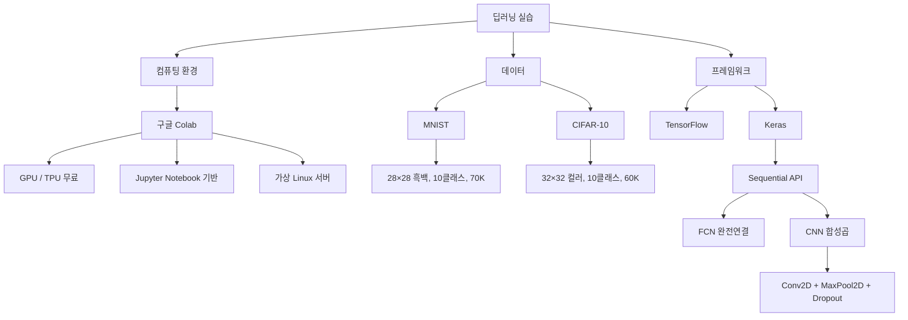

# 15강. 딥러닝의 통계적 이해: 딥러닝 실습

## 🔗 선수 지식 (Prerequisites)
- [ ] **필수**: 합성곱 신경망(CNN) 구조 - [6강. 합성곱신경망의 기초 (1)](6강.%20합성곱신경망의%20기초%20(1).md) 이해 완료?
- [ ] **필수**: 완전연결 신경망(FCN) 구조 - [3강. 딥러닝 모형의 구조와 학습 (1)](3강.%20딥러닝%20모형의%20구조와%20학습%20(1).md) 이해 완료?
- [ ] **권장**: Python 기초 문법, NumPy 배열 연산
- **관련 단원**: [→←6강](6강.%20합성곱신경망의%20기초%20(1).md) CNN 기초 / [→←7강](7강.%20합성곱신경망의%20기초%20(2).md) CNN 응용

---

## 학습 목표
1. 구글 Colaboratory(코랩)의 특징과 사용 방법을 설명할 수 있다.
2. TensorFlow-Keras를 이용하여 완전연결 신경망과 합성곱 신경망을 작성할 수 있다.
3. MNIST 및 CIFAR-10 데이터에 대한 딥러닝 모형을 구성하고 평가할 수 있다.

---

## 🧠 메타인지 체크 (학습 전/후 자기 평가)

### 학습 전 자기 평가
| 소주제 | 자신감 (1-5) |
| :--- | :--- |
| 구글 Colab 환경 설정 및 사용법 | |
| Keras Sequential API로 모델 구성 | |
| MNIST CNN 코드 작성 | |
| CIFAR-10 깊은 CNN 구성 및 Dropout 적용 | |

### 학습 후 교정 (학습 완료 후 작성)
| 소주제 | 학습 전 | 학습 후 | 실제 정답률 | 과신/과소 여부 |
| :--- | :--- | :--- | :--- | :--- |
| 구글 Colab 환경 설정 및 사용법 | | | | |
| Keras Sequential API로 모델 구성 | | | | |
| MNIST CNN 코드 작성 | | | | |
| CIFAR-10 깊은 CNN 구성 및 Dropout 적용 | | | | |

> **활용법**: 학습 전 1분 → 자신감 기입, 학습 후 1분 → 나머지 기입. "과신" 영역이 실제 취약점.

---

## 📝 요약 (Summary)
1. 🔴 **구글 Colaboratory(Colab)**: 구글 클라우드의 가상 리눅스 서버 기반 주피터 노트북으로, Python·TensorFlow·Keras·NumPy가 사전 설치되어 있고 GPU/TPU를 무료로 사용할 수 있다. 일정 시간 미사용 시 가상머신이 초기화된다.
2. 🔴 **TensorFlow & Keras**: TensorFlow는 구글이 공개한 오픈소스 머신러닝 프레임워크이고, Keras는 TensorFlow를 백엔드로 사용하는 고수준 딥러닝 API로 현재 TF에 통합되어 있다.
3. 🟡 **MNIST 신경망**: 28×28 흑백 이미지(0~9 숫자, 훈련 60,000개/시험 10,000개)에 대해 완전연결 신경망(Flatten→Dense)과 CNN(Conv2D+MaxPool2D) 두 가지 방식으로 모델을 구성할 수 있다.
4. 🟡 **CIFAR-10 CNN**: 32×32 컬러 이미지(10개 분류, 훈련 50,000개/시험 10,000개)에 Conv2D+MaxPool2D+Dropout을 반복 적용하며, `padding='same'`으로 특성맵 크기를 유지하면서 더 깊은 네트워크를 구성한다.
5. 🟢 **Dropout**: 과적합 방지를 위해 학습 중 일부 뉴런을 무작위로 비활성화하는 기법으로, CIFAR-10처럼 복잡한 데이터에서 효과적이다.

---

## 📐 핵심 문법 및 패턴 (Key Patterns)

> 이 강은 **실습 중심** 과목이므로 수식 테이블 대신 핵심 코드 패턴으로 대체합니다.

| 패턴명 | 코드 | 용도 |
| :--- | :--- | :--- |
| **데이터 정규화** | `x_train / 255.0` | 픽셀값(0~255)을 0~1로 정규화 |
| **CNN 입력 reshape** | `x.reshape(-1, 28, 28, 1)` | 2D → 4D 텐서 (배치, 높이, 너비, 채널) |
| **합성곱 층** | `Conv2D(32, (3,3), activation='relu')` | 특징 추출 필터 적용 |
| **풀링 층** | `MaxPool2D(2,2)` | 특성맵 크기 절반 축소 |
| **Same 패딩** | `Conv2D(..., padding='same')` | 출력 크기 = 입력 크기 유지 |
| **Dropout** | `Dropout(0.25)` | 과적합 방지, 25% 뉴런 무작위 비활성화 |
| **Flatten** | `Flatten()` | 다차원 텐서 → 1D 벡터 변환 |
| **출력층 (분류)** | `Dense(10, activation='softmax')` | 10개 클래스 확률 출력 |
| **모델 컴파일** | `model.compile(optimizer='adam', loss='sparse_categorical_crossentropy', metrics=['accuracy'])` | 학습 설정 |
| **모델 학습** | `model.fit(x_train, y_train, epochs=5, batch_size=64)` | 훈련 실행 |
| **Colab 드라이브 연결** | `drive.mount('/content/drive')` | 구글 드라이브 마운트 |
| **패키지 설치** | `!pip install 패키지명` | 리눅스 명령어로 추가 패키지 설치 |

### Colab 실행 단축키

| 단축키 | 동작 |
| :--- | :--- |
| `Ctrl + Enter` | 현재 셀 실행 후 커서 유지 |
| `Shift + Enter` | 실행 후 다음 셀로 이동 |
| `Alt + Enter` | 실행 후 새 코드 셀 생성 |

---

## 📊 개념 시각화 (Visual Guide)

### 딥러닝 실습 환경 구성도



### MNIST 모델 구조 비교

| 구분 | 완전연결 신경망 (FCN) | 합성곱 신경망 (CNN) |
| :--- | :--- | :--- |
| **입력 형태** | `(28×28)` → Flatten → 784 | `(28, 28, 1)` |
| **주요 층** | Dense(512, relu) | Conv2D → MaxPool2D 반복 |
| **출력층** | Dense(10, softmax) | Dense(10, softmax) |
| **특징** | 위치 정보 손실 | 공간 특징 보존 |
| **성능** | 보통 (~98%) | 높음 (~99%+) |

### CIFAR-10 CNN 계층 흐름

| 단계 | 층 | 출력 형태 | 목적 |
| :--- | :--- | :--- | :--- |
| 입력 | Input | (32, 32, 3) | 컬러 이미지 |
| 1 | Conv2D(32, 3×3, same) + ReLU | (32, 32, 32) | 특징 추출 |
| 2 | Conv2D(32, 3×3, same) + ReLU | (32, 32, 32) | 추가 특징 추출 |
| 3 | MaxPool2D(2×2) | (16, 16, 32) | 공간 축소 |
| 4 | Dropout(0.25) | (16, 16, 32) | 과적합 방지 |
| 5 | Conv2D(64, 3×3, same) + ReLU | (16, 16, 64) | 고수준 특징 |
| 6 | MaxPool2D(2×2) | (8, 8, 64) | 공간 축소 |
| 7 | Dropout(0.25) | (8, 8, 64) | 과적합 방지 |
| 8 | Flatten | 4096 | 1D 변환 |
| 9 | Dense(512, ReLU) + Dropout(0.5) | 512 | 분류기 |
| 10 | Dense(10, softmax) | 10 | 최종 분류 |

---

## ✏️ 심화 학습 (Study Subject)

### 1. 가상 시나리오: "MNIST vs CIFAR-10, 어떤 모델을 선택해야 할까?"

- **상황**: 스타트업에서 손글씨 우편번호 인식 시스템(MNIST 유사)과 자동차 차종 분류 시스템(CIFAR-10 유사)을 각각 구축해야 한다.
- **문제**: 두 태스크에 동일한 단순 FCN을 사용해도 될까? 아니면 각각 다른 아키텍처가 필요한가?
- **해결**:
  - 손글씨 우편번호: 이진화된 단순 패턴 → FCN으로도 ~98% 달성 가능하나, CNN이 위치 변이에 강건
  - 차종 분류: 컬러, 텍스처, 복잡한 형태 → CNN + Dropout 필수, FCN은 과적합 심각
  - 결론: 이미지 복잡도가 높을수록 CNN + 정규화(Dropout) 조합이 필수
- **AI 학습 포인트**: "CIFAR-10에서 FCN만 사용했을 때 테스트 정확도가 얼마나 낮아지는지, 그 원인을 합성곱 연산의 특성(가중치 공유, 지역 수용장)과 연결해서 설명해 줘."

### 2. 관점별 비교 및 오개념 분석

**Keras vs TensorFlow 혼동 쌍**

| 구분 | TensorFlow | Keras |
| :--- | :--- | :--- |
| **정의** | 구글의 오픈소스 ML 라이브러리 | 고수준 딥러닝 API |
| **수준** | 저수준 (텐서 연산 직접 제어) | 고수준 (모델 레고 블록 조립) |
| **관계** | 백엔드 엔진 | TF 2.x에 통합 (`tf.keras`) |
| **코드 예시** | `tf.matmul(a, b)` | `model.add(Dense(128))` |
| **시험 출제 포인트** | "Keras는 TF를 백엔드로 사용" | "현재 TF와 결합되어 있음" |

- **오개념 1**: "Colab에서 작업한 파일은 영구적으로 구글 드라이브에 저장된다."
  - **분석**: 코드 파일(.ipynb)은 구글 드라이브에 저장되지만, 가상머신의 로컬 파일(업로드한 데이터, 설치한 패키지 등)은 세션 종료 시 초기화된다. `drive.mount()`로 드라이브를 연결해야 데이터를 영구 보존할 수 있다.

- **오개념 2**: "MaxPool2D는 학습 가능한 가중치가 있다."
  - **분석**: MaxPool2D는 단순히 지정된 윈도우 내 최댓값을 선택하는 고정 연산이다. 학습 가중치가 없으므로 역전파 시 파라미터 업데이트가 없다. Conv2D의 필터만 학습된다.

- **AI 학습 포인트**: "MaxPool2D 대신 Average Pooling을 사용하면 어떤 차이가 생기는지, 각각 언제 유리한지 실험 결과와 함께 설명해 줘."

---

## ❓ 연습 문제 및 해설

> **블룸 인지 수준 범례**: [기억] 정의·나열 → [이해] 설명·비교 → [적용] 계산·구현 → [분석] 구별·디버그 → [평가] 판단·비평 → [창조] 설계·제안

### 📝 문제

**1. ⭐ [기억/이해] 구글 Colab의 특징으로 **옳지 않은** 것은?** <a id="prob-1-q"></a> [→해설](#prob-1)
   > ① Python, TensorFlow, Keras 등이 사전 설치되어 있다.
   > ② GPU와 TPU를 무료로 사용할 수 있다.
   > ③ 작성한 노트북 파일은 구글 드라이브에 저장된다.
   > ④ 가상머신은 한번 실행하면 종료하기 전까지 절대 초기화되지 않는다.

<br>

**2. ⭐ [기억/이해] MNIST 데이터에 대한 설명으로 옳은 것을 모두 고르시오.** <a id="prob-2-q"></a> [→해설](#prob-2)
   > <보기>
   >
   > 가. 이미지 크기는 28×28 픽셀이다.
   > 나. 컬러(RGB) 이미지이다.
   > 다. 훈련 데이터는 60,000개, 시험 데이터는 10,000개이다.
   > 라. 분류 클래스는 총 10개(0~9 숫자)이다.

   > ① 가, 다
   > ② 가, 나, 라
   > ③ 가, 다, 라
   > ④ 가, 나, 다, 라

<br>

**3. ⭐⭐ [적용/분석] 다음 Keras 코드에서 (A), (B), (C)에 들어갈 내용을 쓰시오.** 📌 <a id="prob-3-q"></a> [→해설](#prob-3)

```python
# MNIST CNN 모델
model = tf.keras.Sequential([
    tf.keras.layers.( A )(input_shape=(28, 28, 1)),  # 2D → 1D 변환
    tf.keras.layers.Dense(( B ), activation='relu'),  # 은닉층
    tf.keras.layers.Dense(10, activation=( C ))       # 출력층
])
```

<br>

**4. ⭐⭐ [이해/분석] CIFAR-10 CNN에서 Dropout 층을 추가하는 이유를 설명하시오.** 📌 <a id="prob-4-q"></a> [→해설](#prob-4)

<br>

**5. ⭐⭐⭐ [적용/창조] CIFAR-10 데이터에 대해 `padding='same'`을 사용하는 깊은 CNN을 설계할 때, 이 옵션의 역할과 이점을 설명하고, 이를 사용하지 않았을 때 발생하는 문제를 기술하시오.** 📌 <a id="prob-5-q"></a> [→해설](#prob-5)

---

### 🔑 정답 및 해설 (먼저 풀어본 후 펼치기)

<details>
<summary>정답 보기 (클릭)</summary>

1. ④
2. ③
3. (A) Flatten, (B) 512, (C) 'softmax'
4. 과적합 방지 (훈련 중 일부 뉴런을 무작위 비활성화)
5. 아래 해설 참고

</details>

<details>
<summary>해설 보기 (클릭)</summary>

<a id="prob-1"></a>
**1. ⭐ [기억/이해] 구글 Colab의 특징**
> **정답: ④**
> **해설**: Colab의 가상머신은 **일정 시간 동안 사용하지 않으면 자동으로 중지되어 초기화**된다. 노트북 파일(.ipynb)은 구글 드라이브에 저장되지만, 가상머신 내 로컬 파일과 설치된 패키지는 사라진다. ①②③은 모두 Colab의 올바른 특징이다.

<a id="prob-2"></a>
**2. ⭐ [기억/이해] MNIST 데이터 설명**
> **정답: ③ 가, 다, 라**
> **해설**: MNIST는 28×28 픽셀의 **흑백(단채널)** 이미지이므로 나(컬러 이미지)는 틀렸다. CIFAR-10이 32×32 컬러 이미지이다. 훈련 60,000개, 시험 10,000개, 클래스 10개(0~9)는 모두 옳다.

<a id="prob-3"></a>
**3. ⭐⭐ [적용/분석] Keras 코드 빈칸**
> **정답: (A) Flatten, (B) 512, (C) 'softmax'**
> **해설**:
> - **(A) Flatten**: 28×28×1의 3D 텐서를 784 크기의 1D 벡터로 평탄화한다. FCN에 입력하기 위한 필수 변환.
> - **(B) 512**: 강의에서 제시된 은닉층 노드 수. relu 활성화 함수와 조합.
> - **(C) 'softmax'**: 10개 클래스에 대한 확률 분포 출력. 다중 분류에서 표준.

<a id="prob-4"></a>
**4. ⭐⭐ [이해/분석] Dropout 층의 역할**
> **정답**: CIFAR-10은 MNIST보다 복잡한 컬러 이미지로, 네트워크가 훈련 데이터에 과적합되기 쉽다. Dropout은 학습 과정에서 일부 뉴런을 무작위로 비활성화(0으로 설정)하여, 네트워크가 특정 뉴런에 의존하지 않도록 강제한다. 이를 통해 다양한 부분 네트워크를 앙상블하는 효과를 내어 일반화 성능을 높인다.

<a id="prob-5"></a>
**5. ⭐⭐⭐ [적용/창조] padding='same' 역할과 이점**
> **정답**:
> - **역할**: `padding='same'`은 합성곱 연산 시 입력 특성맵 주변에 0을 채워(zero-padding) 출력 크기가 입력 크기와 동일하게 유지되도록 한다.
> - **이점**: 층을 깊게 쌓아도 특성맵이 급격히 축소되지 않아 더 많은 Conv2D 층을 연속 배치할 수 있다. 가장자리 정보 손실도 줄어든다.
> - **미사용 시 문제**: 3×3 필터 사용 시 매 Conv2D마다 특성맵이 2픽셀씩 줄어든다. 32×32 입력에 `padding='valid'`로 여러 층을 쌓으면 특성맵이 빠르게 소멸하여 깊은 네트워크 구성이 불가능해진다.

</details>

---

## ✅ O/X 확인문제 (연습문항 개수의 2배 권장)

**1.** 구글 Colab은 구글 클라우드의 가상 리눅스 서버를 기반으로 하는 주피터 노트북 환경이다. [→해설](#ox-1) **(O / X)**

**2.** Colab에서 `Shift + Enter`를 누르면 현재 셀이 실행되고 커서가 현재 셀에 유지된다. [→해설](#ox-2) **(O / X)**

**3.** MNIST 이미지를 CNN에 입력할 때 데이터를 (28, 28, 1) 형태의 3차원으로 변환해야 한다. [→해설](#ox-3) **(O / X)**

**4.** CIFAR-10 데이터는 32×32 크기의 흑백 이미지로 구성된다. [→해설](#ox-4) **(O / X)**

**5.** Keras는 TensorFlow만을 백엔드로 사용할 수 있다. [→해설](#ox-5) **(O / X)**

**6.** MaxPool2D(2,2)를 적용하면 특성맵의 가로·세로 크기가 각각 절반으로 줄어든다. [→해설](#ox-6) **(O / X)**

**7.** `!pip install` 명령어를 Colab에서 사용하려면 Python 문법으로 감싸야 한다. [→해설](#ox-7) **(O / X)**

**8.** MNIST 훈련 데이터는 50,000개, 시험 데이터는 10,000개이다. [→해설](#ox-8) **(O / X)**

**9.** CIFAR-10 CNN에서 `padding='same'`을 사용하면 Conv2D 통과 후 특성맵 크기가 유지된다. [→해설](#ox-9) **(O / X)**

**10.** Dropout(0.5)은 학습 시 절반의 뉴런을 무작위로 비활성화하여 과적합을 방지한다. [→해설](#ox-10) **(O / X)**

<details>
<summary>O/X 정답 및 해설 보기 (클릭)</summary>

> <a id="ox-1"></a>
> **1. 정답: O**
> **해설**: Colab은 구글 클라우드 가상 리눅스 서버 기반의 주피터 노트북 환경이며, 브라우저에서 바로 접속하여 사용한다.

> <a id="ox-2"></a>
> **2. 정답: X**
> **해설**: `Shift + Enter`는 현재 셀 실행 후 **다음 셀로 이동**한다. 현재 셀에 유지되는 단축키는 `Ctrl + Enter`이다.

> <a id="ox-3"></a>
> **3. 정답: O**
> **해설**: Conv2D 층은 4D 텐서(배치, 높이, 너비, 채널)를 입력으로 받으므로, MNIST의 흑백 이미지(채널=1)는 (28, 28, 1) 형태로 reshape해야 한다.

> <a id="ox-4"></a>
> **4. 정답: X**
> **해설**: CIFAR-10은 32×32 크기의 **컬러(RGB) 이미지**이다. 흑백 이미지는 MNIST(28×28)이다.

> <a id="ox-5"></a>
> **5. 정답: X**
> **해설**: Keras는 원래 TensorFlow, MXNet, Theano 등 다양한 프레임워크를 백엔드로 사용할 수 있는 오픈소스 딥러닝 프레임워크였다. 현재는 TensorFlow와 통합되어 `tf.keras`로 주로 사용된다.

> <a id="ox-6"></a>
> **6. 정답: O**
> **해설**: MaxPool2D(2,2)는 2×2 윈도우 내 최댓값을 선택하고 스트라이드 2로 이동하므로, 특성맵의 가로·세로 크기가 각각 1/2로 줄어든다.

> <a id="ox-7"></a>
> **7. 정답: X**
> **해설**: Colab(리눅스 환경)에서 `!` 접두사를 붙이면 셸 명령어로 직접 실행된다. Python 문법 없이 `!pip install 패키지명`으로 사용한다.

> <a id="ox-8"></a>
> **8. 정답: X**
> **해설**: MNIST 훈련 데이터는 **60,000개**이다. 50,000개는 CIFAR-10의 훈련 데이터 수이다.

> <a id="ox-9"></a>
> **9. 정답: O**
> **해설**: `padding='same'`은 입력 주변에 0을 패딩하여 Conv2D 출력의 공간 크기(가로×세로)가 입력과 동일하게 유지된다.

> <a id="ox-10"></a>
> **10. 정답: O**
> **해설**: Dropout(0.5)은 학습 시 50%의 뉴런을 무작위로 0으로 설정한다. 추론(예측) 시에는 모든 뉴런이 활성화되며 출력값에 보정이 적용된다.

</details>

---

## 🧪 자유 회상 연습 (Free Recall)

> **방법**: 위의 노트를 모두 덮고, 타이머 3분 설정 후 이번 단원에서 배운 내용을 기억나는 대로 자유롭게 적으세요.
> 정확한 문장이 아니어도 됩니다. 키워드, 코드, 관계 등 떠오르는 것을 모두 적습니다.

**자유 회상 작성란:**

```
[여기에 기억나는 내용을 자유롭게 작성]


```

> **회상 후 점검**: 노트를 다시 펼쳐 빠뜨린 내용을 확인하세요. 빠뜨린 부분이 실제 취약점입니다.
> - 회상 못한 핵심 개념: [                ]
> - 회상 못한 코드 패턴: [                ]

---

## 💻 코드로 확인하기 (Code Verification)

### 1. MNIST 완전연결 신경망

```python
import tensorflow as tf

# 데이터 로드 및 전처리
(x_train, y_train), (x_test, y_test) = tf.keras.datasets.mnist.load_data()
x_train, x_test = x_train / 255.0, x_test / 255.0  # 정규화

# FCN 모델 구성
model_fcn = tf.keras.Sequential([
    tf.keras.layers.Flatten(input_shape=(28, 28)),    # 784 차원으로 평탄화
    tf.keras.layers.Dense(512, activation='relu'),    # 은닉층
    tf.keras.layers.Dense(10, activation='softmax')  # 출력층
])

model_fcn.compile(
    optimizer='adam',
    loss='sparse_categorical_crossentropy',
    metrics=['accuracy']
)

model_fcn.fit(x_train, y_train, epochs=5, batch_size=64, validation_split=0.1)
loss, acc = model_fcn.evaluate(x_test, y_test)
print(f"FCN 테스트 정확도: {acc:.4f}")
```

> **실행 결과 (예시)**: `FCN 테스트 정확도: 0.9798`
> **해석**: Flatten으로 위치 정보를 버리고도 ~98% 달성. MNIST처럼 단순한 패턴에서는 FCN도 충분히 작동.

### 2. MNIST 합성곱 신경망

```python
# CNN 입력을 위해 채널 차원 추가
x_train_cnn = x_train.reshape(-1, 28, 28, 1)
x_test_cnn = x_test.reshape(-1, 28, 28, 1)

model_cnn = tf.keras.Sequential([
    tf.keras.layers.Conv2D(32, (3, 3), activation='relu', input_shape=(28, 28, 1)),
    tf.keras.layers.MaxPool2D(2, 2),
    tf.keras.layers.Conv2D(64, (3, 3), activation='relu'),
    tf.keras.layers.MaxPool2D(2, 2),
    tf.keras.layers.Flatten(),
    tf.keras.layers.Dense(128, activation='relu'),
    tf.keras.layers.Dense(10, activation='softmax')
])

model_cnn.compile(optimizer='adam', loss='sparse_categorical_crossentropy', metrics=['accuracy'])
model_cnn.fit(x_train_cnn, y_train, epochs=5, batch_size=64, validation_split=0.1)
loss, acc = model_cnn.evaluate(x_test_cnn, y_test)
print(f"CNN 테스트 정확도: {acc:.4f}")
```

> **실행 결과 (예시)**: `CNN 테스트 정확도: 0.9921`
> **해석**: FCN 대비 ~1% 향상. 공간 특징을 보존하는 Conv2D의 효과.

### 3. CIFAR-10 깊은 CNN (padding='same' + Dropout)

```python
(x_train_c, y_train_c), (x_test_c, y_test_c) = tf.keras.datasets.cifar10.load_data()
x_train_c, x_test_c = x_train_c / 255.0, x_test_c / 255.0

model_cifar = tf.keras.Sequential([
    # 블록 1
    tf.keras.layers.Conv2D(32, (3,3), activation='relu', padding='same', input_shape=(32,32,3)),
    tf.keras.layers.Conv2D(32, (3,3), activation='relu', padding='same'),
    tf.keras.layers.MaxPool2D(2, 2),
    tf.keras.layers.Dropout(0.25),
    # 블록 2
    tf.keras.layers.Conv2D(64, (3,3), activation='relu', padding='same'),
    tf.keras.layers.Conv2D(64, (3,3), activation='relu', padding='same'),
    tf.keras.layers.MaxPool2D(2, 2),
    tf.keras.layers.Dropout(0.25),
    # 분류기
    tf.keras.layers.Flatten(),
    tf.keras.layers.Dense(512, activation='relu'),
    tf.keras.layers.Dropout(0.5),
    tf.keras.layers.Dense(10, activation='softmax')
])

model_cifar.compile(optimizer='adam', loss='sparse_categorical_crossentropy', metrics=['accuracy'])
model_cifar.fit(x_train_c, y_train_c, epochs=20, batch_size=64, validation_split=0.1)
loss, acc = model_cifar.evaluate(x_test_c, y_test_c)
print(f"CIFAR-10 깊은 CNN 테스트 정확도: {acc:.4f}")
```

> **실행 결과 (예시)**: `CIFAR-10 깊은 CNN 테스트 정확도: 0.7850`
> **해석**: 단순 CNN 대비 Dropout과 깊은 층 덕분에 과적합 감소. CIFAR-10은 MNIST보다 어렵기 때문에 ~78~82%가 일반적인 기준 성능.

---

## 🤖 AI 연결고리 (DL 실습 → AI Application)

| 개념 | AI/ML 적용 분야 | 구체적 사례 |
| :--- | :--- | :--- |
| **Colab + GPU** | 대규모 모델 프로토타이핑 | 연구자가 로컬 GPU 없이 BERT, GPT 파인튜닝 |
| **MNIST CNN** | 문자 인식 (OCR) | 우편번호 자동 판독, 수표 금액 인식 |
| **CIFAR-10 CNN** | 이미지 분류 | 제품 불량 검사, 의료 영상 진단 |
| **Dropout** | 모델 일반화 | 데이터 부족 환경에서 과적합 방지 |
| **padding='same'** | 깊은 네트워크 설계 | ResNet, VGG 등 현대 아키텍처의 기반 |
| **softmax 출력층** | 다중 클래스 분류 | 음성 인식 언어 모델, 자연어 분류 |

---

## 📖 심화 학습 예시 답안

#### 1. Keras Sequential API의 내부 동작 원리

모델이 `model.fit()`으로 학습되는 과정:

1. **순전파(Forward Pass)**: 입력 데이터가 층을 순서대로 통과하며 예측값 $\hat{y}$ 생성
2. **손실 계산**: `sparse_categorical_crossentropy`로 $L = -\sum y_i \log \hat{y}_i$ 계산
3. **역전파(Backward Pass)**: 각 층의 가중치에 대한 기울기 $\frac{\partial L}{\partial W}$ 계산
4. **가중치 업데이트**: Adam 옵티마이저로 $W \leftarrow W - \alpha \cdot \nabla_W L$ 적용
5. **에폭 반복**: 전체 훈련 데이터를 지정된 epochs만큼 반복

#### 2. FCN vs CNN 비교표

| 구분 | 완전연결 신경망 (FCN) | 합성곱 신경망 (CNN) |
| :--- | :--- | :--- |
| **입력 처리** | Flatten으로 1D 변환 필수 | 2D/3D 구조 그대로 처리 |
| **위치 정보** | 손실됨 | 보존됨 (지역 수용장) |
| **파라미터 수** | 매우 많음 (입력 크기에 비례) | 적음 (가중치 공유) |
| **이동 불변성** | 없음 | 있음 (translation invariance) |
| **MNIST 적합성** | 보통 (~98%) | 높음 (~99%+) |
| **CIFAR-10 적합성** | 낮음 (심각한 과적합) | 높음 (Dropout 조합) |
| **AI 활용** | 정형 데이터 분류 | 이미지, 영상, 의료 진단 |

#### 3. 모델 구성 Best Practice

- **Bad Practice (나쁜 예시)**
  ```python
  # 정규화 없이 학습 → 수렴 불안정
  x_train_raw = x_train  # 0~255 그대로 사용
  model.fit(x_train_raw, y_train, epochs=10)
  ```

- **Good Practice (좋은 예시)**
  ```python
  # 정규화 + validation_split으로 과적합 모니터링
  x_train_norm = x_train / 255.0
  x_test_norm = x_test / 255.0
  history = model.fit(
      x_train_norm, y_train,
      epochs=20,
      batch_size=64,
      validation_split=0.1,   # 훈련 중 검증 손실 확인
      callbacks=[
          tf.keras.callbacks.EarlyStopping(patience=3, restore_best_weights=True)
      ]
  )
  ```

- **설명**: 정규화 없이는 활성화 함수의 포화(saturation) 문제로 학습이 느리거나 수렴에 실패한다. `validation_split`과 `EarlyStopping`을 사용하면 과적합 시점을 자동으로 감지하고 최적 모델을 보존한다.

---

## 📚 핵심 용어집 (Glossary)

| 용어 (한) | 용어 (영) | 수식/코드 표현 | 정의 |
| :--- | :--- | :--- | :--- |
| **구글 코랩** | Google Colaboratory | — | 구글 클라우드 기반 무료 주피터 노트북 환경. GPU/TPU 제공 |
| **텐서플로** | TensorFlow | `import tensorflow as tf` | 구글 오픈소스 ML 프레임워크 |
| **케라스** | Keras | `tf.keras` | TF 내장 고수준 딥러닝 API |
| **순차 모델** | Sequential Model | `tf.keras.Sequential([...])` | 층을 선형으로 쌓는 Keras 모델 구성 방식 |
| **평탄화** | Flatten | `Flatten()` | 다차원 텐서를 1D 벡터로 변환 |
| **합성곱 층** | Conv2D | `Conv2D(filters, kernel_size)` | 2D 합성곱 필터로 특징 추출 →←6강 |
| **최대 풀링** | Max Pooling | `MaxPool2D(pool_size)` | 윈도우 내 최댓값 선택, 공간 크기 축소 →←7강 |
| **드롭아웃** | Dropout | `Dropout(rate)` | 학습 시 rate 비율로 뉴런 무작위 비활성화, 과적합 방지 →←5강 |
| **정규화** | Normalization | $x' = x / 255.0$ | 픽셀값을 0~1 범위로 조정, 학습 안정화 |
| **MNIST** | MNIST | — | 손글씨 숫자 데이터셋. 28×28 흑백, 70K 샘플 |
| **CIFAR-10** | CIFAR-10 | — | 컬러 이미지 10클래스 데이터셋. 32×32 RGB, 60K 샘플 |
| **Same 패딩** | Same Padding | `padding='same'` | Conv2D 후 출력 크기 = 입력 크기 유지 |

---

## 🤖 AI 학습 파트너를 위한 추가 자료

### 1. 개념 이해를 위한 심층 질문 프롬프트
> **프롬프트 예시**: "구글 Colab의 GPU를 무료로 사용할 수 있는 원리와 한계를 설명해 줘. 그리고 Colab Pro와 무료 버전의 차이점, 장기 프로젝트에서 세션 초기화 문제를 어떻게 관리해야 하는지 실용적인 팁도 알려줘."

### 2. 문제 해결 능력 강화를 위한 시나리오 프롬프트
> **프롬프트 예시**: "당신은 머신러닝 엔지니어입니다. 같은 CIFAR-10 데이터에 대해 (1) 단순 FCN, (2) 얕은 CNN(Conv2D 1개), (3) 깊은 CNN + Dropout 세 모델의 훈련/검증 손실 그래프가 어떻게 다를지 예측하고, 각 모델의 과적합/과소적합 여부를 판단하는 방법을 설명해 줘."

### 3. 코드 검증 프롬프트
> **프롬프트 예시**: "다음 MNIST CNN 코드를 검토해 줘.
> ```python
> model = tf.keras.Sequential([
>     tf.keras.layers.Conv2D(32, (3,3), activation='relu', input_shape=(28,28)),
>     tf.keras.layers.MaxPool2D(2,2),
>     tf.keras.layers.Dense(10, activation='softmax')
> ])
> ```
> 1. 이 코드에서 오류나 누락된 부분이 있다면 지적해 줘.
> 2. 수정된 올바른 코드와 함께 각 층의 출력 shape도 계산해 줘."

---

## 🔄 복습 체크 (Spaced Repetition)
- [ ] 1일 후 복습 (날짜: 2026-04-13)
- [ ] 3일 후 복습 (날짜: 2026-04-15)
- [ ] 7일 후 복습 (날짜: 2026-04-19)
- [ ] 14일 후 복습 (날짜: 2026-04-26)
- [ ] 30일 후 복습 (날짜: 2026-05-12)

### 복습 시 자가 평가
| 회차 | 날짜 | 이해도 (1-5) | 취약 부분 메모 |
| :--- | :--- | :--- | :--- |
| 1차 | | | |
| 2차 | | | |
| 3차 | | | |

---

## 📚 참고 자료 (References)

- 교재 - 딥러닝의 통계적 이해 15강 (구글 코랩, TensorFlow-Keras, MNIST/CIFAR-10 실습)
- [TensorFlow 공식 튜토리얼](https://www.tensorflow.org/tutorials) - Keras로 기초 분류
- [Keras 공식 문서](https://keras.io/api/) - Sequential, Conv2D, Dropout API 레퍼런스
- Google Colab 공식 가이드 - colab.research.google.com
