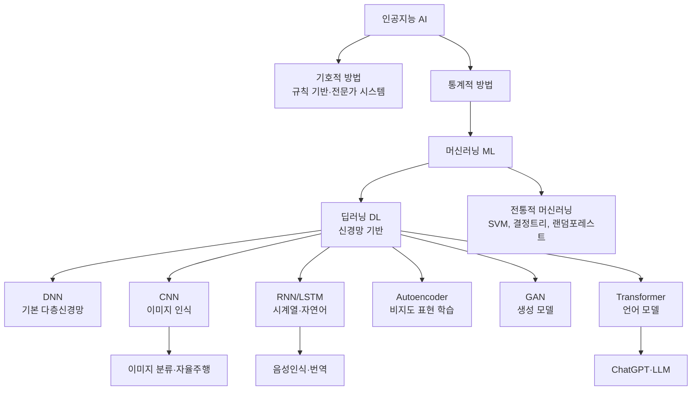
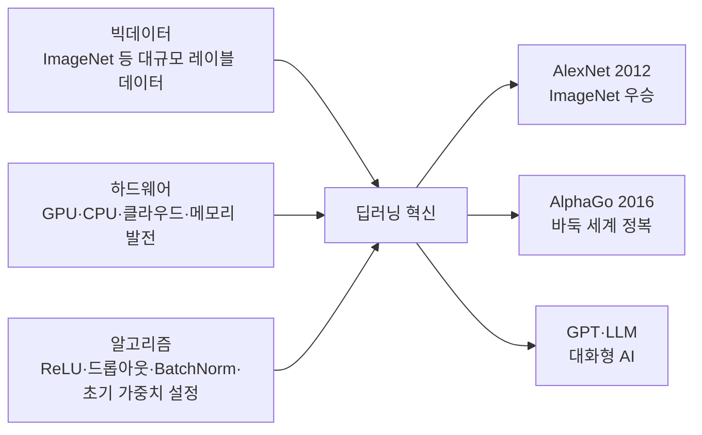

# 1강. 딥러닝의 통계적 이해: 딥러닝의 개요

## 🔗 선수 지식 (Prerequisites)
- [ ] **필수**: 기초 통계학 (평균, 분산, 확률분포) - 이해 완료?
- [ ] **필수**: 머신러닝 개념 (지도학습, 비지도학습, 손실함수) - 이해 완료?
- [ ] **권장**: 행렬 연산 및 선형대수 기초
- **관련 단원**: [2강. 딥러닝과 통계학](2강.%20딥러닝과%20통계학.md) (크로스 레퍼런스 →←2강)

---

## 학습 목표
1. 딥러닝과 머신러닝을 통계학과 비교하여 이해한다.
2. 딥러닝의 역사와 확산배경을 이해한다.
3. 신경망의 구조를 이해한다.
4. 여러 가지 신경망을 이해한다.
5. 딥러닝 구현 프레임워크를 살펴본다.

---

## 🧠 메타인지 체크 (학습 전/후 자기 평가)

### 학습 전 자기 평가
| 소주제 | 자신감 (1-5) |
| :--- | :--- |
| 딥러닝 vs 머신러닝 vs 통계학 구분 | |
| 딥러닝 확산배경 3요소 | |
| 신경망 구조 및 종류 | |
| 딥러닝 프레임워크 | |

### 학습 후 교정 (학습 완료 후 작성)
| 소주제 | 학습 전 | 학습 후 | 실제 정답률 | 과신/과소 여부 |
| :--- | :--- | :--- | :--- | :--- |
| 딥러닝 vs 머신러닝 vs 통계학 구분 | | | | |
| 딥러닝 확산배경 3요소 | | | | |
| 신경망 구조 및 종류 | | | | |
| 딥러닝 프레임워크 | | | | |

> **활용법**: 학습 전 1분 → 자신감 기입, 학습 후 1분 → 나머지 기입. "과신" 영역이 실제 취약점.

---

## 📝 요약 (Summary)

1. 🔴 **딥러닝의 정의**: 딥러닝은 머신러닝의 일종으로, 다층 인공 신경망(Deep Neural Network)을 이용해 데이터의 패턴을 계층적으로 학습한다.
2. 🔴 **딥러닝 확산배경**: 빅데이터 축적, GPU 등 하드웨어 발전, 역전파·드롭아웃 등 알고리즘 혁신이 결합되어 급속히 발전하였다.
3. 🟡 **통계학·머신러닝·딥러닝 관계**: 통계학은 모델 해석 중심, 머신러닝은 예측 중심, 딥러닝은 자동 특징 추출을 통한 예측 중심으로 구분할 수 있다.
4. 🟡 **신경망 구조**: 입력층–은닉층–출력층의 다층 퍼셉트론(MLP) 구조이며, 은닉층이 2개 이상이면 딥러닝으로 분류한다.
5. 🟡 **신경망 종류**: DNN(기본 다층), CNN(이미지), RNN/LSTM(시계열·자연어), Autoencoder(표현 학습), GAN(생성), Transformer(언어모델) 등이 있다.
6. 🟢 **딥러닝 프레임워크**: TensorFlow, Keras, PyTorch, Caffe, Theano, MXNET, Gluon 등이 대표적이며, GPU PC·클라우드·코랩(Colaboratory) 등 다양한 환경에서 실행된다.

---

## 📐 핵심 정의 및 원리 (Key Concepts)

| 정의명 | 내용 | 키워드 |
| :--- | :--- | :--- |
| **딥러닝 (Deep Learning)** | 2개 이상의 은닉층을 가진 인공 신경망으로 데이터의 계층적 표현을 자동 학습 | 다층 신경망, 자동 특징 추출, 표현 학습 |
| **인공 신경망 (ANN)** | 생물학적 뉴런을 모방한 노드(뉴런)와 가중치(시냅스)로 구성된 계산 모델 | 퍼셉트론, 활성화 함수, 가중치 |
| **퍼셉트론 (Perceptron)** | 입력값에 가중치를 곱해 합산한 후 활성화 함수를 거쳐 출력을 내는 기본 단위 | 단층, Rosenblatt(1958), XOR 불가 |
| **다층 퍼셉트론 (MLP)** | 입력층·은닉층·출력층으로 구성된 완전 연결 신경망, 역전파로 학습 | 은닉층, 완전연결, 역전파 |
| **역전파 (Backpropagation)** | 출력 오차를 역방향으로 전파하여 각 층의 가중치를 업데이트하는 학습 알고리즘 | 연쇄법칙, 경사하강법, 오차 |
| **전이학습 (Transfer Learning)** | 대규모 데이터로 사전 학습된 모델의 가중치를 새로운 과제에 재사용 | 사전학습 모델, Fine-tuning |
| **빅데이터** | 딥러닝 성능 향상을 위한 대규모 학습 데이터; 데이터가 많을수록 딥러닝 우위 | ImageNet, 크롤링, 레이블링 |
| **AI 역사적 사건** | Deep Blue(1997, 체스) → IBM Watson(2011, Jeopardy!) → AlphaGo(2016, 바둑) 순으로 대중적 확산 | Deep Blue, Watson, AlphaGo |
| **GPU 가속** | 병렬 연산에 특화된 그래픽 처리장치로, 대규모 행렬 연산을 고속 처리 | CUDA, 병렬처리, NVIDIA |
| **인간 뇌 구조** | 무게 약 1.5kg, 860억 개의 뉴런이 시냅스로 연결된 구조; 인공신경망의 모방 대상 | 뉴런, 시냅스, 수상돌기, 축삭 |
| **인공신경망 연산** | 입력 $x_i$에 가중치 $w_i$를 곱해 합산 후 활성화 함수 적용: $a = f\!\left(\sum_i w_i x_i\right)$ | 가중합, 활성화 함수, 세포체 |
| **지도 학습** | 입력·출력(레이블) 데이터 쌍으로 학습; 예측 위주, 성과가 높음 | 분류, 회귀, 레이블 |
| **비지도 학습** | 레이블 없이 데이터 구조를 스스로 파악; 군집화 등, 인간 지능의 대부분에 해당 | 군집화, 클러스터링, 차원 축소 |
| **강화 학습** | 환경과 상호작용하며 보상이 최대가 되도록 시행착오로 학습 | 보상, 에이전트, 정책, AlphaGo |
| **오토인코더** | 입력을 압축(인코더)하고 복원(디코더)하여 잠재 표현을 학습하는 비지도 신경망 | 인코더, 디코더, 잠재공간, 차원 축소 |
| **머신러닝 구성요소** | 과제(분류/예측) + 데이터(입력/레이블) + 모형 + 손실함수(성과함수) + 최적화 알고리즘 | 최소제곱법, 최대가능도추정, 경사하강법 |

---

## 📊 개념 시각화 (Visual Guide)

### AI 계층 분류 체계도


### 딥러닝 확산 3요소


### 딥러닝 역사 연대기

| 연도 | 내용 | 인물/기관 |
| :---: | :--- | :--- |
| **1943** | Neural networks 이론적 기초 제시 | McCulloch & Pitts |
| **1957/1958** | 퍼셉트론(Perceptron) 제안 | Frank Rosenblatt (1957 기술 보고서, 1958 *Psychological Review* 정식 발표; Wightman은 Mark I 퍼셉트론 하드웨어 제작 담당) |
| **1969** | XOR 문제 — 단층 퍼셉트론의 한계 증명 → 1차 AI 겨울 | Minsky & Papert |
| **1986** | 역전파(Backpropagation), RNN, RBM 제안 | Rumelhart, Hinton 등 |
| **1989** | 합성곱 신경망(CNN) 제안 | LeCun 등 |
| **1997** | LSTM 제안 (장기 의존성 문제 해결) | Hochreiter & Schmidhuber |
| **2006** | Deep Belief Network(DBN) — 딥러닝 부흥의 시작 | Hinton 등 |
| **2012** | **AlexNet** — ImageNet 오류율 급감, Dropout 도입 🔴 | Krizhevsky 등 |
| **2014** | GAN, Seq2seq, DeepFace | Goodfellow, Sutskever 등 |
| **2016** | **AlphaGo** — 딥러닝의 대중적 확산 🔴 | DeepMind |
| **2017** | Transformer, AlphaZero | Vaswani, DeepMind 등 |
| **2018** | BERT — 언어 이해 능력의 비약적 향상 | Devlin 등 |

> **ImageNet 경진대회**: 2012년 AlexNet 이후 층수가 급격히 깊어지며 인식 오류율 감소. ResNet은 **152층**까지 도달.
>
> **SQuAD (스탠퍼드 질의응답 데이터셋)**: 딥러닝 모형의 언어 이해 능력을 평가하는 벤치마크로 활용.

> **📌 심층 확장 — AI 겨울(AI Winter): 두 번의 침체와 극복**
>
> **1차 AI 겨울 (1970년대 초~1980년대 초)**
>
> - **원인**: Minsky & Papert(1969)의 저서 *Perceptrons*가 단층 퍼셉트론의 수학적 한계(XOR 불가, 선형 분리 불가능 문제)를 엄밀히 증명하였다. 당시 연구자 대부분이 다층 신경망의 가능성을 간과하였고, DARPA(미 국방부 고등연구계획국) 등 주요 기관의 AI 연구비가 대폭 삭감됐다. 또한 당시 컴퓨팅 자원으로는 복잡한 신경망을 훈련시킬 방법이 없었다.
> - **극복**: Rumelhart, Hinton, Williams(1986)의 역전파 알고리즘 재발견으로 다층 신경망 학습이 실용화되면서 연결주의(Connectionism)가 부활했다.
>
> **2차 AI 겨울 (1990년대 초~2000년대 초)**
>
> - **원인**: 1980년대 전성기를 누린 **전문가 시스템(Expert Systems)**이 한계에 봉착했다. 규칙을 수동으로 입력해야 하므로 새 도메인으로 확장이 불가능했고, 유지·보수 비용이 폭발적으로 증가했다. 또한 퍼셉트론의 부흥 기대가 다시 과장된 뒤 성과를 내지 못하면서 신뢰를 잃었다.
> - **극복**: 세 가지 요인이 결합하여 부흥을 이끌었다. ① **빅데이터**: ImageNet(2009, 120만 장)·웹 크롤링 데이터 축적. ② **GPU 병렬 연산**: NVIDIA CUDA(2007)가 대규모 행렬 연산을 수십 배 가속. ③ **알고리즘 혁신**: ReLU 활성화 함수, 드롭아웃(Srivastava 등, 2014), 배치 정규화(Ioffe & Szegedy, 2015) 등. 결정적 사건은 **AlexNet(2012)**의 ImageNet 오류율 26%→15% 달성이었다.
>
> | | 1차 겨울 | 2차 겨울 |
> | :--- | :--- | :--- |
> | **시기** | 1969~1980s | 1990s~2000s 초 |
> | **주요 원인** | 퍼셉트론 한계 증명, 연산력 부족 | 전문가 시스템 실패, 과장된 기대 |
> | **극복 핵심** | 역전파(1986), MLP 가능성 재확인 | GPU + 빅데이터 + AlexNet(2012) |

> **📌 심층 확장 — 계층적 표현 학습 (Hierarchical Representation Learning)**
>
> 딥러닝이 이미지를 처리할 때 각 층이 서로 다른 수준의 표현을 학습한다는 개념이다. LeCun 등의 시각화 연구(Zeiler & Fergus, 2014, *Visualizing and Understanding CNNs*)를 통해 실험적으로 확인되었다.
>
> | 층(Layer) | 학습되는 표현 | 예시 |
> | :--- | :--- | :--- |
> | **1층 (저수준)** | 픽셀 간 명암 차이 → **에지(Edge)** | 수평선, 수직선, 대각선 |
> | **2층 (저수준+)** | 에지 조합 → **모서리·곡선** | 원, 직각, 부드러운 곡선 |
> | **3~4층 (중수준)** | 패턴 조합 → **부품(Part)** | 눈, 코, 바퀴, 귀 |
> | **5층 이상 (고수준)** | 부품 조합 → **객체(Object)** | 고양이 얼굴, 자동차, 의자 |
>
> - 이 계층적 추상화 원리는 인간의 시각 피질(V1→V2→V4→IT 영역)과 유사하다.
> - CNN이 이미지 분류에서 강력한 이유: 컨볼루션 필터가 각 층에서 위의 표현을 자동으로 학습하기 때문이다.
> - 텍스트 도메인에서도 유사한 원리가 적용된다: 문자→단어→구문→문장→의미.

> **📌 보완 — 퍼셉트론 수렴 정리 (Perceptron Convergence Theorem)**
>
> 데이터가 **선형 분리 가능**하면, 퍼셉트론 학습 알고리즘은 **유한 번의 오차 수정**으로 반드시 수렴(올바른 분리 경계 발견)한다. (Rosenblatt 1962, Novikoff 1962)
>
> - 수렴 상한 스텝 수: $T \le \left(\dfrac{R}{\gamma}\right)^2$  
>   ($R$: 입력 벡터 최대 크기, $\gamma$: 마진(최적 경계까지의 최단 거리))
> - 반대로, **선형 분리 불가능** 데이터(예: XOR)에서는 영원히 수렴하지 않는다 — Minsky & Papert(1969)가 이를 증명하여 1차 AI 겨울 초래.
> - 수렴 정리는 현대 SVM의 마진 최대화 이론과도 연결된다.

### 머신러닝 구성요소 및 학습 방법 분류

**머신러닝의 5대 구성요소**

| 구성요소 | 설명 | 예시 |
| :--- | :--- | :--- |
| **과제** | 해결하려는 문제 유형 | 분류, 예측(회귀) |
| **데이터** | 입력값과 정답(레이블) | 이미지 + 레이블, 텍스트 + 감성 |
| **모형** | 데이터를 학습하는 확률/알고리즘 구조 | 신경망, SVM, 결정트리 |
| **손실함수** (성과함수) | 모형 성능을 수치화하는 기준 | MSE, 크로스 엔트로피 |
| **최적화 알고리즘** | 손실함수를 최소화하는 방법 | 최소제곱법, 최대가능도추정(MLE), 경사하강법 |

> **학습(Learning)**: 손실함수가 최소가 되도록 데이터를 기반으로 모형을 지속적으로 수정하는 과정

**학습 방법 3가지 분류**

| 학습 방법 | 특징 | 예시 |
| :--- | :--- | :--- |
| **지도 학습** (Supervised) | 입력·출력(레이블) 쌍으로 학습; 예측 위주, 성과가 높음 | 이미지 분류, 주가 예측 |
| **비지도 학습** (Unsupervised) | 레이블 없이 데이터 구조를 스스로 파악; 군집화 등 (인간 지능의 대부분에 해당) | 고객 군집화, 이상 탐지 |
| **강화 학습** (Reinforcement) | 환경과 상호작용하며 보상이 최대가 되도록 시행착오로 학습 | AlphaGo, 게임 AI |

### 인공신경망(ANN) 구조

**인간 뇌 → 인공신경망 대응**

| 인간 신경계 | 인공신경망 |
| :--- | :--- |
| 뉴런 (860억 개) | 노드(Node) |
| 시냅스 연결 강도 | 가중치 $w_i$ |
| 수상돌기 (입력 수신) | 입력값 $x_i$ |
| 세포체 (신호 합산) | 가중합 $\sum_i w_i x_i$ |
| 활성전위 발생 여부 | 활성화 함수 $a = f\!\left(\sum_i w_i x_i\right)$ |
| 축삭 (신호 전달) | 연결 엣지 |

> **네트워크 특성**: 같은 층(Layer) 내 뉴런끼리는 연결되지 않고, **위아래 층과만 연결**됨.
> 가중치(Weight)는 연결의 강도를 나타내며, 학습을 통해 최적값으로 조정됨.

### 통계학 vs 머신러닝 vs 딥러닝 비교표
| 구분 | 통계학 | 머신러닝 | 딥러닝 |
| :--- | :--- | :--- | :--- |
| **목적** | 모델 해석·추론 | 예측·분류 | 자동 특징 추출 + 예측 |
| **특징 추출** | 사람이 직접 설계 | 사람이 직접 설계 | 모델이 자동 학습 |
| **데이터 요구량** | 소~중 | 중 | 대 (빅데이터) |
| **해석 가능성** | 높음 | 중간 | 낮음 (블랙박스) |
| **대표 기법** | 회귀, 가설 검정 | SVM, 랜덤포레스트 | CNN, RNN, Transformer |
| **하드웨어** | CPU | CPU | GPU 필수 |

---

> **📌 심층 확장 — 범용 근사 정리 (Universal Approximation Theorem)**
>
> **정의**: 비선형 활성화 함수를 가진 은닉층이 단 **1개**만 있어도, 뉴런 수가 충분히 많으면 임의의 유계 연속함수(bounded continuous function)를 원하는 정밀도 $\epsilon > 0$ 이내에서 근사할 수 있다.
>
> - **Cybenko(1989)**: 시그모이드 계열 활성화 함수에 대해 최초 증명. (*Approximation by Superpositions of a Sigmoidal Function*, Mathematics of Control, Signals and Systems)
> - **Hornik(1991)**: 활성화 함수를 시그모이드에서 **임의의 비상수 유계 연속 함수**로 일반화. (*Approximation Capabilities of Multilayer Feedforward Networks*, Neural Networks)
>
> **수식으로 표현**: 임의의 연속함수 $f: \mathbb{R}^n \to \mathbb{R}$와 $\epsilon > 0$에 대해, 적절한 가중치 $w_i, b_i$와 뉴런 수 $N$이 존재하여:
> $$\left|F(x) - f(x)\right| < \epsilon, \quad \forall x \in K$$
> 여기서 $F(x) = \sum_{i=1}^{N} v_i \, \sigma(w_i^T x + b_i)$, $K$는 컴팩트 집합.
>
> **핵심 한계 — "존재성"만 보장**
>
> | 질문 | 답 |
> | :--- | :--- |
> | 근사가 가능한가? | **YES** — 이론적으로 보장 |
> | 뉴런 수가 얼마나 필요한가? | **모른다** — 존재성만 보장, 최소 뉴런 수 미제시 |
> | 학습 알고리즘이 그 가중치를 찾을 수 있는가? | **보장 안 함** — 경사하강법이 해를 못 찾을 수 있음 |
> | 은닉층 1개로 실용적으로 충분한가? | **실용적으로는 NO** — 깊은 망이 더 효율적 |
>
> **실용적 함의**: 딥러닝이 다양한 문제에 적용 가능한 이론적 근거를 제공하지만, "존재성 증명"이므로 실제 학습에서 그 해를 찾을 수 있다는 보장은 별개다. 이 때문에 실무에서는 은닉층 1개의 매우 넓은 망보다 여러 은닉층의 깊은 망을 사용하는 것이 파라미터 효율과 학습 안정성에서 우수하다. (→←3강에서 상세 설명)

---

## ✏️ 심화 학습 (Study Subject)

### 1. 가상 시나리오: "딥러닝을 언제 선택해야 할까?"
- **상황**: 병원에서 흉부 X-ray 이미지 10만 장과 진단 레이블을 보유하고 있다. 폐렴 여부를 자동으로 분류하는 시스템을 구축하려 한다.
- **문제**: 전통적 머신러닝(SVM, 로지스틱 회귀)과 딥러닝(CNN) 중 어느 방법이 더 적합한가?
- **해결**: 이미지 데이터는 픽셀 간 공간적 관계가 중요하며, 수동으로 특징을 설계하기 어렵다. CNN은 컨볼루션 필터를 통해 엣지→형태→구조를 계층적으로 자동 추출하므로, 데이터가 충분한 경우 딥러닝이 압도적으로 유리하다. 반면 데이터가 수백 개 수준이라면 전통적 머신러닝이 과적합 위험이 낮아 더 나을 수 있다.
- **AI 학습 포인트**: "데이터 규모가 작을 때 딥러닝 vs 전통 머신러닝의 성능 차이가 발생하는 이유를 통계적 관점(분산-편향 트레이드오프)으로 설명해줘."

### 2. 관점별 비교 및 오개념 분석

**핵심 비교**: 딥러닝 vs 머신러닝

| 구분 | 딥러닝 | 전통적 머신러닝 |
| :--- | :--- | :--- |
| **특징 추출** | 자동 (end-to-end) | 수동 (도메인 지식 필요) |
| **데이터 요구량** | 매우 많음 | 상대적으로 적음 |
| **연산 자원** | GPU 필수 | CPU로 충분 |
| **해석 가능성** | 낮음 | 높음 |
| **적합한 데이터** | 이미지, 텍스트, 음성 | 정형 데이터 |

**오개념 분석**:
- **오개념 1**: "딥러닝은 데이터가 많으면 항상 머신러닝보다 좋다."
  - **분석**: 정형(tabular) 데이터에서는 XGBoost, 랜덤포레스트 등 트리 기반 모델이 딥러닝보다 우수한 경우가 많다. 딥러닝의 강점은 비정형 데이터(이미지, 텍스트, 음성)에서 특히 두드러진다.
- **오개념 2**: "딥러닝은 통계학과 무관하다."
  - **분석**: 딥러닝의 손실 함수(크로스 엔트로피)는 최대 우도 추정(MLE)에서, 드롭아웃은 베이지안 정규화에서 유래한다. 딥러닝은 통계학의 연장선에 있다.
- **AI 학습 포인트**: "딥러닝의 드롭아웃(Dropout)이 베이지안 근사와 어떤 관계인지 수식과 함께 설명해줘."

---

## ❓ 연습 문제 및 해설

> **블룸 인지 수준 범례**: [기억] 정의·나열 → [이해] 설명·비교 → [적용] 계산·구현 → [분석] 구별·디버그 → [평가] 판단·비평 → [창조] 설계·제안

### 📝 문제

**1. ⭐ [기억/이해] [딥러닝에 대한 설명으로 가장 옳은 것은?](#prob-1)**
   > ① 딥러닝은 인공지능과 완전히 독립된 별개의 분야이다.
   > ② 딥러닝은 머신러닝의 일종으로 다층 신경망 기반 학습이다.
   > ③ 딥러닝은 사람이 직접 특징을 설계해야 한다.
   > ④ 딥러닝은 소량의 데이터에서도 항상 최적의 성능을 발휘한다.

<br>

**2. ⭐ [기억/이해] [딥러닝의 급속한 확산 배경으로 옳은 것을 모두 고르면?](#prob-2)**
   > <보기>
   >
   > 가. 빅데이터의 축적
   > 나. GPU 등 하드웨어의 발전
   > 다. 역전파 등 알고리즘 혁신

   > ① 가
   > ② 가, 나
   > ③ 나, 다
   > ④ 가, 나, 다

<br>

**3. ⭐⭐ [이해/분석] [통계학, 머신러닝, 딥러닝을 비교하여 각각의 주요 목적과 특징을 설명하시오.](#prob-3)**

<br>

**4. 📌 ⭐⭐ [적용/분석] [다음 중 CNN(합성곱 신경망)이 가장 적합한 적용 분야는?](#prob-4)**
   > ① 주가 시계열 예측
   > ② 의료 이미지 분류 (X-ray 판독)
   > ③ 고객 이탈 예측 (정형 데이터)
   > ④ 문서 감성 분석

<br>

**5. 📌 ⭐⭐⭐ [평가/창조] [딥러닝이 전통적 머신러닝보다 유리한 조건과 불리한 조건을 각각 2가지 이상 제시하고, 실제 적용 사례를 들어 설명하시오.](#prob-5)**

---

### 🔑 정답 및 해설 (먼저 풀어본 후 펼치기)

<details>
<summary>정답 보기 (클릭)</summary>

1. ②
2. ④
3. [서술형]
4. ②
5. [서술형]

</details>

<details>
<summary>해설 보기 (클릭)</summary>

<a id="prob-1"></a>
**1. ⭐ [기억/이해] 딥러닝의 정의**
> **정답: ② 딥러닝은 머신러닝의 일종으로 다층 신경망 기반 학습이다.**
> **해설**: 딥러닝은 AI > 머신러닝 > 딥러닝의 포함 관계를 가진다. ①은 딥러닝이 AI와 독립적이라고 잘못 말하고 있다. ③은 전통적 머신러닝의 특징이다(딥러닝은 자동 특징 추출). ④는 딥러닝은 일반적으로 대규모 데이터가 필요하다.

<a id="prob-2"></a>
**2. ⭐ [기억/이해] 딥러닝 확산배경**
> **정답: ④ 가, 나, 다 모두**
> **해설**: 딥러닝의 3대 확산 배경은 ① 빅데이터(ImageNet 등 대규모 레이블 데이터 구축), ② 하드웨어 발전(GPU 병렬 처리), ③ 알고리즘 혁신(역전파 개선, 드롭아웃, 배치 정규화)이다. 셋 모두 핵심 요인이므로 가, 나, 다 전부 정답.

<a id="prob-3"></a>
**3. ⭐⭐ [이해/분석] 통계학 vs 머신러닝 vs 딥러닝**
> **정답 (예시)**:
> - **통계학**: 데이터로부터 모수를 추정하고 가설을 검정. 모델 해석 가능성이 높으며 소규모 데이터에서도 활용 가능.
> - **머신러닝**: 예측 성능 극대화를 목적으로 사람이 직접 설계한 특징을 사용. 정형 데이터에서 강점.
> - **딥러닝**: 다층 신경망으로 특징을 자동 추출. 이미지·텍스트·음성 등 비정형 데이터에서 압도적 성능. 대규모 데이터와 GPU 필요.

<a id="prob-4"></a>
**4. 📌 ⭐⭐ [적용/분석] CNN 적합 분야**
> **정답: ② 의료 이미지 분류**
> **해설**: CNN은 공간적 지역 패턴(엣지, 텍스처, 형태)을 계층적으로 학습하는 구조로 이미지 데이터에 최적화되어 있다. ①은 RNN/LSTM, ③은 트리 기반 모델, ④는 Transformer/RNN이 더 적합하다.

<a id="prob-5"></a>
**5. 📌 ⭐⭐⭐ [평가/창조] 딥러닝의 유·불리 조건**
> **딥러닝 유리한 조건**: ① 대규모 레이블 데이터 존재 (수만 건 이상), ② 비정형 데이터 (이미지, 텍스트, 음성). 사례: ImageNet 이미지 1000만 장을 이용한 AlexNet, 수억 문서로 학습한 GPT.
>
> **딥러닝 불리한 조건**: ① 소규모 데이터 (수백~수천 건, 과적합 위험), ② 해석 가능성이 요구되는 도메인 (금융 대출 심사, 의료 진단 근거 제시). 사례: 100건의 의료 데이터로 딥러닝 학습 시 XGBoost보다 성능 저하.

</details>

---

## ✅ O/X 확인문제 (연습문항 개수의 2배 권장)

**1.** [딥러닝은 인공지능(AI)의 한 분야인 머신러닝에 포함된다.](#ox-1) **(O / X)**

**2.** [딥러닝은 사용자가 직접 특징(feature)을 설계·입력해야 한다.](#ox-2) **(O / X)**

**3.** [GPU는 딥러닝에서 병렬 행렬 연산 가속을 위해 필수적으로 사용된다.](#ox-3) **(O / X)**

**4.** [빅데이터, 하드웨어 발전, 알고리즘 혁신은 딥러닝 확산의 3대 배경이다.](#ox-4) **(O / X)**

**5.** [딥러닝은 데이터의 양이 적어도 항상 전통적 머신러닝보다 우수하다.](#ox-5) **(O / X)**

**6.** [CNN은 이미지 인식, RNN/LSTM은 시계열·자연어 처리에 주로 사용된다.](#ox-6) **(O / X)**

**7.** [TensorFlow와 PyTorch는 대표적인 딥러닝 구현 프레임워크이다.](#ox-7) **(O / X)**

**8.** [통계학은 모델의 예측 성능보다 해석 가능성(inference)에 더 중점을 둔다.](#ox-8) **(O / X)**

**9.** [퍼셉트론 단층 모델은 XOR 문제를 해결할 수 없다.](#ox-9) **(O / X)**

**10.** [딥러닝은 음성인식, 이미지 식별, 기계번역, 자율주행 등 광범위한 분야에 활용된다.](#ox-10) **(O / X)**

<details>
<summary>O/X 정답 및 해설 보기 (클릭)</summary>

> <a id="ox-1"></a>
> **1. 정답: O**
> **해설**: AI ⊃ 머신러닝 ⊃ 딥러닝의 포함 관계. 딥러닝은 신경망 기반의 머신러닝이다.

> <a id="ox-2"></a>
> **2. 정답: X**
> **해설**: 딥러닝의 핵심 장점은 End-to-End 학습을 통한 **자동 특징 추출**이다. 특징 설계는 전통적 머신러닝의 특성이다.

> <a id="ox-3"></a>
> **3. 정답: O**
> **해설**: 딥러닝의 핵심 연산은 대규모 행렬 곱셈이며, GPU는 수천 개의 코어로 병렬 처리하여 CPU 대비 수십~수백 배 빠르다.

> <a id="ox-4"></a>
> **4. 정답: O**
> **해설**: 교재 학습정리에 명시된 딥러닝 3대 확산 배경. 시험 빈출 항목. 🔴

> <a id="ox-5"></a>
> **5. 정답: X**
> **해설**: 데이터가 적은 경우 딥러닝은 과적합(overfitting) 위험이 높아 SVM, 랜덤포레스트 등이 더 나을 수 있다. 딥러닝은 대규모 데이터 환경에서 진가를 발휘한다.

> <a id="ox-6"></a>
> **6. 정답: O**
> **해설**: CNN(Convolutional Neural Network)은 공간 패턴 추출에 특화, RNN/LSTM은 순서(시퀀스) 데이터 처리에 특화된 구조이다.

> <a id="ox-7"></a>
> **7. 정답: O**
> **해설**: TensorFlow(Google), PyTorch(Meta)는 현재 가장 널리 사용되는 오픈소스 딥러닝 프레임워크이다. Keras는 TensorFlow의 고수준 API이다.

> <a id="ox-8"></a>
> **8. 정답: O**
> **해설**: 통계학은 p-값, 신뢰구간, 가설 검정 등 추론과 해석에 중점. 머신러닝/딥러닝은 예측 정확도 극대화에 중점을 둔다.

> <a id="ox-9"></a>
> **9. 정답: O**
> **해설**: Minsky & Papert(1969)가 단층 퍼셉트론의 XOR 불가 문제를 증명하여 1차 AI 겨울의 원인이 됨. 다층 퍼셉트론(MLP)은 해결 가능하다.

> <a id="ox-10"></a>
> **10. 정답: O**
> **해설**: 교재 학습개요에 명시. 음성인식(Siri, Alexa), 이미지 식별(Face ID), 기계번역(Google 번역), 자율주행(Tesla), 바둑(AlphaGo), 창작(DALL-E) 등 광범위하게 활용.

</details>

---

## 🧪 자유 회상 연습 (Free Recall)

> **방법**: 위의 노트를 모두 덮고, 타이머 3분 설정 후 이번 단원에서 배운 내용을 기억나는 대로 자유롭게 적으세요.
> 정확한 문장이 아니어도 됩니다. 키워드, 수식, 관계 등 떠오르는 것을 모두 적습니다.

**자유 회상 작성란:**

```
[여기에 기억나는 내용을 자유롭게 작성]


```

> **회상 후 점검**: 노트를 다시 펼쳐 빠뜨린 내용을 확인하세요. 빠뜨린 부분이 실제 취약점입니다.
> - 회상 못한 핵심 개념: [                ]
> - 회상 못한 수식: [                ]

---

## 💻 코드로 확인하기 (Code Verification)

```python
# 딥러닝 개념 시연: sklearn으로 MLP 분류기 체험
# (딥러닝 프레임워크 없이 MLP 원리 확인)

from sklearn.neural_network import MLPClassifier
from sklearn.datasets import make_classification
from sklearn.model_selection import train_test_split
from sklearn.metrics import accuracy_score
import numpy as np

# 1. 가상 데이터 생성 (이진 분류)
X, y = make_classification(n_samples=1000, n_features=20,
                           n_informative=15, random_state=42)
X_train, X_test, y_train, y_test = train_test_split(
    X, y, test_size=0.2, random_state=42)

# 2. 단층 신경망 (shallow)
shallow_mlp = MLPClassifier(hidden_layer_sizes=(64,),
                            max_iter=300, random_state=42)
shallow_mlp.fit(X_train, y_train)
shallow_acc = accuracy_score(y_test, shallow_mlp.predict(X_test))

# 3. 다층 신경망 (deep - 3 hidden layers)
deep_mlp = MLPClassifier(hidden_layer_sizes=(128, 64, 32),
                         max_iter=300, random_state=42)
deep_mlp.fit(X_train, y_train)
deep_acc = accuracy_score(y_test, deep_mlp.predict(X_test))

print(f"단층 신경망 (1 hidden layer) 정확도: {shallow_acc:.4f}")
print(f"다층 신경망 (3 hidden layers) 정확도: {deep_acc:.4f}")
print(f"\n단층 신경망 층 수: {len(shallow_mlp.coefs_)}")
print(f"다층 신경망 층 수: {len(deep_mlp.coefs_)}")
print(f"\n다층 신경망 각 층 가중치 형태:")
for i, coef in enumerate(deep_mlp.coefs_):
    print(f"  층 {i+1}: {coef.shape}")
```

> **실행 결과 (예시)**:
> ```
> 단층 신경망 (1 hidden layer) 정확도: 0.8750
> 다층 신경망 (3 hidden layers) 정확도: 0.9100
>
> 단층 신경망 층 수: 2
> 다층 신경망 층 수: 4
>
> 다층 신경망 각 층 가중치 형태:
>   층 1: (20, 128)
>   층 2: (128, 64)
>   층 3: (64, 32)
>   층 4: (32, 1)
> ```
> **해석**: 은닉층이 3개인 "딥" 네트워크가 1개인 "얕은" 네트워크보다 일반적으로 높은 정확도를 보임. 가중치 형태를 통해 입력(20개 특징)이 계층적으로 128→64→32→1로 압축되어 특징을 추출하는 과정을 확인할 수 있다.

---

## 🤖 AI 연결고리 (Concept → AI Application)

| 딥러닝 개념 | AI/ML 적용 분야 | 구체적 사례 |
| :--- | :--- | :--- |
| **CNN** | 컴퓨터 비전 | 의료 영상 판독, 자율주행 객체 인식, 얼굴 인식(Face ID) |
| **RNN/LSTM** | 자연어 처리, 시계열 | 번역(Google Translate), 음성인식(Siri), 주가 예측 |
| **Transformer** | 언어 모델 | ChatGPT, BERT, Claude (이 답변을 생성하는 모델) |
| **GAN** | 생성 모델 | 딥페이크, 이미지 합성(DALL-E), 데이터 증강 |
| **전이학습** | 소규모 도메인 적용 | 의료·법률 특화 LLM 파인튜닝, 산업 결함 검사 |
| **Autoencoder** | 차원 축소, 이상 탐지, 생성 | 이미지 압축, 제조 불량 탐지, Variational Autoencoder |
| **빅데이터 + GPU** | 대규모 모델 학습 | GPT-4 학습 (수천 억 파라미터, 수천 GPU) |

---

## 📖 심화 학습 예시 답안

#### 1. 딥러닝의 계층적 특징 추출 원리
딥러닝이 "깊을수록" 강력한 이유는 계층적 추상화에 있다.

1. **1층 (저수준 특징)**: 픽셀 엣지, 색상 그래디언트 검출
2. **2층 (중수준 특징)**: 엣지를 조합하여 곡선, 모서리 형태 인식
3. **3층 이상 (고수준 특징)**: 눈, 코, 입 등 의미 있는 패턴 인식
4. **출력층**: 고수준 특징을 결합하여 "고양이", "자동차" 등 최종 분류

이 과정이 사람의 시각 피질(V1→V2→V4→IT) 처리 방식과 유사하다.

#### 2. 통계학 vs 머신러닝 vs 딥러닝 비교표

| 구분 | 통계학 | 머신러닝 | 딥러닝 |
| :--- | :--- | :--- | :--- |
| **핵심 목표** | 추론·해석 | 예측 | 자동 표현 학습 |
| **특징 설계** | 수동 | 수동 | 자동 (end-to-end) |
| **대표 방법** | 회귀, ANOVA | SVM, RF, XGBoost | CNN, RNN, Transformer |
| **데이터 요구** | 소량 가능 | 중간 | 대규모 필수 |
| **해석 가능성** | 매우 높음 | 중간 | 낮음 (XAI로 보완) |
| **AI 활용** | 실험 설계, A/B 테스트 | 추천 시스템, 이상 탐지 | 이미지·언어·음성 AI |

#### 3. PyTorch로 간단한 MLP 구현 (Best Practice)

- **Bad Practice (나쁜 예시)**
  ```python
  # 수동 행렬 곱셈으로 신경망 구현 - 역전파 수동 계산
  import numpy as np
  W1 = np.random.randn(784, 128)
  W2 = np.random.randn(128, 10)
  # 역전파 직접 구현... (오류 가능성 높음)
  ```

- **Good Practice (좋은 예시)**
  ```python
  import torch
  import torch.nn as nn

  class SimpleMLP(nn.Module):
      def __init__(self):
          super().__init__()
          self.layers = nn.Sequential(
              nn.Linear(784, 128),
              nn.ReLU(),
              nn.Dropout(0.3),
              nn.Linear(128, 64),
              nn.ReLU(),
              nn.Linear(64, 10)
          )

      def forward(self, x):
          return self.layers(x)

  model = SimpleMLP()
  optimizer = torch.optim.Adam(model.parameters(), lr=1e-3)
  criterion = nn.CrossEntropyLoss()
  # 역전파는 loss.backward()로 자동 처리
  ```

- **설명**: PyTorch의 자동미분(Autograd)을 활용하면 역전파를 직접 구현할 필요 없이 `loss.backward()`로 모든 층의 기울기가 자동 계산된다. `nn.Sequential`로 레이어를 명확하게 선언하면 가독성과 유지보수성이 높아진다.

---

## 📚 핵심 용어집 (Glossary)

| 용어 (한) | 용어 (영) | 수식 표현 | 정의 |
| :--- | :--- | :--- | :--- |
| **딥러닝** | Deep Learning | $f(\mathbf{x}) = f_L \circ \cdots \circ f_1(\mathbf{x})$ | 2개 이상의 은닉층을 가진 신경망으로 데이터를 계층적으로 표현 학습 |
| **인공 신경망** | Artificial Neural Network (ANN) | $\hat{y} = \sigma(W\mathbf{x} + b)$ | 생물 뉴런을 모방한 노드·가중치 구조의 계산 모델 |
| **퍼셉트론** | Perceptron | $y = \text{sign}(\sum_i w_i x_i - \theta)$ | 단층 신경망의 기본 단위; Rosenblatt(1958) 제안 →←2강 |
| **역전파** | Backpropagation | $\frac{\partial L}{\partial w} = \frac{\partial L}{\partial a} \cdot \frac{\partial a}{\partial w}$ | 연쇄법칙으로 오차를 역방향 전파하여 가중치 업데이트 |
| **활성화 함수** | Activation Function | ReLU: $f(x) = \max(0, x)$ | 신경망에 비선형성을 부여하는 함수 (ReLU, Sigmoid, Tanh 등) |
| **합성곱 신경망** | CNN | $S(i,j) = (I * K)(i,j)$ | 공간적 패턴 추출을 위한 컨볼루션 연산 기반 신경망 |
| **순환 신경망** | RNN | $h_t = \tanh(W_h h_{t-1} + W_x x_t)$ | 이전 시점 은닉 상태를 현재 입력과 결합하여 시퀀스 처리 |
| **전이학습** | Transfer Learning | $\theta_{new} \leftarrow \theta_{pretrained}$ | 사전 학습된 모델 가중치를 새 과제에 재사용 |
| **TensorFlow** | TensorFlow | — | Google 개발 오픈소스 딥러닝 프레임워크 |
| **PyTorch** | PyTorch | — | Meta(Facebook) 개발 오픈소스 딥러닝 프레임워크; 동적 계산 그래프 |
| **오토인코더** | Autoencoder | $z = \text{Enc}(x),\; \hat{x} = \text{Dec}(z)$ | 입력을 압축·복원하여 잠재 표현을 학습하는 비지도 신경망 |
| **경사하강법** | Gradient Descent | $w \leftarrow w - \eta \frac{\partial L}{\partial w}$ | 손실함수 기울기 방향으로 가중치를 반복 업데이트하는 최적화 기법 |
| **ReLU** | Rectified Linear Unit | $f(x) = \max(0, x)$ | 기울기 소실 문제 해결; 딥러닝 발전의 핵심 알고리즘 혁신 중 하나 |
| **DBN** | Deep Belief Network | — | Hinton(2006)이 제안한 심층 생성 모델; 딥러닝 부흥의 시작점 |

---

## 🤖 AI 학습 파트너를 위한 추가 자료

### 1. 개념 이해를 위한 심층 질문 프롬프트
> **프롬프트 예시**: "딥러닝, 머신러닝, 통계학의 관계를 '데이터 과학자가 되고 싶은 고등학생'에게 설명하듯이 알려줘. 세 분야가 서로 어떻게 다르고 어떤 관계인지, 구체적인 사례와 함께 설명해줘. 그리고 딥러닝이 2010년대 이후 급속히 발전한 역사적 이유도 알려줘."

### 2. 문제 해결 능력 강화를 위한 시나리오 프롬프트
> **프롬프트 예시**: "당신은 스타트업의 AI 엔지니어입니다. 고객사가 아래 두 가지 문제를 해결해달라고 합니다. 각 문제에 대해 딥러닝과 전통적 머신러닝 중 어느 쪽이 더 적합한지 기술적 근거와 함께 추천해주세요.
> 문제 1: 고객 3,000명의 구매 이력 정형 데이터로 이탈 고객 예측
> 문제 2: 공장 카메라로 찍힌 제품 이미지 50만 장으로 불량품 감지"

### 3. 수식 풀이 검증 프롬프트
> **프롬프트 예시**: "다음 역전파 계산 과정을 검증해 줘.
> 손실함수 $L = (y - \hat{y})^2$, 출력 $\hat{y} = \sigma(wx + b)$, $\sigma$는 시그모이드 함수일 때:
> $$\frac{\partial L}{\partial w} = 2(y - \hat{y}) \cdot (-1) \cdot \sigma'(wx+b) \cdot x$$
> 1. 각 단계의 연쇄법칙 적용이 올바른지 확인해줘.
> 2. 시그모이드 도함수 $\sigma'(z) = \sigma(z)(1-\sigma(z))$를 대입한 최종 형태도 정리해줘."

---

## 🔄 복습 체크 (Spaced Repetition)
- [ ] 1일 후 복습 (날짜: 2026-04-12)
- [ ] 3일 후 복습 (날짜: 2026-04-14)
- [ ] 7일 후 복습 (날짜: 2026-04-18)
- [ ] 14일 후 복습 (날짜: 2026-04-25)
- [ ] 30일 후 복습 (날짜: 2026-05-11)

### 복습 시 자가 평가
| 회차 | 날짜 | 이해도 (1-5) | 취약 부분 메모 |
| :--- | :--- | :--- | :--- |
| 1차 | | | |
| 2차 | | | |
| 3차 | | | |

---

## 📚 참고 자료 (References)

- 교재 - 딥러닝의 통계적 이해 1강 강의자료 (KNOU)
- LeCun, Y., Bengio, Y., & Hinton, G. (2015). Deep learning. *Nature*, 521, 436–444.
- Minsky, M. & Papert, S. (1969). *Perceptrons*. MIT Press. — 1차 AI 겨울의 원인, XOR 한계 증명
- Rumelhart, D. E., Hinton, G. E., & Williams, R. J. (1986). Learning representations by back-propagating errors. *Nature*, 323, 533–536. — 역전파 재발견, 연결주의 부활
- Cybenko, G. (1989). Approximation by superpositions of a sigmoidal function. *Mathematics of Control, Signals and Systems*, 2, 303–314. — 범용 근사 정리 (시그모이드)
- Hornik, K. (1991). Approximation capabilities of multilayer feedforward networks. *Neural Networks*, 4(2), 251–257. — 범용 근사 정리 일반화
- Zeiler, M. D. & Fergus, R. (2014). Visualizing and Understanding Convolutional Networks. *ECCV*. — 계층적 표현 학습 시각화
- 3Blue1Brown - Neural Networks (YouTube 시리즈)
- PyTorch 공식 튜토리얼: pytorch.org/tutorials
- TensorFlow 공식 가이드: tensorflow.org/guide
