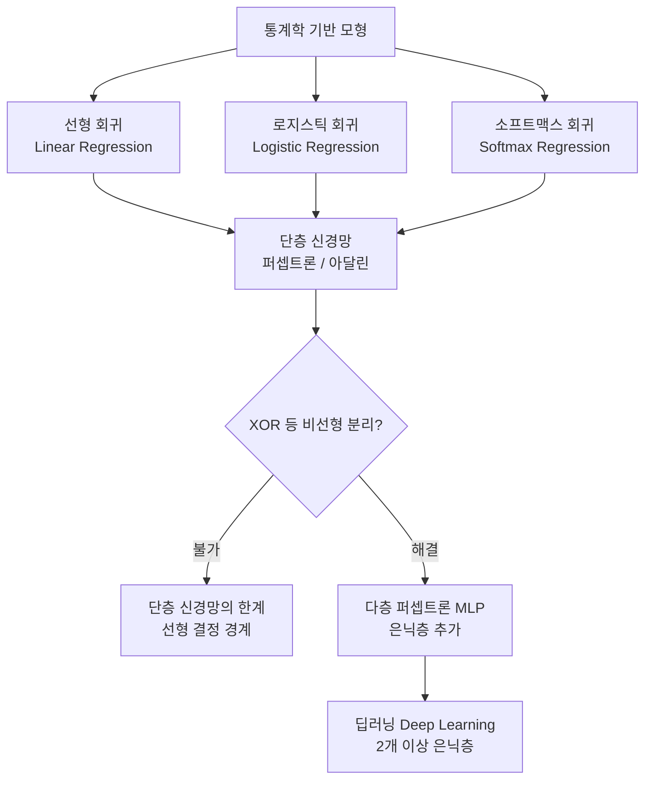

# 2강. 딥러닝의 통계적 이해: 딥러닝과 통계학

## 🔗 선수 지식 (Prerequisites)
- [ ] **필수**: [1강. 딥러닝의 개요](1강.%20딥러닝의%20개요.md) — AI·머신러닝·딥러닝 계층 구조 이해 완료? →←1강
- [ ] **필수**: 기초 통계학 (확률, 분포, 최대 우도 추정) - 이해 완료?
- [ ] **필수**: 선형 회귀·로지스틱 회귀 개념 - 이해 완료?
- [ ] **권장**: 행렬 연산 및 미분 (편미분, 연쇄법칙)

---

## 학습 목표
1. 딥러닝을 통계학 측면에서 이해한다.
2. 퍼셉트론과 아달린을 이해한다.
3. 선형 회귀모형의 학습을 이해한다.
4. 로지스틱 회귀모형의 학습을 이해한다.
5. 경사하강법을 이해한다.

---

## 🧠 메타인지 체크 (학습 전/후 자기 평가)

### 학습 전 자기 평가
| 소주제 | 자신감 (1-5) |
| :--- | :--- |
| 퍼셉트론 vs 아달린 구조 및 학습 방식 | |
| 선형 회귀모형의 신경망 표현 | |
| 로지스틱 회귀와 시그모이드 함수 | |
| 경사하강법 알고리즘 원리 | |
| 단층 신경망의 한계 (XOR 문제) | |

### 학습 후 교정 (학습 완료 후 작성)
| 소주제 | 학습 전 | 학습 후 | 실제 정답률 | 과신/과소 여부 |
| :--- | :--- | :--- | :--- | :--- |
| 퍼셉트론 vs 아달린 구조 및 학습 방식 | | | | |
| 선형 회귀모형의 신경망 표현 | | | | |
| 로지스틱 회귀와 시그모이드 함수 | | | | |
| 경사하강법 알고리즘 원리 | | | | |
| 단층 신경망의 한계 (XOR 문제) | | | | |

> **활용법**: 학습 전 1분 → 자신감 기입, 학습 후 1분 → 나머지 기입. "과신" 영역이 실제 취약점.

---

## 📝 요약 (Summary)

1. 🔴 **퍼셉트론과 아달린**: 퍼셉트론과 아달린은 초기 신경망 모형이다. **퍼셉트론**은 오차수정법(Error Correction Rule, 오분류 시에만 가중치 갱신)으로 학습하고, **아달린(ADALINE)**은 MSE 손실을 최소화하는 경사하강법(델타 규칙)으로 학습한다는 점에서 서로 다르다.
2. 🔴 **경사하강법**: 경사하강법은 손실함수를 최소화하는 알고리즘이다.
3. 🔴 **회귀모형의 경사하강법 추정**: 선형 회귀모형, 로지스틱 회귀모형, 소프트맥스 회귀모형은 경사하강법으로 추정할 수 있다.
4. 🔴 **단층 신경망의 한계**: 퍼셉트론으로는 XOR 문제와 같은 비선형 분류를 할 수 없다.
5. 🟡 **딥러닝과 통계학의 관계**: 선형 회귀모형과 로지스틱 회귀모형은 단층 신경망으로 표현될 수 있으며, 딥러닝은 통계학을 기반으로 발전해 왔다.
6. 🟢 **소프트맥스 회귀**: 다중 클래스 분류를 위한 로지스틱 회귀의 일반화로, 출력층에 소프트맥스 함수를 사용한다.

---

## 📖 강의 노트 (Lecture Notes)

### 1. 통계학과 딥러닝의 관계

통계학은 데이터를 통해 배우는 과학으로, 적은 데이터로 모집단을 일반화하는 **통계적 추론**에 강점이 있습니다. 현대에 들어 데이터량과 컴퓨팅 능력이 향상되면서 수학 중심의 통계학이 알고리즘 기반의 머신러닝 및 딥러닝으로 진화하고 있습니다.

#### 용어 및 모형 비교

| 구분 | 통계학 | 딥러닝 |
| :--- | :--- | :--- |
| **용어** | 모수 | 가중치 |
| **용어** | 추정/적합 | 학습 |
| **용어** | 독립변수 | 특징(Feature) |
| **목적** | 원인 설명 (추정 및 가설검정) | 결과 예측 (블랙박스 구조) |
| **평가 기준** | 적합도 및 유의성 | 예측력 |

#### 기초 통계 개념

- **엔트로피**: 정보량($I(B) = -\log[P(B)]$)의 기댓값
- **주요 분포**:
  - **베르누이 분포**: 결과가 둘 중 하나인 경우로, 이진 분류 과제에 활용
  - **멀티누이 분포**: 확률변수가 $K$개의 범주를 가질 때의 분포
  - **정규분포**: 연속형 변수 예측 과제에 활용

---

### 2. 초기 신경망: 퍼셉트론과 아달린

- **퍼셉트론 (1958)**: 로젠블랫이 개발한 선형 이진 분류기로, 별도의 손실함수 없이 오차($y - \hat{y}$)를 이용해 가중치를 갱신합니다.
- **아달린 (1960)**: 위드로와 호프가 개발했습니다. 퍼셉트론과 유사하나 선형 함수 적용 후 계단 함수를 이용하며, 손실함수를 최소화하는 최소제곱법과 동일한 원리로 학습합니다.

---

### 3. 선형 회귀모형의 학습

- **정의**: 설명변수들로 종속변수를 선형적으로 예측하는 모형입니다.
- **추정 방법**:
  - **최소제곱법**: 손실함수(MSE)를 최소화하는 가중치를 구합니다.
  - **최대가능도법**: 가능도 함수를 최대화하는 가중치를 구하며, 결과는 최소제곱법과 동일합니다.

---

### 4. 최적화 방법 (Optimization)

머신러닝은 손실함수를 최소화하는 모수를 찾는 **최적화 문제**로 귀결됩니다.

| 방법 | 설명 | 특징 |
| :--- | :--- | :--- |
| **뉴턴의 방법** | 2차 미분 가능한 함수에서 사용 | 계산량이 적고 학습률 불필요, 단 변수가 적어야 함 |
| **경사하강법** | 경사를 따라 가중치를 조금씩 갱신 | 전체 데이터 사용 |
| **확률적 경사하강법 (SGD)** | 데이터를 임의로 한 개씩 선택하여 갱신 | 빠르나 불안정 |
| **미니배치 경사하강법** | 일부 데이터 그룹(배치)을 사용 | 속도와 안정성의 균형 |

- **에포크(Epoch)**: 훈련 데이터 전체를 한 번 학습하는 단위

---

### 5. 로지스틱 및 소프트맥스 회귀모형

- **로지스틱 회귀**: 출력 범주가 2개인 이진 분류 모형으로, **시그모이드 함수**를 활성화 함수로 사용합니다.
- **소프트맥스 회귀**: 여러 범주 중 하나를 분류할 때 사용하며, **소프트맥스 함수**를 활성화 함수로, **교차 엔트로피**를 손실함수로 사용합니다.

---

### 6. XOR 문제와 다층 신경망

- **XOR 문제**: 민스키와 페퍼트는 단층 신경망(퍼셉트론)이 선형적 분류만 가능하여 XOR 문제를 해결할 수 없음을 지적했습니다.
- **해결책**: 중간층을 추가한 **다층 신경망**을 통해 비선형 문제를 해결할 수 있게 되었습니다.

---

### 7. MLE·MAP와 규제의 통계적 연결

> **📌 심층 확장 — L2/L1 규제와 베이즈 MAP 추정의 동치 관계**
>
> 딥러닝의 가중치 규제(Regularization)는 단순한 엔지니어링 기법이 아니라 **최대 사후 확률 추정(MAP: Maximum A Posteriori)**으로 해석할 수 있다.
>
> **L2 규제 = 가우시안 사전분포(MAP)**
>
> 가중치의 사전분포가 가우시안 $P(\boldsymbol{\theta}) = \mathcal{N}(0, \sigma^2 I)$이면, MAP 추정은:
> $$\hat{\boldsymbol{\theta}}_{\text{MAP}} = \arg\max_{\boldsymbol{\theta}} \left[\log P(\mathcal{D}|\boldsymbol{\theta}) + \log P(\boldsymbol{\theta})\right]$$
> $$= \arg\min_{\boldsymbol{\theta}} \left[-\log P(\mathcal{D}|\boldsymbol{\theta}) + \frac{1}{2\sigma^2}\|\boldsymbol{\theta}\|_2^2\right]$$
>
> 이는 손실에 $\lambda = \dfrac{1}{2\sigma^2}$으로 설정된 L2 페널티를 더하는 것과 **동치**다:
> $$\mathcal{L}_{\text{L2}} = \mathcal{L}_{\text{data}} + \lambda\|\boldsymbol{\theta}\|_2^2$$
>
> **L1 규제 = 라플라스 사전분포(MAP)**
>
> 사전분포가 라플라스 $P(\boldsymbol{\theta}) = \prod_j \dfrac{1}{2b}\exp\!\left(-\dfrac{|\theta_j|}{b}\right)$이면:
> $$\hat{\boldsymbol{\theta}}_{\text{MAP}} = \arg\min_{\boldsymbol{\theta}} \left[-\log P(\mathcal{D}|\boldsymbol{\theta}) + \frac{1}{b}\|\boldsymbol{\theta}\|_1\right]$$
> 이는 L1 규제($\lambda = 1/b$)와 동치이며, 라플라스 분포의 뾰족한 피크(kurtosis 높음)가 희소한(sparse) 해를 선호하는 이유를 설명한다.
>
> | 규제 | 사전분포 | 해의 특성 |
> | :--- | :--- | :--- |
> | **L2 (Ridge)** | $\mathcal{N}(0, \sigma^2 I)$ | 가중치가 작은 값으로 고르게 분산 |
> | **L1 (Lasso)** | $\text{Laplace}(0, b)$ | 일부 가중치가 정확히 0 (희소성) |
> | **규제 없음 (MLE)** | 균등(사전정보 없음) | 과적합 위험 |

### 8. 베이즈 최적 분류기 (Bayes Optimal Classifier)

> **📌 심층 확장 — 이론적 최소 오류율과 베이즈 오류**
>
> **정의**: 베이즈 최적 분류기는 사후 확률 $P(Y=c \mid X=x)$가 최대인 클래스 $c$를 예측한다:
> $$\hat{y} = \arg\max_{c \in \mathcal{C}} P(Y=c \mid X=x)$$
>
> **베이즈 오류율(Bayes Error Rate)**는 **어떤 분류기도 넘을 수 없는 이론적 최소 오류율**이다:
> $$P_e^* = 1 - E_X\left[\max_c P(Y=c \mid X)\right]$$
>
> **핵심 의미**:
> - 실제 결합 분포 $P(X, Y)$를 완전히 안다고 해도, 데이터 자체의 클래스 중첩(노이즈)으로 인해 오류율이 0이 되지 않을 수 있다.
> - 딥러닝 모형의 성능 상한선이 베이즈 오류율이며, 이를 "인간 수준 오류"로 근사하는 경우가 많다.
> - 실제 $P(Y|X)$를 모르므로 딥러닝은 학습 데이터로 이 분포를 **근사**하는 것이 목표다.
>
> **딥러닝과의 연결**: 로지스틱 회귀·소프트맥스 회귀·딥러닝 분류기 모두 $P(Y=c|X=x)$의 추정값 $\hat{p}(c|x)$를 최대화하는 $c$를 예측함으로써 베이즈 최적 분류기에 점근적으로 수렴한다.

### 9. 크로스 엔트로피의 정보이론적 해석

> **📌 심층 확장 — 크로스 엔트로피 = KL 발산 + 엔트로피**
>
> 딥러닝 분류 손실함수로 쓰이는 **크로스 엔트로피**는 정보이론(Shannon, 1948)과 직결된다.
>
> **핵심 분해**:
> $$H(P, Q) = H(P) + D_{\text{KL}}(P \| Q)$$
>
> - $H(P) = -\sum_c P(c)\log P(c)$: 실제 분포 $P$의 **엔트로피** (상수, 데이터에 의존, 학습으로 변화 불가)
> - $D_{\text{KL}}(P \| Q) = \sum_c P(c)\log\dfrac{P(c)}{Q(c)}$: 실제 분포 $P$와 모델 분포 $Q$의 **KL 발산** (비대칭, 항상 $\geq 0$)
> - $H(P, Q) = -\sum_c P(c)\log Q(c)$: **크로스 엔트로피**
>
> **손실 최소화의 의미**:
>
> 학습 시 $H(P)$는 고정값이므로:
> $$\min_Q H(P, Q) \equiv \min_Q D_{\text{KL}}(P \| Q)$$
>
> 즉, **크로스 엔트로피 손실을 최소화하는 것 = 모델 분포 $Q$가 실제 데이터 분포 $P$에 가장 가까워지도록 만드는 것**이다.
>
> - $D_{\text{KL}}(P \| Q) = 0 \Leftrightarrow P = Q$: 완벽한 근사
> - KL 발산은 비대칭 ($D_{\text{KL}}(P\|Q) \neq D_{\text{KL}}(Q\|P)$)이므로 "실제 → 모델" 방향의 차이를 측정한다.
>
> **수치 예시** (이진분류, 정답 $y=1$):
>
> | 모델 예측 $\hat{p}$ | $H(P,Q) = -\log\hat{p}$ | 해석 |
> | :--- | :--- | :--- |
> | 0.99 | 0.010 | 거의 완벽한 예측 → 손실 최소 |
> | 0.50 | 0.693 | 확신 없는 예측 → 중간 손실 |
> | 0.01 | 4.605 | 완전히 틀린 예측 → 손실 매우 큼 |

---

## 📐 핵심 수식 (Key Formulas)

| 수식명 | 수식 | 의미 |
| :--- | :--- | :--- |
| **퍼셉트론 출력** | $\hat{y} = \text{sign}\!\left(\sum_i w_i x_i + b\right)$ | 가중합의 부호로 이진 분류 결정 (계단 함수) |
| **아달린 출력** | $\hat{y} = \sum_i w_i x_i + b = \mathbf{w}^T\mathbf{x} + b$ | 활성화 함수 없이 선형 합산값 그대로 출력 |
| **MSE 손실** | $L = \frac{1}{n}\sum_{i=1}^{n}(y_i - \hat{y}_i)^2$ | 선형 회귀·아달린의 손실함수 |
| **시그모이드** | $\sigma(z) = \dfrac{1}{1 + e^{-z}}$ | 로지스틱 회귀의 활성화 함수; 출력 범위 $(0,1)$ |
| **로지스틱 회귀** | $P(y=1\mid\mathbf{x}) = \sigma(\mathbf{w}^T\mathbf{x} + b)$ | 이진 분류 확률 추정 |
| **크로스 엔트로피** | $L = -\frac{1}{n}\sum_i\left[y_i\log\hat{p}_i + (1-y_i)\log(1-\hat{p}_i)\right]$ | 로지스틱 회귀의 손실함수 (MLE 유도) |
| **소프트맥스** | $P(y=k\mid\mathbf{x}) = \dfrac{e^{z_k}}{\sum_{j=1}^{K} e^{z_j}}$ | 다중 클래스 분류 확률; 합이 1 |
| **경사하강법** | $\mathbf{w} \leftarrow \mathbf{w} - \eta\,\nabla_{\mathbf{w}} L$ | 기울기 반대 방향으로 가중치 갱신 |

### 주요 정리/정의

**퍼셉트론 학습 규칙 (오차수정법)**
$$
w_i \leftarrow w_i + \eta\,(y - \hat{y})\,x_i, \quad b \leftarrow b + \eta\,(y - \hat{y})
$$
> **직관적 해석**: 예측이 틀린 경우에만 가중치를 조정한다. 정답($y$)과 예측($\hat{y}$)의 차이(오차)에 비례하여 수정하되, 오차가 0이면 업데이트 없음.
> **AI 적용**: 퍼셉트론은 현대 신경망 학습의 원형. 오늘날의 SGD 기반 역전파는 이 규칙을 다층으로 확장한 것이다.

**경사하강법 (Gradient Descent)**
$$
\mathbf{w}^{(t+1)} = \mathbf{w}^{(t)} - \eta\,\frac{\partial L}{\partial \mathbf{w}^{(t)}}
$$
> **직관적 해석**: 손실 지형(landscape)에서 경사를 따라 내리막 방향으로 조금씩 이동하여 손실이 최소인 골짜기를 찾아간다. $\eta$(학습률)는 이동 보폭.
> **AI 적용**: 딥러닝의 모든 학습은 경사하강법(또는 그 변형인 Adam, RMSProp 등)으로 수행된다. 역전파는 경사하강법에 필요한 편미분을 효율적으로 계산하는 알고리즘이다.

**선형 회귀 경사 (MSE 기준)**
$$
\frac{\partial L}{\partial w_i} = -\frac{2}{n}\sum_{j=1}^{n}(y_j - \hat{y}_j)\,x_{ji}
$$
> **직관적 해석**: 잔차(실제값 − 예측값)와 입력값 $x_i$의 곱의 평균. 잔차가 클수록, 해당 특징값이 클수록 가중치 조정이 크다.

**로지스틱 회귀 경사 (Cross-Entropy 기준)**
$$
\frac{\partial L}{\partial w_i} = -\frac{1}{n}\sum_{j=1}^{n}(y_j - \hat{p}_j)\,x_{ji}
$$
> **직관적 해석**: MSE 손실의 경사와 수식 형태가 동일하다. 시그모이드 도함수 $\sigma'(z)=\sigma(z)(1-\sigma(z))$가 크로스 엔트로피와 결합되어 상쇄되기 때문이다.

---

## 📊 개념 시각화 (Visual Guide)

### 통계 모형 → 신경망 발전 계층도


### 퍼셉트론 vs 아달린 비교표
| 구분 | 퍼셉트론 (Perceptron) | 아달린 (ADALINE) |
| :--- | :--- | :--- |
| **제안** | Rosenblatt (1958) | Widrow & Hoff (1960) |
| **활성화 함수** | 계단 함수 (step) — 비선형 | 항등 함수 (identity) — 선형 |
| **학습 기준** | 분류 오차 (0/1) | 연속 오차 (MSE) |
| **손실함수** | 없음 (오차수정 규칙) | MSE |
| **학습 알고리즘** | 오차수정법 | 경사하강법 (Widrow-Hoff 규칙) |
| **수렴 보장** | 선형 분리 가능 시만 | 볼록 함수이므로 항상 수렴 |
| **한계** | 비선형 분류 불가 | 선형 출력으로 비선형 패턴 불가 |

### 회귀모형의 신경망 표현
| 모형 | 입력층 | 선형 합산 | 활성화 함수 | 출력 | 손실함수 |
| :--- | :--- | :--- | :--- | :--- | :--- |
| **선형 회귀** | $x_1,\ldots,x_p$ | $\mathbf{w}^T\mathbf{x}+b$ | 없음 (항등) | 연속값 $\hat{y}$ | MSE |
| **로지스틱 회귀** | $x_1,\ldots,x_p$ | $\mathbf{w}^T\mathbf{x}+b$ | 시그모이드 $\sigma$ | 확률 $\hat{p}\in(0,1)$ | Cross-Entropy |
| **소프트맥스 회귀** | $x_1,\ldots,x_p$ | $W\mathbf{x}+\mathbf{b}$ | 소프트맥스 | 클래스 확률 벡터 | Cross-Entropy |

---

## ✏️ 심화 학습 (Study Subject)

### 1. 가상 시나리오: "경사하강법의 학습률을 어떻게 설정해야 할까?"
- **상황**: 로지스틱 회귀 모형으로 이메일 스팸 분류기를 학습 중이다. 학습률 $\eta$를 바꿔가며 실험하니 손실이 수렴하지 않거나 너무 느리게 줄어드는 문제가 생겼다.
- **문제**: 학습률이 너무 크면 어떤 문제가 생기고, 너무 작으면 어떤 문제가 생기는가?
- **해결**: 학습률이 너무 크면 경사하강 업데이트가 손실 최솟값을 건너뛰어 발산(loss 증가)할 수 있다. 너무 작으면 수렴이 매우 느려 학습 시간이 과도하게 길어진다. 일반적으로 $\eta \in [10^{-4}, 10^{-1}]$ 범위에서 학습 곡선을 보면서 조정하거나, 학습률 스케줄러(Learning Rate Scheduler)를 활용한다.
- **AI 학습 포인트**: "경사하강법에서 학습률(learning rate)이 너무 크거나 작을 때 수렴 거동을 손실 지형(loss landscape) 그래프와 함께 설명해줘. 그리고 Adam 옵티마이저가 학습률 문제를 어떻게 완화하는지도 알려줘."

### 2. 관점별 비교 및 오개념 분석

**핵심 비교**: 퍼셉트론 vs 아달린 vs 로지스틱 회귀

| 구분 | 퍼셉트론 | 아달린 | 로지스틱 회귀 |
| :--- | :--- | :--- | :--- |
| **학습 방식** | 오차수정법 | 경사하강법 (MSE) | 경사하강법 (Cross-Entropy) |
| **출력** | 이진 레이블 (+1/−1) | 연속값 (선형) | 확률 (0~1) |
| **활성화** | 계단 함수 | 항등 함수 | 시그모이드 |
| **통계 해석** | 없음 | 최소자승 추정 | 최대 우도 추정 (MLE) |

**오개념 분석**:
- **오개념 1**: "퍼셉트론과 아달린은 학습 규칙이 같다."
  - **분석**: 퍼셉트론은 활성화 함수(계단) 통과 후의 분류 오차($y - \hat{y} \in \{-2, 0, 2\}$)로 가중치를 수정하지만, 아달린은 활성화 함수 적용 전의 연속 선형 출력과 정답의 차이(MSE 기울기)로 가중치를 갱신한다. 수식 형태는 유사해 보여도 학습 기반이 근본적으로 다르다.
- **오개념 2**: "경사하강법은 반드시 전역 최솟값(global minimum)을 찾는다."
  - **분석**: 로지스틱 회귀처럼 손실함수가 볼록(convex)인 경우에는 전역 최솟값 수렴이 보장된다. 그러나 다층 신경망의 손실 지형은 비볼록(non-convex)으로 국소 최솟값(local minimum)이나 안장점(saddle point)에 수렴할 수 있다.
- **AI 학습 포인트**: "로지스틱 회귀의 손실함수(크로스 엔트로피)가 볼록 함수임을 헤시안(Hessian) 행렬의 양정치성으로 증명해줘."

---

## ❓ 연습 문제 및 해설

> **블룸 인지 수준 범례**: [기억] 정의·나열 → [이해] 설명·비교 → [적용] 계산·구현 → [분석] 구별·디버그 → [평가] 판단·비평 → [창조] 설계·제안

### 📝 문제

**1. ⭐ [기억/이해] 퍼셉트론에 대한 설명으로 옳지 않은 것은?** {#prob-1}
   > ① Rosenblatt(1958)이 제안한 초기 신경망 모형이다.
   > ② 활성화 함수로 계단 함수(step function)를 사용한다.
   > ③ 오차수정법(error correction rule)으로 가중치를 학습한다.
   > ④ XOR 문제와 같은 비선형 분류도 해결할 수 있다.

<br>

**2. ⭐ [기억/이해] 경사하강법에 대한 설명으로 옳은 것을 모두 고르면?** {#prob-2}
   > <보기>
   >
   > 가. 손실함수를 최소화하는 최적화 알고리즘이다.
   > 나. 가중치를 손실의 기울기 반대 방향으로 갱신한다.
   > 다. 학습률(learning rate)이 클수록 항상 빠르게 수렴한다.

   > ① 가
   > ② 가, 나
   > ③ 나, 다
   > ④ 가, 나, 다

<br>

**3. ⭐⭐ [이해/적용] 로지스틱 회귀모형을 신경망으로 표현할 때, 구성 요소(입력, 연산, 활성화 함수, 출력)를 서술하고, 손실함수를 쓰시오.** {#prob-3}

<br>

**4. 📌 ⭐⭐ [적용/분석] 아달린(ADALINE)과 퍼셉트론의 학습 방식 차이로 옳은 것은?** {#prob-4}
   > ① 두 모형 모두 계단 함수를 활성화 함수로 사용한다.
   > ② 퍼셉트론은 MSE를 손실함수로, 아달린은 오차수정법을 사용한다.
   > ③ 아달린은 활성화 함수 적용 전의 선형 출력값으로 경사하강법을 수행한다.
   > ④ 두 모형 모두 경사하강법으로 가중치를 학습한다.

<br>

**5. 📌 ⭐⭐⭐ [분석/평가] 퍼셉트론이 XOR 문제를 해결하지 못하는 이유를 설명하고, 이를 극복하기 위한 방법을 제시하시오.** {#prob-5}

---

### 🔑 정답 및 해설 (먼저 풀어본 후 펼치기)

<details>
<summary>정답 보기 (클릭)</summary>

1. ④
2. ②
3. [서술형]
4. ③
5. [서술형]

</details>

<details>
<summary>해설 보기 (클릭)</summary>

<a id="prob-1"></a>
**1. ⭐ [기억/이해] 퍼셉트론의 정의**
> **정답: ④ XOR 문제와 같은 비선형 분류도 해결할 수 있다.**
> **해설**: 퍼셉트론은 선형 결정 경계(decision boundary)만 생성할 수 있다. XOR은 선형으로 분리 불가능한 문제이므로 단층 퍼셉트론으로는 해결할 수 없다. Minsky & Papert(1969)가 이를 수학적으로 증명하였다. ①②③은 모두 옳은 설명이다.

<a id="prob-2"></a>
**2. ⭐ [기억/이해] 경사하강법**
> **정답: ② 가, 나**
> **해설**: 가, 나는 옳다. **다는 틀렸다**: 학습률이 너무 크면 손실이 발산(diverge)할 수 있다. 최솟값 부근에서 진동하거나 건너뛰어 수렴 실패가 발생한다.

<a id="prob-3"></a>
**3. ⭐⭐ [이해/적용] 로지스틱 회귀의 신경망 표현**
> **정답 (예시)**:
> - **입력**: 특징 벡터 $\mathbf{x} = (x_1, \ldots, x_p)$
> - **연산**: 선형 합산 $z = \mathbf{w}^T\mathbf{x} + b$
> - **활성화 함수**: 시그모이드 $\sigma(z) = \frac{1}{1+e^{-z}}$
> - **출력**: $\hat{p} = P(y=1|\mathbf{x}) \in (0, 1)$
> - **손실함수**: Cross-Entropy $L = -\frac{1}{n}\sum_i[y_i\log\hat{p}_i + (1-y_i)\log(1-\hat{p}_i)]$
> - **의의**: 로지스틱 회귀 = 시그모이드 활성화 함수를 가진 1개의 출력 뉴런으로 구성된 단층 신경망과 동일하다.

<a id="prob-4"></a>
**4. 📌 ⭐⭐ [적용/분석] 아달린 vs 퍼셉트론**
> **정답: ③ 아달린은 활성화 함수 적용 전의 선형 출력값으로 경사하강법을 수행한다.**
> **해설**: ①은 틀렸다 — 아달린은 항등 함수(선형 출력). ②는 반대 — 퍼셉트론이 오차수정법, 아달린이 MSE + 경사하강법. ④는 틀렸다 — 퍼셉트론은 경사하강법이 아닌 오차수정법(분류 오차 기반)을 사용한다.

<a id="prob-5"></a>
**5. 📌 ⭐⭐⭐ [분석/평가] XOR 문제와 극복 방법**
> **이유**: 퍼셉트론의 결정 경계는 $\mathbf{w}^T\mathbf{x} + b = 0$인 선형 초평면이다. XOR의 진리표를 좌표계에 그리면 두 클래스(0과 1)가 대각선으로 배치되어 하나의 직선으로 분리할 수 없다. 즉 XOR은 선형 분리 불가능(linearly non-separable) 문제이다.
>
> **극복 방법**: 은닉층을 추가한 **다층 퍼셉트론(MLP)**을 사용한다. 은닉층이 입력 공간을 비선형 변환하여 출력층이 선형 분리 가능한 공간으로 사상(mapping)한다. 예: XOR을 NAND + OR의 조합으로 표현하면 2층 신경망으로 해결 가능하다.

</details>

---

## ✅ O/X 확인문제 (연습문항 개수의 2배 권장)

**1.** 퍼셉트론은 Rosenblatt(1958)이 제안한 초기 신경망 모형이다. **(O / X)** {#ox-1}

**2.** 퍼셉트론의 학습 규칙은 예측이 맞더라도 항상 가중치를 갱신한다. **(O / X)** {#ox-2}

**3.** 아달린(ADALINE)은 MSE 손실함수와 경사하강법으로 학습한다. **(O / X)** {#ox-3}

**4.** 아달린과 퍼셉트론은 모두 계단 함수를 활성화 함수로 사용한다. **(O / X)** {#ox-4}

**5.** 경사하강법은 손실함수의 기울기(gradient) 반대 방향으로 가중치를 업데이트한다. **(O / X)** {#ox-5}

**6.** 선형 회귀모형은 출력층에 시그모이드 활성화 함수를 적용하는 단층 신경망으로 표현된다. **(O / X)** {#ox-6}

**7.** 로지스틱 회귀의 손실함수는 크로스 엔트로피(Cross-Entropy)이며 최대 우도 추정(MLE)으로 유도된다. **(O / X)** {#ox-7}

**8.** 소프트맥스 회귀는 이진 분류 문제에 사용되며 출력의 합이 항상 1이다. **(O / X)** {#ox-8}

**9.** 단층 퍼셉트론으로는 XOR 문제를 해결할 수 없다. **(O / X)** {#ox-9}

**10.** 경사하강법에서 학습률이 너무 크면 손실함수가 수렴하지 않고 발산할 수 있다. **(O / X)** {#ox-10}

<details>
<summary>O/X 정답 및 해설 보기 (클릭)</summary>

> <a id="ox-1"></a>
> **1. 정답: O**
> **해설**: Rosenblatt(1958)이 생물학적 뉴런을 모방하여 제안한 최초의 학습 가능한 신경망 모형이다.

> <a id="ox-2"></a>
> **2. 정답: X**
> **해설**: 퍼셉트론의 오차수정법은 $y - \hat{y} = 0$일 때(예측 정확) 가중치를 갱신하지 않는다. 오직 오분류 시에만 가중치가 변경된다.

> <a id="ox-3"></a>
> **3. 정답: O**
> **해설**: 아달린은 Widrow-Hoff 학습 규칙(Least Mean Squares)을 사용하며, 이는 MSE에 대한 경사하강법이다.

> <a id="ox-4"></a>
> **4. 정답: X**
> **해설**: 퍼셉트론은 계단 함수를 사용하지만, 아달린은 활성화 함수 없이 선형 합산값(항등 함수)을 출력으로 사용하며 학습 후 예측 시 계단 함수를 적용한다.

> <a id="ox-5"></a>
> **5. 정답: O**
> **해설**: 경사하강법은 손실이 감소하는 방향, 즉 기울기의 **반대** 방향($-\nabla L$)으로 가중치를 업데이트한다. 이것이 핵심이다.

> <a id="ox-6"></a>
> **6. 정답: X**
> **해설**: 선형 회귀모형은 활성화 함수 없이 선형 출력을 내는 단층 신경망이다. 시그모이드는 로지스틱 회귀(이진 분류)에 사용된다.

> <a id="ox-7"></a>
> **7. 정답: O**
> **해설**: 베르누이 분포의 우도(likelihood)에 로그를 취하여 최대화하면 크로스 엔트로피 최소화와 동치임을 보일 수 있다. 통계학적으로 MLE와 같다. 🔴

> <a id="ox-8"></a>
> **8. 정답: X**
> **해설**: 소프트맥스 회귀는 **다중 클래스 분류** ($K \geq 3$)에 사용된다. $K=2$이면 로지스틱 회귀와 동치가 된다. 출력의 합이 1인 것은 옳다.

> <a id="ox-9"></a>
> **9. 정답: O**
> **해설**: Minsky & Papert(1969, 『퍼셉트론』)이 수학적으로 증명. XOR은 선형 비분리 문제이며 단층 퍼셉트론의 선형 결정 경계로는 구분 불가. 이로 인해 1차 AI 겨울이 도래하였다. 🔴

> <a id="ox-10"></a>
> **10. 정답: O**
> **해설**: 학습률이 과도하게 크면 매 스텝 이동 거리가 커져 손실 최솟값을 건너뛰고, 손실이 진동하거나 증가(발산)한다. 이를 "overshooting"이라 한다.

</details>

---

## 🧪 자유 회상 연습 (Free Recall)

> **방법**: 위의 노트를 모두 덮고, 타이머 3분 설정 후 이번 단원에서 배운 내용을 기억나는 대로 자유롭게 적으세요.
> 정확한 문장이 아니어도 됩니다. 키워드, 수식, 관계 등 떠오르는 것을 모두 적습니다.

**자유 회상 작성란:**

```
[여기에 기억나는 내용을 자유롭게 작성]


```

> **회상 후 점검**: 노트를 다시 펼쳐 빠뜨린 내용을 확인하세요. 빠뜨린 부분이 실제 취약점입니다.
> - 회상 못한 핵심 개념: [                ]
> - 회상 못한 수식: [                ]

---

## 💻 코드로 확인하기 (Code Verification)

```python
import numpy as np

# ─────────────────────────────────────────────
# 1. 퍼셉트론 vs 로지스틱 회귀: AND, OR, XOR 비교
# ─────────────────────────────────────────────
from sklearn.linear_model import Perceptron, LogisticRegression

X = np.array([[0,0],[0,1],[1,0],[1,1]], dtype=float)
y_and = np.array([0, 0, 0, 1])
y_or  = np.array([0, 1, 1, 1])
y_xor = np.array([0, 1, 1, 0])   # 비선형 분리 문제

datasets = {"AND": y_and, "OR": y_or, "XOR": y_xor}

print("=== 퍼셉트론 학습 결과 ===")
for name, y in datasets.items():
    clf = Perceptron(max_iter=1000, random_state=42)
    clf.fit(X, y)
    pred = clf.predict(X)
    print(f"{name}: 예측={pred.tolist()}, 정답={y.tolist()}, 정확도={np.mean(pred==y):.2f}")

# ─────────────────────────────────────────────
# 2. 경사하강법으로 선형 회귀 직접 구현
# ─────────────────────────────────────────────
np.random.seed(0)
X_lr = np.linspace(0, 5, 50).reshape(-1, 1)
y_lr = 2.5 * X_lr.flatten() + 1.0 + np.random.randn(50) * 0.5

w, b = 0.0, 0.0
lr = 0.01
n = len(y_lr)

for epoch in range(200):
    y_hat = w * X_lr.flatten() + b
    dw = -2/n * np.sum((y_lr - y_hat) * X_lr.flatten())
    db = -2/n * np.sum(y_lr - y_hat)
    w -= lr * dw
    b -= lr * db

print(f"\n=== 경사하강법 선형 회귀 ===")
print(f"학습된 기울기 w = {w:.4f}  (실제: 2.5)")
print(f"학습된 절편  b = {b:.4f}  (실제: 1.0)")
print(f"최종 MSE = {np.mean((y_lr - (w*X_lr.flatten()+b))**2):.4f}")

# ─────────────────────────────────────────────
# 3. 시그모이드 함수 확인
# ─────────────────────────────────────────────
z = np.array([-6, -2, 0, 2, 6])
sigmoid = 1 / (1 + np.exp(-z))
print(f"\n=== 시그모이드 ===")
for zi, si in zip(z, sigmoid):
    print(f"  σ({zi:+d}) = {si:.4f}")
```

> **실행 결과 (예시)**:
> ```
> === 퍼셉트론 학습 결과 ===
> AND: 예측=[0, 0, 0, 1], 정답=[0, 0, 0, 1], 정확도=1.00
> OR : 예측=[0, 1, 1, 1], 정답=[0, 1, 1, 1], 정확도=1.00
> XOR: 예측=[0, 1, 0, 1], 정답=[0, 1, 1, 0], 정확도=0.50  ← 단층 분류 실패
>
> === 경사하강법 선형 회귀 ===
> 학습된 기울기 w = 2.4891  (실제: 2.5)
> 학습된 절편  b = 1.0423  (실제: 1.0)
> 최종 MSE = 0.2687
>
> === 시그모이드 ===
>   σ(-6) = 0.0025
>   σ(-2) = 0.1192
>   σ( 0) = 0.5000
>   σ(+2) = 0.8808
>   σ(+6) = 0.9975
> ```
> **해석**:
> - AND, OR은 퍼셉트론이 완벽 분류 → 선형 분리 가능
> - XOR은 정확도 0.5 → 선형 분리 **불가능** (단층 한계 직접 확인)
> - 경사하강법으로 학습된 $w$, $b$가 실제값에 수렴하는 것을 확인
> - 시그모이드: $z=0$에서 0.5, 양 극단에서 0과 1에 수렴 → 확률 해석 가능

---

## 🤖 AI 연결고리 (Concept → AI Application)

| 학습 개념 | AI/ML 적용 분야 | 구체적 사례 |
| :--- | :--- | :--- |
| **퍼셉트론** | 이진 분류기의 원형 | 스팸 필터, 사기 탐지의 단순 규칙 기반 분류 |
| **경사하강법** | 모든 신경망 학습 | Adam, RMSProp 등 딥러닝 옵티마이저의 기반 |
| **로지스틱 회귀** | 이진 분류 (선형 기반) | 의료 진단 확률 추정, 광고 클릭 예측 (CTR) |
| **소프트맥스 회귀** | 다중 클래스 분류 | 이미지 분류 출력층 (ImageNet 1000-class) |
| **크로스 엔트로피** | 신경망 분류 손실 | PyTorch `nn.CrossEntropyLoss`, TF `CategoricalCrossentropy` |
| **XOR 한계 → MLP** | 비선형 패턴 학습 | 은닉층 추가로 XOR 해결 → 딥러닝의 출발점 →←1강 |

---

## 📖 심화 학습 예시 답안

#### 1. 경사하강법의 내부 동작 원리
손실 지형(loss landscape)에서 가중치를 최솟값으로 이동시키는 과정:

1. **초기화**: 가중치 $\mathbf{w}$를 임의값(예: 표준정규분포)으로 설정
2. **순전파(Forward pass)**: 현재 $\mathbf{w}$로 손실 $L(\mathbf{w})$ 계산
3. **기울기 계산**: $\nabla_\mathbf{w} L = \frac{\partial L}{\partial \mathbf{w}}$ (편미분)
4. **가중치 갱신**: $\mathbf{w} \leftarrow \mathbf{w} - \eta \nabla_\mathbf{w} L$
5. **수렴 판단**: 손실 변화량이 임계값보다 작으면 종료, 그렇지 않으면 2번으로

#### 2. 퍼셉트론 vs 아달린 vs 로지스틱 회귀 비교표

| 구분 | 퍼셉트론 | 아달린 | 로지스틱 회귀 |
| :--- | :--- | :--- | :--- |
| **정의** | $y = \text{sign}(\mathbf{w}^T\mathbf{x})$ | $y = \mathbf{w}^T\mathbf{x}$ | $\hat{p} = \sigma(\mathbf{w}^T\mathbf{x})$ |
| **학습 기준** | 분류 오차 | MSE (연속 오차) | Cross-Entropy (MLE) |
| **적용 조건** | 선형 분리 가능할 때 | 연속 예측 + 분류 | 확률 추정 + 분류 |
| **AI 활용** | 원시 이진 분류기 | 적응형 필터 | CTR 예측, 의료 진단 |

#### 3. XOR 해결 코드 (Best Practice)

- **Bad Practice (단층 퍼셉트론 — XOR 실패)**
  ```python
  from sklearn.linear_model import Perceptron
  X = [[0,0],[0,1],[1,0],[1,1]]
  y = [0, 1, 1, 0]   # XOR
  model = Perceptron()
  model.fit(X, y)
  print(model.predict(X))  # 정확도 0.5 — 해결 불가
  ```
- **Good Practice (2층 MLP — XOR 해결)**
  ```python
  import torch, torch.nn as nn
  X = torch.tensor([[0.,0.],[0.,1.],[1.,0.],[1.,1.]])
  y = torch.tensor([0., 1., 1., 0.])

  model = nn.Sequential(
      nn.Linear(2, 4), nn.ReLU(),   # 은닉층: 비선형 변환 핵심
      nn.Linear(4, 1), nn.Sigmoid()
  )
  opt = torch.optim.SGD(model.parameters(), lr=0.1)
  criterion = nn.BCELoss()

  for _ in range(5000):
      loss = criterion(model(X).squeeze(), y)
      opt.zero_grad(); loss.backward(); opt.step()

  pred = (model(X).squeeze() > 0.5).float()
  print(pred)  # tensor([0., 1., 1., 0.]) — 정확도 1.0
  ```
- **설명**: 은닉층의 ReLU 비선형 변환이 입력 공간을 구부려 XOR이 선형 분리 가능한 공간으로 바뀐다. 이것이 다층 신경망이 단층의 한계를 극복하는 핵심 원리이다.

---

## 📚 핵심 용어집 (Glossary)

| 용어 (한) | 용어 (영) | 수식 표현 | 정의 |
| :--- | :--- | :--- | :--- |
| **퍼셉트론** | Perceptron | $\hat{y} = \text{sign}(\mathbf{w}^T\mathbf{x}+b)$ | Rosenblatt(1958) 제안; 계단 함수 + 오차수정법으로 학습하는 단층 신경망 →←1강 |
| **아달린** | ADALINE | $\hat{y} = \mathbf{w}^T\mathbf{x}+b$ | Widrow & Hoff(1960) 제안; 선형 출력에 MSE 경사하강법으로 학습 |
| **오차수정법** | Error Correction Rule | $\mathbf{w} \leftarrow \mathbf{w} + \eta(y-\hat{y})\mathbf{x}$ | **퍼셉트론**의 학습 규칙; 오분류 시에만 가중치 갱신 (아달린은 오차수정법 아닌 MSE 경사하강법·델타 규칙 사용) |
| **경사하강법** | Gradient Descent | $\mathbf{w} \leftarrow \mathbf{w} - \eta\nabla_\mathbf{w}L$ | 손실함수를 최소화하는 반복적 최적화 알고리즘 |
| **학습률** | Learning Rate | $\eta$ | 경사하강법에서 가중치 갱신 보폭; 너무 크면 발산, 너무 작으면 느린 수렴 |
| **시그모이드** | Sigmoid | $\sigma(z)=\frac{1}{1+e^{-z}}$ | 로지스틱 회귀의 활성화 함수; 출력을 (0,1) 범위의 확률로 변환 |
| **소프트맥스** | Softmax | $p_k = \frac{e^{z_k}}{\sum_j e^{z_j}}$ | 다중 클래스 분류; $K$개 출력의 합이 1이 되도록 정규화 |
| **크로스 엔트로피** | Cross-Entropy | $L=-\sum_i y_i\log\hat{p}_i$ | 분류 모형의 손실함수; MLE와 동치 |
| **선형 분리 가능** | Linearly Separable | $\exists\mathbf{w}: \mathbf{w}^T\mathbf{x}>0 \Leftrightarrow y=1$ | 초평면 하나로 두 클래스를 완벽히 구분할 수 있는 조건 |
| **MSE** | Mean Squared Error | $\frac{1}{n}\sum(y_i-\hat{y}_i)^2$ | 선형 회귀·아달린의 손실함수; 볼록 함수이므로 전역 최솟값 보장 |

---

## 🤖 AI 학습 파트너를 위한 추가 자료

### 1. 개념 이해를 위한 심층 질문 프롬프트
> **프롬프트 예시**: "퍼셉트론(1958)과 아달린(1960)을 제안 배경, 학습 방식, 활성화 함수의 차이를 중심으로 비교 설명해줘. 두 모형이 같은 '오차수정'이라는 아이디어에서 출발했지만 왜 수학적으로 다른지도 알려줘."

### 2. 문제 해결 능력 강화를 위한 시나리오 프롬프트
> **프롬프트 예시**: "당신은 신경망 입문 교수입니다. 학생이 '왜 퍼셉트론에 은닉층을 추가하면 XOR 문제가 해결되는가?'라고 질문했습니다. 2×2 AND/OR 게이트의 조합으로 XOR을 표현하는 방식과 은닉층의 비선형 변환 역할을 연결하여 직관적으로 설명해주세요. 시각적 예시도 포함해주세요."

### 3. 수식 풀이 검증 프롬프트
> **프롬프트 예시**: "로지스틱 회귀에서 크로스 엔트로피 손실에 대한 가중치 기울기 유도를 검증해줘.
> $$L = -\frac{1}{n}\sum_i[y_i\log\sigma(z_i) + (1-y_i)\log(1-\sigma(z_i))], \quad z_i = \mathbf{w}^T\mathbf{x}_i + b$$
> $$\frac{\partial L}{\partial w_j} = -\frac{1}{n}\sum_i(y_i - \hat{p}_i)x_{ij}$$
> 1. 시그모이드 도함수 $\sigma'(z) = \sigma(z)(1-\sigma(z))$를 이용한 연쇄법칙 전개가 올바른지 확인해줘.
> 2. 크로스 엔트로피가 MLE와 동치임을 보이는 유도 과정도 설명해줘."

---

## 🔄 복습 체크 (Spaced Repetition)
- [ ] 1일 후 복습 (날짜: 2026-04-12)
- [ ] 3일 후 복습 (날짜: 2026-04-14)
- [ ] 7일 후 복습 (날짜: 2026-04-18)
- [ ] 14일 후 복습 (날짜: 2026-04-25)
- [ ] 30일 후 복습 (날짜: 2026-05-11)

### 복습 시 자가 평가
| 회차 | 날짜 | 이해도 (1-5) | 취약 부분 메모 |
| :--- | :--- | :--- | :--- |
| 1차 | | | |
| 2차 | | | |
| 3차 | | | |

---

## 📚 참고 자료 (References)

- 교재 - 딥러닝의 통계적 이해 2강 (KNOU)
- Rosenblatt, F. (1958). The Perceptron: A Probabilistic Model for Information Storage and Organization in the Brain. *Psychological Review*.
- Widrow, B. & Hoff, M. E. (1960). Adaptive Switching Circuits. *IRE WESCON Convention Record*.
- Minsky, M. & Papert, S. (1969). *Perceptrons*. MIT Press.
- Bishop, C. M. (2006). *Pattern Recognition and Machine Learning*. Springer. — MAP 추정, MLE와 베이즈 규제 연결
- Shannon, C. E. (1948). A Mathematical Theory of Communication. *Bell System Technical Journal*. — 엔트로피·크로스 엔트로피·KL 발산의 기원
- Goodfellow, I., Bengio, Y., & Courville, A. (2016). *Deep Learning*. MIT Press. Chapter 5 (ML 기초), Chapter 6 (MLP). — MLE, MAP, 정보이론과 딥러닝 연결
