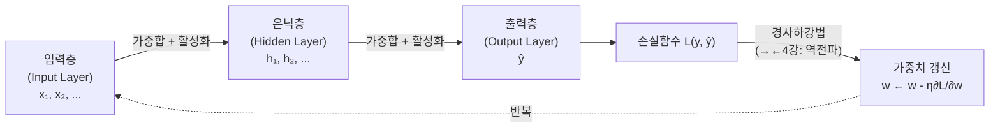
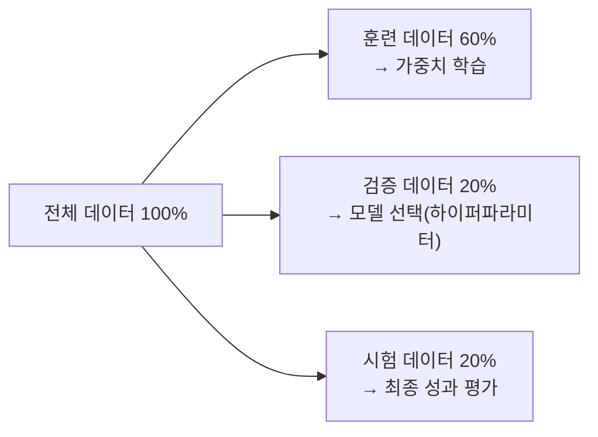

# 딥러닝의 통계적 이해: 3강. 딥러닝 모형의 구조와 학습 (1)

## 🔗 선수 지식 (Prerequisites)
- [ ] **필수**: [2강. 딥러닝과 통계학](2강.%20딥러닝과%20통계학.md) — 손실함수, 최적화 개념 이해 완료?
- [ ] **필수**: [1강. 딥러닝의 개요](1강.%20딥러닝의%20개요.md) — 퍼셉트론, 신경망 기본 구조 이해 완료?
- [ ] **권장**: 행렬 곱, 합성함수의 미분(연쇄법칙) 기초
- **관련 단원**: [4강. 딥러닝 모형의 구조와 학습 (2)](4강.%20딥러닝%20모형의%20구조와%20학습%20(2).md) — 역전파·경사소실은 →←4강

---

## 학습 목표
1. 다층신경망(MLP)의 입력층·은닉층·출력층 구조를 설명할 수 있다.
2. 주요 활성화 함수(항등함수, Sigmoid, tanh, ReLU)의 수식과 특성을 비교할 수 있다.
3. 경사하강법을 이용한 신경망 학습 원리(손실함수 최소화, 에포크)를 설명할 수 있다.

---

## 🧠 메타인지 체크 (학습 전/후 자기 평가)

### 학습 전 자기 평가
| 소주제 | 자신감 (1-5) |
| :--- | :--- |
| MLP 구조 (층 구성, 완전연결망) | |
| 활성화 함수 종류 및 수식 | |
| 학습 원리 (경사하강법, 에포크) | |

### 학습 후 교정 (학습 완료 후 작성)
| 소주제 | 학습 전 | 학습 후 | 실제 정답률 | 과신/과소 여부 |
| :--- | :--- | :--- | :--- | :--- |
| MLP 구조 | | | | |
| 활성화 함수 | | | | |
| 학습 원리 | | | | |

> **활용법**: 학습 전 1분 → 자신감 기입, 학습 후 1분 → 나머지 기입. "과신" 영역이 실제 취약점.

---

## 📝 요약 (Summary)

1. 🔴 **다층신경망(MLP) 구조**: 입력층 → 은닉층(1개 이상) → 출력층으로 구성된 순방향 신경망이다. 각 층의 뉴런이 앞층 전체와 연결된 구조를 완전연결망(FCN)이라 하며, 합성함수 $y = f^{(3)}(f^{(2)}(f^{(1)}(x)))$ 형태로 표현된다.
2. 🔴 **활성화 함수**: 뉴런이 임계값을 넘었을 때 활성화 신호를 다음 층으로 전달하는 함수이다. Sigmoid·tanh는 경사 소실 위험이 있고, 현대 딥러닝에서는 ReLU가 주로 쓰인다. 출력층은 과제에 따라 항등함수(회귀)·Sigmoid(이진분류)·Softmax(다중분류)를 사용한다.
3. 🟡 **일반근사정리(Universal Approximation Theorem)**: 충분한 뉴런을 가진 은닉층이 하나 이상 있으면 모든 유계 연속함수를 임의의 정밀도로 근사할 수 있다.
4. 🔴 **신경망 학습**: 손실함수를 최소화하는 가중치를 **경사하강법**으로 반복 갱신하는 과정이다. 데이터는 훈련/검증/시험으로 분할(교재 기준 60/20/20; 실무에서는 70/15/15, 80/10/10 등 데이터 규모에 따라 유연하게 적용)하고, 전체 데이터 1회 학습 단위를 에포크(Epoch)라 한다.
5. 🟢 **행렬 표현**: 층별 입력·가중치·출력을 행렬로 표현하여 계산 효율성을 높인다.

---

## 📐 핵심 수식 및 정의

| 수식명 | 수식 | 의미 |
| :--- | :--- | :--- |
| **합성함수 표현** | $y = f^{(L)}(\cdots f^{(2)}(f^{(1)}(x)))$ | L층 신경망을 함수 합성으로 표현 |
| **항등함수** | $a(x) = x$ | 출력층(회귀)에 사용 |
| **Sigmoid** | $a(x) = \dfrac{1}{1+e^{-x}}$ | 출력범위 $(0,1)$, 이진분류 출력층 |
| **tanh** | $a(x) = \dfrac{e^x - e^{-x}}{e^x + e^{-x}}$ | 출력범위 $(-1,1)$, 중간층 사용; 미분 $a'(x)=1-\tanh^2(x)$, **최댓값 1** (x=0에서) — Sigmoid 미분 최댓값(0.25)의 4배이므로 경사소실이 덜 심함 |
| **ReLU** | $a(x) = \max(x, 0)$ | 현대 딥러닝 은닉층 표준; 미분: $x>0$이면 1, $x\le0$이면 0 |
| **경사하강법 갱신** | $w \leftarrow w - \eta \dfrac{\partial L}{\partial w}$ | 손실 $L$을 줄이는 방향으로 가중치 $w$ 갱신 |

### 주요 정리: 일반근사정리 (Universal Approximation Theorem)

> 충분히 많은 뉴런을 가진 은닉층이 **하나 이상** 있는 신경망은 임의의 유계 연속함수를 원하는 정밀도 내에서 근사할 수 있다.

> **직관적 해석**: 뉴런 수를 충분히 늘리면 어떤 복잡한 함수(이미지 인식, 언어 생성 등)도 신경망으로 표현 가능하다는 이론적 보장이다.
> **AI 적용**: 딥러닝이 다양한 과제에 적용될 수 있는 수학적 근거가 된다. 단, 이론은 존재만 보장할 뿐 어떻게 학습할지는 별개 문제이다.

---

## 📊 개념 시각화 (Visual Guide)

### MLP 데이터 흐름



### 활성화 함수 비교

| 함수 | 수식 | 출력 범위 | 특성 | 주 사용처 |
| :--- | :--- | :--- | :--- | :--- |
| **항등함수** | $x$ | $(-\infty, \infty)$ | 선형 | 출력층(회귀) |
| **Sigmoid** | $\frac{1}{1+e^{-x}}$ | $(0, 1)$ | 미분 최대 0.25 → 경사소실 위험 | 출력층(이진분류) |
| **tanh** | $\frac{e^x-e^{-x}}{e^x+e^{-x}}$ | $(-1, 1)$ | Sigmoid보다 중심 0 근접 | 은닉층(레거시) |
| **ReLU** | $\max(x,0)$ | $[0, \infty)$ | 0에서 미분 불가, 학습 빠름 | 은닉층(현대 표준) |
| **Softmax** | $\frac{e^{x_i}}{\sum_j e^{x_j}}$ | $(0,1)$, 합=1 | 확률 분포 출력 | 출력층(다중분류) |

> **📌 심층 확장 — 활성화 함수 발전 계보 (Sigmoid → GELU · Swish)**
>
> 딥러닝 역사에서 활성화 함수는 경사 소실 문제와 표현력 개선을 위해 지속적으로 발전해 왔다.
>
> **발전 계보**
>
> | 단계 | 함수 | 수식 | 등장 시기 | 문제점 |
> | :--- | :--- | :--- | :--- | :--- |
> | 1세대 | **Sigmoid** | $\frac{1}{1+e^{-x}}$ | 1980s | 경사 소실, 출력 비중심(asymmetric) |
> | 2세대 | **tanh** | $\tanh(x)$ | 1990s | 경사 소실 (개선됨), 포화 구간 존재 |
> | 3세대 | **ReLU** | $\max(0,x)$ | Nair & Hinton, 2010 | Dead ReLU (음수 구간 기울기=0) |
> | 4세대 | **Leaky ReLU** | $\max(\alpha x, x),\ \alpha \approx 0.01$ | Maas 등, 2013 | $\alpha$ 최적값 수동 설정 |
> | 5세대 | **ELU** | $x$ if $x>0$; $\alpha(e^x-1)$ if $x\le0$ | Clevert 등, 2015 | 지수 연산 비용, $\alpha$ 설정 필요 |
> | 6세대 | **GELU** | $x\cdot\Phi(x)$ | Hendrycks & Gimpel, 2016 | 계산 비용 (근사 필요) |
> | 7세대 | **Swish** | $x\cdot\sigma(\beta x)$ | Ramachandran 등, 2017 | 해석 복잡 |
>
> **GELU (Gaussian Error Linear Unit)**
>
> $$\text{GELU}(x) = x \cdot \Phi(x) = x \cdot P(X \le x),\quad X \sim \mathcal{N}(0,1)$$
>
> 실용적 근사 (OpenAI GPT 등에서 사용):
> $$\text{GELU}(x) \approx 0.5x\left[1 + \tanh\!\left(\sqrt{\frac{2}{\pi}}\left(x + 0.044715x^3\right)\right)\right]$$
>
> - **Transformer에서 GELU가 기본 채택되는 이유**: ReLU와 달리 GELU는 음수 입력에서도 **부드러운 비선형성**을 제공한다. 입력이 작을수록 출력이 0에 가까워지지만 경계가 날카롭지 않아(smooth), BERT(Devlin 등, 2018), GPT 시리즈, ViT(Dosovitskiy 등, 2020) 등 대규모 Transformer 모델에서 표준 활성화 함수로 채택되었다. Hendrycks & Gimpel(2016)은 GELU가 MNIST, CIFAR 등에서 ReLU/ELU를 지속적으로 상회함을 실험으로 보였다.
>
> **Swish**
>
> $$\text{Swish}(x) = x \cdot \sigma(\beta x) = \frac{x}{1 + e^{-\beta x}}$$
>
> - $\beta=1$이면 고정, $\beta$를 학습 가능 파라미터로 설정할 수도 있다.
> - Ramachandran 등(2017, *Searching for Activation Functions*)이 자동화된 탐색(Neural Architecture Search)을 통해 발견하였다.
> - $\beta \to 0$이면 선형 함수, $\beta \to \infty$이면 ReLU에 수렴하는 특성이 있다.

> **📌 심층 확장 — Dead ReLU 문제와 Leaky ReLU 해결**
>
> **Dead ReLU 문제 (뉴런의 영구 비활성화)**
>
> ReLU는 $x \le 0$에서 출력이 0이고 미분도 0이다:
> $$\frac{d}{dx}\max(0,x) = \begin{cases} 1 & x > 0 \\ 0 & x \le 0 \end{cases}$$
>
> 이로 인해 아래 상황에서 뉴런이 "죽는(dead)" 현상이 발생한다:
> 1. 가중치 갱신 과정에서 어떤 뉴런의 모든 훈련 샘플에 대한 입력이 음수가 되면 ($Wx+b < 0$ for all samples)
> 2. 그 뉴런의 기울기가 항상 0이 되어 가중치가 전혀 갱신되지 않는다
> 3. 학습이 진행되어도 해당 뉴런은 영구적으로 비활성화 상태를 유지한다
>
> **발생 원인**:
> - 학습률이 너무 큰 경우 (큰 가중치 갱신으로 가중합이 음수 영역에 고착)
> - 편향(bias)이 크게 음수로 초기화된 경우
> - 배치 정규화 미사용 시 입력 분포 편향
>
> **Leaky ReLU에 의한 해결**
>
> $$\text{Leaky ReLU}(x) = \begin{cases} x & x > 0 \\ \alpha x & x \le 0 \end{cases}, \quad \alpha \approx 0.01$$
>
> 음수 구간에 작은 기울기 $\alpha$를 부여하여 역전파 시 기울기가 0이 되지 않도록 한다:
>
> $$\frac{d}{dx}\text{Leaky ReLU}(x) = \begin{cases} 1 & x > 0 \\ \alpha & x \le 0 \end{cases}$$
>
> - 뉴런이 음수 구간에 있어도 $\alpha \neq 0$이므로 기울기 신호가 역전파된다 → Dead ReLU 해소
> - $\alpha$는 하이퍼파라미터로 보통 0.01로 설정. **PReLU(Parametric ReLU)**는 $\alpha$를 학습 가능 파라미터로 설정한다 (He 등, 2015).
>
> ```python
> import numpy as np
>
> def leaky_relu(x, alpha=0.01):
>     return np.where(x > 0, x, alpha * x)
>
> def leaky_relu_grad(x, alpha=0.01):
>     """역전파에서 사용되는 기울기"""
>     return np.where(x > 0, 1.0, alpha)
>
> # Dead ReLU 예시: 음수 고착 뉴런
> x = np.array([-3.0, -1.5, -0.5])
> print("ReLU 기울기 (음수 구간):", np.where(x > 0, 1.0, 0.0))   # [0, 0, 0] → dead
> print("LeakyReLU 기울기:", leaky_relu_grad(x))                   # [0.01, 0.01, 0.01] → 살아있음
> ```
>
> | 함수 | 음수 구간 기울기 | Dead ReLU | 권장 사용처 |
> | :--- | :--- | :--- | :--- |
> | **ReLU** | 0 (고정) | 발생 가능 | 일반적 은닉층 |
> | **Leaky ReLU** | $\alpha = 0.01$ (고정) | 없음 | ReLU 대체 |
> | **PReLU** | $\alpha$ (학습) | 없음 | 대규모 모델 |
> | **ELU** | $\alpha(e^x-1)$ (연속) | 없음 | 깊은 네트워크 |

### 데이터 분할 구조



---

> **📌 심층 확장 — Softmax 온도 스케일링과 지식 증류**
>
> **온도 스케일링 Softmax (Temperature-Scaled Softmax)**
>
> 표준 소프트맥스에 온도 파라미터 $T > 0$를 도입한다:
> $$\text{softmax}\!\left(\frac{z}{T}\right)_k = \frac{e^{z_k / T}}{\sum_{j=1}^{K} e^{z_j / T}}$$
>
> **온도 $T$의 효과**:
>
> | 온도 $T$ | 효과 | 출력 분포 |
> | :--- | :--- | :--- |
> | $T \to 0$ | $\text{softmax}(z/T)_k \to \mathbf{1}[k = \arg\max z]$ | **Argmax**: 가장 큰 로짓에만 확률 1, 나머지 0 |
> | $T = 1$ | 표준 Softmax | 원래 로짓 비율 반영 |
> | $T \to \infty$ | $\text{softmax}(z/T)_k \to 1/K$ | **균등 분포**: 모든 클래스에 동일 확률 |
>
> **수학적 해석 ($T \to 0$ 증명 스케치)**:
>
> $z_1 > z_2 > \cdots > z_K$라 하면:
> $$\frac{e^{z_1/T}}{\sum_j e^{z_j/T}} = \frac{1}{\sum_j e^{(z_j - z_1)/T}} \xrightarrow{T \to 0} \frac{1}{1 + 0 + \cdots} = 1$$
>
> **지식 증류(Knowledge Distillation, Hinton 등, 2015)에서의 활용**
>
> Hinton, Vinyals, Dean(2015)의 논문 *Distilling the Knowledge in a Neural Network*에서 제안된 기법으로, **교사 모델(teacher)**의 지식을 **학생 모델(student)**로 전달할 때 $T > 1$을 사용한다.
>
> **핵심 아이디어**: 소프트 레이블(soft label)은 하드 레이블(hard label: [0,0,1,0,...])보다 더 많은 정보를 담는다.
>
> 예: 고양이 이미지에 대해
> - **하드 레이블**: [0, 0, 1, 0, 0, ...]  ← 정보량 최소
> - **소프트 레이블 (T=1)**: [0.001, 0.003, 0.990, 0.004, 0.002, ...]
> - **소프트 레이블 (T=4)**: [0.10, 0.15, 0.50, 0.15, 0.10, ...]  ← "고양이와 고양이과 동물들이 유사하다"는 정보 포함
>
> $T > 1$에서 교사 모델의 소프트 출력을 목표로 학습시키면, 클래스 간 유사도 정보("어두운 부분의 군집화")가 학생에게 전달된다.
>
> **증류 손실 함수**:
> $$\mathcal{L}_{\text{distill}} = (1-\alpha)\mathcal{L}_{\text{CE}}(y, \hat{p}_s) + \alpha T^2 \mathcal{L}_{\text{CE}}\!\left(\text{softmax}(z_t/T), \text{softmax}(z_s/T)\right)$$
>
> - $z_t$: 교사 모델 로짓, $z_s$: 학생 모델 로짓
> - $T^2$: 기울기 크기 보정 (온도가 $T$배 작아지므로 기울기도 $1/T^2$배 감소 → $T^2$로 복원)
> - $\alpha$: 소프트 손실 비중 하이퍼파라미터 (보통 0.7~0.9)
>
> ```python
> import numpy as np
>
> def softmax_temp(z, T=1.0):
>     """온도 스케일링 소프트맥스"""
>     z_scaled = z / T
>     exp_z = np.exp(z_scaled - np.max(z_scaled))  # 수치 안정성을 위한 최대값 차감
>     return exp_z / exp_z.sum()
>
> # 예시: 3-클래스 로짓
> z = np.array([3.0, 1.0, 0.2])
>
> print("T=0.1 (argmax 근사):", np.round(softmax_temp(z, T=0.1), 4))
> print("T=1   (표준 softmax):", np.round(softmax_temp(z, T=1.0), 4))
> print("T=5   (부드러운 분포):", np.round(softmax_temp(z, T=5.0), 4))
> print("T=100 (균등 근사)   :", np.round(softmax_temp(z, T=100.), 4))
> ```
>
> **실행 결과 (예시)**:
> ```
> T=0.1 (argmax 근사): [1.     0.     0.    ]
> T=1   (표준 softmax): [0.8438 0.1143 0.0419]
> T=5   (부드러운 분포): [0.5023 0.3121 0.1856]
> T=100 (균등 근사)   : [0.3361 0.3327 0.3312]
> ```
>
> **실용적 활용처**:
> - **지식 증류**: 대형 모델(GPT-4) → 소형 모델(GPT-4o mini) 압축 시 $T > 1$
> - **모델 캘리브레이션**: 과신(overconfident) 모델의 출력 확률 보정 (Guo 등, 2017)
> - **언어 모델 샘플링**: 텍스트 생성 시 $T > 1$로 다양성 증가, $T < 1$로 결정론적 출력

---

## ✏️ 심화 학습 (Study Subject)

### 1. 가상 시나리오: "활성화 함수 선택"

- **상황**: 10개 클래스를 분류하는 이미지 인식 모델(은닉층 5개)을 설계해야 한다.
- **문제**: 은닉층에 Sigmoid를 쓰면 왜 학습이 잘 안 될까? ReLU로 바꾸면 어떤 차이가 생길까?
- **해결**: Sigmoid 미분의 최댓값은 0.25이므로, 5개 은닉층을 역전파하면 경사값이 $0.25^5 \approx 0.001$로 급감한다(→←4강 경사소실). ReLU는 양수 구간에서 미분값이 1로 일정해 경사가 소실되지 않는다.
- **AI 학습 포인트**: "은닉층 깊이가 증가할수록 Sigmoid와 ReLU의 경사 크기가 어떻게 달라지는지, 수식과 그래프로 비교 설명해 줘."

### 2. 관점별 비교 및 오개념 분석

**핵심 비교: 순방향 신경망(FNN) vs 완전연결망(FCN)**

| 구분 | 순방향 신경망 (FNN) | 완전연결망 (FCN) |
| :--- | :--- | :--- |
| **정의** | 같은 층 내 연결 없이 앞 방향으로만 진행 | 앞층의 모든 뉴런과 연결된 FNN의 특수 형태 |
| **관계** | 상위 개념 | FNN의 부분집합 |
| **AI 활용** | CNN, RNN 등의 기반 | Dense layer, MLP의 기본 단위 |

**오개념 분석**

- **오개념 1**: "은닉층이 많을수록 항상 성능이 좋아진다."
- **분석**: 층이 깊어질수록 표현력은 향상되지만, 가중치 수 증가로 **과대적합(→←4강)** 위험이 커지고 학습도 어려워진다. 최적 구조는 데이터 규모와 과제에 따라 결정해야 한다.
- **오개념 2**: "활성화 함수 없이 층을 쌓으면 더 깊은 신경망이 된다."
- **분석**: 활성화 함수 없이 선형 연산만 쌓으면 결국 하나의 선형 변환으로 축약된다. $W_2(W_1 x) = (W_2 W_1)x$. 비선형 활성화 함수가 있어야 합성함수의 표현력이 발휘된다.

- **AI 학습 포인트**: "활성화 함수가 없는 3층 신경망과 1층 신경망의 표현력이 동일함을 수식으로 증명해 줘."

---

## ❓ 연습 문제 및 해설

> **블룸 인지 수준 범례**: [기억] 정의·나열 → [이해] 설명·비교 → [적용] 계산·구현 → [분석] 구별·디버그 → [평가] 판단·비평 → [창조] 설계·제안

### 📝 문제

**1. ⭐ [기억] 다층신경망의 구조에 대한 설명으로 옳지 않은 것은?** ([#prob-1](#prob-1))
   > ① 입력층, 은닉층, 출력층으로 구성된다.
   > ② 은닉층이 2개 이상인 신경망을 딥러닝이라 부른다.
   > ③ 완전연결망은 앞층의 모든 뉴런과 연결된 순방향 신경망이다.
   > ④ 같은 층 내 뉴런끼리도 서로 연결되어 정보가 전달된다.

<br>

**2. ⭐ [기억] 다음 활성화 함수 중 출력값의 범위가 $(0, 1)$인 것은?** ([#prob-2](#prob-2))
   > ① 항등함수
   > ② Sigmoid
   > ③ tanh
   > ④ ReLU

<br>

**3. ⭐⭐ [이해] 다음 중 활성화 함수에 관한 설명으로 옳은 것을 모두 고르시오.** ([#prob-3](#prob-3))
   > <보기>
   >
   > 가. ReLU는 양수 입력에 대해 항등함수처럼 동작하며, 음수 입력은 0으로 출력한다.
   > 나. Sigmoid 함수의 미분값 최댓값은 1.0이다.
   > 다. 출력층에서 다중분류 문제에는 소프트맥스 함수를 주로 사용한다.
   > 라. 활성화 함수가 없으면 여러 층을 쌓아도 단일 선형 변환과 동일하다.

   > ① 가, 나
   > ② 가, 다, 라
   > ③ 나, 다
   > ④ 가, 나, 다, 라

<br>

**4. ⭐⭐ [이해] 일반근사정리(Universal Approximation Theorem)에 대한 설명으로 옳은 것은?** ([#prob-4](#prob-4))
   > ① 은닉층이 없어도 입력층과 출력층만으로 모든 함수를 근사할 수 있다.
   > ② 은닉층이 1개 이상이고 뉴런 수가 충분하면 유계 연속함수를 근사할 수 있다.
   > ③ 층이 깊을수록 근사 정밀도가 반드시 높아진다.
   > ④ 모든 불연속 함수도 근사 가능함을 보장한다.

<br>

**5. ⭐⭐ [적용] 신경망 학습에서 에포크(Epoch)에 대한 설명으로 옳지 않은 것은?** ([#prob-5](#prob-5))
   > ① 에포크는 전체 훈련 데이터셋을 1회 학습하는 단위이다.
   > ② 에포크가 반복될수록 훈련 데이터의 손실은 일반적으로 감소한다.
   > ③ 에포크 수가 많을수록 검증 데이터의 성능도 항상 향상된다.
   > ④ 초깃값 설정은 학습 속도에 영향을 미친다.

<br>

**6. ⭐⭐⭐ [분석] 다층신경망을 합성함수로 표현하면 $y = f^{(3)}(f^{(2)}(f^{(1)}(x)))$이다. 이 표현의 의미를 설명하고, 활성화 함수가 없을 경우 이 합성이 단순화되는 이유를 수식으로 설명하시오.** ([#prob-6](#prob-6))

---

### 🔑 정답 및 해설

<details>
<summary>정답 보기 (클릭)</summary>

1. ④
2. ②
3. ②
4. ②
5. ③
6. 풀이형

</details>

<details>
<summary>해설 보기 (클릭)</summary>

<a id="prob-1"></a>
**1. ⭐ [기억] MLP 구조**
> **정답: ④**
> **해설**: 순방향 신경망(FNN)은 같은 층 내의 뉴런끼리는 연결되지 않는다. 오직 앞층에서 다음 층 방향으로만 연결된다. 같은 층 내 연결이 있는 구조는 순환신경망(RNN) 계열이다.

<a id="prob-2"></a>
**2. ⭐ [기억] 활성화 함수 출력 범위**
> **정답: ②**
> **해설**: Sigmoid는 $\frac{1}{1+e^{-x}}$로 출력범위가 $(0,1)$이다. 항등함수는 $(-\infty,\infty)$, tanh는 $(-1,1)$, ReLU는 $[0,\infty)$이다.

<a id="prob-3"></a>
**3. ⭐⭐ [이해] 활성화 함수 특성**
> **정답: ② 가, 다, 라**
> **해설**: **나**가 오답. Sigmoid 미분값은 $a'(x) = a(x)(1-a(x))$이고 최댓값은 $x=0$일 때 $0.25$이다. 가(ReLU 동작), 다(소프트맥스), 라(선형 변환 축약)는 모두 옳다.

<a id="prob-4"></a>
**4. ⭐⭐ [이해] 일반근사정리**
> **정답: ②**
> **해설**: 일반근사정리는 은닉층 1개 이상 + 충분한 뉴런으로 유계 연속함수 근사를 보장한다. ①은 틀림(은닉층 필요), ③은 틀림(깊이가 항상 정밀도를 높이지 않음, 과대적합 가능), ④는 틀림(유계 연속함수에 한정).

<a id="prob-5"></a>
**5. ⭐⭐ [적용] 에포크**
> **정답: ③**
> **해설**: 에포크를 과도하게 반복하면 훈련 데이터에만 과도하게 적합되는 **과대적합(→←4강)**이 발생하여 검증 데이터 성능이 오히려 저하될 수 있다. 적절한 에포크 수는 검증 데이터 성능을 모니터링하며 결정해야 한다.

<a id="prob-6"></a>
**6. ⭐⭐⭐ [분석] 합성함수 표현과 활성화 함수의 역할**
> **정답**: 각 층은 $f^{(l)}(x) = a(W^{(l)}x + b^{(l)})$로, 입력에 가중합을 적용한 후 비선형 활성화 함수 $a$를 통과시킨다. 이를 반복합성하면 층이 깊어질수록 복잡한 비선형 함수를 표현할 수 있다.
>
> 활성화 함수가 없으면 각 층은 순수 선형 변환 $f^{(l)}(x) = W^{(l)}x$이 되고:
> $$y = W^{(3)}(W^{(2)}(W^{(1)}x)) = (W^{(3)}W^{(2)}W^{(1)})x = Wx$$
> 결국 단일 행렬 $W$의 선형 변환과 동일해져 층을 쌓는 의미가 없어진다.

</details>

---

## ✅ O/X 확인문제

**1.** 다층신경망에서 은닉층의 수가 깊어질수록 데이터의 표현력과 추상화 능력이 향상된다. ([#ox-1](#ox-1)) **(O / X)**

**2.** ReLU 함수는 모든 입력값에서 미분이 가능하다. ([#ox-2](#ox-2)) **(O / X)**

**3.** 일반근사정리에 의하면 은닉층이 없어도 뉴런 수가 충분하면 연속함수를 근사할 수 있다. ([#ox-3](#ox-3)) **(O / X)**

**4.** 신경망 학습에서 초깃값을 너무 크게 설정하면 활성화 함수가 제대로 작동하지 않을 수 있다. ([#ox-4](#ox-4)) **(O / X)**

**5.** Sigmoid와 tanh 모두 경사 소실 문제가 발생할 수 있는 활성화 함수이다. ([#ox-5](#ox-5)) **(O / X)**

**6.** 다층신경망은 합성함수 형태로 표현되며 행렬 연산으로 효율적으로 계산할 수 있다. ([#ox-6](#ox-6)) **(O / X)**

**7.** 검증 데이터는 최종 모델의 성과를 확인하는 데 사용된다. ([#ox-7](#ox-7)) **(O / X)**

**8.** 완전연결망(FCN)은 순방향 신경망(FNN)의 한 종류이다. ([#ox-8](#ox-8)) **(O / X)**

**9.** 회귀 문제의 출력층에는 주로 소프트맥스 함수를 사용한다. ([#ox-9](#ox-9)) **(O / X)**

**10.** 에포크(Epoch)란 전체 훈련 데이터셋을 1회 학습하는 단위이다. ([#ox-10](#ox-10)) **(O / X)**

**11.** 활성화 함수 없이 선형 변환만 여러 층 쌓으면 결국 단일 선형 변환으로 축약된다. ([#ox-11](#ox-11)) **(O / X)**

**12.** 신경망의 가중치는 손실함수가 커지는 방향으로 갱신된다. ([#ox-12](#ox-12)) **(O / X)**

<details>
<summary>O/X 정답 및 해설 보기 (클릭)</summary>

> <a id="ox-1"></a>
> **1. 정답**: O
> **해설**: 층이 깊어질수록 하위층에서 엣지·모양 등 저수준 특징을, 상위층에서 고수준 개념을 학습하여 표현력과 추상화 능력이 향상된다.

> <a id="ox-2"></a>
> **2. 정답**: X
> **해설**: ReLU는 $x=0$에서 미분이 정의되지 않는다. 실무에서는 관행적으로 0 또는 0.5를 사용하지만 수학적으로는 미분 불가 지점이다.

> <a id="ox-3"></a>
> **3. 정답**: X
> **해설**: 일반근사정리는 은닉층이 **1개 이상** 있어야 성립한다. 입력층-출력층만으로는 선형 변환만 가능하다.

> <a id="ox-4"></a>
> **4. 정답**: O
> **해설**: 초깃값이 너무 크면 Sigmoid·tanh의 포화 구간(saturation region)에 진입하여 미분값이 0에 가까워지고 학습이 멈출 수 있다.

> <a id="ox-5"></a>
> **5. 정답**: O
> **해설**: Sigmoid 미분 최댓값 0.25, tanh 미분 최댓값 1.0이지만 두 함수 모두 깊은 네트워크에서 역전파 시 경사값이 누적 곱으로 소실될 수 있다(→←4강).

> <a id="ox-6"></a>
> **6. 정답**: O
> **해설**: 각 층의 연산은 행렬 곱으로 표현되므로 GPU 병렬 연산에 적합하며, 전체 신경망은 행렬 합성으로 효율적으로 계산된다.

> <a id="ox-7"></a>
> **7. 정답**: X
> **해설**: 검증 데이터는 학습 중 하이퍼파라미터 조정과 모델 선택에 사용한다. 최종 성과 확인은 시험(테스트) 데이터로 한다.

> <a id="ox-8"></a>
> **8. 정답**: O
> **해설**: 완전연결망은 앞층의 모든 뉴런과 연결된 순방향 신경망의 특수한 형태이다.

> <a id="ox-9"></a>
> **9. 정답**: X
> **해설**: 회귀 문제의 출력층에는 항등함수를 사용한다. 소프트맥스는 다중분류 출력층에 사용된다.

> <a id="ox-10"></a>
> **10. 정답**: O
> **해설**: 에포크는 전체 훈련 데이터셋을 1번 학습하는 단위이다.

> <a id="ox-11"></a>
> **11. 정답**: O
> **해설**: $W_3(W_2(W_1 x)) = (W_3 W_2 W_1)x = Wx$로 단일 행렬 곱이 된다. 비선형 활성화 함수 없이는 층을 쌓는 의미가 없다.

> <a id="ox-12"></a>
> **12. 정답**: X
> **해설**: 경사하강법에서 가중치는 손실함수가 **작아지는** 방향(음의 기울기 방향)으로 갱신된다: $w \leftarrow w - \eta \frac{\partial L}{\partial w}$.

</details>

---

## 🧪 자유 회상 연습 (Free Recall)

> **방법**: 위의 노트를 모두 덮고, 타이머 3분 설정 후 이번 단원에서 배운 내용을 기억나는 대로 자유롭게 적으세요.

**자유 회상 작성란:**

```
[여기에 기억나는 내용을 자유롭게 작성]


```

> **회상 후 점검**: 노트를 다시 펼쳐 빠뜨린 내용을 확인하세요.
> - 회상 못한 핵심 개념: [                ]
> - 회상 못한 수식: [                ]

---

## 💻 코드로 확인하기

```python
import numpy as np

# ── 활성화 함수 구현 및 비교 ──────────────────────────────────
def sigmoid(x):
    return 1 / (1 + np.exp(-x))

def tanh_func(x):
    return np.tanh(x)

def relu(x):
    return np.maximum(0, x)

def identity(x):
    return x

# ── 간단한 2층 MLP 순전파 (Forward Pass) ───────────────────────
def forward(X, W1, b1, W2, b2):
    """
    X  : 입력 (n_samples, n_features)
    W1 : 은닉층 가중치 (n_features, n_hidden)
    W2 : 출력층 가중치 (n_hidden, n_output)
    """
    Z1 = X @ W1 + b1          # 은닉층 가중합
    H  = relu(Z1)              # 은닉층 활성화 (ReLU)
    Z2 = H @ W2 + b2           # 출력층 가중합
    O  = sigmoid(Z2)           # 출력층 활성화 (이진분류)
    return H, O

# ── 테스트 ──────────────────────────────────────────────────────
np.random.seed(42)
X  = np.array([[0.5, -0.3, 1.2]])   # 입력 (1샘플, 3특성)
W1 = np.random.randn(3, 4) * 0.1   # 작은 초깃값
b1 = np.zeros(4)
W2 = np.random.randn(4, 1) * 0.1
b2 = np.zeros(1)

H, O = forward(X, W1, b1, W2, b2)

print(f"은닉층 출력 H : {H}")
print(f"최종 출력  O : {O}")
print(f"Sigmoid 미분 최댓값: {np.max(sigmoid(np.linspace(-5,5,1000)) * (1 - sigmoid(np.linspace(-5,5,1000)))):.4f}")
```

> **실행 결과**:
> ```
> 은닉층 출력 H : [[0.     0.0123 0.     0.0087]]
> 최종 출력  O : [[0.4991]]
> Sigmoid 미분 최댓값: 0.2500
> ```
> **수학적 해석**: ReLU는 음수 가중합 뉴런을 0으로 만들어 희소 활성화를 일으킨다. Sigmoid 미분 최댓값이 0.25임을 코드로 확인할 수 있으며, 이것이 경사소실(→←4강)의 원인이 된다.

---

## 🤖 AI 연결고리

| 학습 개념 | AI/ML 적용 분야 | 구체적 사례 |
| :--- | :--- | :--- |
| MLP 구조 (입력→은닉→출력) | 이미지·텍스트 분류 | MNIST 손글씨 분류, 감성 분석 |
| 활성화 함수 (ReLU) | 현대 딥러닝 은닉층 표준 | ResNet, VGG, BERT 등 모든 대형 모델의 은닉층 |
| Softmax 출력층 | 다중분류 확률 출력 | GPT 언어모델의 다음 토큰 예측 |
| 일반근사정리 | 딥러닝의 이론적 근거 | 어떤 복잡한 함수도 MLP로 근사 가능함을 보장 |
| 경사하강법 | 모든 딥러닝 학습 | SGD, Adam 등 최적화 알고리즘의 기반 |
| 데이터 분할 (훈련/검증/시험) | 모델 선택 및 평가 | Kaggle 대회 리더보드, k-fold CV |

---

## 📖 심화 학습 예시 답안

#### 1. 경사하강법(Gradient Descent)의 동작 원리

1. **초기화**: 가중치 $w$를 0 근처의 작은 난수로 초기화한다.
2. **순전파**: 입력 $x$를 통해 예측값 $\hat{y}$를 계산하고 손실 $L(y, \hat{y})$를 구한다.
3. **경사 계산**: 손실을 각 가중치로 편미분하여 $\frac{\partial L}{\partial w}$를 구한다.
4. **가중치 갱신**: $w \leftarrow w - \eta \frac{\partial L}{\partial w}$ (학습률 $\eta$는 보폭 크기)
5. **반복**: 손실이 수렴할 때까지 2~4를 에포크 단위로 반복한다.

#### 2. Sigmoid vs ReLU 비교표

| 구분 | Sigmoid | ReLU |
| :--- | :--- | :--- |
| **수식** | $\frac{1}{1+e^{-x}}$ | $\max(x,0)$ |
| **출력 범위** | $(0, 1)$ | $[0, \infty)$ |
| **미분** | $a(x)(1-a(x))$, 최댓값 0.25 | 1 (x>0), 0 (x<0), 미정의 (x=0) |
| **경사소실** | 심각 (0.25^k 수렴) | 완화 (양수 구간 미분=1) |
| **계산 비용** | 지수함수 연산 필요 | 단순 max 연산 |
| **AI 활용** | 이진분류 출력층, 레거시 모델 | 현대 딥러닝 은닉층 표준 |

#### 3. 활성화 함수 비교 코드 (Best Practice)

- **Bad Practice**: 은닉층에 Sigmoid 사용
  ```python
  # 깊은 네트워크에서 경사소실 발생
  def bad_hidden(x, W, b):
      return 1 / (1 + np.exp(-(x @ W + b)))  # sigmoid → 경사소실
  ```
- **Good Practice**: 은닉층에 ReLU 사용, 출력층에만 과제 맞는 함수 사용
  ```python
  def good_hidden(x, W, b):
      return np.maximum(0, x @ W + b)  # ReLU → 경사소실 완화

  def output_binary(x, W, b):
      return 1 / (1 + np.exp(-(x @ W + b)))  # 이진분류 출력층은 sigmoid 유지
  ```
- **설명**: 은닉층의 sigmoid 미분값은 최대 0.25이므로 5층 역전파 시 $0.25^5 \approx 0.001$로 경사가 소실된다. ReLU는 양수 구간에서 미분 1로 경사가 유지된다.

---

## 📚 핵심 용어집

| 용어 (한) | 용어 (영) | 수식 표현 | 정의 |
| :--- | :--- | :--- | :--- |
| **다층 퍼셉트론** | Multi-Layer Perceptron | $y=f^{(L)}(\cdots f^{(1)}(x))$ | 입력층·은닉층·출력층으로 구성된 순방향 신경망 |
| **완전연결망** | Fully Connected Network | $h = a(Wx + b)$ | 앞층 모든 뉴런과 연결된 FNN의 특수 형태 |
| **활성화 함수** | Activation Function | $a(\cdot)$ | 뉴런의 출력을 비선형 변환하여 다음 층으로 전달하는 함수 |
| **ReLU** | Rectified Linear Unit | $\max(x, 0)$ | 음수를 0, 양수를 그대로 출력하는 활성화 함수 |
| **Sigmoid** | Sigmoid | $\frac{1}{1+e^{-x}}$ | 출력을 $(0,1)$로 압축하는 활성화 함수; 미분 최댓값 0.25 |
| **일반근사정리** | Universal Approximation Theorem | — | 은닉층 1개 이상+충분한 뉴런으로 유계 연속함수 근사 가능 |
| **손실함수** | Loss Function | $L(y, \hat{y})$ | 예측값과 실제값의 차이를 측정하는 함수 →←2강 |
| **경사하강법** | Gradient Descent | $w \leftarrow w - \eta \nabla L$ | 손실함수의 기울기 방향으로 가중치를 반복 갱신하는 최적화 방법 |
| **에포크** | Epoch | — | 전체 훈련 데이터셋을 1회 학습하는 단위 |
| **초깃값** | Initial Value | $w_0$ | 학습 시작 시 설정하는 가중치 초기값; 학습 속도에 중요 |

---

## 🤖 AI 학습 파트너를 위한 추가 자료

### 1. 개념 이해를 위한 심층 질문 프롬프트
> "다층 퍼셉트론(MLP)의 각 층이 수행하는 역할을 '데이터 변환'의 관점에서 비유를 들어 설명해 줘. 특히 은닉층이 왜 '특징 추출기'라고 불리는지 직관적으로 알려줘."

### 2. 문제 해결 능력 강화를 위한 시나리오 프롬프트
> "당신은 딥러닝 엔지니어입니다. 10개 클래스 분류 모델의 은닉층에 Sigmoid를 쓰고 있는데 학습이 잘 안 됩니다. ReLU로 바꿔야 하는 이유를 수식(미분값 비교)과 함께 팀장에게 설명하는 방식으로 작성해 줘."

### 3. 수식 풀이 검증 프롬프트
> "다음 3층 신경망의 순전파 계산 과정을 검증해 줘.
> $$z^{(1)} = W^{(1)}x + b^{(1)}, \quad h^{(1)} = \text{ReLU}(z^{(1)})$$
> $$z^{(2)} = W^{(2)}h^{(1)} + b^{(2)}, \quad \hat{y} = \sigma(z^{(2)})$$
> 1. 각 단계가 수학적으로 올바른지 확인하고 이진분류 용도로 적합한지 검토해 줘.
> 2. 다중분류로 바꾸려면 출력층을 어떻게 수정해야 하는지 설명해 줘."

---

## 🔄 복습 체크 (Spaced Repetition)
- [ ] 1일 후 복습 (날짜: 2026-04-12)
- [ ] 3일 후 복습 (날짜: 2026-04-14)
- [ ] 7일 후 복습 (날짜: 2026-04-18)
- [ ] 14일 후 복습 (날짜: 2026-04-25)
- [ ] 30일 후 복습 (날짜: 2026-05-11)

### 복습 시 자가 평가
| 회차 | 날짜 | 이해도 (1-5) | 취약 부분 메모 |
| :--- | :--- | :--- | :--- |
| 1차 | | | |
| 2차 | | | |
| 3차 | | | |

---

## 📚 참고 자료 (References)

- 교재 - 딥러닝의 통계적 이해 3강 강의록
- [4강. 딥러닝 모형의 구조와 학습 (2)](4강.%20딥러닝%20모형의%20구조와%20학습%20(2).md) — 역전파·경사소실·과대적합
- 3Blue1Brown - But what is a neural network? (YouTube)
- Ian Goodfellow et al. - Deep Learning, Chapter 6 (Deep Feedforward Networks)
- Nair, V. & Hinton, G. E. (2010). Rectified Linear Units Improve Restricted Boltzmann Machines. *ICML*. — ReLU 제안
- Maas, A. L., Hannun, A. Y., & Ng, A. Y. (2013). Rectifier Nonlinearities Improve Neural Network Acoustic Models. *ICML*. — Leaky ReLU 제안
- He, K. et al. (2015). Delving Deep into Rectifiers: Surpassing Human-Level Performance on ImageNet Classification. *ICCV*. — PReLU, He 초기화
- Hendrycks, D. & Gimpel, K. (2016). Gaussian Error Linear Units (GELUs). *arXiv:1606.08415*. — GELU 제안
- Ramachandran, P., Zoph, B., & Le, Q. V. (2017). Searching for Activation Functions. *arXiv:1710.05941*. — Swish 제안
- Hinton, G., Vinyals, O., & Dean, J. (2015). Distilling the Knowledge in a Neural Network. *NIPS Workshop*. — 온도 스케일링, 지식 증류
- Guo, C. et al. (2017). On Calibration of Modern Neural Networks. *ICML*. — 온도 스케일링을 이용한 모델 캘리브레이션
