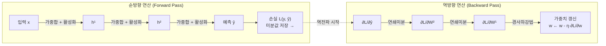
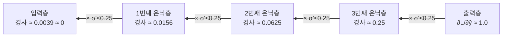
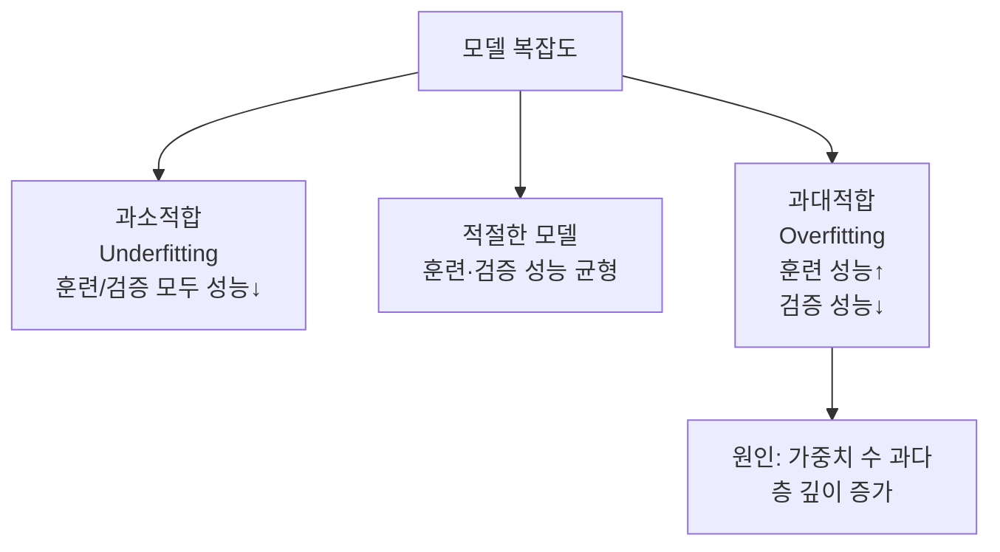

# 딥러닝의 통계적 이해: 4강. 딥러닝 모형의 구조와 학습 (2)

## 🔗 선수 지식 (Prerequisites)
- [ ] **필수**: [3강. 딥러닝 모형의 구조와 학습 (1)](3강.%20딥러닝%20모형의%20구조와%20학습%20(1).md) — MLP 구조, 활성화 함수, 경사하강법 기초 이해 완료?
- [ ] **필수**: 합성함수의 연쇄 미분법(Chain Rule) — $\frac{dz}{dx} = \frac{dz}{dt}\cdot\frac{dt}{dx}$
- [ ] **권장**: 편미분, 계산 그래프 개념
- **관련 단원**: [3강. 딥러닝 모형의 구조와 학습 (1)](3강.%20딥러닝%20모형의%20구조와%20학습%20(1).md) — 경사하강법·활성화 함수는 →←3강

---

## 학습 목표
1. 오차역전파법의 순방향·역방향 연산 과정을 연쇄 미분 원리로 설명할 수 있다.
2. 경사소실의 발생 원인과 수식적 근거($0.25^k$ 소멸)를 설명할 수 있다.
3. 과대적합의 정의와 딥러닝에서 발생하는 구조적 원인을 설명할 수 있다.

---

## 🧠 메타인지 체크 (학습 전/후 자기 평가)

### 학습 전 자기 평가
| 소주제 | 자신감 (1-5) |
| :--- | :--- |
| 오차역전파법 (연쇄 미분, 순방향/역방향) | |
| 경사소실 (원인, 수식) | |
| 과대적합 (정의, 원인, 역사) | |

### 학습 후 교정 (학습 완료 후 작성)
| 소주제 | 학습 전 | 학습 후 | 실제 정답률 | 과신/과소 여부 |
| :--- | :--- | :--- | :--- | :--- |
| 오차역전파법 | | | | |
| 경사소실 | | | | |
| 과대적합 | | | | |

> **활용법**: 학습 전 1분 → 자신감 기입, 학습 후 1분 → 나머지 기입. "과신" 영역이 실제 취약점.

---

## 📝 요약 (Summary)

1. 🔴 **오차역전파법(Backpropagation)**: 경사하강법에서 **연쇄 미분(Chain Rule)**을 이용하여 손실함수의 경사를 출력층부터 입력층 방향으로 역순으로 계산하고 가중치를 갱신하는 알고리즘이다. 순방향 연산 시 미분값을 저장해두었다가 역방향 연산에서 활용한다.
2. 🔴 **경사소실(Vanishing Gradient)**: 역전파 과정에서 활성화 함수(특히 Sigmoid)의 미분값이 층마다 누적 곱해지면서 0에 수렴하는 현상이다. Sigmoid 미분 최댓값은 0.25이므로 은닉층 $k$개를 역전파하면 경사가 $0.25^k$으로 소실된다.
3. 🔴 **과대적합(Overfitting)**: 층이 깊어질수록 가중치 수가 급증하여 신경망이 훈련 데이터에만 과도하게 적합되고, 새로운 데이터에 대한 예측력이 저하되는 현상이다.
4. 🟡 **딥러닝의 역사적 한계와 극복**: 1990년대 말 경사소실·과대적합 문제로 딥러닝 연구가 정체되었으나, 2010년대 이후 빅데이터·컴퓨팅 능력·알고리즘 혁신으로 극복되었다.

---

## 📐 핵심 수식 및 정의

| 수식명 | 수식 | 의미 |
| :--- | :--- | :--- |
| **연쇄 미분 (Chain Rule)** | $\dfrac{\partial z}{\partial x} = \dfrac{\partial z}{\partial t} \cdot \dfrac{\partial t}{\partial x}$ | 합성함수 미분의 핵심 — 역전파의 수학적 기반 |
| **가중치 갱신 (→←3강)** | $w \leftarrow w - \eta \dfrac{\partial L}{\partial w}$ | 역전파로 구한 경사를 이용해 가중치 갱신 |
| **Sigmoid 미분** | $\sigma'(x) = \sigma(x)(1-\sigma(x))$ | 최댓값 0.25 ($x=0$일 때) |
| **경사소실 수식** | $\left\|\dfrac{\partial L}{\partial w^{(1)}}\right\| \approx 0.25^k$ | $k$개 은닉층 역전파 시 경사가 지수적으로 소멸 |

### 주요 정리: 역전파의 연쇄 미분 적용

합성함수 $z = f(g(x))$에서 $t = g(x)$로 놓으면:
$$\frac{\partial z}{\partial x} = \frac{\partial z}{\partial t} \cdot \frac{\partial t}{\partial x}$$

3층 신경망 역전파 전개 (출력층 → 입력층):
$$\frac{\partial L}{\partial w^{(1)}} = \frac{\partial L}{\partial \hat{y}} \cdot \frac{\partial \hat{y}}{\partial h^{(2)}} \cdot \frac{\partial h^{(2)}}{\partial h^{(1)}} \cdot \frac{\partial h^{(1)}}{\partial w^{(1)}}$$

> **직관적 해석**: 오차를 출력층에서 입력층 방향으로 "역전파"하며 각 가중치가 오차에 기여한 정도를 계산한다. 순전파 때 계산한 중간값을 저장해두면 역전파에서 재사용 가능해 연산 효율이 높아진다.
> **AI 적용**: PyTorch·TensorFlow 등 모든 딥러닝 프레임워크는 자동 미분(autograd)으로 역전파를 자동화한다.

---

## 📊 개념 시각화 (Visual Guide)

### 오차역전파법 흐름도



### 경사소실 발생 구조



### 과대적합 vs 과소적합 개념 비교



---

## ✏️ 심화 학습 (Study Subject)

### 1. 가상 시나리오: "역전파 없이 딥러닝이 가능할까?"

- **상황**: 10층짜리 신경망의 가중치를 학습시키려 한다. 경사를 수치 미분($\frac{L(w+\epsilon)-L(w)}{\epsilon}$)으로 구하면 어떻게 될까?
- **문제**: 가중치가 100만 개라면 수치 미분은 100만 번의 순전파가 필요하다. 역전파는 왜 효율적인가?
- **해결**: 역전파는 연쇄 미분으로 **한 번의 순전파 + 한 번의 역전파**만으로 모든 가중치의 경사를 동시에 계산한다. 계산 복잡도가 $O(W)$로 수치 미분 $O(W^2)$에 비해 압도적으로 효율적이다.
- **AI 학습 포인트**: "PyTorch의 autograd가 역전파를 자동화하는 방식을 계산 그래프(computational graph)와 연쇄 미분으로 설명해 줘."

### 2. 관점별 비교 및 오개념 분석

**핵심 비교: 순방향 연산 vs 역방향 연산**

| 구분 | 순방향 연산 (Forward Pass) | 역방향 연산 (Backward Pass) |
| :--- | :--- | :--- |
| **목적** | 예측값 및 손실 계산 | 각 가중치의 경사 계산 |
| **방향** | 입력층 → 출력층 | 출력층 → 입력층 |
| **저장** | 중간 활성화값, 미분값 저장 | 저장된 미분값 재활용 |
| **연산** | 가중합 + 활성화 함수 | 연쇄 미분 (Chain Rule) |
| **결과** | 손실 $L$ | $\frac{\partial L}{\partial w}$ (경사) |

**오개념 분석**

- **오개념 1**: "경사소실은 층을 깊게 쌓는 것 자체가 원인이다."
- **분석**: 경사소실의 직접 원인은 **Sigmoid처럼 미분값이 1보다 작은 활성화 함수**를 사용하면서 층을 깊게 쌓는 조합이다. ReLU를 사용하면 깊은 네트워크에서도 경사소실을 크게 완화할 수 있다(→←3강 ReLU).

- **오개념 2**: "과대적합은 훈련 데이터가 많으면 항상 해결된다."
- **분석**: 훈련 데이터 증가는 과대적합 완화에 도움이 되지만 충분조건은 아니다. 모델이 지나치게 복잡(가중치 수 과다)하면 많은 데이터로도 과대적합이 발생한다. 정규화(L1/L2), 드롭아웃 등 별도의 해결책이 필요하다.

- **AI 학습 포인트**: "Sigmoid 대신 ReLU를 사용하면 경사소실이 완화되는 이유를 두 함수의 미분값 범위를 수식으로 비교하여 설명해 줘."

---

## ❓ 연습 문제 및 해설

> **블룸 인지 수준 범례**: [기억] 정의·나열 → [이해] 설명·비교 → [적용] 계산·구현 → [분석] 구별·디버그 → [평가] 판단·비평 → [창조] 설계·제안

### 📝 문제

**1. ⭐ [기억] 오차역전파법에 대한 설명으로 옳지 않은 것은?** ([#prob-1](#prob-1))
   > ① 역전파는 손실함수의 경사를 출력층에서 입력층 방향으로 계산한다.
   > ② 연쇄 미분(Chain Rule)을 이용하여 각 가중치의 경사를 구한다.
   > ③ 순방향 연산 시 중간 미분값을 저장해두면 역전파 계산에 재활용할 수 있다.
   > ④ 역전파는 수치 미분보다 계산 효율이 낮다.

<br>

**2. ⭐ [기억] 경사소실(Vanishing Gradient)의 주요 원인으로 가장 적절한 것은?** ([#prob-2](#prob-2))
   > ① 학습률이 너무 높아서
   > ② 훈련 데이터가 너무 적어서
   > ③ 은닉층에서 미분값이 1보다 작은 활성화 함수를 사용하면서 층이 깊어질수록 미분값이 누적 곱해지기 때문에
   > ④ 손실함수가 볼록함수가 아니기 때문에

<br>

**3. ⭐⭐ [이해] Sigmoid 함수를 은닉층 활성화 함수로 사용하는 5층 신경망에서 경사소실이 발생한다고 할 때, 입력층 근처의 경사 크기는 최대 얼마 수준인가?** ([#prob-3](#prob-3))
   > ① $1.0$
   > ② $0.25$
   > ③ $0.25^5 \approx 0.001$
   > ④ $0.25^5 \approx 0.001$보다 반드시 크다

<br>

**4. ⭐⭐ [이해] 과대적합(Overfitting)에 대한 설명으로 옳은 것을 모두 고르시오.** ([#prob-4](#prob-4))
   > <보기>
   >
   > 가. 신경망의 층이 깊어질수록 가중치 수가 많아져 과대적합 위험이 증가한다.
   > 나. 훈련 데이터의 손실은 감소하지만 검증 데이터의 손실은 증가하는 현상이다.
   > 다. 1990년대 말 경사소실과 과대적합 문제로 딥러닝 연구가 지연되었다.
   > 라. 과대적합은 모델이 너무 단순할 때 발생한다.

   > ① 가, 나, 다
   > ② 나, 다, 라
   > ③ 가, 다
   > ④ 가, 나, 다, 라

<br>

**5. ⭐⭐⭐ [분석] 3층 신경망(은닉층 2개)에서 역전파로 첫 번째 은닉층의 가중치 $W^{(1)}$에 대한 손실의 경사 $\frac{\partial L}{\partial W^{(1)}}$를 구하는 과정을 연쇄 미분으로 전개하시오.** ([#prob-5](#prob-5))

<br>

**6. ⭐⭐⭐ [평가] 딥러닝 모형에서 경사소실을 완화하기 위한 방법을 2가지 이상 제시하고, 각 방법이 경사소실을 줄이는 원리를 설명하시오.** ([#prob-6](#prob-6)) 📌

---

### 🔑 정답 및 해설

<details>
<summary>정답 보기 (클릭)</summary>

1. ④
2. ③
3. ③
4. ①
5. 풀이형
6. 풀이형

</details>

<details>
<summary>해설 보기 (클릭)</summary>

<a id="prob-1"></a>
**1. ⭐ [기억] 오차역전파법**
> **정답: ④**
> **해설**: 역전파는 수치 미분보다 계산 효율이 **높다**. 수치 미분은 가중치 수 $W$에 대해 $O(W)$번의 순전파가 필요하지만, 역전파는 1번의 순전파 + 1번의 역전파로 모든 가중치의 경사를 동시에 구한다.

<a id="prob-2"></a>
**2. ⭐ [기억] 경사소실 원인**
> **정답: ③**
> **해설**: 연쇄 미분에 의해 활성화 함수의 미분값이 층마다 누적 곱해지는데, Sigmoid의 미분 최댓값이 0.25이므로 층이 깊어질수록 경사가 지수적으로 소멸한다.

<a id="prob-3"></a>
**3. ⭐⭐ [이해] 경사소실 계산**
> **정답: ③**
> **해설**: Sigmoid 미분 최댓값은 0.25이다. 5개 은닉층을 역전파하면 경사값은 최대 $0.25^5 = \frac{1}{4^5} = \frac{1}{1024} \approx 0.001$ 수준으로 소멸한다. 이 값은 가중치를 의미 있게 갱신하기 어려운 수준이다.

<a id="prob-4"></a>
**4. ⭐⭐ [이해] 과대적합**
> **정답: ① 가, 나, 다**
> **해설**: **라**가 오답. 과대적합은 모델이 **너무 복잡**할 때(가중치 수 과다) 발생한다. 모델이 너무 단순하면 과소적합(Underfitting)이 발생한다. 가(층 깊이→가중치 증가), 나(훈련 손실↓, 검증 손실↑), 다(1990년대 역사)는 모두 옳다.

<a id="prob-5"></a>
**5. ⭐⭐⭐ [분석] 역전파 연쇄 미분 전개**
> **정답**:
>
> 3층 신경망 $x \to h^{(1)} \to h^{(2)} \to \hat{y}$에서 $h^{(l)} = a(W^{(l)}h^{(l-1)} + b^{(l)})$로 정의하면 (단, $h^{(0)}=x$):
>
> 연쇄 미분에 의해:
> $$\frac{\partial L}{\partial W^{(1)}} = \frac{\partial L}{\partial \hat{y}} \cdot \frac{\partial \hat{y}}{\partial h^{(2)}} \cdot \frac{\partial h^{(2)}}{\partial h^{(1)}} \cdot \frac{\partial h^{(1)}}{\partial W^{(1)}}$$
>
> 각 항을 풀면:
> - $\frac{\partial L}{\partial \hat{y}}$: 손실함수의 예측값에 대한 미분
> - $\frac{\partial \hat{y}}{\partial h^{(2)}} = a'(W^{(2)}h^{(1)}) \cdot W^{(2)}$: 출력층 활성화 미분 × 가중치
> - $\frac{\partial h^{(2)}}{\partial h^{(1)}} = a'(W^{(1)}x) \cdot W^{(1)}$: 은닉층2 활성화 미분 × 가중치
> - $\frac{\partial h^{(1)}}{\partial W^{(1)}} = a'(W^{(1)}x) \cdot x^T$: 은닉층1에서 $W^{(1)}$에 대한 미분
>
> 여기서 $a'$가 Sigmoid이면 최댓값 0.25가 누적 곱해져 경사소실 발생.

<a id="prob-6"></a>
**6. ⭐⭐⭐ [평가] 경사소실 완화 방법 📌**
> **정답**:
>
> **① ReLU 활성화 함수 사용 (→←3강)**
> - 원리: ReLU의 미분값은 양수 구간에서 1로 일정하므로 층을 역전파해도 경사가 $1^k = 1$로 소멸하지 않는다.
>
> **② 배치 정규화(Batch Normalization)**
> - 원리: 각 층의 입력을 정규화하여 활성화값이 포화 구간에 진입하지 않도록 방지, 경사가 안정적으로 전달된다.
>
> **③ 잔차 연결(Residual Connection, ResNet)**
> - 원리: $h = F(x) + x$ 형태로 입력을 직접 더해주면, 역전파 시 경사가 잔차 경로를 통해 소멸 없이 직접 전달된다.
>
> **④ 가중치 초기화 전략 (Xavier/He Initialization)**
> - 원리: 활성화 함수에 맞는 분산으로 초기화하여 활성화값이 포화되지 않도록 조정한다.

</details>

---

## ✅ O/X 확인문제

**1.** 오차역전파법은 손실함수의 경사를 입력층에서 출력층 방향으로 계산한다. ([#ox-1](#ox-1)) **(O / X)**

**2.** 연쇄 미분(Chain Rule)은 합성함수의 미분을 구하기 위해 각 함수의 미분을 곱하는 규칙이다. ([#ox-2](#ox-2)) **(O / X)**

**3.** Sigmoid 함수의 미분 최댓값은 0.5이다. ([#ox-3](#ox-3)) **(O / X)**

**4.** 은닉층이 4개인 신경망에서 Sigmoid를 활성화 함수로 사용하면 경사가 최대 $0.25^4 \approx 0.004$ 수준으로 소멸할 수 있다. ([#ox-4](#ox-4)) **(O / X)**

**5.** ReLU를 은닉층 활성화 함수로 사용하면 경사소실 문제를 완전히 제거할 수 있다. ([#ox-5](#ox-5)) **(O / X)**

**6.** 과대적합은 훈련 데이터에서는 손실이 낮지만 검증/시험 데이터에서는 손실이 높은 현상이다. ([#ox-6](#ox-6)) **(O / X)**

**7.** 신경망의 층이 깊어질수록 가중치 수가 많아져 과대적합 위험이 증가한다. ([#ox-7](#ox-7)) **(O / X)**

**8.** 1990년대 말 딥러닝 연구가 지연된 이유 중 하나는 경사소실 문제이다. ([#ox-8](#ox-8)) **(O / X)**

**9.** 역전파는 수치 미분보다 계산 효율이 낮다. ([#ox-9](#ox-9)) **(O / X)**

**10.** 순방향 연산 시 저장한 중간 미분값은 역방향 연산에서 재활용된다. ([#ox-10](#ox-10)) **(O / X)**

**11.** 과대적합을 방지하기 위해 검증 데이터를 활용하여 모델 구조를 선택한다. ([#ox-11](#ox-11)) **(O / X)**

**12.** 2010년대 이후 빅데이터·컴퓨팅 향상·알고리즘 혁신으로 딥러닝의 경사소실·과대적합 문제가 극복되었다. ([#ox-12](#ox-12)) **(O / X)**

<details>
<summary>O/X 정답 및 해설 보기 (클릭)</summary>

> <a id="ox-1"></a>
> **1. 정답**: X
> **해설**: 역전파는 **출력층 → 입력층** 방향(역방향)으로 경사를 계산한다. 입력층 → 출력층은 순방향 연산이다.

> <a id="ox-2"></a>
> **2. 정답**: O
> **해설**: 연쇄 미분은 $\frac{\partial z}{\partial x} = \frac{\partial z}{\partial t} \cdot \frac{\partial t}{\partial x}$로, 합성함수의 미분을 중간 변수에 대한 미분의 곱으로 표현한다. 역전파의 수학적 기반이다.

> <a id="ox-3"></a>
> **3. 정답**: X
> **해설**: Sigmoid 미분값 $\sigma'(x) = \sigma(x)(1-\sigma(x))$의 최댓값은 $x=0$일 때 $0.5 \times 0.5 = \mathbf{0.25}$이다.

> <a id="ox-4"></a>
> **4. 정답**: O
> **해설**: 은닉층 4개를 역전파할 때 Sigmoid 미분값이 최대 0.25씩 누적 곱해지면 $0.25^4 = \frac{1}{256} \approx 0.004$로 경사가 소멸한다.

> <a id="ox-5"></a>
> **5. 정답**: X
> **해설**: ReLU는 경사소실을 크게 완화하지만, 음수 입력에서 미분값이 0이 되어 "죽은 뉴런(Dead Neuron)" 문제가 발생할 수 있다. 완전 제거는 불가능하다.

> <a id="ox-6"></a>
> **6. 정답**: O
> **해설**: 과대적합의 전형적 징후는 훈련 손실 감소 + 검증 손실 증가(또는 정체)이다.

> <a id="ox-7"></a>
> **7. 정답**: O
> **해설**: 층이 깊어질수록 가중치 파라미터 수가 급증하여 신경망이 훈련 데이터의 노이즈까지 학습(과대적합)할 수 있다.

> <a id="ox-8"></a>
> **8. 정답**: O
> **해설**: 1990년대 말 경사소실과 과대적합 문제로 딥러닝이 SVM, 앙상블 기법에 비해 성능이 낮아 연구가 지연되었다.

> <a id="ox-9"></a>
> **9. 정답**: X
> **해설**: 역전파는 수치 미분보다 계산 효율이 **높다**. 수치 미분은 가중치 수만큼 순전파를 반복해야 하지만, 역전파는 1회 순전파 + 1회 역전파로 모든 가중치의 경사를 동시에 구한다.

> <a id="ox-10"></a>
> **10. 정답**: O
> **해설**: 순전파 시 각 층의 활성화값과 중간 미분값을 메모리에 저장해두면 역전파에서 연쇄 미분 계산 시 재활용하여 중복 계산을 방지할 수 있다.

> <a id="ox-11"></a>
> **11. 정답**: O
> **해설**: 검증 데이터는 에포크별 성능을 모니터링하여 과대적합 시점을 감지하고 최적 모델 구조(층 수, 뉴런 수 등)를 선택하는 데 사용된다. →←3강 데이터 분할

> <a id="ox-12"></a>
> **12. 정답**: O
> **해설**: 2010년대 이후 ImageNet 대규모 데이터, GPU 컴퓨팅, ReLU·배치 정규화·드롭아웃 등 알고리즘 혁신으로 딥러닝의 한계를 극복하며 비약적 발전이 이루어졌다.

</details>

---

## 🧪 자유 회상 연습 (Free Recall)

> **방법**: 위의 노트를 모두 덮고, 타이머 3분 설정 후 이번 단원에서 배운 내용을 기억나는 대로 자유롭게 적으세요.

**자유 회상 작성란:**

```
[여기에 기억나는 내용을 자유롭게 작성]


```

> **회상 후 점검**: 노트를 다시 펼쳐 빠뜨린 내용을 확인하세요.
> - 회상 못한 핵심 개념: [                ]
> - 회상 못한 수식: [                ]

---

## 💻 코드로 확인하기

```python
import numpy as np

# ── 활성화 함수 및 미분 정의 ──────────────────────────────────
def sigmoid(x):
    return 1 / (1 + np.exp(-x))

def sigmoid_grad(x):
    s = sigmoid(x)
    return s * (1 - s)  # 최댓값: 0.25

def relu(x):
    return np.maximum(0, x)

def relu_grad(x):
    return (x > 0).astype(float)  # 양수=1, 음수=0

# ── 경사소실 시뮬레이션 ─────────────────────────────────────────
def simulate_vanishing_gradient(n_layers, activation_grad, input_val=0.0):
    """역전파 시 경사값이 층마다 어떻게 변하는지 시뮬레이션"""
    gradient = 1.0
    print(f"{'층':>4} | {'경사값':>15} | 함수")
    print("-" * 40)
    print(f"{'출력':>4} | {gradient:>15.8f} |")
    for layer in range(n_layers, 0, -1):
        grad_val = activation_grad(np.array([input_val]))[0]
        gradient *= grad_val
        print(f"{layer:>4} | {gradient:>15.8f} | × {grad_val:.4f}")
    return gradient

print("=== Sigmoid 5층 역전파 ===")
final_sigmoid = simulate_vanishing_gradient(5, sigmoid_grad, input_val=0.0)

print(f"\n=== ReLU 5층 역전파 (양수 입력) ===")
final_relu = simulate_vanishing_gradient(5, relu_grad, input_val=1.0)

print(f"\n[결론]")
print(f"Sigmoid 5층 후 경사: {final_sigmoid:.6f} (≈ 0.25^5 = {0.25**5:.6f})")
print(f"ReLU    5층 후 경사: {final_relu:.6f}")
```

> **실행 결과**:
> ```
> === Sigmoid 5층 역전파 ===
>  층 |          경사값 | 함수
> ----------------------------------------
> 출력 |        1.00000000 |
>    5 |        0.25000000 | × 0.2500
>    4 |        0.06250000 | × 0.2500
>    3 |        0.01562500 | × 0.2500
>    2 |        0.00390625 | × 0.2500
>    1 |        0.00097656 | × 0.2500
>
> === ReLU 5층 역전파 (양수 입력) ===
>  층 |          경사값 | 함수
> ----------------------------------------
> 출력 |        1.00000000 |
>    5 |        1.00000000 | × 1.0000
>    ...
>    1 |        1.00000000 | × 1.0000
>
> [결론]
> Sigmoid 5층 후 경사: 0.000977 (≈ 0.25^5 = 0.000977)
> ReLU    5층 후 경사: 1.000000
> ```
> **수학적 해석**: Sigmoid 5층 역전파 후 경사는 약 0.001로 소멸하여 가중치 갱신이 사실상 불가능해진다. ReLU는 양수 입력에서 경사가 1.0으로 유지된다. 이것이 현대 딥러닝에서 ReLU가 표준으로 사용되는 이유이다.

---

## 🤖 AI 연결고리

| 학습 개념 | AI/ML 적용 분야 | 구체적 사례 |
| :--- | :--- | :--- |
| 오차역전파법 | 모든 딥러닝 학습의 기반 | PyTorch autograd, TensorFlow GradientTape |
| 연쇄 미분 | 자동 미분(Autograd) 엔진 | 계산 그래프 기반 미분 → PyTorch의 `.backward()` |
| 경사소실 | 활성화 함수 선택 기준 | LSTM의 게이트 구조, ResNet 잔차 연결로 해결 |
| 과대적합 | 정규화 기법 동기 | L1/L2 정규화, 드롭아웃(Dropout), 배치 정규화 |
| 딥러닝 역사적 한계 | 현대 딥러닝 설계 원칙 | ResNet(잔차 연결), BatchNorm, He 초기화 등 해결책 탄생 배경 |

---

## 📖 심화 학습 예시 답안

#### 1. 오차역전파법의 내부 동작 원리

1. **초기화**: 가중치를 작은 난수로 초기화 (→←3강).
2. **순전파(Forward Pass)**: 입력 → 은닉층 → 출력층 순으로 가중합 + 활성화 연산. 각 층의 활성화값과 미분값을 메모리에 저장.
3. **손실 계산**: 예측값 $\hat{y}$와 실제값 $y$의 차이로 손실 $L$ 계산.
4. **역방향 전파(Backward Pass)**: 출력층부터 연쇄 미분으로 각 가중치 $\frac{\partial L}{\partial w}$ 계산. 저장된 중간값 재활용.
5. **가중치 갱신**: $w \leftarrow w - \eta \frac{\partial L}{\partial w}$ (경사하강법, →←3강).
6. **반복**: 에포크 단위로 2~5 반복.

#### 2. 경사소실 vs 과대적합 비교표

| 구분 | 경사소실 (Vanishing Gradient) | 과대적합 (Overfitting) |
| :--- | :--- | :--- |
| **정의** | 역전파 시 경사가 0에 수렴하여 가중치가 갱신되지 않는 현상 | 훈련 데이터에 과도 적합되어 새 데이터 예측력이 낮아지는 현상 |
| **원인** | Sigmoid 등 미분값 <1인 활성화 함수 + 깊은 층 | 가중치 수 과다(깊은 층 또는 넓은 층) |
| **증상** | 아래층 가중치가 학습 초기값에서 변하지 않음 | 훈련 손실↓, 검증 손실↑ (갭 증가) |
| **해결** | ReLU, BatchNorm, 잔차 연결 | 정규화(L1/L2), 드롭아웃, 조기 종료 |
| **AI 활용** | ReLU → 현대 모든 딥러닝 모델 | 드롭아웃 → BERT, GPT 등 대형 모델 |

#### 3. 역전파 코드 작성법 (Best Practice)

- **Bad Practice**: 수치 미분으로 경사 계산
  ```python
  # 가중치 수만큼 순전파 반복 → 매우 비효율적
  eps = 1e-5
  for i in range(len(weights)):
      weights[i] += eps
      loss_plus = compute_loss(weights)
      weights[i] -= 2 * eps
      loss_minus = compute_loss(weights)
      grads[i] = (loss_plus - loss_minus) / (2 * eps)
      weights[i] += eps  # 복원
  ```
- **Good Practice**: PyTorch autograd (역전파 자동화)
  ```python
  import torch
  import torch.nn as nn

  model = nn.Sequential(
      nn.Linear(3, 4),
      nn.ReLU(),          # 경사소실 완화
      nn.Linear(4, 1),
      nn.Sigmoid()
  )
  optimizer = torch.optim.Adam(model.parameters())
  loss_fn = nn.BCELoss()

  # 순전파 + 역전파 + 가중치 갱신 (3줄로 완성)
  pred = model(x)
  loss = loss_fn(pred, y)
  loss.backward()        # 연쇄 미분 자동 계산
  optimizer.step()       # 가중치 갱신
  optimizer.zero_grad()  # 경사 초기화
  ```
- **설명**: autograd는 계산 그래프를 자동으로 구성하고 `.backward()` 호출 시 연쇄 미분을 역방향으로 자동 계산한다. 수치 미분 대비 계산 복잡도가 $O(W)$에서 $O(1)$ 패스로 줄어든다.

---

## 📚 핵심 용어집

| 용어 (한) | 용어 (영) | 수식 표현 | 정의 |
| :--- | :--- | :--- | :--- |
| **오차역전파법** | Backpropagation | $\frac{\partial L}{\partial w} = \frac{\partial L}{\partial \hat{y}} \cdots \frac{\partial h}{\partial w}$ | 연쇄 미분으로 손실의 경사를 출력층→입력층 방향으로 계산하는 알고리즘 |
| **연쇄 미분** | Chain Rule | $\frac{\partial z}{\partial x} = \frac{\partial z}{\partial t}\cdot\frac{\partial t}{\partial x}$ | 합성함수의 미분을 중간 변수에 대한 미분의 곱으로 표현하는 규칙 |
| **순방향 연산** | Forward Pass | $\hat{y} = f(x; w)$ | 입력→출력 방향으로 예측값과 손실을 계산하는 과정 |
| **역방향 연산** | Backward Pass | $\nabla_w L$ | 출력→입력 방향으로 각 가중치의 경사를 계산하는 과정 |
| **경사소실** | Vanishing Gradient | $\|\nabla_{w^{(1)}} L\| \approx 0.25^k$ | 역전파 시 활성화 함수 미분값 누적 곱으로 경사가 0에 수렴하는 현상 |
| **과대적합** | Overfitting | — | 훈련 데이터에 과도 적합되어 새 데이터 예측력이 저하되는 현상 →←3강 에포크 |
| **과소적합** | Underfitting | — | 모델이 너무 단순하여 훈련 데이터도 제대로 학습하지 못하는 현상 |
| **자동 미분** | Automatic Differentiation | — | 계산 그래프를 이용해 역전파를 자동으로 수행하는 기법 (PyTorch autograd) |

---

## 🤖 AI 학습 파트너를 위한 추가 자료

### 1. 개념 이해를 위한 심층 질문 프롬프트
> "오차역전파법을 '물이 거슬러 흐르는 것'에 비유하여 설명해 줘. 순방향 연산과 역방향 연산이 각각 어떤 역할을 하는지, 연쇄 미분이 왜 필요한지 직관적으로 알 수 있게 해 줘."

### 2. 문제 해결 능력 강화를 위한 시나리오 프롬프트
> "당신은 딥러닝 팀의 엔지니어입니다. 20층짜리 신경망 모델의 아래층 가중치가 전혀 학습되지 않는 문제가 발생했습니다. 경사소실이 원인임을 확인하고, Sigmoid 대신 ReLU로 교체하는 것 외에 2가지 이상의 추가 해결책을 제안하고 각 원리를 수식과 함께 설명해 줘."

### 3. 수식 풀이 검증 프롬프트
> "다음 역전파 계산 과정을 검증해 줘.
> 손실함수 $L = \frac{1}{2}(y - \hat{y})^2$, 출력 $\hat{y} = \sigma(z)$, $z = wx + b$일 때:
> $$\frac{\partial L}{\partial w} = (\hat{y} - y) \cdot \sigma'(z) \cdot x$$
> 1. 연쇄 미분을 단계별로 전개하여 이 식이 올바른지 확인해 줘.
> 2. $\sigma'(z)$를 $\sigma(z)(1-\sigma(z))$로 대체했을 때 경사소실이 왜 발생하는지 설명해 줘."

---

## 🔄 복습 체크 (Spaced Repetition)
- [ ] 1일 후 복습 (날짜: 2026-04-12)
- [ ] 3일 후 복습 (날짜: 2026-04-14)
- [ ] 7일 후 복습 (날짜: 2026-04-18)
- [ ] 14일 후 복습 (날짜: 2026-04-25)
- [ ] 30일 후 복습 (날짜: 2026-05-11)

### 복습 시 자가 평가
| 회차 | 날짜 | 이해도 (1-5) | 취약 부분 메모 |
| :--- | :--- | :--- | :--- |
| 1차 | | | |
| 2차 | | | |
| 3차 | | | |

---

## 📚 참고 자료 (References)

- 교재 - 딥러닝의 통계적 이해 4강 강의록
- [3강. 딥러닝 모형의 구조와 학습 (1)](3강.%20딥러닝%20모형의%20구조와%20학습%20(1).md) — MLP 구조, 활성화 함수, 경사하강법 기초
- Rumelhart, Hinton & Williams (1986) - Learning representations by back-propagating errors (역전파 원논문)
- 3Blue1Brown - Backpropagation calculus (YouTube)
- Ian Goodfellow et al. - Deep Learning, Chapter 6.5 (Back-Propagation)
