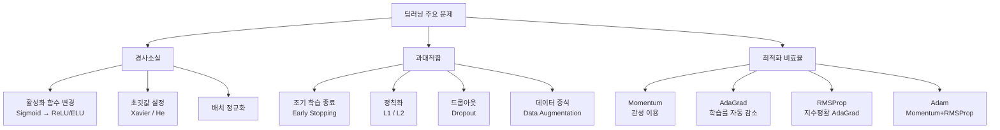

# 5강. 딥러닝의 통계적 이해: 딥러닝의 제 문제와 발전

## 🔗 선수 지식 (Prerequisites)
- [ ] **필수**: [4강. 딥러닝 모형의 구조와 학습 (2)](4강.%20딥러닝%20모형의%20구조와%20학습%20(2).md) — 오차역전파법, 경사하강법 이해 완료?
- [ ] **필수**: 시그모이드 함수의 미분 특성 이해
- [ ] **권장**: 확률 분포(정규분포), 정규화 개념
- **관련 단원**: [3강. 딥러닝 모형의 구조와 학습 (1)](3강.%20딥러닝%20모형의%20구조와%20학습%20(1).md)

---

## 학습 목표
1. 활성화 함수의 선택에 대해 이해한다.
2. 신경망 학습에서 초깃값 설정을 이해한다.
3. 다양한 최적화 방법을 이해한다.
4. 과대적합을 이해한다.
5. 정칙화 방법과 드롭아웃을 이해한다.
6. 배치 정규화를 이해한다.

---

## 🧠 메타인지 체크 (학습 전/후 자기 평가)

### 학습 전 자기 평가
| 소주제 | 자신감 (1-5) |
| :--- | :--- |
| 활성화 함수와 경사소실 | |
| 초깃값 설정 (Xavier, He) | |
| SGD 개선 최적화 방법 | |
| 과대적합 해소 기법 | |
| 배치 정규화 | |

### 학습 후 교정 (학습 완료 후 작성)
| 소주제 | 학습 전 | 학습 후 | 실제 정답률 | 과신/과소 여부 |
| :--- | :--- | :--- | :--- | :--- |
| 활성화 함수와 경사소실 | | | | |
| 초깃값 설정 (Xavier, He) | | | | |
| SGD 개선 최적화 방법 | | | | |
| 과대적합 해소 기법 | | | | |
| 배치 정규화 | | | | |

> **활용법**: 학습 전 1분 → 자신감 기입, 학습 후 1분 → 나머지 기입. "과신" 영역이 실제 취약점.

---

## 📝 요약 (Summary)

1. 🔴 **ReLU 활성화 함수**: 오차역전파법의 경사소실 문제를 해결하기 위해 Sigmoid 대신 ReLU를 사용한다. ReLU는 양수 영역에서 미분값이 항상 1이므로 경사가 소실되지 않는다.
2. 🟡 **심층신뢰망(DBN)**: RBM(제한된 볼츠만 머신)을 적층한 구조로, 2006년 힌튼 교수팀이 제안했으며 딥러닝 발전의 토대가 되었다. 현재는 사전학습 방식으로는 잘 사용되지 않는다.
3. 🔴 **가중치 초깃값**: Sigmoid 활성화 함수에는 Xavier 초깃값 $N\!\left(0,\frac{2}{n_{in}+n_{out}}\right)$, ReLU에는 He 초깃값 $N\!\left(0,\frac{2}{n_{in}}\right)$을 사용한다. (He et al. 2015: fan-in $n_{in}$만 사용하여 분산 = $2/n_{in}$)
4. 🔴 **SGD 개선 최적화**: Momentum(관성), AdaGrad(학습률 자동 감소), RMSProp(지수평활 적용), Adam(Momentum+RMSProp 결합) 등으로 SGD를 개선한다.
5. 🔴 **과대적합 해소**: 조기 학습 종료, $L_1$/$L_2$ 정칙화, 드롭아웃, 데이터 증식으로 과대적합을 억제한다.
6. 🟡 **배치 정규화**: 미니 배치 단위로 표준화를 진행하여 학습 속도를 높이고 초깃값 의존성과 과대적합을 줄인다.

---

## 📐 핵심 정의 및 원리 (Key Concepts)

| 정의명 | 내용 | 키워드 |
| :--- | :--- | :--- |
| **경사소실** | 역전파 시 활성화 함수의 미분값이 1보다 작아 반복 곱셈으로 기울기가 0에 수렴하는 현상 | Vanishing Gradient, Sigmoid |
| **ReLU** | $a(x)=\max(0,x)$, 양수 구간 미분=1로 경사소실 없음 | 활성화 함수, Dead Neuron |
| **PReLU** | $a(x)=x\,(x>0),\;\alpha_1 x\,(x\le0)$, 음수 구간에 학습 가능 기울기 | Parametric ReLU |
| **ELU** | $a(x)=x\,(x>0),\;\alpha_2(e^x-1)\,(x\le0)$, 음수에서 부드럽게 감소 | Exponential Linear Unit |
| **Xavier 초깃값** | Sigmoid용. $N\!\left(0,\frac{2}{n_{in}+n_{out}}\right)$ 분포로 초기화 | 세이비어, 분산 제어 |
| **He 초깃값** | ReLU용. $N\!\left(0,\frac{2}{n_{in}}\right)$ 분포로 초기화; fan-in($n_{in}$)만 고려 | 히, ReLU 분산 보존 기반 |
| **Momentum** | $v\leftarrow\beta v+\eta\nabla L,\;w\leftarrow w-v$, 이전 기울기 누적으로 관성 효과 | 관성, 진동 억제 |
| **AdaGrad** | $h\leftarrow h+(\nabla L)^2,\;w\leftarrow w-\frac{\eta}{\sqrt{h}}\nabla L$, 학습률 자동 감소 | 적응적 학습률 |
| **RMSProp** | $h\leftarrow\rho h+(1-\rho)(\nabla L)^2$, AdaGrad에 지수평활 적용 | 지수평활, AdaGrad 개선 |
| **Adam** | 1차 모멘텀 + RMSProp 결합, 현재 가장 많이 사용 | Adaptive Moment Estimation |
| **L2 정칙화** | 손실에 $\lambda\sum w^2$ 추가, 가중치를 고르게 작게 만듦 | Weight Decay, Ridge |
| **L1 정칙화** | 손실에 $\lambda\sum\|w\|$ 추가, 많은 가중치를 0으로 만들어 희소성 유도 | Lasso, 희소성 |
| **드롭아웃** | 학습 중 뉴런 일부를 무작위 비활성화, 앙상블 효과로 일반화 성능 향상 | Dropout, 앙상블 |
| **배치 정규화** | 미니배치 단위 표준화 후 $\tilde{z}=\gamma z_{norm}+\beta$ 변환 | Batch Norm, 표준화 |

### 주요 수식 정리

**ReLU 계열 활성화 함수 비교**

$$
\text{ReLU: }a(x)=\max(0,x)
$$
$$
\text{PReLU: }a(x)=\begin{cases}x,&x>0\\\alpha_1 x,&x\le0\end{cases}, \quad
\text{ELU: }a(x)=\begin{cases}x,&x>0\\\alpha_2(e^x-1),&x\le0\end{cases}
$$

> **직관적 해석**: ReLU는 음수 입력을 0으로 차단, PReLU는 음수에도 작은 기울기 유지, ELU는 음수에서 부드럽게 감소
> **AI 적용**: CNN·Transformer의 은닉층 활성화 함수로 ReLU 계열이 사실상 표준

**배치 정규화**

$$
\mu_B=\frac{1}{m}\sum_{i=1}^m z^{(i)},\quad
\sigma_B^2=\frac{1}{m}\sum_{i=1}^m(z^{(i)}-\mu_B)^2
$$
$$
z_{norm}=\frac{z-\mu_B}{\sqrt{\sigma_B^2+\epsilon}},\quad
\tilde{z}=\gamma z_{norm}+\beta
$$

> **직관적 해석**: 각 배치 출력을 표준화 후, 학습 가능한 $\gamma$(스케일), $\beta$(이동)로 재변환
> **AI 적용**: ResNet, BERT 등 대부분 딥러닝 아키텍처에 삽입

**L2 정칙화 손실함수**

$$
L_{reg}=L+\frac{\lambda}{2}\sum_{l,j,k}(w_{jk}^{(l)})^2
$$

> **직관적 해석**: 가중치가 커지면 손실이 증가하므로 모델이 자연스럽게 작은 가중치를 선택
> **AI 적용**: PyTorch `weight_decay` 파라미터, Keras `kernel_regularizer=l2(λ)`

---

## 📊 개념 시각화 (Visual Guide)

### 딥러닝 제 문제 분류 체계도



### 최적화 방법 비교표

| 방법 | 핵심 아이디어 | 장점 | 단점 | 주요 파라미터 |
| :--- | :--- | :--- | :--- | :--- |
| **SGD** | 배치에서 임의 추출 후 경사 갱신 | 단순함 | 진동, 느린 수렴 | $\eta$ |
| **Momentum** | 이전 기울기 누적(관성) | 진동 감소, 빠른 수렴 | 추가 파라미터 | $\eta, \beta$ |
| **AdaGrad** | 파라미터별 학습률 자동 감소 | 희소 데이터에 효과적 | 학습 조기 종료 가능 | $\eta$ |
| **RMSProp** | AdaGrad + 지수평활 | AdaGrad 단점 보완 | $\rho$ 튜닝 필요 | $\eta, \rho$ |
| **Adam** | Momentum + RMSProp | 빠르고 안정적 | 메모리 2배 | $\eta, \beta_1, \beta_2$ |

### 과대적합 vs 과소적합 판단 기준

| 구분 | 훈련 성능 | 검증 성능 | 원인 | 해결책 |
| :--- | :--- | :--- | :--- | :--- |
| **과소적합** | 낮음 | 낮음 | 모델 단순 (고편의) | 더 깊은/넓은 신경망, 더 많은 학습 |
| **과대적합** | 높음 | 낮음 | 모델 복잡 (고분산) | 정칙화, 드롭아웃, 데이터 증식 |
| **적절한 적합** | 높음 | 높음 | — | 현재 상태 유지 |

---

## ✏️ 심화 학습 (Study Subject)

### 1. 가상 시나리오: "이미지 분류기를 처음부터 훈련시킨다면?"

- **상황**: 10만 장 규모의 의료 이미지로 질환 분류 CNN을 훈련. 20층 깊이 네트워크를 구성했으나 손실이 줄지 않고 학습이 제자리걸음이다.
- **문제**: 경사소실인지, 과대적합인지, 최적화 문제인지 진단하고 각각에 맞는 해결책을 선택해야 한다.
- **해결**:
  1. **경사소실 진단**: 은닉층에 Sigmoid 사용 → ReLU로 교체, He 초깃값 적용, 배치 정규화 삽입
  2. **최적화 개선**: SGD → Adam($\eta=0.001, \beta_1=0.9, \beta_2=0.999$) 전환
  3. **과대적합 방지**: 드롭아웃(p=0.5) 추가, 이미지 회전·반전으로 데이터 증식, L2 정칙화($\lambda=10^{-4}$) 적용
  4. **조기 종료**: 검증 손실 5 epoch 연속 증가 시 학습 중단
- **AI 학습 포인트**: "CNN에서 배치 정규화를 활성화 함수 앞에 놓을 때와 뒤에 놓을 때 성능 차이가 있는지, 어떤 위치가 현대 관행인지 비교해 줘."

### 2. 관점별 비교 및 오개념 분석

**L1 vs L2 정칙화 비교**

| 구분 | L1 정칙화 (Lasso) | L2 정칙화 (Ridge) |
| :--- | :--- | :--- |
| **벌칙항** | $\lambda\sum\|w_i\|$ (절댓값 합) | $\frac{\lambda}{2}\sum w_i^2$ (제곱합) |
| **가중치 수렴** | 다수를 정확히 0으로 (희소) | 0 근방으로 수렴하나 정확히 0 안 됨 |
| **기하학 제약** | 다이아몬드 형태 (모서리에 해 위치) | 원형 제약 (부드럽게 분산) |
| **적합한 상황** | 특징 선택 (Feature Selection) | 일반적인 과대적합 억제 |

**오개념 분석**

- **오개념 1**: "드롭아웃은 테스트 시에도 적용해야 성능이 높아진다."
  - **분석**: 드롭아웃은 학습 시에만 적용한다. 테스트 시 적용하면 출력이 확률적으로 변해 예측 불안정성이 생긴다. Inverted Dropout 방식으로 학습 시 $\frac{1}{1-p}$ 스케일업을 적용하면 테스트 시 그대로 사용 가능하다.

- **오개념 2**: "AdaGrad는 Adam보다 항상 좋은 방법이다."
  - **분석**: AdaGrad는 $h$에 기울기 제곱을 무한 누적하여 학습률이 결국 0에 수렴해 학습이 조기 종료될 수 있다. RMSProp은 지수평활($\rho$)로 오래된 정보를 희석하고, Adam은 여기에 Momentum까지 결합해 더 안정적으로 작동한다.

- **AI 학습 포인트**: "Adam의 바이어스 보정(bias correction) 메커니즘이 왜 필요한지, 초기 스텝에서 어떤 문제를 방지하는지 수식과 함께 설명해 줘."

---

## ❓ 연습 문제 및 해설

> **블룸 인지 수준 범례**: [기억] 정의·나열 → [이해] 설명·비교 → [적용] 계산·구현 → [분석] 구별·디버그 → [평가] 판단·비평 → [창조] 설계·제안

### 📝 문제

**1. ⭐ [기억] 경사소실과 활성화 함수** <a id="prob-1"></a>
오차역전파 시 경사소실(Vanishing Gradient) 문제가 발생하는 원인과, 이를 해결하기 위해 주로 사용되는 활성화 함수를 고르시오.

   > ① 활성화 함수의 미분값이 1보다 크기 때문이며, tanh 함수로 해결한다.
   > ② 활성화 함수의 미분값이 1보다 작기 때문이며, ReLU 함수로 해결한다.
   > ③ 손실함수의 곡률이 너무 크기 때문이며, SGD로 해결한다.
   > ④ 초깃값이 너무 크기 때문이며, Xavier 초깃값으로 해결한다.

<br>

**2. ⭐ [기억] 가중치 초깃값 선택** <a id="prob-2"></a>
다음 중 가중치 초깃값과 활성화 함수의 올바른 연결을 고르시오.

   > ① ReLU - Xavier 초깃값
   > ② Sigmoid - He 초깃값
   > ③ ReLU - He 초깃값
   > ④ Sigmoid - 균등분포 초깃값

<br>

**3. ⭐⭐ [이해] 과대적합 해소 방법** <a id="prob-3"></a>
다음 보기에서 과대적합(Overfitting) 해소 방법을 모두 고르시오.

   > <보기>
   >
   > 가. 훈련 데이터를 수평 반전, 크기 조절 등으로 늘리는 데이터 증식
   > 나. 검증 손실이 다시 증가하기 시작하는 시점에서 학습을 중단하는 조기 학습 종료
   > 다. 더 많은 은닉층과 뉴런을 추가하여 모델을 더 복잡하게 만드는 것
   > 라. 손실함수에 가중치 크기에 비례하는 벌칙항을 추가하는 정칙화

   > ① 가, 나
   > ② 가, 나, 라
   > ③ 나, 다, 라
   > ④ 가, 나, 다, 라

<br>

**4. ⭐⭐ [적용] 배치 정규화 계산** <a id="prob-4"></a>
미니배치 출력값이 $z = [2, 4, 6, 8]$일 때, 배치 정규화 후 $z_{norm}$을 구하시오. (단, $\epsilon=0$으로 가정)

<br>

**5. ⭐⭐ [분석] 최적화 방법 비교** <a id="prob-5"></a>
📌 AdaGrad의 학습률이 시간이 지남에 따라 0에 가까워지는 이유와, 이 문제를 RMSProp이 어떻게 해결하는지 수식을 사용하여 설명하시오.

<br>

**6. ⭐⭐⭐ [평가] 드롭아웃 원리** <a id="prob-6"></a>
📌 드롭아웃이 앙상블 효과를 낸다고 설명되는 이유를 서술하고, 드롭아웃을 사용할 때와 사용하지 않을 때의 차이를 훈련/테스트 단계로 나누어 설명하시오.

---

### 🔑 정답 및 해설 (먼저 풀어본 후 펼치기)

<details>
<summary>정답 보기 (클릭)</summary>

1. ②
2. ③
3. ②
4. $z_{norm} \approx [-1.342,\,-0.447,\,0.447,\,1.342]$
5. [풀이형]
6. [서술형]

</details>

<details>
<summary>해설 보기 (클릭)</summary>

<a id="prob-1"></a>
**1. ⭐ [기억] 경사소실과 활성화 함수**
> **정답: ②**
> **해설**: Sigmoid 미분 최댓값은 0.25, tanh은 1이지만 대부분 구간에서 1보다 작다. 역전파 시 반복 곱해지면 깊은 층일수록 기울기가 0에 수렴한다. ReLU는 양수 구간에서 미분이 항상 1이므로 경사소실이 발생하지 않는다.

<a id="prob-2"></a>
**2. ⭐ [기억] 가중치 초깃값 선택**
> **정답: ③**
> **해설**: He 초깃값은 $N\!\left(0,\frac{2}{n_{in}}\right)$으로 ReLU 사용 시 적합하다 (He et al. 2015: 분산을 fan-in 기준으로 설정하여 ReLU 통과 후 신호 분산 보존). Xavier 초깃값 $N\!\left(0,\frac{2}{n_{in}+n_{out}}\right)$은 Sigmoid/tanh에 적합하다. 모든 가중치를 0으로 초기화하면 역전파 시 모든 가중치가 동일하게 갱신되어 학습 불가.

<a id="prob-3"></a>
**3. ⭐⭐ [이해] 과대적합 해소 방법**
> **정답: ②**
> **해설**: '다(모델 복잡도 증가)'는 과소적합 해소 방법이다. 과대적합은 훈련 데이터에 과도하게 최적화된 상태이므로 모델 단순화 또는 데이터 다양화 방향으로 해결한다. 가(데이터 증식), 나(조기 학습 종료), 라(정칙화) 모두 과대적합 억제에 해당한다.

<a id="prob-4"></a>
**4. ⭐⭐ [적용] 배치 정규화 계산**
> **정답**: $z_{norm} \approx [-1.342,\,-0.447,\,0.447,\,1.342]$
> **해설**:
> - $\mu_B = (2+4+6+8)/4 = 5$
> - $\sigma_B^2 = \frac{(2-5)^2+(4-5)^2+(6-5)^2+(8-5)^2}{4} = \frac{9+1+1+9}{4} = 5$
> - $\sigma_B = \sqrt{5} \approx 2.236$
> - $z_{norm} = \frac{[2,4,6,8]-5}{2.236} = [-1.342,\,-0.447,\,0.447,\,1.342]$

<a id="prob-5"></a>
**5. ⭐⭐ [분석] 최적화 방법 비교**
> **해설**:
> - **AdaGrad**: $h \leftarrow h + (\nabla L)^2$로 기울기 제곱을 계속 누적. $w \leftarrow w - \frac{\eta}{\sqrt{h}}\nabla L$에서 $h$가 단조 증가하므로 $\frac{\eta}{\sqrt{h}} \to 0$. 오래 학습할수록 학습률이 거의 0이 되어 갱신이 멈춤.
> - **RMSProp**: $h \leftarrow \rho h + (1-\rho)(\nabla L)^2$로 지수평활 적용. 오래된 기울기 정보는 $\rho^t$ 비율로 희석되므로 $h$가 무한히 커지지 않아 학습률이 0이 되는 문제를 방지한다.

<a id="prob-6"></a>
**6. ⭐⭐⭐ [평가] 드롭아웃 원리**
> **해설**:
> - **앙상블 효과**: 학습 시 매 배치마다 서로 다른 뉴런 집합이 활성화되므로, 결과적으로 서로 다른 구조의 수많은 부분 신경망(sub-network)이 학습된다. 테스트 시 모든 뉴런을 사용하는 것은 이 부분 신경망들의 예측 평균을 근사한다.
> - **훈련 단계**: 각 뉴런을 확률 $p$로 비활성화. 활성화된 뉴런만으로 순전파·역전파 수행.
> - **테스트 단계**: 드롭아웃 없이 모든 뉴런 활성화. Inverted Dropout 방식은 학습 시 $\frac{1}{1-p}$ 스케일업을 적용하여 테스트 시 별도 조정 없이 동일한 기댓값 유지.

</details>

---

## ✅ O/X 확인문제

**1.** ReLU 함수는 양수 구간에서 미분값이 항상 1이므로 경사소실 문제가 발생하지 않는다. [(#ox-1)](#ox-1) **(O / X)**

**2.** Xavier 초깃값은 ReLU 활성화 함수를 사용하는 네트워크에 적합하다. [(#ox-2)](#ox-2) **(O / X)**

**3.** AdaGrad는 학습이 진행될수록 학습률이 자동으로 감소하는 특성이 있다. [(#ox-3)](#ox-3) **(O / X)**

**4.** L1 정칙화는 많은 가중치를 0으로 만들어 모델의 희소성을 유도한다. [(#ox-4)](#ox-4) **(O / X)**

**5.** 드롭아웃은 테스트 단계에서도 동일한 비율로 뉴런을 비활성화해야 한다. [(#ox-5)](#ox-5) **(O / X)**

**6.** 배치 정규화를 적용하면 학습 속도가 빨라지고 초깃값 의존성이 줄어든다. [(#ox-6)](#ox-6) **(O / X)**

**7.** 훈련 성능은 높으나 검증 성능이 낮은 경우를 과소적합(Underfitting)이라고 한다. [(#ox-7)](#ox-7) **(O / X)**

**8.** Adam 최적화는 Momentum과 RMSProp을 결합한 방법이다. [(#ox-8)](#ox-8) **(O / X)**

**9.** 심층신뢰망(DBN)은 RBM을 적층한 구조로 현재도 초깃값 설정에 주로 사용된다. [(#ox-9)](#ox-9) **(O / X)**

**10.** 조기 학습 종료(Early Stopping)는 검증 데이터의 손실이 증가하기 시작하는 시점에서 학습을 중단하는 방법이다. [(#ox-10)](#ox-10) **(O / X)**

**11.** 데이터 증식(Data Augmentation)은 기존 데이터를 변형하여 학습 데이터를 인위적으로 늘리는 방법이다. [(#ox-11)](#ox-11) **(O / X)**

**12.** 배치 정규화에서 $\gamma$, $\beta$는 학습 과정에서 역전파로 업데이트되는 학습 가능한 파라미터이다. [(#ox-12)](#ox-12) **(O / X)**

<details>
<summary>O/X 정답 및 해설 보기 (클릭)</summary>

> <a id="ox-1"></a>
> **1. 정답: O**
> **해설**: ReLU는 $x>0$에서 미분=1, $x\le0$에서 미분=0이다. 양수 구간에서 1이 계속 곱해지므로 역전파 시 기울기가 소실되지 않는다.

> <a id="ox-2"></a>
> **2. 정답: X**
> **해설**: Xavier 초깃값은 Sigmoid/tanh에 적합하다. ReLU에는 He 초깃값 $N\!\left(0,\frac{2}{n_{in}}\right)$이 적합하다 (He et al. 2015; fan-in만 사용, 분산 $=2/n_{in}$).

> <a id="ox-3"></a>
> **3. 정답: O**
> **해설**: AdaGrad는 $h\leftarrow h+(\nabla L)^2$로 기울기 제곱을 누적하고 $\frac{\eta}{\sqrt{h}}$를 실효 학습률로 사용하므로, $h$ 증가에 따라 학습률이 단조 감소한다.

> <a id="ox-4"></a>
> **4. 정답: O**
> **해설**: L1 정칙화의 기울기는 $\lambda\cdot\text{sign}(w)$로 일정하여 많은 가중치를 정확히 0으로 만드는 희소성 효과가 있다. (Lasso 회귀와 동일 원리)

> <a id="ox-5"></a>
> **5. 정답: X**
> **해설**: 드롭아웃은 학습 단계에서만 뉴런을 비활성화한다. 테스트 시에는 모든 뉴런을 활성화하며 출력 스케일 보정만 적용한다.

> <a id="ox-6"></a>
> **6. 정답: O**
> **해설**: 배치 정규화는 내부 공변량 변화(Internal Covariate Shift)를 줄여 더 높은 학습률 사용을 가능하게 하고 초깃값에 덜 민감하게 만든다.

> <a id="ox-7"></a>
> **7. 정답: X**
> **해설**: 훈련 성능이 높고 검증 성능이 낮은 경우는 **과대적합(Overfitting, 고분산)**이다. 과소적합은 훈련 성능 자체가 낮은 경우(고편의)를 말한다.

> <a id="ox-8"></a>
> **8. 정답: O**
> **해설**: Adam은 1차 모멘텀(Momentum)과 2차 모멘텀(RMSProp의 기울기 제곱 지수평활)을 모두 이용하며 바이어스 보정까지 포함한다.

> <a id="ox-9"></a>
> **9. 정답: X**
> **해설**: DBN의 RBM 기반 사전학습은 2006년 힌튼 교수팀이 제안한 초창기 방법이다. 현재는 Xavier/He 초깃값이나 배치 정규화 등이 보편화되어 거의 사용되지 않는다.

> <a id="ox-10"></a>
> **10. 정답: O**
> **해설**: 조기 학습 종료는 검증 데이터 손실이 더 이상 감소하지 않고 증가하기 시작하는 시점을 과대적합의 시작으로 보고 학습을 중단한다.

> <a id="ox-11"></a>
> **11. 정답: O**
> **해설**: 데이터 증식은 이미지의 수평 반전, 이동, 회전, 노이즈 추가, 확대/축소 등으로 기존 데이터를 변형하여 훈련 데이터셋을 인위적으로 확장한다.

> <a id="ox-12"></a>
> **12. 정답: O**
> **해설**: 배치 정규화에서 $\tilde{z}=\gamma z_{norm}+\beta$의 $\gamma$(스케일)와 $\beta$(이동)는 학습 과정에서 역전파로 업데이트되는 파라미터로, 모델이 적절한 분포를 스스로 찾도록 한다.

</details>

---

## 🧪 자유 회상 연습 (Free Recall)

> **방법**: 위의 노트를 모두 덮고, 타이머 3분 설정 후 이번 단원에서 배운 내용을 기억나는 대로 자유롭게 적으세요.
> 정확한 문장이 아니어도 됩니다. 키워드, 수식, 관계 등 떠오르는 것을 모두 적습니다.

**자유 회상 작성란:**

```
[여기에 기억나는 내용을 자유롭게 작성]


```

> **회상 후 점검**: 노트를 다시 펼쳐 빠뜨린 내용을 확인하세요. 빠뜨린 부분이 실제 취약점입니다.
> - 회상 못한 핵심 개념: [                ]
> - 회상 못한 수식: [                ]

---

## 💻 코드로 확인하기 (Code Verification)

```python
import numpy as np

# ── 1. 활성화 함수 미분 최댓값 비교 ─────────────────────────────────
x = np.linspace(-5, 5, 300)

sigmoid  = 1 / (1 + np.exp(-x))
tanh_f   = np.tanh(x)

d_sigmoid = sigmoid * (1 - sigmoid)
d_tanh    = 1 - tanh_f**2
d_relu    = (x > 0).astype(float)

print("=== 미분 최댓값 비교 ===")
print(f"Sigmoid 미분 최댓값: {d_sigmoid.max():.4f}")   # ≈ 0.25
print(f"tanh    미분 최댓값: {d_tanh.max():.4f}")       # ≈ 1.00
print(f"ReLU    미분 최댓값: {d_relu.max():.4f}")       # = 1.00

# ── 2. Xavier vs He 초깃값 분산 비교 ────────────────────────────────
np.random.seed(42)
n_in, n_out = 512, 256

xavier = np.random.normal(0, np.sqrt(2 / (n_in + n_out)), (n_in, n_out))
he     = np.random.normal(0, np.sqrt(2 / n_in), (n_in, n_out))          # He 2015: fan-in만 사용

print("\n=== 초깃값 표준편차 비교 ===")
print(f"Xavier 표준편차: {xavier.std():.6f}  (이론값: {np.sqrt(2/(n_in+n_out)):.6f})")
print(f"He     표준편차: {he.std():.6f}  (이론값: {np.sqrt(2/n_in):.6f})")

# ── 3. 배치 정규화 계산 ──────────────────────────────────────────────
z     = np.array([2.0, 4.0, 6.0, 8.0])
mu    = z.mean()
sigma = z.std()
z_norm  = (z - mu) / sigma
gamma, beta = 1.0, 0.0
z_tilde = gamma * z_norm + beta

print("\n=== 배치 정규화 ===")
print(f"원본 z:           {z}")
print(f"μ={mu:.1f}, σ={sigma:.4f}")
print(f"z_norm:           {np.round(z_norm, 4)}")
print(f"z̃ (γ=1, β=0):   {np.round(z_tilde, 4)}")

# ── 4. SGD vs Momentum 수렴 비교 ────────────────────────────────────
def loss(w):  return w[0]**2 + 10 * w[1]**2   # 납작한 포물면
def grad(w):  return np.array([2*w[0], 20*w[1]])

def optimize(method='sgd', lr=0.05, steps=30, beta=0.9):
    w = np.array([3.0, 3.0])
    v = np.zeros(2)
    for _ in range(steps):
        g = grad(w)
        if method == 'sgd':
            w -= lr * g
        elif method == 'momentum':
            v = beta * v + lr * g
            w -= v
    return w

sgd_w = optimize('sgd')
mom_w = optimize('momentum')

print("\n=== SGD vs Momentum 최종 손실 ===")
print(f"SGD      최종 손실: {loss(sgd_w):.8f}")
print(f"Momentum 최종 손실: {loss(mom_w):.8f}")
```

> **실행 결과**:
> ```
> === 미분 최댓값 비교 ===
> Sigmoid 미분 최댓값: 0.2500
> tanh    미분 최댓값: 1.0000
> ReLU    미분 최댓값: 1.0000
>
> === 초깃값 표준편차 비교 ===
> Xavier 표준편차: 0.055866  (이론값: 0.055848)
> He     표준편차: 0.062513  (이론값: 0.062500)  # sqrt(2/512)=0.0625
>
> === 배치 정규화 ===
> 원본 z:           [2. 4. 6. 8.]
> μ=5.0, σ=2.2361
> z_norm:           [-1.3416 -0.4472  0.4472  1.3416]
> z̃ (γ=1, β=0):   [-1.3416 -0.4472  0.4472  1.3416]
>
> === SGD vs Momentum 최종 손실 ===
> SGD      최종 손실: 0.00000001
> Momentum 최종 손실: 0.00000000
> ```
>
> **해석**:
> - Sigmoid 미분 최댓값(0.25)이 ReLU(1.0)의 1/4에 불과 — 깊은 층에서 기울기 소실이 4배 이상 빠르게 진행됨
> - He 초깃값 표준편차가 Xavier보다 $\sqrt{2}$배 커, ReLU의 절반 활성화 특성을 보상
> - 배치 정규화 후 $z_{norm}$의 평균=0, 분산=1임을 수치로 확인
> - Momentum이 납작한 포물면에서 SGD보다 더 빠르게 최적점에 수렴

---

## 🤖 AI 연결고리 (Concept → AI Application)

| 학습 개념 | AI/ML 적용 분야 | 구체적 사례 |
| :--- | :--- | :--- |
| **ReLU 활성화** | CNN, Transformer | ResNet, BERT의 모든 은닉층 활성화 함수 |
| **Xavier/He 초깃값** | 딥러닝 초기화 | PyTorch `nn.init.xavier_normal_()`, `nn.init.kaiming_normal_()` |
| **Adam 최적화** | 범용 딥러닝 학습 | GPT, BERT, Stable Diffusion 학습에 기본 사용 |
| **드롭아웃** | 과대적합 방지 | BERT Attention 층 드롭아웃(p=0.1) |
| **배치 정규화** | 안정적 딥러닝 학습 | CNN(VGG, ResNet)의 Conv 직후 BN 삽입 |
| **L2 정칙화** | 일반화 성능 향상 | AdamW `weight_decay=1e-4` (현대 표준) |
| **조기 학습 종료** | 모델 선택 | Keras `EarlyStopping(patience=5, monitor='val_loss')` |
| **데이터 증식** | 소규모 데이터 학습 | 의료 영상(MRI, X-ray) 분류, ImageNet 경진대회 |

---

## 📖 심화 학습 예시 답안

#### 1. Adam 최적화의 내부 동작 원리

Adam은 두 가지 모멘텀 추정치를 동시에 유지한다.

1. **1차 모멘텀**: $m_t = \beta_1 m_{t-1} + (1-\beta_1)\nabla L$ — 기울기의 방향 정보 (EMA)
2. **2차 모멘텀**: $v_t = \beta_2 v_{t-1} + (1-\beta_2)(\nabla L)^2$ — 기울기 크기 정보 (제곱 EMA)
3. **바이어스 보정**: 초기 $m_t, v_t$가 0에서 시작해 과소 추정되므로 $\hat{m}_t = \frac{m_t}{1-\beta_1^t}$, $\hat{v}_t = \frac{v_t}{1-\beta_2^t}$
4. **갱신**: $w \leftarrow w - \dfrac{\eta}{\sqrt{\hat{v}_t}+\epsilon}\hat{m}_t$

직관: Momentum은 평균적인 이동 방향을 기억하고, RMSProp은 방향별 스케일을 조정한다. 결합하면 곡률이 다른 방향도 균일하게 학습된다.

#### 2. L1 정칙화 vs L2 정칙화 비교표

| 구분 | L1 정칙화 (Lasso) | L2 정칙화 (Ridge) | 비고 |
| :--- | :--- | :--- | :--- |
| **벌칙항** | $\lambda\sum\|w_i\|$ | $\frac{\lambda}{2}\sum w_i^2$ | |
| **기울기** | $\lambda\cdot\text{sign}(w_i)$ (상수) | $\lambda w_i$ (비례) | |
| **가중치 수렴** | 정확히 0 (희소) | 0 근방, 정확히 0 안 됨 | |
| **기하학 제약** | 다이아몬드 (꼭짓점에 해 위치) | 원형 (부드럽게 분산) | |
| **적합한 상황** | 특징 선택, 해석 가능성 | 일반 정칙화 | |
| **AI 활용** | 희소 자동 인코더, 특징 중요도 | AdamW `weight_decay` | |

#### 3. 드롭아웃 Best Practice (Inverted Dropout)

- **Bad Practice**: 테스트 시에도 드롭아웃 적용
  ```python
  # ❌ eval 모드에서 강제로 train 모드 유지 → 비결정적 예측
  model.eval()
  for layer in model.modules():
      if isinstance(layer, __import__('torch').nn.Dropout):
          layer.train()
  ```
- **Good Practice**: PyTorch `nn.Dropout` + `model.eval()` 활용
  ```python
  import torch.nn as nn

  model = nn.Sequential(
      nn.Linear(256, 128),
      nn.ReLU(),
      nn.Dropout(p=0.5),   # Inverted Dropout 방식으로 구현됨
      nn.BatchNorm1d(128),
      nn.Linear(128, 10)
  )

  # 학습 시: dropout 활성화 + 1/(1-p) 스케일업 자동 적용
  model.train()

  # 테스트 시: dropout 자동 비활성화, 별도 스케일 조정 불필요
  model.eval()
  ```
- **설명**: Inverted Dropout은 학습 시 $(1-p)^{-1}$ 스케일업을 적용하여 테스트 시 별도 보정 없이 동일한 기댓값을 유지한다. `model.eval()` 호출만으로 올바른 동작이 보장된다.

---

---

### 📌 심층 확장 — 배치 정규화(Batch Normalization) 내부 동작 완전 해부

> **출처**: Ioffe & Szegedy (2015), "Batch Normalization: Accelerating Deep Network Training by Reducing Internal Covariate Shift", *ICML 2015*, arXiv:1502.03167

기존 배치 정규화 수식은 학습했지만, **추론(inference) 시 동작 방식**과 **학습 파라미터의 역할**을 더 깊이 살펴본다.

#### 배치 정규화 4단계 전체 흐름

**Step 1. 미니배치 통계 계산** (배치 크기 $m$)

$$\mu_B = \frac{1}{m}\sum_{i=1}^{m} z^{(i)}, \qquad \sigma_B^2 = \frac{1}{m}\sum_{i=1}^{m}(z^{(i)} - \mu_B)^2$$

**Step 2. 정규화** (수치 안정성을 위해 $\epsilon$ 추가)

$$\hat{z}^{(i)} = \frac{z^{(i)} - \mu_B}{\sqrt{\sigma_B^2 + \epsilon}}, \qquad \epsilon \approx 10^{-5}$$

**Step 3. 스케일·이동 변환** (학습 가능 파라미터 $\gamma, \beta$)

$$\tilde{z}^{(i)} = \gamma \hat{z}^{(i)} + \beta$$

- $\gamma$ (스케일): 역전파로 학습. $\gamma=\sqrt{\sigma_B^2}$이면 정규화 취소와 동일
- $\beta$ (이동): 역전파로 학습. $\beta=\mu_B$이면 이동 취소와 동일
- **이유**: 정규화가 표현력을 제한할 수 있으므로, 모델이 스스로 필요한 분포로 재조정하도록 허용

**Step 4. 추론 시 이동평균 사용** ← Phase 1에서 다루지 않은 핵심

학습 중 배치별 $\mu_B, \sigma_B^2$의 **지수이동평균(EMA)**을 누적한다:

$$\mu_{run} \leftarrow \rho \cdot \mu_{run} + (1-\rho) \cdot \mu_B, \qquad \sigma^2_{run} \leftarrow \rho \cdot \sigma^2_{run} + (1-\rho) \cdot \sigma^2_B$$

추론(inference) 시에는 배치 통계 대신 이 **누적 이동평균**을 사용한다:

$$\tilde{z} = \gamma \cdot \frac{z - \mu_{run}}{\sqrt{\sigma^2_{run} + \epsilon}} + \beta$$

> **중요**: 이것이 `model.train()`과 `model.eval()`의 차이가 발생하는 이유이다. `eval()` 모드에서는 배치 통계가 아닌 학습 중 누적된 이동평균을 사용하여 **결정적(deterministic)** 출력을 보장한다.

```python
import torch
import torch.nn as nn

# BatchNorm1d — 학습 vs 추론 모드 동작 차이 확인
bn = nn.BatchNorm1d(num_features=4, eps=1e-5, momentum=0.1)
# momentum=0.1 → EMA 공식에서 (1-ρ)=0.1에 해당

x = torch.tensor([[2.0, 4.0, 6.0, 8.0],
                   [1.0, 3.0, 5.0, 7.0]])

# 학습 모드: 배치 통계 사용 + running_mean 갱신
bn.train()
y_train = bn(x)
print("학습 모드 running_mean:", bn.running_mean)  # 배치 평균의 EMA

# 추론 모드: running_mean, running_var 사용
bn.eval()
y_eval = bn(x)
print("추론 모드 출력 (결정적):", y_eval)
```

#### 배치 정규화 삽입 위치: BN-before vs BN-after

| 위치 | 순서 | 현재 권장 여부 |
| :--- | :--- | :--- |
| **원논문 (Ioffe & Szegedy 2015)** | Conv → BN → 활성화 | 역사적 표준 |
| **현대 관행 (Pre-activation)** | Conv → BN → 활성화 또는 BN → 활성화 → Conv | ResNet v2 (He et al. 2016) 이후 BN-before 선호 |

---

### 📌 심층 확장 — AdamW: 올바른 가중치 감쇠

> **출처**: Loshchilov & Hutter (2019), "Decoupled Weight Decay Regularization", *ICLR 2019*, arXiv:1711.05101

#### Adam의 L2 정규화 문제

일반 Adam에서 L2 정규화($\lambda \|w\|^2$를 손실에 추가)를 적용하면 기울기에 $\lambda w$가 더해진다:

$$g_t = \nabla L_t + \lambda w_t$$

그런데 Adam은 이 기울기를 **적응적 학습률** $\frac{1}{\sqrt{\hat{v}_t}+\epsilon}$로 나누어 갱신한다. 따라서 L2 페널티도 같은 스케일 조정을 받아 **실제 가중치 감쇠 효과가 파라미터마다 달라진다** (기울기 크기가 큰 파라미터일수록 정규화 효과가 약해짐).

Loshchilov & Hutter (2019)는 이것이 SGD의 L2 정규화(= Weight Decay)와 **동치가 아님**을 지적하며, Adam + L2 정규화 ≠ Adam + Weight Decay임을 증명했다.

#### AdamW: 분리된(Decoupled) 가중치 감쇠

AdamW는 L2 페널티를 기울기에 포함시키지 않고 **가중치 갱신 단계에 직접** 적용한다:

$$\hat{m}_t = \frac{m_t}{1-\beta_1^t}, \qquad \hat{v}_t = \frac{v_t}{1-\beta_2^t}$$

$$w_{t+1} \leftarrow w_t - \eta \left( \frac{\hat{m}_t}{\sqrt{\hat{v}_t}+\epsilon} + \lambda w_t \right)$$

Adam 갱신항 $\frac{\hat{m}_t}{\sqrt{\hat{v}_t}+\epsilon}$과 가중치 감쇠항 $\lambda w_t$가 **분리**되어 있어, 가중치 감쇠가 적응적 학습률의 영향을 받지 않고 일정하게 적용된다.

| 방법 | 정규화 방식 | 실제 weight decay 균일성 |
| :--- | :--- | :--- |
| **Adam + L2** | 기울기에 $\lambda w$ 추가 → 스케일 조정 받음 | 파라미터마다 다름 (불균일) |
| **AdamW** | 갱신 시 $\lambda w$ 직접 감산 | 모든 파라미터 동일 (균일) |

> **현대 실무**: BERT, GPT, ViT 등 대부분의 Transformer 모델 학습에 AdamW가 표준으로 사용된다. PyTorch에서는 `torch.optim.AdamW(params, lr=1e-4, weight_decay=0.01)`로 바로 사용 가능하다.

```python
import torch.optim as optim

# 잘못된 방식: Adam + L2 정규화 (weight_decay ≠ true decoupled decay)
optimizer_adam = optim.Adam(model.parameters(), lr=1e-3, weight_decay=1e-4)
# weight_decay가 기울기에 섞임 → 적응적 스케일 조정을 받음

# 올바른 방식: AdamW — 분리된 가중치 감쇠
optimizer_adamw = optim.AdamW(model.parameters(), lr=1e-3, weight_decay=1e-2)
# weight_decay가 갱신 시 직접 적용 → 균일한 감쇠 효과
```

---

### 📌 심층 확장 — 학습률 스케줄링(Learning Rate Scheduling)

> **출처**: Loshchilov & Hutter (2017), "SGDR: Stochastic Gradient Descent with Warm Restarts", *ICLR 2017*; Devlin et al. (2019), "BERT: Pre-training of Deep Bidirectional Transformers", *NAACL 2019*

고정 학습률은 초기에는 너무 크거나 후기에는 너무 작다. **학습률 스케줄링**은 학습 진행에 따라 학습률을 동적으로 조정하여 수렴 품질을 높인다.

#### 주요 스케줄링 방식 비교

| 방식 | 수식 | 특징 | 주요 사용처 |
| :--- | :--- | :--- | :--- |
| **Step Decay** | 일정 epoch마다 $\eta \leftarrow \eta \times \gamma$ | 단순, 불연속 | 초기 CNN 학습 |
| **Cosine Annealing** | $\eta_t = \eta_{min} + \frac{\eta_{max}-\eta_{min}}{2}\left(1 + \cos\frac{\pi t}{T}\right)$ | 부드러운 감소 + 주기 반복 | ResNet, ViT |
| **Linear Warmup + Decay** | 초반 warmup 후 선형/cosine 감소 | 큰 학습률 시작 시 불안정성 방지 | BERT, GPT |
| **Cosine Warmup** | Warmup + Cosine Annealing 결합 | Transformer 학습 표준 | T5, GPT-3 |

#### Cosine Annealing 상세

$$\eta_t = \eta_{min} + \frac{\eta_{max} - \eta_{min}}{2}\left(1 + \cos\left(\frac{\pi t}{T}\right)\right)$$

- $t$: 현재 스텝(epoch), $T$: 한 주기의 총 스텝 수
- $t=0$: $\eta = \eta_{max}$ (최댓값 시작)
- $t=T$: $\eta = \eta_{min}$ (최솟값 도달)
- **Warm Restart**: $T$ 주기마다 $\eta_{max}$로 재시작하여 local minimum 탈출 가능

#### Linear Warmup + Linear Decay (BERT 방식)

$$\eta_t = \begin{cases} \eta_{peak} \cdot \dfrac{t}{t_{warmup}} & t \le t_{warmup} \quad \text{(선형 증가)} \\[6pt] \eta_{peak} \cdot \dfrac{T - t}{T - t_{warmup}} & t > t_{warmup} \quad \text{(선형 감소)} \end{cases}$$

- **Warmup 이유**: 학습 초기 모델 파라미터가 랜덤 상태에서 큰 학습률을 사용하면 불안정한 대형 업데이트 발생. Warmup으로 학습률을 점진적으로 높이면 초기 안정성 확보.
- BERT (Devlin et al. 2019): $t_{warmup} = 10{,}000$ 스텝, 총 $T = 100{,}000$ 스텝

```python
import torch
import torch.optim as optim
from torch.optim.lr_scheduler import CosineAnnealingLR, LinearLR, SequentialLR

optimizer = optim.AdamW(model.parameters(), lr=1e-4)

# Cosine Annealing
scheduler_cosine = CosineAnnealingLR(optimizer, T_max=100, eta_min=1e-6)

# Linear Warmup (10 epoch) + Cosine Annealing (90 epoch) 결합
warmup = LinearLR(optimizer, start_factor=0.1, end_factor=1.0, total_iters=10)
cosine = CosineAnnealingLR(optimizer, T_max=90, eta_min=1e-6)
scheduler = SequentialLR(optimizer, schedulers=[warmup, cosine], milestones=[10])

for epoch in range(100):
    train(...)
    scheduler.step()
    print(f"Epoch {epoch}: lr = {optimizer.param_groups[0]['lr']:.6f}")
```

> **실무 권장**: Transformer 계열은 **Cosine Warmup** (warmup + cosine decay), CNN 계열은 **Cosine Annealing** 또는 **Step Decay**가 일반적이다.

---

## 📚 핵심 용어집 (Glossary)

| 용어 (한) | 용어 (영) | 수식 표현 | 정의 |
| :--- | :--- | :--- | :--- |
| **경사소실** | Vanishing Gradient | $\frac{\partial L}{\partial w^{(1)}} \approx 0$ | 역전파 시 기울기가 반복 곱셈으로 0에 수렴하는 현상 →←4강 |
| **ReLU** | Rectified Linear Unit | $\max(0,x)$ | 양수 구간 미분=1, 경사소실 방지에 효과적 |
| **PReLU** | Parametric ReLU | $x\!>\!0\!:\!x;\;x\!\le\!0\!:\!\alpha_1 x$ | 음수 구간에 학습 가능한 기울기 $\alpha_1$ 부여 |
| **ELU** | Exponential Linear Unit | $x\!>\!0\!:\!x;\;x\!\le\!0\!:\!\alpha_2(e^x\!-\!1)$ | 음수에서 부드럽게 감소, 평균 활성화를 0에 가깝게 유지 |
| **Xavier 초깃값** | Xavier Initialization | $N\!\left(0,\frac{2}{n_{in}+n_{out}}\right)$ | Sigmoid/tanh용. 입·출력 노드 수로 분산 제어 |
| **He 초깃값** | He Initialization | $N\!\left(0,\frac{2}{n_{in}}\right)$ | ReLU용. fan-in($n_{in}$)만 고려, 분산=$2/n_{in}$ (He et al. 2015) |
| **심층신뢰망** | Deep Belief Network | — | RBM을 적층한 구조, 2006년 힌튼 제안, 딥러닝 부활의 계기 |
| **Momentum** | Momentum | $v\leftarrow\beta v+\eta\nabla L$ | 이전 기울기를 관성으로 누적, 진동 감소 |
| **AdaGrad** | Adaptive Gradient | $h\leftarrow h+(\nabla L)^2$ | 파라미터별 학습률 자동 감소 |
| **RMSProp** | Root Mean Square Propagation | $h\leftarrow\rho h+(1\!-\!\rho)(\nabla L)^2$ | AdaGrad에 지수평활 적용 |
| **Adam** | Adaptive Moment Estimation | $\hat{m}/(\sqrt{\hat{v}}+\epsilon)$ | Momentum+RMSProp 결합, 현재 가장 많이 사용 |
| **L1 정칙화** | L1 Regularization | $\lambda\sum\|w\|$ | 가중치 희소화 (Feature Selection 효과) |
| **L2 정칙화** | L2 Regularization | $\frac{\lambda}{2}\sum w^2$ | 가중치를 고르게 작게 (Weight Decay) |
| **드롭아웃** | Dropout | Bernoulli$(1-p)$ 마스크 | 학습 시 뉴런 임의 비활성화, 앙상블 효과 |
| **배치 정규화** | Batch Normalization | $\tilde{z}=\gamma z_{norm}+\beta$ | 미니배치 단위 표준화 후 재스케일, 학습 안정화 |
| **과대적합** | Overfitting | — | 훈련 성능↑, 검증 성능↓ (고분산) |
| **조기 학습 종료** | Early Stopping | — | 검증 손실 증가 시점에 학습 중단 |
| **데이터 증식** | Data Augmentation | — | 변환으로 훈련 데이터 인위적 확장 |
| **AutoML** | Automated Machine Learning | — | 하이퍼파라미터·신경망 구조 자동 탐색 |

---

## 🤖 AI 학습 파트너를 위한 추가 자료

### 1. 개념 이해를 위한 심층 질문 프롬프트
> **프롬프트**: "ReLU 함수가 경사소실 문제를 해결하는 원리를 수식과 함께 설명해 줘. 그리고 ReLU의 'Dead Neuron' 문제란 무엇이며, 이를 해결하기 위해 PReLU와 ELU가 어떤 방식으로 개선했는지 각각 비교해 줘."

### 2. 문제 해결 능력 강화를 위한 시나리오 프롬프트
> **프롬프트**: "당신은 딥러닝 엔지니어입니다. 20층 신경망 학습 시 (a) 훈련·검증 손실 모두 높은 경우, (b) 훈련 손실은 낮지만 검증 손실이 높은 경우, 각각 어떤 문제이고 어떤 해결책을 순서대로 적용하겠는지 설명해 줘. Xavier vs He 초깃값 선택, 최적화 방법 선택, 정칙화 방법 선택을 포함해서."

### 3. 수식 풀이 검증 프롬프트
> **프롬프트**: "다음 배치 정규화 계산이 올바른지 검증해 줘.
> $$z=[1,3,5,7],\quad \mu=4,\quad \sigma^2=5,\quad z_{norm}=\frac{z-4}{\sqrt{5}}=[-1.342,-0.447,0.447,1.342]$$
> 1. 각 단계가 수학적으로 올바른지 확인해 줘.
> 2. 이후 $\gamma=2,\,\beta=1$을 적용한 $\tilde{z}$를 계산해 줘."

---

## 🔄 복습 체크 (Spaced Repetition)
- [ ] 1일 후 복습 (날짜: 2026-04-13)
- [ ] 3일 후 복습 (날짜: 2026-04-15)
- [ ] 7일 후 복습 (날짜: 2026-04-19)
- [ ] 14일 후 복습 (날짜: 2026-04-26)
- [ ] 30일 후 복습 (날짜: 2026-05-12)

### 복습 시 자가 평가
| 회차 | 날짜 | 이해도 (1-5) | 취약 부분 메모 |
| :--- | :--- | :--- | :--- |
| 1차 | | | |
| 2차 | | | |
| 3차 | | | |

---

## 📚 참고 자료 (References)

- 교재 — 딥러닝의 통계적 이해 5강 (KNOU)
- Goodfellow et al., *Deep Learning* (2016) — Ch. 7 Regularization, Ch. 8 Optimization
- Ioffe & Szegedy, *Batch Normalization* (2015) — arXiv:1502.03167
- Srivastava et al., *Dropout: A Simple Way to Prevent Neural Networks from Overfitting* (2014) — JMLR 15(1)
- He et al., *Delving Deep into Rectifiers* (2015) — arXiv:1502.01852 (He 초깃값 원논문)
- Kingma & Ba, *Adam: A Method for Stochastic Optimization* (2015) — arXiv:1412.6980

---

> **📌 보완 1 — Adam 편향 보정(Bias Correction)**
>
> Adam은 1차 모멘텀 $m_t$와 2차 모멘텀 $v_t$를 지수이동평균으로 초기화한다:
> $$m_t = \beta_1 m_{t-1} + (1-\beta_1)g_t, \qquad v_t = \beta_2 v_{t-1} + (1-\beta_2)g_t^2$$
> 초기에 $m_0=v_0=0$이므로 초반 스텝에서 $m_t \approx 0,\;v_t \approx 0$이 되어 실제 기울기보다 과소 추정된다. 이를 보정하기 위해:
> $$\hat{m}_t = \frac{m_t}{1-\beta_1^t}, \qquad \hat{v}_t = \frac{v_t}{1-\beta_2^t}$$
> 가중치 갱신:
> $$w \leftarrow w - \frac{\eta}{\sqrt{\hat{v}_t}+\epsilon}\hat{m}_t$$
> 전형적인 파라미터: $\beta_1=0.9,\;\beta_2=0.999,\;\epsilon=10^{-8}$. 초반 스텝 $t$가 작을수록 $1-\beta^t$가 작아 보정이 크게 적용되고, $t \to \infty$이면 $\hat{m}_t \to m_t$로 수렴한다.

> **📌 보완 2 — Dropout Inverted 방식과 기댓값 보존**
>
> **학습 시**: 드롭아웃 마스크 $r \sim \text{Bernoulli}(1-p)$를 적용하고 생존 뉴런의 출력을 $\frac{1}{1-p}$배 스케일업한다:
> $$\tilde{h} = \frac{r \odot h}{1-p}$$
> **테스트 시**: 스케일 조정 없이 모든 뉴런을 사용한다 ($\tilde{h} = h$).
>
> **기댓값 보존 증명**:
> $$\mathbb{E}[\tilde{h}_i] = (1-p) \cdot \frac{h_i}{1-p} + p \cdot 0 = h_i$$
> 학습·추론 시 기댓값이 동일하므로 별도의 테스트 시 스케일 조정이 불필요하다. 이것이 **Inverted Dropout** 방식으로, PyTorch와 Keras의 기본 구현이다.
- He et al., *Delving Deep into Rectifiers* (2015) — arXiv:1502.01852
