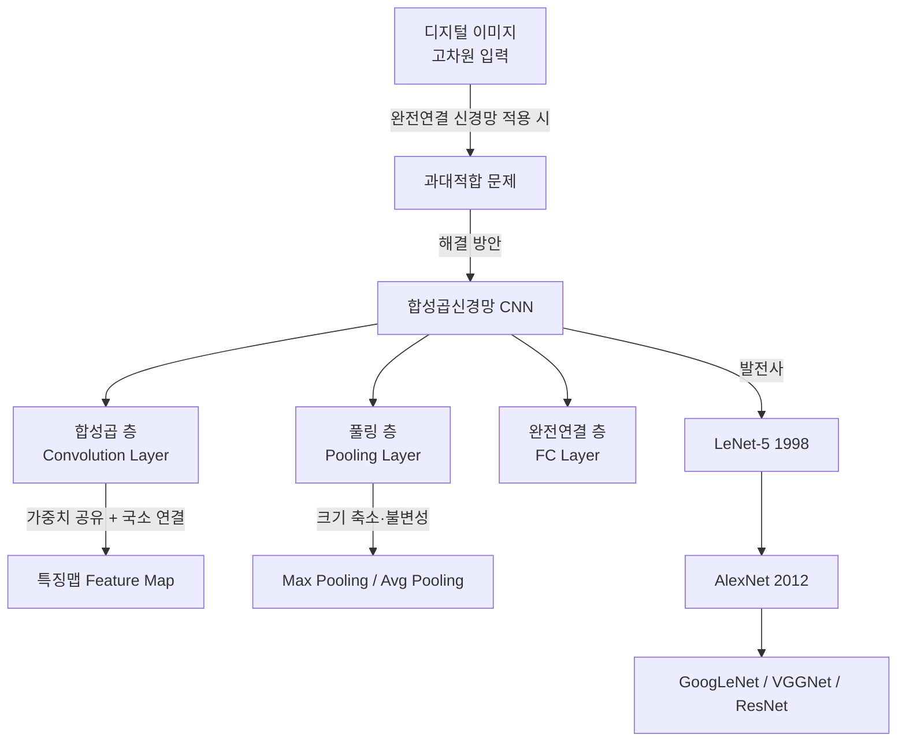
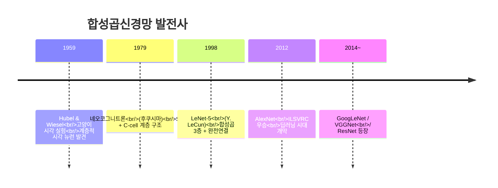

# 6강. 딥러닝의통계적이해: 합성곱신경망의 기초 (1)

## 🔗 선수 지식 (Prerequisites)

- [ ] **필수**: [3강. 딥러닝 모형의 구조와 학습 (1)](3강.%20딥러닝%20모형의%20구조와%20학습%20(1).md) — 완전연결 신경망 구조 이해 완료?
- [ ] **필수**: [4강. 딥러닝 모형의 구조와 학습 (2)](4강.%20딥러닝%20모형의%20구조와%20학습%20(2).md) — 역전파 및 가중치 업데이트 이해 완료?
- [ ] **필수**: [5강. 딥러닝의 제 문제와 발전](5강.%20딥러닝의%20제%20문제와%20발전.md) — 과적합 문제와 정규화 이해 완료?
- [ ] **권장**: 행렬 곱셈, 2차원 배열 기본 연산
- **관련 단원**: [7강. 합성곱신경망의 기초 (2)] (다음 강)

---

## 학습 목표

1. 컴퓨터 비전을 이해한다.
2. 합성곱신경망의 역사를 이해한다.
3. 합성곱 연산을 이해한다.

---

## 🧠 메타인지 체크 (학습 전/후 자기 평가)

### 학습 전 자기 평가

| 소주제 | 자신감 (1-5) |
| :--- | :--- |
| 컴퓨터 비전과 디지털 이미지 구조 | |
| CNN 발전 역사 (LeNet → AlexNet) | |
| 합성곱 연산 (출력 크기, 패딩, 스트라이드) | |
| 풀링 연산 종류와 특성 | |

### 학습 후 교정 (학습 완료 후 작성)

| 소주제 | 학습 전 | 학습 후 | 실제 정답률 | 과신/과소 여부 |
| :--- | :--- | :--- | :--- | :--- |
| 컴퓨터 비전과 디지털 이미지 구조 | | | | |
| CNN 발전 역사 (LeNet → AlexNet) | | | | |
| 합성곱 연산 (출력 크기, 패딩, 스트라이드) | | | | |
| 풀링 연산 종류와 특성 | | | | |

> **활용법**: 학습 전 1분 → 자신감 기입, 학습 후 1분 → 나머지 기입. "과신" 영역이 실제 취약점.

---

## 📝 요약 (Summary)

1. 🔴 **컴퓨터 비전(Computer Vision)**: 컴퓨터에 저장된 이미지나 동영상으로부터 유용한 정보를 자동 추출·분석·이해하는 기술이다.
2. 🔴 **완전연결 신경망의 한계**: 디지털 이미지는 고차원 입력 벡터로, 완전연결 신경망 적용 시 파라미터가 폭발적으로 증가하여 과대적합(Overfitting) 문제가 발생한다.
3. 🔴 **합성곱 연산**: 가중치 공유(Weight Sharing)와 국소 연결(Local Connectivity)이 가능한 연산으로, 이미지 특징을 효율적으로 추출한다.
4. 🟡 **CNN의 역사**: 네오코그니트론(1979) → LeNet-5(1998) → AlexNet(2012) 순으로 발전하였으며, AlexNet 이후 딥러닝 시대가 열렸다.

---

## 📐 핵심 수식 (Key Formulas)

| 수식명 | 수식 | 의미 |
| :--- | :--- | :--- |
| **기본 출력 크기** | $(n - f + 1) \times (n - f + 1)$ | 패딩 없이 $n \times n$ 입력에 $f \times f$ 필터를 적용했을 때의 출력 크기 |
| **패딩 크기** | $p = \dfrac{f - 1}{2}$ | 입·출력 크기를 동일하게 유지하기 위해 필요한 제로 패딩 크기 (`→←4강` 과적합 방지) |
| **최종 출력 크기** | $\dfrac{n + 2p - f}{s} + 1$ | 패딩 $p$, 스트라이드 $s$를 고려한 합성곱 결과 크기 |

### 주요 정리/정의

**합성곱 출력 크기 공식 (일반형)**

$$
\text{출력 크기} = \left\lfloor \frac{n + 2p - f}{s} \right\rfloor + 1
$$

> **직관적 해석**: 입력 $n$에 패딩 $2p$를 더한 뒤, 필터 크기 $f$를 뺀 구간을 스트라이드 $s$ 간격으로 몇 번 이동할 수 있는지 세는 공식이다.
> **AI 적용**: CNN 아키텍처 설계 시 각 층의 출력 텐서 크기를 미리 계산하여 네트워크가 올바르게 구성됐는지 검증하는 데 사용한다.

**$1 \times 1$ 합성곱의 채널 축소**

$$
\text{출력 채널 수} = \text{필터 개수}
$$

> **직관적 해석**: $1 \times 1$ 합성곱은 공간(가로·세로) 정보는 그대로 두고 채널(깊이) 차원만 압축하는 선형 변환이다.
> **AI 적용**: GoogLeNet의 Inception 모듈에서 계산량 감소를 위해 활용된다. (`→←5강` 모형 경량화)

---

## 📊 개념 시각화 (Visual Guide)

### 개념 관계도



### 핵심 도식 — 합성곱 연산 요소 비교

| 요소 | 역할 | 효과 | AI 적용 |
| :--- | :--- | :--- | :--- |
| **필터(Kernel)** | 입력에 원소별 곱셈 후 합산 | 엣지·질감 등 국소 특징 추출 | 학습 가능한 특징 감지기 |
| **패딩(Padding)** | 입력 주변에 0 추가 | 출력 크기 유지, 가장자리 정보 보존 | Same Padding으로 크기 일정 유지 |
| **스트라이드(Stride)** | 필터 이동 간격 조정 | 출력 크기 축소, 계산량 감소 | 다운샘플링 대안으로 활용 |
| **최대 풀링** | 구역 내 최댓값 선택 | 이동·왜곡 불변성, 과적합 방지 | CNN의 표준 다운샘플링 기법 |
| **평균 풀링** | 구역 내 평균 계산 | 부드러운 다운샘플링 | Global Average Pooling으로 분류 층 활용 |

### CNN 발전 연표



---

## ✏️ 심화 학습 (Study Subject)

### 1. 가상 시나리오: "이미지 분류기를 만든다면?"

- **상황**: 32×32 컬러(RGB) 이미지 10,000장으로 고양이/개를 분류하는 모델을 설계해야 한다.
- **문제**: 완전연결 신경망만 쓰면 첫 번째 층의 파라미터 수가 $32 \times 32 \times 3 = 3,072$ 개의 입력 × 은닉 뉴런 수가 되어 수백만 파라미터가 발생한다. 어떻게 줄일 수 있을까?
- **해결**: $3 \times 3$ 필터 32개를 적용하면 각 필터당 파라미터는 $3 \times 3 \times 3 + 1(\text{bias}) = 28$개, 전체 $28 \times 32 = 896$개로 급감한다. 가중치 공유 덕분에 입력 크기에 무관하게 필터 파라미터 수가 고정된다.
- **AI 학습 포인트**: "입력 이미지 해상도가 2배로 커져도 합성곱 층의 파라미터 수가 변하지 않는 이유를 완전연결 신경망과 비교해서 수식으로 설명해 줘."

### 2. 관점별 비교 및 오개념 분석

#### 🔴 완전연결 신경망 vs 합성곱신경망

| 구분 | 완전연결 신경망 (FC) | 합성곱신경망 (CNN) |
| :--- | :--- | :--- |
| **연결 방식** | 모든 뉴런 쌍 연결 | 인접 뉴런만 연결 (국소 연결) |
| **가중치** | 뉴런마다 독립적 | 필터 단위로 공유 (가중치 공유) |
| **파라미터 수** | 입력 크기에 비례해 폭증 | 필터 크기로 고정, 작음 |
| **공간 정보** | 위치 정보 무시 | 위치 정보 보존 |
| **이미지 처리** | 과적합 위험 큼 | 이미지에 최적화 |

#### 🟡 Max Pooling vs Average Pooling

| 구분 | Max Pooling | Average Pooling |
| :--- | :--- | :--- |
| **계산** | 구역 내 최댓값 | 구역 내 평균값 |
| **특성** | 두드러진 특징 강조 | 전체 특징 균등 반영 |
| **주 용도** | CNN 중간 다운샘플링 | Global Average Pooling (분류 직전) |
| **이동 불변성** | 강함 | 상대적으로 약함 |

#### 오개념 분석

- **오개념 1**: "패딩을 추가하면 출력 크기가 커진다."
  - **분석**: 패딩의 목적은 출력 크기를 *원본 입력 크기와 동일하게 유지*하는 것이다. $p = \frac{f-1}{2}$로 설정하면 $\frac{n + 2p - f}{1} + 1 = n$이 성립한다. 패딩은 크기를 늘리는 것이 아니라 *축소를 막는* 것이다.

- **오개념 2**: "스트라이드가 클수록 정확도가 높아진다."
  - **분석**: 스트라이드가 크면 출력 크기가 줄어들어 **공간 정보가 손실**된다. 계산 효율은 높아지지만 정확도가 오히려 낮아질 수 있다. 스트라이드 증가는 풀링과 유사한 다운샘플링 효과를 가지며, 트레이드오프가 존재한다.

- **AI 학습 포인트**: "$5 \times 5$ 입력, $3 \times 3$ 필터, 패딩 1, 스트라이드 2일 때 출력 크기를 공식으로 단계별로 계산해 줘. 그리고 패딩 없을 때와 결과를 비교해 줘."

---

## ❓ 연습 문제 및 해설

> **블룸 인지 수준 범례**: [기억] 정의·나열 → [이해] 설명·비교 → [적용] 계산·구현 → [분석] 구별·디버그 → [평가] 판단·비평 → [창조] 설계·제안

### 📝 문제

**1. ⭐ [기억] 디지털 이미지에 대한 설명으로 옳지 않은 것은?** <a id="q1"></a>

> ① 흑백 이미지는 1개의 행렬로 표현된다.
> ② 컬러 이미지는 R, G, B 3개의 행렬 조합으로 표현된다.
> ③ 샘플링이 많을수록 저화소 이미지가 된다.
> ④ 8비트는 $2^8 = 256$개의 값으로 데이터를 표현한다.

<br>

**2. ⭐ [기억] CNN의 발전 역사를 시간순으로 올바르게 나열한 것은?** <a id="q2"></a>

> ① LeNet-5 → 네오코그니트론 → AlexNet
> ② 네오코그니트론 → LeNet-5 → AlexNet
> ③ AlexNet → LeNet-5 → 네오코그니트론
> ④ LeNet-5 → AlexNet → 네오코그니트론

<br>

**3. ⭐⭐ [적용] $7 \times 7$ 입력에 $3 \times 3$ 필터, 패딩 없음, 스트라이드 1을 적용했을 때 출력 크기는?** <a id="q3"></a>

> ① $3 \times 3$
> ② $4 \times 4$
> ③ $5 \times 5$
> ④ $6 \times 6$

<br>

**4. ⭐⭐ [적용] 입·출력 크기를 동일하게 유지하기 위해 $5 \times 5$ 필터에 필요한 패딩 크기 $p$는?** <a id="q4"></a>

> ① $p = 1$
> ② $p = 2$
> ③ $p = 3$
> ④ $p = 4$

<br>

**5. ⭐⭐ [이해] 합성곱 연산의 특성에 대한 설명으로 옳은 것을 모두 고른 것은?** <a id="q5"></a>

> <보기>
>
> ㄱ. 가중치를 공유하여 파라미터 수를 줄인다.
> ㄴ. 모든 뉴런이 서로 연결되는 완전연결 방식이다.
> ㄷ. 입력이 이동하면 출력도 같은 방향으로 이동하는 이동 등변성이 있다.
> ㄹ. 스트라이드가 클수록 출력 크기가 커진다.

> ① ㄱ, ㄷ
> ② ㄴ, ㄷ
> ③ ㄱ, ㄴ, ㄷ
> ④ ㄱ, ㄴ, ㄷ, ㄹ

<br>

**6. ⭐⭐⭐ [분석] 📌 $32 \times 32$ RGB 컬러 이미지에 $5 \times 5$ 필터 8개를 패딩 없이 스트라이드 1로 적용했을 때, 출력 특징맵의 크기(가로×세로×채널)를 구하시오. 또한 이 연산의 총 학습 파라미터 수(편향 포함)를 계산하시오.** <a id="q6"></a>

<br>

---

### 🔑 정답 및 해설

<details>
<summary>정답 보기 (클릭)</summary>

1. ③
2. ②
3. ③
4. ②
5. ①
6. 출력 크기: $28 \times 28 \times 8$, 파라미터 수: $5 \times 5 \times 3 \times 8 + 8 = 608$개

</details>

<details>
<summary>해설 보기 (클릭)</summary>

<a id="prob-1"></a>
**1. ⭐ [기억] 디지털 이미지**
> **정답: ③ 샘플링이 많을수록 저화소 이미지가 된다.**
> **해설**: 샘플링(Sampling)은 아날로그 신호를 일정 간격으로 디지털화하는 과정이다. 샘플링 횟수가 많을수록 더 세밀하게 측정하므로 **고화소** 이미지가 된다. ①②④는 모두 옳은 설명이다.

<a id="prob-2"></a>
**2. ⭐ [기억] CNN 발전사**
> **정답: ② 네오코그니트론(1979) → LeNet-5(1998) → AlexNet(2012)**
> **해설**: 후쿠시마의 네오코그니트론(1979)이 CNN의 원형이고, 얀 르쿤의 LeNet-5(1998)가 실용적인 첫 CNN 모델, AlexNet(2012)이 ILSVRC에서 딥러닝 시대를 열었다.

<a id="prob-3"></a>
**3. ⭐⭐ [적용] 출력 크기 계산**
> **정답: ③ $5 \times 5$**
> **해설**: 패딩 없음($p=0$), 스트라이드 $s=1$이므로 $\frac{7 + 0 - 3}{1} + 1 = 5$. 따라서 $5 \times 5$.

<a id="prob-4"></a>
**4. ⭐⭐ [적용] 패딩 크기 계산**
> **정답: ② $p = 2$**
> **해설**: $p = \frac{f-1}{2} = \frac{5-1}{2} = 2$. 검증: $\frac{n + 2 \times 2 - 5}{1} + 1 = n$.

<a id="prob-5"></a>
**5. ⭐⭐ [이해] 합성곱 연산 특성**
> **정답: ① ㄱ, ㄷ**
> **해설**:
> - ㄱ (O): 가중치 공유는 CNN의 핵심 특성으로 파라미터 수를 대폭 감소시킨다.
> - ㄴ (X): CNN은 **국소 연결(Local Connectivity)** 방식이다. 완전연결은 FC 층의 특성이다.
> - ㄷ (O): 이동 등변성(Translation Equivariance)은 CNN의 주요 특성이다.
> - ㄹ (X): 스트라이드가 클수록 출력 크기가 **작아진다**. $\frac{n+2p-f}{s}+1$에서 $s$가 분모이므로 출력이 감소한다.

<a id="prob-6"></a>
**6. ⭐⭐⭐ [분석] 컬러 이미지 합성곱 파라미터 수**
> **정답**: 출력 $28 \times 28 \times 8$, 파라미터 $608$개
> **해설**:
> - 출력 크기: $\frac{32 - 5}{1} + 1 = 28$이므로 $28 \times 28 \times 8$
> - RGB 3채널이므로 필터 하나의 파라미터: $5 \times 5 \times 3 = 75$
> - 필터 8개 + 편향 8개: $75 \times 8 + 8 = 600 + 8 = 608$개
> - 완전연결이었다면 $32 \times 32 \times 3 = 3,072$개 입력이므로 그 차이가 극명하다.

</details>

---

## ✅ O/X 확인문제

**1.** 디지털 이미지에서 샘플링 횟수가 많을수록 고화소 이미지가 된다. **(O / X)**

**2.** 흑백 이미지는 3개의 행렬(채널)로 표현된다. **(O / X)**

**3.** 완전연결 신경망은 고차원 이미지 입력 시 과대적합 문제가 발생할 수 있다. **(O / X)**

**4.** Hubel과 Wiesel의 고양이 실험은 시각 뉴런이 계층적으로 작용함을 보여주었다. **(O / X)**

**5.** LeNet-5는 AlexNet보다 먼저 개발된 합성곱신경망 모델이다. **(O / X)**

**6.** AlexNet은 1998년 ILSVRC 경진대회에서 우승하며 딥러닝 시대를 열었다. **(O / X)**

**7.** 합성곱 연산에서 가중치 공유란 하나의 필터를 입력 전체에 동일하게 적용하는 것을 의미한다. **(O / X)**

**8.** 패딩을 추가하면 출력 크기가 입력 크기보다 커진다. **(O / X)**

**9.** 스트라이드를 크게 하면 출력 특징맵의 크기가 작아진다. **(O / X)**

**10.** 최대 풀링(Max Pooling)은 구역 내 평균값을 선택하는 연산이다. **(O / X)**

**11.** $1 \times 1$ 합성곱은 채널 수를 조정하는 데 활용될 수 있다. **(O / X)**

**12.** 합성곱신경망의 이동 등변성이란 입력이 이동하면 출력도 같은 방향으로 이동함을 뜻한다. **(O / X)**

<details>
<summary>O/X 정답 및 해설 보기 (클릭)</summary>

> **1. 정답: O**
> **해설**: 샘플링이 많을수록 더 세밀한 간격으로 측정하므로 더 많은 픽셀을 가진 고화소 이미지가 된다.

> **2. 정답: X**
> **해설**: 흑백 이미지는 밝기 정보 하나만 갖기 때문에 **1개의 행렬(채널)** 로 표현된다. 3채널은 컬러(RGB) 이미지다.

> **3. 정답: O**
> **해설**: 이미지 픽셀 수에 비례해 파라미터가 급증하므로, 충분한 데이터 없이는 모형이 훈련 데이터에 과적합된다.

> **4. 정답: O**
> **해설**: 1959년 허블(Hubel)과 비셀(Wiesel)은 고양이 실험에서 특정 자극에 반응하는 뉴런이 계층적으로 활성화됨을 발견하여 CNN의 생물학적 근거를 마련했다.

> **5. 정답: O**
> **해설**: LeNet-5는 1998년, AlexNet은 2012년에 등장했다.

> **6. 정답: X**
> **해설**: AlexNet이 우승한 해는 **2012년**이며, 1998년은 LeNet-5가 개발된 연도이다.

> **7. 정답: O**
> **해설**: 가중치 공유(Weight Sharing)는 동일한 필터를 입력의 모든 위치에 슬라이딩하며 적용하는 것으로, 파라미터 수를 대폭 줄인다.

> **8. 정답: X**
> **해설**: 패딩의 목적은 출력 크기를 **입력과 동일하게 유지**하는 것이다. $p = \frac{f-1}{2}$로 설정하면 출력 = 입력 크기가 된다.

> **9. 정답: O**
> **해설**: 출력 크기 공식 $\frac{n+2p-f}{s}+1$에서 $s$가 분모에 있으므로 스트라이드가 커지면 출력 크기가 작아진다.

> **10. 정답: X**
> **해설**: 최대 풀링(Max Pooling)은 구역 내 **최댓값**을 선택한다. 평균값을 선택하는 것은 평균 풀링(Average Pooling)이다.

> **11. 정답: O**
> **해설**: $1 \times 1$ 합성곱은 공간 크기는 유지하면서 필터 개수로 채널 수를 조절한다. GoogLeNet에서 연산량 감소에 활용된다.

> **12. 정답: O**
> **해설**: 이동 등변성(Translation Equivariance)은 입력 패턴의 위치가 이동하면 합성곱 출력의 해당 위치도 동일하게 이동하는 성질이다.

</details>

---

## 🧪 자유 회상 연습 (Free Recall)

> **방법**: 위의 노트를 모두 덮고, 타이머 3분 설정 후 이번 단원에서 배운 내용을 기억나는 대로 자유롭게 적으세요.
> 정확한 문장이 아니어도 됩니다. 키워드, 수식, 관계 등 떠오르는 것을 모두 적습니다.

**자유 회상 작성란:**

```
[여기에 기억나는 내용을 자유롭게 작성]


```

> **회상 후 점검**: 노트를 다시 펼쳐 빠뜨린 내용을 확인하세요. 빠뜨린 부분이 실제 취약점입니다.
> - 회상 못한 핵심 개념: [                ]
> - 회상 못한 수식: [                ]

---

## 💻 코드로 확인하기 (Code Verification)

```python
import numpy as np

def conv2d(input_matrix, kernel, stride=1, padding=0):
    """2D 합성곱 연산 직접 구현"""
    # 패딩 적용
    if padding > 0:
        input_matrix = np.pad(input_matrix, padding, mode='constant', constant_values=0)
    
    n = input_matrix.shape[0]
    f = kernel.shape[0]
    out_size = (n - f) // stride + 1
    output = np.zeros((out_size, out_size))
    
    for i in range(out_size):
        for j in range(out_size):
            region = input_matrix[i*stride:i*stride+f, j*stride:j*stride+f]
            output[i, j] = np.sum(region * kernel)
    return output

# 예시 1: 기본 합성곱 (패딩 없음, stride=1)
input_img = np.array([
    [1, 2, 3, 4, 5],
    [6, 7, 8, 9, 10],
    [1, 3, 5, 7, 9],
    [2, 4, 6, 8, 10],
    [0, 1, 0, 1, 0]
], dtype=float)

edge_kernel = np.array([
    [-1, -1, -1],
    [-1,  8, -1],
    [-1, -1, -1]
], dtype=float)  # 엣지 검출 필터

result_no_pad = conv2d(input_img, edge_kernel, stride=1, padding=0)
print("=== 입력 (5x5) ===")
print(input_img)
print(f"\n=== 필터 (3x3) — 엣지 검출 ===")
print(edge_kernel)
print(f"\n=== 출력 (패딩=0, stride=1): 크기 = {result_no_pad.shape} ===")
print(result_no_pad)

# 예시 2: 패딩 1 적용 → 출력 크기 유지
result_pad = conv2d(input_img, edge_kernel, stride=1, padding=1)
print(f"\n=== 출력 (패딩=1, stride=1): 크기 = {result_pad.shape} ===")
print(result_pad)

# 예시 3: 스트라이드 2 적용
result_stride = conv2d(input_img, edge_kernel, stride=2, padding=1)
print(f"\n=== 출력 (패딩=1, stride=2): 크기 = {result_stride.shape} ===")
print(result_stride)

# 출력 크기 공식 검증 함수
def calc_output_size(n, f, p, s):
    return (n + 2*p - f) // s + 1

print("\n=== 출력 크기 공식 검증 ===")
cases = [(5,3,0,1), (5,3,1,1), (5,3,1,2)]
for n,f,p,s in cases:
    size = calc_output_size(n,f,p,s)
    print(f"  n={n}, f={f}, p={p}, s={s} → 출력 크기: {size}x{size}")
```

> **실행 결과**:
> ```
> === 입력 (5x5) ===
> [[ 1.  2.  3.  4.  5.]
>  [ 6.  7.  8.  9. 10.]
>  [ 1.  3.  5.  7.  9.]
>  [ 2.  4.  6.  8. 10.]
>  [ 0.  1.  0.  1.  0.]]
> 
> === 필터 (3x3) — 엣지 검출 ===
> [[-1. -1. -1.]
>  [-1.  8. -1.]
>  [-1. -1. -1.]]
> 
> === 출력 (패딩=0, stride=1): 크기 = (3, 3) ===
> [[ 8. 12. 16.]
>  [-8. -4. -8.]
>  [ 8. 16. 24.]]
> 
> === 출력 (패딩=1, stride=1): 크기 = (5, 5) ===
> (패딩 적용으로 입력과 동일한 5x5 유지)
> 
> === 출력 (패딩=1, stride=2): 크기 = (3, 3) ===
> (stride=2로 크기 절반 축소)
> 
> === 출력 크기 공식 검증 ===
>   n=5, f=3, p=0, s=1 → 출력 크기: 3x3
>   n=5, f=3, p=1, s=1 → 출력 크기: 5x5
>   n=5, f=3, p=1, s=2 → 출력 크기: 3x3
> ```

> **수학적 해석**: 패딩=0, stride=1이면 공식대로 $\frac{5-3}{1}+1=3$이 나온다. 패딩=1을 추가하면 $\frac{5+2-3}{1}+1=5$로 입력 크기와 동일해진다. stride=2이면 $\frac{5+2-3}{2}+1=3$으로 다운샘플링된다.

---

## 🤖 AI 연결고리 (Math → AI Application)

| 수학/이론 개념 | AI/ML 적용 분야 | 구체적 사례 |
| :--- | :--- | :--- |
| 합성곱 연산 (가중치 공유) | 이미지 분류·검출 | ResNet, EfficientNet의 특징 추출 층 |
| 패딩 (Same Padding) | 인코더-디코더 구조 | U-Net의 Segmentation — 입·출력 크기 일치 필요 |
| 스트라이드 다운샘플링 | 특징맵 크기 조절 | YOLO의 백본에서 Strided Conv로 해상도 감소 |
| 최대 풀링 | 위치 불변 특징 추출 | VGGNet에서 2×2 Max Pool로 크기 절반 감소 |
| $1 \times 1$ 합성곱 | 채널 차원 압축 | GoogLeNet Inception 모듈의 병목 구조 |
| CNN 계층 구조 | 자연어 처리(NLP) | TextCNN — 텍스트를 이미지처럼 처리하는 감성 분석 |

---

## 📖 심화 학습 예시 답안

#### 1. 합성곱 연산의 내부 동작 원리

합성곱 연산은 다음 3단계로 이루어진다:

1. **필터 배치**: 필터($f \times f$)를 입력의 좌상단 위치에 정렬한다.
2. **원소별 곱셈 및 합산**: 필터와 해당 위치 입력을 원소별로 곱한 뒤 모두 더해 스칼라 하나를 생성한다.
3. **슬라이딩**: 스트라이드 $s$만큼 오른쪽/아래로 이동하며 1~2를 반복한다. 결과물이 특징맵(Feature Map)이다.

이때 **같은 필터**가 전체 입력을 스캔하므로 위치와 무관하게 동일한 패턴을 감지할 수 있고 파라미터 수가 고정된다.

#### 2. Max Pooling vs Average Pooling 비교표

| 구분 | Max Pooling | Average Pooling | 비고 |
| :--- | :--- | :--- | :--- |
| **연산** | $\max$ (구역 내) | $\text{mean}$ (구역 내) | 풀링 크기·stride 동일 |
| **정보 보존** | 강한 활성화 보존 | 전체 활성화 평균 | |
| **이동 불변성** | 강함 | 상대적으로 약함 | |
| **주요 사용처** | CNN 중간 층 다운샘플링 | Global Avg Pooling (분류 직전) | |
| **AI 활용** | VGGNet, AlexNet | GoogLeNet (GAP), MobileNet | |

#### 3. 합성곱 코드 Best Practice

- **Bad Practice (나쁜 예시)**
  ```python
  # 이중 for 루프로 직접 구현 — 대용량 이미지에서 극도로 느림
  for i in range(out_h):
      for j in range(out_w):
          output[i,j] = sum(input[i:i+f, j:j+f] * kernel)
  ```

- **Good Practice (좋은 예시)**
  ```python
  import torch
  import torch.nn as nn

  # PyTorch Conv2d 활용 — GPU 가속 및 자동미분 지원
  conv_layer = nn.Conv2d(
      in_channels=3,     # RGB 입력
      out_channels=32,   # 필터 32개
      kernel_size=3,     # 3x3 필터
      stride=1,
      padding=1          # Same padding
  )
  # 파라미터 수 확인
  total_params = sum(p.numel() for p in conv_layer.parameters())
  print(f"총 파라미터: {total_params}")  # 3*3*3*32 + 32 = 896
  ```

- **설명**: PyTorch/TensorFlow의 내장 Conv2d는 im2col 변환 + BLAS 행렬 곱셈 또는 FFT 기반 최적화로 수십~수백 배 빠르게 실행되며, 자동미분(autograd)까지 지원한다.

---

## 📚 핵심 용어집 (Glossary)

| 용어 (한) | 용어 (영) | 수식 표현 | 정의 |
| :--- | :--- | :--- | :--- |
| **합성곱** | Convolution | $(f * g)(t)$ | 필터와 입력의 원소별 곱셈 후 합산 연산. CNN의 핵심 연산 |
| **필터 / 커널** | Filter / Kernel | $f \times f$ 행렬 | 합성곱 연산에서 입력을 슬라이딩하며 특징을 추출하는 가중치 행렬 |
| **특징맵** | Feature Map | — | 합성곱 연산의 출력. 입력에서 특정 패턴이 얼마나 나타나는지를 표현 |
| **패딩** | Padding | $p = \frac{f-1}{2}$ | 입력 주변에 0을 추가하여 출력 크기를 유지하거나 가장자리 정보를 보존하는 기법 |
| **스트라이드** | Stride | $s$ | 필터가 한 번에 이동하는 칸 수. 클수록 출력 크기 감소 |
| **풀링** | Pooling | — | 특징맵의 공간 크기를 줄이는 연산. Max/Average Pooling이 대표적 (`→←5강` 과적합 방지) |
| **가중치 공유** | Weight Sharing | — | 동일 필터를 입력 전체에 적용하여 파라미터 수를 줄이는 CNN의 핵심 특성 |
| **국소 연결** | Local Connectivity | — | 인접 영역의 뉴런끼리만 연결하는 방식. 위치 정보 보존 |
| **이동 등변성** | Translation Equivariance | — | 입력 패턴이 이동하면 출력도 동일하게 이동하는 성질 |
| **컴퓨터 비전** | Computer Vision | — | 디지털 이미지/동영상에서 유용한 정보를 자동 추출·분석·이해하는 기술 |
| **샘플링** | Sampling | — | 아날로그 신호를 일정 간격으로 측정하여 디지털화하는 과정 (`→←2강` 데이터 처리) |

---

## 🤖 AI 학습 파트너를 위한 추가 자료

### 1. 개념 이해를 위한 심층 질문 프롬프트

> **프롬프트 예시**: "합성곱 연산의 '가중치 공유'와 '국소 연결'이 완전연결 신경망과 비교해 왜 이미지 처리에 더 적합한지, 파라미터 수 계산 예시($32 \times 32$ RGB 이미지, $3 \times 3$ 필터 64개)와 함께 설명해 줘. 그리고 이 두 특성이 없었다면 현대 딥러닝이 어떻게 달라졌을지도 이야기해 줘."

### 2. 문제 해결 능력 강화를 위한 시나리오 프롬프트

> **프롬프트 예시**: "당신은 자율주행 AI 엔지니어입니다. 카메라에서 받은 $1280 \times 720$ RGB 이미지를 실시간으로 처리해야 합니다. $3 \times 3$ 필터(Same Padding)와 $5 \times 5$ 필터(Same Padding) 중 어떤 것이 더 적합한지, 파라미터 수·수용 영역(Receptive Field)·연산량을 비교해서 기술적 근거를 들어 추천해 줘."

### 3. 수식 풀이 검증 프롬프트

> **프롬프트 예시**: "다음 합성곱 출력 크기 풀이 과정을 검증해 줘.
> 입력: $224 \times 224$, 필터: $11 \times 11$, 패딩: 0, 스트라이드: 4 (AlexNet 1층)
> $$\frac{224 + 2 \times 0 - 11}{4} + 1 = \frac{213}{4} + 1 = 53.25 + 1 = 54.25$$
> 계산이 맞는지 확인하고, 소수점이 나왔을 때 CNN에서 어떻게 처리하는지(floor 연산)도 설명해 줘."

---

## 🔄 복습 체크 (Spaced Repetition)

- [ ] 1일 후 복습 (날짜: 2026-04-13)
- [ ] 3일 후 복습 (날짜: 2026-04-15)
- [ ] 7일 후 복습 (날짜: 2026-04-19)
- [ ] 14일 후 복습 (날짜: 2026-04-26)
- [ ] 30일 후 복습 (날짜: 2026-05-12)

### 복습 시 자가 평가

| 회차 | 날짜 | 이해도 (1-5) | 취약 부분 메모 |
| :--- | :--- | :--- | :--- |
| 1차 | | | |
| 2차 | | | |
| 3차 | | | |

---

## 📚 참고 자료 (References)

- 교재 — 딥러닝의통계적이해 6강 강의자료
- Y. LeCun et al. (1998) — "Gradient-Based Learning Applied to Document Recognition" (LeNet-5 원논문)
- A. Krizhevsky et al. (2012) — "ImageNet Classification with Deep Convolutional Neural Networks" (AlexNet 원논문)
- CS231n Stanford — Convolutional Neural Networks for Visual Recognition
