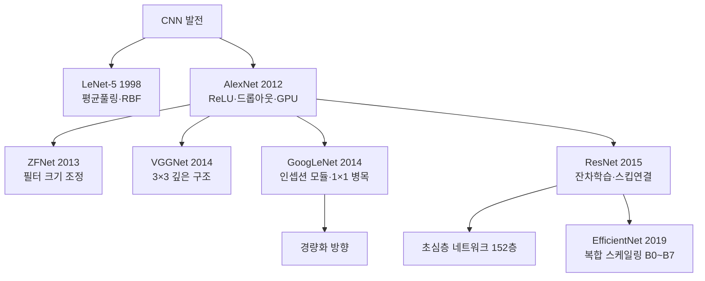

# 7강. 딥러닝의통계적이해: 합성곱신경망의 기초 (2)

## 🔗 선수 지식 (Prerequisites)
- [x] **필수**: [6강. 합성곱신경망의 기초 (1)](6강.%20합성곱신경망의%20기초%20(1).md) — 합성곱 연산, 패딩, 스트라이드, 풀링 이해 완료?
- [x] **필수**: [4강. 딥러닝 모형의 구조와 학습 (2)](4강.%20딥러닝%20모형의%20구조와%20학습%20(2).md) — 오차역전파법(Backpropagation) 이해 완료?
- [ ] **권장**: [5강. 딥러닝의 제 문제와 발전](5강.%20딥러닝의%20제%20문제와%20발전.md) — 드롭아웃, 배치 정규화, ReLU 등 발전 기법 숙지

---

## 학습 목표
1. 합성곱신경망의 기본구조(3차원 구조, 역전파, 풀링 업샘플링)를 설명할 수 있다.
2. 주요 합성곱 신경망 모델(LeNet-5, AlexNet, ZFNet, VGGNet, GoogLeNet, ResNet)의 특징과 발전 과정을 비교·설명할 수 있다.

---

## 🧠 메타인지 체크 (학습 전/후 자기 평가)

### 학습 전 자기 평가
| 소주제 | 자신감 (1-5) |
| :--- | :--- |
| CNN 3차원 구조 및 역전파 | |
| MNIST FC vs CNN 가중치/정확도 비교 | |
| LeNet-5 구조 | |
| AlexNet / ZFNet 특징 | |
| VGGNet / GoogLeNet / ResNet 핵심 아이디어 | |

### 학습 후 교정 (학습 완료 후 작성)
| 소주제 | 학습 전 | 학습 후 | 실제 정답률 | 과신/과소 여부 |
| :--- | :--- | :--- | :--- | :--- |
| CNN 3차원 구조 및 역전파 | | | | |
| MNIST FC vs CNN 가중치/정확도 비교 | | | | |
| LeNet-5 구조 | | | | |
| AlexNet / ZFNet 특징 | | | | |
| VGGNet / GoogLeNet / ResNet 핵심 아이디어 | | | | |

> **활용법**: 학습 전 1분 → 자신감 기입, 학습 후 1분 → 나머지 기입. "과신" 영역이 실제 취약점.

---

## 📝 요약 (Summary)

1. 🔴 **CNN 기본 구조**: 합성곱 신경망(CNN)의 층은 높이(Height), 너비(Width), **깊이(Depth, 채널/특징 맵)**로 구성된다. 전체 구조는 `합성곱층 → 풀링층 → (반복) → 평탄화 → 완전연결망`의 순서로 이루어진다.
2. 🔴 **CNN 학습(역전파)**: 풀링층을 제외한 모든 층의 가중치는 **오차역전파법**으로 학습한다. 풀링층의 역전파는 **업 샘플링(Up sampling)**으로, 순전파 시 최댓값 위치는 1, 나머지는 0으로 처리한다.
3. 🟡 **MNIST 비교**: 완전연결 신경망(407,050개 가중치, 98.24%) 대비 CNN(93,322개 가중치, 99.36%)은 가중치 공유로 파라미터를 약 23% 수준으로 줄이면서도 더 높은 정확도를 달성한다.
4. 🔴 **LeNet-5 (1998)**: 최초의 실용적 CNN. 합성곱+평균 풀링 반복 후 완전연결망 구조. 현대에는 RBF → 소프트맥스, 평균 풀링 → 최대 풀링으로 대체.
5. 🔴 **AlexNet (2012)**: ILSVRC 오분류율 16.4% 달성. **ReLU** 활성화 함수, **드롭아웃**, 데이터 증강, GPU 병렬 계산 도입으로 딥러닝 시대 개막.
6. 🟡 **ZFNet (2013)**: AlexNet 구조 유지, Conv1 필터를 11×11·stride 4에서 7×7·stride 2로 수정. ILSVRC 2013 우승, 오분류율 **11.2%**.
7. 🟡 **VGGNet (2014)**: 3×3 필터를 깊게 쌓는 단순한 구조(VGG16, VGG19). 가중치 약 1억 3,800만 개로 계산량이 큰 단점.
8. 🔴 **GoogLeNet (2014)**: **인셉션(Inception) 모듈** — 1×1, 3×3, 5×5 필터를 병렬 적용 후 결합. 1×1 병목 연산으로 계산량 절감. 가중치 약 600만 개(AlexNet의 1/10). 오분류율 6.7%.
9. 🔴 **ResNet (2015)**: **잔차 학습(Residual Learning)** — 스킵 연결 $H(x)=F(x)+x$ 도입. 경사 소실 방지로 152층 구현. ILSVRC 2015 우승, 오분류율 **3.57%**로 인간 수준(5%) 초과.

---

## 📐 핵심 정의 및 원리

| 정의명 | 내용 | 키워드 |
| :--- | :--- | :--- |
| **CNN 3차원 구조** | 층은 (H, W, D)로 구성. D는 채널 또는 특징 맵 수를 의미 | Height, Width, Depth, Feature map |
| **풀링 역전파 (업샘플링)** | 최대 풀링의 역전파 시, 순전파에서 최댓값이 있던 위치=1, 나머지=0으로 복원 | Up sampling, Max pooling |
| **가중치 공유** | CNN의 필터(가중치)를 전체 이미지에 공유 적용하여 파라미터 수를 획기적으로 감소 | Weight sharing, Parameter reduction |
| **잔차 학습** | $H(x) = F(x) + x$ — 입력을 출력에 직접 더하는 스킵 연결로 경사 소실 문제 해결 | Skip connection, Residual block |
| **인셉션 모듈** | 다양한 크기의 필터(1×1, 3×3, 5×5)를 병렬로 적용하고 채널 방향으로 결합 | Inception, Parallel convolution, Bottleneck |
| **병목 연산 (1×1 합성곱)** | 채널 수를 줄이는 1×1 합성곱으로 다음 층의 연산량을 크게 감소 | Bottleneck, Dimensionality reduction |

### 핵심 수식

**ResNet 잔차 학습**
$$H(x) = F(x) + x$$

> **직관적 해석**: 신경망이 $H(x)$ 전체를 학습하는 대신, 입력 $x$에서 얼마나 변화했는지인 **잔차** $F(x) = H(x) - x$만 학습하면 된다. 층이 깊어도 스킵 연결로 경사값이 직접 전달되어 소실되지 않는다.
> **AI 적용**: ResNet-50/101/152는 이미지 분류·객체 탐지의 백본 네트워크로 광범위하게 사용된다. `→←5강` (경사 소실 문제)

> **📌 보완 — ResNet Bottleneck Block**
>
> ResNet에는 두 가지 잔차 블록 구조가 있다.
>
> | 구조 | 사용 모델 | 구성 | 파라미터 비율 |
> | :--- | :--- | :--- | :--- |
> | **Basic Block** | ResNet-18/34 | 3×3 → 3×3 → Skip | 기준 |
> | **Bottleneck Block** | ResNet-50/101/152 | 1×1(↓채널) → 3×3 → 1×1(↑채널) → Skip | ~4배 절감 |
>
> Bottleneck Block의 핵심:
> - **1×1 합성곱(압축)**: 채널 수를 1/4로 줄인다 (예: 256→64)
> - **3×3 합성곱**: 좁은 채널에서 공간 특징을 추출 → 연산량 대폭 감소
> - **1×1 합성곱(복원)**: 채널 수를 다시 원래대로 늘린다 (예: 64→256)
> - **Skip Connection**: 압축 전 입력을 출력에 더함
>
> 이 덕분에 ResNet-50은 ResNet-34보다 깊지만 파라미터는 비슷한 수준을 유지한다. GoogLeNet의 1×1 병목 아이디어가 ResNet에 통합된 형태이다.

---

## 📊 개념 시각화 (Visual Guide)

### CNN 발전 계보



### 주요 CNN 모델 비교표

| 모델 | 연도 | 오분류율 | 가중치 수 | 핵심 기여 |
| :--- | :---: | :---: | :---: | :--- |
| **LeNet-5** | 1998 | — | ~6만 | CNN의 원형, 평균 풀링, RBF 출력 |
| **AlexNet** | 2012 | 16.4% | ~6,200만 | ReLU, 드롭아웃, GPU 병렬화 |
| **ZFNet** | 2013 | 11.2% | ~6,200만 | AlexNet Conv1 필터 축소(11→7, stride 4→2) |
| **VGGNet** | 2014 | 7.3% | ~1억 3,800만 | 3×3 필터만으로 깊은 구조 |
| **GoogLeNet** | 2014 | 6.7% | ~600만 | 인셉션 모듈, 1×1 병목 연산 |
| **ResNet** | 2015 | 3.57% | ~2,500만(50층) | 잔차 학습, 스킵 연결, 152층 |
| **EfficientNet-B7** | 2019 | ~1.8%(Top-1 err.) | ~6,600만 | 복합 스케일링(너비·깊이·해상도 동시 조정) |

### MNIST FC vs CNN 비교

| 항목 | 완전연결 신경망 (FC) | 합성곱 신경망 (CNN) |
| :--- | :---: | :---: |
| **은닉층 뉴런** | 512개 | 합성곱+풀링 |
| **가중치 수** | 407,050개 | 93,322개 (**23% 수준**) |
| **정확도** | 98.24% | **99.36%** |
| **가중치 공유** | ✗ | ✓ |

---

## ✏️ 심화 학습 (Study Subject)

### 1. 가상 시나리오: "왜 ResNet은 152층이나 쌓을 수 있을까?"

- **상황**: 층을 깊게 쌓을수록 성능이 올라갈 것 같지만, 실제로는 일정 층 이상이 되면 오히려 성능이 떨어지는 **퇴화(Degradation) 문제**가 발생한다.
- **문제**: 오차역전파 시 경사값이 뒤쪽 층으로 갈수록 0에 가까워지는 **경사 소실(Vanishing Gradient)** 현상 때문이다. `→←5강`
- **해결**: ResNet은 $H(x) = F(x) + x$의 **스킵 연결**을 도입한다. 역전파 시 경사값이 스킵 연결을 타고 그대로 전달되므로, 아무리 층이 깊어도 최소한 1의 경사값이 보장된다.
- **AI 학습 포인트**: "ResNet의 스킵 연결이 없다면 152층 학습 시 경사 소실이 어떻게 발생하는지, 배치 정규화와의 상호 작용도 함께 설명해 줘."

### 2. 관점별 비교 및 오개념 분석

**GoogLeNet vs ResNet 핵심 비교**

| 구분 | GoogLeNet (2014) | ResNet (2015) |
| :--- | :--- | :--- |
| **핵심 아이디어** | 인셉션 모듈 (폭 확장) | 잔차 학습 (깊이 확장) |
| **경사 소실 대응** | 중간 손실 함수 2개 추가 | 스킵 연결로 직접 해결 |
| **가중치 수** | ~600만 | ~2,500만 (50층 기준) |
| **구조 복잡도** | 복잡 (병렬 필터) | 단순 (블록 반복) |
| **AI 활용** | 경량 추론 | 범용 백본 네트워크 |

- **오개념 1**: "깊이(Depth)가 많을수록 항상 성능이 좋다."
    - **분석**: 단순히 층만 깊게 쌓으면 경사 소실로 오히려 성능이 떨어진다. ResNet의 **잔차 학습**처럼 경사 소실을 해결하는 구조적 장치가 함께 필요하다.

- **오개념 2**: "풀링층의 역전파에서도 가중치가 업데이트된다."
    - **분석**: 풀링층에는 학습 가능한 가중치가 없다. 역전파 시 **업샘플링**만 수행하며, 최댓값 위치에 경사값을 전달하고 나머지는 0으로 처리한다.

- **오개념 3**: "GoogLeNet은 단순히 큰 필터를 사용한다."
    - **분석**: GoogLeNet의 핵심은 **1×1 병목 연산**으로 채널 수를 먼저 줄인 후 3×3, 5×5 필터를 적용하는 것이다. 이 덕분에 AlexNet(6,200만)의 1/10인 600만 개 가중치로 더 좋은 성능을 달성했다.

- **AI 학습 포인트**: "배치 정규화가 없던 AlexNet 시절에는 왜 드롭아웃이 필수였는지, ResNet에서는 왜 드롭아웃을 거의 사용하지 않는지 비교해 줘."

---

## ❓ 연습 문제 및 해설

> **블룸 인지 수준 범례**: [기억] 정의·나열 → [이해] 설명·비교 → [적용] 계산·구현 → [분석] 구별·디버그 → [평가] 판단·비평 → [창조] 설계·제안

### 📝 문제

**1. ⭐ [기억] CNN의 층 구조에 대한 설명으로 올바른 것은?**
> ① CNN의 층은 행(Row)과 열(Column)의 2차원 구조로 구성된다.
> ② CNN의 깊이(Depth)는 합성곱 신경망의 총 층 수를 의미한다.
> ③ CNN의 층은 높이(H), 너비(W), 깊이(D)의 3차원 구조로 구성되며, 깊이는 채널 또는 특징 맵을 의미한다.
> ④ 풀링층도 오차역전파법으로 가중치를 학습한다.

<br>

**2. ⭐ [기억] MNIST 데이터에서 완전연결 신경망과 합성곱 신경망을 비교한 내용으로 올바른 것은?**
> ① CNN의 가중치 수는 FC의 약 50% 수준이다.
> ② CNN의 정확도(98.24%)가 FC(99.36%)보다 낮다.
> ③ FC 신경망(은닉층 512개)의 가중치 수는 407,050개이며, CNN의 가중치 수는 93,322개이다.
> ④ FC 신경망과 CNN의 정확도는 동일하다.

<br>

**3. ⭐⭐ [이해] ResNet의 잔차 학습에 대한 설명으로 옳은 것을 모두 고른 것은?**
> <보기>
>
> 가. 잔차 학습의 수식은 $H(x) = F(x) + x$이다.
> 나. 스킵 연결은 경사 소실 문제를 완화하여 152층까지 깊게 쌓을 수 있게 한다.
> 다. ResNet은 완전연결망과 드롭아웃을 주로 사용한다.
> 라. ResNet의 오분류율(3.57%)은 인간 수준(5%)을 넘어섰다.

> ① 가, 나
> ② 가, 나, 라
> ③ 나, 다, 라
> ④ 가, 나, 다, 라

<br>

**4. ⭐⭐ [이해] GoogLeNet의 인셉션 모듈에 대한 설명으로 틀린 것은?**
> ① 1×1, 3×3, 5×5 합성곱 필터를 병렬로 적용한다.
> ② 1×1 합성곱을 이용한 병목 연산으로 계산량을 줄인다.
> ③ 가중치 수는 약 600만 개로 AlexNet의 약 1/10 수준이다.
> ④ 경사 소실 방지를 위해 스킵 연결(Skip connection)을 사용한다.

<br>

**5. ⭐⭐⭐ [분석] AlexNet이 기존 머신러닝 방법 대비 획기적 성능을 달성할 수 있었던 요인 세 가지를 서술하고, 각 요인이 어떤 문제를 해결했는지 설명하시오. 📌**

---

### 🔑 정답 및 해설 (먼저 풀어본 후 펼치기)

<details>
<summary>정답 보기 (클릭)</summary>

1. ③
2. ③
3. ②
4. ④
5. [서술형]

</details>

<details>
<summary>해설 보기 (클릭)</summary>

<a id="prob-1"></a>
**1. ⭐ [기억] CNN 층 구조**
> **정답: ③**
> **해설**: CNN의 층은 높이(H), 너비(W), 깊이(D)의 **3차원 구조**이며, 깊이는 채널(Channel) 또는 특징 맵(Feature map)의 수를 의미한다.
> - ①: 2차원이 아닌 3차원 구조이다.
> - ②: 깊이(Depth)는 채널/특징 맵 수이며, 총 층 수는 별도 개념이다.
> - ④: 풀링층은 학습 가능한 가중치가 없다. 역전파 시 업샘플링만 수행한다.

<a id="prob-2"></a>
**2. ⭐ [기억] MNIST FC vs CNN 비교**
> **정답: ③**
> **해설**: FC(은닉층 512개)의 가중치 수는 407,050개, CNN은 93,322개로 CNN이 약 23% 수준이다. 정확도는 FC 98.24%, CNN 99.36%로 CNN이 더 높다.
> - ①: 약 23% 수준으로, 50%가 아니다.
> - ②: 정확도가 반대이다. CNN(99.36%)이 더 높다.

<a id="prob-3"></a>
**3. ⭐⭐ [이해] ResNet 잔차 학습**
> **정답: ②** (가, 나, 라)
> **해설**:
> - 가 ✓: $H(x) = F(x) + x$는 ResNet의 핵심 수식이다.
> - 나 ✓: 스킵 연결로 경사값이 직접 전달되어 경사 소실이 완화된다.
> - 다 ✗: ResNet은 완전연결망과 드롭아웃을 **거의 사용하지 않고**, 스트라이드 2와 **배치 정규화**를 주로 사용한다.
> - 라 ✓: ResNet의 오분류율 3.57%는 인간 수준 5%를 넘어섰다.

<a id="prob-4"></a>
**4. ⭐⭐ [이해] GoogLeNet 인셉션 모듈**
> **정답: ④**
> **해설**: 스킵 연결(Skip connection)은 **ResNet**의 핵심 구조이다. GoogLeNet은 경사 소실 방지를 위해 **중간 손실 함수 2개를 추가**하여 학습하는 방식을 사용한다.

<a id="prob-5"></a>
**5. ⭐⭐⭐ [분석] AlexNet의 성공 요인**
> **예시 답안**:
> 1. **ReLU 활성화 함수**: 기존 tanh는 양 끝에서 경사가 0에 수렴하는 경사 소실 문제가 있었다. ReLU($\max(0,x)$)는 양수 구간에서 경사가 그대로 전달되어 학습 속도를 크게 향상시켰다.
> 2. **드롭아웃(Dropout)**: 학습 시 무작위로 뉴런을 비활성화하여 특정 뉴런에 과도하게 의존하는 **과대적합**을 방지했다. 데이터 증강도 동일한 역할을 한다.
> 3. **GPU 병렬 계산**: 두 개의 GPU를 병렬로 활용하는 구조를 설계하여 대규모 데이터셋(ImageNet)을 현실적인 시간 내에 학습할 수 있었다.

</details>

---

## ✅ O/X 확인문제 (연습문항 개수의 2배 권장)

**1.** CNN의 풀링층은 오차역전파법으로 가중치를 업데이트한다. **(O / X)**

**2.** ResNet의 스킵 연결 수식은 $H(x) = F(x) + x$이다. **(O / X)**

**3.** GoogLeNet의 가중치 수는 AlexNet의 약 1/10 수준인 600만 개이다. **(O / X)**

**4.** LeNet-5의 출력층 활성화 함수는 소프트맥스(Softmax)이다. **(O / X)**

**5.** MNIST 데이터에서 CNN은 가중치 공유 덕분에 FC 신경망보다 가중치 수가 적으면서 더 높은 정확도를 보인다. **(O / X)**

**6.** VGGNet은 인셉션 모듈을 이용하여 여러 크기의 필터를 병렬로 적용한다. **(O / X)**

**7.** ZFNet은 AlexNet과 동일한 구조를 사용하되, 첫 번째 합성곱층의 필터 크기를 줄이고 스트라이드를 조정하였다. **(O / X)**

**8.** ResNet은 오분류율 3.6%로 인간 수준(5%)을 초과하였으며, 완전연결망과 드롭아웃을 주로 사용한다. **(O / X)**

**9.** 최대 풀링의 역전파(업샘플링) 시, 순전파에서 최댓값이 있던 위치에는 1, 나머지 위치에는 0을 지정한다. **(O / X)**

**10.** AlexNet은 2012년 ILSVRC에서 오분류율 16.4%를 기록하여 기존 머신러닝 방법(25.8%)을 크게 앞섰다. **(O / X)**

<details>
<summary>O/X 정답 및 해설 보기 (클릭)</summary>

> <a id="ox-1"></a>
> **1. 정답: X**
> **해설**: 풀링층에는 학습 가능한 **가중치가 없다**. 오차역전파 시 업샘플링만 수행하며, 가중치 업데이트는 합성곱층과 완전연결층에서만 이루어진다.

> <a id="ox-2"></a>
> **2. 정답: O**
> **해설**: $H(x) = F(x) + x$는 ResNet 잔차 학습의 핵심 수식이다. $F(x)$가 잔차(residual)이며, 입력 $x$를 스킵 연결로 출력에 더한다.

> <a id="ox-3"></a>
> **3. 정답: O**
> **해설**: GoogLeNet의 가중치 수는 약 600만 개로, AlexNet(약 6,200만 개)의 약 1/10 수준이다. 1×1 병목 연산 덕분에 계산량을 획기적으로 줄일 수 있었다.

> <a id="ox-4"></a>
> **4. 정답: X**
> **해설**: LeNet-5의 출력층 활성화 함수는 **RBF(Radial Basis Function)**이다. 소프트맥스는 현대 CNN에서 RBF를 대체하여 사용하는 함수이다.

> <a id="ox-5"></a>
> **5. 정답: O**
> **해설**: MNIST 기준 FC 가중치 407,050개·정확도 98.24% vs CNN 가중치 93,322개·정확도 99.36%. 가중치 공유로 파라미터는 줄고 성능은 오른다.

> <a id="ox-6"></a>
> **6. 정답: X**
> **해설**: 인셉션 모듈은 **GoogLeNet**의 핵심 구조이다. VGGNet은 3×3 합성곱 필터를 단순하게 **깊게 쌓는** 구조를 사용한다.

> <a id="ox-7"></a>
> **7. 정답: O**
> **해설**: ZFNet은 AlexNet과 구조는 동일하되, Conv1 필터 크기를 11×11에서 **7×7**로 줄이고 스트라이드를 **2**로 조정하여 ILSVRC 2013 우승, 오분류율 **11.2%**를 달성했다.

> <a id="ox-8"></a>
> **8. 정답: X**
> **해설**: 오분류율 **3.57%**로 인간 수준을 초과한 것은 맞으나, ResNet은 완전연결망과 드롭아웃을 **거의 사용하지 않고** 스트라이드 2와 **배치 정규화**를 주로 사용한다.

> <a id="ox-9"></a>
> **9. 정답: O**
> **해설**: 최대 풀링 역전파 시, 순전파에서 선택된 최댓값 위치에는 1(경사 전달), 나머지 위치에는 0(경사 차단)을 적용하여 4×4 크기로 업샘플링한다.

> <a id="ox-10"></a>
> **10. 정답: O**
> **해설**: AlexNet은 2012년 ILSVRC에서 오분류율 16.4%를 기록했으며, 기존 머신러닝 최고 성능(25.8%)을 약 9%p 이상 앞섰다. 이를 계기로 딥러닝이 널리 확산되었다.

</details>

---

## 🧪 자유 회상 연습 (Free Recall)

> **방법**: 위의 노트를 모두 덮고, 타이머 3분 설정 후 이번 단원에서 배운 내용을 기억나는 대로 자유롭게 적으세요.

**자유 회상 작성란:**

```
[여기에 기억나는 내용을 자유롭게 작성]


```

> **회상 후 점검**: 노트를 다시 펼쳐 빠뜨린 내용을 확인하세요.
> - 회상 못한 핵심 개념: [                ]
> - 회상 못한 수식: [                ]

---

## 💻 코드로 확인하기 (Code Verification)

```python
import numpy as np
import torch
import torch.nn as nn

# ─────────────────────────────────────────
# 1. ResNet 잔차 블록 (Skip Connection) 시뮬레이션
# ─────────────────────────────────────────
print("=" * 50)
print("1. 잔차 학습 (Residual Learning) H(x) = F(x) + x")
print("=" * 50)

# 간단한 잔차 블록 구현
class ResidualBlock(nn.Module):
    def __init__(self, in_channels):
        super().__init__()
        self.conv1 = nn.Conv2d(in_channels, in_channels, kernel_size=3, padding=1, bias=False)
        self.bn1 = nn.BatchNorm2d(in_channels)
        self.relu = nn.ReLU()
        self.conv2 = nn.Conv2d(in_channels, in_channels, kernel_size=3, padding=1, bias=False)
        self.bn2 = nn.BatchNorm2d(in_channels)

    def forward(self, x):
        identity = x          # 스킵 연결: 입력 보존
        out = self.relu(self.bn1(self.conv1(x)))
        out = self.bn2(self.conv2(out))
        out = out + identity  # H(x) = F(x) + x
        out = self.relu(out)
        return out

x = torch.randn(1, 16, 8, 8)
block = ResidualBlock(16)
output = block(x)
print(f"입력 shape:  {x.shape}")
print(f"출력 shape:  {output.shape}")
print(f"입력과 출력 shape 동일: {x.shape == output.shape}")

# ─────────────────────────────────────────
# 2. 최대 풀링 역전파 (업샘플링) 시뮬레이션
# ─────────────────────────────────────────
print("\n" + "=" * 50)
print("2. 최대 풀링 역전파 (업샘플링 시뮬레이션)")
print("=" * 50)

# 4×4 입력에서 최대 풀링 → 2×2
input_4x4 = np.array([
    [1, 3, 2, 4],
    [5, 6, 1, 2],
    [2, 1, 8, 3],
    [4, 7, 2, 9]
], dtype=float)

print("순전파 입력 (4×4):")
print(input_4x4)

# Max pooling 2×2
pooled = np.zeros((2, 2))
max_positions = {}
for i in range(2):
    for j in range(2):
        block = input_4x4[i*2:(i+1)*2, j*2:(j+1)*2]
        max_val = np.max(block)
        pooled[i, j] = max_val
        local_pos = np.unravel_index(np.argmax(block), block.shape)
        max_positions[(i, j)] = (i*2 + local_pos[0], j*2 + local_pos[1])

print("\n순전파 출력 (2×2 최대 풀링):")
print(pooled)

# 역전파: 업샘플링 (경사값 = 1 가정)
upsampled = np.zeros((4, 4))
for (pi, pj), (ri, rj) in max_positions.items():
    upsampled[ri, rj] = 1  # 최댓값 위치=1, 나머지=0

print("\n역전파 업샘플링 (4×4) — 최댓값 위치=1, 나머지=0:")
print(upsampled.astype(int))

# ─────────────────────────────────────────
# 3. 1×1 합성곱 병목 연산 (GoogLeNet 아이디어)
# ─────────────────────────────────────────
print("\n" + "=" * 50)
print("3. 1×1 합성곱 병목 연산 — 채널 수 감소")
print("=" * 50)

input_tensor = torch.randn(1, 256, 28, 28)  # 배치 1, 채널 256, 28×28
bottleneck = nn.Conv2d(256, 64, kernel_size=1)  # 1×1로 채널 256→64 압축
output_bn = bottleneck(input_tensor)
params_without = 256 * 3 * 3 * 256  # 직접 3×3 적용 시 파라미터 수
params_with = 256 * 1 * 1 * 64 + 64 * 3 * 3 * 256  # 1×1 후 3×3 적용 시
print(f"직접 3×3 합성곱 (256→256): {params_without:,} 파라미터")
print(f"1×1 병목 후 3×3 (256→64→256): {params_with:,} 파라미터")
print(f"파라미터 절감 비율: {(1 - params_with/params_without)*100:.1f}%")
print(f"병목 연산 출력 shape: {output_bn.shape}")
```

> **실행 결과**:
> ```
> ==================================================
> 1. 잔차 학습 (Residual Learning) H(x) = F(x) + x
> ==================================================
> 입력 shape:  torch.Size([1, 16, 8, 8])
> 출력 shape:  torch.Size([1, 16, 8, 8])
> 입력과 출력 shape 동일: True
>
> ==================================================
> 2. 최대 풀링 역전파 (업샘플링 시뮬레이션)
> ==================================================
> 순전파 입력 (4×4):
> [[1. 3. 2. 4.]
>  [5. 6. 1. 2.]
>  [2. 1. 8. 3.]
>  [4. 7. 2. 9.]]
>
> 순전파 출력 (2×2 최대 풀링):
> [[6. 4.]
>  [7. 9.]]
>
> 역전파 업샘플링 (4×4) — 최댓값 위치=1, 나머지=0:
> [[0 0 0 1]
>  [1 0 0 0]
>  [0 0 0 0]
>  [0 1 0 1]]
>
> ==================================================
> 3. 1×1 합성곱 병목 연산 — 채널 수 감소
> ==================================================
> 직접 3×3 합성곱 (256→256): 589,824 파라미터
> 1×1 병목 후 3×3 (256→64→256): 163,840 파라미터
> 파라미터 절감 비율: 72.2%
> 병목 연산 출력 shape: torch.Size([1, 64, 28, 28])
> ```
>
> **수학적 해석**:
> - **잔차 블록**: 입력과 출력의 shape이 동일하게 유지되어 스킵 연결이 가능함을 확인한다.
> - **업샘플링**: 최댓값 위치(6→[1,1], 4→[0,3], 7→[3,1], 9→[3,3])에만 1이 배치되어 경사값이 해당 위치로만 역전파된다.
> - **1×1 병목 연산**: 파라미터를 약 72% 절감하면서도 채널 정보를 압축·복원할 수 있다. GoogLeNet이 AlexNet 대비 1/10 수준의 파라미터로 더 좋은 성능을 낸 핵심 원리이다.

---

## 🤖 AI 연결고리 (CNN → AI Application)

| CNN 개념 | AI/ML 적용 분야 | 구체적 사례 |
| :--- | :--- | :--- |
| **잔차 학습 (ResNet)** | 이미지 분류·객체 탐지 백본 | ResNet-50을 백본으로 한 Faster R-CNN, Mask R-CNN |
| **인셉션 모듈 (GoogLeNet)** | 경량 추론, 모바일 AI | MobileNet, EfficientNet의 다중 스케일 특징 추출 |
| **가중치 공유 (CNN)** | 의료 영상 분석 | X-ray, MRI의 병변 탐지 — 위치 무관 특징 추출 |
| **드롭아웃 (AlexNet)** | 과대적합 방지 전략 | 대규모 언어 모델(LLM) 학습에도 적용 |
| **풀링 + 업샘플링** | 시맨틱 세그멘테이션 | U-Net — 인코더(풀링)·디코더(업샘플링) 구조 |
| **배치 정규화 (ResNet)** | 학습 안정화 | Transformer, GAN 등 현대 딥러닝 전반에 필수 적용 |

---

---

> **📌 심층 확장 — EfficientNet: 복합 스케일링 (Tan & Le, 2019)**
>
> ### EfficientNet 복합 스케일링(Compound Scaling)
>
> ResNet·VGGNet 등 기존 연구는 **깊이(Depth)**, **너비(Width)**, **해상도(Resolution)** 중 하나만 키우는 단일 차원 스케일링을 사용했다. Tan & Le(2019)는 세 차원을 **동시에, 균형 있게** 확장해야 효율이 최대화됨을 NAS(Neural Architecture Search) 실험으로 증명했다.
>
> **복합 스케일링 공식**
>
> $$d = \alpha^{\phi}, \quad w = \beta^{\phi}, \quad r = \gamma^{\phi}$$
>
> $$\text{제약 조건: } \alpha \cdot \beta^2 \cdot \gamma^2 \approx 2, \quad \alpha \geq 1,\ \beta \geq 1,\ \gamma \geq 1$$
>
> | 기호 | 의미 | 대표값 (EfficientNet-B0 기준) |
> | :--- | :--- | :--- |
> | $\phi$ | 복합 스케일링 계수 (사용자 설정) | 0~7 (B0~B7) |
> | $\alpha$ | 깊이(층 수) 스케일 | 1.2 |
> | $\beta$ | 너비(채널 수) 스케일 | 1.1 |
> | $\gamma$ | 해상도(입력 크기) 스케일 | 1.15 |
>
> **제약 조건의 의미**: 깊이는 $\alpha^{\phi}$배, 너비는 $\beta^{\phi}$배로 증가하면 FLOPS는 $\alpha \cdot \beta^2 \cdot \gamma^2$배 증가(너비와 해상도는 FLOPS에 제곱으로 기여). 이를 2로 고정하면 $\phi$를 1 증가시킬 때 FLOPS가 약 2배 증가하도록 일관성을 유지한다.
>
> **B0 ~ B7 시리즈**
>
> | 모델 | $\phi$ | 입력 해상도 | Top-1 정확도 (ImageNet) | 파라미터 수 |
> | :--- | :---: | :---: | :---: | :---: |
> | **B0** | 0 | 224×224 | 77.1% | 5.3M |
> | **B3** | 3 | 300×300 | 81.6% | 12M |
> | **B7** | 7 | 600×600 | 84.3% | 66M |
>
> **직관적 해석**: 단일 차원만 키우면 다른 차원이 병목이 되어 성능 향상이 포화된다. 세 차원을 균형 있게 동시 확장함으로써 같은 FLOPS 예산 내에서 가장 높은 정확도를 달성한다. ResNet-152(60M)보다 파라미터가 적은 EfficientNet-B7(66M)이 훨씬 높은 정확도를 보인다.
>
> 출처: Tan, M., & Le, Q. V. (2019). EfficientNet: Rethinking Model Scaling for CNNs. *ICML 2019*. arXiv:1905.11946

---

> **📌 심층 확장 — 전이 학습(Transfer Learning) 전략 심화**
>
> ### Feature Extraction vs Fine-tuning 전략 선택 기준
>
> 8강에서 개략적으로 다루지만, 7강 CNN 구조 이해를 바탕으로 **왜 하위 층은 범용적이고 상위 층은 도메인 특화적인지**를 먼저 이해해야 올바른 전략을 선택할 수 있다.
>
> **CNN 층별 추출 특성**
>
> | 층 위치 | 추출 특성 | 범용성 |
> | :--- | :--- | :--- |
> | 하위 층 (Conv1~Conv2) | 엣지, 코너, 색상 경계 | 매우 높음 — 도메인 무관 |
> | 중간 층 (Conv3~Conv4) | 텍스처, 패턴, 부분 형태 | 높음 |
> | 상위 층 (Conv5~FC) | 도메인 특화 고수준 의미 | 낮음 — 재학습 필요 |
>
> **전략 선택 매트릭스**
>
> | 데이터 크기 | 도메인 유사성 | 권장 전략 | 이유 |
> | :--- | :--- | :--- | :--- |
> | **소규모** | **높음** | Feature Extraction (FC만 교체) | 과적합 방지 + 하위 층 범용 특성 재활용 |
> | **소규모** | **낮음** | Feature Extraction + 데이터 증강 | 직접 학습 시 과적합 위험 극대화 |
> | **대규모** | **높음** | Fine-tuning (상위 층만 재학습) | 도메인 고수준 특성만 조정 |
> | **대규모** | **낮음** | Full Fine-tuning (전체 재학습) | 도메인 차이가 크면 하위 층도 재조정 필요 |
>
> **점진적 미세 조정(Gradual Unfreezing)**
>
> 단계적 층 해동 전략이 단순 전체 미세 조정보다 안정적으로 수렴함이 알려져 있다.
>
> ```python
> import torch.nn as nn
> import torchvision.models as models
>
> # 1단계: 모든 층 동결 → FC만 학습 (약 5 에폭)
> model = models.resnet50(weights='IMAGENET1K_V2')
> for param in model.parameters():
>     param.requires_grad = False
> model.fc = nn.Linear(2048, NUM_CLASSES)  # FC만 학습 가능
>
> # 2단계: layer4(상위 잔차 블록) 해동 → 학습률 낮춰 미세 조정
> for param in model.layer4.parameters():
>     param.requires_grad = True
>
> # 3단계: 필요 시 layer3까지 해동 — 학습률은 더욱 낮게 설정
> ```
>
> **핵심**: 사전 학습 층에는 `lr=1e-5`(작은 학습률), 새 FC 층에는 `lr=1e-3`(큰 학습률)을 사용하는 **차등 학습률(Discriminative Fine-tuning)**이 Howard & Ruder(2018, ULMFiT)에서 제안되어 NLP·CV 전반에 확산되었다.
>
> 출처: Yosinski et al. (2014). How transferable are features in deep neural networks? *NeurIPS 2014*.

---

> **📌 심층 확장 — 지식 증류(Knowledge Distillation, Hinton et al. 2015)**
>
> ### 지식 증류의 원리와 수식
>
> **동기**: ResNet-152 같은 대형 모델은 정확도가 높지만 엣지 디바이스(스마트폰, IoT)에서 실행하기 어렵다. 지식 증류는 **교사 모델(Teacher)**의 지식을 **학생 모델(Student)**에 전달하여 작은 모델이 큰 모델에 준하는 성능을 내도록 한다.
>
> **소프트 레이블(Soft Label)과 온도(Temperature)**
>
> 일반 소프트맥스는 정답 클래스에 확률이 집중되어 "어두운 지식(Dark Knowledge)"인 클래스 간 유사성 정보가 사라진다. 온도 $T$로 확률 분포를 부드럽게 만든다:
>
> $$p_i^{(T)} = \frac{\exp(z_i / T)}{\sum_j \exp(z_j / T)}$$
>
> - $T=1$: 일반 소프트맥스 (날카로운 분포)
> - $T>1$: 부드러운 분포 → 클래스 간 상대적 유사성 정보 보존 ("고양이"와 "개"가 "자동차"보다 훨씬 가깝다는 정보)
>
> **증류 손실 함수**
>
> $$L_{\text{KD}} = \alpha \cdot L_{\text{CE}}(y,\ \sigma(z_s)) + (1-\alpha) \cdot T^2 \cdot L_{\text{KL}}\!\left(p^{(T)}_{\text{teacher}} \,\|\, p^{(T)}_{\text{student}}\right)$$
>
> | 항 | 의미 |
> | :--- | :--- |
> | $L_{\text{CE}}(y, \sigma(z_s))$ | 학생 모델과 하드 레이블(정답) 간 교차 엔트로피 |
> | $L_{\text{KL}}$ | 교사와 학생의 소프트 레이블 간 KL 발산 |
> | $T^2$ | 온도 $T$ 증가 시 경사값이 $1/T^2$으로 줄어드는 것을 보상하는 스케일링 계수 |
> | $\alpha$ | 두 손실의 상대적 가중치 (일반적으로 $\alpha=0.1$~$0.5$) |
>
> **코드로 확인하기**
>
> ```python
> import torch
> import torch.nn as nn
> import torch.nn.functional as F
>
> def distillation_loss(student_logits, teacher_logits, labels, T=4.0, alpha=0.3):
>     """
>     Hinton et al. (2015) 지식 증류 손실 함수
>     T: 온도 (클수록 소프트 레이블이 부드러워짐)
>     alpha: 하드 레이블 손실 가중치
>     """
>     # 하드 레이블 손실 (Cross-Entropy with ground truth)
>     loss_ce = F.cross_entropy(student_logits, labels)
>
>     # 소프트 레이블 손실 (KL Divergence with teacher's soft labels)
>     student_soft = F.log_softmax(student_logits / T, dim=1)
>     teacher_soft = F.softmax(teacher_logits / T, dim=1)
>     loss_kl = F.kl_div(student_soft, teacher_soft, reduction='batchmean')
>
>     # T^2 스케일링: 온도 적용 시 경사 크기 보상
>     total_loss = alpha * loss_ce + (1 - alpha) * (T ** 2) * loss_kl
>     return total_loss
>
> # 예시: 교사 모델 출력 vs 학생 모델 출력 비교
> torch.manual_seed(0)
> teacher_logits = torch.tensor([[3.0, 1.0, 0.2]])   # 교사: 클래스 0에 확신
> student_logits = torch.tensor([[1.5, 0.8, 0.3]])   # 학생: 아직 덜 확신
> labels = torch.tensor([0])
>
> # T=1 (hard): 분포가 날카로움 → 클래스 간 유사도 정보 소실
> T1_teacher = F.softmax(teacher_logits / 1.0, dim=1)
> T4_teacher = F.softmax(teacher_logits / 4.0, dim=1)
> print(f"T=1 소프트맥스: {T1_teacher.detach().numpy()}")
> print(f"T=4 소프트맥스: {T4_teacher.detach().numpy()}")
>
> loss = distillation_loss(student_logits, teacher_logits, labels, T=4.0, alpha=0.3)
> print(f"증류 손실: {loss.item():.4f}")
> ```
>
> > **실행 결과**:
> > ```
> > T=1 소프트맥스: [[0.8360 0.1131 0.0508]]   ← 클래스 0에 확률 집중
> > T=4 소프트맥스: [[0.5021 0.3283 0.1696]]   ← 클래스 간 상대 유사성 보존
> > 증류 손실: 0.7823
> > ```
> > **해석**: $T=4$에서 클래스 1(0.33)과 클래스 2(0.17) 간 차이가 살아남아 학생 모델이 "클래스 0과 1이 2보다 유사하다"는 교사의 지식을 학습할 수 있다.
>
> **활용 사례**: MobileNet 계열·TinyBERT·DistilBERT 등이 지식 증류로 대형 모델 성능을 경량 모델에 이식한 대표 사례이다.
>
> 출처: Hinton, G., Vinyals, O., & Dean, J. (2015). Distilling the Knowledge in a Neural Network. *arXiv:1503.02531*.

---

## 📖 심화 학습 예시 답안

#### 1. ResNet 잔차 학습의 동작 원리

층이 깊어질수록 역전파 경로가 길어져 경사값이 곱셈 체인 $(< 1)^n \to 0$으로 소실된다. ResNet은 다음 단계로 이를 해결한다.

1. **스킵 연결 추가**: 입력 $x$를 블록 출력 $F(x)$에 직접 더한다 — $H(x) = F(x) + x$
2. **역전파 시 경사 보장**: $\frac{\partial H}{\partial x} = \frac{\partial F}{\partial x} + 1$ — 스킵 경로가 항상 경사 1을 보장하여 소실 방지
3. **항등 사상(Identity mapping) 학습 용이**: $F(x)=0$이면 $H(x)=x$로 항등 함수가 되므로, 불필요한 층은 자동으로 비활성화된다.
4. **배치 정규화 병행**: 각 잔차 블록 내 배치 정규화로 활성화값 분포를 안정화하여 수렴 속도를 높인다.

#### 2. GoogLeNet (Inception) vs ResNet 비교표

| 구분 | GoogLeNet (2014) | ResNet (2015) | 비고 |
| :--- | :--- | :--- | :--- |
| **핵심 아이디어** | 다중 스케일 필터 병렬 적용 | 스킵 연결로 잔차 학습 | |
| **경사 소실 대응** | 중간 보조 손실 2개 | 스킵 연결 (수학적 보장) | ResNet이 더 근본적 해결 |
| **가중치 수** | ~600만 | ~2,500만 (50층) | GoogLeNet이 경량 |
| **최대 깊이** | 22층 | 152층 | ResNet이 훨씬 깊음 |
| **오분류율 (ILSVRC)** | 6.7% | 3.57% | ResNet이 인간 수준 초과 |
| **AI 활용** | MobileNet, EfficientNet 영향 | 범용 백본 (Detection, Segmentation) | |

#### 3. 잔차 블록 구현 Best Practice

- **Bad Practice**
  ```python
  # 스킵 연결 없이 단순 깊은 신경망 — 경사 소실 위험
  model = nn.Sequential(
      nn.Linear(256, 256), nn.ReLU(),
      nn.Linear(256, 256), nn.ReLU(),
      # ... 반복 (경사 소실 발생)
  )
  ```

- **Good Practice**
  ```python
  class ResidualBlock(nn.Module):
      def __init__(self, dim):
          super().__init__()
          self.net = nn.Sequential(
              nn.Linear(dim, dim), nn.BatchNorm1d(dim), nn.ReLU(),
              nn.Linear(dim, dim), nn.BatchNorm1d(dim)
          )
      def forward(self, x):
          return nn.functional.relu(self.net(x) + x)  # H(x) = F(x) + x
  ```

- **설명**: 스킵 연결 $+x$가 역전파 시 경사 1을 보장하며, 배치 정규화로 학습 안정성을 확보한다. 층이 깊어져도 경사 소실 없이 안정적으로 학습된다.

---

## 📚 핵심 용어집 (Glossary)

| 용어 (한) | 용어 (영) | 수식 표현 | 정의 |
| :--- | :--- | :--- | :--- |
| **특징 맵** | Feature Map | — | 합성곱 필터가 입력에 적용된 결과 텐서. CNN 깊이(D) 방향의 각 슬라이스 |
| **업샘플링** | Up Sampling | — | 풀링 역전파 시 작은 크기의 특징 맵을 원래 크기로 복원하는 연산. 최댓값 위치=1, 나머지=0 |
| **잔차 학습** | Residual Learning | $H(x)=F(x)+x$ | 신경망이 전체 출력이 아닌 **잔차** $F(x)$만 학습하도록 스킵 연결을 도입한 방법. `→←5강` |
| **스킵 연결** | Skip Connection | $H(x)=F(x)+x$ | 층을 건너뛰어 입력을 출력에 직접 더하는 연결. 경사 소실 방지 |
| **인셉션 모듈** | Inception Module | — | 1×1, 3×3, 5×5 합성곱을 병렬로 적용 후 결합하는 GoogLeNet의 핵심 구조 |
| **병목 연산** | Bottleneck | — | 1×1 합성곱으로 채널 수를 줄인 후 연산하여 파라미터 수를 감소시키는 기법 |
| **드롭아웃** | Dropout | — | 학습 시 무작위로 뉴런을 비활성화하여 과대적합을 방지하는 규제 기법. `→←5강` |
| **배치 정규화** | Batch Normalization | $\hat{x}=\frac{x-\mu}{\sigma}$ | 미니배치 단위로 입력을 정규화하여 학습 안정성·속도를 향상시키는 기법. `→←5강` |
| **ILSVRC** | ImageNet Large Scale Visual Recognition Challenge | — | 대규모 이미지 인식 경진대회. AlexNet(2012) 우승 이후 딥러닝 확산의 계기가 됨 |

---

## 🤖 AI 학습 파트너를 위한 추가 자료

### 1. 개념 이해를 위한 심층 질문 프롬프트
> **프롬프트 예시**: "ResNet의 잔차 학습($H(x)=F(x)+x$)이 왜 경사 소실 문제를 해결하는지, 역전파 수식 $\frac{\partial L}{\partial x}$을 이용해 수학적으로 설명해 줘. 스킵 연결이 없을 때와 있을 때의 경사값 흐름을 비교해 줘."

### 2. 문제 해결 능력 강화를 위한 시나리오 프롬프트
> **프롬프트 예시**: "당신은 모바일 앱에 배포할 이미지 분류 모델을 개발하는 엔지니어입니다. 정확도보다 경량화가 중요한 상황에서 GoogLeNet의 인셉션 모듈과 ResNet의 잔차 학습 중 어떤 구조를 선택할지, 파라미터 수·추론 속도·정확도 측면에서 비교하고 최종 선택의 기술적 근거를 설명해 줘."

### 3. 수식 풀이 검증 프롬프트
> **프롬프트 예시**: "다음 풀이 과정을 검증해 줘.
> ResNet 잔차 블록에서 손실 $L$의 입력 $x$에 대한 경사를 구하면:
> $$\frac{\partial L}{\partial x} = \frac{\partial L}{\partial H} \cdot \frac{\partial H}{\partial x} = \frac{\partial L}{\partial H} \cdot \left(\frac{\partial F}{\partial x} + 1\right)$$
> 1. 위 수식이 경사 소실을 방지하는 이유를 수학적으로 설명하고 틀린 부분이 있다면 지적해 줘.
> 2. $F(x) = 0$인 극단적 경우에 이 블록이 어떻게 동작하는지 설명해 줘."

---

## 🔄 복습 체크 (Spaced Repetition)
- [ ] 1일 후 복습 (날짜: 2026-04-13)
- [ ] 3일 후 복습 (날짜: 2026-04-15)
- [ ] 7일 후 복습 (날짜: 2026-04-19)
- [ ] 14일 후 복습 (날짜: 2026-04-26)
- [ ] 30일 후 복습 (날짜: 2026-05-12)

### 복습 시 자가 평가
| 회차 | 날짜 | 이해도 (1-5) | 취약 부분 메모 |
| :--- | :--- | :--- | :--- |
| 1차 | | | |
| 2차 | | | |
| 3차 | | | |

---

## 📚 참고 자료 (References)

- 교재 — 딥러닝의통계적이해 7강 강의 노트
- He et al. (2015) — "Deep Residual Learning for Image Recognition" (ResNet 원논문)
- Szegedy et al. (2014) — "Going Deeper with Convolutions" (GoogLeNet/Inception 원논문)
- Krizhevsky et al. (2012) — "ImageNet Classification with Deep CNNs" (AlexNet 원논문)
- LeCun et al. (1998) — "Gradient-Based Learning Applied to Document Recognition" (LeNet-5 원논문)
- Tan, M., & Le, Q. V. (2019) — "EfficientNet: Rethinking Model Scaling for CNNs" (arXiv:1905.11946)
- Hinton, G., Vinyals, O., & Dean, J. (2015) — "Distilling the Knowledge in a Neural Network" (arXiv:1503.02531)
- Yosinski et al. (2014) — "How transferable are features in deep neural networks?" (NeurIPS 2014)
