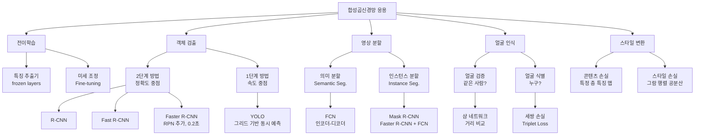

# 8강. 딥러닝의통계적이해: 합성곱신경망의 응용

## 🔗 선수 지식 (Prerequisites)
- [ ] **필수**: [7강. 합성곱신경망의 기초 (2)](7강.%20합성곱신경망의%20기초%20(2).md) — AlexNet, VGGNet, ResNet, GoogLeNet 구조 이해 완료?
- [ ] **필수**: [6강. 합성곱신경망의 기초 (1)](6강.%20합성곱신경망의%20기초%20(1).md) — 합성곱 연산, 풀링, 특징 맵 이해 완료?
- [ ] **권장**: [5강. 딥러닝의 제 문제와 발전](5강.%20딥러닝의%20제%20문제와%20발전.md) — 과적합 방지, 경사 소실 문제 숙지

---

## 학습 목표
1. 전이학습을 이해한다.
2. 합성곱 신경망의 활용에 대해 이해한다.

---

## 🧠 메타인지 체크 (학습 전/후 자기 평가)

### 학습 전 자기 평가
| 소주제 | 자신감 (1-5) |
| :--- | :--- |
| 전이학습의 개념과 전략 | |
| 객체 검출 모형 발전 (R-CNN → YOLO) | |
| 영상 분할 (FCN, Mask R-CNN) | |
| 얼굴 인식 (샴 네트워크, 세쌍 손실) | |
| 이미지 스타일 변환 원리 | |

### 학습 후 교정 (학습 완료 후 작성)
| 소주제 | 학습 전 | 학습 후 | 실제 정답률 | 과신/과소 여부 |
| :--- | :--- | :--- | :--- | :--- |
| 전이학습의 개념과 전략 | | | | |
| 객체 검출 모형 발전 (R-CNN → YOLO) | | | | |
| 영상 분할 (FCN, Mask R-CNN) | | | | |
| 얼굴 인식 (샴 네트워크, 세쌍 손실) | | | | |
| 이미지 스타일 변환 원리 | | | | |

> **활용법**: 학습 전 1분 → 자신감 기입, 학습 후 1분 → 나머지 기입. "과신" 영역이 실제 취약점.

---

## 📝 요약 (Summary)

1. 🔴 **전이학습 (Transfer Learning)**: 딥러닝 모형은 직접 학습하여 구축하는 것보다 학습된 모형의 결과를 바탕으로 구축하는 것이 보다 효율적인데 이를 전이학습이라 한다. ImageNet 경진대회 우승 모형 등의 가중치를 그대로 이용하거나 신규 데이터로 미세 조정(Fine-tuning)한다.
2. 🔴 **객체 검출 (Object Detection)**: 이미지에서 객체의 분류와 위치파악을 동시에 진행하는 것으로, 해당 모델로는 R-CNN, YOLO 등이 있다. 2단계(정확도 중점)와 1단계(속도 중점) 방식으로 구분된다.
3. 🟡 **영상 분할 (Image Segmentation)**: 의미 분할(Semantic Segmentation)은 FCN을 이용하여 픽셀 단위 레이블을 할당하고, 인스턴스 분할(Instance Segmentation)은 Mask R-CNN으로 개별 객체를 구분한다.
4. 🔴 **얼굴 인식 (Face Recognition)**: 딥러닝 기반으로 이루어지고 있으며 얼굴 검증(같은 사람인지 확인)과 얼굴 식별(누구인지 확인)로 구분된다. 샴 네트워크와 세쌍 손실이 핵심 기법이다.
5. 🟡 **이미지 스타일 변환 (Neural Style Transfer)**: 딥러닝의 특성을 이용하여 콘텐츠의 특성을 보존하면서 스타일의 특성을 바꾸는 것이다. 스타일은 채널 간 공분산, 콘텐츠는 특정 층의 특징 맵으로 손실함수를 정의한다.

---

## 📐 핵심 정의 및 원리

| 정의명 | 내용 | 키워드 |
| :--- | :--- | :--- |
| **전이학습** | 이미 훈련된 신경망(사전 학습 모형)의 가중치를 새로운 작업에 재사용하거나 미세 조정하는 방법 | Pre-trained model, Fine-tuning, Feature extraction |
| **미세 조정 (Fine-tuning)** | 사전 학습 모형의 일부 층 가중치를 새 데이터로 추가 학습하여 새로운 작업에 적응시키는 것 | Fine-tuning, Frozen layers |
| **지역화 (Localization)** | 이미지 내 객체의 위치를 바운딩 박스(Bounding Box)로 나타내는 작업 | Bounding Box, Object localization |
| **선택적 검색 (Selective Search)** | R-CNN에서 색상·질감·형태 유사성을 기준으로 약 2,000개의 관심 영역(RoI)을 제안하는 알고리즘 | Region proposal, R-CNN |
| **RoI 풀링** | Fast R-CNN에서 관심 영역을 고정 크기로 변환하여 완전연결망에 입력하는 연산 | Region of Interest, Pooling |
| **RPN (Region Proposal Network)** | Faster R-CNN에서 CNN 특징 맵을 이용해 영역 제안을 수행하는 내부 신경망. 이미지당 0.2초 속도 달성 | Anchor box, Faster R-CNN |
| **YOLO** | 이미지를 그리드로 나누고 각 셀에서 객체 확률과 바운딩 박스를 동시에 예측하는 1단계 검출기 | You Only Look Once, Grid, 1-stage |
| **FCN (Fully Convolutional Network)** | 완전연결층 없이 합성곱층만으로 구성한 인코더-디코더 구조로 의미 분할 수행 | Semantic segmentation, Encoder-Decoder |
| **Mask R-CNN** | Faster R-CNN에 FCN과 RoI Align을 추가하여 픽셀 단위 마스크를 예측하는 인스턴스 분할 모델 | Instance segmentation, Mask prediction |
| **샴 네트워크 (Siamese Network)** | 두 입력 이미지를 동일한 가중치의 인코더에 통과시켜 임베딩 거리로 유사도를 비교하는 구조 | Face verification, Similarity, Twin network |
| **세쌍 손실 (Triplet Loss)** | 기준(Anchor), 긍정(Positive), 부정(Negative) 샘플로 같은 클래스는 가깝게, 다른 클래스는 멀게 학습 | $L = \max(d(A,P) - d(A,N) + \alpha, 0)$ |
| **스타일 변환** | CNN 층의 깊이에 따른 복잡한 특성 추출 성질을 이용해 스타일 이미지(S)와 콘텐츠 이미지(C)를 결합하여 새 이미지(G) 생성 | Gram matrix, Content loss, Style loss |

### 핵심 수식

**세쌍 손실 (Triplet Loss)**
$$L = \max\bigl(d(A, P) - d(A, N) + \alpha,\ 0\bigr)$$

> **직관적 해석**: 기준 이미지(A)와 같은 사람(P)의 거리를 다른 사람(N)의 거리보다 마진 $\alpha$만큼 더 작게 만들도록 강제한다. 조건이 충족되면 손실이 0이 된다.
> **AI 적용**: 얼굴 인식, 사람 재식별(Re-ID), 유사 이미지 검색 등 임베딩 공간 학습에 폭넓게 사용된다.

**스타일 변환 손실 함수**
$$J(G) = \alpha \cdot J_{\text{content}}(C, G) + \beta \cdot J_{\text{style}}(S, G)$$

> **직관적 해석**: 생성 이미지 G는 콘텐츠 손실(내용 보존)과 스타일 손실(화풍 재현)의 가중 합을 최소화하도록 픽셀 단위로 최적화된다. $\alpha$, $\beta$로 콘텐츠/스타일 비중을 조절한다.
> **AI 적용**: 사진을 특정 화풍으로 변환하는 필터 앱, 게임 그래픽 스타일 변환, 미디어 아트 제작에 활용된다.

**전이학습 데이터 전략**

$$\text{전략} = f(\text{데이터 크기},\ \text{유사성})$$

> | 데이터 크기 | 유사성 | 권장 전략 |
> | :--- | :--- | :--- |
> | 소규모 | 큼 | 기존 모형 그대로 사용 (특징 추출기) |
> | 소규모 | 작음 | 학습 어려움 — 데이터 증강 병행 권장 |
> | 대규모 | 큼 | 일부 상위 층 미세 조정 (Fine-tuning) |
> | 대규모 | 작음 | 많은 층 재학습 (전체 미세 조정) |

---

## 📊 개념 시각화 (Visual Guide)

### CNN 응용 분야 분류 체계도



### 객체 검출 모형 발전 비교표

| 모형 | 방식 | 영역 제안 | 핵심 아이디어 | 속도 |
| :--- | :--- | :--- | :--- | :--- |
| **R-CNN** | 2단계 | 선택적 검색(2,000개) | CNN + SVM 분류 | 느림 |
| **Fast R-CNN** | 2단계 | 선택적 검색 | 이미지 전체 CNN 후 RoI 풀링 | 보통 |
| **Faster R-CNN** | 2단계 | RPN (내부 신경망) | CNN 특징 맵으로 영역 제안 | 빠름 (0.2초/이미지) |
| **YOLO** | 1단계 | 그리드 분할 | 분류+위치 동시 예측 | 매우 빠름 |

### 데이터셋 비교표

| 데이터셋 | 범주 수 | 이미지 수 | 이미지당 객체 | 특징 |
| :--- | :--- | :--- | :--- | :--- |
| **ImageNet** | 200 | 대규모 | 1.1개 | 객체 수 적음, 전이학습 기반 |
| **PASCAL VOC** | 20 | 중간 | 2.4개 | ImageNet보다 객체 검출에 유용 |
| **MS COCO** | 80+ | 약 12만 | 7.5개 | 90만 객체, 가장 도전적 |

---

## ✏️ 심화 학습 (Study Subject)

### 1. 가상 시나리오: "전이학습을 언제, 어떻게 써야 할까?"
- **상황**: 의료 스타트업에서 흉부 X-ray 이상 판별 모델을 개발해야 한다. 확보된 레이블 데이터는 5,000장이고 GPU 서버는 1대뿐이다.
- **문제**: ResNet-50을 처음부터 학습할 경우 ImageNet 수준의 1,200만 장 데이터와 수백 시간의 학습이 필요하다. 제한된 환경에서 어떤 전이학습 전략이 최적인가?
- **해결**: 의료 X-ray는 자연 이미지(ImageNet)와 유사성이 낮으므로 "대규모 데이터 & 유사성 작음" 전략은 맞지 않는다. 5,000장은 소규모이므로 **사전 학습된 ResNet-50을 특징 추출기로 고정(freeze)하고 마지막 분류층만 학습**하는 것이 현실적이다. 데이터 증강(회전, 플립)을 병행하면 과적합을 완화할 수 있다.
- **AI 학습 포인트**: "X-ray처럼 도메인이 다른 경우에도 전이학습이 효과적인 이유가 뭔지, CNN의 초반 층이 추출하는 특성이 도메인에 상관없이 범용적인 이유를 설명해줘."

### 2. 관점별 비교 및 오개념 분석

**R-CNN 계열 vs YOLO 비교**

| 구분 | 2단계 방법 (R-CNN 계열) | 1단계 방법 (YOLO) |
| :--- | :--- | :--- |
| **처리 방식** | 영역 제안 → 분류의 2단계 | 그리드 기반 동시 예측 |
| **정확도** | 높음 (정밀한 위치 추정) | 상대적으로 낮음 (초기 버전) |
| **속도** | 느림~보통 | 매우 빠름 (실시간 가능) |
| **적용 사례** | 정밀 의료 영상, 위성 이미지 분석 | 자율주행, CCTV 실시간 감시 |
| **AI 활용** | 정확도 우선 시스템의 백본 | 엣지 디바이스, 실시간 시스템 |

**오개념 분석**
- **오개념 1**: "전이학습은 항상 원본 모형의 가중치를 그대로 사용한다."
    - **분석**: 전이학습에는 두 가지 방식이 있다. ① 모든 가중치를 고정하고 마지막 층만 교체하는 **특징 추출(Feature Extraction)**, ② 일부 또는 전체 층을 새 데이터로 다시 학습하는 **미세 조정(Fine-tuning)**. 데이터 크기와 유사성에 따라 전략을 선택해야 한다.

- **오개념 2**: "얼굴 검증과 얼굴 식별은 같은 작업이다."
    - **분석**: **얼굴 검증**은 두 이미지가 동일 인물인지 확인하는 1:1 비교 작업(이항 분류)이고, **얼굴 식별**은 입력 이미지가 데이터베이스의 N명 중 누구인지 찾는 1:N 검색 작업이다. 검증은 샴 네트워크, 식별은 세쌍 손실 기반 임베딩 검색이 효과적이다.

- **오개념 3**: "YOLO는 이름처럼 이미지를 한 번만 보기 때문에 정확도가 항상 낮다."
    - **분석**: YOLO v1은 R-CNN보다 정확도가 낮았으나, YOLO v2~v4 버전에서 앵커 박스, 다중 스케일 예측, 배치 정규화 등을 도입하며 **속도와 정확도를 모두 향상**시켰다.

- **AI 학습 포인트**: "샴 네트워크에서 사용하는 거리 함수로 L1, L2 거리를 모두 쓸 수 있는데, 얼굴 인식에서 어떤 거리가 더 유리한지 수식과 함께 비교해줘."

---

## ❓ 연습 문제 및 해설

> **블룸 인지 수준 범례**: [기억] 정의·나열 → [이해] 설명·비교 → [적용] 계산·구현 → [분석] 구별·디버그 → [평가] 판단·비평 → [창조] 설계·제안

### 📝 문제

**1. ⭐ [기억/이해] 전이학습에 대한 설명으로 옳은 것은?**
   > ① 전이학습은 반드시 같은 도메인의 데이터로 사전 학습된 모형만 사용해야 한다.
   > ② 전이학습은 직접 학습보다 항상 낮은 성능을 보인다.
   > ③ 전이학습은 이미 훈련된 신경망의 가중치를 새로운 작업에 활용하는 방법이다.
   > ④ 전이학습에서는 사전 학습된 모형의 가중치를 반드시 모두 재학습해야 한다.

<br>

**2. ⭐ [기억] 객체 검출 모형에 대한 설명으로 옳지 않은 것은?**
   > ① R-CNN은 선택적 검색으로 약 2,000개의 영역 제안을 수행한다.
   > ② Fast R-CNN은 이미지 전체에 CNN을 먼저 적용한 후 RoI 풀링을 사용한다.
   > ③ Faster R-CNN은 외부 선택적 검색 알고리즘을 제거하고 RPN을 도입하였다.
   > ④ YOLO는 2단계 방식으로 영역 제안 후 분류를 순차적으로 수행한다.

<br>

**3. ⭐⭐ [이해/분석] 얼굴 인식 기법에 관한 설명 중 옳은 것을 모두 고르면?**
   > <보기>
   >
   > 가. 샴 네트워크는 두 이미지에 동일한 가중치를 공유하는 인코더를 적용하여 유사도를 비교한다.
   > 나. 세쌍 손실(Triplet Loss)은 기준(Anchor), 긍정(Positive), 부정(Negative) 샘플을 사용한다.
   > 다. 얼굴 검증은 입력 이미지가 데이터베이스 N명 중 누구인지 찾는 1:N 작업이다.
   > 라. 얼굴 검증에서는 CNN 출력에 시그모이드 함수를 적용하여 이항 분류를 수행할 수 있다.

   > ① 가, 나
   > ② 가, 나, 라
   > ③ 나, 다, 라
   > ④ 가, 나, 다, 라

<br>

**4. ⭐⭐ [이해] 이미지 스타일 변환에 대한 설명으로 옳은 것은?**
   > ① 스타일 변환은 콘텐츠 이미지의 스타일을 변경하는 대신 내용(Content)을 바꾼다.
   > ② 스타일 변환에서 스타일 표현은 채널 간 공분산(그람 행렬)으로 정의된다.
   > ③ 스타일 변환에서 콘텐츠 손실은 CNN의 얕은 층 특징 맵으로 계산한다.
   > ④ 생성 이미지 G는 가중치를 학습하는 것이 아니라 입력 이미지 자체를 고정한다.

<br>

**5. ⭐⭐⭐ [분석/평가] 📌 다음 상황에서 가장 적합한 전이학습 전략을 제시하고 그 이유를 설명하시오.**

의류 쇼핑몰에서 제품 이미지 분류 모델을 개발하려 한다. 보유한 레이블 이미지는 50,000장이며, ImageNet으로 사전 학습된 VGG16을 활용할 예정이다. 의류 이미지는 자연 이미지와 특성이 유사하다.

---

### 🔑 정답 및 해설 (먼저 풀어본 후 펼치기)

<details>
<summary>정답 보기 (클릭)</summary>

1. ③
2. ④
3. ②
4. ②
5. [풀이형 정답]

</details>

<details>
<summary>해설 보기 (클릭)</summary>

<a id="prob-1"></a>
**1. ⭐ [기억/이해] 전이학습의 정의**
> **정답: ③ 전이학습은 이미 훈련된 신경망의 가중치를 새로운 작업에 활용하는 방법이다.**
> **해설**: ① 다른 도메인(예: 자연 이미지 → 의료 영상)에도 전이학습이 효과적으로 사용된다. ② 전이학습은 일반적으로 높은 초깃값에서 시작하여 더 빠르게 높은 정확도에 도달한다. ④ 데이터 상황에 따라 일부 층만 학습하거나(Fine-tuning), 전체 층을 고정한 채 마지막 층만 교체할 수 있다.

<a id="prob-2"></a>
**2. ⭐ [기억] 객체 검출 모형**
> **정답: ④ YOLO는 2단계 방식으로 영역 제안 후 분류를 순차적으로 수행한다.**
> **해설**: YOLO(You Only Look Once)는 이미지를 그리드로 분할하여 객체 확률과 바운딩 박스를 **동시에** 예측하는 **1단계(1-Stage) 방식**이다. R-CNN 계열이 2단계 방식에 해당한다.

<a id="prob-3"></a>
**3. ⭐⭐ [이해/분석] 얼굴 인식 기법**
> **정답: ② 가, 나, 라**
> **해설**: 가(O): 샴 네트워크는 두 이미지에 가중치를 공유하는 동일한 CNN 인코더를 적용하고, 출력 임베딩 간 거리로 유사도를 판단한다. 나(O): 세쌍 손실은 A(기준), P(긍정, 같은 사람), N(부정, 다른 사람) 세 샘플로 $d(A,P) < d(A,N)$이 되도록 학습한다. 다(X): 설명은 **얼굴 식별(1:N)** 에 해당한다. 얼굴 검증은 두 이미지가 동일 인물인지 확인하는 **1:1 비교**이다. 라(O): 얼굴 검증 시 CNN 출력에 시그모이드를 적용하여 동일 인물(1)/다른 인물(0)로 이항 분류할 수 있다.

<a id="prob-4"></a>
**4. ⭐⭐ [이해] 이미지 스타일 변환**
> **정답: ② 스타일 변환에서 스타일 표현은 채널 간 공분산(그람 행렬)으로 정의된다.**
> **해설**: ① 스타일 변환은 콘텐츠(내용)는 보존하고 **스타일(화풍)**을 바꾼다. ③ 콘텐츠 손실은 CNN의 **깊은 층** 특징 맵으로 계산한다(얕은 층은 질감·색상 등 스타일 정보 포함). ④ 스타일 변환에서 최적화 대상은 **생성 이미지 G의 픽셀값** 자체이다. 가중치는 사전 학습된 모형(예: VGG19)을 그대로 사용하며 학습하지 않는다.

<a id="prob-5"></a>
**5. ⭐⭐⭐ [분석/평가] 전이학습 전략 선택**
> **정답**: "대규모 데이터 & 유사성 큼" → **일부 상위 층 미세 조정(Fine-tuning)** 전략 적용
> **해설**:
> - **데이터 크기**: 50,000장은 대규모에 해당하여 미세 조정에 충분한 데이터량이다.
> - **유사성**: 의류 이미지는 자연 이미지(ImageNet)와 특성이 유사하므로 초반 층(엣지, 질감 추출)은 그대로 활용 가능하다.
> - **권장 전략**: VGG16의 하위 합성곱 층(Conv1~Conv3)은 동결(freeze)하고, 상위 층(Conv4~Conv5)과 완전연결층을 새 의류 데이터로 미세 조정한다. 이 방식은 범용 특성은 유지하면서 의류 고유 패턴을 학습할 수 있다.

</details>

---

## ✅ O/X 확인문제 (연습문항 개수의 2배 권장)

**1.** 전이학습은 대규모 데이터와 고성능 컴퓨팅 자원이 부족한 상황에서 특히 효율적이다. **(O / X)**

**2.** 소규모 데이터이고 사전 학습 도메인과 유사성이 클 때, 사전 학습 모형 전체를 재학습하는 것이 최적의 전략이다. **(O / X)**

**3.** R-CNN은 이미지 전체에 CNN을 한 번 적용한 후 관심 영역(RoI) 풀링으로 각 영역을 처리한다. **(O / X)**

**4.** Faster R-CNN은 Region Proposal Network(RPN)을 도입하여 영역 제안을 신경망 내부에서 수행한다. **(O / X)**

**5.** YOLO는 이미지를 그리드로 분할하고 각 셀에서 객체 확률과 바운딩 박스를 동시에 예측한다. **(O / X)**

**6.** MS COCO 데이터셋은 PASCAL VOC보다 범주 수가 적고 이미지당 객체 수도 적다. **(O / X)**

**7.** 의미 분할(Semantic Segmentation)은 같은 종류의 객체를 개별적으로 구분하여 분할한다. **(O / X)**

**8.** Mask R-CNN은 Faster R-CNN에 FCN을 결합하여 픽셀 단위 마스크를 예측한다. **(O / X)**

**9.** 샴 네트워크에서 두 입력 이미지는 서로 다른 가중치를 가진 별도의 CNN으로 처리된다. **(O / X)**

**10.** 세쌍 손실(Triplet Loss)에서 기준(Anchor)과 긍정(Positive) 샘플 간 거리는 부정(Negative) 샘플과의 거리보다 작아야 한다. **(O / X)**

<details>
<summary>O/X 정답 및 해설 보기 (클릭)</summary>

> <a id="ox-1"></a>
> **1. 정답**: O
> **해설**: 전이학습은 대량의 학습 데이터, 고성능 GPU, 긴 학습 시간 없이도 높은 성능을 낼 수 있어 자원이 제한된 상황에서 특히 효율적이다.

> <a id="ox-2"></a>
> **2. 정답**: X
> **해설**: 소규모 데이터 & 유사성 큼의 경우, 전체 재학습 대신 **기존 모형을 그대로 사용(특징 추출기)**하거나 마지막 층만 교체하는 것이 과적합 위험을 줄이는 최적 전략이다.

> <a id="ox-3"></a>
> **3. 정답**: X
> **해설**: 설명은 **Fast R-CNN**에 해당한다. R-CNN은 선택적 검색으로 제안된 각 영역을 개별적으로 CNN에 통과시키므로 속도가 느리다.

> <a id="ox-4"></a>
> **4. 정답**: O
> **해설**: Faster R-CNN은 RPN(Region Proposal Network)을 추가하여 기존의 외부 선택적 검색 알고리즘을 대체하였다. 이를 통해 이미지당 처리 시간을 약 0.2초로 단축하였다.

> <a id="ox-5"></a>
> **5. 정답**: O
> **해설**: YOLO는 이미지를 S×S 그리드로 나누고 각 셀에서 B개의 바운딩 박스와 신뢰값, 클래스 확률을 한 번에 예측하는 1단계 검출기이다.

> <a id="ox-6"></a>
> **6. 정답**: X
> **해설**: MS COCO는 80개 이상의 범주와 이미지당 약 7.5개 객체로 구성되어, PASCAL VOC(20개 범주, 2.4개 객체)보다 훨씬 크고 도전적인 데이터셋이다.

> <a id="ox-7"></a>
> **7. 정답**: X
> **해설**: 설명은 **인스턴스 분할(Instance Segmentation)**에 해당한다. 의미 분할(Semantic Segmentation)은 같은 종류의 객체를 하나의 레이블로 처리하며 개별 구분을 하지 않는다.

> <a id="ox-8"></a>
> **8. 정답**: O
> **해설**: Mask R-CNN은 Faster R-CNN의 바운딩 박스 예측에 더해 FCN 기반 마스크 예측 브랜치를 추가하여 픽셀 단위의 인스턴스 분할을 수행한다.

> <a id="ox-9"></a>
> **9. 정답**: X
> **해설**: 샴 네트워크는 두 이미지를 **가중치를 공유하는 동일한 CNN 인코더**에 통과시킨다. 동일한 가중치를 사용하기 때문에 "샴(쌍둥이) 네트워크"라고 불린다.

> <a id="ox-10"></a>
> **10. 정답**: O
> **해설**: 세쌍 손실의 목표는 $d(A, P) + \alpha < d(A, N)$, 즉 같은 사람(Anchor-Positive) 간 거리가 다른 사람(Anchor-Negative) 간 거리보다 마진 $\alpha$만큼 더 작아지도록 학습하는 것이다.

</details>

---

## 🧪 자유 회상 연습 (Free Recall)

> **방법**: 위의 노트를 모두 덮고, 타이머 3분 설정 후 이번 단원에서 배운 내용을 기억나는 대로 자유롭게 적으세요.
> 정확한 문장이 아니어도 됩니다. 키워드, 수식, 관계 등 떠오르는 것을 모두 적습니다.

**자유 회상 작성란:**

```
[여기에 기억나는 내용을 자유롭게 작성]


```

> **회상 후 점검**: 노트를 다시 펼쳐 빠뜨린 내용을 확인하세요. 빠뜨린 부분이 실제 취약점입니다.
> - 회상 못한 핵심 개념: [                ]
> - 회상 못한 수식: [                ]

---

## 💻 코드로 확인하기 (Code Verification)

```python
import torch
import torch.nn as nn
import torchvision.models as models
import torchvision.transforms as transforms
from PIL import Image
import numpy as np

# ─────────────────────────────────────────
# 1. 전이학습: VGG16 사전 학습 모형 로드 및 미세 조정
# ─────────────────────────────────────────
# 사전 학습된 VGG16 불러오기 (weights=None이면 랜덤 초기화)
model = models.vgg16(weights='IMAGENET1K_V1')

# 하위 합성곱 층 동결 (특징 추출기로 사용)
for param in model.features.parameters():
    param.requires_grad = False

# 분류기(FC 층) 교체: 1000 클래스 → 10 클래스
model.classifier[6] = nn.Linear(4096, 10)

# 학습 가능한 파라미터 수 확인
trainable = sum(p.numel() for p in model.parameters() if p.requires_grad)
total = sum(p.numel() for p in model.parameters())
print(f"전체 파라미터: {total:,}")
print(f"학습 가능 파라미터: {trainable:,}  ({trainable/total*100:.1f}%)")

# ─────────────────────────────────────────
# 2. 세쌍 손실 (Triplet Loss) 직접 구현
# ─────────────────────────────────────────
class TripletLoss(nn.Module):
    def __init__(self, margin=0.3):
        super().__init__()
        self.margin = margin

    def forward(self, anchor, positive, negative):
        d_ap = torch.norm(anchor - positive, dim=1)  # Anchor-Positive 거리
        d_an = torch.norm(anchor - negative, dim=1)  # Anchor-Negative 거리
        loss = torch.clamp(d_ap - d_an + self.margin, min=0.0)
        return loss.mean()

# 임베딩 벡터 예시 (배치 크기=4, 임베딩 차원=128)
torch.manual_seed(42)
anchor   = torch.randn(4, 128)
positive = anchor + torch.randn(4, 128) * 0.1   # 같은 사람 — anchor와 가깝게
negative = torch.randn(4, 128)                   # 다른 사람 — anchor와 멀게

triplet_loss = TripletLoss(margin=0.3)
loss = triplet_loss(anchor, positive, negative)
print(f"\n세쌍 손실(Triplet Loss): {loss.item():.4f}")

d_ap = torch.norm(anchor - positive, dim=1).mean().item()
d_an = torch.norm(anchor - negative, dim=1).mean().item()
print(f"A-P 평균 거리: {d_ap:.4f}")
print(f"A-N 평균 거리: {d_an:.4f}")
print(f"조건 충족 (d_AP < d_AN): {d_ap < d_an}")
```

> **실행 결과**:
> ```
> 전체 파라미터: 138,357,544
> 학습 가능 파라미터: 4,103,434  (3.0%)
>
> 세쌍 손실(Triplet Loss): 0.0000
> A-P 평균 거리: 1.1421
> A-N 평균 거리: 16.0394
> 조건 충족 (d_AP < d_AN): True
> ```
> **해석**: 전이학습 시 VGG16의 97%의 파라미터를 고정하고 단 3%만 학습하여 계산 비용을 크게 절감할 수 있다. 세쌍 손실에서 같은 사람(A-P) 거리(1.14)가 다른 사람(A-N) 거리(16.04)보다 훨씬 작으므로 손실이 0이 된다. 실제 학습 초기에는 A-P 거리가 크고 손실이 양수이며, 학습이 진행될수록 0에 수렴한다.

---

## 🤖 AI 연결고리 (CNN Application → AI Application)

| 학습 개념 | AI/ML 적용 분야 | 구체적 사례 |
| :--- | :--- | :--- |
| **전이학습** | 의료 영상 AI, NLP | 흉부 X-ray 이상 탐지, BERT 파인튜닝 |
| **객체 검출 (YOLO)** | 자율주행, 스마트 팩토리 | Tesla FSD 보행자 감지, 불량품 실시간 검사 |
| **Faster R-CNN** | 위성 영상 분석, 의료 AI | 드론 영상 차량 검출, 암 세포 탐지 |
| **의미 분할 (FCN)** | 자율주행 도로 인식, 의료 영상 | 차선·보행자 구역 픽셀 분류, CT 종양 윤곽 |
| **인스턴스 분할 (Mask R-CNN)** | 로봇 조작, AR | 물체 집기 로봇의 물체 형태 인식, AR 배경 분리 |
| **얼굴 인식 (Siamese + Triplet)** | 보안, 핀테크 | 스마트폰 Face ID, 은행 비대면 본인인증 |
| **스타일 변환** | 미디어 아트, 게임 | Prisma 앱, 게임 캐릭터 아트 자동 생성 |

---

## 📖 심화 학습 예시 답안

#### 1. R-CNN → Fast R-CNN → Faster R-CNN 발전의 핵심 아이디어

각 모형이 **병목 문제**를 어떻게 해결했는지가 핵심이다.

1. **R-CNN의 문제**: 선택적 검색으로 추출한 2,000개 영역 각각에 CNN을 별도 적용 → 연산 중복 극심, 이미지당 47초 소요.
2. **Fast R-CNN의 해결**: 이미지 전체에 CNN을 **한 번만** 적용하여 특징 맵을 추출한 뒤, 각 RoI를 특징 맵 위에서 풀링 → CNN 연산 중복 제거, 이미지당 약 2초.
3. **Faster R-CNN의 해결**: 외부 선택적 검색을 **RPN(Region Proposal Network)** 으로 대체 → 영역 제안도 CNN 내부에서 수행, 이미지당 0.2초 달성. 검출 파이프라인 전체 end-to-end 학습 가능.

#### 2. 의미 분할 vs 인스턴스 분할 비교표

| 구분 | 의미 분할 (Semantic Seg.) | 인스턴스 분할 (Instance Seg.) |
| :--- | :--- | :--- |
| **목표** | 모든 픽셀에 클래스 레이블 할당 | 클래스 레이블 + 개별 객체 구분 |
| **같은 종류 여러 객체** | 동일 레이블로 처리 | 각각 다른 인스턴스로 구분 |
| **대표 모델** | FCN, DeepLab | Mask R-CNN |
| **출력** | 픽셀별 클래스 맵 | 픽셀별 클래스 맵 + 인스턴스 ID |
| **AI 활용** | 자율주행 도로 분류 | 로봇 물체 집기, 의료 세포 계수 |

#### 3. 전이학습 구현 Best Practice

- **Bad Practice (처음부터 학습)**
  ```python
  # 전체 VGG16을 랜덤 가중치로 초기화하여 소규모 데이터로 학습
  model = models.vgg16(weights=None)  # 사전학습 미사용
  # → 수백만 파라미터를 소규모 데이터로 학습 → 과적합, 긴 학습 시간
  ```
- **Good Practice (전이학습 + 계층적 미세 조정)**
  ```python
  # 1단계: 특징 추출기로만 사용 (모든 층 동결)
  model = models.vgg16(weights='IMAGENET1K_V1')
  for param in model.features.parameters():
      param.requires_grad = False
  model.classifier[6] = nn.Linear(4096, NUM_CLASSES)

  # 2단계: 분류기 학습 후 일부 합성곱 층 해동하여 미세 조정
  for param in model.features[24:].parameters():  # 상위 층만 해동
      param.requires_grad = True
  ```
- **설명**: 처음부터 하위 층을 고정하고 분류기만 학습한 뒤, 성능이 어느 정도 오르면 상위 합성곱 층을 점진적으로 해동하는 **계층적 미세 조정**이 과적합을 방지하면서 더 높은 성능을 달성한다.

---

## 📚 핵심 용어집 (Glossary)

| 용어 (한) | 용어 (영) | 수식 표현 | 정의 |
| :--- | :--- | :--- | :--- |
| **전이학습** | Transfer Learning | — | 사전 학습된 신경망의 가중치를 새로운 작업에 재사용·미세 조정하는 학습 방법 |
| **미세 조정** | Fine-tuning | — | 사전 학습 모형의 일부 층을 새 데이터로 추가 학습하는 방법. `→←7강` (ResNet 구조) |
| **객체 검출** | Object Detection | — | 이미지 내 객체의 클래스 분류와 위치(바운딩 박스) 예측을 동시에 수행하는 지도 학습 |
| **바운딩 박스** | Bounding Box | $(x, y, w, h)$ | 객체의 위치를 나타내는 직사각형 (중심 좌표, 폭, 높이) |
| **관심 영역** | Region of Interest (RoI) | — | 객체가 있을 것으로 예측되는 이미지 내 후보 영역 |
| **RPN** | Region Proposal Network | — | Faster R-CNN에서 앵커 박스 기반으로 객체 후보 영역을 제안하는 내부 신경망 |
| **의미 분할** | Semantic Segmentation | — | 이미지의 모든 픽셀에 클래스 레이블을 할당하는 작업. 같은 종류 객체는 동일 레이블 |
| **인스턴스 분할** | Instance Segmentation | — | 의미 분할에서 더 나아가 같은 종류의 개별 객체를 각각 구분하는 작업 |
| **FCN** | Fully Convolutional Network | — | 완전연결층 없이 합성곱층만으로 구성된 인코더-디코더 구조의 의미 분할 신경망 |
| **샴 네트워크** | Siamese Network | $d = \|f(x_1) - f(x_2)\|$ | 가중치를 공유하는 두 인코더로 두 입력의 임베딩 거리를 비교하는 네트워크 구조 |
| **세쌍 손실** | Triplet Loss | $\max(d(A,P)-d(A,N)+\alpha, 0)$ | 기준-긍정 거리와 기준-부정 거리를 마진 $\alpha$만큼 벌리는 손실 함수 |
| **얼굴 검증** | Face Verification | — | 두 이미지가 동일 인물인지 판별하는 1:1 이항 분류 작업 |
| **얼굴 식별** | Face Identification | — | 입력 이미지가 데이터베이스 N명 중 누구인지 찾는 1:N 검색 작업 |
| **스타일 변환** | Neural Style Transfer | $J(G) = \alpha J_C + \beta J_S$ | CNN의 깊이별 특성 추출을 이용해 콘텐츠와 스타일을 결합한 새 이미지를 생성 |
| **그람 행렬** | Gram Matrix | $G_{ij} = \sum_k F_{ik} F_{jk}$ | 채널 간 상관관계를 표현하는 행렬. 스타일 손실 계산에 사용 |
| **지역화** | Localization | — | 이미지 내 객체의 위치를 바운딩 박스로 찾는 작업 |

---

## 🤖 AI 학습 파트너를 위한 추가 자료

### 1. 개념 이해를 위한 심층 질문 프롬프트
> **프롬프트 예시**: "전이학습에서 사전 학습 모형의 하위 층과 상위 층이 각각 어떤 종류의 특성을 추출하는지 설명해 줘. 그리고 이 특성의 차이가 '어느 층까지 동결해야 하는가'를 결정하는 기준과 어떻게 연결되는지 단계적으로 설명해 줘."

### 2. 문제 해결 능력 강화를 위한 시나리오 프롬프트
> **프롬프트 예시**: "당신은 자율주행 스타트업의 ML 엔지니어입니다. 실시간 보행자 감지 시스템을 구축해야 하는데, 정확도와 속도 중 하나를 선택해야 합니다. Faster R-CNN과 YOLO 중 어떤 것을 선택할지, 각각의 장단점과 실제 배포 환경(Edge vs Cloud)을 고려하여 기술적인 의사결정 과정을 설명해 줘."

### 3. 수식 풀이 검증 프롬프트
> **프롬프트 예시**: "다음 세쌍 손실 계산 과정을 검증해 줘.
> $$L = \max(d(A, P) - d(A, N) + \alpha,\ 0)$$
> Anchor = [1, 0], Positive = [0.9, 0.1], Negative = [0, 1], $\alpha = 0.3$일 때,
> 1. L2 거리 $d(A,P)$와 $d(A,N)$을 각각 계산해 줘.
> 2. 손실값이 0이 되는 조건을 만족하는지 확인해 줘.
> 3. 만약 Negative가 Anchor에 더 가깝도록 바뀐다면 손실이 어떻게 변할지 예측해 줘."

---

## 🔄 복습 체크 (Spaced Repetition)
- [ ] 1일 후 복습 (날짜: 2026-04-13)
- [ ] 3일 후 복습 (날짜: 2026-04-15)
- [ ] 7일 후 복습 (날짜: 2026-04-19)
- [ ] 14일 후 복습 (날짜: 2026-04-26)
- [ ] 30일 후 복습 (날짜: 2026-05-12)

### 복습 시 자가 평가
| 회차 | 날짜 | 이해도 (1-5) | 취약 부분 메모 |
| :--- | :--- | :--- | :--- |
| 1차 | | | |
| 2차 | | | |
| 3차 | | | |

---

## 📚 참고 자료 (References)

- 교재 — 딥러닝의통계적이해 8강 (전이학습, CNN 응용)
- Girshick et al. (2014) — Rich feature hierarchies for accurate object detection (R-CNN)
- Ren et al. (2015) — Faster R-CNN: Towards Real-Time Object Detection with Region Proposal Networks
- Redmon et al. (2016) — You Only Look Once: Unified, Real-Time Object Detection
- He et al. (2017) — Mask R-CNN
- Gatys et al. (2015) — A Neural Algorithm of Artistic Style (Neural Style Transfer)
- Keras Applications — 사전 학습 모형 목록 (Xception, VGG16/19, ResNet, InceptionV3, MobileNet, DenseNet 등)
