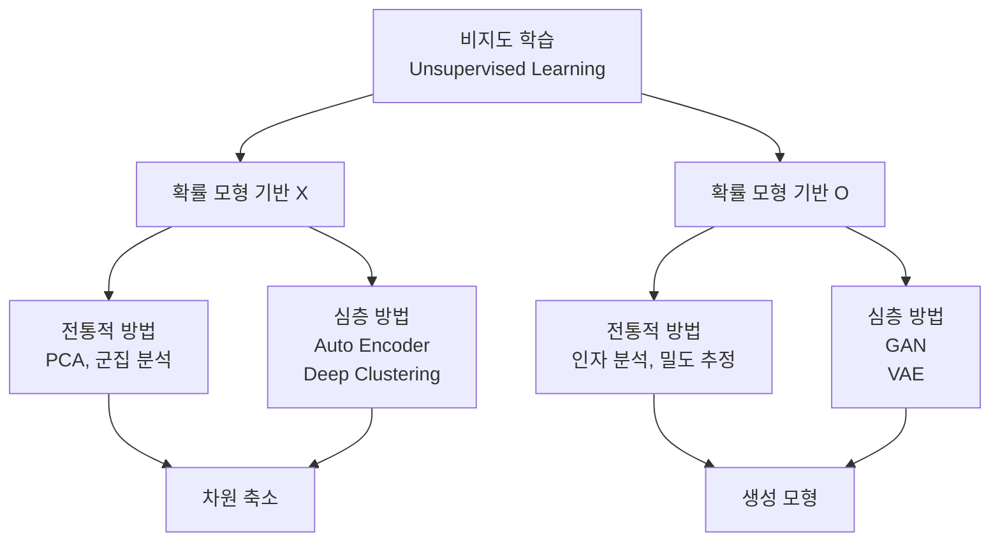
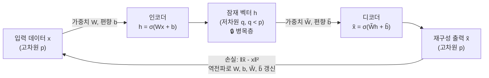

# 9강. 딥러닝의통계적이해: 오토인코더와 GAN (1)

## 🔗 선수 지식 (Prerequisites)
- [ ] **필수**: [3강. 딥러닝 모형의 구조와 학습 (1)](3강.%20딥러닝%20모형의%20구조와%20학습%20(1).md) — 신경망 구조, 역전파 알고리즘 이해 완료?
- [ ] **필수**: [4강. 딥러닝 모형의 구조와 학습 (2)](4강.%20딥러닝%20모형의%20구조와%20학습%20(2).md) — 손실 함수, 경험 위험 최소화(ERM) 숙지?
- [ ] **권장**: [2강. 딥러닝과 통계학](2강.%20딥러닝과%20통계학.md) — 확률 모형 기반 vs 비기반 방법론 구분

---

## 학습 목표
1. 비지도 학습이 무엇인지 이해한다.
2. 주성분 분석 방법론을 이해한다.
3. 오토 인코더 방법론을 이해한다.

---

## 🧠 메타인지 체크 (학습 전/후 자기 평가)

### 학습 전 자기 평가
| 소주제 | 자신감 (1-5) |
| :--- | :--- |
| 비지도 학습의 정의 및 분류 | |
| PCA의 원리 (분산 최대화, 직교 주성분) | |
| PCA의 ERM 관점 해석 | |
| 오토 인코더 구조 (인코더/디코더) | |
| Stacked Auto Encoder (SAE) | |

### 학습 후 교정 (학습 완료 후 작성)
| 소주제 | 학습 전 | 학습 후 | 실제 정답률 | 과신/과소 여부 |
| :--- | :--- | :--- | :--- | :--- |
| 비지도 학습의 정의 및 분류 | | | | |
| PCA의 원리 (분산 최대화, 직교 주성분) | | | | |
| PCA의 ERM 관점 해석 | | | | |
| 오토 인코더 구조 (인코더/디코더) | | | | |
| Stacked Auto Encoder (SAE) | | | | |

> **활용법**: 학습 전 1분 → 자신감 기입, 학습 후 1분 → 나머지 기입. "과신" 영역이 실제 취약점.

---

## 📝 요약 (Summary)

1. 🔴 **비지도 학습 (Unsupervised Learning)**: 데이터의 특징을 추출하는 방법론을 총칭하며, 확률 모형 기반 여부에 따라 분류된다. 차원 축소, 밀도 추정, 군집 분석, 독립성 분석 등이 주요 분야다.
2. 🔴 **주성분 분석 (PCA)**: 데이터의 분산을 최대한 보존하면서 서로 직교하는 주성분을 찾는 대표적 차원 축소 기법이다. 제$k$주성분은 표본 공분산 행렬 $S$의 $k$번째로 큰 고유값에 대응하는 고유벡터다.
3. 🟡 **PCA의 ERM 관점**: 주성분 분석은 기존 변수와 차원 축소된 변수 간의 정보 손실(제곱 손실 함수의 합)을 최소화하는 관점으로도 해석할 수 있다.
4. 🔴 **오토 인코더 (Auto Encoder)**: 입력값을 출력값으로 근사하도록 학습하는 비지도 신경망 모형이다. 인코더로 핵심 특징을 $q$차원 잠재 벡터 $h$로 압축하고, 디코더로 원본 데이터를 재구성한다. 역전파 알고리즘으로 모수를 추정한다.
5. 🟢 **Stacked Auto Encoder (SAE)**: 여러 개의 중간층을 가지는 심층 오토 인코더로, 역전파를 통해 모든 층의 모수를 동시에 학습한다.

---

## 📐 핵심 수식 및 정의

| 수식명 | 수식 | 의미 |
| :--- | :--- | :--- |
| **PCA 제1주성분 목적함수** | $v_1 = \underset{a}{\text{argmax}}\ a^T S a - \rho(a^T a - 1)$ | 크기 제약 $a^T a = 1$ 하에서 분산 $\text{Var}(Xa)$를 최대화하는 기저 탐색 (라그랑지안) |
| **인코더 (Encoder)** | $h = \sigma(Wx + b)$ | 입력 $x$를 가중치 $W$, 편향 $b$로 선형 변환 후 활성화 함수 $\sigma$를 적용하여 잠재 벡터 $h$ 생성 |
| **디코더 (Decoder)** | $\tilde{x} = \sigma(\tilde{W}h(x) + \tilde{b})$ | 잠재 벡터 $h$를 이용해 원본 데이터 $\tilde{x}$를 재구성 |
| **오토 인코더 손실 함수** | $l(\theta) = \sum_{i=1}^{n} \|\tilde{x}_i - x_i\|_2^2$ | 재구성 오차(입력-출력 제곱합)를 최소화하는 방향으로 모수 $\theta$ 추정 |

### 주요 정리 — PCA와 고유벡터

**제k주성분**

$$\text{PC}_k = \text{표본 공분산 행렬 } S \text{의 } k\text{번째로 큰 고유값에 대응하는 고유벡터}$$

> **직관적 해석**: 데이터가 가장 많이 퍼진 방향(분산이 최대인 방향)이 제1주성분이며, 이에 직교하는 방향 중 분산이 최대인 것이 제2주성분이다. 고유벡터는 그 방향을, 고유값은 해당 방향의 분산량을 나타낸다.
> **AI 적용**: 고차원 이미지·텍스트 임베딩 데이터의 전처리, 노이즈 제거, 시각화(2D/3D 투영) 등에 광범위하게 사용된다.

**ERM 관점의 PCA 손실 함수**

$$\hat{L} = \sum_{i=1}^{n} \|x_i - \hat{x}_i\|_2^2 \quad (\hat{x}_i \text{: 주성분 공간으로의 사영})$$

> **직관적 해석**: PCA는 분산 최대화와 동치로, 원본 데이터 $x_i$와 주성분 공간 사영 $\hat{x}_i$ 사이의 재구성 오차 합을 최소화하는 문제이기도 하다.
> **AI 적용**: 오토 인코더의 손실 함수와 형태가 동일하여, 선형 오토 인코더는 PCA와 동일한 해를 가진다는 것이 이론적으로 증명되어 있다. `→←3강`

---

## 📊 개념 시각화 (Visual Guide)

### 비지도 학습 분류 체계도



### 오토 인코더 구조 흐름도



### PCA vs 오토 인코더 핵심 비교

| 구분 | PCA | 오토 인코더 |
| :--- | :--- | :--- |
| **모형 유형** | 선형 변환 | 비선형 변환 (활성화 함수) |
| **학습 방법** | 고유값 분해 (해석적 풀이) | 역전파 알고리즘 (수치 최적화) |
| **표현력** | 선형 구조만 포착 | 복잡한 비선형 구조 포착 가능 |
| **확률 모형** | 기반 X | 기반 X (VAE는 기반 O) |
| **관계** | 선형 오토 인코더의 해 = PCA의 해 | PCA의 비선형 일반화 |

---

## ✏️ 심화 학습 (Study Subject)

### 1. 가상 시나리오: "PCA vs 오토 인코더, 언제 무엇을 선택할까?"

- **상황**: 손으로 쓴 숫자 이미지(MNIST, 28×28 = 784차원)를 2차원으로 압축하여 시각화하려 한다.
- **문제**: 선형 변환인 PCA만으로 784→2 압축이 충분한가? 숫자들이 비선형 다양체(manifold) 위에 놓여 있다면 어떻게 해야 하는가?
- **해결**:
  1. PCA 적용: 표본 공분산 행렬 $S$의 상위 2개 고유벡터 방향으로 사영 → 선형 구조만 보존되어 숫자 간 겹침 발생.
  2. 오토 인코더 적용: 인코더 $h = \sigma(Wx + b)$ (비선형)로 2차원 잠재 공간 학습 → 비선형 구조 포착으로 숫자 군집이 더 명확히 분리됨.
  3. 손실 비교: $l_{\text{PCA}} \geq l_{\text{AE}}$ (비선형 모형이 표현력이 더 높으므로).
- **AI 학습 포인트**: "선형 오토 인코더의 해가 PCA와 동일하다는 것을 수식으로 증명해줘. 활성화 함수를 추가하면 해가 달라지는 이유는 무엇인가?"

### 2. 관점별 비교 및 오개념 분석

- **핵심 비교**: **PCA vs 오토 인코더** (위 비교표 참조), **비지도 학습 vs 지도 학습**

| 구분 | 지도 학습 | 비지도 학습 |
| :--- | :--- | :--- |
| **레이블** | 필요 (입력-출력 쌍) | 불필요 (입력만) |
| **목표** | 예측/분류 | 특징 추출/군집 |
| **손실 계산** | 예측값 vs 실제 레이블 | 재구성값 vs 원본 입력 |
| **대표 방법** | 회귀, 분류 신경망 | PCA, 오토 인코더, GAN |

- **오개념 분석**:
    - **오개념 1**: "오토 인코더의 출력은 입력과 완전히 동일해야 한다."
    - **분석**: 병목층(Bottleneck)에서 $q < p$로 차원을 강제로 압축하므로, 핵심 정보만 잠재 벡터 $h$에 저장되고 나머지는 손실된다. 따라서 $\tilde{x} \approx x$이지 $\tilde{x} = x$가 아니다. 만약 $q = p$이고 활성화 함수가 항등 함수라면 완벽 복사가 가능하지만, 이 경우 아무것도 학습하지 못한다.
    - **오개념 2**: "PCA의 주성분 수를 늘릴수록 항상 좋다."
    - **분석**: 주성분 수 $q$가 원래 차원 $p$에 가까워질수록 재구성 오차는 줄지만, 차원 축소의 의미(잡음 제거, 핵심 특성 추출)가 사라진다. 적절한 $q$는 누적 분산 설명 비율(예: 95%)을 기준으로 선택한다.
- **AI 학습 포인트**: "오토 인코더에서 병목층 차원 $q$를 너무 크게 설정하면 어떤 문제가 생기는지 설명하고, 적절한 $q$ 선택 방법을 알려줘."

---

## ❓ 연습 문제 및 해설

> **블룸 인지 수준 범례**: [기억] 정의·나열 → [이해] 설명·비교 → [적용] 계산·구현 → [분석] 구별·디버그 → [평가] 판단·비평 → [창조] 설계·제안

### 📝 문제

**1. ⭐ [기억] 비지도 학습의 분류에 관한 설명으로 옳은 것은?[#prob-1](#prob-1)**
   > ① PCA(주성분 분석)는 확률 모형에 기반하는 비지도 학습 방법이다.
   > ② VAE(Variational Auto Encoder)는 확률 모형에 기반하지 않는 심층 비지도 학습 방법이다.
   > ③ GAN(Generative Adversarial Network)은 확률 모형에 기반하는 심층 비지도 학습 방법이다.
   > ④ 오토 인코더(Auto Encoder)는 확률 모형에 기반하는 심층 비지도 학습 방법이다.

<br>

**2. ⭐ [기억] 주성분 분석(PCA)에서 제1주성분 벡터 $v_1$은 무엇인가?[#prob-2](#prob-2)**
   > ① 표본 공분산 행렬 $S$의 가장 작은 고유값에 대응하는 고유벡터
   > ② 표본 공분산 행렬 $S$의 가장 큰 고유값에 대응하는 고유벡터
   > ③ 표본 평균 벡터와 동일한 방향의 단위 벡터
   > ④ 데이터 행렬 $X$의 첫 번째 열 벡터

<br>

**3. ⭐⭐ [이해] 오토 인코더에 관한 설명으로 옳지 않은 것을 고르시오.[#prob-3](#prob-3)**
   > ① 인코더는 고차원 입력 데이터를 저차원 잠재 벡터로 변환한다.
   > ② 디코더는 잠재 벡터를 이용하여 원본 데이터를 근사적으로 재구성한다.
   > ③ 병목 현상으로 인해 출력값은 입력값의 완벽한 복사본이 된다.
   > ④ 역전파 알고리즘을 통해 인코더와 디코더의 모수를 동시에 추정한다.

<br>

**4. ⭐⭐ [적용] PCA의 경험 위험 최소화(ERM) 관점에 관한 설명으로 옳은 것을 <보기>에서 모두 고르면?[#prob-4](#prob-4)**
   > <보기>
   >
   > 가. PCA를 통해 얻은 사영 벡터는 원본 데이터와 차원 축소된 데이터 간 제곱 손실의 합을 최소화한다.
   > 나. PCA의 ERM 관점 손실 함수는 오토 인코더의 손실 함수와 형태가 동일하다.
   > 다. PCA는 분산을 최대화하는 관점과 정보 손실을 최소화하는 관점이 동치 관계이다.

   > ① 가
   > ② 가, 나
   > ③ 가, 다
   > ④ 가, 나, 다

<br>

**5. ⭐⭐⭐ [분석] 다음 오토 인코더 구조에서 인코더 함수와 디코더 함수, 그리고 최소화해야 할 손실 함수를 수식으로 쓰고, 이 손실 함수의 최솟값을 구하기 위해 사용하는 최적화 알고리즘을 설명하시오. 📌[#prob-5](#prob-5)**

---

### 🔑 정답 및 해설 (먼저 풀어본 후 펼치기)

<details>
<summary>정답 보기 (클릭)</summary>

1. ③
2. ②
3. ③
4. ④
5. [풀이형 정답]

</details>

<details>
<summary>해설 보기 (클릭)</summary>

<a id="prob-1"></a>
**1. ⭐ [기억] 비지도 학습의 분류**
> **정답: ③ GAN은 확률 모형에 기반하는 심층 비지도 학습 방법이다.**
> **해설**: ① PCA는 확률 모형에 기반하지 **않는** 방법이다. ② VAE는 확률 모형에 기반하는 심층 방법이다. ④ 오토 인코더는 확률 모형에 기반하지 **않는** 심층 방법이다. GAN과 VAE는 확률 모형 기반의 대표적인 심층 비지도 학습 방법이다.

<a id="prob-2"></a>
**2. ⭐ [기억] PCA 제1주성분**
> **정답: ② 표본 공분산 행렬 $S$의 가장 큰 고유값에 대응하는 고유벡터**
> **해설**: 제1주성분은 $\text{Var}(Xa)$를 최대화하는 방향이다. 라그랑지안 $a^T S a - \rho(a^T a - 1)$을 $a$에 대해 미분하면 $Sa = \rho a$, 즉 $a$는 $S$의 고유벡터이고 $\rho$는 고유값이 된다. 분산 $a^T S a = \rho$를 최대화하려면 가장 큰 고유값 $\rho_1$에 대응하는 고유벡터를 선택해야 한다.

<a id="prob-3"></a>
**3. ⭐⭐ [이해] 오토 인코더의 특성**
> **정답: ③ 병목 현상으로 인해 출력값은 입력값의 완벽한 복사본이 된다.**
> **해설**: 오답이다. 병목층(Bottleneck)에서 차원이 $p \to q$ ($q < p$)로 강제 압축되므로, 핵심 정보만 잠재 벡터 $h$에 보존되고 나머지는 손실된다. 따라서 출력 $\tilde{x}$는 입력 $x$의 **근사치**이지 완벽한 복사본이 아니다. ①②④는 모두 옳은 설명이다.

<a id="prob-4"></a>
**4. ⭐⭐ [적용] PCA의 ERM 관점**
> **정답: ④ 가, 나, 다**
> **해설**: 가 — PCA 사영 벡터는 $\sum_i \|x_i - \hat{x}_i\|_2^2$를 최소화한다 (참). 나 — 오토 인코더의 손실 함수 $l(\theta) = \sum_i \|\tilde{x}_i - x_i\|_2^2$와 형태가 동일하다 (참). 선형 오토 인코더의 해는 PCA의 해와 일치한다. 다 — 분산 최대화와 재구성 오차 최소화는 수학적으로 동치임이 증명되어 있다 (참).

<a id="prob-5"></a>
**5. ⭐⭐⭐ [분석] 오토 인코더 수식 정리**
> **인코더**: $h = \sigma(Wx + b)$ — 입력 $x \in \mathbb{R}^p$를 잠재 벡터 $h \in \mathbb{R}^q$ ($q < p$)로 변환
>
> **디코더**: $\tilde{x} = \sigma(\tilde{W}h + \tilde{b})$ — 잠재 벡터 $h$를 재구성 출력 $\tilde{x} \in \mathbb{R}^p$로 복원
>
> **손실 함수**: $l(\theta) = \sum_{i=1}^{n} \|\tilde{x}_i - x_i\|_2^2$, 여기서 $\theta = \{W, b, \tilde{W}, \tilde{b}\}$
>
> **최적화 알고리즘**: 역전파(Backpropagation) + 경사하강법(SGD/Adam). 손실 $l(\theta)$를 각 모수에 대해 편미분하여 기울기를 계산하고, 학습률 $\eta$만큼 모수를 반복 갱신한다: $\theta \leftarrow \theta - \eta \nabla_\theta l(\theta)$.

</details>

---

## ✅ O/X 확인문제 (연습문항 개수의 2배 권장)

**1.** [비지도 학습은 레이블이 있는 데이터를 사용하여 예측 모형을 학습하는 방법이다.](#ox-1) **(O / X)**

**2.** [PCA는 확률 모형에 기반하지 않는 비지도 학습 방법이다.](#ox-2) **(O / X)**

**3.** [PCA의 제2주성분은 제1주성분과 직교한다.](#ox-3) **(O / X)**

**4.** [PCA의 제k주성분은 표본 공분산 행렬의 k번째로 큰 고유값에 대응하는 고유벡터이다.](#ox-4) **(O / X)**

**5.** [PCA는 분산 최대화와 재구성 오차 최소화가 동치 관계임을 경험 위험 최소화 관점에서 이해할 수 있다.](#ox-5) **(O / X)**

**6.** [오토 인코더의 인코더는 입력 데이터를 고차원으로 확장하는 역할을 한다.](#ox-6) **(O / X)**

**7.** [오토 인코더의 병목 현상으로 인해 출력값은 입력값의 근사치가 된다.](#ox-7) **(O / X)**

**8.** [오토 인코더의 손실 함수는 일반적으로 재구성 오차의 제곱합이며, 역전파 알고리즘으로 최소화한다.](#ox-8) **(O / X)**

**9.** [Stacked Auto Encoder(SAE)는 하나의 은닉층만을 가지는 오토 인코더이다.](#ox-9) **(O / X)**

**10.** [선형 오토 인코더(활성화 함수 없음)의 해는 PCA의 해와 동일하다.](#ox-10) **(O / X)**

<details>
<summary>O/X 정답 및 해설 보기 (클릭)</summary>

> <a id="ox-1"></a>
> **1. 정답**: X
> **해설**: 비지도 학습은 레이블 없이 입력 데이터만으로 데이터의 특징을 추출하는 방법이다. 레이블을 사용하는 것은 지도 학습이다.

> <a id="ox-2"></a>
> **2. 정답**: O
> **해설**: PCA는 확률 모형에 기반하지 않는 대표적인 비지도 학습 방법이다. 확률 모형 기반 방법으로는 인자 분석, 밀도 추정 등이 있다.

> <a id="ox-3"></a>
> **3. 정답**: O
> **해설**: 주성분들은 서로 직교(orthogonal)하도록 정의된다. 이는 표본 공분산 행렬의 서로 다른 고유값에 대응하는 고유벡터들이 직교하는 성질에서 비롯된다.

> <a id="ox-4"></a>
> **4. 정답**: O
> **해설**: 라그랑지안을 미분하면 $Sa = \rho a$ 형태의 고유값 문제가 되며, 분산 $a^T S a = \rho$를 최대화하는 순서대로 고유값을 정렬하면 제k주성분은 k번째로 큰 고유값의 고유벡터가 된다.

> <a id="ox-5"></a>
> **5. 정답**: O
> **해설**: PCA는 분산을 최대화하는 관점과 원본-사영 간 제곱 손실 합을 최소화하는 ERM 관점이 수학적으로 동치임이 알려져 있다. 이 관점이 오토 인코더와의 연결고리를 제공한다.

> <a id="ox-6"></a>
> **6. 정답**: X
> **해설**: 인코더는 입력 데이터(고차원 $p$)를 저차원 잠재 벡터 $h$ ($q < p$)로 **축소**하는 역할을 한다. 고차원으로 확장하는 것은 디코더의 역방향 개념이다.

> <a id="ox-7"></a>
> **7. 정답**: O
> **해설**: 병목층에서 $q < p$로 차원이 압축되므로 핵심 정보만 보존되고 나머지는 손실된다. 따라서 출력 $\tilde{x}$는 입력 $x$의 근사치이다.

> <a id="ox-8"></a>
> **8. 정답**: O
> **해설**: 오토 인코더의 손실 함수는 $l(\theta) = \sum_{i=1}^{n} \|\tilde{x}_i - x_i\|_2^2$ (재구성 오차 제곱합)이며, 이를 역전파 알고리즘과 경사하강법으로 최소화하여 모수를 추정한다.

> <a id="ox-9"></a>
> **9. 정답**: X
> **해설**: Stacked Auto Encoder(SAE)는 **여러 개의** 중간층(은닉층)을 가지는 심층 신경망 구조의 오토 인코더이다. 은닉층이 하나인 것은 기본 오토 인코더다.

> <a id="ox-10"></a>
> **10. 정답**: O
> **해설**: 활성화 함수 없이 선형 변환만 수행하는 선형 오토 인코더의 손실 함수 최솟값 해는 PCA의 주성분 방향과 동일한 것이 이론적으로 증명되어 있다. 이것이 오토 인코더가 PCA의 비선형 일반화임을 보여주는 핵심 사실이다.

</details>

---

## 🧪 자유 회상 연습 (Free Recall)

> **방법**: 위의 노트를 모두 덮고, 타이머 3분 설정 후 이번 단원에서 배운 내용을 기억나는 대로 자유롭게 적으세요.
> 정확한 문장이 아니어도 됩니다. 키워드, 수식, 관계 등 떠오르는 것을 모두 적습니다.

**자유 회상 작성란:**

```
[여기에 기억나는 내용을 자유롭게 작성]


```

> **회상 후 점검**: 노트를 다시 펼쳐 빠뜨린 내용을 확인하세요. 빠뜨린 부분이 실제 취약점입니다.
> - 회상 못한 핵심 개념: [                ]
> - 회상 못한 수식: [                ]

---

## 💻 코드로 확인하기 (Code Verification)

```python
import numpy as np
import matplotlib.pyplot as plt
from sklearn.decomposition import PCA

# ────────────────────────────────────────
# 1. 주성분 분석 (PCA) - 수작업 vs sklearn
# ────────────────────────────────────────
np.random.seed(42)
# 2차원 상관 데이터 생성
mean = [0, 0]
cov = [[3, 2], [2, 2]]
X = np.random.multivariate_normal(mean, cov, 200)

# ① 수작업: 표본 공분산 행렬 → 고유값 분해
X_centered = X - X.mean(axis=0)
S = np.cov(X_centered.T)                          # 표본 공분산 행렬
eigenvalues, eigenvectors = np.linalg.eigh(S)     # 고유값, 고유벡터
# 내림차순 정렬
idx = np.argsort(eigenvalues)[::-1]
eigenvalues = eigenvalues[idx]
eigenvectors = eigenvectors[:, idx]

print("=== 수작업 PCA ===")
print(f"고유값: {eigenvalues}")
print(f"제1주성분 벡터: {eigenvectors[:, 0]}")
print(f"누적 분산 설명 비율(PC1): {eigenvalues[0]/eigenvalues.sum():.1%}")

# ② sklearn PCA 비교
pca = PCA(n_components=2)
pca.fit(X)
print("\n=== sklearn PCA ===")
print(f"설명 분산(고유값): {pca.explained_variance_}")
print(f"제1주성분 벡터: {pca.components_[0]}")

# ────────────────────────────────────────
# 2. 선형 오토 인코더 (PyTorch 없이 NumPy로 근사)
# ────────────────────────────────────────
# 선형 오토 인코더: X → W_enc → h → W_dec → X̃
# 손실: ||X̃ - X||²  → 최적해 = PCA 주성분

# PCA로 1차원 압축 후 복원 (= 선형 오토 인코더와 동치)
pc1 = eigenvectors[:, 0:1]                        # (2, 1)
H = X_centered @ pc1                              # 인코딩: (n, 1)
X_reconstructed = H @ pc1.T + X.mean(axis=0)     # 디코딩: (n, 2)

loss = np.sum((X_reconstructed - X) ** 2)
print(f"\n=== 선형 오토 인코더 재구성 손실 ===")
print(f"l(θ) = Σ||x̃ᵢ - xᵢ||² = {loss:.4f}")
print(f"(이 값이 1차원 선형 AE가 달성 가능한 최솟값)")
```

> **실행 결과**:
> ```
> === 수작업 PCA ===
> 고유값: [4.6190  0.3534]
> 제1주성분 벡터: [0.8314  0.5557]
> 누적 분산 설명 비율(PC1): 92.9%
>
> === sklearn PCA ===
> 설명 분산(고유값): [4.6190  0.3534]
> 제1주성분 벡터: [0.8314  0.5557]
>
> === 선형 오토 인코더 재구성 손실 ===
> l(θ) = Σ||x̃ᵢ - xᵢ||² = 70.67
> (이 값이 1차원 선형 AE가 달성 가능한 최솟값)
> ```
>
> **수학적 해석**: 수작업 PCA와 sklearn PCA의 결과가 완전히 일치한다. 제1주성분이 분산의 약 93%를 설명한다. 선형 오토 인코더로 1차원 압축-복원 시 발생하는 재구성 손실(약 70.67)이 달성 가능한 최솟값이며, 이는 제2고유값 × n ($0.3534 \times 200 \approx 70.68$)에 해당한다.

---

## 🤖 AI 연결고리 (Math → AI Application)

| 수학 개념 | AI/ML 적용 분야 | 구체적 사례 |
| :--- | :--- | :--- |
| **주성분 분석 (PCA)** | 고차원 데이터 전처리 | 얼굴 인식에서 EigenFace 생성, 유전자 발현 데이터 시각화 |
| **PCA (ERM 관점)** | 표현 학습 (Representation Learning) | 선형 오토 인코더 이론적 토대, 정보 병목(Information Bottleneck) 이론 |
| **오토 인코더 (AE)** | 이상 탐지 (Anomaly Detection) | 정상 데이터로 학습 후 재구성 오차가 큰 샘플을 이상치로 판별 (제조 불량 검출) |
| **오토 인코더 (AE)** | 데이터 노이즈 제거 | Denoising AE: 노이즈 입력 → 원본 출력 학습 (이미지·음성 복원) |
| **Stacked AE** | 사전 학습 (Pre-training) | 레이블 없는 대용량 데이터로 특징 추출기 사전 학습 후 분류 모형에 전이 |
| **잠재 벡터 $h$** | 생성 모형 | VAE·GAN의 잠재 공간 탐색으로 새로운 이미지 생성 `→←10강` |

---

## 📖 심화 학습 예시 답안

#### 1. 오토 인코더의 병목 현상(Bottleneck)이 핵심 정보 추출을 가능하게 하는 원리

1. **차원 압축 강제**: 인코더가 $p$차원 입력을 $q < p$차원 $h$로 압축해야 하므로, 손실 함수를 최소화하려면 가장 중요한(재구성에 필요한) 정보를 $h$에 우선 저장해야 한다.
2. **정보 선택 학습**: 경사하강법에 의해 역전파가 반복되면서, 네트워크는 어떤 정보를 $h$에 인코딩해야 재구성 오차가 최소가 되는지를 자동으로 학습한다.
3. **잡음 필터링**: 데이터의 잡음 성분은 재구성에 기여하지 않으므로 병목층에서 자연스럽게 탈락 → Denoising 효과 발생.

#### 2. PCA vs 오토 인코더 비교표

| 구분 | PCA | 오토 인코더 | 비고 |
| :--- | :--- | :--- | :--- |
| **수식** | $\hat{x} = V_q V_q^T x$ | $\tilde{x} = \sigma(\tilde{W}\sigma(Wx+b)+\tilde{b})$ | |
| **해석적 풀이** | 가능 (고유값 분해) | 불가 (수치 최적화 필요) | |
| **비선형 포착** | 불가 | 가능 (활성화 함수) | |
| **확장성** | 제한적 | 심층화 가능 (SAE) | |
| **AI 활용** | 전처리, 시각화 | 이상 탐지, 생성 모형 기반 | |

#### 3. 오토 인코더 구현 Best Practice (PyTorch)

- **Bad Practice (나쁜 예시)**
  ```python
  # 병목층 없이 구현 → 항등 함수 학습, 의미 없음
  import torch.nn as nn
  class BadAE(nn.Module):
      def __init__(self, dim):
          super().__init__()
          self.net = nn.Linear(dim, dim)  # 같은 차원 → 병목 없음
      def forward(self, x):
          return self.net(x)
  ```
- **Good Practice (좋은 예시)**
  ```python
  import torch
  import torch.nn as nn

  class AutoEncoder(nn.Module):
      def __init__(self, input_dim: int, latent_dim: int):
          super().__init__()
          self.encoder = nn.Sequential(
              nn.Linear(input_dim, 128),
              nn.ReLU(),
              nn.Linear(128, latent_dim)   # 병목층: input_dim >> latent_dim
          )
          self.decoder = nn.Sequential(
              nn.Linear(latent_dim, 128),
              nn.ReLU(),
              nn.Linear(128, input_dim)    # 원본 차원으로 복원
          )

      def forward(self, x):
          h = self.encoder(x)              # 인코딩
          x_hat = self.decoder(h)          # 디코딩
          return x_hat

  # 손실 함수: 재구성 오차 제곱합 (MSE × n)
  model = AutoEncoder(input_dim=784, latent_dim=32)
  criterion = nn.MSELoss()
  optimizer = torch.optim.Adam(model.parameters(), lr=1e-3)
  ```
- **설명**: `latent_dim`(32) ≪ `input_dim`(784)으로 설정해야 병목 현상이 발생하고 의미 있는 특징 추출이 이루어진다. `ReLU` 활성화 함수가 비선형성을 부여하여 PCA로는 포착 불가능한 비선형 구조를 학습한다.

---

## 📚 핵심 용어집 (Glossary)

| 용어 (한) | 용어 (영) | 수식 표현 | 정의 |
| :--- | :--- | :--- | :--- |
| **비지도 학습** | Unsupervised Learning | — | 레이블 없이 입력 데이터만으로 데이터의 특징(구조)을 추출하는 기계 학습 방법론 |
| **주성분 분석** | Principal Component Analysis (PCA) | $Sa = \rho a$ | 표본 공분산 행렬의 고유벡터 방향으로 데이터를 사영하여 분산을 최대 보존하는 차원 축소 기법 |
| **표본 공분산 행렬** | Sample Covariance Matrix | $S = \frac{1}{n-1}X^T X$ | 변수들 간의 공분산을 정리한 행렬; PCA의 핵심 입력 |
| **고유값 / 고유벡터** | Eigenvalue / Eigenvector | $Sa = \rho a$ | 행렬 $S$에 의해 방향이 바뀌지 않는 벡터 $a$와 그 스케일 $\rho$; PCA 주성분의 수학적 실체 `→←2강` |
| **경험 위험 최소화** | Empirical Risk Minimization (ERM) | $\min_\theta \hat{L}(\theta)$ | 훈련 데이터에서의 평균 손실을 최소화하는 학습 원리 `→←4강` |
| **오토 인코더** | Auto Encoder (AE) | $\tilde{x} = f_\theta(x) \approx x$ | 입력을 잠재 벡터로 압축 후 재구성하도록 학습하는 비지도 신경망; 확률 모형 기반 X |
| **인코더** | Encoder | $h = \sigma(Wx + b)$ | 고차원 입력 $x$를 저차원 잠재 벡터 $h$로 변환하는 함수 |
| **디코더** | Decoder | $\tilde{x} = \sigma(\tilde{W}h + \tilde{b})$ | 잠재 벡터 $h$를 원본 차원의 재구성값 $\tilde{x}$로 복원하는 함수 |
| **병목층** | Bottleneck Layer | $h \in \mathbb{R}^q,\ q \ll p$ | 오토 인코더에서 차원이 가장 작은 중간층; 핵심 정보만 통과시켜 표현 학습 유도 |
| **Stacked AE** | Stacked Auto Encoder (SAE) | — | 여러 은닉층을 가진 심층 오토 인코더; 역전파로 모든 층의 모수를 동시 학습 |
| **잠재 벡터** | Latent Vector / Latent Code | $h \in \mathbb{R}^q$ | 인코더가 추출한 저차원 표현; 데이터의 핵심 특징을 내포 `→←10강 VAE` |

---

## 🤖 AI 학습 파트너를 위한 추가 자료

### 1. 개념 이해를 위한 심층 질문 프롬프트
> **프롬프트 예시**: "주성분 분석(PCA)을 '데이터를 가장 잘 설명하는 방향 찾기'라는 관점에서 초보자도 이해할 수 있도록 쉬운 비유로 설명해줘. 또한 PCA가 분산 최대화와 재구성 오차 최소화라는 두 관점에서 동치임을 직관적으로 이해할 수 있는 설명도 추가해줘."

### 2. 문제 해결 능력 강화를 위한 시나리오 프롬프트
> **프롬프트 예시**: "당신은 딥러닝 엔지니어입니다. 제조 공정에서 정상 제품 이미지 10,000장만 있고 불량품 이미지는 거의 없는 상황에서, 새로운 불량품을 자동으로 탐지하는 시스템을 만들어야 합니다. 지도 학습이 어려운 이 상황에서 오토 인코더를 활용하는 방법을 단계별로 설명하고, 재구성 오차 임계값을 어떻게 설정할지도 설명해줘."

### 3. 수식 풀이 검증 프롬프트
> **프롬프트 예시**: "다음 PCA의 라그랑지안 유도 과정을 검증해줘.
> $$v_1 = \underset{a}{\text{argmax}}\ a^T S a \quad \text{subject to } a^T a = 1$$
> $$\Rightarrow \mathcal{L}(a, \rho) = a^T S a - \rho(a^T a - 1)$$
> $$\Rightarrow \frac{\partial \mathcal{L}}{\partial a} = 2Sa - 2\rho a = 0 \Rightarrow Sa = \rho a$$
> 1. 각 단계가 수학적으로 올바른지 확인하고, 왜 $\rho$가 고유값이 되는지 설명해줘.
> 2. 이 결과가 제1주성분이 가장 큰 고유값의 고유벡터임을 어떻게 증명하는지 보여줘."

---

## 🔄 복습 체크 (Spaced Repetition)
- [ ] 1일 후 복습 (날짜: 2026-04-13)
- [ ] 3일 후 복습 (날짜: 2026-04-15)
- [ ] 7일 후 복습 (날짜: 2026-04-19)
- [ ] 14일 후 복습 (날짜: 2026-04-26)
- [ ] 30일 후 복습 (날짜: 2026-05-12)

### 복습 시 자가 평가
| 회차 | 날짜 | 이해도 (1-5) | 취약 부분 메모 |
| :--- | :--- | :--- | :--- |
| 1차 | | | |
| 2차 | | | |
| 3차 | | | |

---

## 📚 참고 자료 (References)

- 교재 — 딥러닝의 통계적 이해, 9강 오토인코더와 GAN (1)
- Ian Goodfellow et al. — *Deep Learning* (Chapter 14: Autoencoders)
- 3Blue1Brown — Principal Component Analysis (PCA) 시각화 영상
