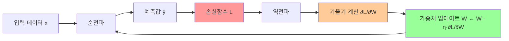

# 문제 2 - 다층신경망 학습과정 시각화 및 설명 (6점)

## 과제 요약

LLM 챗봇(ChatGPT, Gemini, Perplexity 등)을 활용하여 **다층신경망(MLP)의 학습과정**을 조사하고,  
이를 기반으로 학습과정을 **시각화**한 후 **본인의 언어로 재정리**하여 설명한다.

---

## 요구사항 체크리스트

- [ ] LLM 챗봇 사용 출처 **캡처 필수 포함** (ChatGPT/Gemini 등 화면 캡처)
- [ ] 찾은 내용 그대로 사용 금지 → **본인의 말로 재정리**
- [ ] 학습과정 **시각화** 포함 (나노 바나나, NotebookLM 등 챗봇 기능 활용)
- [ ] **1페이지 이상** 작성

---

## 작성 전략

### Step 1: LLM에 질의할 프롬프트 설계

다음 질문들을 ChatGPT/Gemini에 단계별로 질의하고 캡처:

```
Q1: "다층신경망(Multi-Layer Perceptron)의 학습과정을 순서대로 단계별로 설명해줘"
Q2: "순전파(Forward Propagation)와 역전파(Backpropagation)의 차이를 수식과 함께 설명해줘"
Q3: "경사하강법(Gradient Descent)에서 가중치 업데이트가 어떻게 이루어지는지 설명해줘"
```

> **[캡처 포함]** 챗봇 화면 일부 반드시 스크린샷

---

## 다층신경망 학습과정 - 본인 정리 내용

### 1. 전체 학습 플로우

```
[입력층] → [은닉층1] → [은닉층2] → [출력층]
    ↑                                    ↓
    └─────── 역전파(오차 전달) ←── 손실함수 계산
```

### 2. 순전파 (Forward Propagation)

각 뉴런에서 이전 층의 출력에 가중치를 곱하고 편향을 더한 후 활성화 함수를 적용:

$$z^{(l)} = W^{(l)} \cdot a^{(l-1)} + b^{(l)}$$
$$a^{(l)} = \sigma(z^{(l)})$$

- $W^{(l)}$: $l$번째 층의 가중치 행렬
- $b^{(l)}$: $l$번째 층의 편향 벡터
- $\sigma$: 활성화 함수 (ReLU, Sigmoid, Tanh 등)

**통계학적 관점**: 순전파는 입력 $x$에서 출력 $\hat{y}$을 예측하는 **조건부 기댓값** 추정 과정

### 3. 손실함수 계산 (Loss Function)

예측값과 실제값의 차이를 정량화:

| 문제 유형 | 손실함수 | 수식 |
|-----------|---------|------|
| 회귀 | MSE | $\frac{1}{n}\sum(y_i - \hat{y}_i)^2$ |
| 이진분류 | Binary Cross-Entropy | $-[y\log\hat{y} + (1-y)\log(1-\hat{y})]$ |
| 다중분류 | Categorical Cross-Entropy | $-\sum_k y_k \log \hat{y}_k$ |

### 4. 역전파 (Backpropagation)

오차를 출력층에서 입력층 방향으로 전파하며 **편미분(Chain Rule)**을 이용해 각 가중치의 기여도 계산:

$$\frac{\partial L}{\partial W^{(l)}} = \frac{\partial L}{\partial z^{(l)}} \cdot \frac{\partial z^{(l)}}{\partial W^{(l)}}$$

**핵심 개념**: 연쇄 법칙(Chain Rule)을 재귀적으로 적용 → 각 층의 가중치에 대한 손실의 기울기 계산

### 5. 가중치 업데이트 (Weight Update)

경사하강법(Gradient Descent)으로 가중치 갱신:

$$W^{(l)} \leftarrow W^{(l)} - \eta \cdot \frac{\partial L}{\partial W^{(l)}}$$

- $\eta$: 학습률(Learning Rate) → 업데이트 보폭 크기
- 반복적으로 수행하여 손실 최소화

---

## 시각화 방법

### 옵션 A: NotebookLM 활용 (권장)
1. Google NotebookLM(https://notebooklm.google.com) 접속
2. 다층신경망 관련 논문/문서 업로드
3. "마인드맵 생성" 또는 "개요 생성" 기능으로 학습 과정 시각화
4. **[캡처]** 생성된 시각화 결과

### 옵션 B: 나노 바나나(Napkin AI) 활용
1. https://www.napkin.ai 접속
2. 학습 과정 텍스트 입력
3. 자동 다이어그램 생성
4. **[캡처]** 생성된 플로우차트

### 옵션 C: Mermaid 다이어그램 (보고서 직접 삽입)



---

## 보고서 작성 구성 (1페이지 이상)

### (1) LLM 챗봇 활용 [캡처 포함]
- 질의 프롬프트 및 답변 일부 캡처 화면

### (2) 다층신경망 구조 설명
- 입력층 / 은닉층 / 출력층의 역할

### (3) 학습과정 단계별 설명
- 순전파 → 손실 계산 → 역전파 → 가중치 업데이트의 순환 구조

### (4) 시각화 결과 [캡처 포함]
- 챗봇 시각화 도구로 생성한 다이어그램

### (5) 통계학적 의미 분석
- 최대가능도추정(MLE)과 손실함수의 관계
- 확률적 경사하강법(SGD)과 샘플링의 관계

---

## 핵심 통계학적 연결점 (차별화 포인트)

| 딥러닝 개념 | 통계학 개념 |
|------------|-----------|
| 손실함수 최소화 | 최대가능도추정(MLE) |
| 역전파 | 연쇄법칙(Chain Rule) |
| 가중치 초기화 | 사전분포(Prior Distribution) |
| 드롭아웃 | 앙상블/베이지안 추론 |
| 배치 정규화 | 표준화(Standardization) |

---

## 주의사항

- ChatGPT/Gemini 답변을 **그대로 복붙 금지** → 반드시 본인 언어로 재작성
- 수식은 선택적 포함 가능 (포함 시 설명 필수)
- 시각화 이미지와 설명이 **연계**되어야 함
