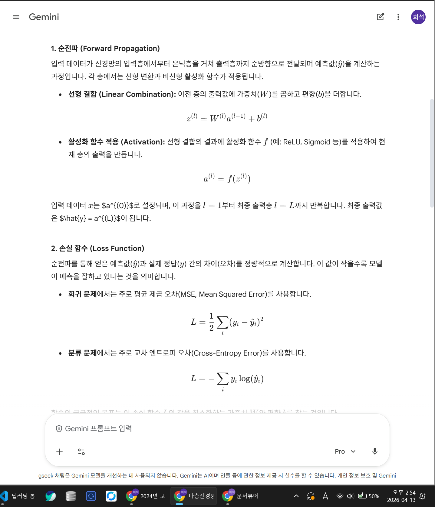
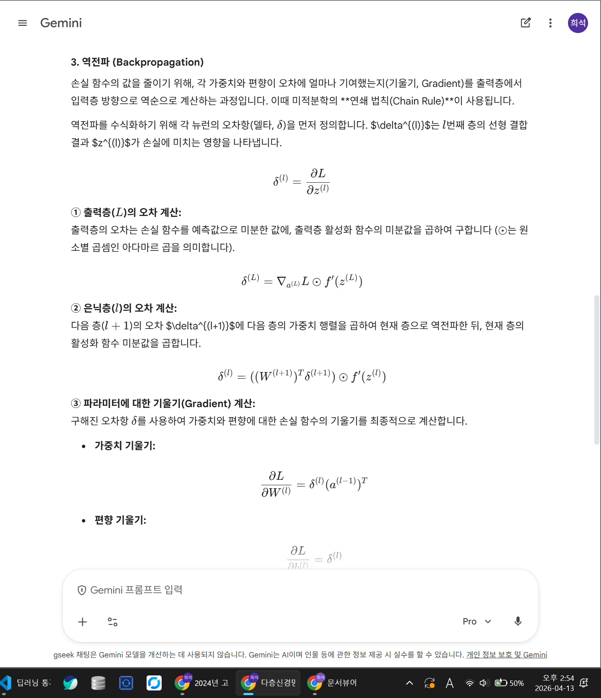
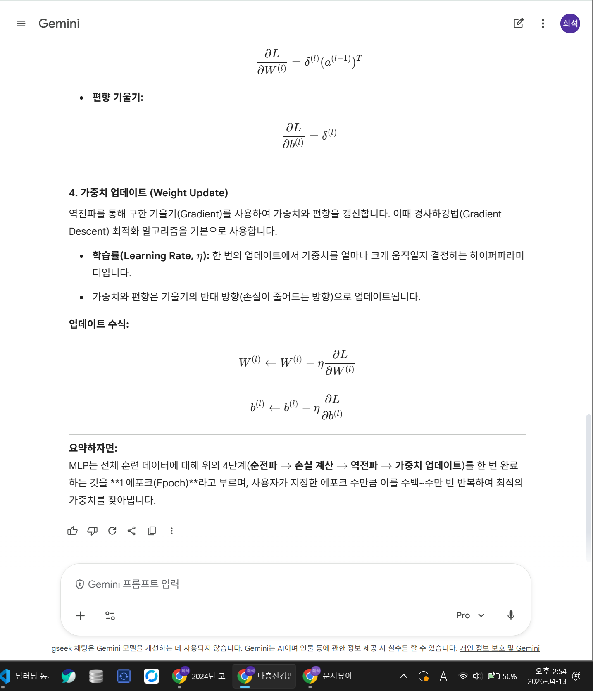

# 2번 문항: 다층신경망의 학습과정 시각화 및 설명

---

## 1. LLM 챗봇 활용 — 다층신경망 학습과정 조사

다층신경망의 학습 메커니즘을 체계적으로 이해하기 위해 대화형 AI 챗봇 Gemini를 활용하여 관련 개념을 조사하였다. 아래와 같은 질문을 단계별로 질의하였다.

> **질의 프롬프트:**
> "다층신경망(Multi-Layer Perceptron)의 학습과정을 순서대로 단계별로 설명해줘. 순전파, 손실함수, 역전파, 가중치 업데이트의 흐름을 수식과 함께 설명해줘."

아래 그림 1~3은 Gemini의 답변 화면을 캡처한 것이다.

**그림 1. Gemini 답변 — 순전파 및 손실함수 단계**

**그림 2. Gemini 답변 — 역전파 단계**

**그림 3. Gemini 답변 — 가중치 업데이트 단계 및 전체 요약**

---

챗봇 답변을 검토한 결과, 다층신경망의 학습은 크게 **순전파 → 손실 계산 → 역전파 → 가중치 갱신**의 반복 순환으로 이루어진다는 점을 확인할 수 있었다. 이하에서는 조사한 내용을 바탕으로 본인의 관점에서 재정리한다.

---

## 2. 다층신경망(MLP)의 구조

다층신경망(Multi-Layer Perceptron, MLP)은 입력층(input layer), 하나 이상의 은닉층(hidden layer), 출력층(output layer)으로 구성된다. 각 층은 여러 개의 뉴런(neuron)으로 이루어지며, 인접한 두 층 사이의 뉴런들은 완전히 연결(fully connected)된다.

통계학적으로 보면, MLP는 입력 변수 $\mathbf{x}$로부터 출력 변수 $y$에 대한 **비선형 조건부 분포 $p(y \mid \mathbf{x}; \boldsymbol{\theta})$를 모수화**하는 함수 근사기(function approximator)로 이해할 수 있다. 네트워크의 깊이와 너비가 충분하다면, MLP는 임의의 연속 함수를 원하는 정밀도로 근사할 수 있다는 보편 근사 정리(Universal Approximation Theorem)가 이론적 근거가 된다.

---

## 3. 학습과정 단계별 설명

### 3-1. 순전파 (Forward Propagation)

순전파는 입력 데이터를 네트워크의 첫 번째 층부터 마지막 출력층까지 순서대로 통과시키며 예측값을 산출하는 과정이다. $l$번째 층에서의 계산은 다음과 같다.

$$z^{(l)} = W^{(l)} \cdot a^{(l-1)} + b^{(l)}$$

$$a^{(l)} = \sigma\!\left(z^{(l)}\right)$$

여기서 $W^{(l)} \in \mathbb{R}^{d_l \times d_{l-1}}$은 가중치 행렬, $b^{(l)} \in \mathbb{R}^{d_l}$은 편향 벡터, $\sigma$는 비선형 활성화 함수(ReLU, Sigmoid 등)이다. 입력층에서 $a^{(0)} = \mathbf{x}$로 초기화되며, 최종 출력층의 $a^{(L)} = \hat{y}$가 네트워크의 예측값이 된다.

통계학적 해석으로는, 순전파 전체가 입력 $\mathbf{x}$가 주어졌을 때의 **조건부 기댓값 $\mathbb{E}[y \mid \mathbf{x}]$를 추정**하는 과정에 해당한다.

### 3-2. 손실함수 계산 (Loss Function)

예측값 $\hat{y}$와 실제 레이블 $y$ 사이의 불일치를 정량화하는 손실함수 $L$을 계산한다. 문제의 유형에 따라 적합한 손실함수가 다르다.

| 과제 유형 | 손실함수 | 수식 |
|----------|---------|------|
| 회귀 | 평균제곱오차(MSE) | $\displaystyle\frac{1}{n}\sum_{i=1}^n (y_i - \hat{y}_i)^2$ |
| 이진 분류 | 이진 교차 엔트로피 | $-\bigl[y\log\hat{y} + (1-y)\log(1-\hat{y})\bigr]$ |
| 다중 분류 | 범주형 교차 엔트로피 | $-\displaystyle\sum_{k=1}^K y_k \log \hat{y}_k$ |

**통계학적 연결 — MLE와 손실함수:** 분류 문제에서 교차 엔트로피 손실을 최소화하는 것은, 모수 $\boldsymbol{\theta}$에 대한 **음의 로그 가능도(negative log-likelihood)를 최소화**하는 것과 동치이다.

$$L(\boldsymbol{\theta}) = -\frac{1}{n}\sum_{i=1}^n \log p(y_i \mid \mathbf{x}_i; \boldsymbol{\theta})$$

즉, 신경망 학습은 통계학의 최대가능도추정(Maximum Likelihood Estimation, MLE) 원리를 함수 근사에 적용한 것으로 볼 수 있다.

### 3-3. 역전파 (Backpropagation)

역전파는 손실 $L$을 각 가중치에 대해 편미분하여 **기울기(gradient)**를 계산하는 알고리즘이다. 출력층에서 입력층 방향으로 연쇄 법칙(chain rule)을 반복 적용하여 각 층의 기울기를 구한다.

$l$번째 층의 오차 신호 $\delta^{(l)}$는 다음과 같이 재귀적으로 정의된다.

$$\delta^{(L)} = \frac{\partial L}{\partial z^{(L)}}$$

$$\delta^{(l)} = \left(W^{(l+1)\top} \delta^{(l+1)}\right) \odot \sigma'\!\left(z^{(l)}\right)$$

그리고 가중치와 편향에 대한 기울기는 다음과 같다.

$$\frac{\partial L}{\partial W^{(l)}} = \delta^{(l)} \cdot a^{(l-1)\top}, \qquad \frac{\partial L}{\partial b^{(l)}} = \delta^{(l)}$$

여기서 $\odot$은 원소별 곱(Hadamard product)이다. 역전파의 핵심은 계산 그래프(computation graph)를 역방향으로 순회하며 기울기를 효율적으로 재활용하는 동적 프로그래밍(dynamic programming) 전략에 있다.

### 3-4. 가중치 업데이트 (Weight Update)

계산된 기울기를 이용하여 경사하강법(Gradient Descent)으로 파라미터를 갱신한다.

$$W^{(l)} \leftarrow W^{(l)} - \eta \cdot \frac{\partial L}{\partial W^{(l)}}$$

$$b^{(l)} \leftarrow b^{(l)} - \eta \cdot \frac{\partial L}{\partial b^{(l)}}$$

학습률(learning rate) $\eta$는 업데이트 보폭을 결정하는 하이퍼파라미터이다. 전체 학습 데이터를 매번 사용하는 배치 경사하강법(Batch GD) 대신, 무작위로 선택된 미니배치(mini-batch)를 사용하는 **확률적 경사하강법(SGD)**이 일반적으로 활용된다.

**통계학적 연결 — 편향-분산 트레이드오프:** 학습률 $\eta$가 크면 파라미터가 진동하며 수렴 실패(high variance) 위험이 있고, 반대로 너무 작으면 수렴 속도가 느려지며 지역 최솟값(local minimum)에 갇힐 수 있다(high bias). 이는 통계 추정에서의 **편향-분산 트레이드오프(bias-variance tradeoff)**와 구조적으로 동일한 딜레마이다.

---

## 4. 학습과정 전체 요약 — 순환 구조

위의 3-1 ~ 3-4 단계는 **에포크(epoch)** 단위로 반복되며, 손실 $L$이 수렴할 때까지 순환한다. 이 반복 구조를 한 줄로 표현하면 다음과 같다.

$$\text{입력} \xrightarrow{\text{순전파}} \hat{y} \xrightarrow{\text{손실 계산}} L \xrightarrow{\text{역전파}} \nabla_{\boldsymbol{\theta}} L \xrightarrow{\text{파라미터 갱신}} \boldsymbol{\theta}^* \approx \hat{\boldsymbol{\theta}}_{\text{MLE}}$$

학습이 완료되면 얻어진 파라미터 $\boldsymbol{\theta}^*$는 관측 데이터 $\{(\mathbf{x}_i, y_i)\}_{i=1}^n$에 대한 MLE 추정량의 근사치가 된다.

---

## 5. 학습과정 시각화

다음은 Napkin AI를 활용하여 생성한 다층신경망 학습 주기 다이어그램이다. 입력한 텍스트를 바탕으로 자동 시각화가 생성되었으며, 4단계의 순환 구조가 원형 플로우차트로 표현되었다.

**그림 4. Napkin AI로 생성한 다층신경망 학습 주기 다이어그램**

.png)

---

시각화 결과를 통해 학습 과정이 선형적 흐름이 아닌 **피드백 루프(feedback loop)** 구조임을 직관적으로 확인할 수 있다. 순전파로 예측을 생성하고, 손실을 기준으로 오차를 역방향으로 전파하여 파라미터를 수정하는 이 구조는, 통계학의 반복 재가중 최소제곱법(IRLS: Iteratively Reweighted Least Squares)이나 EM 알고리즘의 E-step/M-step 반복과 유사한 수렴 메커니즘을 공유한다.

---

## 6. 통계학적 의미 종합

| 딥러닝 개념 | 통계학적 대응 개념 | 의미 연결 |
|------------|-----------------|---------|
| 손실함수 최소화 | 최대가능도추정(MLE) | $-\log L(\boldsymbol{\theta})$ 최소화와 동치 |
| 역전파 | 연쇄 법칙(Chain Rule) | 편미분의 재귀적 분해 |
| 가중치 초기화 | 사전분포(Prior) | 베이지안 MAP 추정의 초기 신념 |
| 드롭아웃(Dropout) | 앙상블 / 베이지안 근사 | 모형 불확실성 정량화 |
| 배치 정규화(Batch Norm) | 표준화(Standardization) | 내부 공변량 이동 억제 |
| 학습률 $\eta$ | 수렴 속도-정확도 트레이드오프 | 편향-분산 트레이드오프와 유사 |
| 조기 종료(Early stopping) | 정칙화(Regularization) | 과적합 방지, 일반화 향상 |

딥러닝의 학습 과정은 겉보기에는 행렬 연산과 미분의 조합처럼 보이지만, 그 핵심에는 통계적 추론 원리가 내재되어 있다. 특히 손실함수가 음의 로그 가능도로 해석될 수 있다는 사실은, MLP의 학습이 단순한 최적화 문제가 아니라 **확률 모형의 모수 추정 문제**임을 시사한다. 이 관점을 확장하면 가중치에 사전분포를 부여하는 베이지안 신경망(Bayesian Neural Network)으로 이어지며, 불확실성을 명시적으로 다루는 통계적 딥러닝의 영역으로 발전하게 된다.

---

## 참고 자료

- Gemini (Google), 질의: "다층신경망의 학습과정을 단계별로 설명해줘. 순전파, 손실함수, 역전파, 가중치 업데이트의 흐름을 수식과 함께 설명해줘.", 2026년 4월 조회
- Napkin AI, 다층신경망 학습과정 텍스트 입력 후 자동 시각화 생성, 2026년 4월 조회
- Goodfellow, I., Bengio, Y., & Courville, A. (2016). *Deep Learning*. MIT Press.
- Bishop, C. M. (2006). *Pattern Recognition and Machine Learning*. Springer.
