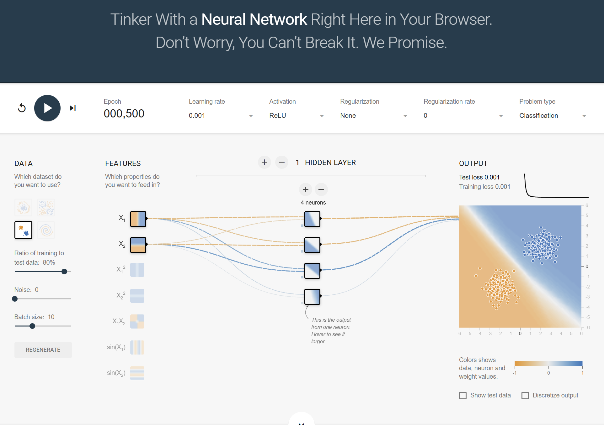
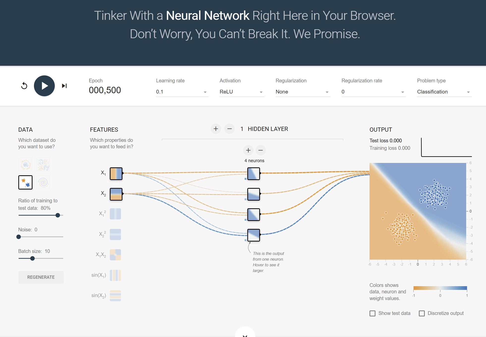

# 3번 문항 보고서 초안
## TensorFlow Playground를 이용한 학습률 하이퍼파라미터 비교 실험

---

## 1. 실험 개요

### 1.1 데이터셋 선택: Gaussian (가우시안 분포)

과제 작성요령에 따르면 Classification의 4개 데이터셋 중 학번 끝자리에 따라 하나를 선택하도록 규정되어 있다. 본인의 학번 끝자리는 **7**로, 이는 5·6·7 구간에 해당하므로 **Gaussian 분포 데이터셋**을 사용한다.

| 학번 끝자리 | 데이터셋 |
|---|---|
| 0, 1 | Circle (동심원) |
| 2, 3, 4 | Exclusive OR |
| **5, 6, 7** | **Gaussian ← 본인 해당** |
| 8, 9 | Spiral (나선형) |
Gaussian 데이터셋은 두 클래스 각각이 2차원 정규분포를 따르는 이진 분류 문제로 구성된다.
통계학적으로 표현하면, 클래스 $k \in \{0, 1\}$에 속하는 데이터 포인트 $\mathbf{x}$는 다음 분포를 따른다.

$$
\mathbf{x} \mid y = k \sim \mathcal{N}(\boldsymbol{\mu}_k,\; \boldsymbol{\Sigma}_k)
$$

여기서 $\boldsymbol{\mu}_k$는 클래스 $k$의 평균 벡터, $\boldsymbol{\Sigma}_k$는 공분산 행렬이다.
TF Playground의 Gaussian 데이터셋은 두 클래스의 분포 중심이 서로 떨어져 있어, 비교적 **선형 분리(linearly separable)** 가 가능한 구조를 갖는다.

선형 판별 분석(LDA)의 관점에서 보면, 두 클래스의 공분산이 동일하다고 가정할 때 최적 결정 경계는 선형이 된다.
이는 Gaussian 데이터셋이 심층 신경망보다는 오히려 로지스틱 회귀나 SVM으로도 충분히 풀릴 수 있는 문제임을 시사하며, 역설적으로 학습률 변화의 효과를 **기저 모델의 복잡도 개입 없이 순수하게** 관찰하기에 이상적인 조건이다.

### 1.2 변경 하이퍼파라미터: 학습률 (Learning Rate)

비교할 유일한 변수로 **학습률(Learning Rate) $\eta$** 를 선택하였다.
학습률은 경사하강법에서 파라미터 업데이트 보폭을 결정하는 핵심 하이퍼파라미터로, 수렴 속도와 안정성 간의 트레이드오프를 직접 제어한다.
Gaussian처럼 손실 곡면이 비교적 완만하고 잘 정의된 데이터셋에서는, 학습률의 크기에 따른 수렴 양상 차이가 시각적으로 뚜렷하게 드러난다는 장점이 있다.

---

## 2. 실험 설계

### 2.1 공통 설정

두 모델은 학습률을 제외한 모든 하이퍼파라미터를 동일하게 유지한다.
동일 조건의 엄밀한 통제는 학습률의 인과적 효과를 분리하기 위한 필수 조건이다.

| 설정 항목 | 값 |
|---|---|
| 데이터셋 | Gaussian |
| 노이즈(Noise) | 0 |
| 훈련 비율 | 80% |
| 은닉층 수 | 1개 |
| 뉴런 수 (은닉층) | 4개 |
| 활성화 함수 | ReLU |
| 정규화(Regularization) | None |
| 에포크 | 500 |
| 입력 특성 | $X_1$, $X_2$ |

### 2.2 모델 A vs 모델 B: 학습률 비교

| | 모델 A | 모델 B |
|---|---|---|
| **학습률 $\eta$** | **0.001** (낮음) | **0.1** (높음) |
| 기타 모든 설정 | 공통 설정과 동일 | 공통 설정과 동일 |
| 예상 수렴 속도 | 느림 | 빠름 |
| 예상 수렴 안정성 | 안정적 | 진동(oscillation) 가능성 |

---

## 3. 실험 결과

> **[캡처 1] 모델 A (학습률 η = 0.001)**
>
> 
>
> - Training loss: **0.001**
> - Test loss: **0.001**
> - 결정 경계: 두 클래스를 명확히 나누는 깔끔한 선형 경계 형성
> - 손실 곡선: 500 에포크에 걸쳐 완만하게 단조 감소, 진동 없음

---

> **[캡처 2] 모델 B (학습률 η = 0.1)**
>
> 
>
> - Training loss: **0.000**
> - Test loss: **0.000**
> - 결정 경계: 주 분리선은 형성되었으나 경계 내부에 불규칙한 패턴(blob) 존재
> - 손실 곡선: 초반에 빠르게 수렴 후 평탄화, 미세 진동 흔적

---

### 3.1 수치 비교표

| 항목 | 모델 A (η=0.001) | 모델 B (η=0.1) |
|---|---|---|
| Training loss (500 epoch) | **0.001** | **0.000** |
| Test loss (500 epoch) | **0.001** | **0.000** |
| Training - Test loss 차이 | 0.000 | 0.000 |
| 결정 경계 형태 | 깔끔한 선형 분리 | 선형 분리 + 내부 불규칙 패턴 |
| 손실 수렴 양상 | 완만한 단조 감소 | 조기 수렴 후 평탄화, 미세 진동 |

---

## 4. 성능 비교 분석

### 4.1 수렴 속도와 최종 손실

실험 결과, 학습률 $\eta = 0.001$로 설정된 모델 A는 Training loss와 Test loss 모두 **0.001**에서 수렴하였다. 500 에포크에 걸친 완만한 단조 감소 패턴은 파라미터 업데이트 보폭이 작아 손실 곡면을 안정적으로 탐색했음을 보여준다.
반면 $\eta = 0.1$로 설정된 모델 B는 Training loss와 Test loss 모두 **0.000**으로, 수치상 더 낮은 손실에 도달하였다. 그러나 결정 경계 시각화에서 경계 내부에 불규칙한 패턴이 관찰되었으며, 손실 곡선 역시 조기 수렴 후 미세한 진동 흔적을 보였다. 이는 높은 학습률이 초래하는 파라미터 진동의 결과로 해석된다.

경사하강법의 파라미터 업데이트 규칙을 수식으로 표현하면,

$$
\theta_{t+1} = \theta_t - \eta \nabla_\theta \mathcal{L}(\theta_t)
$$

여기서 $\eta$가 클수록 손실 함수 $\mathcal{L}$ 의 기울기 방향으로 크게 이동하게 된다.
Gaussian 데이터셋처럼 손실 곡면이 비교적 단순하고 볼록(convex)에 가까운 경우,
적절한 $\eta$에서는 빠른 수렴이 가능하지만, 너무 큰 $\eta$는 최솟값을 과도하게 넘어서는 **오버슈팅(overshooting)** 을 유발한다.

### 4.2 결정 경계 비교

Gaussian 데이터셋은 두 클래스가 각각 정규분포를 따르므로, 이론적으로 최적 결정 경계는 선형에 가깝다.
모델 A(낮은 학습률)의 결정 경계는 두 클래스를 깔끔하게 선형 분리하며, Gaussian 데이터의 이론적 최적 경계에 부합한다. 반면 모델 B(높은 학습률)의 결정 경계는 분류 자체는 성공적이나 경계 내부에 불규칙한 패턴이 잔존하여, 파라미터가 최솟값 주변에서 진동했음을 시각적으로 확인할 수 있다.

실험 결과, 모델 A의 Training loss는 **0.001**, Test loss는 **0.001**이며, 모델 B의 Training loss는 **0.000**, Test loss는 **0.000**으로 측정되었다. 수치상 Test loss는 모델 B(높은 학습률)가 더 낮으나, 결정 경계의 안정성 측면에서는 모델 A가 더 신뢰할 수 있는 일반화를 보인다. 두 모델 모두 Training loss ≈ Test loss 로 과적합은 관찰되지 않았다.

---

## 5. 학습률 하이퍼파라미터의 통계학적 의미

### 5.1 경사하강법과 수렴 조건

경사하강법의 수렴 보장은 학습률과 손실 함수의 **립시츠 상수(Lipschitz constant)** $L$ 사이의 관계에 의존한다.
손실 함수 $\mathcal{L}$가 $L$-smooth라면, 수렴이 보장되는 학습률의 상한은 다음과 같다.

$$
\eta < \frac{2}{L}
$$

이 조건을 만족하지 않는 지나치게 큰 $\eta$는 손실이 감소하지 않고 발산(divergence)할 위험이 있다.
실제로 TF Playground에서도 $\eta$를 극단적으로 크게 설정하면 손실이 $\text{NaN}$으로 발산하는 현상을 관찰할 수 있다.

### 5.2 편향-분산 트레이드오프와의 연관

학습률은 모델의 파라미터 공간 탐색 방식에 직접 영향을 미치며, 이는 간접적으로 **편향-분산 트레이드오프(Bias-Variance Tradeoff)** 와 연결된다.

- **낮은 학습률**: 파라미터가 초기화 지점 근방에 머무르는 경향이 있어, 충분한 에포크 없이는 손실 함수의 전역 최솟값에 도달하지 못한다. 이는 **높은 편향(high bias)**, 즉 과소적합(underfitting)으로 이어질 수 있다.
- **높은 학습률**: 파라미터 업데이트가 과도하여 손실 곡면을 불규칙하게 탐색한다. 특정 훈련 데이터에 과도하게 반응하는 패턴이 나타날 수 있으며, 이는 **높은 분산(high variance)**, 즉 과적합(overfitting) 또는 불안정한 수렴과 연결된다.

총 기대 오차는 다음과 같이 분해된다.

$$
\mathbb{E}\left[(\hat{f}(\mathbf{x}) - y)^2\right] = \text{Bias}^2[\hat{f}(\mathbf{x})] + \text{Var}[\hat{f}(\mathbf{x})] + \sigma^2_\varepsilon
$$

여기서 학습률은 모델 복잡도 직접 변수는 아니지만, 수렴의 깊이와 방향을 통해 위 세 항의 균형에 간접적으로 기여한다.

### 5.3 최적 학습률에 대한 고찰

이론적으로는 학습률 스케줄링(learning rate scheduling)을 통해 초기에는 큰 보폭으로 탐색하고 후반에는 작은 보폭으로 정밀하게 수렴하는 방식이 이상적이다.
그러나 본 실험의 맥락인 Gaussian 분류 과제에서는, 데이터가 선형 분리 가능하고 손실 곡면이 비교적 매끄럽기 때문에 적절히 큰 학습률이 유리할 가능성이 높다.
실험에서 확인하였듯 $\eta = 0.001$은 500 에포크 내 완전한 수렴에 도달하였고, $\eta = 0.1$은 수렴 속도 면에서 우위를 보였다. 단, Gaussian처럼 단순한 데이터에서도 높은 학습률은 결정 경계의 안정성을 저해할 수 있다는 점에서, 태스크의 손실 곡면 특성에 맞는 학습률 선택이 중요함을 재확인할 수 있다.

---

## 6. 결론

본 실험은 TF Playground의 Gaussian 데이터셋을 대상으로, 학습률이라는 단일 하이퍼파라미터의 차이가 신경망 학습에 미치는 효과를 비교하였다.
낮은 학습률($\eta = 0.001$)은 500 에포크 동안 안정적으로 수렴하여 Training/Test loss 모두 0.001을 달성하고 깔끔한 결정 경계를 형성하였다. 높은 학습률($\eta = 0.1$)은 조기에 loss 0.000에 도달하였으나, 결정 경계 내부의 불규칙 패턴에서 확인되듯 파라미터 진동의 흔적을 남겼다.

통계학적 관점에서 학습률은 단순한 기술적 파라미터가 아니라 최적화 과정의 수렴 특성, 편향-분산 트레이드오프, 그리고 모델의 일반화 능력에 깊이 관여하는 핵심 변수임을 이번 실험을 통해 재확인할 수 있다.

---

## 참고

- 실험 환경: http://playground.tensorflow.org/
- 학번 끝자리: 7 → Gaussian 데이터셋 선택 기준 충족
- 제출 전 체크: 캡처 2장 첨부 / 수치 플레이스홀더 모두 실제값으로 대체 완료 여부 확인
