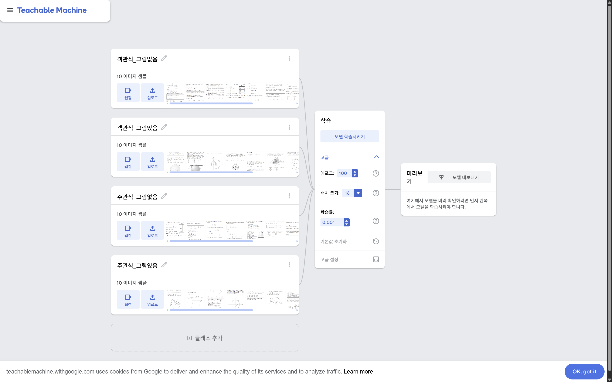
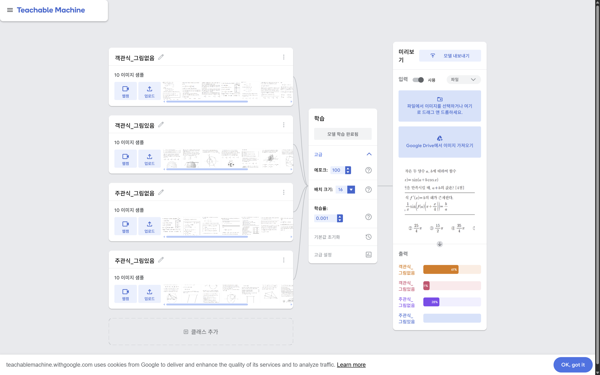
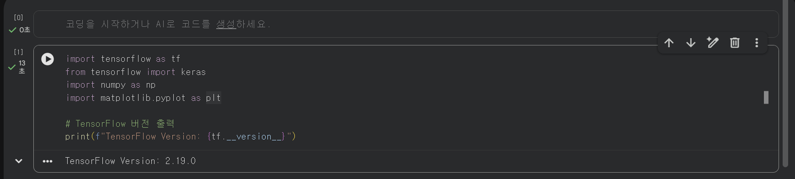
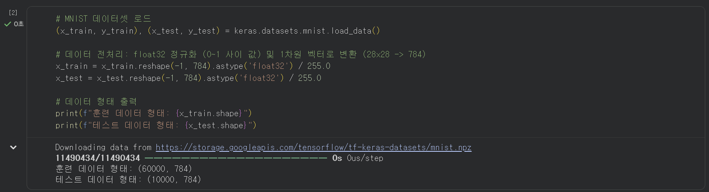
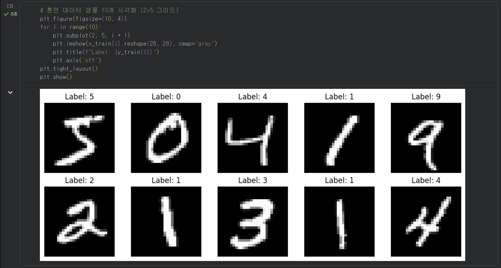
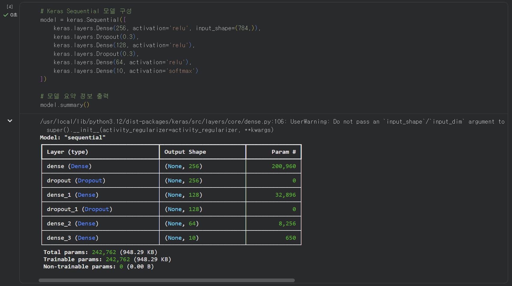
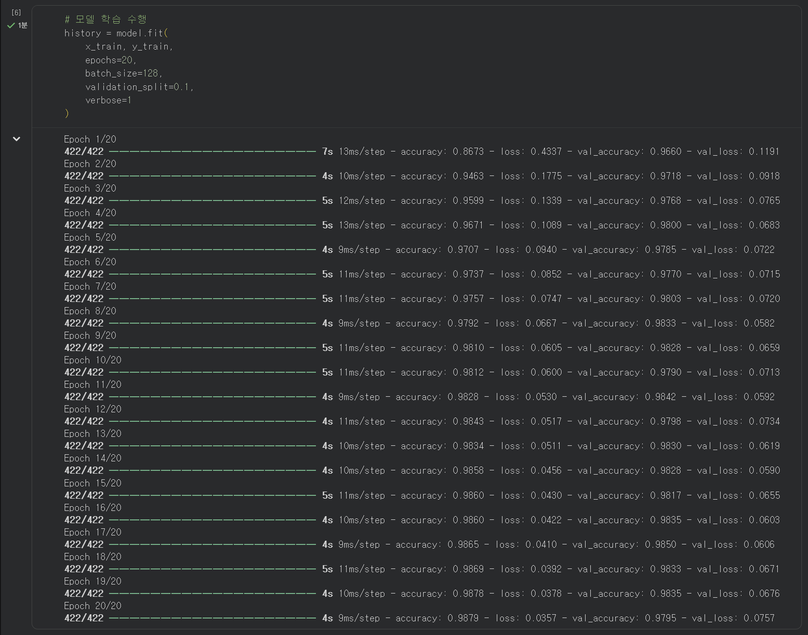
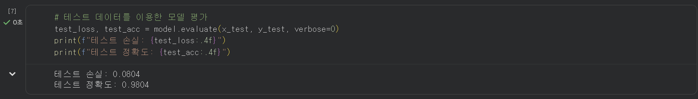
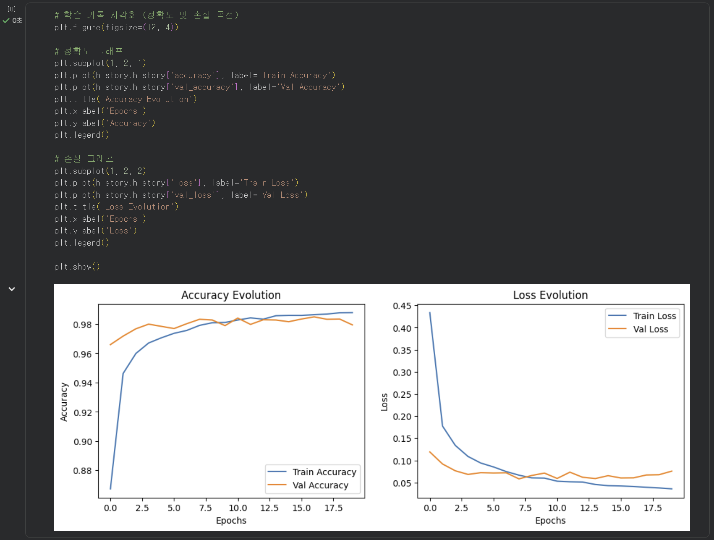
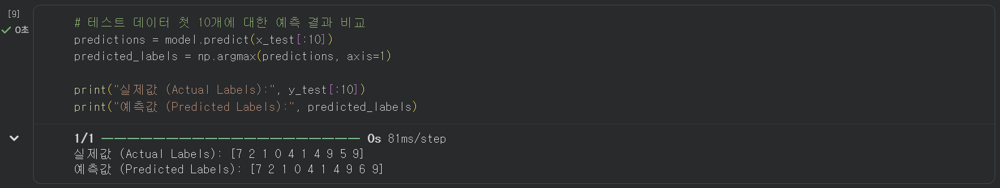

# 2026 학년도 1학기 중간과제물(온라인 제출용)

| | |
|---|---|
| **교 과 목 명** | 딥러닝의통계적이해 |
| **학 번** | 202334-153257 |
| **성 명** | 양희석 |
| **연 락 처** | 010-4340-2326 |
| **과 제 유 형** **(공통형/지정형)** | 공통형 |

---

## 목차

1. [문제 1] Teachable Machine을 이용한 머신러닝 모형 제작 (8점)
2. [문제 2] 다층신경망의 학습과정 시각화 및 설명 (6점)
3. [문제 3] TensorFlow Playground를 이용한 하이퍼파라미터 비교 (8점)
4. [문제 4] Google Colab MNIST 완전연결신경망 구현 (8점)

---

# 문제 1. Teachable Machine을 이용한 머신러닝 모형 제작 (8점)

## 1. 프로젝트 개요

Google Teachable Machine(https://teachablemachine.withgoogle.com)을 이용하여 수학 시험 문항 이미지를 4유형으로 분류하는 머신러닝 모델을 제작하였다. 응답 방식(객관식/주관식) × 지문 구성(그림없음/그림있음)의 2×2 구조로 클래스를 정의하였으며, 단독/셋트 기준 대신 그림삽입 여부를 택한 것은 기출 자료에서 그림 문항의 사례가 훨씬 많아 데이터 확보가 용이하기 때문이다.

| 클래스 | 유형명 | 설명 |
|--------|--------|------|
| Class 1 | **객관식_그림없음** | 텍스트 지문 + 선택지(①~⑤) |
| Class 2 | **객관식_그림있음** | 그래프·도형·표 포함 + 선택지(①~⑤) |
| Class 3 | **주관식_그림없음** | 텍스트 지문 + 빈칸/서술형 |
| Class 4 | **주관식_그림있음** | 그래프·도형·표 포함 + 빈칸/서술형 |

## 2. 데이터 수집 및 모델 학습

수능·모의평가 기출 PDF(EBSi, 한국교육과정평가원)에서 각 유형별 문항을 스크린샷으로 캡처하였다. 클래스 불균형 방지를 위해 각 클래스 10장씩(총 40장) 균등하게 수집하였다.


*[그림 1] 4개 클래스(각 10장, 총 40장) 데이터 로드 완료 화면*

Teachable Machine은 ImageNet 사전학습 **MobileNet**의 특징 추출층을 고정하고 분류층만 재학습하는 **전이학습(Transfer Learning)** 방식을 사용한다. 하이퍼파라미터는 Epochs 100 / Batch Size 16 / Learning Rate 0.001으로 설정하였고, 각 에포크에서 순전파 → 손실 계산 → 역전파 → 가중치 업데이트를 반복한다.



*[그림 2] 에포크 100 · 배치 16 · 학습률 0.001 설정 화면*


*[그림 3] 학습 진행 중 — 에포크 실시간 증가 상태*

## 3. 분류 결과 및 분석

총 6회 테스트를 수행하였다.


*[그림 4] 객관식_그림있음 (사례 A) — 높은 신뢰도로 정답*


*[그림 5] 객관식_그림있음 (사례 B) — 오분류 (그림없음 48% / 정답 16%)*


*[그림 6] 객관식_그림있음 (사례 C) — 97% 신뢰도 정답*



*[그림 7] 객관식_그림없음 — 오분류 (정답 클래스 9%)*


*[그림 8] 주관식_그림없음 — 높은 신뢰도 정답*


*[그림 9] 주관식_그림있음 — 높은 신뢰도 정답*

| 실제 유형 | 예측 클래스 | 주요 신뢰도 | 정오 |
|-----------|-----------|-----------|------|
| 객관식_그림있음 (A) | 객관식_그림있음 | 높음 | ✓ |
| **객관식_그림있음 (B)** | **객관식_그림없음** | 그림없음 48% / 정답 16% | ✗ |
| 객관식_그림있음 (C) | 객관식_그림있음 | **97%** | ✓ |
| **객관식_그림없음** | **주관식_그림있음** | 정답 9% | ✗ |
| 주관식_그림없음 | 주관식_그림없음 | 높음 | ✓ |
| 주관식_그림있음 | 주관식_그림있음 | 높음 | ✓ |

6회 테스트 중 4회 정답(정확도 67%). 오분류 2건의 공통 원인은 **선택지 원문자(①~⑤)가 그림 바로 옆에 연속 배치**된 레이아웃으로, 모델이 선택지 패턴을 그림의 일부로 오인한 것으로 추정된다. 클래스당 데이터를 50장 이상으로 확장하면 개선될 것으로 기대된다.

## 4. 통계학적 고찰

전이학습은 **MAP(Maximum A Posteriori) 추정**과 대응된다.

$$\hat{\boldsymbol{\theta}}_{\text{MAP}} = \arg\max_{\boldsymbol{\theta}} \left[ \log p(\mathcal{D} \mid \boldsymbol{\theta}) + \log p(\boldsymbol{\theta}) \right]$$

ImageNet 사전학습 가중치가 강한 사전분포 $p(\boldsymbol{\theta})$로 작용하므로 소규모 데이터(40장)만으로도 효과적인 분류가 가능하다. 모델 출력의 Confidence는 소프트맥스 조건부 확률 $P(y=k \mid x)$이며, 정보 엔트로피 $H = -\sum_k P_k \log_2 P_k$로 확신도를 정량화할 수 있다. 정답 사례 C(97%)는 $H \approx 0.22$ bits, 오분류 사례 B는 $H \approx 1.71$ bits로 모델이 거의 무작위 수준으로 판단했음을 보여준다.

- Google Teachable Machine: https://teachablemachine.withgoogle.com
- Howard, A. G., et al. (2017). MobileNets. *arXiv:1704.04861*.

---

# 문제 2. 다층신경망의 학습과정 시각화 및 설명 (6점)

## 1. LLM 챗봇 활용

Gemini에 다층신경망 학습과정을 단계별로 질의하여 답변을 수집하였다.

> **질의:** "다층신경망(MLP)의 학습과정을 순전파·손실함수·역전파·가중치 업데이트 흐름을 수식과 함께 단계별로 설명해줘."


*[그림 1] Gemini 답변 — 순전파 및 손실함수 단계*


*[그림 2] Gemini 답변 — 역전파 단계*


*[그림 3] Gemini 답변 — 가중치 업데이트 및 전체 요약*

> ※ 이하는 챗봇 답변을 참고하여 본인의 언어로 재정리한 것이다.

## 2. 학습과정 단계별 설명

MLP는 입력층·은닉층·출력층으로 구성되며, 인접 층 간 뉴런이 완전 연결된다. 학습은 아래 4단계가 에포크 단위로 반복된다.

**① 순전파 (Forward Propagation)**

입력 데이터를 층별로 통과시켜 예측값을 계산한다. $l$번째 층의 계산은 다음과 같다.

$$z^{(l)} = W^{(l)} \cdot a^{(l-1)} + b^{(l)}, \qquad a^{(l)} = \sigma\!\left(z^{(l)}\right)$$

$a^{(0)} = \mathbf{x}$로 초기화하며 최종 출력 $a^{(L)} = \hat{y}$가 예측값이 된다. 이는 조건부 기댓값 $\mathbb{E}[y \mid \mathbf{x}]$ 추정에 해당한다.

**② 손실함수 계산 (Loss Function)**

| 유형 | 손실함수 | 수식 |
|------|---------|------|
| 회귀 | MSE | $\frac{1}{n}\sum(y_i - \hat{y}_i)^2$ |
| 이진 분류 | Binary Cross-Entropy | $-[y\log\hat{y} + (1-y)\log(1-\hat{y})]$ |
| 다중 분류 | Categorical Cross-Entropy | $-\sum_k y_k \log \hat{y}_k$ |

교차 엔트로피 최소화는 음의 로그가능도 최소화(**MLE**)와 동치이다.

**③ 역전파 (Backpropagation)**

연쇄 법칙(chain rule)으로 출력층→입력층 방향으로 각 가중치의 기울기를 계산한다.

$$\delta^{(l)} = \left(W^{(l+1)\top} \delta^{(l+1)}\right) \odot \sigma'\!\left(z^{(l)}\right), \qquad \frac{\partial L}{\partial W^{(l)}} = \delta^{(l)} \cdot a^{(l-1)\top}$$

**④ 가중치 업데이트**

$$W^{(l)} \leftarrow W^{(l)} - \eta \cdot \frac{\partial L}{\partial W^{(l)}}$$

학습률 $\eta$가 크면 진동(high variance), 작으면 수렴 지연(high bias)이 발생하는 **편향-분산 트레이드오프**와 동일한 구조이다.

## 3. 시각화 및 통계학적 의미

$$\text{입력} \xrightarrow{\text{순전파}} \hat{y} \xrightarrow{\text{손실}} L \xrightarrow{\text{역전파}} \nabla_{\boldsymbol{\theta}} L \xrightarrow{\text{갱신}} \boldsymbol{\theta}^* \approx \hat{\boldsymbol{\theta}}_{\text{MLE}}$$

Napkin AI로 생성한 다이어그램은 학습이 단방향이 아닌 **닫힌 피드백 루프** 구조임을 보여준다.

.png)

*[그림 4] Napkin AI — 다층신경망 학습 주기 다이어그램*

| 딥러닝 개념 | 통계학적 대응 | 의미 |
|------------|------------|------|
| 손실함수 최소화 | MLE | $-\log L(\boldsymbol{\theta})$ 최소화와 동치 |
| 역전파 | 연쇄 법칙 | 편미분의 재귀적 분해 |
| 가중치 초기화 | 사전분포(Prior) | 베이지안 MAP 추정의 초기 신념 |
| 드롭아웃 | 앙상블 / 베이지안 근사 | 모형 불확실성 정량화 |
| 학습률 $\eta$ | 편향-분산 트레이드오프 | 수렴 속도-안정성 트레이드오프 |

- Gemini (Google), 2026년 4월 조회 / Napkin AI, 2026년 4월 자동 시각화
- Goodfellow et al. (2016). *Deep Learning*. MIT Press.

---

# 문제 3. TensorFlow Playground를 이용한 하이퍼파라미터 비교 (8점)

## 1. 실험 개요

**데이터셋 선택: Gaussian (학번 끝자리 7)**

| 학번 끝자리 | 데이터셋 |
|---|---|
| 0, 1 | Circle |
| 2, 3, 4 | Exclusive OR |
| **5, 6, 7** | **Gaussian ← 본인** |
| 8, 9 | Spiral |

Gaussian 데이터셋은 두 클래스가 각각 $\mathbf{x} \mid y=k \sim \mathcal{N}(\boldsymbol{\mu}_k, \boldsymbol{\Sigma}_k)$를 따르는 이진 분류 문제로, 비교적 선형 분리가 가능하여 **학습률(Learning Rate)** 변화의 효과를 순수하게 관찰하기 이상적이다. 학습률은 경사하강법의 파라미터 업데이트 보폭을 결정하며, 수렴 속도와 안정성 간 트레이드오프를 직접 제어하는 핵심 하이퍼파라미터이다.

## 2. 실험 설계 및 결과

**공통 설정:** Gaussian / 노이즈 0 / 훈련 비율 80% / 은닉층 1개(뉴런 4) / ReLU / 정규화 없음 / 에포크 500

| | 모델 A | 모델 B |
|---|---|---|
| **학습률 $\eta$** | **0.001** (낮음) | **0.1** (높음) |
| 예상 특성 | 느리고 안정적 | 빠르지만 진동 가능 |


*[그림 10] 모델 A (η=0.001) — Training/Test loss: **0.001**, 깔끔한 선형 결정 경계*


*[그림 11] 모델 B (η=0.1) — Training/Test loss: **0.000**, 분리 성공 + 내부 불규칙 패턴*

| 항목 | 모델 A (η=0.001) | 모델 B (η=0.1) |
|---|---|---|
| Training / Test loss | **0.001** / **0.001** | **0.000** / **0.000** |
| 결정 경계 | 깔끔한 선형 분리 | 선형 분리 + 불규칙 패턴 |
| 수렴 양상 | 완만한 단조 감소 | 조기 수렴 후 미세 진동 |

## 3. 분석 및 통계학적 의미

$$\theta_{t+1} = \theta_t - \eta \nabla_\theta \mathcal{L}(\theta_t)$$

$\eta$가 클수록 손실 곡면을 크게 이동하여 **오버슈팅(overshooting)**이 발생할 수 있으며, $L$-smooth 손실함수에서 수렴 보장 조건은 $\eta < 2/L$이다. 편향-분산 관점에서 낮은 학습률은 **높은 편향(과소적합)**, 높은 학습률은 **높은 분산(불안정 수렴)**으로 연결된다.

$$\mathbb{E}\left[(\hat{f}(\mathbf{x}) - y)^2\right] = \text{Bias}^2 + \text{Var} + \sigma^2_\varepsilon$$

수치상 모델 B(η=0.1)가 낮은 loss(0.000)를 달성했으나 결정 경계 안정성은 모델 A가 우수하다. 학습률 단일 변수 변경만으로도 수렴 특성·결정 경계·일반화 능력이 뚜렷이 달라짐을 확인하였다.

- 실험 환경: http://playground.tensorflow.org/ (학번 끝자리 7 → Gaussian)

---

# 문제 4. Google Colab MNIST 완전연결신경망 구현 (8점)

## 1. MNIST 개요 및 구조 설계

MNIST는 손글씨 숫자 이미지 70,000개(훈련 60,000 / 테스트 10,000)로 구성된 벤치마크 데이터셋이다. 각 이미지는 28×28 픽셀 흑백으로, 완전연결신경망 입력을 위해 784차원 벡터로 평탄화한다.

교재 원본(Dense 512 단일 은닉층, 에포크 12)에서 아래와 같이 구조를 수정하였다. 피라미드형으로 차원을 단계적으로 축소하고 Dropout을 추가하여 파라미터를 40% 줄이면서도 동등한 정확도를 달성하는 것이 목표이다.

| 항목 | 교재 원본 | 수정 버전 | 수정 근거 |
|------|---------|---------|---------|
| 구조 | Dense(512) → Output | Dense(256)→Dropout→Dense(128)→Dropout→Dense(64)→Output | 피라미드형 차원 축소 |
| 은닉층 수 | 1개 | **3개** | 계층적 특징 추출 |
| Dropout | 없음 | **0.3 (2회)** | 과적합 방지 (앙상블·$L_2$ 정규화 유사 효과) |
| 에포크 / 배치 크기 | 12 / 256 | **20 / 128** | 충분한 수렴 + 일반화 향상 |
| 파라미터 수 | 407,050개 | **242,762개** | 효율성 증대 |

## 2. 구현 코드 및 설명

### 2.1 라이브러리 임포트

```python
import tensorflow as tf
from tensorflow import keras
import numpy as np
import matplotlib.pyplot as plt

print(f"TensorFlow Version: {tf.__version__}")
```

TensorFlow와 Keras를 불러와 버전을 확인한다. NumPy는 배열 연산, Matplotlib은 시각화에 사용된다.



*[그림 12] TensorFlow 2.19.0 버전 확인*

### 2.2 데이터 로드 및 전처리

```python
(x_train, y_train), (x_test, y_test) = keras.datasets.mnist.load_data()

x_train = x_train.reshape(-1, 784).astype('float32') / 255.0
x_test  = x_test.reshape(-1, 784).astype('float32')  / 255.0

print(f"훈련 데이터 형태: {x_train.shape}")
print(f"테스트 데이터 형태: {x_test.shape}")
```

픽셀값을 255로 나눠 [0,1]로 정규화하면 경사하강법의 수치 안정성이 높아진다. `.reshape(-1, 784)`로 2D 이미지를 1D 벡터로 평탄화하는 것은 완전연결층의 필수 전처리 과정이다.



*[그림 13] 훈련 (60000, 784) / 테스트 (10000, 784) 확인*

### 2.3 샘플 시각화

```python
plt.figure(figsize=(10, 4))
for i in range(10):
    plt.subplot(2, 5, i + 1)
    plt.imshow(x_train[i].reshape(28, 28), cmap='gray')
    plt.title(f"Label: {y_train[i]}")
    plt.axis('off')
plt.tight_layout()
plt.show()
```

훈련 샘플 10개를 격자 형태로 시각화하여 데이터가 올바르게 로드됐는지 확인한다.



*[그림 14] MNIST 훈련 샘플 10개 (레이블: 5,0,4,1,9,2,1,3,1,4)*

### 2.4 모델 구성

```python
model = keras.Sequential([
    keras.layers.Dense(256, activation='relu', input_shape=(784,)),
    keras.layers.Dropout(0.3),
    keras.layers.Dense(128, activation='relu'),
    keras.layers.Dropout(0.3),
    keras.layers.Dense(64, activation='relu'),
    keras.layers.Dense(10, activation='softmax')
])

model.summary()
```

3개의 은닉층을 256→128→64 순으로 줄여가는 피라미드 구조로 쌓았다. ReLU는 기울기 소실 문제를 완화하고, Dropout(0.3)은 매 미니배치마다 30% 뉴런을 무작위 비활성화하여 과적합을 방지한다. 출력층 Softmax는 10개 클래스의 확률 분포를 반환한다. 총 파라미터는 $784{\times}256 + 256{\times}128 + 128{\times}64 + 64{\times}10 + \text{bias} = \mathbf{242,762}$개이다.



*[그림 15] model.summary() — 총 파라미터 242,762개*

### 2.5 모델 컴파일

```python
model.compile(
    optimizer='adam',
    loss='sparse_categorical_crossentropy',
    metrics=['accuracy']
)
```

Adam 최적화기는 1·2차 모멘트를 추정해 파라미터별 적응형 학습률을 사용하므로($\beta_1=0.9$, $\beta_2=0.999$, $\eta=0.001$) 수렴이 빠르다. `sparse_categorical_crossentropy`는 정수형 레이블(0~9)에 직접 사용 가능한 음의 로그가능도(MLE와 동치)이다.

### 2.6 모델 학습

```python
history = model.fit(
    x_train, y_train,
    epochs=20,
    batch_size=128,
    validation_split=0.1,
    verbose=1
)
```

20 에포크 동안 128개 미니배치로 학습하며, 훈련 데이터의 10%(6,000개)를 검증 세트로 분리하여 에포크마다 일반화 성능을 모니터링한다. `history` 객체에 에포크별 손실·정확도가 기록된다.



*[그림 16] 학습 로그 — Epoch 1: acc 0.8673 → Epoch 20: acc 0.9879*

### 2.7 모델 평가

```python
test_loss, test_acc = model.evaluate(x_test, y_test, verbose=0)
print(f"테스트 손실: {test_loss:.4f}")
print(f"테스트 정확도: {test_acc:.4f}")
```

학습에 사용되지 않은 테스트 데이터 10,000개로 최종 일반화 성능을 측정한다. 훈련 정확도와 테스트 정확도의 차이가 크면 과적합, 둘 다 낮으면 과소적합을 의심한다.



*[그림 17] 테스트 손실: **0.0804** / 테스트 정확도: **0.9804 (98.04%)**

### 2.8 학습 곡선 시각화

```python
plt.figure(figsize=(12, 4))

plt.subplot(1, 2, 1)
plt.plot(history.history['accuracy'],     label='Train Accuracy')
plt.plot(history.history['val_accuracy'], label='Val Accuracy')
plt.title('Accuracy Evolution'); plt.xlabel('Epochs'); plt.legend()

plt.subplot(1, 2, 2)
plt.plot(history.history['loss'],     label='Train Loss')
plt.plot(history.history['val_loss'], label='Val Loss')
plt.title('Loss Evolution'); plt.xlabel('Epochs'); plt.legend()

plt.show()
```

훈련·검증 손실이 함께 단조 감소하면 적절한 학습, 검증 손실이 반등하면 과적합 신호이다.



*[그림 18] 훈련/검증 정확도 및 손실 곡선 — 모두 수렴, 과적합 없음*

### 2.9 예측 결과 확인

```python
predictions = model.predict(x_test[:10])
predicted_labels = np.argmax(predictions, axis=1)

print("실제값:", y_test[:10])
print("예측값:", predicted_labels)
```

`np.argmax`는 Softmax 출력에서 확률 최대 클래스를 선택하는 **MAP 결정 규칙**이다.



*[그림 19] 실제값 [7 2 1 0 4 1 4 9 5 9] / 예측값 [7 2 1 0 4 1 4 9 **6** 9] — 10개 중 9개 정답*

## 3. 결과 분석

| 지표 | 교재 원본 | 수정 버전 |
|------|---------|---------|
| 테스트 정확도 | 98.0% | **98.04%** |
| 테스트 손실 | 0.066 | **0.0804** |
| 파라미터 수 | 407,050 | **242,762** |
| 과적합 | 낮음 | **없음** |

파라미터를 40% 줄이면서도 동등한 정확도를 유지한 것은 Dropout + 피라미드 구조가 편향-분산 트레이드오프 관점에서 분산(variance)을 효과적으로 낮췄기 때문이다. FCN은 픽셀 간 공간 구조를 무시하므로 CNN 대비 근본적 한계가 있으며, CNN 적용 시 99.7% 이상 정확도가 가능하다.

- Google Colab: https://colab.research.google.com
- 교재 코드: https://github.com/data-better/DeepS/blob/master/10%EC%9E%A5_MNIST_DL.ipynb
- Goodfellow et al. (2016). *Deep Learning*. MIT Press. / Kingma & Ba (2015). Adam. *ICLR 2015*.

---
