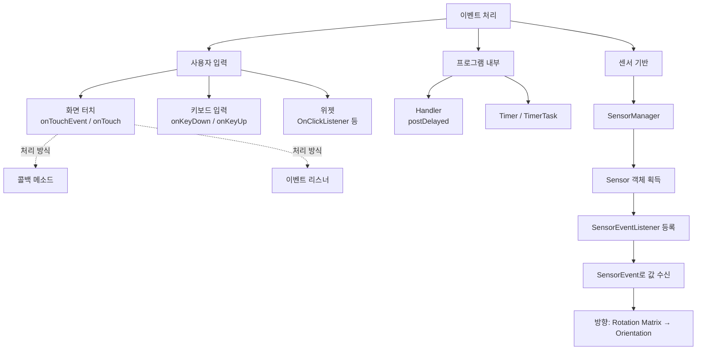

# 10. 모바일앱프로그래밍: 이벤트 처리 2 (터치·키·위젯·타이머·센서)

## 🔗 선수 지식 (Prerequisites)
- [ ] **필수**: 이벤트 처리 1 (콜백 메소드 vs 이벤트 리스너의 기본 개념) - 이해 완료?
- [ ] **필수**: View 계층 구조와 액티비티 생명주기
- [ ] **권장**: 익명 클래스 / 인터페이스 구현 (Java)
- [ ] **권장**: 인텐트/메니페스트 권한 선언
- **관련 단원**: [9강. 이벤트 처리 1](9강.md), [4강. 위젯과 레이아웃](4강.md)

---

## 학습 목표
1. 사용자에 의해 발생하는 **화면 터치 이벤트, 키보드 입력 이벤트, 위젯 이벤트**의 처리 방법을 이해하고 코드로 구현할 수 있다.
2. 프로그램 내에서 발생하는 **타이머 이벤트**의 처리 방법을 이해하고 Handler/Timer 기반으로 구현할 수 있다.
3. **센서에 의해 발생하는 방향 이벤트(가속도·자기장 → Orientation)**의 처리 방법을 이해하고 `SensorManager`/`SensorEventListener`로 구현할 수 있다.

---

## 🧠 메타인지 체크 (학습 전/후 자기 평가)

### 학습 전 자기 평가
| 소주제 | 자신감 (1-5) |
| :--- | :--- |
| 터치 이벤트 (onTouchEvent vs OnTouchListener.onTouch) | |
| 키 이벤트 (onKeyDown / KeyEvent.getAction) | |
| 타이머·핸들러 (Handler/postDelayed/Timer) | |
| 센서 이벤트 (SensorManager/SensorEventListener) | |

### 학습 후 교정 (학습 완료 후 작성)
| 소주제 | 학습 전 | 학습 후 | 실제 정답률 | 과신/과소 여부 |
| :--- | :--- | :--- | :--- | :--- |
| 터치 이벤트 | | | | |
| 키 이벤트 | | | | |
| 타이머·핸들러 | | | | |
| 센서 이벤트 | | | | |

> **활용법**: 학습 전 1분 → 자신감 기입, 학습 후 1분 → 나머지 기입. "과신" 영역이 실제 취약점.

---

## 📝 요약 (Summary)
1.  🔴 **콜백 메소드**: 특정 이벤트가 발생했을 때 시스템에 의해 자동으로 호출되는 메소드. (예: `onTouchEvent()`, `onKeyDown()`) → 뷰를 상속받아 오버라이딩하는 방식.
2.  🔴 **이벤트 리스너**: 특정 이벤트를 처리하는 인터페이스이며, 이벤트 발생 여부를 기다리고 있는 객체. (예: `View.OnTouchListener`, `View.OnClickListener`) → `setOnXxxListener()`로 등록.
3.  🟡 **이벤트**: 웹 페이지/화면에서 일어나는 하나의 행위를 다루는 것으로서, 링크를 클릭하거나 텍스트 영역의 값을 바꾼다든가 하는 것들을 말함.
4.  🟡 **이벤트 핸들러 / 핸들러**: 다른 객체들이 보낸 메시지를 받고 이를 처리하는 객체. (안드로이드에서는 `android.os.Handler`가 스레드 간 메시지 큐 처리를 담당)
5.  🟢 **익명 클래스**: 일회용 객체를 한 번만 만들고 끝낼 때 사용함. 이벤트 처리할 때 사용함.
6.  🔴 **화면 터치 이벤트**: `boolean onTouchEvent(MotionEvent event)` (콜백) 또는 `boolean onTouch(View v, MotionEvent event)` (리스너 핸들러)로 처리. → `MotionEvent.getAction()`으로 ACTION_DOWN/MOVE/UP 구분.
7.  🔴 **키보드 입력 이벤트**: `boolean onKeyDown(int keyCode, KeyEvent event)` 콜백 메소드가 처리. → `KeyEvent.getAction()`은 `ACTION_DOWN/UP/MULTIPLE` 3가지.
    > 📌 **각주**: `ACTION_MULTIPLE`은 현재 **deprecated** 상태다(원래 `KEYCODE_UNKNOWN`과 함께 단일 KeyEvent로 표현 불가능한 복합 문자열을 전달하기 위한 전용 액션이었음). 기출 보기상으로는 여전히 "3종"으로 다루지만, 최신 API에서는 사용이 권장되지 않는다. [근거: Android KeyEvent#ACTION_MULTIPLE](https://developer.android.com/reference/android/view/KeyEvent#ACTION_MULTIPLE)
8.  🟡 **센서 사용을 위한 클래스 및 인터페이스** `→←9강`
    - (1) **`SensorManager` 클래스**: 센서에 접근하게 해 줄 수 있는 메소드들을 제공함.
    - (2) **`Sensor` 클래스**: `SensorManager` 클래스의 메소드를 활용해 접근하고자 하는 센서의 객체를 선언함.
    - (3) **`SensorEventListener` 인터페이스**: 센서값이 변경되면 `SensorManager`를 통해 이벤트 형태로 변경된 센서값을 전달받을 수 있게 함.
    - (4) **`SensorEvent` 클래스**: 센서에 대한 정보를 담고 있고 객체를 통해 센서값들을 획득할 수 있으며, 이를 통해 센서값에 접근할 수 있음.

---

## 🧩 핵심 문법 및 패턴 (Key Patterns)

| 패턴명 | 코드 (요지) | 용도 |
| :--- | :--- | :--- |
| **터치 콜백** | `@Override public boolean onTouchEvent(MotionEvent e){ ... return true; }` | 액티비티/뷰 전체의 터치 이벤트 처리 |
| **터치 리스너** | `view.setOnTouchListener(new View.OnTouchListener(){ public boolean onTouch(View v, MotionEvent e){...}});` | 특정 뷰만 터치 처리 (가장 표준적) |
| **MotionEvent 액션** | `int act = e.getAction() & MotionEvent.ACTION_MASK;` | ACTION_DOWN/MOVE/UP/POINTER_DOWN 구분 |
| **키 콜백** | `@Override public boolean onKeyDown(int kc, KeyEvent e){ if(kc==KeyEvent.KEYCODE_BACK)...; return super.onKeyDown(kc,e);}` | 하드웨어/소프트 키 입력 감지 |
| **KeyEvent 액션** | `ACTION_DOWN`, `ACTION_UP`, `ACTION_MULTIPLE` (3종) | 키 입력의 시작/종료/반복 구분 |
| **위젯 클릭 리스너** | `btn.setOnClickListener(v -> {...});` | 버튼·체크박스·라디오 등 위젯 이벤트 |
| **Handler 타이머** | `handler.postDelayed(runnable, 1000);` | UI 스레드에서 일정 시간 후 작업 실행 |
| **java.util.Timer** | `new Timer().schedule(new TimerTask(){...}, delay, period);` | 백그라운드 주기 작업 (UI 갱신은 `runOnUiThread`) |
| **센서 등록** | `sm.registerListener(this, sensor, SensorManager.SENSOR_DELAY_NORMAL);` | 센서 이벤트 구독 시작 |
| **센서 해제** | `sm.unregisterListener(this);` | `onPause()`에서 반드시 호출 (배터리/누수 방지) |
| **방향 계산** | `SensorManager.getRotationMatrix(R,I,accel,mag); SensorManager.getOrientation(R,orient);` | 가속도+자기장 → azimuth/pitch/roll |

### 주요 정의/원리

**터치 이벤트 처리 두 가지 길**

| 방식 | 시그니처 | 반환 의미 |
| :--- | :--- | :--- |
| 콜백 (Override) | `boolean onTouchEvent(MotionEvent e)` | `true`면 이벤트 소비, `false`면 부모로 전달 |
| 리스너 (Implement) | `boolean onTouch(View v, MotionEvent e)` | 동일 — 단, 등록된 리스너가 먼저 호출됨 |

> **직관적 해석**: 콜백은 "내가 직접 받겠다(상속)", 리스너는 "남에게 처리를 위임한다(컴포지션)". `onTouch()`가 `true`를 반환하면 콜백 `onTouchEvent()`는 호출되지 않는다.
> **AI 적용**: 제스처 기반 라벨링 도구(ML 데이터셋 수집), 모바일 ML 추론 트리거(촬영 버튼), 센서 입력을 활용한 활동 인식(HAR, Human Activity Recognition).

---

## 📊 개념 시각화 (Visual Guide)

### 이벤트 처리 분류 체계도


### 핵심 도식: 액션 상수 비교
| 분류 | 입력 시작 | 입력 종료 | 반복/취소 | 비고 |
| :--- | :--- | :--- | :--- | :--- |
| **MotionEvent (터치)** | `ACTION_DOWN` | `ACTION_UP` | `ACTION_MOVE`, `ACTION_CANCEL` | 멀티터치: `ACTION_POINTER_DOWN/UP` |
| **KeyEvent (키)** | `ACTION_DOWN` | `ACTION_UP` | `ACTION_MULTIPLE` | 총 3종만 존재 (CANCEL 없음) |

---

## ✏️ 심화 학습 (Study Subject)

### 1. 가상 시나리오: "어떤 이벤트 처리 방식을, 언제 사용해야 할까?"
- **상황**: 모바일에서 사용자의 걸음 수를 감지하고, 화면을 두 번 탭(double tap)하면 기록을 일시정지하며, 일정 시간(예: 10초)마다 서버에 자동 업로드해야 한다.
- **문제**: 어떤 이벤트(터치/타이머/센서)를, 어떤 방식(콜백/리스너/`Handler`)으로 결합해야 할까?
- **해결**:
    1. **걸음 감지** → `Sensor.TYPE_STEP_DETECTOR`를 `SensorEventListener.onSensorChanged()`로 구독.
    2. **더블 탭** → `GestureDetector`를 만들고, `View.OnTouchListener.onTouch()`에서 `gestureDetector.onTouchEvent(e)`로 위임.
    3. **주기 업로드** → `Handler.postDelayed(this, 10_000)`를 `Runnable` 내에서 재귀 호출(self-rescheduling).
    4. 액티비티 `onPause()`에서 `unregisterListener()` + `handler.removeCallbacks()` → 리소스 누수 방지.
- **AI 학습 포인트**: "센서 데이터(가속도 3축)를 100ms 윈도우로 잘라 sklearn으로 활동(걷기/뛰기/정지)을 분류하려면, 어느 시점에서 `SensorEvent.values`를 큐에 넣고, 어디서 모델을 호출해야 UI 스레드를 막지 않을까?"

### 2. 관점별 비교 및 오개념 분석
- **핵심 비교**: "콜백 메소드 vs 이벤트 리스너" / "onTouchEvent vs onTouch" / "ACTION_CANCEL은 어디에 있나?"
- **오개념 분석**:
    - **오개념 1**: "`KeyEvent.getAction()`은 `ACTION_CANCEL`을 반환할 수 있다."
    - **분석**: ❌ 틀림. `KeyEvent`의 action은 `ACTION_DOWN`, `ACTION_UP`, `ACTION_MULTIPLE` **3가지뿐**이다. `ACTION_CANCEL`은 `MotionEvent`(터치)에만 존재한다. → 본 강의 핵심 함정 (Q1 기출 참고).
    - **오개념 2**: "`onTouchEvent()`가 리스너의 핸들러 메소드이다."
    - **분석**: ❌ `onTouchEvent()`는 **콜백 메소드**다. 리스너의 핸들러는 `View.OnTouchListener.onTouch()`이다 (Q2 기출 참고).
    - **오개념 3**: "`Timer`로 UI를 직접 수정해도 된다."
    - **분석**: ❌ `Timer`/`TimerTask`는 별도 백그라운드 스레드에서 실행되므로, UI 수정 시 `CalledFromWrongThreadException`이 발생한다. 반드시 `runOnUiThread()` 또는 `Handler`로 메인 스레드로 전달해야 한다.
- **AI 학습 포인트**: "안드로이드 `KeyEvent`에 `ACTION_CANCEL`이 없는 이유를 입력 메커니즘 관점에서 설명해 줘. 또 `MotionEvent`에는 왜 필요한지 비교해 줘."

---

## ❓ 연습 문제 및 해설

> **블룸 인지 수준 범례**: [기억] 정의·나열 → [이해] 설명·비교 → [적용] 계산·구현 → [분석] 구별·디버그 → [평가] 판단·비평 → [창조] 설계·제안

### 📝 문제

**1. ⭐ [기억] 📎 기출 `getAction` 메소드에 해당하지 않는 것은?**[(해설)](#prob-1)
   > ① ACTION_UP : 키를 뗐다.
   > ② ACTION_DOWN : 키를 눌렀다.
   > ③ ACTION_CANCEL : 키 입력을 취소한다.
   > ④ ACTION_MULTIPLE : 같은 키를 여러 번 눌렀다.

<br>

**2. ⭐ [기억] 📎 기출 다음 중 화면 터치 이벤트 처리를 위한 리스너의 핸들러 메소드는?**[(해설)](#prob-2)
   > ① onTouchEvent
   > ② onTouch
   > ③ get_ACTION
   > ④ get_MotionEvent

<br>

**3. ⭐⭐ [이해] 📌 콜백 메소드와 이벤트 리스너의 차이로 옳지 않은 것은?**[(해설)](#prob-3)
   > ① 콜백 메소드는 뷰를 상속받아 오버라이딩하는 방식이다.
   > ② 이벤트 리스너는 `setOnXxxListener()`로 등록한다.
   > ③ 콜백 메소드와 리스너는 같은 뷰에 동시에 적용될 수 없다.
   > ④ 둘 다 시스템에 의해 자동으로 호출된다.

<br>

**4. ⭐⭐ [적용] 📌 다음 코드의 빈칸 ⓐ, ⓑ에 들어갈 코드로 옳은 것은?**[(해설)](#prob-4)
   > ```java
   > button.setOnClickListener(new ⓐ {
   >     @Override
   >     public void ⓑ {
   >         Toast.makeText(MainActivity.this, "클릭!", Toast.LENGTH_SHORT).show();
   >     }
   > });
   > ```
   > ① ⓐ `View.OnClickListener()` / ⓑ `onClick(View v)`
   > ② ⓐ `View.OnTouchListener()` / ⓑ `onTouch(View v, MotionEvent e)`
   > ③ ⓐ `OnClickListener` / ⓑ `onClickEvent()`
   > ④ ⓐ `ClickListener()` / ⓑ `click(View v)`

<br>

**5. ⭐⭐ [분석] 📌 안드로이드의 `Timer`로 1초마다 TextView를 갱신하는 코드를 작성했더니 `CalledFromWrongThreadException`이 발생했다. 가장 적절한 해결책은?**[(해설)](#prob-5)
   > <보기>
   >
   > 가. `runOnUiThread { textView.setText(...) }`로 감싼다.
   > 나. `Handler(Looper.getMainLooper()).post { ... }`로 감싼다.
   > 다. `TimerTask`의 `run()` 안에서 `Thread.sleep()`을 호출한다.
   > 라. `TimerTask` 대신 `Handler.postDelayed()`로 재귀 스케줄링한다.

   > ① 가, 다
   > ② 가, 나, 라
   > ③ 가, 나, 다
   > ④ 가, 다, 라

<br>

**6. ⭐⭐⭐ [평가/창조] 📌 센서 기반 방향 측정 앱을 구현하려고 한다. (1) 사용해야 하는 핵심 클래스/인터페이스 4종을 나열하고, (2) `onResume()`/`onPause()`에서 각각 어떤 처리를 해야 하는지 이유와 함께 설명하시오.**[(해설)](#prob-6)

---

### 🔑 정답 및 해설 (먼저 풀어본 후 펼치기)

<details>
<summary>정답 보기 (클릭)</summary>

1. ③
2. ②
3. ④
4. ①
5. ②
6. 풀이형 정답 (해설 참조)

</details>

<details>
<summary>해설 보기 (클릭)</summary>

<a id="prob-1"></a>
**1. ⭐ [기억] 📎 기출 `getAction` 메소드에 해당하지 않는 것은?**
> **정답: ③ ACTION_CANCEL : 키 입력을 취소한다.**
> **해설**: `KeyEvent.getAction()`은 `ACTION_DOWN`, `ACTION_UP`, `ACTION_MULTIPLE` 3가지만 존재한다. `ACTION_CANCEL`은 `MotionEvent`(터치)에서만 정의된다. ①②④는 각각 키 뗌/누름/반복으로 정확한 설명이다.
> 📌 **보강**: ④ `ACTION_MULTIPLE`을 "같은 키를 여러 번 눌렀다"로 푸는 것은 기출 보기 수준의 표현이며, 정확히는 **동일 키의 반복 또는 (KEYCODE_UNKNOWN을 통한) 복합 문자열 전달**을 의미한다. 실제 "키 반복" 처리는 보통 `ACTION_DOWN` + `event.getRepeatCount()`(0보다 크면 반복) 조합으로 구분하며, `ACTION_MULTIPLE` 자체는 현재 deprecated다.

<a id="prob-2"></a>
**2. ⭐ [기억] 📎 기출 다음 중 화면 터치 이벤트 처리를 위한 리스너의 핸들러 메소드는?**
> **정답: ② onTouch**
> **해설**: 터치 이벤트 리스너 인터페이스는 `View.OnTouchListener`이며, 그 안의 추상 핸들러 메소드는 `onTouch(View v, MotionEvent e)`이다. ① `onTouchEvent()`는 콜백 메소드(View/Activity 상속·오버라이드 방식)이지 리스너 핸들러가 아니다. ③④는 안드로이드 표준 API에 존재하지 않는다.

<a id="prob-3"></a>
**3. ⭐⭐ [이해] 📌 콜백 vs 리스너**
> **정답: ④ 둘 다 시스템에 의해 자동으로 호출된다.**
> **해설**: 콜백 메소드는 시스템이 직접 호출하지만, 리스너는 개발자가 `setOnXxxListener()`로 등록해야 호출된다. 즉 리스너는 "등록"이라는 사전 단계가 필요하므로 "둘 다 자동"은 부정확하다. ③ 콜백과 리스너가 같은 뷰에 모두 있으면, 일반적으로 리스너의 `onTouch()`가 먼저 호출되고 `true`를 반환하면 콜백은 호출되지 않는다(공존은 가능하나 우선순위 존재).

<a id="prob-4"></a>
**4. ⭐⭐ [적용] 익명 클래스 패턴**
> **정답: ① ⓐ `View.OnClickListener()` / ⓑ `onClick(View v)`**
> **해설**: 버튼 클릭 리스너의 인터페이스는 `View.OnClickListener`이며, 추상 메소드 시그니처는 `void onClick(View v)`이다. 익명 클래스로 일회용 객체를 만들어 `setOnClickListener()`에 전달하는 전형적인 패턴.

<a id="prob-5"></a>
**5. ⭐⭐ [분석] 스레드 위반 디버깅**
> **정답: ② 가, 나, 라**
> **해설**: `Timer`/`TimerTask`는 워커 스레드에서 실행되므로 UI를 직접 수정하면 예외가 발생한다.
> - 가. `runOnUiThread {}` ✅
> - 나. 메인 루퍼 `Handler` ✅
> - 다. `Thread.sleep()`은 스레드 문제와 무관, 오답.
> - 라. `Handler.postDelayed()`는 메인 스레드 큐에서 실행되므로 ✅

<a id="prob-6"></a>
**6. ⭐⭐⭐ [평가/창조] 센서 방향 앱 설계**
> **정답 (풀이형)**:
>
> **(1) 핵심 클래스/인터페이스 4종**
> | # | 이름 | 역할 |
> | :--- | :--- | :--- |
> | ① | `SensorManager` 클래스 | 시스템 서비스로부터 센서 접근 메소드 제공 (`getSystemService(SENSOR_SERVICE)`) |
> | ② | `Sensor` 클래스 | 사용할 센서 객체 (`getDefaultSensor(TYPE_ACCELEROMETER)` 등) |
> | ③ | `SensorEventListener` 인터페이스 | `onSensorChanged()`, `onAccuracyChanged()` 구현 |
> | ④ | `SensorEvent` 클래스 | 콜백 인자, `values[]`로 실제 센서값 획득 |
>
> **(2) 생명주기 처리**
> - `onResume()`: `sensorManager.registerListener(this, sensor, SENSOR_DELAY_UI)` — 액티비티가 사용자에게 보일 때만 센서 구독을 시작해 **배터리 소모를 최소화**.
> - `onPause()`: `sensorManager.unregisterListener(this)` — 화면이 가려진 뒤에도 센서가 계속 동작하면 배터리/메모리 누수가 발생하고, 백그라운드에서도 콜백이 호출되어 NPE 위험이 있음.
>
> 방향(orientation)은 단일 센서가 아닌, 가속도 + 자기장 두 센서를 합성해야 한다: `getRotationMatrix(R, I, accel, mag)` → `getOrientation(R, orient)`로 azimuth/pitch/roll(radian)을 얻는다.

</details>

---

## ✅ O/X 확인문제 (연습문항 개수의 2배 권장)

**1.** `KeyEvent.getAction()`은 `ACTION_DOWN`, `ACTION_UP`, `ACTION_MULTIPLE`, `ACTION_CANCEL` 4가지 값 중 하나를 반환한다. [(해설)](#ox-1) **(O / X)**
**2.** `View.OnTouchListener`의 핸들러 메소드는 `onTouch(View v, MotionEvent e)`이다. [(해설)](#ox-2) **(O / X)**
**3.** 콜백 메소드 `onTouchEvent()`와 리스너 `onTouch()`가 같은 뷰에 모두 정의되어 있으면, `onTouchEvent()`가 먼저 호출된다. [(해설)](#ox-3) **(O / X)**
**4.** `MotionEvent.ACTION_MASK`는 멀티터치 상황에서 포인터 인덱스를 제거하고 순수 액션 코드를 얻기 위해 사용된다. [(해설)](#ox-4) **(O / X)**
**5.** 익명 클래스는 일회용 객체를 만들 때 사용하며 이벤트 처리에 자주 쓰인다. [(해설)](#ox-5) **(O / X)**
**6.** `java.util.Timer`의 `TimerTask.run()` 내부에서 직접 `TextView.setText()`를 호출해도 안전하다. [(해설)](#ox-6) **(O / X)**
**7.** `android.os.Handler.postDelayed()`로 등록한 `Runnable`은 메인(UI) 스레드의 메시지 큐에서 실행된다. [(해설)](#ox-7) **(O / X)**
**8.** `SensorEventListener`는 `onSensorChanged()`와 `onAccuracyChanged()` 두 메소드를 모두 구현해야 한다. [(해설)](#ox-8) **(O / X)**
**9.** 액티비티 `onPause()`에서 `unregisterListener()`를 호출하지 않으면 배터리/메모리 누수가 발생할 수 있다. [(해설)](#ox-9) **(O / X)**
**10.** 안드로이드에서 방향(orientation) 값을 얻는 가장 권장되는 방법은 가속도 센서와 자기장 센서를 합성하여 `getRotationMatrix()` → `getOrientation()`을 사용하는 것이다. [(해설)](#ox-10) **(O / X)**
**11.** 버튼의 클릭 이벤트는 콜백 메소드 `onClickEvent()`로 처리한다. [(해설)](#ox-11) **(O / X)**
**12.** 리스너의 `onTouch()`가 `true`를 반환하면 같은 뷰의 콜백 `onTouchEvent()`는 호출되지 않는다. [(해설)](#ox-12) **(O / X)**

<details>
<summary>O/X 정답 및 해설 보기 (클릭)</summary>

> <a id="ox-1"></a>
> **1. 정답**: X
> **해설**: `ACTION_CANCEL`은 `MotionEvent`에만 존재하며, `KeyEvent`는 DOWN/UP/MULTIPLE 3가지뿐이다.

> <a id="ox-2"></a>
> **2. 정답**: O
> **해설**: 표준 시그니처. 리스너 인터페이스: `View.OnTouchListener`, 핸들러: `onTouch()`.

> <a id="ox-3"></a>
> **3. 정답**: X
> **해설**: 리스너의 `onTouch()`가 **먼저** 호출되며, `true`를 반환하면 콜백 `onTouchEvent()`는 호출되지 않는다.

> <a id="ox-4"></a>
> **4. 정답**: O
> **해설**: `e.getAction() & MotionEvent.ACTION_MASK`로 포인터 인덱스 비트를 제거해 순수 액션을 얻는다. (`getActionMasked()`도 동일 결과)

> <a id="ox-5"></a>
> **5. 정답**: O
> **해설**: 원본 정리 그대로. 익명 클래스는 이벤트 처리 시 일회용 객체에 자주 사용.

> <a id="ox-6"></a>
> **6. 정답**: X
> **해설**: `TimerTask`는 워커 스레드에서 실행되므로 직접 UI 수정 시 `CalledFromWrongThreadException` 발생. `runOnUiThread()` 또는 `Handler` 사용 필수.

> <a id="ox-7"></a>
> **7. 정답**: O
> **해설**: 기본 생성자 `new Handler()`(deprecated)나 `new Handler(Looper.getMainLooper())`는 메인 루퍼와 연결되므로 UI 스레드에서 실행된다.

> <a id="ox-8"></a>
> **8. 정답**: O
> **해설**: 인터페이스이므로 두 추상 메소드 모두 구현 필수. (Java 8 default 없음)

> <a id="ox-9"></a>
> **9. 정답**: O
> **해설**: 백그라운드에서도 센서가 계속 동작 → 배터리 소모 + 액티비티 참조 누수 위험.

> <a id="ox-10"></a>
> **10. 정답**: O
> **해설**: `Sensor.TYPE_ORIENTATION`은 deprecated. 가속도+자기장 합성이 표준 권장 방법.

> <a id="ox-11"></a>
> **11. 정답**: X
> **해설**: 표준 안드로이드 API에 `onClickEvent()`라는 메소드는 없다. 클릭은 보통 `View.OnClickListener.onClick()`(리스너 방식)으로 처리한다.

> <a id="ox-12"></a>
> **12. 정답**: O
> **해설**: 이벤트 디스패치 규약. 리스너가 이벤트를 "소비"하면 콜백 체인은 멈춘다.

</details>

---

## 🧪 자유 회상 연습 (Free Recall)

> **방법**: 위의 노트를 모두 덮고, 타이머 3분 설정 후 이번 단원에서 배운 내용을 기억나는 대로 자유롭게 적으세요.
> 정확한 문장이 아니어도 됩니다. 키워드, 패턴, 관계 등 떠오르는 것을 모두 적습니다.

**자유 회상 작성란:**

```
[여기에 기억나는 내용을 자유롭게 작성]


```

> **회상 후 점검**: 노트를 다시 펼쳐 빠뜨린 내용을 확인하세요. 빠뜨린 부분이 실제 취약점입니다.
> - 회상 못한 핵심 개념: [                ]
> - 회상 못한 코드 패턴: [                ]

---

## 💻 코드로 확인하기 (Code Verification)

### (1) 터치 + 키 + 위젯 + 타이머 통합 예시 (Java, MainActivity)

```java
package com.example.eventdemo;

import android.os.Bundle;
import android.os.Handler;
import android.os.Looper;
import android.view.KeyEvent;
import android.view.MotionEvent;
import android.view.View;
import android.widget.Button;
import android.widget.TextView;
import androidx.appcompat.app.AppCompatActivity;

public class MainActivity extends AppCompatActivity {

    private TextView tvLog;
    private final Handler handler = new Handler(Looper.getMainLooper());
    private int tick = 0;

    private final Runnable timerRunnable = new Runnable() {
        @Override public void run() {
            tvLog.append("\n[Timer] tick=" + (++tick));
            handler.postDelayed(this, 1000); // 1초마다 재스케줄
        }
    };

    @Override protected void onCreate(Bundle b) {
        super.onCreate(b);
        setContentView(R.layout.activity_main);

        tvLog = findViewById(R.id.tvLog);
        Button btn = findViewById(R.id.btnClick);

        // [1] 위젯 이벤트 - 리스너 방식 (익명 클래스)
        btn.setOnClickListener(new View.OnClickListener() {
            @Override public void onClick(View v) {
                tvLog.append("\n[Click] 버튼 클릭");
            }
        });

        // [2] 화면 터치 - 리스너 방식
        tvLog.setOnTouchListener(new View.OnTouchListener() {
            @Override public boolean onTouch(View v, MotionEvent e) {
                int act = e.getAction() & MotionEvent.ACTION_MASK;
                String name = (act == MotionEvent.ACTION_DOWN) ? "DOWN"
                            : (act == MotionEvent.ACTION_MOVE) ? "MOVE"
                            : (act == MotionEvent.ACTION_UP)   ? "UP"
                            : "OTHER(" + act + ")";
                tvLog.append("\n[Touch-Listener] " + name
                        + " (" + (int)e.getX() + "," + (int)e.getY() + ")");
                return true; // 소비 → 콜백 onTouchEvent는 호출 안 됨
            }
        });

        // [4] 타이머 시작
        handler.postDelayed(timerRunnable, 1000);
    }

    // [2'] 화면 터치 - 콜백 방식 (액티비티 전체)
    @Override public boolean onTouchEvent(MotionEvent e) {
        tvLog.append("\n[Touch-Callback] action=" + e.getActionMasked());
        return super.onTouchEvent(e);
    }

    // [3] 키 입력 - 콜백 방식
    @Override public boolean onKeyDown(int keyCode, KeyEvent event) {
        tvLog.append("\n[Key] keyCode=" + keyCode
                + " action=" + event.getAction()); // 0=DOWN, 1=UP, 2=MULTIPLE
        return super.onKeyDown(keyCode, event);
    }

    @Override protected void onDestroy() {
        super.onDestroy();
        handler.removeCallbacks(timerRunnable); // 누수 방지
    }
}
```

> **실행 결과 (예상)**:
> ```
> [Click] 버튼 클릭
> [Touch-Listener] DOWN (320,540)
> [Touch-Listener] UP (320,540)
> [Timer] tick=1
> [Timer] tick=2
> [Key] keyCode=4 action=0    ← 백 키 DOWN
> ```
> **해석**: 터치 리스너가 `true`를 반환했기 때문에 `onTouchEvent()` 콜백 로그는 찍히지 않는다. 타이머는 1초마다 UI 스레드에서 안전하게 갱신된다.

### (2) 센서 방향 이벤트 예시

```java
package com.example.sensordemo;

import android.app.Activity;
import android.hardware.*;
import android.os.Bundle;
import android.widget.TextView;

public class OrientationActivity extends Activity implements SensorEventListener {

    private SensorManager sm;
    private Sensor accel, mag;
    private final float[] accelV = new float[3];
    private final float[] magV   = new float[3];
    private final float[] R = new float[9], I = new float[9];
    private final float[] orient = new float[3];
    private TextView tv;

    @Override protected void onCreate(Bundle b) {
        super.onCreate(b);
        tv = new TextView(this); setContentView(tv);
        sm    = (SensorManager) getSystemService(SENSOR_SERVICE);
        accel = sm.getDefaultSensor(Sensor.TYPE_ACCELEROMETER);
        mag   = sm.getDefaultSensor(Sensor.TYPE_MAGNETIC_FIELD);
    }

    @Override protected void onResume() {
        super.onResume();
        sm.registerListener(this, accel, SensorManager.SENSOR_DELAY_UI);
        sm.registerListener(this, mag,   SensorManager.SENSOR_DELAY_UI);
    }

    @Override protected void onPause() {
        super.onPause();
        sm.unregisterListener(this); // 배터리/누수 방지
    }

    @Override public void onSensorChanged(SensorEvent e) {
        if (e.sensor.getType() == Sensor.TYPE_ACCELEROMETER)
            System.arraycopy(e.values, 0, accelV, 0, 3);
        else if (e.sensor.getType() == Sensor.TYPE_MAGNETIC_FIELD)
            System.arraycopy(e.values, 0, magV, 0, 3);

        if (SensorManager.getRotationMatrix(R, I, accelV, magV)) {
            SensorManager.getOrientation(R, orient);
            double azimuth = Math.toDegrees(orient[0]);
            double pitch   = Math.toDegrees(orient[1]);
            double roll    = Math.toDegrees(orient[2]);
            tv.setText(String.format("azimuth=%.1f° pitch=%.1f° roll=%.1f°",
                    azimuth, pitch, roll));
        }
    }
    @Override public void onAccuracyChanged(Sensor s, int acc) { /* no-op */ }
}
```

> **실행 결과 (예상)**: `azimuth=12.3° pitch=-2.1° roll=0.8°` 와 같이 단말기 방위·기울기 실시간 표시.
> **해석**: `onResume()`에서 두 센서를 등록 → `onSensorChanged()`에서 가속도+자기장으로 회전 행렬을 계산 → 방향 벡터(라디안)를 도(°) 단위로 변환. `onPause()`에서 반드시 해제하여 누수 방지.

---

## 🤖 AI 연결고리 (Concept → AI Application)

| 강의 개념 | AI/ML 적용 분야 | 구체적 사례 |
| :--- | :--- | :--- |
| 화면 터치 이벤트 | 데이터 라벨링 UI, 모바일 추론 트리거 | "탭으로 객체 선택 → 세그멘테이션 라벨 생성" (예: SAM 모바일 데모) |
| 키보드 입력 이벤트 | 텍스트 입력 기반 NLP 어시스턴트 | 입력어 자동완성/오타교정 (BERT-tiny on-device) |
| 위젯(버튼) 이벤트 | 액티브 러닝 인터페이스 | "이 예측이 맞나요? Yes/No" 버튼으로 라벨 수집 → 재학습 |
| 타이머/핸들러 | 주기적 추론, 시계열 윈도잉 | 100ms마다 센서 프레임 묶어 활동분류 모델에 투입 |
| 센서(가속도/자기장) | 활동 인식(HAR), 보행 분석, AR 방위 | TensorFlow Lite로 걷기/뛰기/계단 오르기 분류 |

---

## 📖 심화 학습 예시 답안

#### 1. 안드로이드 이벤트 디스패치의 내부 동작 원리
View 트리에서 이벤트는 다음 순서로 흐른다.

1.  **dispatchTouchEvent(MotionEvent)** — 액티비티 → 윈도우 → ViewGroup 루트로 전달.
2.  **onInterceptTouchEvent()** — `ViewGroup`이 자식에게 내려보낼지, 자기가 가로챌지 결정.
3.  **자식 View의 dispatchTouchEvent()** → 등록된 **OnTouchListener.onTouch()** 호출.
    - `onTouch()`가 `true` 반환 → 이벤트 소비, 종료.
    - `false` 반환 → 동일 뷰의 **onTouchEvent()** 콜백 호출.
4.  자식이 소비하지 않으면 부모로 **버블링**.

> 즉, "리스너 우선, 콜백은 fallback"이 규칙이다.

#### 2. 콜백 메소드 vs 이벤트 리스너 비교표

| 구분 | 콜백 메소드 | 이벤트 리스너 | 비고 |
| :--- | :--- | :--- | :--- |
| **정의** | `View`/`Activity` 상속 후 `onTouchEvent()` 등 오버라이드 | `View.OnTouchListener` 등 인터페이스 구현, `setOnXxxListener()`로 등록 | |
| **결합도** | 상속(IS-A) — 강결합 | 컴포지션(HAS-A) — 약결합 | 리스너가 재사용·테스트 용이 |
| **호출 순서** | 리스너 다음(보충) | 먼저 호출 | 리스너 `true` 반환 시 콜백 스킵 |
| **사용 시점** | 커스텀 View 전체 동작 정의 시 | 표준 View에 동작만 붙일 때 | |
| **AI 활용** | 커스텀 캔버스에 손그림 기록 → ML 입력 | 버튼 클릭으로 추론 트리거 | |

#### 3. 센서 이벤트 처리 Best Practice

- **Bad Practice (나쁜 예시)**
  ```java
  // ❌ 액티비티 onCreate에서 등록만 하고 해제 안 함
  @Override protected void onCreate(Bundle b) {
      super.onCreate(b);
      sm.registerListener(this, accel, SensorManager.SENSOR_DELAY_FASTEST);
      // onPause/onDestroy에서 unregister 누락 → 배터리·메모리 누수
  }
  ```
- **Good Practice (좋은 예시)**
  ```java
  @Override protected void onResume() {
      super.onResume();
      sm.registerListener(this, accel, SensorManager.SENSOR_DELAY_UI); // 필요한 만큼만
  }
  @Override protected void onPause() {
      super.onPause();
      sm.unregisterListener(this); // 반드시 해제
  }
  ```
- **설명**: (i) 등록은 `onResume()`, 해제는 `onPause()`에서 — 액티비티 가시성 생명주기에 정확히 동기화. (ii) `SENSOR_DELAY_FASTEST`는 배터리를 급격히 소모하므로 UI 갱신 목적이면 `SENSOR_DELAY_UI`(약 60ms)가 적절. (iii) `unregisterListener(this)`로 모든 등록 해제(개별 센서별 해제도 가능).

---

## 🟢 [심층] Lifecycle-aware 등록/해제 · Coroutine Flow 센서 스트림 (리서치 확장)

> 본문(터치·키·타이머·센서)의 수동 등록/해제(onResume/onPause) 패턴을 Jetpack 생명주기·코루틴으로 현대화한다. 공식 문서 검증.

### 1) DefaultLifecycleObserver로 자동 등록/해제

본문에서는 보통 `onResume()`에서 `registerListener`, `onPause()`에서 `unregisterListener`를 **수동**으로 호출한다.
이를 빠뜨리면 배터리 소모·메모리 누수가 생긴다. `DefaultLifecycleObserver`를 쓰면 등록/해제를 컴포넌트 안에 캡슐화하여 **자동화**할 수 있다.

```kotlin
class SensorController(
    private val context: Context
) : DefaultLifecycleObserver, SensorEventListener {

    private val sensorManager =
        context.getSystemService(Context.SENSOR_SERVICE) as SensorManager
    private val accel = sensorManager.getDefaultSensor(Sensor.TYPE_ACCELEROMETER)

    // onResume 시 자동 등록
    override fun onResume(owner: LifecycleOwner) {
        sensorManager.registerListener(this, accel, SensorManager.SENSOR_DELAY_UI)
    }

    // onPause 시 자동 해제
    override fun onPause(owner: LifecycleOwner) {
        sensorManager.unregisterListener(this)
    }

    override fun onSensorChanged(event: SensorEvent) { /* ... */ }
    override fun onAccuracyChanged(sensor: Sensor?, accuracy: Int) {}
}

// Activity/Fragment에서 한 줄로 연결
lifecycle.addObserver(SensorController(this))
```

- `DefaultLifecycleObserver`는 `onCreate/onStart/onResume/onPause/onStop/onDestroy(owner)` 기본 구현(빈 메서드)을 제공하므로 필요한 콜백만 오버라이드하면 된다.
- 장점: 생명주기 변화에 따라 등록/해제가 **선언적·자동**으로 일어나 onResume/onPause에 수동 코드를 흩뿌리지 않는다.
- 근거: https://developer.android.com/reference/androidx/lifecycle/DefaultLifecycleObserver , https://developer.android.com/topic/libraries/architecture/lifecycle

### 2) callbackFlow로 SensorEvent를 Flow 스트림화

콜백 기반의 `SensorEventListener`를 코루틴 `Flow`로 노출하면, 센서 데이터를 스트림 연산자(`map`, `filter`, `debounce` 등)로 다룰 수 있다. `callbackFlow`는 콜백 API를 Flow로 감싸는 빌더이며, `awaitClose`에서 **리스너 해제**를 보장한다.

```kotlin
fun SensorManager.sensorFlow(sensor: Sensor, rate: Int): Flow<SensorEvent> = callbackFlow {
    val listener = object : SensorEventListener {
        override fun onSensorChanged(event: SensorEvent) {
            trySend(event)              // 채널로 방출(논블로킹)
        }
        override fun onAccuracyChanged(s: Sensor?, accuracy: Int) {}
    }
    registerListener(listener, sensor, rate)

    // 수집이 취소되면 반드시 리스너 해제 (누수 방지)
    awaitClose { unregisterListener(listener) }
}
```

```kotlin
// 수집: lifecycleScope + repeatOnLifecycle 로 화면이 보일 때만 수집
lifecycleScope.launch {
    repeatOnLifecycle(Lifecycle.State.STARTED) {
        sensorManager.sensorFlow(accel, SensorManager.SENSOR_DELAY_UI)
            .collect { event -> updateUi(event.values) }
    }
}
```

- `callbackFlow`는 콜백 기반 API를 Flow로 변환할 때 쓰는 표준 빌더이고, `awaitClose { ... }`는 Flow가 닫힐 때(수집 취소 포함) 호출되어 **콜백 등록 해제 지점**을 제공한다. 미설정 시 `IllegalStateException`이 발생한다.
- `trySend`(과거 `offer`)는 버퍼로 논블로킹 방출을 시도한다.
- 근거: https://kotlinlang.org/api/kotlinx.coroutines/kotlinx-coroutines-core/kotlinx.coroutines.flow/callback-flow.html , `repeatOnLifecycle`: https://developer.android.com/topic/libraries/architecture/coroutines#restart

### 3) 수동 방식 vs Lifecycle/Flow 방식 비교

| 항목 | 수동(onResume/onPause) | Lifecycle/Flow |
|------|------------------------|----------------|
| 등록/해제 위치 | Activity 콜백에 분산 | 컴포넌트/Flow 내부에 캡슐화 |
| 해제 누락 위험 | 높음(버그·누수) | 낮음(awaitClose/Observer가 보장) |
| 데이터 가공 | 콜백 안에서 직접 | map/filter/debounce 등 연산자 |
| 재사용성 | 낮음 | 높음(확장 함수로 공유) |

---

## 📚 핵심 용어집 (Glossary)

| 용어 (한) | 용어 (영) | 코드/시그니처 | 정의 |
| :--- | :--- | :--- | :--- |
| **콜백 메소드** | Callback Method | `onTouchEvent(MotionEvent)` | 시스템이 자동으로 호출하는 오버라이드 메소드. `→←9강` |
| **이벤트 리스너** | Event Listener | `View.OnTouchListener` | 이벤트를 기다리는 인터페이스 객체. `→←9강` |
| **이벤트 핸들러** | Event Handler | `onTouch(View, MotionEvent)` | 리스너 인터페이스의 추상 메소드 구현체. |
| **익명 클래스** | Anonymous Class | `new OnClickListener(){...}` | 이름 없는 일회용 클래스. 이벤트 처리에 자주 사용. |
| **MotionEvent** | MotionEvent | `e.getAction() & ACTION_MASK` | 터치 이벤트 상세 정보 (좌표·액션·포인터). |
| **KeyEvent** | KeyEvent | `KeyEvent.ACTION_DOWN/UP/MULTIPLE` | 키 입력 이벤트. `ACTION_CANCEL` 없음. |
| **Handler** | Handler | `new Handler(Looper.getMainLooper())` | 스레드 간 메시지/Runnable 전달기. 주로 UI 스레드 갱신. |
| **Timer/TimerTask** | Timer | `new Timer().schedule(task, delay, period)` | 백그라운드 주기 작업. UI 갱신 시 `runOnUiThread` 필수. |
| **SensorManager** | SensorManager | `getSystemService(SENSOR_SERVICE)` | 센서 접근 게이트웨이 시스템 서비스. |
| **Sensor** | Sensor | `sm.getDefaultSensor(TYPE_ACCELEROMETER)` | 개별 센서 객체. |
| **SensorEventListener** | SensorEventListener | `onSensorChanged(SensorEvent)` | 센서값 변경을 받는 인터페이스. |
| **SensorEvent** | SensorEvent | `event.values[0..n]` | 센서 측정값을 담은 콜백 인자. |
| **방향(자세)** | Orientation | `getRotationMatrix` → `getOrientation` | azimuth·pitch·roll로 단말기 자세 표현. |

---

## 🤖 AI 학습 파트너를 위한 추가 자료

### 1. 개념 이해를 위한 심층 질문 프롬프트
> **프롬프트 예시**: "안드로이드의 이벤트 디스패치(dispatchTouchEvent → onInterceptTouchEvent → onTouchListener → onTouchEvent)가 왜 이런 단계로 설계되었는지, 만약 이 체인이 없었다면 어떤 문제가 생겼을지 사례와 함께 설명해 줘."

### 2. 문제 해결 능력 강화를 위한 시나리오 프롬프트
> **프롬프트 예시**: "당신은 모바일 AI 엔지니어다. 사용자의 보행 패턴을 가속도 센서로 100Hz로 수집해 5초 윈도우로 활동 분류(걷기/뛰기/정지)를 실시간 수행해야 한다. 센서 콜백, 큐잉, 추론 호출, UI 갱신을 각각 어떤 스레드/메커니즘(SensorEventListener, Handler, Coroutine, runOnUiThread)에서 처리하는 것이 적합한지 비교하고 추천안을 제시해 줘."

### 3. 코드 검증 프롬프트
> **프롬프트 예시**: "다음 코드는 `Timer`로 1초마다 `TextView`를 갱신한다.
> ```java
> new Timer().schedule(new TimerTask(){ public void run(){ tv.setText("..."); }}, 0, 1000);
> ```
> 1. 이 코드의 문제점을 지적하고,
> 2. `Handler.postDelayed()`와 `runOnUiThread()` 두 가지 방식으로 각각 올바르게 고쳐 줘.
> 3. 두 수정안의 성능·가독성 측면 차이도 설명해 줘."

---

## 🔄 복습 체크 (Spaced Repetition)
- [ ] 1일 후 복습 (날짜: 2026-05-30)
- [ ] 3일 후 복습 (날짜: 2026-06-01)
- [ ] 7일 후 복습 (날짜: 2026-06-05)
- [ ] 14일 후 복습 (날짜: 2026-06-12)
- [ ] 30일 후 복습 (날짜: 2026-06-28)

### 복습 시 자가 평가
| 회차 | 날짜 | 이해도 (1-5) | 취약 부분 메모 |
| :--- | :--- | :--- | :--- |
| 1차 | | | |
| 2차 | | | |
| 3차 | | | |

---

## 📚 참고 자료 (References)

- 교재: 한국방송통신대학교 『모바일앱프로그래밍』 10강. 이벤트 처리 2
- Android Developers: [Input events overview](https://developer.android.com/guide/topics/ui/ui-events)
- Android Developers: [Sensors overview / Compute device orientation](https://developer.android.com/guide/topics/sensors/sensors_overview)
- Android Developers: [Handler](https://developer.android.com/reference/android/os/Handler) / [Timer](https://developer.android.com/reference/java/util/Timer)
- 9강. 이벤트 처리 1 (콜백 vs 리스너 기본 개념)
