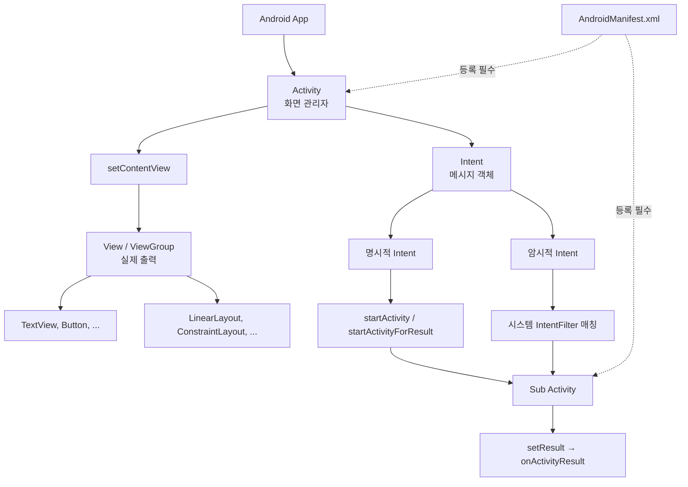

# 11. 모바일앱프로그래밍: 액티비티와 인텐트

## 🔗 선수 지식 (Prerequisites)
- [ ] **필수**: 액티비티 생명주기, View/ViewGroup 개념 - 이해 완료?
- [ ] **필수**: AndroidManifest.xml 구조 및 역할
- [ ] **권장**: 자바/코틀린 클래스와 객체, 콜백 메서드 개념
- **관련 단원**: [10강. 안드로이드 UI 기초](10강.md), [12강.md](12강.md)

---

## 학습 목표
1. 액티비티와 뷰의 관계를 이해한다.
2. 액티비티 호출을 위한 매니페스트 파일의 역할을 이해한다.
3. 액티비티간의 호출을 위한 인텐트의 사용 방법을 이해한다.

---

## 🧠 메타인지 체크 (학습 전/후 자기 평가)

### 학습 전 자기 평가
| 소주제 | 자신감 (1-5) |
| :--- | :--- |
| 액티비티와 뷰의 관계 | |
| 매니페스트 등록과 역할 | |
| 명시적/암시적 인텐트 구분과 사용법 | |

### 학습 후 교정 (학습 완료 후 작성)
| 소주제 | 학습 전 | 학습 후 | 실제 정답률 | 과신/과소 여부 |
| :--- | :--- | :--- | :--- | :--- |
| 액티비티와 뷰의 관계 | | | | |
| 매니페스트 등록과 역할 | | | | |
| 명시적/암시적 인텐트 구분과 사용법 | | | | |

> **활용법**: 학습 전 1분 → 자신감 기입, 학습 후 1분 → 나머지 기입. "과신" 영역이 실제 취약점.

---

## 📝 요약 (Summary)
1. 🔴 **액티비티(Activity)**: 안드로이드 응용 프로그램을 구성하는 주요 컴포넌트. 화면을 관리하는 컨테이너 역할이며, 사용자에게 실제로 보이는 것은 내부에 배치된 View(또는 ViewGroup)이다.
2. 🔴 **인텐트(Intent)**: 액티비티·서비스·CP(Content Provider)·BR(BroadcastReceiver) 등 **컴포넌트 간** 통신을 위한 메시지 전달 객체. 수행해야 할 작업 정보를 담고, 작업 결과를 돌려받는 용도로도 사용된다.
3. 🔴 **명시적 인텐트(Explicit Intent)**: 호출할 대상 컴포넌트(클래스명)가 분명히 명시되어 있는 인텐트.
4. 🟡 **암시적 인텐트(Implicit Intent)**: 호출 대상을 정하지 않고 action·data·category 등 의도만 기술하여, 시스템이 적합한 컴포넌트를 선택하게 하는 인텐트.
5. 🔴 **서브 액티비티의 매니페스트 등록**: 메인 액티비티에서 다른 액티비티를 호출하려면 `AndroidManifest.xml`에 반드시 `<activity>` 태그로 등록해야 한다.

---

## 📐 핵심 문법 및 패턴 (Key Syntax & Patterns)

| 패턴명 | 코드 | 용도 |
| :--- | :--- | :--- |
| **레이아웃 설정** | `setContentView(R.layout.activity_main)` | Activity에 View(레이아웃 XML)를 부착해 화면 구성 |
| **명시적 인텐트** | `Intent intent = new Intent(this, SubActivity.class);` | 호출 대상 클래스를 정확히 지정 |
| **Activity 시작** | `startActivity(intent);` | 결과를 받지 않고 다른 액티비티 호출 |
| **결과 받기 (구식)** | `startActivityForResult(intent, REQ_CODE);` | 서브 액티비티 호출 후 결과 반환받기 |
| **결과 반환** | `setResult(RESULT_OK, data); finish();` | 서브 액티비티에서 메인으로 결과 전달 후 종료 |
| **데이터 전달** | `intent.putExtra("key", value);` / `getIntent().getStringExtra("key")` | 인텐트에 데이터 부착·추출 |
| **암시적 인텐트** | `new Intent(Intent.ACTION_VIEW, Uri.parse("https://..."))` | 시스템에 적합한 처리자 선택 위임 |
| **매니페스트 등록** | `<activity android:name=".SubActivity" />` | 호출 가능한 액티비티로 시스템에 등록 |

### 주요 정의/원리

**액티비티-뷰 관계**
> Activity는 화면을 **관리**하는 컴포넌트이고, 화면에 **실제로 그려지는** 것은 View(또는 ViewGroup)이다. Activity는 반드시 내부에 View/ViewGroup을 가져야 하며, 이를 부착하는 메서드는 `setContentView()`이다(`setView()`는 존재하지 않음).
>
> **AI 적용**: AI 챗봇 앱의 메인 화면(Activity) 안에 메시지 리스트(RecyclerView), 입력창(EditText), 전송 버튼(Button) 등 View가 배치되는 구조.

**인텐트 동작 원리**
> 인텐트는 컴포넌트 간 통신을 위한 메시지 객체로, action·data·category·extras·component 등의 필드를 가진다. 명시적 인텐트는 `component` 필드로 대상을 직접 지정하고, 암시적 인텐트는 시스템이 IntentFilter를 통해 적합한 컴포넌트를 선택한다.
>
> **AI 적용**: AI 이미지 인식 앱이 카메라 앱을 암시적 인텐트(`ACTION_IMAGE_CAPTURE`)로 호출하여 사진을 받고, 결과를 모델 추론 액티비티로 전달하는 흐름.

---

## 📊 개념 시각화 (Visual Guide)

### 개념 관계도


### 명시적 vs 암시적 인텐트
| 입력 | 처리 | 출력 | 사용 예 |
| :--- | :--- | :--- | :--- |
| 대상 클래스 + 데이터 | `new Intent(this, X.class)` | 지정된 X 액티비티 실행 | 앱 내부 화면 전환 |
| Action + Uri | `new Intent(ACTION_VIEW, uri)` | 시스템이 적합 앱 선택 | 웹페이지 열기, 전화 걸기, 카메라 호출 |

---

## ✏️ 심화 학습 (Study Subject)

### 1. 가상 시나리오: "어떤 인텐트를, 언제 사용해야 할까?"
- **상황**: AI 식물 진단 앱을 만들고 있다. 사용자가 메인 화면에서 "사진 촬영" 버튼을 누르면 ① 시스템 카메라 앱이 열려 사진을 찍고, ② 결과 이미지를 받아 진단 결과 화면(`ResultActivity`)에 전달해야 한다.
- **문제**: 카메라 호출과 결과 화면 전환에 어떤 인텐트를 각각 사용해야 하며, 결과를 어떻게 돌려받아야 하는가?
- **해결**:
  1. **카메라 호출 → 암시적 인텐트**. 어떤 카메라 앱이 설치되어 있는지 모르므로 `Intent(MediaStore.ACTION_IMAGE_CAPTURE)`로 시스템에 처리자 선택을 위임하고 `startActivityForResult()`로 호출한다.
  2. **결과 화면 호출 → 명시적 인텐트**. 호출 대상이 같은 앱 내부의 `ResultActivity`로 명확하므로 `new Intent(this, ResultActivity.class)`를 사용해 `putExtra()`로 이미지 경로를 전달한다.
  3. `ResultActivity`는 매니페스트에 `<activity android:name=".ResultActivity" />`로 사전에 등록되어 있어야 한다.
- **AI 학습 포인트**: "온디바이스 AI 모델 추론 결과를 다음 액티비티로 전달할 때, 큰 비트맵을 `putExtra`로 직접 넘기면 `TransactionTooLargeException`이 발생할 수 있다. 어떻게 우회해야 할까?"

### 2. 관점별 비교 및 오개념 분석
- **핵심 비교**: 명시적 인텐트 vs 암시적 인텐트, Activity vs View
- **오개념 분석**
    - **오개념 1**: "Activity가 사용자 눈에 실제로 보이는 것이다."
    - **분석**: 틀림. Activity는 화면을 **관리**할 뿐이고, 실제로 화면에 그려지는 것은 `TextView`, `Button` 같은 **View**이다. Activity는 `setContentView()`로 부착된 View 트리를 통해 화면을 구성한다.
    - **오개념 2**: "Intent는 View와 Activity 간 메시지 전달 방법이다."
    - **분석**: 틀림. View ↔ Activity 통신은 이벤트 리스너(`onClick` 등)로 직접 이루어진다. Intent는 **Activity·Service·BroadcastReceiver·ContentProvider** 같은 컴포넌트 간 통신용이다.
    - **오개념 3**: "Activity에 View를 설정하는 메서드는 `setView()`이다."
    - **분석**: 틀림. `setView()`라는 메서드는 존재하지 않으며, 올바른 메서드는 `setContentView()`이다.
- **AI 학습 포인트**: "Activity와 View의 책임 분리를 MVC/MVVM 패턴 관점에서 설명해 줘. Activity는 Controller에 가까운가, View에 가까운가?"

---

## ❓ 연습 문제 및 해설

> **블룸 인지 수준 범례**: [기억] 정의·나열 → [이해] 설명·비교 → [적용] 계산·구현 → [분석] 구별·디버그 → [평가] 판단·비평 → [창조] 설계·제안

### 📝 문제

**1. ⭐ [기억/이해] 📎 기출 액티비티와 뷰에 대한 설명으로 옳은 것은?[(해설)](#prob-1)**
   > ① 뷰는 자체 출력 기능이 없다.
   > ② 사용자 눈에 실제로 보이는 것은 액티비티이다.
   > ③ 액티비티는 반드시 내부에 뷰나 뷰 그룹을 가져야 한다.
   > ④ 액티비티 안에 뷰를 배치하는 명령어는 setView 메서드이다.

<br>

**2. ⭐ [기억/이해] 📎 기출 인텐트에 대한 설명으로 옳지 않은 것은?[(해설)](#prob-2)**
   > ① 작업 결과를 돌려주기 위해서도 사용된다.
   > ② 뷰와 액티비티가 서로 메시지를 전달하기 위한 방법이다.
   > ③ 인텐트에 호출할 대상 컴포넌트가 분명한 것을 명시적 인텐트라고 한다.
   > ④ 서비스, CP, BR 등의 컴포넌트들이 수행해야 할 작업에 대한 정보를 가진다.

<br>

**3. ⭐⭐ 📌 [적용/분석] 같은 앱 내부의 `SettingsActivity`를 호출하면서 사용자 ID 문자열을 전달하려고 한다. 옳은 코드는?[(해설)](#prob-3)**
   > <보기>
   >
   > 가. `Intent i = new Intent(this, SettingsActivity.class); i.putExtra("uid", "u01"); startActivity(i);`
   > 나. `Intent i = new Intent(Intent.ACTION_VIEW); i.setData(Uri.parse("u01")); startActivity(i);`
   > 다. `Intent i = new Intent(); i.setView(SettingsActivity.class); startActivity(i);`

   > ① 가
   > ② 나
   > ③ 가, 나
   > ④ 가, 나, 다

<br>

**4. ⭐⭐ 📌 [분석] 메인 액티비티에서 `startActivity(new Intent(this, SubActivity.class))`를 호출했더니 `ActivityNotFoundException`이 발생했다. 가장 가능성 높은 원인은?[(해설)](#prob-4)**
   > ① `SubActivity` 클래스 파일이 없다.
   > ② `AndroidManifest.xml`에 `SubActivity`가 등록되지 않았다.
   > ③ `setContentView()`를 호출하지 않았다.
   > ④ 인텐트가 암시적이어야 하는데 명시적으로 작성되었다.

<br>

**5. ⭐⭐⭐ 📌 [평가/창조] 명시적 인텐트와 암시적 인텐트의 차이를 (1) 호출 대상 지정 방식, (2) IntentFilter 사용 여부, (3) 대표적 사용 사례 세 측면에서 비교 설명하시오.[(해설)](#prob-5)**

---

### 🔑 정답 및 해설 (먼저 풀어본 후 펼치기)

<details>
<summary>정답 보기 (클릭)</summary>

1. ③
2. ②
3. ①
4. ②
5. 서술형 — 아래 해설 참조

</details>

<details>
<summary>해설 보기 (클릭)</summary>

<a id="prob-1"></a>
**1. ⭐ [기억/이해] 액티비티와 뷰**
> **정답: ③ 액티비티는 반드시 내부에 뷰나 뷰 그룹을 가져야 한다.**
> **해설**:
> - ① `TextView`, `Button` 등 View는 자체 출력 기능이 있으므로 틀림.
> - ② 사용자 눈에 보이는 것은 Activity가 아니라 그 안의 View. Activity는 화면을 **관리**할 뿐.
> - ③ Activity가 화면을 구성하려면 View/ViewGroup이 반드시 필요. `setContentView()`로 부착. **정답**.
> - ④ View 부착 메서드는 `setContentView()`이며 `setView()`는 존재하지 않음.

<a id="prob-2"></a>
**2. ⭐ [기억/이해] 인텐트**
> **정답: ② 뷰와 액티비티가 서로 메시지를 전달하기 위한 방법이다.**
> **해설**:
> - ① `startActivityForResult()` 등을 통해 결과 반환에도 사용 → 옳음.
> - ② Intent는 View↔Activity가 아닌 **컴포넌트 간**(Activity·Service·BR·CP) 통신용. View와 Activity는 이벤트 리스너(`onClick`)로 직접 상호작용. **틀림 → 정답**.
> - ③ 호출할 컴포넌트를 명시한 인텐트가 명시적 인텐트 → 옳음.
> - ④ Intent는 action·data 등 수행 작업 정보를 담고 Service·CP·BR도 활용 → 옳음.

<a id="prob-3"></a>
**3. ⭐⭐ [적용/분석] 명시적 인텐트와 데이터 전달**
> **정답: ① 가**
> **해설**:
> - 가: 명시적 인텐트(클래스 지정) + `putExtra`로 데이터 전달 → 올바른 패턴.
> - 나: `ACTION_VIEW`는 암시적 인텐트로 일반적으로 URL/Uri를 처리하는 외부 앱 호출용. 같은 앱 내 화면 전환에 부적절.
> - 다: `setView()` 메서드는 존재하지 않음. Intent에는 `setComponent()` 또는 생성자 인자로 클래스를 지정.

<a id="prob-4"></a>
**4. ⭐⭐ [분석] 매니페스트 등록 누락**
> **정답: ② `AndroidManifest.xml`에 `SubActivity`가 등록되지 않았다.**
> **해설**: 안드로이드 시스템은 매니페스트에 등록된 컴포넌트만 인식한다. 클래스가 존재하더라도 `<activity android:name=".SubActivity" />`로 등록되지 않으면 `ActivityNotFoundException`이 발생한다. 클래스 파일 부재(①)이면 컴파일 단계에서 실패하므로 런타임 예외가 아니며, ③/④는 무관.

<a id="prob-5"></a>
**5. ⭐⭐⭐ [평가/창조] 명시적 vs 암시적 인텐트 비교**
> **정답(예시 답안)**:
>
> | 비교 항목 | 명시적 인텐트 | 암시적 인텐트 |
> | :--- | :--- | :--- |
> | (1) 호출 대상 지정 | 클래스명(component)으로 직접 지정. 예: `new Intent(ctx, X.class)` | 대상 미지정. action·data·category로 의도만 기술 |
> | (2) IntentFilter | 사용하지 않음(시스템이 직접 매칭 불필요) | 시스템이 설치된 앱들의 `<intent-filter>`를 검사해 매칭 |
> | (3) 사용 사례 | 같은 앱 내부 화면 전환, 결과 받기 위한 서브 액티비티 호출 | 외부 앱 기능 활용(웹페이지 열기 `ACTION_VIEW`, 카메라 호출 `ACTION_IMAGE_CAPTURE`, 전화 걸기 `ACTION_DIAL`) |
>
> **요약**: 명시적은 "누구를 부를지 정확히 안다", 암시적은 "무엇을 하고 싶은지만 안다, 시스템이 적절한 대상을 골라라"의 차이.

</details>

---

## ✅ O/X 확인문제

**1.** 액티비티는 화면을 관리하는 컴포넌트이고, 사용자에게 실제로 보이는 것은 View이다.[(해설)](#ox-1) **(O / X)**
**2.** Activity에 레이아웃을 부착하는 메서드는 `setView()`이다.[(해설)](#ox-2) **(O / X)**
**3.** 인텐트는 View와 Activity 사이의 메시지 전달에 사용되는 객체이다.[(해설)](#ox-3) **(O / X)**
**4.** 인텐트는 작업 수행 정보뿐 아니라 작업 결과를 돌려받는 데에도 사용된다.[(해설)](#ox-4) **(O / X)**
**5.** 명시적 인텐트는 호출할 대상 컴포넌트가 분명히 명시된 인텐트이다.[(해설)](#ox-5) **(O / X)**
**6.** 암시적 인텐트는 IntentFilter 없이도 시스템이 대상 컴포넌트를 자동 선택한다.[(해설)](#ox-6) **(O / X)**
**7.** 메인 액티비티에서 서브 액티비티를 호출하려면 매니페스트에 서브 액티비티를 등록해야 한다.[(해설)](#ox-7) **(O / X)**
**8.** Intent는 Activity 외에 Service, ContentProvider, BroadcastReceiver 호출에도 사용된다.[(해설)](#ox-8) **(O / X)**
**9.** `View`는 자체 출력 기능이 없어 Activity가 직접 화면에 그려준다.[(해설)](#ox-9) **(O / X)**
**10.** 외부 웹페이지를 브라우저로 여는 작업은 명시적 인텐트가 적합하다.[(해설)](#ox-10) **(O / X)**

<details>
<summary>O/X 정답 및 해설 보기 (클릭)</summary>

> <a id="ox-1"></a>
> **1. 정답: O**
> **해설**: Activity는 컨테이너/매니저 역할, 사용자가 보는 것은 내부 View.

> <a id="ox-2"></a>
> **2. 정답: X**
> **해설**: 올바른 메서드는 `setContentView()`. `setView()`는 존재하지 않음.

> <a id="ox-3"></a>
> **3. 정답: X**
> **해설**: Intent는 **컴포넌트 간**(Activity·Service·BR·CP) 통신용. View ↔ Activity는 이벤트 리스너로 처리.

> <a id="ox-4"></a>
> **4. 정답: O**
> **해설**: `startActivityForResult()`/`setResult()`로 결과를 주고받는다.

> <a id="ox-5"></a>
> **5. 정답: O**
> **해설**: Explicit Intent는 component 필드에 대상 클래스가 명시됨.

> <a id="ox-6"></a>
> **6. 정답: X**
> **해설**: 암시적 인텐트는 대상 컴포넌트가 매니페스트에 선언한 `<intent-filter>`와의 매칭을 통해 선택된다.

> <a id="ox-7"></a>
> **7. 정답: O**
> **해설**: 등록되지 않은 액티비티 호출 시 `ActivityNotFoundException` 발생.

> <a id="ox-8"></a>
> **8. 정답: O**
> **해설**: 인텐트는 4대 컴포넌트 중 ContentProvider를 제외한 Activity·Service·BroadcastReceiver 호출에 사용된다(CP는 ContentResolver로 접근하지만, 인텐트 정의상 "수행 작업 정보를 갖는" 메시지 객체로 함께 다룬다).

> <a id="ox-9"></a>
> **9. 정답: X**
> **해설**: View는 `onDraw()` 등을 통해 자체 출력 기능을 가진다.

> <a id="ox-10"></a>
> **10. 정답: X**
> **해설**: 외부 브라우저 호출은 어떤 앱이 설치되어 있을지 모르므로 `Intent.ACTION_VIEW` + `Uri.parse(...)`의 **암시적** 인텐트가 적합.

</details>

---

## 🧪 자유 회상 연습 (Free Recall)

> **방법**: 위의 노트를 모두 덮고, 타이머 3분 설정 후 이번 단원에서 배운 내용을 기억나는 대로 자유롭게 적으세요.

**자유 회상 작성란:**

```
[여기에 기억나는 내용을 자유롭게 작성]


```

> **회상 후 점검**:
> - 회상 못한 핵심 개념: [                ]
> - 회상 못한 패턴/메서드: [                ]

---

## 💻 코드로 확인하기 (Code Verification)

> 안드로이드는 JVM/에뮬레이터 기반이므로 아래는 동작 패턴을 Python 의사코드로 모사하여 **개념적으로** 검증한다.

```python
class Intent:
    def __init__(self, action=None, target=None, data=None):
        self.action = action
        self.target = target      # 명시적: 클래스, 암시적: None
        self.data = data
        self.extras = {}
    def put_extra(self, key, value):
        self.extras[key] = value
        return self
    def is_explicit(self):
        return self.target is not None

class System:
    manifest = {}                 # 매니페스트 등록부
    @classmethod
    def register(cls, name, intent_filters=None):
        cls.manifest[name] = intent_filters or []
    @classmethod
    def start(cls, intent):
        if intent.is_explicit():
            if intent.target not in cls.manifest:
                raise Exception("ActivityNotFoundException")
            return f"[명시적] {intent.target} 실행, extras={intent.extras}"
        # 암시적: action 매칭
        for name, filters in cls.manifest.items():
            if intent.action in filters:
                return f"[암시적] {name} 선택됨 (action={intent.action})"
        raise Exception("매칭되는 컴포넌트 없음")

# 매니페스트 등록
System.register("MainActivity")
System.register("SubActivity")
System.register("Browser", intent_filters=["ACTION_VIEW"])

# 1) 명시적 인텐트 + extras
i1 = Intent(target="SubActivity").put_extra("uid", "u01")
print(System.start(i1))

# 2) 암시적 인텐트
i2 = Intent(action="ACTION_VIEW", data="https://example.com")
print(System.start(i2))

# 3) 매니페스트 미등록 액티비티 호출
try:
    System.start(Intent(target="GhostActivity"))
except Exception as e:
    print("예외:", e)
```

> **실행 결과 (예상)**:
> ```
> [명시적] SubActivity 실행, extras={'uid': 'u01'}
> [암시적] Browser 선택됨 (action=ACTION_VIEW)
> 예외: ActivityNotFoundException
> ```
> **해석**: ① 명시적 인텐트는 target 클래스를 직접 지정하고 extras를 전달. ② 암시적 인텐트는 시스템이 IntentFilter(action)를 매칭해 적절한 컴포넌트 선택. ③ 매니페스트 미등록 컴포넌트 호출은 `ActivityNotFoundException` 발생.

---

## 🤖 AI 연결고리 (Mobile → AI Application)

| 모바일 개념 | AI/ML 적용 분야 | 구체적 사례 |
| :--- | :--- | :--- |
| Activity + setContentView | 온디바이스 AI UI | TensorFlow Lite 추론 결과 화면 구성 |
| 명시적 인텐트 + putExtra | AI 파이프라인 화면 전환 | 카메라 캡처 → 전처리 → 추론 → 결과 액티비티 데이터 전달 |
| 암시적 인텐트 (ACTION_IMAGE_CAPTURE) | 비전 AI 입력 수집 | 식물 진단/얼굴 인식용 사진 촬영 위임 |
| startActivityForResult | 사용자 피드백 수집 | AI 추천 결과에 대한 사용자 평가 액티비티 결과 수신 |
| BroadcastReceiver + Intent | 백그라운드 추론 알림 | 백그라운드 모델 추론 완료 시 결과 브로드캐스트 |

---

## 📖 심화 학습 예시 답안

#### 1. 명시적/암시적 인텐트의 내부 동작 원리

1. **명시적 인텐트**: `new Intent(this, X.class)` 호출 시 Intent 객체의 `component` 필드에 `ComponentName(packageName, className)`이 세팅된다. `startActivity()`가 호출되면 ActivityManagerService는 매니페스트에서 해당 컴포넌트를 찾아 바로 실행.
2. **암시적 인텐트**: `component`가 null이므로 시스템은 PackageManager에 질의하여, action·data·category 조건과 일치하는 `<intent-filter>`를 가진 컴포넌트 목록을 수집. 단일이면 바로 실행, 복수면 사용자에게 선택 다이얼로그(Chooser)를 띄움.
3. **데이터 전달**: `putExtra()`는 Intent 내부의 `Bundle`에 키-값을 저장. 수신 측은 `getIntent().getXxxExtra()`로 추출.

#### 2. Activity vs View 비교표

| 구분 | Activity | View |
| :--- | :--- | :--- |
| **정의** | 화면 하나를 관리하는 컴포넌트(생명주기 보유) | 화면에 그려지는 UI 단위 요소 |
| **출력 기능** | 자체 출력 없음(View를 부착해 표시) | 자체 출력(`onDraw()`로 그리기) 있음 |
| **부착 방법** | `setContentView(R.layout.xxx)` | 레이아웃 XML 또는 코드로 ViewGroup에 add |
| **생명주기** | onCreate/onStart/onResume/onPause/onStop/onDestroy | onAttachedToWindow/onMeasure/onLayout/onDraw 등 |
| **AI 활용** | 추론 화면(InferenceActivity), 결과 화면(ResultActivity) 등 화면 단위 컨테이너 | RecyclerView로 모델 출력 리스트, Canvas View로 검출 박스 오버레이 |

#### 3. 인텐트를 활용한 코드 작성법 (Best Practice)

- **Bad Practice (나쁜 예시)**
  ```java
  // 같은 앱 화면 전환에 암시적 인텐트 + 매니페스트 등록 누락
  Intent i = new Intent("com.example.OPEN_SETTINGS");
  startActivity(i);   // 매니페스트에 IntentFilter 없으면 크래시
  ```
- **Good Practice (좋은 예시)**
  ```java
  // 명시적 인텐트 + 안전한 데이터 전달
  Intent i = new Intent(this, SettingsActivity.class);
  i.putExtra("uid", uid);
  startActivity(i);

  // AndroidManifest.xml
  // <activity android:name=".SettingsActivity" />
  ```
- **설명**: 앱 **내부** 컴포넌트 호출은 명시적 인텐트가 안전·명확·빠르다(시스템 IntentFilter 매칭 불필요). 외부 앱 기능 활용 시에만 암시적 인텐트를 사용한다. 모든 호출 대상 액티비티는 매니페스트에 등록되어야 한다.

---

## 📚 핵심 용어집 (Glossary)

| 용어 (한) | 용어 (영) | 코드/표현 | 정의 |
| :--- | :--- | :--- | :--- |
| **액티비티** | Activity | `extends AppCompatActivity` | 화면 하나를 관리하는 안드로이드 주요 컴포넌트, 생명주기를 가짐 |
| **뷰** | View | `TextView`, `Button` | 화면에 직접 그려지는 UI 요소. `onDraw()` 보유 |
| **뷰 그룹** | ViewGroup | `LinearLayout`, `ConstraintLayout` | 다른 뷰들을 담는 컨테이너형 View |
| **인텐트** | Intent | `new Intent(ctx, X.class)` | 컴포넌트 간 통신을 위한 메시지 객체 |
| **명시적 인텐트** | Explicit Intent | target 클래스 지정 | 호출 대상 컴포넌트가 명시된 인텐트 |
| **암시적 인텐트** | Implicit Intent | `ACTION_VIEW` + Uri | 대상 미지정, 시스템이 IntentFilter로 매칭 |
| **매니페스트** | AndroidManifest | `<activity android:name=".X" />` | 앱 컴포넌트·권한을 시스템에 선언하는 XML |
| **인텐트 필터** | IntentFilter | `<intent-filter>` | 컴포넌트가 처리 가능한 인텐트 종류를 선언 |
| **엑스트라** | Extras | `putExtra/getXxxExtra` | 인텐트에 부착하는 키-값 데이터 (Bundle) |
| **서브 액티비티** | Sub Activity | `startActivityForResult` | 결과를 돌려주는 호출 대상 액티비티 |

---

## 🤖 AI 학습 파트너를 위한 추가 자료

### 1. 개념 이해를 위한 심층 질문 프롬프트
> **프롬프트 예시**: "Activity와 View의 책임 분리를 초보자도 이해할 수 있도록 '극장과 무대' 비유로 설명해 줘. 그리고 만약 Activity가 View 없이도 화면을 그릴 수 있다면 안드로이드 아키텍처에 어떤 문제가 생길지 알려줘."

### 2. 문제 해결 능력 강화를 위한 시나리오 프롬프트
> **프롬프트 예시**: "당신은 안드로이드 시니어 개발자입니다. 같은 앱 안의 결제 액티비티를 호출할 때 명시적 인텐트와 암시적 인텐트(custom action) 중 어떤 것을 사용해야 보안·유지보수성 측면에서 더 적합한지 비교하고, 최종 선택의 기술적 근거를 설명해 줘."

### 3. 코드 검증 프롬프트
> **프롬프트 예시**: "다음 코드가 `ActivityNotFoundException`을 던지는 원인을 분석해 줘.
> ```java
> Intent i = new Intent(this, SubActivity.class);
> i.putExtra("k", "v");
> startActivity(i);
> ```
> 1. 클래스/매니페스트/IntentFilter 측면에서 가능한 원인을 모두 나열해 줘.
> 2. 디버깅을 위한 logcat 명령과 매니페스트 확인 절차를 단계별로 알려줘."

---

## 🔄 복습 체크 (Spaced Repetition)
- [ ] 1일 후 복습 (날짜: 2026-05-30)
- [ ] 3일 후 복습 (날짜: 2026-06-01)
- [ ] 7일 후 복습 (날짜: 2026-06-05)
- [ ] 14일 후 복습 (날짜: 2026-06-12)
- [ ] 30일 후 복습 (날짜: 2026-06-28)

### 복습 시 자가 평가
| 회차 | 날짜 | 이해도 (1-5) | 취약 부분 메모 |
| :--- | :--- | :--- | :--- |
| 1차 | | | |
| 2차 | | | |
| 3차 | | | |

---

## 📚 참고 자료 (References)

- 한국방송통신대학교 - 모바일앱프로그래밍 11강 강의자료
- Android Developers Guide - [Intents and Intent Filters](https://developer.android.com/guide/components/intents-filters)
- Android Developers Guide - [Activity Lifecycle](https://developer.android.com/guide/components/activities/activity-lifecycle)
- Android Developers Guide - [App Manifest Overview](https://developer.android.com/guide/topics/manifest/manifest-intro)
