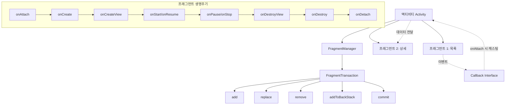

# 12. 모바일앱프로그래밍: 프래그먼트 (Fragment)

## 🔗 선수 지식 (Prerequisites)
- [ ] **필수**: 액티비티 생명주기 (onCreate / onStart / onResume / onPause / onStop / onDestroy) - 이해 완료?
- [ ] **필수**: 레이아웃 XML과 `findViewById()` / `LayoutInflater` 기본 사용법
- [ ] **권장**: 인터페이스(interface) 구현, 타입 캐스팅 (Java)
- [ ] **권장**: 인텐트와 액티비티 간 데이터 전달 `→←8강`
- **관련 단원**: [1강. 안드로이드 앱의 구성요소](1강.md), [4강. 위젯과 레이아웃](4강.md), [11강. 액티비티 생명주기·인텐트](11강.md)

---

## 학습 목표
1. **액티비티와 프래그먼트의 관계**를 이해하고, 액티비티가 프래그먼트를 포함하는 구조를 설명할 수 있다.
2. 프래그먼트를 관리하기 위한 **프래그먼트 매니저(FragmentManager)** 의 역할과 `FragmentTransaction` 을 이용한 추가·변경·삭제 방법을 이해한다.
3. 프래그먼트 통신을 위한 **인터페이스 이용 방법**을 이해하고, 액티비티를 중계자로 두는 통신 패턴을 코드로 구현할 수 있다.

---

## 🧠 메타인지 체크 (학습 전/후 자기 평가)

### 학습 전 자기 평가
| 소주제 | 자신감 (1-5) |
| :--- | :--- |
| 프래그먼트와 액티비티의 포함 관계 | |
| 프래그먼트 생명주기 (onAttach ~ onDetach) | |
| FragmentManager / FragmentTransaction 사용 | |
| 인터페이스 기반 프래그먼트 ↔ 액티비티 통신 | |

### 학습 후 교정 (학습 완료 후 작성)
| 소주제 | 학습 전 | 학습 후 | 실제 정답률 | 과신/과소 여부 |
| :--- | :--- | :--- | :--- | :--- |
| 포함 관계 | | | | |
| 생명주기 | | | | |
| FragmentManager | | | | |
| 인터페이스 통신 | | | | |

> **활용법**: 학습 전 1분 → 자신감 기입, 학습 후 1분 → 나머지 기입. "과신" 영역이 실제 취약점.

---

## 📝 요약 (Summary)
1. 🔴 **프래그먼트(Fragment)**: 하나의 액티비티를 분할하여 개별적인 목적에 맞는 특정 기능을 수행하며, 스마트폰 화면의 **일부분**을 차지한다. (→ 프래그먼트는 **액티비티의 일부**이지 그 반대가 아니다.)
2. 🔴 **프래그먼트 레이아웃**: 프래그먼트의 사용자 인터페이스를 표현하며, 액티비티와 마찬가지로 **레이아웃 XML 파일 + 자바(Kotlin) 클래스 파일** 두 축으로 구성된다.
3. 🔴 **프래그먼트 생명주기**: 프래그먼트 **추가 단계**(onAttach → onCreate → onCreateView → onActivityCreated) / **실행 단계**(onStart → onResume → onPause → onStop) / **종료 단계**(onDestroyView → onDestroy → onDetach)로 구성된다.
4. 🔴 **프래그먼트 매니저(FragmentManager)**: 액티비티의 여러 프래그먼트를 관리한다. `getSupportFragmentManager()`(AppCompat) / `getFragmentManager()`로 획득하며, **액티비티와 프래그먼트 사이의 통신 중계자** 역할을 수행한다.
5. 🟡 **프래그먼트 트랜잭션(FragmentTransaction)**: `beginTransaction()`으로 시작 → `add() / replace() / remove() / hide() / show()` 등으로 변경을 쌓고 → `commit()`으로 일괄 적용. **추가·변경·삭제 기능을 제공**한다.
6. 🟡 **백 스택(Back Stack)**: `addToBackStack(name)`로 트랜잭션을 스택에 쌓아두면, 사용자가 백 키를 누를 때 이전 프래그먼트 상태로 되돌아갈 수 있다.
7. 🔴 **인터페이스 기반 통신**: 자식 프래그먼트가 액티비티에 콜백 인터페이스를 정의하고, `onAttach()`에서 액티비티를 해당 인터페이스로 캐스팅해 보관 → 이벤트 발생 시 인터페이스 메소드 호출 → 액티비티가 받아 **다른 프래그먼트로 전달**.
8. 🟢 **`onAttach()` vs `onDetach()`**: `onAttach()`는 프래그먼트가 **액티비티에 선언/부착될 때** 가장 먼저 호출되며, `onDetach()`는 **분리될 때** 마지막에 호출된다. (📎 기출 핵심)

---

## 🧩 핵심 문법 및 패턴 (Key Patterns)

| 패턴명 | 코드 (요지) | 용도 |
| :--- | :--- | :--- |
| **프래그먼트 클래스** | `public class MyFragment extends Fragment { ... }` | 프래그먼트 정의 (androidx.fragment.app.Fragment 권장) |
| **레이아웃 inflate** | `View v = inflater.inflate(R.layout.fragment_my, container, false); return v;` | `onCreateView()`에서 XML을 View로 변환 |
| **정적 컨테이너** | `<fragment android:name="..." android:id="@+id/frag1" .../>` | 액티비티 XML에 직접 박아넣기 (교체 불가) |
| **동적 컨테이너** | `<FrameLayout android:id="@+id/container" .../>` | 런타임에 트랜잭션으로 교체 가능 (권장) |
| **FragmentManager 획득** | `FragmentManager fm = getSupportFragmentManager();` | AppCompatActivity 기준 |
| **트랜잭션 시작** | `FragmentTransaction ft = fm.beginTransaction();` | 변경 작업 묶음 시작 |
| **add** | `ft.add(R.id.container, new MyFragment(), "TAG");` | 컨테이너에 새 프래그먼트 추가 |
| **replace** | `ft.replace(R.id.container, new OtherFragment());` | 기존 프래그먼트를 교체 |
| **remove** | `ft.remove(fragment);` | 명시적 제거 |
| **백 스택** | `ft.addToBackStack(null); ft.commit();` | 백 키로 이전 상태 복원 |
| **태그로 찾기** | `MyFragment f = (MyFragment) fm.findFragmentByTag("TAG");` | 살아있는 프래그먼트 참조 획득 |
| **ID로 찾기** | `Fragment f = fm.findFragmentById(R.id.frag1);` | 정적 선언 프래그먼트 참조 |
| **인자(Bundle) 전달** | `Bundle b = new Bundle(); b.putString("k","v"); f.setArguments(b);` | `new MyFragment(int n)` 같은 생성자 인자는 ❌, 반드시 `setArguments()` |
| **인자 수신** | `getArguments().getString("k")` | `onCreate()` 이후에서 안전하게 호출 |
| **콜백 인터페이스 캐스팅** | `@Override public void onAttach(Context c){ super.onAttach(c); listener = (Callback) c; }` | 액티비티 → 프래그먼트 통신 채널 확보 |

### 주요 정의/원리

**프래그먼트 생명주기 3단계 — 콜백 호출 순서**

| 단계 | 콜백 메소드 | 시점 / 역할 |
| :--- | :--- | :--- |
| **추가** | `onAttach(Context)` | 프래그먼트가 액티비티에 **선언/부착**될 때 가장 먼저 호출 (📎 기출) |
| **추가** | `onCreate(Bundle)` | 프래그먼트 자체 초기화 (UI 생성 전, 데이터/상태 복원) |
| **추가** | `onCreateView(...)` | **UI(View) 생성·반환**. 레이아웃 inflate는 여기서 수행 |
| **추가** | `onActivityCreated(Bundle)` | 호스트 액티비티의 `onCreate()` 완료 시점 (deprecated, `onViewCreated` 권장) |
| **실행** | `onStart()` → `onResume()` | 화면에 보이고 사용자와 상호작용 가능 |
| **실행** | `onPause()` → `onStop()` | 포커스/가시성을 잃음 |
| **종료** | `onDestroyView()` | 프래그먼트의 **View 계층**만 제거 (인스턴스는 살아있음) |
| **종료** | `onDestroy()` | 프래그먼트 인스턴스 자체 종료 |
| **종료** | `onDetach()` | 액티비티에서 **분리**될 때 마지막에 호출 |

> **직관적 해석**: "Attach(부착) → Create(생성) → View(화면) → 보이고 → 안 보이고 → View 제거 → 인스턴스 제거 → Detach(분리)" 의 순서. `onAttach()`만이 "선언/부착될 때"라는 표현에 부합하며, `onDetach()`는 그 정반대이다.
> **AI 적용**: 모바일 ML 데모 앱에서 **모델 입력 UI**(카메라/갤러리/녹음)를 프래그먼트로 분리해 두면, 동일 액티비티 안에서 입력 모달리티를 교체하며 추론 파이프라인을 재사용할 수 있다.

---

## 📊 개념 시각화 (Visual Guide)

### 프래그먼트 분류 체계도


### 핵심 도식: 정적 선언 vs 동적 추가
| 구분 | XML 정적 선언 (`<fragment>`) | 동적 추가 (FragmentTransaction) |
| :--- | :--- | :--- |
| **선언 위치** | 액티비티 레이아웃 XML | 자바 코드 (런타임) |
| **교체 가능 여부** | ❌ 교체 불가, 제거 불가 | ✅ add/replace/remove 자유 |
| **백 스택** | ❌ | ✅ `addToBackStack()` |
| **참조 획득** | `fm.findFragmentById(R.id.xxx)` | `fm.findFragmentByTag("TAG")` |
| **권장 상황** | 화면 분할이 고정된 단순 레이아웃 | 일반적인 모든 경우 (권장 ✅) |

### 액티비티 ↔ 프래그먼트 통신 흐름
| 방향 | 메커니즘 | 코드 |
| :--- | :--- | :--- |
| **액티비티 → 프래그먼트** | `setArguments(Bundle)` 또는 메소드 직접 호출 | `frag.setArguments(b)` / `frag.updateData(x)` |
| **프래그먼트 → 액티비티** | **콜백 인터페이스** + `onAttach()` 캐스팅 | `((Callback) getActivity()).onItemSelected(id)` |
| **프래그먼트 ↔ 프래그먼트** | 액티비티가 **중계자**로 동작 | A → 액티비티(콜백) → B(메소드 호출) |

---

## ✏️ 심화 학습 (Study Subject)

### 1. 가상 시나리오: "프래그먼트를 언제, 어떻게 사용할까?"
- **상황**: 태블릿/스마트폰 듀얼 폼팩터를 모두 지원하는 뉴스 앱을 만든다. 태블릿에서는 한 화면에 **목록(좌)+상세(우)** 를 나란히 표시하고, 스마트폰에서는 목록 → 상세로 화면을 **전환**해야 한다.
- **문제**: 같은 비즈니스 로직(목록·상세)을 두 폼팩터에 어떻게 재사용하며, 폼팩터별 분기와 화면 전환·통신은 어디서 처리해야 하는가?
- **해결**:
    1. 목록·상세를 각각 **`ListFragment`, `DetailFragment`** 로 분리해 UI 단위로 재사용한다.
    2. **태블릿용 layout** (`res/layout-sw600dp/activity_main.xml`)에는 두 프래그먼트를 좌·우 컨테이너에 둘 다 배치, **스마트폰용 layout** 에는 컨테이너 하나만 둔다.
    3. `ListFragment`는 항목 선택 시 자기 자신이 액티비티에 알리지 않고 **콜백 인터페이스(OnItemSelected)** 를 호출한다. 액티비티는 이 콜백에서 (a) 태블릿이면 우측 `DetailFragment`에 `setArguments()`로 데이터만 갱신, (b) 스마트폰이면 `FragmentTransaction.replace(...).addToBackStack(null).commit()` 으로 화면 전환을 수행한다.
    4. 결과적으로 **프래그먼트는 폼팩터를 모른다** — 액티비티만이 폼팩터 분기 책임을 진다.
- **AI 학습 포인트**: "동일한 모델 추론 결과를 스마트폰(전환)/태블릿(분할)에서 같은 코드로 보여주려면, 폼팩터 분기를 ViewModel/액티비티/프래그먼트 중 어디에 두어야 단일 책임이 깨지지 않을지 비교해 줘."

### 2. 관점별 비교 및 오개념 분석
- **핵심 비교**: "액티비티 vs 프래그먼트" / "정적 `<fragment>` vs 동적 트랜잭션" / "`onAttach()` vs `onCreate()` vs `onCreateView()`"
- **오개념 분석**:
    - **오개념 1**: "액티비티가 프래그먼트의 일부분이다."
    - **분석**: ❌ 완전히 반대. **프래그먼트가 액티비티의 일부**다. 액티비티는 호스트(컨테이너) 역할을 하고 프래그먼트는 그 안의 부분 UI/기능 단위다. → 📎 기출 Q1의 ③번 함정.
    - **오개념 2**: "프래그먼트가 액티비티에 선언될 때 호출되는 메소드는 `onCreate()`다."
    - **분석**: ❌ "선언/부착되는 시점"은 `onAttach(Context)`. `onCreate()`는 부착 이후 프래그먼트 내부 초기화 단계이며, `onCreateView()`는 그 다음 UI 생성 단계, `onDetach()`는 분리 시점이라 정반대다. → 📎 기출 Q2의 함정.
    - **오개념 3**: "`new MyFragment(int id)` 같은 생성자에 인자를 넘기면 된다."
    - **분석**: ❌ 시스템이 프래그먼트를 재생성할 때(화면 회전 등) **기본 생성자**를 호출하므로 인자가 사라진다. 반드시 `Bundle` + `setArguments()` 패턴을 사용해야 상태 복원이 안전하다.
    - **오개념 4**: "프래그먼트끼리 직접 서로의 메소드를 호출하면 된다."
    - **분석**: ❌ 강한 결합으로 재사용성·테스트성이 깨진다. **액티비티가 중계자**가 되어 콜백 인터페이스로 받아 다른 프래그먼트에 전달하는 패턴이 표준이다 (또는 공유 ViewModel).
- **AI 학습 포인트**: "프래그먼트 콜백 인터페이스 패턴과 공유 `ViewModel`(`activityViewModels()`) 패턴의 장단점을 결합도·테스트 용이성 관점에서 비교해 줘."

---

## ❓ 연습 문제 및 해설

> **블룸 인지 수준 범례**: [기억] 정의·나열 → [이해] 설명·비교 → [적용] 계산·구현 → [분석] 구별·디버그 → [평가] 판단·비평 → [창조] 설계·제안

### 📝 문제

**1. ⭐ [기억] 📎 기출 프래그먼트매니저에 대한 설명으로 틀린 것은?**[(해설)](#prob-1)
   > ① 액티비티와 프래그먼트 사이의 통신 중계자 역할을 수행한다.
   > ② 프래그먼트트랜잭션을 통해 프래그먼트의 추가·변경·삭제에 대한 기능을 제공한다.
   > ③ 액티비티를 통해 모듈화된 프래그먼트의 설계가 가능하게 하고, 액티비티는 프래그먼트의 일부분이다.
   > ④ 프래그먼트도 액티비티와 마찬가지로 레이아웃 파일과 JAVA 파일로 구성된다.

<br>

**2. ⭐ [기억] 📎 기출 프래그먼트가 액티비티에서 선언될 때 호출되는 메소드는 무엇인가?**[(해설)](#prob-2)
   > ① void onAttach( )
   > ② onCreate( )
   > ③ onCreateView( )
   > ④ onDetach( )

<br>

**3. ⭐⭐ [이해] 📌 프래그먼트의 생명주기 콜백 호출 순서를 추가 단계 → 실행 단계 → 종료 단계 순서로 가장 올바르게 나열한 것은?**[(해설)](#prob-3)
   > ① onCreate → onAttach → onCreateView → onResume → onDestroy → onDetach
   > ② onAttach → onCreate → onCreateView → onResume → onDestroyView → onDetach
   > ③ onCreateView → onAttach → onCreate → onResume → onDestroy → onDetach
   > ④ onAttach → onCreateView → onCreate → onResume → onDetach → onDestroyView

<br>

**4. ⭐⭐ [적용] 📌 다음 코드의 빈칸 ⓐ, ⓑ에 들어갈 코드로 옳은 것은?**[(해설)](#prob-4)
   > ```java
   > // MainActivity (AppCompatActivity)
   > FragmentManager fm = ⓐ;
   > FragmentTransaction ft = fm.beginTransaction();
   > ⓑ;
   > ft.addToBackStack(null);
   > ft.commit();
   > ```
   > ① ⓐ `getFragmentManager()` / ⓑ `ft.put(R.id.container, new MyFragment())`
   > ② ⓐ `getSupportFragmentManager()` / ⓑ `ft.replace(R.id.container, new MyFragment())`
   > ③ ⓐ `new FragmentManager()` / ⓑ `ft.add(new MyFragment())`
   > ④ ⓐ `getSupportFragmentManager()` / ⓑ `ft.set(R.id.container, new MyFragment())`

<br>

**5. ⭐⭐ [분석] 📌 프래그먼트 ↔ 액티비티 통신 패턴 중 옳지 않은 것은?**[(해설)](#prob-5)
   > <보기>
   >
   > 가. 프래그먼트가 콜백 인터페이스를 정의하고, `onAttach()`에서 액티비티를 그 인터페이스로 캐스팅하여 보관한다.
   > 나. 프래그먼트에서 다른 프래그먼트의 메소드를 직접 호출해 결합한다.
   > 다. 액티비티에서 프래그먼트로 데이터를 넘길 때는 `setArguments(Bundle)` 사용이 권장된다.
   > 라. 화면 회전 등으로 프래그먼트가 재생성될 수 있으므로 생성자 인자 대신 `setArguments()`를 사용한다.

   > ① 가
   > ② 나
   > ③ 다
   > ④ 라

<br>

**6. ⭐⭐⭐ [평가/창조] 📌 다음 요구사항을 만족하는 프래그먼트 기반 화면 구성을 설계하시오.**[(해설)](#prob-6)
   > - 요구사항: ① 좌측 목록 프래그먼트에서 항목 선택 시 우측 상세 프래그먼트에 ID를 전달, ② 화면 회전 후에도 선택된 ID가 유지되어야 함, ③ 백 키로 이전 항목 상태로 복원 가능해야 함.
   > - 답안에는 (1) 통신 패턴, (2) 인자 전달 방식, (3) 백 스택 사용 코드 윤곽을 포함하시오.

---

### 🔑 정답 및 해설 (먼저 풀어본 후 펼치기)

<details>
<summary>정답 보기 (클릭)</summary>

1. ③
2. ①
3. ②
4. ②
5. ②
6. 풀이형 정답 (해설 참조)

</details>

<details>
<summary>해설 보기 (클릭)</summary>

<a id="prob-1"></a>
**1. ⭐ [기억] 📎 기출 프래그먼트매니저 설명으로 틀린 것**
> **정답: ③ 액티비티를 통해 모듈화된 프래그먼트의 설계가 가능하게 하고, 액티비티는 프래그먼트의 일부분이다.**
> **해설**: **프래그먼트가 액티비티의 일부**이지 그 반대가 아니다. 액티비티는 호스트 컨테이너이며, 그 안에 여러 프래그먼트가 부분 UI/기능 단위로 들어간다. ①, ②, ④는 모두 정확한 설명: ① FragmentManager는 직접 통신은 인터페이스를 쓰지만 전체적인 연결·관리 관점에서 중계자 역할, ② `beginTransaction()` → `add/replace/remove` → `commit()` 흐름으로 변경 기능 제공, ④ Fragment도 Java(Kotlin) 클래스 + XML 레이아웃 두 축으로 구성된다.

<a id="prob-2"></a>
**2. ⭐ [기억] 📎 기출 액티비티에 선언될 때 호출되는 메소드**
> **정답: ① void onAttach( )**
> **해설**: `onAttach(Context)`는 프래그먼트가 액티비티에 **처음 연결(부착)** 될 때 호출되어 가장 초기 단계가 된다. ② `onCreate()`는 프래그먼트 자체 초기화 단계로 부착 이후이며, ③ `onCreateView()`는 UI(View) 생성 단계, ④ `onDetach()`는 분리될 때 호출되는 반대 개념이라 모두 정답이 아니다.

<a id="prob-3"></a>
**3. ⭐⭐ [이해] 생명주기 순서**
> **정답: ② onAttach → onCreate → onCreateView → onResume → onDestroyView → onDetach**
> **해설**: 추가 단계는 항상 `onAttach → onCreate → onCreateView → (onActivityCreated)` 순. 실행 단계는 `onStart → onResume → onPause → onStop`. 종료 단계는 `onDestroyView → onDestroy → onDetach`. ②만 이 순서를 지킨다. ①·③은 onAttach와 onCreate의 선후 관계가 어긋나고, ④는 onDetach가 onDestroyView보다 먼저라 잘못이다.

<a id="prob-4"></a>
**4. ⭐⭐ [적용] FragmentTransaction 빈칸**
> **정답: ② ⓐ `getSupportFragmentManager()` / ⓑ `ft.replace(R.id.container, new MyFragment())`**
> **해설**: AppCompatActivity에서는 호환성을 위해 `getSupportFragmentManager()`로 androidx `FragmentManager`를 얻는다. 트랜잭션 API는 `add / replace / remove / hide / show` 가 표준이며, `put` / `set` 같은 메소드는 존재하지 않는다. ① 일반 `getFragmentManager()`는 deprecated이고 `put`은 잘못된 API. ③ FragmentManager는 `new`로 생성할 수 없다(시스템이 보유). ④ `set` 메소드는 없다.

<a id="prob-5"></a>
**5. ⭐⭐ [분석] 통신 패턴 오답 골라내기**
> **정답: ② 프래그먼트에서 다른 프래그먼트의 메소드를 직접 호출해 결합한다.**
> **해설**: 프래그먼트 간 **직접 호출은 강한 결합**을 만들어 재사용성·테스트성이 깨진다. 표준은 액티비티가 중계자가 되어 콜백 인터페이스로 받아 다른 프래그먼트에 전달(또는 공유 ViewModel)하는 패턴이다. 가·다·라는 모두 권장되는 정석 패턴.

<a id="prob-6"></a>
**6. ⭐⭐⭐ [평가/창조] 목록-상세 설계**
> **정답 (풀이형)**:
>
> **(1) 통신 패턴 — 콜백 인터페이스**
> ```java
> public class ListFragment extends Fragment {
>     public interface OnItemSelected { void onItemSelected(int id); }
>     private OnItemSelected listener;
>     @Override public void onAttach(@NonNull Context c) {
>         super.onAttach(c);
>         listener = (OnItemSelected) c; // 액티비티가 구현 강제
>     }
>     // 목록 클릭 시: listener.onItemSelected(id);
> }
> ```
>
> **(2) 인자 전달 — `setArguments(Bundle)`**
> ```java
> public static DetailFragment newInstance(int id) {
>     DetailFragment f = new DetailFragment();
>     Bundle b = new Bundle();
>     b.putInt("ID", id);
>     f.setArguments(b);            // 회전 시에도 시스템이 자동 보존·복원
>     return f;
> }
> ```
>
> **(3) 백 스택 사용**
> ```java
> // MainActivity implements ListFragment.OnItemSelected
> @Override public void onItemSelected(int id) {
>     FragmentManager fm = getSupportFragmentManager();
>     fm.beginTransaction()
>       .replace(R.id.detail_container, DetailFragment.newInstance(id), "DETAIL")
>       .addToBackStack(null)        // 백 키로 이전 상태 복원
>       .commit();
> }
> ```
>
> **(4) 회전 대응**: `setArguments()`로 넘긴 ID는 시스템 보존됨. 추가 UI 상태는 `onSaveInstanceState(Bundle)` 로 보존하고 `onViewCreated()` 에서 복원, 혹은 `androidx.lifecycle.ViewModel` 사용으로 회전과 무관한 상태 유지가 가능하다.

</details>

---

## ✅ O/X 확인문제 (연습문항 개수의 2배 권장)

**1.** 프래그먼트는 액티비티의 일부분으로 포함되는 구조이며, 액티비티가 프래그먼트의 일부분이 되는 것은 아니다. [(해설)](#ox-1) **(O / X)**
**2.** 프래그먼트가 액티비티에 선언/부착될 때 가장 먼저 호출되는 메소드는 `onCreateView()`이다. [(해설)](#ox-2) **(O / X)**
**3.** `FragmentTransaction`은 `beginTransaction()`으로 시작하고 `commit()`으로 끝나는 단위 작업이다. [(해설)](#ox-3) **(O / X)**
**4.** AppCompatActivity에서는 보통 `getSupportFragmentManager()`를 통해 FragmentManager를 얻는다. [(해설)](#ox-4) **(O / X)**
**5.** 프래그먼트의 UI를 inflate하여 반환하는 콜백은 `onCreate(Bundle)`이다. [(해설)](#ox-5) **(O / X)**
**6.** `addToBackStack()`을 호출하지 않은 트랜잭션은 백 키로 되돌릴 수 없다. [(해설)](#ox-6) **(O / X)**
**7.** XML에 `<fragment>` 태그로 정적 선언한 프래그먼트는 런타임에 `replace()`로 교체할 수 있다. [(해설)](#ox-7) **(O / X)**
**8.** 프래그먼트 간 통신은 액티비티를 중계자로 두고 콜백 인터페이스를 사용하는 것이 권장된다. [(해설)](#ox-8) **(O / X)**
**9.** 화면 회전 시 시스템이 프래그먼트를 재생성하더라도 `setArguments(Bundle)`로 전달한 인자는 보존된다. [(해설)](#ox-9) **(O / X)**
**10.** `onAttach()`와 `onDetach()`는 각각 액티비티에 부착될 때와 분리될 때 호출되는 정반대 개념의 콜백이다. [(해설)](#ox-10) **(O / X)**
**11.** FragmentManager는 직접 통신은 주로 인터페이스 등을 통해 이루어지지만, 전체적인 연결과 관리 측면에서 액티비티-프래그먼트 사이의 중계자 역할을 한다고 볼 수 있다. [(해설)](#ox-11) **(O / X)**
**12.** `MyFragment(int id)` 같은 매개변수 생성자에 데이터를 넘기는 것이 `setArguments()`보다 권장된다. [(해설)](#ox-12) **(O / X)**
**13.** `onDestroyView()`는 프래그먼트의 View 계층만 제거하며 프래그먼트 인스턴스 자체는 살아있을 수 있다. [(해설)](#ox-13) **(O / X)**
**14.** `FragmentTransaction`의 `add()`, `replace()`, `remove()`는 `commit()` 호출 전까지 실제로 반영되지 않는다. [(해설)](#ox-14) **(O / X)**

<details>
<summary>O/X 정답 및 해설 보기 (클릭)</summary>

> <a id="ox-1"></a>
> **1. 정답**: O
> **해설**: 프래그먼트가 액티비티의 일부분이라는 포함 관계가 표준이다. 📎 기출 Q1 ③번이 이 관계를 반대로 서술해 오답이었다.

> <a id="ox-2"></a>
> **2. 정답**: X
> **해설**: 가장 먼저 호출되는 것은 `onAttach(Context)`. `onCreateView()`는 부착·초기화 이후 UI 생성 단계다. (📎 기출 Q2)

> <a id="ox-3"></a>
> **3. 정답**: O
> **해설**: 트랜잭션은 변경 작업 묶음으로, 시작-축적-커밋 패턴을 따른다.

> <a id="ox-4"></a>
> **4. 정답**: O
> **해설**: androidx Fragment를 사용하는 표준 방식이다.

> <a id="ox-5"></a>
> **5. 정답**: X
> **해설**: UI inflate·반환은 `onCreateView(LayoutInflater, ViewGroup, Bundle)`의 책임. `onCreate()`는 비UI 초기화.

> <a id="ox-6"></a>
> **6. 정답**: O
> **해설**: 백 스택에 명시적으로 쌓아야만 백 키로 복원된다. 미호출 시 트랜잭션은 즉시 영구 반영된다.

> <a id="ox-7"></a>
> **7. 정답**: X
> **해설**: `<fragment>` 정적 선언은 교체·제거가 불가하다. 교체가 필요하면 `<FrameLayout>` 컨테이너 + 트랜잭션 패턴을 써야 한다.

> <a id="ox-8"></a>
> **8. 정답**: O
> **해설**: 프래그먼트 ↔ 프래그먼트 직접 결합 대신 액티비티 중계자 + 콜백 인터페이스(또는 공유 ViewModel)가 표준.

> <a id="ox-9"></a>
> **9. 정답**: O
> **해설**: `setArguments()`의 `Bundle`은 시스템이 자동 보존·복원한다. 그래서 생성자 인자 대신 이 패턴을 강제한다.

> <a id="ox-10"></a>
> **10. 정답**: O
> **해설**: `onAttach`(부착) ↔ `onDetach`(분리)는 정확히 대칭. 📎 기출 Q2의 ④번 함정이 이 점을 노렸다.

> <a id="ox-11"></a>
> **11. 정답**: O
> **해설**: 📎 기출 Q1 ①번 해설과 동일. 직접 통신은 인터페이스로 하지만, 거시적으로는 중계자 역할이라고 본다.

> <a id="ox-12"></a>
> **12. 정답**: X
> **해설**: 시스템 재생성 시 기본 생성자만 호출되므로 매개변수 생성자 인자는 소실된다. 반드시 `setArguments(Bundle)`을 사용한다.

> <a id="ox-13"></a>
> **13. 정답**: O
> **해설**: `onDestroyView`는 View 트리만 해제. 백 스택에 있는 프래그먼트는 인스턴스가 살아있어 다시 `onCreateView()`로 View만 재생성된다.

> <a id="ox-14"></a>
> **14. 정답**: O
> **해설**: 트랜잭션은 `commit()` 시점에 큐에 등록되어 메인 스레드에서 처리된다 (즉시 실행을 원하면 `commitNow()`).

</details>

---

## 🧪 자유 회상 연습 (Free Recall)

> **방법**: 위의 노트를 모두 덮고, 타이머 3분 설정 후 이번 단원에서 배운 내용을 기억나는 대로 자유롭게 적으세요.
> 정확한 문장이 아니어도 됩니다. 키워드, 콜백 순서, 패턴 등 떠오르는 것을 모두 적습니다.

**자유 회상 작성란:**

```
[여기에 기억나는 내용을 자유롭게 작성]


```

> **회상 후 점검**: 노트를 다시 펼쳐 빠뜨린 내용을 확인하세요. 빠뜨린 부분이 실제 취약점입니다.
> - 회상 못한 핵심 개념: [                ]
> - 회상 못한 콜백/패턴: [                ]

---

## 💻 코드로 확인하기 (Code Verification)

### (1) 액티비티 + 동적 프래그먼트 + 콜백 인터페이스 통신 (Java)

**`fragment_list.xml`** (목록 프래그먼트 레이아웃)
```xml
<?xml version="1.0" encoding="utf-8"?>
<LinearLayout xmlns:android="http://schemas.android.com/apk/res/android"
    android:layout_width="match_parent" android:layout_height="match_parent"
    android:orientation="vertical">
    <Button android:id="@+id/btnItem1" android:text="항목 1"
        android:layout_width="match_parent" android:layout_height="wrap_content"/>
    <Button android:id="@+id/btnItem2" android:text="항목 2"
        android:layout_width="match_parent" android:layout_height="wrap_content"/>
</LinearLayout>
```

**`fragment_detail.xml`** (상세 프래그먼트 레이아웃)
```xml
<?xml version="1.0" encoding="utf-8"?>
<TextView xmlns:android="http://schemas.android.com/apk/res/android"
    android:id="@+id/tvDetail"
    android:layout_width="match_parent" android:layout_height="match_parent"
    android:gravity="center" android:textSize="22sp" android:text="상세 영역"/>
```

**`ListFragment.java`**
```java
package com.example.fragdemo;

import android.content.Context;
import android.os.Bundle;
import android.view.*;
import androidx.annotation.NonNull;
import androidx.fragment.app.Fragment;

public class ListFragment extends Fragment {

    // [통신] 프래그먼트가 호스트 액티비티에 알릴 콜백 인터페이스
    public interface OnItemSelected { void onItemSelected(int id); }
    private OnItemSelected listener;

    @Override public void onAttach(@NonNull Context context) {
        super.onAttach(context);                    // ★ 부착 시점에 가장 먼저 호출
        if (context instanceof OnItemSelected) {
            listener = (OnItemSelected) context;    // 액티비티를 콜백 채널로 보관
        } else {
            throw new ClassCastException(context + " must implement OnItemSelected");
        }
    }

    @Override public View onCreateView(@NonNull LayoutInflater inflater,
                                       ViewGroup container, Bundle b) {
        View v = inflater.inflate(R.layout.fragment_list, container, false);
        v.findViewById(R.id.btnItem1).setOnClickListener(x -> listener.onItemSelected(1));
        v.findViewById(R.id.btnItem2).setOnClickListener(x -> listener.onItemSelected(2));
        return v;
    }

    @Override public void onDetach() {
        listener = null;                            // ★ 분리 시 참조 해제 (누수 방지)
        super.onDetach();
    }
}
```

**`DetailFragment.java`**
```java
package com.example.fragdemo;

import android.os.Bundle;
import android.view.*;
import android.widget.TextView;
import androidx.annotation.NonNull;
import androidx.fragment.app.Fragment;

public class DetailFragment extends Fragment {

    private static final String ARG_ID = "ID";

    // ★ 생성자 인자 대신 newInstance + setArguments 패턴
    public static DetailFragment newInstance(int id) {
        DetailFragment f = new DetailFragment();
        Bundle b = new Bundle();
        b.putInt(ARG_ID, id);
        f.setArguments(b);
        return f;
    }

    @Override public View onCreateView(@NonNull LayoutInflater inflater,
                                       ViewGroup container, Bundle b) {
        View v = inflater.inflate(R.layout.fragment_detail, container, false);
        int id = getArguments() != null ? getArguments().getInt(ARG_ID, -1) : -1;
        ((TextView) v.findViewById(R.id.tvDetail)).setText("선택된 ID: " + id);
        return v;
    }
}
```

**`MainActivity.java`**
```java
package com.example.fragdemo;

import android.os.Bundle;
import androidx.appcompat.app.AppCompatActivity;
import androidx.fragment.app.FragmentManager;
import androidx.fragment.app.FragmentTransaction;

public class MainActivity extends AppCompatActivity
        implements ListFragment.OnItemSelected {   // ★ 콜백 구현 강제

    @Override protected void onCreate(Bundle b) {
        super.onCreate(b);
        setContentView(R.layout.activity_main);    // <FrameLayout id="list_container"/>, <FrameLayout id="detail_container"/>

        if (b == null) {                           // 회전 시 중복 추가 방지
            getSupportFragmentManager().beginTransaction()
                .add(R.id.list_container, new ListFragment(), "LIST")
                .commit();
        }
    }

    @Override public void onItemSelected(int id) {
        FragmentManager fm = getSupportFragmentManager();
        FragmentTransaction ft = fm.beginTransaction();
        ft.replace(R.id.detail_container, DetailFragment.newInstance(id), "DETAIL");
        ft.addToBackStack(null);                   // 백 키 복원 지원
        ft.commit();
    }
}
```

> **실행 결과 (예상)**:
> ```
> [앱 시작]     좌측: ListFragment 표시 / 우측: 빈 컨테이너
> [항목 1 클릭] 우측에 "선택된 ID: 1" 표시 (스택에 트랜잭션 push)
> [항목 2 클릭] 우측에 "선택된 ID: 2" 표시
> [백 키 1회]   "선택된 ID: 1" 상태로 복원
> [화면 회전]   액티비티/프래그먼트가 재생성되어도 setArguments의 ID는 보존
> ```
> **해석**: ① `onAttach` → 콜백 채널 확보, ② 액티비티는 콜백을 받아 트랜잭션으로 우측 상세를 교체, ③ `setArguments()` 덕분에 회전·재생성 후에도 ID가 유지된다.

### (2) 생명주기 콜백 로그로 확인

```java
@Override public void onAttach(@NonNull Context c){ super.onAttach(c); Log.d("LC","onAttach"); }
@Override public void onCreate(Bundle b){ super.onCreate(b); Log.d("LC","onCreate"); }
@Override public View onCreateView(LayoutInflater i, ViewGroup c, Bundle b){
    Log.d("LC","onCreateView");
    return i.inflate(R.layout.fragment_detail, c, false);
}
@Override public void onStart(){ super.onStart(); Log.d("LC","onStart"); }
@Override public void onResume(){ super.onResume(); Log.d("LC","onResume"); }
@Override public void onPause(){ Log.d("LC","onPause"); super.onPause(); }
@Override public void onStop(){ Log.d("LC","onStop"); super.onStop(); }
@Override public void onDestroyView(){ Log.d("LC","onDestroyView"); super.onDestroyView(); }
@Override public void onDestroy(){ Log.d("LC","onDestroy"); super.onDestroy(); }
@Override public void onDetach(){ Log.d("LC","onDetach"); super.onDetach(); }
```

> **실행 결과 (Logcat)**:
> ```
> D/LC: onAttach
> D/LC: onCreate
> D/LC: onCreateView
> D/LC: onStart
> D/LC: onResume
> ... 화면 종료 ...
> D/LC: onPause
> D/LC: onStop
> D/LC: onDestroyView
> D/LC: onDestroy
> D/LC: onDetach
> ```
> **해석**: 추가 단계 → 실행 단계 → 종료 단계의 순서가 그대로 관찰된다. 📎 기출에서 묻는 "선언될 때"는 항상 `onAttach`임을 코드로 확인할 수 있다.

---

## 🤖 AI 연결고리 (Concept → AI Application)

| 강의 개념 | AI/ML 적용 분야 | 구체적 사례 |
| :--- | :--- | :--- |
| 프래그먼트로 화면 분할 | 멀티모달 ML 데모 UI | 좌측 입력(카메라/갤러리/녹음), 우측 추론 결과 — 입력 모달리티 교체 시 우측 결과 패널 재사용 |
| FragmentManager·Transaction | 멀티스텝 추론 워크플로우 UI | 데이터 수집 → 전처리 미리보기 → 모델 선택 → 결과 단계를 프래그먼트 스택으로 구현 |
| 콜백 인터페이스 통신 | 액티브 러닝 라벨링 도구 | 갤러리 프래그먼트가 선택 이벤트를 액티비티에 알리면 결과 프래그먼트가 라벨 후보 표시 |
| `setArguments(Bundle)` | 안전한 재현성 보장 | 추론 시드·모델 ID·하이퍼파라미터를 `Bundle`에 저장 → 회전·재생성 후에도 동일 추론 보장 |
| `onAttach` / `onDetach` | 리소스 수명 관리 | 부착 시 카메라/마이크 권한 확보·초기화, 분리 시 해제 → 누수 방지 (배터리·메모리) |

---

## 📖 심화 학습 예시 답안

#### 1. 프래그먼트 트랜잭션의 내부 동작 원리
사용자 코드가 `commit()`을 호출하는 순간 트랜잭션은 즉시 실행되지 않고 **메인 스레드 큐**에 등록된다. 시스템이 이를 처리하는 흐름은 다음과 같다.

1. **상태 수집**: `add`/`replace`/`remove` 호출 시 `BackStackRecord`에 op 리스트만 누적됨 — 아직 View 트리는 변경 없음.
2. **commit()** : op 리스트를 FragmentManager의 보류 큐에 등록 + 이후 `executePendingTransactions()`(자동 호출) 또는 `commitNow()`(즉시 실행)로 처리.
3. **생명주기 동기화**: 큐를 처리하면서 각 op에 대해 (a) `replace`된 기존 프래그먼트는 `onPause → onStop → onDestroyView → onDestroy → onDetach`, (b) 새 프래그먼트는 `onAttach → onCreate → onCreateView → onActivityCreated → onStart → onResume` 순으로 콜백을 호출한다.
4. **백 스택**: `addToBackStack()`이 있으면 `BackStackRecord`를 `mBackStack`에 push. 백 키는 `popBackStack()`을 호출해 op 리스트를 **역순으로** 재실행 (replace의 역방향: 새 프래그먼트는 detach, 기존 프래그먼트는 re-attach + view 재생성).

> **요점**: 트랜잭션은 "선언적 op 리스트 + 비동기 실행"이며, 생명주기 콜백 호출 시점은 이 큐 처리 과정에서 결정된다.

#### 2. 액티비티 vs 프래그먼트 비교표

| 구분 | 액티비티 (Activity) | 프래그먼트 (Fragment) | 비고 |
| :--- | :--- | :--- | :--- |
| **역할** | 하나의 화면(전체) | 액티비티 안의 부분 UI/기능 단위 | 프래그먼트 ⊂ 액티비티 |
| **매니페스트 등록** | 필수 | 불필요 | |
| **생명주기** | `onCreate → onStart → ... → onDestroy` | `onAttach → onCreate → onCreateView → ... → onDetach` | 프래그먼트 쪽이 더 길다 |
| **인자 전달** | `Intent` extras | `Bundle` + `setArguments()` | 둘 다 `Parcelable` 직렬화 |
| **재사용성** | 화면 단위로만 재사용 | 같은 프래그먼트를 여러 액티비티/구성에 배치 | 폼팩터 대응 강점 |
| **AI 활용** | 추론 결과 페이지 전체 | 입력/결과/설정 패널 분할·교체 | 멀티모달 UI에 유리 |

#### 3. 프래그먼트 통신 Best Practice

- **Bad Practice (나쁜 예시)**
  ```java
  // ❌ 프래그먼트 A에서 프래그먼트 B를 직접 참조해 메소드 호출
  DetailFragment df = (DetailFragment) getActivity()
          .getSupportFragmentManager().findFragmentByTag("DETAIL");
  if (df != null) df.updateDirectly(id); // 강결합, B의 존재·구현에 종속
  ```
- **Good Practice (좋은 예시)**
  ```java
  // ✅ 프래그먼트 A는 인터페이스만 보고, 액티비티가 중계자가 된다
  // [Fragment A 측]
  listener.onItemSelected(id);
  // [Activity 측]
  @Override public void onItemSelected(int id) {
      getSupportFragmentManager().beginTransaction()
          .replace(R.id.detail_container, DetailFragment.newInstance(id))
          .addToBackStack(null)
          .commit();
  }
  ```
- **설명**: (i) 인터페이스 패턴은 A가 B의 존재를 모르므로 **A를 다른 화면에서도 재사용**할 수 있다. (ii) 액티비티가 통신 정책(전환/분할)을 한 곳에서 결정하므로 폼팩터 분기가 깔끔해진다. (iii) 더 큰 앱에서는 공유 `ViewModel`(`activityViewModels()`) 패턴이 보일러플레이트를 줄이는 대안.

---

## 📚 핵심 용어집 (Glossary)

| 용어 (한) | 용어 (영) | 코드/시그니처 | 정의 |
| :--- | :--- | :--- | :--- |
| **프래그먼트** | Fragment | `extends androidx.fragment.app.Fragment` | 액티비티의 일부분으로 동작하는 재사용 가능한 UI/기능 단위. |
| **프래그먼트 매니저** | FragmentManager | `getSupportFragmentManager()` | 액티비티 내 프래그먼트들을 관리하는 시스템 객체. |
| **프래그먼트 트랜잭션** | FragmentTransaction | `fm.beginTransaction()...commit()` | 추가·변경·삭제 op 묶음. 백 스택과 연동. |
| **백 스택** | Back Stack | `addToBackStack(name)` | 트랜잭션을 쌓아 백 키로 복원 가능하게 함. |
| **onAttach** | onAttach(Context) | 생명주기 콜백 | 액티비티에 **부착될 때** 가장 먼저 호출. (📎 기출) |
| **onCreateView** | onCreateView | `inflater.inflate(...)` | 프래그먼트의 **View(UI) 생성·반환**. |
| **onDetach** | onDetach | 생명주기 콜백 | 액티비티에서 **분리될 때** 마지막에 호출. |
| **setArguments** | setArguments(Bundle) | `f.setArguments(b)` | 시스템 보존 가능한 인자 전달. 생성자 인자 대용. |
| **콜백 인터페이스** | Callback Interface | `interface OnItemSelected {...}` | 프래그먼트 → 액티비티 통신 채널. `→←9강` |
| **정적 선언** | Static `<fragment>` | XML `<fragment android:name="..."/>` | 교체 불가, 화면 고정 시 사용. |
| **동적 추가** | Dynamic Transaction | `ft.replace(R.id.container, f)` | 일반적인 권장 방식. |
| **이벤트 리스너** | Event Listener | `View.OnClickListener` | 위젯 이벤트를 받는 인터페이스. `→←9강` `→←10강` |

---

## 🤖 AI 학습 파트너를 위한 추가 자료

### 1. 개념 이해를 위한 심층 질문 프롬프트
> **프롬프트 예시**: "안드로이드의 프래그먼트가 왜 도입되었는지(액티비티만으로 부족했던 이유), 그리고 태블릿/스마트폰 듀얼 폼팩터 대응 관점에서 액티비티만 쓰는 설계 대비 프래그먼트 도입이 어떤 문제를 해결해주는지 사례와 함께 설명해 줘."

### 2. 문제 해결 능력 강화를 위한 시나리오 프롬프트
> **프롬프트 예시**: "당신은 모바일 AI 엔지니어다. 같은 카메라 입력으로 (a) 객체 탐지, (b) OCR, (c) 자세 추정 세 가지 추론을 사용자 선택에 따라 전환해야 한다. 각 추론별 결과 패널을 프래그먼트로 분리할지, 하나의 프래그먼트에서 상태로 전환할지 결정해야 한다. 결합도·재사용성·메모리 관점에서 두 설계를 비교하고, 콜백 인터페이스/공유 ViewModel 중 어느 통신 패턴이 더 적합한지 추천해 줘."

### 3. 코드 검증 프롬프트
> **프롬프트 예시**: "다음 코드는 프래그먼트에 데이터를 넘기는 코드이다.
> ```java
> public class MyFragment extends Fragment {
>     private int userId;
>     public MyFragment(int id) { this.userId = id; }  // 매개변수 생성자
> }
> // 호출부
> ft.replace(R.id.container, new MyFragment(42)).commit();
> ```
> 1. 이 코드의 문제점을 화면 회전 시나리오에서 지적해 줘.
> 2. `setArguments(Bundle)` + `newInstance()` 정적 팩토리 패턴으로 올바르게 고쳐 줘.
> 3. 왜 안드로이드 프레임워크가 기본 생성자만 호출하도록 설계되었는지 그 배경(시스템 재생성 메커니즘)도 함께 설명해 줘."

---

## 🔄 복습 체크 (Spaced Repetition)
- [ ] 1일 후 복습 (날짜: 2026-05-30)
- [ ] 3일 후 복습 (날짜: 2026-06-01)
- [ ] 7일 후 복습 (날짜: 2026-06-05)
- [ ] 14일 후 복습 (날짜: 2026-06-12)
- [ ] 30일 후 복습 (날짜: 2026-06-28)

### 복습 시 자가 평가
| 회차 | 날짜 | 이해도 (1-5) | 취약 부분 메모 |
| :--- | :--- | :--- | :--- |
| 1차 | | | |
| 2차 | | | |
| 3차 | | | |

---

## 📚 참고 자료 (References)

- 교재: 한국방송통신대학교 『모바일앱프로그래밍』 12강. 프래그먼트
- Android Developers: [Fragments overview](https://developer.android.com/guide/fragments)
- Android Developers: [Fragment lifecycle](https://developer.android.com/guide/fragments/lifecycle)
- Android Developers: [FragmentManager / FragmentTransaction](https://developer.android.com/guide/fragments/fragmentmanager)
- Android Developers: [Communicate with fragments](https://developer.android.com/guide/fragments/communicate)
- 11강. 액티비티 생명주기·인텐트 (호스트 액티비티 측 생명주기 대응)
