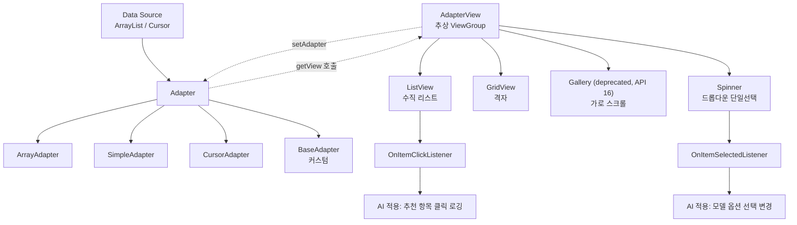

# 13. 모바일앱프로그래밍: 어댑터 뷰 (Adapter View)

## 🔗 선수 지식 (Prerequisites)
- [ ] **필수**: View / ViewGroup 개념과 레이아웃 작성 - 이해 완료?
- [ ] **필수**: Activity와 `setContentView()`로의 화면 부착
- [ ] **권장**: 자바 컬렉션(`ArrayList`), 이벤트 리스너 등록 패턴
- **관련 단원**: [10강. 안드로이드 UI 기초](10강.md), [11강. 액티비티와 인텐트](11강.md), [12강. 위젯](12강.md)

---

## 학습 목표
1. AdapterView의 구조 및 실행 방법을 이해한다.
2. ListView의 실행 방법을 이해한다.
3. Spinner의 실행 방법을 이해한다.

---

## 🧠 메타인지 체크 (학습 전/후 자기 평가)

### 학습 전 자기 평가
| 소주제 | 자신감 (1-5) |
| :--- | :--- |
| AdapterView와 Adapter의 역할 분담 | |
| ListView 항목 표시 및 클릭 이벤트 처리 | |
| Spinner의 단일 선택 동작과 프롬프트 | |

### 학습 후 교정 (학습 완료 후 작성)
| 소주제 | 학습 전 | 학습 후 | 실제 정답률 | 과신/과소 여부 |
| :--- | :--- | :--- | :--- | :--- |
| AdapterView와 Adapter의 역할 분담 | | | | |
| ListView 항목 표시 및 클릭 이벤트 처리 | | | | |
| Spinner의 단일 선택 동작과 프롬프트 | | | | |

> **활용법**: 학습 전 1분 → 자신감 기입, 학습 후 1분 → 나머지 기입. "과신" 영역이 실제 취약점.

---

## 📝 요약 (Summary)
1. 🔴 **AdapterView**: 항목에 해당하는 **여러 개의 차일드 뷰**를 가질 수 있고 사용자와의 상호 작용(클릭·선택)도 처리할 수 있는 ViewGroup 계열의 추상 뷰. 데이터는 직접 갖지 않고 **Adapter**로부터 공급받는다. ⚠️ 일반 ViewGroup과 달리 **`addView()`/`removeView()`를 직접 호출하면 `UnsupportedOperationException`이 발생**한다 — 자식 뷰는 오직 **Adapter를 통해서만** 관리되기 때문이다. ([공식 문서](https://developer.android.com/reference/android/widget/AdapterView))
2. 🔴 **Adapter**: 데이터 집합(리스트·DB 커서 등)과 AdapterView 사이를 연결해 각 데이터 항목을 화면에 표시할 차일드 View로 변환해 주는 객체. `ArrayAdapter`, `SimpleAdapter`, `CursorAdapter`, `BaseAdapter` 등이 있다.
3. 🔴 **ListView**: 항목들을 **수직**으로 펼쳐서 보여주는 AdapterView. 주소록, 설정 메뉴 등이 대표 예이며 스크롤로 표시되므로 **항목 개수에 제한이 없다**.
4. 🔴 **Spinner**: 평소에는 **선택된 항목 하나**만 보여주고 클릭 시에만 팝업(드롭다운)으로 펼쳐지는 단일 선택용 AdapterView. 화면이 좁은 모바일에서 **면적을 적게 차지**한다는 장점이 있다.
5. 🟡 **이벤트 리스너**: `setOnItemClickListener`(주로 ListView), `setOnItemSelectedListener`(주로 Spinner)로 항목 선택 이벤트를 처리한다.
6. 🟢 **Spinner 프롬프트**: `android:prompt` 또는 `setPrompt()`로 팝업 상단에 안내 메시지를 표시할 수 있다.

---

## 📐 핵심 문법 및 패턴 (Key Syntax & Patterns)

| 패턴명 | 코드 | 용도 |
| :--- | :--- | :--- |
| **ListView 선언 (XML)** | `<ListView android:id="@+id/lv" android:layout_width="match_parent" android:layout_height="wrap_content"/>` | 수직 리스트 영역 배치 |
| **Spinner 선언 (XML)** | `<Spinner android:id="@+id/sp" android:prompt="@string/sel_msg" .../>` | 드롭다운 단일 선택 위젯 배치 |
| **ArrayAdapter 생성** | `new ArrayAdapter<>(this, android.R.layout.simple_list_item_1, items)` | 배열·리스트 데이터를 1줄 텍스트 항목으로 변환 |
| **Spinner용 ArrayAdapter** | `new ArrayAdapter<>(this, android.R.layout.simple_spinner_item, items)` | Spinner 닫힘 상태용 기본 레이아웃 |
| **드롭다운 레이아웃 지정** | `adapter.setDropDownViewResource(android.R.layout.simple_spinner_dropdown_item)` | Spinner 팝업 열림 상태용 항목 레이아웃 |
| **어댑터 연결** | `listView.setAdapter(adapter);` / `spinner.setAdapter(adapter);` | AdapterView에 데이터 공급원 결합 |
| **ListView 클릭 처리** | `lv.setOnItemClickListener((parent, view, pos, id) -> {...});` | 사용자가 항목을 탭했을 때 동작 |
| **Spinner 선택 처리** | `sp.setOnItemSelectedListener(new AdapterView.OnItemSelectedListener(){...});` | 사용자가 항목을 선택했을 때 동작 |
| **프롬프트 설정** | `spinner.setPrompt("항목을 선택하세요");` | Spinner 팝업 상단 안내 문구 |
| **데이터 변경 알림** | `adapter.notifyDataSetChanged();` | 데이터 변경 후 UI 갱신 |

### 주요 정의/원리

**AdapterView 동작 원리(MVC적 관점)**
> AdapterView는 항목들을 **표시·상호작용**하는 뷰(View, Controller 역할 일부)이고, Adapter는 **데이터를 항목 View로 변환**해 주는 매개체(Adapter 패턴)이다. 데이터(Model)는 ArrayList·Cursor 등에 있고, AdapterView는 데이터를 직접 알지 못한 채 Adapter에만 의존한다. → **데이터와 화면 분리**가 핵심 설계 의도.
>
> **AI 적용**: 추천 시스템에서 상품 목록을 ListView로 표시할 때, 추천 점수에 따라 정렬된 ArrayList를 Adapter에 주입하기만 하면 UI 코드를 바꾸지 않아도 화면이 갱신된다.

**ListView vs Spinner 선택 기준**
$$
\text{화면 면적} \uparrow \;\&\; \text{스크롤 허용} \Rightarrow \text{ListView}, \quad \text{화면 면적} \downarrow \;\&\; \text{단일 선택} \Rightarrow \text{Spinner}
$$
> **직관적 해석**: "여러 개 동시에 보이게 할 것인가, 하나만 보이고 펼치게 할 것인가"가 결정 기준.
> **AI 적용**: 모델 옵션(예: GPT-4 / Claude / Gemini)처럼 **상호 배타적 단일 선택**은 Spinner, 대화 이력·추천 결과 등 **복수 항목 탐색**은 ListView(또는 RecyclerView).

---

## 📊 개념 시각화 (Visual Guide)

### 개념 관계도


> ⚠️ **Gallery 관련 주의**: 위 도식의 `Gallery`는 **API 16(Android 4.1)에서 deprecated**되었다. 가로 스크롤이 필요하면 `HorizontalScrollView` 또는 `ViewPager2`(스와이프 페이지)로 대체하는 것이 권장된다. ([공식 문서](https://developer.android.com/reference/android/widget/Gallery))

### ListView vs Spinner 비교 도식
| 입력(데이터) | 연산(Adapter) | 출력(UI) | 사용자 행동 | AI 적용 |
| :--- | :--- | :--- | :--- | :--- |
| `List<String> items` | `ArrayAdapter` + `setAdapter` | **모든 항목 수직 표시** + 스크롤 | 항목 탭 → `onItemClick` | 추천 상품 리스트, 채팅 메시지 목록 |
| `List<String> models` | `ArrayAdapter` + `setDropDownViewResource` | **선택된 1개만 표시** + 클릭 시 팝업 | 항목 선택 → `onItemSelected` | LLM 모델 / 언어 / 카테고리 선택 |

---

## ✏️ 심화 학습 (Study Subject)

### 1. 가상 시나리오: "어떤 AdapterView를, 언제 사용해야 할까?"
- **상황**: 사용자가 음식점을 검색하는 AI 추천 앱을 만든다. 화면에는 ① "지역(서울/부산/대구/광주)" 필터를 선택하는 영역과 ② 추천 결과 음식점 목록(이름·평점)을 보여주는 영역이 함께 있어야 한다.
- **문제**: 두 영역에 각각 어떤 AdapterView와 Adapter를 적용해야 하는가?
- **해결**:
  1. **지역 필터 → Spinner**. 4개 중 **단일 선택**이고 화면 면적을 적게 차지해야 하므로 적합. `ArrayAdapter<String>` + `simple_spinner_item` / `simple_spinner_dropdown_item` 조합.
  2. **추천 결과 → ListView (또는 RecyclerView)**. 결과가 수십 개에 달하고 스크롤로 탐색해야 하므로 적합. 이름·평점 2줄을 표시해야 하므로 `simple_list_item_2` 또는 커스텀 레이아웃 + `BaseAdapter` 사용.
  3. Spinner의 `OnItemSelectedListener`에서 선택된 지역을 받아 추천 API를 호출, 결과 ArrayList를 갱신 후 `adapter.notifyDataSetChanged()`로 ListView 새로고침.
- **AI 학습 포인트**: "추천 결과가 수천 개에 달한다면 ListView 대신 RecyclerView를 써야 하는 이유는 무엇인가? ViewHolder 재사용 패턴이 어떻게 성능을 개선하는지 메모리 관점에서 설명해 줘."

### 2. 관점별 비교 및 오개념 분석
- **핵심 비교**: ListView vs Spinner, AdapterView vs 일반 ViewGroup, ArrayAdapter vs BaseAdapter
- **오개념 분석**
    - **오개념 1**: "ListView는 화면이 좁은 모바일이므로 항목 개수에 제한이 있다."
    - **분석**: 틀림. ListView는 내부적으로 **수직 스크롤**을 제공하므로 항목 개수에 논리적 제한이 없다. 성능상 수천 개 이상은 RecyclerView 권장이지만, "표시 자체에 제한이 있다"는 것은 잘못된 설명.
    - **오개념 2**: "Spinner는 여러 항목을 동시에 선택할 수 있다."
    - **분석**: 틀림. Spinner는 **단일 선택(single choice)** 위젯이다. 복수 선택이 필요하면 `ListView`(`CHOICE_MODE_MULTIPLE`) 또는 다중 `CheckBox`를 사용한다.
    - **오개념 3**: "Spinner는 프롬프트 메시지를 표시할 수 없다."
    - **분석**: 틀림. `android:prompt` 속성 또는 `setPrompt()` 메서드로 팝업 상단에 안내 문구를 표시할 수 있다.
    - **오개념 4**: "AdapterView는 데이터를 자기 자신이 직접 보관한다."
    - **분석**: 틀림. AdapterView는 데이터를 직접 보관하지 않고 **Adapter를 통해 공급받는다**. 데이터 변경은 ArrayList(원본) 변경 후 `notifyDataSetChanged()` 호출.
- **AI 학습 포인트**: "ListView와 Spinner의 동작 차이를 'CSS의 `display:block` vs `display:none` + 토글'에 비유해서 설명해 줘. 또 RecyclerView가 ListView를 대체하게 된 결정적 이유 3가지를 정리해 줘."

---

## ❓ 연습 문제 및 해설

> **블룸 인지 수준 범례**: [기억] 정의·나열 → [이해] 설명·비교 → [적용] 계산·구현 → [분석] 구별·디버그 → [평가] 판단·비평 → [창조] 설계·제안

### 📝 문제

**1. ⭐ [기억/이해] 📎 기출 ListView에 대한 설명으로 옳지 않은 것은?[(해설)](#prob-1)**
   > ① 수직 스크롤을 지원한다.
   > ② 예로는 주소록과 설정창 등이 있다.
   > ③ 복수 개의 항목들을 수직으로 표시한다.
   > ④ 모바일 장비의 화면이 넓지 않으므로 항목 개수에 제한이 있다.

<br>

**2. ⭐ [기억/이해] 📎 기출 Spinner에 대한 설명으로 옳은 것은?[(해설)](#prob-2)**
   > ① 목록을 보려면 팝업을 열어야 한다.
   > ② 어댑터로부터 데이터를 공급받는다.
   > ③ 여러 가지 선택 사항 중 복수개를 선택받을 때만 사용된다.
   > ④ 선택 사항에 대한 프롬프트 메시지를 팝업 상단에 표시할 수 없다.

<br>

**3. ⭐⭐ 📌 [적용] 다음 중 ListView에 문자열 배열을 한 줄 텍스트로 표시할 때 가장 적합한 어댑터와 레이아웃 조합은?[(해설)](#prob-3)**
   > <보기>
   >
   > 가. `ArrayAdapter<String>` + `android.R.layout.simple_list_item_1`
   > 나. `CursorAdapter` + 커스텀 레이아웃
   > 다. `BaseAdapter` + `simple_spinner_dropdown_item`

   > ① 가
   > ② 나
   > ③ 가, 나
   > ④ 가, 나, 다

<br>

**4. ⭐⭐ 📌 [분석] Spinner의 항목을 선택했을 때 동작을 처리하려고 한다. 가장 적합한 리스너는?[(해설)](#prob-4)**
   > ① `OnClickListener`
   > ② `OnItemClickListener`
   > ③ `OnItemSelectedListener`
   > ④ `OnCheckedChangeListener`

<br>

**5. ⭐⭐ 📌 [적용/분석] AdapterView에 대한 설명으로 옳지 않은 것은?[(해설)](#prob-5)**
   > ① 차일드 뷰들의 데이터는 Adapter가 공급한다.
   > ② ListView, Spinner, GridView 등이 AdapterView의 하위 클래스이다.
   > ③ AdapterView는 사용자와의 상호 작용을 처리할 수 없다.
   > ④ AdapterView는 항목에 해당하는 여러 개의 차일드 뷰를 가질 수 있다.

<br>

**6. ⭐⭐⭐ 📌 [평가/창조] ListView와 Spinner를 (1) 표시 방식, (2) 선택 방식, (3) 화면 점유 면적, (4) 대표 사용 사례 네 측면에서 비교 설명하시오.[(해설)](#prob-6)**

---

### 🔑 정답 및 해설 (먼저 풀어본 후 펼치기)

<details>
<summary>정답 보기 (클릭)</summary>

1. ④
2. ①
3. ①
4. ③
5. ③
6. 서술형 — 아래 해설 참조

</details>

<details>
<summary>해설 보기 (클릭)</summary>

<a id="prob-1"></a>
**1. ⭐ [기억/이해] ListView 기본 특성**
> **정답: ④ 모바일 장비의 화면이 넓지 않으므로 항목 개수에 제한이 있다.**
> **해설**:
> - ① ListView는 기본적으로 세로(수직) 스크롤을 제공 → 옳음.
> - ② 주소록·설정 화면 등이 대표 활용 사례 → 옳음.
> - ③ 여러 데이터를 하나의 리스트로 묶어 수직으로 나열 → 옳음.
> - ④ ListView는 스크롤을 통해 많은 데이터를 표시할 수 있으므로 **항목 개수에 제한이 없다**. 화면 크기와 상관없이 필요한 만큼 데이터를 표시할 수 있어 **틀린 설명 → 정답**.

<a id="prob-2"></a>
**2. ⭐ [기억/이해] Spinner 기본 특성**
> **정답: ① 목록을 보려면 팝업을 열어야 한다.**
> **해설**:
> - ① Spinner는 기본적으로 선택된 항목만 보이고, 전체 목록을 보려면 클릭하여 드롭다운(팝업)을 열어야 함 → **Spinner의 대표적 특징(동작 방식) → 정답**.
> - ② Spinner도 ArrayAdapter 등으로 데이터를 공급받는 것은 맞지만, 문제에서 요구하는 **핵심 특징(동작 방식)이 아니므로** 정답으로 보지 않음.
> - ③ Spinner는 **단일 선택(single choice)**용. 복수 선택은 ListView나 Checkbox → 틀림.
> - ④ Spinner는 `setPrompt()` 또는 `android:prompt`로 프롬프트 메시지를 표시 가능 → 틀림.

<a id="prob-3"></a>
**3. ⭐⭐ [적용] ListView에 적합한 어댑터**
> **정답: ① 가**
> **해설**:
> - 가: `ArrayAdapter<String>`은 배열/리스트 데이터를 표준 1줄 레이아웃 `simple_list_item_1`로 표시 → 정확.
> - 나: `CursorAdapter`는 **DB Cursor 기반**일 때 적합. 문자열 배열에는 과한 설계.
> - 다: `simple_spinner_dropdown_item`은 **Spinner 드롭다운용** 레이아웃이므로 ListView에 부적합.

<a id="prob-4"></a>
**4. ⭐⭐ [분석] Spinner 선택 이벤트**
> **정답: ③ `OnItemSelectedListener`**
> **해설**:
> - Spinner의 항목 **선택(selection)** 이벤트는 `OnItemSelectedListener`의 `onItemSelected()`로 처리.
> - `OnItemClickListener`는 주로 ListView·GridView의 **클릭** 이벤트용이며 Spinner에는 일반적으로 사용하지 않음.
> - `OnClickListener`는 Button 등의 단순 클릭, `OnCheckedChangeListener`는 CheckBox/RadioGroup용.

<a id="prob-5"></a>
**5. ⭐⭐ [적용/분석] AdapterView의 정의**
> **정답: ③ AdapterView는 사용자와의 상호 작용을 처리할 수 없다.**
> **해설**:
> - ① 데이터는 Adapter가 공급 → 옳음(데이터-뷰 분리 설계).
> - ② ListView·Spinner·GridView·Gallery 모두 AdapterView 하위 클래스 → 옳음.
> - ③ AdapterView는 항목 클릭·선택 등 **사용자 상호 작용을 처리할 수 있다**(`OnItemClickListener`, `OnItemSelectedListener`) → **틀림 → 정답**.
> - ④ 정의 그대로 → 옳음.

<a id="prob-6"></a>
**6. ⭐⭐⭐ [평가/창조] ListView vs Spinner 비교**
> **정답(예시 답안)**:
>
> | 비교 항목 | ListView | Spinner |
> | :--- | :--- | :--- |
> | (1) 표시 방식 | 모든 항목을 **수직으로 펼쳐** 동시에 표시 + 스크롤 | 평소에는 **선택된 1개**만 표시, 클릭 시 팝업으로 펼침 |
> | (2) 선택 방식 | 단일·복수 선택 모두 가능(`CHOICE_MODE_MULTIPLE`) | **단일 선택만** 가능 |
> | (3) 화면 점유 면적 | 크다(여러 항목 표시) | **작다**(1개만 표시, 모바일에 유리) |
> | (4) 사용 사례 | 주소록, 메시지/메일 목록, 추천 결과 리스트 | 카테고리/지역/모델 옵션 등 **드롭다운 단일 선택** |
>
> **요약**: ListView는 "탐색·열람" 중심, Spinner는 "옵션 선택" 중심. 두 위젯 모두 **AdapterView를 상속**하므로 Adapter로 데이터를 공급받고 `setAdapter`로 결합하는 패턴은 공통이다.

</details>

---

## ✅ O/X 확인문제 (연습문항 개수의 2배 권장)

**1.** AdapterView는 항목에 해당하는 여러 개의 차일드 뷰를 가질 수 있다.[(해설)](#ox-1) **(O / X)**
**2.** AdapterView는 데이터를 자기 자신이 직접 보관한다.[(해설)](#ox-2) **(O / X)**
**3.** ListView는 항목들을 수직으로 펼쳐서 보여준다.[(해설)](#ox-3) **(O / X)**
**4.** ListView는 화면이 좁아 항목 개수에 제한이 있다.[(해설)](#ox-4) **(O / X)**
**5.** Spinner는 클릭할 때만 팝업으로 펼쳐진다.[(해설)](#ox-5) **(O / X)**
**6.** Spinner는 여러 항목을 동시에 복수 선택할 수 있다.[(해설)](#ox-6) **(O / X)**
**7.** Spinner는 `setPrompt()`로 팝업 상단에 안내 메시지를 표시할 수 있다.[(해설)](#ox-7) **(O / X)**
**8.** ArrayAdapter는 배열·리스트 데이터를 각 항목 View로 변환해 주는 어댑터이다.[(해설)](#ox-8) **(O / X)**
**9.** ListView 항목 클릭 이벤트는 `OnItemClickListener`로 처리한다.[(해설)](#ox-9) **(O / X)**
**10.** Spinner 항목 선택 이벤트는 `OnClickListener`로 처리하는 것이 표준이다.[(해설)](#ox-10) **(O / X)**
**11.** AdapterView는 사용자와의 상호 작용도 처리할 수 있다.[(해설)](#ox-11) **(O / X)**
**12.** Spinner는 단일 선택용이므로 화면이 좁은 모바일 환경에서 면적을 적게 차지한다.[(해설)](#ox-12) **(O / X)**

<details>
<summary>O/X 정답 및 해설 보기 (클릭)</summary>

> <a id="ox-1"></a>
> **1. 정답: O**
> **해설**: AdapterView의 정의 — 여러 차일드 뷰를 가지는 ViewGroup 계열 추상 뷰.

> <a id="ox-2"></a>
> **2. 정답: X**
> **해설**: 데이터는 ArrayList·Cursor 등 외부에 있고, **Adapter**가 공급한다. AdapterView는 데이터를 직접 보관하지 않는다.

> <a id="ox-3"></a>
> **3. 정답: O**
> **해설**: ListView는 수직으로 항목을 나열하고 스크롤을 지원한다.

> <a id="ox-4"></a>
> **4. 정답: X**
> **해설**: ListView는 스크롤을 통해 화면 크기와 무관하게 다수의 항목을 표시할 수 있어 **항목 개수에 제한이 없다**.

> <a id="ox-5"></a>
> **5. 정답: O**
> **해설**: Spinner는 평소에는 선택된 항목만 표시되고 클릭 시 팝업으로 전체 목록을 펼친다.

> <a id="ox-6"></a>
> **6. 정답: X**
> **해설**: Spinner는 **단일 선택**용. 복수 선택이 필요하면 ListView(`CHOICE_MODE_MULTIPLE`)나 CheckBox를 사용.

> <a id="ox-7"></a>
> **7. 정답: O**
> **해설**: `android:prompt` 속성 또는 `setPrompt()` 메서드로 팝업 상단 안내 메시지 표시 가능.

> <a id="ox-8"></a>
> **8. 정답: O**
> **해설**: ArrayAdapter는 배열/List 데이터를 표준 텍스트 항목 View로 변환해 AdapterView에 공급.

> <a id="ox-9"></a>
> **9. 정답: O**
> **해설**: ListView 항목 클릭은 `setOnItemClickListener`로 등록.

> <a id="ox-10"></a>
> **10. 정답: X**
> **해설**: Spinner는 클릭이 아닌 **선택(selection) 이벤트**가 핵심이므로 `OnItemSelectedListener`를 사용하는 것이 표준.

> <a id="ox-11"></a>
> **11. 정답: O**
> **해설**: AdapterView는 항목 클릭/선택 등 사용자와의 상호 작용을 처리할 수 있다.

> <a id="ox-12"></a>
> **12. 정답: O**
> **해설**: 평소에는 1개 항목만 표시되어 모바일의 좁은 화면에서 면적을 적게 차지하는 것이 Spinner의 장점.

</details>

---

## 🧪 자유 회상 연습 (Free Recall)

> **방법**: 위의 노트를 모두 덮고, 타이머 3분 설정 후 이번 단원에서 배운 내용을 기억나는 대로 자유롭게 적으세요.
> 정확한 문장이 아니어도 됩니다. 키워드, 메서드명, 관계 등 떠오르는 것을 모두 적습니다.

**자유 회상 작성란:**

```
[여기에 기억나는 내용을 자유롭게 작성]


```

> **회상 후 점검**: 노트를 다시 펼쳐 빠뜨린 내용을 확인하세요.
> - 회상 못한 핵심 개념: [                ]
> - 회상 못한 패턴/메서드: [                ]

---

## 💻 코드로 확인하기 (Code Verification)

> 안드로이드는 JVM/에뮬레이터 기반이므로, 아래는 AdapterView–Adapter–데이터 흐름을 Python으로 모사해 **개념적으로** 검증한다.

```python
# AdapterView - Adapter 관계 시뮬레이션

class Adapter:
    """데이터(List) → View(문자열) 변환기"""
    def __init__(self, data):
        self.data = list(data)
    def get_count(self):
        return len(self.data)
    def get_view(self, position):
        return f"[Item {position}] {self.data[position]}"
    def notify_data_set_changed(self, view):
        view.refresh()

class AdapterView:
    def __init__(self, adapter):
        self.adapter = adapter
        self.click_listener = None
        self.select_listener = None
    def set_on_item_click_listener(self, fn):
        self.click_listener = fn
    def set_on_item_selected_listener(self, fn):
        self.select_listener = fn

class ListView(AdapterView):
    def render(self):
        print("── ListView (수직 펼침) ──")
        for i in range(self.adapter.get_count()):
            print(self.adapter.get_view(i))
    def refresh(self):
        self.render()
    def click(self, pos):
        if self.click_listener:
            self.click_listener(pos, self.adapter.data[pos])

class Spinner(AdapterView):
    def __init__(self, adapter, prompt=None):
        super().__init__(adapter)
        self.prompt = prompt
        self.selected = 0
        self.expanded = False
    def render(self):
        # 닫힘 상태: 선택된 1개만 표시
        if not self.expanded:
            print(f"▼ Spinner: {self.adapter.get_view(self.selected)}")
        else:
            # 팝업 펼침
            if self.prompt:
                print(f"[Prompt] {self.prompt}")
            for i in range(self.adapter.get_count()):
                mark = "● " if i == self.selected else "  "
                print(mark + self.adapter.get_view(i))
    def open_popup(self):
        self.expanded = True
        self.render()
    def select(self, pos):
        self.selected = pos
        self.expanded = False
        if self.select_listener:
            self.select_listener(pos, self.adapter.data[pos])

# === 사용 예 ===
data = ["서울", "부산", "대구", "광주"]
adapter = Adapter(data)

# 1) ListView
lv = ListView(adapter)
lv.set_on_item_click_listener(
    lambda pos, item: print(f"[클릭] pos={pos}, item={item}")
)
lv.render()
lv.click(2)

print()

# 2) Spinner
sp = Spinner(adapter, prompt="지역을 선택하세요")
sp.set_on_item_selected_listener(
    lambda pos, item: print(f"[선택됨] pos={pos}, item={item}")
)
sp.render()           # 닫힘 상태
sp.open_popup()       # 팝업
sp.select(1)          # 부산 선택
sp.render()           # 닫힘 상태(선택 반영)
```

> **실행 결과 (예상)**:
> ```
> ── ListView (수직 펼침) ──
> [Item 0] 서울
> [Item 1] 부산
> [Item 2] 대구
> [Item 3] 광주
> [클릭] pos=2, item=대구
>
> ▼ Spinner: [Item 0] 서울
> [Prompt] 지역을 선택하세요
> ● [Item 0] 서울
>   [Item 1] 부산
>   [Item 2] 대구
>   [Item 3] 광주
> [선택됨] pos=1, item=부산
> ▼ Spinner: [Item 1] 부산
> ```
> **해석**:
> - ListView는 모든 항목을 동시에 펼쳐 표시하고 `OnItemClickListener`로 클릭을 처리.
> - Spinner는 평소엔 선택된 1개만 보이고, 팝업 시 프롬프트 + 전체 항목 표시, 선택 시 `OnItemSelectedListener`가 호출.
> - 두 위젯 모두 **AdapterView**를 상속하고 **Adapter**로부터 데이터를 공급받는 공통 구조를 가진다.

---

## 🤖 AI 연결고리 (Mobile → AI Application)

| 모바일 개념 | AI/ML 적용 분야 | 구체적 사례 |
| :--- | :--- | :--- |
| AdapterView + Adapter 분리 | 데이터-뷰 분리 UI 아키텍처 | 추천 결과 모델 변경 시 UI 코드 무수정 |
| ListView + OnItemClickListener | 추천 항목 클릭 로깅 | 사용자 클릭 → 클릭 모델(CTR) 학습 데이터 수집 |
| Spinner + OnItemSelectedListener | 모델/언어/모드 선택 UI | LLM 선택(GPT/Claude/Gemini), 번역 언어 선택 |
| ArrayAdapter | 정적 옵션 표시 | 카테고리·필터·태그 리스트 |
| CursorAdapter | DB 기반 검색 결과 표시 | 로컬 임베딩 DB 검색 결과 ListView 표시 |
| BaseAdapter(커스텀) | 멀티모달 결과 표시 | 이미지 썸네일 + 캡션 + 신뢰도 점수 1항목 |

---

## 📖 심화 학습 예시 답안

#### 1. AdapterView–Adapter 패턴의 내부 동작 원리

1. **요청**: AdapterView가 화면에 표시할 항목 수를 알기 위해 `adapter.getCount()` 호출.
2. **변환**: 표시할 각 위치마다 `adapter.getView(position, convertView, parent)`를 호출하여 데이터 → View 변환.
3. **재활용(Recycling)**: 스크롤 시 화면 밖으로 나간 View를 `convertView` 인자로 재공급받아 **새 View 생성 없이 데이터만 갱신** → 메모리·GC 부담 감소. (RecyclerView의 ViewHolder는 이를 더 엄격히 강제한 것.)
4. **갱신**: 원본 데이터(ArrayList 등)를 수정한 후 `adapter.notifyDataSetChanged()` 호출 시, AdapterView는 다시 1~3 단계를 반복.
5. **이벤트**: 사용자 클릭/선택은 AdapterView가 가로채서 `OnItemClickListener` / `OnItemSelectedListener` 콜백을 호출.

#### 2. ListView vs Spinner 비교표

| 구분 | ListView | Spinner | 비고 |
| :--- | :--- | :--- | :--- |
| **부모 클래스** | AbsListView ← AdapterView | AbsSpinner ← AdapterView | 공통 조상 AdapterView |
| **표시 형태** | 모든 항목 수직 펼침 | 선택된 1개만 표시, 클릭 시 팝업 | |
| **선택 모드** | 단일/복수 모두 가능 | **단일만** | |
| **주요 리스너** | `OnItemClickListener` | `OnItemSelectedListener` | |
| **대표 Adapter** | ArrayAdapter, BaseAdapter, CursorAdapter | ArrayAdapter | |
| **드롭다운 레이아웃** | 불필요 | `setDropDownViewResource()`로 별도 지정 | |
| **AI 활용** | 추천/검색 결과 리스트, 채팅 메시지 | 모델/언어/카테고리 옵션 선택 | |

#### 3. ListView/Spinner 작성법 (Best Practice)

- **Bad Practice (나쁜 예시)**
  ```java
  // ListView에 어댑터 없이 직접 데이터 주입 시도 — 컴파일 오류 또는 미동작
  ListView lv = findViewById(R.id.lv);
  lv.setData(new String[]{"a","b","c"}); // 존재하지 않는 메서드

  // Spinner 클릭 처리에 OnClickListener 사용 — 선택 이벤트 미수신
  spinner.setOnClickListener(v -> { /* 호출 시점 부적절 */ });

  // Spinner에 setOnItemClickListener() 호출 — 단순 미동작이 아니라 즉시 크래시
  spinner.setOnItemClickListener((parent, view, pos, id) -> {});
  // ⚠️ RuntimeException: setOnItemClickListener cannot be used with a spinner
  ```
- **Good Practice (좋은 예시)**
  ```java
  // ListView
  ListView lv = findViewById(R.id.lv);
  ArrayAdapter<String> adapter = new ArrayAdapter<>(
      this, android.R.layout.simple_list_item_1, items);
  lv.setAdapter(adapter);
  lv.setOnItemClickListener((parent, view, pos, id) -> {
      Toast.makeText(this, "선택: " + items.get(pos), Toast.LENGTH_SHORT).show();
  });

  // Spinner
  Spinner sp = findViewById(R.id.sp);
  ArrayAdapter<String> spAdapter = new ArrayAdapter<>(
      this, android.R.layout.simple_spinner_item, regions);
  spAdapter.setDropDownViewResource(android.R.layout.simple_spinner_dropdown_item);
  sp.setAdapter(spAdapter);
  sp.setPrompt("지역을 선택하세요");
  sp.setOnItemSelectedListener(new AdapterView.OnItemSelectedListener() {
      @Override public void onItemSelected(AdapterView<?> parent, View view, int pos, long id) {
          loadRecommendations(regions.get(pos));
      }
      @Override public void onNothingSelected(AdapterView<?> parent) {}
  });
  ```
- **설명**: ① AdapterView는 항상 **Adapter로 데이터를 주입**한다. ② Spinner는 닫힘/펼침 두 상태 레이아웃을 모두 지정하는 것이 표준. ③ Spinner 선택은 **`OnItemSelectedListener`**가 정답이며 `OnClickListener`는 의미상 부적절. ④ 데이터 변경 후에는 반드시 `notifyDataSetChanged()` 호출. ⑤ ⚠️ **주의**: Spinner에 `setOnItemClickListener()`를 호출하면 단순히 동작하지 않는 정도가 아니라 **`RuntimeException: setOnItemClickListener cannot be used with a spinner` 가 발생**한다(Spinner가 명시적으로 이를 막아 둠). Spinner는 반드시 `setOnItemSelectedListener()`를 사용해야 한다.

---

## 📚 핵심 용어집 (Glossary)

| 용어 (한) | 용어 (영) | 코드/표현 | 정의 |
| :--- | :--- | :--- | :--- |
| **어댑터 뷰** | AdapterView | `extends AdapterView<T>` | 여러 차일드 뷰를 가지고 Adapter로 데이터를 공급받는 추상 ViewGroup |
| **어댑터** | Adapter | `setAdapter(adapter)` | 데이터 집합을 항목 View로 변환해 AdapterView에 공급하는 매개체 |
| **리스트뷰** | ListView | `<ListView ... />` | 항목들을 수직으로 펼쳐 표시하는 AdapterView (→←12강) |
| **스피너** | Spinner | `<Spinner ... />` | 클릭 시 팝업으로 펼쳐지는 단일 선택용 AdapterView |
| **ArrayAdapter** | ArrayAdapter | `new ArrayAdapter<>(ctx, layout, list)` | 배열·리스트를 표준 텍스트 항목으로 변환하는 어댑터 |
| **CursorAdapter** | CursorAdapter | `new SimpleCursorAdapter(...)` | DB Cursor의 행을 항목 View로 변환하는 어댑터 |
| **항목 클릭 리스너** | OnItemClickListener | `setOnItemClickListener(...)` | ListView/GridView 항목 클릭 이벤트 처리 인터페이스 |
| **항목 선택 리스너** | OnItemSelectedListener | `setOnItemSelectedListener(...)` | Spinner 항목 선택 이벤트 처리 인터페이스 |
| **프롬프트** | Prompt | `android:prompt` / `setPrompt()` | Spinner 팝업 상단에 표시되는 안내 메시지 |
| **데이터 변경 알림** | notifyDataSetChanged | `adapter.notifyDataSetChanged()` | 원본 데이터 변경을 AdapterView에 통보해 화면 갱신 |
| **뷰 그룹** | ViewGroup | `extends ViewGroup` | 다른 뷰를 담는 컨테이너형 View (→←10강) |

---

## 🤖 AI 학습 파트너를 위한 추가 자료

### 1. 개념 이해를 위한 심층 질문 프롬프트
> **프롬프트 예시**: "AdapterView–Adapter 패턴을 'GoF Adapter 패턴'의 관점에서 설명해 줘. 이 분리가 없었다면 안드로이드 UI 코드가 어떤 식으로 결합되어 유지보수가 어려워졌을지 가상의 예시 코드와 함께 보여줘."

### 2. 문제 해결 능력 강화를 위한 시나리오 프롬프트
> **프롬프트 예시**: "당신은 안드로이드 시니어 개발자입니다. 1만 건의 추천 결과를 사용자에게 보여줘야 할 때 ListView를 그대로 쓰면 어떤 성능 문제가 발생하는지 ViewHolder, getView, 뷰 재활용 관점에서 설명하고, RecyclerView로 마이그레이션할 때 변경 포인트를 단계별로 제시해 줘."

### 3. 코드 검증 프롬프트
> **프롬프트 예시**: "다음 Spinner 코드가 동작하지 않는 원인을 분석해 줘.
> ```java
> Spinner sp = findViewById(R.id.sp);
> sp.setOnClickListener(v -> Log.d("TAG", "clicked"));
> ```
> 1. Spinner 이벤트 처리에 적합한 리스너가 무엇인지 설명하고,
> 2. 올바른 `OnItemSelectedListener` 구현으로 다시 작성해 줘.
> 3. `onNothingSelected` 콜백을 생략해도 되는지 안드로이드 공식 가이드 기준으로 알려줘."

---

## 🔄 복습 체크 (Spaced Repetition)
- [ ] 1일 후 복습 (날짜: 2026-05-30)
- [ ] 3일 후 복습 (날짜: 2026-06-01)
- [ ] 7일 후 복습 (날짜: 2026-06-05)
- [ ] 14일 후 복습 (날짜: 2026-06-12)
- [ ] 30일 후 복습 (날짜: 2026-06-28)

### 복습 시 자가 평가
| 회차 | 날짜 | 이해도 (1-5) | 취약 부분 메모 |
| :--- | :--- | :--- | :--- |
| 1차 | | | |
| 2차 | | | |
| 3차 | | | |

---

## 📚 참고 자료 (References)

- 한국방송통신대학교 - 모바일앱프로그래밍 13강 강의자료
- Android Developers Guide - [AdapterView](https://developer.android.com/reference/android/widget/AdapterView)
- Android Developers Guide - [ListView](https://developer.android.com/reference/android/widget/ListView)
- Android Developers Guide - [Spinner](https://developer.android.com/guide/topics/ui/controls/spinner)
- Android Developers Guide - [RecyclerView (ListView 대체)](https://developer.android.com/guide/topics/ui/layout/recyclerview)
