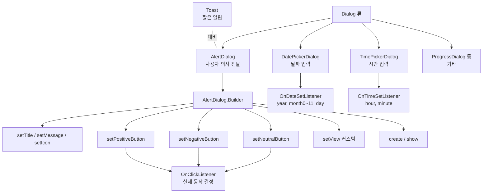

# 14. 모바일앱프로그래밍: 대화상자

## 🔗 선수 지식 (Prerequisites)
- [ ] **필수**: [11강. 액티비티와 인텐트](11강.md) - Activity·Context 개념 이해 완료?
- [ ] **필수**: [13강. 어댑터 뷰](13강.md) - View·이벤트 리스너(onClick) 동작 원리
- [ ] **권장**: Java 익명 클래스, Builder 디자인 패턴, 인터페이스 콜백
- **관련 단원**: [13강. 어댑터 뷰](13강.md), [15강.md](15강.md)

---

## 학습 목표
1. AlertDialog와 Builder를 생성하는 방법과 AlertDialog 버튼에 대한 처리 방법을 설명할 수 있다.
2. DatePickerDialog를 생성/실행하는 방법을 이해하고 구현할 수 있다.
3. TimePicker 위젯을 이용하여 TimePickerDialog를 생성/처리하는 방법을 이해하고 구현할 수 있다.

---

## 🧠 메타인지 체크 (학습 전/후 자기 평가)

### 학습 전 자기 평가
| 소주제 | 자신감 (1-5) |
| :--- | :--- |
| AlertDialog와 Builder 패턴 | |
| AlertDialog 버튼(positive/negative/neutral) 처리 | |
| DatePickerDialog / TimePickerDialog 생성과 콜백 | |

### 학습 후 교정 (학습 완료 후 작성)
| 소주제 | 학습 전 | 학습 후 | 실제 정답률 | 과신/과소 여부 |
| :--- | :--- | :--- | :--- | :--- |
| AlertDialog와 Builder 패턴 | | | | |
| AlertDialog 버튼 처리 | | | | |
| Date/TimePickerDialog 콜백 처리 | | | | |

> **활용법**: 학습 전 1분 → 자신감 기입, 학습 후 1분 → 나머지 기입. "과신" 영역이 실제 취약점.

---

## 📝 요약 (Summary)
1. 🔴 **AlertDialog**: 사용자에게 특정 메시지를 출력하고 사용자의 의사를 전달받을 수 있는 인터페이스를 제공하는 위젯. 단순 메시지뿐 아니라 버튼·리스트·커스텀 뷰까지 포함 가능하며, 생성자가 `protected`이므로 **직접 생성할 수 없고 `AlertDialog.Builder`를 사용**해야 한다.
2. 🔴 **AlertDialog.Builder**: AlertDialog 객체를 단계적으로 구성하기 위한 빌더 클래스. `setTitle()`, `setMessage()`, `setPositiveButton()`, `setNegativeButton()`, `setNeutralButton()`, `create()`/`show()` 등의 메서드를 체이닝해 호출한다.
3. 🔴 **AlertDialog 버튼 처리**: 버튼 텍스트는 문자열 상수를 **바로 지정 가능**하며, 버튼 이름(positive/negative/neutral)은 단지 **구분을 위한 것**이고 실제 동작은 등록된 `OnClickListener` 코드로 결정된다. 리스너가 비어 있어도 버튼은 화면에 나타난다.
4. 🔴 **DatePickerDialog**: 사용자가 손쉽게 **날짜 정보(년/월/일)** 를 입력할 수 있는 인터페이스를 제공하는 위젯. 생성 시 초기 날짜와 `OnDateSetListener`를 전달하여 사용자가 확인 시 콜백으로 결과를 받는다.
5. 🟡 **TimePickerDialog**: TimePicker 위젯을 이용해 사용자가 손쉽게 **시간 정보(시/분)** 를 입력할 수 있는 인터페이스를 제공. `OnTimeSetListener` 콜백을 통해 결과를 받으며, 24시간 형식 여부를 생성자 인자(`is24HourView`)로 지정한다.
6. 🟡 **Dialog vs Toast**: Toast는 **짧고 간단한** 메시지를 일시적으로 출력하는 용도. Dialog는 사용자와의 **상호작용**(확인/취소, 입력 등)이 필요할 때 사용. 역할이 명확히 구분된다.

---

## 📐 핵심 문법 및 패턴 (Key Syntax & Patterns)

| 패턴명 | 코드 | 용도 |
| :--- | :--- | :--- |
| **Builder 생성** | `AlertDialog.Builder b = new AlertDialog.Builder(this);` | AlertDialog 구성용 Builder 객체 생성 (Context 필요) |
| **제목/메시지 설정** | `b.setTitle("확인"); b.setMessage("저장하시겠습니까?");` | 다이얼로그 상단 제목과 본문 메시지 지정 |
| **아이콘 설정** | `b.setIcon(R.drawable.ic_info);` | 제목 옆 아이콘 표시 |
| **Positive 버튼** | `b.setPositiveButton("확인", (dialog, which) -> {...});` | 긍정 응답(확인/예/저장) 버튼 + 리스너 |
| **Negative 버튼** | `b.setNegativeButton("취소", null);` | 부정 응답(취소/아니오) 버튼. 리스너 null이면 단순 닫기 |
| **Neutral 버튼** | `b.setNeutralButton("나중에", listener);` | 중립 응답 버튼 (선택 보류 등) |
| **다이얼로그 표시** | `b.create().show();` 또는 `b.show();` | 다이얼로그 생성과 표시 |
| **커스텀 뷰 부착** | `b.setView(customView);` | EditText 등을 포함한 커스텀 레이아웃 부착 → 입력 받기 |
| **DatePickerDialog 생성** | `new DatePickerDialog(this, onDateSet, year, month, day).show();` | 날짜 선택 다이얼로그 생성/표시 |
| **DateSetListener** | `(view, y, m, d) -> { /* 선택 결과 처리 */ }` | 사용자가 확인 시 호출되는 콜백 (month는 0부터 시작) |
| **TimePickerDialog 생성** | `new TimePickerDialog(this, onTimeSet, hour, minute, true).show();` | 시간 선택 다이얼로그 (마지막 인자: 24시간 형식 여부) |
| **TimeSetListener** | `(view, h, m) -> { /* 선택 결과 처리 */ }` | 사용자가 확인 시 호출되는 콜백 (시, 분) |

### 주요 정의/원리

**AlertDialog와 Builder 패턴**
> AlertDialog는 생성자가 `protected`로 숨겨져 있어 외부에서 `new AlertDialog()`로 직접 생성할 수 없다. 대신 정적 내부 클래스 `AlertDialog.Builder`를 통해 단계적으로 속성(제목, 메시지, 버튼, 리스너 등)을 설정한 뒤 `create()` 또는 `show()`로 인스턴스를 얻는다. 이 구조는 **선택적 속성이 많고 불변 객체를 안전하게 만들고자 할 때** 사용하는 Builder 패턴의 전형이다.
>
> **AI 적용**: AI 추천 결과 화면에서 "추천을 적용할까요?"라는 AlertDialog로 사용자 확인을 받고, 거부 시 그 라벨을 모델 재학습 피드백 데이터로 수집.

**AlertDialog 버튼의 본질**
> 버튼 이름 positive/negative/neutral은 단순한 **구분자**일 뿐이며 OS가 자동으로 부여하는 의미가 따로 없다. 실제 동작은 `OnClickListener.onClick()` 안의 코드가 결정한다. 즉 "확인"이라는 텍스트의 버튼을 negative 슬롯에 등록해도 동작 자체에는 문제가 없다(다만 UX 관례상 적절치 않을 뿐). 리스너를 `null`로 두면 버튼을 눌렀을 때 다이얼로그가 닫히기만 한다.
>
> **AI 적용**: 동일한 Builder 패턴으로 챗봇 응답에 대한 "좋아요/싫어요/건너뛰기" 3버튼 피드백 UI를 구성하여 RLHF용 데이터를 손쉽게 수집.

**Picker Dialog의 콜백 구조**
> DatePickerDialog/TimePickerDialog는 **리스너 등록형 다이얼로그**의 대표 예. 생성 시점에 `OnDateSetListener`/`OnTimeSetListener`를 전달하면, 사용자가 OK를 누른 시점에 선택된 값과 함께 콜백이 호출된다. 주의: `DatePickerDialog`의 `month` 인자는 **0부터 시작**(0=1월)한다.
>
> **AI 적용**: 사용자의 일정/알람을 받아 추천 모델이 시간대별 활동 패턴을 학습.

---

## 📊 개념 시각화 (Visual Guide)

### 개념 관계도


### AlertDialog vs Toast 비교
| 입력 | 처리 | 출력 | 용도 |
| :--- | :--- | :--- | :--- |
| 사용자 의사결정 필요 | `AlertDialog.Builder` + Listener | 모달 대화상자, 사용자 응답까지 대기 | 저장 확인, 삭제 동의, 입력 받기 |
| 단순 알림 | `Toast.makeText().show()` | 일정 시간 후 자동 소멸, 응답 없음 | 작업 완료 안내, 짧은 상태 메시지 |

### Date/TimePicker 콜백 흐름
| 단계 | Date | Time |
| :--- | :--- | :--- |
| 1. 생성자 인자 | `(ctx, listener, y, m(0~11), d)` | `(ctx, listener, h, min, is24Hour)` |
| 2. 사용자 조작 | 년/월/일 휠 회전 | 시/분 휠 회전 |
| 3. OK 클릭 | `onDateSet(view, y, m, d)` 호출 | `onTimeSet(view, h, min)` 호출 |
| 4. 결과 사용 | TextView 표시 / 저장 | TextView 표시 / 알람 등록 |

---

## ✏️ 심화 학습 (Study Subject)

### 1. 가상 시나리오: "어떤 Dialog를, 언제 사용해야 할까?"
- **상황**: AI 건강관리 앱에서 사용자가 "운동 기록 추가" 버튼을 누르면 ① 운동 날짜와 시간을 입력받고, ② "이 기록을 저장하시겠습니까?"라고 확인을 받은 뒤, ③ 저장 완료를 알려야 한다.
- **문제**: 각 단계에 어떤 다이얼로그/위젯을 사용해야 가장 적절한가?
- **해결**:
  1. **날짜 입력 → `DatePickerDialog`**. 년/월/일을 직접 텍스트로 받으면 형식 오류와 검증 부담이 크다. 휠 UI로 잘못된 날짜 입력 자체를 막을 수 있다.
  2. **시간 입력 → `TimePickerDialog`**. 24시간/12시간 형식 통일이 자동 처리되며, 0~59 분 범위가 강제된다.
  3. **저장 확인 → `AlertDialog`** (Positive: 저장, Negative: 취소). 사용자 의사 확인이 필요한 모달 상호작용.
  4. **저장 완료 → `Toast`**. 단순 알림이며 후속 동작이 필요 없으므로 모달일 필요 없다.
- **AI 학습 포인트**: "운동 기록 데이터를 모아 사용자별 활동량 패턴을 LSTM으로 학습할 때, 날짜/시간 입력 UX 품질이 모델 성능에 어떤 영향을 줄까? 잘못된 시간 입력이 시계열 학습에 미치는 노이즈를 정량적으로 분석해 줘."

### 2. 관점별 비교 및 오개념 분석
- **핵심 비교**: AlertDialog vs Toast, AlertDialog vs DatePickerDialog (의사확인용 vs 데이터입력용), Builder 패턴 vs 직접 생성
- **오개념 분석**
    - **오개념 1**: "AlertDialog는 문자열 메시지만 출력할 수 있다."
    - **분석**: 틀림. AlertDialog는 `setView()`로 커스텀 레이아웃(EditText, ListView 등)을 부착할 수 있고, `setItems()`/`setSingleChoiceItems()`/`setMultiChoiceItems()`로 리스트형 선택 UI도 제공한다. 단순 메시지는 다양한 표현 중 하나일 뿐이다.
    - **오개념 2**: "AlertDialog의 버튼은 positive/negative/neutral이라는 이름에 따라 자동으로 다른 동작을 한다."
    - **분석**: 틀림. 버튼 이름은 슬롯의 구분자(레이아웃상 표시 위치)일 뿐이며, 실제 동작은 등록된 `OnClickListener` 코드가 100% 결정한다. 동일 리스너를 세 슬롯에 모두 달면 어느 버튼을 눌러도 같은 코드가 실행된다.
    - **오개념 3**: "AlertDialog는 `new AlertDialog()`로 직접 생성한다."
    - **분석**: 틀림. AlertDialog의 생성자는 `protected`로 외부에서 직접 호출할 수 없으며, 반드시 `AlertDialog.Builder`를 거쳐 `create()`/`show()`로 인스턴스를 얻는다.
    - **오개념 4**: "DatePickerDialog의 month 인자는 1부터 시작한다."
    - **분석**: 틀림. **0부터 시작**(0=1월, 11=12월). 사용자에게 표시할 때는 `month + 1`로 변환해야 한다. 같은 이유로 콜백 `onDateSet()`의 `month` 인자도 0-based.
    - **오개념 5**: "Toast는 사용자의 응답을 받을 수 있다."
    - **분석**: 틀림. Toast는 일정 시간 후 자동 사라지는 비모달 알림이며 클릭 응답을 받을 수 없다. 응답이 필요하면 AlertDialog 또는 Snackbar(action) 사용.
- **AI 학습 포인트**: "Builder 패턴이 안드로이드 UI 컴포넌트에서 자주 쓰이는 이유를 GoF 디자인 패턴 관점에서 설명해 줘. AlertDialog 외에 어떤 클래스가 동일 패턴을 채택했나?"

---

## ❓ 연습 문제 및 해설

> **블룸 인지 수준 범례**: [기억] 정의·나열 → [이해] 설명·비교 → [적용] 계산·구현 → [분석] 구별·디버그 → [평가] 판단·비평 → [창조] 설계·제안

### 📝 문제

**1. ⭐ [기억/이해] 📎 기출 AlertDialog에 대한 설명으로 옳은 것은?[(해설)](#prob-1)**
   > ① 문자열 메시지만 출력할 수 있다.
   > ② 사용자의 입력을 받아들일 수 없다.
   > ③ Toast보다 좀 더 짧고 간단한 메시지를 전달할 때 이용된다.
   > ④ 생성자가 protected로 숨겨져 있으므로 직접적으로 생성할 수 없다.

<br>

**2. ⭐ [기억/이해] 📎 기출 AlertDialog 버튼 표시 방법으로 옳지 않은 것은?[(해설)](#prob-2)**
   > ① 버튼의 텍스트는 문자열 상수를 바로 지정할 수 없다.
   > ② 버튼의 실제 의미는 구현된 코드로 결정된다.
   > ③ 버튼의 이름은 구분만을 위한 것이다.
   > ④ 클릭리스너가 비어 있더라도 버튼은 나타난다.

<br>

**3. ⭐⭐ 📌 [적용/분석] AlertDialog로 "삭제하시겠습니까?" 확인창을 띄우고 사용자가 "삭제"를 누르면 `deleteItem()`을 실행하려고 한다. 옳은 코드 조합은?[(해설)](#prob-3)**
   > <보기>
   >
   > 가. `new AlertDialog().setTitle("확인").show();`
   > 나. `new AlertDialog.Builder(this).setMessage("삭제하시겠습니까?").setPositiveButton("삭제", (d,w) -> deleteItem()).setNegativeButton("취소", null).show();`
   > 다. `AlertDialog.Builder b = new AlertDialog.Builder(this); b.setMessage("삭제하시겠습니까?"); b.setNeutralButton("삭제", (d,w) -> deleteItem()); b.create().show();`

   > ① 가
   > ② 나
   > ③ 나, 다
   > ④ 가, 나, 다

<br>

**4. ⭐⭐ 📌 [분석] 다음 DatePickerDialog 코드가 사용자에게 **2026년 5월 29일**로 초기 설정되어 표시되도록 하려면 인자를 어떻게 작성해야 하는가?[(해설)](#prob-4)**
   > ```java
   > new DatePickerDialog(this, listener, /* A */, /* B */, /* C */).show();
   > ```

   > ① A=2026, B=5, C=29
   > ② A=2026, B=4, C=29
   > ③ A=2026, B=29, C=5
   > ④ A=26, B=5, C=29

<br>

**5. ⭐⭐ 📌 [이해] TimePickerDialog에서 24시간 형식으로 표시하기 위한 인자 위치와 값으로 옳은 것은?[(해설)](#prob-5)**
   > ① 첫 번째 인자에 `true`
   > ② 두 번째 인자에 `"24"`
   > ③ 마지막(다섯 번째) 인자에 `true`
   > ④ 별도 인자 없이 시스템 설정을 자동 반영

<br>

**6. ⭐⭐⭐ 📌 [평가/창조] AlertDialog를 사용하면 좋은 경우와 Toast를 사용하면 좋은 경우를 (1) 사용자 응답 필요 여부, (2) 모달/비모달 특성, (3) 대표적 사용 사례 세 측면에서 비교 설명하시오.[(해설)](#prob-6)**

---

### 🔑 정답 및 해설 (먼저 풀어본 후 펼치기)

<details>
<summary>정답 보기 (클릭)</summary>

1. ④
2. ①
3. ②
4. ②
5. ③
6. 서술형 — 아래 해설 참조

</details>

<details>
<summary>해설 보기 (클릭)</summary>

<a id="prob-1"></a>
**1. ⭐ [기억/이해] AlertDialog의 정의**
> **정답: ④ 생성자가 protected로 숨겨져 있으므로 직접적으로 생성할 수 없다.**
> **해설**:
> - ① AlertDialog는 문자열뿐 아니라 버튼·리스트·커스텀 레이아웃 등 다양한 UI를 포함할 수 있다. **틀림**.
> - ② `setView()`로 EditText 등을 부착해 사용자 입력을 받을 수 있다. **틀림**.
> - ③ 짧고 간단한 메시지는 Toast의 역할. AlertDialog는 사용자와의 상호작용(확인·취소 등)에 사용. 역할이 반대. **틀림**.
> - ④ AlertDialog의 생성자는 `protected`이므로 `new AlertDialog()`로 직접 생성할 수 없고 반드시 `AlertDialog.Builder`를 통해 생성. **정답**.

<a id="prob-2"></a>
**2. ⭐ [기억/이해] AlertDialog 버튼 표시 방법**
> **정답: ① 버튼의 텍스트는 문자열 상수를 바로 지정할 수 없다.**
> **해설**:
> - ① `setPositiveButton("확인", listener)`처럼 "확인", "취소" 등 문자열 상수를 직접 지정할 수 있다. **틀림 → 정답**.
> - ② 버튼의 역할(확인/취소 등)은 이름이 아니라 클릭 시 실행되는 리스너 코드로 결정. **옳음**.
> - ③ positive/negative/neutral 이름은 사용자가 구분하기 위한 슬롯 표시일 뿐, 실제 기능은 코드가 정의. **옳음**.
> - ④ 버튼만 설정하면 리스너가 없어도(null) 화면에는 표시되며, 누르면 아무 동작 없이 닫힌다. **옳음**.

<a id="prob-3"></a>
**3. ⭐⭐ [적용/분석] AlertDialog 생성 코드**
> **정답: ② 나**
> **해설**:
> - 가: `new AlertDialog()` 직접 호출은 컴파일 에러. AlertDialog 생성자가 `protected`라 외부에서 호출 불가.
> - 나: Builder로 메시지·Positive·Negative 버튼을 모두 설정한 정석 패턴. `(d,w) -> deleteItem()`은 람다 리스너. **옳음**.
> - 다: 문법적으로는 실행되지만 "삭제"라는 긍정 액션을 Neutral 슬롯에 두는 것은 UX 관례 위반(엄밀히는 동작 자체는 가능하나, 출제 의도상 "옳은 코드"로 보기 어려움). 또한 "옳은 코드 조합"을 단일 정답으로 묻는다면 **나**가 명확한 정석.

<a id="prob-4"></a>
**4. ⭐⭐ [분석] DatePickerDialog의 month 인자**
> **정답: ② A=2026, B=4, C=29**
> **해설**: `DatePickerDialog(Context, OnDateSetListener, year, month, day)`에서 **month는 0부터 시작**(0=1월). 따라서 5월은 `4`. day는 1-based이므로 29일은 `29` 그대로. 콜백 `onDateSet()`의 month 인자도 동일하게 0-based이므로 사용자에게 표시할 때 `month + 1` 처리 필요.

<a id="prob-5"></a>
**5. ⭐⭐ [이해] TimePickerDialog의 24시간 형식**
> **정답: ③ 마지막(다섯 번째) 인자에 `true`**
> **해설**: `TimePickerDialog(Context, OnTimeSetListener, hourOfDay, minute, is24HourView)`에서 마지막 boolean 인자가 24시간 형식 여부. `true`면 0~23시 표시, `false`면 AM/PM 토글 형태. 시스템 로케일에 따라 자동 결정되지 않으므로 명시 필요.

<a id="prob-6"></a>
**6. ⭐⭐⭐ [평가/창조] AlertDialog vs Toast 비교**
> **정답(예시 답안)**:
>
> | 비교 항목 | AlertDialog | Toast |
> | :--- | :--- | :--- |
> | (1) 사용자 응답 | 응답 필요. 사용자가 버튼을 누르기 전까지 닫히지 않음 | 응답 불가. 메시지만 일방적으로 표시 |
> | (2) 모달/비모달 | **모달**: 다이얼로그가 떠 있는 동안 뒤 화면 상호작용 차단 | **비모달**: 일정 시간 후 자동 소멸, 사용자 작업 흐름 유지 |
> | (3) 사용 사례 | 삭제 확인, 저장 여부, 입력 받기, 선택지 제시 | "저장되었습니다", "네트워크 연결 끊김" 등 알림 |
>
> **요약**: 사용자에게 "결정을 받아야 한다" → AlertDialog, "알려주기만 하면 된다" → Toast. 응답 필요 여부가 가장 핵심적인 선택 기준.

</details>

---

## ✅ O/X 확인문제

**1.** AlertDialog는 사용자와의 상호작용 없이 단순히 메시지를 출력만 하는 용도이다.[(해설)](#ox-1) **(O / X)**
**2.** AlertDialog의 생성자는 protected이므로 `new AlertDialog(...)` 형식으로 직접 생성할 수 없다.[(해설)](#ox-2) **(O / X)**
**3.** AlertDialog를 만들 때는 일반적으로 `AlertDialog.Builder`를 사용한다.[(해설)](#ox-3) **(O / X)**
**4.** AlertDialog 버튼의 positive/negative/neutral 이름은 OS가 자동으로 다른 동작을 부여한다.[(해설)](#ox-4) **(O / X)**
**5.** AlertDialog 버튼은 OnClickListener를 등록하지 않으면 화면에 표시되지 않는다.[(해설)](#ox-5) **(O / X)**
**6.** AlertDialog에는 EditText 등을 포함한 커스텀 뷰를 부착할 수 있다.[(해설)](#ox-6) **(O / X)**
**7.** Toast는 사용자의 응답(클릭, 선택)을 받기 위한 위젯이다.[(해설)](#ox-7) **(O / X)**
**8.** DatePickerDialog의 생성자에 전달하는 month 인자는 0부터 시작한다(0=1월).[(해설)](#ox-8) **(O / X)**
**9.** DatePickerDialog의 `onDateSet()` 콜백에서 받는 day 인자는 0부터 시작한다.[(해설)](#ox-9) **(O / X)**
**10.** TimePickerDialog의 마지막 boolean 인자가 `true`이면 24시간 형식으로 표시된다.[(해설)](#ox-10) **(O / X)**
**11.** TimePickerDialog는 사용자가 OK를 누르면 `OnTimeSetListener`의 콜백을 호출한다.[(해설)](#ox-11) **(O / X)**
**12.** AlertDialog의 버튼 텍스트로 "확인", "취소" 같은 문자열 상수를 직접 지정할 수 있다.[(해설)](#ox-12) **(O / X)**

<details>
<summary>O/X 정답 및 해설 보기 (클릭)</summary>

> <a id="ox-1"></a>
> **1. 정답: X**
> **해설**: AlertDialog는 사용자 의사 확인·입력 등 상호작용용. 단순 알림은 Toast.

> <a id="ox-2"></a>
> **2. 정답: O**
> **해설**: 생성자가 `protected`이므로 외부에서 직접 호출 불가. Builder 사용 필수.

> <a id="ox-3"></a>
> **3. 정답: O**
> **해설**: `AlertDialog.Builder`로 속성을 설정하고 `create()`/`show()`로 인스턴스 획득.

> <a id="ox-4"></a>
> **4. 정답: X**
> **해설**: 이름은 슬롯 구분자일 뿐. 실제 동작은 OnClickListener 코드가 결정.

> <a id="ox-5"></a>
> **5. 정답: X**
> **해설**: 리스너 없이도(null 등록) 버튼은 표시되며, 누르면 다이얼로그가 닫히기만 한다.

> <a id="ox-6"></a>
> **6. 정답: O**
> **해설**: `setView(customView)`로 EditText 포함 커스텀 레이아웃 부착 가능 → 입력 받기.

> <a id="ox-7"></a>
> **7. 정답: X**
> **해설**: Toast는 일정 시간 후 자동 소멸되는 비모달 알림. 응답 수집 불가.

> <a id="ox-8"></a>
> **8. 정답: O**
> **해설**: `Calendar.JANUARY = 0` 관례에 따라 month는 0-based. 5월이면 `4`.

> <a id="ox-9"></a>
> **9. 정답: X**
> **해설**: day(dayOfMonth)는 **1-based**(1~31). 0부터 시작하는 것은 month뿐.

> <a id="ox-10"></a>
> **10. 정답: O**
> **해설**: `TimePickerDialog(ctx, listener, h, m, is24HourView)`의 마지막 인자가 `true`면 24시간 표기.

> <a id="ox-11"></a>
> **11. 정답: O**
> **해설**: 사용자가 OK 클릭 시 `onTimeSet(view, hour, minute)`이 호출된다.

> <a id="ox-12"></a>
> **12. 정답: O**
> **해설**: `setPositiveButton("확인", listener)`처럼 문자열 리터럴을 직접 전달 가능. R.string 리소스도 가능.

</details>

---

## 🧪 자유 회상 연습 (Free Recall)

> **방법**: 위의 노트를 모두 덮고, 타이머 3분 설정 후 이번 단원에서 배운 내용을 기억나는 대로 자유롭게 적으세요.
> 정확한 문장이 아니어도 됩니다. 키워드, 패턴, 콜백 시그니처 등 떠오르는 것을 모두 적습니다.

**자유 회상 작성란:**

```
[여기에 기억나는 내용을 자유롭게 작성]


```

> **회상 후 점검**: 노트를 다시 펼쳐 빠뜨린 내용을 확인하세요.
> - 회상 못한 핵심 개념: [                ]
> - 회상 못한 패턴/메서드: [                ]

---

## 💻 코드로 확인하기 (Code Verification)

### 1. AlertDialog (Java/Android)

```java
// MainActivity.java - 삭제 확인 다이얼로그
AlertDialog.Builder builder = new AlertDialog.Builder(this);
builder.setTitle("삭제 확인")
       .setMessage("이 항목을 삭제하시겠습니까?")
       .setIcon(android.R.drawable.ic_dialog_alert)
       .setPositiveButton("삭제", (dialog, which) -> {
           deleteItem();
           Toast.makeText(this, "삭제되었습니다", Toast.LENGTH_SHORT).show();
       })
       .setNegativeButton("취소", null)     // 리스너 null → 닫기만
       .setNeutralButton("나중에", (d, w) -> postpone());
AlertDialog dlg = builder.create();
dlg.show();
```

### 2. DatePickerDialog

```java
Calendar cal = Calendar.getInstance();
int y = cal.get(Calendar.YEAR);
int m = cal.get(Calendar.MONTH);      // 0-based
int d = cal.get(Calendar.DAY_OF_MONTH);

new DatePickerDialog(this, (view, year, month, dayOfMonth) -> {
    // month는 0-based이므로 표시 시 +1
    String picked = String.format("%d-%02d-%02d", year, month + 1, dayOfMonth);
    textView.setText(picked);
}, y, m, d).show();
```

### 3. TimePickerDialog

```java
Calendar cal = Calendar.getInstance();
int h = cal.get(Calendar.HOUR_OF_DAY);
int min = cal.get(Calendar.MINUTE);

new TimePickerDialog(this, (view, hourOfDay, minute) -> {
    String picked = String.format("%02d:%02d", hourOfDay, minute);
    textView.setText(picked);
}, h, min, true /* is24HourView */).show();
```

### 4. 개념 검증용 Python 의사코드

> 안드로이드는 JVM 기반이므로 아래는 동작 패턴을 Python으로 모사하여 **개념적으로** 검증한다.

```python
class AlertDialog:
    # 생성자가 'protected'임을 모사: 외부에서 직접 호출하지 못하도록
    def __init__(self, _from_builder=False, **kwargs):
        if not _from_builder:
            raise RuntimeError("생성자 protected: AlertDialog.Builder를 사용하세요")
        self.title = kwargs.get("title", "")
        self.message = kwargs.get("message", "")
        self.buttons = kwargs.get("buttons", {})

    class Builder:
        def __init__(self, ctx):
            self.ctx = ctx
            self._kwargs = {"buttons": {}}
        def setTitle(self, t):    self._kwargs["title"] = t;    return self
        def setMessage(self, m):  self._kwargs["message"] = m;  return self
        def setPositiveButton(self, text, listener):
            self._kwargs["buttons"]["positive"] = (text, listener); return self
        def setNegativeButton(self, text, listener):
            self._kwargs["buttons"]["negative"] = (text, listener); return self
        def setNeutralButton(self, text, listener):
            self._kwargs["buttons"]["neutral"] = (text, listener); return self
        def create(self): return AlertDialog(_from_builder=True, **self._kwargs)
        def show(self):   d = self.create(); d.show(); return d

    def show(self):
        print(f"[Dialog] {self.title} | {self.message}")
        for slot, (text, _) in self.buttons.items():
            print(f"  [{slot:>8}] {text}")
        return self
    def click(self, slot):
        text, listener = self.buttons[slot]
        if listener is None:
            print(f"  → '{text}' 클릭, 리스너 없음 → 닫기만")
        else:
            print(f"  → '{text}' 클릭, 리스너 실행")
            listener(self, slot)

# 1) 직접 생성 시도 → 예외
try:
    AlertDialog()
except RuntimeError as e:
    print("예외:", e)

# 2) Builder로 정석 생성
dlg = (AlertDialog.Builder(ctx="MainActivity")
       .setTitle("삭제 확인")
       .setMessage("이 항목을 삭제하시겠습니까?")
       .setPositiveButton("삭제", lambda d, w: print("  → deleteItem() 실행"))
       .setNegativeButton("취소", None)
       .show())

# 3) 버튼 클릭 시뮬레이션
dlg.click("positive")
dlg.click("negative")

# 4) Date/Time Picker 콜백 시뮬레이션
def on_date_set(view, year, month, day):  # month는 0-based
    print(f"[Date] 선택: {year}-{month+1:02d}-{day:02d}")
def on_time_set(view, hour, minute):
    print(f"[Time] 선택: {hour:02d}:{minute:02d}")

on_date_set(view="DatePicker", year=2026, month=4, day=29)  # 5월 29일
on_time_set(view="TimePicker", hour=14, minute=30)
```

> **실행 결과 (예상)**:
> ```
> 예외: 생성자 protected: AlertDialog.Builder를 사용하세요
> [Dialog] 삭제 확인 | 이 항목을 삭제하시겠습니까?
>   [positive] 삭제
>   [negative] 취소
>   → '삭제' 클릭, 리스너 실행
>   → deleteItem() 실행
>   → '취소' 클릭, 리스너 없음 → 닫기만
> [Date] 선택: 2026-05-29
> [Time] 선택: 14:30
> ```
> **해석**:
> ① AlertDialog 직접 생성은 예외 발생 → Builder 사용 강제.
> ② Positive 버튼은 등록된 리스너 실행, Negative는 리스너 null이므로 닫기만 수행 → "리스너 비어 있어도 버튼은 표시"의 의미를 확인.
> ③ DatePicker의 month는 0-based이므로 표시 시 `+1` 보정 필요(2026-5월 = month 4).

---

## 🤖 AI 연결고리 (Mobile → AI Application)

| 모바일 개념 | AI/ML 적용 분야 | 구체적 사례 |
| :--- | :--- | :--- |
| AlertDialog (Builder) | RLHF 피드백 UI | "이 답변이 도움이 되었나요?" Positive/Negative/Neutral로 챗봇 응답 평가 수집 |
| AlertDialog + 커스텀 View(EditText) | 사용자 라벨 입력 | 이미지 분류 결과에 사용자 보정 라벨 입력 → 능동학습(Active Learning) 데이터 |
| AlertDialog + setItems (리스트) | 추천 후보 선택 | AI가 제시한 Top-K 추천 중 사용자가 선택한 항목으로 랭킹 학습 |
| DatePickerDialog | 시계열 입력 | 사용자 일정/건강 기록 날짜 정규화 → 시계열 예측 모델 입력 |
| TimePickerDialog | 행동 패턴 학습 | 알람·운동 시간 → 시간대별 활동 패턴(LSTM/Transformer) 학습 |
| 리스너 콜백 | 비동기 추론 결과 처리 | 모델 추론 완료 콜백과 동일한 패턴 (관측자 패턴) |

---

## 📖 심화 학습 예시 답안

#### 1. AlertDialog의 내부 동작 원리

1. **Builder 객체 생성**: `new AlertDialog.Builder(context)` 호출 시 내부적으로 `AlertController.AlertParams`라는 매개변수 저장소를 초기화. 이후 `setTitle()`, `setMessage()`, `setXxxButton()` 호출은 모두 이 `AlertParams`에 값을 누적할 뿐 실제 Dialog 인스턴스는 만들지 않는다.
2. **create() 시점**: `create()` 호출 시 비로소 `AlertDialog` 인스턴스가 만들어지고 `AlertParams.apply(mAlert)`로 누적된 속성이 내부 `AlertController`에 적용된다. 이때 생성자가 `protected`라도 같은 패키지 내부의 Builder는 호출 가능하다.
3. **show() 시점**: 화면 인플레이션과 버튼 바인딩이 이루어진다. 각 버튼은 `Button` 위젯이며, 등록된 `OnClickListener`는 내부적으로 `DialogInterface.OnClickListener` 형태로 래핑되어 클릭 이벤트를 받는다.
4. **버튼 슬롯**: Positive/Negative/Neutral 세 슬롯은 레이아웃상 표시 위치(좌/우/중앙은 OS·테마에 따라 다름)만 결정할 뿐, 의미는 부여하지 않는다. 따라서 동일 코드를 세 슬롯에 모두 달면 동일하게 작동한다.

#### 2. AlertDialog vs DatePickerDialog 비교표

| 구분 | AlertDialog | DatePickerDialog |
| :--- | :--- | :--- |
| **정의** | 메시지 출력·의사 확인·입력 등 범용 모달 대화상자 | 날짜(년/월/일) 선택 전용 특화 대화상자 |
| **생성 방식** | `AlertDialog.Builder` 사용 강제(생성자 protected) | 생성자 직접 호출 가능(`new DatePickerDialog(...)`) |
| **사용자 응답 수단** | Positive/Negative/Neutral 버튼 + 커스텀 뷰 | 년/월/일 휠 + 자체 OK/Cancel 버튼 |
| **콜백 시그니처** | `OnClickListener.onClick(dialog, which)` | `OnDateSetListener.onDateSet(view, y, m(0-11), d)` |
| **적용 조건** | 의사확인·자유 입력 등 범용 | 날짜 입력에 특화(검증 자동) |
| **AI 활용** | RLHF/Active Learning 피드백 수집 | 시계열 라벨링, 일정 기반 추천 |

#### 3. AlertDialog Best Practice

- **Bad Practice (나쁜 예시)**
  ```java
  // ① 생성자 직접 호출 시도 - 컴파일 에러
  // AlertDialog dlg = new AlertDialog(this);

  // ② Builder를 만들어 두고 show()도 create()도 호출하지 않음 - 화면에 안 나타남
  AlertDialog.Builder b = new AlertDialog.Builder(this);
  b.setTitle("저장?").setMessage("저장하시겠습니까?");
  // 끝 — show() 누락
  ```
- **Good Practice (좋은 예시)**
  ```java
  // 명확한 메시지 + 리스너 + setCancelable로 의도 표현
  new AlertDialog.Builder(this)
      .setTitle(R.string.confirm_save_title)
      .setMessage(R.string.confirm_save_message)
      .setPositiveButton(R.string.save, (d, w) -> save())
      .setNegativeButton(R.string.cancel, null)
      .setCancelable(false)   // 바깥 영역 터치/뒤로가기로 닫히지 않음
      .show();                 // create()+show()를 한 번에
  ```
- **설명**:
  - 문자열은 `R.string.xxx` 리소스로 두면 다국어 대응이 쉬움.
  - 단순 "닫기"만 원하는 버튼의 리스너는 `null`로 두면 코드가 간결.
  - 중요한 결정은 `setCancelable(false)`로 의도치 않은 dismiss 방지.
  - `show()`만 호출하면 내부에서 `create()`까지 처리하므로 코드가 짧아짐.

---

## 📚 핵심 용어집 (Glossary)

| 용어 (한) | 용어 (영) | 코드/표현 | 정의 |
| :--- | :--- | :--- | :--- |
| **경고 대화상자** | AlertDialog | `AlertDialog.Builder(ctx).show()` | 사용자에게 메시지를 전달하고 응답(버튼 클릭 등)을 받는 모달 대화상자 |
| **빌더** | Builder | `AlertDialog.Builder` | AlertDialog 객체를 단계적으로 구성하기 위한 정적 내부 클래스 (Builder 패턴) |
| **긍정 버튼** | Positive Button | `setPositiveButton("확인", listener)` | 긍정 응답 슬롯의 버튼. 이름은 구분자일 뿐 동작은 리스너 코드가 결정 |
| **부정 버튼** | Negative Button | `setNegativeButton("취소", null)` | 부정 응답 슬롯의 버튼. 리스너 null이면 단순 닫기 |
| **중립 버튼** | Neutral Button | `setNeutralButton("나중에", listener)` | 중립 응답 슬롯의 버튼 (보류·선택 유보용) |
| **클릭 리스너** | DialogInterface.OnClickListener | `(dialog, which) -> {...}` | 다이얼로그 버튼 클릭 시 호출되는 콜백 (`which`는 어떤 버튼인지 식별) |
| **날짜 선택 대화상자** | DatePickerDialog | `new DatePickerDialog(ctx, l, y, m, d)` | 년/월/일을 휠 UI로 입력받는 대화상자 (month는 0-based) |
| **시간 선택 대화상자** | TimePickerDialog | `new TimePickerDialog(ctx, l, h, m, is24)` | 시/분을 휠 UI로 입력받는 대화상자 (마지막 인자는 24시간 형식 여부) |
| **날짜 설정 리스너** | OnDateSetListener | `(view, y, m, d) -> {...}` | DatePicker의 OK 클릭 시 호출되는 콜백. month는 0-based |
| **시간 설정 리스너** | OnTimeSetListener | `(view, h, min) -> {...}` | TimePicker의 OK 클릭 시 호출되는 콜백 |
| **토스트** | Toast | `Toast.makeText(ctx, msg, len).show()` | 짧은 시간 표시되는 비모달 알림. 응답 수집 불가 →←11강 |
| **컨텍스트** | Context | `this` (Activity) | 다이얼로그 생성에 필요한 환경 객체. 일반적으로 Activity 자신 →←11강 |

---

## 🤖 AI 학습 파트너를 위한 추가 자료

### 1. 개념 이해를 위한 심층 질문 프롬프트
> **프롬프트 예시**: "안드로이드 AlertDialog가 Builder 패턴을 강제로 채택한 이유를 설명해 줘. 만약 생성자가 public이었다면 어떤 문제(불완전한 객체, 누락된 필수 속성, 스레드 안전성 등)가 발생했을지 구체적인 코드 예시와 함께 분석해 줘. 더불어 Notification.Builder, Retrofit.Builder 등 다른 Android Builder 사례와 공통점을 정리해 줘."

### 2. 문제 해결 능력 강화를 위한 시나리오 프롬프트
> **프롬프트 예시**: "당신은 안드로이드 시니어 개발자입니다. AI 일정 관리 앱에서 사용자가 '운동 알람 추가'를 누르면 (1) 운동 종류 선택, (2) 날짜 선택, (3) 시간 선택, (4) 최종 확인 4단계 입력이 필요합니다. AlertDialog(setItems), DatePickerDialog, TimePickerDialog, AlertDialog(확인)을 어떤 순서로 조합하고, 사용자가 중간에 취소했을 때의 상태 관리(State Hoisting)는 어떻게 처리해야 할지 코드 흐름을 설계해 줘."

### 3. 코드 검증 프롬프트
> **프롬프트 예시**: "다음 코드의 버그를 찾아 줘.
> ```java
> new DatePickerDialog(this, (view, year, month, day) -> {
>     textView.setText(year + \"-\" + month + \"-\" + day);
> }, 2026, 5, 29).show();
> ```
> 1. 사용자가 보게 될 초기 날짜와, OK를 눌렀을 때 표시되는 텍스트가 무엇이 잘못되었는지 지적해 줘.
> 2. 올바른 코드로 수정하고, 같은 버그를 방지하기 위한 헬퍼 함수(extension function)를 제안해 줘."

---

## 🔄 복습 체크 (Spaced Repetition)
- [ ] 1일 후 복습 (날짜: 2026-05-30)
- [ ] 3일 후 복습 (날짜: 2026-06-01)
- [ ] 7일 후 복습 (날짜: 2026-06-05)
- [ ] 14일 후 복습 (날짜: 2026-06-12)
- [ ] 30일 후 복습 (날짜: 2026-06-28)

### 복습 시 자가 평가
| 회차 | 날짜 | 이해도 (1-5) | 취약 부분 메모 |
| :--- | :--- | :--- | :--- |
| 1차 | | | |
| 2차 | | | |
| 3차 | | | |

---

## 📚 참고 자료 (References)

- 한국방송통신대학교 - 모바일앱프로그래밍 14강 강의자료 (대화상자)
- Android Developers Guide - [Dialogs](https://developer.android.com/develop/ui/views/components/dialogs)
- Android Developers Guide - [Pickers](https://developer.android.com/develop/ui/views/components/pickers)
- Android API Reference - [AlertDialog.Builder](https://developer.android.com/reference/android/app/AlertDialog.Builder)
- GoF Design Patterns - Builder Pattern (Erich Gamma et al., 1994)
