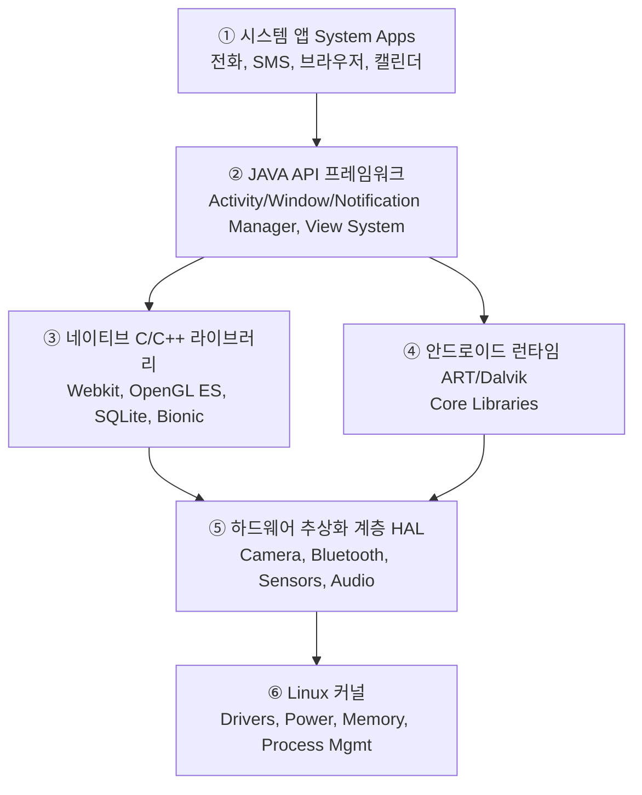
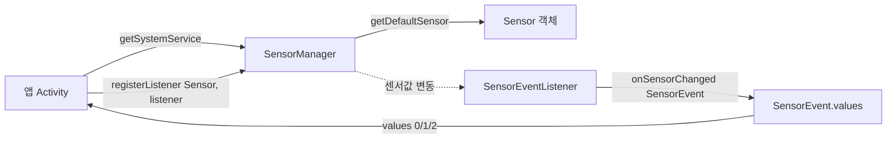

# 15. 모바일앱프로그래밍: 정리 (안드로이드 아키텍처와 센서 시스템 총정리)

## 🔗 선수 지식 (Prerequisites)
- [ ] **필수**: [1강 - 안드로이드 프로젝트와 앱의 동작 원리](1강.md) - 이해 완료?
- [ ] **필수**: [9강 - 이벤트 처리 1](9강.md) - 이해 완료?
- [ ] **필수**: [10강 - 이벤트 처리 2 (터치·키·위젯·타이머·센서)](10강.md) - 이해 완료?
- [ ] **권장**: JVM/가상머신의 동작 원리, AOT vs JIT 컴파일 차이
- [ ] **권장**: 옵저버(Observer) 패턴 — 센서 콜백을 이해하기 위한 디자인 패턴
- **관련 단원**: 14강 (대화상자) — UI 갱신과 센서 콜백 스레드 모델

---

## 학습 목표
1. 안드로이드 런타임의 종류(Dalvik, ART)와 차이를 설명할 수 있다.
2. 안드로이드 플랫폼 아키텍처 6계층(System App ~ Linux Kernel)의 역할을 구분할 수 있다.
3. 센서 사용을 위한 4종 클래스/인터페이스(SensorManager, Sensor, SensorEventListener, SensorEvent)의 역할 차이를 설명할 수 있다.
4. AdapterView·DatePickerDialog·TimePickerDialog의 생성/실행 흐름을 종합적으로 이해할 수 있다.

---

## 🧠 메타인지 체크 (학습 전/후 자기 평가)

### 학습 전 자기 평가
| 소주제 | 자신감 (1-5) |
| :--- | :--- |
| Dalvik vs ART (JIT vs AOT) | |
| 안드로이드 아키텍처 6계층 구조 | |
| 센서 4종 클래스의 역할 구분 | |
| HAL과 JAVA API 프레임워크의 경계 | |

### 학습 후 교정 (학습 완료 후 작성)
| 소주제 | 학습 전 | 학습 후 | 실제 정답률 | 과신/과소 여부 |
| :--- | :--- | :--- | :--- | :--- |
| Dalvik vs ART | | | | |
| 안드로이드 아키텍처 6계층 | | | | |
| 센서 4종 클래스 | | | | |
| HAL의 위치와 역할 | | | | |

> **활용법**: 학습 전 1분 → 자신감 기입, 학습 후 1분 → 나머지 기입. "과신" 영역이 실제 취약점.

---

## 📝 요약 (Summary)

1. **런타임(Runtime)** 🟡: 컴퓨터 프로그램이 실행되고 있는 동안의 동작.
2. **Dalvik** 🔴: JIT(JustInTime) 방식의 컴파일 환경을 기반으로 한 안드로이드 스마트폰의 가상머신.
3. **ART(Android RunTime)** 🔴: 앱 설치 시점에 컴파일을 끝내고 앱을 실행하는 안드로이드 스마트폰의 가상머신.
4. **시스템 앱(System App)** 🟡: 사용자를 위한 앱 또는 개발자가 자신의 앱에서 액세스 할 수 있는 안드로이드 프레임워크와 함께 제공되는 기본 구성 앱.
5. **JAVA API 프레임워크** 🔴: 앱들이 사용하는 프레임워크를 제공하며, 개발자들이 앱 개발에 필요한 각종 클래스와 메소드에 대한 JAVA API를 제공.
6. **네이티브 C/C++ 라이브러리** 🟡: Bionic, Webkit, Audio Manager, 미디어 라이브러리, Surface Manager, SGL, 3D 라이브러리(OpenGL ES), SQLite, FreeType, LibWebCore, Media Framework 등을 포함하는 C/C++ 라이브러리를 제공.
7. **안드로이드 런타임(Android Runtime)** 🟡: 안드로이드에서 앱 프로세스들을 관리하기 위한 컴파일러나 가상머신이 사용하는 코드 집합체로, 안드로이드 앱의 실행환경 제공.
8. **하드웨어 추상화 계층(HAL)** 🔴: JAVA API 프레임워크에 하드웨어 기능을 제공하는 표준 인터페이스를 제공.
9. **Linux 커널** 🟡: 안드로이드 프레임워크 계층의 최하단에 위치하며, 안드로이드 시스템에 대한 자원 관리.
10. **SensorManager** 🔴: 센서에 접근하게 해 줄 수 있는 메소드들을 제공함. `→←10강`
11. **Sensor** 🔴: SensorManager 클래스의 메소드를 활용해 접근하고자 하는 센서의 객체를 선언함.
12. **SensorEventListener** 🔴: 센서값이 변경되면 SensorManager를 통해 이벤트 형태로 변경된 센서값을 전달받을 수 있게 함.
13. **SensorEvent** 🔴: 센서에 대한 정보를 담고 있고 객체를 통해 센서값들을 획득할 수 있으며, 이를 통해 센서값에 접근할 수 있음.

---

## 📐 핵심 정의 및 원리 (Key Definitions & Principles)

> **과목 유형**: 이론 중심 → 수식 테이블 대신 **정의명 / 내용 / 키워드** 테이블로 대체.

### 1. 런타임 환경 비교

| 정의명 | 내용 | 키워드 |
| :--- | :--- | :--- |
| **런타임(Runtime)** | 프로그램이 실제로 실행되는 동안의 동작 환경 전반 | 실행 시점, 환경 |
| **Dalvik** | JIT(Just-In-Time) 컴파일 방식. 앱을 실행할 때마다 바이트코드를 기계어로 번역. 설치는 빠르지만 실행 시점에 변환 부담 | JIT, 레지스터 기반 VM, 구버전 |
| **ART (Android RunTime)** | AOT(Ahead-Of-Time) 컴파일 방식. **앱 설치 시점에 미리 컴파일**을 끝내 둠. 설치는 느리지만 실행은 빠르고 배터리 소모도 감소 | AOT, 설치 시 컴파일, 성능 향상 |

### 2. 안드로이드 플랫폼 아키텍처 (상→하 계층)

| 계층 | 정의명 | 내용 | 키워드 |
| :--- | :--- | :--- | :--- |
| ① | **시스템 앱 (System App)** | 사용자/개발자가 액세스할 수 있는 안드로이드 프레임워크와 함께 제공되는 기본 구성 앱 (전화, SMS, 캘린더, 브라우저 등) | 기본 제공 앱, 사용자 접점 |
| ② | **JAVA API 프레임워크** | 앱들이 사용하는 프레임워크 제공. 개발자에게 각종 클래스/메소드 JAVA API 제공 (Activity Manager, Window Manager, Content Provider, View System, Notification Manager 등) | API, 앱 개발 인터페이스 |
| ③ | **네이티브 C/C++ 라이브러리** | Bionic, Webkit, Audio Manager, 미디어 라이브러리, Surface Manager, SGL, 3D 라이브러리(OpenGL ES), SQLite, FreeType, LibWebCore, Media Framework 등 | 네이티브 코드, 고성능 처리 |
| ④ | **안드로이드 런타임 (Android Runtime)** | 앱 프로세스 관리용 컴파일러/가상머신이 사용하는 코드 집합체. 앱 실행환경 제공 (ART/Dalvik + Core Libraries) | VM, 핵심 라이브러리 |
| ⑤ | **하드웨어 추상화 계층 (HAL)** | **JAVA API 프레임워크에 하드웨어 기능을 제공하는 표준 인터페이스** 제공. 카메라/블루투스/센서 등 모듈로 구성 | 표준 인터페이스, 하드웨어 추상화 |
| ⑥ | **Linux 커널** | 프레임워크 계층의 **최하단**. 시스템 자원 관리 (메모리, 프로세스, 드라이버, 전원) | 자원 관리, 드라이버 |

> **🔴 출제 포인트**: 각 계층의 "정의 한 줄"이 그대로 객관식 선택지로 자주 나옴. 계층끼리 설명을 바꿔치기하는 함정 문항이 단골이다.

### 3. 센서 사용을 위한 4종 클래스/인터페이스 `→←10강`

| 정의명 | 종류 | 내용 (역할) | 키워드 |
| :--- | :--- | :--- | :--- |
| **SensorManager** | 클래스 | 센서에 접근하게 해 줄 수 있는 **메소드들을 제공**. `getSystemService(SENSOR_SERVICE)`로 획득. 센서 목록 조회, 리스너 등록/해제 담당 | 접근 진입점, 등록/해제 |
| **Sensor** | 클래스 | SensorManager의 메소드를 활용해 **접근하고자 하는 센서의 객체를 선언**. 타입(TYPE_ACCELEROMETER 등)·이름·벤더 등 정보 보유 | 센서 객체, 정보 |
| **SensorEventListener** | 인터페이스 | 센서값이 변경되면 SensorManager를 통해 **이벤트 형태로 변경된 센서값을 전달**받게 함. `onSensorChanged()`, `onAccuracyChanged()` 콜백 정의 | 콜백, 이벤트 수신 |
| **SensorEvent** | 클래스 | 센서에 대한 정보를 담고 있고 **객체를 통해 센서값들(`values[]`)을 획득**할 수 있음. 센서값에 접근하는 데이터 컨테이너 | values[], timestamp |

---

## 📊 개념 시각화 (Visual Guide)

### 안드로이드 아키텍처 계층도



### 센서 4종 클래스 협력 관계도



### 핵심 도식: 런타임 동작 비교

| 입력 | 컴파일 시점 | 실행 시 동작 | 사용자 체감 | 결과 |
| :--- | :--- | :--- | :--- | :--- |
| `.apk` (DEX 바이트코드) | **Dalvik (JIT)**: 앱 실행 시마다 일부 번역 | 매 실행마다 변환 오버헤드 | 설치 빠름 / 실행 느림 | 안드로이드 4.4 이하 |
| `.apk` (DEX 바이트코드) | **ART (AOT)**: **설치 시점에 전체 컴파일** | 이미 컴파일된 네이티브 코드 즉시 실행 | 설치 느림 / 실행 빠름 | 안드로이드 5.0 이상 |

---

## ✏️ 심화 학습 (Study Subject)

### 1. 가상 시나리오: "어떤 계층/클래스를, 언제 사용해야 할까?"
- **상황**: 새로 구매한 안드로이드 스마트워치 앱을 만들어야 한다. 심박수 센서(하드웨어)에서 값을 읽어 사용자 UI에 표시하고, 동시에 OpenGL ES로 그래프를 그려야 한다.
- **문제**: 이 요구사항을 구현할 때 안드로이드 아키텍처의 어떤 계층, 그리고 센서 시스템의 어떤 클래스/인터페이스가 어떤 순서로 협력하는가?
- **해결**:
  1. **Linux 커널**의 심박 센서 드라이버가 하드웨어를 인식.
  2. **HAL**이 드라이버를 표준 인터페이스(센서 모듈)로 추상화.
  3. **안드로이드 런타임 + 네이티브 C/C++ 라이브러리**(OpenGL ES)가 그래픽 처리 담당.
  4. **JAVA API 프레임워크**(View System, SensorManager API)가 앱이 호출할 수 있는 형태로 노출.
  5. 앱(시스템 앱이 아닌 사용자 앱) 코드에서: `SensorManager` 획득 → `Sensor` 객체 선언 → `SensorEventListener` 구현 → `SensorEvent.values[]`로 값 추출 → `View`에 표시.
- **AI 학습 포인트**: "만약 HAL이 없다면 앱 개발자는 어떤 추가 작업을 해야 할까? 하드웨어 벤더별 코드가 앱에 흩어졌을 때의 유지보수 비용을 추정해 줘."

### 2. 관점별 비교 및 오개념 분석

- **핵심 비교 1: Dalvik vs ART**

| 구분 | Dalvik | ART |
| :--- | :--- | :--- |
| 컴파일 방식 | JIT (Just-In-Time) | **AOT (Ahead-Of-Time)** |
| 컴파일 시점 | 앱 실행 중 | **앱 설치 시** |
| 설치 속도 | 빠름 | 느림 |
| 실행 속도 | 느림 (실행 시 변환) | **빠름 (이미 변환됨)** |
| 배터리 | 상대적 소모 큼 | 상대적 소모 작음 |
| 등장 | Android 1.0~4.4 | Android 5.0(Lollipop)~ |

> 📌 **도입 시점 보완**: ART는 Android **4.4(KitKat)에서 실험적(프리뷰)으로 처음 도입**(개발자 옵션으로 선택)되었고, **5.0(Lollipop)에서 기본 런타임이 되며 Dalvik을 완전히 대체**했다. 따라서 "5.0~ 기본"과 "4.4 프리뷰 존재"는 모순이 아니라 도입 단계의 차이다. (근거: https://en.wikipedia.org/wiki/Android_Runtime )

- **핵심 비교 2: SensorManager vs Sensor vs SensorEventListener vs SensorEvent**

| 구분 | SensorManager | Sensor | SensorEventListener | SensorEvent |
| :--- | :--- | :--- | :--- | :--- |
| 종류 | 클래스 (서비스) | 클래스 (객체) | **인터페이스** | 클래스 (데이터) |
| 역할 | 접근/등록/해제 진입점 | 개별 센서 정보 | 변화 이벤트 콜백 | 변화된 값 컨테이너 |
| 핵심 멤버 | `getDefaultSensor()`, `registerListener()` | `getType()`, `getName()` | `onSensorChanged()` | `values[]`, `timestamp` |

- **오개념 분석**

    - **오개념 1**: "Sensor 클래스가 센서값을 들고 있다."
    - **분석**: ❌. Sensor 클래스는 **센서의 메타정보(타입·이름·해상도·전력소모 등)** 만 보유한다. 실제로 시시각각 변하는 **센서값**은 `SensorEvent.values[]`를 통해 전달된다. (📎 기출 Q2 ④번 오답 함정과 동일)

    - **오개념 2**: "ART는 앱을 실행할 때 컴파일한다."
    - **분석**: ❌. ART는 **설치 시점(AOT)** 에 미리 컴파일한다. 실행할 때마다 컴파일하는 것은 Dalvik(JIT) 방식이다. (📎 기출 Q1 ③·④ 함정과 직결)

    - **오개념 3**: "HAL은 앱이 직접 호출하는 API이다."
    - **분석**: ❌. HAL은 **JAVA API 프레임워크가 하드웨어를 표준화된 방식으로 제어**하기 위한 인터페이스 계층이다. 앱은 보통 JAVA API 프레임워크를 통해 간접적으로 HAL을 거치게 된다.

- **AI 학습 포인트**: "Dalvik과 ART의 차이를 '도서관에서 책을 빌리는 방식'에 비유해서 설명해 줘. 어떤 비유가 가장 직관적인지 비교해 줘."

---

## ❓ 연습 문제 및 해설

> **블룸 인지 수준 범례**: [기억] 정의·나열 → [이해] 설명·비교 → [적용] 계산·구현 → [분석] 구별·디버그 → [평가] 판단·비평 → [창조] 설계·제안

### 📝 문제

**1. ⭐ [기억/이해] 📎 기출 ART(Android RunTime)에 대한 설명으로 옳은 것은?([#prob-1](#prob-1))**
   > ① 앱 설치 시점에 컴파일을 끝내고 앱을 실행하는 안드로이드 스마트폰의 가상머신
   > ② 사용자를 위한 앱 또는 개발자가 자신의 앱에서 액세스 할 수 있는 안드로이드 프레임워크와 함께 제공되는 기본 구성 앱
   > ③ 앱들이 사용하는 프레임워크를 제공하며, 개발자들이 앱 개발에 필요한 각종 클래스와 메소드에 대한 JAVA API를 제공
   > ④ JAVA API프레임워크에 하드웨어 기능을 제공하는 표준 인터페이스를 제공

<br>

**2. ⭐ [기억/이해] 📎 기출 Sensor 클래스에 대한 설명으로 옳은 것은?([#prob-2](#prob-2))**
   > ① 센서에 접근하게 해 줄 수 있는 메소드들을 제공함
   > ② SensorManager 클래스의 메소드를 활용해 접근하고자 하는 센서의 객체를 선언함
   > ③ 센서값이 변경되면 SensorManager를 통해 이벤트 형태로 변경된 센서값을 전달받을 수 있게 함
   > ④ 센서에 대한 정보를 담고 있고 객체를 통해 센서값들을 획득할 수 있으며, 이를 통해 센서값에 접근할 수 있음

<br>

**3. ⭐⭐ 📌 [적용/분석] 안드로이드 아키텍처에서 다음 설명에 해당하는 계층은? ([#prob-3](#prob-3))**
   > <보기>
   >
   > 가. JAVA API 프레임워크에 하드웨어 기능을 제공하는 표준 인터페이스를 제공한다.
   > 나. 카메라, 블루투스, 센서 등의 모듈로 구성된다.
   > 다. 앱이 직접 호출하는 사용자 인터페이스 계층이다.

   > ① 가, 나
   > ② 가, 다
   > ③ 나, 다
   > ④ 가, 나, 다

<br>

**4. ⭐⭐ 📌 [이해/분석] 다음 중 Dalvik과 ART의 차이를 잘못 설명한 것은? ([#prob-4](#prob-4))**
   > ① Dalvik은 JIT, ART는 AOT 방식을 사용한다.
   > ② ART는 앱 설치 시점에 컴파일을 끝낸다.
   > ③ Dalvik이 ART보다 실행 속도가 빠르다.
   > ④ ART는 Android 5.0(Lollipop) 이후 기본 런타임이다.

<br>

**5. ⭐⭐⭐ 📌 [평가/창조] 다음은 가속도 센서값을 읽는 안드로이드 코드의 일부이다. 빈칸 (가)~(라)에 들어갈 클래스/인터페이스명을 순서대로 쓰시오. ([#prob-5](#prob-5))**

```java
// (가) sm = (___) getSystemService(SENSOR_SERVICE);
// (나) accel = sm.getDefaultSensor(Sensor.TYPE_ACCELEROMETER);
// sm.registerListener(this, accel, SensorManager.SENSOR_DELAY_NORMAL);
//
// @Override
// public void onSensorChanged( (다) event) {
//     float x = event.(라)[0];
//     float y = event.(라)[1];
//     float z = event.(라)[2];
// }
// // (this 객체가 구현해야 할 인터페이스명도 함께 답하시오.)
```

---

### 🔑 정답 및 해설 (먼저 풀어본 후 펼치기)

<details>
<summary>정답 보기 (클릭)</summary>

1. ①
2. ④
3. ①
4. ③
5. (가) SensorManager / (나) Sensor / (다) SensorEvent / (라) values / 인터페이스: SensorEventListener

</details>

<details>
<summary>해설 보기 (클릭)</summary>

<a id="prob-1"></a>
**1. ⭐ [기억/이해] 📎 ART(Android RunTime)에 대한 설명**
> **정답: ①**
> **해설**: ART는 **앱 설치 시점에 AOT(Ahead-Of-Time)** 로 컴파일을 마쳐 두는 가상머신이므로 ①이 맞다.
> - ② "사용자를 위한 앱 / 기본 구성 앱"은 **시스템 앱(System App)** 설명.
> - ③ "프레임워크 제공·JAVA API 제공"은 **JAVA API 프레임워크** 설명. ART는 런타임이지 API 제공 계층이 아니다.
> - ④ "JAVA API 프레임워크에 하드웨어 기능을 제공하는 표준 인터페이스"는 **HAL** 설명.

<a id="prob-2"></a>
**2. ⭐ [기억/이해] 📎 Sensor 클래스에 대한 설명**
> **정답: ④**
> **해설**: Sensor 클래스는 **센서에 대한 정보를 담은 객체**이며, 이 객체를 통해 (SensorManager·SensorEvent와 협력해) 센서값에 접근할 수 있게 한다.
> - ① "접근 메소드들을 제공"은 **SensorManager**.
> - ② "SensorManager 메소드로 접근하고자 하는 객체를 선언"은 사용 방식 설명일 뿐 클래스 정의가 아님. 출제 의도상 함정.
> - ③ "센서값 변경 시 이벤트 전달"은 **SensorEventListener**.
>
> ⚠️ 주의: 본 강의(15강 정리하기)의 분류 기준에 따라 ④가 정답으로 채택됨. 실제 안드로이드 SDK에서는 ④의 "센서값 획득"은 SensorEvent의 역할에 더 가깝지만, 시험은 **교재 본문 문구**에 따라 채점된다.
>
> ⚠️ **정의표와의 모순 명시**: 본문 핵심 정의표(§3)는 **Sensor = 센서 객체·정보 보유**, **SensorEvent = `values[]`로 센서값 획득**으로 구분하는데, 이 표 기준으로 보면 ④의 서술("객체를 통해 센서값들을 획득")은 사실상 **SensorEvent**에 가깝다. 즉 정답 ④와 정의표가 기술적으로 모순된다. 교재 문구 기준으로 **④를 정답으로 유지**하되, 실제 SDK상 ④ 서술은 SensorEvent의 역할임을 인지하고 함정에 주의해야 한다.

<a id="prob-3"></a>
**3. ⭐⭐ 📌 HAL 계층의 특징**
> **정답: ① 가, 나**
> **해설**: HAL은 JAVA API 프레임워크가 하드웨어를 표준화된 방식으로 다루도록 하는 **중간 계층**으로, 카메라·블루투스·센서·오디오 등의 모듈로 구성된다(가, 나 ○).
> - 다 ✗: 앱이 직접 호출하는 것은 **JAVA API 프레임워크**이며, HAL은 그 아래에서 동작하는 추상화 계층이다.

<a id="prob-4"></a>
**4. ⭐⭐ 📌 Dalvik vs ART**
> **정답: ③**
> **해설**: ART는 AOT로 미리 컴파일해 두므로 **실행 속도는 ART가 Dalvik보다 빠르다**. ③은 정반대로 진술되어 잘못된 설명이다.
> - ①②④는 모두 옳다.

<a id="prob-5"></a>
**5. ⭐⭐⭐ 📌 센서 코드 빈칸 채우기**
> **정답**: (가) **SensorManager** / (나) **Sensor** / (다) **SensorEvent** / (라) **values** / 구현 인터페이스: **SensorEventListener**
> **해설**:
> 1. `getSystemService(SENSOR_SERVICE)`의 반환값은 **SensorManager** 타입으로 캐스팅한다 → (가).
> 2. 특정 센서 객체는 `Sensor` 타입이며 `getDefaultSensor()`로 획득한다 → (나).
> 3. 콜백 `onSensorChanged()`의 파라미터는 `SensorEvent` 객체 → (다).
> 4. SensorEvent의 센서값 배열은 `values[]` → (라).
> 5. `onSensorChanged()`, `onAccuracyChanged()` 콜백을 정의하려면 `this`가 **SensorEventListener** 인터페이스를 구현해야 한다.

</details>

---

## ✅ O/X 확인문제 (10문항)

**1.** Dalvik은 AOT 방식 가상머신이다.([#ox-1](#ox-1)) **(O / X)**
**2.** ART는 앱 설치 시점에 미리 컴파일을 끝낸다.([#ox-2](#ox-2)) **(O / X)**
**3.** Linux 커널은 안드로이드 프레임워크 계층의 최상단에 위치한다.([#ox-3](#ox-3)) **(O / X)**
**4.** HAL은 JAVA API 프레임워크에 하드웨어 기능을 제공하는 표준 인터페이스이다.([#ox-4](#ox-4)) **(O / X)**
**5.** 네이티브 C/C++ 라이브러리에는 SQLite, OpenGL ES, Webkit 등이 포함된다.([#ox-5](#ox-5)) **(O / X)**
**6.** SensorManager는 인터페이스이며, 앱이 직접 구현해야 한다.([#ox-6](#ox-6)) **(O / X)**
**7.** SensorEventListener는 인터페이스로, `onSensorChanged()`와 `onAccuracyChanged()`를 정의한다.([#ox-7](#ox-7)) **(O / X)**
**8.** SensorEvent의 `values` 배열을 통해 변화된 센서값을 얻을 수 있다.([#ox-8](#ox-8)) **(O / X)**
**9.** 시스템 앱(System App)은 일반 사용자가 절대 접근할 수 없는 내부 전용 앱만을 의미한다.([#ox-9](#ox-9)) **(O / X)**
**10.** JAVA API 프레임워크는 Activity Manager, Window Manager 등 앱이 사용하는 핵심 매니저들을 포함한다.([#ox-10](#ox-10)) **(O / X)**

<details>
<summary>O/X 정답 및 해설 보기 (클릭)</summary>

> <a id="ox-1"></a>
> **1. 정답: X**
> **해설**: Dalvik은 **JIT(Just-In-Time)** 방식. AOT 방식은 ART.

> <a id="ox-2"></a>
> **2. 정답: O**
> **해설**: ART는 AOT 컴파일러로 **설치 시점에 컴파일**한다.

> <a id="ox-3"></a>
> **3. 정답: X**
> **해설**: Linux 커널은 안드로이드 프레임워크 계층의 **최하단**에 위치한다.

> <a id="ox-4"></a>
> **4. 정답: O**
> **해설**: HAL의 정의 그대로.

> <a id="ox-5"></a>
> **5. 정답: O**
> **해설**: Bionic, Webkit, SGL, OpenGL ES(3D), SQLite, FreeType, LibWebCore, Media Framework 등이 포함된다.

> <a id="ox-6"></a>
> **6. 정답: X**
> **해설**: SensorManager는 **클래스**(시스템 서비스)다. 앱이 구현하는 것은 SensorEventListener **인터페이스**.

> <a id="ox-7"></a>
> **7. 정답: O**
> **해설**: SensorEventListener 인터페이스의 두 콜백 메소드가 맞다.

> <a id="ox-8"></a>
> **8. 정답: O**
> **해설**: `SensorEvent.values[0..n]`로 변화된 센서값에 접근한다.

> <a id="ox-9"></a>
> **9. 정답: X**
> **해설**: 시스템 앱은 "사용자를 위한 앱 또는 개발자가 자신의 앱에서 **액세스 할 수 있는**" 기본 구성 앱이다. 사용자 접근 자체가 차단된 것이 아니다.

> <a id="ox-10"></a>
> **10. 정답: O**
> **해설**: Activity Manager, Window Manager, Content Provider, View System, Notification Manager, Package Manager 등이 JAVA API 프레임워크의 구성요소다.

</details>

---

## 🧪 자유 회상 연습 (Free Recall)

> **방법**: 위의 노트를 모두 덮고, 타이머 3분 설정 후 이번 단원에서 배운 내용을 기억나는 대로 자유롭게 적으세요.
> 정확한 문장이 아니어도 됩니다. 키워드, 수식, 관계 등 떠오르는 것을 모두 적습니다.

**자유 회상 작성란:**

```
[여기에 기억나는 내용을 자유롭게 작성]


```

> **회상 후 점검**: 노트를 다시 펼쳐 빠뜨린 내용을 확인하세요. 빠뜨린 부분이 실제 취약점입니다.
> - 회상 못한 핵심 개념: [                ]
> - 회상 못한 계층/클래스명: [                ]

---

## 💻 코드로 확인하기 (Code Verification)

> 안드로이드 코드는 JVM 단독 실행이 어렵기 때문에, **개념(아키텍처 계층 매핑·센서 4종 협력 관계)** 을 파이썬으로 시뮬레이션하여 분류 체계를 검증한다.

```python
# 안드로이드 아키텍처 계층 분류 및 센서 클래스 역할 검증
from dataclasses import dataclass, field
from typing import List, Callable

# 1) 아키텍처 계층 분류
ANDROID_STACK = [
    ("① System App", "사용자/개발자가 액세스할 수 있는 기본 구성 앱"),
    ("② JAVA API Framework", "앱이 사용하는 클래스/메소드 JAVA API 제공"),
    ("③ Native C/C++ Lib", "Bionic, Webkit, OpenGL ES, SQLite, FreeType ..."),
    ("④ Android Runtime", "ART/Dalvik + Core Libraries (앱 실행환경)"),
    ("⑤ HAL", "JAVA API 프레임워크에 하드웨어 표준 인터페이스 제공"),
    ("⑥ Linux Kernel", "프레임워크 계층의 최하단, 자원/드라이버 관리"),
]

def find_layer(keyword: str) -> str:
    for name, desc in ANDROID_STACK:
        if keyword in desc:
            return name
    return "해당 계층 없음"

print("[Q1 기출] '앱 설치 전 컴파일 끝내고 실행' →", "ART (④ 안드로이드 런타임 소속)")
print("[Q2 변형] '하드웨어 기능 표준 인터페이스' →", find_layer("하드웨어 표준"))
print("[변형] '최하단 자원관리' →", find_layer("최하단"))

# 2) 센서 4종 클래스/인터페이스 협력 시뮬레이션
@dataclass
class SensorEvent:
    values: List[float]
    timestamp: int

@dataclass
class Sensor:
    type_name: str
    name: str

class SensorEventListener:  # 인터페이스 역할 (Python엔 abstract만 흉내)
    def onSensorChanged(self, event: SensorEvent): ...
    def onAccuracyChanged(self, sensor: Sensor, accuracy: int): ...

@dataclass
class SensorManager:
    listeners: List = field(default_factory=list)

    def getDefaultSensor(self, type_name: str) -> Sensor:
        return Sensor(type_name=type_name, name=f"Default_{type_name}")

    def registerListener(self, listener: SensorEventListener, sensor: Sensor):
        self.listeners.append((listener, sensor))
        print(f"  registered: {sensor.name}")

    def _fire(self, values):  # 하드웨어가 값을 밀어 넣는 상황을 시뮬레이션
        for lis, sen in self.listeners:
            lis.onSensorChanged(SensorEvent(values=values, timestamp=0))

class MyActivity(SensorEventListener):
    def onSensorChanged(self, event: SensorEvent):
        x, y, z = event.values
        print(f"  [onSensorChanged] x={x}, y={y}, z={z}")

sm = SensorManager()
accel = sm.getDefaultSensor("TYPE_ACCELEROMETER")
act = MyActivity()
sm.registerListener(act, accel)
sm._fire([0.12, -9.81, 0.04])
```

> **실행 결과 (예상)**:
> ```
> [Q1 기출] '앱 설치 전 컴파일 끝내고 실행' → ART (④ 안드로이드 런타임 소속)
> [Q2 변형] '하드웨어 기능 표준 인터페이스' → ⑤ HAL
> [변형] '최하단 자원관리' → ⑥ Linux Kernel
>   registered: Default_TYPE_ACCELEROMETER
>   [onSensorChanged] x=0.12, y=-9.81, z=0.04
> ```
> **해석**: 안드로이드 SDK의 `SensorManager → Sensor → SensorEventListener → SensorEvent` 4자 협력 구조가 옵저버 패턴 그대로 구현됨을 확인할 수 있다. `getSystemService → getDefaultSensor → registerListener → onSensorChanged(event.values[])` 순서가 시험 단골 빈칸.

---

## 🤖 AI 연결고리 (Concept → AI Application)

| 학습 개념 | AI/ML 적용 분야 | 구체적 사례 |
| :--- | :--- | :--- |
| **ART의 AOT 컴파일** | 모바일 온디바이스 ML 추론 | TensorFlow Lite / NNAPI가 모델을 사전 변환·캐싱해 실행 지연 최소화 (ART의 AOT 철학과 동일한 패턴) |
| **HAL (표준 인터페이스 추상화)** | NNAPI(Neural Networks API) | 단말 NPU/GPU/DSP 차이를 HAL 계층에서 추상화 → 앱은 동일 API로 가속 추론 |
| **SensorEventListener (옵저버 패턴)** | 실시간 행동 인식(Activity Recognition) | 가속도·자이로 센서 스트림을 LSTM/1D-CNN에 입력해 걷기/뛰기/낙상 분류 |
| **SensorEvent.values[] (시계열 다축 데이터)** | 시계열 학습 / IMU 기반 자세 추정 | 9축 IMU 데이터를 입력 윈도우로 슬라이싱 → Transformer로 자세/제스처 추정 |
| **JAVA API 프레임워크 (관심사 분리)** | MLOps 추론 서비스 레이어 | 모델·전처리·후처리를 별도 서비스로 분리해 앱 로직과 결합도 낮추기 |

---

## 📖 심화 학습 예시 답안

#### 1. ART의 내부 동작 원리 (왜 빠른가?)
ART가 Dalvik보다 빠른 이유는 "변환을 미리 끝내 둔다"는 한 줄이지만, 그 안에는 다음 단계가 있다.

1. **설치 단계**: `.apk` 안의 DEX 바이트코드를 `dex2oat` 도구로 읽어들여 단말의 CPU 아키텍처(ARMv8 등)에 맞는 **네이티브 기계어(`.oat`/`.art` 파일)** 로 미리 변환.
2. **실행 단계**: 이미 네이티브 코드가 준비돼 있으므로 JIT 변환 단계가 생략 → CPU가 곧장 실행.
3. **트레이드오프**: 설치 시간 증가, 저장 공간 증가. 안드로이드 7.0(N) 이후엔 **하이브리드(JIT + AOT 프로파일 기반 컴파일)** 로 절충.

#### 2. Dalvik vs ART 비교표 (AI 활용 행 포함)

| 구분 | Dalvik | ART | 비고 |
| :--- | :--- | :--- | :--- |
| **정의** | JIT 기반 가상머신 | AOT 기반 가상머신 (앱 설치 시 컴파일) | |
| **컴파일 시점** | 실행 중 | **설치 시** | |
| **적용 조건** | Android 4.4 이하 | Android 5.0 이상 기본 | 5.0~6.0은 순수 AOT, 7.0+ 하이브리드 |
| **AI 활용 관점** | 모델 실행마다 JIT 비용 발생 → 추론 지연 변동성 큼 | **온디바이스 ML과 궁합 우수** — 한 번 변환된 코드 재사용 | NNAPI HAL과 결합 시 GPU/NPU 가속까지 표준화 |

#### 3. 센서값 수신의 Best Practice

- **Bad Practice (나쁜 예시)**
  ```java
  // onResume에서 등록하지 않고 onCreate에서만 등록 → 화면 회전·일시중지 시 누수
  @Override protected void onCreate(Bundle b) {
      super.onCreate(b);
      SensorManager sm = (SensorManager) getSystemService(SENSOR_SERVICE);
      Sensor s = sm.getDefaultSensor(Sensor.TYPE_ACCELEROMETER);
      sm.registerListener(this, s, SensorManager.SENSOR_DELAY_FASTEST); // 배터리 폭주
      // unregisterListener 호출 없음
  }
  ```

- **Good Practice (좋은 예시)**
  ```java
  private SensorManager sm;
  private Sensor accel;

  @Override protected void onCreate(Bundle b) {
      super.onCreate(b);
      sm = (SensorManager) getSystemService(SENSOR_SERVICE);
      accel = sm.getDefaultSensor(Sensor.TYPE_ACCELEROMETER);
  }
  @Override protected void onResume() {
      super.onResume();
      sm.registerListener(this, accel, SensorManager.SENSOR_DELAY_UI); // 적정 주기
  }
  @Override protected void onPause() {
      super.onPause();
      sm.unregisterListener(this); // 백그라운드 진입 시 반드시 해제
  }
  @Override public void onSensorChanged(SensorEvent e) {
      float x = e.values[0], y = e.values[1], z = e.values[2];
      // UI 갱신은 Handler/runOnUiThread 통해 처리
  }
  @Override public void onAccuracyChanged(Sensor s, int a) { /* no-op */ }
  ```

- **설명**: 센서 등록/해제는 **액티비티 생명주기**(onResume/onPause)에 묶어야 배터리 누수와 메모리 누수를 막을 수 있다. 빈도(SENSOR_DELAY_*)는 용도에 맞게 조절(게임=FASTEST, UI=UI/NORMAL).
  - 💡 **보완 1**: `SENSOR_DELAY_*`(FASTEST/GAME/UI/NORMAL)는 **고정 주기가 아니라 시스템이 변경할 수 있는 "권장(요청) 주기"** 다. 시스템 부하·전력 상황에 따라 실제 콜백 간격은 달라질 수 있으므로, 정확한 타이밍이 필요하면 `SensorEvent.timestamp`를 직접 사용해야 한다.
  - 💡 **보완 2**: `onSensorChanged()` 콜백은 기본적으로 **메인(UI) 스레드에서 호출**된다. 따라서 콜백 안에서 무거운 연산을 하면 UI가 끊긴다 — 무거운 처리는 별도 스레드/Handler로 넘기고, 반대로 UI 갱신은 그대로 메인 스레드에서 처리하면 된다. (별도 `Handler`를 넘기는 `registerListener` 오버로드로 콜백 스레드를 지정할 수도 있다.) (근거: https://developer.android.com/develop/sensors-and-location/sensors/sensors_overview )

---

## 📚 핵심 용어집 (Glossary)

| 용어 (한) | 용어 (영) | 코드/표기 | 정의 |
| :--- | :--- | :--- | :--- |
| **런타임** | Runtime | — | 프로그램이 실행되는 동안의 동작 환경 |
| **달빅** | Dalvik | JIT VM | JIT 컴파일 기반 안드로이드 가상머신 (~4.4) |
| **ART** | Android RunTime | AOT VM | 설치 시점 AOT 컴파일 가상머신 (5.0~) |
| **AOT 컴파일** | Ahead-Of-Time | `dex2oat` | 실행 전 미리 네이티브 코드로 변환 |
| **JIT 컴파일** | Just-In-Time | — | 실행 중 필요한 부분을 그때 변환 |
| **시스템 앱** | System App | — | 안드로이드 프레임워크와 함께 제공되는 기본 앱 |
| **JAVA API 프레임워크** | Java API Framework | `android.*` | 앱 개발자가 직접 호출하는 클래스/메소드 API 계층 |
| **네이티브 라이브러리** | Native C/C++ Libraries | OpenGL ES, SQLite | 고성능 처리를 위한 C/C++ 구현 라이브러리 |
| **안드로이드 런타임** | Android Runtime | ART + Core Libs | 앱 프로세스 관리/실행환경 코드 집합체 |
| **HAL** | Hardware Abstraction Layer | `hardware/*.so` | JAVA API에 하드웨어 표준 인터페이스 제공 |
| **리눅스 커널** | Linux Kernel | — | 자원 관리·드라이버 (스택 최하단) |
| **SensorManager** | SensorManager | `android.hardware.SensorManager` | 센서 접근 진입점 클래스 `→←10강` |
| **Sensor** | Sensor | `android.hardware.Sensor` | 개별 센서 객체 (타입/이름 등 정보) |
| **SensorEventListener** | SensorEventListener | interface | 센서값 변화 콜백 인터페이스 |
| **SensorEvent** | SensorEvent | `event.values[]` | 변화된 센서값을 담는 데이터 객체 |

---

## 🤖 AI 학습 파트너를 위한 추가 자료

### 1. 개념 이해를 위한 심층 질문 프롬프트
> **프롬프트 예시**: "안드로이드 아키텍처의 6계층(System App → JAVA API Framework → Native C/C++ Libraries → Android Runtime → HAL → Linux Kernel)을 '대형 식당의 운영 구조'에 비유해서 설명해 줘. 각 계층이 어떤 역할의 직원에 해당하는지 매핑하고, 만약 HAL이 없다면 어떤 혼란이 발생할지도 함께 알려줘."

### 2. 문제 해결 능력 강화를 위한 시나리오 프롬프트
> **프롬프트 예시**: "당신은 안드로이드 앱 개발자입니다. 사용자의 걸음 수를 측정하는 만보계 앱을 만들어야 합니다. SensorManager / Sensor / SensorEventListener / SensorEvent 4가지가 어떤 순서로 협력하는지 코드 흐름으로 설명하고, 액티비티 생명주기(onResume/onPause)에서 어떻게 등록/해제해야 배터리 소모를 최소화할 수 있을지 기술적 근거와 함께 제시해 줘."

### 3. 오답·함정 분석 프롬프트
> **프롬프트 예시**: "다음 4개 선택지는 각각 안드로이드 아키텍처의 어느 계층(또는 어느 센서 클래스)을 설명하는지 모두 매칭해 줘. 그리고 시험 출제자가 함정으로 자주 바꿔치는 쌍(예: HAL ↔ JAVA API 프레임워크, Sensor ↔ SensorEvent)을 3가지 이상 지적해 줘.
> ① 앱 설치 전 컴파일 끝내고 실행
> ② 사용자/개발자가 액세스할 수 있는 기본 구성 앱
> ③ JAVA API 제공
> ④ JAVA API에 하드웨어 기능 표준 인터페이스 제공"

---

## 🔄 복습 체크 (Spaced Repetition)
- [ ] 1일 후 복습 (날짜: 2026-05-30)
- [ ] 3일 후 복습 (날짜: 2026-06-01)
- [ ] 7일 후 복습 (날짜: 2026-06-05)
- [ ] 14일 후 복습 (날짜: 2026-06-12)
- [ ] 30일 후 복습 (날짜: 2026-06-28)

### 복습 시 자가 평가
| 회차 | 날짜 | 이해도 (1-5) | 취약 부분 메모 |
| :--- | :--- | :--- | :--- |
| 1차 | | | |
| 2차 | | | |
| 3차 | | | |

---

## 📚 참고 자료 (References)

- 교재: 모바일앱프로그래밍 15강. 정리
- 1강. 안드로이드 프로젝트와 앱의 동작 원리 (Dalvik/ART, 앱 동작 흐름)
- 9강. 이벤트 처리 1 / 10강. 이벤트 처리 2 (센서 이벤트 처리)
- Android Developers — Platform Architecture: https://developer.android.com/guide/platform
- Android Developers — Sensors Overview: https://developer.android.com/guide/topics/sensors/sensors_overview
- 📎 기출 Q1 (ART 설명), Q2 (Sensor 클래스 설명) — 강의 제공 학습 평가
