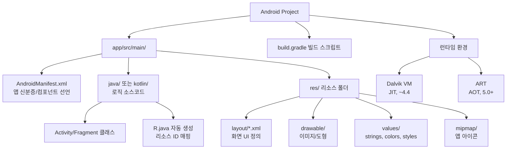
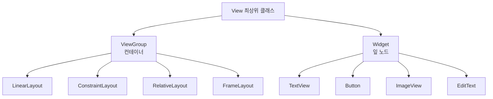

# 01. 모바일앱프로그래밍: 안드로이드 프로젝트와 앱의 동작 원리

## 🔗 선수 지식 (Prerequisites)
- [ ] **필수**: Java 또는 Kotlin 기초 문법 (클래스, 객체, 상속) - 이해 완료?
- [ ] **필수**: XML 마크업의 기본 구조 (태그, 속성) - 이해 완료?
- [ ] **권장**: JVM(Java Virtual Machine)의 동작 원리, 컴파일러 vs 인터프리터의 차이
- [ ] **권장**: 객체지향 프로그래밍의 라이프사이클 개념
- **관련 단원**: 2강. 안드로이드 앱 컴포넌트와 액티비티 생명주기 (다음 강의)

---

## 학습 목표
1. 안드로이드 프로젝트를 이해할 수 있다.
2. 안드로이드 프로젝트의 구성 요소를 이해할 수 있다.
3. View에 대해 이해할 수 있다.
4. 화면 관리를 위한 XML 사용의 잇점을 이해할 수 있다.

---

## 🧠 메타인지 체크 (학습 전/후 자기 평가)

### 학습 전 자기 평가
| 소주제 | 자신감 (1-5) |
| :--- | :--- |
| 안드로이드 프로젝트 구성 요소 (AndroidManifest, R.java, res 등) | |
| View와 ViewGroup, 레이아웃 개념 | |
| XML로 UI를 분리해서 관리하는 잇점 | |
| Dalvik vs ART 런타임 차이 | |

### 학습 후 교정 (학습 완료 후 작성)
| 소주제 | 학습 전 | 학습 후 | 실제 정답률 | 과신/과소 여부 |
| :--- | :--- | :--- | :--- | :--- |
| 안드로이드 프로젝트 구성 요소 | | | | |
| View와 레이아웃 | | | | |
| XML 사용의 잇점 | | | | |
| Dalvik vs ART | | | | |

> **활용법**: 학습 전 1분 → 자신감 기입, 학습 후 1분 → 나머지 기입. "과신" 영역이 실제 취약점.

---

## 📝 요약 (Summary)
1. 🔴 **XML (eXtensible Markup Language)**: 마크업 언어의 일종으로, 문서를 사람과 기계 모두가 읽을 수 있는 형식으로 부호화하는 규칙의 집합을 정의함. 안드로이드에서는 화면 레이아웃, 매니페스트, 리소스 정의 등에 광범위하게 사용됨.
2. 🔴 **레이아웃 (Layout)**: 안드로이드 화면출력 및 화면배치를 의미하며, 출력의 양식이나 양식의 설계 등을 모두 레이아웃이라는 말로 사용함. View들을 어떻게 배치할지를 정의하는 컨테이너 역할을 한다.
3. 🟡 **런타임 (Runtime)**: 컴퓨터 프로그램이 실행되고 있는 동안의 동작을 말함. 안드로이드에서는 Dalvik과 ART가 대표적인 런타임 환경이다.
4. 🔴 **Dalvik**: JIT(Just-In-Time) 방식의 컴파일 환경을 기반으로 하는 안드로이드 스마트폰의 가상머신. 앱 실행 중 필요한 부분을 그때그때 컴파일한다.
5. 🔴 **ART (Android RunTime)**: 앱을 설치하기 전(AOT, Ahead-Of-Time)에 컴파일을 끝내고 앱을 실행하는 안드로이드 스마트폰의 가상머신. Android 5.0(Lollipop)부터 기본 런타임으로 채택.
6. 🟡 **View / ViewGroup**: 화면을 구성하는 모든 UI 요소의 최상위 클래스. View는 단일 위젯(Button, TextView 등), ViewGroup은 View들을 담는 컨테이너(LinearLayout, ConstraintLayout 등).
7. 🟢 **MVC 분리(XML 분리의 잇점)**: XML로 UI(View)를 정의하고 Java/Kotlin으로 로직(Controller)을 작성함으로써, **디자인과 코드의 분리** → 협업 용이, 유지보수성 향상, 다양한 해상도/언어 대응이 쉬워진다.
   - 🟠 *정밀화: 엄밀히는 "MVC"라기보다 **관심사 분리(SoC, Separation of Concerns)**에 가깝고, 안드로이드가 공식 권장하는 아키텍처는 **MVVM**이다. 근거: [Android Developers — App architecture](https://developer.android.com/topic/architecture)*

---

## 🧩 핵심 정의 및 원리 (Key Concepts & Principles)

> **과목 유형**: 실습 중심(안드로이드 프로그래밍) + 이론적 개념 정리 → **핵심 정의 및 원리** 테이블로 대체

| 정의명 | 내용 | 키워드 |
| :--- | :--- | :--- |
| **AndroidManifest.xml** | 앱의 신분증. 앱이 사용하는 컴포넌트(Activity, Service, Receiver, Provider), 권한(permission), 최소 SDK 버전, 패키지명 등을 시스템에 선언하는 파일 | 컴포넌트 선언, 권한, 진입점(LAUNCHER) |
| **R.java (R.jar)** | 리소스 ID를 자동 생성한 자바 파일. `res/` 폴더의 모든 리소스(layout, drawable, string 등)에 고유한 정수 ID를 부여하여 코드에서 `R.layout.activity_main`처럼 접근 | 자동 생성, 리소스 ID, 빌드 산출물 |
| **레이아웃 (res/layout/*.xml)** | View들의 시각적 배치를 XML로 기술한 파일. 코드와 디자인을 분리하여 관리 가능 | XML, UI 설계도, 분리 |
| **View / ViewGroup** | 모든 UI 요소의 부모 클래스. View는 잎(leaf), ViewGroup은 가지(branch). 트리 구조로 화면이 구성됨 | 위젯, 컨테이너, View 트리 |
| **Activity** | 사용자와 상호작용하는 하나의 화면. AndroidManifest에 등록되어야 시스템이 인식 | 화면 단위, 생명주기 |
| **Dalvik VM** | JIT 컴파일 기반 가상머신. `.dex` 바이트코드를 실행 시점에 기계어로 변환 | JIT, dex, Android 4.4 이전 기본 |
| **ART (Android RunTime)** | AOT 컴파일 기반 가상머신. 앱 설치 시 미리 기계어로 변환 → 실행 속도↑, 배터리 효율↑, 설치 시간↑ | AOT, OAT, Android 5.0+ |
| **Gradle / build.gradle** | 안드로이드의 빌드 자동화 도구. 의존성 관리, APK/AAB 패키징, 변형(variant) 빌드 담당 | 빌드 시스템, 의존성, 모듈 |
| **APK / AAB** | 안드로이드 앱 배포 패키지. APK는 단일 설치 파일, AAB(Android App Bundle)는 Play Store가 디바이스별 최적화 APK를 생성하는 신형 포맷 | 배포, 압축, 서명 |

### 🔄 Activity 생명주기(Lifecycle) 콜백 7개 (시험 빈출)

> Activity는 시스템이 상태 전이마다 아래 콜백을 호출하며, 각 시점에 맞는 작업을 수행해야 한다.
> 근거: [Android Developers — The activity lifecycle](https://developer.android.com/guide/components/activities/activity-lifecycle)

**기본 실행 흐름(생성 → 실행 → 종료):**
`onCreate()` → `onStart()` → `onResume()` → **(사용자와 상호작용/실행 중)** → `onPause()` → `onStop()` → `onDestroy()`

**정지 후 재시작 흐름:** `onStop()` 상태에서 다시 화면으로 돌아오면
`onRestart()` → `onStart()` → `onResume()`

| 콜백 | 호출 시점 | 주요 용도 |
| :--- | :--- | :--- |
| **onCreate()** | Activity 최초 생성 시 1회 | `setContentView()`로 UI 초기화, 멤버 변수·바인딩 초기화 (필수 구현) |
| **onStart()** | Activity가 사용자에게 보이기 직전 | UI 갱신 준비, 화면 표시 관련 리소스 준비 |
| **onResume()** | 포그라운드로 와 상호작용 가능한 시점 | 카메라·센서 등 포그라운드 전용 리소스 시작, 애니메이션 재개 |
| **(실행 중)** | 사용자가 화면과 상호작용 | — |
| **onPause()** | 다른 화면이 부분적으로 가릴 때(포커스 상실) | 가벼운 저장·애니메이션 정지, 포그라운드 리소스 해제(짧게 끝내야 함) |
| **onStop()** | Activity가 완전히 보이지 않게 될 때 | DB 저장 등 무거운 작업, 불필요한 리소스 해제 |
| **onRestart()** | 정지(onStop) 상태에서 다시 시작될 때 | onStart 호출 직전 재초기화. 이후 반드시 onStart→onResume로 이어짐 |
| **onDestroy()** | Activity 소멸 직전(finish 또는 시스템 회수) | 남은 리소스 최종 해제 |

> **암기 포인트**: 화면이 켜질 때는 onCreate→onStart→onResume, 꺼질 때는 onPause→onStop→onDestroy(대칭). 정지했다 돌아올 때만 **onRestart**가 추가로 끼어든다(7번째 콜백). (→← 2강에서 컴포넌트 생명주기 심화)

### 주요 원리: XML/Java 분리의 잇점

> **직관적 해석**: "옷(XML)과 사람(Java/Kotlin)을 분리하면, 옷만 갈아입혀도 사람은 그대로다." 즉, 디자인 변경이 로직에 영향을 주지 않는다.
>
> **AI 적용**: 이러한 **선언적(declarative) UI 정의** 패러다임은 현대 ML 시스템의 모델 설정 파일(`config.yaml`)과 동일한 사상이다. PyTorch의 `nn.Module` 클래스 정의와 별도로 hyperparameter를 YAML로 분리하는 것, Hugging Face Transformers의 `config.json` 등이 같은 원리 — **구조/설정을 코드에서 분리하여 재사용성과 실험 관리를 높임**.

---

## 📊 개념 시각화 (Visual Guide)

### 안드로이드 프로젝트 구성 분류 체계도



### View 계층 구조



### 핵심 도식: 빌드 → 실행 흐름

| 입력 | 처리 | 출력 | 비고 |
| :--- | :--- | :--- | :--- |
| `.java/.kt` 소스 | javac/kotlinc 컴파일 | `.class` 바이트코드 | JVM 호환 단계 |
| `.class` 바이트코드 | d8/r8 (구 dx) 변환 | `.dex` Dalvik 실행 파일 | 안드로이드 전용 포맷 |
| `.dex` + 리소스 + Manifest | aapt2 + 서명 | `.apk` 또는 `.aab` | 배포 가능한 단일 파일 |
| `.apk` 설치 시 | **ART**가 AOT 컴파일 | `.oat` 기계어 파일 | 디바이스별 최적화 |
| `.oat` 실행 | CPU 직접 실행 | 앱 동작 | Dalvik은 JIT라 이 단계가 실행 중 발생 |

---

## ✏️ 심화 학습 (Study Subject)

### 1. 가상 시나리오: "어떤 개념을, 언제 사용해야 할까?"
- **상황**: 신규 안드로이드 앱을 개발하는데, 디자이너는 화면 시안을 자주 바꾸고 싶어 하고, 개발자는 비즈니스 로직에 집중하고 싶다. 또한 한국어/영어 다국어 지원과 폰/태블릿 두 가지 화면 크기 대응이 필요하다.
- **문제**: 디자이너의 잦은 UI 수정이 로직 코드에 영향을 주지 않고, 동시에 다국어/다해상도 대응을 효율적으로 처리할 수 있는 구조를 어떻게 잡을 것인가?
- **해결**:
  1. UI는 **XML 레이아웃 파일**(`res/layout/activity_main.xml`)로 분리 → 디자이너가 XML(혹은 Android Studio Layout Editor)만 수정.
  2. 문자열은 `res/values/strings.xml`, 한국어는 `res/values-ko/strings.xml`로 분리 → 시스템 언어에 따라 자동 매칭.
  3. 태블릿용 레이아웃은 `res/layout-sw600dp/activity_main.xml`로 분리 → 화면 크기에 따라 자동 매칭.
  4. Java/Kotlin 코드에서는 `setContentView(R.layout.activity_main)`만 호출 → **R 클래스가 자동으로 적절한 리소스를 선택**.
- **AI 학습 포인트**: "안드로이드의 리소스 한정자(qualifier) 시스템은 ML 모델 서빙에서 디바이스/언어별 모델 라우팅과 어떤 점이 유사한가? 또한 Jetpack Compose의 등장으로 XML 기반 UI 패러다임이 어떻게 변화하고 있는지 설명해 줘."

### 2. 관점별 비교 및 오개념 분석
- **핵심 비교**: **Dalvik vs ART** 그리고 **View vs ViewGroup**.

#### Dalvik vs ART 비교

| 구분 | Dalvik | ART (Android RunTime) |
| :--- | :--- | :--- |
| **컴파일 방식** | JIT (Just-In-Time, 실행 중) | AOT (Ahead-Of-Time, 설치 시) |
| **실행 속도** | 상대적으로 느림 (실행 시점에 변환) | 빠름 (이미 기계어) |
| **설치 시간** | 짧음 | 김 (사전 컴파일 비용) |
| **저장 공간** | 작음 (.dex만 저장) | 큼 (.dex + .oat 저장) |
| **배터리** | 실행 시 CPU 부담 ↑ | 효율적 |
| **도입 시기** | Android 1.0 ~ 4.4 (KitKat) | Android 5.0 (Lollipop) 부터 기본 |

#### View vs ViewGroup 비교

| 구분 | View | ViewGroup |
| :--- | :--- | :--- |
| **역할** | 단일 UI 요소(잎 노드) | View들을 담는 컨테이너(가지 노드) |
| **예시** | Button, TextView, ImageView | LinearLayout, ConstraintLayout, RecyclerView |
| **자식 보유** | 없음 | 다수의 View/ViewGroup |
| **상속 관계** | `android.view.View` | `extends ViewGroup extends View` (즉, ViewGroup도 View의 일종) |

- **오개념 분석**
    - **오개념 1**: "Dalvik과 ART는 둘 다 가상머신이므로 JVM(Java Virtual Machine)을 그대로 사용한 것이다."
    - **분석**: 잘못된 생각이다. JVM은 **스택 기반**이고 `.class` 바이트코드를 실행하지만, Dalvik은 **레지스터 기반**으로 `.dex` 바이트코드를 실행한다. 모바일의 메모리/전력 제약 때문에 안드로이드는 자체 VM을 설계했다. ART도 같은 `.dex`를 사용하지만 AOT 컴파일러를 갖춰 OAT 형식의 기계어로 변환한다.
    - **오개념 2**: "AndroidManifest.xml에 등록하지 않아도 Activity 클래스를 만들면 자동으로 동작한다."
    - **분석**: 잘못된 생각이다. **Activity·Service·ContentProvider는 Manifest 정적 선언이 필수**(코드만으로 등록 불가)이며, **BroadcastReceiver만 정적(Manifest `<receiver>`) / 동적(`registerReceiver()`) 등록을 모두 지원**한다. 즉 Service도 Manifest 정적 선언 필수이고(`startService()`/`bindService()`는 "실행"이지 "등록"이 아님), Provider 역시 정적 선언 필수다. 등록하지 않은 Activity를 `startActivity()`로 호출하면 `ActivityNotFoundException`이 발생한다.
- **AI 학습 포인트**: "Dalvik의 JIT 방식과 ART의 AOT 방식은 ML 추론에서 PyTorch eager mode vs TorchScript/ONNX 변환과 유사하다는데, 이 비유가 정확한지 검증하고 차이점을 짚어줘."

---

## ❓ 연습 문제 및 해설

> **블룸 인지 수준 범례**: [기억] 정의·나열 → [이해] 설명·비교 → [적용] 계산·구현 → [분석] 구별·디버그 → [평가] 판단·비평 → [창조] 설계·제안

### 📝 문제

**1. ⭐ [기억] 마크업 언어의 일종으로, 문서를 사람과 기계 모두가 읽을 수 있는 형식으로 부호화하는 규칙의 집합은 무엇인가?(#prob-1)** 📎 정리하기
   > ① 런타임
   > ② XML
   > ③ Dalvik
   > ④ ART

<br>

**2. ⭐ [기억] 안드로이드 화면출력 및 화면배치를 의미하며, 출력의 양식이나 양식의 설계 등을 의미하는 것은 무엇인가?(#prob-2)** 📎 정리하기
   > ① View
   > ② AndroidManifest
   > ③ 레이아웃
   > ④ R.JAVA(R.JAR)

<br>

**3. ⭐⭐ [이해/적용] 📌 다음 중 안드로이드의 ART(Android RunTime)에 대한 설명으로 옳은 것을 모두 고르시오.(#prob-3)**
   > <보기>
   >
   > 가. JIT 방식으로 앱 실행 중에 코드를 컴파일한다.
   > 나. 앱을 설치하기 전에 컴파일을 끝내고 실행한다.
   > 다. Android 5.0(Lollipop)부터 기본 런타임으로 채택되었다.
   > 라. Dalvik에 비해 일반적으로 앱 설치 시간이 짧다.

   > ① 가, 나
   > ② 나, 다
   > ③ 나, 다, 라
   > ④ 가, 나, 다, 라

<br>

**4. ⭐⭐ [분석] 📌 안드로이드 프로젝트의 구성 요소와 그 역할이 잘못 짝지어진 것은?(#prob-4)**
   > ① AndroidManifest.xml — 앱이 사용하는 컴포넌트와 권한을 선언
   > ② R.java — `res/` 폴더의 리소스에 ID를 부여하여 코드에서 접근 가능하게 함
   > ③ res/layout/ — 비즈니스 로직(Activity 클래스)을 정의
   > ④ build.gradle — 의존성 관리 및 빌드 자동화 스크립트

<br>

**5. ⭐⭐⭐ [평가/창조] 📌 화면 UI를 XML로 분리하여 정의했을 때 얻을 수 있는 잇점을 **최소 3가지** 서술하고, 각 잇점이 실제 협업/유지보수 상황에서 어떻게 작용하는지 구체적인 예시와 함께 설명하시오.(#prob-5)**

---

### 🔑 정답 및 해설 (먼저 풀어본 후 펼치기)

<details>
<summary>정답 보기 (클릭)</summary>

1. ②
2. ③
3. ③
4. ③
5. [서술형 — 해설 참조]

</details>

<details>
<summary>해설 보기 (클릭)</summary>

<a id="prob-1"></a>
**1. ⭐ [기억] XML의 정의**
> **정답: ② XML**
> **해설**: XML(eXtensible Markup Language)은 마크업 언어의 일종으로, 사람과 기계 모두가 읽을 수 있는 형식으로 문서를 부호화하는 규칙의 집합이다. ①의 런타임은 프로그램 실행 시점의 환경, ③의 Dalvik과 ④의 ART는 안드로이드 가상머신/런타임이다.

<a id="prob-2"></a>
**2. ⭐ [기억] 레이아웃의 정의**
> **정답: ③ 레이아웃**
> **해설**: 안드로이드에서 화면 출력 및 배치, 양식의 설계를 통칭하여 **레이아웃**이라 부른다. ①의 View는 UI를 구성하는 개별 요소이며, ②의 AndroidManifest는 앱 컴포넌트/권한 선언 파일, ④의 R.java는 리소스 ID를 자동 생성한 자바 파일이다. (출처: 정리하기 — 1강)

<a id="prob-3"></a>
**3. ⭐⭐ [이해/적용] ART의 특징**
> **정답: ③ 나, 다**
> **해설**:
> - 가. (X) JIT 방식은 **Dalvik**의 특징. ART는 AOT(Ahead-Of-Time) 방식이다.
> - 나. (O) ART는 앱 설치 시점에 미리 컴파일을 끝낸다.
> - 다. (O) Android 5.0(Lollipop)부터 ART가 기본 런타임이다.
> - 라. (X) AOT 방식은 사전 컴파일 비용이 있으므로 **설치 시간이 더 길다**. 대신 실행 속도가 빠르다.

<a id="prob-4"></a>
**4. ⭐⭐ [분석] 프로젝트 구성 요소의 역할**
> **정답: ③ res/layout/ — 비즈니스 로직(Activity 클래스)을 정의**
> **해설**: `res/layout/` 폴더는 **UI(화면 구성)** 를 XML로 정의하는 곳이지, 비즈니스 로직을 담는 곳이 아니다. 비즈니스 로직은 `java/` 또는 `kotlin/` 폴더의 Activity/Fragment 클래스에 작성한다. XML 분리의 핵심 잇점이 바로 **UI와 로직의 분리**이므로, 이 둘을 혼동하면 안 된다.

<a id="prob-5"></a>
**5. ⭐⭐⭐ [평가/창조] XML 분리의 잇점 서술**
> **정답 예시**:
> 1. **UI/로직 분리(관심사의 분리, SoC)**: XML이 View 계층을, Java/Kotlin이 로직을 담당하여 디자이너는 XML/Layout Editor만, 개발자는 코드만 수정해 동시 협업이 가능. (예: 디자이너가 버튼 위치를 옮겨도 개발자의 클릭 핸들러 코드를 건드릴 필요 없음.)
> 2. **다국어/다해상도 대응의 자동화**: `res/values-ko/`, `res/layout-sw600dp/` 등 **리소스 한정자**로 같은 리소스 ID에 대해 환경별 대체 파일을 두면, 시스템이 디바이스 설정에 맞춰 자동 선택. (예: 영어 버전을 위해 별도 Activity를 만들 필요 없음.)
> 3. **가독성/유지보수성 향상**: 선언적(declarative) 마크업이라 화면 구조를 한눈에 파악 가능. Layout Editor의 Preview로 즉시 시각 확인 가능. (예: 신규 합류자가 코드보다 XML로 화면 흐름을 빠르게 이해.)
> 4. **(추가) 재사용성**: `<include>`, `<merge>` 태그와 `style`/`theme` 분리로 공통 UI 요소(헤더, 다이얼로그)를 여러 화면에서 재사용 가능.
> 5. **(추가) 테스트 용이성**: UI와 로직이 분리되어 있어 ViewModel 단위의 로직 테스트가 UI 환경 없이도 가능 — MVVM, Jetpack 아키텍처의 기반.

</details>

---

## ✅ O/X 확인문제 (연습문항 개수의 2배 권장)

**1.** XML은 사람만 읽을 수 있고 기계는 직접 해석할 수 없는 언어이다.(#ox-1) **(O / X)**
**2.** AndroidManifest.xml에 선언되지 않은 Activity도 `startActivity()`로 호출하면 정상 동작한다.(#ox-2) **(O / X)**
**3.** Dalvik은 JIT 방식, ART는 AOT 방식의 컴파일 환경을 사용한다.(#ox-3) **(O / X)**
**4.** ART는 Android 5.0(Lollipop)부터 기본 런타임으로 채택되었다.(#ox-4) **(O / X)**
**5.** ViewGroup은 View를 상속하지 않은 별개의 클래스이다.(#ox-5) **(O / X)**
**6.** R.java는 개발자가 직접 작성해야 하는 파일이다.(#ox-6) **(O / X)**
**7.** 레이아웃 XML 파일은 `res/layout/` 폴더에 위치하며, 코드에서 `R.layout.파일명`으로 참조한다.(#ox-7) **(O / X)**
**8.** XML로 UI를 분리하면 다국어 지원 시 코드 수정 없이 `res/values-언어/strings.xml`을 추가하는 것만으로 대응이 가능하다.(#ox-8) **(O / X)**
**9.** 런타임(Runtime)이란 소스코드를 컴파일하는 시점을 의미한다.(#ox-9) **(O / X)**
**10.** Dalvik VM은 JVM과 동일한 바이트코드(.class)를 직접 실행한다.(#ox-10) **(O / X)**

<details>
<summary>O/X 정답 및 해설 보기 (클릭)</summary>

> <a id="ox-1"></a>
> **1. 정답**: X
> **해설**: XML은 사람과 기계 **모두**가 읽을 수 있는 형식으로 부호화하는 규칙의 집합이다.

> <a id="ox-2"></a>
> **2. 정답**: X
> **해설**: Manifest에 등록되지 않은 Activity를 호출하면 `ActivityNotFoundException`이 발생한다. **Activity·Service·ContentProvider는 Manifest 정적 선언이 필수**이고, **BroadcastReceiver만 정적/동적 등록을 모두 지원**한다.

> <a id="ox-3"></a>
> **3. 정답**: O
> **해설**: 정리하기 그대로. Dalvik=JIT, ART=AOT.

> <a id="ox-4"></a>
> **4. 정답**: O
> **해설**: Android 4.4(KitKat)에서 실험적으로 도입, 5.0(Lollipop)부터 기본 런타임으로 채택되었다.

> <a id="ox-5"></a>
> **5. 정답**: X
> **해설**: ViewGroup은 `extends ViewGroup extends View` 구조로 View를 상속한다. 즉, ViewGroup도 View의 일종이며, 자식 View를 가질 수 있다는 추가 기능이 있을 뿐이다.

> <a id="ox-6"></a>
> **6. 정답**: X
> **해설**: R.java는 **빌드 도구(aapt/aapt2)** 가 `res/` 폴더를 스캔하여 자동 생성한다. 개발자가 직접 수정해서는 안 된다.

> <a id="ox-7"></a>
> **7. 정답**: O
> **해설**: `res/layout/activity_main.xml`은 `R.layout.activity_main`으로 참조되며, 보통 `setContentView(R.layout.activity_main)`으로 Activity에 바인딩한다.

> <a id="ox-8"></a>
> **8. 정답**: O
> **해설**: 리소스 한정자(qualifier) 시스템 덕분에 코드 변경 없이 다국어 대응이 가능하다. 이것이 XML 분리의 대표적 잇점.

> <a id="ox-9"></a>
> **9. 정답**: X
> **해설**: 런타임은 프로그램이 **실행되는 시점/동안**의 동작을 말한다. 컴파일 시점은 컴파일 타임(compile-time)이라 부른다.

> <a id="ox-10"></a>
> **10. 정답**: X
> **해설**: Dalvik은 JVM과 다른 **레지스터 기반**의 자체 VM이며, JVM의 `.class`가 아닌 `.dex`(Dalvik Executable) 바이트코드를 실행한다. 빌드 과정에서 `.class` → `.dex` 변환이 일어난다.

</details>

---

## 🧪 자유 회상 연습 (Free Recall)

> **방법**: 위의 노트를 모두 덮고, 타이머 3분 설정 후 이번 단원에서 배운 내용을 기억나는 대로 자유롭게 적으세요.
> 정확한 문장이 아니어도 됩니다. 키워드, 관계 등 떠오르는 것을 모두 적습니다.

**자유 회상 작성란:**

```
[여기에 기억나는 내용을 자유롭게 작성]


```

> **회상 후 점검**: 노트를 다시 펼쳐 빠뜨린 내용을 확인하세요. 빠뜨린 부분이 실제 취약점입니다.
> - 회상 못한 핵심 개념: [                ]
> - 회상 못한 용어(영문): [                ]

---

## 💻 코드로 확인하기 (Code Verification)

### Bad Practice: Java 코드에서 View를 직접 생성 (XML 미사용)

```java
// MainActivity.java - 권장되지 않는 방식
package com.example.app;

import android.app.Activity;
import android.os.Bundle;
import android.widget.LinearLayout;
import android.widget.Button;
import android.widget.TextView;
import android.view.ViewGroup.LayoutParams;

public class MainActivity extends Activity {
    @Override
    protected void onCreate(Bundle savedInstanceState) {
        super.onCreate(savedInstanceState);

        LinearLayout root = new LinearLayout(this);
        root.setOrientation(LinearLayout.VERTICAL);

        TextView tv = new TextView(this);
        tv.setText("안녕하세요");
        tv.setTextSize(20);

        Button btn = new Button(this);
        btn.setText("클릭");

        root.addView(tv, new LayoutParams(LayoutParams.WRAP_CONTENT, LayoutParams.WRAP_CONTENT));
        root.addView(btn, new LayoutParams(LayoutParams.WRAP_CONTENT, LayoutParams.WRAP_CONTENT));

        setContentView(root);  // 화면 구조와 로직이 한 파일에 뒤엉킴
    }
}
```

### Good Practice: XML로 UI 분리 + Java로 로직만

**`res/layout/activity_main.xml`**
```xml
<?xml version="1.0" encoding="utf-8"?>
<LinearLayout xmlns:android="http://schemas.android.com/apk/res/android"
    android:layout_width="match_parent"
    android:layout_height="match_parent"
    android:orientation="vertical"
    android:padding="16dp">

    <TextView
        android:id="@+id/tv_greeting"
        android:layout_width="wrap_content"
        android:layout_height="wrap_content"
        android:text="@string/hello"
        android:textSize="20sp" />

    <Button
        android:id="@+id/btn_click"
        android:layout_width="wrap_content"
        android:layout_height="wrap_content"
        android:text="@string/click_label" />
</LinearLayout>
```

**`res/values/strings.xml`**
```xml
<resources>
    <string name="app_name">MyApp</string>
    <string name="hello">안녕하세요</string>
    <string name="click_label">클릭</string>
</resources>
```

**`res/values-en/strings.xml` (영어 자동 매칭)**
```xml
<resources>
    <string name="hello">Hello</string>
    <string name="click_label">Click</string>
</resources>
```

**`MainActivity.java`**
```java
package com.example.app;

import android.app.Activity;
import android.os.Bundle;
import android.view.View;
import android.widget.Button;
import android.widget.Toast;

public class MainActivity extends Activity {
    @Override
    protected void onCreate(Bundle savedInstanceState) {
        super.onCreate(savedInstanceState);
        setContentView(R.layout.activity_main);  // XML 한 줄로 UI 로드

        Button btn = findViewById(R.id.btn_click);
        btn.setOnClickListener(new View.OnClickListener() {
            @Override
            public void onClick(View v) {
                Toast.makeText(MainActivity.this, R.string.hello, Toast.LENGTH_SHORT).show();
            }
        });
    }
}
```

**`AndroidManifest.xml`**
```xml
<?xml version="1.0" encoding="utf-8"?>
<manifest xmlns:android="http://schemas.android.com/apk/res/android"
    package="com.example.app">

    <application
        android:label="@string/app_name"
        android:icon="@mipmap/ic_launcher">

        <activity android:name=".MainActivity"
                  android:exported="true">
            <intent-filter>
                <action android:name="android.intent.action.MAIN" />
                <category android:name="android.intent.category.LAUNCHER" />
            </intent-filter>
        </activity>
    </application>
</manifest>
```

> 📝 **최신 표준 보완**: 위 예제들은 `extends Activity`로 작성했지만, 실무·최신 표준에서는 androidx의 **`AppCompatActivity`**(`public class MainActivity extends AppCompatActivity`)를 상속한다. AppCompatActivity는 구버전 OS에서도 최신 테마·머티리얼 컴포넌트·ActionBar 등을 일관되게 지원(하위 호환)한다. 근거: [Android Developers — AppCompatActivity](https://developer.android.com/reference/androidx/appcompat/app/AppCompatActivity)
>
> **실행 결과**:
> - 한국어 디바이스 → "안녕하세요" / "클릭" 표시, 버튼 클릭 시 Toast 출력.
> - 영어 디바이스 → 동일 코드인데 "Hello" / "Click" 표시 (코드 변경 0줄).
>
> **개념적 해석**:
> 1. `setContentView(R.layout.activity_main)` — R 클래스가 컴파일 시점에 자동 생성되어 XML 리소스 ID를 코드에서 참조 가능하게 한다.
> 2. `@string/hello` — 빌드 시 `aapt2`가 적절한 언어의 `strings.xml`을 선택하여 ART/Dalvik에 전달.
> 3. UI 구조 변경 시 **Java 코드는 그대로** 두고 XML만 수정하면 끝.

---

## 🤖 AI 연결고리 (Mobile Concept → AI Application)

| 모바일 개념 | AI/ML 적용 분야 | 구체적 사례 |
| :--- | :--- | :--- |
| **XML 선언적 UI 정의** | 선언적 모델 설정(declarative config) | Hugging Face `config.json`, PyTorch Lightning Hydra YAML — 모델 구조/하이퍼파라미터를 코드와 분리 |
| **R.java 자동 생성** | 코드 생성(codegen) 기반 빌드 시스템 | TensorFlow Lite의 `tflite` 모델로부터 Java 래퍼 자동 생성, ONNX Runtime의 IR 생성 |
| **리소스 한정자 (qualifier)** | 디바이스/사용자별 모델 라우팅 | On-device ML에서 디바이스 사양에 따라 INT8/FP16 모델을 자동 선택 |
| **ART의 AOT 컴파일** | ML 모델의 사전 최적화 | TorchScript JIT/AOT, TensorRT, ONNX 런타임 등으로 모델을 디바이스용 기계어로 사전 컴파일 |
| **Activity 생명주기(다음 강의)** | 학습/추론 세션 라이프사이클 관리 | TensorFlow Lite Interpreter의 `allocateTensors()` ~ `close()` 흐름, ML 파이프라인의 상태 머신 |
| **AndroidManifest 권한 선언** | ML 모델 카드(Model Card) 및 capability 선언 | "이 모델은 카메라/마이크 접근 필요" 같은 capability를 메타데이터로 선언하는 패턴 |

---

## 📖 심화 학습 예시 답안

#### 1. 안드로이드 앱 빌드 → 실행의 내부 동작 원리

1. **소스 컴파일**: 개발자가 작성한 `MainActivity.java`는 `javac`(또는 Kotlin은 `kotlinc`)에 의해 `.class` 바이트코드로 변환된다. 이때 `R.java`도 자동 생성되어 함께 컴파일된다.
2. **DEX 변환**: `.class` 파일들은 `d8`(구 `dx`) 또는 `r8`(코드 축소/난독화 포함)에 의해 안드로이드 전용 포맷인 `.dex`(Dalvik Executable)로 변환된다. 여러 `.class`가 하나의 `.dex`로 묶이며 메서드 수가 64K를 넘으면 MultiDex로 분할된다.
3. **리소스 컴파일**: `res/` 폴더의 XML/이미지는 `aapt2`에 의해 바이너리 XML로 컴파일되어 더 빠르게 파싱되고 크기가 줄어든다.
4. **APK 패키징 + 서명**: `.dex` + 컴파일된 리소스 + `AndroidManifest.xml`이 ZIP 형식으로 묶이고, 개발자의 키스토어로 서명된다.
5. **설치 시(ART)**: 디바이스에 APK가 설치되면 ART의 `dex2oat` 도구가 `.dex`를 디바이스 CPU(ARM/x86)에 맞는 `.oat`(기계어 + 메타데이터) 파일로 사전 컴파일한다. 이 단계가 Dalvik과 ART의 가장 큰 차이.
6. **앱 실행**: 사용자가 아이콘을 탭하면 시스템이 Manifest의 `LAUNCHER` 카테고리를 가진 Activity를 찾아 Zygote(앱 프로세스 템플릿)에서 fork한 새 프로세스에 로드. `.oat`의 기계어가 CPU에서 직접 실행된다.

#### 2. Dalvik vs ART vs JVM 비교표 (확장)

| 구분 | JVM (표준) | Dalvik | ART |
| :--- | :--- | :--- | :--- |
| **아키텍처** | 스택 기반(stack-based) | 레지스터 기반(register-based) | 레지스터 기반 |
| **실행 파일** | `.class` (각 클래스마다) | `.dex` (다수 클래스 통합) | `.dex` → `.oat` |
| **컴파일 시점** | JIT (HotSpot) | JIT | **AOT** (설치 시) + 일부 JIT/프로파일 가이드 |
| **메모리 효율** | 일반 PC 환경에 최적화 | 모바일 제약 고려(공유 상수 풀 등) | 메모리 더 사용하지만 실행 효율↑ |
| **GC** | 다양한 GC (G1, ZGC 등) | Mark-and-sweep | Concurrent Mark Compact(개선) |
| **AI 활용** | TensorFlow Java API, DJL | (구식, 미사용) | TensorFlow Lite Java/Kotlin 추론, ML Kit On-device |

#### 3. XML 레이아웃을 활용한 Best Practice

- **Bad Practice (나쁜 예시)**
  ```java
  // Activity 안에서 모든 View를 동적으로 생성
  LinearLayout root = new LinearLayout(this);
  root.setOrientation(LinearLayout.VERTICAL);
  TextView tv = new TextView(this);
  tv.setText("Hard-coded String");  // 다국어 불가
  tv.setTextColor(0xFF0000FF);      // 매직 넘버, 테마 변경 어려움
  root.addView(tv);
  setContentView(root);
  ```
  - 다국어/다해상도 대응 불가, 디자이너 협업 불가, Layout Editor 프리뷰 불가.

- **Good Practice (좋은 예시)**
  ```xml
  <!-- res/layout/activity_main.xml -->
  <LinearLayout xmlns:android="http://schemas.android.com/apk/res/android"
      android:layout_width="match_parent"
      android:layout_height="match_parent"
      android:orientation="vertical">

      <TextView
          android:id="@+id/tv_greeting"
          android:layout_width="wrap_content"
          android:layout_height="wrap_content"
          android:text="@string/hello"           <!-- 문자열은 strings.xml 분리 -->
          android:textColor="@color/primary"     <!-- 색상은 colors.xml 분리 -->
          style="@style/HeadlineText" />          <!-- 스타일은 styles.xml 분리 -->
  </LinearLayout>
  ```
  ```java
  // MainActivity.java — 로직만
  setContentView(R.layout.activity_main);
  ```
- **설명**: Good Practice는 **(1)** 다국어 자동 지원(`values-en/`, `values-ja/`), **(2)** 다크모드 자동 지원(`values-night/colors.xml`), **(3)** 디자이너가 XML/Layout Editor로 직접 수정 가능, **(4)** Layout Editor에서 즉시 프리뷰 가능, **(5)** Theme 통합으로 일관된 UI 유지 — 5가지의 잇점을 동시에 얻는다.

---

## 🟢 심층 확장 (Deep Dive) — 빌드 최신화와 선언적 UI 패러다임

> 본 절은 1차 정리 이후 추가된 **2차 심층 확장**으로, "앱의 동작 원리"를 **빌드 시점 최적화(R8·리소스 축소·Baseline Profiles)** 와 **렌더링 패러다임 전환(View → Compose)** 관점에서 보강한다. 모든 주장은 공식 문서로 검증하였다.

### 1. 빌드 최신화: R8 코드 축소·난독화 + 리소스 축소 + Baseline Profiles

#### (1) R8 — 코드 축소(shrinking) · 난독화(obfuscation) · 최적화(optimization)

빌드 도식의 `d8/r8` 단계(위 "빌드 → 실행 흐름" 표 참조)에서 **R8**은 단순히 `.class`→`.dex` 변환만 하는 것이 아니라, **릴리스 빌드에서 세 가지 일을 동시에** 수행한다. R8은 ProGuard 규칙 파일을 그대로 사용하며 **AGP(Android Gradle Plugin) 3.4.0부터 기본 컴파일러**로 ProGuard를 대체했다.

| R8 기능 | 하는 일 | 효과 |
| :--- | :--- | :--- |
| **코드 축소(shrinking, tree-shaking)** | 도달 불가능한(사용되지 않는) 클래스·메서드·필드 제거 | APK/AAB 크기↓, 메서드 수↓(64K 한계 완화) |
| **난독화(obfuscation)** | 클래스·메서드·필드 이름을 `a`, `b`, `c` 등 짧은 이름으로 변경 | 크기↓ + 리버스 엔지니어링 난이도↑ |
| **최적화(optimization)** | 인라이닝, 사용 안 하는 분기 제거, 코드 재작성 | 런타임 성능↑, 크기↓ |

```kotlin
// build.gradle.kts (모듈 수준) — 릴리스 빌드에 R8 + 리소스 축소 활성화
android {
    buildTypes {
        release {
            isMinifyEnabled = true        // R8 코드 축소·난독화·최적화 ON
            isShrinkResources = true      // 리소스 축소 ON (isMinifyEnabled=true 필수 전제)
            proguardFiles(
                getDefaultProguardFile("proguard-android-optimize.txt"),
                "proguard-rules.pro"
            )
        }
    }
}
```

> ⚠️ **주의**: `isShrinkResources = true`(리소스 축소)는 **`isMinifyEnabled = true`(코드 축소)가 켜져 있어야만 동작**한다. 코드 축소가 "어떤 코드가 어떤 리소스를 참조하는지" 판단해 줘야 미사용 리소스를 안전하게 제거할 수 있기 때문이다.
> 근거: [Android Developers — Shrink, obfuscate, and optimize your app](https://developer.android.com/build/shrink-code)

#### (2) `shrinkResources` — 리소스 축소

코드 축소(R8)가 미사용 **코드**를 제거한다면, **리소스 축소**는 미사용 **리소스**(`res/`의 drawable, layout, string 등)를 제거한다. 코드 축소와 짝으로 동작하여, 라이브러리 의존성이 끌고 들어온 사용하지 않는 리소스까지 정리해 최종 패키지 크기를 더 줄인다.
근거: [Android Developers — Shrink resources](https://developer.android.com/build/shrink-code#shrink-resources)

#### (3) Baseline Profiles — ART의 프로파일 가이드 AOT로 시작 성능 개선

1강 본문에서 **ART = AOT 컴파일 + 일부 JIT/프로파일 가이드(profile-guided)** 라고 정리했는데(하단 "Dalvik vs ART vs JVM 비교표" 참조), 그 "프로파일 가이드 AOT"를 **앱 최초 설치 시점부터** 적용하게 해 주는 것이 **Baseline Profiles**다.

- **문제 상황**: ART는 보통 앱이 여러 번 실행되며 수집한 사용 프로파일을 바탕으로 자주 쓰이는 코드 경로를 점진적으로 AOT 컴파일한다. 따라서 **갓 설치한 앱의 첫 실행**은 아직 프로파일이 없어 JIT/인터프리트에 의존 → 느릴 수 있다.
- **해결**: 개발자가 핵심 사용 경로(앱 시작, 주요 화면 진입 등)를 미리 측정해 **사람이 읽을 수 있는 규칙 파일**로 정의하면, 빌드 시 바이너리(`assets/dexopt/baseline.prof`)로 컴파일되어 APK/AAB에 동봉된다. 설치 시점에 ART가 **그 경로를 미리 AOT 컴파일**한다. → 첫 실행부터 JIT 비용·인터프리트 비용을 줄여 **앱 시작/화면 렌더링 속도 개선**.
- 공식 문서는 Baseline Profile 적용 시 **앱 시작이 최대 약 30% 빨라질 수 있다**고 보고한다(앱·시나리오에 따라 다름).

근거: [Android Developers — Baseline Profiles overview](https://developer.android.com/topic/performance/baselineprofiles/overview)

> **요점(동작 원리 관점)**: R8/`shrinkResources`는 **빌드 시점에 크기를, Baseline Profiles는 설치/실행 시점에 속도를** 최적화한다. 즉 "더 작은 패키지 + 더 빠른 첫 실행"이라는 두 축으로 1강의 빌드→설치(dex2oat)→실행 흐름을 현대적으로 보강한 것이다.

### 2. 선언적 UI 패러다임 전환: 명령형 View 시스템 → Jetpack Compose

본문 전체는 **명령형(imperative) View 시스템**(XML 레이아웃 + `findViewById` + `setText()` 등으로 상태 변화마다 개발자가 직접 View를 갱신)을 전제로 한다. 안드로이드의 현대 권장 UI 툴킷은 **Jetpack Compose**(선언적, declarative)이며, 동작 원리가 근본적으로 다르다.

- **명령형 View**: "버튼을 눌렀으니 → `textView.setText(...)`로 **내가 직접** View를 바꾼다." (상태 ↔ UI 동기화를 개발자가 수동 관리)
- **선언적 Compose**: "현재 **상태(state)** 가 이러하면 화면은 이렇게 그려져라"를 함수(`@Composable`)로 **선언**만 한다. 상태가 바뀌면 Compose 런타임이 **영향받는 함수만 다시 실행(재구성, recomposition)** 하여 화면을 갱신한다. 개발자는 View를 직접 만지지 않는다.

#### View 시스템 vs Compose 렌더링 동작 비교

| 구분 | 명령형 View 시스템 | Jetpack Compose (선언적) |
| :--- | :--- | :--- |
| **UI 정의** | XML 레이아웃 + Java/Kotlin 코드 | Kotlin `@Composable` 함수 |
| **화면 객체** | View/ViewGroup **객체 트리**(인플레이트) | View 객체 없음 — 함수 호출로 UI 기술 |
| **갱신 방식** | `findViewById` 후 `setText()` 등 **수동 변경** | **상태 변경 → 재구성(recomposition)** 자동 |
| **렌더링 단계** | Measure → Layout → Draw (View 트리) | Composition → Layout → Drawing (3단계) |
| **상태-UI 동기화** | 개발자가 직접 관리(누락 시 버그) | 런타임이 자동 보장(단일 진실 공급원) |
| **재사용 단위** | 커스텀 View / `<include>` | 함수(파라미터로 조합) |

```kotlin
// 명령형 View: 카운터를 누를 때 개발자가 직접 TextView를 갱신
val tv = findViewById<TextView>(R.id.tv_count)
var count = 0
findViewById<Button>(R.id.btn).setOnClickListener {
    count++
    tv.text = count.toString()   // ← 상태와 UI를 손으로 맞춰줌
}

// 선언적 Compose: 상태만 바꾸면 화면이 알아서 다시 그려짐
@Composable
fun Counter() {
    var count by remember { mutableStateOf(0) }   // 상태
    Button(onClick = { count++ }) {               // 상태만 변경
        Text("$count")                            // 상태가 바뀌면 이 부분만 재구성
    }
}
```

> **동작 원리 핵심**: Compose는 `@Composable` 함수를 실행해 **UI 트리에 대한 설명(description)** 을 만들고, 이를 내부적으로 Layout/Drawing 단계로 넘긴다. 상태가 변하면 전체를 다시 그리지 않고 **변경에 영향받는 Composable만 똑똑하게 재실행(smart recomposition)** 한다. 이는 1강에서 강조한 "선언적 UI 정의" 사상의 완성형이다.
> 근거: [Android Developers — Thinking in Compose](https://developer.android.com/develop/ui/compose/mental-model)

---

## 📚 핵심 용어집 (Glossary)

| 용어 (한) | 용어 (영) | 표기/약자 | 정의 |
| :--- | :--- | :--- | :--- |
| **XML** | eXtensible Markup Language | XML | 마크업 언어의 일종으로, 문서를 사람과 기계 모두가 읽을 수 있는 형식으로 부호화하는 규칙의 집합 |
| **레이아웃** | Layout | `res/layout/*.xml` | 안드로이드 화면 출력 및 배치, 양식의 설계 등을 통칭하는 용어 |
| **뷰** | View | `android.view.View` | UI를 구성하는 모든 시각 요소의 최상위 클래스 (위젯의 부모) |
| **뷰그룹** | ViewGroup | `android.view.ViewGroup` | View를 자식으로 담을 수 있는 컨테이너성 View (레이아웃의 부모 클래스) |
| **안드로이드 매니페스트** | Android Manifest | `AndroidManifest.xml` | 앱의 컴포넌트, 권한, 최소 SDK 등을 시스템에 선언하는 파일 |
| **R.java** | R class | `R.layout.*`, `R.id.*` | 리소스 ID를 자동 생성한 자바 파일 |
| **런타임** | Runtime | — | 컴퓨터 프로그램이 실행되고 있는 동안의 동작 |
| **달빅** | Dalvik VM | JIT-based VM | JIT(Just-In-Time) 방식의 컴파일 환경 기반 안드로이드 가상머신 (Android 1.0~4.4) |
| **아트** | Android RunTime | ART, AOT-based | 앱 설치 전에 컴파일을 끝내고 실행하는 안드로이드 가상머신 (Android 5.0+) |
| **JIT** | Just-In-Time compilation | JIT | 프로그램 실행 중에 필요한 부분을 그때그때 기계어로 변환하는 방식 |
| **AOT** | Ahead-Of-Time compilation | AOT | 프로그램 실행 전(설치 시점)에 미리 기계어로 변환해두는 방식 |
| **덱스** | Dalvik Executable | `.dex` | 안드로이드 VM이 실행하는 바이트코드 포맷 (JVM의 `.class`에 대응) |
| **APK** | Android Package | `.apk` | 안드로이드 앱의 배포/설치 단위 파일 (ZIP 기반) |
| **AAB** | Android App Bundle | `.aab` | Google Play가 디바이스별 최적화 APK를 생성하기 위한 신형 배포 포맷 |
| **그래들** | Gradle | `build.gradle` | 안드로이드의 표준 빌드 자동화 도구 |
| **액티비티** | Activity | `extends Activity` | 사용자와 상호작용하는 화면 단위 (→←2강에서 생명주기 학습) |

---

## 🤖 AI 학습 파트너를 위한 추가 자료

### 1. 개념 이해를 위한 심층 질문 프롬프트
> **프롬프트 예시**: "안드로이드의 Dalvik VM과 ART(Android RunTime)의 차이를 초등학생도 이해할 수 있는 비유로 설명해 줘. 예를 들어 '주문 즉시 요리(JIT)' vs '미리 만들어둔 도시락(AOT)' 같은 식으로. 그리고 왜 구글이 4.4에서 5.0으로 넘어가면서 굳이 런타임을 교체했는지 역사적 배경과 트레이드오프를 짚어줘."

### 2. 문제 해결 능력 강화를 위한 시나리오 프롬프트
> **프롬프트 예시**: "당신은 시니어 안드로이드 개발자입니다. 신입 개발자가 'XML 쓸 시간에 그냥 Java로 View를 다 만드는 게 빠르지 않냐'고 묻습니다. (1) XML 분리의 잇점 5가지를 협업/유지보수/국제화/테마/성능 관점에서 설명하고, (2) 그럼에도 불구하고 동적 UI 생성이 필요한 케이스가 어떤 것이 있는지 함께 설명해 주세요."

### 3. 구성 요소 매핑 검증 프롬프트
> **프롬프트 예시**: "다음 안드로이드 프로젝트 구조에서 각 파일/폴더의 역할을 정리한 표를 검증해 줘.
> - `AndroidManifest.xml`: ?
> - `res/layout/`: ?
> - `res/values/`: ?
> - `R.java`: ?
> - `build.gradle`: ?
>
> 1. 설명이 정확한지 확인하고, 틀린 부분이 있다면 지적해 줘.
> 2. 추가로 알아두면 좋은 폴더(`res/drawable/`, `res/mipmap/`, `res/raw/`)도 설명에 더해 줘."

---

## 🔄 복습 체크 (Spaced Repetition)
- [ ] 1일 후 복습 (날짜: 2026-05-29)
- [ ] 3일 후 복습 (날짜: 2026-05-31)
- [ ] 7일 후 복습 (날짜: 2026-06-04)
- [ ] 14일 후 복습 (날짜: 2026-06-11)
- [ ] 30일 후 복습 (날짜: 2026-06-27)

### 복습 시 자가 평가
| 회차 | 날짜 | 이해도 (1-5) | 취약 부분 메모 |
| :--- | :--- | :--- | :--- |
| 1차 | | | |
| 2차 | | | |
| 3차 | | | |

---

## 📚 참고 자료 (References)

- 한국방송통신대학교 「모바일앱프로그래밍」 교재 - 1강. 안드로이드 프로젝트와 앱의 동작 원리
- Android Developers 공식 문서 - Application Fundamentals: https://developer.android.com/guide/components/fundamentals
- Android Developers 공식 문서 - Android Runtime (ART) and Dalvik: https://source.android.com/docs/core/runtime
- Android Developers - Layouts: https://developer.android.com/develop/ui/views/layout/declaring-layout
- Android Developers - App resources overview (qualifier 시스템): https://developer.android.com/guide/topics/resources/providing-resources
- Android Developers - Shrink, obfuscate, and optimize your app (R8/리소스 축소): https://developer.android.com/build/shrink-code
- Android Developers - Baseline Profiles overview: https://developer.android.com/topic/performance/baselineprofiles/overview
- Android Developers - Thinking in Compose (선언적 UI 패러다임): https://developer.android.com/develop/ui/compose/mental-model
