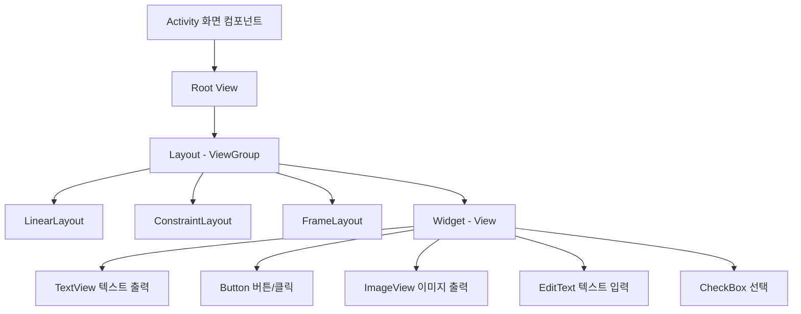
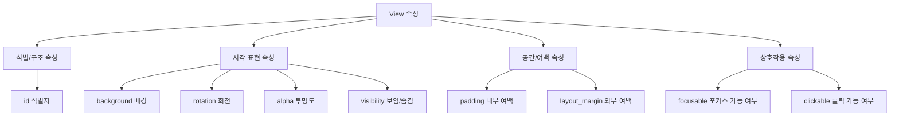

# 02. 모바일앱프로그래밍: View

## 🔗 선수 지식 (Prerequisites)
- [ ] **필수**: [1강. 안드로이드 프로젝트와 앱의 동작 원리](1강.md) - 이해 완료?
- [ ] **필수**: XML 태그/속성 문법, R.java를 통한 리소스 접근 (`R.id.*`, `R.layout.*`)
- [ ] **권장**: 자바/코틀린의 객체 상속(`extends`), 좌표계(픽셀/dp) 개념
- [ ] **권장**: HTML/CSS의 박스 모델(margin vs padding) 개념과의 대비
- **관련 단원**: [1강. 안드로이드 프로젝트와 앱의 동작 원리](1강.md) · 3강. 레이아웃 (다음 강의)

---

## 학습 목표
1. View의 역할과 구성 요소에 대한 이해할 수 있다.
2. 위젯(Widget)과 레이아웃(Layout)의 차이점에 대해 이해할 수 있다.
3. 위젯에 대한 이해할 수 있다.
4. View의 속성(id 속성, background 속성, rotation 속성, padding 속성, visibility 속성, focusable 속성, alpha 속성)에 대한 이해할 수 있다.

---

## 🧠 메타인지 체크 (학습 전/후 자기 평가)

### 학습 전 자기 평가
| 소주제 | 자신감 (1-5) |
| :--- | :--- |
| View의 정의와 역할(사각 영역 그리기 + 입력 수용) | |
| 위젯 vs 레이아웃 차이 | |
| View 7대 속성 (id/background/rotation/padding/visibility/focusable/alpha) | |
| padding vs margin 박스모델 차이 | |

### 학습 후 교정 (학습 완료 후 작성)
| 소주제 | 학습 전 | 학습 후 | 실제 정답률 | 과신/과소 여부 |
| :--- | :--- | :--- | :--- | :--- |
| View의 정의/역할 | | | | |
| 위젯 vs 레이아웃 | | | | |
| View 7대 속성 | | | | |
| padding vs margin | | | | |

> **활용법**: 학습 전 1분 → 자신감 기입, 학습 후 1분 → 나머지 기입. "과신" 영역이 실제 취약점.

---

## 📝 요약 (Summary)
1. 🔴 **Activity**: 안드로이드 앱의 화면을 구성하는 컴포넌트이며 여러 개의 View로 구성됨. (→←1강 — Manifest 등록 필수 컴포넌트)
2. 🔴 **View**: 안드로이드의 사용자 인터페이스를 구성하는 핵심으로서 **화면상의 사각 영역에 자신의 모양을 그리고 사용자의 입력을 받아들이는 객체**.
3. 🔴 **위젯 (Widget)**: 사용자의 인터페이스를 구성하는 역할을 하며, **스스로 화면에 특정 내용을 출력할 수 있는 능력**을 가진 단일 UI 부품(Button, TextView, ImageView 등).
4. 🟡 **레이아웃 (Layout)**: 위젯들을 담아 배치하는 컨테이너 역할의 ViewGroup. 스스로는 거의 그리지 않고 자식 View의 위치/크기를 결정한다. (→←1강)
5. 🔴 **id 속성**: View의 이름(식별자)을 정의하는 속성. `android:id="@+id/이름"`으로 선언하고 코드에서 `findViewById(R.id.이름)` 으로 접근.
6. 🟡 **background 속성**: View의 뒷배경을 정의하는 속성. 색상(`@color/...`), 이미지(`@drawable/...`), 색상값(`#FFEEDD`) 사용 가능.
7. 🟢 **rotation 속성**: View의 기울기(회전 각도, 단위: degree)를 정의하는 속성. 중심점 기준 시계방향 양수.
8. 🔴 **padding 속성**: **View와 View의 콘텐츠 사이의 안쪽 여백** 간격을 지정하는 속성. (margin은 View 외부 여백 — 혼동 주의)
9. 🟡 **visibility 속성**: View의 화면 출력여부를 정의하는 속성. `visible`(보임) / `invisible`(숨김+공간유지) / `gone`(숨김+공간제거) 세 가지 값.
10. 🟢 **focusable 속성**: View의 포커스 가능여부를 정의하는 속성. 키 입력 대상이 될 수 있는지를 결정.
11. 🟡 **alpha 속성**: View의 투명도를 정의하는 속성. 0.0(완전 투명) ~ 1.0(완전 불투명).

---

## 🧩 핵심 정의 및 원리 (Key Concepts & Patterns)

> **과목 유형**: 실습 중심(안드로이드) → **핵심 정의 및 원리** + **핵심 문법 및 패턴** 테이블

### View의 두 가지 책임 (View = Draw + Input)

| 책임 | 내부 메서드(주요) | 설명 |
| :--- | :--- | :--- |
| **(1) 자신의 모양 그리기** | `onMeasure()` → `onLayout()` → `onDraw(Canvas)` | 측정 → 배치 → 그리기 순서로 호출. 사각형 영역 안에 자신을 그린다 |
| **(2) 사용자 입력 받기** | `onTouchEvent(MotionEvent)`, `onKeyDown()`, `onClick()` | 터치/키/포커스 이벤트를 수용. 콜백 등록은 `setOnClickListener` 등 |

> **직관적 해석**: View는 "그림 그리는 캔버스 + 입력받는 센서"가 합쳐진 사각형 부품. **무엇이든 사각형으로 시작한다 (View is a rectangle).**

### 위젯 vs 레이아웃 비교

| 구분 | 위젯 (Widget) | 레이아웃 (Layout) |
| :--- | :--- | :--- |
| **상속 관계** | `View`의 직접 자식 | `ViewGroup extends View` |
| **자식 View 보유** | 없음(잎 노드) | 있음(컨테이너) |
| **주된 역할** | **스스로 화면에 그림** (텍스트/버튼/이미지 출력) | **자식 View들의 위치/크기 결정** |
| **대표 예시** | TextView, Button, EditText, ImageView, CheckBox | LinearLayout, RelativeLayout, ConstraintLayout, FrameLayout |
| **input 처리** | 직접 onClick 등 처리 | 보통 자식에게 위임, 필요시 가로채기(`onInterceptTouchEvent`) |

### View 7대 속성 (XML 표기 + 코드 표기 패턴)

| 속성 | XML 형태 | Kotlin/Java 코드 | 값/범위 |
| :--- | :--- | :--- | :--- |
| **id** | `android:id="@+id/btn_ok"` | `findViewById(R.id.btn_ok)` | 식별자 문자열(동일 레이아웃 내 중복 사실상 금지 — 아래 ※) |
| **background** | `android:background="@drawable/bg_btn"` | `view.setBackgroundResource(R.drawable.bg_btn)` | 색상/Drawable/이미지 |
| **rotation** | `android:rotation="45"` | `view.rotation = 45f` | 각도(degree), 음수/양수 모두 |
| **padding** | `android:padding="16dp"` (또는 `paddingLeft`, `paddingTop` 등) | `view.setPadding(l, t, r, b)` | dp 단위(권장) |
| **visibility** | `android:visibility="gone"` | `view.visibility = View.GONE` | `visible`/`invisible`/`gone` |
| **focusable** | `android:focusable="true"` | `view.isFocusable = true` | `true`/`false` |
| **alpha** | `android:alpha="0.5"` | `view.alpha = 0.5f` | 0.0 ~ 1.0 |

> ※ 🟠 **id 중복 금지**: 같은 레이아웃 파일 내에 동일한 id가 여러 개 있으면 `findViewById`는 **트리 탐색 순서상 첫 번째 매치만 반환**한다. 나머지는 참조할 방법이 사실상 없으므로, 동일 레이아웃 내 id 중복은 "권장하지 않음"을 넘어 **사실상 금지**된다.

### 안드로이드 박스 모델 (margin vs padding)

```
┌──────────────── margin (외부 여백, ViewGroup이 해석) ────────────────┐
│  ┌────────────── View 사각 영역 (border) ──────────────┐             │
│  │   padding (내부 여백)                                │             │
│  │   ┌──────────────────────────────────────────┐       │             │
│  │   │           콘텐츠 (텍스트/이미지 등)        │       │             │
│  │   └──────────────────────────────────────────┘       │             │
│  │                                                       │             │
│  └────────────────────────────────────────────────────────┘             │
└──────────────────────────────────────────────────────────────────────────┘
```

> **직관적 해석**: padding은 "옷 안쪽 솜의 두께"(콘텐츠와 View 경계 사이), margin은 "옷과 옷 사이의 거리"(다른 View와의 거리).
> **AI 적용**: padding/visibility/alpha 같은 시각 속성은 ML 모델 학습 시 **데이터 증강(Augmentation)** 과 비슷한 발상 — 같은 콘텐츠를 다양한 형태로 노출하여 사용자 경험을 풍부하게 한다.

---

## 📊 개념 시각화 (Visual Guide)

### View 분류 체계도



### View 속성 분류도



### 핵심 도식: 속성 → 시각 효과 매핑

| 속성 | 입력 값 예시 | 시각/동작 효과 | 비고 |
| :--- | :--- | :--- | :--- |
| `android:padding="16dp"` | 16dp | 콘텐츠가 View 경계로부터 16dp 안쪽으로 밀려남 | 내부 |
| `android:layout_margin="16dp"` | 16dp | 이 View가 주변 View로부터 16dp 떨어짐 | **외부** (ViewGroup 해석) |
| `android:rotation="45"` | 45 | View가 중심점 기준 시계방향 45도 회전 | degree |
| `android:alpha="0.3"` | 0.3 | View 전체가 30% 불투명(70% 투명) | 자식까지 영향 |
| `android:visibility="gone"` | gone | View가 사라지고 **차지하던 공간도 제거** | 레이아웃 재배치 |
| `android:visibility="invisible"` | invisible | View가 보이지 않지만 **공간은 유지** | 자리표시 |
| `android:focusable="true"` | true | TAB/방향키로 포커스 이동 가능 | 접근성 |
| `android:background="#FF0000"` | 빨강 | View 영역 배경이 빨강 | drawable도 가능 |
| `android:id="@+id/tvName"` | @+id/tvName | R.id.tvName으로 코드에서 참조 가능 | `+` 는 신규 정의 |

---

## ✏️ 심화 학습 (Study Subject)

### 1. 가상 시나리오: "어떤 속성을, 언제 사용해야 할까?"
- **상황**: 회원가입 화면을 만든다. 비밀번호가 약하면 약하다는 경고 메시지(빨강 텍스트)가 입력칸 아래에 나타나야 한다. 처음에는 메시지가 보이지 않다가, 약한 비밀번호 입력 시 부드럽게 나타나며, 강한 비밀번호 입력 시 다시 사라져야 한다. 단, **사라질 때도 입력칸 아래 다른 요소들이 들썩이지 않아야** 한다.
- **문제**: 어떤 속성을 어떻게 조합해야 위 UX를 구현할 수 있는가? (`visibility` 값 중 어느 것? `alpha`는? 부드러운 전환은?)
- **해결**:
  1. **메시지 TextView의 초기 상태**: `android:visibility="invisible"` (공간은 차지하되 안 보임) → 약한 비밀번호 시 다른 위젯들이 움직이지 않음.
     - `gone`을 쓰면 사라질 때 아래 요소들이 위로 끌려 올라와 들썩임 발생.
  2. **부드러운 페이드-인**: 약한 비밀번호 감지 시 `view.alpha = 0f; view.visibility = View.VISIBLE; view.animate().alpha(1f).setDuration(200).start();`
  3. **사라질 때**: `view.animate().alpha(0f).setDuration(200).withEndAction { view.visibility = View.INVISIBLE }.start()`
  4. **접근성**: 시각장애 사용자를 위해 `contentDescription`도 함께 갱신.
- **AI 학습 포인트**: "`visibility="gone"`과 `visibility="invisible"`의 차이가 사용자 경험에 미치는 영향을 모바일 UX 관점에서 설명하고, RecyclerView의 아이템 애니메이션과는 어떤 차이가 있는지 비교해 줘."

### 2. 관점별 비교 및 오개념 분석
- **핵심 비교**: **padding vs margin**, **invisible vs gone**, **위젯 vs 레이아웃**.

#### padding vs margin (가장 흔한 혼동 쌍)

| 구분 | padding (내부 여백) | margin (외부 여백) |
| :--- | :--- | :--- |
| **위치** | View **내부**, 콘텐츠와 경계 사이 | View **외부**, 다른 View와의 사이 |
| **속성명** | `android:padding`, `paddingLeft` 등 | `android:layout_margin`, `layout_marginStart` 등 |
| **누가 해석?** | View 자기 자신이 해석 | **부모 ViewGroup**이 해석 (`layout_` 접두사 주목) |
| **클릭 영역** | 클릭 영역에 **포함** (padding 영역도 클릭됨) | 클릭 영역에 **미포함** |
| **배경 색칠** | 배경이 padding 영역까지 적용 | 배경이 적용되지 않음(외부) |

#### invisible vs gone

| 구분 | invisible | gone |
| :--- | :--- | :--- |
| **보임 여부** | 안 보임 | 안 보임 |
| **공간 차지** | **차지함**(자리 유지) | 차지 안 함(공간 제거) |
| **레이아웃 재계산** | 불필요(빠름) | 필요(주변 View 재배치) |
| **사용 예** | 잠깐 숨겼다 다시 보일 때 (자리 보존) | 영구적으로/조건적으로 제거할 때 |

- **오개념 분석**
    - **오개념 1**: "padding과 margin은 사실상 같은 개념이고 이름만 다르다."
    - **분석**: 잘못된 생각이다. padding은 View **내부** 여백이라 **클릭 영역에 포함**되고 background가 그 영역까지 칠해진다. margin은 **외부 여백**이라 다른 View와의 거리이고 자기 자신의 배경에 영향을 주지 않는다. CSS의 box model을 떠올리면 동일한 구분이다.
    - **오개념 2**: "`visibility="gone"`은 `View`를 메모리에서 제거한다."
    - **분석**: 잘못된 생각이다. `gone`은 화면에서의 표시를 멈추고 레이아웃 측정/배치에서 제외할 뿐, **View 객체는 여전히 메모리에 존재**한다. 실제 제거는 `ViewGroup.removeView(view)`로 해야 한다.
    - **오개념 3**: "Activity가 View를 직접 그린다."
    - **분석**: 잘못된 생각이다. Activity는 **컨테이너/컨트롤러**이며 화면 그리기는 View 트리(`onDraw`)가 담당한다. Activity는 View 트리를 `setContentView`로 연결하고 생명주기를 관리한다.
- **AI 학습 포인트**: "안드로이드의 View 측정 단계(`onMeasure`)에서 `MeasureSpec`(EXACTLY/AT_MOST/UNSPECIFIED)이 padding을 어떻게 다루는지 단계별로 설명해 줘. 또한 ConstraintLayout이 다른 레이아웃에 비해 이 단계를 어떻게 최적화하는지도."

---

## ❓ 연습 문제 및 해설

> **블룸 인지 수준 범례**: [기억] 정의·나열 → [이해] 설명·비교 → [적용] 계산·구현 → [분석] 구별·디버그 → [평가] 판단·비평 → [창조] 설계·제안

### 📝 문제

**1. ⭐ [기억] 안드로이드의 사용자 인터페이스를 구성하는 핵심으로서 화면상의 사각 영역에 자신의 모양을 그리고 사용자의 입력을 받아들이는 객체는 무엇인가?(#prob-1)** 📎 정리하기
   > ① Activity
   > ② View
   > ③ visibility
   > ④ id

<br>

**2. ⭐ [기억] View와 View의 콘텐츠 사이의 안쪽 여백 간격을 지정하는 속성은 무엇인가?(#prob-2)** 📎 정리하기
   > ① id 속성
   > ② background 속성
   > ③ padding 속성
   > ④ rotation 속성

<br>

**3. ⭐⭐ [이해] 📌 다음 중 위젯(Widget)에 대한 설명으로 옳지 않은 것은?(#prob-3)**
   > ① 사용자의 인터페이스를 구성하는 역할을 한다.
   > ② 스스로 화면에 특정 내용을 출력할 수 있다.
   > ③ TextView, Button, ImageView 등이 대표적이다.
   > ④ 다른 View를 자식으로 담아 배치할 수 있는 컨테이너 역할을 한다.

<br>

**4. ⭐⭐ [적용/분석] 📌 다음 중 View의 visibility 속성에 대한 설명으로 옳은 것을 모두 고른 것은?(#prob-4)**
   > <보기>
   >
   > 가. `visible`은 화면에 보이며 공간을 차지한다.
   > 나. `invisible`은 화면에 보이지 않지만 공간을 차지한다.
   > 다. `gone`은 화면에 보이지 않고 공간도 차지하지 않는다.
   > 라. `gone`으로 설정하면 View 객체가 메모리에서 제거된다.

   > ① 가, 나
   > ② 가, 나, 다
   > ③ 가, 나, 다, 라
   > ④ 나, 다, 라

<br>

**5. ⭐⭐ [분석] 📌 다음 XML에서 빨간색 영역(콘텐츠와 경계 사이의 여백)을 만드는 속성은 무엇인가?(#prob-5)**
   > ```xml
   > <TextView
   >     android:layout_width="200dp"
   >     android:layout_height="100dp"
   >     android:background="#FF0000"
   >     android:???="16dp"
   >     android:text="Hello" />
   > ```
   > ① margin
   > ② padding
   > ③ alpha
   > ④ rotation

<br>

**6. ⭐⭐⭐ [평가/창조] 📌 회원가입 폼에서 '약한 비밀번호 경고' 메시지(빨강 TextView)를 평소에는 숨기고 있다가 비밀번호 검증 결과에 따라 보이고/숨기고 싶다. 단, 메시지가 사라질 때 **그 아래 위젯들이 들썩이지 않아야** 한다.(#prob-6)
> (1) 어떤 visibility 값을 사용해야 하는지 답하고, 그 이유를 다른 값과 비교하며 설명하시오.
> (2) 이를 자연스럽게 나타나고 사라지게 하려면 어떤 속성을 추가로 활용할 수 있는지 1가지 이상 제시하시오.**

---

### 🔑 정답 및 해설 (먼저 풀어본 후 펼치기)

<details>
<summary>정답 보기 (클릭)</summary>

1. ②
2. ③
3. ④
4. ②
5. ②
6. [서술형 — 해설 참조]

</details>

<details>
<summary>해설 보기 (클릭)</summary>

<a id="prob-1"></a>
**1. ⭐ [기억] View의 정의**
> **정답: ② View**
> **해설**: View는 안드로이드 UI의 가장 기본 단위로 **화면상의 사각형(Rectangle) 영역**을 차지하며, 자기 모양을 그리고(`onDraw`) 사용자 입력(터치/클릭/키)을 받는 객체이다.
> - ① Activity: 화면을 관리하는 컨트롤러이지 직접 사각 영역을 그리는 UI 객체는 아님.
> - ③ visibility: View의 속성(보임/숨김)이지 객체가 아님.
> - ④ id: View를 식별하는 식별자이지 객체가 아님. (출처: 정리하기 — 2강)

<a id="prob-2"></a>
**2. ⭐ [기억] padding 속성**
> **정답: ③ padding 속성**
> **해설**: padding은 View와 View 안의 콘텐츠(텍스트/이미지) 사이의 **안쪽 여백(내부 여백)** 이다.
> - ① id: View를 식별하는 이름표(식별자).
> - ② background: 배경색/배경 이미지 설정.
> - ④ rotation: 회전(각도) 변환. (출처: 정리하기 — 2강)

<a id="prob-3"></a>
**3. ⭐⭐ [이해] 위젯의 정의**
> **정답: ④ 다른 View를 자식으로 담아 배치할 수 있는 컨테이너 역할을 한다.**
> **해설**: ④는 **레이아웃(ViewGroup)** 의 정의이지 위젯의 정의가 아니다. 위젯은 잎(leaf) 노드로 자신을 그리는 역할만 한다. ①②③은 모두 위젯의 정확한 설명.

<a id="prob-4"></a>
**4. ⭐⭐ [적용/분석] visibility 속성**
> **정답: ② 가, 나, 다**
> **해설**:
> - 가. (O) `visible`은 기본값으로 보이며 공간 차지.
> - 나. (O) `invisible`은 안 보이지만 공간은 차지(자리 유지).
> - 다. (O) `gone`은 안 보이고 공간도 차지하지 않음(레이아웃에서 제거).
> - 라. (X) `gone`은 화면 표시만 멈출 뿐 **View 객체는 메모리에 그대로 있다**. 실제 제거는 `ViewGroup.removeView()` 호출로 해야 함.

<a id="prob-5"></a>
**5. ⭐⭐ [분석] padding 식별**
> **정답: ② padding**
> **해설**: "콘텐츠와 경계 사이의 여백"은 **내부 여백** 이므로 padding이다.
> - ① margin: 외부 여백 → 배경색이 칠해지지 않는 영역이므로 빨강 영역이 안 생김.
> - ③ alpha: 투명도(0.0~1.0)와 무관.
> - ④ rotation: 회전과 무관.

<a id="prob-6"></a>
**6. ⭐⭐⭐ [평가/창조] visibility + alpha 조합 설계**
> **정답 예시**:
> **(1)** `android:visibility="invisible"` 를 사용해야 한다.
> - `gone`은 공간을 차지하지 않으므로, 메시지가 숨겨질 때 그 아래에 있던 위젯들이 위로 끌려 올라와 화면이 들썩이게 된다(레이아웃 재배치 발생).
> - `invisible`은 보이지 않지만 자리는 그대로 차지하므로 다른 위젯들이 움직이지 않는다. 따라서 이 시나리오에는 `invisible`이 적합.
> - `visible`은 항상 보이므로 평소에는 숨겨야 한다는 요구와 충돌.
>
> **(2)** 자연스러운 등장/소멸을 위해:
> - **`alpha` 속성 + `ViewPropertyAnimator`**: `view.animate().alpha(1f).setDuration(200).start()`로 페이드인, 반대로 0f로 페이드아웃.
> - **MotionLayout**이나 **Transition API**: 상태 전이 기반의 부드러운 전환.
> - 또는 슬라이드 인/아웃 같은 `translationY` 속성 애니메이션을 함께 사용.
>
> **핵심 포인트**: visibility로 자리 유지 + alpha로 자연스러운 페이드 — 두 속성을 조합하는 것이 핵심.

</details>

---

## ✅ O/X 확인문제 (연습문항 개수의 2배 권장)

**1.** View는 화면상의 사각 영역에 자기 모양을 그리고 사용자 입력을 받는 객체이다.(#ox-1) **(O / X)**
**2.** 위젯은 자식 View를 담을 수 있는 컨테이너이다.(#ox-2) **(O / X)**
**3.** 레이아웃(ViewGroup)은 View를 상속한다.(#ox-3) **(O / X)**
**4.** `android:id="@+id/btn1"`에서 `+`는 새 ID를 정의한다는 의미이다.(#ox-4) **(O / X)**
**5.** padding은 View의 외부 여백, margin은 View의 내부 여백을 의미한다.(#ox-5) **(O / X)**
**6.** `visibility="invisible"`로 설정된 View는 화면에 보이지 않지만 공간은 차지한다.(#ox-6) **(O / X)**
**7.** `visibility="gone"`은 화면에 보이지 않고 공간도 차지하지 않는다.(#ox-7) **(O / X)**
**8.** alpha 속성의 값은 0.0(투명) ~ 1.0(불투명) 사이의 실수이다.(#ox-8) **(O / X)**
**9.** rotation 속성은 라디안(radian) 단위를 사용한다.(#ox-9) **(O / X)**
**10.** background 속성에는 색상값(#RGB)뿐 아니라 drawable 리소스를 지정할 수 있다.(#ox-10) **(O / X)**
**11.** Activity는 여러 개의 View로 구성된다.(#ox-11) **(O / X)**
**12.** focusable 속성을 true로 설정하면 키보드의 TAB/방향키로 포커스 이동 대상이 될 수 있다.(#ox-12) **(O / X)**
**13.** padding은 View 자기 자신이 해석하는 속성이고, margin(`layout_margin`)은 부모 ViewGroup이 해석하는 `layout_` 속성이다.(#ox-13) **(O / X)**

<details>
<summary>O/X 정답 및 해설 보기 (클릭)</summary>

> <a id="ox-1"></a>
> **1. 정답**: O
> **해설**: View의 정의 그대로. 사각 영역 + 그리기 + 입력 수용 3박자.

> <a id="ox-2"></a>
> **2. 정답**: X
> **해설**: 위젯은 잎 노드로 자식 View를 가지지 않는다. 자식 View를 담는 컨테이너는 **레이아웃(ViewGroup)** 이다.

> <a id="ox-3"></a>
> **3. 정답**: O
> **해설**: `class ViewGroup extends View` — ViewGroup은 View의 자식 클래스이며, 자식 View를 가질 수 있는 기능이 추가된 View이다.

> <a id="ox-4"></a>
> **4. 정답**: O
> **해설**: `@+id/name`의 `+`는 **새 리소스 ID를 R.java에 추가**하라는 표시. 이후 다른 곳에서는 `@id/name`(+없이)로 참조 가능.

> <a id="ox-5"></a>
> **5. 정답**: X
> **해설**: 반대다. **padding=내부 여백, margin=외부 여백**. 가장 자주 헷갈리는 부분이므로 박스모델 그림을 떠올릴 것.

> <a id="ox-6"></a>
> **6. 정답**: O
> **해설**: invisible은 자리(공간)는 유지하면서 화면에서만 숨긴다.

> <a id="ox-7"></a>
> **7. 정답**: O
> **해설**: gone은 레이아웃에서 완전히 제거된 것처럼 처리되어 공간도 차지하지 않는다. (단, View 객체 자체는 메모리에 남아있다.)

> <a id="ox-8"></a>
> **8. 정답**: O
> **해설**: alpha=0.0은 완전 투명, 1.0은 완전 불투명. 0.5는 반투명.

> <a id="ox-9"></a>
> **9. 정답**: X
> **해설**: rotation은 **degree(도)** 단위이다. 라디안이 아니다. 예: `android:rotation="90"`은 90도 회전.

> <a id="ox-10"></a>
> **10. 정답**: O
> **해설**: background는 `#RRGGBB` 색상, `@color/...`, `@drawable/...`, shape XML 등 다양한 형태 지정 가능.

> <a id="ox-11"></a>
> **11. 정답**: O
> **해설**: Activity는 화면을 구성하는 컴포넌트이며, 내부에 View 트리(여러 개의 View)를 담는다.

> <a id="ox-12"></a>
> **12. 정답**: O
> **해설**: focusable이 true이면 TAB/방향키 등으로 포커스가 이동할 수 있다. 접근성/D-pad 입력 처리에 중요.

> <a id="ox-13"></a>
> **13. 정답**: O
> **해설**: **padding**은 `android:padding`처럼 접두사 없이 **View 자기 자신이 해석**하는 속성(콘텐츠와 경계 사이 내부 여백)이고, **margin**은 `android:layout_margin`처럼 **`layout_` 접두사**가 붙어 **부모 ViewGroup이 해석**하는 레이아웃 속성(다른 View와의 외부 여백)이다. `layout_` 접두사가 붙으면 "부모가 해석"이라는 신호다.

</details>

---

## 🧪 자유 회상 연습 (Free Recall)

> **방법**: 위의 노트를 모두 덮고, 타이머 3분 설정 후 이번 단원에서 배운 내용을 기억나는 대로 자유롭게 적으세요.
> 정확한 문장이 아니어도 됩니다. 키워드, 관계 등 떠오르는 것을 모두 적습니다.

**자유 회상 작성란:**

```
[여기에 기억나는 내용을 자유롭게 작성]


```

> **회상 후 점검**: 노트를 다시 펼쳐 빠뜨린 내용을 확인하세요. 빠뜨린 부분이 실제 취약점입니다.
> - 회상 못한 핵심 개념: [                ]
> - 회상 못한 속성 이름: [                ]

---

## 💻 코드로 확인하기 (Code Verification)

### 1) XML로 7대 속성을 모두 사용한 예제

**`res/layout/activity_main.xml`**
```xml
<?xml version="1.0" encoding="utf-8"?>
<LinearLayout xmlns:android="http://schemas.android.com/apk/res/android"
    android:layout_width="match_parent"
    android:layout_height="match_parent"
    android:orientation="vertical"
    android:padding="16dp">

    <!-- 7대 속성을 모두 적용한 TextView -->
    <TextView
        android:id="@+id/tv_demo"
        android:layout_width="200dp"
        android:layout_height="100dp"
        android:layout_margin="8dp"
        android:background="#FFEB3B"
        android:padding="16dp"
        android:rotation="0"
        android:visibility="visible"
        android:focusable="true"
        android:alpha="1.0"
        android:gravity="center"
        android:text="View 속성 데모" />

    <Button
        android:id="@+id/btn_toggle"
        android:layout_width="wrap_content"
        android:layout_height="wrap_content"
        android:text="속성 토글" />
</LinearLayout>
```

### 2) 코드에서 동적으로 속성 변경 (Kotlin 예제)

**`MainActivity.kt`**
```kotlin
package com.example.viewdemo

import android.app.Activity
import android.os.Bundle
import android.view.View
import android.widget.Button
import android.widget.TextView

// 📝 최신 표준 보완: 아래는 Activity를 직접 상속하지만, 최신 표준에서는
//    androidx의 AppCompatActivity 상속(class MainActivity : AppCompatActivity())이 권장된다
//    (하위 호환 테마·머티리얼 컴포넌트 지원). 근거: developer.android.com/reference/androidx/appcompat/app/AppCompatActivity
class MainActivity : Activity() {

    private var rotateBy = 15f

    override fun onCreate(savedInstanceState: Bundle?) {
        super.onCreate(savedInstanceState)
        setContentView(R.layout.activity_main)

        val tv: TextView = findViewById(R.id.tv_demo)      // id 속성 활용
        val btn: Button = findViewById(R.id.btn_toggle)

        btn.setOnClickListener {
            // background 변경
            tv.setBackgroundColor(0xFF03A9F4.toInt())

            // rotation: 누를 때마다 15도씩 회전
            tv.rotation += rotateBy

            // padding: 픽셀 단위(주의: dp로 환산 필요시 resources.displayMetrics 사용)
            val pad = (24 * resources.displayMetrics.density).toInt()  // 24dp → px
            tv.setPadding(pad, pad, pad, pad)

            // visibility 토글: invisible(공간유지) → visible
            tv.visibility =
                if (tv.visibility == View.VISIBLE) View.INVISIBLE else View.VISIBLE

            // alpha: 반투명으로 토글
            // ⚠️ 부동소수 == 비교는 일반적으로 지양(오차로 불일치 가능). 여기선 값이 1.0f/0.4f 두 가지만 정확히 오가므로 안전.
            tv.alpha = if (tv.alpha == 1.0f) 0.4f else 1.0f

            // focusable: 키 입력 받을 수 있게
            tv.isFocusable = true
        }
    }
}
```

> **실행 결과**:
> - 첫 클릭: 배경이 노랑→하늘색, 15도 회전, padding 24dp, 보이지 않음(자리 유지), alpha 0.4
> - 두 번째 클릭: 다시 보임 + 추가 15도(총 30도) + alpha 1.0 …
>
> **개념적 해석**:
> 1. `findViewById(R.id.tv_demo)` — XML의 `android:id`가 R.java를 거쳐 코드와 연결.
> 2. `tv.visibility = View.INVISIBLE` — gone이 아니므로 아래 Button이 위로 끌려 올라가지 **않음**.
> 3. `setPadding()`은 **픽셀 단위**라 dp 환산이 필수 — XML(`16dp`)은 자동 환산되지만 코드는 수동.
> 4. 7대 속성이 한 화면에서 모두 동작하는 것을 직접 확인 가능.

---

## 🤖 AI 연결고리 (Mobile Concept → AI Application)

| 모바일 개념 | AI/ML 적용 분야 | 구체적 사례 |
| :--- | :--- | :--- |
| **View의 사각형 영역(Rectangle)** | Computer Vision의 **Bounding Box** | YOLO/SSD 객체 탐지에서 객체 영역을 (x, y, w, h)로 표현 — View 좌표계와 동일 |
| **onDraw(Canvas)** | 모델 추론 결과 시각화 | TensorFlow Lite로 인식한 객체를 카메라 프리뷰 위에 사각형으로 표시 (Canvas API 직접 사용) |
| **visibility(visible/invisible/gone)** | 모델 출력 임계값 필터링 | confidence < 0.5인 예측 박스를 GONE 처리하여 화면에서 제거 |
| **alpha 속성** | Attention/Heatmap 시각화 | Grad-CAM 결과를 alpha로 오버레이하여 모델이 주목한 영역 표시 |
| **focusable / 접근성** | 음성/시각 보조 ML | TalkBack/스크린리더가 focusable한 View를 순회하며 음성 안내 — 접근성 ML의 입력 단위 |
| **위젯/레이아웃 트리** | Scene Graph / DOM Tree | 웹 DOM, Flutter 위젯 트리, Unity Scene Graph와 동일한 트리 추상화 |

---

## 📖 심화 학습 예시 답안

#### 1. View의 측정-배치-그리기 3단계 내부 동작 원리

1. **Measure (측정)**: 부모 ViewGroup이 자식에게 `MeasureSpec`(권장 크기 + 모드: EXACTLY/AT_MOST/UNSPECIFIED)을 전달. 자식은 `onMeasure()`에서 자신의 너비/높이를 결정하고 `setMeasuredDimension()` 호출. 이때 padding은 콘텐츠 영역에서 제외된 채 계산된다.
2. **Layout (배치)**: 부모가 `onLayout()`에서 각 자식의 (left, top, right, bottom) 좌표를 결정. ConstraintLayout은 이 단계에서 제약 조건을 풀어 자식 위치를 1-pass로 계산.
3. **Draw (그리기)**: 루트부터 `dispatchDraw()`를 통해 트리를 순회하며 각 View의 `onDraw(Canvas)`가 호출됨. 순서는 (1) 배경 → (2) 콘텐츠(`onDraw`) → (3) 자식 → (4) 데코레이션. rotation/alpha는 Canvas의 transformation matrix에 반영되어 그려짐.

#### 2. padding vs margin vs layout_gravity 비교표 (확장)

| 구분 | padding | margin | layout_gravity |
| :--- | :--- | :--- | :--- |
| **위치** | View 내부 | View 외부(주변과의 거리) | View가 부모 안에서의 정렬 위치 |
| **접두사** | (없음) | `layout_` | `layout_` |
| **누가 해석?** | View 자기 자신 | 부모 ViewGroup | 부모 ViewGroup |
| **클릭 영역 포함?** | 포함 | 미포함 | 무관 |
| **AI 활용 비유** | 객체 박스 안쪽 padding (모델 입력 정규화 전 패딩) | bounding box 간 간격 (NMS의 IoU 거리 개념) | 출력 결과를 화면 정렬 위치 |

#### 3. View 속성을 활용한 Best Practice

- **Bad Practice (나쁜 예시)**: 코드에서 모든 속성을 하드코딩
  ```kotlin
  val tv = TextView(this)
  tv.text = "Hello"
  tv.setBackgroundColor(0xFFFF0000.toInt())  // 매직 넘버
  tv.setPadding(50, 50, 50, 50)              // 픽셀 직접 사용 → 해상도 종속
  tv.rotation = 30f
  tv.alpha = 0.5f
  tv.visibility = View.VISIBLE
  ```
  - 다국어/다해상도 대응 불가, 디자이너 협업 불가.

- **Good Practice (좋은 예시)**: XML로 분리 + 동적 변경은 코드
  ```xml
  <!-- res/layout/item_card.xml -->
  <TextView
      android:id="@+id/tv_title"
      android:layout_width="match_parent"
      android:layout_height="wrap_content"
      android:padding="@dimen/card_padding"     <!-- dimens.xml 분리 -->
      android:background="@drawable/bg_card"    <!-- drawable 분리 -->
      android:text="@string/card_title"
      android:textAppearance="?attr/textAppearanceHeadline6" />
  ```
  ```kotlin
  // MainActivity.kt — 동적 변경만 코드로
  val tv = findViewById<TextView>(R.id.tv_title)
  tv.animate()
      .alpha(0f)
      .rotationBy(15f)
      .setDuration(200)
      .withEndAction { tv.visibility = View.INVISIBLE }
      .start()
  ```
- **설명**: 정적 속성은 XML로 정의하여 **테마/리소스 한정자 자동 적용**, 동적 속성(애니메이션) 만 코드로 처리. `setPadding(px)`은 dp 환산 필수 — XML의 `dp`는 자동 환산되므로 XML 활용을 권장한다.

---

## 🟢 심층 확장 (Deep Dive) — ViewBinding 도입과 7대 속성의 현대적 대응

> 본 절은 2차 심층 확장으로, 본문 전반에서 사용한 **`findViewById`** 방식을 현대 표준인 **ViewBinding**으로 마이그레이션하고, View 7대 속성이 **ConstraintLayout**과 **Jetpack Compose Modifier**에서 어떻게 대응되는지 보강한다. 모든 주장은 공식 문서로 검증하였다.

### 1. `findViewById` → ViewBinding 마이그레이션 (타입 안전 · null 안전)

본문 "코드로 확인하기"의 `val tv: TextView = findViewById(R.id.tv_demo)` 방식은 두 가지 약점이 있다.

1. **타입 비안전(unsafe type)**: `findViewById(R.id.tv_demo)`가 잘못된 타입으로 캐스팅되면 **런타임 `ClassCastException`**.
2. **null 비안전(unsafe null)**: 현재 레이아웃에 없는 ID를 참조하면 `null` 반환 → **런타임 `NullPointerException`**.

**ViewBinding**은 모듈을 활성화하면 **각 XML 레이아웃마다 바인딩 클래스를 자동 생성**(예: `activity_main.xml` → `ActivityMainBinding`)하고, 그 안에 **id를 가진 모든 View에 대한 직접 참조**를 담는다. 컴파일 시점에 타입과 존재 여부가 보장되므로 위 두 예외가 원천 차단된다.
근거: [Android Developers — View binding](https://developer.android.com/topic/libraries/view-binding)

#### 활성화 (build.gradle)

```kotlin
// build.gradle.kts (모듈 수준)
android {
    buildFeatures {
        viewBinding = true
    }
}
```

#### Before (findViewById) → After (ViewBinding)

```kotlin
// ❌ Before: findViewById — 타입/null 비안전, View 개수만큼 반복
class MainActivity : AppCompatActivity() {
    override fun onCreate(savedInstanceState: Bundle?) {
        super.onCreate(savedInstanceState)
        setContentView(R.layout.activity_main)

        val tv: TextView = findViewById(R.id.tv_demo)   // 잘못된 타입이면 런타임 크래시
        val btn: Button = findViewById(R.id.btn_toggle)
        btn.setOnClickListener { tv.alpha = 0.4f }
    }
}

// ✅ After: ViewBinding — 컴파일 타임 타입/null 안전
class MainActivity : AppCompatActivity() {
    private lateinit var binding: ActivityMainBinding   // 자동 생성된 바인딩 클래스

    override fun onCreate(savedInstanceState: Bundle?) {
        super.onCreate(savedInstanceState)
        binding = ActivityMainBinding.inflate(layoutInflater)
        setContentView(binding.root)                    // 루트 View 전달

        // id가 카멜케이스 프로퍼티로 노출됨: tv_demo → tvDemo, btn_toggle → btnToggle
        binding.btnToggle.setOnClickListener {
            binding.tvDemo.alpha = 0.4f                 // 타입·null 보장 (findViewById 불필요)
        }
    }
}
```

> 📌 **ID 명명 규칙**: XML의 `@+id/tv_demo`(snake_case)는 바인딩 클래스에서 **`tvDemo`(camelCase) 프로퍼티**로 자동 변환된다.

#### `kotlinx.android.synthetic`은 deprecated 후 **제거됨** — ViewBinding으로 이전 필수

과거 Kotlin에서 `import kotlinx.android.synthetic.main.activity_main.*` 후 XML의 id를 변수처럼 바로 쓰는 **Kotlin Android Extensions(synthetic)** 방식이 인기였으나,

- **2020년 11월 deprecated**(향후 제거 예고) 되었고, **Kotlin 1.8(2022년 말)부터 플러그인이 완전히 제거**되어 더는 사용할 수 없다.
- 폐기 사유: **타입 비안전**(잘못된 캐스팅 가능), **null 비안전**(다른 레이아웃의 id도 자동완성에 노출되어 런타임 NPE 유발), **전역 네임스페이스 오염**, **모듈 코드만 노출** 등의 구조적 한계.
- 공식 대안이 바로 **ViewBinding**이다.

근거: [Android Developers Blog — The future of Kotlin Android Extensions](https://android-developers.googleblog.com/2020/11/the-future-of-kotlin-android-extensions.html), [Android Developers — View binding](https://developer.android.com/topic/libraries/view-binding)

| 방식 | 타입 안전 | null 안전 | 현재 상태 |
| :--- | :--- | :--- | :--- |
| `findViewById` | ❌ (수동 캐스팅) | ❌ | 사용 가능(권장도는 낮음) |
| `kotlinx.android.synthetic` | ❌ | ❌ | **제거됨(Kotlin 1.8+)** — 사용 불가 |
| **ViewBinding** | ✅ | ✅ | **현 표준 권장** |

### 2. View 7대 속성 ↔ ConstraintLayout / Compose Modifier 대응

2강에서 배운 **View 7대 속성**(id·background·rotation·padding·visibility·focusable·alpha)과 layout 관련 속성이 **ConstraintLayout**(여전히 XML View 시스템)과 **Jetpack Compose Modifier**(선언적)에서 어떻게 대응되는지 정리한다.

| View 속성 (2강) | XML 일반 | **ConstraintLayout** (XML) | **Jetpack Compose Modifier** |
| :--- | :--- | :--- | :--- |
| **id** | `android:id="@+id/x"` | 동일 (제약 참조에 id 사용) | `Modifier.layoutId("x")` 또는 변수 자체 |
| **background** | `android:background="@color/c"` | 동일 | `Modifier.background(Color.X)` |
| **rotation** | `android:rotation="45"` | 동일 | `Modifier.rotate(45f)` (또는 `graphicsLayer`) |
| **padding** | `android:padding="16dp"` | 동일 | `Modifier.padding(16.dp)` |
| **visibility** | `android:visibility="gone"` | 동일 | gone↔조건부 `if(...) { }` 미배치 / invisible↔`Modifier.alpha(0f)` 또는 layout 유지 처리 |
| **focusable** | `android:focusable="true"` | 동일 | `Modifier.focusable()` |
| **alpha** | `android:alpha="0.5"` | 동일 | `Modifier.alpha(0.5f)` |
| (크기) | `layout_width/height` | 동일 + 제약으로 `0dp`(match_constraint) | `Modifier.size()`/`fillMaxWidth()` |
| (위치) | (부모/형제 기준 속성 분산) | `app:layout_constraintStart_toStartOf` 등 **제약** | `Modifier.align()`, `ConstraintLayout` composable |

> **ConstraintLayout 보강**: 2강 본문은 LinearLayout 위주였지만, 현대 안드로이드의 **기본 레이아웃은 ConstraintLayout**이다. 형제 View 간의 **제약(constraint)** 으로 위치를 정의해 **중첩(nesting) 없이 평평한(flat) View 계층**을 만들 수 있어, 측정·배치 단계의 비용을 줄인다(깊은 중첩 LinearLayout 대비 성능 유리). 7대 속성은 ConstraintLayout에서도 그대로 동작한다(ConstraintLayout도 ViewGroup → View 상속).
> 근거: [Android Developers — Build a responsive UI with ConstraintLayout](https://developer.android.com/develop/ui/views/layout/constraint-layout)

> **Compose Modifier 보강**: Compose에는 별도의 "View 속성"이 없고, **Modifier 체인**으로 동일 효과를 선언한다. 중요한 점은 **Modifier는 적용 순서가 의미를 가진다**는 것(예: `Modifier.padding(16.dp).background(Color.Red)` vs `Modifier.background(Color.Red).padding(16.dp)`는 배경이 칠해지는 영역이 다르다). 이는 XML에서 padding과 background가 한 번에 해석되던 것과 달라 주의해야 한다.
> 근거: [Android Developers — Compose modifiers](https://developer.android.com/develop/ui/compose/modifiers)

```kotlin
// 2강의 "7대 속성 데모"를 Compose Modifier로 표현한 예
Text(
    text = "View 속성 데모",
    modifier = Modifier
        .padding(16.dp)              // padding 속성
        .background(Color(0xFFFFEB3B)) // background 속성 (순서 주의: padding 뒤 → 배경은 padding 안쪽 콘텐츠 영역)
        .rotate(0f)                  // rotation 속성
        .alpha(1.0f)                 // alpha 속성
)
```

---

## 🟢 심층 확장 (Deep Dive) — Activity와 View의 관계 및 생명주기

> 본 절은 2강 요약(🔴 Activity)과 오개념 분석("Activity가 View를 직접 그린다")에서 짧게 언급된 **Activity**를 보완한다. 2강의 주제는 View이지만, View 트리를 **담고 제어하는 주체가 Activity**이므로 둘의 관계를 명확히 해 두면 View 개념이 더 단단해진다. (생명주기 콜백의 상세는 1강 및 후속 단원에서 다룸)

### 1. Activity란 — "사용자와 상호작용하는 하나의 화면"

Activity는 안드로이드 앱을 구성하는 **4대 컴포넌트** 중 핵심으로, **사용자가 보는 화면 하나**에 대응한다. (예: 카카오톡의 친구목록 화면·채팅방 화면·설정 화면이 각각 별도 Activity)

| 컴포넌트 | 역할 | Manifest 등록 |
| :--- | :--- | :--- |
| **Activity** | **사용자와 상호작용하는 화면** | 필수 |
| Service | 화면 없이 백그라운드 작업(음악 재생 등) | 필수 |
| BroadcastReceiver | 시스템/앱 이벤트 수신(부팅·배터리 등) | 정적/동적 모두 가능 |
| ContentProvider | 앱 간 데이터 공유(연락처·갤러리 등) | 필수 |

### 2. Activity ↔ View 관계 — "Activity는 그리지 않는다"

2강 오개념 분석(본문)에서 강조했듯, **화면을 실제로 그리는 것은 View 트리(`onDraw`)이고 Activity는 그것을 연결·관리하는 컨트롤러**다.

```
Activity (화면 단위 컨트롤러)
   └─ setContentView(R.layout.activity_main)  ← View 트리를 Activity에 연결
        └─ Root View (ViewGroup)
             ├─ LinearLayout
             │    ├─ TextView   ← 실제 그리기는 여기(widget)서
             │    └─ Button
             └─ ...
```

```kotlin
class MainActivity : AppCompatActivity() {
    override fun onCreate(savedInstanceState: Bundle?) {
        super.onCreate(savedInstanceState)
        setContentView(R.layout.activity_main)  // XML 화면을 이 Activity에 바인딩
    }
}
```

> 🟠 **"구성"과 "실행"을 혼동 금지**: "Activity는 여러 View로 **구성된다**"(O)는 *구성* 설명이지, "View가 여러 개여야 **실행된다**"(X)는 *조건*이 아니다.
> - Activity는 View가 **0개여도**(= `setContentView` 미호출) 생명주기를 타며 정상 실행된다(빈 화면일 뿐).
> - Activity의 실제 **실행 조건**은 View 개수가 아니라 **① Manifest 등록 + ② 시스템의 생명주기 콜백 호출**이다.

### 3. Activity 생명주기 콜백 7개 (시험 최빈출 ⭐)

Activity는 개발자가 직접 생성/소멸하지 않는다. **시스템(OS)이 상태 전이마다 콜백을 자동 호출**하며, 개발자는 각 시점에 맞는 작업을 채워 넣는다.

```
[켜질 때]   onCreate() → onStart() → onResume() → ★상호작용 중★
[꺼질 때]   → onPause() → onStop() → onDestroy()
[복귀]      onRestart() → onStart() → onResume()
```

| 콜백 | 호출 시점 | 할 일 |
| :--- | :--- | :--- |
| **onCreate()** | 최초 생성 시 **1회** | `setContentView()`로 UI 초기화 (필수) |
| **onStart()** | 화면에 보이기 직전 | 표시 준비 |
| **onResume()** | 포그라운드, 상호작용 가능 | 카메라·센서 등 포그라운드 리소스 **시작** |
| **onPause()** | 부분적으로 가려질 때 | 리소스 **일시정지**, 가벼운 저장 |
| **onStop()** | 완전히 안 보일 때 | DB 저장 등 무거운 작업, 리소스 해제 |
| **onRestart()** | 정지 후 다시 시작될 때 | 재초기화(이후 onStart→onResume) |
| **onDestroy()** | 소멸 직전 | 최종 리소스 해제 |

> **암기 포인트**: 켜짐(onCreate→onStart→onResume) ↔ 꺼짐(onPause→onStop→onDestroy)이 **대칭**. 정지 후 복귀할 때만 **onRestart**(7번째)가 추가로 끼어든다.
> **onPause vs onStop**: onPause는 **일부** 가려짐(통화창·다이얼로그 등 위에 뜸), onStop은 **완전히** 안 보임(홈/다른 앱).
> **화면 회전**: 가로↔세로 전환 시 Activity가 **소멸 후 재생성**(onPause→onStop→onDestroy → onCreate→…)되므로, 상태 보존은 `onSaveInstanceState`로 처리한다.

### 4. Manifest 등록 + 화면 이동(Intent)

```xml
<activity android:name=".MainActivity">
    <intent-filter>                                  <!-- LAUNCHER = 앱 시작 화면 -->
        <action android:name="android.intent.action.MAIN" />
        <category android:name="android.intent.category.LAUNCHER" />
    </intent-filter>
</activity>
<activity android:name=".DetailActivity" />          <!-- 두 번째 화면 -->
```

- Manifest에 **등록되지 않은 Activity**를 호출하면 `ActivityNotFoundException`이 발생한다.
- 화면 간 이동·데이터 전달은 **Intent**로 한다.

```kotlin
val intent = Intent(this, DetailActivity::class.java)
intent.putExtra("userId", 12345)     // 데이터 동봉 가능
startActivity(intent)
```

### 5. 최신 표준 — `AppCompatActivity`

본문 코드의 `class MainActivity : Activity()`는 동작하지만, 최신 표준은 **`AppCompatActivity` 상속**이다(하위 호환·Material 컴포넌트·테마 지원).
근거: [Android Developers — AppCompatActivity](https://developer.android.com/reference/androidx/appcompat/app/AppCompatActivity)

```kotlin
class MainActivity : AppCompatActivity() { /* ... */ }
```

| 비교 | `Activity` | `AppCompatActivity` (권장) |
| :--- | :--- | :--- |
| 하위 버전 호환 | 제한적 | ✅ 구버전에서도 최신 기능 |
| Material/테마 지원 | ❌ | ✅ |

> **2강 맥락 정리**: View가 "화면을 그리는 부품"이라면, **Activity는 그 부품들을 한 화면으로 묶어 생명주기에 따라 띄우고 내리는 관리자**다. View는 *무엇을 그릴지*, Activity는 *언제 띄우고 내릴지*를 담당한다.

---

## 📚 핵심 용어집 (Glossary)

| 용어 (한) | 용어 (영) | XML 표기 | 정의 |
| :--- | :--- | :--- | :--- |
| **액티비티** | Activity | (`<activity>` in Manifest) | 안드로이드 앱의 화면을 구성하는 컴포넌트. 여러 개의 View로 구성됨 (→←1강) |
| **뷰** | View | `android.view.View` | 사용자 인터페이스의 핵심. 화면상 사각 영역에 자기 모양을 그리고 사용자 입력을 받는 객체 |
| **위젯** | Widget | (TextView/Button 등) | 인터페이스를 구성하며 스스로 화면에 내용을 출력할 수 있는 단일 부품 |
| **레이아웃** | Layout (ViewGroup) | (LinearLayout 등) | 위젯/다른 레이아웃을 담아 배치하는 컨테이너성 View (→←1강) |
| **id 속성** | id attribute | `android:id="@+id/이름"` | View의 이름(식별자) 정의. R.id로 자동 매핑 |
| **background 속성** | background | `android:background="..."` | View의 뒷배경(색/이미지) 정의 |
| **rotation 속성** | rotation | `android:rotation="45"` | View의 기울기(도, degree)를 정의 |
| **padding 속성** | padding | `android:padding="16dp"` | View와 콘텐츠 사이의 내부(안쪽) 여백 |
| **마진** | margin | `android:layout_margin="16dp"` | View와 다른 View 사이의 외부 여백 (참고용 비교) |
| **visibility 속성** | visibility | `android:visibility="gone"` | 화면 출력여부 — visible/invisible/gone 세 값 |
| **focusable 속성** | focusable | `android:focusable="true"` | 포커스 가능여부 정의(키 입력/접근성 대상) |
| **alpha 속성** | alpha | `android:alpha="0.5"` | 투명도. 0.0(투명)~1.0(불투명) |
| **dp** | density-independent pixel | (`16dp`) | 해상도 독립 단위. 1dp = 1/160인치 기준 |
| **MeasureSpec** | MeasureSpec | (코드 상수) | 부모가 자식에게 전달하는 크기 제약 (EXACTLY/AT_MOST/UNSPECIFIED) |

---

## 🤖 AI 학습 파트너를 위한 추가 자료

### 1. 개념 이해를 위한 심층 질문 프롬프트
> **프롬프트 예시**: "안드로이드의 View는 왜 '사각형(Rectangle)'을 기본 단위로 삼았을까? 초등학생도 이해할 수 있는 비유로 설명하고, 만약 View가 원/다각형 같은 자유 형태였다면 어떤 시스템적 비용/이점이 있을지 토론해 줘. 또한 ConstraintLayout과 Jetpack Compose가 이 사각형 모델을 어떻게 계승/발전시켰는지도 비교."

### 2. 문제 해결 능력 강화를 위한 시나리오 프롬프트
> **프롬프트 예시**: "당신은 시니어 안드로이드 개발자입니다. 신입 개발자가 '왜 `padding`은 `android:padding`인데 `margin`은 `android:layout_margin`이냐, 왜 접두사가 다르냐'고 묻습니다. (1) 누가 그 속성을 해석하는지(View vs ViewGroup) 관점에서 설명하고, (2) `layout_` 접두사가 붙은 다른 속성들(layout_width, layout_gravity 등)이 공통적으로 갖는 의미를 정리해 주세요."

### 3. 코드 검증 프롬프트
> **프롬프트 예시**: "다음 XML이 의도한 동작과 일치하는지 검증해 줘. 의도: '버튼을 화면에서 숨기되, 아래 다른 위젯들이 위로 끌려 올라오지 않게 한다.'
> ```xml
> <Button android:id=\"@+id/btn\" android:visibility=\"gone\" ... />
> ```
> 1. 위 코드가 의도와 일치하는지 확인하고, 일치하지 않는다면 올바른 값으로 수정해 줘.
> 2. 추가로 alpha를 0으로 설정하는 것과의 차이도 설명해 줘."

---

## 🔄 복습 체크 (Spaced Repetition)
- [ ] 1일 후 복습 (날짜: 2026-05-29)
- [ ] 3일 후 복습 (날짜: 2026-05-31)
- [ ] 7일 후 복습 (날짜: 2026-06-04)
- [ ] 14일 후 복습 (날짜: 2026-06-11)
- [ ] 30일 후 복습 (날짜: 2026-06-27)

### 복습 시 자가 평가
| 회차 | 날짜 | 이해도 (1-5) | 취약 부분 메모 |
| :--- | :--- | :--- | :--- |
| 1차 | | | |
| 2차 | | | |
| 3차 | | | |

---

## 📚 참고 자료 (References)

- 한국방송통신대학교 「모바일앱프로그래밍」 교재 - 2강. View
- Android Developers 공식 문서 - View: https://developer.android.com/reference/android/view/View
- Android Developers 공식 문서 - View attributes (XML): https://developer.android.com/develop/ui/views/layout/declaring-layout
- Android Developers - Visibility 가이드: https://developer.android.com/reference/android/view/View#attr_android:visibility
- Android Developers - 박스 모델/Padding & Margin: https://developer.android.com/develop/ui/views/layout/improving-layouts
- Android Developers - View binding (findViewById 대체): https://developer.android.com/topic/libraries/view-binding
- Android Developers Blog - The future of Kotlin Android Extensions (synthetic 폐기): https://android-developers.googleblog.com/2020/11/the-future-of-kotlin-android-extensions.html
- Android Developers - ConstraintLayout: https://developer.android.com/develop/ui/views/layout/constraint-layout
- Android Developers - Compose modifiers: https://developer.android.com/develop/ui/compose/modifiers
