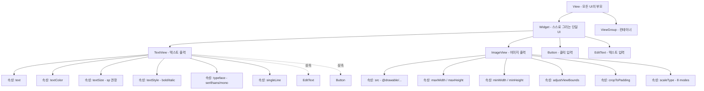

# 03. 모바일앱프로그래밍: 문자 및 이미지 출력을 위한 위젯 (TextView & ImageView)

## 🔗 선수 지식 (Prerequisites)
- [ ] **필수**: [1강. 안드로이드 프로젝트와 앱의 동작 원리](1강.md) - 이해 완료?
- [ ] **필수**: [2강. View와 위젯, View의 7대 속성](2강.md) - 이해 완료?
- [ ] **필수**: XML 태그/속성 문법, `findViewById()`를 통한 코드-XML 연결
- [ ] **권장**: 안드로이드 단위 체계 — `dp`(밀도 독립 픽셀), `sp`(스케일 독립 픽셀, 글꼴 전용), `px`
- [ ] **권장**: 비트맵/벡터 이미지의 차이 (`.png`/`.jpg` vs `.xml` 벡터 드로어블)
- **관련 단원**: [1강](1강.md) · [2강](2강.md) · 4강. 레이아웃 (다음 강의)

---

## 학습 목표
1. TextView의 역할과 속성(text, textColor, textSize, textStyle, typeface, singleLine 속성)에 대한 이해할 수 있다.
2. ImageView의 역할과 속성(src, maxWidth, maxHeight, minWidth, minHeight, adjustViewBounds, cropToPadding, scaleType)에 대해 이해할 수 있다.
3. 위젯에 대한 이해할 수 있다.
4. View의 속성(id 속성, background 속성, rotation 속성, padding 속성, visibility 속성, focusable 속성, alpha 속성)에 대한 이해할 수 있다.

---

## 🧠 메타인지 체크 (학습 전/후 자기 평가)

### 학습 전 자기 평가
| 소주제 | 자신감 (1-5) |
| :--- | :--- |
| TextView 6대 속성 (text/textColor/textSize/textStyle/typeface/singleLine) | |
| ImageView 8대 속성 (src/maxWidth/maxHeight/minWidth/minHeight/adjustViewBounds/cropToPadding/scaleType) | |
| 위젯의 정의 (스스로 그릴 수 있는 능력) | |
| scaleType 8가지 모드 구분 (fitCenter/centerCrop/fitXY 등) | |
| sp vs dp vs px 단위 구분 | |

### 학습 후 교정 (학습 완료 후 작성)
| 소주제 | 학습 전 | 학습 후 | 실제 정답률 | 과신/과소 여부 |
| :--- | :--- | :--- | :--- | :--- |
| TextView 속성 | | | | |
| ImageView 속성 | | | | |
| 위젯 정의 | | | | |
| scaleType 모드 | | | | |
| 단위 체계 | | | | |

> **활용법**: 학습 전 1분 → 자신감 기입, 학습 후 1분 → 나머지 기입. "과신" 영역이 실제 취약점.

---

## 📝 요약 (Summary)
1. 🔴 **TextView**: 화면에 텍스트를 출력하는 위젯. 제목, 안내 문구, 설명 문장, 라벨 등 모든 글자 표시의 기본 클래스(`android.widget.TextView`). (→←2강 — 위젯의 대표 예시)
2. 🔴 **TextView의 속성**: `text`, `textColor`, `textSize`, `textStyle`, `typeface`, `singleLine` 속성.
3. 🔴 **ImageView**: 화면에 아이콘이나 비트맵을 출력하는 위젯. 사진, 아이콘, 그래픽 자산 등 모든 이미지 표시의 기본 클래스(`android.widget.ImageView`). (→←2강)
4. 🔴 **ImageView의 속성**: `src`, `maxWidth`, `maxHeight`, `adjustViewBounds`, `cropToPadding`, `minWidth`, `minHeight`, `scaleType` 속성.
   - 🟡 **`app:srcCompat`**(androidx): `android:src`의 하위호환 대체. **벡터 드로어블(VectorDrawable)을 구버전 OS에서도 호환** 표시하게 해 주므로 벡터 이미지엔 이쪽을 권장. 근거: [Android Developers — Vector drawables](https://developer.android.com/develop/ui/views/graphics/vector-drawable-resources)
   - 🟡 **`contentDescription`**: 이미지의 의미를 설명하는 텍스트로 **접근성(TalkBack 등 스크린 리더)에 필수**. 의미 있는 이미지엔 반드시 지정, 순수 장식용은 `null`/빈 값.
5. 🔴 **위젯 (Widget)**: 컴퓨터에서 운영체제 위의 응용 프로그램을 동작시키고, **결과를 화면에 표시하는 작은 그래픽 사용자 인터페이스(GUI) 도구**. (→←2강)
6. 🟡 **속성(attribute) vs 위젯(widget)의 구분**: TextView/ImageView는 위젯(클래스), `text`/`src`/`adjustViewBounds`/`cropToPadding`은 위젯이 가진 속성(XML attribute) — 기출 함정 빈출. 📎 기출
7. 🟡 **scaleType**: ImageView에 들어있는 비트맵의 표시 크기/비율을 어떻게 맞출지 지정. `fitCenter`(기본), `centerCrop`, `fitXY`, `center`, `centerInside`, `fitStart`, `fitEnd`, `matrix` 8가지.
8. 🟢 **dp/sp 단위 체계**: TextView의 `textSize`는 시스템 글꼴 크기 설정을 반영하는 **`sp`(scale-independent pixel)** 사용을 권장하고, 그 외 길이는 **`dp`** 사용을 권장한다.

---

## 🧩 핵심 정의 및 원리 (Key Concepts)

> **과목 유형**: 실습 중심(안드로이드 프로그래밍) → **핵심 정의 및 원리** + **핵심 문법 및 패턴** 테이블 병용

| 정의명 | 내용 | 키워드 |
| :--- | :--- | :--- |
| **위젯 (Widget)** | 운영체제 위의 응용 프로그램을 동작시키고 **결과를 화면에 표시**하는 작은 GUI 도구. 안드로이드에서는 `View`를 상속받아 스스로 자기 영역을 그릴 수 있는 단일 UI 부품 | 스스로 그리기, GUI 도구, View 상속 |
| **TextView** | 텍스트(글자)를 화면에 출력하는 위젯. `android.widget.TextView` | 텍스트 출력, 라벨, EditText의 부모 |
| **ImageView** | 이미지(아이콘, 비트맵, 사진)를 화면에 출력하는 위젯. `android.widget.ImageView` | 이미지 출력, 비트맵, drawable 참조 |
| **속성 (Attribute)** | XML에서 `android:속성명="값"` 형태로 위젯의 동작/모양을 지정하는 항목. 위젯과는 다른 개념(위젯 ≠ 속성) | XML 속성, 위젯의 옵션 |
| **드로어블 (Drawable)** | `res/drawable/` 폴더의 이미지/도형 리소스. `@drawable/파일명` 으로 참조 | 비트맵, 벡터, 9-patch |
| **app:srcCompat** | androidx(AppCompat) 네임스페이스 속성. `android:src`의 하위호환 버전으로, **벡터 드로어블을 구버전 OS에서도** 호환 표시 | 벡터 호환, AppCompat, 하위호환 |
| **contentDescription** | 이미지의 의미를 설명하는 접근성용 텍스트. 스크린 리더(TalkBack)가 읽어 줌 | 접근성, TalkBack, 필수 속성 |
| **adjustViewBounds** | ImageView가 자신의 종횡비(aspect ratio)를 이미지에 맞춰 자동 조정할지 여부. `true`일 때 maxWidth/maxHeight와 함께 비례 축소 | 비율 보존, max* 함께 사용 |
| **cropToPadding** | View의 padding 영역까지 포함하여 이미지를 자를(crop) 것인지 여부. `true`면 padding 영역도 잘라냄 | 패딩 침범 방지 |
| **scaleType** | ImageView 영역과 비트맵의 크기가 다를 때, **어떻게 맞출지** 결정하는 8가지 모드 중 하나 | fitCenter(기본), centerCrop, fitXY |

### 핵심 문법 및 패턴

| 패턴명 | 코드 (XML) | 용도 |
| :--- | :--- | :--- |
| **기본 TextView** | `<TextView android:id="@+id/tv" android:layout_width="wrap_content" android:layout_height="wrap_content" android:text="@string/hello" />` | 문자열 리소스 참조로 글자 출력 |
| **글자 색/크기/스타일** | `android:textColor="#FF0000FF" android:textSize="20sp" android:textStyle="bold\|italic"` | 시각 표현 일괄 지정. `\|`로 여러 스타일 결합 |
| **글꼴 지정** | `android:typeface="serif"` 또는 `android:fontFamily="@font/notosans"` | 시스템 글꼴(`normal/sans/serif/monospace`) 또는 커스텀 폰트 |
| **한 줄 강제** | `android:singleLine="true"` (구) / `android:maxLines="1" android:ellipsize="end"` (권장) | 줄바꿈 방지, 넘침 시 `…` 처리 |
| **기본 ImageView** | `<ImageView android:id="@+id/iv" android:layout_width="wrap_content" android:layout_height="wrap_content" android:src="@drawable/photo" />` | 드로어블 리소스 표시 |
| **이미지 크기 제한** | `android:maxWidth="200dp" android:maxHeight="200dp" android:adjustViewBounds="true"` | **3개 속성 한 세트** — adjustViewBounds=true 가 있어야 max*가 동작 |
| **scaleType 변경** | `android:scaleType="centerCrop"` | 사각 영역을 꽉 채우면서 비율 유지(잘림 허용) |
| **코드에서 동적 변경** | `tv.setText("...");` / `iv.setImageResource(R.drawable.x);` | 자바/코틀린에서 런타임 변경 |

> **직관적 해석**: TextView는 "**글자판**", ImageView는 "**액자**". 액자(ImageView)의 가장 헷갈리는 옵션은 "사진을 액자에 어떻게 끼울지(`scaleType`)"와 "액자 크기를 사진에 맞출지(`adjustViewBounds`)"이다.

> **AI 적용**: 위젯의 속성 체계는 ML 시각화 라이브러리(matplotlib의 `Axes` 속성, Plotly의 trace 속성)와 동일한 사상으로, **객체(위젯) + 키-값 속성 집합**으로 시각화를 선언적으로 구성하는 패턴이다. On-device ML에서 추론 결과(인식된 라벨)를 TextView, 입력 이미지를 ImageView로 표시하는 것이 가장 흔한 결합이다.

---

## 📊 개념 시각화 (Visual Guide)

### 위젯 분류 체계도 (3강 범위 중심)



> **포인트**: Button과 EditText도 사실은 **TextView를 상속**받은 위젯이다. 즉, TextView의 모든 속성은 Button/EditText에서도 그대로 사용 가능.

### scaleType 8개 모드 시각 비교

| 모드 | 동작 | 비율 유지 | 영역 채움 | 잘림(crop) | 용도 |
| :--- | :--- | :--- | :--- | :--- | :--- |
| **fitCenter** (기본) | 비율 유지하며 영역 안에 **딱 맞게** 축소/확대, 중앙 정렬 | O | 한 변만 채움 | X | 사진 썸네일 기본 |
| **centerCrop** | 비율 유지하며 영역을 **꽉 채움**, 넘치는 부분 잘림 | O | 꽉 채움 | O | 배경 이미지, 카드 썸네일 |
| **fitXY** | 비율 **무시**하고 영역에 강제로 늘림 | **X** | 꽉 채움 | X | 비율이 중요치 않은 배경 |
| **center** | 비율/크기 변경 없이 **원본 그대로** 중앙 배치 | O | 안 채움 | 영역 작으면 잘림 | 아이콘 |
| **centerInside** | 영역보다 크면 fitCenter처럼 축소, 작으면 원본 그대로 | O | 한 변만 또는 안 채움 | X | 동적 크기 보호 |
| **fitStart** | fitCenter처럼 영역에 맞춤(영역이 작으면 축소, **영역이 더 크면 확대**)하되 **좌상단** 정렬 | O | 한 변만 채움 | X | 좌측 정렬 갤러리 |
| **fitEnd** | fitCenter처럼 영역에 맞춤(영역이 작으면 축소, **영역이 더 크면 확대**)하되 **우하단** 정렬 | O | 한 변만 채움 | X | 우측 정렬 갤러리 |
| **matrix** | 행렬(`ImageView.setImageMatrix`)로 자유 변환 | 자유 | 자유 | 자유 | 고급(줌/팬) |

> 🟠 **fit* 계열은 "축소 전용"이 아니다**: `fitCenter`/`fitStart`/`fitEnd`는 비율을 유지하며 이미지를 **영역에 딱 맞춘다**. 따라서 이미지가 영역보다 크면 **축소**하지만, 반대로 **영역이 이미지보다 크면 확대(enlarge)** 해서 채운다(작은 아이콘을 큰 영역에 넣으면 비율 유지한 채 커짐). 즉 "맞춤(fit)"이지 "축소(shrink)"가 아니다. (영역보다 클 때 확대를 막고 싶으면 작으면 원본 유지하는 `centerInside`를 쓴다.)

> 🟡 **`android:src` vs `android:background` 차이**: `scaleType`은 **`src`로 지정한 이미지에만** 적용된다(전경 이미지). 반면 `android:background`로 지정한 이미지/드로어블은 scaleType의 영향을 받지 않고 **View 영역 전체로 늘어나(stretch)** 채워지며, padding 등도 다르게 해석된다. 따라서 비율을 보존하며 사진을 표시하려면 반드시 `background`가 아니라 **`src`(+ `scaleType`)** 를 사용해야 한다.

### 핵심 도식: XML 속성 → 화면 결과

| 속성 (Attribute) | 입력값 예시 | 결과 (화면) | 비고 |
| :--- | :--- | :--- | :--- |
| `android:text` | `"안녕하세요"` 또는 `"@string/hello"` | "안녕하세요" 출력 | 다국어 위해 string 리소스 권장 |
| `android:textColor` | `"#FFFF0000"` 또는 `"@color/red"` | 빨간 글자 | ARGB(8자리) 또는 RGB(6자리) |
| `android:textSize` | `"20sp"` | 사용자 글꼴 설정에 비례한 글자 크기 | dp 아닌 **sp** 권장 |
| `android:textStyle` | `"bold"` / `"italic"` / `"bold\|italic"` | 굵게 / 기울임 / 둘 다 | `\|` 결합 가능 |
| `android:typeface` | `"normal"` / `"sans"` / `"serif"` / `"monospace"` | 글꼴 변경 | 시스템 4종 |
| `android:singleLine` | `"true"` | 줄바꿈 없이 한 줄 | API 3 이후 deprecated → `maxLines="1"` 권장 |
| `android:src` | `"@drawable/photo"` | 이미지 표시 | drawable 폴더의 파일명 |
| `android:adjustViewBounds` | `"true"` | View 크기를 이미지 비율에 맞춤 | `maxWidth/Height`와 세트 |
| `android:scaleType` | `"centerCrop"` | 비율 유지 + 꽉 채움 + 잘림 | 8가지 중 택1 |

---

## ✏️ 심화 학습 (Study Subject)

### 1. 가상 시나리오: "어떤 위젯/속성을, 언제 사용해야 할까?"
- **상황**: 음식 배달 앱의 메뉴 카드를 만드는데, 각 카드는 (1) 음식 사진 1장 (320×240 비율 제각각), (2) 메뉴 이름 1줄 (길면 `…` 처리), (3) 가격 1줄 (굵게, 빨간색) 으로 구성된다. 폰마다 카드 폭이 달라지고, 사진은 카드 폭에 꽉 차게 채우되 비율은 유지해야 한다.
- **문제**: TextView와 ImageView의 어떤 속성을 조합해야 디자인 의도를 정확히 표현할 수 있는가?
- **해결**:
  1. **사진**: `ImageView` + `android:scaleType="centerCrop"` (꽉 채우며 비율 유지, 잘림 허용) + `android:adjustViewBounds="true"` (필요 시) — 카드 폭이 변해도 비율은 유지.
  2. **메뉴 이름**: `TextView` + `android:maxLines="1"` + `android:ellipsize="end"` ← `singleLine`은 deprecated이므로 권장 대안. 폰트는 `textSize="16sp"` (사용자 글꼴 설정 반영).
  3. **가격**: `TextView` + `android:textStyle="bold"` + `android:textColor="@color/red"` + `android:textSize="18sp"`.
  4. 색상은 코드에 하드코딩하지 말고 `res/values/colors.xml`로 분리 → 다크모드 자동 대응 가능.
- **AI 학습 포인트**: "ImageView의 scaleType=centerCrop과 CSS의 `object-fit: cover`는 같은 동작이라는데, 모바일과 웹에서 이 패턴이 채택된 이유 그리고 ML 데이터 증강(crop augmentation)과의 개념적 유사성을 비교해 줘."

### 2. 관점별 비교 및 오개념 분석
- **핵심 비교**: **위젯(Widget) vs 속성(Attribute)**, **adjustViewBounds vs scaleType**, **singleLine vs maxLines**.

#### 위젯 vs 속성 (기출 빈출 함정)

| 구분 | 위젯 (Widget) | 속성 (Attribute) |
| :--- | :--- | :--- |
| **정의** | 화면에 무언가를 그리는 **클래스/객체** | 그 위젯의 동작/모양을 지정하는 **XML 키-값** |
| **예시** | `TextView`, `ImageView`, `Button` | `text`, `src`, `textColor`, `scaleType` |
| **XML 표기** | `<TextView ... />` (태그명) | `android:text="..."` (태그 안 속성) |
| **혼동 함정** | "텍스트를 출력하는 것은?" → **TextView** | "텍스트 출력 위젯은? ③ text" → 오답(text는 속성) 📎 기출 |

#### adjustViewBounds vs scaleType

| 구분 | adjustViewBounds | scaleType |
| :--- | :--- | :--- |
| **조정 대상** | **ImageView(컨테이너)** 자체의 크기 | **비트맵**의 표시 방식 |
| **목적** | View가 이미지 종횡비에 맞춰 크기 조정 | 영역 vs 이미지 크기 차이를 어떻게 메울지 |
| **타입** | boolean (`true`/`false`) | enum (8가지) |
| **함께 사용** | `maxWidth`/`maxHeight`와 짝 | 단독 사용 가능 |
| **레이아웃 영향** | 측정(measure) 단계에 영향 → 형제 View 위치 변화 | 그리기(draw) 단계만 영향 |

#### singleLine vs maxLines

| 구분 | singleLine | maxLines |
| :--- | :--- | :--- |
| **API 상태** | API 3(Android 1.5)에서 **deprecated** | 현재 권장 |
| **값** | `"true"`/`"false"` (한 줄/여러 줄) | 정수(`"1"`, `"3"` 등) |
| **줄바꿈 동작** | 줄바꿈 강제 차단 | 지정한 줄 수까지 허용 |
| **완전 대체 여부** | — | 🟠 **maxLines는 singleLine의 완전한 대체가 아님** — `singleLine=true`는 한 줄 강제와 함께 **EditText의 가로 스크롤** 등 부가 동작을 동반하는데, `maxLines`만으로는 동일하게 재현되지 않는다 |
| **권장** | 신규 코드에서는 사용 자제 | `android:maxLines="1"` + `android:ellipsize="end"` (단순 표시 제한 용도엔 충분) |

- **오개념 분석**
    - **오개념 1**: "TextView의 `text`와 ImageView의 `src`도 위젯이다." 📎 기출 Q1/Q2 함정 선택지
    - **분석**: 잘못된 생각이다. `text`, `src`, `adjustViewBounds`, `cropToPadding`은 모두 **위젯의 속성(attribute)** 이지 위젯이 아니다. 위젯은 화면에 무엇을 그리는 **클래스(객체)**, 속성은 그 위젯의 옵션이다. 따라서 "텍스트를 출력하는 위젯은?" 같은 질문에서 `text`를 고르면 오답.
    - **오개념 2**: "`maxWidth`/`maxHeight`만 지정하면 ImageView 크기가 자동으로 비례 조정된다."
    - **분석**: 잘못된 생각이다. `adjustViewBounds="true"`가 함께 있어야 max* 값이 적용된다. 둘 중 하나만 지정하면 의도와 다른 결과(이미지 잘림 또는 무시)가 나온다.
    - **오개념 3**: "`textSize`를 `dp`로 지정하면 다양한 디바이스에서 잘 보인다."
    - **분석**: 글꼴은 **`sp`**(scale-independent pixel) 사용을 권장한다. `sp`는 사용자가 OS 설정에서 글꼴 크기를 키웠을 때 자동 반영되어 접근성을 보장하지만, `dp`는 사용자 설정을 무시한다.
- **AI 학습 포인트**: "안드로이드의 위젯 속성 체계는 React Native의 props, Flutter의 Widget constructor parameter와 어떤 점에서 유사하고 어떤 점에서 다른가? 선언적 UI 프레임워크의 일반 원리 관점에서 비교해 줘."

---

## ❓ 연습 문제 및 해설

> **블룸 인지 수준 범례**: [기억] 정의·나열 → [이해] 설명·비교 → [적용] 계산·구현 → [분석] 구별·디버그 → [평가] 판단·비평 → [창조] 설계·제안

### 📝 문제

**1. ⭐ [기억] 화면에 텍스트를 출력하는 위젯은 무엇인가? [📎 기출](#prob-1)**
   > ① TextView
   > ② ImageView
   > ③ text
   > ④ src

<br>

**2. ⭐ [기억] 화면에 아이콘이나 비트맵을 출력하는 위젯은 무엇인가? [📎 기출](#prob-2)**
   > ① TextView
   > ② adjustViewBounds
   > ③ cropToPadding
   > ④ ImageView

<br>

**3. ⭐⭐ [이해/분석] 📌 다음 중 **TextView의 속성**이 아닌 것은? [(#prob-3)](#prob-3)**
   > ① textColor
   > ② textStyle
   > ③ adjustViewBounds
   > ④ singleLine

<br>

**4. ⭐⭐ [적용] 📌 ImageView를 사용해 정사각형 카드(200dp × 200dp) 안에 가로가 더 긴 사진을 **비율을 유지한 채로 꽉 채우고 잘림은 허용**하려고 한다. 가장 적절한 `scaleType` 값은? [(#prob-4)](#prob-4)**
   > ① fitXY
   > ② fitCenter
   > ③ centerCrop
   > ④ center

<br>

**5. ⭐⭐ [분석] 📌 다음 중 **ImageView의 `adjustViewBounds` 속성**에 대한 설명으로 옳은 것을 모두 고르시오. [(#prob-5)](#prob-5)**
   > <보기>
   >
   > 가. ImageView 자체의 크기를 이미지의 종횡비에 맞춰 조정한다.
   > 나. `true`로 설정해도 `maxWidth`/`maxHeight`가 없으면 효과가 거의 없다.
   > 다. 비트맵 내부의 픽셀을 자르는(crop) 옵션이다.
   > 라. boolean 타입(`true`/`false`)으로 지정한다.

   > ① 가, 라
   > ② 가, 나, 라
   > ③ 가, 다, 라
   > ④ 가, 나, 다, 라

<br>

**6. ⭐⭐ [이해] 📌 안드로이드에서 글꼴(`textSize`) 단위로 가장 권장되는 것은? [(#prob-6)](#prob-6)**
   > ① px
   > ② dp
   > ③ sp
   > ④ pt

<br>

**7. ⭐⭐⭐ [평가/창조] 📌 다음 요구사항을 만족하는 XML 코드를 작성하시오. [(#prob-7)](#prob-7)**
> **요구사항**:
> 1. 메뉴 이름을 출력하는 TextView 1개 — 굵게+이탤릭, 18sp, 빨간색(`#FFFF0000`), 한 줄 처리(`maxLines=1`, 넘침 시 `…`).
> 2. 그 아래에 메뉴 사진을 출력하는 ImageView 1개 — `@drawable/menu_photo`, 너비 `match_parent`, 높이 `200dp`, `centerCrop`.
> 3. 두 위젯을 세로로 배치하는 `LinearLayout` 안에 포함.

---

### 🔑 정답 및 해설 (먼저 풀어본 후 펼치기)

<details>
<summary>정답 보기 (클릭)</summary>

1. ①
2. ④
3. ③
4. ③
5. ②
6. ③
7. [코드형 — 해설 참조]

</details>

<details>
<summary>해설 보기 (클릭)</summary>

<a id="prob-1"></a>
**1. ⭐ [기억] 텍스트 출력 위젯**
> **정답: ① TextView**
> **해설**: TextView는 안드로이드에서 화면에 글자(텍스트)를 표시하는 기본 위젯이다. 제목, 안내 문구, 설명 문장, 라벨 등을 출력할 때 사용한다.
> - ② ImageView: 이미지(그림)를 보여주는 위젯.
> - ③ text: 위젯이 아니라 **TextView의 속성**(android:text="...").
> - ④ src: 위젯이 아니라 **ImageView의 속성**(android:src="...").
>
> ➡️ **핵심 함정**: 위젯(클래스)과 속성(attribute)을 구분할 줄 알아야 한다.

<a id="prob-2"></a>
**2. ⭐ [기억] 이미지 출력 위젯**
> **정답: ④ ImageView**
> **해설**: ImageView는 안드로이드에서 이미지(아이콘, 비트맵, 사진 등)를 화면에 표시하는 위젯이다.
> - ① TextView: 텍스트를 출력하는 위젯.
> - ② adjustViewBounds: 위젯이 아니라 **ImageView의 속성** — 이미지 비율에 맞춰 View 크기를 조정할지 여부.
> - ③ cropToPadding: 위젯이 아니라 **ImageView의 속성** — padding 영역까지 잘라낼지 여부.

<a id="prob-3"></a>
**3. ⭐⭐ [이해/분석] TextView 속성 식별**
> **정답: ③ adjustViewBounds**
> **해설**: TextView의 6대 속성은 `text`, `textColor`, `textSize`, `textStyle`, `typeface`, `singleLine`이다. `adjustViewBounds`는 **ImageView 전용 속성**이며 TextView에는 존재하지 않는다.

<a id="prob-4"></a>
**4. ⭐⭐ [적용] scaleType 선택**
> **정답: ③ centerCrop**
> **해설**:
> - ① **fitXY**: 비율 무시(가로세로 비율 깨짐) → 요구사항 "비율 유지" 위반.
> - ② **fitCenter**: 비율은 유지하지만 한 변만 채우고 나머지는 빈 공간이 생김 → "꽉 채움" 위반.
> - ③ **centerCrop**: 비율 유지 + 영역을 꽉 채움 + 넘치는 부분은 잘림. ✅ 모든 요구사항 충족.
> - ④ **center**: 원본 크기 그대로 중앙 배치, 영역보다 작으면 빈 공간, 크면 잘림. → "꽉 채움" 위반.

<a id="prob-5"></a>
**5. ⭐⭐ [분석] adjustViewBounds**
> **정답: ② 가, 나, 라**
> **해설**:
> - 가. (O) `adjustViewBounds=true`는 ImageView의 크기를 이미지 종횡비에 맞춰 조정하도록 한다.
> - 나. (O) 일반적으로 `maxWidth`/`maxHeight`와 함께 사용해야 의미 있는 효과가 난다. 둘 중 하나라도 없으면 자동 조정 효과가 제한적이다.
> - 다. (X) 픽셀을 자르는 것은 **`cropToPadding`** 또는 `scaleType="centerCrop"`의 역할이다. `adjustViewBounds`는 자르지 않는다.
> - 라. (O) boolean 타입이다(`true`/`false`).

<a id="prob-6"></a>
**6. ⭐⭐ [이해] 글꼴 단위**
> **정답: ③ sp**
> **해설**: `sp`(scale-independent pixel)는 사용자가 시스템 설정에서 글꼴 크기를 변경했을 때 자동으로 반영되어 **접근성**을 보장한다. `dp`는 화면 밀도만 고려하고 사용자 설정을 반영하지 않기 때문에 글자 크기에는 부적합. 일반 길이(여백/너비/높이)는 `dp`, 글자만 `sp`가 안드로이드의 표준 관례.

<a id="prob-7"></a>
**7. ⭐⭐⭐ [평가/창조] XML 작성**
> **정답 예시**:
> ```xml
> <?xml version="1.0" encoding="utf-8"?>
> <LinearLayout xmlns:android="http://schemas.android.com/apk/res/android"
>     android:layout_width="match_parent"
>     android:layout_height="wrap_content"
>     android:orientation="vertical">
>
>     <TextView
>         android:id="@+id/tv_menu_name"
>         android:layout_width="wrap_content"
>         android:layout_height="wrap_content"
>         android:text="짜장면"
>         android:textColor="#FFFF0000"
>         android:textSize="18sp"
>         android:textStyle="bold|italic"
>         android:maxLines="1"
>         android:ellipsize="end" />
>
>     <ImageView
>         android:id="@+id/iv_menu_photo"
>         android:layout_width="match_parent"
>         android:layout_height="200dp"
>         android:src="@drawable/menu_photo"
>         android:scaleType="centerCrop" />
> </LinearLayout>
> ```
> **해설**:
> - `textStyle="bold|italic"`: 파이프(`|`)로 두 스타일을 결합.
> - `textSize="18sp"`: 글꼴은 `sp`.
> - `maxLines="1" + ellipsize="end"`: `singleLine`(deprecated)을 대체하는 권장 패턴.
> - ImageView의 높이를 `200dp`로 고정했으므로 `adjustViewBounds`는 불필요(고정 크기). `scaleType="centerCrop"`이 "꽉 채우면서 비율 유지"를 담당.

</details>

---

## ✅ O/X 확인문제 (연습문항 개수의 2배 권장)

**1.** TextView는 화면에 텍스트를 출력하는 위젯이다. [(#ox-1)](#ox-1) **(O / X)**
**2.** ImageView는 화면에 아이콘이나 비트맵을 출력하는 위젯이다. [(#ox-2)](#ox-2) **(O / X)**
**3.** `text`는 TextView 위젯의 하위 클래스 위젯이다. [(#ox-3)](#ox-3) **(O / X)**
**4.** `src`는 ImageView의 속성으로, `@drawable/파일명` 형태로 이미지를 지정한다. [(#ox-4)](#ox-4) **(O / X)**
**5.** `adjustViewBounds="true"`만 지정하면 `maxWidth`/`maxHeight` 없이도 ImageView 크기가 이미지 비율에 맞춰진다. [(#ox-5)](#ox-5) **(O / X)**
**6.** `scaleType="fitXY"`는 비율을 무시하고 ImageView 영역을 강제로 꽉 채운다. [(#ox-6)](#ox-6) **(O / X)**
**7.** TextView의 글꼴 크기는 `dp` 단위로 지정하는 것이 권장된다. [(#ox-7)](#ox-7) **(O / X)**
**8.** `textStyle` 속성에 `"bold|italic"`처럼 파이프로 여러 스타일을 결합할 수 있다. [(#ox-8)](#ox-8) **(O / X)**
**9.** `singleLine`은 최신 API에서 deprecated되었으며 `maxLines`와 `ellipsize` 조합이 권장된다. [(#ox-9)](#ox-9) **(O / X)**
**10.** Button과 EditText는 TextView를 상속받은 위젯이므로 TextView의 모든 속성을 그대로 사용할 수 있다. [(#ox-10)](#ox-10) **(O / X)**
**11.** `cropToPadding`은 비트맵 자체를 자르는 옵션이며 padding과는 무관하다. [(#ox-11)](#ox-11) **(O / X)**
**12.** `scaleType="centerCrop"`은 비율을 유지하면서 영역을 꽉 채우고, 넘치는 부분은 잘라낸다. [(#ox-12)](#ox-12) **(O / X)**
**13.** `typeface="serif"`는 시스템에 기본 탑재된 글꼴 패밀리 중 하나이다. [(#ox-13)](#ox-13) **(O / X)**
**14.** ImageView의 `src`는 위젯이며, 화면에 직접 비트맵을 그릴 수 있다. [(#ox-14)](#ox-14) **(O / X)**

<details>
<summary>O/X 정답 및 해설 보기 (클릭)</summary>

> <a id="ox-1"></a>
> **1. 정답**: O
> **해설**: 정리하기 그대로. TextView=텍스트 출력 위젯.

> <a id="ox-2"></a>
> **2. 정답**: O
> **해설**: 정리하기 그대로. ImageView=아이콘/비트맵 출력 위젯.

> <a id="ox-3"></a>
> **3. 정답**: X
> **해설**: `text`는 위젯이 아니라 **TextView의 속성**(android:text). 위젯과 속성을 혼동하지 말 것.

> <a id="ox-4"></a>
> **4. 정답**: O
> **해설**: `android:src="@drawable/파일명"` 형식으로 drawable 폴더의 이미지를 참조한다.

> <a id="ox-5"></a>
> **5. 정답**: X
> **해설**: `adjustViewBounds`는 일반적으로 `maxWidth`/`maxHeight`와 **함께** 사용해야 의미 있는 동작을 한다. 단독으로는 효과가 제한적.

> <a id="ox-6"></a>
> **6. 정답**: O
> **해설**: `fitXY`는 X/Y축으로 강제 스케일링하므로 비율이 깨질 수 있다.

> <a id="ox-7"></a>
> **7. 정답**: X
> **해설**: 글꼴 크기는 **`sp`** 가 권장된다. `dp`는 일반 길이용. `sp`는 사용자의 글꼴 크기 설정을 반영하여 접근성을 보장한다.

> <a id="ox-8"></a>
> **8. 정답**: O
> **해설**: `android:textStyle="bold|italic"` 처럼 `|`로 여러 플래그를 결합 가능.

> <a id="ox-9"></a>
> **9. 정답**: O
> **해설**: API 3 이후 deprecated. 권장 대안은 `android:maxLines="1"` + `android:ellipsize="end"`.

> <a id="ox-10"></a>
> **10. 정답**: O
> **해설**: Button extends TextView, EditText extends TextView 구조다. 따라서 `android:text`, `android:textColor` 등 TextView의 속성을 그대로 사용 가능.

> <a id="ox-11"></a>
> **11. 정답**: X
> **해설**: 이름 그대로 **padding 영역까지 포함해서 자를지(crop)** 정하는 옵션이다. padding 영역을 침범하지 않게 보호하려면 `false`(기본값) 유지.

> <a id="ox-12"></a>
> **12. 정답**: O
> **해설**: centerCrop의 정의 그대로.

> <a id="ox-13"></a>
> **13. 정답**: O
> **해설**: `normal`, `sans`, `serif`, `monospace` 4종이 시스템 기본 typeface 값.

> <a id="ox-14"></a>
> **14. 정답**: X
> **해설**: `src`는 위젯이 아니라 ImageView의 **속성**. 직접 그리는 것은 ImageView이며, src는 무엇을 그릴지(어떤 드로어블을) 지정하는 옵션일 뿐.

</details>

---

## 🧪 자유 회상 연습 (Free Recall)

> **방법**: 위의 노트를 모두 덮고, 타이머 3분 설정 후 이번 단원에서 배운 내용을 기억나는 대로 자유롭게 적으세요.
> 정확한 문장이 아니어도 됩니다. 키워드, 관계 등 떠오르는 것을 모두 적습니다.

**자유 회상 작성란:**

```
[여기에 기억나는 내용을 자유롭게 작성]


```

> **회상 후 점검**: 노트를 다시 펼쳐 빠뜨린 내용을 확인하세요.
> - 회상 못한 TextView 속성(6개): [                ]
> - 회상 못한 ImageView 속성(8개): [                ]
> - 회상 못한 scaleType 모드: [                ]

---

## 💻 코드로 확인하기 (Code Verification)

### 종합 예제: TextView + ImageView 함께 사용

**`res/layout/activity_main.xml`**
```xml
<?xml version="1.0" encoding="utf-8"?>
<LinearLayout xmlns:android="http://schemas.android.com/apk/res/android"
    android:layout_width="match_parent"
    android:layout_height="match_parent"
    android:orientation="vertical"
    android:padding="16dp"
    android:gravity="center_horizontal">

    <!-- 1) 제목 TextView: 굵게 + 24sp + 파란색 -->
    <TextView
        android:id="@+id/tv_title"
        android:layout_width="wrap_content"
        android:layout_height="wrap_content"
        android:text="@string/menu_title"
        android:textColor="#FF0066CC"
        android:textSize="24sp"
        android:textStyle="bold"
        android:typeface="serif" />

    <!-- 2) 부제 TextView: 한 줄 처리 + 이탤릭 -->
    <TextView
        android:id="@+id/tv_subtitle"
        android:layout_width="wrap_content"
        android:layout_height="wrap_content"
        android:layout_marginTop="8dp"
        android:text="@string/menu_subtitle"
        android:textSize="14sp"
        android:textStyle="italic"
        android:maxLines="1"
        android:ellipsize="end" />

    <!-- 3) 사진 ImageView: 비율 유지하며 꽉 채우기 -->
    <ImageView
        android:id="@+id/iv_photo"
        android:layout_width="match_parent"
        android:layout_height="240dp"
        android:layout_marginTop="16dp"
        android:src="@drawable/menu_photo"
        android:scaleType="centerCrop"
        android:contentDescription="@string/menu_photo_desc" />

    <!-- 4) 아이콘 ImageView: 작은 사이즈 + adjustViewBounds 데모 -->
    <ImageView
        android:id="@+id/iv_icon"
        android:layout_width="wrap_content"
        android:layout_height="wrap_content"
        android:layout_marginTop="16dp"
        android:src="@drawable/ic_star"
        android:maxWidth="48dp"
        android:maxHeight="48dp"
        android:adjustViewBounds="true" />
</LinearLayout>
```

**`res/values/strings.xml`**
```xml
<resources>
    <string name="app_name">3강 데모</string>
    <string name="menu_title">짜장면 정식</string>
    <string name="menu_subtitle">아주 긴 부제목이 들어가도 한 줄로 잘립니다…</string>
    <string name="menu_photo_desc">짜장면 사진</string>
</resources>
```

**`MainActivity.java` — 코드에서 동적 변경 데모**
```java
package com.example.lesson3;

import android.app.Activity;
import android.graphics.Color;
import android.graphics.Typeface;
import android.os.Bundle;
import android.widget.ImageView;
import android.widget.TextView;

public class MainActivity extends Activity {
    @Override
    protected void onCreate(Bundle savedInstanceState) {
        super.onCreate(savedInstanceState);
        setContentView(R.layout.activity_main);

        // (1) TextView 동적 변경
        TextView title = findViewById(R.id.tv_title);
        title.setText("탕수육 (코드에서 변경)");
        title.setTextColor(Color.parseColor("#FFCC0000"));
        title.setTextSize(28);  // ⚠️ setTextSize(float)의 기본 단위는 COMPLEX_UNIT_SP(=sp), 픽셀 아님.
                                //    단위를 직접 지정하려면 setTextSize(TypedValue.COMPLEX_UNIT_DIP, 28f)처럼
                                //    setTextSize(int unit, float size) 오버로드 사용(두 오버로드 혼동 주의).
        title.setTypeface(Typeface.SANS_SERIF, Typeface.BOLD_ITALIC);

        // (2) ImageView 동적 변경
        ImageView photo = findViewById(R.id.iv_photo);
        photo.setImageResource(R.drawable.menu_photo_alt);
        photo.setScaleType(ImageView.ScaleType.FIT_CENTER);  // centerCrop → fitCenter로 변경
    }
}
```

> **실행 결과**:
> - 화면 상단에 "탕수육 (코드에서 변경)"이 빨간색 굵은 이탤릭 산세리프로, 그 아래 한 줄로 잘린 부제, 그 아래 240dp 높이의 사진(fitCenter로 변경되어 비율 유지 + 빈 공간 생김)이 표시된다.
> - 별 아이콘은 최대 48dp 안에서 비율 유지된 채 표시.
>
> **개념적 해석**:
> 1. XML과 코드 양쪽에서 같은 속성을 제어할 수 있다 (`android:text` ↔ `setText()`, `android:src` ↔ `setImageResource()`, `android:scaleType` ↔ `setScaleType()`).
> 2. **XML의 모든 속성은 일대일로 setter 메서드가 존재**하므로 정적 선언(XML)과 동적 변경(코드)을 자유롭게 조합할 수 있다.
> 3. `setTextSize(28)`은 기본 단위가 `sp`이므로 XML의 `android:textSize="28sp"`와 동일하다.

---

## 🤖 AI 연결고리 (Mobile Concept → AI Application)

| 모바일 개념 | AI/ML 적용 분야 | 구체적 사례 |
| :--- | :--- | :--- |
| **TextView로 결과 표시** | 모델 출력(라벨/캡션) 시각화 | 이미지 분류 결과(`"고양이 92%"`), OCR 인식 텍스트, LLM 응답 스트리밍 표시 |
| **ImageView로 입력 표시** | 모델 입력 전처리 시각화 | 카메라 캡처 이미지, 갤러리 선택 이미지를 ML Kit/TensorFlow Lite에 전달 전 미리보기 |
| **scaleType=centerCrop** | 데이터 증강(crop augmentation) | ResNet/ViT 입력 전처리에서 224×224 정사각 crop, CSS `object-fit: cover`와 동일 |
| **adjustViewBounds + maxWidth** | 동적 입력 크기 보정 | 가변 입력 크기를 가진 OCR/Bounding box 시각화에서 비율 보존 |
| **typeface 변경 (다국어)** | NLP 다국어 폰트 라우팅 | 한/중/일/아랍어 RTL 등 언어별 폰트 자동 선택, Noto Sans CJK 적용 |
| **sp 단위(접근성)** | 접근성-friendly UI in AI 앱 | 시각장애 보조 앱(Google Lookout, Be My Eyes 등)에서 사용자 글꼴 설정 존중 |

---

## 📖 심화 학습 예시 답안

#### 1. ImageView의 scaleType 내부 동작 원리

ImageView가 비트맵을 그리는 흐름:
1. **측정(measure)**: `onMeasure()` 단계에서 LayoutParams(width/height)와 부모 제약(MeasureSpec)을 받아 자기 영역 크기를 결정. 이때 `adjustViewBounds=true`이면 비트맵 종횡비를 고려해 영역을 조정.
2. **배치(layout)**: 부모 ViewGroup이 자식 ImageView의 위치(left/top/right/bottom)를 확정.
3. **그리기(draw)**: `onDraw(Canvas)`에서 비트맵을 그리기 전, **`scaleType`을 보고 Matrix(2D 변환 행렬)를 결정**한다:
   - `centerCrop`: 비트맵의 짧은 변이 영역의 짧은 변과 같아질 때까지 비율 유지 확대 → 긴 변이 영역을 벗어나면 잘림.
   - `fitCenter`: 비트맵의 긴 변이 영역의 긴 변과 같아질 때까지 비율 유지 축소 → 짧은 변 방향에 여백 발생.
   - `fitXY`: X축 스케일과 Y축 스케일을 **독립적으로** 영역에 맞춤 → 비율 깨짐.
   - `center`: 스케일 1.0 고정, 중앙 정렬.
4. **Canvas에 그리기**: 결정된 Matrix를 `canvas.drawBitmap(bitmap, matrix, paint)`로 적용.

> **요점**: `scaleType`은 결국 **2D 변환 행렬(translation + scale)** 의 선택지를 enum으로 추상화한 것이다. `matrix` 모드를 쓰면 개발자가 행렬을 직접 지정할 수 있어 줌/팬 같은 고급 기능 구현 가능.

#### 2. TextView vs EditText vs Button 비교표 (상속 관계)

| 구분 | TextView | EditText | Button |
| :--- | :--- | :--- | :--- |
| **역할** | 글자 출력 (읽기 전용) | 글자 출력 + 사용자 입력 받기 | 글자 출력 + 클릭 이벤트 처리 |
| **상속** | View 직속 | extends TextView | extends TextView |
| **편집 가능** | 불가(기본) | 가능 (`inputType` 지정) | 불가, 클릭에 특화 |
| **공통 속성** | text, textColor, textSize, textStyle, typeface, padding, background, ... | TextView의 모든 속성 + `hint`, `inputType` | TextView의 모든 속성 + 클릭 처리 |
| **포커스** | 기본 false | 기본 true | 기본 true |
| **AI 활용** | LLM 응답 출력, OCR 결과 표시 | 사용자 프롬프트 입력 | "분석 시작", "이미지 선택" 버튼 |

#### 3. ImageView 활용 Best Practice

- **Bad Practice (나쁜 예시)**
  ```xml
  <!-- 비율 깨짐 + 큰 이미지 무조건 풀해상도 로드 -->
  <ImageView
      android:layout_width="match_parent"
      android:layout_height="match_parent"
      android:src="@drawable/huge_4k_photo"
      android:scaleType="fitXY" />   <!-- 비율 깨짐 -->
  ```
  - 4K 이미지를 풀해상도로 메모리에 로드 → OOM(OutOfMemory) 위험.
  - `fitXY`로 비율 깨짐.
  - `contentDescription` 없어 접근성 위반.

- **Good Practice (좋은 예시)**
  ```xml
  <ImageView
      android:layout_width="match_parent"
      android:layout_height="240dp"
      android:src="@drawable/menu_photo"
      android:scaleType="centerCrop"
      android:adjustViewBounds="false"
      android:contentDescription="@string/menu_photo_desc" />
  ```
  ```java
  // 대용량 이미지는 Glide/Coil로 다운샘플링 + 캐싱
  // Glide.with(context).load(R.drawable.menu_photo).into(iv_photo);
  ```
- **설명**:
  - **비율 유지**: `centerCrop`으로 카드 영역을 꽉 채우면서 비율 유지.
  - **메모리 효율**: 대용량 이미지는 Glide/Picasso/Coil로 **inSampleSize** 다운샘플링 + 메모리/디스크 캐싱.
  - **접근성**: `contentDescription`은 TalkBack(스크린 리더) 사용자를 위한 필수 속성.
  - **고정 높이**: `wrap_content` 대신 `240dp` 같은 고정 높이로 레이아웃 점프 방지.

---

## 🟢 심층 확장 (Deep Dive) — Compose 대응과 이미지 로딩 라이브러리

> 본 절은 2차 심층 확장으로, 본문의 **TextView/ImageView(View 시스템)** 를 **Jetpack Compose**의 `Text()`/`Image()`로 대응시키고(특히 `scaleType` ↔ `ContentScale` 매핑), 대용량 이미지를 메모리 효율적으로 다루는 **이미지 로딩 라이브러리(Coil/Glide)** 를 보강한다. 모든 주장은 공식 문서로 검증하였다.

### 1. Jetpack Compose 대응: `TextView → Text()`, `ImageView → Image()`

명령형 View 시스템의 `TextView`/`ImageView`는 Compose에서 각각 `Text()`/`Image()` **Composable 함수**로 대응된다. XML 속성은 함수 파라미터 또는 `Modifier` 체인으로 바뀐다.

```kotlin
// TextView 대응: 본문 "제목 TextView(굵게+24sp+파란색)" → Compose Text()
Text(
    text = "짜장면 정식",
    color = Color(0xFF0066CC),
    fontSize = 24.sp,                       // textSize="24sp" — 단위 sp 동일
    fontWeight = FontWeight.Bold,           // textStyle="bold"
    fontFamily = FontFamily.Serif,          // typeface="serif"
    maxLines = 1,                           // maxLines="1"
    overflow = TextOverflow.Ellipsis        // ellipsize="end"
)

// ImageView 대응: 본문 "사진(비율 유지하며 꽉 채움)" → Compose Image()
Image(
    painter = painterResource(id = R.drawable.menu_photo),  // src="@drawable/menu_photo"
    contentDescription = "짜장면 사진",                        // contentDescription (접근성)
    contentScale = ContentScale.Crop,                       // scaleType="centerCrop"
    modifier = Modifier
        .fillMaxWidth()                                     // layout_width="match_parent"
        .height(240.dp)                                     // layout_height="240dp"
)
```

> ⚠️ **`contentDescription`은 Compose `Image()`의 필수 파라미터**다. 장식용 이미지는 `null`을 명시적으로 전달한다. 본문(3강)에서 강조한 접근성 원칙이 Compose에서는 아예 시그니처로 강제된다.
> 근거: [Android Developers — Customize an image (Compose)](https://developer.android.com/develop/ui/compose/graphics/images/customize)

#### `scaleType`(ImageView) ↔ `ContentScale`(Compose) 매핑표

본문의 scaleType 8개 모드는 Compose의 `ContentScale`로 다음과 같이 대응된다(완전 1:1은 아니며 의미 기준 매핑).

| ImageView `scaleType` | Compose `ContentScale` | 동작 (비율 유지/영역 채움/잘림) |
| :--- | :--- | :--- |
| **centerCrop** | `ContentScale.Crop` | 비율 유지 + 꽉 채움 + 넘침 잘림 |
| **fitCenter** (기본) | `ContentScale.Fit` | 비율 유지 + 한 변만 채움(여백 가능) + 잘림 없음 |
| **fitXY** | `ContentScale.FillBounds` | 비율 **무시** + 강제로 꽉 채움 |
| **centerInside** | `ContentScale.Inside` | 영역보다 크면 축소, 작으면 원본 유지(비율 유지) |
| **center** | `ContentScale.None` | 스케일 없음(원본 크기) — 정렬은 `alignment`로 |
| (가로만 채움) | `ContentScale.FillWidth` | 가로를 영역 너비에 맞춤(비율 유지) |
| (세로만 채움) | `ContentScale.FillHeight` | 세로를 영역 높이에 맞춤(비율 유지) |

> 참고: `fitStart`/`fitEnd`/`matrix`는 `ContentScale`에 직접 대응 항목이 없고, `ContentScale.Fit` + `alignment` 조합이나 별도 변환으로 처리한다. CSS `object-fit`과의 관계: `Crop≈cover`, `Fit≈contain`, `FillBounds≈fill`, `None≈none`, `Inside≈scale-down`.
> 근거: [Android Developers — ContentScale 레퍼런스](https://developer.android.com/reference/kotlin/androidx/compose/ui/layout/ContentScale)

### 2. 이미지 로딩 라이브러리: Coil / Glide (다운샘플링 · 캐싱 · 플레이스홀더)

본문 Best Practice에서 "대용량 이미지는 풀해상도 로드 시 **OOM(OutOfMemory)** 위험"이라고 지적했다. `android:src`로 정적 drawable을 표시하는 것을 넘어, **네트워크/대용량 이미지**를 다룰 때는 전용 라이브러리가 사실상 필수다. 대표적으로 **Coil**(Kotlin/코루틴 기반, Compose 친화)과 **Glide**(성숙한 자바 기반)가 있으며, 셋 다 다음 세 가지를 자동 처리한다.

| 기능 | 설명 | 메모리/UX 효과 |
| :--- | :--- | :--- |
| **다운샘플링(downsampling)** | 원본 해상도가 표시 영역(ImageView 크기)보다 크면 **축소된 비트맵만 디코딩**해 메모리에 적재 (ImageView 크기를 자동 인식) | 4K 이미지를 작은 썸네일로 띄울 때 OOM 방지 |
| **캐싱(caching)** | **메모리 캐시 + 디스크 캐시** 2단계. 한 번 받은 이미지는 재요청 시 네트워크/디코딩 생략 | 스크롤 재방문·재진입 시 즉시 표시, 트래픽↓ |
| **플레이스홀더(placeholder)** | 로딩 중/실패 시 임시 이미지(`placeholder`/`error`) 표시 | 빈 화면·깜빡임 방지, 매끄러운 UX |

```kotlin
// Coil — View 시스템(ImageView 확장 함수)
imageView.load("https://example.com/photo.jpg") {
    crossfade(true)
    placeholder(R.drawable.loading)   // 로딩 중 표시
    error(R.drawable.error)           // 실패 시 표시
}

// Coil — Jetpack Compose (AsyncImage)
AsyncImage(
    model = "https://example.com/photo.jpg",
    contentDescription = "원격 사진",
    contentScale = ContentScale.Crop,
    placeholder = painterResource(R.drawable.loading),
    modifier = Modifier.fillMaxWidth().height(240.dp)
)
```

```kotlin
// Glide — View 시스템
Glide.with(context)
    .load("https://example.com/photo.jpg")
    .placeholder(R.drawable.loading)
    .error(R.drawable.error)
    .centerCrop()                      // scaleType=centerCrop에 대응
    .into(imageView)
```

> **요점**: `android:scaleType`은 "**이미 메모리에 올라온** 비트맵을 영역에 어떻게 배치할지"만 결정하고 **메모리 사용량은 줄이지 못한다**. 반면 라이브러리의 다운샘플링은 "**얼마나 큰 비트맵을 메모리에 올릴지**"를 ImageView 크기에 맞춰 줄여 주므로, scaleType과 라이브러리는 **상호 보완**(배치 제어 vs 메모리 제어) 관계다.
> 근거: [Coil 공식 문서 — Getting Started](https://coil-kt.github.io/coil/getting_started/), [Android Developers — Loading images (Compose)](https://developer.android.com/develop/ui/compose/graphics/images/loading)

---

## 🟢 2차 심층 확장 (Deep Dive Ⅱ) — Coil vs Glide 비교와 "scaleType이 못 줄이는 메모리"

> 본 절은 리서치 기반 2차 심층 확장으로, 앞 Deep Dive가 다룬 라이브러리 개념을 **Coil과 Glide의 정면 비교표**로 구체화하고, 3강 Best Practice의 OOM 경고를 **"왜 `scaleType`만으로는 메모리를 못 줄이는가"** 라는 핵심 질문으로 정밀화한다. 모든 주장은 공식 문서로 검증하였다.

### 1. 핵심 오해 교정 — `scaleType`은 메모리 절감 수단이 아니다

3강 본문(scaleType 8개 모드, `centerCrop` 등)은 **그리기(draw) 단계의 배치 규칙**이다. 따라서 다음 사실을 분명히 해야 한다.

| 질문 | `android:scaleType` | 이미지 로딩 라이브러리(다운샘플링) |
| :--- | :--- | :--- |
| **언제 작동?** | 비트맵을 **이미 디코딩해 메모리에 올린 뒤**, 그릴 때 | 비트맵을 **디코딩하는 순간**(메모리 적재 전) |
| **무엇을 결정?** | 영역 안에서의 **배치/크롭/스케일**(시각) | **얼마나 큰 비트맵을 메모리에 올릴지**(용량) |
| **메모리 영향** | ❌ 없음(이미 풀해상도가 올라가 있음) | ✅ ImageView 크기에 맞춰 **축소 디코딩** → 대폭 절감 |
| **OOM 방지?** | ❌ 불가 | ✅ 4K 원본을 작은 썸네일로 띄울 때 OOM 회피 |

- 예: 4000×3000 사진(약 48MB, ARGB_8888 기준)을 200×150 ImageView에 `centerCrop`으로 띄워도, **scaleType은 메모리에 올라온 48MB 비트맵을 잘라 보여줄 뿐** 48MB 적재 자체를 막지 못한다. Coil/Glide는 표시 크기를 보고 **축소 비트맵만 디코딩**해 메모리를 수백 분의 1로 줄인다(자동 다운샘플링).
- 근거: [Coil 공식 문서 — Coil은 메모리 캐시·디스크 캐시·다운샘플링을 자동 수행](https://coil-kt.github.io/coil/), [Glide v4 — 자동 다운샘플링/캐싱](https://bumptech.github.io/glide/), [Android Developers — Optimizing bitmap images (Compose)](https://developer.android.com/develop/ui/compose/graphics/images/optimization)

### 2. Coil vs Glide 정면 비교표

대용량/네트워크 이미지에는 라이브러리가 사실상 필수다. 대표 두 라이브러리를 비교한다.

| 구분 | **Coil** | **Glide** |
| :--- | :--- | :--- |
| **기반 언어** | **Kotlin**(코루틴 기반, 경량) | **Java**(성숙·검증, 대규모 사용) |
| **다운샘플링** | 표시 크기에 맞춰 자동 디코딩(축소 비트맵) | 자동(Target/ImageView/override 크기 기준) |
| **메모리 캐시** | 최근 디코딩 비트맵 LRU 메모리 캐시 | LRU 메모리 캐시 + BitmapPool(재사용) |
| **디스크 캐시** | 네트워크 이미지 디스크 캐시 | LRU 디스크 캐시(원본/변환본 단계 선택) |
| **메모리 압박 대응** | 시스템 콜백에 맞춰 캐시 정리 | `ComponentCallbacks2`에 반응해 자동 eviction |
| **Compose 지원** | **1급 지원**(`AsyncImage`, `rememberAsyncImagePainter`) | Accompanist/외부 연동(상대적으로 후순위) |
| **대표 강점** | 코틀린/코루틴/Compose 친화, 적은 보일러플레이트 | 폭넓은 포맷·세밀한 캐시 전략·오랜 안정성 |

> **공통점(셋 다 자동 처리)**: ① **다운샘플링**(표시 크기에 맞춘 축소 디코딩 → OOM 방지), ② **2단계 캐싱**(메모리 + 디스크 → 재방문 즉시 표시, 트래픽 절감), ③ **요청 생명주기 관리**(스크롤 중 보이지 않게 된 요청 자동 취소/일시정지). 이 세 가지가 `android:src` + `scaleType`만으로는 얻을 수 없는 부분이다.
> 근거: [Coil — Image Loaders(메모리·디스크 캐시)](https://coil-kt.github.io/coil/image_loaders/), [Glide v4 — Caching](https://bumptech.github.io/glide/doc/caching.html)

```kotlin
// Glide — centerCrop(=scaleType)과 캐시/다운샘플링을 함께
Glide.with(context)
    .load("https://example.com/4k_photo.jpg")
    .override(200, 150)        // 표시 크기 힌트 → 그만큼만 디코딩(메모리 절감)
    .centerCrop()              // 시각 배치는 scaleType=centerCrop에 대응
    .placeholder(R.drawable.loading)
    .into(imageView)

// Coil — 동일 효과를 코루틴/확장 함수로
imageView.load("https://example.com/4k_photo.jpg") {
    size(200, 150)             // 표시 크기 → 다운샘플링
    crossfade(true)
    placeholder(R.drawable.loading)
}
```

> **3강 연결**: `scaleType=centerCrop`(배치)과 라이브러리의 `override/size`(메모리)는 **역할이 다르며 함께 써야** 한다 — 전자는 "어떻게 보일지", 후자는 "얼마나 메모리를 쓸지". 3강 Best Practice의 "대용량 이미지는 Glide/Coil로 다운샘플링 + 캐싱" 권고가 바로 이 분업을 가리킨다.

---

## 📚 핵심 용어집 (Glossary)

| 용어 (한) | 용어 (영) | 표기/약자 | 정의 |
| :--- | :--- | :--- | :--- |
| **위젯** | Widget | `extends View` | 운영체제 위의 응용 프로그램에서 결과를 화면에 표시하는 작은 GUI 도구 (→←2강) |
| **텍스트뷰** | TextView | `android.widget.TextView` | 텍스트를 화면에 출력하는 위젯 |
| **이미지뷰** | ImageView | `android.widget.ImageView` | 이미지(아이콘, 비트맵)를 화면에 출력하는 위젯 |
| **속성** | Attribute | `android:속성명="값"` | XML에서 위젯의 동작/모양을 지정하는 키-값 항목 (위젯 ≠ 속성) |
| **드로어블** | Drawable | `@drawable/파일명` | `res/drawable/` 폴더의 이미지/도형 리소스 |
| **비트맵** | Bitmap | `.png/.jpg/.webp` | 픽셀 격자로 표현된 래스터 이미지 포맷 |
| **종횡비 조정** | adjustViewBounds | boolean | ImageView가 자신의 크기를 이미지 종횡비에 맞춰 조정할지 여부 |
| **패딩 잘림** | cropToPadding | boolean | padding 영역까지 포함해서 이미지를 자를(crop) 것인지 |
| **스케일 타입** | scaleType | enum (8가지) | ImageView 영역 vs 비트맵 크기 차이를 어떻게 처리할지 결정 |
| **글자 크기** | textSize | `sp` 단위 권장 | 글꼴 크기. 사용자 글꼴 설정을 반영하는 sp가 표준 |
| **글자 스타일** | textStyle | normal/bold/italic | 굵게/기울임 등. `|`로 결합 가능 |
| **타입페이스** | typeface | normal/sans/serif/monospace | 글꼴 패밀리. 커스텀 폰트는 `fontFamily` 사용 |
| **싱글라인** | singleLine | boolean (deprecated) | 한 줄 강제. API 3+ deprecated, `maxLines`+`ellipsize`로 대체 |
| **줄임표** | ellipsize | none/start/middle/end/marquee | 텍스트가 영역을 넘칠 때 `…` 처리 방식 |
| **밀도독립픽셀** | density-independent pixel | dp / dip | 화면 밀도와 무관한 길이 단위 |
| **스케일독립픽셀** | scale-independent pixel | sp | 글꼴 전용 dp 변형, 사용자 글꼴 설정을 추가 반영 |

---

## 🤖 AI 학습 파트너를 위한 추가 자료

### 1. 개념 이해를 위한 심층 질문 프롬프트
> **프롬프트 예시**: "ImageView의 `scaleType` 8가지 모드(fitCenter, centerCrop, fitXY, center, centerInside, fitStart, fitEnd, matrix)의 차이를 '액자에 사진을 끼우는 방법'에 비유해 설명해 줘. 그리고 각 모드의 내부 변환 행렬(Matrix)이 어떻게 다른지 수학적으로(scale/translate 성분) 짚어줘. 또한 CSS의 `object-fit`(fill/contain/cover/none/scale-down)과 1:1로 어떻게 대응되는지 매핑 표로 정리해 줘."

### 2. 문제 해결 능력 강화를 위한 시나리오 프롬프트
> **프롬프트 예시**: "당신은 안드로이드 시니어 개발자입니다. 후배가 'TextView에 `adjustViewBounds`를 넣었는데 안 먹힌다'고 묻습니다. (1) 왜 안 먹히는지 (위젯-속성의 소속 관계 관점에서) 설명하고, (2) TextView 6대 속성과 ImageView 8대 속성을 각각의 위젯에서만 동작하는 이유를 클래스 계층(android.widget.TextView/ImageView)과 함께 설명해 주세요. (3) 그리고 양쪽 위젯에서 공통으로 동작하는 View의 7대 속성(2강에서 학습한 id/background/rotation/padding/visibility/focusable/alpha)이 왜 공통으로 동작 가능한지 상속 관계로 설명해 주세요."

### 3. XML 코드 디버깅 검증 프롬프트
> **프롬프트 예시**: "다음 XML 코드를 점검해 줘.
> ```xml
> <ImageView
>     android:layout_width=\"wrap_content\"
>     android:layout_height=\"wrap_content\"
>     android:src=\"@drawable/photo\"
>     android:maxWidth=\"200dp\"
>     android:maxHeight=\"200dp\"
>     android:scaleType=\"centerCrop\" />
> ```
> 1. 이 코드는 의도대로 동작하지 않을 가능성이 큰 부분이 있다. 어떤 속성이 누락되어 있는가? (`adjustViewBounds`)
> 2. `scaleType=centerCrop`이 의도대로 동작하려면 `layout_width/height`가 어떻게 바뀌어야 하는지 설명해 줘.
> 3. 접근성 측면에서 누락된 속성이 있다면 지적해 줘. (`contentDescription`)"

---

## 🔄 복습 체크 (Spaced Repetition)
- [ ] 1일 후 복습 (날짜: 2026-05-29)
- [ ] 3일 후 복습 (날짜: 2026-05-31)
- [ ] 7일 후 복습 (날짜: 2026-06-04)
- [ ] 14일 후 복습 (날짜: 2026-06-11)
- [ ] 30일 후 복습 (날짜: 2026-06-27)

### 복습 시 자가 평가
| 회차 | 날짜 | 이해도 (1-5) | 취약 부분 메모 |
| :--- | :--- | :--- | :--- |
| 1차 | | | |
| 2차 | | | |
| 3차 | | | |

---

## 📚 참고 자료 (References)

- 한국방송통신대학교 「모바일앱프로그래밍」 교재 - 3강. 문자 및 이미지 출력을 위한 위젯
- Android Developers 공식 문서 - TextView: https://developer.android.com/reference/android/widget/TextView
- Android Developers 공식 문서 - ImageView: https://developer.android.com/reference/android/widget/ImageView
- Android Developers - ImageView.ScaleType: https://developer.android.com/reference/android/widget/ImageView.ScaleType
- Android Developers - Supporting different pixel densities (dp/sp): https://developer.android.com/training/multiscreen/screendensities
- Material Design - Typography (textStyle/typeface 가이드라인): https://m3.material.io/styles/typography
- Android Developers - Customize an image (Compose Image/contentScale): https://developer.android.com/develop/ui/compose/graphics/images/customize
- Android Developers - ContentScale 레퍼런스 (scaleType 대응): https://developer.android.com/reference/kotlin/androidx/compose/ui/layout/ContentScale
- Android Developers - Loading images (Compose, Coil AsyncImage): https://developer.android.com/develop/ui/compose/graphics/images/loading
- Coil 공식 문서 - Getting Started (다운샘플링/캐싱/플레이스홀더): https://coil-kt.github.io/coil/getting_started/
- Coil 공식 문서 - Image Loaders (메모리/디스크 캐시 구성): https://coil-kt.github.io/coil/image_loaders/
- Glide v4 공식 문서 - Caching (LRU 메모리/디스크 캐시·자동 eviction): https://bumptech.github.io/glide/doc/caching.html
- Glide v4 공식 문서 - 메인 페이지 (자동 다운샘플링): https://bumptech.github.io/glide/
- Android Developers - Optimizing bitmap images (Compose, 다운샘플링): https://developer.android.com/develop/ui/compose/graphics/images/optimization
