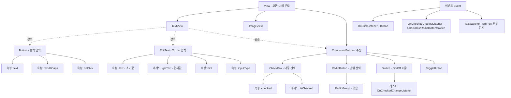

# 04. 모바일앱프로그래밍: 사용자 인터페이스를 위한 위젯 (Button · EditText · CheckBox · RadioButton · Switch)

## 🔗 선수 지식 (Prerequisites)
- [ ] **필수**: [1강. 안드로이드 프로젝트와 앱의 동작 원리](1강.md) - 이해 완료?
- [ ] **필수**: [2강. View와 위젯, View의 7대 속성](2강.md) - 이해 완료?
- [ ] **필수**: [3강. 문자 및 이미지 출력을 위한 위젯](3강.md) — Button/EditText는 TextView를 상속
- [ ] **필수**: XML 태그/속성 문법, `findViewById()`, 리스너(Listener) 인터페이스의 개념
- [ ] **권장**: Java 익명 내부 클래스 또는 Kotlin 람다 구문
- [ ] **권장**: `R.id.*` 리소스 ID 자동 생성 메커니즘
- **관련 단원**: [1강](1강.md) · [2강](2강.md) · [3강](3강.md) · 5강. 레이아웃 (다음 강의)

---

## 학습 목표
1. 사용자로부터 선택 이벤트를 수집할 수 있는 인터페이스를 제공하는 Button(속성: text, textAllCaps, onClick)에 대해 이해할 수 있다.
2. 사용자로부터 문자열을 입력받을 수 있는 인터페이스를 제공하는 EditText(속성: text, getText)에 대해 이해할 수 있다.
3. 사용자가 문자열 리스트에서 다수의 구성요소를 선택하기 위한 인터페이스를 제공하는 CheckBox에 대해 이해할 수 있다.
4. 사용자가 문자열 리스트에서 하나의 구성요소를 선택하기 위한 인터페이스를 제공하는 RadioButton에 대해 이해할 수 있다.
5. 사용자의 선택에 따라 On, Off를 전환하는 토글 형태의 인터페이스를 제공하는 Switch에 대해 이해할 수 있다.

---

## 🧠 메타인지 체크 (학습 전/후 자기 평가)

### 학습 전 자기 평가
| 소주제 | 자신감 (1-5) |
| :--- | :--- |
| Button (text / textAllCaps / onClick) | |
| EditText (text / getText) | |
| CheckBox — 다중 선택 인터페이스 | |
| RadioButton + RadioGroup — 단일 선택 인터페이스 | |
| Switch — 토글(On/Off) 인터페이스 | |
| 이벤트(Event)의 정의 및 리스너 등록 방식 (OnClickListener / OnCheckedChangeListener) | |
| 위젯 vs 속성 구분 (3강에서 이어지는 함정) | |

### 학습 후 교정 (학습 완료 후 작성)
| 소주제 | 학습 전 | 학습 후 | 실제 정답률 | 과신/과소 여부 |
| :--- | :--- | :--- | :--- | :--- |
| Button | | | | |
| EditText | | | | |
| CheckBox | | | | |
| RadioButton | | | | |
| Switch | | | | |
| 이벤트/리스너 | | | | |

> **활용법**: 학습 전 1분 → 자신감 기입, 학습 후 1분 → 나머지 기입. "과신" 영역이 실제 취약점.

---

## 📝 요약 (Summary)
1. 🔴 **Button**: 사용자로부터 **선택 이벤트(클릭)** 를 수집할 수 있는 인터페이스를 제공하는 위젯. 주요 속성: `text`, `textAllCaps`, `onClick`. (→←3강 — TextView를 상속한 위젯) 📎 기출 Q1
2. 🔴 **EditText**: 사용자로부터 **문자열을 입력**받을 수 있는 인터페이스를 제공하는 위젯. 주요 속성/메서드: `text`(XML 초기값), `getText()`(현재 입력값 읽기). (→←3강 — TextView를 상속한 위젯)
3. 🔴 **CheckBox**: 사용자가 문자열 리스트에서 **다수의 구성요소를 선택**하기 위한 인터페이스를 제공하는 위젯. 항목 간 독립 선택(다중 선택). 📎 기출 Q2
4. 🔴 **RadioButton**: 사용자가 문자열 리스트에서 **하나의 구성요소만 선택**하기 위한 인터페이스를 제공하는 위젯. 일반적으로 `RadioGroup` 안에 묶어 사용해야 단일 선택 동작이 보장된다.
5. 🔴 **Switch**: 사용자의 선택에 따라 **On/Off를 전환하는 토글 형태**의 인터페이스를 제공하는 위젯. 이진(binary) 상태 표현 전용.
6. 🔴 **이벤트(Event)**: 프로그램이 반응하도록 사용자가 생성시키는 **동작 또는 사건의 발생**(클릭, 체크 변경, 텍스트 변경 등). 안드로이드는 리스너 객체로 이벤트를 처리한다.
7. 🟡 **위젯 vs 속성 함정**: Button/EditText/CheckBox/RadioButton/Switch는 **위젯**, `text`/`textAllCaps`/`onClick`/`checked`는 **속성**. 객관식에서 "선택 이벤트를 수집하는 위젯은?" 같은 문항에 속성을 끼워 넣는 함정이 자주 출제된다. 📎 기출
8. 🟡 **CheckBox vs RadioButton의 구분 (다중 vs 단일)**: 가장 빈출되는 비교 포인트. 다수 선택=체크박스, 하나만 선택=라디오버튼(+RadioGroup).
9. 🟢 **Switch vs CheckBox**: 둘 다 `CompoundButton`을 상속받는 이진 상태 위젯이지만, Switch는 즉시 적용되는 설정 토글(On/Off)에, CheckBox는 폼 제출 시 적용되는 항목 선택에 적합. Material Design에서 권장하는 사용 컨텍스트가 다르다. 🟠 단, 이는 Material의 **권장 사용 컨텍스트(UX 가이드)** 이지 위젯 기능 자체의 강제 규칙은 아니다 — 기술적으로는 둘 다 `OnCheckedChangeListener`로 즉시 반응시키거나 제출 시점에 읽을 수 있다. 근거: https://m3.material.io/components/checkbox/overview
10. 🟢 **textAllCaps**: Button의 표시 텍스트를 자동으로 대문자로 변환할지 여부(`true`/`false`). `android:textAllCaps`의 **플랫폼(View) 기본값은 `false`** 이며, 버튼이 대문자로 보이던 것은 속성 자체의 기본값이 아니라 **Material 테마의 buttonStyle**(`textAppearance`의 `textAllCaps=true`)에서 비롯된 **테마 스타일 기본값**이다. 근거: https://developer.android.com/reference/android/widget/TextView#attr_android:textAllCaps

---

## 🧩 핵심 정의 및 원리 (Key Concepts)

> **과목 유형**: 실습 중심(안드로이드 프로그래밍) → **핵심 정의 및 원리** + **핵심 문법 및 패턴** 테이블 병용

| 정의명 | 내용 | 키워드 |
| :--- | :--- | :--- |
| **이벤트 (Event)** | 프로그램이 반응하도록 사용자가 생성시키는 **동작 또는 사건의 발생**. 클릭, 키 입력, 체크 변경, 토글 전환 등이 모두 이벤트 | 동작, 사건, 사용자 입력 |
| **리스너 (Listener)** | 특정 이벤트가 발생했을 때 호출될 콜백 메서드를 담은 인터페이스. 위젯에 `set...Listener()`로 등록 | 콜백, 인터페이스, 등록(register) |
| **Button** | 사용자가 **눌러서 동작을 선택/실행**하게 하는 위젯. 클릭 이벤트는 `OnClickListener`로 수집 | 클릭 이벤트, OnClickListener |
| **EditText** | 사용자가 **키보드로 문자열을 입력**할 수 있는 위젯. TextView를 상속하여 편집 기능을 추가한 형태 | 텍스트 입력, 포커스, IME |
| **CheckBox** | 문자열 리스트에서 **여러 항목을 동시에 선택**할 수 있는 체크 형태의 위젯 | 다중 선택, isChecked, 독립 |
| **RadioButton** | 문자열 리스트에서 **하나의 항목만 선택**할 수 있는 위젯. 단일 선택 보장은 `RadioGroup`과의 결합이 필요 | 단일 선택, RadioGroup, exclusive |
| **RadioGroup** | 여러 RadioButton을 묶어 그 안에서 **단 하나만 선택**되도록 강제하는 ViewGroup | 그룹화, 상호 배타, ViewGroup |
| **Switch** | On/Off **이진 상태**를 토글 형태로 표현하는 위젯. 켜져 있는 즉시 적용되는 설정에 적합 | 토글, On/Off, 즉시 적용 |
| **CompoundButton** | CheckBox, RadioButton, Switch, ToggleButton의 **공통 상위 클래스**. `isChecked`/`setOnCheckedChangeListener`를 제공 | 추상 상위, OnCheckedChangeListener |
| **textAllCaps** | Button의 표시 텍스트를 화면에 모두 **대문자로 변환**하여 보여줄지 결정하는 boolean 속성 | 대문자 변환, Material 기본 |
| **onClick (XML)** | XML에서 클릭 핸들러 메서드 이름을 직접 지정하는 속성. Activity의 `public void 메서드명(View v)` 시그니처와 매칭 | XML 핸들러, 메서드 이름 매칭 |

### 핵심 문법 및 패턴

| 패턴명 | 코드 (XML / Java) | 용도 |
| :--- | :--- | :--- |
| **기본 Button (XML)** | `<Button android:id="@+id/btn" android:text="확인" android:textAllCaps="false" android:onClick="onConfirm" />` | 클릭 시 Activity의 `onConfirm(View v)` 호출 |
| **OnClickListener (Java)** | `btn.setOnClickListener(v -> tv.setText("클릭됨"));` | 코드에서 리스너 등록(권장 — XML onClick은 결합도가 높음) |
| **EditText 읽기** | `String s = et.getText().toString();` | 입력값을 문자열로 가져옴. `getText()`는 `Editable` 반환 |
| **EditText 힌트** | `<EditText android:hint="이름을 입력하세요" android:inputType="textPersonName" />` | 비어 있을 때 회색 안내 텍스트, IME 키보드 종류 결정 |
| **CheckBox** | `<CheckBox android:id="@+id/cb_apple" android:text="사과" android:checked="false" />` | 각 CheckBox는 독립적으로 on/off |
| **CheckBox 상태 확인** | `boolean on = cb.isChecked();` | 코드에서 체크 여부 확인 |
| **RadioGroup + RadioButton** | `<RadioGroup ...><RadioButton android:id="@+id/r1" android:text="남" /><RadioButton android:id="@+id/r2" android:text="여" /></RadioGroup>` | 그룹 내 단 하나의 라디오 버튼만 선택됨 |
| **선택된 RadioButton ID** | `int id = rg.getCheckedRadioButtonId();` | 그룹에서 어떤 라디오가 선택됐는지 |
| **Switch** | `<Switch android:id="@+id/sw" android:text="알림" android:checked="true" />` | On/Off 토글. 현행 Lint 권고: AppCompat 환경에서는 `SwitchCompat`(`androidx.appcompat.widget.SwitchCompat`) 또는 `MaterialSwitch`를 사용(`UseSwitchCompatOrMaterialXml`). 근거: https://googlesamples.github.io/android-custom-lint-rules/checks/UseSwitchCompatOrMaterialXml.md.html |
| **OnCheckedChangeListener** | `sw.setOnCheckedChangeListener((btn, isChecked) -> {...});` | CheckBox/RadioButton/Switch 공통 상태 변화 콜백 |

> 🟡 **EditText `imeOptions` 보완**: `inputType`이 "어떤 종류의 글자를 받을지/어떤 키보드를 띄울지"를 정한다면, **`imeOptions`** 는 소프트 키보드 우측 하단의 **액션 버튼**을 무엇으로 보일지 정한다. 예: `actionDone`(완료/입력 종료), `actionNext`(다음 입력칸으로 포커스 이동), `actionSearch`(검색 실행), `actionSend`(전송). 여러 입력칸을 차례로 채우는 폼에서는 `android:imeOptions="actionNext"`로 키보드의 "다음" 버튼을 통해 다음 EditText로 자연스럽게 이동시킬 수 있다(`setOnEditorActionListener`로 해당 액션을 코드에서 처리). 근거: [Android Developers — EditText](https://developer.android.com/reference/android/widget/EditText)

> **직관적 해석**: Button=**누름버튼**(액션 실행), EditText=**입력칸**(글자 받기), CheckBox=**다중 체크**(여러 개 선택 OK), RadioButton=**단일 라디오**(하나만 선택), Switch=**전등 스위치**(On/Off). 모두 "사용자에게 이벤트를 받는" 입력 위젯들이며, 출력 전용인 TextView/ImageView(3강)와 짝을 이룬다.

> **AI 적용**: 이벤트 기반 UI 모델은 ML 시스템의 **인터랙티브 추론 루프**(사용자 입력 → 모델 추론 → 결과 표시 → 다음 입력)의 진입점이다. 챗봇 앱(EditText로 프롬프트 입력 → Button으로 전송), ML Kit 옵션 화면(CheckBox로 사용할 검출 기능 다중 선택), A/B 모델 비교(RadioButton으로 모델 선택), 모델 토글 설정(Switch로 GPU/CPU 추론 전환) 등 거의 모든 ML 앱이 이 5개 위젯의 조합으로 구성된다.

---

## 📊 개념 시각화 (Visual Guide)

### 위젯 분류 체계도 (4강 범위 중심)



> **포인트**: Button/EditText는 TextView 라인, CheckBox/RadioButton/Switch는 **CompoundButton** 라인(이진 체크 상태를 가진 위젯들)이다. CompoundButton 패밀리는 `isChecked`, `setOnCheckedChangeListener`라는 공통 인터페이스를 가진다.

### 5대 입력 위젯 비교표

| 위젯 | 1차 분류 | 선택 방식 | 입력 형태 | 대표 속성 | 대표 이벤트/리스너 | 대표 사용 예 |
| :--- | :--- | :--- | :--- | :--- | :--- | :--- |
| **Button** | 액션 위젯 | — (클릭 액션) | 클릭 1회성 | `text`, `textAllCaps`, `onClick` | `OnClickListener` | "확인", "저장", "전송" |
| **EditText** | 텍스트 입력 | — | 임의 문자열 | `text`, `hint`, `inputType`, `getText()` | `TextWatcher`, `OnFocusChangeListener` | 이메일, 비밀번호, 검색어 |
| **CheckBox** | 선택 위젯 | **다중 선택** | 이진(체크 on/off) ×n | `text`, `checked` | `OnCheckedChangeListener` | "관심분야: 스포츠 ☑ 음악 ☑" |
| **RadioButton** | 선택 위젯 | **단일 선택** (+RadioGroup) | 이진(체크 on/off) ×n 중 1 | `text`, `checked` | `OnCheckedChangeListener` (RadioGroup) | "성별: ○남 ●여" |
| **Switch** | 선택 위젯 | **이진 토글** | On/Off | `text`, `checked` | `OnCheckedChangeListener` | "푸시 알림: ON" |

### 핵심 도식: XML 속성 → 화면 결과

| 속성 (Attribute) | 입력값 예시 | 결과 (화면) | 비고 |
| :--- | :--- | :--- | :--- |
| Button `android:text` | `"확인"` | 버튼 라벨 | TextView 상속이라 textColor/textSize 사용 가능 |
| Button `android:textAllCaps` | `"false"` | "확인" 그대로 출력 | `true`면 한글은 그대로지만 영문은 대문자화 |
| Button `android:onClick` | `"onConfirm"` | 클릭 시 `Activity.onConfirm(View v)` 호출 | Activity에 public 메서드 정의 필수 |
| EditText `android:text` | `"기본값"` | 시작 시 입력란에 "기본값" 표시 | 실행 후 변경된 값은 `getText()`로 읽기 |
| EditText `android:hint` | `"이름 입력"` | 비었을 때 회색 안내 텍스트 | 입력 시작하면 사라짐 |
| EditText `android:inputType` | `"textPassword"` | `●●●●` 마스킹 + 영문 키보드 | 비밀번호 입력 표준 |
| CheckBox `android:checked` | `"true"` | 시작부터 체크된 상태 | 다른 CheckBox와 무관(독립) |
| RadioButton `android:checked` | `"true"` | 시작부터 선택된 상태 | RadioGroup 안에서 동시에 true는 1개만 |
| Switch `android:checked` | `"true"` | On 위치로 시작 | 즉시 적용되는 설정에 적합 |

---

## ✏️ 심화 학습 (Study Subject)

### 1. 가상 시나리오: "어떤 위젯을, 언제 사용해야 할까?"
- **상황**: 음식 배달 앱의 회원가입 화면을 설계한다. 화면 구성은 (1) 이름 입력, (2) 비밀번호 입력, (3) 성별(남/여 택1), (4) 관심 카테고리(한식/중식/양식 중 다중 선택), (5) 마케팅 푸시 수신(즉시 On/Off), (6) "가입 완료" 액션이다.
- **문제**: 각 항목에 어떤 위젯을 골라야 사용자의 의도를 정확히 표현하면서, 이벤트도 효율적으로 처리할 수 있는가?
- **해결**:
  1. **이름 / 비밀번호**: `EditText` × 2. 비밀번호는 `android:inputType="textPassword"`로 마스킹. 입력값은 "가입 완료" 누른 시점에 `et.getText().toString()`으로 읽어들임.
  2. **성별**: `RadioGroup` 안에 `RadioButton` 2개("남"/"여"). 단일 선택이 본질이므로 CheckBox로 만들면 안 됨.
  3. **관심 카테고리**: `CheckBox` 3개(한식/중식/양식). 여러 개 선택이 가능해야 하므로 RadioButton 안 됨.
  4. **푸시 수신**: `Switch` 1개. "즉시 적용되는 설정"의 의미를 살림 — 기능을 켜고 끄는 토글이지 폼 제출 항목이 아니다.
  5. **가입 완료**: `Button` 1개. `OnClickListener`에서 위 위젯들로부터 값을 모아 서버로 전송.
- **AI 학습 포인트**: "위 폼에서 사용자가 '관심 카테고리'를 한 개 이상 선택해야만 '가입 완료' 버튼이 활성화되도록 하려면, 어떤 리스너(OnCheckedChangeListener)를 어디에 등록하고 어떤 조건을 코드로 작성해야 할까? 동시에 '비밀번호 8자 이상'을 만족할 때만 활성화되는 조건을 추가하면 TextWatcher와 조합한 상태 관리 패턴은 어떻게 설계하는 게 일반적일까?"

### 2. 관점별 비교 및 오개념 분석

- **핵심 비교**:
  - **CheckBox vs RadioButton** (다중 vs 단일)
  - **RadioButton vs RadioGroup** (위젯 vs 그룹 컨테이너)
  - **Switch vs CheckBox** (즉시 적용 토글 vs 폼 항목 선택)
  - **android:onClick(XML) vs setOnClickListener(코드)**

#### CheckBox vs RadioButton (기출 빈출)

| 구분 | CheckBox | RadioButton |
| :--- | :--- | :--- |
| **선택 개수** | 0개 ~ N개 (**다중 선택**) | 그룹 내 정확히 1개 (**단일 선택**) |
| **항목 간 관계** | 서로 독립 | 서로 배타(exclusive) |
| **그룹 컨테이너** | 불필요 | `RadioGroup` 권장(없어도 동작은 하지만 단일 선택 보장 X) |
| **대표 사용 예** | 관심사 다중 선택, 약관 N개 동의 | 성별, 결제 수단 1개 선택 |
| **상위 클래스** | CompoundButton | CompoundButton |
| **출제 함정** | "다수 선택" 키워드 = CheckBox 📎 기출 Q2 | "하나만 선택" 키워드 = RadioButton |

#### RadioButton vs RadioGroup

| 구분 | RadioButton | RadioGroup |
| :--- | :--- | :--- |
| **분류** | 위젯(Widget, View 상속) | **ViewGroup**(LinearLayout 상속) |
| **역할** | 사용자에게 보이는 동그란 선택 버튼 | 자식 RadioButton들의 **단일 선택 강제** |
| **단독 사용** | 가능하지만 그룹 없으면 여러 개 동시 선택될 수 있음 | RadioButton 없이는 의미 없음 |
| **메서드** | `isChecked()`, `setChecked()` | `getCheckedRadioButtonId()`, `clearCheck()` |

#### Switch vs CheckBox

| 구분 | Switch | CheckBox |
| :--- | :--- | :--- |
| **시각 표현** | 좌/우 토글바 | 정사각형 + 체크 표시 |
| **의미** | "기능 On/Off" — 즉시 적용 | "항목 선택" — 폼 제출 시 적용 |
| **상위 클래스** | CompoundButton | CompoundButton |
| **대표 사용 예** | 알림 On/Off, 다크모드, GPS | 약관 동의, 관심사 선택 |
| **개수** | 보통 단독(또는 적은 수의 독립 설정) | 보통 항목 리스트로 묶어서 |
| **Material 가이드** | Settings 화면에 권장 | Form에 권장 |

#### android:onClick(XML) vs setOnClickListener(코드)

| 구분 | android:onClick (XML) | setOnClickListener (Java/Kotlin) |
| :--- | :--- | :--- |
| **위치** | XML 레이아웃 파일 | Activity/Fragment 코드 |
| **시그니처** | `public void 메서드명(View v)` (필수) | 인터페이스 구현 또는 람다 |
| **장점** | XML만 보고도 이벤트 매핑 파악 가능 | 컴파일 타임 안전성, 동적 등록/해제 |
| **단점** | 메서드 이름 오타가 런타임에야 발견됨, Activity와 결합도 ↑ | XML만 봐서는 핸들러 알기 어려움 |
| **권장** | 학습용/간단한 예제 | **실무 권장**(특히 Fragment에서) |

- **오개념 분석**
    - **오개념 1**: "`text`나 `onClick`도 위젯이다." 📎 기출 함정 (3강 Q1/Q2와 동일 유형)
    - **분석**: 잘못된 생각이다. `text`, `textAllCaps`, `onClick`, `checked` 등은 모두 **위젯의 속성(attribute)** 이지 위젯이 아니다. "선택 이벤트를 수집하는 위젯은?" 같은 질문의 답은 **Button**이고, 선택지에 `text`가 있어도 그건 함정.
    - **오개념 2**: "RadioButton만 여러 개 나열하면 자동으로 하나만 선택된다."
    - **분석**: 잘못된 생각이다. RadioButton들이 같은 `RadioGroup` 안에 자식으로 들어 있어야 단일 선택이 강제된다. 그룹 없이 나열하면 CheckBox처럼 여러 개가 동시에 선택될 수 있다.
    - **오개념 3**: "EditText에 입력된 값을 얻으려면 `android:text` 속성 값을 읽으면 된다."
    - **분석**: 잘못된 생각이다. `android:text`는 XML에 정의된 **초기값**일 뿐, 런타임에 사용자가 입력한 현재값은 `et.getText().toString()`으로 읽어야 한다.
    - **오개념 4**: "Switch와 CheckBox는 시각만 다르고 기능은 동일하므로 아무거나 써도 된다."
    - **분석**: 기능적으로는 둘 다 `CompoundButton` 자식이라 `isChecked`/`OnCheckedChangeListener`가 동일하지만, **UX 의미가 다르다**. Switch는 "즉시 적용", CheckBox는 "폼 제출 시 적용". Material Design 가이드라인이 둘을 구분하는 이유다.
    - **오개념 5**: "`textAllCaps`는 한글도 대문자로 만든다."
    - **분석**: 한글에는 대소문자 개념이 없으므로 `true`로 둬도 변화가 없고, 영문 텍스트만 대문자로 변환된다. Material Theme에서는 한때 기본값이 `true`였으나, Material 3에서는 `false`가 일반적이다.
- **AI 학습 포인트**: "안드로이드의 이벤트 모델(리스너 인터페이스 + 콜백)은 자바스크립트의 addEventListener, React의 onClick prop, RxJS의 Observable과 비교했을 때 어떤 점이 같고 어떤 점이 다른가? 특히 '리스너 객체를 명시적으로 만들어 등록한다'는 안드로이드의 패턴이 등장한 1.0 시절 자바 GUI(Swing)의 영향과, 람다 도입(Java 8) 이후 어떻게 단순화됐는지 흐름으로 설명해 줘."

---

## ❓ 연습 문제 및 해설

> **블룸 인지 수준 범례**: [기억] 정의·나열 → [이해] 설명·비교 → [적용] 계산·구현 → [분석] 구별·디버그 → [평가] 판단·비평 → [창조] 설계·제안

### 📝 문제

**1. ⭐ [기억] 사용자로부터 선택 이벤트를 수집할 수 있는 인터페이스를 제공하는 위젯은 무엇인가? [📎 기출 Q1](#prob-1)**
   > ① Button
   > ② EditText
   > ③ TextView
   > ④ ImageView

<br>

**2. ⭐ [기억] 사용자가 문자열 리스트에서 다수의 구성요소를 선택하기 위한 인터페이스는 무엇인가? [📎 기출 Q2](#prob-2)**
   > ① Button
   > ② EditText
   > ③ CheckBox
   > ④ Switch

<br>

**3. ⭐ [기억] 📌 사용자가 문자열 리스트에서 **하나의 구성요소**만 선택하기 위한 인터페이스를 제공하는 위젯은? [(#prob-3)](#prob-3)**
   > ① CheckBox
   > ② RadioButton
   > ③ Switch
   > ④ Button

<br>

**4. ⭐ [기억] 📌 사용자의 선택에 따라 On/Off를 전환하는 **토글 형태**의 인터페이스를 제공하는 위젯은? [(#prob-4)](#prob-4)**
   > ① ToggleText
   > ② CheckBox
   > ③ Switch
   > ④ RadioGroup

<br>

**5. ⭐⭐ [이해/분석] 📌 다음 중 **Button의 속성**이 아닌 것은? [(#prob-5)](#prob-5)**
   > ① text
   > ② textAllCaps
   > ③ onClick
   > ④ inputType

<br>

**6. ⭐⭐ [이해] 📌 EditText에 사용자가 현재 입력한 문자열을 코드에서 읽어오는 가장 적절한 방법은? [(#prob-6)](#prob-6)**
   > ① `et.getAndroidText()`
   > ② `et.getText().toString()`
   > ③ XML의 `android:text` 속성 값을 읽는다.
   > ④ `et.value` 필드를 참조한다.

<br>

**7. ⭐⭐ [분석] 📌 다음 중 **CheckBox와 RadioButton**의 차이에 대한 설명으로 옳은 것을 모두 고르시오. [(#prob-7)](#prob-7)**
   > <보기>
   >
   > 가. CheckBox는 다수 선택, RadioButton은 단일 선택을 위한 위젯이다.
   > 나. RadioButton은 일반적으로 `RadioGroup` 안에 묶어 사용하여 단일 선택이 보장된다.
   > 다. CheckBox와 RadioButton은 모두 `CompoundButton`을 상속한다.
   > 라. CheckBox는 그룹 없이도 항목 간 자동으로 상호 배타적이다.

   > ① 가, 나
   > ② 가, 나, 다
   > ③ 가, 다, 라
   > ④ 가, 나, 다, 라

<br>

**8. ⭐⭐ [이해] 📌 다음 중 **이벤트(Event)** 의 정의로 가장 적절한 것은? [(#prob-8)](#prob-8)**
   > ① 안드로이드 시스템이 화면을 새로 그리는 동작
   > ② 프로그램이 반응하도록 사용자가 생성시키는 동작 또는 사건의 발생
   > ③ XML 레이아웃이 메모리에 로드되는 과정
   > ④ Activity의 생명주기 콜백

<br>

**9. ⭐⭐⭐ [평가/창조] 📌 다음 요구사항을 만족하는 XML 코드를 작성하시오. [(#prob-9)](#prob-9)**
> **요구사항**:
> 1. 이름을 입력받는 `EditText` 1개 — `hint="이름을 입력하세요"`.
> 2. 성별을 선택하는 `RadioGroup` 1개 + `RadioButton` 2개("남"/"여").
> 3. 관심 카테고리를 선택하는 `CheckBox` 3개("한식"/"중식"/"양식").
> 4. 푸시 수신 여부 `Switch` 1개 — 기본값 On.
> 5. "가입 완료" `Button` 1개 — `textAllCaps=false`, `onClick="onSignUp"`.
> 6. 전체를 세로 `LinearLayout`으로 배치.

---

### 🔑 정답 및 해설 (먼저 풀어본 후 펼치기)

<details>
<summary>정답 보기 (클릭)</summary>

1. ①
2. ③
3. ②
4. ③
5. ④
6. ②
7. ②
8. ②
9. [코드형 — 해설 참조]

</details>

<details>
<summary>해설 보기 (클릭)</summary>

<a id="prob-1"></a>
**1. ⭐ [기억] 선택 이벤트 수집 위젯 📎 기출 Q1**
> **정답: ① Button**
> **해설**: Button은 사용자가 눌러서 동작을 선택/실행하게 하는 대표 위젯이다. 클릭 이벤트는 `OnClickListener`로 수집한다. 보기 중에서 사용자의 "선택 행동(무엇을 하겠다는 선택)"을 가장 표준적으로 이벤트로 수집하는 위젯이다.
> - ② EditText: 문자열을 **입력**받는 위젯이지 선택 이벤트 수집 위젯이 아니다.
> - ③ TextView: 텍스트를 **출력**하는 위젯(3강), 이벤트 수집이 본질이 아니다.
> - ④ ImageView: 이미지를 **출력**하는 위젯(3강), 이벤트 수집이 본질이 아니다.

<a id="prob-2"></a>
**2. ⭐ [기억] 다중 선택 위젯 📎 기출 Q2**
> **정답: ③ CheckBox**
> **해설**: CheckBox는 사용자가 문자열 리스트에서 **다수의 구성요소**를 선택하기 위한 인터페이스를 제공하는 위젯이다. 각 CheckBox는 독립적으로 on/off가 가능해 동시에 여러 항목이 선택될 수 있다.
> - ① Button: 클릭(액션) 위젯, 선택 리스트 아님.
> - ② EditText: 텍스트 입력 위젯.
> - ④ Switch: 단일 항목의 On/Off **토글** — 항목 리스트 다중 선택용이 아님.

<a id="prob-3"></a>
**3. ⭐ [기억] 단일 선택 위젯**
> **정답: ② RadioButton**
> **해설**: RadioButton은 문자열 리스트 중 **하나만** 선택하기 위한 위젯이다. 단일 선택이 보장되려면 `RadioGroup`이라는 ViewGroup 안에 자식으로 묶어주어야 한다.

<a id="prob-4"></a>
**4. ⭐ [기억] On/Off 토글 위젯**
> **정답: ③ Switch**
> **해설**: Switch는 사용자의 선택에 따라 On/Off를 전환하는 토글 형태의 위젯이다. 즉시 적용되는 설정(알림, 다크모드 등)에 적합하다.
> - ① ToggleText: 존재하지 않는 위젯명(함정).
> - ② CheckBox: 다중 선택용.
> - ④ RadioGroup: 위젯이 아니라 RadioButton 묶음 컨테이너(ViewGroup).

<a id="prob-5"></a>
**5. ⭐⭐ [이해/분석] Button 속성 식별**
> **정답: ④ inputType**
> **해설**: Button의 대표 속성 3종은 `text`, `textAllCaps`, `onClick`이다. `inputType`은 **EditText(텍스트 입력 위젯)** 의 속성으로, 키보드 종류(이메일/숫자/비밀번호 등)와 입력 마스킹을 제어한다. Button에는 적용되지 않는다.

<a id="prob-6"></a>
**6. ⭐⭐ [이해] EditText 현재값 읽기**
> **정답: ② `et.getText().toString()`**
> **해설**:
> - ① `getAndroidText()`: 존재하지 않는 메서드.
> - ② `getText()`는 `Editable`(CharSequence 자식)을 반환하므로 `.toString()`을 호출하여 `String`으로 변환한다. **표준 패턴**.
> - ③ XML의 `android:text`는 **초기값**일 뿐, 런타임에 사용자가 변경한 현재값을 반영하지 않는다.
> - ④ Java/Kotlin EditText에는 `value` public 필드가 없다(JavaScript DOM과 혼동 함정).

<a id="prob-7"></a>
**7. ⭐⭐ [분석] CheckBox vs RadioButton**
> **정답: ② 가, 나, 다**
> **해설**:
> - 가. (O) 핵심 차이 — 다중 선택 vs 단일 선택.
> - 나. (O) RadioGroup 안에 묶어야 단일 선택이 강제된다.
> - 다. (O) 둘 다 `android.widget.CompoundButton`을 상속하므로 `isChecked`/`OnCheckedChangeListener`를 공유한다.
> - 라. (X) CheckBox는 그룹과 무관하게 **독립적**으로 동작한다. 항목 간 상호 배타가 자동 적용되는 것은 RadioGroup 안의 RadioButton이다.

<a id="prob-8"></a>
**8. ⭐⭐ [이해] 이벤트 정의**
> **정답: ② 프로그램이 반응하도록 사용자가 생성시키는 동작 또는 사건의 발생**
> **해설**: 강의 정리에 따른 표준 정의 그대로. 클릭, 키 입력, 체크 변경 등 사용자가 만들어내는 사건이 이벤트이며, 안드로이드는 리스너를 통해 이를 처리한다.
> - ① 시스템 내부 동작(invalidate/draw)은 이벤트와 별개 개념.
> - ③ 인플레이션은 레이아웃 로드 과정이지 이벤트가 아니다.
> - ④ 생명주기 콜백(onCreate/onResume 등)은 이벤트와 구분된 시스템 콜백이다.

<a id="prob-9"></a>
**9. ⭐⭐⭐ [평가/창조] XML 작성**
> **정답 예시**:
> ```xml
> <?xml version="1.0" encoding="utf-8"?>
> <LinearLayout xmlns:android="http://schemas.android.com/apk/res/android"
>     android:layout_width="match_parent"
>     android:layout_height="wrap_content"
>     android:orientation="vertical"
>     android:padding="16dp">
>
>     <!-- 1) 이름 입력 -->
>     <EditText
>         android:id="@+id/et_name"
>         android:layout_width="match_parent"
>         android:layout_height="wrap_content"
>         android:hint="이름을 입력하세요"
>         android:inputType="textPersonName" />
>
>     <!-- 2) 성별 (단일 선택) -->
>     <RadioGroup
>         android:id="@+id/rg_gender"
>         android:layout_width="wrap_content"
>         android:layout_height="wrap_content"
>         android:orientation="horizontal">
>         <RadioButton
>             android:id="@+id/rb_male"
>             android:layout_width="wrap_content"
>             android:layout_height="wrap_content"
>             android:text="남" />
>         <RadioButton
>             android:id="@+id/rb_female"
>             android:layout_width="wrap_content"
>             android:layout_height="wrap_content"
>             android:text="여" />
>     </RadioGroup>
>
>     <!-- 3) 관심 카테고리 (다중 선택) -->
>     <CheckBox
>         android:id="@+id/cb_korean"
>         android:layout_width="wrap_content"
>         android:layout_height="wrap_content"
>         android:text="한식" />
>     <CheckBox
>         android:id="@+id/cb_chinese"
>         android:layout_width="wrap_content"
>         android:layout_height="wrap_content"
>         android:text="중식" />
>     <CheckBox
>         android:id="@+id/cb_western"
>         android:layout_width="wrap_content"
>         android:layout_height="wrap_content"
>         android:text="양식" />
>
>     <!-- 4) 푸시 수신 (즉시 적용 토글) -->
>     <Switch
>         android:id="@+id/sw_push"
>         android:layout_width="wrap_content"
>         android:layout_height="wrap_content"
>         android:text="푸시 알림"
>         android:checked="true" />
>
>     <!-- 5) 가입 완료 버튼 -->
>     <Button
>         android:id="@+id/btn_signup"
>         android:layout_width="match_parent"
>         android:layout_height="wrap_content"
>         android:text="가입 완료"
>         android:textAllCaps="false"
>         android:onClick="onSignUp" />
> </LinearLayout>
> ```
> **해설**:
> - EditText: `hint` + `inputType="textPersonName"`으로 한글 키보드를 자동 호출.
> - RadioGroup: `orientation="horizontal"`로 남/여를 가로 배치, 단일 선택 강제.
> - CheckBox 3개는 각자 독립적으로 on/off 가능(다중 선택).
> - Switch는 `checked="true"`로 기본 On.
> - Button: `textAllCaps="false"`로 한글이나 소문자 영문이 강제 대문자화되는 것 방지, `onClick="onSignUp"`은 Activity의 `public void onSignUp(View v)` 메서드를 호출.

</details>

---

## ✅ O/X 확인문제 (연습문항 개수의 2배 권장)

**1.** Button은 사용자로부터 선택 이벤트를 수집할 수 있는 위젯이다. [(#ox-1)](#ox-1) **(O / X)**
**2.** EditText는 사용자로부터 문자열을 입력받는 위젯이다. [(#ox-2)](#ox-2) **(O / X)**
**3.** CheckBox는 문자열 리스트에서 다수의 구성요소를 선택하기 위한 위젯이다. [(#ox-3)](#ox-3) **(O / X)**
**4.** RadioButton은 문자열 리스트에서 하나의 구성요소를 선택하기 위한 위젯이다. [(#ox-4)](#ox-4) **(O / X)**
**5.** Switch는 사용자의 선택에 따라 On/Off를 전환하는 토글 형태의 위젯이다. [(#ox-5)](#ox-5) **(O / X)**
**6.** `text`, `textAllCaps`, `onClick`은 모두 Button 위젯이다. [(#ox-6)](#ox-6) **(O / X)**
**7.** 이벤트는 프로그램이 반응하도록 사용자가 생성시키는 동작 또는 사건의 발생을 의미한다. [(#ox-7)](#ox-7) **(O / X)**
**8.** EditText에 사용자가 입력한 현재값은 `android:text` 속성을 다시 읽어 얻을 수 있다. [(#ox-8)](#ox-8) **(O / X)**
**9.** RadioButton은 단독으로 여러 개 나열해도 자동으로 하나만 선택되도록 강제된다. [(#ox-9)](#ox-9) **(O / X)**
**10.** RadioGroup은 ViewGroup의 일종으로, 내부의 RadioButton들 중 하나만 선택되도록 강제한다. [(#ox-10)](#ox-10) **(O / X)**
**11.** CheckBox, RadioButton, Switch는 모두 `CompoundButton` 클래스를 상속한다. [(#ox-11)](#ox-11) **(O / X)**
**12.** Button과 EditText는 TextView를 상속하므로 `textColor`, `textSize` 같은 TextView 속성을 그대로 쓸 수 있다. [(#ox-12)](#ox-12) **(O / X)**
**13.** `android:onClick="onConfirm"`이라 지정하면 Activity 안에 `public void onConfirm(View v)` 메서드가 있어야 한다. [(#ox-13)](#ox-13) **(O / X)**
**14.** Switch는 폼 제출 시점에 적용되는 항목 선택용으로 권장되고, CheckBox는 즉시 적용되는 설정 토글에 권장된다. [(#ox-14)](#ox-14) **(O / X)**
**15.** `textAllCaps="true"`로 두면 영문 라벨이 모두 대문자로 표시된다. [(#ox-15)](#ox-15) **(O / X)**
**16.** `getText()`의 반환 타입은 `String`이므로 즉시 비교 연산에 사용 가능하다. [(#ox-16)](#ox-16) **(O / X)**
**17.** OnClickListener는 Button 전용 인터페이스이며, CheckBox나 RadioButton에는 사용할 수 없다. [(#ox-17)](#ox-17) **(O / X)**
**18.** RadioGroup에서 현재 선택된 RadioButton의 id는 `getCheckedRadioButtonId()`로 얻을 수 있다. [(#ox-18)](#ox-18) **(O / X)**

<details>
<summary>O/X 정답 및 해설 보기 (클릭)</summary>

> <a id="ox-1"></a>
> **1. 정답**: O
> **해설**: 정리하기 그대로. Button=선택 이벤트 수집 위젯.

> <a id="ox-2"></a>
> **2. 정답**: O
> **해설**: 정리하기 그대로. EditText=문자열 입력 위젯.

> <a id="ox-3"></a>
> **3. 정답**: O
> **해설**: 정리하기 그대로. 📎 기출 Q2.

> <a id="ox-4"></a>
> **4. 정답**: O
> **해설**: 정리하기 그대로.

> <a id="ox-5"></a>
> **5. 정답**: O
> **해설**: 정리하기 그대로.

> <a id="ox-6"></a>
> **6. 정답**: X
> **해설**: `text`, `textAllCaps`, `onClick`은 Button의 **속성**(attribute)이지 위젯이 아니다. 위젯은 Button이고, 그 위젯의 옵션이 속성. 3강에서 이어지는 함정.

> <a id="ox-7"></a>
> **7. 정답**: O
> **해설**: 강의 정리 정의 그대로.

> <a id="ox-8"></a>
> **8. 정답**: X
> **해설**: `android:text`는 XML에 정의된 **초기값**일 뿐, 실행 중 사용자가 변경한 현재값을 반영하지 않는다. 현재값은 `et.getText().toString()`으로 얻는다.

> <a id="ox-9"></a>
> **9. 정답**: X
> **해설**: RadioButton들이 같은 `RadioGroup` 자식으로 묶여 있어야 단일 선택이 보장된다. 그룹 없이 나열하면 여러 개가 동시에 선택될 수 있다.

> <a id="ox-10"></a>
> **10. 정답**: O
> **해설**: `RadioGroup`은 `LinearLayout`을 상속한 ViewGroup이며, 내부 RadioButton들의 단일 선택을 강제한다.

> <a id="ox-11"></a>
> **11. 정답**: O
> **해설**: 셋 다 `android.widget.CompoundButton` 자손이라 `isChecked`/`setChecked`/`OnCheckedChangeListener`를 공유한다.

> <a id="ox-12"></a>
> **12. 정답**: O
> **해설**: 클래스 계층상 `Button extends TextView`, `EditText extends TextView`이므로 TextView의 모든 속성이 그대로 적용된다.

> <a id="ox-13"></a>
> **13. 정답**: O
> **해설**: `android:onClick`의 값은 Activity의 `public void 메서드명(View v)` 시그니처 메서드 이름과 정확히 일치해야 한다. 메서드가 없거나 이름이 틀려도 **인플레이트(레이아웃 로드) 시점이 아니라, 실제로 버튼을 클릭하는 시점**에 리플렉션으로 해당 메서드를 찾다가 `IllegalStateException`(Could not find method ...)이 발생한다(따라서 화면은 정상적으로 뜨지만 클릭 순간 크래시).

> <a id="ox-14"></a>
> **14. 정답**: X
> **해설**: **반대**다. Switch는 즉시 적용되는 설정 토글(알림, 다크모드)에, CheckBox는 폼 제출 시 적용되는 항목 선택(약관 동의, 관심사)에 권장된다. 🟠 다만 이 "즉시 적용 vs 제출 시 적용"은 Material Design이 제시하는 **권장 사용 컨텍스트**일 뿐, 위젯의 기능이 그렇게 강제되는 것은 아니다(둘 다 `OnCheckedChangeListener`로 즉시 처리하거나 제출 시점에 `isChecked()`로 읽는 것이 모두 가능). 근거: https://m3.material.io/components/checkbox/overview

> <a id="ox-15"></a>
> **15. 정답**: O
> **해설**: `textAllCaps="true"`는 영문 라벨을 대문자로 변환해 표시한다. 한글은 대소문자 개념이 없으므로 영향 없음.

> <a id="ox-16"></a>
> **16. 정답**: X
> **해설**: `getText()`의 반환 타입은 `Editable`(CharSequence 자식)이다. `String`으로 쓰려면 `toString()`을 호출해야 한다.

> <a id="ox-17"></a>
> **17. 정답**: X
> **해설**: `OnClickListener`는 `View.OnClickListener`이므로 모든 View가 사용할 수 있다. 다만 CheckBox/RadioButton/Switch는 **상태 변화**가 핵심이므로 `OnCheckedChangeListener`가 더 자연스러운 선택.

> <a id="ox-18"></a>
> **18. 정답**: O
> **해설**: `RadioGroup.getCheckedRadioButtonId()`는 현재 체크된 자식 RadioButton의 id를 반환한다(아무것도 안 골랐으면 -1).

</details>

---

## 🧪 자유 회상 연습 (Free Recall)

> **방법**: 위의 노트를 모두 덮고, 타이머 3분 설정 후 이번 단원에서 배운 내용을 기억나는 대로 자유롭게 적으세요.
> 정확한 문장이 아니어도 됩니다. 키워드, 관계 등 떠오르는 것을 모두 적습니다.

**자유 회상 작성란:**

```
[여기에 기억나는 내용을 자유롭게 작성]


```

> **회상 후 점검**: 노트를 다시 펼쳐 빠뜨린 내용을 확인하세요.
> - 회상 못한 위젯(5개): [                ]
> - 회상 못한 Button 속성(3개): [                ]
> - 회상 못한 이벤트 정의: [                ]
> - 회상 못한 CheckBox vs RadioButton 차이: [                ]

---

## 💻 코드로 확인하기 (Code Verification)

### 종합 예제: 5대 입력 위젯을 모두 사용하는 회원가입 화면

**`res/layout/activity_signup.xml`**
```xml
<?xml version="1.0" encoding="utf-8"?>
<LinearLayout xmlns:android="http://schemas.android.com/apk/res/android"
    android:layout_width="match_parent"
    android:layout_height="match_parent"
    android:orientation="vertical"
    android:padding="16dp">

    <TextView
        android:layout_width="wrap_content"
        android:layout_height="wrap_content"
        android:text="회원가입"
        android:textSize="22sp"
        android:textStyle="bold" />

    <!-- 1) 이름 입력 -->
    <EditText
        android:id="@+id/et_name"
        android:layout_width="match_parent"
        android:layout_height="wrap_content"
        android:hint="이름을 입력하세요"
        android:inputType="textPersonName" />

    <!-- 2) 비밀번호 입력 (마스킹) -->
    <EditText
        android:id="@+id/et_pw"
        android:layout_width="match_parent"
        android:layout_height="wrap_content"
        android:hint="비밀번호 (8자 이상)"
        android:inputType="textPassword" />

    <!-- 3) 성별 (단일 선택) -->
    <TextView
        android:layout_width="wrap_content"
        android:layout_height="wrap_content"
        android:text="성별"
        android:layout_marginTop="12dp" />
    <RadioGroup
        android:id="@+id/rg_gender"
        android:layout_width="wrap_content"
        android:layout_height="wrap_content"
        android:orientation="horizontal">
        <RadioButton
            android:id="@+id/rb_male"
            android:layout_width="wrap_content"
            android:layout_height="wrap_content"
            android:text="남" />
        <RadioButton
            android:id="@+id/rb_female"
            android:layout_width="wrap_content"
            android:layout_height="wrap_content"
            android:text="여" />
    </RadioGroup>

    <!-- 4) 관심 카테고리 (다중 선택) -->
    <TextView
        android:layout_width="wrap_content"
        android:layout_height="wrap_content"
        android:text="관심 카테고리"
        android:layout_marginTop="12dp" />
    <CheckBox
        android:id="@+id/cb_korean"
        android:layout_width="wrap_content"
        android:layout_height="wrap_content"
        android:text="한식" />
    <CheckBox
        android:id="@+id/cb_chinese"
        android:layout_width="wrap_content"
        android:layout_height="wrap_content"
        android:text="중식" />
    <CheckBox
        android:id="@+id/cb_western"
        android:layout_width="wrap_content"
        android:layout_height="wrap_content"
        android:text="양식" />

    <!-- 5) 푸시 수신 (토글) -->
    <!-- 📝 실무 권고: AppCompat 환경에서는 android.widget.Switch 대신
         androidx의 SwitchCompat(또는 Material 3의 MaterialSwitch) 사용을 권장한다
         (Lint: UseSwitchCompatOrMaterialXml). 여기서는 강의 범위에 맞춰 기본 Switch를 사용. -->
    <Switch
        android:id="@+id/sw_push"
        android:layout_width="wrap_content"
        android:layout_height="wrap_content"
        android:text="푸시 알림"
        android:checked="true"
        android:layout_marginTop="12dp" />

    <!-- 6) 가입 완료 -->
    <Button
        android:id="@+id/btn_signup"
        android:layout_width="match_parent"
        android:layout_height="wrap_content"
        android:text="가입 완료"
        android:textAllCaps="false"
        android:onClick="onSignUp"
        android:layout_marginTop="16dp" />
</LinearLayout>
```

**`SignUpActivity.java` — 이벤트 처리**
```java
package com.example.lesson4;

import android.app.Activity;
import android.os.Bundle;
import android.view.View;
import android.widget.*;

public class SignUpActivity extends Activity {

    private EditText etName, etPw;
    private RadioGroup rgGender;
    private CheckBox cbKorean, cbChinese, cbWestern;
    private Switch swPush;

    @Override
    protected void onCreate(Bundle savedInstanceState) {
        super.onCreate(savedInstanceState);
        setContentView(R.layout.activity_signup);

        etName    = findViewById(R.id.et_name);
        etPw      = findViewById(R.id.et_pw);
        rgGender  = findViewById(R.id.rg_gender);
        cbKorean  = findViewById(R.id.cb_korean);
        cbChinese = findViewById(R.id.cb_chinese);
        cbWestern = findViewById(R.id.cb_western);
        swPush    = findViewById(R.id.sw_push);

        // Switch 상태 변화 즉시 반영(이벤트 리스너 패턴)
        swPush.setOnCheckedChangeListener((btn, isChecked) -> {
            Toast.makeText(this,
                "푸시 알림 " + (isChecked ? "ON" : "OFF"),
                Toast.LENGTH_SHORT).show();
        });
    }

    // XML의 android:onClick="onSignUp"와 매칭되는 핸들러
    public void onSignUp(View v) {
        // (1) EditText 현재값 읽기 — getText().toString() 표준 패턴
        String name = etName.getText().toString();
        String pw   = etPw.getText().toString();

        // (2) RadioGroup에서 선택된 RadioButton id 얻기
        int genderId = rgGender.getCheckedRadioButtonId();
        String gender = (genderId == R.id.rb_male) ? "남"
                      : (genderId == R.id.rb_female) ? "여"
                      : "선택안함";

        // (3) CheckBox 다중 선택 결과 — 독립적으로 isChecked() 호출
        StringBuilder cats = new StringBuilder();
        if (cbKorean.isChecked())  cats.append("한식 ");
        if (cbChinese.isChecked()) cats.append("중식 ");
        if (cbWestern.isChecked()) cats.append("양식 ");

        // (4) Switch 토글 상태
        boolean push = swPush.isChecked();

        String msg = String.format(
            "이름=%s, 성별=%s, 카테고리=[%s], 푸시=%s",
            name, gender, cats.toString().trim(), push ? "ON" : "OFF");
        Toast.makeText(this, msg, Toast.LENGTH_LONG).show();
    }
}
```

> **실행 결과** (예시):
> - 이름 "홍길동", 비밀번호 "12345678", 성별 "남", 카테고리 "한식 중식", 푸시 ON 으로 입력 후 [가입 완료] 클릭 시:
>   `이름=홍길동, 성별=남, 카테고리=[한식 중식], 푸시=ON` Toast 출력.
> - Switch를 OFF로 토글하면 즉시 `푸시 알림 OFF` Toast가 뜬다(가입 버튼을 누르지 않아도).
>
> **개념적 해석**:
> 1. **EditText**: `getText().toString()`이 표준 패턴(반환 타입이 `Editable`이므로 toString 필요).
> 2. **RadioGroup**: `getCheckedRadioButtonId()`로 선택된 자식의 R.id 값을 얻고, 분기.
> 3. **CheckBox**: 다중 선택이므로 각 CheckBox에 `isChecked()`를 **독립적으로** 호출해 누적.
> 4. **Switch**: 가입 버튼과 무관하게 `OnCheckedChangeListener`로 **즉시 반영**. "즉시 적용" 의미가 잘 드러난다.
> 5. **Button**: XML의 `onClick="onSignUp"`은 `public void onSignUp(View v)` 시그니처와 정확히 일치해야 한다. `textAllCaps="false"`로 한글/영문 라벨이 그대로 표시.

> 🟠 **`Activity` vs `AppCompatActivity` 보충(코드 일관성)**: 위 종합예제는 교재 흐름에 맞춰 `extends Activity`로 작성했지만, 후반 심층확장(예: `SelectAllActivity`)은 `AppCompatActivity`를 쓴다. 둘은 모순이 아니라 **학습용(Activity) vs 실무 기준(AppCompatActivity)** 의 차이다. 실무에서는 `AppCompatActivity`가 사실상 표준이며, 이 환경에서 레이아웃을 인플레이트할 때 `findViewById`로 받는 `Switch`/`CheckBox`는 안드로이드가 자동으로 **`SwitchCompat`/`AppCompatCheckBox`** 로 인플레이트해 준다(구버전 OS에서도 일관된 Material 외형·틴팅 보장). 따라서 위 예제를 `AppCompatActivity`로 바꿔도 `findViewById(R.id.sw_push)`는 동일하게 동작하며, 실무 기준으로는 `AppCompatActivity` 사용을 권장한다. 근거: https://developer.android.com/reference/androidx/appcompat/app/AppCompatActivity

---

## 🤖 AI 연결고리 (Mobile Concept → AI Application)

| 모바일 개념 | AI/ML 적용 분야 | 구체적 사례 |
| :--- | :--- | :--- |
| **Button (클릭 트리거)** | 추론 실행 트리거 | "분석 시작" 버튼 → ML 모델 forward pass, "이미지 분류" 버튼 → TFLite 추론 |
| **EditText (텍스트 입력)** | LLM 프롬프트 입력 | ChatGPT/Gemini 앱의 프롬프트 입력란, 검색 자동완성용 BERT 입력 |
| **CheckBox (다중 선택)** | 다중 라벨 분류 입력 | ML Kit 옵션(얼굴 검출+텍스트 인식+바코드 동시), 모델 ensemble 선택 |
| **RadioButton (단일 선택)** | 단일 모델/모드 선택 | "기본 모델 vs 정밀 모델" 토글, "추론 정밀도: FP16/FP32" 선택 |
| **Switch (On/Off 토글)** | 즉시 적용 설정 | "GPU 추론 사용", "온디바이스 vs 클라우드", "스트리밍 응답 ON" |
| **OnClickListener (이벤트)** | 사용자 상호작용 로그 | A/B 테스트 클릭 이벤트 수집, 사용자 의도 분류 데이터셋 구축 |
| **EditText + TextWatcher** | 실시간 입력 추론 | 검색어 실시간 자동완성, 타이핑 중 의도 분류 |

---

## 📖 심화 학습 예시 답안

#### 1. 이벤트(Event) 처리 모델의 내부 동작 원리

안드로이드가 클릭 한 번을 처리하는 과정:

1. **사용자 입력 발생**: 터치스크린이 ACTION_DOWN/UP을 받고 시스템 InputDispatcher가 해당 좌표의 최상위 Activity Window로 `MotionEvent`를 전달.
2. **Window → ViewGroup → View 디스패치**: ViewGroup의 `dispatchTouchEvent()`가 자식 위치를 검사하여 해당 위젯까지 좌표 기반으로 이벤트를 내려보냄.
3. **View의 `onTouchEvent`**: Button의 `onTouchEvent`가 ACTION_UP을 감지하면 `performClick()` 호출.
4. **`performClick()` → 등록된 리스너의 `onClick()`**: 개발자가 `setOnClickListener(l)`로 등록한 리스너 객체의 `onClick(View v)` 콜백이 메인 스레드에서 실행.
5. **XML `android:onClick`의 경우**: 내부적으로 `setOnClickListener`와 같은 효과를 내며, 리플렉션으로 Activity의 동명 메서드를 찾아 호출.

CheckBox/Switch의 경우는:
- `performClick()` 안에서 **`toggle()`** 이 먼저 호출되어 `isChecked` 상태가 반전된 다음, `OnCheckedChangeListener.onCheckedChanged(buttonView, isChecked)`가 호출되고, 마지막으로 일반 `OnClickListener`가 호출된다.

> **요점**: 이벤트는 **(이벤트 객체) + (디스패치 경로) + (등록된 콜백)** 의 세 요소로 구성된 동기 호출 체인이다. UI 스레드에서 즉시 호출되므로 무거운 작업은 백그라운드로 보내야 한다(추후 AsyncTask/Coroutine/Executor 강의 참조).

#### 2. CheckBox vs RadioButton vs Switch 비교표

| 구분 | CheckBox | RadioButton | Switch |
| :--- | :--- | :--- | :--- |
| **시각 표현** | 사각형 + 체크 | 원형 + 점 | 트랙 + 토글 핸들 |
| **선택 방식** | **다중 선택** (독립) | **단일 선택** (RadioGroup 필요) | **이진 토글** (단독) |
| **상위 클래스** | CompoundButton | CompoundButton | CompoundButton |
| **공통 메서드** | `isChecked()`, `toggle()`, `setOnCheckedChangeListener()` | 동일 | 동일 |
| **UX 의미** | 폼 항목 선택(제출 시 적용) | 폼 항목 단일 선택(제출 시 적용) | 즉시 적용되는 설정 |
| **대표 사용처** | 약관 동의, 관심사 | 성별, 결제수단 | 알림 On/Off, 다크모드 |
| **AI 활용** | 다중 검출 옵션 | 모델/정밀도 선택 | 온디바이스 On/Off |

#### 3. 입력 위젯 활용 Best Practice

- **Bad Practice (나쁜 예시)**
  ```xml
  <!-- RadioGroup 없이 RadioButton만 나열 → 여러 개 동시 선택 가능 -->
  <RadioButton android:text="남" />
  <RadioButton android:text="여" />

  <!-- EditText 비밀번호인데 마스킹 미적용 -->
  <EditText android:hint="비밀번호" />

  <!-- Button onClick 핸들러명 오타 → 인플레이트가 아니라 클릭 시점에 IllegalStateException -->
  <Button android:onClick="onConfirmm" />
  ```
  ```java
  // EditText 현재값을 XML 속성에서 읽으려 시도 (불가능)
  String s = "";   // 초기값만 알 수 있을 뿐 현재값 X
  ```

- **Good Practice (좋은 예시)**
  ```xml
  <!-- RadioGroup 안에 묶기 -->
  <RadioGroup
      android:id="@+id/rg_gender"
      android:orientation="horizontal">
      <RadioButton android:id="@+id/rb_male"   android:text="남" />
      <RadioButton android:id="@+id/rb_female" android:text="여" />
  </RadioGroup>

  <!-- 비밀번호는 inputType 마스킹 -->
  <EditText
      android:id="@+id/et_pw"
      android:hint="비밀번호"
      android:inputType="textPassword" />

  <!-- 컴파일 타임 안전성을 위해 코드에서 람다 등록 -->
  <Button android:id="@+id/btn_confirm" android:text="확인" />
  ```
  ```java
  // 코드에서 리스너 등록 — 메서드명 오타가 컴파일 단계에서 잡힘
  findViewById(R.id.btn_confirm).setOnClickListener(v -> onConfirm());
  String pw = etPw.getText().toString();  // 현재값 정확 추출
  ```
- **설명**:
  - **RadioGroup 의무화**: RadioButton의 단일 선택은 RadioGroup 안에서만 보장된다. 그룹 없이는 CheckBox와 동일하게 동작.
  - **inputType 마스킹**: 비밀번호는 반드시 `textPassword`로 마스킹해야 보안 + 시스템 키보드도 자동완성/캡처 보호 모드로 전환.
  - **XML onClick 대신 setOnClickListener**: XML `onClick="..."`은 메서드명 오타가 런타임 예외이지만, 코드 등록은 컴파일 단계에서 잡힘. 또한 Fragment에서는 XML onClick이 Activity로만 매핑돼 의도와 다르게 동작.
  - **getText().toString()**: 현재값은 항상 코드에서 메서드 호출로 얻는다.

---

## 🟢 리서치 기반 심층 확장 (Deep Dive)

### 1. CompoundButton 콜백 동작 정밀 분석 — `setChecked()` vs 사용자 클릭

`CheckBox`/`RadioButton`/`Switch`의 공통 상위 클래스 `CompoundButton`은 상태 변경 경로에 따라 호출되는 리스너가 다르다. 이 차이를 모르면 무한 루프나 의도치 않은 동작이 발생한다.

#### 1.1 두 가지 상태 변경 경로

| 경로 | 호출 메서드 | `OnCheckedChangeListener` | `OnClickListener` |
|------|-------------|:--:|:--:|
| **사용자가 직접 탭** | (내부) `performClick()` | ✅ 호출됨 | ✅ 호출됨 |
| **프로그램으로 변경** | `setChecked(b)` / `toggle()` | ✅ 호출됨(상태가 실제로 바뀔 때) | ❌ **호출 안 됨** |

핵심 사실:

- 사용자가 위젯을 탭하면 `View.performClick()` 경로를 타고, `toggle()`로 상태가 반전되면서 `OnCheckedChangeListener`가 발화하고 `OnClickListener.onClick()`도 호출된다. 즉 **실제 클릭 시 두 리스너가 모두** 호출된다.
- `setChecked()`/`toggle()`를 **코드에서 직접 호출**하면 상태만 바뀌므로 `OnCheckedChangeListener`만 발화하고 `OnClickListener`는 호출되지 않는다.
- `setChecked()`는 **현재 상태와 같은 값**을 넣으면(이미 체크된 버튼에 `setChecked(true)`) 상태가 바뀌지 않아 `OnCheckedChangeListener`도 호출되지 않는다.
- 근거: `CompoundButton` API 레퍼런스 — https://developer.android.com/reference/android/widget/CompoundButton , `View.performClick()` — https://developer.android.com/reference/android/view/View#performClick()

#### 1.2 무한 루프 위험과 방지 패턴

`OnCheckedChangeListener` 안에서 다시 `setChecked()`를 호출하면(예: 다른 체크박스를 동기화), 그 호출이 또 리스너를 발화시켜 재귀/무한 루프가 발생할 수 있다.

**패턴 A — 리스너 일시 해제 후 재등록:**

```java
otherCheckBox.setOnCheckedChangeListener(null); // 리스너 끄기
otherCheckBox.setChecked(isChecked);            // 콜백 발화 방지
otherCheckBox.setOnCheckedChangeListener(listener); // 다시 등록
```

**패턴 B — 플래그(가드 변수)로 재진입 차단:**

```java
private boolean isUpdating = false;

checkBox.setOnCheckedChangeListener((button, isChecked) -> {
    if (isUpdating) return;   // 코드가 유발한 변경이면 무시
    isUpdating = true;
    syncOtherWidgets(isChecked);
    isUpdating = false;
});
```

> ⚠️ "리스너가 도는 이유"가 사용자 탭인지 `setChecked()` 코드인지 구분해야 한다. 코드 변경이 콜백을 다시 트리거하지 않게 하려면 **리스너 해제(A)** 또는 **가드 플래그(B)** 를 쓴다.

#### 1.3 Switch 심화 — `textOn`/`textOff` (ON/OFF 상태별 라벨)

🟡 Switch는 토글 좌/우에 더해, **켜짐/꺼짐 상태에 따라 서로 다른 텍스트**를 토글 영역 위에 표시할 수 있다. `android:textOn`(ON일 때 글자, 기본 "ON")과 `android:textOff`(OFF일 때 글자, 기본 "OFF")가 그것이며, 이 텍스트가 실제로 그려지려면 **`android:showText="true"`** 를 함께 지정해야 한다(기본값은 false라 평소엔 ON/OFF 글자가 보이지 않는다). 참고로 `android:text`(위젯 옆 라벨)와 `textOn`/`textOff`(토글 내부 상태 글자)는 서로 다른 위치의 별개 속성이다.

```xml
<Switch
    android:id="@+id/sw_demo"
    android:text="알림"
    android:showText="true"
    android:textOn="켜짐"
    android:textOff="꺼짐"
    android:checked="true" />
```

근거: [Android Developers — Switch](https://developer.android.com/reference/android/widget/Switch)

### 2. Material Components & Jetpack Compose 대응표

오늘날 실무 UI는 기본 `Button`/`CheckBox` 대신 **Material Components(Material 3)** 위젯을 쓰거나, 선언형 **Jetpack Compose** 로 작성한다.

#### 2.1 클래식 View ↔ Material 3 ↔ Compose

| 클래식 위젯 | Material 3 (XML) | Jetpack Compose |
|-------------|------------------|-----------------|
| `Button` | `com.google.android.material.button.MaterialButton` | `Button` / `FilledTonalButton` / `OutlinedButton` / `TextButton` |
| `ImageButton` | `MaterialButton`(아이콘) / `FloatingActionButton` | `IconButton` / `FloatingActionButton` |
| `EditText` | `TextInputLayout` + `TextInputEditText` | `TextField` / `OutlinedTextField` |
| `CheckBox` | `MaterialCheckBox` | `Checkbox` |
| `RadioButton` | `MaterialRadioButton` | `RadioButton` |
| `Switch` / `ToggleButton` | `MaterialSwitch`(구 `SwitchMaterial`) | `Switch` |
| `Spinner` | `MaterialAutoCompleteTextView`(Exposed Dropdown Menu) | `ExposedDropdownMenuBox` |
| `TextView` | `MaterialTextView` | `Text` |

근거: Material 3 컴포넌트 — https://m3.material.io/components , Compose Material 3 — https://developer.android.com/develop/ui/compose/components

> 🟢 **최신 사실 — `MaterialSwitch`가 `SwitchMaterial`을 대체(deprecated)**: Material Components for Android에서 기존 `com.google.android.material.switchmaterial.SwitchMaterial`은 **deprecated** 되었고, Material 3 디자인을 반영한 `com.google.android.material.materialswitch.MaterialSwitch`가 그 후속(권장) 위젯이다. 따라서 신규 코드는 `SwitchMaterial` 대신 `MaterialSwitch`를 사용하는 것이 표준이다. 근거: https://github.com/material-components/material-components-android

#### 2.2 동작 모델 차이: 콜백 vs 상태 호이스팅

클래식 View에서는 위젯이 **자기 상태를 스스로 보관**하고(`isChecked`), 변경 시 리스너로 알린다. 반면 Compose의 `Checkbox`/`Switch`는 **상태를 보유하지 않는다**(상태 호이스팅). 호출자가 `checked` 값을 넘기고 `onCheckedChange` 람다에서 그 값을 갱신해야 화면이 바뀐다.

```kotlin
// Compose: 상태 호이스팅 — checked를 직접 갱신하지 않으면 UI가 변하지 않는다
var checked by remember { mutableStateOf(false) }
Checkbox(
    checked = checked,
    onCheckedChange = { checked = it }   // 여기서 상태를 갱신해야 함
)
```

이 모델에서는 1.2의 무한 루프 문제가 구조적으로 사라진다. 상태가 단일 소스(`mutableStateOf`)로 관리되고, 재구성(recomposition)은 값이 실제로 바뀔 때만 일어나기 때문이다. 근거: https://developer.android.com/develop/ui/compose/state

---

## 🟢 2차 심층 확장 (Deep Dive Ⅱ) — 무한 루프 실전 사례(전체 선택)와 상태 호이스팅 비교

> 본 절은 리서치 기반 2차 심층 확장으로, 앞 Deep Dive의 "CompoundButton 무한 루프 방지(패턴 A/B)"를 **가장 흔한 실전 시나리오인 "전체 선택(Select-All) 체크박스"** 로 구체화하고, View의 콜백 모델과 Compose의 **상태 호이스팅(state hoisting)** 을 **stateful vs stateless** 코드로 정면 비교한다. 모든 주장은 공식 문서로 검증하였다.

### 1. 실전 사례 — "전체 선택" 체크박스가 무한 루프를 부르는 이유

본문 4강 시나리오(관심 카테고리 다중 선택)를 확장해, **맨 위 "전체 선택" 체크박스**가 하위 항목 3개(한식/중식/양식)를 한꺼번에 켜고 끄는 UI를 만든다고 하자. 이때 다음 양방향 동기화가 충돌한다.

- "전체 선택"을 켜면 → 코드가 하위 3개에 `setChecked(true)` 호출
- 그런데 하위 항목의 리스너 안에서 "하위가 모두 켜졌으면 전체 선택도 켜라"고 `headerCheckBox.setChecked(true)`를 또 호출
- → **리스너 ↔ setChecked가 서로를 트리거**하며 재진입/무한 루프 위험 (1.1에서 본 대로 `setChecked()`도 `OnCheckedChangeListener`를 발화시키기 때문)

#### 방지: 가드 플래그(패턴 B)를 적용한 완성 코드

```java
public class SelectAllActivity extends AppCompatActivity {
    private CheckBox cbAll, cbKorean, cbChinese, cbWestern;
    private boolean isSyncing = false;   // 재진입 차단 가드 플래그

    @Override protected void onCreate(Bundle b) {
        super.onCreate(b);
        setContentView(R.layout.activity_select_all);
        cbAll     = findViewById(R.id.cb_all);
        cbKorean  = findViewById(R.id.cb_korean);
        cbChinese = findViewById(R.id.cb_chinese);
        cbWestern = findViewById(R.id.cb_western);

        // (1) 헤더("전체 선택") → 하위 전체 on/off
        cbAll.setOnCheckedChangeListener((btn, checked) -> {
            if (isSyncing) return;            // 코드가 유발한 변경이면 무시
            isSyncing = true;
            cbKorean.setChecked(checked);
            cbChinese.setChecked(checked);
            cbWestern.setChecked(checked);
            isSyncing = false;
        });

        // (2) 하위 항목 → 모두 켜졌는지 보고 헤더 상태 재계산
        CompoundButton.OnCheckedChangeListener childListener = (btn, checked) -> {
            if (isSyncing) return;
            isSyncing = true;
            boolean allOn = cbKorean.isChecked() && cbChinese.isChecked() && cbWestern.isChecked();
            cbAll.setChecked(allOn);          // 헤더 갱신(가드 덕분에 (1)이 재발화해도 즉시 return)
            isSyncing = false;
        };
        cbKorean.setOnCheckedChangeListener(childListener);
        cbChinese.setOnCheckedChangeListener(childListener);
        cbWestern.setOnCheckedChangeListener(childListener);
    }
}
```

> ⚠️ **가드 없이 작성하면**: (1)이 하위를 켜는 순간 (2)가 발화 → (2)가 헤더를 켜며 다시 (1) 발화 → … 가 반복되어 `StackOverflowError`나 UI 깜빡임이 발생할 수 있다. `isSyncing` 플래그는 **"지금 일어난 변경이 사용자 탭이 아니라 코드 동기화 때문"** 임을 표시해 재진입을 끊는다.

#### 대안: 리스너 일시 해제(패턴 A) — Material `MaterialCheckBox` 등 add/remove 지원 위젯

Material Components의 `MaterialButton`/`MaterialCheckBox` 등은 `add/removeOnCheckedChangeListener`를 제공하므로, 코드로 상태를 바꾸기 직전 **리스너를 떼었다 다시 붙이는** 방식도 쓸 수 있다.

```java
child.removeOnCheckedChangeListener(childListener); // 콜백 잠시 끄기
child.setChecked(value);                            // 발화 없이 상태만 변경
child.addOnCheckedChangeListener(childListener);    // 다시 등록
```

> 근거: [Android Developers — CompoundButton.OnCheckedChangeListener](https://developer.android.com/reference/android/widget/CompoundButton.OnCheckedChangeListener), [Android Developers — CompoundButton](https://developer.android.com/reference/android/widget/CompoundButton), [Android Developers — Two-way data binding(무한 루프 방지: 신·구 값 비교)](https://developer.android.com/topic/libraries/data-binding/two-way)

### 2. View 콜백 모델 vs Compose 상태 호이스팅 — stateful/stateless 비교

위 무한 루프는 **"위젯이 자기 상태를 보관하고, 양방향을 손으로 맞춰야 한다"** 는 명령형 View 모델의 구조적 부담에서 비롯된다. Compose의 **상태 호이스팅**은 상태를 위젯 밖(상위)으로 끌어올려 **단일 진실 공급원(single source of truth)** 으로 만들어 이 문제를 원천 제거한다.

| 구분 | 명령형 View (`CheckBox`) | Compose `Checkbox` (상태 호이스팅) |
| :--- | :--- | :--- |
| **상태 소유** | 위젯이 `isChecked`를 **내부 보관** | 위젯은 **무상태**, 호출자가 `checked` 주입 |
| **변경 흐름** | 리스너에서 다른 위젯을 **수동 setChecked** | `onCheckedChange`에서 **상위 상태만 갱신** → 재구성 |
| **양방향 동기화** | 직접 구현(무한 루프 위험 → 가드/해제 필요) | 상위 상태 한 곳만 바꾸면 파생 UI 자동 일치 |
| **"전체 선택" 구현** | 헤더↔하위 setChecked 교차(가드 필수) | 하위 상태 리스트 1개에서 `all { it }`로 헤더 **파생 계산** |

```kotlin
// Stateful(편의용): 내부에 상태 보유 — 호출자가 값을 모름(테스트/공유 어려움)
@Composable
fun StatefulCheck() {
    var checked by remember { mutableStateOf(false) }
    Checkbox(checked = checked, onCheckedChange = { checked = it })
}

// Stateless(권장): 상태를 위로 호이스팅 — 헤더는 하위로부터 "파생"되어 루프가 없다
@Composable
fun CategoryGroup(
    items: List<Boolean>,                 // 단일 진실 공급원(상위 보유)
    onItemChange: (index: Int, Boolean) -> Unit,
    onAllChange: (Boolean) -> Unit
) {
    val allChecked = items.all { it }     // ← "전체 선택"은 계산값(저장하지 않음)
    Checkbox(checked = allChecked, onCheckedChange = onAllChange)   // 헤더
    items.forEachIndexed { i, c ->
        Checkbox(checked = c, onCheckedChange = { onItemChange(i, it) })  // 하위
    }
}
```

> **핵심 차이**: View에서는 "전체 선택" 상태를 **별도로 저장**하고 하위와 **수동 동기화**해야 해서 루프가 생긴다. Compose에서는 "전체 선택"을 **하위 상태의 파생값(`items.all { it }`)** 으로 계산만 하므로 동기화 대상이 애초에 없다 — 상태가 한 곳(`items`)에만 있기 때문이다. 이것이 상태 호이스팅이 권장되는 이유다.
> 근거: [Android Developers — State and Jetpack Compose(상태 호이스팅)](https://developer.android.com/develop/ui/compose/state)

> **4강 연결**: 본문에서 `CompoundButton`(CheckBox/RadioButton/Switch)이 `isChecked`/`OnCheckedChangeListener`를 **공통으로 가진다**고 배웠다. 그 "상태 + 콜백" 모델이 강력하지만 양방향 동기화에서 함정을 만든다는 점, 그리고 현대 Compose가 이를 "상태를 밖으로 빼서" 해결한다는 점이 4강 위젯 학습의 자연스러운 다음 단계다.

---

## 📚 핵심 용어집 (Glossary)

| 용어 (한) | 용어 (영) | 표기/약자 | 정의 |
| :--- | :--- | :--- | :--- |
| **버튼** | Button | `android.widget.Button` | 사용자로부터 선택 이벤트를 수집하는 위젯. 속성: `text`, `textAllCaps`, `onClick` |
| **에디트텍스트** | EditText | `android.widget.EditText` | 사용자로부터 문자열을 입력받는 위젯. 메서드: `getText()` |
| **체크박스** | CheckBox | `android.widget.CheckBox` | 다수의 구성요소를 선택하는 위젯 (다중 선택) |
| **라디오버튼** | RadioButton | `android.widget.RadioButton` | 하나의 구성요소만 선택하는 위젯 (단일 선택) |
| **라디오그룹** | RadioGroup | `android.widget.RadioGroup` | RadioButton들을 묶어 단일 선택을 강제하는 ViewGroup |
| **스위치** | Switch | `android.widget.Switch` | On/Off 토글 형태의 위젯 |
| **컴파운드버튼** | CompoundButton | `android.widget.CompoundButton` | CheckBox/RadioButton/Switch/ToggleButton의 공통 상위 클래스 |
| **이벤트** | Event | — | 프로그램이 반응하도록 사용자가 생성시키는 동작 또는 사건의 발생 |
| **리스너** | Listener | `set*Listener()` | 이벤트 발생 시 호출될 콜백을 담은 인터페이스 |
| **클릭 리스너** | OnClickListener | `View.OnClickListener` | 클릭 이벤트 콜백 인터페이스 (`onClick(View v)`) |
| **체크 변경 리스너** | OnCheckedChangeListener | `CompoundButton.OnCheckedChangeListener` | CompoundButton 상태 변화 콜백 (`onCheckedChanged(btn, isChecked)`) |
| **텍스트 와처** | TextWatcher | `android.text.TextWatcher` | EditText 내용 변경을 실시간 감지하는 리스너 |
| **텍스트 올캡스** | textAllCaps | boolean | Button 라벨을 대문자로 표시할지 여부 |
| **온클릭 (XML)** | onClick | XML 속성 | XML에서 Activity의 메서드 이름으로 클릭 핸들러 지정 |
| **체크 상태** | checked / isChecked | boolean | CompoundButton 자식의 현재 on/off 상태 |
| **인풋 타입** | inputType | `text`/`textPassword`/`number`/... | EditText의 입력 종류와 키보드 모드 지정 |
| **힌트** | hint | `android:hint="..."` | EditText가 비어 있을 때 회색으로 표시되는 안내 문구 |

---

## 🤖 AI 학습 파트너를 위한 추가 자료

### 1. 개념 이해를 위한 심층 질문 프롬프트
> **프롬프트 예시**: "안드로이드의 5대 입력 위젯(Button, EditText, CheckBox, RadioButton, Switch)을 '일상 사물'에 비유해 각각 설명해 줘. 그리고 CheckBox/RadioButton/Switch가 모두 `CompoundButton`을 상속한다는 사실이 객체지향 설계 관점(공통 인터페이스 추출)에서 어떻게 정당화되는지, 만약 이 추상 상위가 없었다면 어떤 코드 중복이 발생했을지 구체적인 예시 코드와 함께 보여줘. 또한 Switch와 CheckBox는 기능상 동일한 이진 토글인데도 시각/UX적으로 분리되어 있는 이유를 Material Design 관점에서 설명해 줘."

### 2. 문제 해결 능력 강화를 위한 시나리오 프롬프트
> **프롬프트 예시**: "당신은 안드로이드 시니어 개발자입니다. 후배가 '라디오버튼 두 개를 화면에 뒀는데 둘 다 동시에 체크된다'고 묻습니다. (1) 원인이 무엇인지(RadioGroup 부재) 설명하고, (2) RadioGroup을 사용해야 단일 선택이 보장되는 이유를 ViewGroup 계층 관점에서 설명해 주세요. (3) 그리고 '체크박스 3개 중 적어도 하나가 선택되어야만 가입 버튼이 활성화되도록' 만들려면 어떤 리스너를 어디에 어떻게 등록해야 할지, 코드 스켈레톤과 함께 알려주세요. (4) 마지막으로 'XML의 onClick'과 '코드의 setOnClickListener' 중 실무에서 어떤 것을 권장하는지, Fragment 도입 이후의 흐름까지 포함해 설명해 주세요."

### 3. XML 코드 디버깅 검증 프롬프트
> **프롬프트 예시**: "다음 XML 코드를 점검해 줘.
> ```xml
> <LinearLayout android:orientation=\"vertical\" ...>
>     <RadioButton android:id=\"@+id/rb1\" android:text=\"옵션1\" />
>     <RadioButton android:id=\"@+id/rb2\" android:text=\"옵션2\" />
>
>     <EditText android:id=\"@+id/et_pw\" android:hint=\"비밀번호\" />
>
>     <Button android:text=\"확인\" android:onClick=\"onConfirmm\" />
> </LinearLayout>
> ```
> 그리고 Java에서 `String pw = R.id.et_pw.toString();`로 비밀번호를 얻으려 한다.
> 1. 위 XML/Java 코드에는 의도와 달리 동작하는 문제가 최소 4개 있다. 각각을 찾고 왜 잘못되었는지 설명해 줘.
> 2. 올바른 코드로 수정해 줘 (RadioGroup 누락, inputType=textPassword 누락, onClick 메서드명 오타, EditText 값 추출 방법 오류)."

---

## 🔄 복습 체크 (Spaced Repetition)
- [ ] 1일 후 복습 (날짜: 2026-05-29)
- [ ] 3일 후 복습 (날짜: 2026-05-31)
- [ ] 7일 후 복습 (날짜: 2026-06-04)
- [ ] 14일 후 복습 (날짜: 2026-06-11)
- [ ] 30일 후 복습 (날짜: 2026-06-27)

### 복습 시 자가 평가
| 회차 | 날짜 | 이해도 (1-5) | 취약 부분 메모 |
| :--- | :--- | :--- | :--- |
| 1차 | | | |
| 2차 | | | |
| 3차 | | | |

---

## 📚 참고 자료 (References)

- 한국방송통신대학교 「모바일앱프로그래밍」 교재 - 4강. 사용자 인터페이스를 위한 위젯
- Android Developers 공식 문서 - Button: https://developer.android.com/reference/android/widget/Button
- Android Developers 공식 문서 - EditText: https://developer.android.com/reference/android/widget/EditText
- Android Developers 공식 문서 - CheckBox: https://developer.android.com/reference/android/widget/CheckBox
- Android Developers 공식 문서 - RadioButton: https://developer.android.com/reference/android/widget/RadioButton
- Android Developers 공식 문서 - Switch: https://developer.android.com/reference/android/widget/Switch
- Android Developers - Input events overview: https://developer.android.com/develop/ui/views/touch-and-input/input-events
- Material Design - Selection controls (Checkbox, Radio button, Switch): https://m3.material.io/components/checkbox/overview
- Android Developers - CompoundButton.OnCheckedChangeListener (상태 변경 콜백): https://developer.android.com/reference/android/widget/CompoundButton.OnCheckedChangeListener
- Android Developers - Two-way data binding (무한 루프 방지: 신·구 값 비교): https://developer.android.com/topic/libraries/data-binding/two-way
- Android Developers - State and Jetpack Compose (상태 호이스팅): https://developer.android.com/develop/ui/compose/state
