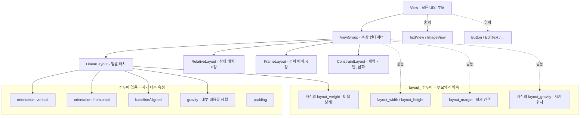

# 05. 모바일앱프로그래밍: 레이아웃 1 (ViewGroup · LinearLayout)

## 🔗 선수 지식 (Prerequisites)
- [ ] **필수**: [1강. 안드로이드 프로젝트와 앱의 동작 원리](1강.md) - 이해 완료?
- [ ] **필수**: [2강. View와 위젯, View의 7대 속성](2강.md) — `layout_width`/`layout_height` 등 View 공통 속성
- [ ] **필수**: [3강. 문자 및 이미지 출력을 위한 위젯](3강.md) — TextView/ImageView가 LinearLayout의 차일드로 배치됨
- [ ] **필수**: [4강. 사용자 인터페이스를 위한 위젯](4강.md) — Button/EditText/CheckBox/RadioButton/Switch를 배치하는 컨테이너가 ViewGroup
- [ ] **권장**: XML 트리 구조(부모-자식), `dp`/`sp`/`match_parent`/`wrap_content` 단위의 의미
- **관련 단원**: [1강](1강.md) · [2강](2강.md) · [3강](3강.md) · [4강](4강.md) · 6강. 레이아웃 2 (다음 강의 — RelativeLayout/FrameLayout 등)

---

## 학습 목표
1. ViewGroup의 역할과 속성(`layout_width`와 `layout_height` 속성, `layout_margin` 속성)에 대해 이해할 수 있다.
2. LinearLayout의 역할과 속성(`orientation` 속성, `baselineAligned` 속성, `gravity` 속성)에 대해 이해할 수 있다.

---

## 🧠 메타인지 체크 (학습 전/후 자기 평가)

### 학습 전 자기 평가
| 소주제 | 자신감 (1-5) |
| :--- | :--- |
| ViewGroup의 정의와 역할 | |
| `layout_width` / `layout_height` 속성 (match_parent vs wrap_content) | |
| `layout_margin` 속성 (margin vs padding 구분) | |
| LinearLayout의 정의와 역할 | |
| `orientation` 속성 (vertical / horizontal) | |
| `baselineAligned` 속성 (TextView 정렬) | |
| `gravity` vs `layout_gravity` 구분 | |
| `layout_weight` 속성 (비율 할당) | |

### 학습 후 교정 (학습 완료 후 작성)
| 소주제 | 학습 전 | 학습 후 | 실제 정답률 | 과신/과소 여부 |
| :--- | :--- | :--- | :--- | :--- |
| ViewGroup | | | | |
| layout_width/height | | | | |
| layout_margin | | | | |
| LinearLayout | | | | |
| orientation | | | | |
| baselineAligned | | | | |
| gravity / layout_gravity | | | | |
| layout_weight | | | | |

> **활용법**: 학습 전 1분 → 자신감 기입, 학습 후 1분 → 나머지 기입. "과신" 영역이 실제 취약점.

---

## 📝 요약 (Summary)
1. 🔴 **LinearLayout**: 차일드(자식) View를 **일렬로 배치**하는 레이아웃. `orientation` 속성에 따라 세로(vertical) 또는 가로(horizontal) 방향으로 자식들이 순차 배치된다. 📎 기출 빈출
2. 🔴 **`layout_width`와 `layout_height` 속성**: View가 레이아웃에 배치될 때 **크기를 결정하는 기준**을 정하는 속성. `match_parent`(부모 가득), `wrap_content`(내용 만큼), 또는 `dp`/`px` 등 구체적 수치 지정. 📎 기출
3. 🔴 **`layout_margin` 속성**: View와 **형제(sibling) View 사이의 간격**을 지정하는 속성. View의 바깥쪽 여백. (cf. `padding`은 View의 안쪽 여백) 📎 기출
4. 🔴 **`orientation` 속성**: LinearLayout 내부에 포함된 View들을 **배치하는 방향**(vertical/horizontal)을 지정하는 속성. LinearLayout의 핵심 속성. 📎 기출
5. 🟡 **`baselineAligned` 속성**: 수평으로 배치된, **서로 높이가 다른 다수의 TextView**를 배치했을 때 TextView **아래쪽(baseline)을 기준**으로 텍스트 뷰들을 정렬해 주는 속성. 기본값 `true`.
6. 🔴 **`gravity` 속성**: View의 **안쪽에 배치되는 내용물**(TextView의 텍스트, ImageView의 이미지, ViewGroup의 자식들 전체)의 **정렬 방식**을 결정하는 속성. (cf. `layout_gravity`는 자기 자신이 부모 안에서 어디에 위치할지) 📎 기출
7. 🔴 **`layout_weight` 속성**: 상위 레이아웃의 영역을 내부 레이아웃/위젯에 **비율로 할당**하는 속성. LinearLayout 안에서 남는 공간을 자식들에게 가중치 비율대로 나눠 준다.
8. 🟡 **ViewGroup**: 다른 View들을 자식으로 가질 수 있는 **컨테이너 View의 추상 클래스**. LinearLayout, RelativeLayout, FrameLayout 등이 모두 ViewGroup의 자손. 모든 레이아웃은 ViewGroup이다.
9. 🟡 **`layout_*` 속성 vs 일반 속성**: `layout_`로 시작하는 속성은 **부모 ViewGroup에게 전달되는 배치 지시**(자식의 폭/높이/마진/위치). 그 외 속성(text, gravity, padding 등)은 **View 자기 자신의 내부 속성**.
10. 🟢 **`gravity` vs `layout_gravity` 혼동 함정**: `gravity`는 "**내가 가진 내용물**을 어떻게 정렬?", `layout_gravity`는 "**부모 안에서 나 자신**을 어디에 둘지?". 시험 단골 비교 포인트.

---

## 🧩 핵심 정의 및 원리 (Key Concepts)

> **과목 유형**: 실습 중심(안드로이드 XML 레이아웃) → **핵심 정의 및 원리** + **핵심 문법 및 패턴** 테이블 병용

| 정의명 | 내용 | 키워드 |
| :--- | :--- | :--- |
| **ViewGroup** | 다른 View들을 자식으로 가질 수 있는 **컨테이너** View. 모든 레이아웃(LinearLayout, RelativeLayout, FrameLayout 등)의 추상 상위 클래스 | 컨테이너, 추상, 레이아웃의 부모 |
| **LinearLayout** | 자식 View를 한 줄(세로 또는 가로)로 **순차 배치**하는 ViewGroup. `orientation`으로 방향 결정 | 일렬 배치, orientation |
| **`layout_width` / `layout_height`** | 자식 View가 부모 안에서 차지할 **크기**를 지정. 값으로 `match_parent`(부모 가득), `wrap_content`(내용만큼), `Ndp`(고정) | match_parent, wrap_content, dp |
| **`layout_margin`** | View **바깥쪽**의 형제 View와의 **간격**. 4방향 개별 지정도 가능(`layout_marginStart/End/Top/Bottom`) | 바깥쪽 여백, 형제 간격 |
| **`padding`** | View **안쪽**의 내용물과 테두리 사이의 **여백** (비교 대상이지만 layout_ 접두어가 없음 — View 자기 속성) | 안쪽 여백, 내용물 ↔ 경계 |
| **`orientation`** | LinearLayout 자식들의 **배치 방향**: `vertical`(세로) / `horizontal`(가로). 기본값은 `horizontal` | 방향, vertical, horizontal |
| **`baselineAligned`** | 수평 LinearLayout에서 자식 TextView들의 **글자 밑선(baseline)** 을 기준으로 정렬할지 여부. 기본값 `true` | baseline, 텍스트 밑선 정렬 |
| **`gravity`** | View **내부 내용물**(텍스트/이미지/자식들)의 **정렬 위치**. ViewGroup에 쓰면 자식들 전체의 정렬, TextView에 쓰면 글자의 정렬 | 내부 정렬, center/start/end/top/bottom |
| **`layout_gravity`** | 자기 자신이 **부모 안에서** 어느 위치에 배치될지. LinearLayout 자식만 의미 있음 | 자기 위치, 부모 내 정렬 |
| **`layout_weight`** | LinearLayout 안에서 **남는 공간을 자식들에게 비율로 나눠주는** 가중치. 값이 클수록 더 많이 차지. `layout_width`(또는 height)를 `0dp`로 두고 weight로 나누는 패턴이 권장 | 가중치, 비율, 남는 공간 분배 |

### 핵심 문법 및 패턴

| 패턴명 | 코드 (XML) | 용도 |
| :--- | :--- | :--- |
| **세로 LinearLayout** | `<LinearLayout android:orientation="vertical" android:layout_width="match_parent" android:layout_height="match_parent"> ... </LinearLayout>` | 위에서 아래로 자식 배치 (가장 흔한 폼 화면) |
| **가로 LinearLayout** | `<LinearLayout android:orientation="horizontal" ...> ... </LinearLayout>` | 왼쪽에서 오른쪽으로 자식 배치 (툴바, 버튼 줄) |
| **부모 가득 채우기** | `android:layout_width="match_parent"` | 부모의 가로폭 끝까지 차지 |
| **내용만큼 크기** | `android:layout_height="wrap_content"` | 내용물에 맞게 자동 결정 |
| **고정 크기** | `android:layout_width="120dp"` | 디바이스 독립 픽셀로 고정 |
| **마진 (바깥 여백)** | `android:layout_margin="16dp"` | 4방향 동일 / 개별: `layout_marginStart`, `_marginTop` 등 |
| **패딩 (안쪽 여백)** | `android:padding="8dp"` | View 내부 여백. layout_ 접두어 없음에 주의 |
| **내용물 가운데 정렬** | `android:gravity="center"` | TextView 텍스트나 ViewGroup 자식들 중앙 배치 |
| **자기 자신 부모 내 정렬** | `android:layout_gravity="end"` | LinearLayout 자식이 부모의 오른쪽 끝에 위치 |
| **비율 분배 (가로)** | `<View android:layout_width="0dp" android:layout_height="wrap_content" android:layout_weight="1" />` | `layout_weight`로 남는 공간을 자식들에게 비율로 분배. 효율 위해 base는 `0dp` |
| **가중치 합 명시 (`weightSum`)** | `<LinearLayout android:weightSum="4"> ... <View android:layout_weight="1" .../> ...` | LinearLayout에 전체 가중치 합을 명시. 자식 weight 합이 `weightSum`보다 작으면 그 차이만큼은 빈 공간으로 남아, "자식 1개가 부모의 정확히 1/4만 차지" 같은 부분 점유를 만들 수 있음. 근거: https://developer.android.com/reference/android/widget/LinearLayout#attr_android:weightSum |
| **baseline 정렬 해제** | `<LinearLayout android:orientation="horizontal" android:baselineAligned="false">` | 가로 LinearLayout에서 자식 폰트 크기가 다를 때 baseline 정렬을 끌 수 있음 |

> **직관적 해석**: **ViewGroup은 박스**(컨테이너)이고 **LinearLayout은 그중 "일렬로 줄세우는" 박스**다. 자식 View의 `layout_width/height`는 **"내가 부모 안에서 얼마만큼 자리를 차지할 거야"**(부모를 향한 요청), `layout_margin`은 **"내 옆 친구들과 이만큼 떨어져 있을게"**, `gravity`는 **"내 안의 내용물을 이쪽에 붙여 놔"**, `layout_gravity`는 **"내가 부모 안에서 이쪽에 가서 설게"**, `layout_weight`는 **"남는 자리를 비율대로 나눠 가져"**. 즉 `layout_`로 시작하면 **부모와의 약속**, 아니면 **자기 내부 규칙**이다.

> **AI 적용**: 모바일 ML 앱의 화면 구성은 거의 100% LinearLayout 또는 ConstraintLayout 위에서 이뤄진다. (1) 카메라 프리뷰 + 추론 결과 텍스트를 세로로 쌓는 화면(`vertical` + 프리뷰는 `weight=1`로 남는 공간 차지), (2) "이미지/카메라/갤러리" 모드 선택 버튼 줄(`horizontal` + 각 버튼 `weight=1`로 균등 분배), (3) 추론 진행 인디케이터와 텍스트의 baseline 정렬 등이 모두 본 강의 속성으로 구현된다.

---

## 📊 개념 시각화 (Visual Guide)

### 레이아웃 분류 체계도 (5강 범위 중심)



> **포인트**: `layout_`로 시작하는 속성은 **자식이 부모에게 알려주는 배치 요청**이다. ViewGroup 종류가 바뀌면(LinearLayout → RelativeLayout) 의미 있는 `layout_*` 속성도 달라진다(예: `layout_weight`는 LinearLayout 전용).

### 핵심 도식: XML 속성 → 화면 결과

| 속성 (Attribute) | 입력값 예시 | 결과 (화면) | 비고 |
| :--- | :--- | :--- | :--- |
| `layout_width` | `match_parent` | 부모의 가로폭 끝까지 채움 | API 8 이전엔 `fill_parent`, 의미 동일 |
| `layout_width` | `wrap_content` | 내용물(텍스트/이미지)만큼만 차지 | 가장 흔한 기본값 |
| `layout_width` | `120dp` | 화면 밀도에 독립적인 120dp 너비 | 폰트는 `sp` 사용 |
| `layout_margin` | `16dp` | View 4방향 모두 16dp 바깥 여백 | 형제 View와의 간격 |
| `layout_marginTop` | `8dp` | 위쪽만 8dp 여백 | 4방향 개별 지정 가능 |
| `padding` | `12dp` | View 내부에 12dp 안쪽 여백 | 내용물과 경계 사이 |
| LinearLayout `orientation` | `vertical` | 자식이 위→아래 순서로 쌓임 | 기본값은 `horizontal` |
| LinearLayout `orientation` | `horizontal` | 자식이 왼→오른쪽 순서로 배치 | 가로 메뉴, 툴바 |
| LinearLayout `gravity` | `center` | **자식들 전체**가 부모 안에서 가운데 정렬 | 자식들 자체의 정렬 |
| TextView `gravity` | `center` | **텍스트**가 TextView 내부에서 가운데 정렬 | TextView 내부의 정렬 |
| 자식의 `layout_gravity` | `end` | LinearLayout(vertical) 안에서 자기 자신이 오른쪽 끝에 위치 | LinearLayout 자식만 의미 있음 |
| `baselineAligned` | `false` | 가로 LinearLayout 자식들의 baseline 정렬 해제 | 폰트 크기 차이가 클 때 |
| 자식의 `layout_weight` | `1` | LinearLayout 남는 공간을 가중치 비율대로 분배 | base는 `0dp` 권장 |

### `gravity` vs `layout_gravity` 시각 도식

```
부모 LinearLayout(vertical, gravity=??, layout_width=match_parent)
┌──────────────────────────────────────────┐
│  자식A (layout_gravity=??)                │
│  자식B                                    │
│  자식C                                    │
└──────────────────────────────────────────┘

· 부모의 gravity="center_horizontal"
   → 자식 A, B, C가 모두 가로 가운데로 모임 (자식들 정렬)

· 자식A의 layout_gravity="end"
   → A만 부모 안에서 오른쪽 끝으로 (자기 자신만 정렬)
```

### LinearLayout 가로 배치 + weight 시각 도식

```
<LinearLayout orientation="horizontal" layout_width="match_parent">
   <Button weight=1 width=0dp>  <Button weight=2 width=0dp>  <Button weight=1 width=0dp>

화면(전체 4 단위):
┌────────┬────────────────┬────────┐
│   1    │       2        │   1    │
│  [A]   │      [B]       │  [C]   │
└────────┴────────────────┴────────┘
            (1:2:1 비율로 가로 공간 분배)
```

---

## ✏️ 심화 학습 (Study Subject)

### 1. 가상 시나리오: "어떤 레이아웃·속성을, 언제 사용해야 할까?"
- **상황**: 모바일 ML 추론 앱의 메인 화면을 설계한다. 화면 구성은 (1) 상단에 카메라 프리뷰가 가능한 한 넓게, (2) 그 아래 추론 결과 텍스트 한 줄, (3) 맨 아래에 [이미지 선택] [카메라 모드] [재시작] 세 버튼이 같은 폭으로 가로 균등 배치되어야 한다.
- **문제**: 어떤 ViewGroup과 어떤 `layout_*` 속성으로 이 화면을 구성해야 디바이스 크기에 관계없이 일관된 비율과 정렬을 유지할까?
- **해결**:
  1. 최상위 컨테이너로 **세로 LinearLayout** (`orientation="vertical"`, `layout_width/height=match_parent`)을 둔다.
  2. 카메라 프리뷰 영역(예: `SurfaceView`)은 `layout_width="match_parent"`, `layout_height="0dp"`, `layout_weight="1"`로 두어 **남는 공간을 모두 차지**하게 한다(가능한 한 넓게).
  3. 추론 결과 `TextView`는 `layout_width="match_parent"`, `layout_height="wrap_content"`, `gravity="center"`로 텍스트를 가운데 정렬, 위아래로 `layout_marginTop="8dp"`/`layout_marginBottom="8dp"`로 다른 View들과 간격 확보.
  4. 하단 버튼 줄은 **가로 LinearLayout** (`orientation="horizontal"`, `layout_width="match_parent"`, `layout_height="wrap_content"`) 안에 Button 3개를 각각 `layout_width="0dp"`, `layout_weight="1"`로 두어 **균등 분배**.
  5. 가로 LinearLayout에서 버튼 텍스트들의 폰트 크기가 다를 가능성이 있으면 `baselineAligned="false"`로 두어 의도치 않은 정렬을 막는다(여기서는 모두 같으니 기본 true 유지).
- **AI 학습 포인트**: "ML 추론 결과 텍스트가 길어졌을 때 화면이 흘러넘치지 않게 하려면, `layout_weight`로 영역을 미리 분배하는 방식과 `ScrollView`로 감싸는 방식 중 어떤 것이 더 적합할까? 또 가로 버튼 줄을 weight로 균등 분배할 때 `layout_width="match_parent"`로 잘못 두면 어떤 시각적 문제가 생기고, 왜 base 폭을 `0dp`로 두는 것이 권장되는지 LinearLayout 내부 측정(measure) 알고리즘 관점에서 설명해 줘."

### 2. 관점별 비교 및 오개념 분석

- **핵심 비교**:
  - **`gravity` vs `layout_gravity`** (내부 정렬 vs 자기 위치)
  - **`margin` vs `padding`** (바깥 여백 vs 안쪽 여백)
  - **`match_parent` vs `wrap_content`** (부모 채움 vs 내용만큼)
  - **`layout_weight` 사용 시 `0dp` 권장 이유**

#### `gravity` vs `layout_gravity` (기출 빈출 함정)

| 구분 | `gravity` | `layout_gravity` |
| :--- | :--- | :--- |
| **누가 정렬되나** | **내가 가진 내용물**(텍스트/이미지/자식들) | **나 자신**(부모 안에서) |
| **선언 위치** | 모든 View(특히 TextView, ViewGroup) | LinearLayout/FrameLayout의 자식 View |
| **접두어** | `layout_` 없음 (자기 내부 속성) | `layout_` 있음 (부모와의 약속) |
| **예** | `TextView.gravity="center"` → 글자가 텍스트뷰 가운데 | `Button.layout_gravity="end"` → 버튼이 부모의 오른쪽 끝 |
| **출제 함정** | "내용물 정렬은?" → `gravity` | "View 자기 위치는?" → `layout_gravity` |

#### `margin` vs `padding`

| 구분 | `margin` (`layout_margin`) | `padding` |
| :--- | :--- | :--- |
| **위치** | View **바깥쪽** | View **안쪽** |
| **역할** | 형제 View와의 간격 | 내용물과 View 경계의 간격 |
| **접두어** | `layout_` 있음 | `layout_` 없음 |
| **눌리는 영역** | 마진 영역은 클릭 안 됨 | 패딩 영역도 클릭됨(View 영역 내부) |
| **시각 비유** | 카드와 카드 사이의 빈 공간 | 카드 내부 가장자리의 안쪽 여백 |

#### `match_parent` vs `wrap_content`

| 구분 | `match_parent` | `wrap_content` |
| :--- | :--- | :--- |
| **의미** | 부모(허용된) 영역을 가득 채움 | 내용물(자식/텍스트)에 맞게 자동 |
| **언제** | 가로폭 전체 사용 폼 필드, 배경 영역 | 버튼처럼 콘텐츠 크기만큼만 차지 |
| **API 이전 표기** | `fill_parent` (deprecated, 의미 동일) | — |
| **주의** | 부모가 `wrap_content`인 경우 자식의 `match_parent`는 의미 축소될 수 있음 | 무한 중첩 시 측정 비용 증가 |

#### `layout_weight` 사용 시 base 폭이 `0dp`인 이유

| 구분 | base `0dp` + weight | base `wrap_content` + weight |
| :--- | :--- | :--- |
| **측정 단계** | 처음부터 자식 폭=0, 남는 공간 = 전체 → 정확히 weight 비율로 분배 | 자식별로 실제 폭(텍스트 길이 등)을 먼저 측정 → 남는 공간만 weight로 분배 |
| **결과 일관성** | **정확한 비율** (1:2:1 보장) | 글자 길이에 따라 비율이 일그러질 수 있음 |
| **성능** | 측정 1회 | 측정 2회(자식 본래 크기 + 남는 공간) — 약간 느림 |
| **권장** | ✅ 일반적으로 권장 | 특수 케이스만 |

- **오개념 분석**
    - **오개념 1**: "`gravity`나 `layout_gravity`나 그게 그거다."
    - **분석**: 잘못된 생각이다. `gravity`는 "이 View가 **가진** 내용물의 정렬", `layout_gravity`는 "이 View가 **놓일** 위치"다. 같은 `center`라도 적용 대상이 다르다. 시험 단골 비교.
    - **오개념 2**: "`layout_margin`은 View 안쪽의 여백이다."
    - **분석**: 잘못된 생각이다. **바깥쪽**(형제 View와의 간격)이다. 안쪽 여백은 `padding`이며, 접두어가 `layout_`이 없다는 점에서 구분된다.
    - **오개념 3**: "`orientation` 기본값은 `vertical`이다."
    - **분석**: 잘못된 생각이다. LinearLayout의 `orientation` **기본값은 `horizontal`**이다. 세로 배치를 원하면 반드시 `android:orientation="vertical"`을 명시해야 한다.
    - **오개념 4**: "`baselineAligned`는 모든 ViewGroup에 적용된다."
    - **분석**: 잘못된 생각이다. **LinearLayout(특히 가로 방향)** 에서 자식 TextView 종류의 글자 밑선 정렬을 제어할 때 의미가 있다. 다른 ViewGroup에는 적용되지 않는다.
    - **오개념 5**: "`layout_weight`는 어떤 ViewGroup에서나 비율 분배를 해 준다."
    - **분석**: 잘못된 생각이다. `layout_weight`는 **LinearLayout 전용** 속성이다. RelativeLayout이나 FrameLayout에 두면 효과가 없다(또는 무시된다).
    - **오개념 6**: "가로 LinearLayout에서 자식들의 너비를 `match_parent`로 두고 `layout_weight`를 주면 비율대로 분배된다."
    - **분석**: 동작은 하지만 **각 자식이 부모 폭을 가득 요구하므로 측정 단계가 복잡해지고**, base 폭이 0이 아니라 자식 본래 크기에 weight가 곱해져 의도와 다른 비율이 나올 수 있다. **base 폭을 `0dp`로 두는 패턴**이 표준.
- **AI 학습 포인트**: "안드로이드의 `layout_*` 접두어 규칙(자식이 부모에게 보내는 hint)은 CSS Flexbox의 `flex-grow`/`align-self`/`margin`과 어떻게 대응되는가? Flexbox의 `flex-basis: 0`이 안드로이드의 `layout_width="0dp" + layout_weight="N"`과 같은 의미라는 점, 그리고 ConstraintLayout이 등장하면서 LinearLayout이 점차 대체되는 흐름을 설명해 줘."

---

## ❓ 연습 문제 및 해설

> **블룸 인지 수준 범례**: [기억] 정의·나열 → [이해] 설명·비교 → [적용] 계산·구현 → [분석] 구별·디버그 → [평가] 판단·비평 → [창조] 설계·제안

### 📝 문제

**1. ⭐ [기억] 차일드 View를 일렬로 배치하는 레이아웃은 무엇인가? [📎 기출](#prob-1)**
   > ① FrameLayout
   > ② RelativeLayout
   > ③ LinearLayout
   > ④ ConstraintLayout

<br>

**2. ⭐ [기억] View가 레이아웃에 배치될 때 **크기를 결정하는 기준**을 정하는 속성은? [📎 기출](#prob-2)**
   > ① `layout_margin`
   > ② `layout_width` / `layout_height`
   > ③ `gravity`
   > ④ `orientation`

<br>

**3. ⭐ [기억] View와 **형제 View 사이의 간격**을 지정하는 속성은? [📎 기출](#prob-3)**
   > ① `padding`
   > ② `gravity`
   > ③ `layout_margin`
   > ④ `layout_gravity`

<br>

**4. ⭐ [기억] LinearLayout 내부의 View들을 **배치하는 방향**을 지정하는 속성은? [📎 기출](#prob-4)**
   > ① `gravity`
   > ② `orientation`
   > ③ `baselineAligned`
   > ④ `layout_weight`

<br>

**5. ⭐ [기억] 📌 수평으로 서로 높이가 다른 다수의 TextView를 배치했을 때 **TextView 아래쪽(글자 밑선)을 기준으로 정렬**해 주는 LinearLayout의 속성은? [(#prob-5)](#prob-5)**
   > ① `gravity`
   > ② `layout_gravity`
   > ③ `baselineAligned`
   > ④ `layout_weight`

<br>

**6. ⭐⭐ [이해] 📌 View의 **안쪽에 배치되는 내용물**(텍스트/이미지/자식들)의 정렬 방식을 결정하는 속성은? [(#prob-6)](#prob-6)**
   > ① `gravity`
   > ② `layout_gravity`
   > ③ `layout_margin`
   > ④ `padding`

<br>

**7. ⭐⭐ [이해] 📌 상위 레이아웃의 영역을 **내부 레이아웃이나 위젯에게 비율로 할당**하는 속성은? [(#prob-7)](#prob-7)**
   > ① `layout_width`
   > ② `layout_weight`
   > ③ `layout_margin`
   > ④ `orientation`

<br>

**8. ⭐⭐ [분석] 📌 다음 중 LinearLayout과 그 자식 View의 속성 사용에 대한 설명으로 **옳은 것을 모두** 고르시오. [(#prob-8)](#prob-8)**
   > <보기>
   >
   > 가. `orientation`의 기본값은 `vertical`이다.
   > 나. `layout_margin`은 View 바깥쪽의 형제 View와의 간격을 지정한다.
   > 다. `gravity`는 View 내부 내용물의 정렬, `layout_gravity`는 자기 자신이 부모 안에서 어디에 놓일지를 결정한다.
   > 라. `layout_weight`는 LinearLayout 외 다른 ViewGroup에서도 동일하게 비율 분배에 사용된다.

   > ① 가, 나
   > ② 나, 다
   > ③ 나, 다, 라
   > ④ 가, 나, 다, 라

<br>

**9. ⭐⭐ [적용] 📌 다음 XML에서 화면 가로폭을 **Button A : B : C = 1 : 2 : 1** 비율로 균등 분배하려고 한다. 빈칸 ㉠, ㉡, ㉢에 들어갈 값으로 올바르게 짝지어진 것은? [(#prob-9)](#prob-9)**
   > ```xml
   > <LinearLayout
   >     android:orientation="㉠"
   >     android:layout_width="match_parent"
   >     android:layout_height="wrap_content">
   >
   >     <Button android:text="A"
   >         android:layout_width="㉡"
   >         android:layout_height="wrap_content"
   >         android:layout_weight="㉢_A" />
   >     <Button android:text="B"
   >         android:layout_width="㉡"
   >         android:layout_height="wrap_content"
   >         android:layout_weight="㉢_B" />
   >     <Button android:text="C"
   >         android:layout_width="㉡"
   >         android:layout_height="wrap_content"
   >         android:layout_weight="㉢_C" />
   > </LinearLayout>
   > ```
   > ① ㉠ vertical, ㉡ wrap_content, ㉢ 1/2/1
   > ② ㉠ horizontal, ㉡ 0dp, ㉢ 1/2/1
   > ③ ㉠ horizontal, ㉡ match_parent, ㉢ 1/1/1
   > ④ ㉠ vertical, ㉡ 0dp, ㉢ 2/4/2

<br>

**10. ⭐⭐⭐ [평가/창조] 📌 다음 요구사항을 만족하는 XML 코드를 작성하시오. [(#prob-10)](#prob-10)**
> **요구사항**:
> 1. 최상위 `LinearLayout`은 세로 방향, 화면 전체를 채운다(`match_parent`).
> 2. 상단 영역: 텍스트 "추론 결과"가 가로 가운데 정렬된 `TextView` 1개. 위아래로 `8dp` 여백.
> 3. 중간 영역: 비어 있는 `View`(배경 추론 프리뷰 자리). `layout_weight="1"`로 **남는 공간 모두**를 차지.
> 4. 하단 영역: 가로 LinearLayout에 `Button` 3개("이전", "촬영", "다음"). 세 버튼이 **1:1:1로 균등 분배**되어야 한다.

---

### 🔑 정답 및 해설 (먼저 풀어본 후 펼치기)

<details>
<summary>정답 보기 (클릭)</summary>

1. ③
2. ②
3. ③
4. ②
5. ③
6. ①
7. ②
8. ②
9. ②
10. [코드형 — 해설 참조]

</details>

<details>
<summary>해설 보기 (클릭)</summary>

<a id="prob-1"></a>
**1. ⭐ [기억] 일렬 배치 레이아웃 📎 기출**
> **정답: ③ LinearLayout**
> **해설**: LinearLayout은 자식 View를 `orientation`이 지정하는 방향(세로 또는 가로)으로 **순차 배치(일렬 배치)** 하는 ViewGroup이다.
> - ① FrameLayout: 자식들을 **겹쳐서** 배치(좌상단 기준 누적).
> - ② RelativeLayout: 자식 간 **상대 위치** 관계로 배치.
> - ④ ConstraintLayout: 제약(constraint) 기반의 유연한 배치(LinearLayout의 후계자격).

<a id="prob-2"></a>
**2. ⭐ [기억] 크기 결정 속성 📎 기출**
> **정답: ② `layout_width` / `layout_height`**
> **해설**: View가 부모 레이아웃 안에서 **얼마만큼의 크기**를 차지할지 결정하는 속성이다. 값으로 `match_parent`(부모 가득), `wrap_content`(내용만큼), `Ndp`(고정) 등을 쓸 수 있다.
> - ① `layout_margin`: 크기가 아닌 **형제와의 간격**.
> - ③ `gravity`: 크기가 아닌 **내부 내용물 정렬**.
> - ④ `orientation`: 크기가 아닌 **LinearLayout의 배치 방향**.

<a id="prob-3"></a>
**3. ⭐ [기억] 형제 간 간격 속성 📎 기출**
> **정답: ③ `layout_margin`**
> **해설**: View **바깥쪽**의 형제 View와의 간격을 지정한다. `layout_` 접두어가 있어 "부모에게 보내는 배치 요청"임을 알려준다.
> - ① `padding`: View **안쪽**의 내용물과 경계 사이 여백(헷갈리는 함정).
> - ② `gravity`: 내용물 정렬.
> - ④ `layout_gravity`: 자기 자신이 부모 안에서 놓일 위치.

<a id="prob-4"></a>
**4. ⭐ [기억] 배치 방향 속성 📎 기출**
> **정답: ② `orientation`**
> **해설**: LinearLayout 내부의 View들을 **세로(vertical)** 또는 **가로(horizontal)** 로 배치하는 방향을 지정한다. **기본값은 `horizontal`** 이라는 점에 주의.
> - ① `gravity`: 내용물 정렬, 방향이 아님.
> - ③ `baselineAligned`: 텍스트 baseline 정렬 여부.
> - ④ `layout_weight`: 영역 비율 분배.

<a id="prob-5"></a>
**5. ⭐ [기억] baseline 정렬 속성**
> **정답: ③ `baselineAligned`**
> **해설**: 수평으로 서로 높이가 다른 다수의 TextView를 배치했을 때, **TextView 아래쪽(글자 baseline)을 기준**으로 정렬해 주는 속성. 기본값은 `true`이며, 폰트 크기가 크게 다른 TextView를 가로로 둘 때 의도와 다른 정렬이 생기면 `false`로 끌 수 있다.

<a id="prob-6"></a>
**6. ⭐⭐ [이해] 내부 내용물 정렬 속성**
> **정답: ① `gravity`**
> **해설**: `gravity`는 View **안쪽에 배치되는 내용물**(TextView의 텍스트, ImageView의 이미지, ViewGroup이라면 자식들 전체)의 정렬 방식을 결정한다.
> - ② `layout_gravity`: 자기 자신이 부모 안에서 놓일 위치(반대 개념, 단골 함정).
> - ③ `layout_margin`: 바깥쪽 여백.
> - ④ `padding`: 안쪽 여백(정렬이 아니라 공간 크기).

<a id="prob-7"></a>
**7. ⭐⭐ [이해] 비율 분배 속성**
> **정답: ② `layout_weight`**
> **해설**: LinearLayout 안에서 **남는 공간을 자식들에게 가중치 비율**대로 나눠 주는 속성. 자식별로 weight 값을 주면 총합 대비 비율로 영역을 차지한다. 권장 패턴은 base 폭을 `0dp`로 두는 것.

<a id="prob-8"></a>
**8. ⭐⭐ [분석] LinearLayout 속성 종합 판별**
> **정답: ② 나, 다**
> **해설**:
> - 가. (X) `orientation`의 **기본값은 `horizontal`** 이다. 세로 배치는 명시해야 한다.
> - 나. (O) `layout_margin`은 View **바깥쪽**, 즉 형제 View와의 간격이다.
> - 다. (O) `gravity`(내부 내용물 정렬) vs `layout_gravity`(자기 자신 위치)의 표준 정의.
> - 라. (X) `layout_weight`는 **LinearLayout 전용** 속성이다. 다른 ViewGroup에선 무시되거나 효과가 없다.

<a id="prob-9"></a>
**9. ⭐⭐ [적용] weight 비율 분배 패턴**
> **정답: ② ㉠ horizontal, ㉡ 0dp, ㉢ 1/2/1**
> **해설**:
> - 가로폭을 비율로 나누려면 LinearLayout이 **가로 방향**이어야 하므로 `orientation="horizontal"`.
> - 비율을 **정확히** 보장하려면 base 폭을 `0dp`로 두고 `layout_weight`로만 분배. (그래야 자식 본래 폭의 영향이 제거되고 순수 weight 비율로 측정됨)
> - 1:2:1 비율을 만들려면 weight 값이 1, 2, 1이어야 한다.
> - ①: base가 wrap_content면 자식 크기 측정 후 남는 공간만 weight로 나누므로 정확한 1:2:1이 안 됨.
> - ③: weight가 1:1:1이라 1:2:1이 안 됨, base도 match_parent로 부적절. 게다가 가로 LinearLayout에서 자식 `width="match_parent"` + `weight`를 함께 주면, 측정의 base가 0이 아니라 **부모 폭 전체**가 되어 남는 공간이 음수가 되고, 이 음수 공간이 weight 비율로 분배되면서 **weight가 클수록 오히려 더 좁아지는(가중치의 역수 비율) 분배 역전**이 일어나는 더 강한 오류가 있다. 근거: https://developer.android.com/develop/ui/views/layout/linear
> - ④: vertical은 가로 분배가 아니라 세로 분배가 되어 요구사항과 다름.

<a id="prob-10"></a>
**10. ⭐⭐⭐ [평가/창조] XML 작성**
> **정답 예시**:
> ```xml
> <?xml version="1.0" encoding="utf-8"?>
> <LinearLayout xmlns:android="http://schemas.android.com/apk/res/android"
>     android:layout_width="match_parent"
>     android:layout_height="match_parent"
>     android:orientation="vertical">
>
>     <!-- 1) 상단: 추론 결과 텍스트 -->
>     <TextView
>         android:layout_width="match_parent"
>         android:layout_height="wrap_content"
>         android:layout_marginTop="8dp"
>         android:layout_marginBottom="8dp"
>         android:gravity="center"
>         android:text="추론 결과"
>         android:textSize="18sp" />
>
>     <!-- 2) 중간: 프리뷰 자리 (남는 공간 전부) -->
>     <View
>         android:layout_width="match_parent"
>         android:layout_height="0dp"
>         android:layout_weight="1"
>         android:background="#EEEEEE" />
>
>     <!-- 3) 하단: 1:1:1 균등 분배 버튼 줄 -->
>     <LinearLayout
>         android:layout_width="match_parent"
>         android:layout_height="wrap_content"
>         android:orientation="horizontal">
>
>         <Button
>             android:layout_width="0dp"
>             android:layout_height="wrap_content"
>             android:layout_weight="1"
>             android:text="이전" />
>         <Button
>             android:layout_width="0dp"
>             android:layout_height="wrap_content"
>             android:layout_weight="1"
>             android:text="촬영" />
>         <Button
>             android:layout_width="0dp"
>             android:layout_height="wrap_content"
>             android:layout_weight="1"
>             android:text="다음" />
>     </LinearLayout>
> </LinearLayout>
> ```
> **해설**:
> - **최상위 세로 LinearLayout** + `match_parent` × `match_parent` → 화면 전체 점유.
> - **TextView**: `gravity="center"`로 텍스트를 가로 가운데 정렬, `layout_marginTop/Bottom="8dp"`로 위아래 형제와의 간격.
> - **중간 View**: `layout_height="0dp" + layout_weight="1"` → 위 TextView와 아래 버튼 줄을 제외한 **남는 공간 전부**를 차지(weight 패턴의 대표 활용).
> - **하단 가로 LinearLayout**: 자식 Button 3개를 `layout_width="0dp" + layout_weight="1"`로 두어 **정확한 1:1:1 분배**.

</details>

---

## ✅ O/X 확인문제 (연습문항 개수의 2배 권장)

**1.** LinearLayout은 차일드 View를 일렬로 배치하는 레이아웃이다. [(#ox-1)](#ox-1) **(O / X)**
**2.** `layout_width`와 `layout_height`는 View가 레이아웃에 배치될 때 크기를 결정하는 기준을 정하는 속성이다. [(#ox-2)](#ox-2) **(O / X)**
**3.** `layout_margin`은 View와 형제 View 사이의 간격을 지정하는 속성이다. [(#ox-3)](#ox-3) **(O / X)**
**4.** `orientation`은 LinearLayout 내부에 포함된 View들을 배치하는 방향을 지정하는 속성이다. [(#ox-4)](#ox-4) **(O / X)**
**5.** `baselineAligned`는 수평으로 서로 높이가 다른 다수의 TextView를 배치했을 때 TextView 아래쪽을 기준으로 정렬해 주는 속성이다. [(#ox-5)](#ox-5) **(O / X)**
**6.** `gravity`는 View의 안쪽에 배치되는 내용물의 정렬 방식을 결정하는 속성이다. [(#ox-6)](#ox-6) **(O / X)**
**7.** `layout_weight`는 상위 레이아웃의 남는 공간을 내부 레이아웃이나 위젯에게 가중치 비율로 할당하는 속성이다. [(#ox-7)](#ox-7) **(O / X)**
**8.** `orientation` 속성의 기본값은 `vertical`이다. [(#ox-8)](#ox-8) **(O / X)**
**9.** `padding`은 View의 안쪽 여백을 지정하고, `layout_margin`은 View의 바깥쪽 여백을 지정한다. [(#ox-9)](#ox-9) **(O / X)**
**10.** `layout_gravity`는 자식 View가 가진 내용물을 부모 안 어디에 정렬할지 지정한다. [(#ox-10)](#ox-10) **(O / X)**
**11.** ViewGroup은 다른 View들을 자식으로 가질 수 있는 컨테이너 View의 추상 클래스이며, LinearLayout은 ViewGroup의 자손이다. [(#ox-11)](#ox-11) **(O / X)**
**12.** `layout_width="match_parent"`는 자식 View가 부모(허용된) 영역의 가로폭을 가득 채우라는 뜻이다. [(#ox-12)](#ox-12) **(O / X)**
**13.** `layout_weight`는 LinearLayout 외의 ViewGroup(FrameLayout, RelativeLayout 등)에서도 동일하게 동작한다. [(#ox-13)](#ox-13) **(O / X)**
**14.** 가로 LinearLayout에서 자식들을 정확한 비율로 분배하려면 자식의 `layout_width="0dp"`로 두고 `layout_weight`만 다르게 주는 것이 표준 패턴이다. [(#ox-14)](#ox-14) **(O / X)**
**15.** `wrap_content`는 View가 내용물의 크기에 맞춰 자동으로 크기를 결정한다. [(#ox-15)](#ox-15) **(O / X)**
**16.** `baselineAligned`는 모든 ViewGroup에서 자식 정렬에 영향을 준다. [(#ox-16)](#ox-16) **(O / X)**
**17.** `gravity="center"`를 LinearLayout에 두면 그 LinearLayout이 부모 안에서 가운데로 정렬된다. [(#ox-17)](#ox-17) **(O / X)**
**18.** `layout_` 접두어가 붙은 속성은 자식이 부모 ViewGroup에게 보내는 배치 요청에 해당한다. [(#ox-18)](#ox-18) **(O / X)**
**19.** `layout_marginStart`와 `layout_marginEnd`는 RTL(오른쪽→왼쪽) 언어 환경에서도 시작/끝 방향이 올바르게 동작하도록 설계된 속성이다. [(#ox-19)](#ox-19) **(O / X)**
**20.** `padding`에는 `layout_` 접두어가 붙지 않으므로 View 자기 자신의 내부 속성으로 분류된다. [(#ox-20)](#ox-20) **(O / X)**

<details>
<summary>O/X 정답 및 해설 보기 (클릭)</summary>

> <a id="ox-1"></a>
> **1. 정답**: O
> **해설**: 정리하기 그대로. LinearLayout=일렬 배치 레이아웃.

> <a id="ox-2"></a>
> **2. 정답**: O
> **해설**: 정리하기 그대로. 모든 View에 공통으로 적용되는 크기 결정 속성.

> <a id="ox-3"></a>
> **3. 정답**: O
> **해설**: 정리하기 그대로. `layout_margin`=View 바깥쪽, 형제 간 간격.

> <a id="ox-4"></a>
> **4. 정답**: O
> **해설**: 정리하기 그대로. LinearLayout의 핵심 속성, `vertical`/`horizontal` 두 값.

> <a id="ox-5"></a>
> **5. 정답**: O
> **해설**: 정리하기 그대로. 가로 LinearLayout에서 TextView 글자 밑선을 기준으로 정렬, 기본값 `true`.

> <a id="ox-6"></a>
> **6. 정답**: O
> **해설**: 정리하기 그대로. `gravity`=내부 내용물 정렬, `layout_gravity`=자기 위치(헷갈리지 말 것).

> <a id="ox-7"></a>
> **7. 정답**: O
> **해설**: 정리하기 그대로. LinearLayout 안에서 남는 공간을 weight 비율로 분배.

> <a id="ox-8"></a>
> **8. 정답**: X
> **해설**: `orientation` 기본값은 **`horizontal`** 이다. 세로로 쓰고 싶으면 반드시 `android:orientation="vertical"`을 명시해야 한다. 단골 함정.

> <a id="ox-9"></a>
> **9. 정답**: O
> **해설**: `padding`(접두어 없음)=안쪽 여백, `layout_margin`(접두어 있음)=바깥쪽 여백. 접두어 유무가 구분 키.

> <a id="ox-10"></a>
> **10. 정답**: X
> **해설**: `layout_gravity`는 "자식 자신이 부모 안에서 어디에 놓일지"를 지정한다. "자기가 가진 내용물 정렬"은 `gravity`다. 반대 정의 함정.

> <a id="ox-11"></a>
> **11. 정답**: O
> **해설**: LinearLayout, RelativeLayout, FrameLayout 등 모든 레이아웃은 `android.view.ViewGroup`의 자손이다.

> <a id="ox-12"></a>
> **12. 정답**: O
> **해설**: `match_parent`(예전 `fill_parent`)는 부모가 허용한 영역을 가득 채우라는 의미.

> <a id="ox-13"</a>
> **13. 정답**: X
> **해설**: `layout_weight`는 **LinearLayout 전용** 속성이다. FrameLayout/RelativeLayout 자식에 두어도 무시된다.

> <a id="ox-14"></a>
> **14. 정답**: O
> **해설**: base 폭을 0dp로 두면 자식 본래 크기에 영향을 받지 않고 순수 weight 비율로 분배되며, 측정도 1회로 끝나 효율적이다.

> <a id="ox-15"></a>
> **15. 정답**: O
> **해설**: `wrap_content`는 자식이 자신의 내용물(텍스트/이미지 등) 크기에 맞춰 자동으로 크기를 결정한다.

> <a id="ox-16"></a>
> **16. 정답**: X
> **해설**: `baselineAligned`는 **LinearLayout(특히 horizontal)** 의 자식 TextView 정렬에만 의미 있고, 다른 ViewGroup에는 적용되지 않는다.

> <a id="ox-17"></a>
> **17. 정답**: X
> **해설**: ViewGroup에 `gravity`를 두면 **그 안의 자식들 전체**가 그 방향으로 정렬된다. "자기 자신이 부모 안에서" 정렬되려면 자기 자신의 `layout_gravity`를 써야 한다.

> <a id="ox-18"></a>
> **18. 정답**: O
> **해설**: `layout_width/height/margin/gravity/weight` 등 `layout_` 접두어 속성은 모두 부모 ViewGroup이 자식을 배치할 때 참고하는 hint다. 부모 ViewGroup 종류가 바뀌면 의미가 달라지거나 무시될 수 있다.

> <a id="ox-19"></a>
> **19. 정답**: O
> **해설**: `layout_marginStart`/`End`는 RTL 환경에서 자동으로 좌우를 뒤바꿔 적용한다. `layout_marginLeft`/`Right`는 절대 방향이므로 RTL 대응에 불리하다.

> <a id="ox-20"></a>
> **20. 정답**: O
> **해설**: `padding`은 자기 자신의 내부 여백이므로 부모와 무관하고, 따라서 `layout_` 접두어가 붙지 않는다. 접두어 유무가 "부모와의 약속 vs 자기 속성"을 가르는 단서다.

</details>

---

## 🧪 자유 회상 연습 (Free Recall)

> **방법**: 위의 노트를 모두 덮고, 타이머 3분 설정 후 이번 단원에서 배운 내용을 기억나는 대로 자유롭게 적으세요.
> 정확한 문장이 아니어도 됩니다. 키워드, 관계 등 떠오르는 것을 모두 적습니다.

**자유 회상 작성란:**

```
[여기에 기억나는 내용을 자유롭게 작성]


```

> **회상 후 점검**: 노트를 다시 펼쳐 빠뜨린 내용을 확인하세요.
> - 회상 못한 ViewGroup 속성(3개): [                ]
> - 회상 못한 LinearLayout 속성(4개): [                ]
> - 회상 못한 `gravity` vs `layout_gravity` 차이: [                ]
> - 회상 못한 `layout_weight`의 base `0dp` 권장 이유: [                ]

---

## 💻 코드로 확인하기 (Code Verification)

### 종합 예제: LinearLayout 중첩으로 추론 앱 메인 화면 구성

**`res/layout/activity_main.xml`**
```xml
<?xml version="1.0" encoding="utf-8"?>
<!-- 최상위: 세로 LinearLayout, 화면 전체 점유 -->
<LinearLayout xmlns:android="http://schemas.android.com/apk/res/android"
    android:layout_width="match_parent"
    android:layout_height="match_parent"
    android:orientation="vertical"
    android:padding="16dp">

    <!-- (1) 상단 타이틀 — 텍스트 내부 가운데 정렬, 아래쪽 마진 -->
    <TextView
        android:id="@+id/tv_title"
        android:layout_width="match_parent"
        android:layout_height="wrap_content"
        android:gravity="center"
        android:text="추론 데모"
        android:textSize="20sp"
        android:textStyle="bold"
        android:layout_marginBottom="12dp" />

    <!-- (2) 가로 라벨 줄 — baselineAligned 동작 확인용 -->
    <LinearLayout
        android:layout_width="match_parent"
        android:layout_height="wrap_content"
        android:orientation="horizontal"
        android:baselineAligned="true">
        <TextView
            android:layout_width="wrap_content"
            android:layout_height="wrap_content"
            android:text="모델:"
            android:textSize="14sp" />
        <TextView
            android:layout_width="wrap_content"
            android:layout_height="wrap_content"
            android:text="ResNet-50"
            android:textSize="18sp"
            android:layout_marginStart="8dp" />
    </LinearLayout>

    <!-- (3) 중앙 프리뷰 영역 — 남는 공간 모두 차지 (weight=1, base 0dp) -->
    <View
        android:id="@+id/v_preview"
        android:layout_width="match_parent"
        android:layout_height="0dp"
        android:layout_weight="1"
        android:background="#DDDDDD"
        android:layout_marginTop="12dp"
        android:layout_marginBottom="12dp" />

    <!-- (4) 하단 버튼 줄 — 가로 LinearLayout + weight 1:1:1 -->
    <LinearLayout
        android:layout_width="match_parent"
        android:layout_height="wrap_content"
        android:orientation="horizontal">

        <Button
            android:layout_width="0dp"
            android:layout_height="wrap_content"
            android:layout_weight="1"
            android:text="갤러리"
            android:textAllCaps="false" />
        <Button
            android:layout_width="0dp"
            android:layout_height="wrap_content"
            android:layout_weight="1"
            android:text="카메라"
            android:textAllCaps="false"
            android:layout_marginStart="8dp"
            android:layout_marginEnd="8dp" />
        <Button
            android:layout_width="0dp"
            android:layout_height="wrap_content"
            android:layout_weight="1"
            android:text="재시작"
            android:textAllCaps="false" />
    </LinearLayout>
</LinearLayout>
```

**`MainActivity.java` — 런타임에 LinearLayout/속성 조작**
```java
package com.example.lesson5;

import android.app.Activity;
import android.os.Bundle;
import android.view.Gravity;
import android.view.View;
import android.view.ViewGroup;
import android.widget.LinearLayout;
import android.widget.TextView;

public class MainActivity extends Activity {

    @Override
    protected void onCreate(Bundle savedInstanceState) {
        super.onCreate(savedInstanceState);
        setContentView(R.layout.activity_main);

        // 코드로 LinearLayout 속성 변경하기
        TextView title = findViewById(R.id.tv_title);
        title.setGravity(Gravity.CENTER);   // 내용물(텍스트) 가운데
        // title의 자기 위치를 LinearLayout 부모 안에서 정렬하려면 LayoutParams 사용
        LinearLayout.LayoutParams lp =
            (LinearLayout.LayoutParams) title.getLayoutParams();
        lp.gravity = Gravity.CENTER_HORIZONTAL;  // = android:layout_gravity
        lp.topMargin = dp(16);                   // = android:layout_marginTop
        lp.bottomMargin = dp(12);
        title.setLayoutParams(lp);

        // 프리뷰 View의 weight를 런타임에 변경(예: 2배로)
        View preview = findViewById(R.id.v_preview);
        LinearLayout.LayoutParams pp =
            (LinearLayout.LayoutParams) preview.getLayoutParams();
        pp.weight = 2f;     // = android:layout_weight
        pp.height = 0;      // = android:layout_height="0dp"  (정확한 비율 보장)
        preview.setLayoutParams(pp);
    }

    private int dp(int v) {
        return (int) (v * getResources().getDisplayMetrics().density);
    }
}
```

> **실행 결과** (시각적 의미):
> 1. **상단 타이틀**: "추론 데모"가 가로폭 가운데 정렬되고 위로 16dp, 아래로 12dp 여백.
> 2. **라벨 줄**: "모델:" 14sp와 "ResNet-50" 18sp가 가로로 배치되며, `baselineAligned="true"`이므로 두 TextView의 **글자 밑선이 맞춰진다**. `false`로 바꾸면 작은 글자가 위로 떠 보인다.
> 3. **중앙 프리뷰**: 위·아래 영역을 제외한 **남는 공간 전부**를 회색 사각형이 차지(`weight=1, height=0dp`). 코드에서 `weight=2`로 바꿔도 형제가 weight를 안 가지면 결과는 동일(혼자 다 차지).
> 4. **하단 버튼 줄**: 3개 버튼이 가로폭을 **정확히 1:1:1로 균등 분배**. 가운데 버튼은 좌우 8dp margin으로 형제 버튼과 살짝 떨어져 있어 그룹화 느낌이 강해진다.
>
> **개념적 해석**:
> 1. **`gravity` vs `layout_gravity` 코드 매핑**: `view.setGravity(...)`은 XML의 `android:gravity`, `LayoutParams.gravity = ...`는 XML의 `android:layout_gravity`. 코드에서도 두 개념이 완전히 분리된 API에 살아 있다.
> 2. **`LayoutParams`의 의미**: 자식이 부모에게 보내는 "내 폭/높이/마진/weight" 같은 `layout_*` 속성들은 모두 자식 View의 `LayoutParams` 안에 들어 있다. 부모 ViewGroup 종류가 LinearLayout이면 `LinearLayout.LayoutParams`이고, 여기에만 `weight` 필드가 존재한다.
> 3. **`weight=1` + `height=0dp`**: 정확한 비율 분배의 표준 코드 패턴. XML의 `layout_width="0dp" + layout_weight="1"`과 1:1 대응.
> 4. **`dp` 변환**: `LayoutParams`의 단위는 픽셀(px)이므로, XML의 `dp`를 코드로 옮길 때는 `density`를 곱해 변환해야 한다.

---

## 🤖 AI 연결고리 (Mobile Layout → AI Application)

| 레이아웃 개념 | AI/ML 적용 분야 | 구체적 사례 |
| :--- | :--- | :--- |
| **LinearLayout (vertical)** | 단일 추론 결과 화면 구성 | 입력 영역 → 추론 버튼 → 결과 텍스트의 위→아래 흐름 |
| **LinearLayout (horizontal)** | 모드/모델 선택 바 | 가로 균등 분배(`weight=1`)로 "이미지/카메라/실시간" 세 모드 버튼 |
| **`layout_weight` 비율 분배** | 카메라 프리뷰 + 추론 패널 분할 | 위 70% 프리뷰(`weight=7`), 아래 30% 결과(`weight=3`) |
| **`layout_margin`** | 카드형 추론 결과 리스트 간격 | 검출된 객체별 정보 카드 사이에 균일한 여백 부여 |
| **`gravity="center"`** | 진행/로딩 인디케이터 가운데 정렬 | 추론 중 ProgressBar를 화면 가운데로 |
| **`baselineAligned`** | 클래스명+confidence 가로 정렬 | "개" + "98.2%"의 글자 크기가 달라도 밑선 맞춤 |
| **`match_parent` + `wrap_content` 조합** | 결과 텍스트의 가변 길이 대응 | 추론 결과 문장 길이에 따라 자동 높이 조절 |
| **ViewGroup 중첩** | 모듈러 ML 화면 컴포넌트 | "입력 카드 / 옵션 카드 / 결과 카드"를 각각 LinearLayout으로 묶어 재사용 |

---

## 📖 심화 학습 예시 답안

#### 1. LinearLayout의 측정·배치(measure/layout) 내부 동작 원리

안드로이드는 화면을 그릴 때마다 두 단계를 거친다: **measure(크기 계산) → layout(위치 계산) → draw(그리기)**.

LinearLayout(가로 방향, weight 사용 시)의 measure 과정:

1. **1차 패스 (weight 없는 자식들)**: 자식들 중 `layout_weight`가 0이거나 없는 자식들을 먼저 측정하여 그들의 크기를 확정.
2. **남은 공간 계산**: `(부모 폭) − (위에서 측정된 자식들의 폭 합) − (마진들)` = 남는 공간.
3. **2차 패스 (weight 있는 자식들)**: weight 합계를 분모로, 각 자식의 weight를 분자로 한 비율로 남는 공간을 분배.
   - 이때 자식의 base 폭이 `0dp`면 분배된 공간이 곧 자식의 폭.
   - base 폭이 `wrap_content`면 (자식 본래 폭) + (남는 공간 × 비율)이 되어 의도와 다른 비율이 나옴.
4. **layout 단계**: orientation에 따라 자식들을 한 줄로 누적 배치하며 각 자식의 `layout_margin`을 사이에 끼워 넣는다.

> **요점**: `layout_width="0dp" + layout_weight="N"` 패턴은 **1차 패스에서 자식 본래 폭을 0으로 확정**시켜 2차 패스에서 순수 weight 비율로만 분배되게 한다. 측정도 한 번이라 효율적이다. `match_parent + weight`는 안티패턴은 아니지만 측정 의미가 복잡해진다.

#### 2. `gravity` vs `layout_gravity` vs `padding` vs `layout_margin` 비교표

| 구분 | `gravity` | `layout_gravity` | `padding` | `layout_margin` |
| :--- | :--- | :--- | :--- | :--- |
| **접두어** | 없음 (자기 속성) | `layout_` (부모와의 약속) | 없음 (자기 속성) | `layout_` (부모와의 약속) |
| **무엇을 정렬/조정?** | 자기 안의 내용물 | 자기 자신(부모 안에서) | 자기 안의 내용물과 경계 사이 공간 | 자기 바깥(형제와의 거리) |
| **단위/값** | `center`, `start`, `end`, `top`, `bottom`, ... | 동일 | dp/px 수치 | dp/px 수치 |
| **클릭 영역에 포함?** | — (정렬 속성) | — (정렬 속성) | **포함** (View 영역 안쪽) | **불포함** (View 영역 바깥) |
| **AI 활용 예** | 결과 텍스트 가운데 정렬 | 진행 인디케이터를 부모 오른쪽 끝에 | 카드 내부 내용 여백 | 결과 카드 간 간격 |

#### 3. LinearLayout 레이아웃 작성 Best Practice

- **Bad Practice (나쁜 예시)**
  ```xml
  <!-- orientation 누락 → 기본값 horizontal로 들어가 의도(세로 폼)와 다르게 동작 -->
  <LinearLayout
      android:layout_width="match_parent"
      android:layout_height="match_parent">
      <EditText android:layout_width="match_parent" android:layout_height="wrap_content" android:hint="이름" />
      <EditText android:layout_width="match_parent" android:layout_height="wrap_content" android:hint="이메일" />
      <!-- 가로로 펴지면서 첫 EditText가 화면을 다 먹어 두 번째가 안 보임 -->
  </LinearLayout>

  <!-- weight 1:1:1을 wrap_content base로 작성 → 텍스트 길이에 따라 비율 깨짐 -->
  <LinearLayout android:orientation="horizontal" ...>
      <Button android:text="짧음"
          android:layout_width="wrap_content" android:layout_weight="1" />
      <Button android:text="아주아주아주 긴 텍스트"
          android:layout_width="wrap_content" android:layout_weight="1" />
  </LinearLayout>

  <!-- gravity와 layout_gravity 혼동: TextView를 부모 가운데로 옮기려는데 gravity 사용 → 내부 텍스트만 가운데 -->
  <TextView
      android:layout_width="wrap_content"
      android:layout_height="wrap_content"
      android:gravity="center"
      android:text="제목" />
  ```

- **Good Practice (좋은 예시)**
  ```xml
  <!-- orientation 명시 -->
  <LinearLayout
      android:orientation="vertical"
      android:layout_width="match_parent"
      android:layout_height="match_parent">
      <EditText android:layout_width="match_parent" android:layout_height="wrap_content" android:hint="이름" />
      <EditText android:layout_width="match_parent" android:layout_height="wrap_content" android:hint="이메일" />
  </LinearLayout>

  <!-- 정확한 1:1:1: base는 0dp + weight -->
  <LinearLayout android:orientation="horizontal"
      android:layout_width="match_parent" android:layout_height="wrap_content">
      <Button android:text="짧음"
          android:layout_width="0dp" android:layout_height="wrap_content" android:layout_weight="1" />
      <Button android:text="아주아주아주 긴 텍스트"
          android:layout_width="0dp" android:layout_height="wrap_content" android:layout_weight="1" />
  </LinearLayout>

  <!-- 자기 자신을 부모 가운데로 옮길 때는 layout_gravity -->
  <TextView
      android:layout_width="wrap_content"
      android:layout_height="wrap_content"
      android:layout_gravity="center_horizontal"
      android:text="제목" />
  ```
- **설명**:
  - **orientation 명시**: 기본값이 `horizontal`이라는 점을 항상 의식. 폼/카드형 화면은 거의 항상 `vertical`이 필요.
  - **weight + 0dp**: 정확한 비율 분배의 표준. 측정 1회로 성능도 더 낫다.
  - **layout_gravity로 자기 자신 정렬**: "자기 자신이 부모 안 어디에" = `layout_gravity`, "자기 안 내용물 어디에" = `gravity`. 이 구분을 흐리면 디자인 의도가 완전히 어긋난다.
  - **RTL 대응**: 좌우 마진은 `Left/Right` 대신 `Start/End`를 사용해 아랍어/히브리어 환경에서도 의도대로 동작하게 한다.

---

## 🟢 리서치 기반 심층 확장 (Deep Dive)

### 1. weight는 왜 측정을 두 번 하는가 — measure 2-pass 알고리즘

`LinearLayout`이 `layout_weight`를 처리하는 과정을 측정(measure) 알고리즘 수준에서 보면 다음과 같다(가로 방향 기준).

**1패스 — 가중치 없는 크기 측정:**
1. `LinearLayout`이 각 자식의 `onMeasure()`를 호출해 "weight를 빼고" 차지하는 너비를 구한다.
2. `layout_width`가 `wrap_content`/고정값인 자식은 그 크기로 측정되고, 그 합(`mTotalLength`)이 누적된다.
3. 부모 너비에서 위 합을 뺀 나머지가 **분배할 잔여 공간(delta)** 이 된다.

**2패스 — 가중치에 따른 재측정:**
4. 잔여 공간을 `weight / weightSum` 비율로 각 weight 자식에게 나눈다.
5. weight를 가진 자식은 **새로 계산된 너비로 다시 `measure()`** 된다(두 번째 측정).

```
부모 너비
 ├─ 1패스: weight=0인 자식들 측정 → mTotalLength 누적
 ├─ delta = 부모너비 − mTotalLength
 └─ 2패스: weight 자식 너비 = delta × (weight / weightSum) 로 재측정
```

**왜 `0dp`(가로면 `layout_width="0dp"`)가 효율적인가?**
- `0dp`는 "내 너비를 콘텐츠로 측정하지 말고 오로지 weight로만 결정하라"는 뜻이다.
- 따라서 `0dp`인 자식은 1패스에서 콘텐츠 측정을 건너뛰고 2패스에서 weight로 정해진 너비로 **한 번만** 측정된다.
- 반대로 `wrap_content`로 두고 weight를 주면, 1패스에서 콘텐츠 크기를 측정하고 2패스에서 또 측정하므로 그 자식은 **사실상 두 번 측정**된다 → weight를 줄 축은 `0dp`로 두는 것이 정석이자 성능상 유리하다. 공식 문서도 0dp 사용이 불필요한 측정을 피해 성능을 크게 개선한다고 명시한다.
- 이 "이중 측정(double taxation)" 비용이 **중첩**될수록 측정 횟수가 곱셈으로 늘어난다.
- 근거: `LinearLayout` API 레퍼런스 — https://developer.android.com/reference/android/widget/LinearLayout , 레이아웃 계층 최적화 — https://developer.android.com/topic/performance/rendering/optimizing-view-hierarchies

### 2. 중첩 LinearLayout → 플랫 ConstraintLayout 마이그레이션

`ConstraintLayout`은 형제 뷰 간 제약(constraint)으로 위치를 정의해 **계층을 평탄화**하므로, weight LinearLayout 중첩에서 발생하던 이중 측정을 크게 줄인다.

#### 2.1 LinearLayout 개념 ↔ ConstraintLayout 대응표

| LinearLayout | ConstraintLayout 대응 | 비고 |
|--------------|-----------------------|------|
| `orientation="horizontal"` + 자식 나열 | 자식들을 좌→우로 연결한 **체인(Chain)** | 양방향 제약으로 체인 형성 |
| `layout_weight="n"` (가로) | `layout_width="0dp"` + `layout_constraintHorizontal_weight="n"` | weighted chain |
| `layout_width="0dp"` | `0dp` = **MATCH_CONSTRAINT** | 의미가 다름(아래) |
| 자식 균등 분배(동일 weight) | 체인 스타일 `spread`(기본) | 남는 공간 균등 |
| 양 끝 붙이고 분배 | 체인 스타일 `spread_inside` | 첫/끝은 가장자리 고정 |
| 모아서 배치 | 체인 스타일 `packed`(+`bias`) | 한 덩어리로 모음 |
| 중첩 LinearLayout(헤더/본문/푸터) | 단일 ConstraintLayout + 형제 제약 | 깊이 1로 평탄화 |

> 📌 **`0dp` 의미 차이**: LinearLayout에서 `0dp`는 "크기를 weight로만 결정". ConstraintLayout에서 `0dp`는 **MATCH_CONSTRAINT**, 즉 "양쪽 제약이 허용하는 만큼 채워라"이다. 공식 문서에 따르면 `layout_constraintHorizontal_weight`로 주는 가중치는 LinearLayout의 `layout_weight`와 동일하게 동작한다(가장 큰 weight가 가장 넓은 공간을 차지, 같은 weight는 같은 공간).

#### 2.2 변환 예시 (1:2 비율 두 버튼)

```xml
<!-- Before: LinearLayout + weight (가중 자식은 2-pass 측정) -->
<LinearLayout android:orientation="horizontal"
    android:layout_width="match_parent" android:layout_height="wrap_content">
    <Button android:layout_width="0dp" android:layout_height="wrap_content"
        android:layout_weight="1" android:text="버튼1"/>
    <Button android:layout_width="0dp" android:layout_height="wrap_content"
        android:layout_weight="2" android:text="버튼2"/>
</LinearLayout>
```

```xml
<!-- After: ConstraintLayout weighted chain (평탄, 측정 효율↑) -->
<androidx.constraintlayout.widget.ConstraintLayout
    android:layout_width="match_parent" android:layout_height="wrap_content">

    <Button android:id="@+id/b1"
        android:layout_width="0dp" android:layout_height="wrap_content"
        android:text="버튼1"
        app:layout_constraintHorizontal_weight="1"
        app:layout_constraintHorizontal_chainStyle="spread"
        app:layout_constraintStart_toStartOf="parent"
        app:layout_constraintEnd_toStartOf="@id/b2"/>

    <Button android:id="@+id/b2"
        android:layout_width="0dp" android:layout_height="wrap_content"
        android:text="버튼2"
        app:layout_constraintHorizontal_weight="2"
        app:layout_constraintStart_toEndOf="@id/b1"
        app:layout_constraintEnd_toEndOf="parent"/>
</androidx.constraintlayout.widget.ConstraintLayout>
```

#### 2.3 Jetpack Compose의 weight 대응

Compose에서는 `Row`/`Column` 안에서 `Modifier.weight()`로 LinearLayout의 `layout_weight`를 그대로 표현한다. weight가 붙은 자식은 측정 시 잔여 공간을 비율로 받는다(개념적으로 `0dp` + weight와 동일).

```kotlin
Row(Modifier.fillMaxWidth()) {
    Button(onClick = {}, modifier = Modifier.weight(1f)) { Text("버튼1") }
    Button(onClick = {}, modifier = Modifier.weight(2f)) { Text("버튼2") }  // 2배 넓게
}
```

근거: ConstraintLayout 가이드(체인·weighted chain) — https://developer.android.com/develop/ui/views/layout/constraint-layout , 레이아웃 최적화 — https://developer.android.com/topic/performance/rendering/optimizing-view-hierarchies , Compose 레이아웃(`weight`) — https://developer.android.com/develop/ui/compose/layouts/basics

---

## 📚 핵심 용어집 (Glossary)

| 용어 (한) | 용어 (영) | 표기/약자 | 정의 |
| :--- | :--- | :--- | :--- |
| **뷰그룹** | ViewGroup | `android.view.ViewGroup` | 자식 View를 가질 수 있는 컨테이너의 추상 상위 클래스. 모든 레이아웃의 부모 →←4강 |
| **리니어레이아웃** | LinearLayout | `android.widget.LinearLayout` | 자식 View를 일렬(세로/가로)로 순차 배치하는 ViewGroup |
| **레이아웃 폭/높이** | layout_width / layout_height | `match_parent`/`wrap_content`/`Ndp` | View의 부모 안에서 차지할 크기 결정 →←2강 |
| **레이아웃 마진** | layout_margin | `Ndp` | View 바깥쪽, 형제 View와의 간격 (4방향 개별: `_marginStart/End/Top/Bottom`) |
| **패딩** | padding | `Ndp` | View 안쪽, 내용물과 경계 사이의 여백 (layout_ 접두어 없음) →←2강 |
| **방향** | orientation | `vertical`/`horizontal` | LinearLayout 자식들의 배치 방향. 기본값 `horizontal` |
| **베이스라인 정렬** | baselineAligned | boolean | 가로 LinearLayout에서 자식 TextView들의 글자 밑선을 정렬할지 여부. 기본 `true` |
| **그래비티** | gravity | `center`/`start`/`end`/... | View 내부 내용물의 정렬 위치 |
| **레이아웃 그래비티** | layout_gravity | 동일 값 셋 | 자식 View가 부모 안에서 놓일 위치 (LinearLayout/FrameLayout 자식만) |
| **레이아웃 웨이트** | layout_weight | float | LinearLayout 자식이 남는 공간을 비율로 차지하기 위한 가중치 |
| **매치 페어런트** | match_parent | — | 부모(허용된) 영역을 가득 채움. 예전 `fill_parent`와 의미 동일 |
| **랩 컨텐트** | wrap_content | — | 내용물 크기에 맞춰 자동 결정 |
| **dp** | dp / dip | density-independent pixel | 화면 밀도에 독립적인 길이 단위. 디자인의 표준 |
| **sp** | sp | scale-independent pixel | 사용자 글꼴 크기 설정에 반응하는 단위(텍스트 전용) |
| **레이아웃파라미터** | LayoutParams | `ViewGroup.LayoutParams` | 자식 View가 부모에게 전달하는 배치 정보(폭/높이/마진/weight/gravity 등)의 객체화 |

---

## 🤖 AI 학습 파트너를 위한 추가 자료

### 1. 개념 이해를 위한 심층 질문 프롬프트
> **프롬프트 예시**: "안드로이드의 `layout_*` 접두어 규칙(자식이 부모 ViewGroup에게 보내는 hint)을 CSS Flexbox(`flex-grow`, `align-self`, `margin`)와 React Native의 Flexbox 스타일 시스템과 비교해서 설명해 줘. 특히 `layout_width="0dp" + layout_weight="1"` 패턴이 CSS Flexbox의 `flex: 1` (`flex-grow: 1; flex-basis: 0`)과 정확히 어떻게 대응되는지, 안드로이드 LinearLayout의 measure 알고리즘 관점에서 1차/2차 패스로 풀어서 설명해 줘. 그리고 ConstraintLayout이 등장하면서 LinearLayout이 부분적으로 대체되는 이유(중첩 깊이/렌더 성능)와, 그럼에도 LinearLayout이 가장 기본 레이아웃으로 학습되어야 하는 이유를 함께 정리해 줘."

### 2. 문제 해결 능력 강화를 위한 시나리오 프롬프트
> **프롬프트 예시**: "당신은 안드로이드 시니어 개발자입니다. 후배가 다음과 같이 묻습니다: '세로 LinearLayout에서 중간에 ScrollView로 감싼 TextView를 두고, 위에는 헤더, 아래에는 버튼 줄을 두려고 합니다. 그런데 헤더와 버튼 줄이 화면 안에 항상 보여야 하고, 중간 텍스트만 길어지면 스크롤되어야 합니다.' (1) 이를 만족하는 레이아웃 구조를 `layout_weight`를 활용해 설계하고 XML로 보여주세요. (2) 중간 ScrollView의 `layout_height`를 `wrap_content`로 두면 어떤 문제가 생기는지 measure/layout 단계 관점에서 설명해 주세요. (3) 같은 화면을 ConstraintLayout으로 작성하면 어떻게 달라지는지 비교해 주세요."

### 3. XML 레이아웃 디버깅 검증 프롬프트
> **프롬프트 예시**: "다음 XML 코드를 점검해 줘.
> ```xml
> <LinearLayout
>     android:layout_width=\"match_parent\"
>     android:layout_height=\"match_parent\"
>     android:padding=\"16dp\">
>     <TextView
>         android:layout_width=\"wrap_content\"
>         android:layout_height=\"wrap_content\"
>         android:gravity=\"center\"
>         android:text=\"제목\" />
>     <Button android:text=\"A\"
>         android:layout_width=\"wrap_content\"
>         android:layout_height=\"wrap_content\"
>         android:layout_weight=\"1\" />
>     <Button android:text=\"B\"
>         android:layout_width=\"wrap_content\"
>         android:layout_height=\"wrap_content\"
>         android:layout_weight=\"2\" />
> </LinearLayout>
> ```
> 의도는 '제목 텍스트가 가로 가운데 정렬되고, 그 아래에 가로로 A:B 버튼이 1:2 비율로 분배되는 것'이다.
> 1. 위 코드에는 의도와 달리 동작하는 문제가 최소 3개 있다. 각각을 찾고 왜 잘못되었는지 measure 단계 관점에서 설명해 줘. (힌트: orientation 누락, gravity vs layout_gravity 혼동, weight + wrap_content)
> 2. 올바른 코드로 수정해 줘."

---

## 🔄 복습 체크 (Spaced Repetition)
- [ ] 1일 후 복습 (날짜: 2026-05-29)
- [ ] 3일 후 복습 (날짜: 2026-05-31)
- [ ] 7일 후 복습 (날짜: 2026-06-04)
- [ ] 14일 후 복습 (날짜: 2026-06-11)
- [ ] 30일 후 복습 (날짜: 2026-06-27)

### 복습 시 자가 평가
| 회차 | 날짜 | 이해도 (1-5) | 취약 부분 메모 |
| :--- | :--- | :--- | :--- |
| 1차 | | | |
| 2차 | | | |
| 3차 | | | |

---

## 📚 참고 자료 (References)

- 한국방송통신대학교 「모바일앱프로그래밍」 교재 - 5강. 레이아웃 1
- Android Developers 공식 문서 - LinearLayout: https://developer.android.com/reference/android/widget/LinearLayout
- Android Developers 공식 문서 - ViewGroup: https://developer.android.com/reference/android/view/ViewGroup
- Android Developers - Layout (가이드): https://developer.android.com/develop/ui/views/layout/declaring-layout
- Android Developers - Common layouts (Linear/Relative/Grid 비교): https://developer.android.com/develop/ui/views/layout/common-layouts
- Android Developers - Improving layout performance (LinearLayout vs ConstraintLayout): https://developer.android.com/develop/ui/views/layout/improving-layouts
- Material Design - Layout & Spacing: https://m3.material.io/foundations/layout/understanding-layout/overview
