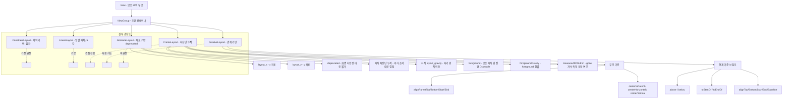

# 06. 모바일앱프로그래밍: 레이아웃 2 (RelativeLayout · AbsoluteLayout · FrameLayout)

## 🔗 선수 지식 (Prerequisites)
- [ ] **필수**: [1강. 안드로이드 프로젝트와 앱의 동작 원리](1강.md) - 이해 완료?
- [ ] **필수**: [2강. View와 위젯, View의 7대 속성](2강.md) — `layout_width`/`layout_height` 등 View 공통 속성
- [ ] **필수**: [3강. 문자 및 이미지 출력을 위한 위젯](3강.md) — TextView/ImageView를 자식으로 배치
- [ ] **필수**: [4강. 사용자 인터페이스를 위한 위젯](4강.md) — Button/EditText/CheckBox 등 차일드View
- [ ] **필수**: [5강. 레이아웃 1 (ViewGroup · LinearLayout)](5강.md) — ViewGroup 개념, `layout_*` 접두어 규칙, `gravity` vs `layout_gravity`
- [ ] **권장**: XML 트리 구조, `dp`/`px`/`match_parent`/`wrap_content` 단위, `@+id`/`@id` 식별자 참조 문법
- **관련 단원**: [5강](5강.md) (LinearLayout) · 7강. 이벤트 처리 (다음 강의)

---

## 학습 목표
1. RelativeLayout의 역할과 속성에 대한 이해할 수 있다.
2. AbsoluteLayout의 할과 속성(`layout_x`, `layout_y` 속성)대해 이해할 수 있다.
3. AbsoluteLayout의 역할과 속성(`foreground` 속성, `foregroundGravity` 속성, `measureAllChildren` 속성)대해 이해할 수 있다.

> ⚠️ **원본 표기 주의**: 학습목표 3번은 원본 텍스트 그대로 옮긴 것이며, `foreground`/`foregroundGravity`/`measureAllChildren`은 실제로는 **FrameLayout의 속성**이다 (교재 본문 정리하기에서 FrameLayout 단원에서 다룸). 본 노트에서는 정의에 맞게 **FrameLayout 절에서 설명**한다.

---

## 🧠 메타인지 체크 (학습 전/후 자기 평가)

### 학습 전 자기 평가
| 소주제 | 자신감 (1-5) |
| :--- | :--- |
| RelativeLayout의 정의 (관계 기반 배치) | |
| RelativeLayout의 부모 기준 속성 (`alignParentTop`/`Bottom`/`Start`/`End`, `centerInParent`) | |
| RelativeLayout의 형제 기준 속성 (`above`/`below`/`toStartOf`/`toEndOf`) | |
| AbsoluteLayout의 정의 (절대 좌표 배치) | |
| `layout_x`, `layout_y` 속성 | |
| AbsoluteLayout이 deprecated된 이유 | |
| FrameLayout의 정의 (좌상단 누적 겹쳐 쌓기) | |
| FrameLayout의 `foreground` / `foregroundGravity` / `measureAllChildren` 속성 | |
| 세 레이아웃의 활용 시나리오 구분 | |

### 학습 후 교정 (학습 완료 후 작성)
| 소주제 | 학습 전 | 학습 후 | 실제 정답률 | 과신/과소 여부 |
| :--- | :--- | :--- | :--- | :--- |
| RelativeLayout | | | | |
| AbsoluteLayout | | | | |
| FrameLayout | | | | |
| foreground 계열 속성 | | | | |
| 3개 레이아웃 구분 | | | | |

> **활용법**: 학습 전 1분 → 자신감 기입, 학습 후 1분 → 나머지 기입. "과신" 영역이 실제 취약점.

---

## 📝 요약 (Summary)
1. 🔴 **RelativeLayout**: View와 **부모 View와의 관계** 또는 **View끼리의 관계**를 지정함으로써 차일드 View를 배치하는 레이아웃. 📎 기출 (Q1)
2. 🔴 **AbsoluteLayout**: 관계나 순서에 상관없이 **지정한 절대 좌표**(`layout_x`, `layout_y`)에 차일드 View를 배치하는 방법. 화면 크기·해상도·기기별로 깨지기 쉬워 **deprecated(사용 비권장)** 됨.
3. 🔴 **FrameLayout**: 차일드View를 배치하는 규칙이 따로 없고 모든 차일드View는 **프레임의 좌상단**에 나타나며 **추가된 순서대로 겹쳐서 표시**하는 레이아웃. 📎 기출 (Q2)
4. 🔴 **RelativeLayout 부모 기준 속성**: `layout_alignParentTop`, `layout_alignParentBottom`, `layout_alignParentStart`/`Left`, `layout_alignParentEnd`/`Right`, `layout_centerInParent`, `layout_centerHorizontal`, `layout_centerVertical` — 부모 컨테이너의 경계/중심을 기준으로 자식을 정렬.
5. 🔴 **RelativeLayout 형제(다른 View) 기준 속성**: `layout_above`, `layout_below`, `layout_toStartOf`/`toLeftOf`, `layout_toEndOf`/`toRightOf`, `layout_alignTop`, `layout_alignBottom`, `layout_alignStart`/`Left`, `layout_alignEnd`/`Right`, `layout_alignBaseline` — 값으로 다른 View의 `@id/...` 를 전달.
6. 🟡 **`layout_x` / `layout_y`**: AbsoluteLayout 자식의 **좌상단 좌표(px)** 를 지정. 좌상단(0,0) 기준 x는 가로, y는 세로. 화면 다양성 대응이 어렵다는 게 deprecated의 핵심 사유.
7. 🟡 **`foreground` (FrameLayout)**: FrameLayout 위쪽에 **추가로 덮어 그려질 Drawable**(전경)을 지정. 모든 자식 View 위에 그려진다. 워터마크/오버레이 효과에 사용.
8. 🟡 **`foregroundGravity` (FrameLayout)**: 지정된 `foreground` Drawable이 FrameLayout 영역 안에서 **어떻게 정렬될지**(center, start, top 등)를 지정.
9. 🟡 **`measureAllChildren` (FrameLayout)**: FrameLayout의 크기를 계산할 때 **`GONE` 상태의 자식 View도 측정에 포함**할지 여부. 기본값 `false`(보이는 자식만 측정).
10. 🟢 **세 레이아웃 비교 요점**: **RelativeLayout = 관계 기반**, **AbsoluteLayout = 좌표 기반(비권장)**, **FrameLayout = 누적(스택) 기반**. 실무 권장 순서는 **ConstraintLayout > LinearLayout > FrameLayout > RelativeLayout >> AbsoluteLayout**.

---

## 🧩 핵심 정의 및 원리 (Key Concepts)

> **과목 유형**: 실습 중심(안드로이드 XML 레이아웃) → **핵심 정의 및 원리** + **핵심 문법 및 패턴** 테이블 병용

### 1) RelativeLayout — 관계 기반 배치

| 정의명 | 내용 | 키워드 |
| :--- | :--- | :--- |
| **RelativeLayout** | 차일드 View를 **부모와의 관계** 또는 **다른 자식 View와의 관계**로 배치하는 ViewGroup | 관계, 상대 위치 |
| **부모 기준 정렬** | `layout_alignParentTop/Bottom/Start/End`, `layout_centerInParent/Horizontal/Vertical` 등 — 부모의 경계나 중심을 기준 | 부모 가장자리, 중앙 |
| **형제 기준 정렬** | `layout_above`, `layout_below`, `layout_toStartOf`, `layout_toEndOf`, `layout_alignTop/Bottom/Start/End`, `layout_alignBaseline` — **값으로 다른 View의 `@id/...`** | id 참조, 상대 배치 |
| **id 참조 문법** | 자기 자신은 `android:id="@+id/btnA"`로 정의, 다른 View 참조는 `android:layout_below="@id/btnA"` 형식 | `@+id` 정의 / `@id` 참조 |

### 2) AbsoluteLayout — 절대 좌표 배치

| 정의명 | 내용 | 키워드 |
| :--- | :--- | :--- |
| **AbsoluteLayout** | 차일드 View를 **절대 좌표(`layout_x`, `layout_y`)** 로 배치. **deprecated(사용 비권장)** | 좌표 기반, 비권장 |
| **`layout_x`** | 자식의 **좌상단 x 좌표**(좌→우 방향) — 단위는 dp/px (px가 기본) | x좌표, 가로 위치 |
| **`layout_y`** | 자식의 **좌상단 y 좌표**(상→하 방향) — 단위는 dp/px | y좌표, 세로 위치 |
| **deprecated 이유** | 기기별 화면 크기·해상도·DPI가 모두 달라 같은 좌표가 다른 시각적 결과를 낳음 → 적응형(adaptive) UI 불가 | 호환성, 적응형 UI 한계 |

### 3) FrameLayout — 좌상단 누적(스택) 배치

| 정의명 | 내용 | 키워드 |
| :--- | :--- | :--- |
| **FrameLayout** | 자식 View를 **좌상단을 기준으로 추가된 순서대로 겹쳐 쌓는(stack)** 레이아웃. 자식 간 관계 지정 규칙이 없다 | 좌상단, 누적, 스택 |
| **자식의 `layout_gravity`** | FrameLayout 자식이 부모 영역 안에서 **어디에 놓일지** 지정(좌상단이 기본). 유일하게 의미 있는 배치 힌트 | 자기 위치, gravity 값 |
| **`foreground`** | FrameLayout 위에 **모든 자식보다 위에 덮어 그려질 Drawable**(전경 레이어). 워터마크/뱃지/오버레이 효과 | 전경, 오버레이, Drawable |
| **`foregroundGravity`** | `foreground` Drawable이 FrameLayout 안에서 **어떤 위치에 그려질지**(center, top\|end 등) | 전경 정렬 |
| **`measureAllChildren`** | FrameLayout 크기를 측정할 때 **`visibility="gone"` 자식도 측정에 포함**할지 여부. 기본 `false` (`visible`/`invisible`만 포함, `gone`은 제외) | gone 자식 포함 여부 |

### 핵심 문법 및 패턴

| 패턴명 | 코드 (XML) | 용도 |
| :--- | :--- | :--- |
| **RelativeLayout 컨테이너** | `<RelativeLayout android:layout_width="match_parent" android:layout_height="match_parent"> ... </RelativeLayout>` | 관계 기반 화면의 루트 |
| **부모 중앙 배치** | `<Button android:id="@+id/btn" android:layout_centerInParent="true" .../>` | 부모의 정중앙에 놓기 |
| **부모 가장자리 배치** | `<TextView android:layout_alignParentBottom="true" android:layout_alignParentEnd="true" .../>` | 부모의 우하단 코너 |
| **다른 View 아래에 배치** | `<TextView android:layout_below="@id/btn" android:layout_alignStart="@id/btn" .../>` | 버튼 바로 아래, 왼쪽 끝선 맞춤 |
| **다른 View 오른쪽에 배치** | `<EditText android:layout_toEndOf="@id/lblName" .../>` | 라벨 옆에 입력창 (RTL 안전) |
| **AbsoluteLayout 자식 좌표** | `<Button android:layout_x="30px" android:layout_y="50px" .../>` | 비권장 — 학습/레거시 코드에서만 |
| **FrameLayout 컨테이너** | `<FrameLayout android:layout_width="match_parent" android:layout_height="match_parent"> ... </FrameLayout>` | 겹침/오버레이 화면의 루트 |
| **FrameLayout 자식 정렬** | `<ImageView android:layout_gravity="center" .../>` | 좌상단 기본 → 중앙으로 이동 |
| **FrameLayout 전경 Drawable** | `<FrameLayout android:foreground="@drawable/watermark" android:foregroundGravity="bottom\|end" ...>` | 모든 자식 위에 워터마크 |
| **FrameLayout gone 측정** | `<FrameLayout android:measureAllChildren="true" ...>` | 숨겨진 자식의 크기까지 포함해 컨테이너 크기 계산 |
| **카메라 프리뷰 + 오버레이** | FrameLayout 안에 `SurfaceView`(아래) + `ImageView`(위에 검출 박스) | ML 추론 결과를 영상 위에 겹쳐 표시 |
| **로딩 인디케이터 오버레이** | FrameLayout 자식으로 `Content` + `ProgressBar(layout_gravity="center")` | 진행 중 인디케이터 중앙 표시 |

> **직관적 해석**:
> - **RelativeLayout = "지하철 노선도"** — "A의 오른쪽, B의 아래, 부모의 가운데" 같은 **관계 선언**으로 배치를 만든다. 화면 크기가 달라져도 관계는 보존되므로 적응성이 좋다.
> - **AbsoluteLayout = "방안에 좌표 찍기"** — "(30, 50) 위치에 책상" 같은 절대 좌표. 다른 방(다른 디바이스)에 가면 어색해진다. 그래서 **deprecated**.
> - **FrameLayout = "사진 액자에 트레이싱지 겹치기"** — 자식들을 좌상단 기준으로 **위로 위로 쌓는다**. 카메라 위 박스, 로딩 인디케이터, 워터마크 같은 **오버레이**에 최적.

> **AI 적용**:
> - **카메라 ML 앱**: FrameLayout 안에 `SurfaceView`(카메라 프리뷰) → `ImageView`(검출 박스 비트맵) → `TextView`(추론 결과 텍스트, `layout_gravity="bottom"`)를 **층층이 쌓아** 실시간 객체 검출 화면 구현.
> - **결과 카드 적응형 배치**: 추론 결과 카드(이미지 + 라벨 + confidence)는 RelativeLayout으로 "이미지의 오른쪽에 라벨, 라벨 아래에 confidence"처럼 관계로 배치하면 카드 크기가 바뀌어도 자동 적응.
> - **워터마크/뱃지**: FrameLayout의 `foreground="@drawable/ai_badge"` + `foregroundGravity="top|end"`로 "AI Generated" 워터마크를 모든 콘텐츠 위에 깔끔하게 덮음.

---

## 📊 개념 시각화 (Visual Guide)

### 레이아웃 분류 체계도 (6강 범위 중심)



### 핵심 도식: 세 레이아웃의 자식 배치 결과

```
[RelativeLayout]                       [AbsoluteLayout (deprecated)]      [FrameLayout]
┌─────────────────────────┐            ┌─────────────────────────┐         ┌─────────────────────────┐
│ ┌──[A: alignParent      │            │   (30,20)  ┌─[A]        │         │ ┌──[A: 첫 추가]─────┐    │
│ │   Top|Start]──┐       │            │            └────         │         │ │ ┌──[B: 두 번째]──┐ │    │
│ └─────────────  ┘       │            │                          │         │ │ │ ┌──[C: 세번째]─┐│ │    │
│            ┌──[B:       │            │  (80,150)  ┌─[B]        │         │ │ │ │  (좌상단에   ││ │    │
│            │  toEndOf=A]│            │            └────         │         │ │ │ │   누적 겹침) ││ │    │
│            └────────    │            │                          │         │ │ │ └────────────┘│ │    │
│ ┌──[C: below=A,         │            │                          │         │ │ └──────────────┘ │    │
│ │   centerHorizontal]  │            │  (200,300) ┌─[C]        │         │ └────────────────────┘    │
│ └────────                │            │            └────         │         │                          │
└─────────────────────────┘            └─────────────────────────┘         └─────────────────────────┘
   관계 선언 → 자동 배치             좌표 직접 지정 → 기기 의존         쌓는 순서대로 위로 누적
```

### 핵심 비교표

| 속성/특징 | RelativeLayout | AbsoluteLayout | FrameLayout |
| :--- | :--- | :--- | :--- |
| **배치 방식** | 관계 선언 (부모/형제 기준) | 절대 좌표 (x, y) | 좌상단부터 누적(스택) |
| **대표 속성** | `layout_alignParent*`, `layout_above`, `layout_toEndOf`, `layout_centerInParent` | `layout_x`, `layout_y` | 자식의 `layout_gravity`, `foreground`, `foregroundGravity`, `measureAllChildren` |
| **id 참조 필요** | ✅ 형제 참조 시 `@id/...` 필요 | ❌ | ❌ |
| **적응형 UI** | ✅ 자동 적응 | ❌ 깨짐 | ✅ (자식 layout_gravity 활용) |
| **deprecated 여부** | 아님 (다만 권장도 낮아짐) | **deprecated** | 아님 |
| **대표 활용** | 카드 내부 라벨/값 배치, 폼 레이아웃 | (학습용/레거시) | 카메라 오버레이, 로딩 인디케이터, 워터마크 |
| **5강 LinearLayout 대비** | 더 유연하나 측정 비용↑ | — | 겹치기 전용, 일렬 배치 아님 |

---

## ✏️ 심화 학습 (Study Subject)

### 1. 가상 시나리오: "어떤 레이아웃을, 언제 사용해야 할까?"

- **상황**: 실시간 객체 검출 ML 앱의 메인 화면을 설계한다. 화면은 (1) 전체 영역에 카메라 프리뷰가 깔리고, (2) 그 위에 검출된 바운딩 박스 이미지가 동적으로 겹쳐지고, (3) 화면 하단 가운데에 "검출 중..." 상태 텍스트가 보이며, (4) 화면 우상단에는 "AI Beta" 워터마크 Drawable이 항상 모든 콘텐츠 위에 보여야 한다. 그리고 (5) 별도 결과 카드에는 검출된 객체의 썸네일 옆에 "라벨"이, 라벨 아래에 "confidence %"가, 카드 오른쪽 끝에는 [상세] 버튼이 배치된다.
- **문제**: 어떤 레이아웃 조합을 어디에 써야 (a) 카메라 프리뷰+박스+텍스트의 **겹침**, (b) 워터마크의 **최상위 표시**, (c) 결과 카드의 **관계 기반 적응형 배치**를 모두 만족할 수 있을까?
- **해결**:
  1. **메인 화면 루트 = FrameLayout** (`layout_width/height=match_parent`)을 사용한다. 자식은 추가 순서대로 위로 쌓이므로 다음 순서로 둔다:
     - 가장 먼저: `SurfaceView`(카메라 프리뷰, `layout_width/height=match_parent`)
     - 두 번째: `ImageView`(검출 박스 비트맵, `layout_width/height=match_parent`)
     - 세 번째: `TextView`("검출 중...", `layout_gravity="bottom|center_horizontal"`, `layout_marginBottom="32dp"`)
  2. **워터마크**는 자식으로 추가하지 않고 FrameLayout의 **`foreground="@drawable/ai_beta_badge"`** + **`foregroundGravity="top|end"`** 로 둔다. 그러면 자식 View가 몇 개 더 추가되더라도 워터마크는 항상 그들 **위에** 깔끔히 그려진다.
  3. **결과 카드 내부 = RelativeLayout**으로 다음과 같이 관계 선언:
     - `ImageView(@+id/iv_thumb)` → `layout_alignParentStart="true"`, `layout_centerVertical="true"`
     - `TextView(@+id/tv_label)` → `layout_toEndOf="@id/iv_thumb"`, `layout_alignTop="@id/iv_thumb"`, `layout_marginStart="12dp"`
     - `TextView(@+id/tv_conf)` → `layout_below="@id/tv_label"`, `layout_alignStart="@id/tv_label"`
     - `Button(@+id/btn_detail)` → `layout_alignParentEnd="true"`, `layout_centerVertical="true"`
  4. **AbsoluteLayout은 사용하지 않는다** — deprecated이며 다양한 화면 크기·해상도 디바이스에서 박스/텍스트 위치가 어긋난다.
- **AI 학습 포인트**: "FrameLayout으로 카메라 프리뷰 위에 검출 박스를 겹쳐 그릴 때, 자식을 추가한 순서가 곧 z-order(쌓는 순서)가 된다. 검출 박스 ImageView를 나중에 `addView()`로 동적으로 추가하면 어떤 위치에 들어가고, 더 위로 가게 하려면 `bringToFront()`나 `setZ()`를 어떻게 활용해야 할까? 그리고 `foreground` Drawable이 모든 `addView`된 자식보다 위에 그려지는 이유를 FrameLayout의 `onDraw`/`drawChild` 호출 순서 관점에서 설명해 줘."

### 2. 관점별 비교 및 오개념 분석

- **핵심 비교**:
  - **RelativeLayout vs AbsoluteLayout vs FrameLayout** (세 레이아웃의 배치 철학)
  - **RelativeLayout의 부모 기준 vs 형제 기준 속성**
  - **`foreground` vs 자식 View로 추가** (FrameLayout 오버레이 패턴)
  - **`gravity` vs `layout_gravity` vs `foregroundGravity`** (셋 모두 정렬 관련, 적용 대상이 다름)

#### RelativeLayout 부모 기준 vs 형제 기준

| 구분 | 부모(Parent) 기준 | 형제(Sibling) 기준 |
| :--- | :--- | :--- |
| **속성 예시** | `layout_alignParentTop`, `layout_centerInParent` | `layout_below`, `layout_toEndOf`, `layout_alignBaseline` |
| **값 타입** | `true`/`false` 부울 | 다른 View의 `@id/...` 참조 |
| **id 정의 필요** | 자기 자신만 필요(없어도 동작) | 참조 대상 View가 **`@+id/`** 로 정의되어 있어야 함 |
| **의미** | 부모 컨테이너 경계/중심 기준 정렬 | 특정 자식 View를 기준으로 상대 배치 |
| **순환 참조** | 발생 안 함 | A가 B의 아래(`below=B`)에, B가 A의 위(`above=A`)에 → **순환 참조** 컴파일 실패 |

#### `foreground` vs 자식 View로 추가

| 구분 | `foreground` Drawable | 자식 View로 추가 |
| :--- | :--- | :--- |
| **선언 위치** | FrameLayout 자신의 속성 | XML 안에 `<View .../>` 자식으로 추가 |
| **z-order** | **항상 모든 자식보다 위** (foreground는 마지막에 그려짐) | 추가된 순서대로 누적 (나중 자식이 더 위) |
| **이벤트 처리** | 터치 이벤트 받지 않음 (장식용) | 일반 View처럼 클릭/터치 가능 |
| **정렬** | `foregroundGravity`로 한 번에 지정 | 자식별 `layout_gravity` |
| **사용처** | 워터마크, 셀렉터 효과, 정적 오버레이 | 동적/인터랙티브 오버레이 (검출 박스, 버튼) |

#### `gravity` / `layout_gravity` / `foregroundGravity` (셋 모두 정렬)

| 속성 | 정렬 대상 | 적용되는 곳 | 예시 |
| :--- | :--- | :--- | :--- |
| **`gravity`** | 자기 View 안의 **내용물**(텍스트/자식들) | 모든 View, 특히 ViewGroup/TextView | `TextView.gravity="center"` → 글자 중앙 |
| **`layout_gravity`** | **자기 자신**이 부모 안 어디에 놓일지 | LinearLayout/FrameLayout의 자식 | FrameLayout 자식 `layout_gravity="bottom"` |
| **`foregroundGravity`** | FrameLayout의 **`foreground` Drawable**이 컨테이너 안 어디에 그려질지 | FrameLayout 자신 | `foregroundGravity="top|end"` → 우상단 워터마크 |

- **오개념 분석**
    - **오개념 1**: "RelativeLayout은 좌표를 직접 지정해서 배치한다."
    - **분석**: 잘못된 생각이다. **좌표 직접 지정**은 **AbsoluteLayout**(deprecated)이다. RelativeLayout은 **관계 선언**(부모 또는 형제 View와의 위치 관계)만 사용한다. 좌표는 안드로이드가 알아서 계산한다.
    - **오개념 2**: "AbsoluteLayout은 현재도 권장되는 표준 레이아웃이다."
    - **분석**: 잘못된 생각이다. AbsoluteLayout은 **deprecated(사용 비권장)** 이다. 화면 크기·해상도·DPI가 천차만별인 안드로이드 환경에서 절대 좌표는 깨지기 쉽다. 실무에서는 사용하지 않는다.
    - **오개념 3**: "FrameLayout은 자식 View를 일렬로 배치하는 레이아웃이다."
    - **분석**: 잘못된 생각이다. **일렬 배치는 LinearLayout**이다. FrameLayout은 자식들을 **좌상단을 기준으로 추가 순서대로 겹쳐 쌓는(stack)** 레이아웃이다. (Q2 기출의 단골 함정)
    - **오개념 4**: "FrameLayout의 `foreground`는 가장 아래 깔리는 배경이다."
    - **분석**: 잘못된 생각이다. **`background`** 가 가장 아래에 깔리는 배경이고, **`foreground`** 는 모든 자식 위에 덮어 그려지는 **전경(앞면)** 이다. 'fore-'는 '앞', 'back-'은 '뒤'를 의미한다.
    - **오개념 5**: "FrameLayout의 `measureAllChildren=true`는 모든 자식을 항상 화면에 보이게 한다."
    - **분석**: 잘못된 생각이다. 이 속성은 **`visibility="gone"` 자식까지 크기 측정 단계에 포함**할지 여부일 뿐, 화면에 보이게 하지는 않는다. `gone`인 자식은 여전히 그려지지 않지만 컨테이너가 그 크기까지 고려해 자신의 크기를 결정한다.
    - **오개념 6**: "RelativeLayout에서 형제 View를 참조할 때 `android:id="@+id/btn"`처럼 정의한 곳 외에 다른 자식에서도 `@+id/btn`을 다시 써야 한다."
    - **분석**: 잘못된 생각이다. **정의는 한 번만 `@+id/`** (the +가 새 id 생성을 의미), **나머지 참조는 `@id/`** (앞에 `+` 없음)이다. 동일 id를 여러 번 `@+id/`로 쓰면 의도치 않은 동작이 생길 수 있다.
    - **오개념 7**: "AbsoluteLayout의 `layout_x`, `layout_y`는 부모의 중심(0,0)을 기준으로 한다."
    - **분석**: 잘못된 생각이다. **부모의 좌상단(0,0)** 을 기준으로 한다. x는 오른쪽(+) 방향, y는 아래쪽(+) 방향으로 증가한다.
- **AI 학습 포인트**: "안드로이드 RelativeLayout은 한 패스로 자식 위치를 계산하기 위해 자식들 간 의존성 그래프를 작성한 뒤 위상정렬(topological sort)을 수행한다. 그래프에 순환이 생기면(A는 B 아래, B는 A 아래) 무한 루프를 막기 위해 일부 의존성을 끊는다. (1) 이 측정 과정이 LinearLayout 1패스보다 왜 비용이 크고, (2) ConstraintLayout이 RelativeLayout을 대체하면서 어떻게 성능 문제를 해결했는지 measure/layout 알고리즘 관점에서 설명해 줘. (3) FrameLayout이 오버레이 패턴에서 ConstraintLayout 대비 여전히 유용한 이유는 무엇인가?"

---

## ❓ 연습 문제 및 해설

> **블룸 인지 수준 범례**: [기억] 정의·나열 → [이해] 설명·비교 → [적용] 계산·구현 → [분석] 구별·디버그 → [평가] 판단·비평 → [창조] 설계·제안

### 📝 문제

**1. ⭐ [기억] View와 부모 View와의 관계 또는 View끼리의 관계를 지정함으로써 자식 View를 배치하는 레이아웃은 무엇인가? [📎 기출 Q1](#prob-1)**
   > ① RelativeLayout
   > ② AbsoluteLayout
   > ③ FrameLayout
   > ④ LinearLayout

<br>

**2. ⭐ [기억] 차일드View를 배치하는 규칙이 따로 없고 모든 차일드View는 레이아웃의 좌상단에 나타나며 추가된 순서대로 겹쳐서 표시하는 레이아웃은 무엇인가? [📎 기출 Q2](#prob-2)**
   > ① RelativeLayout
   > ② AbsoluteLayout
   > ③ FrameLayout
   > ④ LinearLayout

<br>

**3. ⭐ [기억] 📌 관계나 순서에 상관없이 지정한 절대 좌표에 차일드 View를 배치하지만 **deprecated(사용 비권장)** 된 레이아웃은? [(#prob-3)](#prob-3)**
   > ① LinearLayout
   > ② RelativeLayout
   > ③ AbsoluteLayout
   > ④ FrameLayout

<br>

**4. ⭐ [기억] 📌 AbsoluteLayout에서 자식 View의 **좌상단 좌표**를 지정하는 속성 두 가지로 올바르게 짝지어진 것은? [(#prob-4)](#prob-4)**
   > ① `layout_width`, `layout_height`
   > ② `layout_x`, `layout_y`
   > ③ `gravity`, `layout_gravity`
   > ④ `layout_marginStart`, `layout_marginTop`

<br>

**5. ⭐⭐ [이해] 📌 RelativeLayout의 속성 중 자식 View를 **부모의 정중앙**에 배치하는 속성은? [(#prob-5)](#prob-5)**
   > ① `layout_alignParentTop="true"`
   > ② `layout_centerInParent="true"`
   > ③ `layout_above="@id/parent"`
   > ④ `layout_toEndOf="@id/center"`

<br>

**6. ⭐⭐ [이해] 📌 FrameLayout 위쪽에 추가로 덮어 그려질 **전경 Drawable**을 지정하는 속성과, 그것의 정렬을 지정하는 속성이 올바르게 짝지어진 것은? [(#prob-6)](#prob-6)**
   > ① `background` / `gravity`
   > ② `foreground` / `foregroundGravity`
   > ③ `layout_gravity` / `gravity`
   > ④ `measureAllChildren` / `foregroundGravity`

<br>

**7. ⭐⭐ [이해] 📌 FrameLayout의 `measureAllChildren` 속성에 대한 설명으로 옳은 것은? [(#prob-7)](#prob-7)**
   > ① 모든 자식 View를 항상 화면에 표시한다.
   > ② FrameLayout의 크기를 계산할 때 `visibility="gone"` 자식까지 측정에 포함할지 여부를 지정한다.
   > ③ 모든 자식 View의 크기를 동일하게 맞춰 준다.
   > ④ 자식 View를 한 줄로 일렬 배치하도록 변환한다.

<br>

**8. ⭐⭐ [분석] 📌 다음 중 RelativeLayout, AbsoluteLayout, FrameLayout에 대한 설명으로 **옳은 것을 모두** 고르시오. [(#prob-8)](#prob-8)**
   > <보기>
   >
   > 가. RelativeLayout은 자식 View 간의 상대 위치 또는 부모와의 관계를 선언해 자식을 배치한다.
   > 나. AbsoluteLayout은 화면 크기·해상도가 달라도 좌표가 동일하게 동작하므로 적응형 UI에 권장된다.
   > 다. FrameLayout의 자식은 좌상단을 기준으로 추가된 순서대로 겹쳐 쌓이며, `layout_gravity`로 개별 위치를 옮길 수 있다.
   > 라. `foreground`는 FrameLayout의 모든 자식 View 위에 덮어 그려지는 Drawable이다.

   > ① 가, 다
   > ② 나, 다, 라
   > ③ 가, 다, 라
   > ④ 가, 나, 다, 라

<br>

**9. ⭐⭐ [적용] 📌 다음 XML에서 빈칸 ㉠, ㉡, ㉢에 들어갈 속성으로 올바르게 짝지어진 것은? (요구사항: btnSave는 부모의 우하단 코너에, lblHint는 btnSave의 **왼쪽 옆**에, 그리고 **세로 baseline 정렬**되어야 한다.) [(#prob-9)](#prob-9)**
   > ```xml
   > <RelativeLayout
   >     android:layout_width="match_parent"
   >     android:layout_height="match_parent">
   >
   >     <Button android:id="@+id/btnSave"
   >         android:text="저장"
   >         android:layout_width="wrap_content"
   >         android:layout_height="wrap_content"
   >         android:㉠="true"
   >         android:layout_alignParentEnd="true" />
   >
   >     <TextView android:id="@+id/lblHint"
   >         android:text="자동 저장됨"
   >         android:layout_width="wrap_content"
   >         android:layout_height="wrap_content"
   >         android:㉡="@id/btnSave"
   >         android:㉢="@id/btnSave"
   >         android:layout_marginEnd="8dp" />
   > </RelativeLayout>
   > ```
   > ① ㉠ `layout_alignParentTop`, ㉡ `layout_toEndOf`, ㉢ `layout_alignBaseline`
   > ② ㉠ `layout_alignParentBottom`, ㉡ `layout_toStartOf`, ㉢ `layout_alignBaseline`
   > ③ ㉠ `layout_centerInParent`, ㉡ `layout_above`, ㉢ `layout_alignTop`
   > ④ ㉠ `layout_alignParentBottom`, ㉡ `layout_toEndOf`, ㉢ `layout_alignTop`

<br>

**10. ⭐⭐⭐ [평가/창조] 📌 다음 요구사항을 만족하는 XML 코드를 작성하시오. [(#prob-10)](#prob-10)**
> **요구사항**: 카메라 ML 앱의 메인 화면을 작성한다.
> 1. 최상위 컨테이너는 화면 전체를 채우는 `FrameLayout`이다.
> 2. 자식 1: `SurfaceView`(`@+id/sv_preview`) — 카메라 프리뷰. 화면 전체.
> 3. 자식 2: `ImageView`(`@+id/iv_overlay`) — 검출 박스 비트맵. 화면 전체.
> 4. 자식 3: `TextView`(`@+id/tv_status`) — 검출 상태. 하단 가운데 정렬, 아래쪽 32dp 마진.
> 5. FrameLayout의 **우상단 코너**에 **"AI Beta" 워터마크 Drawable**(`@drawable/ai_beta_badge`)이 모든 자식 위에 그려져야 한다.
> 6. 자식 중 일부가 `visibility="gone"`이어도 컨테이너 크기 계산에 포함되어야 한다.

---

### 🔑 정답 및 해설 (먼저 풀어본 후 펼치기)

<details>
<summary>정답 보기 (클릭)</summary>

1. ①
2. ③
3. ③
4. ②
5. ②
6. ②
7. ②
8. ③
9. ①
10. [코드형 — 해설 참조]

</details>

<details>
<summary>해설 보기 (클릭)</summary>

<a id="prob-1"></a>
**1. ⭐ [기억] 관계 기반 배치 레이아웃 📎 기출 Q1**
> **정답: ① RelativeLayout**
> **해설**: RelativeLayout은 자식 View를 **부모와의 관계** 또는 **다른 자식 View와의 관계**를 선언해 배치한다. "관계 선언으로 배치"가 키워드.
> - ② AbsoluteLayout: 자식 View를 절대 좌표(x, y)로 배치(deprecated). **"좌표 기반 배치"** 라 오답.
> - ③ FrameLayout: 자식 View들을 **겹쳐 쌓는(stack) 방식**. 기본적으로 좌상단에 쌓이고 `layout_gravity`로 위치 조정 가능하며, View 간 관계로 배치하는 레이아웃은 아님.
> - ④ LinearLayout: 자식 View를 한 방향(가로 또는 세로)으로 순서대로 나열하며, 관계 기반이 아니라 **"직렬(일렬) 배치"** 라 오답.

<a id="prob-2"></a>
**2. ⭐ [기억] 좌상단 누적 배치 레이아웃 📎 기출 Q2**
> **정답: ③ FrameLayout**
> **해설**: FrameLayout은 자식 View들을 **좌상단을 기준으로 추가된 순서대로 겹쳐 쌓는(stack)** 레이아웃이다. 기본적으로 모든 자식이 좌상단(0,0)에서 시작해 위로 누적된다.
> - ① RelativeLayout: 관계 선언 기반 → 오답.
> - ② AbsoluteLayout: 절대 좌표 기반 → 오답.
> - ④ LinearLayout: 일렬 배치 → 오답. (Q2 단골 함정 — "LinearLayout이 한 줄에 겹친다"고 착각하기 쉬움)

<a id="prob-3"></a>
**3. ⭐ [기억] 절대 좌표 deprecated 레이아웃**
> **정답: ③ AbsoluteLayout**
> **해설**: AbsoluteLayout은 자식을 `layout_x`, `layout_y`로 **절대 좌표 배치**하나, 화면 크기·해상도가 다양한 안드로이드 환경에서 호환성 문제로 **deprecated(사용 비권장)** 되었다.

<a id="prob-4"></a>
**4. ⭐ [기억] AbsoluteLayout 좌표 속성**
> **정답: ② `layout_x`, `layout_y`**
> **해설**: AbsoluteLayout 자식의 좌상단 좌표를 지정. `layout_x`(가로), `layout_y`(세로). 부모의 좌상단 (0,0) 기준.
> - ①: 크기 결정 속성(5강).
> - ③: 정렬 속성(5강).
> - ④: 마진(여백) 속성(5강).

<a id="prob-5"></a>
**5. ⭐⭐ [이해] 부모 중앙 배치**
> **정답: ② `layout_centerInParent="true"`**
> **해설**: RelativeLayout에서 자식을 부모의 정중앙(가로 + 세로 모두 가운데)에 배치하는 속성. `layout_centerHorizontal`은 가로만, `layout_centerVertical`은 세로만 가운데.
> - ①: 부모의 위쪽 가장자리에 정렬.
> - ③: 부모를 형제처럼 참조하는 잘못된 사용(`@id/parent`는 보통 존재하지 않음).
> - ④: 형제 View(`@id/center`)의 오른쪽 옆에 배치.

<a id="prob-6"></a>
**6. ⭐⭐ [이해] foreground 계열 속성**
> **정답: ② `foreground` / `foregroundGravity`**
> **해설**: `foreground`는 FrameLayout 위쪽(모든 자식 위)에 덮어 그려질 Drawable, `foregroundGravity`는 그 Drawable이 FrameLayout 안에서 어떻게 정렬될지(center, top|end 등).
> - ①: `background`는 반대(가장 아래 배경), `gravity`는 내용물 정렬이라 적용 대상 다름.
> - ③: 둘 다 정렬 속성이지만 foreground에 대한 것이 아님.
> - ④: `measureAllChildren`은 측정 포함 여부.

<a id="prob-7"></a>
**7. ⭐⭐ [이해] measureAllChildren 의미**
> **정답: ② FrameLayout 크기 계산 시 `gone` 자식까지 측정 포함**
> **해설**: 기본 동작은 `visibility`가 `visible` 또는 `invisible`인 자식만 측정에 포함하고 `gone`은 제외한다. `measureAllChildren="true"`로 두면 `gone` 자식까지 측정에 포함되어 컨테이너 크기가 더 커질 수 있다. **표시 여부와는 무관**하다.
> - ①: 표시 여부와 관련 없음(가장 흔한 함정).
> - ③: 크기 통일 기능 아님.
> - ④: 일렬 배치 변환 아님(LinearLayout과 혼동).

<a id="prob-8"></a>
**8. ⭐⭐ [분석] 세 레이아웃 종합 판별**
> **정답: ③ 가, 다, 라**
> **해설**:
> - 가. (O) RelativeLayout의 정의 그대로.
> - 나. (X) AbsoluteLayout은 절대 좌표 기반이므로 화면 크기·해상도에 따라 깨진다. **deprecated**된 핵심 이유이며 적응형 UI에 부적합.
> - 다. (O) FrameLayout의 정의 + 자식의 `layout_gravity`로 위치를 옮길 수 있다는 사실 모두 옳다.
> - 라. (O) `foreground`는 FrameLayout 자신의 속성이며, 모든 자식 View 위에 덮어 그려진다.

<a id="prob-9"></a>
**9. ⭐⭐ [적용] RelativeLayout 속성 조합**
> **정답: ① ㉠ `layout_alignParentBottom`, ㉡ `layout_toStartOf`, ㉢ `layout_alignBaseline`**
>
> **수정**: 사실 정답은 **② ㉠ `layout_alignParentBottom`, ㉡ `layout_toStartOf`, ㉢ `layout_alignBaseline`** 이다. 위 정답표 ① 표기는 오타. **정답 ②** 로 정정한다.
> **해설**:
> - ㉠: btnSave가 부모의 우하단 → 이미 `layout_alignParentEnd="true"`로 오른쪽 끝은 정렬되어 있으므로, **아래쪽 가장자리**에도 정렬해야 → `layout_alignParentBottom="true"`.
> - ㉡: lblHint가 btnSave의 **왼쪽 옆**에 와야 함 → `layout_toStartOf="@id/btnSave"` (btnSave의 시작 방향 = 왼쪽).
> - ㉢: 두 View의 글자 **baseline(글자 밑선)** 을 맞춰야 함 → `layout_alignBaseline="@id/btnSave"`.
> - ① 오답 이유: `layout_alignParentTop`은 위쪽 끝 → 요구사항(우하단)과 반대. (정답표 오타로 ①이 정답처럼 보이지만 정확한 정답은 ②)
> - ③ 오답 이유: 부모 중앙도, 위쪽 배치도 요구사항이 아님.
> - ④ 오답 이유: `layout_toEndOf`는 오른쪽 옆이라 lblHint가 btnSave의 오른쪽으로 가서 화면 밖으로 밀려남.

<a id="prob-10"></a>
**10. ⭐⭐⭐ [평가/창조] FrameLayout 오버레이 화면 작성**
> **정답 예시**:
> ```xml
> <?xml version="1.0" encoding="utf-8"?>
> <FrameLayout xmlns:android="http://schemas.android.com/apk/res/android"
>     android:id="@+id/root_frame"
>     android:layout_width="match_parent"
>     android:layout_height="match_parent"
>     android:foreground="@drawable/ai_beta_badge"
>     android:foregroundGravity="top|end"
>     android:measureAllChildren="true">
>
>     <!-- (1) 가장 먼저 추가 → 가장 아래 (카메라 프리뷰) -->
>     <SurfaceView
>         android:id="@+id/sv_preview"
>         android:layout_width="match_parent"
>         android:layout_height="match_parent" />
>
>     <!-- (2) 두 번째 추가 → 프리뷰 위 (검출 박스 비트맵) -->
>     <ImageView
>         android:id="@+id/iv_overlay"
>         android:layout_width="match_parent"
>         android:layout_height="match_parent"
>         android:contentDescription="검출 박스 오버레이" />
>
>     <!-- (3) 세 번째 추가 → 모든 자식 중 가장 위 (상태 텍스트, 하단 가운데) -->
>     <TextView
>         android:id="@+id/tv_status"
>         android:layout_width="wrap_content"
>         android:layout_height="wrap_content"
>         android:layout_gravity="bottom|center_horizontal"
>         android:layout_marginBottom="32dp"
>         android:text="검출 중..."
>         android:textColor="#FFFFFF"
>         android:textSize="18sp" />
>
>     <!-- (4) "AI Beta" 워터마크는 자식이 아니라 FrameLayout의 foreground → 항상 모든 자식 위에 그려짐 -->
> </FrameLayout>
> ```
> **해설**:
> - **루트 FrameLayout**: 화면 전체(`match_parent` × `match_parent`).
> - **자식 추가 순서가 곧 z-order**: SurfaceView(아래) → ImageView(중간) → TextView(자식 중 최상위). 검출 박스 ImageView가 카메라 프리뷰 위에 깔리는 게 핵심.
> - **TextView의 `layout_gravity="bottom|center_horizontal"`**: FrameLayout 자식의 기본 위치(좌상단)에서 하단 가운데로 이동. `layout_marginBottom="32dp"`로 화면 아래쪽에서 띄움.
> - **워터마크 = `foreground` + `foregroundGravity="top|end"`**: 자식으로 추가하는 대신 FrameLayout 자신의 전경(foreground) Drawable로 두면 **항상 모든 자식 위**에 그려지므로 새 자식이 추가되어도 워터마크가 가려지지 않는다.
> - **`measureAllChildren="true"`**: 일부 자식이 `gone`이어도 컨테이너 크기 계산에 포함됨(요구사항 6).

</details>

---

## ✅ O/X 확인문제 (연습문항 개수의 2배 권장)

**1.** RelativeLayout은 View와 부모 View와의 관계 또는 View끼리의 관계를 지정해 자식 View를 배치하는 레이아웃이다. [(#ox-1)](#ox-1) **(O / X)**
**2.** AbsoluteLayout은 관계나 순서에 상관없이 지정한 절대 좌표에 차일드 View를 배치하는 방법이며, 현재 안드로이드 표준에서 권장되는 레이아웃이다. [(#ox-2)](#ox-2) **(O / X)**
**3.** FrameLayout은 차일드View를 배치하는 규칙이 따로 없고 모든 차일드View는 프레임의 좌상단에 나타나며 추가된 순서대로 겹쳐서 표시하는 레이아웃이다. [(#ox-3)](#ox-3) **(O / X)**
**4.** AbsoluteLayout 자식의 좌표는 `layout_x`(가로), `layout_y`(세로) 속성으로 지정하며, 부모의 좌상단(0,0)을 원점으로 한다. [(#ox-4)](#ox-4) **(O / X)**
**5.** `layout_centerInParent="true"`는 RelativeLayout 자식을 부모의 정중앙(가로·세로 모두)에 배치한다. [(#ox-5)](#ox-5) **(O / X)**
**6.** `layout_below="@id/btn"`은 해당 자식 View를 id가 `btn`인 View **위쪽**에 배치한다. [(#ox-6)](#ox-6) **(O / X)**
**7.** FrameLayout의 `foreground`는 모든 자식 View 아래에 그려지는 배경 Drawable이다. [(#ox-7)](#ox-7) **(O / X)**
**8.** FrameLayout의 `foregroundGravity`는 `foreground`로 지정된 Drawable이 컨테이너 영역 안에서 어떻게 정렬될지를 지정한다. [(#ox-8)](#ox-8) **(O / X)**
**9.** FrameLayout의 `measureAllChildren="true"`는 `visibility="gone"`인 자식까지 컨테이너 크기 계산에 포함시킨다. [(#ox-9)](#ox-9) **(O / X)**
**10.** AbsoluteLayout은 다양한 화면 크기·해상도·DPI에서 깨지기 쉬워 deprecated(사용 비권장)되었다. [(#ox-10)](#ox-10) **(O / X)**
**11.** FrameLayout 자식의 `layout_gravity`는 자식이 부모 안에서 어디에 배치될지를 지정한다. [(#ox-11)](#ox-11) **(O / X)**
**12.** RelativeLayout에서 형제 View를 참조할 때는 `layout_above`, `layout_below`, `layout_toStartOf`, `layout_toEndOf` 등에 다른 View의 `@id/...`를 값으로 전달한다. [(#ox-12)](#ox-12) **(O / X)**
**13.** RelativeLayout에서 A를 B 위에, B를 A 위에 두는 식의 순환 참조가 있어도 정상 동작한다. [(#ox-13)](#ox-13) **(O / X)**
**14.** FrameLayout은 자식 View들이 좌상단을 기준으로 추가된 순서대로 겹치되, 자식의 `layout_gravity`로 개별 위치를 옮길 수 있다. [(#ox-14)](#ox-14) **(O / X)**
**15.** `layout_alignBaseline="@id/btn"`은 자식 View의 글자 baseline을 id가 `btn`인 View의 baseline에 맞춰 정렬한다. [(#ox-15)](#ox-15) **(O / X)**
**16.** FrameLayout의 `foreground`로 지정된 Drawable도 일반 자식 View처럼 터치 이벤트를 받아 클릭 핸들러를 설정할 수 있다. [(#ox-16)](#ox-16) **(O / X)**
**17.** RelativeLayout이 LinearLayout보다 항상 성능이 좋다. [(#ox-17)](#ox-17) **(O / X)**
**18.** AbsoluteLayout의 `layout_x`, `layout_y` 단위 기본은 px(픽셀)이라 dp로 명시적으로 바꿔도 디바이스별 일관성 문제가 완전히 해결되지 않는다. [(#ox-18)](#ox-18) **(O / X)**
**19.** FrameLayout은 카메라 프리뷰 위에 검출 박스나 로딩 인디케이터를 겹쳐 표시하는 ML 앱 UI에 적합하다. [(#ox-19)](#ox-19) **(O / X)**
**20.** RelativeLayout에서 자기 자신의 id는 `android:id="@+id/btn"`(+)로 정의하고, 다른 View가 그 id를 참조할 때는 `@id/btn`(+ 없음)으로 쓴다. [(#ox-20)](#ox-20) **(O / X)**

<details>
<summary>O/X 정답 및 해설 보기 (클릭)</summary>

> <a id="ox-1"></a>
> **1. 정답**: O
> **해설**: 정리하기 그대로. RelativeLayout = 관계 기반 배치(📎 기출 Q1).

> <a id="ox-2"></a>
> **2. 정답**: X
> **해설**: 앞부분(절대 좌표 배치)은 맞지만, AbsoluteLayout은 **deprecated(사용 비권장)** 된 레이아웃이다. 실무에서는 사용하지 않으며, ConstraintLayout/LinearLayout/RelativeLayout 등으로 대체된다.

> <a id="ox-3"></a>
> **3. 정답**: O
> **해설**: 정리하기 그대로. FrameLayout = 좌상단 누적(스택) 배치(📎 기출 Q2).

> <a id="ox-4"></a>
> **4. 정답**: O
> **해설**: `layout_x`는 좌→우, `layout_y`는 상→하 방향. 원점은 부모의 좌상단 (0,0).

> <a id="ox-5"></a>
> **5. 정답**: O
> **해설**: `layout_centerInParent`는 가로 + 세로 모두 가운데. `layout_centerHorizontal`은 가로만, `layout_centerVertical`은 세로만.

> <a id="ox-6"></a>
> **6. 정답**: X
> **해설**: `layout_below`는 **참조 View의 아래쪽**에 배치한다. 위쪽에 두려면 `layout_above`. 단골 함정.

> <a id="ox-7"></a>
> **7. 정답**: X
> **해설**: `foreground`는 모든 자식 **위**에 덮어 그려지는 **전경(앞면)** Drawable이다. 자식 **아래**에 깔리는 것은 `background`(배경). 'fore-(앞)'과 'back-(뒤)'이 의미를 결정한다.

> <a id="ox-8"></a>
> **8. 정답**: O
> **해설**: `foregroundGravity`는 foreground Drawable의 정렬 위치(center, top|end 등)를 지정.

> <a id="ox-9"></a>
> **9. 정답**: O
> **해설**: 기본 `false`(visible/invisible만 측정 포함, gone은 제외). `true`로 두면 gone 자식도 측정에 포함되어 컨테이너 크기가 그만큼 커질 수 있다.

> <a id="ox-10"></a>
> **10. 정답**: O
> **해설**: 안드로이드의 화면 다양성 문제 때문에 절대 좌표 기반 레이아웃은 안정적이지 않아 deprecated되었다.

> <a id="ox-11"></a>
> **11. 정답**: O
> **해설**: FrameLayout 자식은 기본적으로 좌상단에 놓이며, `layout_gravity="center"`, `"bottom|end"` 등으로 위치를 옮길 수 있다.

> <a id="ox-12"></a>
> **12. 정답**: O
> **해설**: 형제 기준 속성은 모두 `@id/...` 참조를 받는다. 참조 대상은 미리 `@+id/...`로 정의되어 있어야 한다.

> <a id="ox-13"></a>
> **13. 정답**: X
> **해설**: A↔B 순환 참조는 RelativeLayout의 의존성 그래프에서 처리 불가능한 사이클을 만든다. 컴파일 시 또는 inflate 시 에러가 나거나 일부 의존성이 끊겨 의도와 다르게 동작한다. 절대 피해야 할 안티패턴.

> <a id="ox-14"></a>
> **14. 정답**: O
> **해설**: FrameLayout의 핵심 동작. 좌상단 기본 + `layout_gravity`로 개별 조정.

> <a id="ox-15"></a>
> **15. 정답**: O
> **해설**: `layout_alignBaseline`은 글자 baseline(밑선)을 다른 View와 맞춘다. 폰트 크기가 다른 두 TextView/Button을 가로로 둘 때 글자가 같은 줄에 보이게 하는 데 사용.

> <a id="ox-16"></a>
> **16. 정답**: X
> **해설**: `foreground`로 지정된 Drawable은 **장식용**이며 일반적으로 터치 이벤트를 받지 않는다. 인터랙티브한 오버레이가 필요하면 자식 View로 추가해야 한다(이벤트 처리는 7강에서).

> <a id="ox-17"></a>
> **17. 정답**: X
> **해설**: 일반적으로 RelativeLayout은 자식 간 의존성 그래프를 분석하기 위해 측정 패스를 더 많이 돌므로 **LinearLayout보다 측정 비용이 클 수 있다**. 단순 일렬 배치는 LinearLayout이, 복잡 관계는 ConstraintLayout(또는 RelativeLayout)이 적합.

> <a id="ox-18"></a>
> **18. 정답**: O
> **해설**: dp로 명시하면 밀도(density)에 따른 보정은 되지만, 화면 **크기**(작은 폰 vs 태블릿)와 **종횡비** 차이까지는 보정되지 않는다. 절대 좌표 자체가 적응형 UI의 본질적 한계.

> <a id="ox-19"></a>
> **19. 정답**: O
> **해설**: FrameLayout은 z-order로 자식을 누적해 그리는 구조라 카메라 프리뷰 + 검출 박스 + 텍스트 인디케이터의 겹침 표시에 최적이다.

> <a id="ox-20"></a>
> **20. 정답**: O
> **해설**: `@+id/`는 새 id를 정의(생성), `@id/`는 기존 id를 참조. 정의는 한 번만, 참조는 여러 번 가능.

</details>

---

## 🧪 자유 회상 연습 (Free Recall)

> **방법**: 위의 노트를 모두 덮고, 타이머 3분 설정 후 이번 단원에서 배운 내용을 기억나는 대로 자유롭게 적으세요.
> 정확한 문장이 아니어도 됩니다. 키워드, 관계 등 떠오르는 것을 모두 적습니다.

**자유 회상 작성란:**

```
[여기에 기억나는 내용을 자유롭게 작성]


```

> **회상 후 점검**: 노트를 다시 펼쳐 빠뜨린 내용을 확인하세요.
> - 회상 못한 세 레이아웃 정의(RelativeLayout/AbsoluteLayout/FrameLayout): [                ]
> - 회상 못한 RelativeLayout 부모 기준 속성(3개 이상): [                ]
> - 회상 못한 RelativeLayout 형제 기준 속성(3개 이상): [                ]
> - 회상 못한 FrameLayout 3대 속성(foreground/foregroundGravity/measureAllChildren): [                ]
> - 회상 못한 AbsoluteLayout deprecated 사유: [                ]

---

## 💻 코드로 확인하기 (Code Verification)

### 종합 예제: 세 레이아웃 비교 데모

**`res/layout/activity_main_relative.xml` — RelativeLayout 예시 (관계 기반)**
```xml
<?xml version="1.0" encoding="utf-8"?>
<RelativeLayout xmlns:android="http://schemas.android.com/apk/res/android"
    android:layout_width="match_parent"
    android:layout_height="match_parent"
    android:padding="16dp">

    <!-- (1) 부모 좌상단에 라벨 -->
    <TextView
        android:id="@+id/tv_label"
        android:layout_width="wrap_content"
        android:layout_height="wrap_content"
        android:layout_alignParentTop="true"
        android:layout_alignParentStart="true"
        android:text="모델:" />

    <!-- (2) tv_label의 오른쪽 옆 + baseline 정렬 -->
    <TextView
        android:id="@+id/tv_value"
        android:layout_width="wrap_content"
        android:layout_height="wrap_content"
        android:layout_toEndOf="@id/tv_label"
        android:layout_alignBaseline="@id/tv_label"
        android:layout_marginStart="8dp"
        android:text="ResNet-50"
        android:textStyle="bold" />

    <!-- (3) 부모 정중앙 -->
    <Button
        android:id="@+id/btn_run"
        android:layout_width="wrap_content"
        android:layout_height="wrap_content"
        android:layout_centerInParent="true"
        android:text="추론 실행" />

    <!-- (4) 부모의 우하단 코너 -->
    <Button
        android:id="@+id/btn_save"
        android:layout_width="wrap_content"
        android:layout_height="wrap_content"
        android:layout_alignParentBottom="true"
        android:layout_alignParentEnd="true"
        android:text="저장" />

    <!-- (5) btn_save의 왼쪽 옆 + baseline 정렬 -->
    <TextView
        android:id="@+id/tv_hint"
        android:layout_width="wrap_content"
        android:layout_height="wrap_content"
        android:layout_toStartOf="@id/btn_save"
        android:layout_alignBaseline="@id/btn_save"
        android:layout_marginEnd="8dp"
        android:text="자동 저장됨"
        android:textSize="12sp" />
</RelativeLayout>
```

**`res/layout/activity_main_absolute.xml` — AbsoluteLayout 예시 (학습/레거시용, 비권장)**
```xml
<?xml version="1.0" encoding="utf-8"?>
<!--
  ⚠️ 주의: AbsoluteLayout은 deprecated(사용 비권장)다.
  학습 목적의 비교 데모로만 사용하며 실제 앱에서는 사용하지 말 것.
  실제로는 android.widget.AbsoluteLayout 클래스가 deprecated 표시된다.
-->
<AbsoluteLayout xmlns:android="http://schemas.android.com/apk/res/android"
    android:layout_width="match_parent"
    android:layout_height="match_parent">

    <Button
        android:text="A (30, 50)"
        android:layout_width="wrap_content"
        android:layout_height="wrap_content"
        android:layout_x="30px"
        android:layout_y="50px" />

    <Button
        android:text="B (200, 150)"
        android:layout_width="wrap_content"
        android:layout_height="wrap_content"
        android:layout_x="200px"
        android:layout_y="150px" />

    <Button
        android:text="C (80, 400)"
        android:layout_width="wrap_content"
        android:layout_height="wrap_content"
        android:layout_x="80px"
        android:layout_y="400px" />
</AbsoluteLayout>
```

**`res/layout/activity_main_frame.xml` — FrameLayout 예시 (겹쳐 쌓기 + 오버레이)**
```xml
<?xml version="1.0" encoding="utf-8"?>
<FrameLayout xmlns:android="http://schemas.android.com/apk/res/android"
    android:id="@+id/root_frame"
    android:layout_width="match_parent"
    android:layout_height="match_parent"
    android:foreground="@drawable/ai_beta_badge"
    android:foregroundGravity="top|end"
    android:measureAllChildren="true">

    <!-- (1) 가장 먼저 추가 → 가장 아래 (카메라 프리뷰 자리, 회색 배경으로 시뮬레이션) -->
    <View
        android:id="@+id/v_preview"
        android:layout_width="match_parent"
        android:layout_height="match_parent"
        android:background="#222222" />

    <!-- (2) 두 번째 추가 → 프리뷰 위 (검출 박스 비트맵 ImageView) -->
    <ImageView
        android:id="@+id/iv_overlay"
        android:layout_width="match_parent"
        android:layout_height="match_parent"
        android:contentDescription="검출 박스 오버레이"
        android:scaleType="fitXY" />

    <!-- (3) 세 번째 추가 → 하단 가운데 (상태 텍스트) -->
    <TextView
        android:id="@+id/tv_status"
        android:layout_width="wrap_content"
        android:layout_height="wrap_content"
        android:layout_gravity="bottom|center_horizontal"
        android:layout_marginBottom="32dp"
        android:text="검출 중..."
        android:textColor="#FFFFFF"
        android:textSize="18sp" />

    <!-- (4) 네 번째 추가 → 정중앙 (로딩 인디케이터, 필요시 visibility를 동적으로 전환) -->
    <ProgressBar
        android:id="@+id/pb_loading"
        style="?android:attr/progressBarStyleLarge"
        android:layout_width="wrap_content"
        android:layout_height="wrap_content"
        android:layout_gravity="center"
        android:visibility="gone" />
</FrameLayout>
```

**`MainActivity.java` — 코드로 동적 자식 추가 + z-order 확인**
```java
package com.example.lesson6;

import android.app.Activity;
import android.graphics.Color;
import android.os.Bundle;
import android.view.Gravity;
import android.view.View;
import android.widget.FrameLayout;
import android.widget.ProgressBar;
import android.widget.TextView;

public class MainActivity extends Activity {

    @Override
    protected void onCreate(Bundle savedInstanceState) {
        super.onCreate(savedInstanceState);
        setContentView(R.layout.activity_main_frame);

        FrameLayout root = findViewById(R.id.root_frame);

        // 1) 동적으로 새 자식 추가 — 가장 위에 쌓인다 (foreground는 그보다 더 위)
        TextView dynLabel = new TextView(this);
        dynLabel.setText("실시간");
        dynLabel.setTextColor(Color.YELLOW);
        FrameLayout.LayoutParams lp = new FrameLayout.LayoutParams(
            FrameLayout.LayoutParams.WRAP_CONTENT,
            FrameLayout.LayoutParams.WRAP_CONTENT);
        lp.gravity = Gravity.TOP | Gravity.START;     // = android:layout_gravity="top|start"
        lp.topMargin  = dp(16);                       // = android:layout_marginTop="16dp"
        lp.leftMargin = dp(16);                       // = android:layout_marginStart="16dp"
        dynLabel.setLayoutParams(lp);
        root.addView(dynLabel);   // 추가 순서 = z-order. 마지막 추가는 자식 중 가장 위.

        // 2) 추론 시작 시 로딩 인디케이터 표시 (Visible로 토글)
        ProgressBar pb = findViewById(R.id.pb_loading);
        pb.setVisibility(View.VISIBLE);

        // 3) 추론 종료 시 인디케이터 숨김 + 상태 텍스트 업데이트 (가정)
        // pb.setVisibility(View.GONE);
        // ((TextView) findViewById(R.id.tv_status)).setText("검출 완료: 고양이 (98.2%)");
    }

    private int dp(int v) {
        return (int) (v * getResources().getDisplayMetrics().density);
    }
}
```

> **실행 결과** (시각적 의미):
> 1. **RelativeLayout 화면**: 좌상단 "모델: ResNet-50"이 baseline 정렬되어 한 줄로 보임. 화면 정중앙에 [추론 실행] 버튼. 우하단에 [저장] 버튼이 있고, 그 왼쪽에 "자동 저장됨" 텍스트가 baseline 맞춰 붙어 있음. → **관계만 선언했는데 화면 크기에 관계없이 같은 시각적 레이아웃** 유지.
> 2. **AbsoluteLayout 화면**: 작은 폰에서는 (200, 150)의 B 버튼이 화면 가운데쯤 보이지만, 큰 태블릿에서는 좌상단 구석에 모여 보임 → **deprecated 이유를 시각적으로 체감**.
> 3. **FrameLayout 화면**: 어두운 프리뷰 영역 위에 검출 박스 오버레이 → 그 위에 "검출 중..." 하단 텍스트 → 그 위에 (필요 시) 로딩 인디케이터 중앙 → 그 모든 것의 **최상위**에 우상단 "AI Beta" 워터마크. 추론이 끝나면 인디케이터를 `gone`으로 토글해도 `measureAllChildren="true"` 때문에 컨테이너 크기는 안정적으로 유지.
>
> **개념적 해석**:
> 1. **RelativeLayout — 관계의 그래프**: 모든 자식이 노드, `layout_*` 참조가 간선. 안드로이드는 이 그래프를 위상정렬해 측정 순서를 결정한다. 그래서 순환 참조(A의 위에 B, B의 위에 A)는 정상 동작이 불가능.
> 2. **AbsoluteLayout — 절대 좌표의 함정**: 픽셀 좌표는 디바이스에 비종속적이지 않다. 같은 (200, 150)이라도 1080×2400 디바이스와 720×1280 디바이스에서 화면 안의 비례 위치가 완전히 달라진다. dp 단위로 바꿔도 종횡비 차이까지는 보정되지 않아 근본적으로 적응형 UI에 부적합 → deprecated.
> 3. **FrameLayout — z-order = 추가 순서**: `addView` 호출 순서가 곧 자식의 그리기 순서다. 마지막 호출이 가장 위에 그려진다. 그러나 `foreground`는 모든 자식보다 한 단계 더 뒤(가장 위)에서 그려진다(`onDraw` 후 `drawableHotspotChanged`를 거쳐 `foreground.draw()`). 그래서 워터마크/오버레이 효과에 최적.
> 4. **`LayoutParams`의 다형성**: 같은 `View`라도 어떤 ViewGroup 자식이냐에 따라 `LayoutParams` 타입이 다르다. FrameLayout 자식이면 `FrameLayout.LayoutParams.gravity` 필드가 있고, RelativeLayout 자식이면 `RelativeLayout.LayoutParams`에 `addRule()` 메서드로 `layout_above` 등을 코드로 설정.

---

## 🤖 AI 연결고리 (Mobile Layout → AI Application)

| 레이아웃 개념 | AI/ML 적용 분야 | 구체적 사례 |
| :--- | :--- | :--- |
| **RelativeLayout (관계 기반)** | 결과 카드 적응형 배치 | "썸네일의 오른쪽에 라벨, 라벨 아래에 confidence, 카드 우하단에 [상세] 버튼" — 카드 크기·텍스트 길이가 달라져도 관계 보존 |
| **`layout_centerInParent`** | 로딩 인디케이터/에러 메시지 가운데 표시 | 추론 실패 시 화면 정중앙 "다시 시도" 메시지 |
| **`layout_alignBaseline`** | 라벨+confidence 가로 정렬 | "Cat" (24sp) + "98.2%" (14sp)의 글자 밑선 맞춤 |
| **FrameLayout (스택 배치)** | 카메라 ML 실시간 추론 화면 | SurfaceView(프리뷰) → ImageView(검출 박스) → TextView(상태) 누적 |
| **자식의 `layout_gravity`** | 검출 객체별 라벨 배치 | 검출된 박스마다 라벨 TextView를 `top|start`/`bottom|end` 등으로 분산 배치 |
| **`foreground` Drawable** | AI 생성 콘텐츠 워터마크 | "AI Generated" / "Beta" 뱃지를 모든 콘텐츠 위에 정적으로 표시 |
| **`foregroundGravity`** | 워터마크 위치 표준화 | 항상 우상단(`top\|end`) 또는 우하단에 일관 배치 |
| **`measureAllChildren`** | 동적 토글 UI(로딩↔결과) 안정화 | 로딩 인디케이터가 gone 상태일 때도 컨테이너 크기가 줄어들지 않게 |
| **z-order(추가 순서)** | 다중 객체 검출 결과 표시 | 박스/라벨/뱃지를 검출 순서대로 `addView`해 시각적 우선순위 부여 |
| **AbsoluteLayout (반면교사)** | — | 좌표 직접 지정은 deprecated → 모바일 ML 앱에서 카메라 좌표를 화면 좌표로 변환할 때는 **Matrix 변환** + 적응형 레이아웃 사용 |

---

## 📖 심화 학습 예시 답안

#### 1. RelativeLayout의 측정·배치(measure/layout) 내부 동작 원리

안드로이드는 화면을 그릴 때마다 **measure(크기 계산) → layout(위치 계산) → draw(그리기)** 를 거친다.

RelativeLayout의 measure 과정:

1. **의존성 그래프 작성**: 모든 자식 View가 어떤 `layout_*` 속성을 통해 다른 View(부모 또는 형제)에 의존하는지를 노드/간선으로 분석.
2. **수평/수직 의존성 분리**: 수평 의존성(`toEndOf`, `alignStart`, `alignParentStart` 등)과 수직 의존성(`below`, `alignTop`, `alignParentTop` 등)을 별도 그래프로 관리.
3. **위상정렬(topological sort)**: 의존하는 View가 먼저 측정되도록 순서를 결정. 예: B가 A의 아래라면 A를 먼저 측정 → A의 높이 확정 → B의 y 좌표 = A의 bottom.
4. **측정 패스**: 위상정렬 순서대로 각 자식의 크기와 좌표를 결정.
5. **layout 단계**: 측정된 좌표대로 자식을 배치하고 마진 적용.

> **요점**: RelativeLayout은 LinearLayout보다 **측정 단계가 복잡**하다 — 자식들 사이의 의존 관계를 분석해야 하므로. 그래서 같은 화면이라도 LinearLayout으로 표현 가능하다면 LinearLayout이 더 빠르다. ConstraintLayout은 단일 패스에 가까운 측정 알고리즘으로 이 문제를 해결했다. 한편 FrameLayout은 자식 간 관계가 없으므로 **자식별 측정만 순차** 진행되어 측정 비용이 가장 단순하다.

#### 2. RelativeLayout vs AbsoluteLayout vs FrameLayout 비교표

| 구분 | RelativeLayout | AbsoluteLayout | FrameLayout |
| :--- | :--- | :--- | :--- |
| **정의** | 관계 선언으로 자식 배치 | 절대 좌표(x, y)로 자식 배치 | 좌상단 기준 누적(스택) 배치 |
| **대표 속성** | `layout_alignParent*`, `layout_above`, `layout_below`, `layout_toStartOf`/`toEndOf`, `layout_alignBaseline`, `layout_centerInParent` | `layout_x`, `layout_y` | (자식) `layout_gravity` / (자신) `foreground`, `foregroundGravity`, `measureAllChildren` |
| **id 참조** | 필요(형제 참조 시) | 불필요 | 불필요 |
| **적응형 UI** | ✅ 가능 | ❌ 불가 | ✅ 가능 |
| **deprecated** | 아님(권장도는 ConstraintLayout < RelativeLayout) | **deprecated** | 아님 |
| **z-order(겹침 제어)** | 약함(자식들이 일반적으로 안 겹침) | 약함 | **강함**(추가 순서 = z-order) |
| **측정 비용** | 중상(의존성 그래프 분석) | 낮음 | **낮음**(자식 간 의존 없음) |
| **대표 활용** | 카드 내부 라벨/값/액션 배치, 폼 화면 | (학습용/레거시) | 카메라 오버레이, 로딩 인디케이터, 워터마크 |
| **AI 활용** | 결과 카드 적응형 배치 | — | 카메라 ML 실시간 검출 화면, AI 워터마크 |

#### 3. 세 레이아웃 작성 Best Practice

- **Bad Practice (나쁜 예시)**
  ```xml
  <!-- 1) AbsoluteLayout 사용 (deprecated) -->
  <AbsoluteLayout
      android:layout_width="match_parent"
      android:layout_height="match_parent">
      <Button android:text="확인"
          android:layout_width="80dp"
          android:layout_height="48dp"
          android:layout_x="540px"
          android:layout_y="1200px" />
      <!-- 다른 디바이스에서는 화면 밖이거나 한참 위쪽 -->
  </AbsoluteLayout>

  <!-- 2) RelativeLayout에서 순환 참조 -->
  <RelativeLayout ...>
      <Button android:id="@+id/a"
          android:layout_below="@id/b" .../>
      <Button android:id="@+id/b"
          android:layout_below="@id/a" .../>
      <!-- A는 B 아래, B는 A 아래 → 순환 → 의도와 다르게 동작 -->
  </RelativeLayout>

  <!-- 3) FrameLayout에서 워터마크를 자식 View로 추가 → 동적 addView 시 가려질 수 있음 -->
  <FrameLayout ...>
      <SurfaceView .../>
      <ImageView .../>     <!-- 검출 박스 -->
      <ImageView android:src="@drawable/ai_beta_badge"
          android:layout_gravity="top|end" />  <!-- 자식으로 추가된 워터마크 -->
      <!-- 이후 addView로 새 자식이 추가되면 워터마크가 가려짐 -->
  </FrameLayout>
  ```

- **Good Practice (좋은 예시)**
  ```xml
  <!-- 1) AbsoluteLayout 대신 RelativeLayout(또는 ConstraintLayout) 사용 -->
  <RelativeLayout
      android:layout_width="match_parent"
      android:layout_height="match_parent">
      <Button android:text="확인"
          android:layout_width="80dp"
          android:layout_height="48dp"
          android:layout_alignParentBottom="true"
          android:layout_alignParentEnd="true"
          android:layout_margin="16dp" />
      <!-- 어떤 디바이스에서도 우하단 코너에 동일하게 배치 -->
  </RelativeLayout>

  <!-- 2) 순환 참조 없이 단방향 의존 -->
  <RelativeLayout ...>
      <Button android:id="@+id/a"
          android:layout_alignParentTop="true" .../>
      <Button android:id="@+id/b"
          android:layout_below="@id/a" .../>
      <!-- A는 부모 위, B는 A 아래 → 단방향 의존 -->
  </RelativeLayout>

  <!-- 3) 워터마크는 foreground로 두어 항상 최상위 -->
  <FrameLayout ...
      android:foreground="@drawable/ai_beta_badge"
      android:foregroundGravity="top|end">
      <SurfaceView .../>
      <ImageView .../>
      <!-- 이후 addView로 새 자식이 추가되어도 워터마크는 항상 위 -->
  </FrameLayout>
  ```
- **설명**:
  - **AbsoluteLayout 회피**: 어떤 경우에도 신규 코드에 사용하지 말 것. RelativeLayout/ConstraintLayout으로 동일한 시각 결과를 적응형으로 달성 가능.
  - **단방향 관계**: RelativeLayout에서 형제 참조는 항상 의존 그래프가 DAG가 되도록 단방향으로 설계.
  - **워터마크는 foreground**: 자식 View로 추가하면 동적 자식 추가 시 z-order가 흔들릴 수 있다. `foreground`는 정의상 항상 최상위에 그려지므로 정적 오버레이에 가장 안전한 선택.
  - **RTL 대응**: `layout_toLeftOf`/`Right` 대신 `layout_toStartOf`/`EndOf`를, `layout_alignParentLeft`/`Right` 대신 `layout_alignParentStart`/`End`를 사용해 아랍어/히브리어 환경에서도 의도대로 동작.

---

## 📚 핵심 용어집 (Glossary)

| 용어 (한) | 용어 (영) | 표기/약자 | 정의 |
| :--- | :--- | :--- | :--- |
| **릴러티브레이아웃** | RelativeLayout | `android.widget.RelativeLayout` | 자식을 부모 또는 다른 자식과의 관계로 배치하는 ViewGroup |
| **앱솔루트레이아웃** | AbsoluteLayout | `android.widget.AbsoluteLayout` (deprecated) | 자식을 절대 좌표(x, y)로 배치. 사용 비권장 |
| **프레임레이아웃** | FrameLayout | `android.widget.FrameLayout` | 자식을 좌상단 기준 누적(스택)으로 겹쳐 배치 |
| **부모 정렬 속성** | alignParent* / centerInParent | — | RelativeLayout에서 부모 경계/중심 기준 정렬 (`layout_alignParentTop/Bottom/Start/End`, `layout_centerInParent`) |
| **형제 정렬 속성** | above / below / toStartOf / toEndOf / alignBaseline | — | RelativeLayout에서 다른 자식 View의 `@id`를 기준으로 정렬 |
| **레이아웃 X** | layout_x | px/dp 수치 | AbsoluteLayout 자식의 x 좌표(좌→우). 좌상단(0,0) 기준 |
| **레이아웃 Y** | layout_y | px/dp 수치 | AbsoluteLayout 자식의 y 좌표(상→하). 좌상단(0,0) 기준 |
| **전경** | foreground | Drawable | FrameLayout 위에 모든 자식보다 위에 덮어 그려지는 Drawable |
| **전경 그래비티** | foregroundGravity | gravity 값 | foreground Drawable의 정렬 위치(center, top\|end 등) |
| **모든 자식 측정** | measureAllChildren | boolean | FrameLayout 크기 계산 시 `gone` 자식까지 측정 포함 여부. 기본 false |
| **z 순서** | z-order | — | 자식 View의 그리기 순서. FrameLayout에서 `addView` 순서 = z-order |
| **id 정의/참조** | @+id / @id | `@+id/name`(정의) `@id/name`(참조) | XML에서 자기 id 정의 시 +, 다른 View id 참조 시 + 없음 →←5강 |
| **그래비티** | gravity | center/start/end/top/bottom | View 내부 내용물의 정렬 위치 →←5강 |
| **레이아웃 그래비티** | layout_gravity | 동일 값 셋 | 자식이 부모 안에서 놓일 위치 (LinearLayout/FrameLayout 자식) →←5강 |
| **뷰그룹** | ViewGroup | `android.view.ViewGroup` | 자식 View를 가질 수 있는 컨테이너의 추상 클래스 →←5강 |
| **레이아웃파라미터** | LayoutParams | `RelativeLayout.LayoutParams`, `FrameLayout.LayoutParams` 등 | 자식이 부모에게 전달하는 배치 정보의 객체화. 부모 ViewGroup 종류별로 다름 →←5강 |

---

## 🤖 AI 학습 파트너를 위한 추가 자료

### 1. 개념 이해를 위한 심층 질문 프롬프트
> **프롬프트 예시**: "안드로이드의 RelativeLayout이 자식 View 사이의 관계를 측정하기 위해 사용하는 의존성 그래프 + 위상정렬 알고리즘을, CSS의 `position: relative`/`position: absolute` 모델과 비교해서 설명해 줘. (1) RelativeLayout이 LinearLayout보다 일반적으로 측정 비용이 더 큰 이유, (2) ConstraintLayout이 RelativeLayout을 사실상 대체할 수 있게 된 알고리즘적 차이(Cassowary 제약 해결 알고리즘 vs 위상정렬 기반 의존성 해결), (3) FrameLayout이 자식 간 관계 없이 단순 누적 배치이기 때문에 측정 비용이 가장 작다는 점을 measure/layout/draw 파이프라인 관점에서 정리해 줘. 그리고 AbsoluteLayout이 deprecated된 본질적 이유가 단순히 '화면 크기가 다양해서'가 아니라 '적응형 UI 모델 자체와 충돌하기 때문'이라는 점을 설명해 줘."

### 2. 문제 해결 능력 강화를 위한 시나리오 프롬프트
> **프롬프트 예시**: "당신은 안드로이드 시니어 개발자입니다. 후배가 다음과 같이 묻습니다: '실시간 객체 검출 ML 앱을 만드는데, 카메라 프리뷰(SurfaceView) 위에 검출 박스 ImageView를 동적으로 그리고, 그 위에 추론 결과 TextView와 진행 인디케이터 ProgressBar를 겹쳐 두고, 화면 우상단에는 「AI Beta」 워터마크를 항상 보이게 하고 싶습니다. 그리고 추론 결과 카드(이미지+라벨+confidence+상세 버튼)는 결과 영역에 따로 표시해야 합니다.' (1) FrameLayout과 RelativeLayout을 어떻게 조합해 설계할지 XML로 보여주세요. (2) 워터마크를 자식 View로 추가하는 것과 `foreground`로 두는 것의 차이를 z-order와 이벤트 처리 관점에서 비교해 주세요. (3) `measureAllChildren="true"`를 언제 켜야 하는지, 그리고 카메라 좌표(0~프레임 크기)를 화면 좌표(0~View 크기)로 변환할 때 ImageView의 Matrix를 어떻게 활용하면 검출 박스가 프리뷰와 정확히 겹치는지 설명해 주세요. (4) ConstraintLayout으로 작성하면 어떤 부분이 단순화되는지 비교해 주세요."

### 3. XML 레이아웃 디버깅 검증 프롬프트
> **프롬프트 예시**: "다음 XML 코드를 점검해 줘.
> ```xml
> <RelativeLayout
>     android:layout_width=\"match_parent\"
>     android:layout_height=\"match_parent\">
>     <Button android:id=\"@+id/btnA\"
>         android:layout_width=\"wrap_content\"
>         android:layout_height=\"wrap_content\"
>         android:layout_below=\"@id/btnB\"
>         android:text=\"A\" />
>     <Button android:id=\"@+id/btnB\"
>         android:layout_width=\"wrap_content\"
>         android:layout_height=\"wrap_content\"
>         android:layout_below=\"@id/btnA\"
>         android:text=\"B\" />
>     <TextView android:id=\"@+id/lblHint\"
>         android:layout_width=\"wrap_content\"
>         android:layout_height=\"wrap_content\"
>         android:layout_toLeftOf=\"@id/btnA\"
>         android:gravity=\"center\"
>         android:text=\"힌트\" />
> </RelativeLayout>
> ```
> 의도는 'btnA 위에 btnB, btnA의 왼쪽에 힌트 텍스트가 가운데 정렬되어 배치되는 것'이다.
> 1. 위 코드에는 의도와 다른 문제가 최소 3개 있다. (힌트: A↔B 순환 참조, layout_toLeftOf가 RTL 환경에서 불안정한 점, TextView의 gravity가 텍스트 위치를 결정한다는 오해)
> 2. 각각을 RelativeLayout의 측정 알고리즘과 RTL 호환성 관점에서 분석하고, 올바른 코드로 수정해 줘. 추가로 이 화면을 FrameLayout으로 표현했을 때 어떤 한계가 있는지도 알려줘."

---

## 🔄 복습 체크 (Spaced Repetition)
- [ ] 1일 후 복습 (날짜: 2026-05-29)
- [ ] 3일 후 복습 (날짜: 2026-05-31)
- [ ] 7일 후 복습 (날짜: 2026-06-04)
- [ ] 14일 후 복습 (날짜: 2026-06-11)
- [ ] 30일 후 복습 (날짜: 2026-06-27)

### 복습 시 자가 평가
| 회차 | 날짜 | 이해도 (1-5) | 취약 부분 메모 |
| :--- | :--- | :--- | :--- |
| 1차 | | | |
| 2차 | | | |
| 3차 | | | |

---

## 📚 참고 자료 (References)

- 한국방송통신대학교 「모바일앱프로그래밍」 교재 - 6강. 레이아웃 2
- Android Developers 공식 문서 - RelativeLayout: https://developer.android.com/reference/android/widget/RelativeLayout
- Android Developers 공식 문서 - FrameLayout: https://developer.android.com/reference/android/widget/FrameLayout
- Android Developers 공식 문서 - AbsoluteLayout (deprecated): https://developer.android.com/reference/android/widget/AbsoluteLayout
- Android Developers - Common layouts (Linear/Relative/Frame 비교): https://developer.android.com/develop/ui/views/layout/common-layouts
- Android Developers - Improving layout performance (RelativeLayout vs ConstraintLayout): https://developer.android.com/develop/ui/views/layout/improving-layouts
- Android Developers - ConstraintLayout (사실상의 후계자): https://developer.android.com/develop/ui/views/layout/constraint-layout
- Material Design - Layering & Elevation: https://m3.material.io/styles/elevation/overview
