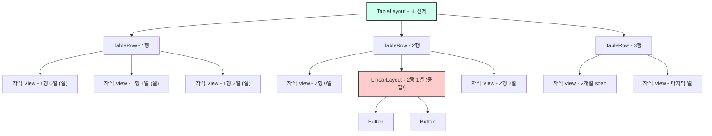
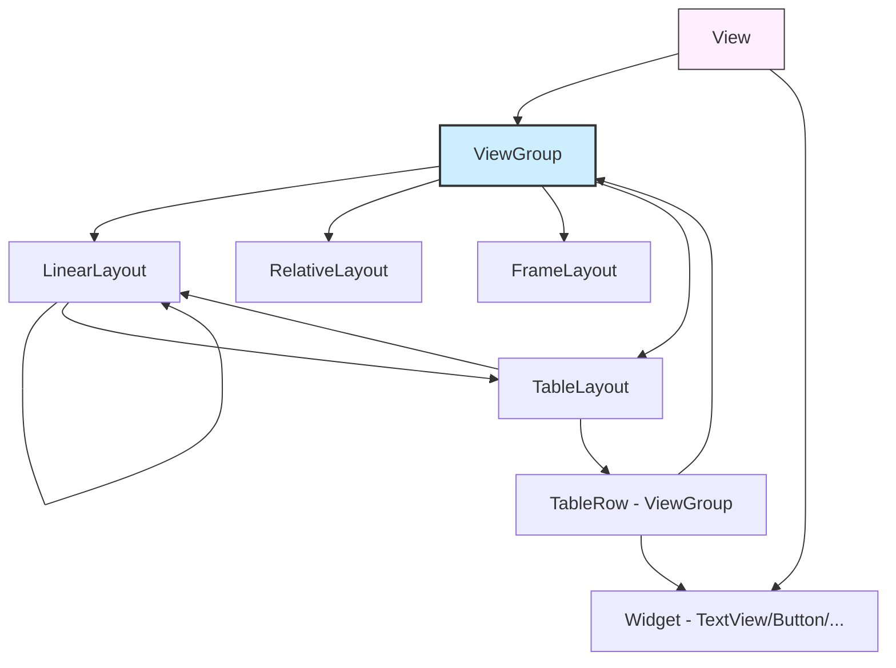

# 07. 모바일앱프로그래밍: 레이아웃 3 (TableLayout · 레이아웃 중첩 · Java 속성 변경)

## 🔗 선수 지식 (Prerequisites)
- [ ] **필수**: [1강. 안드로이드 프로젝트와 앱의 동작 원리](1강.md) — `R.id`, `findViewById`, XML→Java 연결
- [ ] **필수**: [2강. View와 위젯, View의 7대 속성](2강.md) — `layout_width`/`layout_height`, `padding`, `margin`, `gravity`
- [ ] **필수**: [3강. 문자 및 이미지 출력을 위한 위젯](3강.md) — TextView/ImageView 차일드 배치
- [ ] **필수**: [4강. 사용자 인터페이스를 위한 위젯](4강.md) — Button/EditText 등
- [ ] **필수**: [5강. 레이아웃 1 (ViewGroup · LinearLayout)](5강.md) — ViewGroup 개념, `orientation`, `layout_weight`
- [ ] **필수**: [6강. 레이아웃 2 (RelativeLayout · AbsoluteLayout · FrameLayout)](6강.md) — 다른 레이아웃과의 비교 기준
- [ ] **권장**: HTML `<table>`의 `<tr>`/`<td>` 구조 — 비유로 활용
- **관련 단원**: [5강](5강.md) (LinearLayout, 중첩 시 가장 흔히 결합) · 8강. 이벤트 처리 (다음 강의)

---

## 학습 목표
1. TableLayout의 개념과 차이점을 이해할 수 있다.
2. 레이아웃의 중첩과 뷰그룹간의 관계를 이해할 수 있다.
3. java 프로그램을 이용한 뷰 속성값의 변경하는 방법을 이해할 수 있다.

---

## 🧠 메타인지 체크 (학습 전/후 자기 평가)

### 학습 전 자기 평가
| 소주제 | 자신감 (1-5) |
| :--- | :--- |
| TableLayout의 정의 (표 형식 배치) | |
| TableLayout과 TableRow의 관계 (행=TableRow) | |
| 셀(cell)의 정의 (TableRow 안 자식 View 1개) | |
| `stretchColumns` / `shrinkColumns` / `collapseColumns` 속성 | |
| `layout_column` / `layout_span` 속성 | |
| 레이아웃 중첩의 가능성과 원리 (ViewGroup 계층) | |
| 중첩 레이아웃과 부모 `orientation`의 관계 | |
| Java로 View 속성 변경 (`setText`, `setTextColor`, `setOrientation` 등) | |
| `findViewById()` + `R.id.*`의 역할 | |

### 학습 후 교정 (학습 완료 후 작성)
| 소주제 | 학습 전 | 학습 후 | 실제 정답률 | 과신/과소 여부 |
| :--- | :--- | :--- | :--- | :--- |
| TableLayout 구조 | | | | |
| 레이아웃 중첩 | | | | |
| Java 런타임 속성 변경 | | | | |

> **활용법**: 학습 전 1분 → 자신감 기입, 학습 후 1분 → 나머지 기입. "과신" 영역이 실제 취약점.

---

## 📝 요약 (Summary)
1. 🔴 **TableLayout**: 표 형식으로 차일드를 배치하는 레이아웃. `TableLayout` 안에 여러 `TableRow`를 두고, 각 `TableRow` 안의 자식 View들이 열(column)을 형성한다. **행(row) = TableRow 1개**, **셀(cell) = TableRow 안의 자식 View 1개**.
2. 🔴 **레이아웃의 중첩**: 레이아웃(ViewGroup)은 View의 파생 클래스이므로, View로부터 파생된 **모든 ViewGroup과 위젯을 레이아웃 안에 중첩하여 배치**할 수 있다. (예: LinearLayout 안에 TableLayout, FrameLayout 안에 LinearLayout 등)
3. 🟡 **부모-자식 ViewGroup 관계**: 중첩된 레이아웃은 부모의 `orientation` 영향을 받아 "한 자식"으로 배치되고, 자기 내부 자식들은 자신의 `orientation`으로 배치한다. `setOrientation()`은 중첩되어도 그 LinearLayout 본인에 대해 정상 적용된다.
4. 🔴 **Java로 속성 변경(실행 중 변경)**: 뷰의 속성값은 XML에서 정적으로 지정하는 것 외에, 실행 중 Java 코드에서 `findViewById(R.id.xxx)`로 참조를 얻은 뒤 `setText()`, `setTextColor()`, `setOrientation()`, `setBackgroundColor()` 등 setter로 동적 변경할 수 있다.
5. 🟡 **TableLayout 핵심 속성**: `stretchColumns`(지정 열을 늘려 가용폭 채움), `shrinkColumns`(지정 열을 줄여 화면 안에 맞춤), `collapseColumns`(지정 열 숨김), `layout_column`(자식이 위치할 열 번호), `layout_span`(자식이 차지할 열 개수).
6. 🟢 **활용 시나리오**: 정렬된 표 형태 UI(설정 화면, 로그인 폼의 라벨/입력 쌍, 캘린더의 날짜 격자)에 TableLayout이 적합. 복잡한 UI는 거의 항상 중첩으로 구성된다.

---

## 📐 핵심 문법 및 패턴 (Key Syntax & Patterns) `→← 실습 중심 유형`

### TableLayout 관련 XML 속성/태그

| 패턴명 | 코드 | 용도 |
| :--- | :--- | :--- |
| **TableLayout 선언** | `<TableLayout ...> ... </TableLayout>` | 표 형식 레이아웃의 루트 컨테이너 |
| **TableRow 선언** | `<TableRow ...> <자식 .../> ... </TableRow>` | 표의 한 **행(row)** 정의. 자식들이 열(column)을 형성 |
| **늘릴 열 지정** | `android:stretchColumns="0,2"` | 0번·2번 열을 가용 폭을 채우도록 **확장** |
| **줄일 열 지정** | `android:shrinkColumns="1"` | 1번 열의 자식이 폭을 초과하면 **축소** |
| **숨길 열 지정** | `android:collapseColumns="3"` | 3번 열을 화면에 표시하지 않음 |
| **전체 열 지정 (`"*"`)** | `android:stretchColumns="*"` | `stretchColumns`/`shrinkColumns`/`collapseColumns`는 쉼표로 구분한 열 인덱스 목록 외에 `"*"`(별표)를 주면 **모든 열**에 적용된다. 근거: https://developer.android.com/reference/android/widget/TableLayout#attr_android:stretchColumns |
| **셀의 열 위치 지정** | `android:layout_column="2"` | 해당 자식을 2번 열에 배치(앞 열은 비움) |
| **셀의 열 병합** | `android:layout_span="2"` | 해당 자식이 2개 열을 차지(HTML colspan과 유사) |

### Java로 View 속성을 실행 중 변경하는 핵심 패턴

| 패턴명 | 코드 | 용도 |
| :--- | :--- | :--- |
| **View 참조 얻기** | `TextView tv = (TextView) findViewById(R.id.tv1);` | XML에 `android:id="@+id/tv1"`로 선언된 View를 Java에서 참조 |
| **텍스트 변경** | `tv.setText("Hello");` | TextView의 `android:text` 변경 |
| **글자색 변경** | `tv.setTextColor(Color.RED);` | TextView의 `android:textColor` 변경 |
| **배경색 변경** | `view.setBackgroundColor(Color.YELLOW);` | View 공통 `android:background` 변경 |
| **방향 변경** | `linear.setOrientation(LinearLayout.VERTICAL);` | LinearLayout의 `android:orientation` 변경 |
| **가시성 변경** | `view.setVisibility(View.GONE);` | `android:visibility` 변경 (VISIBLE/INVISIBLE/GONE) |
| **활성화 변경** | `btn.setEnabled(false);` | `android:enabled` 변경 |
| **크기 변경** | `tv.setTextSize(20);` | `android:textSize` 변경(sp 단위) |

### 핵심 정의/원리

**정의 1 — TableLayout의 "행"과 "셀"**
> TableLayout의 **행(row)**은 `TableRow` 1개를 의미하고, **셀(cell)**은 `TableRow` 안에 배치된 **자식 View 1개**를 의미한다. 따라서 셀 하나에 여러 위젯을 넣고 싶다면, 셀 자리에 `LinearLayout` 같은 ViewGroup을 한 번 더 넣고 그 안에 위젯들을 배치해야 한다.

**정의 2 — 레이아웃 중첩의 근거**
> 모든 레이아웃은 `ViewGroup`의 파생 클래스이고, `ViewGroup`은 `View`의 파생 클래스이다. ViewGroup은 자식으로 View를 가질 수 있으므로 (ViewGroup도 View이므로) **레이아웃 안에 다른 레이아웃을 자식으로 둘 수 있다** = 중첩 가능.

> **직관적 해석**: 레이아웃은 "쟁반"이고 View는 "그릇". 쟁반 위에 또 다른 쟁반을 올릴 수 있고, 그 위에도 그릇들을 올릴 수 있다. 이 재귀 구조가 복잡한 UI를 만드는 핵심.
>
> **AI 적용**: Android UI의 View 트리는 머신러닝의 **계층적 표현(Hierarchical Representation)**과 닮았다. 또한 자동 UI 생성(GPT-4V 기반 UI 코드 생성)에서 TableLayout/LinearLayout 중첩 구조는 자주 등장하는 패턴이며, 모델은 이 중첩 깊이를 출력 토큰 수로 변환한다.

---

## 📊 개념 시각화 (Visual Guide)

### TableLayout 구조 관계도


### 중첩 레이아웃의 분류 체계


### 핵심 도식 — XML → Java 매핑

| XML 속성 | Java setter | 대상 View | 예시 |
| :--- | :--- | :--- | :--- |
| `android:text` | `setText(CharSequence)` | TextView/Button/EditText | `tv.setText("OK")` |
| `android:textColor` | `setTextColor(int color)` | TextView 계열 | `tv.setTextColor(Color.RED)` |
| `android:textSize` | `setTextSize(float sp)` | TextView 계열 | `tv.setTextSize(20)` |
| `android:background` | `setBackgroundColor(int)` 또는 `setBackgroundResource(int)` | 모든 View | `v.setBackgroundColor(Color.YELLOW)` |
| `android:orientation` | `setOrientation(int)` | LinearLayout | `ll.setOrientation(LinearLayout.VERTICAL)` |
| `android:visibility` | `setVisibility(int)` | 모든 View | `v.setVisibility(View.GONE)` |
| `android:enabled` | `setEnabled(boolean)` | 모든 View | `btn.setEnabled(false)` |

---

## ✏️ 심화 학습 (Study Subject)

### 1. 가상 시나리오: "어떤 레이아웃을, 언제 사용해야 할까?"
- **상황**: "사용자 프로필 편집 화면"을 만들어야 한다. 화면 상단에는 "이름:[입력칸] / 이메일:[입력칸] / 전화:[입력칸]"처럼 **라벨과 입력 위젯이 좌우로 정렬된 3행**을 두고, 하단에는 가로로 나란히 놓인 "저장 / 취소" **2개 버튼**을 두어야 한다.
- **문제**: TableLayout 한 개로 모든 것을 표현할 수 있을까? 어디서 중첩이 필요한가?
- **해결**:
  - 상단 3행은 라벨/입력칸 2열의 표 구조 → **TableLayout + 3개 TableRow**로 표현 (각 TableRow에 TextView·EditText 2개).
  - 하단의 "저장/취소" 2개 버튼을 **표의 마지막 행에 한 셀로** 넣고 싶다면, "한 셀에 여러 View"는 불가하므로 **그 셀 자리에 가로 LinearLayout을 두고, 그 안에 2개 Button을 배치**한다(중첩!).
  - 또는 마지막 행의 자식 1개에 `layout_span="2"`로 2개 열을 차지시키고 그 자식을 가로 LinearLayout으로 둔다 → 정렬과 폭 활용이 한층 깔끔.
- **AI 학습 포인트**: "Jetpack Compose의 `Row`/`Column`/`Grid`가 같은 문제를 어떻게 더 간결하게 푸는지, 그리고 TableLayout이 ConstraintLayout/GridLayout 시대에도 여전히 살아남는 이유(짧은 XML, 명시적 행/열 모델)를 비교해 줘."

### 2. 관점별 비교 및 오개념 분석

- **핵심 비교 — TableLayout vs LinearLayout 중첩 vs GridLayout**:

| 항목 | TableLayout | LinearLayout 가로/세로 중첩 | GridLayout |
| :--- | :--- | :--- | :--- |
| 열 정렬 보장 | **자동** (열 폭은 행 간 공유) | 수동 (각 행의 폭/weight를 맞춰야 함) | **자동** (rowSpec/columnSpec) |
| `layout_weight` 사용 | TableRow 내 자식에 가능 | 핵심 도구 | 직접적 weight 없음 |
| 셀 병합 | `layout_span` | weight 합/wrap 트릭 | `columnSpec=GridLayout.spec(0,2)` |
| 빈 셀 건너뛰기 | `layout_column=N` | 빈 View 채워야 | spec 지정 |

- **오개념 분석**:
    - **오개념 1**: "TableLayout에서 `TableRow`는 **열(column)** 을 의미한다."
    - **분석**: 틀렸다. `TableRow`는 **행(row)** 이다. 한 `TableRow` 안에 배치되는 자식 View들이 결과적으로 **열 위치**를 형성한다. (📎 기출 Q1 ③ 함정)
    - **오개념 2**: "TableLayout의 한 셀에는 여러 자식 View를 직접 넣을 수 있다."
    - **분석**: 틀렸다. 한 셀(cell) = TableRow 안의 자식 View **1개**. 여러 View를 넣고 싶으면 그 자리에 LinearLayout 같은 ViewGroup을 끼우고 그 안에 넣어야 한다. (📎 기출 Q1 ① 함정)
    - **오개념 3**: "레이아웃은 View 계열이므로 레이아웃끼리 중첩 배치는 불가능하다."
    - **분석**: 틀렸다. 레이아웃은 ViewGroup이고, ViewGroup은 다른 View(레이아웃 포함)를 자식으로 가질 수 있으므로 **중첩 가능**하다. (📎 기출 Q2 ② 함정)
    - **오개념 4**: "레이아웃을 중첩하면 자식 레이아웃에는 `setOrientation()`이 적용되지 않는다."
    - **분석**: 틀렸다. `setOrientation()`은 그 LinearLayout **자신의 자식 배치 방향**을 정하는 메서드이고, 중첩 여부와 무관하게 정상 적용된다. 부모의 orientation은 "그 자식 레이아웃을 부모 안에서 어떻게 줄세울지"에만 영향. (📎 기출 Q2 ④ 함정)

- **AI 학습 포인트**: "RecyclerView/ConstraintLayout/Jetpack Compose가 보편화된 지금, TableLayout이 여전히 권장되는 사례와 권장되지 않는 사례를 각각 3가지씩 정리해 줘."

---

## ❓ 연습 문제 및 해설

> **블룸 인지 수준 범례**: [기억] 정의·나열 → [이해] 설명·비교 → [적용] 계산·구현 → [분석] 구별·디버그 → [평가] 판단·비평 → [창조] 설계·제안

### 📝 문제

**1. ⭐ [기억/이해] TableLayout에 대한 설명으로 옳은 것은? 📎 기출**[(해설)](#prob-1)
   > ① 셀에는 여러개의 차일드 View가 들어간다.
   > ② 표 형식으로 차일드 View를 배치하는 레이아웃이다.
   > ③ TableLayout은 TableRow 객체로 구성되며 TableRow 객체 하나가 표에서 열에 해당한다.
   > ④ TableRow 안에는 여러개의 행이 배치되며, 하나의 행을 셀이라고 한다.

<br>

**2. ⭐ [기억/이해] 레이아웃의 중첩에 대한 설명으로 옳은 것은? 📎 기출**[(해설)](#prob-2)
   > ① 레이아웃은 View의 컨테이너이므로 View로부터 파생된 모든 ViewGroup과 위젯을 레이아웃 안에 중첩하여 배치할 수 있다.
   > ② 레이아웃 자체도 View의 파생 클래스이므로 레이아웃끼리 중첩하여 배치하는 것이 불가능하다.
   > ③ 레이아웃을 중첩하면 중첩된 레이아웃은 부모 레이아웃의 orientation 영향을 받지 않는다.
   > ④ 레이아웃을 중첩하면 setOrientation 메소드는 적용되지 않는다.

<br>

**3. ⭐⭐ [적용/분석] 📌 TableLayout 속성 중, "1번 열을 화면 가용 폭에 맞게 늘려서 채우도록" 지정하는 속성으로 알맞은 것은?**[(해설)](#prob-3)
   > ① `android:shrinkColumns="1"`
   > ② `android:stretchColumns="1"`
   > ③ `android:collapseColumns="1"`
   > ④ `android:layout_column="1"`

<br>

**4. ⭐⭐ [적용/분석] 📌 다음 중 Java 코드로 TextView `tv`의 글자색을 빨간색으로 변경하는 올바른 호출은?**[(해설)](#prob-4)
   > <보기>
   >
   > 가. `tv.setText(Color.RED);`
   > 나. `tv.setTextColor(Color.RED);`
   > 다. `tv.setBackgroundColor(Color.RED);`
   > 라. `tv.setTextColor("#FF0000".toInt());`

   > ① 가
   > ② 나
   > ③ 가, 다
   > ④ 나, 라

<br>

**5. ⭐⭐ [분석] 📌 다음 XML 단편이 화면에 그리는 결과로 옳은 것은?**[(해설)](#prob-5)
   > ```xml
   > <TableLayout android:stretchColumns="1">
   >   <TableRow>
   >     <TextView android:text="이름"/>
   >     <EditText/>
   >   </TableRow>
   >   <TableRow>
   >     <TextView android:text="비밀번호"/>
   >     <EditText/>
   >   </TableRow>
   > </TableLayout>
   > ```
   > ① 2행 2열의 표가 그려지고 두 번째 열의 EditText들이 가로로 늘어남
   > ② 2행 2열의 표가 그려지고 첫 번째 열의 TextView들이 가로로 늘어남
   > ③ 1행 4열의 표가 그려짐
   > ④ TableRow 자체가 표시되지 않음

<br>

**6. ⭐⭐⭐ [창조] 📌 "이름/이메일" 두 행으로 구성된 TableLayout 아래에, "저장/취소" 2개의 Button을 가로로 나란히 배치하려고 한다. 단, 두 버튼은 표의 두 열을 모두 차지해야 한다. 활용 가능한 두 가지 XML 설계를 간단히 제시하고, 각각의 장단점을 1줄로 비교하라.**[(해설)](#prob-6)

<br>

**7. ⭐⭐⭐ [적용] 📌 XML에 `<Button android:id="@+id/btn1" android:text="누르기"/>` 가 있다. 이 버튼을 눌렀을 때 자신의 텍스트를 "눌림"으로 바꾸고, 배경색을 노란색으로 변경하는 핵심 Java 코드(`findViewById` 포함)를 작성하시오.**[(해설)](#prob-7)

---

### 🔑 정답 및 해설 (먼저 풀어본 후 펼치기)

<details>
<summary>정답 보기 (클릭)</summary>

1. ②
2. ①
3. ②
4. ②
5. ①
6. [풀이형 정답]
7. [풀이형 정답]

</details>

<details>
<summary>해설 보기 (클릭)</summary>

<a id="prob-1"></a>
**1. ⭐ [기억/이해] TableLayout 설명 옳은 것 📎 기출**
> **정답: ② 표 형식으로 차일드 View를 배치하는 레이아웃이다.**
> **해설**:
> - ① ✗ 셀에는 자식 View **1개**가 들어간다. 여러 개를 넣으려면 셀 자리에 ViewGroup(예: LinearLayout)을 끼우고 그 안에 넣어야 한다.
> - ② ✓ TableLayout의 정확한 정의.
> - ③ ✗ TableRow는 **행(row)** 에 해당한다. 열은 TableRow 안 자식들이 형성한다.
> - ④ ✗ "TableRow 안에 여러 행"은 모순. TableRow 안에는 **자식 View(=셀)** 들이 들어간다.

<a id="prob-2"></a>
**2. ⭐ [기억/이해] 레이아웃 중첩 옳은 것 📎 기출**
> **정답: ① 레이아웃은 View의 컨테이너이므로 View로부터 파생된 모든 ViewGroup과 위젯을 레이아웃 안에 중첩하여 배치할 수 있다.**
> **해설**:
> - ① ✓ 레이아웃(ViewGroup)은 View들을 담는 컨테이너. 다른 ViewGroup(=다른 레이아웃)·위젯(Button/TextView 등) 모두 자식으로 가능 → 중첩 가능.
> - ② ✗ "레이아웃도 View 계열"은 맞지만, **ViewGroup은 다른 View를 자식으로 가질 수 있으므로** 레이아웃끼리 중첩 배치가 가능.
> - ③ ✗ 중첩된 레이아웃이 "부모 안에서 어디에 놓일지"는 부모의 `orientation`(LinearLayout 기준)에 영향받는다. 내부 배치 방향만 자신의 `orientation`이 결정.
> - ④ ✗ `setOrientation()`은 해당 LinearLayout의 자식 배치 방향을 정하며, 중첩되어도 정상 적용.

<a id="prob-3"></a>
**3. ⭐⭐ [적용/분석] 📌 1번 열을 늘리는 속성**
> **정답: ② `android:stretchColumns="1"`**
> **해설**:
> - `stretchColumns`: 지정 열을 **가용 폭을 채우도록 확장**.
> - `shrinkColumns`: 지정 열을 **축소**(자식 폭이 부모를 초과할 때 줄임).
> - `collapseColumns`: 지정 열 **숨김**.
> - `layout_column`: 자식 View에 지정하는 속성으로 "이 자식이 N번 열에 위치"라는 의미 (TableLayout 자체 속성 아님).

<a id="prob-4"></a>
**4. ⭐⭐ [적용/분석] 📌 글자색 변경**
> **정답: ② 나**
> **해설**:
> - 가 ✗ `setText`는 텍스트 문자열을 바꾼다. `Color.RED`는 int여서 문자열로 표시되지만 색이 바뀌는 게 아님.
> - 나 ✓ `setTextColor(int)`가 글자색을 바꾸는 정규 setter.
> - 다 ✗ `setBackgroundColor`는 **배경색**을 바꾼다.
> - 라 ✗ `"#FF0000".toInt()`는 Kotlin 스타일이며, Java에서는 `Color.parseColor("#FF0000")`을 써야 한다. (질문이 Java 기준)

<a id="prob-5"></a>
**5. ⭐⭐ [분석] 📌 XML 결과 해석**
> **정답: ① 2행 2열의 표가 그려지고 두 번째 열의 EditText들이 가로로 늘어남**
> **해설**:
> - TableRow가 2개 → **2행**, 각 행에 자식 2개(TextView + EditText) → **2열**.
> - `stretchColumns="1"`은 **열 인덱스 1번**(두 번째 열, 0-based)을 가용 폭에 맞춰 확장한다. → EditText들이 가로로 늘어남.
> - ③ "1행 4열"은 TableRow 개수를 잘못 센 함정. ④ TableRow는 정상적으로 행을 만든다.

<a id="prob-6"></a>
**6. ⭐⭐⭐ [창조] 📌 두 버튼을 표 아래 두 열에 걸쳐 배치**
> **정답 예시 (두 가지 설계)**
> **설계 A — 표 안에 마지막 행으로 포함(`layout_span` 활용)**
> ```xml
> <TableLayout android:stretchColumns="1">
>   <TableRow><TextView android:text="이름"/><EditText/></TableRow>
>   <TableRow><TextView android:text="이메일"/><EditText/></TableRow>
>   <TableRow>
>     <LinearLayout
>         android:orientation="horizontal"
>         android:layout_span="2">
>       <Button android:text="저장" android:layout_weight="1"
>               android:layout_width="0dp" android:layout_height="wrap_content"/>
>       <Button android:text="취소" android:layout_weight="1"
>               android:layout_width="0dp" android:layout_height="wrap_content"/>
>     </LinearLayout>
>   </TableRow>
> </TableLayout>
> ```
>
> **설계 B — TableLayout 바깥에 LinearLayout으로 분리(루트는 세로 LinearLayout)**
> ```xml
> <LinearLayout android:orientation="vertical">
>   <TableLayout android:stretchColumns="1">
>     <TableRow><TextView android:text="이름"/><EditText/></TableRow>
>     <TableRow><TextView android:text="이메일"/><EditText/></TableRow>
>   </TableLayout>
>   <LinearLayout android:orientation="horizontal">
>     <Button android:text="저장" android:layout_weight="1"
>             android:layout_width="0dp" android:layout_height="wrap_content"/>
>     <Button android:text="취소" android:layout_weight="1"
>             android:layout_width="0dp" android:layout_height="wrap_content"/>
>   </LinearLayout>
> </LinearLayout>
> ```
>
> **장단점 비교(1줄)**
> - A: 표 구조 안에 통합되어 의미상 깔끔하지만 `layout_span` 때문에 정렬 디버깅이 까다롭다.
> - B: 구조가 명확·유연(버튼 폭과 표 열 폭이 독립)하나 표와 버튼 그룹의 종속 관계가 XML만 봐서는 덜 분명하다.

<a id="prob-7"></a>
**7. ⭐⭐⭐ [적용] 📌 클릭 시 텍스트/배경 변경 Java 코드**
> **정답 예시**
> ```java
> Button btn = (Button) findViewById(R.id.btn1);
> btn.setOnClickListener(new View.OnClickListener() {
>     @Override
>     public void onClick(View v) {
>         btn.setText("눌림");
>         btn.setBackgroundColor(Color.YELLOW);
>     }
> });
> ```
> **해설**:
> 1. `findViewById(R.id.btn1)`로 XML의 Button을 Java 참조로 가져온다.
> 2. `setOnClickListener`로 클릭 이벤트 콜백을 등록한다(8강에서 상세 학습).
> 3. 콜백 내부에서 `setText`와 `setBackgroundColor`로 속성을 동적 변경한다 → **"실행 중에 속성값을 변경하는 java 프로그램"** 의 전형적 형태.

</details>

---

## ✅ O/X 확인문제 (연습문항 개수의 2배 권장)

**1.** TableLayout의 행(row)은 `TableRow` 1개에 해당한다.[(해설)](#ox-1) **(O / X)**
**2.** TableLayout의 한 셀(cell)에는 여러 자식 View를 직접 배치할 수 있다.[(해설)](#ox-2) **(O / X)**
**3.** 레이아웃은 ViewGroup의 일종으로, 다른 레이아웃을 자식으로 가질 수 있다.[(해설)](#ox-3) **(O / X)**
**4.** `android:stretchColumns="0,2"`는 0번과 2번 열을 화면에서 숨긴다.[(해설)](#ox-4) **(O / X)**
**5.** `android:layout_span="2"`는 자식 View가 2개 열을 차지하게 한다.[(해설)](#ox-5) **(O / X)**
**6.** `setOrientation()`은 LinearLayout이 다른 레이아웃 안에 중첩되면 무시된다.[(해설)](#ox-6) **(O / X)**
**7.** `findViewById(R.id.xxx)`의 반환형은 항상 `View`이며 필요 시 캐스팅한다.[(해설)](#ox-7) **(O / X)**
**8.** `setBackgroundColor(int)`는 글자색을 바꾸는 메서드다.[(해설)](#ox-8) **(O / X)**
**9.** XML로 지정한 속성은 실행 중에 Java로 다시 변경할 수 없다.[(해설)](#ox-9) **(O / X)**
**10.** TableRow 안에서 `layout_column="2"`를 지정하면, 0·1번 열은 비워둔 채 자식 View가 2번 열에 놓인다.[(해설)](#ox-10) **(O / X)**
**11.** `collapseColumns`는 해당 열을 임시로 숨겨 화면에 표시하지 않는다.[(해설)](#ox-11) **(O / X)**
**12.** 중첩된 LinearLayout 내부 배치 방향은 자신의 `orientation`이 결정한다.[(해설)](#ox-12) **(O / X)**
**13.** `setVisibility(View.GONE)`은 View를 보이지 않게 할 뿐 아니라 레이아웃 공간도 차지하지 않게 한다.[(해설)](#ox-13) **(O / X)**
**14.** XML에서 `android:id="@+id/btn1"`로 선언하지 않은 View는 `findViewById`로 가져올 수 없다.[(해설)](#ox-14) **(O / X)**

<details>
<summary>O/X 정답 및 해설 보기 (클릭)</summary>

> <a id="ox-1"></a>
> **1. 정답**: O
> **해설**: TableRow 1개 = 표의 행 1개. 자식 View들이 그 안에서 열을 형성.

> <a id="ox-2"></a>
> **2. 정답**: X
> **해설**: 한 셀 = TableRow 안의 자식 View **1개**. 여러 위젯을 넣고 싶으면 ViewGroup을 한 단계 끼워야 함.

> <a id="ox-3"></a>
> **3. 정답**: O
> **해설**: 레이아웃은 ViewGroup의 파생 클래스이고, ViewGroup은 다른 View(레이아웃 포함)를 자식으로 가질 수 있음 → 중첩 가능.

> <a id="ox-4"></a>
> **4. 정답**: X
> **해설**: `stretchColumns`는 지정 열을 **늘려서 가용 폭 채움**. **숨김은 `collapseColumns`**.

> <a id="ox-5"></a>
> **5. 정답**: O
> **해설**: HTML의 `colspan`과 유사. 셀 병합.

> <a id="ox-6"></a>
> **6. 정답**: X
> **해설**: `setOrientation()`은 그 LinearLayout 자신의 자식 배치 방향을 정함. 중첩 여부와 무관하게 정상 작동.

> <a id="ox-7"></a>
> **7. 정답**: O (전통적 Java 기준)
> **해설**: 전통적 Java에서 `findViewById`는 `View` 반환이라 캐스팅 필요. **API 26(빌드툴/SDK 26, 2017)** 부터 시그니처가 제네릭 `<T extends View> T findViewById(int id)`로 변경되어, `compileSdk`/`targetSdk`가 26 이상이면 명시적 캐스팅을 생략할 수 있다. 교재는 전통적(캐스팅) 형태 기준으로 다룬다. 근거: https://developer.android.com/reference/android/app/Activity#findViewById(int)

> <a id="ox-8"></a>
> **8. 정답**: X
> **해설**: `setBackgroundColor`는 **배경색**. 글자색은 `setTextColor`.

> <a id="ox-9"></a>
> **9. 정답**: X
> **해설**: XML로 설정한 속성은 대응하는 setter(`setText`, `setOrientation` 등)로 실행 중 얼마든지 변경 가능. 이것이 7강 학습목표 3번의 핵심.

> <a id="ox-10"></a>
> **10. 정답**: O
> **해설**: `layout_column`은 자식이 들어갈 **열 인덱스(0-based)** 를 강제 지정. 앞 열은 비움.

> <a id="ox-11"></a>
> **11. 정답**: O
> **해설**: `collapseColumns="N"`은 N번 열을 화면에 그리지 않음. `setColumnCollapsed(int, boolean)`로 런타임 변경도 가능.

> <a id="ox-12"></a>
> **12. 정답**: O
> **해설**: 중첩된 자식 LinearLayout의 내부 자식 배치 방향은 **자신의 `orientation`** 이 결정. 부모의 orientation은 그 자식 LinearLayout 자체를 부모 안에 어떻게 배치할지에만 영향.

> <a id="ox-13"></a>
> **13. 정답**: O
> **해설**: `View.INVISIBLE`은 안 보이지만 공간 차지, `View.GONE`은 공간도 차지하지 않음. `View.VISIBLE`이 기본.

> <a id="ox-14"></a>
> **14. 정답**: O
> **해설**: id가 없으면 R.id에 등록되지 않아 `findViewById`로 참조 불가. Java로 속성을 동적 변경하려면 **id가 필수**.

</details>

---

## 🧪 자유 회상 연습 (Free Recall)

> **방법**: 위의 노트를 모두 덮고, 타이머 3분 설정 후 이번 단원에서 배운 내용을 기억나는 대로 자유롭게 적으세요.
> 정확한 문장이 아니어도 됩니다. 키워드, 수식, 관계 등 떠오르는 것을 모두 적습니다.

**자유 회상 작성란:**

```
[여기에 기억나는 내용을 자유롭게 작성]


```

> **회상 후 점검**: 노트를 다시 펼쳐 빠뜨린 내용을 확인하세요. 빠뜨린 부분이 실제 취약점입니다.
> - 회상 못한 핵심 개념: [                ]
> - 회상 못한 속성/setter: [                ]

---

## 💻 코드로 확인하기 (Code Verification)

### (1) TableLayout XML 전체 예시 — `res/layout/activity_main.xml`
```xml
<?xml version="1.0" encoding="utf-8"?>
<TableLayout xmlns:android="http://schemas.android.com/apk/res/android"
    android:layout_width="match_parent"
    android:layout_height="match_parent"
    android:stretchColumns="1"
    android:padding="16dp">

    <TableRow>
        <TextView android:text="이름"
                  android:padding="8dp"/>
        <EditText android:id="@+id/etName"
                  android:hint="이름을 입력"/>
    </TableRow>

    <TableRow>
        <TextView android:text="이메일"
                  android:padding="8dp"/>
        <EditText android:id="@+id/etEmail"
                  android:inputType="textEmailAddress"
                  android:hint="이메일을 입력"/>
    </TableRow>

    <!-- 셀에 여러 View를 넣고 싶으면 LinearLayout을 끼워 넣음 (중첩!) -->
    <TableRow>
        <LinearLayout
            android:layout_span="2"
            android:orientation="horizontal">
            <Button android:id="@+id/btnSave"
                    android:text="저장"
                    android:layout_weight="1"
                    android:layout_width="0dp"
                    android:layout_height="wrap_content"/>
            <Button android:id="@+id/btnCancel"
                    android:text="취소"
                    android:layout_weight="1"
                    android:layout_width="0dp"
                    android:layout_height="wrap_content"/>
        </LinearLayout>
    </TableRow>
</TableLayout>
```

### (2) Java로 속성 동적 변경 — `MainActivity.java`
```java
package com.example.layout3;

import android.app.Activity;
import android.graphics.Color;
import android.os.Bundle;
import android.view.View;
import android.widget.Button;
import android.widget.EditText;
import android.widget.LinearLayout;
import android.widget.TextView;
import android.widget.Toast;

public class MainActivity extends Activity {

    @Override
    protected void onCreate(Bundle savedInstanceState) {
        super.onCreate(savedInstanceState);
        setContentView(R.layout.activity_main);

        // 1. XML View → Java 참조
        final EditText etName  = (EditText) findViewById(R.id.etName);
        final EditText etEmail = (EditText) findViewById(R.id.etEmail);
        final Button btnSave   = (Button) findViewById(R.id.btnSave);
        final Button btnCancel = (Button) findViewById(R.id.btnCancel);

        // 2. 클릭 시 속성을 "실행 중" 변경
        btnSave.setOnClickListener(new View.OnClickListener() {
            @Override
            public void onClick(View v) {
                // text 변경
                btnSave.setText("저장됨");
                // 배경/글자색 변경
                btnSave.setBackgroundColor(Color.YELLOW);
                btnSave.setTextColor(Color.RED);
                // 다른 위젯 비활성화
                btnCancel.setEnabled(false);
                // 토스트 표시
                Toast.makeText(MainActivity.this,
                    "이름: " + etName.getText() + " / " + etEmail.getText(),
                    Toast.LENGTH_SHORT).show();
            }
        });
    }
}
```

> **실행 결과 (개념적)**:
> - 초기 화면: "이름/이메일" 2행 + 그 아래 "저장 / 취소" 2개 버튼이 가로로 등분 배치.
> - "저장" 클릭 시 ① 버튼 텍스트 "저장됨"으로 변경, ② 배경 노란색·글자 빨간색, ③ "취소" 버튼 비활성화, ④ 입력 내용 토스트 표시.
>
> **해석**:
> - XML(`activity_main.xml`)에서 정적 속성만 지정해도 화면은 그려진다 (7강 학습목표 1, 2 해당).
> - 동일 속성을 **Java setter로 실행 중에도 변경 가능**하다는 점이 학습목표 3번의 핵심.
> - TableRow 안에 LinearLayout을 자식으로 넣어 "한 셀에 여러 위젯"이라는 제약을 우회 → **중첩의 실용적 가치**.

---

## 🤖 AI 연결고리 (Concept → AI Application)

| 학습 개념 | AI/ML 적용 분야 | 구체적 사례 |
| :--- | :--- | :--- |
| 중첩 레이아웃 = 트리 구조 | View 트리 기반 UI 이해 모델 | Screen2Vec, UIBERT — Android UI hierarchy를 임베딩하여 자동 테스트/접근성 검수 |
| TableLayout = 격자 인덱싱 | 표/스프레드시트 이해 모델 | TaPas/TAPEX — 표 구조 입력을 SQL 질의로 변환 (행/열 인덱스 학습) |
| XML 속성 ↔ Java setter 매핑 | LLM 코드 변환 (UI → Code) | GPT-4V로 디자인 시안을 받아 Android XML과 호환 Java 코드 동시 생성 |
| `findViewById`로 ID 참조 | RAG의 retrieval-by-id | View ID = 문서 ID와 동형. 임베딩 검색 후 ID로 원본 조회 |
| `setVisibility(GONE)` | 적응형 UI / 강화학습 정책 | 사용자 행동에 따라 RL 에이전트가 View 가시성을 토글하는 동적 UI |

---

## 📖 심화 학습 예시 답안

#### 1. 중첩 레이아웃의 내부 동작 원리 — measure → layout → draw 3단계
View가 그려지기까지의 과정을 단계별로 살펴보면, 중첩 깊이가 성능에 미치는 영향을 이해할 수 있다.

1. **measure 단계**: 부모 ViewGroup이 자식의 `MeasureSpec`을 전달하며 `measure()`를 호출. 중첩이 깊을수록 이 호출이 트리 깊이만큼 재귀적으로 발생.
2. **layout 단계**: 측정된 크기를 바탕으로 부모가 자식의 `layout(left, top, right, bottom)`을 호출하여 위치를 확정. TableLayout은 모든 행을 측정한 뒤 **열 폭을 합의(공통 폭)** 한다 — 그래서 2-pass가 일어남.
3. **draw 단계**: 화면에 그리기. 트리 깊이가 깊으면 overdraw(같은 픽셀 여러 번 그리기) 위험 증가.

> 그래서 권장 트리 깊이는 보통 **10단계 이하**, 가능하면 ConstraintLayout으로 평탄화하라는 가이드가 나온 것이다.

#### 2. TableLayout vs LinearLayout(중첩) 비교표

| 구분 | TableLayout | LinearLayout 중첩 (세로 + 가로 N개) | 비고 |
| :--- | :--- | :--- | :--- |
| **정의** | `TableLayout > TableRow* > 자식 View*` (행/열) | `LinearLayout(vertical) > LinearLayout(horizontal)* > 자식 View*` | 외형은 유사 |
| **열 정렬 자동성** | **있음** (전 행이 같은 열 폭 공유) | **없음** (각 가로 LinearLayout이 독립적이라 weight를 손수 맞춰야 함) | TableLayout의 가장 큰 장점 |
| **유연성** | 행/열 모델에 제한 | 임의 그룹화 가능 | LinearLayout이 더 자유 |
| **셀 병합** | `layout_span` 지원 | 가능하나 `layout_weight` 계산이 필요 | TableLayout이 깔끔 |
| **AI 활용** | 데이터 표 UI 자동 생성 시 출력 토큰 ↓ | 자유 폼 UI 자동 생성에 적합 | LLM 코드 생성기 모두 지원 |

#### 3. 안드로이드 속성 동적 변경 Best Practice
학습한 setter 사용 패턴을 올바르게 작성하는 방법:

- **Bad Practice (나쁜 예시)**
  ```java
  // findViewById를 onClick 안에서 반복 호출 → 매 클릭마다 트리 탐색
  btn.setOnClickListener(new View.OnClickListener() {
      @Override public void onClick(View v) {
          ((TextView) findViewById(R.id.tv1)).setText("Hello");
          ((TextView) findViewById(R.id.tv1)).setTextColor(Color.RED);
          ((TextView) findViewById(R.id.tv1)).setBackgroundColor(Color.YELLOW);
      }
  });
  ```
- **Good Practice (좋은 예시)**
  ```java
  // onCreate에서 한 번만 참조를 캐시
  final TextView tv1 = (TextView) findViewById(R.id.tv1);
  btn.setOnClickListener(new View.OnClickListener() {
      @Override public void onClick(View v) {
          tv1.setText("Hello");
          tv1.setTextColor(Color.RED);
          tv1.setBackgroundColor(Color.YELLOW);
      }
  });
  ```
- **설명**: `findViewById`는 View 트리를 탐색하는 O(N) 연산. 이벤트마다 반복하면 응답성이 떨어진다. **참조는 한 번만 캐싱**하고 setter만 호출하는 것이 표준 패턴.

---

## 📚 핵심 용어집 (Glossary)

| 용어 (한) | 용어 (영) | 코드 표현 | 정의 |
| :--- | :--- | :--- | :--- |
| **테이블레이아웃** | TableLayout | `<TableLayout>` | 표 형식으로 자식 View를 배치하는 ViewGroup. 행/열 자동 정렬을 제공. |
| **테이블로우** | TableRow | `<TableRow>` | TableLayout의 자식 ViewGroup. 한 인스턴스가 표의 **한 행**을 의미. |
| **셀** | cell | TableRow의 자식 View 1개 | 표의 "행과 열이 만나는 칸". TableLayout에서는 TableRow 안 자식 View 한 개에 대응. |
| **열 확장 속성** | stretch columns | `android:stretchColumns="0,2"` | 지정한 열을 가용 폭에 맞게 늘림. |
| **열 축소 속성** | shrink columns | `android:shrinkColumns="1"` | 지정한 열을 줄여 화면 안에 맞춤. |
| **열 숨김 속성** | collapse columns | `android:collapseColumns="3"` | 지정한 열을 그리지 않음. 런타임 `setColumnCollapsed(int,boolean)`로도 토글. |
| **열 위치 지정** | column index | `android:layout_column="2"` | 자식이 위치할 0-based 열 인덱스. 앞 열은 비움. |
| **열 병합** | column span | `android:layout_span="2"` | 자식이 차지할 열 개수. (HTML colspan) |
| **레이아웃 중첩** | nested layout | `<Layout> ... <Layout>...</Layout> ... </Layout>` | ViewGroup이 ViewGroup을 자식으로 가지는 구조. 복잡한 UI의 기본 빌딩 블록. |
| **뷰그룹** | ViewGroup | `android.view.ViewGroup` | View의 컨테이너 역할을 하는 View의 파생 클래스. 모든 레이아웃의 상위 클래스. `→← 5강` |
| **findViewById** | findViewById | `findViewById(R.id.btn1)` | XML에서 `@+id`로 선언된 View를 Java 참조로 얻는 메서드. `→← 1강` |
| **R 클래스** | R class | `R.id.xxx`, `R.layout.xxx` | 빌드 시 자동 생성되는 리소스 식별자 클래스. `→← 1강` |
| **setter 메서드** | setter | `setText()`, `setOrientation()`, `setVisibility()` 등 | XML 속성과 1:1 대응되어 실행 중 속성을 변경하는 메서드. |
| **가시성** | visibility | `View.VISIBLE / INVISIBLE / GONE` | View의 표시 상태. `GONE`은 공간도 차지 않음. |

---

## 🤖 AI 학습 파트너를 위한 추가 자료

### 1. 개념 이해를 위한 심층 질문 프롬프트
> **프롬프트 예시**: "TableLayout의 핵심 원리(행/열 자동 정렬)를 초등학생도 이해할 수 있도록 'Excel 표'와 'HTML <table>' 비유로 설명해 줘. 또한 TableLayout이 없던 시절(LinearLayout 중첩만 있을 때) 어떤 문제가 있었는지, 그리고 왜 결국 GridLayout/ConstraintLayout이 더 인기를 끌게 되었는지 역사적 배경도 함께 알려줘."

### 2. 문제 해결 능력 강화를 위한 시나리오 프롬프트
> **프롬프트 예시**: "당신은 안드로이드 시니어 개발자입니다. '캘린더 월간 뷰(7열 × 6행 = 42칸)'를 만들어야 할 때 TableLayout, GridLayout, RecyclerView+GridLayoutManager, ConstraintLayout 중 어떤 것을 사용하는 것이 가장 적합할지, 각각의 장단점을 성능·유지보수·접근성 관점에서 비교하고 최종 선택과 그 기술적 이유를 설명해 줘."

### 3. 코드/설계 검증 프롬프트
> **프롬프트 예시**: "다음 XML이 의도한 '2행 3열의 표 + 두 번째 열만 가로로 늘어남'을 정확히 표현하는지 검증해 줘.
> ```xml
> <TableLayout android:stretchColumns="2">
>   <TableRow>
>     <TextView android:text="A"/><TextView android:text="B"/><TextView android:text="C"/>
>   </TableRow>
>   <TableRow>
>     <TextView android:text="D"/><TextView android:text="E"/><TextView android:text="F"/>
>   </TableRow>
> </TableLayout>
> ```
> 1. 의도와 일치하지 않는 부분이 있다면 지적하고 수정안을 제시해 줘.
> 2. 동일 결과를 ConstraintLayout으로도 작성한다면 어떻게 될지 비교해 줘."

---

## 🔄 복습 체크 (Spaced Repetition)
- [ ] 1일 후 복습 (날짜: 2026-05-30)
- [ ] 3일 후 복습 (날짜: 2026-06-01)
- [ ] 7일 후 복습 (날짜: 2026-06-05)
- [ ] 14일 후 복습 (날짜: 2026-06-12)
- [ ] 30일 후 복습 (날짜: 2026-06-28)

### 복습 시 자가 평가
| 회차 | 날짜 | 이해도 (1-5) | 취약 부분 메모 |
| :--- | :--- | :--- | :--- |
| 1차 | | | |
| 2차 | | | |
| 3차 | | | |

---

## 📚 참고 자료 (References)

- KNOU 교재 — 모바일앱프로그래밍 7강. 레이아웃 3 (TableLayout, 레이아웃 중첩, 실행 중 속성 변경)
- Android Developers — TableLayout 공식 문서 (https://developer.android.com/reference/android/widget/TableLayout)
- Android Developers — View / setter 메서드 레퍼런스 (`setText`, `setTextColor`, `setOrientation`, `setVisibility`, `setBackgroundColor`)
- Android Developers — 레이아웃 성능 가이드 (View hierarchy depth, ConstraintLayout 권장 사항)
