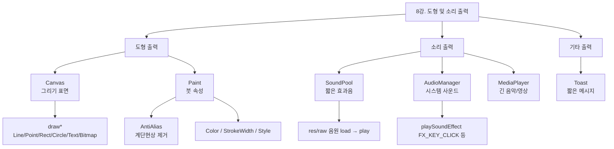

# 08. 모바일앱프로그래밍: 도형 및 소리 출력

## 🔗 선수 지식 (Prerequisites)
- [ ] **필수**: [4강. 화면 출력 (View, ViewGroup, Custom View)](4강.md) - View의 `onDraw()` 콜백 이해 완료?
- [ ] **필수**: [7강. 이벤트 처리](7강.md) - 사용자 입력 이벤트 처리 완료?
- [ ] **권장**: 안드로이드 리소스 폴더 구조 (`res/raw`, `res/drawable`) 이해
- [ ] **권장**: 그래픽스의 기본 좌표계 (좌상단 (0,0), 픽셀 단위)
- **관련 단원**: [9강. 데이터 저장](9강.md) (다음 강의)

---

## 학습 목표
1. 캔버스 객체의 속성 및 사용법을 이해한다.
2. 그리기 객체의 종류 및 사용법을 이해한다.
3. Toast 객체의 속성 및 사용법을 이해한다.

---

## 🧠 메타인지 체크 (학습 전/후 자기 평가)

### 학습 전 자기 평가
| 소주제 | 자신감 (1-5) |
| :--- | :--- |
| Canvas 객체와 onDraw()에서의 그리기 흐름 | |
| Paint 객체와 AntiAlias 설정 | |
| SoundPool로 효과음 재생 | |
| AudioManager로 시스템 사운드 사용 | |
| Toast로 짧은 메시지 출력 | |

### 학습 후 교정 (학습 완료 후 작성)
| 소주제 | 학습 전 | 학습 후 | 실제 정답률 | 과신/과소 여부 |
| :--- | :--- | :--- | :--- | :--- |
| Canvas와 onDraw() | | | | |
| Paint와 AntiAlias | | | | |
| SoundPool | | | | |
| AudioManager | | | | |
| Toast | | | | |

> **활용법**: 학습 전 1분 → 자신감 기입, 학습 후 1분 → 나머지 기입. "과신" 영역이 실제 취약점.

---

## 📝 요약 (Summary)
1. 🔴 **Canvas**: 뷰의 그리기 표면이며 이 위에 그림을 그림. 시스템이 초기화하여 View의 `onDraw(Canvas canvas)` 인수로 전달하므로 개발자가 직접 생성할 필요가 없으며, `drawLine()`, `drawPoint()`, `drawRect()`, `drawCircle()`, `drawText()`, `drawBitmap()` 등 다양한 도형/문자/이미지를 그릴 수 있다.
2. 🔴 **Antialiasing(AntiAlias)**: 이미지의 외곽선이 곡선으로 된 경우, 계단식 모서리(jagged edge, 계단현상)가 나타나는데, 이것을 부드럽게 만들어 곡선으로 보이게 하는 렌더링 기술. Paint 객체의 `setAntiAlias(true)` 또는 생성자 플래그 `Paint.ANTI_ALIAS_FLAG`로 활성화한다.
3. 🔴 **Paint**: Canvas 위에 무엇을(도형/텍스트/이미지) 어떻게 그릴지(색상, 굵기, 스타일, 안티앨리어싱 등)를 결정하는 "붓" 역할의 객체. `setColor()`, `setStrokeWidth()`, `setStyle()`, `setAntiAlias()` 등이 핵심.
4. 🔴 **SoundPool**: 소리 파일을 프로젝트의 `res/raw` 폴더에 음원 파일을 미리 준비하고, `load()` 메소드와 `play()` 메소드를 이용하여 소리 파일을 실행함. 짧은 효과음(게임 효과음, 버튼 클릭음 등)에 최적화된 클래스.
5. 🟡 **AudioManager**: 출력 장비와 오디오를 관리하는 역할을 하며, 별도의 효과음 파일을 준비하지 않고도 시스템에서 제공하는 오디오 파일을 사용할 수 있다는 장점이 있음. 비프음, 키톤 등 `playSoundEffect()`, `loadSoundEffects()` 등을 제공.
   > 📌 **참고**: `loadSoundEffects()`는 시스템 사운드를 미리 메모리에 로드(예열)해 첫 재생 지연을 줄이는 보조 메소드일 뿐이며, `playSoundEffect()` 사용의 필수 전제조건은 아니다(미리 호출하지 않아도 `playSoundEffect()`는 동작한다). [근거: Android AudioManager#loadSoundEffects()](https://developer.android.com/reference/android/media/AudioManager#loadSoundEffects())
6. 🟡 **Toast**: 짧은 시간 동안 화면에 잠시 떴다가 사라지는 간단한 메시지 출력 위젯. `Toast.makeText(context, text, duration).show()` 패턴으로 호출하며, 별도의 UI를 차지하지 않아 알림용으로 적합.
7. 🟢 **MediaPlayer (참고)**: 길고 일반적인 음악/동영상 재생용. SoundPool과 달리 미리 디코딩하지 않으므로 효과음에는 부적합(지연 발생).

---

## 📐 핵심 문법 및 패턴 (Key Patterns)

| 패턴명 | 코드 | 용도 |
| :--- | :--- | :--- |
| **Canvas 받기** | `protected void onDraw(Canvas canvas) { ... }` | View 시스템이 자동으로 Canvas를 전달 (직접 생성 X) |
| **Paint 초기화** | `Paint p = new Paint(Paint.ANTI_ALIAS_FLAG);` | 안티앨리어싱이 켜진 Paint 생성 |
| **AntiAlias 별도 설정** | `paint.setAntiAlias(true);` | 기존 Paint에 안티앨리어싱 적용 |
| **선 그리기** | `canvas.drawLine(x1, y1, x2, y2, paint);` | (x1,y1) ~ (x2,y2) 직선 |
| **점 그리기** | `canvas.drawPoint(x, y, paint);` | 단일 점 |
| **사각형** | `canvas.drawRect(left, top, right, bottom, paint);` | 사각형 (Style.FILL/STROKE 적용) |
| **원** | `canvas.drawCircle(cx, cy, radius, paint);` | 원 |
| **텍스트** | `canvas.drawText("Hello", x, y, paint);` | 좌표 (x, y)에 텍스트 베이스라인 기준 |
| **비트맵** | `canvas.drawBitmap(bitmap, x, y, paint);` | 이미지 출력 |
| **SoundPool 생성** | `SoundPool sp = new SoundPool.Builder().setMaxStreams(5).build();` | 동시 재생 가능한 효과음 풀 |
| **SoundPool 로드** | `int id = sp.load(context, R.raw.sound_file, 1);` | `res/raw` 음원을 메모리에 로드 |
| **SoundPool 재생** | `sp.play(id, 1.0f, 1.0f, 0, 0, 1.0f);` | (id, leftVol, rightVol, priority, loop, rate) |
| **AudioManager 비프** | `AudioManager am = (AudioManager)getSystemService(AUDIO_SERVICE); am.playSoundEffect(AudioManager.FX_KEY_CLICK);` | 시스템 기본 효과음 (별도 음원 불필요) |
| **Toast 출력** | `Toast.makeText(this, "메시지", Toast.LENGTH_SHORT).show();` | 짧은 알림 메시지 |

### 주요 정리/정의

**[Canvas + Paint의 그리기 모델]**
$$
\text{onDraw}(canvas) \xrightarrow{\text{draw*}(\text{shape}, paint)} \text{화면 픽셀}
$$
> **직관적 해석**: Canvas는 "도화지", Paint는 "붓"이다. 시스템이 도화지를 가져다 주고(`onDraw`의 인수), 개발자는 붓의 색·굵기·안티앨리어싱을 설정해 도화지 위에 도형/텍스트를 그린다. **개발자는 Canvas를 새로 만들지 않는다** — 전달받은 것을 그대로 사용한다.
> **AI 적용**: 모바일 ML 데모 앱에서 카메라 프레임 위에 추론 결과(바운딩 박스, 키포인트, 세그멘테이션 마스크)를 Canvas로 오버레이하는 패턴에 그대로 적용. AntiAlias는 박스/스켈레톤 라인의 시각 품질을 좌우한다.

---

## 📊 개념 시각화 (Visual Guide)

### 개념 관계도


### 핵심 도식: 출력 종류별 매핑
| 출력 대상 | 핵심 객체 | 호출 방식 | 안드로이드 활용 |
| :--- | :--- | :--- | :--- |
| 도형 / 텍스트 / 이미지 | `Canvas` + `Paint` | View의 `onDraw(Canvas)` 안에서 `canvas.drawXxx(..., paint)` | 커스텀 뷰, 게임 화면, ML 결과 오버레이 |
| 짧은 효과음 (.wav, .ogg) | `SoundPool` | `load(R.raw.xxx)` → `play(id)` | 게임 효과음, UI 피드백음 |
| 시스템 효과음 | `AudioManager` | `getSystemService(AUDIO_SERVICE).playSoundEffect(FX_KEY_CLICK)` | 키톤, 비프, 클릭음 |
| 짧은 메시지 알림 | `Toast` | `Toast.makeText(ctx, txt, LENGTH_SHORT).show()` | 저장 완료, 오류 안내 |

---

## ✏️ 심화 학습 (Study Subject)

### 1. 가상 시나리오: "어떤 개념을, 언제 사용해야 할까?"
- **상황**: 사용자가 화면을 터치하면 해당 위치에 "탭" 효과음을 즉시 재생하고, 동시에 터치 좌표에 부드러운 원을 그려주는 드로잉 앱을 만들려고 한다.
- **문제**: ① 효과음 재생을 `MediaPlayer`로 하면 매 터치마다 디코딩 지연이 생긴다. ② 그린 원이 픽셀 단위로 보여 외곽이 거칠다(계단현상). 어떤 객체를 어떻게 조합해야 하는가?
- **해결**:
  1. 효과음은 `SoundPool`로 미리 `load()`해 메모리에 PCM으로 디코딩해 두고, 터치 이벤트에서 `play()`만 호출 → 지연 없음.
  2. 커스텀 뷰의 `onDraw(Canvas canvas)`에서 `Paint(Paint.ANTI_ALIAS_FLAG)`로 `canvas.drawCircle(x, y, r, paint)` 호출 → 외곽이 부드러워짐.
  3. 좌표 업데이트 후 `invalidate()`를 호출해 시스템이 다시 `onDraw()`를 부르도록 한다.
- **AI 학습 포인트**: "모바일 디바이스에서 실시간 객체 탐지 결과를 카메라 위에 그릴 때, Paint를 매 프레임마다 새로 생성하는 것과 멤버 변수로 재사용하는 것 중 무엇이 좋고 왜 그런가?"

### 2. 관점별 비교 및 오개념 분석
- **핵심 비교**: SoundPool vs MediaPlayer vs AudioManager / Canvas의 onDraw 호출 주체 / Toast vs Snackbar(참고)
- **오개념 분석**:
    - **오개념 1**: "Canvas는 개발자가 `new Canvas()`로 직접 만들어 `onDraw()`에 넣어야 한다."
    - **분석**: 틀렸다. 안드로이드 시스템이 그리기 과정에서 Canvas를 준비한 뒤 `onDraw(Canvas canvas)`의 **인수로 전달**한다. 개발자는 전달받은 canvas를 그대로 사용하기만 하면 된다. (📎 기출 2025-1, Q1 ②와 직결)
    - **오개념 2**: "Canvas는 도형을 그리는 메소드이므로 선과 점은 그릴 수 없다."
    - **분석**: 틀렸다. `drawLine()`, `drawPoint()`로 선과 점도 그릴 수 있다. 단순 도형(원/사각형)뿐 아니라 선·점·텍스트·비트맵까지 모두 지원한다. (📎 기출 2025-1, Q1 ③)
    - **오개념 3**: "AntiAlias는 경계 부근에 어두운 색을 삽입해 경계를 안 보이게 한다." 또는 "AntiAlias는 색상 반전 기능이다."
    - **분석**: 둘 다 틀렸다. AntiAlias는 **도형/글꼴의 경계를 배경과 부드럽게 섞어** 계단현상(jagged edge)을 줄이는 렌더링 기술이다. 색상 반전이나 경계 은폐와는 무관하다. (📎 기출 2025-1, Q2)
- **AI 학습 포인트**: "AntiAlias가 글꼴에는 효과가 없다는 주장이 맞는지, 안드로이드 Paint의 `ANTI_ALIAS_FLAG`와 `setSubpixelText()`/`setLinearText()` 차이를 들어 검증해 줘."

---

## ❓ 연습 문제 및 해설

> **블룸 인지 수준 범례**: [기억] 정의·나열 → [이해] 설명·비교 → [적용] 계산·구현 → [분석] 구별·디버그 → [평가] 판단·비평 → [창조] 설계·제안

### 📝 문제

**1. ⭐ [기억/이해] 📎 기출(2025-1) Canvas에 대한 설명으로 옳지 않은 것은? [(해설)](#prob-1)**
   > ① 뷰의 그리기 표면이며 이 위에 그림을 그린다.
   > ② 시스템이 초기화되어 뷰의 onDraw 인수로 전달한다.
   > ③ 기본적으로 도형을 그리는 메소드로 선과 점은 제외된다.
   > ④ 별도로 생성할 필요없이 전달받은 인수를 사용하기만 하면 된다.

<br>

**2. ⭐ [기억/이해] 📎 기출(2025-1) AntiAlias에 대한 설명으로 옳은 것은? [(해설)](#prob-2)**
   > ① 도형의 색상을 반전시켜 주는 기법
   > ② 도형이나 글꼴이 주변 배경과 부드럽게 어울리도록 하는 기법
   > ③ 뚜렷한 경계 부근에 어두운색을 삽입하여 경계가 안보이도록 하는 기법
   > ④ 글꼴에는 해당이 되지 않으나 도형일 경우에는 계단현상을 해결해주는 기법

<br>

**3. ⭐⭐ 📌 [적용/분석] SoundPool로 효과음을 재생하기 위한 표준 흐름으로 옳은 것을 모두 고르면? [(해설)](#prob-3)**
   > <보기>
   >
   > 가. 음원 파일을 `res/raw` 폴더에 미리 둔다.
   > 나. `load()`로 음원을 로드하고 반환된 `soundID`를 보관한다.
   > 다. 재생할 때는 매번 `MediaPlayer`를 새로 만들어 함께 호출한다.
   > 라. `play()`에 `soundID`를 넘겨 재생한다.

   > ① 가, 나
   > ② 가, 나, 라
   > ③ 가, 다, 라
   > ④ 가, 나, 다, 라

<br>

**4. ⭐⭐ 📌 [적용] Toast 메시지를 짧게 화면에 표시하는 가장 표준적인 한 줄 호출은? [(해설)](#prob-4)**
   > ① `new Toast(this).show("저장됨");`
   > ② `Toast.show(this, "저장됨", Toast.LENGTH_SHORT);`
   > ③ `Toast.makeText(this, "저장됨", Toast.LENGTH_SHORT).show();`
   > ④ `Toast.create("저장됨").display(this);`

<br>

**5. ⭐⭐ 📌 [분석] AudioManager의 `playSoundEffect()`를 사용할 때의 가장 큰 장점은? [(해설)](#prob-5)**
   > ① 음원 파일을 `res/raw`에 직접 추가해야 한다.
   > ② 별도의 효과음 파일을 준비하지 않고도 시스템 기본 사운드를 사용할 수 있다.
   > ③ 긴 배경음악을 스트리밍 재생할 때 가장 적합하다.
   > ④ `SoundPool`보다 항상 지연이 짧다.

<br>

**6. ⭐⭐⭐ 📌 [창조/적용] 다음 요구사항을 만족하는 커스텀 뷰의 `onDraw()` 내부 코드를 직접 작성하시오. [(해설)](#prob-6)**
   > 요구사항:
   > (1) 안티앨리어싱이 적용된 `Paint`를 사용한다.
   > (2) 좌표 (200, 300)에 반지름 100픽셀의 파란색 원을 그린다.
   > (3) 원 아래쪽 좌표 (200, 450)에 "Hello"라는 텍스트를 검은색으로 출력한다.

---

### 🔑 정답 및 해설 (먼저 풀어본 후 펼치기)

<details>
<summary>정답 보기 (클릭)</summary>

1. ③
2. ②
3. ②
4. ③
5. ②
6. (아래 해설의 코드 참조)

</details>

<details>
<summary>해설 보기 (클릭)</summary>

<a id="prob-1"></a>
**1. ⭐ [기억/이해] 📎 기출(2025-1) Canvas 설명 중 옳지 않은 것**
> **정답: ③ 기본적으로 도형을 그리는 메소드로 선과 점은 제외된다.**
> **해설**: Canvas는 `drawLine()`(선), `drawPoint()`(점)도 제공한다. "선과 점이 제외된다"는 설명이 잘못되었다.
> - ①: Canvas는 안드로이드에서 그림을 그리는 대상(그리기 표면) 역할 — 옳음.
> - ②: 시스템이 Canvas를 준비해 `onDraw(Canvas canvas)`의 인수로 전달 — 옳음.
> - ④: 따라서 별도 생성 없이 전달받은 인수를 그대로 사용하면 됨 — 옳음.

<a id="prob-2"></a>
**2. ⭐ [기억/이해] 📎 기출(2025-1) AntiAlias 설명 중 옳은 것**
> **정답: ② 도형이나 글꼴이 주변 배경과 부드럽게 어울리도록 하는 기법**
> **해설**: AntiAlias는 도형·텍스트·선·곡선 등의 경계를 부드럽게 만들어 배경과 자연스럽게 연결하는 렌더링 기술이다(계단현상 완화).
> - ①: 색상 반전은 AntiAlias와 무관.
> - ③: "경계가 안 보이도록" 어두운색을 삽입한다는 것은 잘못된 설명.
> - ④: 글꼴에도 적용되므로 "글꼴에는 해당하지 않는다"는 틀림.

<a id="prob-3"></a>
**3. ⭐⭐ 📌 [적용/분석] SoundPool 표준 흐름**
> **정답: ② 가, 나, 라**
> **해설**: SoundPool은 `res/raw`의 음원을 `load()`하여 `soundID`를 받고 `play(soundID, ...)`로 재생한다. MediaPlayer를 함께 매번 새로 만들 필요는 없으며, 짧은 효과음은 SoundPool 단독으로 충분하다. 따라서 "다"는 표준 흐름이 아니다.

<a id="prob-4"></a>
**4. ⭐⭐ 📌 [적용] 표준 Toast 호출**
> **정답: ③ `Toast.makeText(this, "저장됨", Toast.LENGTH_SHORT).show();`**
> **해설**: Toast는 정적 팩토리 `makeText(context, text, duration)`로 객체를 만들고 마지막에 `show()`를 호출해 화면에 띄우는 패턴이다. `Toast.LENGTH_SHORT`(≈2초)와 `LENGTH_LONG`(≈3.5초) 두 가지 지속시간을 가진다.

<a id="prob-5"></a>
**5. ⭐⭐ 📌 [분석] AudioManager의 장점**
> **정답: ② 별도의 효과음 파일을 준비하지 않고도 시스템 기본 사운드를 사용할 수 있다.**
> **해설**: AudioManager의 `playSoundEffect(FX_KEY_CLICK)` 등은 OS가 제공하는 효과음을 사용하므로 별도 음원이 필요 없다. ①은 SoundPool 방식이며 AudioManager의 장점과 반대, ③은 MediaPlayer가 더 적합, ④는 일반적으로 항상 그렇다고 단정할 수 없다.

<a id="prob-6"></a>
**6. ⭐⭐⭐ 📌 [창조/적용] AntiAlias 적용 + 원 + 텍스트 그리기**
> **정답 (예시 코드)**:
> ```java
> @Override
> protected void onDraw(Canvas canvas) {
>     super.onDraw(canvas);
>     // (1) 안티앨리어싱 Paint
>     Paint paint = new Paint(Paint.ANTI_ALIAS_FLAG);
>
>     // (2) 파란 원
>     paint.setColor(Color.BLUE);
>     paint.setStyle(Paint.Style.FILL);
>     canvas.drawCircle(200, 300, 100, paint);
>
>     // (3) 검은 텍스트 "Hello"
>     paint.setColor(Color.BLACK);
>     paint.setTextSize(48);
>     canvas.drawText("Hello", 200, 450, paint);
> }
> ```
> **해설**: 핵심은 ① Paint를 `ANTI_ALIAS_FLAG`로 생성(또는 `setAntiAlias(true)`), ② 동일한 Paint를 색상만 바꿔 재사용(매 프레임 객체 생성 비용 줄이기), ③ `drawCircle(cx, cy, r, paint)`와 `drawText(text, x, y, paint)`의 시그니처. 텍스트의 (x, y)는 베이스라인 기준임에 주의.

</details>

---

## ✅ O/X 확인문제 (연습문항 개수의 2배 권장)

**1.** Canvas는 개발자가 `new Canvas()`로 매번 새로 생성하여 `onDraw()`에 전달해야 한다. [(해설)](#ox-1) **(O / X)**
**2.** Canvas의 `drawLine()`과 `drawPoint()`로 선과 점도 그릴 수 있다. [(해설)](#ox-2) **(O / X)**
**3.** AntiAlias는 도형의 색상을 반전시키는 효과이다. [(해설)](#ox-3) **(O / X)**
**4.** AntiAlias는 계단현상(jagged edge)을 완화하기 위한 렌더링 기술이다. [(해설)](#ox-4) **(O / X)**
**5.** SoundPool은 음원 파일을 `res/raw` 폴더에 둔 뒤 `load()`와 `play()`로 재생한다. [(해설)](#ox-5) **(O / X)**
**6.** AudioManager는 별도의 효과음 파일이 없어도 시스템 기본 사운드를 재생할 수 있다. [(해설)](#ox-6) **(O / X)**
**7.** MediaPlayer는 짧은 게임 효과음 재생에 SoundPool보다 더 적합하다. [(해설)](#ox-7) **(O / X)**
**8.** Toast는 `Toast.makeText(...).show()` 형태로 호출하며, 별도의 UI 영역을 차지하지 않는다. [(해설)](#ox-8) **(O / X)**
**9.** Paint 객체는 색상, 굵기, 안티앨리어싱 등 "어떻게 그릴지"를 결정하는 붓 역할이다. [(해설)](#ox-9) **(O / X)**
**10.** 화면을 다시 그리려면 직접 `onDraw()`를 호출하면 된다. [(해설)](#ox-10) **(O / X)**
**11.** `Toast.LENGTH_SHORT`와 `Toast.LENGTH_LONG` 외에 임의의 밀리초 값을 직접 지정할 수 있다. [(해설)](#ox-11) **(O / X)**
**12.** Canvas의 `drawText(text, x, y, paint)`에서 (x, y)는 텍스트의 좌상단 좌표이다. [(해설)](#ox-12) **(O / X)**

<details>
<summary>O/X 정답 및 해설 보기 (클릭)</summary>

> <a id="ox-1"></a>
> **1. 정답**: X
> **해설**: Canvas는 시스템이 준비해 `onDraw(Canvas canvas)`의 인수로 **전달**한다. 개발자는 전달받은 것을 사용한다. (📎 기출 Q1 ②④)

> <a id="ox-2"></a>
> **2. 정답**: O
> **해설**: Canvas는 `drawLine()`, `drawPoint()`도 제공한다. (📎 기출 Q1 ③)

> <a id="ox-3"></a>
> **3. 정답**: X
> **해설**: 색상 반전은 AntiAlias와 무관하다. (📎 기출 Q2 ①)

> <a id="ox-4"></a>
> **4. 정답**: O
> **해설**: 곡선/경계의 계단현상을 부드럽게 만드는 렌더링 기술이다.

> <a id="ox-5"></a>
> **5. 정답**: O
> **해설**: 정의 그대로의 표준 절차.

> <a id="ox-6"></a>
> **6. 정답**: O
> **해설**: `playSoundEffect(AudioManager.FX_KEY_CLICK)` 등 시스템 효과음을 그대로 사용할 수 있다.

> <a id="ox-7"></a>
> **7. 정답**: X
> **해설**: 짧은 효과음은 SoundPool이 적합. MediaPlayer는 디코딩/시작 지연이 있어 효과음에는 부적합.

> <a id="ox-8"></a>
> **8. 정답**: O
> **해설**: 짧게 떴다 사라지는 메시지 위젯으로, 현재 화면 UI를 가리지 않는다.

> <a id="ox-9"></a>
> **9. 정답**: O
> **해설**: Canvas는 "무엇 위에", Paint는 "어떻게" 그릴지를 결정한다.

> <a id="ox-10"></a>
> **10. 정답**: X
> **해설**: `onDraw()`는 시스템만 호출한다. 다시 그리려면 `invalidate()`(현재 스레드) 또는 `postInvalidate()`(워커 스레드)를 호출해 시스템이 `onDraw()`를 다시 부르도록 요청한다.

> <a id="ox-11"></a>
> **11. 정답**: X
> **해설**: Toast는 `LENGTH_SHORT`(≈2초)와 `LENGTH_LONG`(≈3.5초) 두 상수만 지원한다. 임의 밀리초 지정은 지원되지 않는다(임의 시간이 필요하면 Snackbar 등 대안 사용).

> <a id="ox-12"></a>
> **12. 정답**: X
> **해설**: `drawText`의 (x, y)는 텍스트의 **베이스라인** 기준 좌표이다. 좌상단 기준이 아니다.

</details>

---

## 🧪 자유 회상 연습 (Free Recall)

> **방법**: 위의 노트를 모두 덮고, 타이머 3분 설정 후 이번 단원에서 배운 내용을 기억나는 대로 자유롭게 적으세요.
> 정확한 문장이 아니어도 됩니다. 키워드, 수식, 관계 등 떠오르는 것을 모두 적습니다.

**자유 회상 작성란:**

```
[여기에 기억나는 내용을 자유롭게 작성]
- Canvas:
- Paint / AntiAlias:
- SoundPool:
- AudioManager:
- Toast:
- 화면 다시 그리기:

```

> **회상 후 점검**: 노트를 다시 펼쳐 빠뜨린 내용을 확인하세요. 빠뜨린 부분이 실제 취약점입니다.
> - 회상 못한 핵심 개념: [                ]
> - 회상 못한 패턴/API: [                ]

---

## 💻 코드로 확인하기 (Code Verification)

### A. 커스텀 뷰: 안티앨리어싱 적용 도형 그리기

```java
// MyCanvasView.java
package com.example.draw;

import android.content.Context;
import android.graphics.Canvas;
import android.graphics.Color;
import android.graphics.Paint;
import android.util.AttributeSet;
import android.view.View;

public class MyCanvasView extends View {
    private final Paint paint;

    public MyCanvasView(Context context, AttributeSet attrs) {
        super(context, attrs);
        // 한 번만 생성해 재사용 (onDraw에서 매번 new 금지)
        paint = new Paint(Paint.ANTI_ALIAS_FLAG);
    }

    @Override
    protected void onDraw(Canvas canvas) {
        super.onDraw(canvas);

        // 1) 빨간 선
        paint.setColor(Color.RED);
        paint.setStrokeWidth(8f);
        canvas.drawLine(50, 50, 400, 50, paint);

        // 2) 파란 채움 원
        paint.setColor(Color.BLUE);
        paint.setStyle(Paint.Style.FILL);
        canvas.drawCircle(200, 250, 100, paint);

        // 3) 초록 외곽선 사각형
        paint.setColor(Color.GREEN);
        paint.setStyle(Paint.Style.STROKE);
        paint.setStrokeWidth(6f);
        canvas.drawRect(50, 400, 400, 600, paint);

        // 4) 검은 텍스트 (베이스라인 y=700)
        paint.setStyle(Paint.Style.FILL);
        paint.setColor(Color.BLACK);
        paint.setTextSize(48f);
        canvas.drawText("Hello, Canvas!", 50, 700, paint);
    }
}
```

> **실행 결과**: 상단부터 빨간 직선 → 파란 원 → 초록 사각형 외곽선 → "Hello, Canvas!" 텍스트가 부드러운 외곽선으로 렌더링된다.
> **해석**: `Paint.ANTI_ALIAS_FLAG`로 생성해 외곽이 부드럽고, Style을 `FILL`/`STROKE`로 전환해 채움/테두리를 제어한다. Paint를 재사용해 GC 부담을 줄였다.

### B. SoundPool로 효과음 재생

```java
// res/raw/click.ogg 가 있다고 가정
SoundPool soundPool = new SoundPool.Builder()
        .setMaxStreams(5)
        .build();

int clickId = soundPool.load(this, R.raw.click, 1);

soundPool.setOnLoadCompleteListener((sp, sampleId, status) -> {
    // 로드 완료 후 재생 가능
    if (status == 0) {
        sp.play(sampleId, 1.0f, 1.0f, 0, 0, 1.0f);
        // (id, leftVolume, rightVolume, priority, loop, rate)
    }
});
```

> **해석**: `load()`는 비동기이므로 `OnLoadCompleteListener`로 안전하게 재생 시점을 잡는다. 짧은 효과음에 최적.

### C. AudioManager로 시스템 키 클릭음 재생

```java
AudioManager am = (AudioManager) getSystemService(Context.AUDIO_SERVICE);
am.playSoundEffect(AudioManager.FX_KEY_CLICK);
```

> **해석**: 별도 음원 파일 없이 시스템 기본 효과음을 즉시 재생한다.

### D. Toast로 짧은 메시지

```java
Toast.makeText(this, "저장되었습니다", Toast.LENGTH_SHORT).show();
```

> **해석**: 정적 팩토리 `makeText(...)`로 만들고 `show()`로 표시. 가장 표준적 패턴.

---

## 🤖 AI 연결고리 (Concept → AI Application)

| 학습 개념 | AI/ML 적용 분야 | 구체적 사례 |
| :--- | :--- | :--- |
| Canvas + Paint(AntiAlias) | 모바일 ML 결과 시각화 | TensorFlow Lite 객체 탐지 결과의 바운딩 박스/클래스 라벨 오버레이 (`drawRect`+`drawText`) |
| Canvas (drawBitmap) | 카메라 프레임 + 추론 결과 합성 | MLKit 얼굴/포즈 검출 결과를 카메라 프리뷰 위에 실시간 합성 |
| SoundPool | 강화학습 데모 / 음성 UI | 게임형 강화학습 데모의 즉시 보상음, 음성 어시스턴트의 짧은 응답 비프 |
| AudioManager | 시스템 알림 통합 | 시스템 키톤을 사용해 OS와 일관된 사운드 UX 제공 |
| Toast | 모델 상태 알림 | "모델 로딩 완료", "추론 실패" 등 ML 파이프라인 상태의 가벼운 알림 |

---

## 📖 심화 학습 예시 답안

#### 1. onDraw가 호출되는 내부 동작 원리
정의를 넘어, 안드로이드가 어떻게 `onDraw(Canvas)`를 부르는지의 흐름:

1. **무효화 요청**: 코드에서 `view.invalidate()`(UI 스레드) 또는 `postInvalidate()`(워커 스레드)를 호출한다.
2. **다시 그리기 스케줄링**: 시스템(Choreographer)이 다음 VSYNC 시점에 다시 그리기를 예약한다.
3. **DisplayList 생성/갱신**: ViewRoot가 트리를 순회하며 각 View의 `draw()` → `onDraw(Canvas)`를 호출. 이때 Canvas는 **하드웨어 가속 Canvas**(GPU)로 동작하며, 명령을 DisplayList에 기록한다.
4. **GPU 합성**: 기록된 DisplayList를 SurfaceFlinger가 합성해 화면 픽셀로 출력.
5. **핵심**: 개발자는 ②~④의 구현을 신경 쓰지 않고, ①의 트리거(`invalidate`)와 ③의 그리기 코드(`onDraw` 내부의 `drawXxx`)만 작성하면 된다.

#### 2. SoundPool vs MediaPlayer vs AudioManager 비교표

| 구분 | SoundPool | MediaPlayer | AudioManager |
| :--- | :--- | :--- | :--- |
| **용도** | 짧은 효과음 (수백 ms) | 긴 음원/스트리밍 (배경음악, 동영상) | 시스템 오디오/볼륨/효과음 관리 |
| **음원 위치** | `res/raw` (사전 디코딩) | `res/raw`, URI, 네트워크 등 | OS 내장 시스템 효과음 |
| **지연** | 매우 낮음 (PCM 사전 디코딩) | 비교적 큼 (디코딩/버퍼링 필요) | 매우 낮음 (시스템 캐시) |
| **호출 패턴** | `load()` → (콜백) → `play(id, ...)` | `setDataSource` → `prepare` → `start` | `playSoundEffect(FX_*)` 한 줄 |
| **별도 음원 파일** | 필요 | 필요 | **불필요** |
| **AI 활용** | 강화학습 데모 즉각 보상음 | 모델 결과 음성 안내(긴 TTS 출력) | OS 톤과 통일된 알림 |

#### 3. AntiAlias 적용 코드 작성법 (Best Practice)

- **Bad Practice (나쁜 예시)**
  ```java
  @Override
  protected void onDraw(Canvas canvas) {
      // 매 프레임 Paint를 새로 생성 → GC 압박, 프레임 드랍
      Paint p = new Paint();
      // 안티앨리어싱 미설정 → 외곽 거칠음
      p.setColor(Color.BLUE);
      canvas.drawCircle(200, 300, 100, p);
  }
  ```
- **Good Practice (좋은 예시)**
  ```java
  private final Paint paint = new Paint(Paint.ANTI_ALIAS_FLAG); // 멤버로 1회 생성

  @Override
  protected void onDraw(Canvas canvas) {
      paint.setColor(Color.BLUE);
      paint.setStyle(Paint.Style.FILL);
      canvas.drawCircle(200, 300, 100, paint);
  }
  ```
- **설명**:
  1. `onDraw`는 매 프레임 호출되므로 객체 생성을 절대 그 안에서 하면 안 된다. 멤버 변수로 1회 생성해 재사용한다.
  2. 생성자 인자 `Paint.ANTI_ALIAS_FLAG` 또는 `setAntiAlias(true)`로 안티앨리어싱을 명시한다.
  3. 같은 Paint를 색상/Style만 바꾸며 재사용해도 무방하다.

---

## 🟢 [심층] Kotlin 관용구 · 최신 Toast/오디오 · Compose 대응 (리서치 확장)

> 본 절은 8강 본문(도형·소리 출력)을 현대 Android(Kotlin · Jetpack) 관점에서 보강한다. 모든 주장은 공식 문서로 검증하였다.

### 1) 그래픽/사운드 코드의 Kotlin 관용구 병기

본문의 Java `onDraw`, `Paint`, `SoundPool` 코드를 Kotlin으로 옮기면 다음과 같다.

```kotlin
class MyView(context: Context) : View(context) {
    private val paint = Paint().apply {
        color = Color.RED
        style = Paint.Style.FILL
        isAntiAlias = true            // 안티앨리어싱
    }

    // Java: protected void onDraw(Canvas canvas)
    override fun onDraw(canvas: Canvas) {
        super.onDraw(canvas)
        canvas.drawCircle(width / 2f, height / 2f, 100f, paint)
    }
}
```

```kotlin
// SoundPool: 짧은 효과음 재생 (API 21+ Builder 권장)
val soundPool = SoundPool.Builder()
    .setMaxStreams(5)
    .setAudioAttributes(
        AudioAttributes.Builder()
            .setUsage(AudioAttributes.USAGE_GAME)
            .setContentType(AudioAttributes.CONTENT_TYPE_SONIFICATION)
            .build()
    )
    .build()

val soundId = soundPool.load(context, R.raw.beep, 1)
// 로드 완료 후 재생해야 함 → setOnLoadCompleteListener 콜백 권장
soundPool.setOnLoadCompleteListener { sp, id, status ->
    if (status == 0) sp.play(id, 1f, 1f, 1, 0, 1f)
}
```

- Java의 생성자 `new SoundPool.Builder()`는 API 21(Android 5.0)부터 권장 방식이며, 그 이전의 `new SoundPool(maxStreams, streamType, srcQuality)` 생성자는 deprecated 되었다. 근거: https://developer.android.com/reference/android/media/SoundPool

### 2) Toast의 최신 변화와 권장 대안(Snackbar)

| 항목 | 내용 | 근거 |
|------|------|------|
| 커스텀 뷰 Toast | `Toast.setView()` / `getView()`가 **API 30 (Android 11)부터 deprecated**. 백그라운드 앱의 커스텀 토스트는 표시되지 않음 | developer.android.com/reference/android/widget/Toast |
| 표준 텍스트 Toast | `Toast.makeText(...).show()`는 계속 유효 (간단 알림용) | 동일 |
| 권장 대안 | 화면 내 피드백·**사용자 액션이 필요하면 Snackbar** 사용 (예: "실행취소" 버튼) | developer.android.com/develop/ui/views/notifications/snackbar |

```kotlin
// 액션이 가능한 Snackbar (Material Components)
Snackbar.make(rootView, "삭제되었습니다", Snackbar.LENGTH_LONG)
    .setAction("실행취소") { restoreItem() }
    .show()
```

> 핵심 차이: Toast는 단순 비대화형 알림, Snackbar는 화면 하단에서 **버튼(액션)을 제공**할 수 있고 레이아웃과 상호작용한다.
> 근거: https://developer.android.com/develop/ui/views/notifications/snackbar

### 3) SoundPool vs MediaPlayer — 용도 비교

| 기준 | SoundPool | MediaPlayer |
|------|-----------|-------------|
| 적합한 길이 | **짧은 효과음**(버튼음, 게임 효과음) | **긴 오디오**(배경음악, 스트리밍) |
| 동시 재생 | 여러 스트림 동시 재생(setMaxStreams) | 기본 1개 트랙 중심 |
| 지연(latency) | 메모리 디코딩 → 낮은 지연 | 상대적으로 큼 |
| 메모리 | 미리 메모리에 디코딩(작은 파일에 적합) | 스트리밍 가능(대용량 OK) |
| 비고 | 디코딩된 샘플 크기에 제한 있음(공식 문서 명시) | 재생 상태머신(prepare→start) 관리 필요 |

근거: SoundPool은 "small sounds...loaded into memory...low-latency playback"로 설계됨 — https://developer.android.com/reference/android/media/SoundPool · MediaPlayer는 긴/스트리밍 미디어 재생용 — https://developer.android.com/reference/android/media/MediaPlayer

### 4) Jetpack Compose에서의 그래픽 (Canvas / DrawScope)

전통적 `View.onDraw(Canvas)` 대신, Compose에서는 `Canvas` 컴포저블과 `DrawScope` 람다 안에서 그린다.

```kotlin
Canvas(modifier = Modifier.size(200.dp)) {
    // this: DrawScope
    drawCircle(color = Color.Red, radius = 100f, center = center)
    drawLine(Color.Blue, start = Offset(0f, 0f), end = Offset(size.width, size.height))
}
```

- 차이: View 방식은 `invalidate()`로 재그리기를 트리거하지만, Compose는 상태(state) 변경 시 재구성(recomposition)으로 자동 갱신된다.
- 근거: https://developer.android.com/develop/ui/compose/graphics/draw/overview

---

## 📚 핵심 용어집 (Glossary)

| 용어 (한) | 용어 (영) | 패턴/시그니처 | 정의 |
| :--- | :--- | :--- | :--- |
| **캔버스** | Canvas | `onDraw(Canvas canvas)` | 뷰의 그리기 표면. 시스템이 인수로 전달, 개발자는 그 위에 도형/텍스트/이미지를 그림. |
| **페인트** | Paint | `new Paint(Paint.ANTI_ALIAS_FLAG)` | "어떻게 그릴지"(색·굵기·스타일·안티앨리어싱)를 정의하는 붓 역할 객체. |
| **안티앨리어싱** | Antialiasing | `setAntiAlias(true)` | 외곽선의 계단현상을 완화해 부드럽게 표현하는 렌더링 기술. |
| **계단현상** | Jagged edge / Aliasing | — | 픽셀 격자 위에 곡선/사선을 표시할 때 모서리가 계단처럼 보이는 현상. |
| **무효화** | Invalidate | `view.invalidate()` | 뷰의 다시 그리기를 시스템에 요청. 직접 `onDraw`를 부르지 않음. (→←4강) |
| **사운드풀** | SoundPool | `load(ctx, R.raw.x, 1)` / `play(id,...)` | 짧은 효과음 재생용. `res/raw` 음원을 미리 디코딩해 메모리에 보관. |
| **오디오매니저** | AudioManager | `playSoundEffect(FX_KEY_CLICK)` | 시스템 오디오/효과음/볼륨을 관리. 별도 음원 파일 없이 시스템 사운드 사용 가능. |
| **미디어플레이어** | MediaPlayer | `setDataSource → prepare → start` | 긴 음원/동영상 재생용. 디코딩 지연이 있어 효과음에는 부적합. |
| **토스트** | Toast | `Toast.makeText(ctx, txt, LENGTH_SHORT).show()` | 짧은 시간 뜨고 사라지는 알림 메시지 위젯. |
| **res/raw** | res/raw | 경로: `app/src/main/res/raw/` | 원본 음원 파일을 담는 안드로이드 리소스 폴더. R.raw.* 로 참조. |

---

## 🤖 AI 학습 파트너를 위한 추가 자료

### 1. 개념 이해를 위한 심층 질문 프롬프트
> **프롬프트 예시**: "안드로이드의 Canvas/Paint 모델이 존재하지 않았다면, 커스텀 그리기에 어떤 어려움이 있었을지 픽셀 버퍼 직접 조작 관점에서 설명해 줘. 그리고 AntiAlias가 픽셀 레벨에서 무엇을 하는지(서브픽셀 샘플링) 초등학생에게 비유로 설명해 줘."

### 2. 문제 해결 능력 강화를 위한 시나리오 프롬프트
> **프롬프트 예시**: "당신은 모바일 게임 개발자입니다. 1초 내에 효과음 30개가 동시에 트리거될 수 있는 게임을 만든다고 할 때, SoundPool과 MediaPlayer 중 무엇을 어떻게 조합해야 할지, `maxStreams` 설정과 메모리 사용량 트레이드오프를 포함해 설명해 줘."

### 3. 코드 검증 프롬프트
> **프롬프트 예시**: "다음 커스텀 뷰의 onDraw 코드를 검토해 줘.
> ```java
> protected void onDraw(Canvas canvas) {
>     Paint p = new Paint();
>     p.setAntiAlias(true);
>     canvas.drawCircle(200, 300, 100, p);
> }
> ```
> 1. 성능 관점에서 어떤 문제가 있는가?
> 2. 안티앨리어싱이 의도대로 적용되는가?
> 3. 더 나은 구현을 보여 줘."

---

## 🔄 복습 체크 (Spaced Repetition)
- [ ] 1일 후 복습 (날짜: 2026-05-30)
- [ ] 3일 후 복습 (날짜: 2026-06-01)
- [ ] 7일 후 복습 (날짜: 2026-06-05)
- [ ] 14일 후 복습 (날짜: 2026-06-12)
- [ ] 30일 후 복습 (날짜: 2026-06-28)

### 복습 시 자가 평가
| 회차 | 날짜 | 이해도 (1-5) | 취약 부분 메모 |
| :--- | :--- | :--- | :--- |
| 1차 | | | |
| 2차 | | | |
| 3차 | | | |

---

## 📚 참고 자료 (References)

- 교재 - 모바일앱프로그래밍 8강 "도형 및 소리 출력"
- Android Developers: [Canvas and Drawables](https://developer.android.com/develop/ui/views/graphics/drawables)
- Android Developers: [SoundPool](https://developer.android.com/reference/android/media/SoundPool)
- Android Developers: [AudioManager](https://developer.android.com/reference/android/media/AudioManager)
- Android Developers: [Toast 개요](https://developer.android.com/guide/topics/ui/notifiers/toasts)
- 📎 KNOU 2025-1학기 기출 Q1(Canvas), Q2(AntiAlias)
