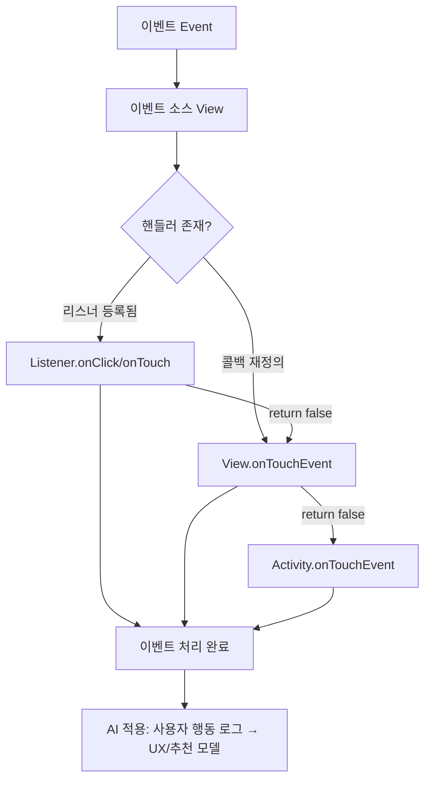
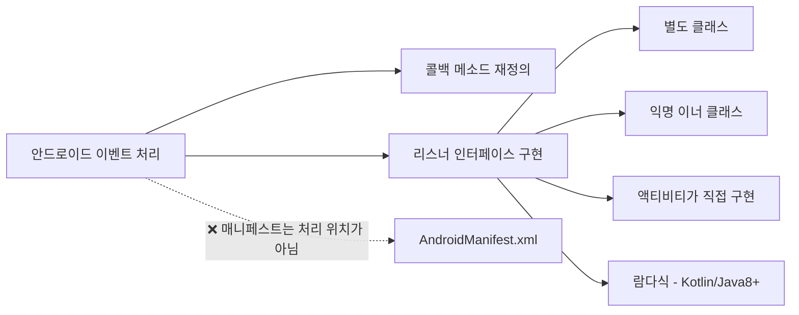

# 9강. 모바일앱프로그래밍: 이벤트 처리 1

## 🔗 선수 지식 (Prerequisites)
- [ ] **필수**: [8강 - 도형 및 소리 출력](8강.md) - 이해 완료?
- [ ] **필수**: 자바/코틀린 인터페이스(interface)와 추상 메소드 개념
- [ ] **권장**: 액티비티 생명주기, `findViewById` 또는 View Binding 사용 경험
- **관련 단원**: [10강. 이벤트 처리 2](10강.md) `→←10강`

---

## 학습 개요
- 이벤트 처리의 여러 가지 방법에 대해 학습한다.
- 핸들러의 우선순위와 메소드 호출기회에 대해 학습한다.

## 학습 목표
1. 이벤트 처리 방법에 대해서 이해한다.
2. 핸들러의 우선순위 및 이벤트 처리의 우선순위에 대해서 이해한다.

---

## 🧠 메타인지 체크 (학습 전/후 자기 평가)

### 학습 전 자기 평가
| 소주제 | 자신감 (1-5) |
| :--- | :--- |
| 콜백 메소드 vs 리스너 인터페이스 차이 | |
| 안드로이드 이벤트 처리 4가지 방식 | |
| 핸들러 우선순위 & 호출 순서 | |

### 학습 후 교정 (학습 완료 후 작성)
| 소주제 | 학습 전 | 학습 후 | 실제 정답률 | 과신/과소 여부 |
| :--- | :--- | :--- | :--- | :--- |
| 콜백 메소드 vs 리스너 인터페이스 차이 | | | | |
| 안드로이드 이벤트 처리 4가지 방식 | | | | |
| 핸들러 우선순위 & 호출 순서 | | | | |

> **활용법**: 학습 전 1분 → 자신감 기입, 학습 후 1분 → 나머지 기입. "과신" 영역이 실제 취약점.

---

## 📝 요약 (Summary)
1.  🔴 **콜백 메소드(Callback Method)**: 특정 이벤트가 발생했을 때 시스템에 의해 자동으로 호출되는 메소드. (예: `onTouchEvent`, `onKeyDown` 등 `View`/`Activity`가 이미 가지고 있는 메소드를 **재정의(override)** 하는 방식)
2.  🔴 **이벤트 리스너(Event Listener)**: 특정 이벤트를 처리하는 **인터페이스**이며, 이벤트 발생 여부를 기다리고 있는 객체. (예: `View.OnClickListener`, `View.OnTouchListener`)
3.  🟡 **이벤트(Event)**: 웹 페이지/앱 화면에서 일어나는 하나의 행위를 다루는 것으로서, 링크(버튼)를 클릭하거나 텍스트 영역의 값을 바꾸는 등의 행위.
4.  🟡 **이벤트 핸들러(Event Handler)**: 다른 객체들이 보낸 메시지(이벤트)를 받고 이를 처리하는 객체.
5.  🟢 **핸들러 우선순위**: 동일 이벤트에 대해 여러 핸들러가 등록된 경우 호출 순서가 정해져 있으며, 일반적으로 **리스너가 먼저, 콜백 메소드가 나중**에 호출된다. ⚠️ 단, 이 "리스너 먼저" 규칙은 **터치 디스패치(`OnTouchListener.onTouch()` ↔ `onTouchEvent()`) 한정**이며, `OnClickListener.onClick()`은 `onTouchEvent()`가 ACTION_UP을 처리하는 도중 그 내부에서(`performClick()` 경유) 호출되므로 이 규칙의 적용 대상이 아니다. (아래 ⚠️ 노트 및 핸들러 우선순위 비교표 참조)

---

## 📐 핵심 정의 및 원리 (Key Definitions & Principles)

> 본 강은 **이론 + 실습 중심**이므로 form의 "핵심 수식" 섹션을 **정의 테이블**과 **문법 패턴 테이블**로 대체한다.

| 정의명 | 내용 | 키워드 |
| :--- | :--- | :--- |
| **콜백 메소드** | 시스템(프레임워크)이 특정 이벤트 발생 시 자동으로 호출해 주는 메소드. 개발자는 이를 **재정의(override)** 만 한다. | `@Override`, 자동 호출 |
| **리스너 인터페이스** | 특정 이벤트가 발생했을 때 호출될 메소드를 선언해 둔 **인터페이스**. 개발자는 이를 **구현(implement)** 한다. | `interface`, `implements` |
| **이벤트** | 사용자의 입력/시스템 상태 변화(터치, 클릭, 키 입력 등) 그 자체. | UI 행위 |
| **이벤트 핸들러** | 이벤트를 수신하여 처리하는 **객체** (리스너 객체 또는 콜백을 재정의한 View). | 수신·처리 객체 |
| **핸들러 등록(register)** | `setOnXxxListener()`를 호출하여 리스너 객체를 View에 연결하는 행위. | `setOnClickListener` |

### 안드로이드 이벤트 처리 4가지 방식

> ⚠️ 매니페스트(AndroidManifest.xml)는 **앱 구성 정보(액티비티 등록, 권한 등)** 를 선언하는 곳이지, **이벤트 처리 위치가 아니다**. (📎 9강 기출 Q1)

| # | 방식 | 설명 | 예시 |
| :--- | :--- | :--- | :--- |
| ① | **콜백 메소드 재정의** | View/Activity의 기본 콜백을 `@Override` | `onTouchEvent()`, `onKeyDown()` |
| ② | **리스너 인터페이스 구현** | 인터페이스를 `implements` 후 `setOnXxxListener` 등록 | `View.OnClickListener` |
| ③ | **익명 이너 클래스 사용** | 일회성 리스너를 즉석에서 정의 | `setOnClickListener(new View.OnClickListener(){...})` |
| ④ | **액티비티 자신이 리스너** | 액티비티 클래스가 리스너 인터페이스를 직접 구현 | `class MainActivity ... implements OnClickListener` |
| ⑤ | **람다식(SAM 변환)** | ②~④의 간결 표현. **추상 메소드가 1개인 인터페이스(SAM)** 에만 적용 가능 | `OnClickListener`처럼 메소드 1개짜리에만 OK. 메소드가 여러 개인 리스너는 람다로 변환 불가 |

> 🟡 **람다(SAM 변환) 적용 조건**: 람다식은 `OnClickListener`(`onClick` 1개)처럼 **추상 메소드가 단 1개인 인터페이스(SAM, Single Abstract Method)** 에만 적용된다. 추상 메소드가 2개 이상인 리스너(예: `SensorEventListener`)는 람다로 줄여 쓸 수 없고 익명 객체로 구현해야 한다.

### 핸들러 우선순위 (Handler Priority)

**규칙**: 하나의 View 이벤트에 리스너와 콜백 메소드가 둘 다 등록되어 있으면 **리스너 → 콜백 메소드** 순으로 호출된다. 리스너가 `true`를 반환하면 이벤트가 **소비(consume)** 되어 콜백 메소드로 전달되지 않을 수 있다.

> ⚠️ **범위 한정**: 이 "리스너 먼저, 콜백 나중" 우선순위는 주로 **터치/뷰 디스패치 맥락**(`dispatchTouchEvent` → `OnTouchListener.onTouch` → `onTouchEvent`)에서 성립하는 규칙이며, 안드로이드의 **모든 이벤트에 동일하게 일반화되지는 않는다**(이벤트 종류에 따라 디스패치 경로가 다름). [근거: Android Input events overview](https://developer.android.com/develop/ui/views/touch-and-input/input-events)

$$
\text{Event} \;\to\; \text{Listener.onXxx()} \;\xrightarrow{\text{return false}}\; \text{View.onXxxEvent()} \;\xrightarrow{\text{return false}}\; \text{Activity.onXxxEvent()}
$$

> **직관적 해석**: 이벤트는 가장 안쪽 핸들러(리스너)부터 처리되며, 누군가 `true`를 반환하면 거기서 멈춘다. 마치 양파 껍질을 안에서 바깥으로 벗기는 것과 같다.
> **AI 적용**: 모바일에서 수집된 사용자 인터랙션(터치 좌표·체류시간) 이벤트 스트림은 사용자 행동 모델링(UX 분석, 클릭 예측, 추천 시스템)의 입력 피처로 활용된다.

---

## 📊 개념 시각화 (Visual Guide)

### 개념 관계도


### 이벤트 처리 방식 분류 체계도


### 핵심 도식
| 입력 | 연산 | 출력 | AI 적용 |
| :--- | :--- | :--- | :--- |
| 사용자 터치/클릭 | 리스너 콜백 호출 + boolean 반환 | UI 상태 변경 + 로그 | 클릭 스트림 → 추천 모델 학습 데이터 |
| 키 입력 | `onKeyDown()` 재정의 | 입력 처리 | 입력 시퀀스 → 의도(intent) 분류 |

---

## ✏️ 심화 학습 (Study Subject)

### 1. 가상 시나리오: "어떤 처리 방식을 언제 사용할까?"
- **상황**: 한 액티비티에 버튼이 20개 있고, 각 버튼마다 다른 동작을 해야 한다. 또한 화면 전체를 터치하면 별도 로그를 남겨야 한다.
- **문제**: 익명 이너 클래스를 20번 작성하면 코드가 매우 장황해지고, 화면 전체 터치 처리는 어디에 둘 것인가?
- **해결**:
  - 버튼 20개 → **액티비티가 `View.OnClickListener`를 직접 구현**하고 `onClick(View v)` 안에서 `v.getId()`로 분기하면 코드가 한 곳에 모인다.
  - 화면 전체 터치 → **`Activity.onTouchEvent()` 콜백 메소드를 재정의**한다. (개별 View가 처리하지 않은 터치가 액티비티로 전달된다.)
- **AI 학습 포인트**: "사용자 클릭 로그를 수집해 행동 패턴을 분석하려면, 안드로이드의 어느 콜백/리스너 계층에서 후킹하는 것이 가장 누락 없이 수집되는지 설명해 줘."

### 2. 관점별 비교 및 오개념 분석
- **핵심 비교**: **콜백 메소드 vs 리스너 인터페이스**
  - 콜백: View/Activity가 이미 갖고 있는 메소드를 **재정의**. 별도 등록 불필요.
  - 리스너: 외부 객체를 만들어 `setOnXxxListener()`로 **등록**해야 호출됨.
- **오개념 분석**:
    - **오개념 1**: "이벤트 처리는 매니페스트에 등록해서 할 수 있다."
    - **분석**: ❌ 틀림. `AndroidManifest.xml`은 **액티비티 선언, 권한, 인텐트 필터** 등 앱의 구성 정보를 기술하는 곳이지 클릭·터치 같은 **런타임 UI 이벤트의 처리 위치가 아니다**. 이벤트 처리는 코드(Java/Kotlin) 안에서 콜백 재정의 또는 리스너 구현으로 한다. (📎 9강 Q1)
    - **오개념 2**: "리스너에는 항상 여러 개의 메소드가 선언되어 있다."
    - **분석**: ❌ 틀림. `View.OnClickListener`처럼 메소드가 **딱 하나**(`onClick`)인 리스너도 많다. "리스너는 특정 이벤트를 처리하는 인터페이스"라는 정의가 본질이며, 메소드 개수는 인터페이스마다 다르다. (📎 9강 Q2)
    - **오개념 3**: "모든 리스너는 View 클래스를 상속받은 추상 메소드다."
    - **분석**: ❌ 틀림. 리스너는 **인터페이스**이며, View 클래스를 상속받지 않는다. View의 **내부 인터페이스**(예: `View.OnClickListener`)일 뿐 상속 관계가 아니다.
- **AI 학습 포인트**: "콜백 메소드와 리스너 인터페이스의 차이를 '구독(subscribe) 패턴' 관점에서 비교 설명해 줘."

---

## ❓ 연습 문제 및 해설

> **블룸 인지 수준 범례**: [기억] 정의·나열 → [이해] 설명·비교 → [적용] 계산·구현 → [분석] 구별·디버그 → [평가] 판단·비평 → [창조] 설계·제안

### 📝 문제

**1. ⭐ [기억/이해] 📎 기출(2024-Q1) 안드로이드에서 이벤트를 처리하는 방법으로 옳지 않은 것은?**[(해설)](#prob-1)
   > ① 콜백 메소드의 재정의
   > ② 리스너 인터페이스의 구현
   > ③ 매니페스트를 통한 재정의
   > ④ 액티비티를 통한 리스너의 구현

<br>

**2. ⭐ [기억/이해] 📎 기출(2024-Q2) 리스너에 대한 설명으로 옳은 것은?**[(해설)](#prob-2)
   > ① 콜백 발생 여부를 기다리고 있는 객체이다.
   > ② 리스너는 특정 이벤트를 처리하는 인터페이스이다.
   > ③ 대응되는 이벤트를 받는 여러 개의 메소드가 선언되어 있다.
   > ④ 모두 View 클래스의 상속을 받은 추상 메소드로 선언되어 있다.

<br>

**3. ⭐⭐ [적용/분석] 📌 다음 코드에서 빈칸 (가), (나)에 들어갈 코드로 가장 적절한 것은?**[(해설)](#prob-3)
   > ```java
   > public class MainActivity extends AppCompatActivity (가) {
   >     @Override
   >     protected void onCreate(Bundle savedInstanceState) {
   >         super.onCreate(savedInstanceState);
   >         setContentView(R.layout.activity_main);
   >         Button btn = findViewById(R.id.btn);
   >         btn.(나)(this);
   >     }
   >     @Override
   >     public void onClick(View v) { /* ... */ }
   > }
   > ```
   > ① (가) `extends View.OnClickListener` / (나) `setOnClickListener`
   > ② (가) `implements View.OnClickListener` / (나) `setOnClickListener`
   > ③ (가) `implements View.OnTouchListener` / (나) `setOnTouchListener`
   > ④ (가) `implements OnClickCallback` / (나) `addCallback`

<br>

**4. ⭐⭐ [분석] 📌 동일한 버튼에 리스너(`OnClickListener`)와 콜백(`onTouchEvent`)이 모두 등록되어 있을 때 호출 순서로 옳은 것은?**[(해설)](#prob-4)
   > <보기>
   > 가. 리스너가 콜백 메소드보다 먼저 호출된다.
   > 나. 리스너가 `true`를 반환하면 콜백 메소드는 호출되지 않을 수 있다.
   > 다. 액티비티의 콜백이 가장 먼저 호출된다.

   > ① 가
   > ② 가, 나
   > ③ 나, 다
   > ④ 가, 나, 다

<br>

**5. ⭐⭐⭐ [평가/창조] 📌 한 액티비티 안에 버튼 10개가 있다. 익명 이너 클래스 10번 작성, 액티비티가 직접 `OnClickListener` 구현, 람다식 사용 — 세 가지 방식의 장단점을 비교하고, 어떤 상황에서 어느 방식이 가장 적절한지 근거와 함께 제시하시오.**[(해설)](#prob-5)

---

### 🔑 정답 및 해설 (먼저 풀어본 후 펼치기)

<details>
<summary>정답 보기 (클릭)</summary>

1. ③
2. ②
3. ②
4. ②
5. [서술형 — 해설 참조]

</details>

<details>
<summary>해설 보기 (클릭)</summary>

<a id="prob-1"></a>
**1. ⭐ [기억/이해] 📎 기출 이벤트 처리 방법으로 옳지 않은 것**
> **정답: ③ 매니페스트를 통한 재정의**
> **해설**: 안드로이드의 이벤트 처리는 **코드 안에서** 이루어진다. 대표적인 방법은 ① 콜백 메소드 재정의, ② 리스너 인터페이스 구현, ④ 액티비티가 직접 리스너를 구현하는 방식이다. `AndroidManifest.xml`은 액티비티 등록·권한·인텐트 필터 등 **앱 구성 정보**를 선언하는 곳일 뿐, 버튼 클릭이나 터치 같은 런타임 이벤트를 처리하는 곳이 아니다.

<a id="prob-2"></a>
**2. ⭐ [기억/이해] 📎 기출 리스너의 정의**
> **정답: ② 리스너는 특정 이벤트를 처리하는 인터페이스이다.**
> **해설**:
> - ① 콜백 발생 여부가 아니라 **이벤트 발생 여부**를 기다리는 객체. 또한 리스너의 본질은 "기다리는 객체"가 아니라 "**이벤트가 발생하면 호출될 메소드를 가진 인터페이스**"이다.
> - ② `View.OnClickListener`, `View.OnTouchListener`, `DialogInterface.OnClickListener` 등이 모두 인터페이스이므로 옳다.
> - ③ 리스너는 메소드가 하나만 있는 경우(예: `OnClickListener.onClick`)가 더 많으므로 "여러 개의 메소드"라는 일반화는 옳지 않다.
> - ④ 리스너는 인터페이스이지 메소드가 아니며, View 클래스를 상속받지도 않는다.

<a id="prob-3"></a>
**3. ⭐⭐ [적용/분석] 액티비티가 직접 리스너 구현**
> **정답: ② (가) `implements View.OnClickListener` / (나) `setOnClickListener`**
> **해설**: 인터페이스는 `implements`로 구현한다(`extends`는 클래스 상속). 액티비티 자신이 리스너 역할을 하므로 `btn.setOnClickListener(this)`에서 `this`(액티비티 인스턴스)를 등록할 수 있다. 또한 `onClick(View v)` 시그니처가 있으므로 `OnTouchListener`가 아닌 `OnClickListener`가 맞다.

<a id="prob-4"></a>
**4. ⭐⭐ [분석] 핸들러 우선순위**
> **정답: ② 가, 나**
> **해설**:
> - 가 (O): 동일 View에 리스너와 콜백이 모두 있으면 **리스너가 먼저** 호출된다.
> - 나 (O): 리스너가 `true`를 반환하면 이벤트가 **소비(consumed)** 되어 콜백 메소드로 전달되지 않을 수 있다.
> - 다 (X): 액티비티의 콜백은 가장 **나중**(View가 처리하지 않은 경우 마지막에) 호출된다.
>
> ⚠️ **정확히는(개념 한정 주석)**: '리스너가 콜백보다 먼저'라는 우선순위 규칙은 **`OnTouchListener.onTouch()` ↔ `onTouchEvent()`** 관계에 한정된다. 이 문제 보기의 `OnClickListener.onClick()`은 `onTouchEvent()`가 ACTION_UP을 처리하는 **도중 그 내부에서**(`performClick()` 경유) 호출되므로, 엄밀히는 `onTouchEvent`보다 '먼저'가 아니다. 그러나 **KNOU 교재 채점 기준상 정답은 ②(가, 나)로 유지**한다(보기 '가'는 터치 디스패치 맥락의 일반 규칙을 묻는 것으로 본다). [근거: https://developer.android.com/reference/android/view/View ]

<a id="prob-5"></a>
**5. ⭐⭐⭐ [평가/창조] 세 가지 리스너 구현 방식 비교**
> **정답(예시)**:
> - **익명 이너 클래스 10번**: 각 버튼마다 독립된 로직을 가지지만, 버튼이 많으면 코드가 장황해지고 유지보수가 어렵다. → 버튼별 로직이 **완전히 다르고 일회성**일 때 적합.
> - **액티비티가 `OnClickListener` 직접 구현**: `onClick(View v)` 한 곳에서 `v.getId()`로 분기 처리. 코드가 한 곳에 모여 **유지보수가 쉽다**. 다만 `onClick`이 비대해질 수 있다. → 버튼이 많고 **유사한 카테고리의 동작**을 처리할 때 적합.
> - **람다식**(Java 8+/Kotlin): `btn.setOnClickListener(v -> doSomething())`. 가장 간결하고 가독성이 높지만, 람다 안이 길어지면 다시 메소드로 추출해야 한다. → 짧고 명확한 단일 동작에 가장 적합.
> **권장**: 일반적으로 **람다식**을 1순위로 사용하고, 공통 처리가 많으면 **액티비티 직접 구현**, 한 곳에서만 쓰이는 복잡한 로직은 **익명 이너 클래스**로 분리한다.

</details>

---

## ✅ O/X 확인문제 (연습문항 개수의 2배 권장 → 10문항)

**1.** 콜백 메소드는 시스템이 특정 이벤트 발생 시 자동으로 호출하는 메소드이다.[(해설)](#ox-1) **(O / X)**
**2.** 안드로이드에서 이벤트 처리는 `AndroidManifest.xml`에서 재정의하여 처리할 수 있다.[(해설)](#ox-2) **(O / X)**
**3.** 모든 리스너 인터페이스는 반드시 두 개 이상의 메소드를 선언한다.[(해설)](#ox-3) **(O / X)**
**4.** 액티비티 클래스 자체가 `View.OnClickListener`를 구현하여 리스너 역할을 할 수 있다.[(해설)](#ox-4) **(O / X)**
**5.** 리스너는 클래스를 `extends`하여 구현한다.[(해설)](#ox-5) **(O / X)**
**6.** 동일 이벤트에 리스너와 콜백이 둘 다 등록되면 콜백 메소드가 먼저 호출된다.[(해설)](#ox-6) **(O / X)**
**7.** 리스너 콜백이 `true`를 반환하면 이벤트가 소비되어 후속 핸들러로 전달되지 않을 수 있다.[(해설)](#ox-7) **(O / X)**
**8.** 익명 이너 클래스는 일회성 이벤트 처리 코드를 즉석에서 정의할 때 사용된다.[(해설)](#ox-8) **(O / X)**
**9.** 이벤트 핸들러는 다른 객체가 보낸 메시지(이벤트)를 받아 처리하는 객체이다.[(해설)](#ox-9) **(O / X)**
**10.** `setOnClickListener(null)`을 호출하면 등록된 리스너를 해제할 수 있다.[(해설)](#ox-10) **(O / X)**

<details>
<summary>O/X 정답 및 해설 보기 (클릭)</summary>

> <a id="ox-1"></a>
> **1. 정답**: O
> **해설**: 콜백 메소드의 정의 그대로다. View/Activity가 이미 가진 메소드를 시스템이 호출한다.

> <a id="ox-2"></a>
> **2. 정답**: X
> **해설**: 매니페스트는 앱 구성 정보(액티비티 등록·권한·인텐트 필터)를 선언하는 곳이지 이벤트 처리 위치가 아니다. (📎 9강 Q1)

> <a id="ox-3"></a>
> **3. 정답**: X
> **해설**: `View.OnClickListener`는 메소드가 `onClick` 단 하나다. 리스너마다 메소드 개수는 다르다. (📎 9강 Q2)

> <a id="ox-4"></a>
> **4. 정답**: O
> **해설**: "액티비티가 리스너 인터페이스를 구현"하는 것은 표준적인 4가지 이벤트 처리 방식 중 하나다.

> <a id="ox-5"></a>
> **5. 정답**: X
> **해설**: 리스너는 **인터페이스**이므로 `implements`로 구현한다. `extends`는 클래스 상속 키워드.

> <a id="ox-6"></a>
> **6. 정답**: X
> **해설**: **리스너가 먼저** 호출되고, 그다음 콜백 메소드가 호출된다.

> <a id="ox-7"></a>
> **7. 정답**: O
> **해설**: `return true`는 "이 이벤트는 내가 처리했다"는 의미로, 후속 핸들러로 전달되지 않을 수 있다.

> <a id="ox-8"></a>
> **8. 정답**: O
> **해설**: `new View.OnClickListener() { ... }` 형태로 일회성 구현체를 즉석에서 만든다.

> <a id="ox-9"></a>
> **9. 정답**: O
> **해설**: 이벤트 핸들러의 정의 그대로다.

> <a id="ox-10"></a>
> **10. 정답**: O
> **해설**: `null`을 전달하면 내부 리스너 참조가 해제되어 더 이상 이벤트가 콜백되지 않는다.
> 📌 **정밀화**: 다만 이때 해제되는 것은 **클릭 리스너뿐**이며, View의 `clickable` 상태(클릭 가능 여부) 자체는 그대로 **유지될 수 있다**. 즉 리스너만 떼어낸다고 해서 View가 자동으로 클릭 불가(`clickable=false`)가 되는 것은 아니다(클릭 가능 상태를 끄려면 `setClickable(false)`를 별도로 호출).

</details>

---

## 🧪 자유 회상 연습 (Free Recall)

> **방법**: 위의 노트를 모두 덮고, 타이머 3분 설정 후 이번 단원에서 배운 내용을 기억나는 대로 자유롭게 적으세요.
> 정확한 문장이 아니어도 됩니다. 키워드, 수식, 관계 등 떠오르는 것을 모두 적습니다.

**자유 회상 작성란:**

```
[여기에 기억나는 내용을 자유롭게 작성]


```

> **회상 후 점검**: 노트를 다시 펼쳐 빠뜨린 내용을 확인하세요. 빠뜨린 부분이 실제 취약점입니다.
> - 회상 못한 핵심 개념: [                ]
> - 회상 못한 메소드/패턴: [                ]

---

## 💻 코드로 확인하기 (Code Verification)

```java
// 방식 1: 액티비티가 OnClickListener를 직접 구현
public class MainActivity extends AppCompatActivity implements View.OnClickListener {
    @Override
    protected void onCreate(Bundle savedInstanceState) {
        super.onCreate(savedInstanceState);
        setContentView(R.layout.activity_main);

        Button btn1 = findViewById(R.id.btn1);
        Button btn2 = findViewById(R.id.btn2);
        btn1.setOnClickListener(this);   // 액티비티 자신이 리스너
        btn2.setOnClickListener(this);
    }

    @Override
    public void onClick(View v) {
        switch (v.getId()) {
            case R.id.btn1: /* 버튼1 처리 */ break;
            case R.id.btn2: /* 버튼2 처리 */ break;
        }
    }

    // 방식 2: 콜백 메소드 재정의 (액티비티 전체 화면 터치)
    @Override
    public boolean onTouchEvent(MotionEvent event) {
        Log.d("EVT", "Activity onTouchEvent: " + event.getAction());
        return super.onTouchEvent(event);
    }
}

// 방식 3: 익명 이너 클래스
btn3.setOnClickListener(new View.OnClickListener() {
    @Override public void onClick(View v) { /* 일회성 처리 */ }
});

// 방식 4 (Java 8+): 람다식
btn4.setOnClickListener(v -> { /* 가장 간결 */ });
```

> **실행 결과**:
> - 버튼1 클릭 시 → 리스너의 `onClick` 호출
> - 화면 빈 영역 터치 시 → 액티비티의 `onTouchEvent` 호출 (로그 출력)
> - 동일 View에 리스너+콜백 모두 등록 시 → 리스너 먼저, 콜백이 나중에 호출됨
>
> **해석**: 4가지 방식 모두 동일한 결과(클릭 처리)를 만들 수 있다. 차이는 **코드 구조와 가독성**이며, 매니페스트는 어디에도 등장하지 않는다.

---

## 🤖 AI 연결고리 (Concept → AI Application)

| 개념 | AI/ML 적용 분야 | 구체적 사례 |
| :--- | :--- | :--- |
| 이벤트 스트림 (클릭/터치) | 사용자 행동 모델링, UX 분석 | 클릭 시퀀스 → RNN/Transformer로 다음 행동 예측 |
| 리스너/콜백 (Observer 패턴) | 비동기 학습 파이프라인 | TensorFlow `Callbacks`, PyTorch Hook으로 학습 도중 메트릭 수집 |
| 핸들러 우선순위 | 라우팅/디스패치 정책 | 에이전트 도구 호출 라우팅, 인터럽트 우선순위 처리 |
| `onTouchEvent` 좌표 데이터 | 제스처 인식, 손글씨 인식 | 터치 궤적 → CNN으로 분류 (MNIST 손글씨 동급 문제) |

---

## 📖 심화 학습 예시 답안

#### 1. 리스너 인터페이스의 내부 동작 원리
안드로이드의 리스너는 전형적인 **Observer 패턴**의 구현체다.

1.  **인터페이스 정의**: 프레임워크는 `View.OnClickListener`처럼 "이벤트 발생 시 호출될 메소드 시그니처"를 인터페이스로 선언해 둔다.
2.  **구현체 등록**: 개발자가 `setOnClickListener(listener)`로 구현 객체를 View 내부의 필드(`mOnClickListener`)에 저장한다.
3.  **호출**: 시스템이 터치 이벤트를 디스패치하다가 클릭으로 판정되면 `mOnClickListener.onClick(this)`을 호출한다. 등록된 리스너가 없으면(`null`이면) 호출되지 않는다.
4.  **우선순위**: 리스너 호출 후, 콜백(`onTouchEvent` 등)이 후속으로 호출되며, 중간에 `true`가 반환되면 전파가 멈춘다.

#### 2. 콜백 메소드 vs 리스너 인터페이스 비교표
| 구분 | 콜백 메소드 (`onTouchEvent` 등) | 리스너 인터페이스 (`OnClickListener`) | 비고 |
| :--- | :--- | :--- | :--- |
| **정의** | View/Activity가 이미 가진 메소드 | 외부에서 구현하는 인터페이스 | |
| **사용법** | `@Override` 재정의 | `setOnXxxListener()`로 등록 | |
| **적용 조건** | 해당 View/Activity 자신이 이벤트 주체 | 외부에서 View의 이벤트를 관찰 | |
| **호출 순서** | **나중** (리스너 다음) | **먼저** | 핸들러 우선순위 — ⚠️ **터치 디스패치(`OnTouchListener.onTouch()` ↔ `onTouchEvent()`) 한정** |
| **AI 활용** | 액티비티 전역 제스처/입력 로깅 | 위젯별 클릭 스트림 수집 → 추천 모델 입력 | |

> ⚠️ **표 보충(우선순위 규칙의 범위)**: 위 "리스너 먼저, 콜백 나중" 우선순위는 **`OnTouchListener.onTouch()` ↔ `onTouchEvent()`** 의 터치 디스패치 관계에 한정된다. `OnClickListener.onClick()`은 `onTouchEvent()`가 ACTION_UP을 처리하는 **도중 그 내부에서**(`performClick()` 경유) 호출되므로 onTouchEvent보다 '먼저'가 아니다. (요약 5번 ⚠️ 노트 및 문제4 해설과 연결)

#### 3. 리스너 구현 Best Practice
- **Bad Practice (나쁜 예시)**
  ```java
  // 같은 동작을 하는 버튼 10개를 익명 이너 클래스로 10번 정의
  btn1.setOnClickListener(new View.OnClickListener() {
      @Override public void onClick(View v) { doSame(); }
  });
  btn2.setOnClickListener(new View.OnClickListener() {
      @Override public void onClick(View v) { doSame(); }
  });
  // ... 8번 더 반복 → 클래스 객체 10개 생성, 코드 중복
  ```
- **Good Practice (좋은 예시)**
  ```java
  // 람다식 + 공통 리스너 변수 재사용
  View.OnClickListener common = v -> doSame();
  for (Button b : new Button[]{btn1, btn2, btn3, /* ... */}) {
      b.setOnClickListener(common);
  }
  ```
- **설명**: 좋은 예시는 리스너 객체를 **단 1개만 생성**해 메모리를 절약하고 코드 중복을 제거한다. 또한 람다식은 가독성이 높고 함수형 인터페이스(SAM) 변환이 컴파일러 최적화 대상이 된다.

---

## 🟢 [심층] Kotlin SAM/람다 · 이벤트 디스패치 흐름 심화 (리서치 확장)

> 본문(콜백 vs 리스너)을 Kotlin 관용구와 터치 이벤트 전파 체인 관점에서 확장한다. 공식 문서 검증.

### 1) Kotlin SAM 변환과 람다

`View.OnClickListener`는 메서드가 하나뿐인 **SAM(Single Abstract Method) 인터페이스**다(`onClick(View)`).
Kotlin은 Java로 정의된 SAM 인터페이스에 대해 **SAM 변환**을 적용하여, 인터페이스 구현 객체 대신 람다를 바로 넘길 수 있다.

```kotlin
// Java 스타일(익명 객체)
button.setOnClickListener(object : View.OnClickListener {
    override fun onClick(v: View) { /* ... */ }
})

// Kotlin SAM 변환 + 후행(trailing) 람다 - 권장
button.setOnClickListener { v -> /* ... */ }
button.setOnClickListener { /* v 미사용 시 생략 */ }
```

- 주의: **SAM 변환은 Java로 선언된 인터페이스에 대해 자동 적용**된다. Kotlin에서 직접 SAM처럼 쓰려면 `fun interface`로 선언해야 람다 변환이 된다.
- 마지막 인자가 함수형이면 소괄호 밖으로 빼는 **후행 람다** 문법이 적용된다.
- 근거(OnClickListener는 onClick 단일 메서드): https://developer.android.com/reference/android/view/View.OnClickListener · Kotlin SAM/fun interface: https://kotlinlang.org/docs/fun-interfaces.html

여러 리스너 인터페이스에 동일 패턴 적용:

```kotlin
view.setOnLongClickListener { true }                 // Boolean 반환
editText.setOnEditorActionListener { _, _, _ -> false }
view.setOnTouchListener { _, event -> /* ... */ true }
```

### 2) 터치 이벤트 디스패치 흐름(전파 체인)

터치 이벤트는 위에서 아래로 **dispatch → (ViewGroup의) intercept → (자식의) onTouchEvent** 순서로 전파된다.

| 단계 | 메서드 | 호출 주체 | 역할 |
|------|--------|-----------|------|
| 1 | `dispatchTouchEvent(MotionEvent)` | Activity/View/ViewGroup | 이벤트를 받아 하위로 분배(분배의 진입점) |
| 2 | `onInterceptTouchEvent(MotionEvent)` | **ViewGroup 전용** | true 반환 시 자식에게 보내지 않고 가로채 자신의 onTouchEvent로 처리 |
| 3 | `onTouchEvent(MotionEvent)` | View/ViewGroup | 실제 터치 처리. true 반환 시 이벤트 소비(consume) |

- 흐름: 부모 `dispatchTouchEvent` → `onInterceptTouchEvent`(false면) → 자식 `dispatchTouchEvent` → ... → 자식 `onTouchEvent`. 자식이 소비(true)하지 않으면 위로 **버블링**되어 부모 `onTouchEvent`가 처리.
- 근거: https://developer.android.com/develop/ui/views/touch-and-input/gestures/viewgroup

### 3) 콜백 vs 리스너 우선순위(요약 도식)

```
[하드웨어 이벤트]
      │
      ▼
dispatchTouchEvent (분배)
      │  (ViewGroup) onInterceptTouchEvent == false
      ▼
setOnTouchListener.onTouch(...)   ← 리스너가 먼저 호출
      │  (false 반환 시 ↓)
      ▼
View.onTouchEvent(...)            ← 콜백(오버라이드)
```

- 동일 뷰에서 `OnTouchListener.onTouch()`가 `true`를 반환하면 `onTouchEvent()` 콜백은 호출되지 않는다(리스너 우선·소비).
- 즉 **외부 등록 리스너가 내부 오버라이드 콜백보다 먼저** 기회를 갖는다.
- 근거: https://developer.android.com/reference/android/view/View#onTouchEvent(android.view.MotionEvent) , https://developer.android.com/reference/android/view/View.OnTouchListener

### 4) 디스패치 체인 전체 시각화 — `onClick`/`onLongClick`은 어디서 호출되나? (요약 5번 ⚠️ 노트 심화)

요약 5번·문제4 해설에서 짚은 "`onClick`은 `onTouchEvent` 내부에서 호출된다"를 체인 전체로 펼치면 다음과 같다. 핵심은 **`OnClickListener.onClick()`과 `OnLongClickListener.onLongClick()`은 별도의 디스패치 단계가 아니라, `onTouchEvent()` 콜백이 터치를 해석하는 도중 그 내부에서 `performClick()`/`performLongClick()`을 거쳐 호출된다**는 점이다.

```
[하드웨어 터치]
      │
      ▼
① dispatchTouchEvent(MotionEvent)         ← 분배의 진입점(Activity/View/ViewGroup)
      │
      ▼
② onInterceptTouchEvent(MotionEvent)      ← ViewGroup 전용. true면 자식 대신 자신이 가로챔
      │
      ▼
③ OnTouchListener.onTouch(v, event)       ← 외부 등록 리스너가 "먼저" 기회를 가짐
      │   └ return true  → 여기서 소비(consume), ④로 내려가지 않음
      │   └ return false → ↓
      ▼
④ View.onTouchEvent(MotionEvent)          ← 콜백(오버라이드). 터치를 클릭/롱클릭으로 해석
      │
      │   ACTION_DOWN  : 눌림 상태 기록(pressed)
      │   롱프레스 타임아웃 경과 → performLongClick() ──► OnLongClickListener.onLongClick()
      │   ACTION_UP    : 탭으로 판정되면 ↓
      │                  performClick() ──────────────► OnClickListener.onClick()
      ▼
   (소비되지 않으면) 부모 View.onTouchEvent 로 버블링
```

| 호출 지점 | 메서드 | 누구를 부르나 | 설명 |
| :--- | :--- | :--- | :--- |
| `onTouchEvent` 내부(ACTION_UP, 탭 판정) | `performClick()` | `OnClickListener.onClick()` | "클릭"은 독립 디스패치 단계가 아니라 **터치 해석의 결과**다. 그래서 `onClick`은 `onTouchEvent`보다 '먼저'가 아니다. |
| `onTouchEvent` 내부(롱프레스 타임아웃) | `performLongClick()` | `OnLongClickListener.onLongClick()` | 길게 누름이 판정되면 ACTION_UP 이전에도 호출될 수 있다. |

- 따라서 "리스너 먼저, 콜백 나중" 규칙이 깔끔히 성립하는 것은 **`OnTouchListener.onTouch()` ↔ `onTouchEvent()`** 관계뿐이다. `onClick`/`onLongClick`은 ④ `onTouchEvent` **안쪽**에서 `performClick()`/`performLongClick()` 경유로 발화되므로 같은 '우선순위' 축으로 비교할 대상이 아니다(요약 5번 ⚠️ 노트·문제4 해설과 일관).
- `performClick()`은 super 구현에서 **`AccessibilityEvent`를 생성하고 등록된 `onClick()` 리스너를 호출**한다. 커스텀 뷰가 `onTouchEvent`로 직접 클릭을 만들 때 접근성(TalkBack 등) 호환을 위해 `performClick()`을 호출/오버라이드하라고 공식 문서가 권고하는 이유가 이것이다.
- 근거: 클릭 동작과 접근성 — https://developer.android.com/guide/topics/ui/accessibility/custom-views , View 디스패치 — https://developer.android.com/reference/android/view/View , 입력 이벤트 개요 — https://developer.android.com/develop/ui/views/touch-and-input/input-events

---

## 📚 핵심 용어집 (Glossary)

| 용어 (한) | 용어 (영) | 시그니처/패턴 | 정의 |
| :--- | :--- | :--- | :--- |
| **이벤트** | Event | `MotionEvent`, `KeyEvent` | 사용자의 입력 또는 시스템 상태 변화 |
| **콜백 메소드** | Callback Method | `@Override onTouchEvent(MotionEvent)` | 시스템이 자동으로 호출하는 재정의 가능한 메소드 |
| **이벤트 리스너** | Event Listener | `interface View.OnClickListener { onClick(View) }` | 이벤트 처리 메소드를 선언한 인터페이스 |
| **이벤트 핸들러** | Event Handler | (리스너 객체 또는 콜백 재정의 객체) | 이벤트를 수신·처리하는 객체 |
| **핸들러 등록** | Register | `view.setOnXxxListener(listener)` | View에 리스너를 연결하는 행위 |
| **이벤트 소비** | Consume | `return true` | 후속 핸들러로 전파를 차단 `→←10강` |
| **익명 이너 클래스** | Anonymous Inner Class | `new Xxx() { ... }` | 즉석에서 정의되는 일회성 클래스 |

---

## 🤖 AI 학습 파트너를 위한 추가 자료

### 1. 개념 이해를 위한 심층 질문 프롬프트
> **프롬프트 예시**: "안드로이드의 이벤트 처리(콜백 메소드 재정의 vs 리스너 인터페이스 구현)의 차이를 'Observer 패턴'과 'Template Method 패턴' 관점에서 비교 설명해 줘. 또한 매니페스트가 이벤트 처리 위치가 아닌 이유를 안드로이드의 4대 컴포넌트 구조와 함께 설명해 줘."

### 2. 문제 해결 능력 강화를 위한 시나리오 프롬프트
> **프롬프트 예시**: "당신은 안드로이드 시니어 개발자입니다. 화면에 동적으로 생성되는 100개의 버튼이 있고 각 버튼은 서로 다른 데이터를 가지고 있을 때, 익명 이너 클래스 / 액티비티 구현 / 람다식 / `RecyclerView.Adapter`의 클릭 위임 중 어떤 방식이 메모리와 유지보수 측면에서 가장 적합한지 비교하고 최종 선택의 기술적 이유를 설명해 줘."

### 3. 코드 검증 프롬프트
> **프롬프트 예시**: "다음 코드에서 버튼 클릭 시 리스너의 `onClick`이 호출되지 않는다. 원인을 찾아 줘.
> ```java
> Button btn = findViewById(R.id.btn);
> View.OnClickListener listener = v -> doX();
> // setOnClickListener 호출이 누락되어 있음 — 또는 onCreate 밖에서 findViewById 호출
> ```
> 1. 단계별로 원인을 진단해 줘.
> 2. 안드로이드 이벤트 디스패치 흐름을 따라가며 어디서 호출이 끊겼는지 설명해 줘."

---

## 🔄 복습 체크 (Spaced Repetition)
- [ ] 1일 후 복습 (날짜: 2026-05-30)
- [ ] 3일 후 복습 (날짜: 2026-06-01)
- [ ] 7일 후 복습 (날짜: 2026-06-05)
- [ ] 14일 후 복습 (날짜: 2026-06-12)
- [ ] 30일 후 복습 (날짜: 2026-06-28)

### 복습 시 자가 평가
| 회차 | 날짜 | 이해도 (1-5) | 취약 부분 메모 |
| :--- | :--- | :--- | :--- |
| 1차 | | | |
| 2차 | | | |
| 3차 | | | |

---

## 📚 참고 자료 (References)

- 교재 - 모바일앱프로그래밍 9강. 이벤트 처리 1
- Android Developers 공식 문서 - [Input events overview](https://developer.android.com/develop/ui/views/touch-and-input/input-events)
- Android Developers 공식 문서 - [View.OnClickListener](https://developer.android.com/reference/android/view/View.OnClickListener)
- 📎 KNOU 모바일앱프로그래밍 기출 - 이벤트 처리 방법(Q1), 리스너 정의(Q2)
