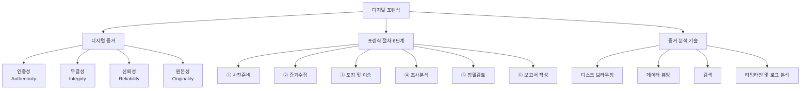
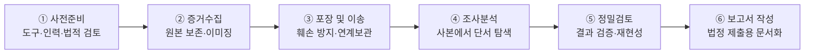

# 11강. 컴퓨터보안: 디지털 포렌식

## 🔗 선수 지식 (Prerequisites)
- [ ] **필수**: [10강](10강.md) - 직전 단원 개념 이해 완료?
- [ ] **필수**: 파일 시스템·디스크 저장 구조, 운영체제의 로그 개념([5강 서버 보안](5강.md))
- [ ] **권장**: 정보보호 3대 목표 CIA·무결성([1강](1강.md)), 해시 함수와 무결성 검증([3강](3강.md))
- **관련 단원**: [5강 서버 보안](5강.md)(시스템 로그·침해 흔적), [4강 사이버 공격](4강.md)(공격 흔적의 증거화)

---

## 학습 목표
1. 디지털 포렌식의 개념을 설명할 수 있다.
2. 디지털 증거의 개념을 설명할 수 있다.
3. 디지털 포렌식의 절차를 설명할 수 있다.
4. 디지털 증거 수집과 분석기술을 설명할 수 있다.

---

## 🧠 메타인지 체크 (학습 전/후 자기 평가)

### 학습 전 자기 평가
| 소주제 | 자신감 (1-5) |
| :--- | :--- |
| 디지털 포렌식·디지털 증거의 개념 | |
| 디지털 증거의 법적 효력 4요건(인증·무결·신뢰·원본) | |
| 디지털 포렌식 6단계 절차 | |
| 증거 수집 원칙(원본 보존·휘발성 데이터) | |
| 증거 분석 기술(브라우징·뷰잉·검색·타임라인/로그) | |

### 학습 후 교정 (학습 완료 후 작성)
| 소주제 | 학습 전 | 학습 후 | 실제 정답률 | 과신/과소 여부 |
| :--- | :--- | :--- | :--- | :--- |
| 포렌식·증거 개념 | | | | |
| 증거 4요건 | | | | |
| 포렌식 6단계 | | | | |
| 수집 원칙 | | | | |
| 분석 기술 | | | | |

> **활용법**: 학습 전 1분 → 자신감 기입, 학습 후 1분 → 나머지 기입. "과신" 영역이 실제 취약점.

---

## 📝 요약 (Summary)
1. **디지털 포렌식** 🔴: 과학수사(forensic science)의 한 분야로, 디지털 기기에 남겨져 있는 각종 자료를 과학적으로 수집·분석하여 범죄 사실을 규명하거나 사건의 실체를 밝히는 분야이다.
2. **디지털 증거** 🔴: 0과 1이라는 디지털 형태로 저장되거나 전송되는, **증거가치가 있는 정보**를 의미한다.
3. **디지털 증거의 4대 요건** 🔴: 디지털 증거가 법적 효력을 가지려면 **인증성, 무결성, 신뢰성, 원본성**이 입증되어야 한다.
4. **디지털 포렌식의 절차(6단계)** 🔴: **사전준비 → 증거수집 → 포장 및 이송 → 조사분석 → 정밀검토 → 보고서 작성** 단계로 구성된다.
5. **증거 수집의 원칙** 🟡: 법정에서 허용되려면 **원본을 있는 그대로 보존**하면서 수집해야 한다. 휘발성 데이터처럼 원본 보존이 불가피하게 어려운 경우는 최대한 원본과 유사한 형태로 수집하고 **관련 내역을 모두 기록**해야 한다.
6. **증거 분석의 목표와 기술** 🟡: 분석의 목표는 수집된 데이터에서 사건의 실마리·증거를 찾는 것이며, **디스크 브라우징, 데이터 뷰잉, 검색, 타임라인 및 로그 분석** 기술이 필요하다.

---

## 📐 핵심 정의 및 원리 (Key Definitions & Principles)

| 정의명 | 내용 | 키워드 |
| :--- | :--- | :--- |
| **과학수사(Forensic Science)** | 범죄 사실을 규명하기 위해 범죄 현장에 남겨진 각종 증거를 과학적으로 분석하는 분야 | 증거 기반, 과학적 분석 |
| **디지털 포렌식(Digital Forensics)** | 과학수사의 한 분야로, 디지털 기기에 남겨진 자료를 수집·보존·분석하여 증거를 도출하는 분야 | 디지털 기기, 증거 도출 |
| **디지털 증거(Digital Evidence)** | 0과 1의 디지털 형태로 저장·전송되는, 증거가치가 있는 정보 | 0/1, 증거가치 |
| **인증성(Authenticity)** | 제출된 증거가 실제 그 시스템·매체에서 나온 것임을, 즉 **출처와 진정성**을 입증할 수 있는 성질 | 출처 입증, 진정성 |
| **무결성(Integrity)** | 수집 이후 증거가 **변경·훼손되지 않았음**을 입증하는 성질. 해시값 비교로 보증 | 변경 없음, 해시 |
| **신뢰성(Reliability)** | 증거 수집·분석에 사용된 **도구와 절차가 신뢰할 만함**을 입증하는 성질 | 검증된 도구·절차 |
| **원본성(원본 동일성, Originality)** | 법정에 제출된 증거가 **원본과 동일함**을 입증하는 성질 | 원본=사본 동일 |
| **휘발성 데이터(Volatile Data)** | 전원이 차단되면 사라지는 데이터(메모리·실행 중 프로세스·네트워크 연결 등) | 메모리, 전원 의존 |
| **연계보관성/연속성(Chain of Custody)** | 증거의 수집-이송-분석-보관 전 과정의 **취급 이력을 끊김 없이 기록**하는 원칙 | 취급 이력, 무결성 보증 |
| **이미징(Imaging)** | 저장 매체를 비트 단위로 그대로 복제하여 **사본(이미지)** 을 만드는 작업 | 비트 복제, 쓰기방지 |
| **디스크 브라우징(Disk Browsing)** | 디스크의 디렉터리·파일 구조를 탐색하며 증거가 될 파일을 찾는 기술 | 파일 구조 탐색 |
| **데이터 뷰잉(Data Viewing)** | 파일 내용을 형식에 맞게(텍스트·이미지·바이너리) 열람·해석하는 기술 | 내용 열람·해석 |
| **타임라인 분석(Timeline Analysis)** | 파일의 생성·수정·접근 시각(MAC time)과 로그를 시간순으로 재구성하는 기술 | MAC time, 시간 재구성 |

### 주요 원리

**원리 1. 원본 보존 원칙(Preservation of Original)**
> **직관적 해석**: 디지털 증거는 한 비트만 바뀌어도 무결성·원본성이 깨진다. 따라서 **원본은 건드리지 않고**, 비트 단위로 복제한 사본(이미지)에서 분석한다. 수집 시에는 **쓰기방지장치(write blocker)** 를 사용한다.
> **실무 적용**: 원본 디스크 → write blocker 연결 → dd/EnCase로 이미지 생성 → 원본·사본의 해시값(SHA-256 등) 비교로 동일성 확인 → 사본에서만 분석.

**원리 2. 연계보관성(Chain of Custody) 원칙**
> **직관적 해석**: "이 증거가 수집된 순간부터 법정에 제출될 때까지 **누가, 언제, 무엇을, 어떻게** 다뤘는가"를 끊김 없이 기록해야 한다. 한 군데라도 기록이 끊기면 증거능력을 의심받는다.
> **실무 적용**: 휘발성 데이터처럼 원본 보존이 불가능한 경우, 수집 시각·도구·담당자·방법을 모두 기록하여 신뢰성·무결성을 보강한다.

**원리 3. 휘발성 순서(Order of Volatility) — 표준 수집 우선순위** (근거: RFC 3227)
> "휘발성 우선 수집"의 구체적 표준 순서는 **RFC 3227**에 정의되어 있다. 더 빨리 사라지는 것부터 수집한다.
> 1. **레지스터·캐시(CPU register, cache)** — 가장 빨리 소멸
> 2. **메모리(RAM)** — 라우팅 테이블·ARP 캐시·프로세스 테이블·커널 통계 포함
> 3. **네트워크 상태(임시 연결, ARP/라우팅 테이블)**
> 4. **실행 중 프로세스 정보·임시 파일 시스템(temp)**
> 5. **디스크(비휘발성 저장 매체)**
> 6. **원격 로깅·모니터링 데이터(관련 시스템의 로그)**
> 7. **물리적 구성·네트워크 토폴로지·아카이브 매체**
>
> 즉 메모리 → 네트워크 상태 → 임시 파일 → 디스크 → 원격 로그 → 물리 매체 순. 디스크는 비휘발성이라 후순위라는 점이 핵심이다.

**원리 4. MAC time의 정확한 정의** (근거: MAC times, Wikipedia)
> 타임라인 분석의 기준이 되는 **MAC time**의 각 글자는 다음을 뜻한다.
> - **M (Modified)**: 파일 *내용*이 마지막으로 수정된 시각.
> - **A (Accessed)**: 파일에 마지막으로 *접근(열람)*한 시각.
> - **C (Changed, ctime)**: 파일의 *메타데이터(권한·소유자·이름·inode 등)*가 마지막으로 변경된 시각. **주의: '생성(creation)'이 아니라 '변경(change)'이다** — 흔한 오해 지점.
> - NTFS·일부 파일시스템은 여기에 **B (Birth, 생성 시각)**를 더해 **MACB**로 다룬다.

**원리 5. 해시 무결성 — 알고리즘 선택과 도구 검증**
> 무결성 검증의 해시는 충돌 저항성이 중요하다. **MD5·SHA-1은 충돌(collision)이 실증**되어(서로 다른 데이터가 같은 해시) 현재는 무결성 증명용으로 부적절하며, **SHA-256 이상이 권장**된다(본 노트의 코드도 SHA-256 사용). 또한 도구 자체의 신뢰성을 위해 **NIST CFTT(Computer Forensics Tool Testing)** 프로그램이 이미징·쓰기방지 도구를 표준 절차로 검증한다 → 신뢰성 요건과 직결.

---

## 📊 개념 시각화 (Visual Guide)

### 분류 체계도: 디지털 증거의 4대 요건과 증거 분석 기술


### 포렌식 절차 흐름도


### 핵심 비교표: 디지털 증거 4대 요건
| 요건 | 핵심 질문 | 입증 방법 | 깨지는 예시 |
| :--- | :--- | :--- | :--- |
| **인증성** | "이 증거가 정말 그 출처에서 나왔나?" | 수집 경위·출처 기록, 연계보관 | 출처 불명 USB의 파일 |
| **무결성** | "수집 후 변경되지 않았나?" | 수집 시·제출 시 해시값 일치 | 분석 중 원본을 직접 수정 |
| **신뢰성** | "도구·절차를 믿을 수 있나?" | 검증된 포렌식 도구·표준 절차 | 검증 안 된 자작 스크립트 |
| **원본성** | "원본과 동일한가?" | 비트 단위 이미징·해시 동일성 | 부분 복사·재인코딩된 사본 |

---

## ✏️ 심화 학습 (Study Subject)

### 1. 가상 시나리오: "압수한 PC에서 어떻게 증거를 확보할까?"
- **상황**: 수사관이 용의자의 켜져 있는 데스크톱 PC를 현장에서 확보했다. 메모리에는 암호화 키와 실행 중인 악성코드가, 디스크에는 삭제된 문서 파일이 있을 것으로 추정된다.
- **문제**: 무엇을 먼저 수집하고, 어떻게 해야 4대 요건(인증·무결·신뢰·원본)을 모두 만족시키면서 법정에서 인정받을 수 있을까?
- **해결**:
    1. **사전준비**: 영장 등 법적 근거 확인, 검증된 도구(write blocker, 이미징 도구) 준비.
    2. **증거수집(순서가 중요)**: 휘발성 우선 원칙(Order of Volatility)에 따라 **메모리·실행 프로세스·네트워크 연결 등 휘발성 데이터를 먼저** 수집(전원을 끄면 사라지므로). 이때 원본 보존이 불가하므로 수집 도구·시각·방법을 모두 기록 → 신뢰성·무결성 보강.
    3. 이후 디스크는 전원 차단 후 **write blocker로 비트 단위 이미징** → 원본·사본 SHA-256 비교로 원본성·무결성 확보.
    4. **포장 및 이송**: 정전기·충격·전자기 차폐, 봉인, 연계보관 기록.
    5. **조사분석**: 사본에서 디스크 브라우징·삭제 파일 복구·타임라인 분석으로 삭제 문서 단서 확보.
    6. **정밀검토 → 보고서 작성**: 재현 가능한 절차로 검증 후 법정 제출용 보고서 작성.
- **AI 학습 포인트**: "방대한 디스크 이미지에서 사건 관련 파일만 빠르게 골라내기 위해, 파일 분류·이상 탐지에 머신러닝(예: 문서 임베딩 기반 유사도, 악성코드 분류기)을 어떻게 적용할 수 있을까?"

### 2. 관점별 비교 및 오개념 분석
- **핵심 비교**: 혼동하기 쉬운 쌍을 정리한다.
    - **무결성 vs 원본성**: 무결성은 "수집 *이후* 변경되지 않았다", 원본성은 "제출된 것이 *원본과 동일*하다"는 서로 다른 관점. 둘 다 해시로 보증하지만 입증 대상이 다르다.
    - **인증성 vs 신뢰성**: 인증성은 "증거 *자체*의 출처·진정성", 신뢰성은 "그것을 다룬 *도구와 절차*의 믿음성".
    - **휘발성 데이터 vs 비휘발성 데이터**: 전자(메모리·캐시)는 전원 차단 시 소멸 → 먼저 수집, 후자(디스크·USB)는 보존 → 이미징.
- **오개념 분석**
    - **오개념 1**: "디지털 증거는 원본을 직접 열어서 분석하면 가장 정확하다."
    - **분석**: 쓰기방지 없이 원본을 직접 마운트·열람하면 메타데이터(접근 시각 등)나 저널·캐시가 변경되어 **무결성·원본성이 훼손**될 수 있다. 반드시 사본(이미지)에서 분석해야 한다.
        > **정밀화 — atime은 항상 바뀐다고 단정하지 말 것**: 과거에는 "파일을 열면 access time(atime)이 즉시 갱신된다"고 단정했지만, 현대 OS는 성능을 위해 atime 갱신을 *끄거나 지연*하는 경우가 많다. 리눅스는 `noatime`/`relatime` 마운트 옵션이 기본에 가깝고(relatime은 조건부로만 갱신), Windows는 `NtfsDisableLastAccessUpdate=1`이 흔히 설정되어 있다. 따라서 "원본을 열면 *반드시* atime이 변한다"가 아니라, **"쓰기방지 없이 마운트·접근하면 메타데이터·저널 등이 변경될 수 있다"**가 정확한 진술이다. 핵심 결론(원본은 write blocker로 보호하고 사본에서 분석)은 동일하다. (근거: Stat (system call), Wikipedia)
    - **오개념 2**: "전원이 켜져 있으면 일단 끄고(또는 정상 종료하고) 안전하게 가져오는 게 맞다."
    - **분석**: 전원을 끄면 메모리의 암호키·실행 흔적 등 **휘발성 데이터가 영구 소실**된다. 휘발성 우선 수집이 원칙이며, 종료/재부팅은 디스크 내용도 바꿀 수 있다.
    - **오개념 3**: "검증된 도구로 수집만 잘하면 연계보관 기록은 부수적이다."
    - **분석**: 취급 이력(chain of custody)이 한 군데라도 끊기면 증거가 도중에 바뀌었을 가능성을 배제할 수 없어 **증거능력 자체가 부정**될 수 있다. 기록은 핵심 요건이다.
- **AI 학습 포인트**: "AI에게 무결성·원본성·인증성·신뢰성 4요건이 실제 판례에서 어떤 식으로 다투어졌는지, 어느 요건이 깨져 증거가 배제된 사례를 들어 설명해달라고 요청해보자."

### 3. 심층 확장: 메모리 포렌식·안티포렌식·국제 표준

#### 3-1. 메모리 포렌식(Volatility) 워크플로우
휘발성 우선 원칙으로 확보한 **메모리 덤프**는 디스크만으로는 얻을 수 없는 증거를 담는다. (근거: Volatility Foundation)
1. **수집**: 라이브 시스템에서 RAM 덤프 생성(예: WinPmem/LiME) — 전원 차단 전에 수행.
2. **분석(Volatility)**: 실행 프로세스 목록(`pslist`/`psscan`), 네트워크 연결(`netscan`), 인젝션된 코드, 그리고 **디스크 암호화 키(BitLocker FVEK 등)** 추출.
3. **시나리오 연결**: 디스크가 **BitLocker로 암호화**되어 있으면 전원을 끄는 순간 복호화 키가 메모리에서 사라져 디스크 분석이 불가능해질 수 있다 → 따라서 *메모리를 먼저 덤프해 키를 확보*한 뒤 디스크를 이미징하는 순서가 결정적이다(원리 3의 휘발성 순서가 실무에서 왜 중요한지의 대표 예).

#### 3-2. 안티포렌식(Anti-Forensics)과 타임라인의 한계
수사를 방해하려는 기법도 알아야 방어·해석이 가능하다.
- **와이핑(Wiping)**: 디스크·파일을 덮어써 복구 불가능하게 만든다(단순 삭제와 달리 데이터 잔존이 없음).
- **타임스톰핑(Timestomping)**: MAC time을 인위적으로 위·변조해 타임라인을 왜곡한다 → **타임라인 분석의 본질적 한계**: 타임스탬프는 조작 가능하므로 *단일 시각 증거를 맹신하지 말고* 로그·저널(`$LogFile`/`$UsnJrnl`)·여러 출처를 교차검증해야 한다.
- **스테가노그래피(Steganography)**: 이미지·미디어 안에 데이터를 은닉한다 → 단순 파일 열람으로는 발견되지 않음.

#### 3-3. 국제 표준·절차 매핑
포렌식의 신뢰성·재현성은 국제 표준 준수로 뒷받침된다.

| 표준/지침 | 다루는 범위 |
| :--- | :--- |
| **ISO/IEC 27037** | 디지털 증거의 *식별·수집·획득·보존* 가이드라인 |
| **ISO/IEC 27041** | 조사 방법의 *적합성·보증* (도구·방법 검증) |
| **ISO/IEC 27042** | 디지털 증거의 *분석·해석* |
| **ISO/IEC 27043** | 사고 조사의 *원칙·프로세스* 전반 |
| **NIST SP 800-86** | 포렌식 기법을 사고 대응에 통합하는 4단계 절차: *수집(Collection) → 검사(Examination) → 분석(Analysis) → 보고(Reporting)* |

> NIST SP 800-86의 4단계(수집→검사→분석→보고)는 본 단원의 6단계 절차(사전준비→증거수집→포장·이송→조사분석→정밀검토→보고서 작성)와 큰 틀에서 대응되며, 둘 다 *원본 보존·연계보관·재현성*을 공통 원칙으로 한다.

---

## ❓ 연습 문제 및 해설

> **블룸 인지 수준 범례**: [기억] 정의·나열 → [이해] 설명·비교 → [적용] 계산·구현 → [분석] 구별·디버그 → [평가] 판단·비평 → [창조] 설계·제안

> 📌 본 강의는 원본 연습문제가 제공되지 않아 학습목표·학습정리를 전체 커버하도록 10문항을 AI 출제(📌)했다.

### 📝 문제

**1. ⭐ [기억] 📌 [디지털 포렌식의 정의](#prob-1)**
> 다음 중 디지털 포렌식에 대한 설명으로 가장 옳은 것은?
> ① 디지털 기기를 제조·판매하는 산업 분야
> ② 과학수사의 한 분야로, 디지털 기기에 남겨진 자료를 분석하는 분야
> ③ 네트워크 트래픽을 암호화하는 기술
> ④ 악성코드를 제작하여 시스템을 공격하는 행위

<br>

**2. ⭐ [기억] 📌 [디지털 증거의 정의](#prob-2)**
> 디지털 증거에 대한 설명으로 가장 옳은 것은?
> ① 종이 문서 형태로 출력된 증거만을 의미한다
> ② 0과 1의 디지털 형태로 저장·전송되는, 증거가치가 있는 정보
> ③ 반드시 동영상 형태여야 하는 증거
> ④ 법정에서만 생성되는 증거

<br>

**3. ⭐⭐ [이해] 📌 [디지털 증거의 4대 요건](#prob-3)**
> <보기>
>
> 가. 인증성
> 나. 무결성
> 다. 가독성
> 라. 원본성
> 마. 신뢰성

> 위 보기에서 디지털 증거가 법적 효력을 가지기 위해 입증되어야 하는 요건을 모두 고른 것은?
> ① 가, 나, 다
> ② 가, 나, 라, 마
> ③ 나, 다, 라
> ④ 가, 나, 다, 라, 마

<br>

**4. ⭐⭐ [기억] 📌 [디지털 포렌식 절차의 순서](#prob-4)**
> 디지털 포렌식 절차의 순서로 가장 옳은 것은?
> ① 증거수집 → 사전준비 → 포장 및 이송 → 조사분석 → 정밀검토 → 보고서 작성
> ② 사전준비 → 증거수집 → 포장 및 이송 → 조사분석 → 정밀검토 → 보고서 작성
> ③ 사전준비 → 조사분석 → 증거수집 → 포장 및 이송 → 정밀검토 → 보고서 작성
> ④ 사전준비 → 증거수집 → 조사분석 → 정밀검토 → 포장 및 이송 → 보고서 작성

<br>

**5. ⭐⭐ [이해] 📌 [증거 요건 매핑](#prob-5)**
> <보기>
>
> 가. 수집 시점과 제출 시점의 해시값이 같음을 보여 변경이 없었음을 입증한다.
> 나. 검증된 포렌식 도구와 표준 절차를 사용했음을 입증한다.
> 다. 제출된 사본이 원본과 비트 단위로 동일함을 입증한다.

> 가, 나, 다가 각각 입증하는 요건을 올바르게 매칭한 것은?
> ① 가-무결성 / 나-신뢰성 / 다-원본성
> ② 가-원본성 / 나-인증성 / 다-무결성
> ③ 가-신뢰성 / 나-원본성 / 다-인증성
> ④ 가-인증성 / 나-무결성 / 다-신뢰성

<br>

**6. ⭐⭐ [이해] 📌 [증거 수집의 원칙](#prob-6)**
> 디지털 증거 수집에 관한 설명으로 가장 옳지 **않은** 것은?
> ① 원본을 있는 그대로 보존하면서 수집하는 것이 원칙이다.
> ② 휘발성 데이터처럼 원본 보존이 불가피하게 어려운 경우는 최대한 원본과 유사한 형태로 수집한다.
> ③ 원본 보존이 어려운 경우 수집과 관련된 내역을 모두 기록해야 한다.
> ④ 분석의 정확성을 위해 원본을 직접 열어 내용을 수정하며 분석한다.

<br>

**7. ⭐⭐ [이해] 📌 [증거 분석 기술](#prob-7)**
> 다음 중 디지털 증거 분석을 위해 필요한 기술로 보기 어려운 것은?
> ① 디스크 브라우징
> ② 데이터 뷰잉
> ③ 타임라인 및 로그 분석
> ④ 패킷 암호화

<br>

**8. ⭐⭐⭐ [적용] 📌 [휘발성 데이터 수집 순서](#prob-8)**
> 켜져 있는 PC에서 메모리 내용, 디스크의 삭제 파일, 실행 중인 네트워크 연결 정보를 모두 수집해야 한다. 가장 적절한 수집 전략은?
> ① 전원을 즉시 차단해 디스크를 보존한 뒤 천천히 수집한다.
> ② 휘발성이 높은 메모리·네트워크 연결을 먼저 수집하고, 그 후 디스크를 이미징한다.
> ③ 디스크를 먼저 이미징하고 메모리는 나중에 여유 있게 수집한다.
> ④ 분석 편의를 위해 운영체제를 정상 종료한 뒤 모두 수집한다.

<br>

**9. ⭐⭐⭐ [분석] 📌 [개념-요건 짝짓기 오류 찾기](#prob-9)**
> 다음 매핑 중 가장 부적절한 것은?
> ① 원본·사본의 해시값 비교 — 무결성·원본성 입증
> ② 쓰기방지장치(write blocker) 사용 — 수집 중 원본 변경 방지
> ③ 연계보관성(chain of custody) 기록 — 증거 취급 이력의 연속성 보증
> ④ 비휘발성 데이터(디스크) — 전원 차단 시 즉시 소멸하므로 가장 먼저 수집

<br>

**10. ⭐⭐⭐ [창조] 📌 [포렌식 수집 절차 설계](#prob-10)**
> 한 기업의 보안팀이 내부 정보 유출 의심 사고로 직원의 켜져 있는 노트북을 확보했다. 디지털 증거 4대 요건을 만족시키면서 증거를 수집·보존하기 위한 절차를, 학습한 6단계와 수집 원칙을 활용해 단계별로 설계하시오.

---

### 🔑 정답 및 해설 (먼저 풀어본 후 펼치기)

<details>
<summary>정답 보기 (클릭)</summary>

1. ②
2. ②
3. ②
4. ②
5. ①
6. ④
7. ④
8. ②
9. ④
10. [풀이형 정답 — 아래 해설 참고]

</details>

<details>
<summary>해설 보기 (클릭)</summary>

<a id="prob-1"></a>
**1. ⭐ [기억] 디지털 포렌식의 정의**
> **정답: ② 과학수사의 한 분야로, 디지털 기기에 남겨진 자료를 분석하는 분야**
> **해설**: 디지털 포렌식은 과학수사(forensic science)의 한 분야로, 디지털 기기에 남겨진 각종 자료를 과학적으로 분석하는 분야이다. ①·③·④는 포렌식과 무관하거나 정반대(공격 행위)이다.

<a id="prob-2"></a>
**2. ⭐ [기억] 디지털 증거의 정의**
> **정답: ② 0과 1의 디지털 형태로 저장·전송되는, 증거가치가 있는 정보**
> **해설**: 디지털 증거는 디지털 형태로 저장되거나 전송되는, 증거가치가 있는 정보를 의미한다. 출력물·동영상 등 특정 형태에 한정되지 않는다.

<a id="prob-3"></a>
**3. ⭐⭐ [이해] 디지털 증거의 4대 요건**
> **정답: ② 가, 나, 라, 마 (인증성·무결성·원본성·신뢰성)**
> **해설**: 법적 효력을 위한 4대 요건은 인증성·무결성·신뢰성·원본성이다. "다. 가독성"은 4대 요건에 포함되지 않는다.

<a id="prob-4"></a>
**4. ⭐⭐ [기억] 디지털 포렌식 절차의 순서**
> **정답: ② 사전준비 → 증거수집 → 포장 및 이송 → 조사분석 → 정밀검토 → 보고서 작성**
> **해설**: 6단계 표준 절차이다. 수집 전 준비가 먼저이고, 이송 후 분석, 분석 후 정밀검토·보고서 작성으로 이어진다.

<a id="prob-5"></a>
**5. ⭐⭐ [이해] 증거 요건 매핑**
> **정답: ① 가-무결성 / 나-신뢰성 / 다-원본성**
> **해설**: 해시값 일치로 "변경 없음"을 보이는 것은 무결성, 검증된 도구·절차는 신뢰성, 원본과의 비트 단위 동일성은 원본성에 해당한다.

<a id="prob-6"></a>
**6. ⭐⭐ [이해] 증거 수집의 원칙**
> **정답: ④ 분석의 정확성을 위해 원본을 직접 열어 내용을 수정하며 분석한다. (옳지 않음)**
> **해설**: 원본을 직접 수정하면 무결성·원본성이 훼손된다. 분석은 반드시 사본(이미지)에서 수행한다. ①·②·③은 모두 올바른 수집 원칙이다.

<a id="prob-7"></a>
**7. ⭐⭐ [이해] 증거 분석 기술**
> **정답: ④ 패킷 암호화**
> **해설**: 증거 분석에 필요한 기술은 디스크 브라우징, 데이터 뷰잉, 검색, 타임라인 및 로그 분석이다. 패킷 암호화는 통신 보호 기술로 증거 분석 기술이 아니다.

<a id="prob-8"></a>
**8. ⭐⭐⭐ [적용] 휘발성 데이터 수집 순서**
> **정답: ② 휘발성이 높은 메모리·네트워크 연결을 먼저 수집하고, 그 후 디스크를 이미징한다.**
> **해설**: 휘발성 우선 원칙(Order of Volatility). 메모리·실행 프로세스·네트워크 연결은 전원 차단 시 사라지므로 먼저 수집하고, 보존되는 디스크는 이후 이미징한다. ①·④는 휘발성 데이터를 잃고, ③은 순서가 잘못됐다.

<a id="prob-9"></a>
**9. ⭐⭐⭐ [분석] 개념-요건 짝짓기 오류 찾기**
> **정답: ④ 비휘발성 데이터(디스크) — 전원 차단 시 즉시 소멸하므로 가장 먼저 수집 (부적절)**
> **해설**: 디스크는 전원이 꺼져도 보존되는 비휘발성 데이터다. "전원 차단 시 즉시 소멸 → 먼저 수집"은 휘발성 데이터(메모리 등)에 대한 설명이다. ①·②·③은 모두 올바른 매핑이다.

<a id="prob-10"></a>
**10. ⭐⭐⭐ [창조] 포렌식 수집 절차 설계 (예시 답안)**
> **정답 예시 — 6단계 + 4대 요건 만족 절차**
> 1. **사전준비**: 법적 근거(사내 규정·동의/영장) 확인, 검증된 도구(write blocker, 메모리·디스크 이미징 도구) 준비 → *신뢰성* 기반 마련.
> 2. **증거수집(휘발성 우선)**: 켜져 있는 상태에서 메모리·실행 프로세스·네트워크 연결 등 **휘발성 데이터 먼저** 수집하고 수집 시각·도구·담당자·방법을 기록. 이후 전원 차단 후 디스크를 **write blocker로 비트 단위 이미징**, 원본·사본 해시(SHA-256) 비교 → *원본성·무결성* 확보.
> 3. **포장 및 이송**: 충격·정전기·전자기 차폐, 봉인, 연계보관(chain of custody) 기록 → *인증성* 보강.
> 4. **조사분석**: 사본에서만 디스크 브라우징·삭제 파일 복구·검색·타임라인 분석으로 유출 단서 확보(원본 미접근).
> 5. **정밀검토**: 분석 결과를 동일 절차로 재현·교차검증.
> 6. **보고서 작성**: 수집·분석 전 과정과 해시·연계보관 기록을 포함한 법정/감사 제출용 문서화.
> → 이 절차로 인증성·무결성·신뢰성·원본성 4요건을 모두 충족한다.

</details>

---

## ✅ O/X 확인문제 (20문항)

**1.** 디지털 포렌식은 과학수사의 한 분야로 디지털 기기에 남겨진 자료를 분석하는 분야이다.[(O / X)](#ox-1)
**2.** 디지털 증거는 반드시 종이로 출력된 형태여야만 증거가치가 있다.[(O / X)](#ox-2)
**3.** 디지털 증거가 법적 효력을 가지려면 인증성·무결성·신뢰성·원본성이 입증되어야 한다.[(O / X)](#ox-3)
**4.** "가독성"은 디지털 증거의 4대 요건 중 하나이다.[(O / X)](#ox-4)
**5.** 디지털 포렌식 절차의 첫 단계는 증거수집이다.[(O / X)](#ox-5)
**6.** 디지털 포렌식 절차는 사전준비 → 증거수집 → 포장 및 이송 → 조사분석 → 정밀검토 → 보고서 작성 순이다.[(O / X)](#ox-6)
**7.** 디지털 증거는 법정에서 허용되려면 원본을 있는 그대로 보존하면서 수집해야 한다.[(O / X)](#ox-7)
**8.** 휘발성 데이터처럼 원본 보존이 불가피하게 어려운 경우에도 관련 내역을 기록할 필요는 없다.[(O / X)](#ox-8)
**9.** 무결성은 수집 이후 증거가 변경·훼손되지 않았음을 의미한다.[(O / X)](#ox-9)
**10.** 원본성은 제출된 증거가 원본과 동일함을 의미한다.[(O / X)](#ox-10)
**11.** 신뢰성은 증거 수집·분석에 사용된 도구와 절차가 신뢰할 만함을 의미한다.[(O / X)](#ox-11)
**12.** 디지털 증거 분석의 목표는 수집된 데이터에서 사건의 실마리·증거를 찾는 것이다.[(O / X)](#ox-12)
**13.** 디스크 브라우징, 데이터 뷰잉, 검색, 타임라인 및 로그 분석은 증거 분석 기술에 속한다.[(O / X)](#ox-13)
**14.** 메모리에 있는 데이터는 전원을 차단해도 사라지지 않는 비휘발성 데이터이다.[(O / X)](#ox-14)
**15.** 분석의 정확성을 위해 원본 매체를 직접 열어 수정하면서 분석하는 것이 권장된다.[(O / X)](#ox-15)
**16.** 원본 보존을 위해 수집 시 쓰기방지장치(write blocker)를 사용할 수 있다.[(O / X)](#ox-16)
**17.** 원본과 사본의 해시값을 비교하는 것은 무결성·원본성을 입증하는 방법이다.[(O / X)](#ox-17)
**18.** 연계보관성(chain of custody)은 증거의 취급 이력을 끊김 없이 기록하는 원칙이다.[(O / X)](#ox-18)
**19.** 휘발성 우선 원칙에 따르면 디스크를 메모리보다 먼저 수집해야 한다.[(O / X)](#ox-19)
**20.** 타임라인 분석은 파일의 생성·수정·접근 시각과 로그를 시간순으로 재구성하는 기술이다.[(O / X)](#ox-20)

<details>
<summary>O/X 정답 및 해설 보기 (클릭)</summary>

> <a id="ox-1"></a>
> **1. 정답: O** — 학습정리 1번 정의 그대로.

> <a id="ox-2"></a>
> **2. 정답: X** — 디지털 증거는 0과 1의 디지털 형태로 저장·전송되는 정보로, 출력 형태에 한정되지 않는다.

> <a id="ox-3"></a>
> **3. 정답: O** — 4대 요건(인증·무결·신뢰·원본)이 모두 필요하다.

> <a id="ox-4"></a>
> **4. 정답: X** — 가독성은 4대 요건이 아니다. 요건은 인증성·무결성·신뢰성·원본성.

> <a id="ox-5"></a>
> **5. 정답: X** — 첫 단계는 "사전준비"이다.

> <a id="ox-6"></a>
> **6. 정답: O** — 표준 6단계 순서 그대로.

> <a id="ox-7"></a>
> **7. 정답: O** — 원본 보존이 수집의 대원칙이다.

> <a id="ox-8"></a>
> **8. 정답: X** — 원본 보존이 어려운 경우 수집 내역(시각·도구·방법 등)을 모두 기록해야 한다.

> <a id="ox-9"></a>
> **9. 정답: O** — 무결성의 정의.

> <a id="ox-10"></a>
> **10. 정답: O** — 원본성(원본 동일성)의 정의.

> <a id="ox-11"></a>
> **11. 정답: O** — 신뢰성은 도구·절차의 신뢰성을 의미한다.

> <a id="ox-12"></a>
> **12. 정답: O** — 증거분석의 목표 정의.

> <a id="ox-13"></a>
> **13. 정답: O** — 네 가지 모두 증거 분석 기술에 해당한다.

> <a id="ox-14"></a>
> **14. 정답: X** — 메모리는 전원 차단 시 사라지는 휘발성 데이터이다.

> <a id="ox-15"></a>
> **15. 정답: X** — 원본 직접 수정은 무결성·원본성을 훼손한다. 사본에서 분석해야 한다.

> <a id="ox-16"></a>
> **16. 정답: O** — 쓰기방지장치는 수집 중 원본 변경을 막는 대표적 도구이다.

> <a id="ox-17"></a>
> **17. 정답: O** — 해시값 일치는 변경 없음(무결성)과 원본 동일성(원본성)을 입증한다.

> <a id="ox-18"></a>
> **18. 정답: O** — 연계보관성의 정의.

> <a id="ox-19"></a>
> **19. 정답: X** — 휘발성 우선 원칙은 메모리 같은 휘발성 데이터를 먼저 수집한다. 디스크는 비휘발성이라 나중.

> <a id="ox-20"></a>
> **20. 정답: O** — 타임라인 분석의 정의.

</details>

---

## 🧪 자유 회상 연습 (Free Recall)

> **방법**: 위의 노트를 모두 덮고, 타이머 3분 설정 후 이번 단원에서 배운 내용을 기억나는 대로 자유롭게 적으세요.
> 정확한 문장이 아니어도 됩니다. 키워드, 수식, 관계 등 떠오르는 것을 모두 적습니다.

**자유 회상 작성란:**

```
[여기에 기억나는 내용을 자유롭게 작성]


```

> **회상 후 점검**: 노트를 다시 펼쳐 빠뜨린 내용을 확인하세요. 빠뜨린 부분이 실제 취약점입니다.
> - 회상 못한 핵심 개념: [                ]
> - 회상 못한 증거 4대 요건: [                ]
> - 회상 못한 포렌식 6단계: [                ]

---

## 💻 코드로 확인하기 (Code Verification)

> 디지털 포렌식은 이론·실무 중심이라 수식 검증보다 **개념 시연용 Python 스니펫**을 제시한다. 두 가지 예시: (1) 원본·사본 무결성 해시 검증, (2) 파일 메타데이터(MAC time) 기반 타임라인 정렬.

```python
# 예시 1: 디지털 증거의 무결성/원본성 검증 (해시 비교)
import hashlib

def file_sha256(path: str) -> str:
    h = hashlib.sha256()
    with open(path, "rb") as f:
        for chunk in iter(lambda: f.read(8192), b""):
            h.update(chunk)
    return h.hexdigest()

# 시연용: 실제 파일 대신 바이트 데이터로 원본/사본 표현
def sha256_bytes(data: bytes) -> str:
    return hashlib.sha256(data).hexdigest()

original = b"CONFIDENTIAL: incident evidence 2026-05-29"
forensic_copy = bytes(original)          # 비트 단위 정확한 사본
tampered_copy = original.replace(b"2026", b"2025")  # 변조된 사본

print("원본       :", sha256_bytes(original)[:16], "...")
print("정상 사본  :", sha256_bytes(forensic_copy)[:16], "...",
      "→ 일치:", sha256_bytes(original) == sha256_bytes(forensic_copy))
print("변조 사본  :", sha256_bytes(tampered_copy)[:16], "...",
      "→ 일치:", sha256_bytes(original) == sha256_bytes(tampered_copy))
```

> **실행 결과 (예시)**:
> ```
> 원본       : 3b1f...(생략)... ...
> 정상 사본  : 3b1f...(생략)... ... → 일치: True
> 변조 사본  : 9c7a...(생략)... ... → 일치: False
> ```
> **보안적 해석**: 수집 시점과 제출 시점의 해시가 같으면 **무결성·원본성**이 보증된다. 단 한 비트만 바뀌어도 해시가 완전히 달라져(눈사태 효과) 변조가 즉시 드러난다.

```python
# 예시 2: 파일 MAC time 기반 타임라인 정렬 (조사분석 단계 시연)
events = [
    {"file": "report.docx",  "mtime": "2026-05-29 14:02"},  # 수정
    {"file": "secret.zip",   "mtime": "2026-05-29 14:05"},  # 압축
    {"file": "usb_log.txt",  "mtime": "2026-05-29 14:07"},  # USB 연결
    {"file": "mail_sent.eml","mtime": "2026-05-29 14:09"},  # 외부 전송
]

timeline = sorted(events, key=lambda e: e["mtime"])
print("⏱ 사건 재구성 타임라인")
for i, e in enumerate(timeline, 1):
    print(f"{i}. {e['mtime']}  {e['file']}")
```

> **실행 결과 (예시)**:
> ```
> ⏱ 사건 재구성 타임라인
> 1. 2026-05-29 14:02  report.docx
> 2. 2026-05-29 14:05  secret.zip
> 3. 2026-05-29 14:07  usb_log.txt
> 4. 2026-05-29 14:09  mail_sent.eml
> ```
> **보안적 해석**: 파일 수정 시각을 시간순으로 정렬하면 "문서 수정 → 압축 → USB 연결 → 메일 전송"이라는 **정보 유출 시나리오**가 드러난다. 실무에서는 Autopsy/Plaso 같은 도구가 MAC time·로그를 통합해 자동 타임라인을 구성한다.

---

## 🤖 AI 연결고리 (Concept → AI Application)

| 포렌식 개념 | AI/ML 적용 분야 | 구체적 사례 |
| :--- | :--- | :--- |
| 증거 분류·선별 | 대용량 파일 자동 분류 | 문서 임베딩 기반 사건 관련성 랭킹, 이미지 분류(불법물 탐지) |
| 타임라인·로그 분석 | 비정상 시퀀스 탐지 | DeepLog 등 시퀀스 모델로 로그 이상 패턴 학습 |
| 삭제 파일 복구 | 파일 카빙 + 패턴 인식 | 헤더/푸터 시그니처 학습으로 파편화 파일 재조립 |
| 악성코드 증거 분석 | 악성코드 분류 | 정적/동적 특징 기반 분류기(랜덤포레스트·CNN) |
| 멀웨어·문서 텍스트 분석 | NLP 기반 정보 추출 | 개체명 인식(NER)으로 증거 문서에서 인물·계좌·일시 추출 |

---

## 📖 심화 학습 예시 답안

#### 1. 디지털 증거 4대 요건이 "함께" 작동하는 원리
4대 요건은 따로 노는 체크리스트가 아니라, **"이 증거를 믿을 수 있는가?"** 라는 한 질문을 네 각도에서 보증하는 연결된 사슬이다.

1. **원본성**: 제출된 사본이 원본과 비트 단위로 같음을 이미징·해시로 보증한다. (출발점)
2. **무결성**: 그 사본이 수집 이후 단 한 비트도 바뀌지 않았음을 수집 시·제출 시 해시 비교로 보증한다.
3. **인증성**: 그 증거가 실제로 해당 시스템·매체에서 나왔음을 수집 경위·연계보관 기록으로 보증한다.
4. **신뢰성**: 위 모든 과정에 쓰인 도구와 절차가 과학적으로 검증된 것임을 보증한다.
→ 한 요건이라도 깨지면(예: 연계보관 기록 단절 → 인증성 붕괴) 나머지가 완벽해도 증거능력이 부정될 수 있다.

#### 2. 무결성 vs 원본성 비교표
| 구분 | 무결성(Integrity) | 원본성(Originality) | 비고 |
| :--- | :--- | :--- | :--- |
| **핵심 질문** | "수집 *이후* 변경되지 않았나?" | "제출된 것이 *원본과 동일*한가?" | 시점·대상이 다름 |
| **입증 방법** | 수집 시·제출 시 해시값 동일 | 비트 단위 이미징 + 원본·사본 해시 동일 | 둘 다 해시 활용 |
| **깨지는 예** | 분석 중 사본을 수정 | 부분 복사·재인코딩된 사본 | |
| **AI 활용** | 무결성 모니터링 자동화 | 중복/유사 파일 탐지로 사본 검증 | |

#### 3. 디지털 증거 수집의 Best Practice (Bad vs Good)
- **Bad Practice (나쁜 예시)**
  ```text
  # 켜져 있는 PC를 그냥 종료한 뒤, 원본 디스크를 직접 마운트해 파일을 열어보며 조사
  → 메모리(휘발성) 데이터 영구 소실, 원본 접근 시각(atime) 변경으로 무결성·원본성 훼손,
    연계보관 기록 없음 → 증거능력 위험
  ```
- **Good Practice (좋은 예시)**
  ```text
  # 1) 휘발성 우선: 메모리·프로세스·네트워크 연결 먼저 수집(시각·도구·담당자 기록)
  # 2) 전원 차단 후 write blocker로 디스크 비트 단위 이미징
  # 3) 원본·사본 SHA-256 해시 비교 → 동일성 확인
  # 4) 봉인·연계보관 기록 → 사본에서만 분석
  ```
- **설명**: 휘발성 우선 원칙으로 소실되는 증거를 먼저 확보하고, 쓰기방지·이미징·해시 검증으로 **원본성·무결성**을, 연계보관 기록으로 **인증성**을, 검증된 도구·절차로 **신뢰성**을 동시에 만족시킨다.

---

## 📚 핵심 용어집 (Glossary)

| 용어 (한) | 용어 (영) | 표현/예시 | 정의 |
| :--- | :--- | :--- | :--- |
| **디지털 포렌식** | Digital Forensics | 디스크/메모리 분석 | 디지털 기기의 자료를 수집·분석해 증거를 도출하는 과학수사 분야 |
| **디지털 증거** | Digital Evidence | 로그, 문서, 이미지 | 디지털 형태로 저장·전송되는 증거가치 있는 정보 |
| **인증성** | Authenticity | 출처 기록 | 증거가 해당 출처에서 나온 것임을 입증하는 성질 |
| **무결성** | Integrity | SHA-256 비교 | 수집 이후 변경되지 않았음을 입증하는 성질 (→ [1강](1강.md), [3강](3강.md)) |
| **신뢰성** | Reliability | 검증된 도구 | 도구·절차가 신뢰할 만함을 입증하는 성질 |
| **원본성** | Originality | 비트 단위 사본 | 제출본이 원본과 동일함을 입증하는 성질 |
| **휘발성 데이터** | Volatile Data | RAM, 프로세스 | 전원 차단 시 소멸하는 데이터 (먼저 수집) |
| **연계보관성** | Chain of Custody | 취급 이력 대장 | 수집-이송-분석-보관의 이력을 끊김 없이 기록 |
| **이미징** | Imaging | dd, EnCase | 매체를 비트 단위로 복제해 사본 생성 |
| **쓰기방지장치** | Write Blocker | 하드웨어/소프트웨어 | 수집 중 원본 매체 변경을 차단 |
| **디스크 브라우징** | Disk Browsing | 파일 트리 탐색 | 디스크 구조를 탐색해 증거 파일 발견 |
| **데이터 뷰잉** | Data Viewing | hex/텍스트 뷰어 | 파일 내용을 형식에 맞게 열람·해석 |
| **타임라인 분석** | Timeline Analysis | MAC time, Plaso | 시각·로그를 시간순으로 재구성 |

---

## 🤖 AI 학습 파트너를 위한 추가 자료

### 1. 개념 이해를 위한 심층 질문 프롬프트
> **프롬프트 예시**: "디지털 포렌식을 '범죄 현장 감식(CSI)'에 비유해서 설명해줘. 물리 증거(지문·혈흔)와 디지털 증거(로그·삭제 파일)의 수집·보존 방식이 어떻게 닮았고 어떻게 다른지 짝지어 설명하고, 디지털 증거 4대 요건(인증·무결·신뢰·원본)이 물리 증거에서는 각각 무엇에 대응되는지도 알려줘."

### 2. 문제 해결 능력 강화를 위한 시나리오 프롬프트
> **프롬프트 예시**: "당신은 기업 보안사고대응(DFIR) 담당자입니다. 켜져 있는 직원 노트북에서 정보 유출 증거를 확보해야 하는데, 디스크는 암호화(BitLocker)되어 있고 메모리에 복호화 키가 있을 것으로 추정됩니다. 휘발성 우선 원칙과 4대 요건을 모두 만족시키는 수집 순서와 각 단계의 근거를 제시하고, 만약 순서를 어겼을 때 어떤 요건이 깨지는지 설명해줘."

### 3. 사례 검증·반박 프롬프트
> **프롬프트 예시**: "다음 주장을 비판적으로 검토해줘.
> '검증된 포렌식 도구로 디스크를 정확히 복제해 해시까지 맞췄으니, 누가 언제 그 디스크를 다뤘는지(연계보관) 기록이 좀 부실해도 법정에서 증거능력에는 문제가 없다.'
> 1. 이 주장이 4대 요건 중 무엇을 간과하는지 분석하고,
> 2. 연계보관 기록이 끊겼을 때 발생할 수 있는 반론(증거 오염 가능성)을 설명하고,
> 3. 어떻게 보강해야 하는지 제시해줘."

---

## 🔄 복습 체크 (Spaced Repetition)
- [ ] 1일 후 복습 (날짜: 2026-05-30)
- [ ] 3일 후 복습 (날짜: 2026-06-01)
- [ ] 7일 후 복습 (날짜: 2026-06-05)
- [ ] 14일 후 복습 (날짜: 2026-06-12)
- [ ] 30일 후 복습 (날짜: 2026-06-28)

### 복습 시 자가 평가
| 회차 | 날짜 | 이해도 (1-5) | 취약 부분 메모 |
| :--- | :--- | :--- | :--- |
| 1차 | | | |
| 2차 | | | |
| 3차 | | | |

---

## 📚 참고 자료 (References)

- KNOU 교재 — 컴퓨터보안 11강(디지털 포렌식) 본문 및 학습정리
- NIST SP 800-86 *Guide to Integrating Forensic Techniques into Incident Response*
- ISO/IEC 27037 *디지털 증거의 식별·수집·획득·보존 가이드라인*
- SWGDE(Scientific Working Group on Digital Evidence) Best Practices
- 도구 참고: Autopsy/The Sleuth Kit, EnCase, FTK, Volatility(메모리), Plaso(타임라인)
