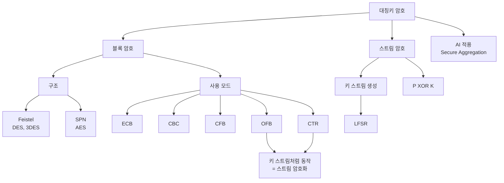

# 12강. 컴퓨터보안: 대칭키 암호

## 🔗 선수 지식 (Prerequisites)
- [ ] **필수**: 암호의 기본 개념(평문·암호문·키, 암호화/복호화) - 이해 완료? `→←2강`
- [ ] **필수**: 비트 연산(XOR), 모듈러 연산의 기초 - 이해 완료?
- [ ] **권장**: 대칭키/공개키 암호의 분류, 2강의 암호 시스템 개요
- **관련 단원**: [11강. 컴퓨터보안](11강.md), [13강. 공개키 암호](13강.md)

---

## 학습 목표
1. 대칭키 암호의 개념과 특징을 설명할 수 있다.
2. 블록 암호의 개념과 구조(Feistel, SPN), 사용 모드(ECB·CBC·CFB·OFB·CTR)를 설명할 수 있다.
3. 스트림 암호의 개념과 키 스트림 생성(LFSR 포함)에 대해 설명할 수 있다.
4. DES, TDEA(3DES), AES 알고리즘의 구조와 파라미터를 설명할 수 있다.

---

## 🧠 메타인지 체크 (학습 전/후 자기 평가)

### 학습 전 자기 평가
| 소주제 | 자신감 (1-5) |
| :--- | :--- |
| 블록 암호 구조(Feistel vs SPN) | |
| 블록 암호 사용 모드 5종 | |
| 스트림 암호 / LFSR | |
| DES · TDEA · AES 파라미터 | |

### 학습 후 교정 (학습 완료 후 작성)
| 소주제 | 학습 전 | 학습 후 | 실제 정답률 | 과신/과소 여부 |
| :--- | :--- | :--- | :--- | :--- |
| 블록 암호 구조(Feistel vs SPN) | | | | |
| 블록 암호 사용 모드 5종 | | | | |
| 스트림 암호 / LFSR | | | | |
| DES · TDEA · AES 파라미터 | | | | |

> **활용법**: 학습 전 1분 → 자신감 기입, 학습 후 1분 → 나머지 기입. "과신" 영역이 실제 취약점.

---

## 📝 요약 (Summary)

1. 🔴 **대칭키 암호**: 암호화와 복호화에 하나의 **같은 비밀키**를 사용하는 암호방식이다. 키 공유 문제가 있으나 연산이 빠르다.
2. 🔴 **블록 암호**: 평문을 고정된 크기의 **블록**으로 나누어 블록마다 암호화 과정을 수행해 블록 단위로 암호문을 얻는 대칭키 암호 방식이다.
3. 🔴 **블록 암호 구조**: 블록 암호 알고리즘 구조는 **파이스텔(Feistel) 구조**와 **SPN(Substitution-Permutation Network) 구조**로 나뉜다.
4. 🔴 **블록 암호 사용 모드**: 전자 코드 북(**ECB**), 암호 블록 연결(**CBC**), 암호 피드백(**CFB**), 출력 피드백(**OFB**), 카운터(**CTR**) 모드가 있다.
5. 🔴 **스트림 암호**: 평문과 같은 길이의 **키 스트림**을 생성하여 평문과 키를 **비트 단위로 XOR**하여 암호문을 얻는 대칭키 암호 방식이다.
6. 🟡 **LFSR**: 선형 귀환 시프트 레지스터(LFSR)는 키 스트림을 생성할 수 있는 **기초적인 방식**의 하나이다.
7. 🔴 **DES / TDEA**: DES는 블록 64비트, 키 56비트의 **파이스텔 구조**이며, TDEA는 DES를 **세 번** 적용하는 알고리즘으로 **3DES**라고도 한다.
8. 🔴 **AES**: 블록 128비트, 키 128/192/256비트 중 택일하며 **SPN 구조**이다.

---

## 📐 핵심 정의 및 원리 (Key Definitions & Principles)

> 이 강의는 이론 + 알고리즘 중심 단원이므로, 정의·원리 테이블과 핵심 수식(XOR)을 함께 정리한다.

| 정의명 | 내용 | 키워드 |
| :--- | :--- | :--- |
| **대칭키 암호(Symmetric-key)** | 암호화·복호화에 동일한 비밀키를 사용하는 방식. 빠르지만 키 분배가 과제. | 동일 키, 비밀키, 키 분배 |
| **블록 암호(Block Cipher)** | 평문을 고정 크기 블록으로 나눠 블록 단위로 암·복호화. | 고정 블록, 패딩 |
| **스트림 암호(Stream Cipher)** | 키 스트림을 생성해 평문과 비트 단위 XOR로 암·복호화. | 키 스트림, XOR, 비트 단위 |
| **파이스텔 구조(Feistel)** | 블록을 좌/우로 나눠 라운드마다 한쪽에 F함수+XOR 적용 후 교환. 암·복호화 구조가 동일. | 좌우 분할, 라운드, 동일 회로 |
| **SPN 구조** | 치환(Substitution, S-box)과 순열(Permutation)을 반복 적용. 병렬화 유리. | S-box, P-box, 치환·순열 |
| **혼돈과 확산(Confusion & Diffusion)** | Shannon이 제시한 안전한 암호의 두 원리. 치환=혼돈, 순열=확산. | Shannon, 치환=혼돈, 순열=확산 |
| **초기화 벡터(IV)** | CBC/CFB/OFB에서 첫 블록 연산에 쓰는 무작위 초기값. 동일 평문의 동일 암호문 방지. | Initialization Vector, 무작위 |
| **LFSR** | 시프트 레지스터와 XOR 귀환으로 의사난수 키 스트림을 생성하는 회로. | 시프트, 귀환 탭, 의사난수 |
| **DES** | 블록 64비트·키 56비트·16라운드 파이스텔. 현재는 키 길이가 짧아 안전하지 않음. | 64/56, 16라운드, Feistel |
| **TDEA(3DES)** | DES를 세 번(E-D-E) 적용해 키 길이를 늘린 알고리즘. | 3DES, EDE, 112/168비트 |
| **AES** | 블록 128비트·키 128/192/256비트의 SPN. Rijndael 기반 현 표준. | 128블록, SPN, Rijndael |

### 핵심 수식 — XOR 기반 암·복호화 (스트림 암호)

| 수식명 | 수식 | 의미 |
| :--- | :--- | :--- |
| **암호화** | $C = P \oplus K$ | 평문 비트와 키 스트림 비트의 XOR |
| **복호화** | $P = C \oplus K$ | 같은 키로 다시 XOR하면 평문 복원 |
| **XOR 자기역원** | $P \oplus K \oplus K = P$ | $K \oplus K = 0$, $P \oplus 0 = P$ |

**스트림 암호의 복호화 성립 원리**
$$
C \oplus K = (P \oplus K) \oplus K = P \oplus (K \oplus K) = P \oplus 0 = P
$$
> **직관적 해석**: XOR은 같은 값을 두 번 적용하면 원래대로 돌아온다. 그래서 암호화·복호화에 **똑같은 키 스트림**만 있으면 된다(전형적 대칭키).
> **AI 적용**: 차분 프라이버시(Differential Privacy)에서 데이터에 무작위 노이즈를 더하고 빼는 마스킹, 연합학습의 보안 집계(Secure Aggregation)에서 모델 업데이트를 일회용 마스크로 XOR-마스킹해 개별 값을 숨기는 데 동일한 원리가 쓰인다.

---

## 📊 개념 시각화 (Visual Guide)

### 개념 분류 체계도 (이론 중심 — 필수)



### 핵심 비교표 — 블록 암호 vs 스트림 암호

| 구분 | 블록 암호 | 스트림 암호 | AI 적용 |
| :--- | :--- | :--- | :--- |
| **처리 단위** | 고정 크기 블록(64/128비트) | 비트(또는 바이트) 단위 | 대용량 모델 가중치 일괄 암호화 |
| **핵심 연산** | 치환·순열 반복 | 평문 ⊕ 키 스트림 | 실시간 스트리밍 추론 보호 |
| **대표 알고리즘** | DES, 3DES, AES | RC4, ChaCha20 (블록모드 중 OFB·CTR이 스트림처럼 동작) | — |
| **속도/지연** | 블록 채워야 처리 | 즉시 처리(저지연) | 엣지 디바이스 저지연 암호화 |
| **오류 전파** | 모드에 따라 다름 | (동기식 스트림암호 기준) 비트 오류가 해당 비트만 영향 | 노이즈 채널 견고성 |
| **패딩** | 필요(블록 미달 시) | 불필요 | — |

> **정밀화 1 — "스트림 대표 알고리즘"의 구분**: RC4·ChaCha20은 *그 자체가 스트림 암호 알고리즘*이지만, **OFB·CTR은 블록 암호의 운용 모드(mode of operation)**로서 키 스트림을 만들어 "스트림처럼 동작"할 뿐 독립된 스트림 알고리즘이 아니다. 둘을 같은 칸에 나열하지 않도록 위 표에서 괄호로 구분했다. (근거: Block cipher mode of operation, Wikipedia)
> **정밀화 2 — 오류 전파의 전제**: "비트 오류가 해당 비트에만 영향"은 **동기식 스트림 암호(synchronous stream cipher)** 기준이다. 키 스트림이 평문·암호문에 의존하는 **자기동기식(self-synchronizing)** 스트림 암호는 오류가 일정 구간 전파된다. (근거: Stream cipher, Wikipedia)

---

## ✏️ 심화 학습 (Study Subject)

### 1. 가상 시나리오: "왜 ECB 모드를 쓰면 안 될까?"

- **상황**: 한 개발자가 사용자 프로필 이미지를 AES로 암호화해 저장하면서, 구현이 가장 간단한 **ECB 모드**를 선택했다. 암호화된 이미지를 저장소에 올렸는데, 암호문 파일을 그대로 이미지로 렌더링하니 원본 윤곽(예: 펭귄 로고)이 흐릿하게 보였다.
- **문제**: ECB는 같은 평문 블록을 **항상 같은 암호문 블록**으로 변환한다. 따라서 이미지처럼 동일 패턴(같은 색 픽셀)이 반복되는 데이터는 암호문에도 패턴이 그대로 남아 정보가 누출된다.
- **해결**: ① 각 블록을 직전 암호문과 XOR한 뒤 암호화하는 **CBC 모드**를 사용해 동일 평문 블록도 서로 다른 암호문이 되도록 한다. ② 무작위 **IV**를 매번 새로 생성해 같은 평문 파일도 매번 다른 암호문이 되게 한다. ③ 병렬성·무결성이 필요하면 **CTR 모드** + 인증(GCM)을 고려한다.
- **AI 학습 포인트**: "연합학습에서 각 클라이언트의 모델 업데이트를 암호화해 서버로 보낼 때, ECB 같은 결정적(deterministic) 암호화가 왜 멤버십 추론 공격에 취약한지, IV/논스 기반 모드가 어떻게 이를 완화하는지 설명해줘."

### 2. 관점별 비교 및 오개념 분석

- **핵심 비교**: 자주 혼동되는 개념 쌍 정리
  - **Feistel vs SPN**: Feistel은 블록을 좌우로 나눠 한쪽만 변환·교환(암복호 회로 동일), SPN은 블록 전체에 S-box·P-box를 반복 적용(병렬 유리).
  - **혼돈(Confusion) vs 확산(Diffusion)**: 혼돈은 키와 암호문의 관계를 복잡하게(치환/S-box), 확산은 평문 1비트 변화가 암호문 여러 비트로 퍼지게(순열/P-box).
  - **OFB vs CTR**: 둘 다 블록 암호로 키 스트림을 만드는 "스트림 암호화" 모드. OFB는 출력을 다시 입력으로 피드백(직렬), CTR은 증가하는 카운터를 암호화(병렬 가능).

- **오개념 분석**:
    - **오개념 1**: "3DES는 DES를 세 번 했으므로 키 길이가 $56 \times 3 = 168$비트라서 168비트만큼 안전하다."
    - **분석**: 키 비트 수는 168비트(또는 두 키 옵션이면 112비트)이지만, **중간자 공격(Meet-in-the-Middle)** 때문에 실제 유효 보안 강도는 약 112비트 수준이다. "키 길이 = 보안 강도"라는 등식은 항상 성립하지 않는다.
    - **오개념 2**: "스트림 암호는 키 스트림만 XOR하는 단순한 방식이라 항상 약하다."
    - **분석**: 키 스트림이 진짜 난수이고 **한 번만**(one-time pad) 쓰이면 정보이론적으로 안전하다. 문제는 키 스트림 **재사용**($C_1 \oplus C_2 = P_1 \oplus P_2$로 키가 사라져 평문 관계 노출)이다. 약점은 방식이 아니라 운용(키 재사용)에 있다.

- **AI 학습 포인트**: "혼돈과 확산을 신경망의 비선형 활성화 함수(혼돈)와 가중치 혼합/믹싱 레이어(확산)에 비유해 설명하고, 두 개념이 왜 함께 있어야 안전한 암호가 되는지 알려줘."

### 3. 핵심 보완: 알고리즘 파라미터와 운용상의 함정

#### 3-1. 3DES와 Sweet32 (CVE-2016-2183)
3DES의 약점은 *유효 키 강도*뿐만이 아니다. (근거: Triple DES, Wikipedia)
- **유효 강도 112비트**: 오개념 1에서 본 대로, 중간자 공격으로 168비트 키도 유효 강도는 약 112비트.
- **블록 크기 문제(Sweet32)**: 3DES는 DES와 같은 **64비트 블록**을 쓴다. 같은 키로 대량(약 $2^{32}$ 블록 ≈ 32GB)을 암호화하면 **생일 한계(birthday bound)**에 도달해 블록 충돌로 평문 정보가 새는 **Sweet32 공격(CVE-2016-2183)**이 가능하다. 이는 키 강도와 별개인 *블록 크기*에서 오는 약점이다.
- 이 두 이유로 **NIST는 3DES를 폐지(deprecation) 수순**에 두었고, AES(128비트 블록) 전환이 권장된다.

#### 3-2. AES 라운드 수 (키 길이별) (근거: Advanced Encryption Standard, Wikipedia)
AES는 키 길이에 따라 라운드 수가 다르다.

| 키 길이 | 라운드 수 |
| :--- | :--- |
| **AES-128** | 10 라운드 |
| **AES-192** | 12 라운드 |
| **AES-256** | 14 라운드 |

#### 3-3. CTR·OFB의 논스/IV 재사용은 치명적
스트림처럼 동작하는 모드(OFB·CTR)에서 같은 키로 **(논스·IV)를 재사용하면** 같은 키 스트림이 두 번 생성된다. 그러면 스트림 암호의 키 재사용 약점이 그대로 나타나:
$$ C_1 \oplus C_2 = (P_1 \oplus K) \oplus (P_2 \oplus K) = P_1 \oplus P_2 $$
키가 소거되고 두 평문의 XOR이 노출된다. → **CTR/OFB에서 (키, 논스) 조합은 절대 재사용 금지.**

#### 3-4. 패딩 오라클 공격(Padding Oracle, CBC + PKCS#7)
CBC 모드는 블록 크기를 맞추기 위해 **PKCS#7 패딩**을 쓰는데, 복호화 시 *패딩이 올바른지 여부*가 오류 메시지·응답 시간 등으로 공격자에게 새면(=오라클), 키 없이도 한 바이트씩 평문을 복원할 수 있다. 이것이 **패딩 오라클 공격**이다. 방어는 ① 패딩 오류와 다른 오류를 구분되지 않게 처리, ② 무엇보다 **복호화 전에 무결성(MAC/AEAD)을 먼저 검증**(Encrypt-then-MAC, 또는 GCM 같은 AEAD 사용)이다. (근거: Padding oracle attack, Wikipedia)

---

## ❓ 연습 문제 및 해설

> **블룸 인지 수준 범례**: [기억] 정의·나열 → [이해] 설명·비교 → [적용] 계산·구현 → [분석] 구별·디버그 → [평가] 판단·비평 → [창조] 설계·제안
> (원본 강의에 연습문제가 없어 전 범위를 커버하도록 10문항을 새로 출제함 — 모두 📌 표시)

### 📝 문제

**1. ⭐ 📌 [기억] 대칭키 암호에 대한 설명으로 옳은 것은?[🔗](#prob-1)**
   > ① 암호화와 복호화에 서로 다른 키를 사용한다.
   > ② 암호화와 복호화에 하나의 같은 비밀키를 사용한다.
   > ③ 공개키와 개인키 쌍을 사용한다.
   > ④ 키가 없어도 복호화가 가능하다.

<br>

**2. ⭐ 📌 [기억] 블록 암호 알고리즘의 두 가지 대표 구조를 바르게 짝지은 것은?[🔗](#prob-2)**
   > ① 파이스텔 구조 — SPN 구조
   > ② ECB 구조 — CBC 구조
   > ③ 대칭 구조 — 비대칭 구조
   > ④ LFSR 구조 — 해시 구조

<br>

**3. ⭐ 📌 [기억] 블록 암호의 사용 모드에 해당하지 않는 것은?[🔗](#prob-3)**
   > ① ECB(전자 코드 북)
   > ② CBC(암호 블록 연결)
   > ③ RSA(공개키)
   > ④ CTR(카운터)

<br>

**4. ⭐⭐ 📌 [이해] 스트림 암호의 암호화 과정으로 가장 적절한 것은?[🔗](#prob-4)**
   > ① 평문 블록을 S-box로 치환한다.
   > ② 평문과 키 스트림을 비트 단위로 XOR한다.
   > ③ 평문을 공개키로 거듭제곱한다.
   > ④ 평문을 해시 함수에 통과시킨다.

<br>

**5. ⭐⭐ 📌 [이해] DES와 AES를 비교한 설명으로 옳은 것은?[🔗](#prob-5)**
   > ① DES의 블록 크기는 128비트이다.
   > ② AES는 파이스텔 구조이다.
   > ③ DES의 키 크기는 56비트이고 AES는 128/192/256비트 중 택일한다.
   > ④ AES의 키 크기는 56비트로 고정이다.

<br>

**6. ⭐⭐ 📌 [이해] <보기>에서 SPN 구조의 특징으로 옳은 것을 모두 고르시오.[🔗](#prob-6)**
   > <보기>
   >
   > 가. 치환(Substitution)과 순열(Permutation)을 반복 적용한다.
   > 나. AES가 채택한 구조이다.
   > 다. 블록을 좌우로 나눈 뒤 한쪽에만 F함수를 적용하고 교환한다.
   > 라. 혼돈과 확산을 각각 S-box와 P-box로 구현한다.

   > ① 가, 나
   > ② 가, 나, 라
   > ③ 나, 다, 라
   > ④ 가, 나, 다, 라

<br>

**7. ⭐⭐ 📌 [적용] 키 스트림 $K = 1011$, 평문 $P = 1101$일 때, 스트림 암호의 암호문 $C = P \oplus K$는?[🔗](#prob-7)**
   > ① 0110
   > ② 1110
   > ③ 0010
   > ④ 1001

<br>

**8. ⭐⭐ 📌 [분석] 다음 사례에서 부적절하게 선택된 블록 암호 모드와 그 이유로 옳은 것은?[🔗](#prob-8)**
   > <사례>
   >
   > 동일한 패턴이 반복되는 이미지를 암호화했더니 암호문에서도 원본 윤곽이 드러났다.

   > ① CBC — 오류 전파가 심해서
   > ② ECB — 같은 평문 블록이 항상 같은 암호문이 되어 패턴이 노출되어서
   > ③ CTR — 카운터가 중복되어서
   > ④ OFB — IV가 없어서

<br>

**9. ⭐⭐⭐ 📌 [평가] TDEA(3DES)의 "키 길이는 168비트인데 유효 보안 강도는 그보다 낮다"는 주장이 옳은지 판단하고 이유를 서술하시오.[🔗](#prob-9)**

<br>

**10. ⭐⭐⭐ 📌 [창조] 실시간으로 들어오는 대용량 영상 스트림을 저지연·병렬 처리하면서 안전하게 암호화하려 한다. 적합한 블록 암호 사용 모드를 선택하고, ECB·CBC와 비교해 그 이유를 서술하시오.[🔗](#prob-10)**

---

### 🔑 정답 및 해설 (먼저 풀어본 후 펼치기)

<details>
<summary>정답 보기 (클릭)</summary>

1. ②
2. ①
3. ③
4. ②
5. ③
6. ②
7. ①
8. ②
9. [서술형] 옳다 — 중간자 공격으로 유효 강도 ≈ 112비트
10. [서술형] CTR 모드 (병렬·저지연, IV/논스로 패턴 노출 방지)

</details>

<details>
<summary>해설 보기 (클릭)</summary>

<a id="prob-1"></a>
**1. ⭐ [기억] 대칭키 암호의 정의**
> **정답: ② 암호화와 복호화에 하나의 같은 비밀키를 사용한다.**
> **해설**: 대칭키 암호의 핵심은 단일 비밀키 공유. ①③은 공개키(비대칭) 암호의 설명, ④는 성립할 수 없다.

<a id="prob-2"></a>
**2. ⭐ [기억] 블록 암호의 두 구조**
> **정답: ① 파이스텔 구조 — SPN 구조**
> **해설**: 블록 암호 구조는 Feistel과 SPN으로 나뉜다. ECB·CBC는 "사용 모드"이지 구조가 아니며, LFSR은 스트림 암호의 키 스트림 생성 방식.

<a id="prob-3"></a>
**3. ⭐ [기억] 블록 암호 사용 모드가 아닌 것**
> **정답: ③ RSA(공개키)**
> **해설**: RSA는 공개키 암호 알고리즘이다. 블록 암호 사용 모드는 ECB·CBC·CFB·OFB·CTR 5종.

<a id="prob-4"></a>
**4. ⭐⭐ [이해] 스트림 암호의 암호화**
> **정답: ② 평문과 키 스트림을 비트 단위로 XOR한다.**
> **해설**: 스트림 암호는 평문과 같은 길이의 키 스트림을 생성해 비트 단위 XOR($C=P\oplus K$). ①은 블록 암호, ③은 공개키, ④는 해시.

<a id="prob-5"></a>
**5. ⭐⭐ [이해] DES vs AES**
> **정답: ③ DES의 키 크기는 56비트이고 AES는 128/192/256비트 중 택일한다.**
> **해설**: DES는 블록 64·키 56비트의 Feistel, AES는 블록 128·키 128/192/256비트의 SPN. ①②④는 모두 파라미터/구조가 뒤바뀐 오답.

<a id="prob-6"></a>
**6. ⭐⭐ [이해] SPN 구조의 특징**
> **정답: ② 가, 나, 라**
> **해설**: 다(좌우 분할 후 한쪽 F함수+교환)는 **파이스텔 구조**의 특징이므로 SPN이 아니다. 가·나·라는 SPN의 옳은 설명.

<a id="prob-7"></a>
**7. ⭐⭐ [적용] XOR 암호문 계산**
> **정답: ① 0110**
> **해설**: 비트별 XOR — $1\oplus1=0$, $1\oplus0=1$, $0\oplus1=1$, $1\oplus1=0$ → $1101 \oplus 1011 = 0110$.

<a id="prob-8"></a>
**8. ⭐⭐ [분석] 부적절한 모드 진단**
> **정답: ② ECB — 같은 평문 블록이 항상 같은 암호문이 되어 패턴이 노출되어서**
> **해설**: ECB는 결정적이라 동일 평문 블록 → 동일 암호문 블록이 되어 이미지 윤곽 등 패턴이 유출된다. CBC/CTR/OFB는 IV·카운터로 이를 방지.

<a id="prob-9"></a>
**9. ⭐⭐⭐ [평가] 3DES의 유효 보안 강도**
> **정답: 옳다.**
> **해설**: 3개 키(각 56비트)를 쓰면 총 키 비트는 168비트이지만, **중간자 공격(Meet-in-the-Middle)**으로 한쪽을 미리 계산해 맞춰보는 방식 때문에 유효 보안 강도는 약 **112비트** 수준으로 떨어진다. 두 키 옵션(K1=K3)은 더 낮다. 따라서 "키 비트 수 = 보안 강도"는 성립하지 않으며, 현재는 AES 사용이 권장된다.

<a id="prob-10"></a>
**10. ⭐⭐⭐ [창조] 실시간 스트림에 적합한 모드 설계**
> **정답(예시): CTR(카운터) 모드**
> **해설**:
> ① **저지연**: CTR은 (논스+카운터)를 암호화해 키 스트림을 만든 뒤 평문과 XOR하므로, 블록이 다 차기를 기다리지 않고 바이트 단위로 즉시 처리 가능 → 스트림 암호처럼 동작.
> ② **병렬성**: 각 블록의 카운터 값이 독립적이라 여러 블록을 동시에 암·복호화 가능(GPU/멀티코어에 유리). CBC는 직전 암호문에 의존해 직렬 처리만 가능.
> ③ **패턴 노출 방지**: 매 메시지마다 새 논스를 쓰면 동일 평문도 다른 암호문이 되어 ECB의 패턴 누출 문제가 없다.
> ④ **주의**: (논스, 카운터) 조합을 절대 재사용하지 말아야 하며, 무결성이 필요하면 인증을 결합한 GCM 같은 모드를 권장.

</details>

---

## ✅ O/X 확인문제 (총 20문항)

**1.** 대칭키 암호는 암호화와 복호화에 하나의 같은 비밀키를 사용한다.[🔗](#ox-1) **(O / X)**
**2.** 블록 암호는 평문을 고정된 크기의 블록으로 나누어 블록 단위로 암호화한다.[🔗](#ox-2) **(O / X)**
**3.** 블록 암호 알고리즘의 구조는 파이스텔 구조와 SPN 구조로 나뉜다.[🔗](#ox-3) **(O / X)**
**4.** ECB, CBC, CFB, OFB, CTR은 모두 블록 암호의 사용 모드이다.[🔗](#ox-4) **(O / X)**
**5.** 스트림 암호는 평문과 키 스트림을 비트 단위로 XOR하여 암호문을 얻는다.[🔗](#ox-5) **(O / X)**
**6.** LFSR은 키 스트림을 생성할 수 있는 기초적인 방식의 하나이다.[🔗](#ox-6) **(O / X)**
**7.** DES의 블록 크기는 128비트이다.[🔗](#ox-7) **(O / X)**
**8.** DES의 키 크기는 56비트이며 파이스텔 구조를 사용한다.[🔗](#ox-8) **(O / X)**
**9.** TDEA는 DES를 세 번 적용하는 알고리즘으로 3DES라고도 한다.[🔗](#ox-9) **(O / X)**
**10.** AES의 블록 크기는 128비트이다.[🔗](#ox-10) **(O / X)**
**11.** AES의 키 크기는 128, 192, 256비트 중에서 선택한다.[🔗](#ox-11) **(O / X)**
**12.** AES는 파이스텔 구조를 사용한다.[🔗](#ox-12) **(O / X)**
**13.** ECB 모드는 같은 평문 블록을 항상 같은 암호문 블록으로 변환한다.[🔗](#ox-13) **(O / X)**
**14.** CBC 모드는 각 평문 블록을 직전 암호문 블록과 XOR한 후 암호화한다.[🔗](#ox-14) **(O / X)**
**15.** OFB와 CTR 모드는 블록 암호를 이용해 키 스트림을 생성하므로 스트림 암호처럼 동작한다.[🔗](#ox-15) **(O / X)**
**16.** 초기화 벡터(IV)는 동일한 평문이 동일한 암호문이 되는 것을 방지하는 데 사용된다.[🔗](#ox-16) **(O / X)**
**17.** 같은 키 스트림을 두 개의 서로 다른 평문에 재사용해도 안전하다.[🔗](#ox-17) **(O / X)**
**18.** 파이스텔 구조는 암호화와 복호화에 본질적으로 동일한 회로를 사용할 수 있다.[🔗](#ox-18) **(O / X)**
**19.** SPN 구조에서 S-box는 확산(diffusion)을, P-box는 혼돈(confusion)을 담당한다.[🔗](#ox-19) **(O / X)**
**20.** 3DES의 키 비트 수가 168비트이므로 유효 보안 강도도 정확히 168비트이다.[🔗](#ox-20) **(O / X)**

<details>
<summary>O/X 정답 및 해설 보기 (클릭)</summary>

> <a id="ox-1"></a>
> **1. 정답**: O
> **해설**: 대칭키 암호의 정의 그대로.

> <a id="ox-2"></a>
> **2. 정답**: O
> **해설**: 블록 암호는 고정 크기 블록 단위로 처리.

> <a id="ox-3"></a>
> **3. 정답**: O
> **해설**: Feistel과 SPN이 두 대표 구조.

> <a id="ox-4"></a>
> **4. 정답**: O
> **해설**: 다섯 가지 모두 블록 암호의 표준 사용 모드.

> <a id="ox-5"></a>
> **5. 정답**: O
> **해설**: $C = P \oplus K$ — 스트림 암호의 핵심 연산.

> <a id="ox-6"></a>
> **6. 정답**: O
> **해설**: LFSR은 의사난수 키 스트림 생성의 기초적 방식.

> <a id="ox-7"></a>
> **7. 정답**: X
> **해설**: DES의 블록 크기는 64비트이다. 128비트는 AES.

> <a id="ox-8"></a>
> **8. 정답**: O
> **해설**: DES = 블록 64 / 키 56 / 파이스텔 구조.

> <a id="ox-9"></a>
> **9. 정답**: O
> **해설**: TDEA = Triple DES = 3DES.

> <a id="ox-10"></a>
> **10. 정답**: O
> **해설**: AES의 블록 크기는 128비트 고정.

> <a id="ox-11"></a>
> **11. 정답**: O
> **해설**: AES는 키 128/192/256비트 중 택일.

> <a id="ox-12"></a>
> **12. 정답**: X
> **해설**: AES는 SPN 구조이다. 파이스텔은 DES.

> <a id="ox-13"></a>
> **13. 정답**: O
> **해설**: ECB의 결정적 특성 — 패턴 노출의 원인.

> <a id="ox-14"></a>
> **14. 정답**: O
> **해설**: CBC(Cipher Block Chaining)의 정의.

> <a id="ox-15"></a>
> **15. 정답**: O
> **해설**: OFB·CTR은 블록 암호로 키 스트림을 만들어 XOR하므로 스트림 암호처럼 작동.

> <a id="ox-16"></a>
> **16. 정답**: O
> **해설**: 무작위 IV로 동일 평문도 매번 다른 암호문이 됨.

> <a id="ox-17"></a>
> **17. 정답**: X
> **해설**: 키 스트림을 재사용하면 $C_1 \oplus C_2 = P_1 \oplus P_2$로 키가 소거되어 평문 관계가 노출된다(절대 금지).

> <a id="ox-18"></a>
> **18. 정답**: O
> **해설**: 파이스텔 구조는 라운드 키 순서만 뒤집으면 동일 회로로 복호화 가능 — 구현상의 큰 장점.

> <a id="ox-19"></a>
> **19. 정답**: X
> **해설**: 반대다. S-box(치환)는 혼돈(confusion), P-box(순열)는 확산(diffusion)을 담당한다.

> <a id="ox-20"></a>
> **20. 정답**: X
> **해설**: 중간자 공격으로 유효 강도는 약 112비트 수준. 키 비트 수와 실제 보안 강도는 다르다.

</details>

---

## 🧪 자유 회상 연습 (Free Recall)

> **방법**: 위의 노트를 모두 덮고, 타이머 3분 설정 후 이번 단원에서 배운 내용을 기억나는 대로 자유롭게 적으세요.
> 정확한 문장이 아니어도 됩니다. 키워드, 수식, 관계 등 떠오르는 것을 모두 적습니다.

**자유 회상 작성란:**

```
[여기에 기억나는 내용을 자유롭게 작성]


```

> **회상 후 점검**: 노트를 다시 펼쳐 빠뜨린 내용을 확인하세요. 빠뜨린 부분이 실제 취약점입니다.
> - 회상 못한 핵심 개념(예: Feistel/SPN, 모드 5종): [                ]
> - 회상 못한 파라미터(DES 64/56, AES 128/…): [                ]

---

## 💻 코드로 확인하기 (Code Verification)

스트림 암호의 XOR 원리와 ECB의 패턴 노출 문제를 순수 Python으로 시연한다.

```python
# 1) 스트림 암호 — XOR 암·복호화는 같은 키로 두 번 적용
def stream_xor(data: bytes, keystream: bytes) -> bytes:
    return bytes(d ^ k for d, k in zip(data, keystream))

plain = b"SYMMETRIC"
key   = bytes([0x3A, 0x77, 0x10, 0x55, 0x9C, 0x01, 0xFE, 0x42, 0x8B])  # 키 스트림

cipher = stream_xor(plain, key)        # 암호화: C = P ⊕ K
recovered = stream_xor(cipher, key)    # 복호화: P = C ⊕ K
print("암호문(hex):", cipher.hex())
print("복호문      :", recovered.decode())
print("복원 성공   :", recovered == plain)

# 2) 키 스트림 재사용의 위험 — C1 ⊕ C2 = P1 ⊕ P2 (키가 사라짐)
p1, p2 = b"ATTACK_AT_DAWN!!", b"DEFEND_THE_GATE!"
ks = bytes(range(16))                       # 동일 키 스트림을 두 번 재사용(나쁜 예)
c1 = stream_xor(p1, ks)
c2 = stream_xor(p2, ks)
leak = stream_xor(c1, c2)                    # = p1 ⊕ p2  (키 소거)
print("C1⊕C2 == P1⊕P2 :", leak == stream_xor(p1, p2))

# 3) ECB 패턴 노출 — 같은 평문 블록 → 같은 암호문 블록(결정적)
def toy_block_encrypt(block: bytes, k: int = 0x5A) -> bytes:
    return bytes(b ^ k for b in block)       # 학습용 결정적 블록 암호(개념 시연)

def ecb(data: bytes, bs: int = 4) -> list:
    return [toy_block_encrypt(data[i:i+bs]).hex() for i in range(0, len(data), bs)]

image_like = b"AAAABBBBAAAACCCC"             # 'AAAA' 블록이 반복되는 데이터
print("ECB 블록들:", ecb(image_like))
```

> **실행 결과 (예상)**:
> ```
> 암호문(hex): 6900... (생략)
> 복호문      : SYMMETRIC
> 복원 성공   : True
> C1⊕C2 == P1⊕P2 : True
> ECB 블록들: ['1b1b1b1b', '...', '1b1b1b1b', '...']   # 1·3번째(AAAA) 블록이 동일!
> ```
> **해석**: ① XOR은 같은 키로 두 번 적용 시 평문이 그대로 복원됨(대칭키 본질). ② 키 스트림을 재사용하면 두 암호문의 XOR이 두 평문의 XOR과 같아 키가 무력화됨 → **일회용 키 스트림** 필수. ③ ECB에서 반복되는 'AAAA' 블록이 동일한 암호문(`1b1b1b1b`)으로 나타나 패턴이 그대로 노출 → 실무에서 ECB 금지.

---

## 🤖 AI 연결고리 (Concept → AI Application)

| 보안 개념 | AI/ML 적용 분야 | 구체적 사례 |
| :--- | :--- | :--- |
| **XOR 마스킹(스트림)** | 연합학습 보안 집계 | Secure Aggregation에서 일회용 마스크로 모델 업데이트를 XOR-마스킹 |
| **블록 암호(AES)** | 모델 가중치 보호 | 배포 모델 파일을 AES-256으로 암호화해 IP 유출 방지 |
| **IV/논스로 비결정성** | 멤버십 추론 방어 | 동일 입력의 결정적 암호화 회피로 추론 공격 완화 |
| **혼돈·확산** | 적대적 견고성 직관 | 비선형 활성화(혼돈)+레이어 믹싱(확산)의 안정성 비유 |
| **CTR 병렬성** | GPU 대용량 암호화 | 학습 데이터셋 병렬 암·복호화로 I/O 처리량 향상 |
| **키 관리** | MLOps 시크릿 관리 | KMS/Vault로 데이터·모델 암호화 키 회전 관리 |

---

## 📖 심화 학습 예시 답안

#### 1. 파이스텔 구조의 내부 동작 원리

파이스텔 구조는 "암호화와 복호화에 같은 회로를 쓸 수 있다"는 우아한 성질을 가진다.

1. **블록 분할**: 입력 블록을 좌($L_0$)·우($R_0$) 절반으로 나눈다.
2. **라운드 함수**: 각 라운드에서 $L_{i} = R_{i-1}$, $R_{i} = L_{i-1} \oplus F(R_{i-1}, K_i)$ 를 계산한다. F는 비선형 함수, $K_i$는 라운드 키.
3. **교환(Swap)**: 좌우를 교환하며 여러 라운드(DES는 16) 반복한다.
4. **복호화의 대칭성**: F가 가역일 필요가 **없다**. 라운드 키를 역순($K_{16}, \dots, K_1$)으로 넣으면 같은 회로가 복호화가 된다 — XOR의 자기역원 성질 덕분.

#### 2. Feistel vs SPN 비교표

| 구분 | 파이스텔(Feistel) | SPN | 비고 |
| :--- | :--- | :--- | :--- |
| **기본 연산** | 좌우 분할 + F함수 + XOR + 교환 | S-box(치환) + P-box(순열) 반복 | — |
| **암·복호 회로** | 동일(라운드 키 역순) | 별도 역연산 필요(역 S-box 등) | Feistel 구현 간단 |
| **F함수 가역성** | 불필요 | S-box는 가역이어야 함 | Feistel 설계 자유도↑ |
| **병렬화** | 상대적으로 불리(좌우 의존) | 블록 전체 병렬 처리 유리 | AES 고속화 |
| **대표 알고리즘** | DES, 3DES, Blowfish | AES(Rijndael) | — |

#### 3. 안전한 대칭키 암호화 작성법 (Best Practice)

- **Bad Practice (나쁜 예시)**
  ```python
  # ECB 모드 + 고정 키, IV 없음 → 패턴 노출·재현 공격에 취약
  from Crypto.Cipher import AES
  cipher = AES.new(key, AES.MODE_ECB)        # ❌ ECB 사용
  ct = cipher.encrypt(pad(plaintext, 16))
  ```
- **Good Practice (좋은 예시)**
  ```python
  # 인증 결합 모드(GCM) + 매번 새로운 무작위 논스 → 기밀성 + 무결성
  import os
  from Crypto.Cipher import AES
  nonce = os.urandom(12)                      # ✅ 메시지마다 새 논스
  cipher = AES.new(key, AES.MODE_GCM, nonce=nonce)
  ct, tag = cipher.encrypt_and_digest(plaintext)   # 변조 탐지용 tag 함께 생성
  # 전송: nonce || ct || tag
  ```
- **설명**: ECB는 결정적이라 패턴이 노출되고 무결성 보장도 없다. GCM(CTR 기반 + 인증)은 매번 새로운 논스로 비결정성을 확보하고, 인증 태그로 변조까지 탐지한다. 키 길이는 AES-256을 권장하고 키는 KMS 등으로 안전하게 관리한다.

#### 4. 심층 확장: AEAD·모드 비교·경량 암호

##### 4-1. AEAD(인증된 암호화) — 기밀성 + 무결성 동시
지금까지의 모드(ECB·CBC·CFB·OFB·CTR)는 **기밀성만** 제공하고 변조 탐지(무결성)는 못 한다(그래서 패딩 오라클 같은 공격이 가능). **AEAD(Authenticated Encryption with Associated Data)**는 *암호화와 인증을 한 번에* 수행해 기밀성 + 무결성 + (헤더 등 평문으로 둘 부분의) 인증을 동시에 보장한다.
- **AES-GCM**: CTR 모드(기밀성) + GHASH(인증 태그)를 결합한 표준 AEAD. (근거: NIST SP 800-38D)
- **ChaCha20-Poly1305**: 스트림 암호 ChaCha20 + Poly1305 MAC. 전용 AES 하드웨어가 없는 모바일·임베디드에서 빠르다.
> 실무 권장: 단순 기밀성 모드 대신 **AEAD(GCM·ChaCha20-Poly1305)를 기본**으로 사용하라.

##### 4-2. 블록 암호 모드 비교 매트릭스

| 모드 | 병렬 암호화 | 병렬 복호화 | 랜덤 접근 | IV/논스 필요 | 오류 전파(암호문 1비트 손상) | 무결성 제공 |
| :--- | :--- | :--- | :--- | :--- | :--- | :--- |
| **ECB** | O | O | O | 불필요 | 해당 블록만 | X (패턴 노출) |
| **CBC** | X | O | O(복호) | IV 필요 | 해당 블록 + 다음 블록 1비트 | X |
| **CFB** | X | O | O(복호) | IV 필요 | 해당 블록 + 다음 블록 | X |
| **OFB** | X | X | X | IV(논스) 필요 | 해당 비트만 | X |
| **CTR** | O | O | O | 논스 필요 | 해당 비트만 | X |
| **GCM(AEAD)** | O | O | O | 논스 필요 | 인증 실패로 전체 거부 | **O** |

> 정리: *병렬·랜덤 접근*이 필요하면 CTR/GCM, *무결성까지* 필요하면 GCM, ECB는 사용 금지.

##### 4-3. 경량 암호 — NIST ASCON (2023)
IoT·센서·RFID 등 자원이 제약된 환경은 AES-GCM도 무거울 수 있다. NIST는 경량 암호(Lightweight Cryptography) 표준화 공모를 진행해 **2023년 ASCON**을 표준 알고리즘군으로 선정했다(AEAD + 해시 제공). 작은 코드·메모리·전력으로 인증된 암호화를 수행하도록 설계되었다. (근거: NIST Lightweight Cryptography)

---

## 📚 핵심 용어집 (Glossary)

| 용어 (한) | 용어 (영) | 표기/예 | 정의 |
| :--- | :--- | :--- | :--- |
| **대칭키 암호** | Symmetric-key Cipher | $C=E_K(P)$ | 암·복호화에 동일 비밀키를 쓰는 방식 (`→←2강`). |
| **블록 암호** | Block Cipher | 64/128비트 | 고정 크기 블록 단위로 암호화. |
| **스트림 암호** | Stream Cipher | $C=P\oplus K$ | 키 스트림과 비트 단위 XOR. |
| **파이스텔 구조** | Feistel Structure | $R_i=L_{i-1}\oplus F(R_{i-1},K_i)$ | 좌우 분할·교환 기반 블록 암호 구조. |
| **SPN 구조** | Substitution-Permutation Network | S-box, P-box | 치환·순열 반복 구조. |
| **혼돈** | Confusion | S-box | 키와 암호문 관계를 복잡하게. |
| **확산** | Diffusion | P-box | 평문 1비트 변화를 널리 퍼뜨림. |
| **사용 모드** | Mode of Operation | ECB/CBC/CFB/OFB/CTR | 블록 암호를 메시지에 적용하는 방식. |
| **초기화 벡터** | Initialization Vector (IV) | 무작위 | 첫 블록 연산용 초기값, 비결정성 확보. |
| **LFSR** | Linear Feedback Shift Register | 시프트+귀환 | 키 스트림 생성 기초 회로. |
| **DES** | Data Encryption Standard | 64/56, 16R | 파이스텔 기반 구(舊) 표준. |
| **TDEA / 3DES** | Triple DEA | E-D-E | DES를 세 번 적용. |
| **AES** | Advanced Encryption Standard | 128블록, 128/192/256키 | SPN 기반 현 표준(Rijndael). |

---

## 🤖 AI 학습 파트너를 위한 추가 자료

### 1. 개념 이해를 위한 심층 질문 프롬프트
> **프롬프트 예시**: "블록 암호와 스트림 암호의 차이를 '책 한 권을 통째로 번역하기 vs 말이 나오는 즉시 동시통역하기'에 비유해 설명해줘. 그리고 OFB·CTR 모드가 왜 블록 암호인데도 스트림 암호처럼 동작하는지 그 다리 역할을 알려줘."

### 2. 문제 해결 능력 강화를 위한 시나리오 프롬프트
> **프롬프트 예시**: "당신은 보안 엔지니어입니다. (1) 디스크 전체 암호화, (2) 실시간 음성 통화 암호화, (3) 데이터베이스 단일 필드 암호화 세 상황에서 ECB·CBC·CTR·GCM 중 무엇을 선택할지 각각 추천하고, 지연·병렬성·무결성·패턴노출 관점에서 근거를 비교해줘."

### 3. 개념/풀이 검증 프롬프트
> **프롬프트 예시**: "다음 주장을 검증해줘. '3DES의 키는 168비트이므로 보안 강도도 168비트다.' 중간자 공격(Meet-in-the-Middle)을 이용해 왜 유효 강도가 약 112비트로 떨어지는지 단계별로 설명하고, 그래서 왜 AES로 옮겨야 하는지 결론지어줘."

---

## 🔄 복습 체크 (Spaced Repetition)

> 기준일: 2026-05-29 (작업일)

- [ ] 1일 후 복습 (날짜: 2026-05-30)
- [ ] 3일 후 복습 (날짜: 2026-06-01)
- [ ] 7일 후 복습 (날짜: 2026-06-05)
- [ ] 14일 후 복습 (날짜: 2026-06-12)
- [ ] 30일 후 복습 (날짜: 2026-06-28)

### 복습 시 자가 평가
| 회차 | 날짜 | 이해도 (1-5) | 취약 부분 메모 |
| :--- | :--- | :--- | :--- |
| 1차 | | | |
| 2차 | | | |
| 3차 | | | |

---

## 📚 참고 자료 (References)

- 교재: 컴퓨터보안 — 12강. 대칭키 암호
- William Stallings, *Cryptography and Network Security* — Block Ciphers, DES, AES, Modes of Operation
- NIST FIPS 197 (AES), FIPS 46-3 (DES), SP 800-38A (Block Cipher Modes)
- Bruce Schneier, *Applied Cryptography* — Feistel/SPN, Stream Ciphers, LFSR
- 관련 강의: [11강. 컴퓨터보안](11강.md), [13강. 공개키 암호](13강.md)
