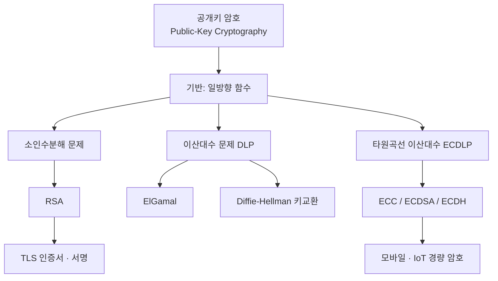
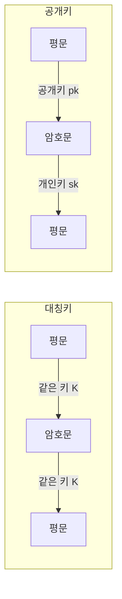

# 13강. 컴퓨터보안: 공개키 암호

## 🔗 선수 지식 (Prerequisites)
- [ ] **필수**: [2강. 정보보호 개요(대칭키 vs 공개키 개념)](2강.md) - 공개키 암호의 기본 아이디어 이해 완료?
- [ ] **필수**: [12강. 대칭키 암호](12강.md) - 대칭키와의 차이(키 분배 문제) 이해 완료?
- [ ] **필수**: 모듈러 산술(mod 연산), 합동식, 소수·서로소 개념
- [ ] **권장**: 정수론 기초(오일러 함수 φ, 페르마/오일러 정리), 군·이산대수의 직관
- **관련 단원**: [12강 대칭키 암호](12강.md), [14강 해시함수와 전자서명](14강.md)

---

## 학습 목표
1. 공개키 암호에 대해 설명할 수 있다.
2. 공개키 암호 알고리즘에 사용되는 기반 문제들을 설명할 수 있다.
3. RSA, ElGamal, 타원곡선 암호 알고리즘에 대해 설명할 수 있다.

---

## 🧠 메타인지 체크 (학습 전/후 자기 평가)

### 학습 전 자기 평가
| 소주제 | 자신감 (1-5) |
| :--- | :--- |
| 공개키 암호의 개념(공개키/개인키, 일방향 함수) | |
| 3대 기반 문제(소인수분해·이산대수·타원곡선 이산대수) | |
| RSA 키 생성·암복호화 절차 | |
| ElGamal / 타원곡선 암호의 원리 | |

### 학습 후 교정 (학습 완료 후 작성)
| 소주제 | 학습 전 | 학습 후 | 실제 정답률 | 과신/과소 여부 |
| :--- | :--- | :--- | :--- | :--- |
| 공개키 암호의 개념 | | | | |
| 3대 기반 문제 | | | | |
| RSA 키 생성·암복호화 | | | | |
| ElGamal / 타원곡선 암호 | | | | |

> **활용법**: 학습 전 1분 → 자신감 기입, 학습 후 1분 → 나머지 기입. "과신" 영역이 실제 취약점.

---

## 📝 요약 (Summary)
1. **공개키 암호** 🔴: 암호화와 복호화에 두 개의 서로 다른 키인 **공개키(public key)** 와 **개인키(private key)** 를 사용하는 암호방식이다. 공개키로 암호화하면 짝이 되는 개인키로만 복호화할 수 있어 **키 분배 문제**를 해결한다.
2. **일방향 함수 기반** 🔴: 공개키 암호 알고리즘은 **일방향 함수(one-way function)** 의 성질, 즉 "한 방향은 쉽고 역방향은 매우 어려운" 수학적으로 어려운 문제들에 기반을 둔다.
3. **3대 기반 문제** 🔴: 대표적인 기반 문제로는 **소인수분해 문제, 이산대수 문제, 타원곡선 이산대수 문제**가 있다.
4. **RSA** 🔴: **소인수분해 문제**에 기반을 둔 공개키 암호 알고리즘이다. 큰 두 소수의 곱 $n$을 다시 소인수분해하기 어렵다는 점을 이용한다.
5. **ElGamal** 🟡: **이산대수 문제**에 기반을 둔 공개키 암호 알고리즘이다. 같은 평문도 매번 다른 암호문이 되는 확률적 암호이다.
6. **타원곡선 암호(ECC)** 🟡: **타원곡선 이산대수 문제(ECDLP)** 에 기반을 둔 공개키 암호 알고리즘으로, 같은 안전성을 더 짧은 키로 달성한다.

> 📍 **마커 안내**: 위 5·6번의 🟡는 "본문 설명이 부실하다"는 뜻이 아니라 **교재에서 RSA(🔴)만큼 자주 출제되지 않는 보조 주제**라는 우선순위 표시다. 내용 정확성은 RSA와 동일하게 검증되었다.

---

## 📐 핵심 수식 및 정의 (Key Formulas & Definitions)

| 구분 | 수식/정의 | 의미 |
| :--- | :--- | :--- |
| **공개키 암호화/복호화** | $C = E_{pk}(M)$, $M = D_{sk}(C)$ | 공개키 $pk$로 암호화, 개인키 $sk$로 복호화 |
| **일방향 함수** | $y=f(x)$는 쉽고 $x=f^{-1}(y)$는 어려움 | 정방향 계산은 쉽지만 역방향은 계산적으로 불가능 |
| **소인수분해 문제** | $n = p\cdot q$ 주어졌을 때 $p,q$ 찾기 어려움 | RSA의 기반 (곱은 쉽지만 분해는 어려움) |
| **이산대수 문제(DLP)** | $y \equiv g^{x} \pmod p$에서 $x$ 찾기 어려움 | ElGamal·DH의 기반 (지수는 쉽지만 로그는 어려움) |
| **타원곡선 이산대수(ECDLP)** | $Q = kP$에서 정수 $k$ 찾기 어려움 | ECC의 기반 (점 곱셈은 쉽지만 역연산은 어려움) |
| **오일러 정리** | $a^{\varphi(n)} \equiv 1 \pmod n$ ($\gcd(a,n)=1$) | RSA 복호화가 성립하는 핵심 근거 |

### 주요 정리/정의

**RSA 키 생성·암복호화**
$$
\begin{aligned}
&\text{1) 큰 소수 } p, q \text{ 선택} \;\Rightarrow\; n = p q, \quad \varphi(n) = (p-1)(q-1) \\
&\text{2) } \gcd(e, \varphi(n)) = 1 \text{ 인 } e \text{ 선택 (공개 지수)} \\
&\text{3) } d \equiv e^{-1} \pmod{\varphi(n)} \text{ 계산 (개인 지수)} \\
&\text{공개키} = (e, n), \quad \text{개인키} = (d, n) \\
&\text{암호화: } C \equiv M^{e} \pmod n, \qquad \text{복호화: } M \equiv C^{d} \pmod n
\end{aligned}
$$
> **직관적 해석**: 두 소수를 곱하는 것($p\times q=n$)은 쉽지만, $n$만 보고 $p,q$를 되찾는 것은 매우 어렵다. 이 비대칭성이 "공개키로 잠그고 개인키로만 여는" 자물쇠를 만든다. 복호화가 원래 평문으로 돌아오는 이유는 $C^d = M^{ed} \equiv M \pmod n$이고, $ed\equiv 1 \pmod{\varphi(n)}$이므로 오일러 정리에 의해 성립하기 때문이다.
> **AI/실무 적용**: TLS/HTTPS 인증서, SSH 키, 코드 서명 등 인터넷 신뢰 인프라의 근간. AI 모델 가중치 배포 시 서명 검증에도 사용.

**개인키 $d$ 손계산: 확장 유클리드 알고리즘 (예: $e=3,\ \varphi(n)=20$)**

$d \equiv e^{-1} \pmod{\varphi(n)}$를 손으로 구하려면 **확장 유클리드 알고리즘(EEA)** 으로 $e\cdot d + \varphi(n)\cdot k = \gcd(e,\varphi(n))=1$을 만족하는 $d$를 찾는다.

$$
\begin{aligned}
&\text{① } \gcd(3, 20):\quad 20 = 6\cdot 3 + 2,\quad 3 = 1\cdot 2 + 1,\quad 2 = 2\cdot 1 + 0 \;\Rightarrow\; \gcd=1 \\
&\text{② 역대입(back-substitution):} \\
&\quad 1 = 3 - 1\cdot 2 \\
&\quad\;\; = 3 - 1\cdot(20 - 6\cdot 3) = 7\cdot 3 - 1\cdot 20 \\
&\text{③ } 7\cdot 3 \equiv 1 \pmod{20} \;\Rightarrow\; d = 7
\end{aligned}
$$
> **검산**: $ed = 3\times 7 = 21 \equiv 1 \pmod{20}$ ✓. (여기서 $e$의 계수 7이 곧 $d$이고, 음수가 나오면 $\varphi(n)$을 더해 양수로 만든다.)

**복호화 손계산: 빠른 지수승(square-and-multiply) (예: $C=31,\ d=7,\ n=33$)**

$M \equiv C^d \bmod n = 31^7 \bmod 33$을 거듭제곱을 한 번에 하지 않고 **제곱과 곱셈을 번갈아** 계산한다($31 \equiv -2 \pmod{33}$을 쓰면 더 간단).

$$
\begin{aligned}
&7 = (111)_2 \;\Rightarrow\; 31^7 = 31^4 \cdot 31^2 \cdot 31^1 \\
&31^1 \equiv -2,\quad 31^2 \equiv (-2)^2 = 4,\quad 31^4 \equiv 4^2 = 16 \pmod{33} \\
&31^7 \equiv 16 \cdot 4 \cdot (-2) = -128 \equiv -128 + 4\cdot 33 = 4 \pmod{33}
\end{aligned}
$$
> **검산**: 원래 평문 $M=4$가 정확히 복원된다 ✓ (앞의 암호화 예제 $4^3 \bmod 33 = 31$의 역과정).

> **DH 키교환 교차참조**: 또 다른 이산대수 기반 기법인 **디피-헬먼(Diffie-Hellman) 키교환**의 구체적 수식·계산 예제는 [15강 키 관리](15강.md)에 있다(13강 단독 학습 시 참고).

**ElGamal 암호 (이산대수 기반)**
$$
\begin{aligned}
&\text{공개 파라미터: 큰 소수 } p, \text{ 원시근 } g \\
&\text{개인키 } x, \quad \text{공개키 } y \equiv g^{x} \pmod p \\
&\text{암호화(난수 } k\text{): } C_1 \equiv g^{k},\; C_2 \equiv M\cdot y^{k} \pmod p \\
&\text{복호화: } M \equiv C_2 \cdot (C_1^{x})^{-1} \pmod p
\end{aligned}
$$
> **직관적 해석**: 매번 난수 $k$를 새로 뽑으므로 **같은 평문도 매번 다른 암호문**이 된다(확률적 암호). 안전성은 $g^x \bmod p$에서 $x$를 구하는 이산대수 문제의 어려움에 의존한다.
> **AI/실무 적용**: GnuPG 등에서 사용. 동형(homomorphic) 성질 덕분에 전자투표·프라이버시 보존 연산 연구에 활용.

---

## 📊 개념 시각화 (Visual Guide)

### 분류 체계도: 공개키 암호와 기반 문제


### 대칭키 vs 공개키 비교 흐름


### 핵심 비교표: 3대 기반 문제
| 기반 문제 | "쉬운 방향" | "어려운 방향" | 대표 알고리즘 |
| :--- | :--- | :--- | :--- |
| 소인수분해 | $p\times q = n$ | $n \to p,q$ | RSA |
| 이산대수(DLP) | $g^x \bmod p$ | $y \to x$ | ElGamal, DH |
| 타원곡선 이산대수(ECDLP) | $kP$ (점 곱셈) | $Q \to k$ | ECC, ECDSA, ECDH |

---

## ✏️ 심화 학습 (Study Subject)

### 1. 가상 시나리오: "어떤 공개키 알고리즘을, 언제 사용해야 할까?"
- **상황**: 한 핀테크 스타트업이 ① 사용자 모바일 앱(저전력·저대역폭)과 서버 간 안전한 채널, ② 거래 영수증에 대한 부인방지 서명, 두 가지를 모두 설계해야 한다.
- **문제**: RSA-2048과 타원곡선 암호(예: P-256) 중 무엇을 어디에 써야 효율적이고 안전할까?
- **해결**:
    1. **모바일 채널·서명**: 동일 안전성(약 128비트)에서 RSA는 3072비트 키가 필요하지만 ECC는 256비트면 충분하다 → 연산·배터리·대역폭이 제한된 모바일에는 **ECC(ECDH 키교환 + ECDSA 서명)** 가 유리.
    2. **호환성이 중요한 레거시 연동**: 외부 시스템이 RSA만 지원한다면 RSA-2048 이상 사용.
    3. **공통**: 어떤 경우든 평문 자체를 공개키로 직접 암호화하지 않고, **공개키로는 대칭키를 안전하게 교환/캡슐화**하고 실제 데이터는 빠른 대칭키 암호(AES)로 처리하는 **하이브리드 방식**을 쓴다.
- **AI 학습 포인트**: "양자컴퓨터(쇼어 알고리즘)가 실용화되면 RSA·ECC가 모두 깨진다고 한다. 이때 대비책인 격자(lattice) 기반 등 양자내성암호(PQC)는 기존 기반 문제와 무엇이 다른가?"

### 2. 관점별 비교 및 오개념 분석
- **핵심 비교**: 혼동하기 쉬운 쌍을 정리한다.
    - **대칭키 vs 공개키**: 대칭키는 *하나의 키*(빠름, 키 분배가 문제), 공개키는 *두 개의 키*(느림, 키 분배 해결).
    - **공개키 암호화 vs 전자서명**: 암호화는 *받는 사람의 공개키*로 잠그고, 서명은 *보내는 사람의 개인키*로 잠근다(→ [14강](14강.md)).
    - **이산대수 문제 vs 타원곡선 이산대수 문제**: 둘 다 "지수/배수는 쉽고 역연산은 어렵다"는 구조이나, 후자는 **타원곡선 위의 점 덧셈** 군에서 정의되어 더 짧은 키로 같은 안전성을 낸다.
- **오개념 분석**
    - **오개념 1**: "공개키 암호가 대칭키 암호보다 항상 더 안전하니 모든 데이터를 공개키로 암호화하면 된다."
    - **분석**: 안전성의 종류가 다를 뿐 "항상 더 안전"이 아니다. 공개키 암호는 대칭키보다 **수십~수백 배 느려** 대용량 데이터에 부적합하다. 그래서 실무는 하이브리드(공개키로 키 교환 + 대칭키로 본문)를 쓴다.
    - **오개념 2**: "RSA의 안전성은 $n$이 비밀이기 때문이다."
    - **분석**: $n$은 **공개키의 일부로 공개**된다. 안전성은 $n$을 비밀로 해서가 아니라, 공개된 $n$을 소인수분해해 $p,q$(→$\varphi(n)$→$d$)를 구하기가 계산적으로 어렵기 때문이다.
    - **오개념 3**: "키가 길수록 무조건 좋으니 RSA-4096을 ECC 대신 쓰면 된다."
    - **분석**: 안전성-효율 트레이드오프가 있다. RSA는 키가 커질수록 서명·복호화가 급격히 느려진다. ECC-256은 RSA-3072와 비슷한 안전성을 훨씬 적은 연산으로 제공한다.
    - **정밀화 (NIST SP 800-57 등가표)**: RSA-2048은 약 **112비트** 보안수준, **RSA-3072가 약 128비트(= ECC-256)** 보안수준에 해당한다. 즉 "ECC-256 ≈ RSA-3072 ≈ 128비트"이며 RSA-2048(112비트)과 혼동하지 말아야 한다.
- **AI 학습 포인트**: "AI에게 'RSA-2048, RSA-3072, ECC P-256의 안전성 비트와 연산 비용'을 표로 정리하게 하고, 왜 NIST가 ECC로의 전환을 권고하는지 근거를 검증해달라고 요청해보자."

---

## ❓ 연습 문제 및 해설

> **블룸 인지 수준 범례**: [기억] 정의·나열 → [이해] 설명·비교 → [적용] 계산·구현 → [분석] 구별·디버그 → [평가] 판단·비평 → [창조] 설계·제안

> 📌 본 강의는 원본 연습문제가 제공되지 않아 학습목표·학습정리를 전체 커버하도록 10문항을 AI 출제(📌)했다.

### 📝 문제

**1. ⭐ [기억] 📌 [공개키 암호의 정의](#prob-1)**
> 공개키 암호방식에 대한 설명으로 가장 옳은 것은?
> ① 암호화와 복호화에 동일한 하나의 키를 사용한다.
> ② 암호화와 복호화에 서로 다른 두 개의 키를 사용한다.
> ③ 키를 전혀 사용하지 않는다.
> ④ 복호화에는 키가 필요 없다.

<br>

**2. ⭐ [기억] 📌 [공개키 암호의 기반 성질](#prob-2)**
> 공개키 암호 알고리즘이 기반을 두는 함수의 성질로 가장 옳은 것은?
> ① 양방향 모두 계산이 쉬운 함수
> ② 정방향·역방향 모두 어려운 함수
> ③ 정방향은 쉽지만 역방향은 매우 어려운 일방향 함수
> ④ 입력이 같으면 항상 다른 출력을 내는 함수

<br>

**3. ⭐⭐ [이해] 📌 [기반 문제와 알고리즘 짝짓기](#prob-3)**
> <보기>
>
> 가. RSA
> 나. ElGamal
> 다. 타원곡선 암호(ECC)

> 위 알고리즘과 기반 문제의 매핑으로 옳은 것은?
> ① 가-이산대수 / 나-소인수분해 / 다-타원곡선 이산대수
> ② 가-소인수분해 / 나-이산대수 / 다-타원곡선 이산대수
> ③ 가-타원곡선 이산대수 / 나-소인수분해 / 다-이산대수
> ④ 가-소인수분해 / 나-타원곡선 이산대수 / 다-이산대수

<br>

**4. ⭐⭐ [이해] 📌 [대칭키 vs 공개키](#prob-4)**
> 대칭키 암호와 비교한 공개키 암호의 특징으로 옳지 않은 것은?
> ① 키 분배 문제를 비교적 쉽게 해결한다.
> ② 일반적으로 대칭키 암호보다 연산이 느리다.
> ③ 서로 다른 두 개의 키를 사용한다.
> ④ 대칭키 암호보다 항상 빠르므로 대용량 데이터 암호화에 적합하다.

<br>

**5. ⭐⭐ [적용] 📌 [RSA 키 생성 계산](#prob-5)**
> $p=3,\ q=11$일 때 RSA에서 $n$과 $\varphi(n)$의 값으로 옳은 것은?
> ① $n=14,\ \varphi(n)=13$
> ② $n=33,\ \varphi(n)=20$
> ③ $n=33,\ \varphi(n)=23$
> ④ $n=14,\ \varphi(n)=20$

<br>

**6. ⭐⭐ [이해] 📌 [RSA 키 사용 방향](#prob-6)**
> RSA에서 기밀성을 위한 메시지 암호화 시 사용하는 키로 옳은 것은?
> ① 보내는 사람의 개인키
> ② 보내는 사람의 공개키
> ③ 받는 사람의 공개키
> ④ 받는 사람의 개인키

<br>

**7. ⭐⭐ [분석] 📌 [ElGamal의 특징](#prob-7)**
> <보기>
>
> 가. 이산대수 문제에 기반을 둔다.
> 나. 난수 $k$를 사용하여 같은 평문도 매번 다른 암호문이 된다.
> 다. 소인수분해 문제에 기반을 둔다.
> 라. 암호문의 길이가 평문보다 짧아진다.

> ElGamal 암호에 대한 옳은 설명만 모은 것은?
> ① 가, 나
> ② 가, 다
> ③ 나, 라
> ④ 가, 나, 라

<br>

**8. ⭐⭐ [이해] 📌 [타원곡선 암호의 장점](#prob-8)**
> 타원곡선 암호(ECC)가 RSA 대비 갖는 대표적 장점으로 가장 옳은 것은?
> ① 키가 더 길어 안전하다.
> ② 같은 안전성을 더 짧은 키 길이로 달성한다.
> ③ 기반 문제가 없어 수학이 필요 없다.
> ④ 대칭키 암호이므로 키 분배가 필요 없다.

<br>

**9. ⭐⭐⭐ [적용] 📌 [RSA 암호화 계산](#prob-9)**
> 공개키 $(e,n)=(3,33)$, 평문 $M=4$일 때 RSA 암호문 $C \equiv M^{e} \pmod n$의 값은?
> ① $C=64$
> ② $C=31$
> ③ $C=4$
> ④ $C=28$

<br>

**10. ⭐⭐⭐ [평가/창조] 📌 [하이브리드 암호 설계](#prob-10)**
> 대용량 파일을 인터넷으로 안전하게 전송해야 한다. 공개키 암호와 대칭키 암호의 장단점을 근거로, 두 방식을 결합한 "하이브리드 암호화" 절차를 설계하고 각 단계에서 어떤 키를 쓰는지 설명하시오.

---

### 🔑 정답 및 해설 (먼저 풀어본 후 펼치기)

<details>
<summary>정답 보기 (클릭)</summary>

1. ②
2. ③
3. ②
4. ④
5. ②
6. ③
7. ①
8. ②
9. ②
10. [풀이형 정답 — 아래 해설 참고]

</details>

<details>
<summary>해설 보기 (클릭)</summary>

<a id="prob-1"></a>
**1. ⭐ [기억] 공개키 암호의 정의**
> **정답: ② 암호화와 복호화에 서로 다른 두 개의 키를 사용한다.**
> **해설**: 공개키 암호는 공개키와 개인키라는 두 개의 서로 다른 키를 사용한다. ①은 대칭키 암호의 설명이다.

<a id="prob-2"></a>
**2. ⭐ [기억] 공개키 암호의 기반 성질**
> **정답: ③ 정방향은 쉽지만 역방향은 매우 어려운 일방향 함수**
> **해설**: 공개키 암호는 한 방향 계산은 쉽고 그 역을 구하기는 계산적으로 어려운 일방향 함수의 성질을 갖는 수학적 난제에 기반을 둔다.

<a id="prob-3"></a>
**3. ⭐⭐ [이해] 기반 문제와 알고리즘 짝짓기**
> **정답: ② 가-소인수분해 / 나-이산대수 / 다-타원곡선 이산대수**
> **해설**: RSA는 소인수분해 문제, ElGamal은 이산대수 문제, ECC는 타원곡선 이산대수 문제에 각각 기반을 둔다.

<a id="prob-4"></a>
**4. ⭐⭐ [이해] 대칭키 vs 공개키**
> **정답: ④ 대칭키 암호보다 항상 빠르므로 대용량 데이터 암호화에 적합하다.**
> **해설**: 공개키 암호는 일반적으로 대칭키 암호보다 **느려서** 대용량 데이터에 부적합하다. 그래서 실무에서는 공개키로 대칭키를 교환하고 본문은 대칭키로 암호화하는 하이브리드 방식을 쓴다. ①·②·③은 모두 옳은 설명.

<a id="prob-5"></a>
**5. ⭐⭐ [적용] RSA 키 생성 계산**
> **정답: ② $n=33,\ \varphi(n)=20$**
> **해설**: $n = pq = 3\times 11 = 33$, $\varphi(n)=(p-1)(q-1)=2\times 10=20$.

<a id="prob-6"></a>
**6. ⭐⭐ [이해] RSA 키 사용 방향**
> **정답: ③ 받는 사람의 공개키**
> **해설**: 기밀성을 위해서는 **받는 사람만 풀 수 있어야** 하므로 받는 사람의 공개키로 암호화하고, 받는 사람이 자신의 개인키로 복호화한다. 보내는 사람의 개인키로 잠그는 것은 전자서명(인증·부인방지)이다(→ [14강](14강.md)).

<a id="prob-7"></a>
**7. ⭐⭐ [분석] ElGamal의 특징**
> **정답: ① 가, 나**
> **해설**: ElGamal은 이산대수 문제 기반(가)이며 난수 $k$로 확률적 암호화를 수행(나)한다. 다는 RSA의 기반이라 틀렸고, 라는 ElGamal 암호문은 $(C_1, C_2)$ 두 값으로 평문보다 **길어진다**(약 2배).

<a id="prob-8"></a>
**8. ⭐⭐ [이해] 타원곡선 암호의 장점**
> **정답: ② 같은 안전성을 더 짧은 키 길이로 달성한다.**
> **해설**: ECC는 타원곡선 이산대수 문제의 어려움 덕분에 RSA보다 훨씬 짧은 키(예: ECC-256 ≈ RSA-3072)로 동등한 안전성을 제공해 모바일·IoT에 적합하다. ④는 ECC도 공개키 암호이므로 틀림.

<a id="prob-9"></a>
**9. ⭐⭐⭐ [적용] RSA 암호화 계산**
> **정답: ② $C=31$**
> **해설**: $C \equiv M^e \bmod n = 4^3 \bmod 33 = 64 \bmod 33 = 31$. ①의 64는 mod 연산을 빠뜨린 오답.

<a id="prob-10"></a>
**10. ⭐⭐⭐ [평가/창조] 하이브리드 암호 설계 (예시 답안)**
> **정답 예시 — 하이브리드 암호화 절차**
> 1. **대칭키 생성**: 송신자가 임시 세션키 $K$(예: AES-256)를 무작위로 생성한다.
> 2. **본문 암호화(대칭키)**: 대용량 파일을 빠른 대칭키 암호 AES로 $E_K(\text{파일})$ 암호화한다 → 속도 확보.
> 3. **세션키 캡슐화(공개키)**: 세션키 $K$를 **수신자의 공개키**로 암호화한다 $E_{pk}(K)$ → 키 분배 문제 해결.
> 4. **전송**: $\{E_K(\text{파일}),\ E_{pk}(K)\}$를 함께 보낸다.
> 5. **복호화**: 수신자는 자신의 **개인키**로 $K$를 복원한 뒤, 그 $K$로 파일을 복호화한다.
> **근거**: 공개키는 느리지만 키 분배에 강하고, 대칭키는 빠르지만 키 분배가 약하다. 둘의 장점만 결합한 것이 TLS·PGP가 실제로 쓰는 방식이다.

</details>

---

## ✅ O/X 확인문제 (20문항)

**1.** 공개키 암호는 암호화와 복호화에 서로 다른 두 개의 키를 사용한다.[(O / X)](#ox-1)
**2.** 공개키와 개인키 중 외부에 공개해도 되는 것은 개인키이다.[(O / X)](#ox-2)
**3.** 공개키 암호는 일방향 함수의 성질을 갖는 수학적 난제에 기반을 둔다.[(O / X)](#ox-3)
**4.** RSA는 소인수분해 문제에 기반을 둔다.[(O / X)](#ox-4)
**5.** ElGamal은 소인수분해 문제에 기반을 둔다.[(O / X)](#ox-5)
**6.** 타원곡선 암호는 타원곡선 이산대수 문제에 기반을 둔다.[(O / X)](#ox-6)
**7.** RSA에서 $n=pq$이고 $\varphi(n)=(p-1)(q-1)$이다.[(O / X)](#ox-7)
**8.** RSA의 안전성은 공개된 $n$을 소인수분해하기 어렵다는 데 있다.[(O / X)](#ox-8)
**9.** 기밀성을 위한 암호화에서는 받는 사람의 공개키를 사용한다.[(O / X)](#ox-9)
**10.** 공개키 암호는 일반적으로 대칭키 암호보다 연산이 빠르다.[(O / X)](#ox-10)
**11.** 공개키 암호는 대칭키 암호의 키 분배 문제를 해결하는 데 도움을 준다.[(O / X)](#ox-11)
**12.** ElGamal은 난수를 사용해 같은 평문도 매번 다른 암호문이 되는 확률적 암호이다.[(O / X)](#ox-12)
**13.** 같은 안전성을 기준으로 ECC는 RSA보다 더 짧은 키를 사용한다.[(O / X)](#ox-13)
**14.** 이산대수 문제는 $g^x \bmod p$가 주어졌을 때 $x$를 구하기 쉬운 문제이다.[(O / X)](#ox-14)
**15.** RSA 복호화 $C^d \bmod n$이 원래 평문이 되는 근거는 오일러 정리이다.[(O / X)](#ox-15)
**16.** 공개키 $e$는 $\gcd(e,\varphi(n))=1$을 만족하도록 선택한다.[(O / X)](#ox-16)
**17.** 개인키 $d$는 $d \equiv e^{-1} \pmod{\varphi(n)}$로 구한다.[(O / X)](#ox-17)
**18.** 실무에서는 보통 대용량 데이터 전체를 공개키 암호로 직접 암호화한다.[(O / X)](#ox-18)
**19.** Diffie-Hellman 키교환도 이산대수 문제의 어려움에 기반을 둔다.[(O / X)](#ox-19)
**20.** 전자서명에서는 보내는 사람의 개인키로 서명한다.[(O / X)](#ox-20)

<details>
<summary>O/X 정답 및 해설 보기 (클릭)</summary>

> <a id="ox-1"></a>
> **1. 정답: O** — 공개키 암호의 정의 그대로.

> <a id="ox-2"></a>
> **2. 정답: X** — 공개해도 되는 것은 공개키이고, 개인키는 비밀로 보관해야 한다.

> <a id="ox-3"></a>
> **3. 정답: O** — 일방향 함수 성질의 수학적 난제에 기반.

> <a id="ox-4"></a>
> **4. 정답: O** — RSA는 소인수분해 문제 기반.

> <a id="ox-5"></a>
> **5. 정답: X** — ElGamal은 이산대수 문제 기반이다.

> <a id="ox-6"></a>
> **6. 정답: O** — ECC는 타원곡선 이산대수 문제(ECDLP) 기반.

> <a id="ox-7"></a>
> **7. 정답: O** — RSA 키 생성의 기본 식.

> <a id="ox-8"></a>
> **8. 정답: O** — $n$은 공개되지만 분해가 어려워 안전하다.

> <a id="ox-9"></a>
> **9. 정답: O** — 받는 사람만 개인키로 풀 수 있어야 하므로 받는 사람의 공개키로 암호화한다.

> <a id="ox-10"></a>
> **10. 정답: X** — 공개키 암호는 대체로 대칭키 암호보다 느리다.

> <a id="ox-11"></a>
> **11. 정답: O** — 키 분배 문제 해결이 공개키 암호의 핵심 장점.

> <a id="ox-12"></a>
> **12. 정답: O** — 난수 $k$ 덕분에 확률적 암호가 된다.

> <a id="ox-13"></a>
> **13. 정답: O** — 예: ECC-256 ≈ RSA-3072 수준의 안전성.

> <a id="ox-14"></a>
> **14. 정답: X** — 이산대수 문제는 $x$를 구하기 **어려운** 문제이다(지수 계산은 쉬움).

> <a id="ox-15"></a>
> **15. 정답: O** — $ed\equiv1 \pmod{\varphi(n)}$와 오일러 정리로 $M^{ed}\equiv M$이 성립.

> <a id="ox-16"></a>
> **16. 정답: O** — 역원 $d$가 존재하려면 $e$와 $\varphi(n)$이 서로소여야 한다.

> <a id="ox-17"></a>
> **17. 정답: O** — $d$는 $\varphi(n)$을 법으로 한 $e$의 곱셈 역원.

> <a id="ox-18"></a>
> **18. 정답: X** — 느리기 때문에 보통 하이브리드(공개키로 세션키 교환 + 대칭키로 본문)를 쓴다.

> <a id="ox-19"></a>
> **19. 정답: O** — DH 키교환은 이산대수 문제의 어려움에 기반한다.

> <a id="ox-20"></a>
> **20. 정답: O** — 서명은 보내는 사람의 개인키로 한다(→ [14강](14강.md)).

</details>

---

## 🧪 자유 회상 연습 (Free Recall)

> **방법**: 위의 노트를 모두 덮고, 타이머 3분 설정 후 이번 단원에서 배운 내용을 기억나는 대로 자유롭게 적으세요.
> 정확한 문장이 아니어도 됩니다. 키워드, 수식, 관계 등 떠오르는 것을 모두 적습니다.

**자유 회상 작성란:**

```
[여기에 기억나는 내용을 자유롭게 작성]


```

> **회상 후 점검**: 노트를 다시 펼쳐 빠뜨린 내용을 확인하세요. 빠뜨린 부분이 실제 취약점입니다.
> - 회상 못한 핵심 개념: [                ]
> - 회상 못한 기반 문제: [                ]
> - 회상 못한 RSA 절차: [                ]

---

## 💻 코드로 확인하기 (Code Verification)

> 공개키 암호는 수식 중심이므로 **소규모 RSA를 직접 구현**해 키 생성→암호화→복호화가 원래 평문으로 돌아오는지 확인한다.

```python
from math import gcd

# 1) 작은 소수 선택
p, q = 61, 53
n = p * q                      # 공개 모듈러스
phi = (p - 1) * (q - 1)        # 오일러 함수

# 2) 공개 지수 e 선택 (phi와 서로소)
e = 17
assert gcd(e, phi) == 1

# 3) 개인 지수 d = e^{-1} mod phi (확장 유클리드 대신 pow 사용)
d = pow(e, -1, phi)            # Python 3.8+

print(f"n={n}, phi={phi}, e={e}, d={d}")

# 4) 암호화/복호화
M = 65                          # 평문 (M < n)
C = pow(M, e, n)                # 암호화: C = M^e mod n
M_dec = pow(C, d, n)            # 복호화: M = C^d mod n

print(f"평문 M       = {M}")
print(f"암호문 C     = {C}")
print(f"복호화 결과  = {M_dec}")
print(f"복원 성공?   = {M == M_dec}")
```

> **실행 결과 (예시)**:
> ```
> n=3233, phi=3120, e=17, d=2753
> 평문 M       = 65
> 암호문 C     = 2790
> 복호화 결과  = 65
> 복원 성공?   = True
> ```
> **수학적 해석**: $C=M^e \bmod n$로 잠그고 $M=C^d \bmod n$로 푸는데, $ed\equiv 1\pmod{\varphi(n)}$이므로 $C^d=M^{ed}\equiv M \pmod n$(오일러 정리)이 되어 평문이 정확히 복원된다. 실무에서는 $p,q$를 수백 자리 소수로 쓰고 OAEP 패딩을 적용한다.

---

## 🤖 AI 연결고리 (Concept → AI Application)

| 보안 개념 | AI/ML·실무 적용 분야 | 구체적 사례 |
| :--- | :--- | :--- |
| 공개키 암호 | 모델·데이터 배포 무결성 | 모델 가중치 서명 검증, 패키지 서명 |
| RSA/ECC 서명 | 연합학습(federated learning) 신뢰 | 참여자 업데이트의 출처 인증 |
| 이산대수(DH) | 프라이버시 보존 키교환 | 보안 집계(secure aggregation) 프로토콜 |
| 동형암호(ElGamal 계열) | 암호문 상태 연산 | 프라이버시 보존 추론(PPML), 전자투표 |
| ECDLP(ECC) | 경량 디바이스 인증 | IoT·엣지 AI 디바이스의 TLS 핸드셰이크 |

---

## 📖 심화 학습 예시 답안

#### 1. RSA가 "공개키로 잠그고 개인키로만 여는" 원리
정수론 위에 세워진 비대칭성이 핵심이다.

1. **곱셈은 쉽고 분해는 어렵다**: 두 큰 소수 $p,q$를 곱해 $n$을 만드는 것은 순식간이지만, $n$만 보고 $p,q$로 되돌리는 것은 현재 알려진 알고리즘으로 천문학적 시간이 걸린다.
2. **$\varphi(n)$은 비밀의 열쇠**: $\varphi(n)=(p-1)(q-1)$를 알아야 개인키 $d$를 구할 수 있는데, $\varphi(n)$을 알려면 사실상 $p,q$를 알아야 한다 → 분해가 어려우면 $d$도 못 구한다.
3. **오일러 정리가 보장하는 복원**: $ed\equiv 1\pmod{\varphi(n)}$이도록 $d$를 잡으면, 임의 $M$에 대해 $M^{ed}\equiv M \pmod n$이 성립해 복호화가 정확히 평문을 돌려준다.

#### 2. RSA vs 타원곡선 암호(ECC) 비교표
| 구분 | RSA | 타원곡선 암호(ECC) | 비고 |
| :--- | :--- | :--- | :--- |
| **기반 문제** | 소인수분해 | 타원곡선 이산대수(ECDLP) | |
| **동일 안전성 키 길이** | 3072비트(≈128비트 보안) | 256비트 | ECC가 훨씬 짧음 |
| **연산 비용** | 키가 클수록 급증 | 상대적으로 가벼움 | 모바일·IoT에 ECC 유리 |
| **호환성/역사** | 오래되어 광범위 지원 | 비교적 최신, 점유율 증가 | |
| **양자 취약성** | 쇼어 알고리즘에 취약 | 동일하게 취약 | PQC로의 전환 필요 |

#### 2-1. 공개지수 $e=65537$ 관습 (왜 거의 항상 이 값을 쓰는가)
실무 RSA 구현은 공개지수 $e$로 거의 항상 **65537**을 쓴다.
- **값의 정체**: $65537 = 2^{16}+1$이며, 알려진 **페르마 소수**($F_4 = 2^{2^4}+1$)이다.
- **빠른 암호화/검증**: 이진수로 $(10000000000000001)_2$ — 1비트가 단 **두 개**뿐이라, 빠른 지수승(square-and-multiply)에서 16번의 제곱 + 1번의 곱셈으로 끝나 매우 빠르다.
- **작은 $e$의 위험 회피**: $e=3$ 같은 너무 작은 값은 패딩이 부실할 때 저지수 공격(Håstad 등)에 취약하다. 65537은 "충분히 커서 안전하면서도 연산은 가벼운" 균형점이다.
- **소수성**: $e$가 소수이면 $\gcd(e,\varphi(n))=1$이 거의 항상 성립(드물게 $\varphi(n)$이 65537의 배수일 때만 재선택)해 키 생성이 단순해진다.

#### 2-2. 양자내성암호(PQC) — 2024 NIST 표준 (심층확장)
쇼어 알고리즘이 동작하는 대형 양자컴퓨터가 등장하면 RSA·ECC가 모두 깨진다. 2024년 8월 NIST는 첫 PQC 표준 3종을 **FIPS**로 확정했다.

| 표준 | 알고리즘(원명) | 용도 | 기반 난제 |
| :--- | :--- | :--- | :--- |
| **FIPS 203** | ML-KEM (CRYSTALS-**Kyber**) | 키 캡슐화(KEM, 키교환 대체) | 격자 — Module-LWE |
| **FIPS 204** | ML-DSA (CRYSTALS-**Dilithium**) | 전자서명(주력 권고) | 격자 — Module-LWE/SIS |
| **FIPS 205** | SLH-DSA (**SPHINCS+**) | 전자서명(해시 기반, 보수적 백업) | 해시함수 안전성만 가정 |

> **기존 기반 문제와의 차이**: RSA·ECC는 소인수분해·이산대수에 의존하지만, PQC는 **격자(lattice)·해시** 등 양자컴퓨터로도 빠른 해법이 알려지지 않은 문제에 기반한다. 격자 기반(ML-KEM/ML-DSA)이 주력이고, 해시 기반(SLH-DSA)은 격자 가정마저 무너질 경우의 보수적 대안이다. (근거: NIST PQC 프로젝트, FIPS 203/204/205)

#### 3. RSA를 활용한 코드 작성법 (Bad vs Good)
- **Bad Practice (나쁜 예시)**
  ```python
  # 패딩 없이 교과서 RSA를 직접 사용 (결정론적 → 같은 평문=같은 암호문)
  C = pow(M, e, n)   # 작은 e + 짧은 평문 → 공격 가능, 안전하지 않음
  ```
- **Good Practice (좋은 예시)**
  ```python
  # 검증된 라이브러리 + OAEP 패딩 사용
  from cryptography.hazmat.primitives.asymmetric import rsa, padding
  from cryptography.hazmat.primitives import hashes

  key = rsa.generate_private_key(public_exponent=65537, key_size=3072)
  pub = key.public_key()
  ct = pub.encrypt(
      b"secret",
      padding.OAEP(mgf=padding.MGF1(hashes.SHA256()),
                   algorithm=hashes.SHA256(), label=None),
  )
  ```
- **설명**: 교과서 RSA는 결정론적이라 같은 평문이 같은 암호문이 되고 작은 지수 공격 등에 취약하다. **OAEP 같은 확률적 패딩**과 검증된 라이브러리, 충분한 키 길이(2048~3072비트)를 써야 실전에서 안전하다.

---

## 📚 핵심 용어집 (Glossary)

| 용어 (한) | 용어 (영) | 수식 표현 | 정의 |
| :--- | :--- | :--- | :--- |
| **공개키 암호** | Public-Key Cryptography | $C=E_{pk}(M),\ M=D_{sk}(C)$ | 공개키/개인키 한 쌍을 쓰는 비대칭 암호 (→ [2강](2강.md)) |
| **공개키** | Public Key | $pk=(e,n)$ | 누구에게나 공개되는 암호화/검증용 키 |
| **개인키** | Private Key | $sk=(d,n)$ | 비밀로 보관하는 복호화/서명용 키 |
| **일방향 함수** | One-Way Function | $f$ 쉽고 $f^{-1}$ 어려움 | 역방향 계산이 어려운 함수 |
| **소인수분해 문제** | Integer Factorization | $n=pq$ | $n$을 소수의 곱으로 분해하기 어려움 |
| **이산대수 문제** | Discrete Logarithm (DLP) | $y\equiv g^x \bmod p$ | $x$(이산로그)를 구하기 어려움 |
| **타원곡선 이산대수** | ECDLP | $Q=kP$ | 점 $Q,P$에서 $k$ 구하기 어려움 |
| **RSA** | RSA | $C\equiv M^e,\ M\equiv C^d \bmod n$ | 소인수분해 기반 공개키 암호 |
| **ElGamal** | ElGamal | $C=(g^k,\ M y^k)$ | 이산대수 기반 확률적 공개키 암호 |
| **타원곡선 암호** | ECC | $Q=kP$ | ECDLP 기반, 짧은 키의 공개키 암호 |
| **오일러 함수** | Euler's totient | $\varphi(n)=(p-1)(q-1)$ | $n$ 이하 서로소 정수의 개수 |
| **하이브리드 암호** | Hybrid Encryption | $E_{pk}(K)+E_K(M)$ | 공개키로 키 교환 + 대칭키로 본문 (→ [12강](12강.md)) |

---

## 🤖 AI 학습 파트너를 위한 추가 자료

### 1. 개념 이해를 위한 심층 질문 프롬프트
> **프롬프트 예시**: "공개키 암호의 '공개키로 잠그고 개인키로 여는' 원리를 '아무나 넣을 수 있지만 주인만 열쇠로 여는 우체통'에 비유해서 설명해줘. 그리고 RSA가 의존하는 '소인수분해의 어려움'이 왜 일방향 함수가 되는지, 만약 빠른 소인수분해 알고리즘이 나온다면 어떤 일이 벌어지는지도 알려줘."

### 2. 문제 해결 능력 강화를 위한 시나리오 프롬프트
> **프롬프트 예시**: "당신은 IoT 보안 아키텍트입니다. 배터리·연산 자원이 매우 제한된 센서 수천 대가 서버와 안전하게 통신해야 합니다. RSA-3072와 ECC P-256 중 무엇을 선택해야 할지, 키 길이·연산 비용·안전성·구현 난이도를 기준으로 비교하고 최종 선택의 기술적 근거를 제시해줘."

### 3. 수식 풀이 검증 프롬프트
> **프롬프트 예시**: "다음 RSA 계산을 검증해줘.
> $$p=3,\ q=11,\ n=33,\ \varphi(n)=20,\ e=3,\ d=7,\quad M=4 \Rightarrow C=4^3 \bmod 33=31,\quad M'=31^7 \bmod 33$$
> 1. $d=7$이 $e=3$의 올바른 역원인지(즉 $ed\equiv1 \pmod{20}$) 확인하고,
> 2. 복호화 $M'=31^7 \bmod 33$이 다시 4가 되는지 단계별로 계산해줘."

---

## 🔄 복습 체크 (Spaced Repetition)
- [ ] 1일 후 복습 (날짜: 2026-05-30)
- [ ] 3일 후 복습 (날짜: 2026-06-01)
- [ ] 7일 후 복습 (날짜: 2026-06-05)
- [ ] 14일 후 복습 (날짜: 2026-06-12)
- [ ] 30일 후 복습 (날짜: 2026-06-28)

### 복습 시 자가 평가
| 회차 | 날짜 | 이해도 (1-5) | 취약 부분 메모 |
| :--- | :--- | :--- | :--- |
| 1차 | | | |
| 2차 | | | |
| 3차 | | | |

---

## 📚 참고 자료 (References)

- KNOU 교재 — 컴퓨터보안 13강(공개키 암호) 본문 및 학습정리
- R. Rivest, A. Shamir, L. Adleman, *A Method for Obtaining Digital Signatures and Public-Key Cryptosystems* (1978) — RSA 원논문
- T. ElGamal, *A Public Key Cryptosystem and a Signature Scheme Based on Discrete Logarithms* (1985)
- NIST SP 800-57 Part 1 Rev.5 *Recommendation for Key Management* — 키 길이·안전성 비트 등가표(RSA-2048≈112비트, RSA-3072≈128비트≈ECC-256) https://nvlpubs.nist.gov/nistpubs/specialpublications/nist.sp.800-57pt1r5.pdf
- NIST FIPS 186 / SEC 2 — 타원곡선(ECDSA, P-256 등) 표준
- NIST Post-Quantum Cryptography 프로젝트 — FIPS 203(ML-KEM/Kyber)·204(ML-DSA/Dilithium)·205(SLH-DSA/SPHINCS+), 2024 https://csrc.nist.gov/projects/post-quantum-cryptography
