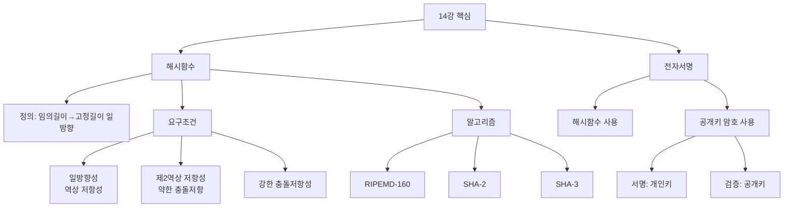

# 14강. 컴퓨터보안: 해시함수 및 전자서명

## 🔗 선수 지식 (Prerequisites)
- [ ] **필수**: 대칭키·공개키 암호의 개념([2강](2강.md)) - 이해 완료?
- [ ] **필수**: 무결성·정보보호 3대 목표(CIA), 일방향 함수 개념([1강](1강.md))
- [ ] **권장**: 인증(Authentication)과 메시지 인증([3강](3강.md)), PGP/S/MIME에서의 서명 활용([9강](9강.md))
- **관련 단원**: [2강 암호의 개념](2강.md), [3강 인증](3강.md), [9강 이메일 보안](9강.md)

---

## 학습 목표
1. 해시함수의 개념과 요구조건을 설명할 수 있다.
2. 대표적인 해시 알고리즘(RIPEMD-160, SHA-2, SHA-3)을 설명할 수 있다.
3. 전자서명의 개념과 동작원리(서명·검증)를 설명할 수 있다.

> ※ **각주(RIPEMD-160)**: 교재는 RIPEMD-160을 대표 알고리즘으로 들지만, 현재 주류는 **SHA-2(SHA-256 등)·SHA-3**이다. RIPEMD-160은 비트코인 주소 생성 등 일부 레거시 용도에 남아 있을 뿐 신규 설계에서는 SHA-2/SHA-3을 우선한다(시험은 교재 표기 기준).

---

## 🧠 메타인지 체크 (학습 전/후 자기 평가)

### 학습 전 자기 평가
| 소주제 | 자신감 (1-5) |
| :--- | :--- |
| 해시함수의 정의(임의 길이→고정 길이, 일방향) | |
| 해시함수의 요구조건(일방향성·충돌저항성) | |
| 해시 알고리즘(RIPEMD-160, SHA-2, SHA-3) | |
| 전자서명의 개념과 동작원리(개인키 서명·공개키 검증) | |

### 학습 후 교정 (학습 완료 후 작성)
| 소주제 | 학습 전 | 학습 후 | 실제 정답률 | 과신/과소 여부 |
| :--- | :--- | :--- | :--- | :--- |
| 해시함수 정의 | | | | |
| 요구조건 | | | | |
| 해시 알고리즘 | | | | |
| 전자서명 | | | | |

> **활용법**: 학습 전 1분 → 자신감 기입, 학습 후 1분 → 나머지 기입. "과신" 영역이 실제 취약점.

---

## 📝 요약 (Summary)
1. **해시함수의 정의** 🔴: 해시함수는 **임의의 길이의 입력 데이터를 고정된 길이의 해시코드로 대응시키는 일방향 함수**다. 같은 입력은 항상 같은 출력을 내며, 출력으로부터 입력을 되돌릴 수 없다.
2. **해시함수의 요구조건** 🔴: 여러 조건이 있으나 특히 **일방향성(역상 저항성)** 과 **충돌저항성**을 만족해야 안전한 해시함수다.
3. **충돌저항성의 세분** 🟡: 주어진 해시값에 대한 입력 찾기를 막는 **역상 저항성**, 특정 입력과 같은 해시값을 갖는 다른 입력 찾기를 막는 **제2역상 저항성(약한 충돌저항성)**, 같은 해시값을 갖는 임의의 두 입력 찾기를 막는 **(강한) 충돌저항성**으로 구분된다.
4. **해시 알고리즘** 🔴: 대표적으로 **RIPEMD-160, SHA-2, SHA-3** 등이 있다. (과거에 쓰인 MD5·SHA-1은 충돌이 발견되어 안전하지 않다.)
5. **전자서명의 개념** 🔴: 전자서명은 **메시지를 보낸 사람의 신원이 진짜임을 증명**하기 위해 사용되는 서명으로, **(전자서명법에 따라) 수기서명에 준하는 효력**을 가지며 무결성과 부인방지도 보장한다.
6. **전자서명의 동작원리** 🔴: 전자서명은 **해시함수와 공개키 암호를 이용**하여 동작한다. 메시지의 해시값을 키로 처리한다.
7. **서명·검증의 키 사용** 🔴: 전자서명은 **서명할 때는 서명자의 개인키를, 검증할 때는 서명자의 공개키를 사용**한다(암호화와 키 사용 방향이 반대).

---

## 📐 핵심 정의 및 원리 (Key Definitions & Principles)

| 정의명 | 내용 | 키워드 |
| :--- | :--- | :--- |
| **해시함수(Hash Function)** | 임의 길이 입력 $M$을 고정 길이 출력 $h=H(M)$으로 대응시키는 일방향 함수 | 압축, 고정 길이, 일방향 |
| **해시코드(메시지 다이제스트)** | 해시함수의 출력값. 입력의 "지문(fingerprint)" 역할 | 다이제스트, 고정 길이 |
| **일방향성(역상 저항성)** | 해시값 $h$가 주어졌을 때 $H(M)=h$인 $M$을 찾는 것이 계산상 불가능 | preimage resistance, 비가역 |
| **제2역상 저항성(약한 충돌저항성)** | 입력 $M_1$이 주어졌을 때 $H(M_2)=H(M_1)$인 다른 $M_2(\neq M_1)$를 찾기 어려움 | 2nd preimage, 위조 방지 |
| **(강한) 충돌저항성** | $H(M_1)=H(M_2)$인 임의의 서로 다른 쌍 $(M_1, M_2)$를 찾기 어려움 | collision resistance, 생일공격 |
| **눈사태 효과(Avalanche)** | 입력이 1비트만 바뀌어도 출력 해시가 절반가량 무작위로 바뀜 | 확산, 민감도 |
| **RIPEMD-160** | 160비트 출력의 해시 알고리즘 | 160-bit |
| **SHA-2** | SHA-224/256/384/512 계열. 현재 널리 쓰이는 표준 | SHA-256, 안전 |
| **SHA-3** | 스펀지 구조(Keccak) 기반의 차세대 표준 해시 | Keccak, 스펀지 |
| **전자서명(Digital Signature)** | 메시지 해시를 서명자의 개인키로 처리해 신원·무결성·부인방지를 보장 | 개인키 서명, 공개키 검증 |

### 주요 원리

**원리 1. 해시함수의 안전성 — 일방향성과 충돌저항성**
$$
h = H(M),\quad |M|\text{은 가변},\ |h|\text{는 고정}
$$
> **직관적 해석**: 해시함수는 데이터의 "지문"을 만든다. 지문(해시값)만 보고 원본을 복원할 수 없고(일방향성), 서로 다른 두 문서가 같은 지문을 갖게 만들 수도 없어야(충돌저항성) 위·변조를 탐지할 수 있다. 출력이 $n$비트면 충돌은 **생일 역설** 때문에 약 $2^{n/2}$ 시도로 발견될 수 있어, 충돌저항성 보안수준은 $n/2$비트다.
> **AI/실무 적용**: 데이터셋·모델 가중치의 무결성 검증(해시 비교), 중복 제거(dedup), 캐시 키, 블록체인 머클 트리 등.

**원리 2. 전자서명 = 해시 + 공개키 암호**
$$
\text{서명: } S = \text{Sign}_{priv}(H(M)) \qquad \text{검증: } \text{Verify}_{pub}(S, H(M)) \stackrel{?}{=} \text{참}
$$
> **직관적 해석**: 메시지 전체가 아니라 **해시값(고정 길이)을 서명자의 개인키로 서명**한다(속도·크기 이점). 검증자는 서명자의 **공개키로 검증 알고리즘**을 수행해, 받은 메시지를 직접 해시한 값과 일치하는지 확인한다. 일치하면 ① 그 사람이 보냈고(인증), ② 변조되지 않았으며(무결성), ③ 부인할 수 없음(부인방지)이 동시에 보장된다.
> **주의 (서명 방식별 차이)**: **"공개키로 $S$를 복호해 $H(M)$을 복원"하는 것은 RSA(교과서/PKCS#1 v1.5)의 경우**에 한한다. DSA·ECDSA·EdDSA는 서명에서 해시를 직접 "복원"하지 않고, 서명값·메시지 해시·공개키를 넣어 **검증 방정식의 성립 여부만 확인**한다(복원 불가). 그래서 일반적으로는 "공개키로 복호"보다 **"검증 알고리즘으로 확인"** 이 정확한 표현이다. (근거: NIST FIPS 186-5)
> **AI/실무 적용**: 코드 서명(모델·패키지 배포 무결성), TLS 인증서 서명, 트랜잭션 서명.

**원리 3. 해시 내부 구조 — Merkle–Damgård vs 스펀지(Sponge)**

| 구분 | Merkle–Damgård(MD) 구조 | 스펀지(Sponge) 구조 |
| :--- | :--- | :--- |
| **대표 해시** | MD5, SHA-1, **SHA-2** | **SHA-3 / Keccak** |
| **동작** | 메시지를 블록으로 나눠 압축함수를 연쇄 적용, 마지막 내부상태를 출력 | 흡수(absorb)→짜내기(squeeze)의 스펀지 흡수 모델 |
| **길이확장공격** | **취약**(아래 참고) | **안전**(내부상태 일부만 출력) |

> **길이확장공격(Length-Extension Attack)**: MD 구조는 **최종 해시값이 곧 내부상태**이므로, 공격자가 $H(M)$만 알면 비밀 $M$을 몰라도 $H(M \,\|\, \text{padding} \,\|\, M')$ 를 계산해낼 수 있다. 따라서 **$H(\text{key} \,\|\, \text{message})$ 형태의 단순 MAC을 SHA-2로 만들면 위조 가능**하다. 방어책은 ① 내부상태를 그대로 노출하지 않는 **SHA-3(스펀지)**, ② 중첩 구조로 막는 **HMAC**이다.

**원리 4. HMAC — 해시 기반 메시지 인증 코드**
$$
\text{HMAC}(K, M) = H\big((K \oplus \text{opad}) \,\|\, H((K \oplus \text{ipad}) \,\|\, M)\big)
$$
> **직관적 해석**: 키 $K$를 두 가지 상수 패드(ipad=0x36 반복, opad=0x5c 반복)와 XOR해 **해시를 두 번 중첩**한다. 이 이중 구조 덕분에 SHA-2 같은 MD 구조 해시를 써도 **길이확장공격이 차단**되고, 공유키 기반의 무결성·인증(MAC)을 안전하게 제공한다. (근거: RFC 2104) — 단, HMAC도 MAC이므로 **부인방지는 제공하지 않는다**(공유키를 양측이 알기 때문).

**원리 5. 출력 길이별 보안수준**

| 해시 | 출력 길이 $n$ | 역상(일방향) 보안 ≈ $n$비트 | 충돌 보안 ≈ $n/2$비트 |
| :--- | :--- | :--- | :--- |
| SHA-1 | 160비트 | 160비트 | 80비트(**충돌 깨짐**) |
| SHA-256 | 256비트 | 256비트 | **128비트** |
| SHA-384 | 384비트 | 384비트 | 192비트 |
| SHA-512 / SHA3-512 | 512비트 | 512비트 | 256비트 |

> 충돌저항성 보안수준이 출력의 **절반**($n/2$)인 이유는 생일공격($\approx 2^{n/2}$ 시도) 때문이다. SHA-256은 충돌 기준 128비트로 현재 안전, SHA-1(80비트)은 이미 깨졌다.

---

## 📊 개념 시각화 (Visual Guide)

### 분류 체계도: 해시함수와 전자서명


### 전자서명 동작 흐름도

```mermaid
graph LR
    M[메시지 M] --> H1[해시 H&#40;M&#41;]
    H1 --> S[서명자 개인키로 서명 = S]
    M --> T[메시지 + 서명 S 전송]
    S --> T
    T --> R[수신자]
    R --> H2[받은 M을 해시 H&#40;M&#41;']
    R --> V[서명자 공개키로 검증<br/>RSA: S 복호→H&#40;M&#41; / ECDSA·EdDSA: 검증식 확인]
    H2 --> CMP{두 해시 일치?}
    V --> CMP
    CMP -->|예| OK[검증 성공: 인증·무결성·부인방지]
    CMP -->|아니오| NG[위조/변조 탐지]
```


### 핵심 비교표: 해시함수의 세 가지 저항성
| 구분 | 주어지는 것 | 찾아야 하는 것 | 막는 위협 |
| :--- | :--- | :--- | :--- |
| **역상 저항성(일방향성)** | 해시값 $h$ | $H(M)=h$인 $M$ | 해시로부터 원본 복원 |
| **제2역상 저항성(약한 충돌)** | 입력 $M_1$ | $H(M_2)=H(M_1)$인 $M_2\neq M_1$ | 특정 문서의 위조 |
| **강한 충돌저항성** | 없음 | $H(M_1)=H(M_2)$인 임의 쌍 | 생일공격 기반 위조 |

---

## ✏️ 심화 학습 (Study Subject)

### 1. 가상 시나리오: "해시와 전자서명을, 언제 사용해야 할까?"
- **상황**: A는 거래처 B에게 계약서 파일을 보낸다. B는 (1) 받은 파일이 전송 중 변조되지 않았는지, (2) 정말 A가 보낸 것인지, (3) 나중에 A가 "안 보냈다"고 발뺌하지 못하게 하고 싶다.
- **문제**: 단순 암호화만으로는 "누가 보냈는지"와 "변조 여부"를 보장하기 어렵다. 어떤 기술을 어떻게 조합해야 하는가?
- **해결**:
    1. A는 계약서 전체가 아니라 **해시값 $H(M)$** 을 계산한다(고정 길이라 빠름).
    2. 그 해시값을 **A의 개인키로 서명**하여 서명 $S$를 만든다 → 메시지와 함께 전송.
    3. B는 받은 메시지를 다시 해시해 $H(M)'$ 을 구하고, **A의 공개키로 $S$를 검증**해 원래 해시 $H(M)$ 을 얻는다.
    4. $H(M)=H(M)'$ 이면: ① A의 공개키로 풀렸으니 A가 보낸 것(인증), ② 해시가 같으니 변조 없음(무결성), ③ A의 개인키로만 만들 수 있는 서명이므로 부인 불가(부인방지).
- **AI 학습 포인트**: "전자서명이 무결성만 보장하는 MAC(메시지 인증 코드)와 다른 점은 무엇인가? 부인방지가 가능/불가능한 이유를 키의 소유 구조(공유 비밀 vs 개인키) 관점에서 설명해줘."

### 2. 관점별 비교 및 오개념 분석
- **핵심 비교**: 혼동하기 쉬운 쌍을 정리한다.
    - **해시함수 vs 암호화**: 해시는 *키 없이* 데이터를 고정 길이로 압축하는 **비가역** 함수(복원 불가). 암호화는 *키*로 데이터를 가역적으로 변환(복호화 가능). 해시는 복호화가 없다.
    - **암호화 vs 전자서명의 키 방향**: 공개키 암호에서 *기밀성*은 수신자 공개키로 암호화→수신자 개인키로 복호. *서명*은 반대로 발신자 개인키로 서명→발신자 공개키로 검증.
    - **MAC vs 전자서명**: MAC은 *공유 대칭키* 기반이라 무결성·인증은 되지만 부인방지는 안 된다(둘 다 키를 알아 위조 가능). 서명은 *개인키*라 부인방지까지 된다.
    - **약한 충돌저항 vs 강한 충돌저항**: 전자는 *특정 입력*에 대한 충돌, 후자는 *임의의 쌍*에 대한 충돌. 강한 쪽이 더 깨기 쉬워(생일공격) 더 높은 출력 비트가 필요하다.
- **오개념 분석**
    - **오개념 1**: "전자서명은 메시지 전체를 개인키로 암호화하는 것이다."
    - **분석**: 공개키 연산은 느리고 길이 제한이 있다. 실제로는 메시지의 **해시값(고정 길이)** 만 개인키로 서명한다. 그래서 해시함수가 전자서명의 필수 요소다.
    - **오개념 2**: "해시값이 같으면 입력도 반드시 같다 / 해시함수는 입력을 복원할 수 있다."
    - **분석**: 해시는 일방향이라 복원 불가하고, 입력 공간이 출력보다 크므로 충돌은 *존재*한다. 다만 안전한 해시는 그 충돌을 **찾기 어렵게** 만들 뿐이다.
    - **오개념 3**: "검증할 때 수신자의 공개키를 쓴다."
    - **분석**: 검증은 **서명자(발신자)의 공개키**로 한다. 서명은 발신자 개인키로 했기 때문에 그 쌍이 되는 발신자 공개키로만 검증된다.
- **AI 학습 포인트**: "MD5·SHA-1이 더 이상 안전하지 않게 된 이유(충돌 공격 사례)와, 그것이 전자서명·인증서 위조에 어떤 실제 위협이 되었는지 사례로 설명해달라고 요청해보자."

---

## ❓ 연습 문제 및 해설

> **블룸 인지 수준 범례**: [기억] 정의·나열 → [이해] 설명·비교 → [적용] 계산·구현 → [분석] 구별·디버그 → [평가] 판단·비평 → [창조] 설계·제안

> 📌 본 강의는 원본 연습문제가 제공되지 않아 학습목표·학습정리를 전체 커버하도록 10문항을 AI 출제(📌)했다.

### 📝 문제

**1. ⭐ [기억] 📌 [해시함수의 정의](#prob-1)**
> 해시함수에 대한 설명으로 가장 옳은 것은?
> ① 가변 길이 입력을 가변 길이 출력으로 바꾸는 가역 함수
> ② 임의 길이 입력을 고정 길이 해시코드로 대응시키는 일방향 함수
> ③ 키를 사용해 데이터를 암·복호화하는 대칭 함수
> ④ 출력으로부터 입력을 항상 복원할 수 있는 함수

<br>

**2. ⭐ [기억] 📌 [해시함수의 핵심 요구조건](#prob-2)**
> 안전한 해시함수가 특히 만족해야 하는 두 가지 핵심 요구조건은?
> ① 가역성과 가변성
> ② 일방향성과 충돌저항성
> ③ 기밀성과 가용성
> ④ 대칭성과 분배성

<br>

**3. ⭐ [기억] 📌 [해시 알고리즘의 종류](#prob-3)**
> 다음 중 대표적인 해시 알고리즘에 해당하지 않는 것은?
> ① RIPEMD-160
> ② SHA-2
> ③ SHA-3
> ④ RSA-2048

<br>

**4. ⭐⭐ [이해] 📌 [전자서명의 키 사용](#prob-4)**
> 전자서명에서 서명과 검증에 사용하는 키로 올바른 것은?
> ① 서명: 서명자의 공개키 / 검증: 서명자의 개인키
> ② 서명: 수신자의 공개키 / 검증: 수신자의 개인키
> ③ 서명: 서명자의 개인키 / 검증: 서명자의 공개키
> ④ 서명·검증 모두 공유 대칭키

<br>

**5. ⭐⭐ [이해] 📌 [전자서명이 제공하는 보안 서비스](#prob-5)**
> <보기>
>
> 가. 메시지를 보낸 사람의 신원 증명(인증)
> 나. 메시지 내용의 무결성 보장
> 다. 보낸 사실에 대한 부인방지
> 라. 통신 회선의 가용성(DoS 방어) 보장

> 전자서명이 제공하는 보안 서비스를 모두 고른 것은?
> ① 가, 나
> ② 가, 나, 다
> ③ 가, 다, 라
> ④ 가, 나, 다, 라

<br>

**6. ⭐⭐ [적용] 📌 [전자서명 생성 절차](#prob-6)**
> A가 메시지 $M$에 전자서명을 생성하는 올바른 절차는?
> ① $M$을 그대로 A의 공개키로 암호화
> ② $M$의 해시 $H(M)$을 계산 → A의 개인키로 서명
> ③ $M$의 해시 $H(M)$을 계산 → 수신자의 공개키로 서명
> ④ $M$을 대칭 세션키로 암호화 후 전송

<br>

**7. ⭐⭐ [분석] 📌 [해시함수 vs 암호화](#prob-7)**
> 해시함수와 (대칭/공개키) 암호화의 차이로 가장 옳은 것은?
> ① 해시함수는 키로 복호화가 가능하지만 암호화는 불가능하다.
> ② 해시함수는 출력 길이가 입력에 비례하지만 암호화는 고정이다.
> ③ 해시함수는 키 없이 동작하는 비가역 함수이고, 암호화는 키로 복호화가 가능한 가역 변환이다.
> ④ 둘 다 입력으로부터 출력을, 출력으로부터 입력을 자유롭게 변환한다.

<br>

**8. ⭐⭐⭐ [평가] 📌 [MAC vs 전자서명](#prob-8)**
> 메시지 인증 코드(MAC)와 전자서명을 비교한 설명으로 가장 옳은 것은?
> ① MAC은 부인방지를 제공하지만 전자서명은 제공하지 못한다.
> ② MAC은 공유 대칭키 기반이라 부인방지가 어렵고, 전자서명은 개인키 기반이라 부인방지가 가능하다.
> ③ 둘 다 공개키 암호를 사용한다.
> ④ MAC과 전자서명 모두 무결성을 제공하지 못한다.

<br>

**9. ⭐⭐⭐ [분석] 📌 [충돌저항성과 생일공격](#prob-9)**
> <보기>
>
> 가. 역상 저항성은 해시값으로부터 입력을 찾기 어렵게 한다.
> 나. 제2역상 저항성은 주어진 입력과 같은 해시값을 갖는 다른 입력 찾기를 어렵게 한다.
> 다. 강한 충돌저항성은 같은 해시값을 갖는 임의의 두 입력 찾기를 어렵게 한다.
> 라. 출력이 $n$비트인 해시는 생일공격에 의해 약 $2^{n/2}$ 시도로 충돌을 찾을 수 있다.

> 위 보기에서 옳은 것을 모두 고른 것은?
> ① 가, 나
> ② 가, 나, 다
> ③ 나, 다, 라
> ④ 가, 나, 다, 라

<br>

**10. ⭐⭐⭐ [창조] 📌 [무결성·인증·부인방지를 만족하는 문서 전송 설계](#prob-10)**
> 한 기관이 외부로 공문서를 전자적으로 발송하면서 (1) 전송 중 변조 탐지, (2) 발신 기관의 신원 증명, (3) 사후 부인 방지를 모두 보장하려 한다. 해시함수와 공개키 암호를 활용한 전자서명 기반 절차를 서명·검증 단계로 나누어 설계하고, 각 단계에서 어떤 키를 쓰는지와 그 이유를 설명하시오.

---

### 🔑 정답 및 해설 (먼저 풀어본 후 펼치기)

<details>
<summary>정답 보기 (클릭)</summary>

1. ②
2. ②
3. ④
4. ③
5. ②
6. ②
7. ③
8. ②
9. ④
10. [풀이형 정답 — 아래 해설 참고]

</details>

<details>
<summary>해설 보기 (클릭)</summary>

<a id="prob-1"></a>
**1. ⭐ [기억] 해시함수의 정의**
> **정답: ② 임의 길이 입력을 고정 길이 해시코드로 대응시키는 일방향 함수**
> **해설**: 해시함수는 임의 길이 입력을 고정 길이 출력으로 대응시키는 일방향(비가역) 함수다. ①·④는 가역성을 전제하므로 틀렸고, ③은 키를 쓰는 암호화에 대한 설명이다.

<a id="prob-2"></a>
**2. ⭐ [기억] 해시함수의 핵심 요구조건**
> **정답: ② 일방향성과 충돌저항성**
> **해설**: 학습정리대로 안전한 해시함수는 특히 일방향성(역상 저항성)과 충돌저항성을 만족해야 한다. 가역성·대칭성은 오히려 해시의 성질에 반한다.

<a id="prob-3"></a>
**3. ⭐ [기억] 해시 알고리즘의 종류**
> **정답: ④ RSA-2048**
> **해설**: RIPEMD-160, SHA-2, SHA-3은 해시 알고리즘이다. RSA는 해시가 아니라 공개키 암호(서명) 알고리즘이다.

<a id="prob-4"></a>
**4. ⭐⭐ [이해] 전자서명의 키 사용**
> **정답: ③ 서명: 서명자의 개인키 / 검증: 서명자의 공개키**
> **해설**: 전자서명은 서명할 때 서명자의 개인키, 검증할 때 서명자의 공개키를 사용한다. 기밀성 목적의 공개키 암호화(수신자 공개키→수신자 개인키)와 키 사용 방향이 반대다.

<a id="prob-5"></a>
**5. ⭐⭐ [이해] 전자서명이 제공하는 보안 서비스**
> **정답: ② 가, 나, 다**
> **해설**: 전자서명은 인증·무결성·부인방지를 제공한다. 라(가용성/DoS 방어)는 전자서명의 범위가 아니다.

<a id="prob-6"></a>
**6. ⭐⭐ [적용] 전자서명 생성 절차**
> **정답: ② $M$의 해시 $H(M)$을 계산 → A의 개인키로 서명**
> **해설**: 메시지 전체가 아니라 해시값을 서명자(A)의 개인키로 서명한다. ③처럼 수신자 공개키로 서명하면 검증이 불가능하고, ①·④는 서명이 아니라 암호화 절차다.

<a id="prob-7"></a>
**7. ⭐⭐ [분석] 해시함수 vs 암호화**
> **정답: ③ 해시함수는 키 없이 동작하는 비가역 함수이고, 암호화는 키로 복호화가 가능한 가역 변환이다.**
> **해설**: 해시는 키가 없고 복호화도 없다(비가역, 고정 길이 출력). 암호화는 키로 가역 변환한다. ①은 해시와 암호화의 가역성을 뒤바꾼 오답이다.

<a id="prob-8"></a>
**8. ⭐⭐⭐ [평가] MAC vs 전자서명**
> **정답: ② MAC은 공유 대칭키 기반이라 부인방지가 어렵고, 전자서명은 개인키 기반이라 부인방지가 가능하다.**
> **해설**: MAC은 송수신자가 같은 대칭키를 공유하므로 둘 다 태그를 만들 수 있어 "누가 만들었는지" 증명이 안 된다(부인방지 X). 전자서명은 서명자만 가진 개인키로 만들기 때문에 부인방지가 가능하다. 둘 다 무결성은 제공한다.

<a id="prob-9"></a>
**9. ⭐⭐⭐ [분석] 충돌저항성과 생일공격**
> **정답: ④ 가, 나, 다, 라**
> **해설**: 가(역상 저항성), 나(제2역상 저항성), 다(강한 충돌저항성)는 세 가지 저항성의 정의 그대로다. 라는 생일 역설에 의해 $n$비트 해시의 충돌이 약 $2^{n/2}$ 시도로 발견될 수 있음을 정확히 기술한다.

<a id="prob-10"></a>
**10. ⭐⭐⭐ [창조] 무결성·인증·부인방지 문서 전송 설계 (예시 답안)**
> **정답 예시: 전자서명 기반 절차**
> **[서명 단계 — 발신 기관]**
> 1. 공문서 $M$의 **해시 $H(M)$** 을 계산한다(고정 길이라 효율적, 무결성 기준값).
> 2. $H(M)$을 **발신 기관의 개인키로 서명**하여 서명 $S$를 생성한다 → 개인키는 기관만 보유하므로 인증·부인방지의 근거.
> 3. 원문 $M$과 서명 $S$(필요 시 기관 인증서 포함)를 함께 전송한다.
>
> **[검증 단계 — 수신자]**
> 4. 받은 $M$을 다시 해시해 $H(M)'$ 을 구한다.
> 5. **발신 기관의 공개키로 $S$를 검증**해 원래 해시 $H(M)$ 을 얻는다.
> 6. $H(M)=H(M)'$ 이면 검증 성공: ① 발신 기관 공개키로 풀렸으니 **인증**, ② 두 해시 일치로 **무결성**, ③ 개인키로만 만들 수 있는 서명이라 **부인방지**.
>
> **키 사용 정리**: 서명=발신자 *개인키*, 검증=발신자 *공개키*. (기밀성까지 필요하면 본문을 별도로 수신자 공개키 기반 디지털 봉투로 암호화 — [9강](9강.md) 참고.)

</details>

---

## ✅ O/X 확인문제 (20문항)

**1.** 해시함수는 임의 길이의 입력을 고정 길이의 해시코드로 대응시키는 일방향 함수다.[(O / X)](#ox-1)
**2.** 안전한 해시함수는 특히 일방향성과 충돌저항성을 만족해야 한다.[(O / X)](#ox-2)
**3.** 해시함수는 키를 이용해 출력으로부터 입력을 복호화할 수 있다.[(O / X)](#ox-3)
**4.** RIPEMD-160, SHA-2, SHA-3은 대표적인 해시 알고리즘이다.[(O / X)](#ox-4)
**5.** RSA는 해시 알고리즘의 한 종류다.[(O / X)](#ox-5)
**6.** 역상 저항성(일방향성)은 해시값으로부터 원래 입력을 찾기 어렵게 하는 성질이다.[(O / X)](#ox-6)
**7.** 제2역상 저항성은 주어진 입력과 같은 해시값을 갖는 다른 입력 찾기를 어렵게 한다.[(O / X)](#ox-7)
**8.** 강한 충돌저항성은 같은 해시값을 갖는 임의의 두 입력 찾기를 어렵게 한다.[(O / X)](#ox-8)
**9.** 출력이 $n$비트인 해시는 생일공격으로 약 $2^{n/2}$ 시도에 충돌을 찾을 수 있다.[(O / X)](#ox-9)
**10.** 입력이 1비트만 바뀌어도 출력 해시가 크게 달라지는 성질을 눈사태 효과라 한다.[(O / X)](#ox-10)
**11.** 전자서명은 메시지를 보낸 사람의 신원이 진짜임을 증명하기 위해 사용된다.[(O / X)](#ox-11)
**12.** 전자서명은 수기서명과 동일한 효력을 가진다.[(O / X)](#ox-12)
**13.** 전자서명은 해시함수와 공개키 암호를 이용하여 동작한다.[(O / X)](#ox-13)
**14.** 전자서명은 서명할 때 서명자의 공개키를 사용한다.[(O / X)](#ox-14)
**15.** 전자서명을 검증할 때는 서명자의 공개키를 사용한다.[(O / X)](#ox-15)
**16.** 전자서명에서는 메시지 전체를 개인키로 암호화하여 서명한다.[(O / X)](#ox-16)
**17.** 전자서명은 무결성과 부인방지 기능도 제공한다.[(O / X)](#ox-17)
**18.** MAC(메시지 인증 코드)은 공유 대칭키 기반이라 부인방지를 제공하기 어렵다.[(O / X)](#ox-18)
**19.** 해시함수는 입력 공간이 출력보다 커도 충돌이 전혀 존재하지 않는다.[(O / X)](#ox-19)
**20.** MD5와 SHA-1은 충돌이 발견되어 보안용으로는 더 이상 안전하지 않다.[(O / X)](#ox-20)

<details>
<summary>O/X 정답 및 해설 보기 (클릭)</summary>

> <a id="ox-1"></a>
> **1. 정답: O** — 학습정리 1번(임의 길이→고정 길이, 일방향).

> <a id="ox-2"></a>
> **2. 정답: O** — 학습정리 2번.

> <a id="ox-3"></a>
> **3. 정답: X** — 해시는 키가 없고 복호화도 없다(비가역).

> <a id="ox-4"></a>
> **4. 정답: O** — 학습정리 3번의 대표 알고리즘.

> <a id="ox-5"></a>
> **5. 정답: X** — RSA는 공개키 암호/서명 알고리즘이지 해시가 아니다.

> <a id="ox-6"></a>
> **6. 정답: O** — 역상 저항성(일방향성)의 정의.

> <a id="ox-7"></a>
> **7. 정답: O** — 제2역상(약한 충돌) 저항성의 정의.

> <a id="ox-8"></a>
> **8. 정답: O** — 강한 충돌저항성의 정의.

> <a id="ox-9"></a>
> **9. 정답: O** — 생일 역설로 충돌 보안수준은 $n/2$비트.

> <a id="ox-10"></a>
> **10. 정답: O** — 눈사태 효과(avalanche)의 정의.

> <a id="ox-11"></a>
> **11. 정답: O** — 학습정리 4번.

> <a id="ox-12"></a>
> **12. 정답: O** — 학습개요대로 수기서명과 동일한 효력.

> <a id="ox-13"></a>
> **13. 정답: O** — 학습정리 5번.

> <a id="ox-14"></a>
> **14. 정답: X** — 서명은 서명자의 *개인키*로 한다.

> <a id="ox-15"></a>
> **15. 정답: O** — 검증은 서명자의 공개키.

> <a id="ox-16"></a>
> **16. 정답: X** — 메시지 전체가 아니라 *해시값*을 개인키로 서명한다.

> <a id="ox-17"></a>
> **17. 정답: O** — 인증뿐 아니라 무결성·부인방지도 제공.

> <a id="ox-18"></a>
> **18. 정답: O** — MAC은 키를 공유해 둘 다 만들 수 있어 부인방지 불가.

> <a id="ox-19"></a>
> **19. 정답: X** — 입력이 출력보다 많으면 비둘기집 원리로 충돌은 *존재*한다. 다만 찾기 어렵게 만들 뿐.

> <a id="ox-20"></a>
> **20. 정답: O** — MD5·SHA-1은 실제 충돌 공격이 성공해 권장되지 않는다.

</details>

---

## 🧪 자유 회상 연습 (Free Recall)

> **방법**: 위의 노트를 모두 덮고, 타이머 3분 설정 후 이번 단원에서 배운 내용을 기억나는 대로 자유롭게 적으세요.
> 정확한 문장이 아니어도 됩니다. 키워드, 수식, 관계 등 떠오르는 것을 모두 적습니다.

**자유 회상 작성란:**

```
[여기에 기억나는 내용을 자유롭게 작성]


```

> **회상 후 점검**: 노트를 다시 펼쳐 빠뜨린 내용을 확인하세요. 빠뜨린 부분이 실제 취약점입니다.
> - 회상 못한 핵심 개념: [                ]
> - 회상 못한 해시 요구조건(3가지 저항성): [                ]
> - 회상 못한 전자서명 키 사용(서명/검증): [                ]

---

## 💻 코드로 확인하기 (Code Verification)

> 해시함수와 전자서명은 이론 중심이라, **해시의 일방향·눈사태 효과**와 **전자서명(해시+개인키 서명/공개키 검증)** 동작을 작은 코드로 시연한다.

```python
import hashlib

# --- 1) 해시함수: 일방향 + 눈사태 효과 ---
m1 = "계약서: 금액 1000만원".encode()
m2 = "계약서: 금액 1001만원".encode()   # 단 한 글자 변경
print("SHA-256(m1):", hashlib.sha256(m1).hexdigest())
print("SHA-256(m2):", hashlib.sha256(m2).hexdigest())

# 두 해시가 몇 비트나 다른지(눈사태 효과) 측정
b1 = bytes.fromhex(hashlib.sha256(m1).hexdigest())
b2 = bytes.fromhex(hashlib.sha256(m2).hexdigest())
diff_bits = sum(bin(x ^ y).count("1") for x, y in zip(b1, b2))
print(f"다른 비트 수: {diff_bits} / 256 (약 50%면 눈사태 효과 양호)")

# --- 2) 전자서명: 해시 + 공개키 서명/검증 (RSA) ---
# 표준 라이브러리만으로 RSA가 어려우므로 개념을 의사코드로 병기
try:
    from cryptography.hazmat.primitives.asymmetric import rsa, padding
    from cryptography.hazmat.primitives import hashes

    priv = rsa.generate_private_key(public_exponent=65537, key_size=2048)
    pub = priv.public_key()

    msg = b"This is a contract."
    # 서명: 내부적으로 해시(SHA-256) 후 '개인키'로 서명
    sig = priv.sign(msg, padding.PKCS1v15(), hashes.SHA256())
    # 검증: '공개키'로 검증 (실패 시 예외)
    pub.verify(sig, msg, padding.PKCS1v15(), hashes.SHA256())
    print("서명 검증: 유효 ✅ (서명=개인키, 검증=공개키)")

    # 변조 시 검증 실패 확인
    try:
        pub.verify(sig, b"This is a FORGED contract.",
                   padding.PKCS1v15(), hashes.SHA256())
        print("위조 메시지 검증: 통과 (있을 수 없음)")
    except Exception:
        print("위조 메시지 검증: 실패 ❌ → 무결성·인증 탐지")
except ImportError:
    print("cryptography 미설치 — 개념: Sign_priv(H(M)) / Verify_pub(S, H(M))")
```

> **실행 결과 (예시)**:
> ```
> SHA-256(m1): 7b3a... (64 hex = 256bit)
> SHA-256(m2): e9c1... (완전히 다른 값)
> 다른 비트 수: 128 / 256 (약 50%면 눈사태 효과 양호)
> 서명 검증: 유효 ✅ (서명=개인키, 검증=공개키)
> 위조 메시지 검증: 실패 ❌ → 무결성·인증 탐지
> ```
> **보안적 해석**:
> - **눈사태 효과**: 입력이 한 글자 바뀌어도 출력의 약 절반 비트가 바뀐다 → 변조 탐지에 유리.
> - **전자서명**: 서명은 *개인키*, 검증은 *공개키*. 메시지가 바뀌면 해시가 달라져 검증이 실패 → 무결성·인증·부인방지.
> - 실무에서는 RSA-PSS, ECDSA, EdDSA 등 안전한 서명 방식과 SHA-2/SHA-3 해시를 함께 사용한다.

---

## 🤖 AI 연결고리 (Concept → AI Application)

| 보안 개념 | AI/ML 적용 분야 | 구체적 사례 |
| :--- | :--- | :--- |
| 해시(무결성 지문) | 데이터셋/모델 무결성 검증 | 학습 데이터·가중치 파일 해시 비교로 변조·손상 탐지 |
| 해시(중복 제거) | 데이터 파이프라인 전처리 | 대규모 코퍼스 dedup(near-duplicate 제거) |
| 충돌저항성 | 콘텐츠 주소화 저장 | 머클 트리·CAS 기반 데이터 버전 관리 |
| 전자서명 | 모델·패키지 공급망 보안 | 모델 배포 서명·검증(코드 서명)으로 변조 모델 차단 |
| 부인방지 | 감사 로그·연합학습 | 참여자 기여 서명으로 책임 추적성 확보 |

---

## 📖 심화 학습 예시 답안

#### 1. 전자서명의 내부 동작 원리 (왜 해시를 먼저 쓰는가)
전자서명은 "해시 → 개인키 서명 → (전송) → 공개키 검증 → 해시 비교"의 파이프라인이다.

1. **해시 계산**: 메시지 $M$ 전체가 아니라 고정 길이 $H(M)$ 을 만든다. 공개키 연산은 느리고 입력 크기 제한이 있어, 큰 문서도 항상 같은 작은 크기로 줄인다(효율성).
2. **개인키 서명**: $S=\text{Sign}_{priv}(H(M))$. 서명자만 개인키를 가지므로 **인증·부인방지**의 근거가 된다.
3. **전송**: $M$과 $S$를 함께 보낸다.
4. **공개키 검증**: 수신자는 $\text{Verify}_{pub}(S)$ 로 원래 해시를 복원하고, 받은 $M$을 직접 해시해 비교한다.
5. **무결성 판정**: 두 해시가 일치하면 변조 없음. 한 비트라도 바뀌면 눈사태 효과로 해시가 달라져 즉시 탐지된다.

#### 2. 해시함수 vs 전자서명 비교표
| 구분 | 해시함수 | 전자서명 | 비고 |
| :--- | :--- | :--- | :--- |
| **키 사용** | 키 없음 | 개인키(서명)·공개키(검증) | 서명은 해시를 재료로 씀 |
| **제공 속성** | 무결성 기준값(지문) | 인증·무결성·부인방지 | 서명이 해시를 포함 |
| **가역성** | 비가역(일방향) | 검증 가능(복원 아님) | 둘 다 원문 복원 X |
| **AI 활용** | 데이터/모델 무결성·dedup | 모델·패키지 서명 | 공급망 보안 |
| **대표 알고리즘** | RIPEMD-160, SHA-2, SHA-3 | RSA, DSA, ECDSA, EdDSA | 서명 = 해시 + 공개키 |

#### 2-1. 실제 충돌 공격 사례 (왜 MD5·SHA-1을 버렸는가) (심층확장)
| 해시 | 사건 | 연도 | 영향 |
| :--- | :--- | :--- | :--- |
| **MD5** | **Flame** 멀웨어 | 2012 | MD5 충돌로 **위조된 코드서명 인증서**를 만들어 Microsoft Windows Update를 사칭, 멀웨어를 정품처럼 배포 |
| **SHA-1** | **SHAttered**(Google·CWI) | 2017 | 같은 SHA-1 해시를 갖는 **서로 다른 PDF 두 개**를 실제 생성 — SHA-1의 충돌저항성이 실전에서 깨짐을 입증 |

> 두 사건 모두 "충돌을 찾기 어렵다"는 전제가 깨지면 **인증서·서명 위조**로 직결됨을 보여준다. 그래서 신규 시스템은 SHA-2/SHA-3을 쓴다. (근거: https://shattered.io/)

#### 2-2. 서명 알고리즘 비교 — RSA-PSS vs ECDSA vs EdDSA (심층확장)
| 구분 | RSA-PSS | ECDSA | EdDSA (Ed25519) |
| :--- | :--- | :--- | :--- |
| **기반 난제** | 소인수분해 | 타원곡선 이산대수 | 타원곡선 이산대수(트위스티드 에드워즈) |
| **키 길이(≈128비트 보안)** | 3072비트 | 256비트 | 256비트 |
| **서명 크기** | 큼(≈384B) | 작음(≈64B) | 작음(64B) |
| **난수 $k$** | 패딩에 사용 | **매 서명마다 새 난수 $k$ 필수** | **결정적(deterministic)** — 난수 불필요 |
| **대표 위험** | 작은 $e$·패딩 오류 | **$k$ 재사용/예측 시 개인키 유출**(PS3·일부 비트코인 지갑 사고) | 결정성으로 $k$ 사고 원천 차단 |

> **핵심 차이**: ECDSA는 매번 새 난수 $k$가 필요하고 **$k$를 재사용하거나 편향되면 개인키 전체가 노출**된다(실제 사고 다수). EdDSA(Ed25519)는 $k$를 메시지·개인키 해시로 **결정적으로 생성**해 이 위험을 구조적으로 제거하고 속도·구현 안전성도 우수하다. (근거: RFC 8032)

#### 3. 무결성·서명 적용 Best Practice (Bad vs Good)
- **Bad Practice (나쁜 예시)**
  ```text
  배포 파일에 MD5 체크섬만 제공(서명 없음).
  → MD5는 충돌 공격에 취약하고, 체크섬은 공격자가 함께 바꿀 수 있어 위조 탐지 불가.
  ```
- **Good Practice (좋은 예시)**
  ```text
  1) 파일 해시는 SHA-256/SHA-3 사용(충돌저항성 확보)
  2) 해시를 발신자 개인키로 전자서명(RSA-PSS/ECDSA)
  3) 수신자는 발신자 공개키(인증서)로 서명 검증 + 해시 비교
  4) 키/인증서는 신뢰된 CA 또는 PKI로 관리
  ```
- **설명**: 단순 체크섬은 무결성만(그것도 약하게) 제공한다. 안전한 해시 + 전자서명을 결합해야 변조 탐지(무결성)에 더해 발신자 인증·부인방지까지 확보된다.

---

## 📚 핵심 용어집 (Glossary)

| 용어 (한) | 용어 (영) | 수식 표현 | 정의 |
| :--- | :--- | :--- | :--- |
| **해시함수** | Hash Function | $h=H(M)$ | 임의 길이 입력을 고정 길이로 대응시키는 일방향 함수 |
| **해시코드/다이제스트** | Hash Code / Message Digest | $h$ | 해시함수의 고정 길이 출력(데이터 지문) |
| **일방향성/역상 저항성** | One-way / Preimage Resistance | $H(M)=h$인 $M$ 찾기 곤란 | 해시값으로 원본을 못 찾게 하는 성질 |
| **제2역상 저항성** | 2nd-Preimage Resistance | $H(M_2)=H(M_1)$ | 주어진 입력의 충돌(다른 입력) 찾기 곤란(약한 충돌저항) |
| **충돌저항성** | Collision Resistance | $H(M_1)=H(M_2)$ | 임의의 충돌 쌍 찾기 곤란(강한 충돌저항) |
| **눈사태 효과** | Avalanche Effect | — | 입력 1비트 변화가 출력 약 절반을 바꿈 |
| **SHA-2 / SHA-3** | SHA-2 / SHA-3 | SHA-256 등 | 현행 표준 해시 알고리즘 군 |
| **RIPEMD-160** | RIPEMD-160 | 160-bit | 160비트 출력 해시 알고리즘 |
| **전자서명** | Digital Signature | $S=\text{Sign}_{priv}(H(M))$ | 인증·무결성·부인방지를 제공하는 서명 (→ [3강](3강.md), [9강](9강.md)) |
| **부인방지** | Non-repudiation | — | 보낸 사실을 사후에 부인하지 못하게 함 |
| **MAC** | Message Authentication Code | $\text{MAC}_k(M)$ | 공유 대칭키 기반 무결성·인증(부인방지는 X) |
| **HMAC** | Hash-based MAC | $H((K\oplus opad)\|H((K\oplus ipad)\|M))$ | 해시 이중중첩 기반 MAC, 길이확장공격 방어(RFC 2104) |
| **길이확장공격** | Length-Extension Attack | $H(M\|pad\|M')$ | MD 구조 해시의 취약점; SHA-3·HMAC이 방어 |
| **Merkle–Damgård / 스펀지** | MD / Sponge | — | 해시 내부 구조(SHA-2는 MD, SHA-3은 스펀지) |

---

## 🤖 AI 학습 파트너를 위한 추가 자료

### 1. 개념 이해를 위한 심층 질문 프롬프트
> **프롬프트 예시**: "해시함수를 '문서의 지문'에, 전자서명을 '인감도장 + 봉인'에 비유해서 단계별로 설명해줘. 그리고 왜 전자서명이 메시지 전체가 아니라 해시값에만 서명하는지(성능·크기 이유), 검증에 왜 발신자의 공개키를 쓰는지도 함께 알려줘."

### 2. 문제 해결 능력 강화를 위한 시나리오 프롬프트
> **프롬프트 예시**: "당신은 한 핀테크 회사의 보안 엔지니어입니다. 사용자의 송금 요청을 위·변조와 부인으로부터 보호해야 합니다. 해시함수와 전자서명을 어떻게 설계에 적용할지, MAC만 쓰는 방식과 비교해 장단점(무결성·인증·부인방지·성능·키 관리)을 정리하고 최종 권고안을 작성해줘."

### 3. 개념 검증·반박 프롬프트
> **프롬프트 예시**: "다음 주장을 비판적으로 검토해줘.
> '메시지를 해시한 뒤 그 해시값을 수신자의 공개키로 암호화하면 전자서명이 완성된다.'
> 1. 전자서명에서 서명·검증에 쓰는 키를 정확히 구분하고,
> 2. 이 주장이 어떤 키를 혼동하고 있는지 지적한 뒤,
> 3. 올바른 서명 절차($\text{Sign}_{priv}(H(M))$ / $\text{Verify}_{pub}$)를 제시해줘."

---

## 🔄 복습 체크 (Spaced Repetition)
- [ ] 1일 후 복습 (날짜: 2026-05-30)
- [ ] 3일 후 복습 (날짜: 2026-06-01)
- [ ] 7일 후 복습 (날짜: 2026-06-05)
- [ ] 14일 후 복습 (날짜: 2026-06-12)
- [ ] 30일 후 복습 (날짜: 2026-06-28)

### 복습 시 자가 평가
| 회차 | 날짜 | 이해도 (1-5) | 취약 부분 메모 |
| :--- | :--- | :--- | :--- |
| 1차 | | | |
| 2차 | | | |
| 3차 | | | |

---

## 📚 참고 자료 (References)

- KNOU 교재 — 컴퓨터보안 14강(해시함수 및 전자서명) 본문 및 학습정리
- FIPS 180-4 (SHA-2), FIPS 202 (SHA-3 / Keccak), ISO/IEC 10118-3 (RIPEMD-160)
- FIPS 186-5 (Digital Signature Standard: RSA·ECDSA·EdDSA)
- William Stallings, *Cryptography and Network Security* — 해시함수·메시지 인증·전자서명 장
- NIST — 충돌공격(생일공격)과 MD5·SHA-1 사용 중단 권고
- RFC 2104 — HMAC: Keyed-Hashing for Message Authentication https://www.rfc-editor.org/rfc/rfc2104
- RFC 8032 — EdDSA(Ed25519) 결정적 서명 https://www.rfc-editor.org/rfc/rfc8032
- FIPS 186-5 — 서명 방식별 검증 알고리즘(RSA·ECDSA·EdDSA) https://csrc.nist.gov/pubs/fips/186-5/final
- SHAttered(2017, Google·CWI) — SHA-1 충돌 실증 https://shattered.io/
