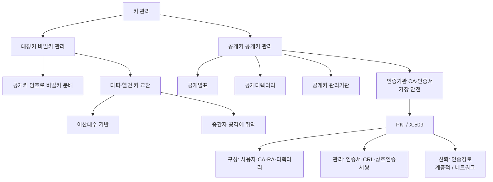
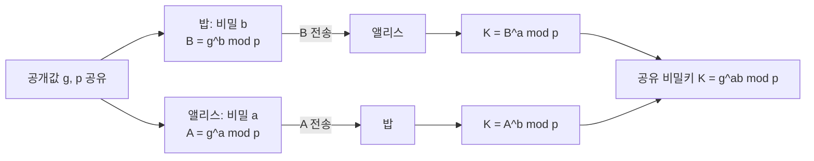

# 15강. 컴퓨터보안: 키 관리

## 🔗 선수 지식 (Prerequisites)
- [ ] **필수**: 대칭키·공개키 암호와 전자서명 개념([3강](3강.md)) - 이해 완료?
- [ ] **필수**: 해시함수·인증서·무결성 개념([1강](1강.md))
- [ ] **권장**: 인증서를 활용한 메일 보안(S/MIME의 X.509·CA 신뢰)([9강](9강.md))
- **관련 단원**: [3강 암호화](3강.md), [9강 이메일 보안](9강.md)

---

## 학습 목표
1. 대칭키 암호의 비밀키 관리에 대해 설명할 수 있다.
2. 공개키 암호의 공개키 관리에 대해 설명할 수 있다.
3. 공개키 기반 구조에 대해 설명할 수 있다.

---

## 🧠 메타인지 체크 (학습 전/후 자기 평가)

### 학습 전 자기 평가
| 소주제 | 자신감 (1-5) |
| :--- | :--- |
| 대칭키 분배의 어려움과 해결책(공개키 이용·DH) | |
| 디피-헬먼 키 교환과 중간자 공격 | |
| 공개키 분배 방법(공개발표·디렉터리·CA) | |
| PKI 구성요소와 인증경로·신뢰 | |

### 학습 후 교정 (학습 완료 후 작성)
| 소주제 | 학습 전 | 학습 후 | 실제 정답률 | 과신/과소 여부 |
| :--- | :--- | :--- | :--- | :--- |
| 대칭키 분배 | | | | |
| 디피-헬먼 | | | | |
| 공개키 분배 | | | | |
| PKI | | | | |

> **활용법**: 학습 전 1분 → 자신감 기입, 학습 후 1분 → 나머지 기입. "과신" 영역이 실제 취약점.

---

## 📝 요약 (Summary)
1. **대칭키 분배의 어려움** 🔴: 대칭키 암호에서 비밀키는 송수신자가 **서로 나누어 가지는 것이 어렵다**. 안전한 채널 없이 비밀키를 전달하는 것이 근본 문제다.
2. **공개키를 이용한 비밀키 분배** 🟡: 대칭키(비밀키)를 **공개키 암호로 암호화해서 분배**할 수 있다. 단, 공개키 자체의 분배에도 위협이 존재한다.
3. **디피-헬먼 키 교환** 🔴: 비밀키를 분배하는 또 다른 방법으로 **디피-헬먼(Diffie-Hellman) 키 교환**이 있다. **이산대수 문제**에 기반해 안전하게 공유 비밀키를 합의하지만, **중간자 공격(MITM)에 취약**하다.
4. **공개키 분배 방법** 🔴: 공개키를 분배하는 방법에는 공개발표, 공개디렉터리, 공개키 관리기관, 인증기관 등이 있으며, **인증서를 이용하는 인증기관(CA) 방법이 가장 안전하다**.

> ⚠️ **단, "가장 안전"은 위조방지 신뢰도가 최고라는 뜻이며 절대 안전은 아니다.** CA 자체가 침해되면 신뢰 사슬 전체가 무너진다 — 실제로 2011년 **DigiNotar**(네덜란드 CA)가 해킹당해 google.com 등 위조 인증서가 대량 발급되었고, 결국 해당 CA가 신뢰목록에서 퇴출되었다. 그래서 CA 보안·인증서 폐지(CRL/OCSP) 관리가 핵심이다.
5. **공개키 기반 구조(PKI)** 🔴: PKI는 **X.509에 기초**해서 인증서를 **생성·분배·인증·폐지**까지 관리하는 체계다.
6. **PKI 구성요소** 🔴: PKI는 **사용자, 인증기관(CA), 등록기관(RA), 디렉터리**로 구성된다. 인증서·인증서 취소목록(CRL)·상호인증서 쌍을 관리한다.
7. **인증경로와 신뢰** 🟡: PKI에서 신뢰는 **인증경로(certification path)** 를 통해 전달되며, 인증경로의 형태로는 **계층적 구성**과 **네트워크 구성**이 있다.

---

## 📐 핵심 정의 및 원리 (Key Definitions & Principles)

| 정의명 | 내용 | 키워드 |
| :--- | :--- | :--- |
| **키 관리(Key Management)** | 키의 생성·분배·저장·갱신·폐기 전 과정을 안전하게 다루는 활동 | 생성, 분배, 폐기 |
| **대칭키 분배 문제** | 비밀키를 안전한 채널 없이 송수신자가 공유해야 하는 근본적 난제. $n$명이 양자 통신 시 $\frac{n(n-1)}{2}$개의 키 필요 | 사전공유, 키 폭증, 안전채널 |
| **공개키를 이용한 키 분배** | 대칭 비밀키를 상대방의 공개키로 암호화해 전달 → 수신자만 개인키로 복호 | 디지털 봉투, 키 래핑 |
| **디피-헬먼 키 교환** | 공개 채널에서 비밀값을 직접 보내지 않고 **공유 비밀키를 합의**하는 프로토콜. 이산대수 문제 기반 | $g, p$, 이산대수, 키 합의 |
| **이산대수 문제(DLP)** | $y = g^x \bmod p$에서 $y,g,p$를 알아도 $x$를 구하기 어렵다는 수학적 난제 | 일방향성, 안전성 근거 |
| **중간자 공격(MITM)** | 공격자가 양측 사이에 끼어 각자와 별도 키를 교환하고 통신을 가로채는 공격. 인증 없는 DH의 약점 | 인증 부재, 가로채기 |
| **공개키 분배 방법** | 공개발표 / 공개디렉터리 / 공개키 관리기관 / **인증기관(CA, 인증서)** | 공개발표, 디렉터리, CA |
| **인증서(Certificate)** | CA가 발급·서명하여 **공개키를 소유자 신원에 묶어** 증명하는 전자문서. X.509 형식 | X.509, CA 서명, 신원결합 |
| **공개키 기반 구조(PKI)** | X.509 기반으로 인증서를 생성·분배·인증·폐지까지 관리하는 종합 체계 | X.509, 생성/폐지, 체계 |
| **인증기관(CA)** | 인증서를 발급·서명·폐지하는 신뢰 주체 | 발급, 서명, CRL |
| **등록기관(RA)** | 사용자 신원을 확인해 CA의 등록 업무를 대행하는 기관 | 신원확인, 등록대행 |
| **디렉터리(Directory)** | 인증서와 CRL을 저장·공개하는 저장소(예: X.500/LDAP) | 저장소, LDAP |
| **인증서 취소목록(CRL)** | 유효기간 전에 폐지된 인증서 목록(주기적 배포, 목록 비대·갱신 지연 한계) | 폐지, 키 탈취 대응 |
| **OCSP** | 인증서 하나의 상태를 CA에 실시간 질의하는 온라인 폐지확인 프로토콜(CRL 한계 보완) | 실시간 폐지확인, RFC 6960 |
| **전방향 비밀성(PFS)** | 임시키(DHE/ECDHE) 사용으로 장기키가 유출돼도 과거 트래픽이 안전한 성질 | ephemeral, forward secrecy |
| **상호인증서 쌍(Cross-certificate Pair)** | 서로 다른 CA가 상대 CA를 인증해 신뢰를 연결하는 인증서 쌍 | 상호인증, 신뢰 연결 |
| **인증경로(Certification Path)** | 검증자가 신뢰하는 CA에서 대상 인증서까지 이어지는 신뢰의 연결 고리 | 계층적, 네트워크 |

### 주요 원리

**원리 1. 디피-헬먼 키 교환 — "비밀키를 보내지 않고 합의한다"**
> 공개 파라미터로 소수 $p$와 생성원 $g$를 공유한다.
> 앨리스는 비밀값 $a$를 골라 $A = g^a \bmod p$를, 밥은 비밀값 $b$를 골라 $B = g^b \bmod p$를 공개 채널로 교환한다.
> 앨리스는 $K = B^a \bmod p$, 밥은 $K = A^b \bmod p$를 계산하면 **둘 다 같은** $K = g^{ab} \bmod p$ 를 얻는다.
> **직관적 해석**: 비밀값 $a, b$ 자체는 절대 전송되지 않는다. 도청자는 $g^a, g^b$만 보지만 **이산대수 문제** 때문에 $a, b$를 복원하지 못해 $g^{ab}$를 계산할 수 없다.
> **한계**: DH 자체는 **상대가 누구인지 인증하지 않으므로** 중간자가 양측과 각각 키를 합의해 가로챌 수 있다 → 전자서명·인증서로 보완해야 한다.

**원리 2. 인증서 = 공개키 + 신원 + CA의 서명**
> **직관적 해석**: 공개키를 그냥 발표하면 공격자가 "이게 앨리스 공개키"라며 자기 키를 끼워넣을 수 있다(공개키 위조). CA가 "이 공개키는 앨리스의 것"임을 **자신의 개인키로 서명**해 보증하면, 검증자는 CA의 공개키로 서명을 확인해 신뢰할 수 있다. 그래서 **인증서 기반 CA 방법이 가장 안전**하다.

**원리 3. X.509 인증서의 주요 필드**

인증서는 정해진 형식(X.509 v3, RFC 5280)을 따른다. 핵심 필드는 다음과 같다.

| 필드 | 의미 |
| :--- | :--- |
| **Subject(주체)** | 인증서 소유자(공개키의 주인) 식별 정보(DN) |
| **Subject Public Key** | 소유자의 공개키와 알고리즘 |
| **Issuer(발급자)** | 인증서를 발급·서명한 CA |
| **Validity(유효기간)** | Not Before ~ Not After(시작·만료 시각) |
| **Serial Number(일련번호)** | 발급 CA 내에서 인증서를 유일하게 식별, CRL 폐지 식별에 사용 |
| **Signature Algorithm** | CA가 서명에 쓴 알고리즘(예: sha256WithRSAEncryption) |
| **CA's Signature** | 위 모든 필드에 대한 CA의 전자서명(위·변조 방지) |

> 검증자는 Issuer를 따라 **인증경로**를 거슬러 신뢰 루트까지 확인하고, Validity로 만료를, **CRL/OCSP로 폐지 여부**를 점검한다. (근거: RFC 5280)

**원리 4. 인증서 폐지 확인 — CRL vs OCSP, 그리고 전방향 비밀성(PFS)**
- **CRL(인증서 취소목록)**: 폐지된 인증서 일련번호를 모은 목록을 주기적으로 배포. **한계**: 목록이 비대해지고(다운로드 부담), 다음 갱신 전까지는 최신 폐지가 반영되지 않는 **갱신 지연**이 있다.
- **OCSP(Online Certificate Status Protocol)**: 특정 인증서 하나의 상태(유효/폐지/미상)를 **CA(응답자)에 실시간 질의**해 확인. CRL의 비대·지연 문제를 줄인다. (근거: RFC 6960)
- **전방향 비밀성(Forward Secrecy, PFS)**: 매 세션마다 **임시(ephemeral) 키**를 쓰는 **DHE/ECDHE**는, 훗날 서버의 장기 개인키가 유출되어도 **과거에 녹음된 트래픽을 복호화할 수 없게** 한다. 반면 정적(static) DH나 RSA 키 수송 방식은 장기키가 새면 과거 세션이 모두 노출되어 PFS가 없다.

---

## 📊 개념 시각화 (Visual Guide)

### 분류 체계도: 키 관리


### 디피-헬먼 키 교환 흐름도


### 핵심 비교표: 대칭키 분배 vs 공개키 분배
| 구분 | 대칭키(비밀키) 관리 | 공개키 관리 |
| :--- | :--- | :--- |
| 핵심 과제 | 비밀키를 **안전하게 공유** | 공개키의 **진위(소유자) 보증** |
| 대표 방법 | 공개키 암호로 분배, **디피-헬먼 교환** | 공개발표·디렉터리·**CA(인증서)** |
| 주요 위협 | 도청·키 폭증, DH의 **중간자 공격** | 공개키 **위조/사칭** |
| 해결책 | DH + 인증(서명) | **PKI / X.509 인증서** |

---

## ✏️ 심화 학습 (Study Subject)

### 1. 가상 시나리오: "키를 어떻게 안전하게 나눠 가질까?"
- **상황**: 앨리스와 밥은 사전에 만난 적이 없고 안전한 채널도 없는데, 인터넷으로 대칭키 암호 통신을 시작하려 한다. 공격자 멜로리가 회선을 도청·변조할 수 있다.
- **문제**: (1) 안전 채널 없이 공유 비밀키를 어떻게 합의할 것인가? (2) 합의 과정에서 멜로리의 **중간자 공격**을 어떻게 막을 것인가?
- **해결**:
    1. **디피-헬먼 키 교환**으로 공개값 $g^a, g^b$만 주고받아 공유키 $g^{ab}$를 합의 → 비밀값은 전송하지 않으므로 단순 도청으로는 키를 못 얻는다(이산대수 난제).
    2. 그러나 DH만으로는 멜로리가 앨리스·밥 각각과 별도 DH를 수행해 가로챌 수 있다 → **인증된 DH** 필요.
    3. 각자 교환값에 **전자서명**을 붙이고, 그 서명 검증에 쓰는 **공개키를 CA 인증서(X.509)** 로 보증 → 멜로리는 유효한 서명을 위조할 수 없어 중간자 공격이 차단된다.
    4. 조직 차원이라면 **PKI**가 인증서 발급(CA)·신원확인(RA)·저장(디렉터리)·폐지(CRL)를 일괄 관리한다.
- **AI 학습 포인트**: "TLS 핸드셰이크의 (EC)DHE + 인증서 구조가, 위 '인증된 디피-헬먼'을 실제로 어떻게 구현해 전방향 비밀성(forward secrecy)과 중간자 방어를 동시에 달성하는지 단계별로 설명해줘."

### 2. 관점별 비교 및 오개념 분석
- **핵심 비교**: 혼동하기 쉬운 쌍을 정리한다.
    - **디피-헬먼 vs 공개키 암호 분배**: DH는 비밀키를 *합의(생성)* 하는 프로토콜이고, 공개키 암호 분배는 이미 만든 비밀키를 *암호화해 전달* 하는 방식이다.
    - **공개키 분배(진위 보증) vs 비밀키 분배(기밀 공유)**: 공개키는 비밀이 아니다 — 문제는 "진짜 그 사람 것인가". 비밀키는 노출되면 안 되는 것이라 "안전하게 공유"가 문제다.
    - **CA vs RA**: CA는 인증서를 *발급·서명·폐지*, RA는 *신원확인·등록 대행*만 한다.
    - **계층적 vs 네트워크 인증경로**: 계층적은 루트 CA를 정점으로 한 트리 구조, 네트워크는 CA들이 상호인증서로 연결된 그물 구조다.
- **오개념 분석**
    - **오개념 1**: "디피-헬먼은 안전하므로 그 자체로 중간자 공격도 막는다."
    - **분석**: DH는 도청에는 강하지만 **상대를 인증하지 않는다**. 멜로리가 양측과 각각 키를 합의하면 통신을 모두 가로챈다. 막으려면 서명·인증서로 **교환값을 인증**해야 한다.
    - **오개념 2**: "공개키는 누구나 발표만 하면 되니 별도 관리가 필요 없다."
    - **분석**: 공개키 자체는 비밀이 아니지만, 공격자가 자기 공개키를 남의 것으로 사칭(위조)할 수 있다. 그래서 **인증서·CA**로 진위를 보증해야 한다.
    - **오개념 3**: "PKI는 인증서를 발급하기만 하면 끝이다."
    - **분석**: PKI는 생성뿐 아니라 **분배·인증·폐지**까지 관리한다. 키 탈취 시 **CRL(인증서 취소목록)** 로 폐지하는 과정이 핵심이다.
- **AI 학습 포인트**: "위 오개념들이 실제 사고(예: 인증서 검증 생략, 폐지 미확인)로 이어진 사례를 들어 설명하고, 각 사고를 막는 PKI 통제를 매핑해달라고 AI에게 요청해보자."

---

## ❓ 연습 문제 및 해설

> **블룸 인지 수준 범례**: [기억] 정의·나열 → [이해] 설명·비교 → [적용] 계산·구현 → [분석] 구별·디버그 → [평가] 판단·비평 → [창조] 설계·제안

> 📌 본 강의는 원본 연습문제가 제공되지 않아 학습목표·학습정리를 전체 커버하도록 10문항을 AI 출제(📌)했다.

### 📝 문제

**1. ⭐ [기억] 📌 [대칭키 분배의 근본 문제](#prob-1)**
> 대칭키 암호에서 키 관리가 어려운 가장 근본적인 이유로 옳은 것은?
> ① 키 길이가 너무 짧기 때문
> ② 비밀키를 송수신자가 안전하게 나누어 가지기 어렵기 때문
> ③ 암호화 속도가 느리기 때문
> ④ 공개키 암호보다 안전성이 낮기 때문

<br>

**2. ⭐ [기억] 📌 [디피-헬먼의 기반 문제](#prob-2)**
> 디피-헬먼 키 교환 프로토콜의 안전성이 기반하는 수학적 난제는?
> ① 소인수분해 문제
> ② 이산대수 문제
> ③ 배낭 문제
> ④ 해밀턴 경로 문제

<br>

**3. ⭐ [기억] 📌 [디피-헬먼의 취약점](#prob-3)**
> 디피-헬먼 키 교환 프로토콜이 가장 취약한 공격은?
> ① 무차별 대입 공격
> ② 재전송 공격
> ③ 중간자 공격
> ④ 서비스 거부 공격

<br>

**4. ⭐⭐ [이해] 📌 [공개키 분배 방법](#prob-4)**
> <보기>
>
> 가. 공개키는 공개발표, 공개디렉터리, CA 등으로 분배할 수 있다.
> 나. 인증서를 이용하는 인증기관(CA) 방법이 가장 안전하다.
> 다. 공개키는 비밀이 아니므로 진위를 보증할 필요가 전혀 없다.

> 위 보기에서 옳은 것을 모두 고른 것은?
> ① 가, 나
> ② 가, 다
> ③ 나, 다
> ④ 가, 나, 다

<br>

**5. ⭐⭐ [이해] 📌 [PKI의 정의](#prob-5)**
> 공개키 기반 구조(PKI)에 대한 설명으로 가장 옳은 것은?
> ① 대칭키만을 생성·분배하는 체계다.
> ② X.509에 기초해 인증서를 생성·분배·인증·폐지까지 관리하는 체계다.
> ③ 디피-헬먼 키 교환만을 표준화한 프로토콜이다.
> ④ 해시함수를 관리하는 무결성 전용 구조다.

<br>

**6. ⭐⭐ [적용] 📌 [디피-헬먼 공유키 계산](#prob-6)**
> $p = 23,\ g = 5$이고 앨리스의 비밀값 $a = 6$, 밥의 비밀값 $b = 15$일 때, 두 사람이 합의하는 공유 비밀키 $K = g^{ab} \bmod p$ 의 값은?
> ① 2
> ② 8
> ③ 19
> ④ 21

<br>

**7. ⭐⭐ [분석] 📌 [PKI 구성요소](#prob-7)**
> PKI의 구성요소와 역할의 연결이 옳지 않은 것은?
> ① 인증기관(CA) — 인증서 발급·서명·폐지
> ② 등록기관(RA) — 사용자 신원확인·등록 대행
> ③ 디렉터리 — 인증서와 CRL 저장·공개
> ④ 사용자 — 다른 사용자의 인증서를 직접 발급

<br>

**8. ⭐⭐⭐ [평가] 📌 [인증경로의 형태](#prob-8)**
> PKI에서 신뢰가 전달되는 인증경로(certification path)에 대한 설명으로 가장 옳은 것은?
> ① 인증경로의 형태에는 계층적 구성과 네트워크 구성이 있다.
> ② 인증경로는 대칭키 분배에만 사용된다.
> ③ 계층적 구성은 CA들이 상호인증서로 그물처럼 연결된 형태다.
> ④ 네트워크 구성은 단일 루트 CA만 신뢰하는 트리 구조다.

<br>

**9. ⭐⭐⭐ [분석] 📌 [PKI가 관리하는 대상](#prob-9)**
> <보기>
>
> 가. 인증서
> 나. 인증서 취소목록(CRL)
> 다. 상호인증서 쌍
> 라. 사용자의 대칭 세션키

> PKI에서 관리해야 하는 대상으로 옳은 것을 모두 고른 것은?
> ① 가, 나
> ② 가, 나, 다
> ③ 나, 다, 라
> ④ 가, 나, 다, 라

<br>

**10. ⭐⭐⭐ [창조] 📌 [안전한 키 합의 설계](#prob-10)**
> 사전 공유 비밀이 없고 도청·변조가 가능한 공개 네트워크에서 두 사용자가 대칭키 통신을 시작하려 한다. (1) 디피-헬먼만 사용할 때의 위험과, (2) 이를 보완해 중간자 공격을 막는 설계를, 인증서/전자서명을 포함하여 제시하시오.

---

### 🔑 정답 및 해설 (먼저 풀어본 후 펼치기)

<details>
<summary>정답 보기 (클릭)</summary>

1. ②
2. ②
3. ③
4. ①
5. ②
6. ①
7. ④
8. ①
9. ②
10. [풀이형 정답 — 아래 해설 참고]

</details>

<details>
<summary>해설 보기 (클릭)</summary>

<a id="prob-1"></a>
**1. ⭐ [기억] 대칭키 분배의 근본 문제**
> **정답: ② 비밀키를 송수신자가 안전하게 나누어 가지기 어렵기 때문**
> **해설**: 대칭키 암호는 송수신자가 같은 비밀키를 공유해야 하는데, 안전한 채널 없이 이를 전달·공유하는 것이 핵심 난제다. 그래서 공개키 암호나 디피-헬먼 교환으로 분배를 보완한다.

<a id="prob-2"></a>
**2. ⭐ [기억] 디피-헬먼의 기반 문제**
> **정답: ② 이산대수 문제**
> **해설**: DH는 $y = g^x \bmod p$에서 $x$를 구하기 어렵다는 이산대수 문제에 기반한다. 소인수분해 문제는 RSA의 기반이다.

<a id="prob-3"></a>
**3. ⭐ [기억] 디피-헬먼의 취약점**
> **정답: ③ 중간자 공격**
> **해설**: DH는 도청에는 강하지만 상대를 인증하지 않으므로, 공격자가 양측과 각각 키를 합의해 통신을 가로채는 중간자 공격에 취약하다. 전자서명·인증서로 교환값을 인증해 보완한다.

<a id="prob-4"></a>
**4. ⭐⭐ [이해] 공개키 분배 방법**
> **정답: ① 가, 나**
> **해설**: 다는 틀렸다 — 공개키는 비밀이 아니지만 공격자가 자기 키를 남의 것으로 사칭(위조)할 수 있어 **진위 보증이 필수**다. 그래서 CA·인증서 방법이 가장 안전하다.

<a id="prob-5"></a>
**5. ⭐⭐ [이해] PKI의 정의**
> **정답: ② X.509에 기초해 인증서를 생성·분배·인증·폐지까지 관리하는 체계다.**
> **해설**: PKI는 X.509 인증서를 중심으로 발급부터 폐지까지의 전 생명주기를 관리하는 종합 체계다. 대칭키 전용(①), DH 전용(③), 해시 전용(④)이 아니다.

<a id="prob-6"></a>
**6. ⭐⭐ [적용] 디피-헬먼 공유키 계산**
> **정답: ① 2**
> **해설**: 먼저 공개값을 구한다. $A = 5^6 \bmod 23$: $5^3 = 125 \equiv 10$, $5^6 = 10^2 = 100 \equiv 8$ → $A = 8$.
> $B = 5^{15} \bmod 23$: $5^{12} = 8^2 = 64 \equiv 18$, $5^{15} = 18 \cdot 10 = 180 \equiv 19$ → $B = 19$.
> 공유키는 $K = B^a \bmod p = 19^6 \bmod 23$. $19 \equiv -4$이므로 $(-4)^6 = 4^6 = 4096 \equiv 4096 - 178\cdot23 = 2$.
> 반대편도 $K = A^b \bmod p = 8^{15} \bmod 23 = 2$로 동일하다($g^{ab}=5^{90}$, $90 \equiv 2 \pmod{22}$이므로 $5^2 = 2$). 따라서 $K = 2$.
> **왜 지수를 $\bmod\ 22$로 줄이나?** 페르마 소정리에 의해 $5^{22} \equiv 1 \pmod{23}$이다($p-1 = 22$). 즉 $g=5$의 위수(order)가 $p-1=22$를 나누므로 **지수는 $\bmod\ (p-1)=\bmod\ 22$로 환산**할 수 있다. 따라서 $5^{90} = 5^{22\cdot 4 + 2} \equiv (5^{22})^4 \cdot 5^2 \equiv 1^4 \cdot 5^2 = 25 \equiv 2 \pmod{23}$.

<a id="prob-7"></a>
**7. ⭐⭐ [분석] PKI 구성요소**
> **정답: ④ 사용자 — 다른 사용자의 인증서를 직접 발급**
> **해설**: 인증서 발급은 인증기관(CA)의 역할이다. 사용자는 인증서를 신청·사용·검증하는 주체이지 발급 주체가 아니다. ①②③은 올바른 역할 연결이다.

<a id="prob-8"></a>
**8. ⭐⭐⭐ [평가] 인증경로의 형태**
> **정답: ① 인증경로의 형태에는 계층적 구성과 네트워크 구성이 있다.**
> **해설**: PKI의 신뢰는 인증경로를 통해 전달되며, 형태는 계층적(루트 CA 정점의 트리)과 네트워크(CA들이 상호인증서로 연결된 그물)가 있다. ③④는 두 형태의 설명이 서로 뒤바뀐 오답이다.

<a id="prob-9"></a>
**9. ⭐⭐⭐ [분석] PKI가 관리하는 대상**
> **정답: ② 가, 나, 다**
> **해설**: PKI는 인증서·인증서 취소목록(CRL)·상호인증서 쌍을 관리한다. 라(대칭 세션키)는 통신 당사자가 다루는 임시 키로 PKI의 관리 대상이 아니다.

<a id="prob-10"></a>
**10. ⭐⭐⭐ [창조] 안전한 키 합의 설계 (예시 답안)**
> **정답 예시: 인증된 디피-헬먼(서명+인증서)**
> 1. **DH만 사용 시 위험**: 공유키 $g^{ab}$는 도청에 안전하지만 상대를 인증하지 않아, 멜로리가 앨리스·밥 각각과 별도 DH를 수행하는 **중간자 공격**으로 모든 통신을 복호·변조할 수 있다.
> 2. **보완 설계**: 각자 자신의 DH 교환값($g^a, g^b$)에 **개인키로 전자서명**을 첨부한다.
> 3. 서명 검증에 쓰는 **공개키는 CA가 발급한 X.509 인증서**로 보증하고, 검증자는 인증경로를 따라 CA 신뢰를 확인하며 **CRL로 폐지 여부**까지 점검한다.
> 4. 멜로리는 상대의 개인키가 없어 교환값에 대한 유효 서명을 위조할 수 없으므로 중간자 공격이 차단된다. → 결과적으로 **기밀성(DH 공유키) + 인증·무결성(서명/인증서)** 을 모두 확보한다. (TLS의 (EC)DHE + 서버 인증서가 이 구조다.)

</details>

---

## ✅ O/X 확인문제 (20문항)

**1.** 대칭키 암호에서 비밀키는 송수신자가 서로 나누어 가지는 것이 어렵다.[(O / X)](#ox-1)
**2.** 대칭키(비밀키)를 공개키 암호로 암호화해서 분배할 수 있다.[(O / X)](#ox-2)
**3.** 디피-헬먼 키 교환은 소인수분해 문제에 기반한다.[(O / X)](#ox-3)
**4.** 디피-헬먼 키 교환은 중간자 공격에 취약하다.[(O / X)](#ox-4)
**5.** 디피-헬먼에서 각자의 비밀값 $a, b$는 공개 채널로 직접 전송된다.[(O / X)](#ox-5)
**6.** 공개키를 분배하는 방법 중 인증서를 이용하는 인증기관(CA) 방법이 가장 안전하다.[(O / X)](#ox-6)
**7.** 공개키는 비밀이 아니므로 진위(소유자)를 보증할 필요가 전혀 없다.[(O / X)](#ox-7)
**8.** 인증서는 CA가 공개키를 소유자 신원에 묶어 서명한 전자문서다.[(O / X)](#ox-8)
**9.** PKI는 X.509에 기초해서 인증서를 생성·분배·인증·폐지까지 관리한다.[(O / X)](#ox-9)
**10.** PKI는 사용자, 인증기관(CA), 등록기관(RA), 디렉터리로 구성된다.[(O / X)](#ox-10)
**11.** 인증서 발급·서명·폐지는 등록기관(RA)의 역할이다.[(O / X)](#ox-11)
**12.** 등록기관(RA)은 사용자 신원을 확인해 CA의 등록 업무를 대행한다.[(O / X)](#ox-12)
**13.** PKI에서는 인증서, 인증서 취소목록(CRL), 상호인증서 쌍을 관리한다.[(O / X)](#ox-13)
**14.** 인증서 취소목록(CRL)은 유효기간 전에 폐지된 인증서 목록이다.[(O / X)](#ox-14)
**15.** PKI에서 신뢰는 인증경로(certification path)를 통해 전달된다.[(O / X)](#ox-15)
**16.** 인증경로의 형태에는 계층적 구성과 네트워크 구성이 있다.[(O / X)](#ox-16)
**17.** 계층적 구성은 CA들이 상호인증서로 그물처럼 연결된 형태다.[(O / X)](#ox-17)
**18.** 디피-헬먼은 비밀값을 직접 보내지 않고 공유 비밀키를 합의하는 프로토콜이다.[(O / X)](#ox-18)
**19.** 디피-헬먼에 전자서명·인증서를 결합하면 중간자 공격을 방어할 수 있다.[(O / X)](#ox-19)
**20.** 이산대수 문제는 $y = g^x \bmod p$에서 $x$를 구하기 어렵다는 난제다.[(O / X)](#ox-20)

<details>
<summary>O/X 정답 및 해설 보기 (클릭)</summary>

> <a id="ox-1"></a>
> **1. 정답: O** — 학습개요/정리: 대칭키 분배의 근본 어려움.

> <a id="ox-2"></a>
> **2. 정답: O** — 공개키 암호로 비밀키를 암호화해 분배 가능.

> <a id="ox-3"></a>
> **3. 정답: X** — DH는 *이산대수* 문제 기반. 소인수분해는 RSA.

> <a id="ox-4"></a>
> **4. 정답: O** — 학습정리: DH는 중간자 공격에 취약.

> <a id="ox-5"></a>
> **5. 정답: X** — 전송되는 것은 $g^a, g^b$이며 비밀값 $a, b$는 전송하지 않는다.

> <a id="ox-6"></a>
> **6. 정답: O** — 학습정리: 인증서 기반 CA 방법이 가장 안전.

> <a id="ox-7"></a>
> **7. 정답: X** — 공개키는 비밀은 아니지만 위조·사칭을 막기 위해 진위 보증이 필요하다.

> <a id="ox-8"></a>
> **8. 정답: O** — 인증서 = 공개키 + 신원 + CA 서명.

> <a id="ox-9"></a>
> **9. 정답: O** — 학습정리: PKI는 X.509 기반 생성·분배·인증·폐지 관리.

> <a id="ox-10"></a>
> **10. 정답: O** — 학습정리: PKI 구성요소 4가지.

> <a id="ox-11"></a>
> **11. 정답: X** — 인증서 발급·서명·폐지는 *CA*의 역할. RA는 신원확인·등록 대행.

> <a id="ox-12"></a>
> **12. 정답: O** — RA의 정의.

> <a id="ox-13"></a>
> **13. 정답: O** — 학습정리: 인증서·CRL·상호인증서 쌍 관리.

> <a id="ox-14"></a>
> **14. 정답: O** — CRL은 만료 전 폐지된 인증서 목록.

> <a id="ox-15"></a>
> **15. 정답: O** — 학습정리: 신뢰는 인증경로로 전달.

> <a id="ox-16"></a>
> **16. 정답: O** — 학습정리: 계층적 / 네트워크 구성.

> <a id="ox-17"></a>
> **17. 정답: X** — 그물처럼 연결되는 것은 *네트워크* 구성. 계층적은 루트 CA 정점의 트리.

> <a id="ox-18"></a>
> **18. 정답: O** — DH의 핵심: 비밀값 미전송, 공유키 합의.

> <a id="ox-19"></a>
> **19. 정답: O** — 인증된 DH(서명·인증서)로 중간자 공격 방어.

> <a id="ox-20"></a>
> **20. 정답: O** — 이산대수 문제의 정의.

</details>

---

## 🧪 자유 회상 연습 (Free Recall)

> **방법**: 위의 노트를 모두 덮고, 타이머 3분 설정 후 이번 단원에서 배운 내용을 기억나는 대로 자유롭게 적으세요.
> 정확한 문장이 아니어도 됩니다. 키워드, 수식, 관계 등 떠오르는 것을 모두 적습니다.

**자유 회상 작성란:**

```
[여기에 기억나는 내용을 자유롭게 작성]


```

> **회상 후 점검**: 노트를 다시 펼쳐 빠뜨린 내용을 확인하세요. 빠뜨린 부분이 실제 취약점입니다.
> - 회상 못한 핵심 개념: [                ]
> - 회상 못한 PKI 구성요소: [                ]
> - 회상 못한 디피-헬먼 절차: [                ]

---

## 💻 코드로 확인하기 (Code Verification)

> 키 관리는 이론 중심이라 수식 검증 대신 **디피-헬먼 키 교환과 중간자 공격, 그리고 서명으로의 방어**를 작은 코드로 시연한다.

```python
# 디피-헬먼 키 교환 시연 + 중간자 공격(MITM) 재현
p, g = 23, 5  # 공개 파라미터 (실무에선 2048비트 이상의 안전소수 사용)

# --- 1) 정상적인 디피-헬먼 ---
a, b = 6, 15                 # 앨리스/밥의 비밀값
A = pow(g, a, p)            # 앨리스 공개값 g^a mod p
B = pow(g, b, p)            # 밥 공개값 g^b mod p
K_alice = pow(B, a, p)     # 앨리스가 계산한 공유키 B^a
K_bob   = pow(A, b, p)     # 밥이 계산한 공유키 A^b
print("앨리스 공개값 A =", A, "/ 밥 공개값 B =", B)
print("공유키(앨리스) =", K_alice, "/ 공유키(밥) =", K_bob,
      "→ 일치:", K_alice == K_bob)

# --- 2) 중간자 공격: 멜로리가 양측과 각각 키를 합의 ---
m = 9                                  # 멜로리의 비밀값
M = pow(g, m, p)                       # 멜로리 공개값
K_alice_m = pow(M, a, p)               # 앨리스↔멜로리 공유키
K_bob_m   = pow(M, b, p)               # 밥↔멜로리 공유키
K_m_alice = pow(A, m, p)
K_m_bob   = pow(B, m, p)
print("\n[MITM] 앨리스-멜로리 키 일치:", K_alice_m == K_m_alice,
      "/ 밥-멜로리 키 일치:", K_bob_m == K_m_bob)
print("→ 앨리스와 밥은 서로 다른 키를 쓰며 멜로리가 중간에서 모두 복호 가능")

# --- 3) 방어: 교환값을 개인키로 서명해 인증(개념 시연) ---
# ⚠️ 주의: 아래는 '서명 개념'을 표준 라이브러리만으로 흉내 낸 것으로, 실제로는 HMAC을 쓴다.
#   그러나 HMAC은 '공유 대칭키' 기반이라 무결성·인증만 제공하고 '부인방지'는 못 한다
#   (양측이 같은 키를 알아 둘 다 태그를 만들 수 있음). 진짜 인증된 DH의 서명은
#   서명자 개인키로만 만드는 RSA/ECDSA/EdDSA를 써야 부인방지까지 성립한다.
import hashlib, hmac
alice_priv = b"alice-private"          # (개념용) 실무에선 RSA/ECDSA/EdDSA 개인키로 진짜 서명
sig = hmac.new(alice_priv, str(A).encode(), hashlib.sha256).digest()
# 밥은 인증서로 검증한 앨리스 공개키(여기선 동일 비밀)로 서명 확인
ok = hmac.compare_digest(
    sig, hmac.new(alice_priv, str(A).encode(), hashlib.sha256).digest())
print("\n[방어] 교환값 A의 서명 검증:", "유효 ✅(멜로리는 위조 불가)" if ok else "위조 ❌")
```

> **실행 결과 (예시)**:
> ```
> 앨리스 공개값 A = 8 / 밥 공개값 B = 19
> 공유키(앨리스) = 2 / 공유키(밥) = 2 → 일치: True
>
> [MITM] 앨리스-멜로리 키 일치: True / 밥-멜로리 키 일치: True
> → 앨리스와 밥은 서로 다른 키를 쓰며 멜로리가 중간에서 모두 복호 가능
>
> [방어] 교환값 A의 서명 검증: 유효 ✅(멜로리는 위조 불가)
> ```
> **보안적 해석**:
> - **DH 정상 동작**: 비밀값을 보내지 않고도 양측이 같은 공유키($g^{ab}\bmod p = 2$)를 얻는다.
> - **중간자 공격**: 인증이 없으면 멜로리가 양측과 각각 키를 합의해 통신을 가로챈다.
> - **방어**: 교환값에 전자서명을 붙이고 그 공개키를 **인증서(CA)** 로 보증하면 위조가 불가능해 MITM이 차단된다 → "인증된 디피-헬먼".

---

## 🤖 AI 연결고리 (Concept → AI Application)

| 보안 개념 | AI/ML 적용 분야 | 구체적 사례 |
| :--- | :--- | :--- |
| 키 분배·관리 | 연합학습/MLOps 비밀 관리 | KMS envelope encryption으로 모델·데이터 키 보호 |
| 디피-헬먼(키 합의) | 안전한 다자간 연산 | 분산 학습 참여자 간 세션키 합의 |
| 중간자 공격 방어 | 모델 API 통신 보안 | mTLS로 추론 서버↔클라이언트 상호 인증 |
| 인증서·PKI(신뢰) | 공급망·모델 출처 인증 | 모델 가중치 서명·검증, 코드 서명 |
| 인증서 폐지(CRL) | 이상 탐지 | 폐지·만료 인증서 사용 패턴 탐지 모델 |

---

## 📖 심화 학습 예시 답안

#### 1. 디피-헬먼 키 교환의 내부 동작 원리
DH는 "공개 파라미터 공유 → 비밀값 선택 → 교환값 공개 → 공유키 계산"의 흐름이다.

1. **공개 파라미터**: 큰 소수 $p$와 생성원 $g$를 공개로 공유한다.
2. **비밀값 선택**: 앨리스는 $a$, 밥은 $b$를 비밀로 고른다.
3. **교환값 공개**: $A=g^a\bmod p$, $B=g^b\bmod p$만 공개 채널로 주고받는다(비밀값은 노출되지 않음).
4. **공유키 계산**: 앨리스 $B^a$, 밥 $A^b$ → 둘 다 $g^{ab}\bmod p$로 동일.
5. **안전성 근거**: 도청자는 $g^a, g^b$를 보지만 이산대수 난제로 $a, b$를 못 구해 $g^{ab}$를 계산할 수 없다.
6. **한계**: 상대 인증이 없어 중간자 공격에 취약 → 서명·인증서로 보완.

#### 2. 디피-헬먼 vs 공개키 암호 키 분배 비교표
| 구분 | 디피-헬먼 키 교환 | 공개키 암호 분배 | 비고 |
| :--- | :--- | :--- | :--- |
| **목적** | 공유 비밀키를 *합의(생성)* | 만든 비밀키를 *암호화 전달* | |
| **기반 난제** | 이산대수 문제 | 소인수분해 등(RSA) | |
| **전송 내용** | 교환값 $g^a, g^b$ | 공개키로 암호화된 비밀키 | |
| **MITM 취약성** | 인증 없으면 취약 | 공개키 진위 보증 필요 | 둘 다 인증 필요 |
| **AI 활용** | 분산 학습 세션키 합의 | 모델 키 래핑(KMS) | |

#### 2-1. DH 안전 파라미터와 Logjam 공격 (심층확장)
디피-헬먼은 **파라미터 $p, g$ 선택**이 안전성을 좌우한다.
- **안전소수(safe prime)**: $p = 2q+1$($q$도 소수) 형태를 써서 작은 부분군 공격을 막고, 생성원 $g$의 위수를 크게 한다. 실무는 **2048비트 이상**의 $p$를 권장한다.
- **Logjam 공격(2015)**: 많은 서버가 **512비트짜리 export-grade DH** 파라미터를 지원하던 점을 악용, 공격자가 핸드셰이크를 **약한 512비트 DH로 다운그레이드**시킨 뒤 사전계산으로 공유키를 깨뜨렸다. 게다가 다수 서버가 **동일한 소수 $p$를 공유**해 한 번의 대규모 사전계산으로 여러 연결을 위협할 수 있었다.
- **대응**: export 등급 비활성화, 2048비트 이상 사용, 그리고 **RFC 7919의 명명된(named) DH 그룹**(ffdhe2048 등 검증된 표준 파라미터)을 사용해 약한·미검증 파라미터를 배제한다. (근거: https://weakdh.org/, RFC 7919)

#### 2-2. 키 라이프사이클과 키 에스크로 (심층확장)
NIST SP 800-57은 키를 단순 생성·폐기가 아니라 **전 생명주기(lifecycle)** 로 관리할 것을 권고한다.

| 단계 | 내용 |
| :--- | :--- |
| **생성(Generation)** | 충분한 엔트로피로 키 생성, 안전한 보관 시작 |
| **활성(Active)** | 정상 사용 기간(암복호화·서명·검증). 암호기간(cryptoperiod) 내 사용 |
| **정지(Suspension/Deactivation)** | 신규 사용 중단, 기존 데이터 복호 등 제한적 사용만 허용 |
| **폐기(Destruction)** | 키를 안전하게 파기. 폐지된 인증서는 CRL/OCSP로 통지 |

> **키 에스크로(Key Escrow, 논쟁)**: 키 사본을 신뢰 제3자(또는 정부)에 맡겨, 합법적 수사·복구 시 접근할 수 있게 하는 제도. **복구·법집행 측면의 장점**이 있으나, **에스크로 보관소가 단일 침해 지점**이 되고 시민 프라이버시·백도어 논란(예: 1990년대 Clipper Chip)이 커서 광범위한 의무화는 거부되어 왔다. (근거: NIST SP 800-57 Part 1 Rev.5)

#### 3. 안전한 키 관리 Best Practice (Bad vs Good)
- **Bad Practice (나쁜 예시)**
  ```text
  순수 디피-헬먼만 사용(상대 인증 없음).
  공개키를 검증 없이 그대로 신뢰. 인증서 폐지(CRL/OCSP) 미확인.
  → 중간자 공격·공개키 사칭에 무방비.
  ```
- **Good Practice (좋은 예시)**
  ```text
  1) (EC)DHE로 키 합의 + 교환값에 전자서명 → 인증된 키 교환
  2) 서명 검증용 공개키는 CA의 X.509 인증서로 보증
  3) 인증경로 검증 + CRL/OCSP로 폐지 여부 확인
  4) 키는 PKI(CA·RA·디렉터리)로 생성·분배·폐지 일괄 관리
  ```
- **설명**: 키 *합의*(DH)와 *인증*(서명·인증서)은 서로 다른 보안 속성이라 둘 다 필요하다. 폐지 관리(CRL/OCSP)까지 포함해야 탈취된 키의 악용을 막아 전체 신뢰 체계가 완성된다.

---

## 📚 핵심 용어집 (Glossary)

| 용어 (한) | 용어 (영) | 표현/예시 | 정의 |
| :--- | :--- | :--- | :--- |
| **키 관리** | Key Management | 생성·분배·폐기 | 키의 전 생명주기를 안전하게 다루는 활동 |
| **디피-헬먼 키 교환** | Diffie-Hellman Key Exchange | $K=g^{ab}\bmod p$ | 비밀값 미전송으로 공유키를 합의하는 프로토콜 |
| **이산대수 문제** | Discrete Logarithm Problem | $y=g^x\bmod p$ | $x$를 구하기 어렵다는 일방향 난제 |
| **중간자 공격** | Man-in-the-Middle | MITM | 양측 사이에 끼어 통신을 가로채는 공격 |
| **공개키 기반 구조** | PKI | X.509 | 인증서를 생성·분배·인증·폐지 관리하는 체계 |
| **인증서** | Certificate | X.509 | 공개키를 신원에 묶어 CA가 서명한 전자문서 (→ [9강](9강.md)) |
| **인증기관** | Certification Authority (CA) | 루트/중간 CA | 인증서를 발급·서명·폐지하는 신뢰 주체 |
| **등록기관** | Registration Authority (RA) | 신원확인 | CA의 등록 업무(신원확인)를 대행 |
| **디렉터리** | Directory | X.500/LDAP | 인증서·CRL을 저장·공개하는 저장소 |
| **인증서 취소목록** | Certificate Revocation List (CRL) | 폐지목록 | 만료 전 폐지된 인증서 목록(비대·갱신지연 한계) |
| **OCSP** | Online Certificate Status Protocol | 실시간 질의 | 인증서 상태를 CA에 실시간 확인(RFC 6960) |
| **전방향 비밀성** | Forward Secrecy (PFS) | DHE/ECDHE | 임시키로 장기키 유출 시에도 과거 세션 보호 |
| **상호인증서 쌍** | Cross-certificate Pair | 상호인증 | 서로 다른 CA가 상대를 인증해 신뢰를 연결 |
| **인증경로** | Certification Path | 계층적/네트워크 | 신뢰 CA에서 대상 인증서까지의 신뢰 연결 |

---

## 🤖 AI 학습 파트너를 위한 추가 자료

### 1. 개념 이해를 위한 심층 질문 프롬프트
> **프롬프트 예시**: "디피-헬먼 키 교환을 '서로 다른 색 페인트를 섞어 공통 색을 만들지만, 각자의 비밀 색은 알 수 없는' 비유로 단계별 설명해줘. 그리고 이 비유에서 '중간자 공격'은 어떻게 끼어들 수 있고, '전자서명/인증서'는 그 공격을 어떻게 막는지 연결해서 알려줘."

### 2. 문제 해결 능력 강화를 위한 시나리오 프롬프트
> **프롬프트 예시**: "당신은 한 기업의 보안 아키텍트입니다. 사전 공유 비밀이 없는 외부 파트너와 안전한 채널을 열어야 합니다. (EC)DHE 키 합의, X.509 인증서, CRL/OCSP 폐지 확인을 포함한 '인증된 키 교환' 설계를 제시하고, 디피-헬먼만 쓰는 경우 대비 어떤 위협이 추가로 차단되는지 비교 설명해줘."

### 3. 개념 검증·반박 프롬프트
> **프롬프트 예시**: "다음 주장을 비판적으로 검토해줘.
> '디피-헬먼은 비밀값을 전송하지 않으므로, 그 자체로 중간자 공격까지 안전하다.'
> 1. 디피-헬먼이 보장하는 속성과 보장하지 못하는 속성을 구분하고,
> 2. 이 주장이 무엇을 혼동하는지 지적한 뒤,
> 3. 올바른 설정(인증된 DH = DH + 서명 + 인증서)을 제시해줘."

---

## 🔄 복습 체크 (Spaced Repetition)
- [ ] 1일 후 복습 (날짜: 2026-05-30)
- [ ] 3일 후 복습 (날짜: 2026-06-01)
- [ ] 7일 후 복습 (날짜: 2026-06-05)
- [ ] 14일 후 복습 (날짜: 2026-06-12)
- [ ] 30일 후 복습 (날짜: 2026-06-28)

### 복습 시 자가 평가
| 회차 | 날짜 | 이해도 (1-5) | 취약 부분 메모 |
| :--- | :--- | :--- | :--- |
| 1차 | | | |
| 2차 | | | |
| 3차 | | | |

---

## 📚 참고 자료 (References)

- KNOU 교재 — 컴퓨터보안 15강(키 관리) 본문 및 학습정리
- W. Diffie & M. Hellman, *New Directions in Cryptography* (1976) — 디피-헬먼 키 교환
- ITU-T X.509 / RFC 5280 — 공개키 기반구조(PKI)와 인증서·CRL
- William Stallings, *Cryptography and Network Security* — 키 관리·키 분배 장
- RFC 8446 (TLS 1.3) — (EC)DHE 기반 인증된 키 교환의 실제 적용
- RFC 6960 — OCSP(온라인 인증서 상태 프로토콜) https://www.rfc-editor.org/rfc/rfc6960
- RFC 5280 — X.509 인증서·CRL 필드 https://www.rfc-editor.org/rfc/rfc5280
- RFC 7919 — TLS용 명명된 DH 그룹(ffdhe2048 등)
- Logjam 공격(2015) — 약한 DH 다운그레이드 https://weakdh.org/
- NIST SP 800-57 Part 1 Rev.5 — 키 라이프사이클·키 에스크로 https://nvlpubs.nist.gov/nistpubs/specialpublications/nist.sp.800-57pt1r5.pdf
