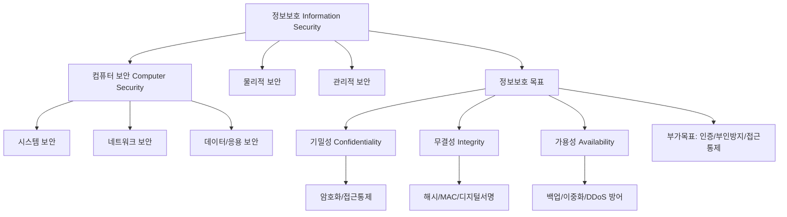
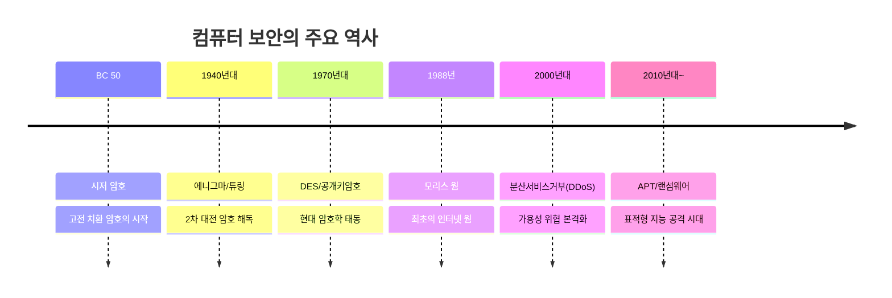

# 01. 컴퓨터보안: 컴퓨터 보안의 개요

## 🔗 선수 지식 (Prerequisites)
- [ ] **필수**: 컴퓨터 시스템과 네트워크의 기본 구조 - 이해 완료?
- [ ] **권장**: 정보화 사회의 일반적 특성, 기본적인 인터넷 활용 경험
- **관련 단원**: 본 강의는 컴퓨터보안 과목의 첫 번째 강의로, 이후 모든 강의의 기반이 됨

---

## 학습 개요
컴퓨터 보안은 정보를 여러 가지 위협으로부터 보호하는 것을 말하는 정보보호의 한 영역입니다. 특히 다양한 형태의 정보 중 컴퓨팅 환경이 관여된 모든 상황에 대한 정보보호가 바로 컴퓨터 보안입니다. 이를 위해 기밀성, 무결성, 가용성 등 정보보호의 다양한 목표를 이루어야 합니다.

이번 강의에서는 컴퓨터 보안과 정보보호를 정의하고 정보보호의 다양한 목표를 살펴본 후, 컴퓨터 보안의 역사에 대해 알아봅니다.

---

## 학습 목표
1. 컴퓨터 보안과 정보보호의 개념을 설명할 수 있다.
2. 정보보호의 목표를 나열하고 설명할 수 있다.
3. 정보화 사회의 역기능을 설명할 수 있다.
4. 컴퓨터 보안의 주요 역사에 대해 설명할 수 있다.

---

## 🧠 메타인지 체크 (학습 전/후 자기 평가)

### 학습 전 자기 평가
| 소주제 | 자신감 (1-5) |
| :--- | :--- |
| 컴퓨터 보안 / 정보보호의 개념 구분 | |
| 기밀성·무결성·가용성(CIA)의 정의 | |
| 정보화 사회의 역기능 | |
| 컴퓨터 보안의 주요 역사 (모리스 웜, 에니그마 등) | |

### 학습 후 교정 (학습 완료 후 작성)
| 소주제 | 학습 전 | 학습 후 | 실제 정답률 | 과신/과소 여부 |
| :--- | :--- | :--- | :--- | :--- |
| 컴퓨터 보안 / 정보보호의 개념 구분 | | | | |
| 기밀성·무결성·가용성(CIA)의 정의 | | | | |
| 정보화 사회의 역기능 | | | | |
| 컴퓨터 보안의 주요 역사 | | | | |

> **활용법**: 학습 전 1분 → 자신감 기입, 학습 후 1분 → 나머지 기입. "과신" 영역이 실제 취약점.

---

## 📝 요약 (Summary)
1.  🔴 **컴퓨터 보안**: 정보를 여러 가지 위협으로부터 보호하는 것을 말하는 정보보호의 한 영역으로, 컴퓨팅 환경이 관여된 모든 상황에 대한 정보보호를 의미한다.
2.  🔴 **정보보호**: 저장되어 있거나 전달 중인 정보를 허락되지 않은 접근, 수정, 훼손, 유출 등의 위협으로부터 보호하기 위한 정책 및 기법을 의미한다.
3.  🔴 **정보보호의 3대 핵심목표 (CIA Triad)**: 기밀성(Confidentiality), 무결성(Integrity), 가용성(Availability).
4.  🔴 **기밀성(Confidentiality)**: 허락되지 않은 자가 정보의 내용을 알 수 없도록 하는 것.
5.  🔴 **무결성(Integrity)**: 허락되지 않은 자가 정보를 임의로 수정할 수 없도록 하는 것.
6.  🔴 **가용성(Availability)**: 허락된 자가 정보에 접근하고자 할 때 이것이 방해받지 않도록 하는 것.
7.  🟡 **정보화 사회의 역기능**: 정보화 사회가 선진화됨에 따라 개인정보 침해, 사이버 범죄, 디지털 격차 등의 역기능도 점차 증가하고 있다.
8.  🟡 **컴퓨터 보안의 역사**: 고대 암호(시저 암호) → 2차 대전 암호(에니그마) → 1988년 모리스 웜 → 현대 사이버 보안으로 발전.

---

## 📐 핵심 정의 및 원리 (Key Definitions & Principles)

> **과목 유형**: 이론 중심 → 수식 테이블 대신 정의/원리 테이블 사용

| 정의명 | 내용 | 키워드 |
| :--- | :--- | :--- |
| **정보보호 (Information Security)** | 저장 또는 전송 중인 정보를 비인가 접근·수정·훼손·유출 위협으로부터 보호하기 위한 정책 및 기법 | 정책, 기법, 위협 대응 |
| **컴퓨터 보안 (Computer Security)** | 정보보호 중 **컴퓨팅 환경**(시스템, 네트워크, 데이터)이 관여된 영역의 보호 활동 | 컴퓨팅 환경, 부분집합 |
| **기밀성 (Confidentiality)** 🔴 | 인가되지 않은 자에게 정보가 노출되지 않도록 보장 (예: 암호화) | 비밀유지, 비노출, 암호화 |
| **무결성 (Integrity)** 🔴 | 인가되지 않은 자가 정보를 임의로 수정·삭제할 수 없도록 보장 (예: 해시, MAC) | 변조방지, 정확성, 해시 |
| **가용성 (Availability)** 🔴 | 인가된 자가 필요할 때 정보·서비스에 접근할 수 있도록 보장 (예: 백업, DDoS 방어) | 접근가능, 서비스 연속성 |
| **인증 (Authentication)** 🟡 | 사용자나 시스템의 신원을 확인하는 절차 | 신원확인, ID/PW |
| **부인방지 (Non-repudiation)** 🟡 | 정보의 송수신 사실을 사후 부인할 수 없도록 함 (예: 전자서명) | 책임추적, 전자서명 |
| **접근통제 (Access Control)** 🟡 | 인가된 주체만 객체에 접근할 수 있도록 통제 | 권한관리, 인가 |

### 주요 정리/원리

**CIA Triad — 정보보호의 3대 핵심목표**

> **직관적 해석**:
> - **C (Confidentiality)**: "**볼 수 없게**" — 도청·유출 방지
> - **I (Integrity)**: "**바꿀 수 없게**" — 위·변조 방지
> - **A (Availability)**: "**막을 수 없게**" — 서비스 중단 방지
>
> 세 목표는 **상호 보완적이지만 때로는 상충(trade-off)** 할 수 있다. 예: 가용성을 높이기 위해 데이터를 여러 곳에 복제하면 기밀성 노출 위험이 증가한다.

**컴퓨터 보안 ⊂ 정보보호**

> 정보보호는 종이 문서·구두 정보 등 **모든 형태의 정보**를 보호 대상으로 하지만, 컴퓨터 보안은 그중 **컴퓨팅 환경**에 한정된다. 즉 "**컴퓨터 보안 ⊂ 정보보호**" 관계이다.

---

## 📊 개념 시각화 (Visual Guide)

### 개념 관계도 (분류 체계도 — 이론 중심 필수)


### CIA 위협-대응 도식
| 보호 목표 | 위협 유형 | 대표 공격 | 대응 기술 |
| :--- | :--- | :--- | :--- |
| **기밀성 (C)** | 노출/도청 | 스니핑, 사회공학, 유출 | 암호화(AES, RSA), 접근통제 |
| **무결성 (I)** | 변조 | 데이터 조작, 중간자 공격(MITM) | 해시(SHA-256), MAC, 디지털서명 |
| **가용성 (A)** | 서비스 마비 | DoS/DDoS, 랜섬웨어 | 이중화, 백업, 트래픽 필터링 |

### 컴퓨터 보안의 역사 타임라인


---

## ✏️ 심화 학습 (Study Subject)

### 1. 가상 시나리오: "어떤 보호 목표를 우선해야 할까?"
- **상황**: 한 병원이 환자의 의료 기록을 디지털로 관리한다. 의료진은 응급 상황에서 즉시 기록을 조회할 수 있어야 하고, 외부 유출이나 위변조는 절대 발생해서는 안 된다.
- **문제**: 기밀성, 무결성, 가용성이 모두 중요하지만 자원과 비용은 유한하다. **세 목표가 충돌할 때** 어떻게 균형을 잡을 것인가?
- **해결**:
    1. **무결성 최우선**: 의료 기록이 잘못되면 환자 생명에 직결되므로 해시·전자서명 기반 변조 방지가 필수.
    2. **가용성 차순위**: 응급 시 접근 불가는 곧 진료 불가이므로 이중화·백업 체계 구축.
    3. **기밀성 보호**: 접근 권한 분리(의사/간호사/원무) + 저장/전송 시 암호화.
- **AI 학습 포인트**: "의료, 금융, 군사 등 도메인별로 CIA의 우선순위가 어떻게 달라지는지 예시와 함께 정리해 줘. 또한 AI 모델 자체의 보안(모델 추출 공격, 데이터 오염 공격)은 CIA 중 어디에 해당하는지 분석해 줘."

### 2. 관점별 비교 및 오개념 분석
- **핵심 비교**: '컴퓨터 보안 vs 정보보호', '기밀성 vs 무결성', '보안 vs 안전(Safety)'

| 구분 | 컴퓨터 보안 | 정보보호 |
| :--- | :--- | :--- |
| **범위** | 컴퓨팅 환경 한정 | 모든 형태의 정보 |
| **포함 관계** | 정보보호의 부분집합 | 컴퓨터 보안을 포함하는 상위 개념 |
| **예시** | 방화벽, 안티바이러스 | + 종이문서 파쇄, 출입통제, 보안교육 |

- **오개념 분석**:
    - **오개념 1**: "암호화만 잘 하면 보안은 끝난다."
    - **분석**: 암호화는 주로 **기밀성**과 일부 **무결성**을 제공할 뿐, **가용성**은 보장하지 않는다. 오히려 키 분실은 가용성 침해를 야기한다. CIA는 모두 별도로 설계해야 한다.
    - **오개념 2**: "보안(Security)과 안전(Safety)은 같은 개념이다."
    - **분석**: **보안**은 **악의적 위협**으로부터의 보호, **안전**은 **우발적 사고·오류**로부터의 보호이다. 보안 위협은 의도성이 핵심.
    - **오개념 3**: "기밀성 = 무결성"
    - **분석**: 기밀성은 "내용을 **알 수 없게**", 무결성은 "내용을 **바꿀 수 없게**". 암호화된 데이터도 비트가 뒤집히면 무결성은 깨진다.
- **AI 학습 포인트**: "기밀성을 유지하면서 무결성이 깨진 사례와, 무결성은 유지되지만 기밀성이 깨진 사례를 각각 들어 설명해 줘. CIA 중 두 개가 동시에 깨지는 공격 사례도 알려줘."

---

## ❓ 연습 문제 및 해설

> **블룸 인지 수준 범례**: [기억] 정의·나열 → [이해] 설명·비교 → [적용] 계산·구현 → [분석] 구별·디버그 → [평가] 판단·비평 → [창조] 설계·제안
>
> 📌: 본 강의는 1강이므로 원본 기출이 없어 AI 추가 생성 문항(📌)으로 구성.

### 📝 문제

**1. ⭐ [기억] 📌 정보보호의 3대 핵심목표(CIA Triad)에 해당하지 않는 것은?([#prob-1](#prob-1))**
   > ① 기밀성 (Confidentiality)
   > ② 무결성 (Integrity)
   > ③ 가용성 (Availability)
   > ④ 익명성 (Anonymity)

<br>

**2. ⭐ [기억] 📌 다음 중 컴퓨터 보안의 정의로 가장 적절한 것은?([#prob-2](#prob-2))**
   > ① 종이 문서를 포함한 모든 정보를 보호하는 활동
   > ② 컴퓨팅 환경이 관여된 모든 상황에 대한 정보보호 활동
   > ③ 컴퓨터 하드웨어를 외부 충격으로부터 보호하는 활동
   > ④ 인터넷 사용을 통제하는 행정적 활동

<br>

**3. ⭐ [이해] 📌 "허락되지 않은 자가 정보를 임의로 수정할 수 없도록 하는 것"에 해당하는 정보보호 목표는?([#prob-3](#prob-3))**
   > ① 기밀성
   > ② 무결성
   > ③ 가용성
   > ④ 부인방지

<br>

**4. ⭐⭐ [이해] 📌 다음 <보기>의 사례와 침해된 CIA 목표를 올바르게 짝지은 것은?([#prob-4](#prob-4))**
   > <보기>
   >
   > 가. 해커가 데이터베이스의 고객 주민번호를 평문으로 빼냈다.
   > 나. 공격자가 DDoS 공격으로 웹 서비스를 마비시켰다.
   > 다. 누군가 전자결재 문서의 금액 칸을 몰래 수정했다.

   > ① 가-기밀성, 나-가용성, 다-무결성
   > ② 가-무결성, 나-기밀성, 다-가용성
   > ③ 가-가용성, 나-무결성, 다-기밀성
   > ④ 가-기밀성, 나-무결성, 다-가용성

<br>

**5. ⭐⭐ [이해] 📌 정보보호와 컴퓨터 보안의 관계를 가장 정확히 표현한 것은?([#prob-5](#prob-5))**
   > ① 정보보호 = 컴퓨터 보안 (동일 개념)
   > ② 컴퓨터 보안 ⊂ 정보보호 (정보보호가 더 넓은 개념)
   > ③ 정보보호 ⊂ 컴퓨터 보안 (컴퓨터 보안이 더 넓은 개념)
   > ④ 정보보호와 컴퓨터 보안은 서로 무관한 별개의 분야

<br>

**6. ⭐⭐ [적용] 📌 다음 중 주로 **무결성**을 보장하기 위한 기술로 가장 거리가 먼 것은?([#prob-6](#prob-6))**
   > ① 해시 함수 (SHA-256)
   > ② 메시지 인증 코드 (MAC)
   > ③ 디지털 서명
   > ④ 데이터 백업 및 이중화

<br>

**7. ⭐⭐ [분석] 📌 정보화 사회의 역기능에 해당하지 않는 것은?([#prob-7](#prob-7))**
   > ① 개인정보의 무단 수집·유출
   > ② 사이버 범죄(해킹, 피싱)의 증가
   > ③ 디지털 격차 심화
   > ④ 정보 접근성의 보편적 향상

<br>

**8. ⭐⭐ [분석] 📌 다음 중 **가용성**을 침해하는 대표적 공격은?([#prob-8](#prob-8))**
   > ① 스니핑 (Sniffing)
   > ② DDoS (분산 서비스 거부 공격)
   > ③ 중간자 공격 (Man-in-the-Middle)
   > ④ 사회공학적 공격

<br>

**9. ⭐⭐⭐ [평가] 📌 1988년 발생한 **모리스 웜(Morris Worm) 사건**이 컴퓨터 보안 역사에서 갖는 의미로 가장 적절한 것은?([#prob-9](#prob-9))**
   > ① 최초의 컴퓨터 바이러스가 등장한 사건
   > ② 최초의 인터넷 웜 사건으로, 네트워크 보안의 중요성을 각인시키고 CERT 창설의 계기가 됨
   > ③ 최초의 랜섬웨어 공격 사건
   > ④ 공개키 암호 체계가 처음 제안된 사건

<br>

**10. ⭐⭐⭐ [창조] 📌 다음 시나리오에서 가장 우선적으로 강화해야 할 정보보호 목표와 그 근거를 서술하시오.([#prob-10](#prob-10))**
> **시나리오**: 온라인 증권 거래 시스템에서 사용자의 주문 데이터가 전송 도중 임의로 수정되어, 매수 주문이 매도 주문으로 바뀌는 사고가 발생했다.

---

### 🔑 정답 및 해설 (먼저 풀어본 후 펼치기)

<details>
<summary>정답 보기 (클릭)</summary>

1. ④
2. ②
3. ②
4. ①
5. ②
6. ④
7. ④
8. ②
9. ②
10. **무결성(Integrity)** 우선 강화 — 아래 해설 참조

</details>

<details>
<summary>해설 보기 (클릭)</summary>

<a id="prob-1"></a>
**1. ⭐ [기억] CIA Triad 구성요소**
> **정답: ④ 익명성**
> **해설**: 정보보호의 3대 핵심목표(CIA)는 **C**onfidentiality(기밀성), **I**ntegrity(무결성), **A**vailability(가용성)이다. 익명성은 부가적인 프라이버시 속성이며 CIA에는 포함되지 않는다.

<a id="prob-2"></a>
**2. ⭐ [기억] 컴퓨터 보안의 정의**
> **정답: ② 컴퓨팅 환경이 관여된 모든 상황에 대한 정보보호 활동**
> **해설**: ①은 정보보호(상위 개념)의 정의에 더 가깝다. ③은 물리적 보안 일부, ④는 행정적 통제이다. 컴퓨터 보안은 컴퓨팅 환경에 한정된 정보보호의 한 영역이다.

<a id="prob-3"></a>
**3. ⭐ [이해] 무결성의 정의**
> **정답: ② 무결성**
> **해설**: "임의로 **수정** 불가"는 무결성(Integrity)의 정의. ①기밀성은 "**알 수 없게**", ③가용성은 "**막을 수 없게**". ④부인방지는 사후 부인 불가능성.

<a id="prob-4"></a>
**4. ⭐⭐ [이해] CIA 침해 사례 매칭**
> **정답: ① 가-기밀성, 나-가용성, 다-무결성**
> **해설**:
> - 가(주민번호 유출) → 정보 노출 → **기밀성** 침해
> - 나(DDoS로 서비스 마비) → 접근 불가 → **가용성** 침해
> - 다(금액 칸 무단 수정) → 데이터 변조 → **무결성** 침해

<a id="prob-5"></a>
**5. ⭐⭐ [이해] 정보보호와 컴퓨터 보안의 관계**
> **정답: ② 컴퓨터 보안 ⊂ 정보보호**
> **해설**: 정보보호는 종이 문서·구두 정보 등 모든 형태의 정보를 다루는 상위 개념이고, 컴퓨터 보안은 그중 컴퓨팅 환경에 한정된 부분집합이다.

<a id="prob-6"></a>
**6. ⭐⭐ [적용] 무결성 보장 기술**
> **정답: ④ 데이터 백업 및 이중화**
> **해설**: 해시, MAC, 디지털 서명은 데이터 변조 탐지/방지 → **무결성**. 백업·이중화는 서비스 중단을 막아 **가용성**을 보장하는 기술이다.

<a id="prob-7"></a>
**7. ⭐⭐ [분석] 정보화 사회의 역기능**
> **정답: ④ 정보 접근성의 보편적 향상**
> **해설**: ④는 정보화의 **순기능**이다. 역기능은 개인정보 침해, 사이버 범죄, 디지털 격차, 정보 과잉, 사생활 침해 등이다.

<a id="prob-8"></a>
**8. ⭐⭐ [분석] 가용성 침해 공격**
> **정답: ② DDoS**
> **해설**: DDoS는 대량 트래픽으로 서비스를 마비시켜 정상 사용자의 접근을 차단 → **가용성** 침해. ①스니핑은 기밀성, ③MITM은 기밀성/무결성, ④사회공학은 주로 기밀성 침해.

<a id="prob-9"></a>
**9. ⭐⭐⭐ [평가] 모리스 웜의 역사적 의미**
> **정답: ② 최초의 인터넷 웜 사건으로, 네트워크 보안의 중요성을 각인시키고 CERT 창설의 계기가 됨**
> **해설**: 1988년 로버트 모리스가 작성한 웜은 인터넷에 연결된 약 6,000여 대의 시스템을 감염시킨 **최초의 대규모 인터넷 웜**으로, 이를 계기로 **CERT(Computer Emergency Response Team)** 가 설립되었다. ①최초의 컴퓨터 바이러스는 이전부터 존재(예: Brain, 1986), ③랜섬웨어는 후대, ④공개키 암호는 1976년 Diffie-Hellman에서 제안.

<a id="prob-10"></a>
**10. ⭐⭐⭐ [창조] 시나리오 분석**
> **정답: 무결성(Integrity)을 최우선으로 강화해야 한다.**
> **해설**:
> - **근거 1 (직접적 침해 유형)**: 주문 데이터의 "매수→매도" 변조는 전송 중 **데이터 수정**에 해당하므로 정확히 **무결성** 침해 사례이다.
> - **근거 2 (피해 영향)**: 금액적 손실이 즉시 발생하며 부인방지 문제로도 확장된다.
> - **대응 방안**:
>   1. 주문 메시지에 **HMAC** 또는 **디지털 서명** 적용 → 변조 탐지
>   2. **TLS** 등 무결성·기밀성을 동시 제공하는 보안 채널 사용
>   3. 전자서명을 통해 **부인방지**까지 확보
> - 기밀성·가용성도 중요하나 본 사고의 직접적 원인은 무결성 침해이므로 우선순위가 가장 높다.

</details>

---

## ✅ O/X 확인문제 (연습문항의 2배 = 20문항)

**1.** 컴퓨터 보안은 정보보호의 상위 개념이며 모든 형태의 정보를 포괄한다. ([#ox-1](#ox-1)) **(O / X)**
**2.** 정보보호의 3대 핵심목표는 기밀성, 무결성, 가용성이다. ([#ox-2](#ox-2)) **(O / X)**
**3.** 기밀성은 인가되지 않은 자가 정보의 내용을 알 수 없도록 하는 것이다. ([#ox-3](#ox-3)) **(O / X)**
**4.** 무결성은 인가된 사용자가 언제든지 정보에 접근할 수 있도록 보장하는 것이다. ([#ox-4](#ox-4)) **(O / X)**
**5.** 가용성은 시스템이 정상 사용자에게 서비스 제공을 지속할 수 있는 능력이다. ([#ox-5](#ox-5)) **(O / X)**
**6.** 데이터 암호화는 주로 가용성을 보장하기 위한 기술이다. ([#ox-6](#ox-6)) **(O / X)**
**7.** 해시 함수는 데이터 무결성 검증에 사용될 수 있다. ([#ox-7](#ox-7)) **(O / X)**
**8.** DDoS 공격은 가용성을 침해하는 대표적 공격 유형이다. ([#ox-8](#ox-8)) **(O / X)**
**9.** 스니핑(Sniffing)은 주로 무결성을 침해하는 공격이다. ([#ox-9](#ox-9)) **(O / X)**
**10.** 정보보호는 저장 중인 정보뿐 아니라 전송 중인 정보도 보호 대상으로 한다. ([#ox-10](#ox-10)) **(O / X)**
**11.** 1988년 모리스 웜은 최초의 인터넷 웜으로 평가받는다. ([#ox-11](#ox-11)) **(O / X)**
**12.** 시저(Caesar) 암호는 현대 공개키 암호 체계의 시초이다. ([#ox-12](#ox-12)) **(O / X)**
**13.** 정보화 사회가 발전할수록 개인정보 침해, 사이버 범죄 등 역기능도 함께 증가한다. ([#ox-13](#ox-13)) **(O / X)**
**14.** 보안(Security)과 안전(Safety)은 의도성 측면에서 구분된다. ([#ox-14](#ox-14)) **(O / X)**
**15.** 인증(Authentication)은 CIA Triad에 포함되는 핵심 목표이다. ([#ox-15](#ox-15)) **(O / X)**
**16.** 부인방지(Non-repudiation)는 전자서명을 통해 구현할 수 있다. ([#ox-16](#ox-16)) **(O / X)**
**17.** 기밀성·무결성·가용성은 때때로 서로 상충(trade-off)할 수 있다. ([#ox-17](#ox-17)) **(O / X)**
**18.** 백업과 이중화는 가용성 보장을 위한 대표적 기술이다. ([#ox-18](#ox-18)) **(O / X)**
**19.** 컴퓨터 보안은 컴퓨팅 환경이 관여된 정보보호 영역만을 의미하므로 종이 문서 파쇄와는 직접 관련이 없다. ([#ox-19](#ox-19)) **(O / X)**
**20.** 디지털 서명은 무결성과 부인방지를 동시에 제공한다. ([#ox-20](#ox-20)) **(O / X)**

<details>
<summary>O/X 정답 및 해설 보기 (클릭)</summary>

> <a id="ox-1"></a>
> **1. 정답**: X
> **해설**: 반대다. **정보보호**가 상위 개념이고, **컴퓨터 보안**은 그 부분집합이다.

> <a id="ox-2"></a>
> **2. 정답**: O
> **해설**: CIA Triad = Confidentiality + Integrity + Availability.

> <a id="ox-3"></a>
> **3. 정답**: O
> **해설**: 기밀성의 정확한 정의.

> <a id="ox-4"></a>
> **4. 정답**: X
> **해설**: 인가된 사용자의 접근 보장은 **가용성**의 정의. 무결성은 "임의 수정 불가".

> <a id="ox-5"></a>
> **5. 정답**: O
> **해설**: 가용성 = 인가된 자가 필요할 때 서비스에 접근 가능.

> <a id="ox-6"></a>
> **6. 정답**: X
> **해설**: 암호화는 주로 **기밀성**(과 일부 무결성)을 위한 기술. 가용성은 백업·이중화 등으로 보장.

> <a id="ox-7"></a>
> **7. 정답**: O
> **해설**: 해시값 비교로 데이터 변조 여부 검증 가능 → 무결성 검증 도구.

> <a id="ox-8"></a>
> **8. 정답**: O
> **해설**: DDoS는 서비스 마비를 유발 → 가용성 침해.

> <a id="ox-9"></a>
> **9. 정답**: X
> **해설**: 스니핑은 정보 도청 → 주로 **기밀성** 침해.

> <a id="ox-10"></a>
> **10. 정답**: O
> **해설**: 정보보호 정의에 "저장되어 있거나 전달 중인 정보" 모두 포함.

> <a id="ox-11"></a>
> **11. 정답**: O
> **해설**: 1988년 로버트 모리스의 웜 — 최초 인터넷 웜, CERT 창설 계기.

> <a id="ox-12"></a>
> **12. 정답**: X
> **해설**: 시저 암호는 **고전 대칭(치환) 암호**. 공개키 암호는 1976년 Diffie-Hellman으로부터 시작.

> <a id="ox-13"></a>
> **13. 정답**: O
> **해설**: 정보화의 선진화는 동시에 역기능(개인정보 침해, 사이버 범죄, 디지털 격차 등) 증가를 수반한다.

> <a id="ox-14"></a>
> **14. 정답**: O
> **해설**: 보안은 **악의적 위협**(의도성 O), 안전은 **우발적 사고/오류**(의도성 X)로부터 보호.

> <a id="ox-15"></a>
> **15. 정답**: X
> **해설**: 인증은 **부가적** 보안 목표이며 핵심 CIA Triad에는 포함되지 않는다.

> <a id="ox-16"></a>
> **16. 정답**: O
> **해설**: 전자서명은 송신자의 개인키로 서명 → 사후 부인 불가 + 무결성 확인.

> <a id="ox-17"></a>
> **17. 정답**: O
> **해설**: 예: 가용성을 위한 다중 복제는 기밀성 노출 위험을 키운다. CIA는 균형 설계가 필요하다.

> <a id="ox-18"></a>
> **18. 정답**: O
> **해설**: 백업·이중화·DDoS 방어가 가용성 핵심 기술.

> <a id="ox-19"></a>
> **19. 정답**: O
> **해설**: 종이 문서 파쇄는 컴퓨팅 환경 외부 → **정보보호**에는 포함되지만 컴퓨터 보안의 직접 범위는 아님.

> <a id="ox-20"></a>
> **20. 정답**: O
> **해설**: 디지털 서명은 (1)해시로 무결성 확인, (2)개인키 서명으로 부인방지 제공.

</details>

---

## 🧪 자유 회상 연습 (Free Recall)

> **방법**: 위의 노트를 모두 덮고, 타이머 3분 설정 후 이번 단원에서 배운 내용을 기억나는 대로 자유롭게 적으세요.
> 정확한 문장이 아니어도 됩니다. 키워드, 수식, 관계 등 떠오르는 것을 모두 적습니다.

**자유 회상 작성란:**

```
[여기에 기억나는 내용을 자유롭게 작성]

힌트 키워드: 정보보호 / 컴퓨터 보안 / CIA / 기밀성 / 무결성 / 가용성 /
            모리스 웜 / 정보화 역기능 / 부인방지 / DDoS / 암호화 / 해시
```

> **회상 후 점검**: 노트를 다시 펼쳐 빠뜨린 내용을 확인하세요. 빠뜨린 부분이 실제 취약점입니다.
> - 회상 못한 핵심 개념: [                ]
> - 회상 못한 역사 사건: [                ]

---

## 💻 코드로 확인하기 (Code Verification)

이론 중심 강의이지만, CIA의 각 목표를 **파이썬으로 시연**하여 직관적으로 확인한다.

```python
import hashlib
import secrets
from cryptography.hazmat.primitives.ciphers import Cipher, algorithms, modes
from cryptography.hazmat.backends import default_backend

# ====================================================
# 1. 기밀성(Confidentiality) — AES 대칭키 암호화 시연
# ====================================================
key = secrets.token_bytes(32)        # 256-bit 키
iv  = secrets.token_bytes(16)        # 초기화 벡터
plaintext = b"Top Secret Message!! "  # 16바이트 정렬

cipher = Cipher(algorithms.AES(key), modes.CBC(iv), backend=default_backend())
encryptor = cipher.encryptor()
ciphertext = encryptor.update(plaintext) + encryptor.finalize()
print(f"[기밀성] 암호문(hex): {ciphertext.hex()}")
print(f"        키 없이는 원문을 알 수 없음 → 기밀성 확보\n")

# ====================================================
# 2. 무결성(Integrity) — SHA-256 해시로 변조 탐지
# ====================================================
original = b"Transfer $100 to Alice"
tampered = b"Transfer $999 to Alice"

h1 = hashlib.sha256(original).hexdigest()
h2 = hashlib.sha256(tampered).hexdigest()
print(f"[무결성] 원문 해시 : {h1}")
print(f"        변조 해시 : {h2}")
print(f"        일치 여부 : {h1 == h2}  → 다르면 변조 탐지\n")

# ====================================================
# 3. 가용성(Availability) — 백업(이중화) 시연
# ====================================================
primary_db = {"user_123": "important data"}
backup_db  = dict(primary_db)              # 이중화

# 장애 시뮬레이션
primary_db.clear()
print(f"[가용성] 주 DB 장애 후 조회: {primary_db.get('user_123')}")
print(f"        백업 DB에서 복구  : {backup_db.get('user_123')}")
print(f"        → 백업·이중화로 서비스 연속성 확보")
```

> **실행 결과 예시**:
> ```
> [기밀성] 암호문(hex): 9b3c8e... (매 실행마다 IV에 따라 변동)
>         키 없이는 원문을 알 수 없음 → 기밀성 확보
>
> [무결성] 원문 해시 : f2ca1b...
>         변조 해시 : 7d8a4e...
>         일치 여부 : False  → 다르면 변조 탐지
>
> [가용성] 주 DB 장애 후 조회: None
>         백업 DB에서 복구  : important data
>         → 백업·이중화로 서비스 연속성 확보
> ```
> **해석**: CIA의 세 목표는 각각 **암호화/해시/이중화**라는 서로 다른 기술 군으로 달성되며, 어느 하나도 다른 것으로 대체할 수 없음을 보여준다.

---

## 🤖 AI 연결고리 (Concept → AI Application)

| 보안 개념 | AI/ML 적용 분야 | 구체적 사례 |
| :--- | :--- | :--- |
| **기밀성** | 연합학습(Federated Learning), 동형암호 | 의료 데이터를 외부 노출 없이 모델 학습 |
| **무결성** | 적대적 예제(Adversarial Examples) 방어, 데이터 오염(Poisoning) 탐지 | 학습 데이터셋 해시 검증으로 백도어 방지 |
| **가용성** | DDoS 방어 ML, 트래픽 이상 탐지 | LSTM 기반 네트워크 트래픽 이상 탐지 |
| **인증/부인방지** | 화자/얼굴 인식, 행위 기반 이상 탐지 | 딥페이크 탐지, 키스트로크 동역학 인증 |
| **컴퓨터 보안 전체** | AI 기반 SIEM, EDR | 로그 패턴 학습으로 알려지지 않은 공격 탐지 |

---

## 📖 심화 학습 예시 답안

#### 1. CIA Triad의 내부 동작 원리
CIA는 단순 나열이 아니라 **위협 모델 → 보호 목표 → 통제 수단**의 3단 매핑이다.

1.  **위협 모델 정의**: 누가, 무엇을, 어떻게 위협하는지 식별 (예: 외부 해커 → 고객 정보 → DB 침투).
2.  **CIA 매핑**: 각 위협을 C/I/A 중 어느 목표에 대한 침해인지 분류.
3.  **통제 수단 선택**: 해당 목표를 보호하는 기술(암호화/해시/이중화) 적용.
4.  **잔여 위험 평가**: 통제 후에도 남는 위험을 추가 통제로 보완 (심층 방어, Defense in Depth).

#### 2. 기밀성 vs 무결성 vs 가용성 비교표

| 구분 | 기밀성 (C) | 무결성 (I) | 가용성 (A) |
| :--- | :--- | :--- | :--- |
| **목적** | 정보 노출 방지 | 정보 변조 방지 | 서비스 중단 방지 |
| **핵심 질문** | "누가 볼 수 있는가?" | "누가 바꿀 수 있는가?" | "필요할 때 쓸 수 있는가?" |
| **대표 위협** | 도청, 유출, 사회공학 | 변조, MITM, 백도어 | DoS/DDoS, 랜섬웨어 |
| **대표 통제** | 암호화, 접근통제 | 해시, MAC, 전자서명 | 백업, 이중화, 부하분산 |
| **AI 활용** | 동형암호 추론, 연합학습 | 적대적 예제 방어, 모델 워터마크 | 이상 트래픽 ML 탐지 |
| **메트릭 예시** | 유출 건수 | 무결성 위반 탐지율 | 가용시간(Uptime %) |

#### 3. 보안 정책 설계 시 Best Practice

- **Bad Practice (나쁜 예시)**
  ```python
  # 비밀번호를 평문 저장 + 백업도 평문
  user_db = {"alice": "1234"}
  backup  = user_db.copy()  # 평문 그대로 백업 → 기밀성 무방비
  ```
- **Good Practice (좋은 예시)**
  ```python
  import hashlib, secrets
  # CIA 동시 고려: 해시(I) + 솔트(C) + 이중화(A)
  salt = secrets.token_hex(16)
  pw_hash = hashlib.pbkdf2_hmac("sha256", b"1234", salt.encode(), 200_000).hex()
  user_db = {"alice": {"salt": salt, "hash": pw_hash}}
  backup  = {"alice": {"salt": salt, "hash": pw_hash}}  # 해시된 형태로만 백업
  ```
- **설명**: 평문 저장은 기밀성·무결성을 동시에 잃는다. **솔트 + 강한 KDF(PBKDF2/Argon2) + 백업**으로 CIA 세 목표를 모두 확보한다.

---

## 📚 핵심 용어집 (Glossary)

| 용어 (한) | 용어 (영) | 표현/약어 | 정의 |
| :--- | :--- | :--- | :--- |
| **정보보호** | Information Security | InfoSec | 모든 형태의 정보를 비인가 위협으로부터 보호하기 위한 정책 및 기법 |
| **컴퓨터 보안** | Computer Security | — | 정보보호 중 컴퓨팅 환경이 관여된 영역의 보호 활동 (정보보호 ⊃ 컴퓨터 보안) |
| **기밀성** | Confidentiality | C | 인가되지 않은 자에게 정보를 노출시키지 않는 성질 |
| **무결성** | Integrity | I | 인가되지 않은 자가 정보를 변경하지 못하게 하는 성질 |
| **가용성** | Availability | A | 인가된 자가 필요할 때 정보에 접근 가능하게 하는 성질 |
| **CIA Triad** | CIA Triad | C-I-A | 정보보호의 3대 핵심 목표 (기밀성·무결성·가용성) |
| **인증** | Authentication | AuthN | 사용자/시스템의 신원을 확인하는 절차 |
| **인가** | Authorization | AuthZ | 인증된 주체에게 권한을 부여·통제하는 절차 |
| **부인방지** | Non-repudiation | — | 정보 송수신 사실을 사후 부인할 수 없도록 함 (전자서명) |
| **모리스 웜** | Morris Worm | (1988) | 최초의 대규모 인터넷 웜, CERT 창설 계기 |
| **CERT** | Computer Emergency Response Team | CERT/CC | 컴퓨터 침해사고 대응 조직 |
| **DDoS** | Distributed Denial of Service | DDoS | 분산 서비스 거부 공격, 대표적 가용성 침해 |
| **에니그마** | Enigma | — | 2차 대전 독일군 암호 장비, 튜링이 해독 |

---

## 🤖 AI 학습 파트너를 위한 추가 자료

### 1. 개념 이해를 위한 심층 질문 프롬프트
> **프롬프트 예시**: "정보보호의 CIA Triad를 초등학생도 이해할 수 있도록 '비밀일기장'에 비유해 설명해 줘. 그리고 CIA 개념이 정립되기 이전(1970년대 이전)에 컴퓨터 보안은 어떻게 다뤄졌는지 역사적 배경도 함께 알려줘."

### 2. 문제 해결 능력 강화를 위한 시나리오 프롬프트
> **프롬프트 예시**: "당신은 중견 기업의 CISO(최고정보보호책임자)입니다. 다음 세 가지 상황 중 한 분기에 예산을 우선 배정해야 한다면 어느 곳에 배정하겠습니까? (1) 고객 DB 암호화 강화 (2) 백업 인프라 이중화 (3) 직원 보안 교육. CIA 관점에서 각 옵션의 장단점을 비교하고, 비즈니스 영향(BIA) 관점에서 우선순위를 정해 줘."

### 3. 개념 검증 프롬프트
> **프롬프트 예시**: "다음 문장을 검증해 줘:
> > '암호화는 기밀성을 보장하므로, 데이터를 암호화하면 무결성도 자동으로 보장된다.'
> 1. 이 주장이 옳은지 그른지 판단하고 근거를 들어 설명해 줘.
> 2. 반례가 있다면 구체적 공격 시나리오와 함께 제시해 줘.
> 3. 기밀성과 무결성을 동시에 제공하려면 어떤 추가 기법(예: AEAD, MAC-then-Encrypt)이 필요한지 알려줘."

---

## 🔄 복습 체크 (Spaced Repetition)

> 기준일: **2026-05-29**

- [ ] 1일 후 복습 (날짜: 2026-05-30)
- [ ] 3일 후 복습 (날짜: 2026-06-01)
- [ ] 7일 후 복습 (날짜: 2026-06-05)
- [ ] 14일 후 복습 (날짜: 2026-06-12)
- [ ] 30일 후 복습 (날짜: 2026-06-28)

### 복습 시 자가 평가
| 회차 | 날짜 | 이해도 (1-5) | 취약 부분 메모 |
| :--- | :--- | :--- | :--- |
| 1차 | | | |
| 2차 | | | |
| 3차 | | | |

---

## 📚 참고 자료 (References)

- 교재: 한국방송통신대학교, 『컴퓨터보안』 1강 — 컴퓨터 보안의 개요
- NIST SP 800-12 Rev. 1, *An Introduction to Information Security*
- ISO/IEC 27000:2018, *Information security management systems — Overview and vocabulary*
- W. Stallings, *Computer Security: Principles and Practice*, Pearson — Chapter 1
- CERT/CC History — https://www.sei.cmu.edu/about/divisions/cert/ (모리스 웜 사건 관련 배경)
