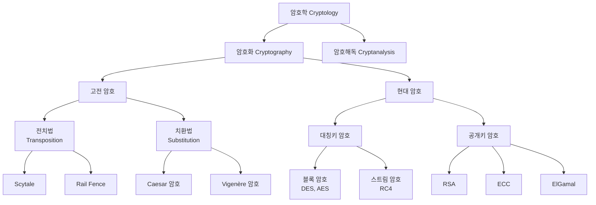

# 2강. 컴퓨터보안: 암호의 개념

## 🔗 선수 지식 (Prerequisites)
- [ ] **필수**: 1강 정보보안의 기초 개념 (기밀성·무결성·가용성) - 이해 완료?
- [ ] **권장**: 이진수/모듈러 연산, 문자 코드(ASCII) 기초
- **관련 단원**: [1강. 정보보안 개요](./1강.md), 3강 이후 대칭키/공개키 알고리즘 심화

---

## 학습 목표
1. 암호의 정의를 설명할 수 있다.
2. 암호의 역사를 설명할 수 있다.
3. 대칭키 암호에 대해 설명할 수 있다.
4. 공개키 암호에 대해 설명할 수 있다.

---

## 🧠 메타인지 체크 (학습 전/후 자기 평가)

### 학습 전 자기 평가
| 소주제 | 자신감 (1-5) |
| :--- | :--- |
| 평문/암호문/키의 정의 및 관계 | |
| 전치법 vs 치환법 차이 | |
| 대칭키 vs 공개키 암호 비교 | |

### 학습 후 교정 (학습 완료 후 작성)
| 소주제 | 학습 전 | 학습 후 | 실제 정답률 | 과신/과소 여부 |
| :--- | :--- | :--- | :--- | :--- |
| 평문/암호문/키의 정의 및 관계 | | | | |
| 전치법 vs 치환법 차이 | | | | |
| 대칭키 vs 공개키 암호 비교 | | | | |

> **활용법**: 학습 전 1분 → 자신감 기입, 학습 후 1분 → 나머지 기입. "과신" 영역이 실제 취약점.

---

## 📝 요약 (Summary)
1. 🔴 **암호(Cryptography)**: 안전하지 않은 채널을 통해 정보를 주고받더라도 제3자는 이 정보의 내용을 알 수 없도록 하는 것이다.
2. 🔴 **암호화/복호화 흐름**: 송신자는 평문을 암호화하여 암호문을 만들어 보내고 수신자는 암호문을 복호화하여 평문을 만든다.
3. 🔴 **키(Key)**: 키는 암호화와 복호화를 위한 가장 중요한 열쇠로 제3자에게 알려져서는 안 된다.
4. 🟡 **전치법(Transposition)**: 평문에 있는 문자들의 순서를 바꿈으로써 암호화하는 기법이다.
5. 🟡 **치환법(Substitution)**: 평문의 문자들을 다른 문자로 치환함으로써 암호화하는 기법이다.
6. 🔴 **대칭키 암호**: 암호화와 복호화에 같은 키 하나를 사용하는 암호방식이다. `→←3강`
7. 🔴 **공개키 암호**: 암호화와 복호화에 두 개의 서로 다른 키를 사용하는 암호방식이다. `→←4강`

---

## 📐 핵심 정의 및 원리 (Key Definitions)

| 정의명 | 내용 | 키워드 |
| :--- | :--- | :--- |
| **암호학(Cryptology)** | 암호를 만들고 분석하는 학문. 암호화(Cryptography)와 암호해독(Cryptanalysis)으로 구분 | 비밀성, 학문 |
| **평문(Plaintext, $P$)** | 원래의 메시지. 누구나 읽을 수 있는 형태 | 원본, $M$ |
| **암호문(Ciphertext, $C$)** | 평문을 암호화한 결과. 제3자가 의미를 알 수 없는 형태 | 변환 결과 |
| **암호화(Encryption, $E_K$)** | 키 $K$를 이용해 평문을 암호문으로 변환: $C = E_K(P)$ | 송신자 작업 |
| **복호화(Decryption, $D_K$)** | 키 $K$를 이용해 암호문을 평문으로 복원: $P = D_K(C)$ | 수신자 작업 |
| **키(Key, $K$)** | 암·복호화의 핵심 비밀값. 키 공간(Key Space)이 클수록 안전 | 비밀, 핵심 |
| **전치법** | 평문 문자의 **순서**를 재배열 (예: Scytale, Rail Fence) | 순서 변경 |
| **치환법** | 평문 문자를 **다른 문자**로 대체 (예: Caesar, Vigenère) | 문자 교체 |
| **대칭키 암호** | $E$와 $D$에 같은 키 사용: $P = D_K(E_K(P))$ (예: DES, AES) | 단일키, 빠름 |
| **공개키 암호** | 공개키 $K_{pub}$로 암호화, 개인키 $K_{priv}$로 복호화: $P = D_{K_{priv}}(E_{K_{pub}}(P))$ (예: RSA, ECC) | 키쌍, 비대칭 |

### 주요 정리/원리

**Kerckhoffs의 원리 (1883)**
$$
\text{암호 시스템의 안전성은 알고리즘의 비밀이 아닌, 오직 \textbf{키}의 비밀에만 의존해야 한다.}
$$
> **직관적 해석**: 알고리즘은 공개되어도 안전해야 한다. "보안을 통한 모호성(Security by Obscurity)"에 의존하면 안 된다.
> **AI 적용**: 머신러닝 모델 보호에서도 동일 — 모델 구조가 알려져도 학습된 가중치(key 격)가 보호되면 안전. 다만 모델 추출 공격(model extraction)에 대한 별도 방어 필요.

**암·복호화 완전성 조건**
$$
\forall P,\ K:\quad D_K(E_K(P)) = P
$$
> **직관적 해석**: 같은 키로 암호화한 것을 복호화하면 반드시 원래 평문이 나와야 한다.

---

## 📊 개념 시각화 (Visual Guide)

### 암호 분류 체계도


### 암·복호화 데이터 흐름
| 단계 | 송신자 측 | 채널 | 수신자 측 |
| :--- | :--- | :--- | :--- |
| 입력 | 평문 $P$ | — | — |
| 처리 | $C = E_K(P)$ | 암호문 $C$ 전송 | $P = D_K(C)$ |
| 출력 | — | (도청자는 $C$만 봄) | 평문 $P$ 복원 |
| AI 적용 | 모델 입력 보호 | 안전한 모델 호출 | 보호된 추론 결과 수신 |

---

## ✏️ 심화 학습 (Study Subject)

### 1. 가상 시나리오: "어떤 암호 방식을 언제 사용해야 할까?"
- **상황**: A 기업이 1만 명 고객의 결제 정보를 클라우드에 저장하면서 동시에 매일 외부 파트너 50곳과 일회성 키 교환 후 안전한 채널로 데이터를 주고받아야 한다.
- **문제**: 대용량 데이터 저장·전송에는 속도가 중요하고, 키 교환에는 키를 만난 적 없는 상대와 안전하게 공유해야 한다. 어떤 암호 방식을 어떻게 조합해야 할까?
- **해결**:
  1. **키 교환**: 공개키 암호(RSA/ECDH)로 임시 세션 키 $K_s$를 안전하게 전달한다 — 사전 공유 없이 가능.
  2. **본 데이터 암호화**: 교환된 $K_s$를 대칭키(AES)로 사용해 대용량 데이터를 빠르게 암호화한다.
  3. 이를 **하이브리드 암호 시스템**이라 하며, TLS/SSL이 정확히 이 구조다.
- **AI 학습 포인트**: "AES와 RSA의 처리 속도 차이가 얼마나 나는지, 그리고 왜 공개키 암호를 본 데이터 암호화에 직접 쓰지 않는지 수학적 근거(연산 복잡도)로 설명해 줘."

### 2. 관점별 비교 및 오개념 분석
- **핵심 비교**: 대칭키 암호 vs 공개키 암호, 전치법 vs 치환법
- **오개념 분석**:
    - **오개념 1**: "공개키 암호가 대칭키 암호보다 무조건 더 안전하다."
    - **분석**: 안전성은 키 길이와 알고리즘 설계에 따른 것이지 방식의 우열이 아니다. 128비트 AES는 3072비트 RSA와 비슷한 안전성을 가진다. 공개키는 키 교환·전자서명 같은 **새로운 기능**을 제공할 뿐이다.
    - **오개념 2**: "전치법은 문자를 바꾸지 않으므로 빈도 분석에 강하다."
    - **분석**: 문자 자체는 그대로이므로 **개별 문자 빈도는 보존**된다. 빈도 분석에 노출되며, 단지 *문자열의 위치 정보*만 가려질 뿐이다.
    - **오개념 3**: "알고리즘을 비밀로 하면 더 안전하다."
    - **분석**: Kerckhoffs의 원리에 위배. 알고리즘 노출 시 시스템 전체가 무너지는 설계는 취약하다.
- **AI 학습 포인트**: "Caesar 암호에 대해 영어 알파벳 빈도 분포를 이용한 자동 해독 절차를 단계별로 설명하고, Python으로 구현 아이디어를 제시해 줘."

---

## ❓ 연습 문제 및 해설

> **블룸 인지 수준 범례**: [기억] 정의·나열 → [이해] 설명·비교 → [적용] 계산·구현 → [분석] 구별·디버그 → [평가] 판단·비평 → [창조] 설계·제안

### 📝 문제

**1. 📌 ⭐ [기억] 암호에 대한 기본 정의로 옳은 것은?(#prob-1)**
   > ① 송신자만 메시지를 만들 수 있도록 하는 기술
   > ② 안전하지 않은 채널에서 제3자가 정보의 내용을 알 수 없도록 하는 기술
   > ③ 메시지 전송 속도를 높이는 기술
   > ④ 데이터를 압축하는 기술

<br>

**2. 📌 ⭐ [기억] 송신자가 평문을 암호문으로 만드는 과정을 무엇이라 하는가?(#prob-2)**
   > ① 복호화(Decryption)
   > ② 암호화(Encryption)
   > ③ 인증(Authentication)
   > ④ 해시(Hash)

<br>

**3. 📌 ⭐ [이해] 다음 중 키(Key)에 대한 설명으로 옳지 않은 것은?(#prob-3)**
   > ① 암호화와 복호화에 사용되는 핵심 비밀값이다.
   > ② 제3자에게 알려져서는 안 된다.
   > ③ 키 공간이 클수록 일반적으로 더 안전하다.
   > ④ 알고리즘이 공개되면 키도 함께 공개되어야 한다.

<br>

**4. 📌 ⭐⭐ [이해] 전치법(Transposition)과 치환법(Substitution)에 대한 설명으로 옳은 것은?(#prob-4)**
   > <보기>
   >
   > 가. 전치법은 평문 문자의 순서를 재배열한다.
   > 나. 치환법은 평문 문자를 다른 문자로 대체한다.
   > 다. 전치법은 문자 빈도 정보가 사라진다.

   > ① 가
   > ② 가, 나
   > ③ 나, 다
   > ④ 가, 나, 다

<br>

**5. 📌 ⭐⭐ [적용] 평문 "HELLO"를 Caesar 암호(시프트 키 $K=3$)로 암호화한 결과는?(#prob-5)**
   > ① IFMMP
   > ② KHOOR
   > ③ JGNNQ
   > ④ EBIIL

<br>

**6. 📌 ⭐⭐ [분석] 대칭키 암호와 공개키 암호의 차이로 옳지 않은 것은?(#prob-6)**
   > ① 대칭키 암호는 암호화·복호화에 같은 키를 사용한다.
   > ② 공개키 암호는 두 개의 서로 다른 키를 사용한다.
   > ③ 일반적으로 공개키 암호가 대칭키 암호보다 처리 속도가 빠르다.
   > ④ 공개키 암호는 사전 키 공유 없이도 안전한 통신을 시작할 수 있다.

<br>

**7. 📌 ⭐⭐ [이해] 다음 중 대칭키 암호 알고리즘에 해당하는 것을 모두 고르시오.(#prob-7)**
   > <보기>
   >
   > 가. AES
   > 나. RSA
   > 다. DES
   > 라. ECC

   > ① 가, 나
   > ② 가, 다
   > ③ 나, 라
   > ④ 가, 다, 라

<br>

**8. 📌 ⭐⭐⭐ [평가] Kerckhoffs의 원리에 대한 설명으로 가장 적절한 것은?(#prob-8)**
   > ① 암호 알고리즘은 반드시 비밀로 유지되어야 한다.
   > ② 키만 비밀로 유지되면 알고리즘이 공개되어도 안전해야 한다.
   > ③ 키와 알고리즘 모두 절대 공개되어서는 안 된다.
   > ④ 암호 시스템은 사용자가 많을수록 안전하다.

<br>

**9. 📌 ⭐⭐⭐ [분석] 100명이 서로 1:1로 비밀 통신을 하려고 한다. 대칭키 암호와 공개키 암호를 사용할 때 각각 필요한 키의 개수는?(#prob-9)**
   > ① 대칭키 100개 / 공개키 200개
   > ② 대칭키 4950개 / 공개키 200개
   > ③ 대칭키 200개 / 공개키 4950개
   > ④ 대칭키 4950개 / 공개키 100개

<br>

**10. 📌 ⭐⭐⭐ [창조] TLS(HTTPS)와 같은 하이브리드 암호 시스템의 동작 원리를 단계별로 서술하고, 왜 공개키 암호만으로 모든 데이터를 암호화하지 않는지 그 이유를 설명하시오.(#prob-10)**

---

### 🔑 정답 및 해설 (먼저 풀어본 후 펼치기)

<details>
<summary>정답 보기 (클릭)</summary>

1. ②
2. ②
3. ④
4. ②
5. ②
6. ③
7. ②
8. ②
9. ②
10. (서술형 — 해설 참조)

</details>

<details>
<summary>해설 보기 (클릭)</summary>

<a id="prob-1"></a>
**1. ⭐ [기억] 암호의 기본 정의**
> **정답: ② 안전하지 않은 채널에서 제3자가 정보의 내용을 알 수 없도록 하는 기술**
> **해설**: 학습정리에 명시된 정의 그대로. ①은 가용성, ③·④는 암호의 목적이 아니다.

<a id="prob-2"></a>
**2. ⭐ [기억] 암호화 정의**
> **정답: ② 암호화(Encryption)**
> **해설**: 평문→암호문 = 암호화, 암호문→평문 = 복호화. 인증과 해시는 다른 보안 메커니즘.

<a id="prob-3"></a>
**3. ⭐ [이해] 키의 성질**
> **정답: ④ 알고리즘이 공개되면 키도 함께 공개되어야 한다.**
> **해설**: Kerckhoffs의 원리에 따라 알고리즘은 공개되어도 **키는 반드시 비밀**이어야 한다. ④는 정반대 진술.

<a id="prob-4"></a>
**4. ⭐⭐ [이해] 전치법 vs 치환법**
> **정답: ② 가, 나**
> **해설**: 다는 틀림. 전치법은 문자의 *순서*만 바꾸므로 **개별 문자 빈도는 그대로 보존**된다. 따라서 빈도 분석 공격에 노출된다.

<a id="prob-5"></a>
**5. ⭐⭐ [적용] Caesar 암호 계산**
> **정답: ② KHOOR**
> **해설**: 각 문자를 알파벳 순으로 +3 시프트.
> - H(7) + 3 = K(10)
> - E(4) + 3 = H(7)
> - L(11) + 3 = O(14)
> - L(11) + 3 = O(14)
> - O(14) + 3 = R(17)
> → **KHOOR**

<a id="prob-6"></a>
**6. ⭐⭐ [분석] 대칭키 vs 공개키 차이**
> **정답: ③ 일반적으로 공개키 암호가 대칭키 암호보다 처리 속도가 빠르다.**
> **해설**: 정반대다. 공개키 암호는 큰 수의 모듈러 지수 연산을 수반해 대칭키 암호보다 **수백~수천 배 느리다**. 그래서 실제로는 키 교환·서명에만 쓰고 본 데이터는 대칭키로 암호화한다.

<a id="prob-7"></a>
**7. ⭐⭐ [이해] 대칭키 알고리즘 분류**
> **정답: ② 가, 다**
> **해설**: AES(Advanced Encryption Standard)와 DES(Data Encryption Standard)는 대표적 대칭키 블록 암호. RSA와 ECC(Elliptic Curve Cryptography)는 공개키 암호이다.

<a id="prob-8"></a>
**8. ⭐⭐⭐ [평가] Kerckhoffs의 원리**
> **정답: ② 키만 비밀로 유지되면 알고리즘이 공개되어도 안전해야 한다.**
> **해설**: 알고리즘 비밀에 의존하는 보안(Security by Obscurity)은 위험하다. 알고리즘은 공개·검증되어야 하며, 안전성은 **키의 비밀**에 전적으로 의존해야 한다.

<a id="prob-9"></a>
**9. ⭐⭐⭐ [분석] 키 개수 계산**
> **정답: ② 대칭키 4950개 / 공개키 200개**
> **해설**:
> - **대칭키**: 두 사람마다 공유 키 1개 필요 → $\binom{100}{2} = \frac{100 \times 99}{2} = 4950$개
> - **공개키**: 각 사람이 공개키·개인키 1쌍씩만 가지면 됨 → $100 \times 2 = 200$개
> - **시사점**: 사용자가 많아질수록 공개키 방식의 키 관리 효율성이 압도적으로 우수하다. ($O(n^2)$ vs $O(n)$)

<a id="prob-10"></a>
**10. ⭐⭐⭐ [창조] 하이브리드 암호 시스템**
> **정답(예시)**:
> **(1) 동작 단계**
> ① 클라이언트가 서버에 접속 → 서버의 공개키 인증서 수신
> ② 클라이언트가 임시 세션키 $K_s$(대칭키)를 생성
> ③ $K_s$를 서버 공개키로 암호화하여 전송: $C_1 = E_{K_{pub}}(K_s)$
> ④ 서버는 개인키로 복호화: $K_s = D_{K_{priv}}(C_1)$
> ⑤ 이후 양측은 $K_s$로 AES 등 대칭키 암호를 사용해 데이터 송수신: $C = E_{K_s}(M)$
>
> **(2) 공개키만으로 처리하지 않는 이유**
> - **속도**: RSA-2048은 AES-128 대비 약 1000배 이상 느리다. 동영상·파일 전송에는 부적합.
> - **메시지 크기 제약**: RSA는 키 크기보다 큰 평문을 직접 암호화할 수 없다(패딩 후 분할 필요).
> - **에너지 효율**: 모바일/IoT 기기에서 공개키 연산은 배터리 소모가 크다.
> - **결론**: 공개키의 *키 교환 능력* + 대칭키의 *연산 효율성*을 결합한 것이 하이브리드 시스템이며, TLS·SSH·PGP 등 거의 모든 현대 보안 프로토콜이 이 구조를 따른다.

</details>

---

## ✅ O/X 확인문제 (20문항)

**1.** 암호화는 평문을 암호문으로 바꾸는 과정이다.(#ox-1) **(O / X)**
**2.** 복호화는 송신자가 수행하는 작업이다.(#ox-2) **(O / X)**
**3.** Kerckhoffs의 원리에 따르면 알고리즘은 공개되어도 무방하다.(#ox-3) **(O / X)**
**4.** 전치법은 문자의 순서를 바꾸므로 문자 빈도 분포가 변한다.(#ox-4) **(O / X)**
**5.** Caesar 암호는 치환법의 일종이다.(#ox-5) **(O / X)**
**6.** 대칭키 암호는 암호화와 복호화에 다른 키를 사용한다.(#ox-6) **(O / X)**
**7.** 공개키 암호는 두 개의 서로 다른 키를 사용한다.(#ox-7) **(O / X)**
**8.** AES는 공개키 암호 알고리즘이다.(#ox-8) **(O / X)**
**9.** RSA는 공개키 암호 알고리즘이다.(#ox-9) **(O / X)**
**10.** 일반적으로 공개키 암호가 대칭키 암호보다 처리 속도가 빠르다.(#ox-10) **(O / X)**
**11.** 키 공간이 클수록 무작위 대입(brute-force) 공격에 강하다.(#ox-11) **(O / X)**
**12.** 송신자와 수신자는 통신 전에 반드시 직접 만나서 키를 교환해야만 한다.(#ox-12) **(O / X)**
**13.** Scytale은 고대 그리스에서 사용된 전치법의 예이다.(#ox-13) **(O / X)**
**14.** 공개키로 암호화한 메시지는 같은 공개키로 복호화할 수 있다.(#ox-14) **(O / X)**
**15.** 하이브리드 암호 시스템은 공개키와 대칭키 암호를 결합한 방식이다.(#ox-15) **(O / X)**
**16.** 알고리즘을 비밀로 유지하는 것이 키를 보호하는 것보다 더 안전하다.(#ox-16) **(O / X)**
**17.** DES는 대칭키 블록 암호이다.(#ox-17) **(O / X)**
**18.** 100명이 1:1 대칭키 통신을 하려면 100개의 키가 필요하다.(#ox-18) **(O / X)**
**19.** 암호해독(Cryptanalysis)은 키 없이 암호문에서 평문을 알아내려는 분야이다.(#ox-19) **(O / X)**
**20.** 빈도 분석은 단순 치환 암호에 효과적인 공격 기법이다.(#ox-20) **(O / X)**

<details>
<summary>O/X 정답 및 해설 보기 (클릭)</summary>

> <a id="ox-1"></a>
> **1. 정답**: O — 정의 그대로.

> <a id="ox-2"></a>
> **2. 정답**: X — 복호화는 **수신자**가 수행한다. 송신자는 암호화를 수행.

> <a id="ox-3"></a>
> **3. 정답**: O — Kerckhoffs의 원리: 안전성은 키에만 의존.

> <a id="ox-4"></a>
> **4. 정답**: X — 순서만 바꾸므로 개별 문자 **빈도 분포는 보존**된다.

> <a id="ox-5"></a>
> **5. 정답**: O — 각 문자를 다른 문자로 대체하는 단순 치환 암호.

> <a id="ox-6"></a>
> **6. 정답**: X — **같은 키 하나**를 사용한다.

> <a id="ox-7"></a>
> **7. 정답**: O — 공개키와 개인키 쌍을 사용.

> <a id="ox-8"></a>
> **8. 정답**: X — AES는 **대칭키** 블록 암호.

> <a id="ox-9"></a>
> **9. 정답**: O — Rivest-Shamir-Adleman의 대표 공개키 알고리즘.

> <a id="ox-10"></a>
> **10. 정답**: X — **대칭키 암호가 훨씬 빠르다** (수백~수천 배).

> <a id="ox-11"></a>
> **11. 정답**: O — $2^n$ 키 공간에서 $n$이 커질수록 탐색 비용 폭증.

> <a id="ox-12"></a>
> **12. 정답**: X — 공개키 암호를 이용하면 사전 만남 없이 키 교환 가능.

> <a id="ox-13"></a>
> **13. 정답**: O — 막대에 가죽을 감아 글자 순서를 재배열한 전치 암호.

> <a id="ox-14"></a>
> **14. 정답**: X — 공개키로 암호화한 것은 짝이 되는 **개인키로만** 복호화 가능.

> <a id="ox-15"></a>
> **15. 정답**: O — TLS, PGP 등 거의 모든 현대 프로토콜이 채택.

> <a id="ox-16"></a>
> **16. 정답**: X — "보안을 통한 모호성"은 안티패턴. Kerckhoffs 원리에 위배.

> <a id="ox-17"></a>
> **17. 정답**: O — 64비트 블록, 56비트 키의 고전적 대칭키 블록 암호.

> <a id="ox-18"></a>
> **18. 정답**: X — $\binom{100}{2} = 4950$개 필요.

> <a id="ox-19"></a>
> **19. 정답**: O — Cryptanalysis는 키 없이 평문을 복원하려는 공격 분야.

> <a id="ox-20"></a>
> **20. 정답**: O — 자연어 문자 빈도 분포를 이용해 Caesar·단순 치환 암호를 해독 가능.

</details>

---

## 🧪 자유 회상 연습 (Free Recall)

> **방법**: 위의 노트를 모두 덮고, 타이머 3분 설정 후 이번 단원에서 배운 내용을 기억나는 대로 자유롭게 적으세요.
> 정확한 문장이 아니어도 됩니다. 키워드, 수식, 관계 등 떠오르는 것을 모두 적습니다.

**자유 회상 작성란:**

```
[여기에 기억나는 내용을 자유롭게 작성]


```

> **회상 후 점검**: 노트를 다시 펼쳐 빠뜨린 내용을 확인하세요. 빠뜨린 부분이 실제 취약점입니다.
> - 회상 못한 핵심 개념: [                ]
> - 회상 못한 수식: [                ]

---

## 💻 코드로 확인하기 (Code Verification)

```python
# 1) Caesar 암호 (치환법) 구현
def caesar_encrypt(plaintext: str, key: int) -> str:
    result = []
    for ch in plaintext.upper():
        if ch.isalpha():
            shifted = (ord(ch) - ord('A') + key) % 26
            result.append(chr(shifted + ord('A')))
        else:
            result.append(ch)
    return ''.join(result)

def caesar_decrypt(ciphertext: str, key: int) -> str:
    return caesar_encrypt(ciphertext, -key)

P = "HELLO"
K = 3
C = caesar_encrypt(P, K)
print(f"[치환법] 평문: {P} → 암호문: {C} → 복호: {caesar_decrypt(C, K)}")

# 2) Rail Fence (전치법) — 2단 구현
def rail_fence_encrypt(plaintext: str, rails: int = 2) -> str:
    fence = [[] for _ in range(rails)]
    for i, ch in enumerate(plaintext):
        fence[i % rails].append(ch)
    return ''.join(''.join(r) for r in fence)

P2 = "MEETMEATPARK"
C2 = rail_fence_encrypt(P2, 2)
print(f"[전치법] 평문: {P2} → 암호문: {C2}")

# 3) 대칭키 vs 공개키 — 키 개수 비교
n = 100
sym_keys = n * (n - 1) // 2
pub_keys = n * 2
print(f"\n사용자 {n}명일 때:")
print(f"  대칭키 통신 필요 키: {sym_keys}개")
print(f"  공개키 통신 필요 키: {pub_keys}개 ({sym_keys // pub_keys}배 효율)")
```

> **실행 결과(예상)**:
> ```
> [치환법] 평문: HELLO → 암호문: KHOOR → 복호: HELLO
> [전치법] 평문: MEETMEATPARK → 암호문: MEMAPRETETAK  (* 짝수 인덱스 + 홀수 인덱스 분리)
>
> 사용자 100명일 때:
>   대칭키 통신 필요 키: 4950개
>   공개키 통신 필요 키: 200개 (24배 효율)
> ```
> **해석**:
> - Caesar 암호는 $D_K(E_K(P)) = P$가 성립하는 가장 단순한 대칭 치환 암호.
> - Rail Fence(2단)는 문자 자체는 그대로 두고 순서만 바꾸는 전치법 — 문자 빈도는 평·암문 모두 동일.
>   - **출력 계산 검증**: `rail_fence_encrypt("MEETMEATPARK", 2)`은 인덱스를 `i % 2`로 두 줄(rail)에 나눈다.
>     - rail 0 (짝수 인덱스 0,2,4,6,8,10) = `M E M A P R` → `MEMAPR`
>     - rail 1 (홀수 인덱스 1,3,5,7,9,11) = `E T E T A K` → `ETETAK`
>     - 두 줄을 이어붙이면 → **`MEMAPRETETAK`** (원문 12글자가 그대로 12글자로 보존됨).
>   - (※ 이전 판의 `MTEPREMAAK`(10글자)는 원문 12글자와 길이부터 맞지 않는 오기였다.)
> - 사용자가 늘수록 대칭키는 $O(n^2)$로 폭증하지만 공개키는 $O(n)$에 그쳐 키 관리가 효율적.
>   - **"24배 효율" 주석**: 실제 비율은 4950/200 = **24.75**이지만, 코드에서 `sym_keys // pub_keys`는 **정수 나눗셈(floor)** 이라 소수점이 버려져 **24**가 출력된다. 즉 출력값(24)은 코드와 정확히 일치하며, 실제 효율 배수는 약 24.75배다.

---

## 🤖 AI 연결고리 (Concept → AI Application)

| 보안 개념 | AI/ML 적용 분야 | 구체적 사례 |
| :--- | :--- | :--- |
| 대칭키 암호 | 연합학습(Federated Learning) | 클라이언트-서버 간 그래디언트 전송 시 AES 암호화 |
| 공개키 암호 | 동형암호(Homomorphic Encryption) 기반 ML | RSA 변형으로 암호화된 데이터 위에서 추론 수행 |
| 키 관리 | 모델 가중치 보호 | 학습된 모델 파일 자체를 키로 암호화하여 모델 탈취 방지 |
| Kerckhoffs 원리 | MLOps 보안 | 모델 구조는 공개하더라도 학습 데이터·하이퍼파라미터는 비공개 유지 |
| 빈도 분석 | 사이드채널 공격 | 추론 응답 시간 분포로 모델 구조 역추정(Timing Attack) |

---

## 📖 심화 학습 예시 답안

#### 1. 대칭키 암호의 내부 동작 원리 (AES 개략)
AES는 128/192/256비트 키로 128비트 블록을 여러 라운드에 걸쳐 변환한다.

1. **AddRoundKey**: 라운드 키와 평문 블록을 XOR.
2. **SubBytes**: S-box 비선형 치환 — Confusion(키-암호문 관계 은닉).
3. **ShiftRows**: 행 단위 순환 시프트 — Diffusion(평문 비트 분산).
4. **MixColumns**: 열 단위 행렬 곱 — 추가 Diffusion.
5. 마지막 라운드는 MixColumns 생략 후 종료.

→ Shannon의 **Confusion & Diffusion** 원리를 반복 적용하여 평문·키와 암호문 사이의 통계적 상관을 제거.

> **블록 암호 운용모드(Mode of Operation)**: AES 같은 블록 암호는 16바이트 블록 하나만 변환한다. 긴 메시지를 여러 블록으로 안전하게 처리하려면 **운용모드**가 필요하다 — 대표적으로 **ECB**(블록별 독립, 패턴 노출로 비권장), **CBC**(이전 암호문과 XOR 연쇄), **CTR**(카운터를 암호화해 스트림처럼 사용), **GCM**(CTR + 인증 태그로 기밀성+무결성 동시 제공, AEAD)이 있다. 운용모드의 안전성·차이는 **3강(인증)** 에서 AES-CBC vs AES-GCM 비교로 이어진다. `→←3강`

#### 1-1. 시저 암호의 키 공간과 무차별 대입(brute-force)

- 시저 암호의 키는 "몇 칸 시프트하는가"이므로 가능한 키는 0~25 → 키 $K=0$(또는 $K=26$)은 평문 그대로라 암호 효과가 없으므로 **실질 키 공간은 25개**(0을 포함하면 형식상 26개)다.
- 키가 25개뿐이므로 공격자는 25가지를 모두 시도(brute-force)하면 **즉시 해독**된다. 의미 있는 평문이 나오는 시프트가 정답이다. 즉 시저 암호는 키 공간이 너무 작아 현대적 안전성이 전혀 없다.
- 일반화하면 키 공간이 $N$일 때 무차별 대입의 평균 시도 횟수는 약 $N/2$다(시저는 평균 약 12~13회).

#### 1-2. Vigenère 암호 손계산 예제 (다중표 치환)

Vigenère 암호는 키워드를 평문 길이에 맞춰 **반복**시킨 뒤, 각 문자마다 $C_i = (P_i + K_i) \bmod 26$ 으로 시프트량을 다르게 적용하는 **다중표 치환(polyalphabetic substitution)** 이다(A=0, …, Z=25).

- 평문 $P$ = `ATTACK`, 키워드 = `LEMON` → 반복 키 = `LEMONL`

| 위치 $i$ | 평문 $P_i$ | 값 | 키 $K_i$ | 값 | $(P_i+K_i)\bmod 26$ | 암호문 $C_i$ |
| :---: | :---: | :---: | :---: | :---: | :---: | :---: |
| 1 | A | 0 | L | 11 | 11 | **L** |
| 2 | T | 19 | E | 4 | 23 | **X** |
| 3 | T | 19 | M | 12 | $31 \bmod 26 = 5$ | **F** |
| 4 | A | 0 | O | 14 | 14 | **O** |
| 5 | C | 2 | N | 13 | 15 | **P** |
| 6 | K | 10 | L | 11 | 21 | **V** |

→ 암호문 = **`LXFOPV`**. 같은 평문 문자 `T`(위치 2,3)가 서로 다른 키(E,M) 때문에 각각 `X`, `F`로 암호화되는 점이 핵심 — 이 덕분에 시저·단순치환과 달리 **단일 빈도 분석이 직접 통하지 않는다**(단, Kasiski 검사·키 길이 추정으로는 해독 가능). 복호화는 $P_i = (C_i - K_i) \bmod 26$.

#### 2. 대칭키 암호 vs 공개키 암호 비교표

| 구분 | 대칭키 암호 | 공개키 암호 | 비고 |
| :--- | :--- | :--- | :--- |
| **키 구성** | $K$ 하나, 양측 공유 | $(K_{pub}, K_{priv})$ 키쌍 | |
| **수식** | $C = E_K(P),\ P = D_K(C)$ | $C = E_{K_{pub}}(P),\ P = D_{K_{priv}}(C)$ | |
| **속도** | 빠름 (대용량 적합) | 느림 (작은 데이터/키교환만) | 약 1000배 차이 |
| **키 관리** | $n$명에 $O(n^2)$개 키 | $n$명에 $O(n)$개 키쌍 | 공개키 우세 |
| **사전 키공유** | 필요 | 불필요 | 공개키의 핵심 장점 |
| **대표 알고리즘** | DES, AES, RC4 | RSA, ECC, ElGamal | |
| **AI 활용** | 학습 데이터 저장 암호화 | 분산학습 키 교환, 동형암호 기반 추론 | 하이브리드로 결합 |

#### 2-1. 심층확장 ① — 보안강도(Security Strength) 등가표

"공개키가 대칭키보다 무조건 안전하다"는 오개념을 정량적으로 깨려면 **보안강도(bit)** 개념이 필요하다. 보안강도 $s$비트란 "최선의 알려진 공격에도 약 $2^s$회 연산이 필요하다"는 뜻이다. 같은 보안강도를 내는 데 필요한 키 길이는 알고리즘 계열마다 크게 다르다.

| 보안강도(bit) | 대칭키(AES) | RSA(모듈러스 비트) | ECC(키 비트) | 비고 |
| :---: | :---: | :---: | :---: | :--- |
| **112** | 3DES(2키)급 | RSA-2048 | 224 | NIST 2030년경까지 최소 |
| **128** | **AES-128** | **RSA-3072** | 256 | 현재 일반 권장 기준 |
| **192** | AES-192 | RSA-7680 | 384 | |
| **256** | AES-256 | RSA-15360 | 512 | 장기·고보안 |

> **핵심 시사점**: **AES-128 ≈ RSA-3072 ≈ ECC-256** 가 대략 같은 보안강도(128비트)다. RSA가 같은 강도를 내려면 키가 훨씬 길어야 하고(연산도 그만큼 무거움), ECC는 RSA보다 훨씬 짧은 키로 동일 강도를 달성한다. 즉 안전성은 "방식의 우열"이 아니라 **키 길이 × 알고리즘 계열**로 결정된다.
> *근거: NIST SP 800-57 기준 / Wikipedia "Key size" (https://en.wikipedia.org/wiki/Key_size), Keylength.com (https://www.keylength.com/en/4/)*

#### 2-2. 심층확장 ② — 양자내성암호(PQC) 표준화 박스

> 📦 **[심화 박스] 양자컴퓨터 시대의 공개키 위기와 PQC 표준 (NIST, 2024)**
>
> - **위협**: 충분히 큰 양자컴퓨터가 등장하면 **쇼어 알고리즘(Shor's algorithm)** 으로 RSA·ECC의 기반인 소인수분해·이산로그 문제를 **다항 시간에** 풀 수 있다 → 현재의 공개키 암호가 한꺼번에 무력화된다. (대칭키 AES는 **그로버 알고리즘**으로 보안강도가 절반으로 줄 뿐이라, AES-256을 쓰면 128비트 강도가 유지되어 상대적으로 안전.)
> - **대응 — PQC(Post-Quantum Cryptography)**: 양자컴퓨터로도 풀기 어려운 수학 문제(격자 기반 등)에 기반한 차세대 공개키 암호. 2024년 8월 NIST가 **첫 표준 3종**을 확정했다.
>
> | 표준 | 이름(알고리즘) | 용도 | 기반 문제 |
> | :--- | :--- | :--- | :--- |
> | **FIPS 203** | ML-KEM (CRYSTALS-Kyber) | 키 캡슐화/키 교환 | 격자(Module-LWE) |
> | **FIPS 204** | ML-DSA (CRYSTALS-Dilithium) | 디지털 서명 | 격자(Module-LWE/SIS) |
> | **FIPS 205** | SLH-DSA (SPHINCS+) | 디지털 서명 | 해시 기반 |
>
> - **시사점**: "**Harvest now, decrypt later**"(지금 암호문을 수집해 두었다가 미래 양자컴퓨터로 해독) 위협 때문에, 장기 기밀이 필요한 데이터는 **지금부터** PQC로 마이그레이션이 권고된다.
> *근거: NIST Post-Quantum Cryptography 프로젝트 (https://csrc.nist.gov/projects/post-quantum-cryptography)*

#### 3. 보안 코드 Best Practice
- **Bad Practice (나쁜 예시)**
  ```python
  # 키를 소스코드에 하드코딩, 자체 제작 알고리즘 사용
  SECRET = "mypassword123"
  def my_encrypt(p):
      return ''.join(chr(ord(c) ^ ord(SECRET[0])) for c in p)  # 단순 XOR
  ```
  → 키 노출, Kerckhoffs 원리 위배(검증 안 된 자체 알고리즘), 단일 키 바이트 사용으로 빈도 분석에 즉시 해독.

- **Good Practice (좋은 예시)**
  ```python
  # 표준 라이브러리(cryptography) + 환경변수 + 인증된 암호 모드
  import os
  from cryptography.hazmat.primitives.ciphers.aead import AESGCM

  key = AESGCM.generate_key(bit_length=256)   # 안전한 키 생성
  aesgcm = AESGCM(key)
  nonce = os.urandom(12)                       # 매번 새 nonce
  ciphertext = aesgcm.encrypt(nonce, b"HELLO", associated_data=None)
  plaintext = aesgcm.decrypt(nonce, ciphertext, associated_data=None)
  ```
- **설명**:
  - **표준 알고리즘(AES-GCM)**: 광범위 검증, 인증(Authentication)까지 제공.
  - **충분한 키 길이(256bit)**: 무작위 대입에 대응.
  - **nonce 재사용 금지**: 같은 키·nonce 조합은 절대 반복 금지 (GCM 안전성 무너짐).
  - **키는 환경변수/KMS로 관리**: 소스코드에 하드코딩 금지.

---

## 📚 핵심 용어집 (Glossary)

| 용어 (한) | 용어 (영) | 수식 표현 | 정의 |
| :--- | :--- | :--- | :--- |
| **암호학** | Cryptology | — | 암호화·암호해독을 포괄하는 학문 분야 |
| **평문** | Plaintext | $P$ | 암호화되지 않은 원본 메시지 |
| **암호문** | Ciphertext | $C$ | 평문을 암호화한 결과물 |
| **암호화** | Encryption | $C = E_K(P)$ | 키 $K$로 평문을 암호문으로 변환 |
| **복호화** | Decryption | $P = D_K(C)$ | 키 $K$로 암호문을 평문으로 복원 |
| **키** | Key | $K$ | 암·복호화의 핵심 비밀값 |
| **전치법** | Transposition Cipher | $C = \pi(P)$ ($\pi$: 순열) | 문자 순서를 재배열 |
| **치환법** | Substitution Cipher | $C_i = \sigma(P_i)$ | 문자를 다른 문자로 대체 |
| **대칭키 암호** | Symmetric-key Cryptography | $D_K(E_K(P)) = P$ | 같은 키 사용 `→←3강` |
| **공개키 암호** | Public-key Cryptography | $D_{K_{priv}}(E_{K_{pub}}(P)) = P$ | 키쌍 사용 `→←4강` |
| **Kerckhoffs 원리** | Kerckhoffs's Principle | — | 안전성은 키의 비밀에만 의존 |
| **암호해독** | Cryptanalysis | — | 키 없이 평문 복원을 시도하는 분야 |

---

## 🤖 AI 학습 파트너를 위한 추가 자료

### 1. 개념 이해를 위한 심층 질문 프롬프트
> **프롬프트 예시**: "암호의 핵심 원리를 초등학생도 이해할 수 있도록 '서로 다른 색의 자물쇠' 비유로 설명해 줘. 그리고 암호가 발달하지 않았다면 현대 인터넷 뱅킹·이커머스·메신저에 어떤 문제들이 있었을지 구체적 시나리오 3개를 알려줘."

### 2. 문제 해결 능력 강화를 위한 시나리오 프롬프트
> **프롬프트 예시**: "당신은 스타트업 보안 책임자입니다. 사용자 100만 명의 채팅 데이터를 종단간 암호화(E2EE)해야 합니다. 대칭키 암호만 사용하는 방안, 공개키 암호만 사용하는 방안, 하이브리드 방안을 비교하고 각각의 장단점과 키 관리 비용을 추정해 줘. 최종 권고와 그 기술적 근거도 제시해 줘."

### 3. 수식/풀이 검증 프롬프트
> **프롬프트 예시**: "다음 Caesar 암호 풀이를 검증해 줘.
> $$E_3(\text{HELLO}) = \text{KHOOR}$$
> 1. 각 문자별 시프트 계산이 올바른지 확인하고, 틀린 부분이 있다면 지적해 줘.
> 2. 만약 키가 $K=29$라면 어떻게 처리되어야 하는지 모듈러 연산으로 설명해 줘.
> 3. Caesar 암호의 키 공간 크기와, 무작위 대입으로 해독하는 데 걸리는 평균 시도 횟수를 알려줘."

---

## 🔄 복습 체크 (Spaced Repetition)
- [ ] 1일 후 복습 (날짜: 2026-05-30)
- [ ] 3일 후 복습 (날짜: 2026-06-01)
- [ ] 7일 후 복습 (날짜: 2026-06-05)
- [ ] 14일 후 복습 (날짜: 2026-06-12)
- [ ] 30일 후 복습 (날짜: 2026-06-28)

### 복습 시 자가 평가
| 회차 | 날짜 | 이해도 (1-5) | 취약 부분 메모 |
| :--- | :--- | :--- | :--- |
| 1차 | | | |
| 2차 | | | |
| 3차 | | | |

---

## 📚 참고 자료 (References)

- 교재: KNOU 컴퓨터보안 2강 「암호의 개념」
- Auguste Kerckhoffs, "La cryptographie militaire" (1883) — Kerckhoffs의 원리 원전
- NIST FIPS 197: Advanced Encryption Standard (AES) 표준 문서
- Rivest, Shamir, Adleman (1978), "A Method for Obtaining Digital Signatures and Public-Key Cryptosystems" — RSA 원전
- Bruce Schneier, *Applied Cryptography* — 대칭키/공개키 암호 종합 입문서
