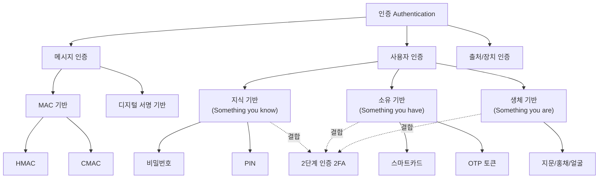

# 3강. 컴퓨터보안: 인증 (Authentication)

## 🔗 선수 지식 (Prerequisites)
- [ ] **필수**: 해시 함수의 개념 (MD5, SHA 계열) - 이해 완료?
- [ ] **필수**: 대칭키/공개키 암호의 기본 개념 - 이해 완료?
- [ ] **권장**: 무결성(Integrity)과 기밀성(Confidentiality)의 차이
- **관련 단원**: [2강. 암호의 기초](../컴퓨터보안/2강.md), [4강. 공개키 암호 및 키 관리](../컴퓨터보안/4강.md)

---

## 학습 목표
1. 인증의 개념을 설명할 수 있다.
2. 메시지 인증에 대해 설명할 수 있다.
3. 사용자 인증을 하는 다양한 방식을 설명할 수 있다.

---

## 🧠 메타인지 체크 (학습 전/후 자기 평가)

### 학습 전 자기 평가
| 소주제 | 자신감 (1-5) |
| :--- | :--- |
| 인증의 개념과 종류 | |
| 메시지 인증(MAC) | |
| 사용자 인증(비밀번호/생체/토큰/2단계) | |

### 학습 후 교정 (학습 완료 후 작성)
| 소주제 | 학습 전 | 학습 후 | 실제 정답률 | 과신/과소 여부 |
| :--- | :--- | :--- | :--- | :--- |
| 인증의 개념과 종류 | | | | |
| 메시지 인증(MAC) | | | | |
| 사용자 인증 4가지 방식 | | | | |

> **활용법**: 학습 전 1분 → 자신감 기입, 학습 후 1분 → 나머지 기입. "과신" 영역이 실제 취약점.

---

## 📝 요약 (Summary)
1. **🔴 인증(Authentication)**: 어떤 실체(메시지, 사용자, 출처, 장치 등)가 정말 그 실체가 맞는지 확인하는 과정을 의미한다.
2. **🔴 메시지 인증**: 메시지 뒤에 MAC을 부가하여 전송함으로써 전송 도중에 메시지의 내용이 부당하게 변경되지 않았음을 보증하는 것이다.
3. **🔴 사용자 인증**: 시스템에 접근하려는 사용자에 대한 인증을 의미한다.
4. **🟡 비밀번호 방식**: 비밀번호의 안전한 저장을 위해 비밀번호를 해시코드로 변환하여 저장한다.
5. **🟡 생체인식 방식**: 개개인의 고유한 생체정보를 이용하는 사용자 인증 방식이다.
6. **🟡 토큰 방식**: 사용자가 소유하고 있는 특정한 정보를 이용하는 사용자 인증 방식이다.
7. **🔴 2단계 인증 방식**: 사용자가 알고 있는 정보와 사용자가 소유하고 있는 정보를 혼합하여 사용자를 인증하는 방식이다.

---

## 📐 핵심 정의 및 원리 (이론 중심)

| 정의/원리명 | 내용 | 키워드 |
| :--- | :--- | :--- |
| **인증(Authentication)** | 실체의 진실성(authenticity)을 확인하는 과정. 실체는 메시지, 사용자, 출처, 장치 등 다양 | 진실성, 실체, 신원 확인 |
| **MAC (Message Authentication Code)** | 메시지와 비밀키를 입력받아 생성되는 고정 길이의 인증 태그. $\text{MAC} = C_K(M)$ | 비밀키, 무결성, 인증 태그 |
| **HMAC** | 해시 함수 기반 MAC. $\text{HMAC}_K(M) = H((K \oplus opad) \parallel H((K \oplus ipad) \parallel M))$ | 해시, opad, ipad |
| **비밀번호 인증** | 사용자가 **알고 있는 것(something you know)**으로 인증. 평문이 아닌 해시값으로 저장 | 해시 저장, salt, 사전 공격 |
| **생체인식 인증** | 사용자의 **고유한 신체적 특징(something you are)**으로 인증 (지문·홍채·얼굴 등) | FAR, FRR, 등록·정합 |
| **토큰 인증** | 사용자가 **소유한 것(something you have)**으로 인증 (스마트카드, OTP 등) | 소유물, OTP, 스마트카드 |
| **2단계 인증 (2FA)** | 서로 다른 인증 요소 **2가지를 결합**한 다요소 인증 방식 | 지식+소유, 다요소, MFA |

### 주요 정리/정의

**MAC을 이용한 메시지 인증 절차**
$$
\text{송신자: } M \parallel \text{MAC}_K(M) \longrightarrow \text{수신자: 검증 } \text{MAC}_K(M) \stackrel{?}{=} \text{수신된 MAC}
$$
> **직관적 해석**: 송신자와 수신자가 동일한 비밀키 $K$를 공유한다. 송신자는 메시지 $M$에 MAC을 붙여 보내고, 수신자는 같은 키로 MAC을 다시 계산해 일치하면 "메시지가 도중에 변경되지 않았고, 키를 아는 사람이 보낸 것"임을 확신한다.
> **AI 적용**: API 호출 시 요청 body에 HMAC을 부가하여 위·변조 탐지. LLM API의 webhook 서명 검증(예: OpenAI/Anthropic webhook signature)에 동일 원리 적용.

**비밀번호의 해시 저장**
$$
\text{DB에 저장: } H(\text{password} \parallel \text{salt})
$$
> **직관적 해석**: 평문 비밀번호를 그대로 저장하면 DB 유출 시 모든 사용자의 비밀번호가 노출된다. 해시는 일방향 함수이므로 역산이 불가능하고, salt를 더하면 사전 공격(rainbow table)도 무력화된다.
> **AI 적용**: ML 시스템의 사용자 계정 보호, 모델 API 키의 안전한 저장 패턴.

**챌린지-리스폰스(Challenge-Response) 인증**

> 비밀번호를 네트워크로 그대로 보내면 도청·재전송에 취약하다. 챌린지-리스폰스는 **비밀(공유키/패스워드)을 직접 전송하지 않고도** 상대가 그 비밀을 안다는 사실만 증명하게 한다.
>
> 1. 검증자(서버)가 매번 새로운 **난수 챌린지(nonce)** $r$를 보낸다.
> 2. 증명자(클라이언트)는 비밀 $K$로 $\text{response} = f_K(r)$ (예: $\text{HMAC}_K(r)$)을 계산해 응답한다.
> 3. 서버도 같은 $f_K(r)$을 계산해 일치하면 인증 성공.
>
> 매 세션마다 $r$이 달라지므로(**일회성 nonce**) 도청자가 이전 응답을 가로채 그대로 재사용하는 **재전송 공격(replay)** 을 막을 수 있다. CHAP, Kerberos, OTP, FIDO2의 서명 인증이 모두 이 원리에 기반한다.

**OTP의 두 유형 — HOTP vs TOTP**

> OTP(One-Time Password)는 매번 달라지는 1회용 비밀번호로, 생성 동기화 방식에 따라 두 가지로 나뉜다.

| 유형 | 표준 | 동기화 기준 | 갱신 시점 | 특징 |
| :--- | :--- | :--- | :--- | :--- |
| **HOTP** | RFC 4226 | **이벤트(카운터)** 기반 | 버튼을 누를 때마다 카운터 $+1$ | $\text{HOTP} = \text{Trunc}(\text{HMAC}_K(\text{counter}))$, 카운터 동기화 어긋남 가능 |
| **TOTP** | RFC 6238 | **시간** 기반 | 일정 시간(보통 30초)마다 자동 변경 | HOTP의 카운터를 "현재시각/30초"로 대체. Google Authenticator 등이 채택 |

> 즉 **TOTP는 HOTP의 카운터를 시간 단계(time-step)로 치환한 특수형**이다. 둘 다 공유 비밀키 $K$와 HMAC을 사용한다.

**재전송 공격(Replay Attack)과 그 방어**

> 재전송 공격은 공격자가 정상적인 (암호화·인증된) 메시지를 **그대로 가로챘다가 나중에 다시 보내** 같은 작업(예: "100만원 송금")을 반복시키는 공격이다.
>
> **핵심 주의**: MAC(HMAC)/디지털 서명만으로는 재전송을 막지 못한다. 가로챈 "메시지+MAC" 쌍 자체가 유효하므로 다시 보내도 검증을 통과하기 때문이다(무결성은 깨지지 않았다 — 단지 같은 것을 또 보낸 것일 뿐). 방어하려면 메시지에 **신선도(freshness)** 정보를 넣어야 한다:
> - **nonce**(일회성 난수, 서버가 사용 이력 기억) / **타임스탬프**(유효시간 창 밖이면 거부) / **시퀀스 번호**(순번 역행·중복 거부).
> - 챌린지-리스폰스와 TOTP가 재전송에 강한 이유도 바로 이 신선도(매번 다른 nonce/시간)를 내장하기 때문이다.

---

## 📊 개념 시각화 (Visual Guide)

### 인증의 분류 체계도


### 사용자 인증 방식 비교표
| 방식 | 인증 요소 | 입력 | 검증 방법 | 대표 사례 |
| :--- | :--- | :--- | :--- | :--- |
| **비밀번호** | 지식(Know) | 문자열 | 저장된 해시값과 비교 | 로그인 패스워드 |
| **생체인식** | 존재(Are) | 지문·홍채·얼굴 | 등록 템플릿과 정합 | 스마트폰 잠금해제 |
| **토큰** | 소유(Have) | OTP/스마트카드 | 발급된 비밀값 검증 | OTP 생성기, 보안카드 |
| **2단계 인증** | 2가지 결합 | 위 중 2개 | 두 요소 모두 검증 | 비밀번호 + OTP |

---

## ✏️ 심화 학습 (Study Subject)

### 1. 가상 시나리오: "어떤 인증 방식을, 언제 사용해야 할까?"
- **상황**: 한 핀테크 스타트업이 모바일 송금 앱을 출시한다. 사용자는 매일 수십 번 앱에 접근하지만, 1회 송금액이 100만 원을 초과하는 고액 거래도 가능해야 한다.
- **문제**: 보안성과 편의성을 동시에 만족시키려면 어떤 인증 방식을 어떻게 조합해야 할까?
- **해결**:
  1. **일반 로그인**: 생체인식(지문) — 편의성 ↑
  2. **고액 거래 시**: 2단계 인증(생체 + OTP 토큰) — 보안성 ↑
  3. **서버 통신**: 메시지마다 HMAC 부가 → 송금 명령 위·변조 방지
- **AI 학습 포인트**: "FIDO2/WebAuthn 같은 표준이 위 시나리오의 어떤 부분을 자동화해 주는지, 그리고 생체 템플릿이 서버로 전송되지 않는 이유를 설명해 줘."

### 2. 관점별 비교 및 오개념 분석
- **핵심 비교**: **MAC vs 디지털 서명**, **암호화 vs 인증**, **비밀번호 vs 생체인식**
- **오개념 분석**:
    - **오개념 1**: "메시지를 암호화하면 자동으로 인증도 된다."
    - **분석**: 암호화는 **기밀성**만 보장한다. 많은 전통적 암호 모드는 **가단성(malleability)** 을 가져, 공격자가 암호문을 변조하면 복호화 자체는 그대로 진행되어 **변조가 탐지되지 않은 채** 변형된 평문이 산출된다(예: CTR/스트림 모드에서 암호문 비트를 뒤집으면 평문의 대응 비트가 그대로 뒤집힘 → 공격자가 평문을 예측 가능하게 조작 가능). 따라서 무결성·인증은 별도의 MAC 또는 서명으로 보장해야 한다. AEAD(예: AES-GCM)는 이 둘을 결합해 변조 시 복호화를 **거부(인증 실패)** 한다.
    - *근거: Wikipedia "Malleability (cryptography)" (https://en.wikipedia.org/wiki/Malleability_(cryptography))*
    - **오개념 2**: "MAC과 디지털 서명은 같은 것이다."
    - **분석**: MAC은 **대칭키**(공유 비밀키)를 사용 → 송·수신자가 서로를 인증할 뿐 **부인방지(non-repudiation)는 불가**. 디지털 서명은 **개인키/공개키** 쌍을 사용 → 누구나 검증 가능하며 부인방지 성립.
    - **오개념 3**: "생체인식은 비밀번호보다 항상 안전하다."
    - **분석**: 생체정보는 **변경 불가**(유출 시 영구 위험)하고 **FAR(오수락률)이 0이 아니다**. 또한 사진·복제 지문 같은 위조 공격(presentation attack)이 존재한다. 따라서 단독보다는 2FA의 한 요소로 쓰는 것이 권장된다.
- **AI 학습 포인트**: "AES-GCM이 어떻게 암호화와 인증을 한 번에 처리하는지, 일반 AES-CBC + HMAC 조합과 무엇이 다른지 단계별로 비교해 줘."

---

## ❓ 연습 문제 및 해설

> **블룸 인지 수준 범례**: [기억] 정의·나열 → [이해] 설명·비교 → [적용] 계산·구현 → [분석] 구별·디버그 → [평가] 판단·비평 → [창조] 설계·제안

### 📝 문제

**1. ⭐ 📌 [기억] [인증의 정의로 가장 적절한 것은?](#prob-1)**
   > ① 정보의 기밀성을 보장하는 과정
   > ② 어떤 실체가 정말 그 실체가 맞는지 확인하는 과정
   > ③ 메시지를 암호화하여 전송하는 과정
   > ④ 데이터를 백업하고 복구하는 과정

<br>

**2. ⭐ 📌 [기억/이해] [메시지 인증에 사용되는 코드는 무엇인가?](#prob-2)**
   > ① CRC
   > ② Hash Code (단독)
   > ③ MAC (Message Authentication Code)
   > ④ ECC

<br>

**3. ⭐ 📌 [이해] [비밀번호를 DB에 저장할 때 안전성을 위해 일반적으로 사용하는 방법은?](#prob-3)**
   > ① 평문 그대로 저장
   > ② 비밀번호를 해시코드로 변환하여 저장
   > ③ 비밀번호를 BASE64로 인코딩하여 저장
   > ④ 비밀번호를 메모리에만 보관하고 저장하지 않음

<br>

**4. ⭐⭐ 📌 [이해/분석] [다음 중 사용자 인증 방식의 분류로 올바른 것을 모두 고르시오.](#prob-4)**
   > <보기>
   >
   > 가. 비밀번호 방식 — 사용자가 알고 있는 정보
   > 나. 생체인식 방식 — 사용자의 고유한 생체정보
   > 다. 토큰 방식 — 사용자가 소유하고 있는 정보
   > 라. 2단계 인증 — 알고 있는 것 + 소유하고 있는 것

   > ① 가, 나
   > ② 가, 나, 다
   > ③ 나, 다, 라
   > ④ 가, 나, 다, 라

<br>

**5. ⭐⭐ 📌 [적용/분석] [메시지 $M$을 송신할 때 MAC을 부가하여 전송하는 절차로 올바른 것은? (단, $K$는 송·수신자가 공유하는 비밀키)](#prob-5)**
   > ① 송신자가 $M$만 전송하고, 수신자가 $\text{MAC}_K(M)$을 계산
   > ② 송신자가 $M \parallel \text{MAC}_K(M)$ 전송, 수신자가 동일 키로 MAC 재계산 후 비교
   > ③ 송신자가 $\text{MAC}_K(M)$만 전송하고, 수신자는 임의의 $M'$로 검증
   > ④ 송신자가 공개키로 MAC을 암호화하여 전송

<br>

**6. ⭐⭐ 📌 [분석] [다음 중 2단계 인증(2FA)의 올바른 예는?](#prob-6)**
   > ① 비밀번호 + PIN
   > ② 지문 + 홍채
   > ③ 비밀번호 + OTP 토큰
   > ④ 스마트카드 + USB 보안키

<br>

**7. ⭐⭐ 📌 [분석/평가] [MAC과 디지털 서명의 가장 본질적인 차이는?](#prob-7)**
   > ① MAC은 무결성을 보장하지 않는다
   > ② 디지털 서명은 대칭키만 사용한다
   > ③ MAC은 대칭키 기반이라 부인방지를 제공하지 못한다
   > ④ MAC은 메시지 길이에 비례하여 길어진다

<br>

**8. ⭐⭐ 📌 [분석] [생체인식 인증에서 FAR(False Acceptance Rate)이 의미하는 것은?](#prob-8)**
   > ① 정당한 사용자를 잘못 거부하는 비율
   > ② 부정한 사용자를 정당한 사용자로 잘못 수락하는 비율
   > ③ 시스템이 다운되는 비율
   > ④ 등록되지 않은 사용자가 시도하는 비율

<br>

**9. ⭐⭐⭐ 📌 [평가] [다음 주장에 대한 올바른 평가는? "메시지를 AES로 암호화해서 전송하면 메시지 인증도 자동으로 보장된다."](#prob-9)**
   > ① 옳다. 암호화에 무결성이 포함된다.
   > ② 옳다. 복호화 시 오류가 나면 변조를 감지한다.
   > ③ 틀리다. 일반적 암호화 모드는 기밀성만 보장하고, 인증은 MAC 또는 서명으로 별도 제공해야 한다.
   > ④ 틀리다. AES는 인증 전용 알고리즘이기 때문이다.

<br>

**10. ⭐⭐⭐ 📌 [창조/설계] [고액 거래가 가능한 금융 앱을 설계할 때, 일반 로그인은 편의성을, 고액 거래는 보안성을 우선해야 한다. 다음 중 가장 합리적인 인증 설계는?](#prob-10)**
   > <보기>
   >
   > 가. 일반 로그인: 생체인식(지문)
   > 나. 고액 거래: 비밀번호 + OTP (2FA)
   > 다. 서버-앱 통신 메시지: HMAC 부가
   > 라. 모든 인증을 비밀번호 1개로 단일화

   > ① 가, 나
   > ② 가, 나, 다
   > ③ 가, 다, 라
   > ④ 라

---

### 🔑 정답 및 해설 (먼저 풀어본 후 펼치기)

<details>
<summary>정답 보기 (클릭)</summary>

1. ②
2. ③
3. ②
4. ④
5. ②
6. ③
7. ③
8. ②
9. ③
10. ②

</details>

<details>
<summary>해설 보기 (클릭)</summary>

<a id="prob-1"></a>
**1. ⭐ [기억] 인증의 정의**
> **정답: ② 어떤 실체가 정말 그 실체가 맞는지 확인하는 과정**
> **해설**: 학습정리 그대로 — 인증은 실체의 진실성을 확인하는 과정이다. ①은 기밀성(암호화), ③은 암호 전송, ④는 백업·복구로 모두 인증과 무관.

<a id="prob-2"></a>
**2. ⭐ [기억/이해] 메시지 인증 코드**
> **정답: ③ MAC (Message Authentication Code)**
> **해설**: 메시지 인증은 메시지 뒤에 MAC을 부가하여 변조 여부를 검증한다. CRC는 오류 검출용(악의적 변조 방지 X), 해시 단독은 키가 없어 인증 불가, ECC는 공개키 암호 계열.

<a id="prob-3"></a>
**3. ⭐ [이해] 비밀번호의 안전한 저장**
> **정답: ② 비밀번호를 해시코드로 변환하여 저장**
> **해설**: 학습정리: "비밀번호 방식은 비밀번호의 안전한 저장을 위해 비밀번호를 해시코드로 변환하여 저장한다." 평문 저장은 유출 시 치명적이며, BASE64는 단순 인코딩이라 역변환이 자명하다.

<a id="prob-4"></a>
**4. ⭐⭐ [이해/분석] 사용자 인증 방식 분류**
> **정답: ④ 가, 나, 다, 라**
> **해설**: 네 항목 모두 학습정리에 기술된 정의와 일치한다. 비밀번호(知), 생체인식(身), 토큰(有), 2단계 인증(知+有 등 결합).

<a id="prob-5"></a>
**5. ⭐⭐ [적용/분석] MAC을 이용한 메시지 인증 절차**
> **정답: ② 송신자가 $M \parallel \text{MAC}_K(M)$ 전송, 수신자가 동일 키로 MAC 재계산 후 비교**
> **해설**: 표준 절차는 송신자가 메시지 + MAC을 함께 보내고, 수신자가 같은 비밀키로 다시 MAC을 계산해 일치 여부로 무결성과 송신자 진위를 확인한다. ④는 MAC이 아니라 디지털 서명에 가까운 설명.

<a id="prob-6"></a>
**6. ⭐⭐ [분석] 2단계 인증의 정의**
> **정답: ③ 비밀번호 + OTP 토큰**
> **해설**: 2FA는 **서로 다른 종류의 인증 요소** 2개를 결합한 것. 비밀번호(知) + OTP(有)는 서로 다른 요소이므로 진정한 2FA. ①(知+知), ②(身+身), ④(有+有)는 같은 요소를 두 번 쓰는 것이므로 엄격한 의미의 2FA가 아니다.

<a id="prob-7"></a>
**7. ⭐⭐ [분석/평가] MAC vs 디지털 서명**
> **정답: ③ MAC은 대칭키 기반이라 부인방지를 제공하지 못한다**
> **해설**: MAC은 송·수신자가 같은 비밀키를 공유하므로, 수신자도 MAC을 위조할 수 있어 송신자가 "내가 보내지 않았다"고 부인할 수 있다. 디지털 서명은 송신자만 보유한 개인키로 서명하므로 부인방지가 성립한다.

<a id="prob-8"></a>
**8. ⭐⭐ [분석] FAR의 의미**
> **정답: ② 부정한 사용자를 정당한 사용자로 잘못 수락하는 비율**
> **해설**: FAR(False Acceptance Rate)은 타인을 본인으로 잘못 받아들이는 비율로 보안에 직접적 위험. ①은 FRR(False Rejection Rate)로 편의성 저하 지표. 두 값은 trade-off 관계.

<a id="prob-9"></a>
**9. ⭐⭐⭐ [평가] 암호화 ≠ 인증**
> **정답: ③ 틀리다. 일반적 암호화 모드는 기밀성만 보장하고, 인증은 MAC 또는 서명으로 별도 제공해야 한다.**
> **해설**: AES-CBC, AES-CTR 같은 일반 모드는 기밀성만 제공한다. 공격자가 암호문을 비트 단위로 조작하면 복호화는 성공하지만(쓰레기 평문이 나오더라도) 수신자가 변조를 탐지할 수 없다. 인증까지 보장하려면 HMAC을 추가하거나 AES-GCM 같은 AEAD 모드를 사용해야 한다.

<a id="prob-10"></a>
**10. ⭐⭐⭐ [창조/설계] 다층 인증 설계**
> **정답: ② 가, 나, 다**
> **해설**: 가(생체)는 일반 로그인의 편의성, 나(2FA)는 고액 거래의 보안성, 다(HMAC)는 통신 메시지의 무결성·진위성을 보장한다. 라는 단일 인증으로 회귀하여 보안성·확장성 모두 떨어지므로 부적절.

</details>

---

## ✅ O/X 확인문제 (20문항)

**1.** 인증은 어떤 실체가 정말 그 실체가 맞는지 확인하는 과정이다. [(O / X)](#ox-1)
**2.** 메시지 인증은 메시지의 기밀성을 보장하기 위해 MAC을 부가한다. [(O / X)](#ox-2)
**3.** MAC을 생성하려면 송·수신자가 공유하는 비밀키가 필요하다. [(O / X)](#ox-3)
**4.** 비밀번호는 보안을 위해 평문 그대로 DB에 저장하는 것이 권장된다. [(O / X)](#ox-4)
**5.** 비밀번호를 해시값으로 저장하면 DB가 유출되어도 즉시 평문을 알 수는 없다. [(O / X)](#ox-5)
**6.** 생체인식은 사용자가 알고 있는 정보를 이용하는 인증 방식이다. [(O / X)](#ox-6)
**7.** 토큰 방식은 사용자가 소유하고 있는 특정 정보를 이용한다. [(O / X)](#ox-7)
**8.** 2단계 인증은 같은 유형의 인증 요소 두 개를 결합하는 것이다. [(O / X)](#ox-8)
**9.** MAC은 대칭키 기반이므로 부인방지(non-repudiation)를 제공한다. [(O / X)](#ox-9)
**10.** 디지털 서명은 송신자의 개인키로 생성되고, 수신자는 송신자의 공개키로 검증한다. [(O / X)](#ox-10)
**11.** FAR이 낮을수록 부정한 사용자가 인증에 성공할 가능성이 낮다. [(O / X)](#ox-11)
**12.** FRR이 높으면 사용자의 편의성이 떨어진다. [(O / X)](#ox-12)
**13.** HMAC은 해시 함수와 비밀키를 결합한 메시지 인증 코드이다. [(O / X)](#ox-13)
**14.** 일반적인 AES-CBC 모드는 암호화만 제공하므로 무결성 보장을 위해 MAC이 별도로 필요하다. [(O / X)](#ox-14)
**15.** 인증의 대상이 되는 실체에는 메시지, 사용자, 출처, 장치 등이 포함된다. [(O / X)](#ox-15)
**16.** 비밀번호와 OTP를 함께 사용하는 것은 2단계 인증의 예이다. [(O / X)](#ox-16)
**17.** 생체정보는 유출되어도 비밀번호처럼 쉽게 교체할 수 있다. [(O / X)](#ox-17)
**18.** salt를 더한 해시 저장은 rainbow table 공격에 대한 방어책이다. [(O / X)](#ox-18)
**19.** MAC 검증이 실패하면 메시지가 변조되었거나 키를 모르는 자가 보낸 것이다. [(O / X)](#ox-19)
**20.** 2단계 인증은 한 인증 요소가 노출되어도 나머지 요소가 보호 역할을 하므로 단일 인증보다 안전하다. [(O / X)](#ox-20)

<details>
<summary>O/X 정답 및 해설 보기 (클릭)</summary>

> <a id="ox-1"></a>
> **1. 정답**: O
> **해설**: 학습정리의 인증 정의 그대로.

> <a id="ox-2"></a>
> **2. 정답**: X
> **해설**: 메시지 인증은 **무결성과 송신자 인증**을 보장한다. 기밀성은 암호화의 영역.

> <a id="ox-3"></a>
> **3. 정답**: O
> **해설**: MAC = $C_K(M)$, 비밀키 $K$가 핵심 입력이다.

> <a id="ox-4"></a>
> **4. 정답**: X
> **해설**: 평문 저장은 DB 유출 시 즉시 노출되므로 금지된다. 해시(+salt) 저장이 표준.

> <a id="ox-5"></a>
> **5. 정답**: O
> **해설**: 해시는 일방향 함수이므로 역산이 불가능하다. 다만 약한 패스워드는 brute-force/사전공격에 취약.

> <a id="ox-6"></a>
> **6. 정답**: X
> **해설**: 생체인식은 **사용자가 가진 고유 신체 특징(Are)**을 이용한다. 알고 있는 정보(Know)는 비밀번호.

> <a id="ox-7"></a>
> **7. 정답**: O
> **해설**: 학습정리 그대로 — 토큰은 소유(Have) 요소.

> <a id="ox-8"></a>
> **8. 정답**: X
> **해설**: 2FA는 **서로 다른 유형**의 요소 2개를 결합한다. 같은 유형 2개는 진정한 다요소 인증이 아니다.

> <a id="ox-9"></a>
> **9. 정답**: X
> **해설**: MAC은 대칭키 공유 구조라 수신자도 위조 가능 → 부인방지 X. 부인방지는 디지털 서명의 특징.

> <a id="ox-10"></a>
> **10. 정답**: O
> **해설**: 공개키 암호 기반 서명의 표준 구조.

> <a id="ox-11"></a>
> **11. 정답**: O
> **해설**: FAR = False Acceptance Rate, 낮을수록 보안성 ↑.

> <a id="ox-12"></a>
> **12. 정답**: O
> **해설**: FRR이 높으면 정당한 사용자가 자주 거부됨 → 편의성 ↓.

> <a id="ox-13"></a>
> **13. 정답**: O
> **해설**: HMAC = Hash-based MAC, 해시 + 비밀키 결합.

> <a id="ox-14"></a>
> **14. 정답**: O
> **해설**: CBC, CTR 등 전통적 모드는 기밀성만 제공. AEAD(GCM 등)는 둘 다 제공.

> <a id="ox-15"></a>
> **15. 정답**: O
> **해설**: 학습개요에 명시.

> <a id="ox-16"></a>
> **16. 정답**: O
> **해설**: 비밀번호(知) + OTP(有) → 서로 다른 두 요소, 정확히 2FA.

> <a id="ox-17"></a>
> **17. 정답**: X
> **해설**: 생체정보는 변경 불가. 유출 시 영구적 위험이므로 신중히 저장해야 한다.

> <a id="ox-18"></a>
> **18. 정답**: O
> **해설**: salt는 동일 비밀번호도 다른 해시값을 만들어 rainbow table을 무력화.

> <a id="ox-19"></a>
> **19. 정답**: O
> **해설**: MAC 불일치 = 메시지 변조 or 키 불일치(잘못된 송신자).

> <a id="ox-20"></a>
> **20. 정답**: O
> **해설**: 다요소 인증의 핵심 가치. 한 요소가 뚫려도 다른 요소가 방어선 역할.

</details>

---

## 🧪 자유 회상 연습 (Free Recall)

> **방법**: 위의 노트를 모두 덮고, 타이머 3분 설정 후 이번 단원에서 배운 내용을 기억나는 대로 자유롭게 적으세요.
> 정확한 문장이 아니어도 됩니다. 키워드, 수식, 관계 등 떠오르는 것을 모두 적습니다.

**자유 회상 작성란:**

```
[여기에 기억나는 내용을 자유롭게 작성]


```

> **회상 후 점검**: 노트를 다시 펼쳐 빠뜨린 내용을 확인하세요. 빠뜨린 부분이 실제 취약점입니다.
> - 회상 못한 핵심 개념: [                ]
> - 회상 못한 수식: [                ]

---

## 💻 코드로 확인하기 (Code Verification)

```python
import hashlib
import hmac
import os

# ─────────────────────────────────────────────
# 1) 메시지 인증: HMAC-SHA256 으로 송·수신 시연
# ─────────────────────────────────────────────
shared_key = b"super-secret-shared-key"
message = b"Transfer 1,000,000 KRW to account #12345"

# 송신자: MAC 생성 후 메시지와 함께 전송
sender_mac = hmac.new(shared_key, message, hashlib.sha256).hexdigest()
print("[송신] message :", message.decode())
print("[송신] HMAC    :", sender_mac)

# 수신자: 동일 키로 MAC 재계산 후 비교
receiver_mac = hmac.new(shared_key, message, hashlib.sha256).hexdigest()
print("[수신] 검증     :", hmac.compare_digest(sender_mac, receiver_mac))

# 변조 시도 — 한 글자만 바꿔도 MAC이 완전히 달라진다
tampered = b"Transfer 9,000,000 KRW to account #12345"
tampered_mac = hmac.new(shared_key, tampered, hashlib.sha256).hexdigest()
print("[변조] 일치 여부:", hmac.compare_digest(sender_mac, tampered_mac))

# ─────────────────────────────────────────────
# 2) 비밀번호 저장: salt + 해시
# ─────────────────────────────────────────────
# 반복 횟수(iterations)는 본 노트 전체에서 200_000으로 통일한다.
# (단순 시연용 값이며, OWASP 2023 권장은 PBKDF2-HMAC-SHA256 기준 600,000회 이상 — 아래 박스 참조)
PBKDF2_ITER = 200_000

def store_password(password: str) -> tuple[bytes, bytes]:
    salt = os.urandom(16)
    pwd_hash = hashlib.pbkdf2_hmac("sha256", password.encode(), salt, PBKDF2_ITER)
    return salt, pwd_hash

def verify_password(password: str, salt: bytes, expected_hash: bytes) -> bool:
    test_hash = hashlib.pbkdf2_hmac("sha256", password.encode(), salt, PBKDF2_ITER)
    return hmac.compare_digest(test_hash, expected_hash)

salt, stored = store_password("MyP@ssw0rd!")
print("\n[저장된 해시]:", stored.hex()[:32], "...")
print("[정상 로그인]:", verify_password("MyP@ssw0rd!", salt, stored))
print("[오타 로그인]:", verify_password("MyPassword!", salt, stored))
```

> **실행 결과 (예시)**:
> ```
> [송신] message : Transfer 1,000,000 KRW to account #12345
> [송신] HMAC    : 7a3b... (64 hex)
> [수신] 검증     : True
> [변조] 일치 여부: False
> [저장된 해시]: 9e1f2c... ...
> [정상 로그인]: True
> [오타 로그인]: False
> ```
> **해석**:
> - HMAC 검증으로 메시지 변조(금액 1,000,000 → 9,000,000)를 100% 탐지.
> - 비밀번호는 평문이 아닌 salt + PBKDF2 해시 형태로 저장되어 DB 유출 시에도 즉시 노출되지 않음.
> - `hmac.compare_digest`는 타이밍 공격 방지를 위한 **상수 시간 비교**.

---

## 🤖 AI 연결고리 (보안 개념 → AI/ML 응용)

| 보안 개념 | AI/ML 적용 분야 | 구체적 사례 |
| :--- | :--- | :--- |
| **HMAC** | API/Webhook 인증 | OpenAI·Anthropic webhook 서명 검증, ML 모델 서빙 API 위·변조 방지 |
| **비밀번호 해시 저장** | MLOps 사용자 관리 | Kubeflow, MLflow 사용자 계정의 안전한 패스워드 저장 |
| **2단계 인증 (2FA)** | AI 클라우드 콘솔 보안 | AWS SageMaker, GCP Vertex AI 콘솔 접근 시 MFA 강제 |
| **생체인식 (얼굴/지문)** | 딥러닝 기반 인식 모델 | FaceNet, ArcFace를 이용한 얼굴 임베딩 → 코사인 유사도 정합 |
| **메시지 인증** | 페더레이티드 러닝 | 클라이언트 → 서버 그래디언트 전송 시 변조 방지를 위한 서명 |

---

## 📖 심화 학습 예시 답안

#### 1. HMAC의 내부 동작 원리
HMAC은 단순히 `Hash(key || message)`로 만들지 않는다. 이렇게 만들면 **길이 확장 공격(length extension attack)**에 취약하기 때문이다. HMAC은 다음과 같이 두 번 해시한다.

1. **키 정규화**: 키 $K$가 블록 길이와 다르면 해시하거나 0으로 패딩하여 블록 크기에 맞춘다.
2. **내부 패딩 적용**: $K \oplus \text{ipad}$ (ipad = 0x36 반복)와 메시지를 이어 1차 해시.
3. **외부 패딩 적용**: $K \oplus \text{opad}$ (opad = 0x5C 반복)와 1차 해시 결과를 이어 2차 해시.

$$
\text{HMAC}_K(M) = H\bigl((K \oplus \text{opad}) \parallel H((K \oplus \text{ipad}) \parallel M)\bigr)
$$

이 이중 구조 덕분에 길이 확장 공격이 차단되고, 사용된 해시 함수의 보안 수준만큼 안전성이 보장된다.

#### 2. MAC vs 디지털 서명 비교표

| 구분 | MAC (예: HMAC) | 디지털 서명 (예: RSA, ECDSA) | 비고 |
| :--- | :--- | :--- | :--- |
| **키 종류** | 대칭키 (공유 비밀키) | 비대칭키 (개인키/공개키) | |
| **기밀성** | X (별도 필요) | X (별도 필요) | 둘 다 인증/무결성 전용 |
| **무결성** | O | O | |
| **송신자 인증** | O (키를 아는 사람) | O (개인키 소유자) | |
| **부인방지** | **X** | **O** | 핵심 차이 |
| **속도** | 빠름 (대칭 연산) | 느림 (모듈러 거듭제곱) | |
| **AI 활용** | API 요청 무결성, gradient 전송 | 모델 가중치 배포 진위 확인, SBOM 서명 | |

#### 3. 비밀번호 저장 Best Practice

- **Bad Practice (나쁜 예시)**
  ```python
  # ❌ 평문 저장
  users[username] = password

  # ❌ 단순 MD5 — salt 없음, 빠른 알고리즘이라 brute-force에 취약
  users[username] = hashlib.md5(password.encode()).hexdigest()
  ```
- **Good Practice (좋은 예시)**
  ```python
  # ✅ salt + 강력한 KDF (PBKDF2, bcrypt, scrypt, Argon2)  ※ 본 노트는 반복 횟수를 200_000으로 통일
  salt = os.urandom(16)
  pwd_hash = hashlib.pbkdf2_hmac("sha256", password.encode(), salt, 200_000)
  users[username] = {"salt": salt, "hash": pwd_hash}
  ```
- **설명**: 단순 해시는 GPU/ASIC으로 초당 수십억 회 시도가 가능하다. PBKDF2/bcrypt/Argon2는 **의도적으로 느리게** 설계되어(반복 횟수, 메모리 hard) brute-force 비용을 폭증시킨다. salt는 동일 비밀번호의 해시 결과를 사용자마다 다르게 만들어 rainbow table을 무력화한다.
- **반복 횟수 권장값 주의**: 본 노트의 코드는 시연 일관성을 위해 **200,000회**로 통일했지만, **OWASP Password Storage Cheat Sheet(2023)** 의 현행 권장은 **PBKDF2-HMAC-SHA256 기준 600,000회 이상**(SHA-512는 210,000회)이다. 실제 서비스에서는 하드웨어 성능에 맞춰 가능한 한 높게 설정해야 한다. *근거: OWASP Password Storage Cheat Sheet (https://cheatsheetseries.owasp.org/cheatsheets/Password_Storage_Cheat_Sheet.html)*

#### 4. 심층확장 ① — 패스워드 해싱 알고리즘 비교 (OWASP 권장 파라미터)

단순 해시(MD5/SHA-256)는 **너무 빨라서** 오히려 공격자에게 유리하다. 패스워드 전용 KDF는 **느림·메모리 소비**를 무기로 삼는다.

| 알고리즘 | 종류 | 저항 특성 | OWASP 2023 권장 파라미터 | 비고 |
| :--- | :--- | :--- | :--- | :--- |
| **PBKDF2** | 반복 해시 | CPU(반복 횟수) | HMAC-SHA256 **600,000**회 (SHA-512 210,000회) | FIPS 승인, GPU 공격엔 상대적으로 약함 |
| **bcrypt** | Blowfish 기반 | CPU(work factor) | **cost 10 이상**, 입력 72바이트 제한 | 오래 검증됨, 메모리 hard 아님 |
| **scrypt** | 메모리-하드 | CPU+메모리 | $N$=2^17, $r$=8, $p$=1 (또는 메모리 ≥64MB) | GPU/ASIC 공격에 강함 |
| **Argon2id** | 메모리-하드 | CPU+메모리(병렬·사이드채널 균형) | 메모리 **19MiB**, 반복 2, 병렬 1 (최소) | **현재 1순위 권장**, PHC 우승 |

> **권장 우선순위**: **Argon2id > scrypt > bcrypt > PBKDF2**. 단, FIPS 준수가 필요하면 PBKDF2를 충분히 높은 반복 횟수로 사용한다. 모든 경우 **유니크 salt** 필수, 고가치 시스템은 **pepper**(별도 보관 비밀)를 추가 고려.
> *근거: OWASP Password Storage Cheat Sheet (https://cheatsheetseries.owasp.org/cheatsheets/Password_Storage_Cheat_Sheet.html)*

#### 5. 심층확장 ② — FIDO2 / WebAuthn / 패스키(Passkey): 패스워드리스 인증

> 📦 **[심화 박스] 비밀번호를 아예 없애는 인증 — FIDO2/WebAuthn**
>
> - **핵심 아이디어**: 서버에 **공개키만** 저장하고, 사용자의 기기(보안 칩/인증기)에 **개인키**를 보관한다. 로그인 시 서버가 보낸 챌린지를 기기가 개인키로 서명하고 서버는 공개키로 검증한다 → **공유 비밀(패스워드)이 서버에 없으므로 DB가 유출돼도 훔칠 비밀번호가 없다.**
> - **구성**: **WebAuthn**(브라우저 ↔ 서버 W3C API) + **CTAP**(브라우저 ↔ 인증기 프로토콜) = **FIDO2**.
> - **재전송·피싱 방어**: 매 로그인마다 새 챌린지(nonce)에 서명하고(재전송 방어), 서명 대상에 **출처(origin)** 가 묶여 있어(**origin binding**) 가짜 사이트에선 검증이 통과하지 못한다(**피싱 내성**) — 이것이 OTP 대비 결정적 강점.
> - **패스키(Passkey)**: FIDO 자격증명을 클라우드(iCloud 키체인, Google 비밀번호 관리자 등)로 **동기화**해 여러 기기에서 쓰게 한 것. 생체(Face ID/지문)로 개인키 사용을 잠금 해제하지만, **생체정보 자체는 기기를 떠나지 않는다.**

| 구분 | 비밀번호 | OTP(TOTP) | FIDO2/패스키 |
| :--- | :--- | :--- | :--- |
| 서버 저장 비밀 | 해시된 PW | 공유 비밀키 | **공개키(비밀 없음)** |
| 피싱 내성 | 약함 | 약함(코드 가로채기) | **강함(origin binding)** |
| 재전송 내성 | 약함 | 강함(시간창) | **강함(챌린지 서명)** |
| 사용자 경험 | 입력 필요 | 코드 입력 | 생체 탭 1회 |

> *근거: FIDO Alliance "FIDO2" (https://fidoalliance.org/fido2/), W3C "Web Authentication Level 2" (https://www.w3.org/TR/webauthn-2/)*

#### 6. 심층확장 ③ — 생체인식 성능 지표: EER과 ROC

생체인식은 입력이 매번 미세하게 달라지므로 "임계값(threshold)"으로 본인/타인을 판정한다. 임계값을 어디에 두느냐에 따라 두 오류가 **trade-off** 관계로 움직인다.

- **FAR(False Acceptance Rate)**: 타인을 본인으로 잘못 수락 → 보안 위험. 임계값을 느슨하게 하면 ↑
- **FRR(False Rejection Rate)**: 본인을 타인으로 잘못 거부 → 편의성 저하. 임계값을 엄격하게 하면 ↑
- **EER(Equal Error Rate)**: 임계값을 조절해 **FAR = FRR이 되는 교차점**의 오류율. **EER이 낮을수록 우수한 생체 시스템**으로, 서로 다른 시스템의 정확도를 한 숫자로 비교할 때 쓴다.
- **ROC(Receiver Operating Characteristic) 곡선**: 임계값을 전 구간 변화시키며 (FAR, 1−FRR=정탐율 또는 FAR vs FRR)을 그린 곡선. 곡선이 좌하단(저오류)에 가까울수록 성능이 좋고, EER은 이 곡선이 $\text{FAR}=\text{FRR}$ 대각선과 만나는 점이다.

> **응용 판단**: 고보안 환경(군사·금융)은 FAR을 극도로 낮추려 임계값을 엄격히(→ FRR↑ 감수), 편의 우선 환경(스마트폰 잠금)은 FRR을 낮춰 사용성을 높인다. 운영 목표에 맞춰 임계값을 EER 지점에서 한쪽으로 의도적으로 이동시킨다.
> *근거: Wikipedia "Biometrics — Performance" (https://en.wikipedia.org/wiki/Biometrics#Performance)*

---

## 📚 핵심 용어집 (Glossary)

| 용어 (한) | 용어 (영) | 수식 표현 | 정의 |
| :--- | :--- | :--- | :--- |
| **인증** | Authentication | — | 실체의 진실성을 확인하는 과정 |
| **메시지 인증 코드** | MAC (Message Authentication Code) | $\text{MAC}_K(M)$ | 비밀키 $K$와 메시지 $M$으로 생성되는 인증 태그 |
| **HMAC** | Hash-based MAC | $H((K \oplus opad) \parallel H((K \oplus ipad) \parallel M))$ | 해시 함수 기반 표준 MAC (RFC 2104) |
| **해시 함수** | Hash function `→←2강` | $H(x) \to y$ (고정 길이) | 임의 길이 입력을 고정 길이 출력으로 변환하는 일방향 함수 |
| **salt** | Salt | $H(\text{pwd} \parallel s)$ | 동일 비밀번호의 해시값을 다르게 만들기 위한 임의값 |
| **2단계 인증** | Two-Factor Authentication (2FA) | — | 서로 다른 두 가지 인증 요소를 결합한 다요소 인증 |
| **OTP** | One-Time Password | — | 일정 시간/이벤트마다 갱신되는 1회용 비밀번호 |
| **FAR** | False Acceptance Rate | $\text{FAR} = \frac{\text{잘못 수락 횟수}}{\text{타인 시도 횟수}}$ | 생체인식에서 타인을 본인으로 잘못 받아들이는 비율 |
| **FRR** | False Rejection Rate | $\text{FRR} = \frac{\text{잘못 거부 횟수}}{\text{본인 시도 횟수}}$ | 본인을 타인으로 잘못 거부하는 비율 |
| **부인방지** | Non-repudiation | — | 송신자가 자신이 보냈음을 부인할 수 없게 하는 보안 속성 |
| **디지털 서명** | Digital Signature `→←4강` | $S = \text{Sign}_{sk}(H(M))$ | 개인키로 생성하고 공개키로 검증하는 인증·부인방지 메커니즘 |

---

## 🤖 AI 학습 파트너를 위한 추가 자료

### 1. 개념 이해를 위한 심층 질문 프롬프트
> **프롬프트 예시**: "인증(Authentication)과 인가(Authorization)의 차이를 초등학생도 이해할 수 있도록 학교 출입증 비유로 설명해 줘. 그리고 이 둘이 혼동되었을 때 실제 시스템에서 어떤 보안 사고가 발생할 수 있는지 사례를 들어줘."

### 2. 문제 해결 능력 강화를 위한 시나리오 프롬프트
> **프롬프트 예시**: "당신은 핀테크 스타트업의 보안 아키텍트입니다. 100만 명 규모 사용자를 위해 로그인은 편의성을, 100만 원 초과 송금은 강력한 보안을 요구합니다. 비밀번호·생체인식·OTP·FIDO2 중 어떤 조합을 어느 단계에 배치해야 할지, 각 선택의 보안성·UX·구현 비용을 비교하여 설계안을 제시해 줘."

### 3. 수식·구조 검증 프롬프트
> **프롬프트 예시**: "다음 HMAC 정의를 검증해 줘.
> $$\text{HMAC}_K(M) = H((K \oplus \text{opad}) \parallel H((K \oplus \text{ipad}) \parallel M))$$
> 1. 왜 단순히 $H(K \parallel M)$을 쓰면 안 되는지(길이 확장 공격) 단계별로 설명.
> 2. opad와 ipad가 서로 달라야 하는 이유.
> 3. SHA-256 기반 HMAC의 출력 길이와 보안 강도를 알려줘."

---

## 🔄 복습 체크 (Spaced Repetition)
- [ ] 1일 후 복습 (날짜: 2026-05-30)
- [ ] 3일 후 복습 (날짜: 2026-06-01)
- [ ] 7일 후 복습 (날짜: 2026-06-05)
- [ ] 14일 후 복습 (날짜: 2026-06-12)
- [ ] 30일 후 복습 (날짜: 2026-06-28)

### 복습 시 자가 평가
| 회차 | 날짜 | 이해도 (1-5) | 취약 부분 메모 |
| :--- | :--- | :--- | :--- |
| 1차 | | | |
| 2차 | | | |
| 3차 | | | |

---

## 📚 참고 자료 (References)

- 한국방송통신대학교 『컴퓨터보안』 교재 — 3강. 인증
- RFC 2104 — HMAC: Keyed-Hashing for Message Authentication
- NIST SP 800-63B — Digital Identity Guidelines: Authentication and Lifecycle Management
- FIDO Alliance — FIDO2/WebAuthn 표준 문서 (https://fidoalliance.org)
- W. Stallings, *Cryptography and Network Security* — Chapter on Message Authentication & User Authentication
