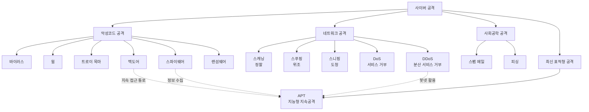

# 4강. 컴퓨터보안: 사이버 공격

## 🔗 선수 지식 (Prerequisites)
- [ ] **필수**: [1강. 정보보호의 개요](1강.md) - 정보보호 3대 목표(CIA) 이해 완료?
- [ ] **필수**: [2강. 정보보호 관리](2강.md) - 위협·취약점·자산 개념 이해 완료?
- [ ] **권장**: TCP/IP 4계층, 패킷 구조, 클라이언트-서버 모델 기초
- **관련 단원**: [5강. 암호화 기술](5강.md), [10강. 네트워크 보안](10강.md)

---

## 학습 목표
1. 사이버 공격의 개념을 설명할 수 있다.
2. 악성코드의 종류를 설명할 수 있다.
3. 네트워크 공격의 종류를 설명할 수 있다.
4. 그 외의 사이버 공격을 설명할 수 있다.
5. 최신의 사이버 공격 방법의 특징을 설명할 수 있다.

---

## 🧠 메타인지 체크 (학습 전/후 자기 평가)

### 학습 전 자기 평가
| 소주제 | 자신감 (1-5) |
| :--- | :--- |
| 사이버 공격의 개념과 변천 | |
| 악성코드 6종 분류(바이러스/웜/트로이/백도어/스파이웨어/랜섬웨어) | |
| 네트워크 공격(스캐닝/스푸핑/스니핑/DoS/DDoS) | |
| 스팸·피싱·APT 등 사회공학·지능형 공격 | |

### 학습 후 교정 (학습 완료 후 작성)
| 소주제 | 학습 전 | 학습 후 | 실제 정답률 | 과신/과소 여부 |
| :--- | :--- | :--- | :--- | :--- |
| 사이버 공격의 개념과 변천 | | | | |
| 악성코드 6종 분류 | | | | |
| 네트워크 공격 5종 | | | | |
| 스팸·피싱·APT | | | | |

> **활용법**: 학습 전 1분 → 자신감 기입, 학습 후 1분 → 나머지 기입. "과신" 영역이 실제 취약점.

---

## 📝 요약 (Summary)
1. 🔴 **사이버 공격의 정의**: 인터넷을 통해 다른 컴퓨터에 접속하여 상대방 국가·기업·개인에게 손상을 입히려는 행동. 과거에는 시스템 설정 오류를 이용한 권한 획득 위주였으나, 최근에는 패킷 단위의 조작·탈취 등 고난도 공격으로 진화하고 있다.
2. 🔴 **악성코드(Malware)**: 악의적 용도로 사용될 수 있는 코드가 심어진 유해 프로그램. **바이러스, 웜, 트로이 목마, 백도어, 스파이웨어, 랜섬웨어**가 대표적이다.
3. 🔴 **네트워크 공격**: 네트워크 트래픽·패킷·서비스를 표적으로 한 공격으로 **스캐닝, 스푸핑, 스니핑, 서비스 거부 공격(DoS), 분산 서비스 거부 공격(DDoS)**가 포함된다.
4. 🟡 **스팸 메일**: 불특정 다수를 대상으로 일방적·대량으로 전달되는 이메일로, 일반적으로 광고·홍보·비방 등의 목적으로 전송되는 메일.
5. 🔴 **피싱(Phishing)**: 유명 금융기관·공신력 있는 업체를 사칭한 이메일로 수신자를 속여 개인정보·금융정보를 탈취해 범죄에 악용하는 행위.
6. 🔴 **APT (Advanced Persistent Threat, 지능형 지속공격)**: 특정 대상을 목표로 다양한 공격 기술을 이용해 **은밀하게·지속적으로** 공격하는 최신 공격 방식.

---

## 📐 핵심 정의 및 원리 (Key Definitions & Principles)

### 악성코드(Malware) 6종 분류

| 정의명 | 내용 | 키워드 |
| :--- | :--- | :--- |
| **바이러스 (Virus)** | 정상 파일·프로그램에 기생하여 자신을 복제하고, 숙주 프로그램 실행 시 동작하는 악성코드 | 기생, 자기복제, 숙주 필요 |
| **웜 (Worm)** | 숙주 없이 **독립적으로** 네트워크를 통해 자기복제·전파되는 악성코드 | 독립 실행, 네트워크 전파, 자기복제 |
| **트로이 목마 (Trojan Horse)** | 정상 프로그램으로 위장하여 사용자가 직접 설치·실행하도록 유도하는 악성코드. **자기복제 능력 없음** | 위장, 자기복제 X, 사용자 유도 |
| **백도어 (Backdoor)** | 인증 절차를 우회하여 시스템에 **은밀히 접근**할 수 있도록 만들어진 비밀 통로 | 인증 우회, 은닉 경로, 지속 접근 |
| **스파이웨어 (Spyware)** | 사용자 몰래 설치되어 키 입력·화면·개인정보 등을 수집해 외부로 전송하는 악성코드 | 정보 수집, 은닉 동작, 키로거 |
| **랜섬웨어 (Ransomware)** | 사용자 파일을 암호화하여 인질로 잡고 **금전(랜섬)**을 요구하는 악성코드 | 파일 암호화, 금전 요구, 복호화 키 |

### 네트워크 공격 5종 분류

| 정의명 | 내용 | 키워드 |
| :--- | :--- | :--- |
| **스캐닝 (Scanning)** | 공격 사전 단계로, 대상 시스템의 열린 포트·서비스·OS·취약점을 탐지하는 행위 (포트 스캔, 취약점 스캔) | 정찰(Reconnaissance), 포트, 취약점 |
| **스푸핑 (Spoofing)** | 자신의 **신원(IP/MAC/이메일/DNS 등)을 위조**하여 상대를 속이는 공격 (IP/ARP/DNS/Email Spoofing) | 위조, 신원 사칭, 신뢰 악용 |
| **스니핑 (Sniffing)** | 네트워크상을 흐르는 패킷을 **몰래 도청·수집**하여 정보를 탈취하는 공격 (수동 공격) | 도청, 수동(Passive), 패킷 캡처 |
| **서비스 거부 공격 (DoS)** | 단일 공격자가 표적 시스템에 과도한 요청을 보내 **정상 서비스를 마비**시키는 공격 | 자원 고갈, 가용성 침해, 1:1 |
| **분산 서비스 거부 공격 (DDoS)** | 다수의 좀비 PC(봇넷)를 이용해 동시다발적으로 표적을 공격하는 DoS의 확장 형태 | 봇넷, 다대일(N:1), 대규모 |

### 그 외 사이버 공격 및 최신 공격

| 정의명 | 내용 | 키워드 |
| :--- | :--- | :--- |
| **스팸 메일 (Spam)** | 불특정 다수에게 광고·홍보·비방 목적으로 일방적·대량 전송되는 이메일 | 대량, 일방향, 불특정 다수 |
| **피싱 (Phishing)** | 금융기관·공신력 있는 업체를 사칭해 개인·금융정보를 탈취하는 행위 | 사칭, 사회공학, 정보 탈취 |
| **APT (Advanced Persistent Threat)** | 특정 대상을 표적으로 **지능형 기술·은밀성·지속성**을 동시에 갖춘 장기 공격 | 표적형, 은밀, 장기 지속 |

> **직관적 해석**: 악성코드는 "프로그램 자체가 무기", 네트워크 공격은 "네트워크 경로가 무기", 사회공학·APT는 "사람과 시간이 무기"라는 관점으로 묶어서 외운다.
> **AI/실무 적용**: 머신러닝 기반 EDR/IDS는 위 분류 체계의 **행위 패턴(예: 자기복제·포트스캔·암호화 폭주)**을 피처로 학습하여 변종까지 탐지한다.

---

## 📊 개념 시각화 (Visual Guide)

### 사이버 공격 분류 체계도


### 공격 단계별 매핑 (Cyber Kill Chain 관점)
| 단계 | 공격자의 활동 | 본 강의 대응 공격 | AI 적용 (방어) |
| :--- | :--- | :--- | :--- |
| 1. 정찰 | 표적 정보 수집 | **스캐닝**, OSINT | 비정상 스캔 패턴 탐지(이상치 탐지) |
| 2. 무기화 | 익스플로잇 제작 | 악성코드 제작 | 악성코드 분류기(CNN/Transformer on PE) |
| 3. 전달 | 표적에게 전달 | **스팸/피싱 메일**, USB | NLP 기반 피싱 메일 분류 |
| 4. 익스플로잇 | 취약점 실행 | 바이러스/웜 실행 | 행위기반 EDR (시퀀스 모델) |
| 5. 설치 | 지속성 확보 | **백도어, 스파이웨어** | 프로세스 그래프 이상 탐지 |
| 6. C&C | 외부 통신 | **DDoS 봇넷 통신** | 트래픽 군집화/시계열 이상 탐지 |
| 7. 목적 달성 | 정보 탈취/암호화 | **랜섬웨어, APT** | 파일 I/O 폭주 탐지, 엔트로피 분석 |

---

## ✏️ 심화 학습 (Study Subject)

### 1. 가상 시나리오: "어떤 공격을, 어떻게 식별해야 할까?"
- **상황**: 한 금융사 보안관제센터(SOC)에 다음 이상 징후가 동시에 보고됨 — ① 외부 IP에서 단시간에 1~1024번 포트에 연속 접속 시도, ② 직원 PC가 자기 자신을 외부 메일 수신자 1만 명에게 보낸 정황, ③ 다수 좀비 PC로 추정되는 IP에서 본사 웹서버로 SYN 패킷 폭주, ④ "급여명세서.pdf.exe" 첨부가 포함된 인사팀장 사칭 메일.
- **문제**: 각 징후가 본 강의의 어떤 공격 유형에 해당하는가? 또한 ②와 ③이 결합되면 어떤 위협으로 발전하는가?
- **해결**:
    - ① → **포트 스캐닝** (정찰 단계, 1~1024는 well-known 포트 범위)
    - ② → **웜**의 자기전파 패턴 (네트워크/메일 기반 자기복제)
    - ③ → **DDoS** (다수:1, SYN Flood)
    - ④ → 사장 사칭 + 확장자 위장 → **피싱(스피어피싱) + 트로이 목마**
    - ②+③ 결합 → 감염 PC가 좀비가 되어 봇넷에 가담 → **DDoS의 무기화 인프라**가 됨
- **AI 학습 포인트**: "포트 스캔과 정상 헬스체크의 패킷 패턴 차이를 시간 윈도·포트 분산도·SYN/ACK 비율로 어떻게 구분할 수 있을까? 머신러닝 피처로 어떤 것이 적합한가?"

### 2. 관점별 비교 및 오개념 분석
- **핵심 비교**: **바이러스 vs 웜 vs 트로이 목마** / **DoS vs DDoS** / **스푸핑 vs 스니핑**
- **오개념 분석**:
    - **오개념 1**: "트로이 목마는 자기복제로 빠르게 전파된다."
    - **분석**: 자기복제는 **바이러스·웜의 특성**이다. 트로이 목마는 정상 프로그램으로 위장하여 사용자가 직접 실행하도록 **유도**할 뿐, 스스로 복제·전파하지 않는다. (혼동 원인: 둘 다 사용자가 모르게 동작하기 때문)
    - **오개념 2**: "스니핑은 패킷을 변조해서 다른 사람을 속이는 공격이다."
    - **분석**: 변조·사칭은 **스푸핑**(능동 공격). 스니핑은 패킷을 **변조하지 않고 도청**만 하는 **수동 공격**이다. 탐지가 어려운 이유도 트래픽을 건드리지 않기 때문.
    - **오개념 3**: "DDoS는 단순히 트래픽이 많은 DoS이다."
    - **분석**: 본질은 **공격자 수의 분산(N:1)**과 **봇넷 인프라**의 사용에 있다. 따라서 IP 차단 같은 단순 대응이 통하지 않으며, 정상 사용자 트래픽과의 구별이 어렵다.
    - **오개념 4**: "APT는 새로운 종류의 악성코드 이름이다."
    - **분석**: APT는 **단일 코드가 아니라 공격 방법론·캠페인**이다. 스피어피싱 + 0-day + 백도어 + 측면이동 + 데이터 유출이 **장기간·은밀하게** 결합된 전략적 공격이다.
- **AI 학습 포인트**: "AI 보안 분석가 입장에서 '웜과 바이러스'를 구분하는 결정적 행위 지표(IOC) 3가지를 추천하고, 각 지표가 어떻게 데이터로 수집·표현될 수 있는지 설명해 줘."

---

## ❓ 연습 문제 및 해설

> **블룸 인지 수준 범례**: [기억] 정의·나열 → [이해] 설명·비교 → [적용] 계산·구현 → [분석] 구별·디버그 → [평가] 판단·비평 → [창조] 설계·제안

### 📝 문제

**1. ⭐ [기억] 📌 사이버 공격의 정의로 가장 적절한 것은?([#prob-1](#prob-1))**
   > ① 합법적 권한 범위 내에서 시스템의 취약점을 진단하는 행위
   > ② 인터넷을 통해 다른 컴퓨터에 접속하여 국가·기업·개인에게 손상을 입히려는 행동
   > ③ 백신 프로그램이 악성코드를 격리하는 자동 방어 동작
   > ④ 운영체제 패치를 정기적으로 배포하는 활동

<br>

**2. ⭐ [기억] 📌 다음 중 본 강의에서 분류한 악성코드 6종에 해당하지 않는 것은?([#prob-2](#prob-2))**
   > ① 웜(Worm)
   > ② 백도어(Backdoor)
   > ③ 랜섬웨어(Ransomware)
   > ④ 루트킷(Rootkit)

<br>

**3. ⭐⭐ [이해] 📌 바이러스와 웜의 가장 핵심적인 차이는?([#prob-3](#prob-3))**
   > ① 자기복제 여부
   > ② 숙주 프로그램 필요 여부
   > ③ 금전 요구 여부
   > ④ 위장 여부

<br>

**4. ⭐⭐ [이해] 📌 트로이 목마에 대한 설명으로 옳은 것은?([#prob-4](#prob-4))**
   > ① 네트워크를 통해 스스로 전파한다.
   > ② 정상 프로그램으로 위장하여 사용자가 직접 실행하도록 유도한다.
   > ③ 사용자의 모든 파일을 암호화하고 금전을 요구한다.
   > ④ 패킷을 도청해 정보를 탈취한다.

<br>

**5. ⭐⭐ [분석] 📌 <보기> 중 **네트워크 공격**으로만 묶은 것은?([#prob-5](#prob-5))**
   > <보기>
   >
   > 가. 스캐닝   나. 스니핑   다. 랜섬웨어
   > 라. 스푸핑   마. 피싱     바. DDoS

   > ① 가, 나, 라, 바
   > ② 가, 다, 마, 바
   > ③ 나, 다, 라, 마
   > ④ 가, 나, 다, 라, 바

<br>

**6. ⭐⭐ [분석] 📌 다음 상황에 해당하는 공격은? "공격자가 자신의 IP 주소를 신뢰받는 내부 서버의 IP로 위조하여 방화벽을 통과한다."([#prob-6](#prob-6))**
   > ① 스니핑
   > ② 스푸핑
   > ③ 스캐닝
   > ④ 랜섬웨어

<br>

**7. ⭐⭐ [이해] 📌 DoS와 DDoS의 차이로 옳은 것은?([#prob-7](#prob-7))**
   > ① DoS는 데이터를 암호화하고, DDoS는 데이터를 도청한다.
   > ② DoS는 단일 출발지에서, DDoS는 다수의 좀비 PC(봇넷)에서 공격이 이루어진다.
   > ③ DoS는 합법적이고, DDoS는 불법이다.
   > ④ DoS는 응용계층, DDoS는 물리계층 공격이다.

<br>

**8. ⭐⭐ [이해] 📌 피싱(Phishing)에 대한 설명으로 옳은 것은?([#prob-8](#prob-8))**
   > ① 광고 목적의 대량 메일을 불특정 다수에게 보내는 행위
   > ② 네트워크상의 패킷을 도청하여 정보를 탈취하는 행위
   > ③ 금융기관·공신력 있는 업체를 사칭한 이메일로 개인·금융정보를 탈취하는 행위
   > ④ 자기복제 능력을 가진 악성코드를 USB로 전파하는 행위

<br>

**9. ⭐⭐⭐ [평가] 📌 APT(지능형 지속공격)의 특징으로 가장 거리가 먼 것은?([#prob-9](#prob-9))**
   > ① 특정 대상을 표적으로 한다.
   > ② 다양한 공격 기술을 종합적으로 사용한다.
   > ③ 단기간에 일회성으로 종료되어 흔적을 남기지 않는다.
   > ④ 은밀하고 지속적으로 공격을 수행한다.

<br>

**10. ⭐⭐⭐ [창조] 📌 다음 시나리오를 읽고, ㉠~㉢에 해당하는 공격 유형을 본 강의 용어로 적으시오.([#prob-10](#prob-10))**
   > <시나리오>
   >
   > A사의 보안팀은 다음 이벤트를 순차적으로 관측했다.
   > (1) 외부 IP가 사내 서버의 21·22·80·443 포트를 단시간에 반복 탐지 → ( ㉠ )
   > (2) 인사팀장을 사칭한 메일이 "이력서_확인.pdf.exe" 첨부와 함께 표적 임원에게 발송됨 → ( ㉡ )
   > (3) 임원 PC에 백도어가 설치되어 6개월간 외부 C&C 서버와 은밀 통신하며 기밀이 단계적으로 유출됨 → ( ㉢ )

---

### 🔑 정답 및 해설 (먼저 풀어본 후 펼치기)

<details>
<summary>정답 보기 (클릭)</summary>

1. ②
2. ④
3. ②
4. ②
5. ①
6. ②
7. ②
8. ③
9. ③
10. ㉠ 스캐닝(포트 스캐닝), ㉡ 피싱(스피어피싱) + 트로이 목마, ㉢ APT(지능형 지속공격)

</details>

<details>
<summary>해설 보기 (클릭)</summary>

<a id="prob-1"></a>
**1. ⭐ [기억] 사이버 공격의 정의**
> **정답: ② 인터넷을 통해 다른 컴퓨터에 접속하여 국가·기업·개인에게 손상을 입히려는 행동**
> **해설**: 학습정리의 정의 그대로이다. ①은 합법적 모의해킹·취약점 진단, ③·④는 방어 활동이므로 공격의 정의가 아니다.

<a id="prob-2"></a>
**2. ⭐ [기억] 악성코드 6종 분류**
> **정답: ④ 루트킷(Rootkit)**
> **해설**: 본 강의에서 명시한 6종은 바이러스, 웜, 트로이 목마, 백도어, 스파이웨어, 랜섬웨어이다. 루트킷은 실제 보안 분야에서는 중요한 분류이지만 본 강의의 학습정리에는 포함되지 않는다.

<a id="prob-3"></a>
**3. ⭐⭐ [이해] 바이러스 vs 웜**
> **정답: ② 숙주 프로그램 필요 여부**
> **해설**: 둘 다 자기복제 능력은 있다(①은 공통점). 결정적 차이는 **숙주 의존성**이다. 바이러스는 숙주 파일에 기생하며, 웜은 독립적으로 네트워크를 통해 전파된다.

<a id="prob-4"></a>
**4. ⭐⭐ [이해] 트로이 목마**
> **정답: ② 정상 프로그램으로 위장하여 사용자가 직접 실행하도록 유도한다.**
> **해설**: ①은 웜, ③은 랜섬웨어, ④는 스니핑의 특성이다. 트로이 목마는 **자기복제 능력이 없다**는 점이 핵심 식별 포인트.

<a id="prob-5"></a>
**5. ⭐⭐ [분석] 네트워크 공격 분류**
> **정답: ① 가, 나, 라, 바**
> **해설**: 다(랜섬웨어)는 악성코드, 마(피싱)는 사회공학 공격이므로 네트워크 공격 분류에서 제외된다. 네트워크 공격 5종 중 본 보기에 등장한 것은 스캐닝·스니핑·스푸핑·DDoS이다.

<a id="prob-6"></a>
**6. ⭐⭐ [분석] 신원 위조 = 스푸핑**
> **정답: ② 스푸핑**
> **해설**: "IP 주소를 위조" → IP Spoofing. 위조·사칭은 스푸핑의 본질이다. 스니핑은 도청(변조 X), 스캐닝은 정찰(접속·위조 X).

<a id="prob-7"></a>
**7. ⭐⭐ [이해] DoS vs DDoS**
> **정답: ② DoS는 단일 출발지에서, DDoS는 다수의 좀비 PC(봇넷)에서 공격이 이루어진다.**
> **해설**: 둘 다 가용성 침해 공격이라는 점은 같으나, **공격 출발지의 분산 여부와 봇넷 활용**이 결정적 차이다. 따라서 DDoS는 단순 IP 차단으로 방어하기 어렵다.

<a id="prob-8"></a>
**8. ⭐⭐ [이해] 피싱**
> **정답: ③ 금융기관·공신력 있는 업체를 사칭한 이메일로 개인·금융정보를 탈취하는 행위**
> **해설**: ①은 스팸 메일, ②는 스니핑, ④는 웜에 대한 설명이다. 피싱의 본질은 **사칭(사회공학) + 정보 탈취**이다.

<a id="prob-9"></a>
**9. ⭐⭐⭐ [평가] APT의 특징**
> **정답: ③ 단기간에 일회성으로 종료되어 흔적을 남기지 않는다.**
> **해설**: APT(Advanced **Persistent** Threat)의 핵심은 "Persistent(지속적)"이다. 장기간·은밀하게·지속적으로 공격하는 것이 본질이므로 "단기·일회성"은 정반대 설명이다. ①·②·④는 모두 APT의 정의에 부합한다.

<a id="prob-10"></a>
**10. ⭐⭐⭐ [창조] 공격 단계별 식별**
> **정답**:
> - ㉠ **스캐닝**(포트 스캐닝): 다수 포트를 단시간에 반복 탐색 → 정찰 단계
> - ㉡ **피싱(스피어피싱) + 트로이 목마**: 특정 표적 사칭 + 확장자 위장(.pdf.exe)으로 실행 유도
> - ㉢ **APT**: 표적성 + 백도어 지속 통신 + 6개월 장기 + 은밀한 단계적 유출 → 정확히 APT의 정의
> **해설**: 본 시나리오는 Cyber Kill Chain의 정찰 → 전달/익스플로잇 → 설치/C&C/목적달성 순으로 진행되는 전형적인 APT 캠페인이다.

</details>

---

## ✅ O/X 확인문제 (총 20문항)

**1.** 사이버 공격은 인터넷을 통한 비대면 공격을 포함하지만, 물리적 침입은 사이버 공격으로 분류되지 않는다.([#ox-1](#ox-1)) **(O / X)**
**2.** 최근의 사이버 공격은 패킷 단위로 정교하게 조작·낚아채는 형태로 발전하고 있다.([#ox-2](#ox-2)) **(O / X)**
**3.** 웜은 숙주 프로그램이 있어야만 자기복제가 가능하다.([#ox-3](#ox-3)) **(O / X)**
**4.** 트로이 목마는 자기복제 능력이 없다.([#ox-4](#ox-4)) **(O / X)**
**5.** 백도어는 정상 인증 절차를 우회하여 시스템에 은밀히 접근하는 통로이다.([#ox-5](#ox-5)) **(O / X)**
**6.** 스파이웨어는 사용자에게 알림을 띄워 동의를 받은 후 정보를 수집한다.([#ox-6](#ox-6)) **(O / X)**
**7.** 랜섬웨어는 데이터 가용성을 침해하는 대표적 악성코드이다.([#ox-7](#ox-7)) **(O / X)**
**8.** 스캐닝은 공격의 사전 정찰 단계로 분류된다.([#ox-8](#ox-8)) **(O / X)**
**9.** 스니핑은 패킷을 변조하여 상대를 속이는 능동 공격이다.([#ox-9](#ox-9)) **(O / X)**
**10.** 스푸핑은 IP뿐 아니라 ARP·DNS·Email 등 다양한 식별자 위조 형태로 나타난다.([#ox-10](#ox-10)) **(O / X)**
**11.** DDoS는 단일 공격자가 일으키는 DoS의 한 형태이다.([#ox-11](#ox-11)) **(O / X)**
**12.** DDoS의 핵심 인프라는 좀비 PC들로 구성된 봇넷이다.([#ox-12](#ox-12)) **(O / X)**
**13.** 스팸 메일은 모두 악성코드를 포함하고 있으므로 곧 피싱과 동의어이다.([#ox-13](#ox-13)) **(O / X)**
**14.** 피싱은 신원 사칭을 통한 사회공학적 공격으로 분류할 수 있다.([#ox-14](#ox-14)) **(O / X)**
**15.** APT는 특정 표적을 노려 장기간 은밀하게 수행되는 공격이다.([#ox-15](#ox-15)) **(O / X)**
**16.** APT는 단일 악성코드의 이름으로, 백신 시그니처로 모두 탐지 가능하다.([#ox-16](#ox-16)) **(O / X)**
**17.** 바이러스와 웜은 모두 자기복제 능력을 가진다.([#ox-17](#ox-17)) **(O / X)**
**18.** 포트 스캐닝은 가용성 침해 공격에 직접 해당한다.([#ox-18](#ox-18)) **(O / X)**
**19.** 랜섬웨어 대응은 정기 백업과 오프라인 보관이 가장 효과적인 사후 대응 수단이다.([#ox-19](#ox-19)) **(O / X)**
**20.** 백도어는 합법적인 원격 관리도구와 기술적 메커니즘이 유사하기 때문에 탐지가 까다롭다.([#ox-20](#ox-20)) **(O / X)**

<details>
<summary>O/X 정답 및 해설 보기 (클릭)</summary>

> <a id="ox-1"></a>
> **1. 정답**: O
> **해설**: 본 강의 정의는 "인터넷을 통해" 다른 컴퓨터에 접속한다는 점이 핵심이다.

> <a id="ox-2"></a>
> **2. 정답**: O
> **해설**: 학습개요에 명시된 최근 공격의 특징.

> <a id="ox-3"></a>
> **3. 정답**: X
> **해설**: 숙주가 필요한 것은 **바이러스**. 웜은 숙주 없이 독립 실행·전파한다.

> <a id="ox-4"></a>
> **4. 정답**: O
> **해설**: 트로이 목마의 핵심 식별 특성이다.

> <a id="ox-5"></a>
> **5. 정답**: O
> **해설**: 백도어의 정의 그대로.

> <a id="ox-6"></a>
> **6. 정답**: X
> **해설**: 스파이웨어는 사용자 몰래 설치·동작·전송한다.

> <a id="ox-7"></a>
> **7. 정답**: O
> **해설**: 암호화로 파일에 접근하지 못하게 하므로 **가용성**을 침해한다(기밀성보다는).

> <a id="ox-8"></a>
> **8. 정답**: O
> **해설**: Cyber Kill Chain의 정찰(Reconnaissance) 단계에 해당.

> <a id="ox-9"></a>
> **9. 정답**: X
> **해설**: 스니핑은 도청만 수행하는 **수동(Passive) 공격**. 변조·사칭은 스푸핑.

> <a id="ox-10"></a>
> **10. 정답**: O
> **해설**: 스푸핑은 식별자 위조의 일반 개념이다.

> <a id="ox-11"></a>
> **11. 정답**: X
> **해설**: DDoS는 **다수**의 좀비 PC가 분산 공격하는 형태로, "단일 공격자"가 본질이 아니다.

> <a id="ox-12"></a>
> **12. 정답**: O
> **해설**: 봇넷이 DDoS 위협 모델의 핵심 인프라.

> <a id="ox-13"></a>
> **13. 정답**: X
> **해설**: 스팸은 광고·홍보·비방 등 다양한 목적의 대량 메일이며, 모두 피싱은 아니다. 피싱은 사칭+정보탈취가 결합된 형태.

> <a id="ox-14"></a>
> **14. 정답**: O
> **해설**: 피싱은 신원 사칭을 활용한 대표적 사회공학 공격이다.

> <a id="ox-15"></a>
> **15. 정답**: O
> **해설**: Advanced(지능형) + Persistent(지속적) + Threat(위협)의 정의 그대로.

> <a id="ox-16"></a>
> **16. 정답**: X
> **해설**: APT는 단일 악성코드가 아니라 **공격 방법론·캠페인**이다. 시그니처 기반만으로는 탐지가 어렵고, 행위·이상치 기반 탐지가 필요하다.

> <a id="ox-17"></a>
> **17. 정답**: O
> **해설**: 자기복제는 둘의 공통점이고, 차이는 숙주 의존성에 있다.

> <a id="ox-18"></a>
> **18. 정답**: X
> **해설**: 포트 스캐닝은 정찰 단계로, 직접적인 가용성 침해 공격은 아니다. 가용성 침해는 DoS/DDoS·랜섬웨어 등.

> <a id="ox-19"></a>
> **19. 정답**: O
> **해설**: 랜섬웨어 대응의 모범적 사후 대비책이다. 오프라인 백업은 암호화 전파 범위 밖에 있어야 효과적.

> <a id="ox-20"></a>
> **20. 정답**: O
> **해설**: 백도어는 합법적 원격관리(예: SSH, RDP)와 기술 기반이 유사하여 행위 기반 탐지가 어렵다.

</details>

---

## 🧪 자유 회상 연습 (Free Recall)

> **방법**: 위의 노트를 모두 덮고, 타이머 3분 설정 후 이번 단원에서 배운 내용을 기억나는 대로 자유롭게 적으세요.
> 정확한 문장이 아니어도 됩니다. 키워드, 분류 체계, 정의를 떠오르는 대로 적습니다.

**자유 회상 작성란:**

```
[여기에 기억나는 내용을 자유롭게 작성]
- 사이버 공격의 정의:
- 악성코드 6종:
- 네트워크 공격 5종:
- 스팸 / 피싱 / APT의 차이:


```

> **회상 후 점검**: 노트를 다시 펼쳐 빠뜨린 내용을 확인하세요. 빠뜨린 부분이 실제 취약점입니다.
> - 회상 못한 핵심 개념: [                ]
> - 회상 못한 분류 항목: [                ]

---

## 💻 코드로 확인하기 (Code Verification)

> 본 강의는 이론 중심이므로, 실제 공격 코드 대신 **공격 유형을 분류하는 개념 시연 코드**를 제시한다. (실습 환경 외부에서 공격을 수행해서는 안 된다.)

```python
# 사이버 공격 분류 체계를 dict 자료구조로 확인하기
from collections import defaultdict

ATTACKS = {
    "바이러스":   {"category": "악성코드", "self_replicate": True,  "needs_host": True,  "key": "기생"},
    "웜":        {"category": "악성코드", "self_replicate": True,  "needs_host": False, "key": "네트워크 전파"},
    "트로이목마": {"category": "악성코드", "self_replicate": False, "needs_host": False, "key": "위장"},
    "백도어":     {"category": "악성코드", "self_replicate": False, "needs_host": False, "key": "인증 우회"},
    "스파이웨어": {"category": "악성코드", "self_replicate": False, "needs_host": False, "key": "정보 수집"},
    "랜섬웨어":   {"category": "악성코드", "self_replicate": False, "needs_host": False, "key": "파일 암호화/금전 요구"},
    "스캐닝":     {"category": "네트워크",  "key": "정찰"},
    "스푸핑":     {"category": "네트워크",  "key": "신원 위조"},
    "스니핑":     {"category": "네트워크",  "key": "도청(수동)"},
    "DoS":       {"category": "네트워크",  "key": "단일 출발지"},
    "DDoS":      {"category": "네트워크",  "key": "봇넷(다수:1)"},
    "스팸":       {"category": "사회공학",  "key": "대량 발송"},
    "피싱":       {"category": "사회공학",  "key": "사칭+정보탈취"},
    "APT":       {"category": "최신",      "key": "표적·은밀·지속"},
}

# 카테고리별로 묶어 출력
groups = defaultdict(list)
for name, meta in ATTACKS.items():
    groups[meta["category"]].append((name, meta["key"]))

for cat, items in groups.items():
    print(f"[{cat}]")
    for name, key in items:
        print(f"  - {name}: {key}")
    print()

# 바이러스 vs 웜 핵심 차이 출력
print("=== 바이러스 vs 웜 ===")
for n in ("바이러스", "웜"):
    print(n, ATTACKS[n])
```

> **실행 결과(예상)**:
> ```
> [악성코드]
>   - 바이러스: 기생
>   - 웜: 네트워크 전파
>   - 트로이목마: 위장
>   - 백도어: 인증 우회
>   - 스파이웨어: 정보 수집
>   - 랜섬웨어: 파일 암호화/금전 요구
> [네트워크]
>   - 스캐닝: 정찰
>   - 스푸핑: 신원 위조
>   - 스니핑: 도청(수동)
>   - DoS: 단일 출발지
>   - DDoS: 봇넷(다수:1)
> [사회공학]
>   - 스팸: 대량 발송
>   - 피싱: 사칭+정보탈취
> [최신]
>   - APT: 표적·은밀·지속
> === 바이러스 vs 웜 ===
> 바이러스 {'category': '악성코드', 'self_replicate': True, 'needs_host': True, 'key': '기생'}
> 웜 {'category': '악성코드', 'self_replicate': True, 'needs_host': False, 'key': '네트워크 전파'}
> ```
> **해석**: 분류 체계가 4개 대분류(악성코드/네트워크/사회공학/최신)로 정리되며, 바이러스와 웜은 `self_replicate`는 같으나 `needs_host`에서 분기된다. 이 구조는 그대로 ML 분류기의 피처 설계로 확장될 수 있다.

---

## 🤖 AI 연결고리 (Concept → AI Application)

| 보안 개념 | AI/ML 적용 분야 | 구체적 사례 |
| :--- | :--- | :--- |
| 악성코드 분류 (바이러스/웜/트로이/…) | 정적·동적 악성코드 분류 | PE 헤더·API 호출 시퀀스 기반 CNN/LSTM 분류기 (예: EMBER 데이터셋) |
| 스캐닝/스푸핑 패턴 | 네트워크 침입 탐지(NIDS) | NSL-KDD/CICIDS 기반 이진/다중 분류 모델, 그래프 이상 탐지 |
| 스니핑 환경의 트래픽 | 암호화 트래픽 분류 | TLS 핸드셰이크 메타데이터 기반 사용 앱·악성 통신 탐지 |
| DoS/DDoS | 시계열 이상 탐지 | 요청량/SYN 비율 LSTM·Autoencoder 기반 이상치 탐지 |
| 스팸/피싱 | NLP 텍스트 분류 | BERT 기반 피싱 메일/스미싱 SMS 분류, URL 분류기 |
| APT | 행위 그래프 + 시퀀스 모델 | Provenance Graph + GNN으로 측면이동·은닉 통신 탐지 |

---

## 📖 심화 학습 예시 답안

#### 1. APT의 내부 동작 원리 (단계별 설명)

1.  **정찰(Reconnaissance)**: 표적 조직의 임직원·기술 스택·공급망 정보를 OSINT로 수집한다.
2.  **초기 침투(Initial Access)**: 스피어피싱·워터링홀·공급망 공격 등으로 표적에 접근 — 트로이 목마/0-day 익스플로잇 활용.
3.  **거점 확보(Establish Foothold)**: 백도어·웹쉘 등을 설치해 **지속성(Persistence)**을 확보한다.
4.  **권한 상승 및 측면 이동(Privilege Escalation & Lateral Movement)**: 도메인 관리자 권한 획득 후 내부망을 횡적으로 이동.
5.  **데이터 수집·외부 유출(Exfiltration)**: 합법적으로 보이는 채널(HTTPS, DNS Tunneling 등)을 통해 데이터를 단계적으로 유출.
6.  **흔적 제거(Cover Tracks)**: 로그 삭제·자체 청소 모듈로 탐지를 회피.
> 이러한 단계가 **수개월~수년 단위**로 진행되기 때문에 시그니처 기반 백신만으로는 막을 수 없다.

#### 2. 바이러스 vs 웜 vs 트로이 목마 비교표

| 구분 | 바이러스 | 웜 | 트로이 목마 |
| :--- | :--- | :--- | :--- |
| **숙주 필요** | 필요(파일 기생) | 불필요(독립 실행) | 불필요(사용자가 실행) |
| **자기복제** | O | O | X |
| **전파 경로** | 감염 파일 공유/실행 | 네트워크 자동 전파 | 사용자 다운로드·실행 유도 |
| **AI 활용 탐지** | 정적 시그니처 + 파일 임베딩 분류 | 트래픽 이상 탐지 + 자기복제 행위 시퀀스 | 사회공학 텍스트 NLP + 실행 후 행위 그래프 |
| **대표 사례** | CIH, Melissa | Code Red, Conficker, WannaCry(웜 특성 포함) | Emotet 초기, Zeus |

#### 3. 보안 코드 작성 베스트 프랙티스 — 피싱 URL 단순 분류 시연

- **Bad Practice (나쁜 예시)**
  ```python
  # 규칙이 너무 거칠고, 화이트리스트 도메인을 사칭한 피싱(예: paypa1.com)을 잡지 못함
  def is_phishing(url: str) -> bool:
      return "login" in url and ".com" in url
  ```
- **Good Practice (좋은 예시)**
  ```python
  from urllib.parse import urlparse

  TRUSTED_DOMAINS = {"paypal.com", "google.com", "knou.ac.kr"}

  def looks_like_typosquat(host: str) -> bool:
      """신뢰 도메인과 한 글자만 다른 호스트(예: paypa1.com) 탐지"""
      def hamming(a, b):
          return sum(c1 != c2 for c1, c2 in zip(a, b)) + abs(len(a) - len(b))
      return any(0 < hamming(host, td) <= 1 for td in TRUSTED_DOMAINS)

  def phishing_score(url: str) -> int:
      score = 0
      parsed = urlparse(url)
      host = parsed.netloc.lower()
      if parsed.scheme != "https":           score += 1   # 비암호화
      if host.count(".") > 3:                 score += 1   # 과도한 서브도메인
      if any(ch.isdigit() for ch in host):    score += 1   # 숫자 치환 사칭 시도
      if looks_like_typosquat(host):          score += 3   # 타이포스쿼팅
      if "login" in parsed.path.lower():      score += 1
      return score   # 임계값 이상이면 의심
  ```
- **설명**: 단순 키워드 매칭은 우회되기 쉽다. 도메인 구조·타이포스쿼팅·프로토콜·경로 등을 **여러 시그널의 가중 합**으로 평가하면 견고해지며, 이 피처들은 그대로 머신러닝 분류기 입력으로 확장 가능하다.

---

## 📚 핵심 용어집 (Glossary)

| 용어 (한) | 용어 (영) | 표기/약어 | 정의 |
| :--- | :--- | :--- | :--- |
| **사이버 공격** | Cyber Attack | — | 인터넷을 통해 타 시스템·국가·기업·개인에게 손상을 입히려는 행동 |
| **악성코드** | Malware (Malicious Software) | — | 악의적 용도로 작성된 유해 프로그램의 총칭 |
| **바이러스** | Virus | — | 숙주 파일에 기생하여 자기복제하는 악성코드 |
| **웜** | Worm | — | 숙주 없이 네트워크로 독립 전파·복제되는 악성코드 |
| **트로이 목마** | Trojan Horse | — | 정상으로 위장하여 사용자가 실행하도록 유도하는 악성코드(자기복제 X) |
| **백도어** | Backdoor | — | 인증 우회로 은밀히 접근하기 위해 만들어진 비밀 통로 |
| **스파이웨어** | Spyware | — | 사용자 몰래 정보를 수집·외부 전송하는 악성코드 |
| **랜섬웨어** | Ransomware | — | 파일을 암호화하고 금전을 요구하는 악성코드 |
| **스캐닝** | Scanning | — | 표적의 포트·서비스·취약점을 탐지하는 정찰 행위 |
| **스푸핑** | Spoofing | IP/ARP/DNS/Email | 식별자(IP, MAC, 이메일 등)를 위조해 신뢰를 가로채는 공격 |
| **스니핑** | Sniffing | Passive | 네트워크 트래픽을 도청해 정보를 탈취하는 수동 공격 |
| **서비스 거부 공격** | Denial of Service | DoS | 단일 출발지에서 자원 고갈로 가용성을 침해하는 공격 |
| **분산 서비스 거부 공격** | Distributed DoS | DDoS | 봇넷 등 다수 출발지에서 분산 수행되는 DoS |
| **봇넷** | Botnet | — | 감염된 좀비 PC 집합으로, DDoS·스팸 등의 인프라 |
| **스팸 메일** | Spam | — | 불특정 다수에 대한 광고·홍보·비방 목적의 대량 메일 |
| **피싱** | Phishing | — | 사칭으로 개인·금융정보를 탈취하는 사회공학 공격 →←10강 |
| **스피어피싱** | Spear Phishing | — | 특정 표적을 정밀 조사 후 맞춤형으로 수행하는 피싱 |
| **APT** | Advanced Persistent Threat | APT | 표적성·은밀성·지속성을 갖춘 장기 캠페인형 공격 |

---

## 🤖 AI 학습 파트너를 위한 추가 자료

### 1. 개념 이해를 위한 심층 질문 프롬프트
> **프롬프트 예시**: "악성코드 6종(바이러스/웜/트로이 목마/백도어/스파이웨어/랜섬웨어)을 초등학생도 이해할 수 있는 비유로 각각 설명해 줘. 그리고 이 분류가 등장하기 전에는 보안업계가 어떤 어려움을 겪었는지, 분류 체계의 역사적 발전 과정을 함께 알려줘."

### 2. 문제 해결 능력 강화를 위한 시나리오 프롬프트
> **프롬프트 예시**: "당신은 중견 제조사의 SOC 분석가입니다. 다음 로그가 관측되었습니다 — '같은 외부 IP에서 22, 80, 443, 3389 포트에 30초간 1200회 SYN 패킷이 전송됨'. 이것이 (1) 단순 스캐닝, (2) DoS의 일종, (3) DDoS 사전 정찰 중 어느 것에 가까운지 각각의 가설을 검증하기 위한 후속 조사 항목을 우선순위와 함께 제시해 줘."

### 3. 분류·식별 검증 프롬프트
> **프롬프트 예시**: "다음 시나리오의 공격 유형 분류를 검증해 줘.
> 1) '인사팀장을 사칭한 메일에 첨부된 .pdf.exe 파일' → 피싱+트로이 목마
> 2) '자기 자신을 메일로 1만 명에게 전파한 PC' → 웜
> 3) '백도어 + 6개월 잠복 + 단계적 데이터 유출' → APT
> 각 분류가 본 강의 정의에 부합하는지 확인하고, 본 강의의 다른 분류와 헷갈릴 수 있는 부분이 있다면 그 이유와 함께 지적해 줘."

---

## 🔄 복습 체크 (Spaced Repetition)
- [ ] 1일 후 복습 (날짜: 2026-05-30)
- [ ] 3일 후 복습 (날짜: 2026-06-01)
- [ ] 7일 후 복습 (날짜: 2026-06-05)
- [ ] 14일 후 복습 (날짜: 2026-06-12)
- [ ] 30일 후 복습 (날짜: 2026-06-28)

### 복습 시 자가 평가
| 회차 | 날짜 | 이해도 (1-5) | 취약 부분 메모 |
| :--- | :--- | :--- | :--- |
| 1차 | | | |
| 2차 | | | |
| 3차 | | | |

---

## 📚 참고 자료 (References)

- 교재 - 컴퓨터보안 4강. 사이버 공격 (학습개요·학습목표·학습정리)
- Lockheed Martin, "Cyber Kill Chain" 모델 (공격 단계 매핑 참고)
- MITRE ATT&CK Framework (Tactics/Techniques 분류 — APT/측면이동 이해 보조)
- KISA 인터넷 침해사고 동향 보고서 (악성코드·DDoS 통계)
