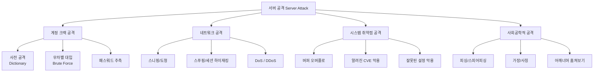
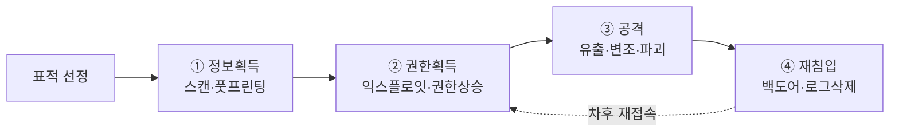

# 5강. 컴퓨터보안: 서버 보안

## 🔗 선수 지식 (Prerequisites)
- [ ] **필수**: [4강. 사이버 공격](4강.md) - 공격 유형·동기 이해 완료?
- [ ] **필수**: 클라이언트-서버 모델, TCP/IP 기본, OS의 계정/권한 관리
- [ ] **권장**: 암호화 기초([3강](3강.md)), 정보보호 3대 목표 CIA([1강](1강.md))
- **관련 단원**: [4강 사이버 공격](4강.md), [6강 네트워크 보안](6강.md)

---

## 학습 목표
1. 서버 보안의 개요를 설명할 수 있다.
2. 서버의 침입 및 정보유출 단계를 설명할 수 있다.
3. 다양한 서버 공격의 유형을 설명할 수 있다.
4. 서버 보안 대책을 설명할 수 있다.

---

## 🧠 메타인지 체크 (학습 전/후 자기 평가)

### 학습 전 자기 평가
| 소주제 | 자신감 (1-5) |
| :--- | :--- |
| 서버 보안 개요(서버/클라이언트 구조, 위협) | |
| 침입 4단계(정보획득→권한획득→공격→재침입) | |
| 공격 유형 분류(계정/네트워크/취약점/사회공학) | |
| 서버 보안 대책(계정·접근·파일·로그·관리) | |

### 학습 후 교정 (학습 완료 후 작성)
| 소주제 | 학습 전 | 학습 후 | 실제 정답률 | 과신/과소 여부 |
| :--- | :--- | :--- | :--- | :--- |
| 서버 보안 개요 | | | | |
| 침입 4단계 | | | | |
| 공격 유형 분류 | | | | |
| 서버 보안 대책 | | | | |

> **활용법**: 학습 전 1분 → 자신감 기입, 학습 후 1분 → 나머지 기입. "과신" 영역이 실제 취약점.

---

## 📝 요약 (Summary)
1. **서버-클라이언트 구조** 🔴: 일반적인 정보 시스템은 서비스를 제공하는 컴퓨터인 **서버**와 이에 접근하여 서비스를 제공받는 컴퓨터인 **클라이언트**로 구성된다. 서버는 공격의 핵심 표적이 된다.
2. **서버 침입의 4단계** 🔴: 서버에 대한 공격은 **정보획득 단계 → 권한획득 단계 → 공격 단계 → 재침입 단계**로 구성된다. 단계별로 사용되는 도구와 흔적이 다르다.
3. **서버 공격의 유형** 🔴: 정보 시스템의 결함으로 생기는 보안 허점을 활용하는 것으로, **계정 크랙 공격, 네트워크 공격, 시스템 취약점을 이용한 공격, 사회공학적인 공격** 등이 있다.
4. **서버 보안 대책** 🟡: **계정과 패스워드 보호, 시스템 접근제어, 파일 시스템 보호, 시스템 파일 설정과 관리, 운영체제의 취약점 관리, 시스템 로그 설정과 관리, 서버 관리자의 의무** 등이 필요하다.
5. **재침입(백도어)의 위험성** 🟡: 한 번 침해된 서버는 백도어·루트킷이 설치되어 재침입이 매우 용이해지므로, 사고 발생 시 단순 패치가 아닌 **시스템 재설치 수준의 대응**이 권장된다.

---

## 📐 핵심 정의 및 원리 (Key Definitions & Principles)

| 정의명 | 내용 | 키워드 |
| :--- | :--- | :--- |
| **서버(Server)** | 네트워크를 통해 클라이언트의 요청에 응답하여 서비스(웹·DB·파일·메일 등)를 제공하는 컴퓨터/소프트웨어 | 서비스 제공, 24/7 가동 |
| **클라이언트(Client)** | 서버에 접속하여 자원이나 서비스를 요청하는 컴퓨터/프로그램 | 요청자, 사용자 단말 |
| **정보획득(Reconnaissance)** | 침입 전 표적 서버의 IP·포트·OS·서비스·버전·계정명 등을 수집하는 단계 | nmap, banner grabbing, footprinting |
| **권한획득(Privilege Escalation)** | 일반 사용자 권한 또는 무권한 상태에서 **관리자(root/Administrator) 권한**을 획득하는 단계 | 익스플로잇, setuid 악용 |
| **공격(Attack)** | 획득한 권한으로 데이터를 유출·변조·파괴하거나 서비스를 방해하는 실제 피해 행위 | 데이터 유출, DoS, 변조 |
| **재침입(Re-entry)** | 차후 손쉬운 재접속을 위해 **백도어, 루트킷, 트로이목마**를 설치하여 흔적을 은닉하는 단계 | 백도어, 루트킷, 로그 삭제 |
| **계정 크랙 공격** | 사전 공격(dictionary), 무차별 대입(brute force) 등으로 ID/패스워드를 추측·탈취하는 공격 | 사전공격, 무차별대입 |
| **네트워크 공격** | 패킷 스니핑·세션 하이재킹·DoS/DDoS 등 네트워크 계층에서 서버를 위협하는 공격 | 스니핑, DDoS, 스푸핑 |
| **시스템 취약점 공격** | OS/응용프로그램의 알려진 버그(버퍼 오버플로 등)나 잘못된 설정을 악용하는 공격 | CVE, 버퍼오버플로, 패치 미적용 |
| **사회공학적 공격** | 기술이 아닌 **사람의 심리적 약점**(신뢰·권위·긴급성)을 이용해 정보를 빼내는 공격 | 피싱, 가장(impersonation), 어깨너머훔쳐보기 |
| **접근제어(Access Control)** | 주체(사용자/프로세스)가 객체(파일/자원)에 접근할 수 있는 권한을 정책에 따라 제한하는 메커니즘 | DAC, MAC, RBAC |
| **시스템 로그(System Log)** | 시스템·서비스·사용자 활동을 시간순으로 기록한 파일. 침해사고 탐지/포렌식의 핵심 증거 | syslog, auth.log, 이벤트 뷰어 |

### 주요 원리

**원리 1. 최소 권한 원칙(Principle of Least Privilege, PoLP)**
> **직관적 해석**: 사용자·프로세스·서비스에는 "자신의 업무에 꼭 필요한 최소한의 권한"만 부여한다. 권한이 작을수록 한 계정이 탈취당했을 때 피해 범위(blast radius)가 작아진다.
> **AI/실무 적용**: 모델 학습 파이프라인의 서비스 계정에 DB 전체 권한이 아닌 특정 스키마의 SELECT만 부여하는 IAM 정책 설계, sudoers 최소화.

**원리 2. 다층 방어(Defense in Depth)**
> **직관적 해석**: 단일 보안 장치(예: 방화벽)만 믿지 말고, **네트워크 → 호스트 → 응용 → 데이터** 등 여러 계층에 중첩된 통제를 둔다. 한 계층이 뚫려도 다음 계층이 막는다.
> **AI/실무 적용**: 방화벽 + IDS/IPS + OS 패치 + 응용 인증 + DB 암호화 + 로그 모니터링의 다층 구성.

---

## 📊 개념 시각화 (Visual Guide)

### 분류 체계도: 서버 공격 유형


### 침입 4단계 흐름도


### 핵심 비교표: 침입 단계별 활동·도구·방어
| 단계 | 공격자 활동 | 대표 도구/기법 | 방어 측면 통제 |
| :--- | :--- | :--- | :--- |
| ① 정보획득 | 포트/서비스/버전 스캔, 계정명 수집 | nmap, whois, banner grabbing | 불필요 포트 차단, 배너 숨김, IDS |
| ② 권한획득 | 익스플로잇 실행, 권한상승 | metasploit, 사전공격, CVE 익스플로잇 | 패치, 강한 패스워드, 권한 최소화 |
| ③ 공격 | 데이터 유출/변조, 서비스 마비 | rm, DB dump, DDoS, ransomware | 백업, 무결성 검증, IPS |
| ④ 재침입 | 백도어·루트킷 설치, 로그 위·변조 | rootkit, netcat 백도어, log wipe | 무결성 도구(tripwire), 원격 로그 |

---

## ✏️ 심화 학습 (Study Subject)

### 1. 가상 시나리오: "공격이 어디서부터 시작되어 어디서 끝나는가?"
- **상황**: A기업의 웹 서버(Linux, Apache 2.4.x)가 외부 공격을 받았다. 보안 담당자는 침입 시점부터 데이터 유출까지의 흐름을 재구성해야 한다.
- **문제**: 공격자는 어떤 순서로 어떤 활동을 했을지 4단계 모델에 매핑하고, 각 단계에서 남는 흔적과 차단 가능 지점을 찾아라.
- **해결**:
    1. **정보획득**: 공격자는 nmap으로 22/80/443 포트를 스캔하고 Apache 버전 배너를 수집 → IDS 로그에 다수의 SYN 스캔 흔적.
    2. **권한획득**: 알려진 Apache 모듈 CVE를 익스플로잇하여 `www-data` 권한으로 쉘 획득 → `apache2/error.log`에 비정상 요청 패턴.
    3. **공격**: 로컬 권한상승(setuid 악용)으로 root 권한 획득 → `/etc/passwd` 변조, 고객 DB 덤프, 외부 IP로 전송 → `auth.log`에 비정상 `sudo` 기록.
    4. **재침입**: `/usr/bin/.hidden_sshd` 백도어 설치, `last`·`wtmp` 로그 삭제 → 무결성 도구(tripwire)가 바이너리 변경 탐지.
- **AI 학습 포인트**: "각 단계에서 SIEM이 탐지할 수 있는 이상 패턴을 머신러닝 관점에서 어떻게 설계할 수 있을까? 정상 트래픽 대비 anomaly score를 어떻게 정의해야 단계별 탐지가 가능한가?"

### 2. 관점별 비교 및 오개념 분석
- **핵심 비교**: 혼동하기 쉬운 쌍을 정리한다.
    - **계정 크랙 공격 vs 사회공학적 공격**: 둘 다 결국 "계정"을 얻지만, 전자는 *기술적 추측/대입*이고 후자는 *사람을 속이는* 것이다.
    - **권한획득 vs 재침입**: 권한획득은 "처음 root가 되는" 단계, 재침입은 "다음에도 쉽게 root가 되도록 백도어를 심는" 단계.
    - **DAC vs MAC vs RBAC**: DAC는 소유자 재량, MAC는 시스템 강제 정책(보안등급), RBAC는 역할 기반.
- **오개념 분석**
    - **오개념 1**: "방화벽만 잘 설정하면 서버 보안은 끝이다."
    - **분석**: 방화벽은 네트워크 계층의 통제일 뿐, 사회공학·내부자·응용계층 취약점(SQLi, 파일업로드)·계정 크랙은 막지 못한다. **다층 방어(Defense in Depth)** 가 필요하다.
    - **오개념 2**: "공격당해도 침입 경로만 패치하면 안전하다."
    - **분석**: ④ 재침입 단계에서 백도어/루트킷이 이미 설치되었을 수 있어, **패치만으로는 부족**하고 무결성 점검·완전 재설치·자격증명 전수 교체가 필요하다.
    - **오개념 3**: "강한 패스워드만 있으면 계정 크랙은 막을 수 있다."
    - **분석**: 강한 패스워드는 필요조건일 뿐, 패스워드 재사용·피싱 유출·해시 탈취 후 오프라인 크랙·다른 사이트 유출본 활용 등 여러 벡터가 있어 **다요소 인증(MFA)** 이 권장된다.
- **AI 학습 포인트**: "AI에게 이 세 가지 오개념이 실제 사고 사례에서 어떻게 잘못된 의사결정으로 이어졌는지 사례를 들어 설명해달라고 요청해보자."

---

## ❓ 연습 문제 및 해설

> **블룸 인지 수준 범례**: [기억] 정의·나열 → [이해] 설명·비교 → [적용] 계산·구현 → [분석] 구별·디버그 → [평가] 판단·비평 → [창조] 설계·제안

> 📌 본 강의는 원본 연습문제가 제공되지 않아 학습목표·학습정리를 전체 커버하도록 10문항을 AI 출제(📌)했다.

### 📝 문제

**1. ⭐ [기억] 📌 [서버와 클라이언트의 정의](#prob-1)**
> 다음 중 일반적인 정보 시스템 구성에서 "서버"에 대한 설명으로 가장 옳은 것은?
> ① 서비스를 요청하는 컴퓨터
> ② 서비스를 제공하는 컴퓨터
> ③ 네트워크 케이블을 의미하는 장비
> ④ 사용자가 직접 조작하는 단말기

<br>

**2. ⭐ [기억] 📌 [서버 침입 4단계의 순서](#prob-2)**
> 서버에 대한 공격 단계의 순서로 가장 옳은 것은?
> ① 정보획득 → 공격 → 권한획득 → 재침입
> ② 권한획득 → 정보획득 → 공격 → 재침입
> ③ 정보획득 → 권한획득 → 공격 → 재침입
> ④ 정보획득 → 권한획득 → 재침입 → 공격

<br>

**3. ⭐⭐ [이해] 📌 [공격 유형 분류](#prob-3)**
> <보기>
>
> 가. 사전 공격(dictionary attack)
> 나. 버퍼 오버플로
> 다. 피싱(phishing)
> 라. DDoS

> 위 보기에서 "사회공학적 공격"에 해당하는 것은?
> ① 가
> ② 나
> ③ 다
> ④ 라

<br>

**4. ⭐⭐ [이해] 📌 [정보획득 단계의 활동](#prob-4)**
> 서버 침입 4단계 중 "정보획득 단계"에 해당하지 않는 활동은?
> ① 포트 스캔(nmap)
> ② 서비스 배너 수집
> ③ 운영체제 버전 탐지
> ④ 백도어 설치

<br>

**5. ⭐⭐ [적용] 📌 [공격 유형 매핑](#prob-5)**
> <보기>
>
> 가. 약한 패스워드를 무차별 대입으로 추측했다.
> 나. 알려진 CVE 익스플로잇으로 root 권한을 얻었다.
> 다. 관리자에게 IT 부서 직원을 사칭해 임시 패스워드를 받아냈다.

> 가, 나, 다를 공격 유형에 올바르게 매칭한 것은?
> ① 가-계정 크랙 / 나-시스템 취약점 / 다-사회공학
> ② 가-시스템 취약점 / 나-계정 크랙 / 다-네트워크
> ③ 가-사회공학 / 나-계정 크랙 / 다-네트워크
> ④ 가-네트워크 / 나-사회공학 / 다-시스템 취약점

<br>

**6. ⭐⭐ [이해] 📌 [재침입 단계의 목적](#prob-6)**
> 서버 침입 4단계 중 "재침입 단계"의 주 목적으로 가장 옳은 것은?
> ① 표적 서버의 OS/서비스 정보를 수집
> ② 처음으로 일반사용자 권한을 획득
> ③ 차후 손쉽게 재접속하기 위해 백도어를 설치하고 흔적을 은닉
> ④ 데이터를 처음으로 유출

<br>

**7. ⭐⭐ [분석] 📌 [서버 보안 대책의 분류](#prob-7)**
> <보기>
>
> 가. 강한 패스워드 정책과 정기적 변경
> 나. 파일 시스템 퍼미션 점검과 setuid 파일 관리
> 다. 시스템 로그 원격 수집과 무결성 보호
> 라. 운영체제 패치 자동화

> 위 보기 중 "서버의 보안관리 강화"를 위한 적절한 대책에 해당하는 것은?
> ① 가, 나
> ② 가, 나, 다
> ③ 가, 다, 라
> ④ 가, 나, 다, 라

<br>

**8. ⭐⭐⭐ [평가] 📌 [사고 대응 의사결정](#prob-8)**
> 한 웹 서버가 외부 침해를 당했음이 확인되었고, 공격자가 root 권한까지 획득했던 정황이 있다. 다음 대응 중 가장 적절한 것은?
> ① 침입 경로 취약점만 패치하고 그대로 운영을 계속한다.
> ② 관리자 패스워드만 변경한다.
> ③ 시스템을 격리한 후 무결성 점검, 백도어/루트킷 탐색, 자격증명 전수 교체, 필요 시 재설치를 수행한다.
> ④ 로그를 삭제하여 침해 흔적을 정리한다.

<br>

**9. ⭐⭐⭐ [분석] 📌 [공격과 방어의 짝짓기](#prob-9)**
> 다음 공격과 방어의 매핑 중 가장 부적절한 것은?
> ① 계정 크랙 공격 — 계정 잠금 정책과 다요소 인증(MFA)
> ② 시스템 취약점 공격 — 정기 패치와 취약점 스캐닝
> ③ 사회공학적 공격 — 사용자 보안 인식 교육과 검증 절차
> ④ 사회공학적 공격 — 방화벽 ACL 강화만으로 충분히 차단 가능

<br>

**10. ⭐⭐⭐ [창조] 📌 [보안 대책 설계](#prob-10)**
> 소규모 스타트업이 외부에 공개된 리눅스 웹 서버 1대를 운영한다. 학습정리에 제시된 "서버 보안관리 강화" 항목들을 활용해, 우선순위가 높은 대책 5가지를 골라 짧은 근거와 함께 설계하시오.

---

### 🔑 정답 및 해설 (먼저 풀어본 후 펼치기)

<details>
<summary>정답 보기 (클릭)</summary>

1. ②
2. ③
3. ③
4. ④
5. ①
6. ③
7. ④
8. ③
9. ④
10. [풀이형 정답 — 아래 해설 참고]

</details>

<details>
<summary>해설 보기 (클릭)</summary>

<a id="prob-1"></a>
**1. ⭐ [기억] 서버와 클라이언트의 정의**
> **정답: ② 서비스를 제공하는 컴퓨터**
> **해설**: 일반적인 정보 시스템은 서비스를 *제공*하는 서버와 이에 접근하여 서비스를 *제공받는* 클라이언트로 구성된다. ①은 클라이언트의 설명이다.

<a id="prob-2"></a>
**2. ⭐ [기억] 서버 침입 4단계의 순서**
> **정답: ③ 정보획득 → 권한획득 → 공격 → 재침입**
> **해설**: 표준 4단계 모델로, 정보를 모은 뒤 권한을 얻고, 권한으로 실제 공격을 수행한 다음, 차후 재접속을 위해 백도어를 심는 흐름이다.

<a id="prob-3"></a>
**3. ⭐⭐ [이해] 공격 유형 분류**
> **정답: ③ 다**
> **해설**: 피싱은 사람의 심리를 이용한 사회공학 공격이다. 사전 공격은 계정 크랙, 버퍼 오버플로는 시스템 취약점, DDoS는 네트워크 공격이다.

<a id="prob-4"></a>
**4. ⭐⭐ [이해] 정보획득 단계의 활동**
> **정답: ④ 백도어 설치**
> **해설**: 백도어 설치는 마지막 "재침입 단계"의 활동이다. ①·②·③은 모두 정보획득(reconnaissance) 단계의 정찰 활동.

<a id="prob-5"></a>
**5. ⭐⭐ [적용] 공격 유형 매핑**
> **정답: ① 가-계정 크랙 / 나-시스템 취약점 / 다-사회공학**
> **해설**: 무차별 대입은 계정 크랙, CVE 익스플로잇은 시스템 취약점 공격, 직원 사칭으로 정보 탈취는 사회공학적 공격(가장)에 해당한다.

<a id="prob-6"></a>
**6. ⭐⭐ [이해] 재침입 단계의 목적**
> **정답: ③ 차후 손쉽게 재접속하기 위해 백도어를 설치하고 흔적을 은닉**
> **해설**: 재침입 단계는 공격이 발각되어도 다시 들어오기 쉽도록 백도어·루트킷을 심고 로그를 삭제/위조하는 것이 핵심이다. ①은 정보획득, ②는 권한획득, ④는 공격 단계 활동.

<a id="prob-7"></a>
**7. ⭐⭐ [분석] 서버 보안 대책의 분류**
> **정답: ④ 가, 나, 다, 라**
> **해설**: 학습정리 4번에서 제시한 보안관리 강화 항목 — 계정/패스워드 보호, 시스템 접근제어, 파일 시스템 보호, 시스템 파일 설정·관리, 운영체제 취약점 관리, 시스템 로그 설정·관리, 서버 관리자 의무 — 에 모두 부합한다.

<a id="prob-8"></a>
**8. ⭐⭐⭐ [평가] 사고 대응 의사결정**
> **정답: ③ 시스템을 격리한 후 무결성 점검, 백도어/루트킷 탐색, 자격증명 전수 교체, 필요 시 재설치를 수행한다.**
> **해설**: 일단 root까지 뚫린 시스템은 재침입 단계에서 백도어가 심어졌을 가능성이 매우 높아 ①·②와 같은 부분 조치는 위험하다. ④는 증거인멸로 명백히 부적절. 격리→포렌식→재구성이 표준 대응이다.

<a id="prob-9"></a>
**9. ⭐⭐⭐ [분석] 공격과 방어의 짝짓기**
> **정답: ④ 사회공학적 공격 — 방화벽 ACL 강화만으로 충분히 차단 가능**
> **해설**: 사회공학적 공격은 사람을 표적으로 하므로 방화벽 같은 기술 통제로는 차단할 수 없다. 보안 인식 교육, 본인확인·검증 절차, 정책이 필수다.

<a id="prob-10"></a>
**10. ⭐⭐⭐ [창조] 보안 대책 설계 (예시 답안)**
> **정답 예시 — 우선순위 Top 5**
> 1. **운영체제·웹서버 자동 패치 관리** — 시스템 취약점 공격(가장 흔한 침입 경로) 차단. 무패치 서비스는 자동 스캐너에 즉시 노출됨.
> 2. **계정·패스워드 보호 + MFA** — 계정 크랙·자격증명 탈취 방어. 외부 노출 서버는 SSH 키 인증 + 패스워드 로그인 비활성화 권장.
> 3. **시스템 접근제어(방화벽·SSH 허용 IP 제한·최소권한 sudo)** — 외부 노출면 축소.
> 4. **파일 시스템 보호(setuid 점검, 무결성 도구 tripwire/AIDE 도입)** — 재침입 단계의 백도어·루트킷 조기 탐지.
> 5. **시스템 로그 원격 수집·보호** — 침해 발생 시 포렌식 가능. 공격자가 로그를 지워도 원격 사본 보존.

</details>

---

## ✅ O/X 확인문제 (20문항)

**1.** 서버는 클라이언트의 요청에 응답하여 서비스를 제공하는 컴퓨터이다.[(O / X)](#ox-1)
**2.** 서버 침입의 첫 단계는 권한획득 단계이다.[(O / X)](#ox-2)
**3.** 정보획득 단계에서 nmap을 이용한 포트 스캔은 흔히 사용되는 기법이다.[(O / X)](#ox-3)
**4.** 사회공학적 공격은 기술적 취약점이 아닌 사람의 심리적 약점을 이용한다.[(O / X)](#ox-4)
**5.** 버퍼 오버플로 공격은 사회공학적 공격에 속한다.[(O / X)](#ox-5)
**6.** 재침입 단계의 주요 목적은 데이터를 처음으로 유출하는 것이다.[(O / X)](#ox-6)
**7.** 사전 공격(dictionary attack)과 무차별 대입(brute force)은 모두 계정 크랙 공격에 속한다.[(O / X)](#ox-7)
**8.** DDoS는 네트워크 공격의 한 유형이다.[(O / X)](#ox-8)
**9.** 강한 패스워드만 있으면 다요소 인증(MFA)은 필요 없다.[(O / X)](#ox-9)
**10.** 시스템 로그 관리는 침해사고의 탐지와 포렌식을 위해 중요하다.[(O / X)](#ox-10)
**11.** 백도어와 루트킷은 정보획득 단계에서 가장 많이 설치된다.[(O / X)](#ox-11)
**12.** 최소 권한 원칙(PoLP)은 사용자·프로세스에게 업무에 필요한 최소한의 권한만 부여하는 원칙이다.[(O / X)](#ox-12)
**13.** 다층 방어(Defense in Depth)는 단일 보안 장치 하나에 의존하는 전략이다.[(O / X)](#ox-13)
**14.** 한 번 root까지 침해된 시스템도 단순 패치만으로 충분히 안전을 회복할 수 있다.[(O / X)](#ox-14)
**15.** 운영체제 취약점 관리에는 정기 패치와 취약점 스캐닝이 포함된다.[(O / X)](#ox-15)
**16.** 파일 시스템 보호 대책의 예로 퍼미션 점검과 setuid 파일 관리가 있다.[(O / X)](#ox-16)
**17.** 서비스 배너 숨김은 정보획득 단계의 정찰 난이도를 낮추기 위한 대책이다.[(O / X)](#ox-17)
**18.** 시스템 접근제어는 주체가 객체에 접근할 수 있는 권한을 정책에 따라 제한하는 메커니즘이다.[(O / X)](#ox-18)
**19.** 방화벽만 잘 설정하면 사회공학적 공격도 모두 차단된다.[(O / X)](#ox-19)
**20.** 서버 관리자의 보안 의식과 정기 점검은 서버 보안의 중요한 구성 요소이다.[(O / X)](#ox-20)

<details>
<summary>O/X 정답 및 해설 보기 (클릭)</summary>

> <a id="ox-1"></a>
> **1. 정답: O** — 학습정리 1번 정의 그대로.

> <a id="ox-2"></a>
> **2. 정답: X** — 첫 단계는 "정보획득"이다.

> <a id="ox-3"></a>
> **3. 정답: O** — 포트/서비스 스캔은 대표적인 정찰 기법.

> <a id="ox-4"></a>
> **4. 정답: O** — 사회공학의 정의.

> <a id="ox-5"></a>
> **5. 정답: X** — 버퍼 오버플로는 "시스템 취약점 공격"에 속한다.

> <a id="ox-6"></a>
> **6. 정답: X** — 데이터 유출은 "공격 단계", 재침입 단계는 백도어 설치·은폐가 목적.

> <a id="ox-7"></a>
> **7. 정답: O** — 둘 다 계정 크랙 공격의 하위 기법.

> <a id="ox-8"></a>
> **8. 정답: O** — DDoS는 네트워크 계층의 가용성 공격.

> <a id="ox-9"></a>
> **9. 정답: X** — 패스워드는 유출·재사용·해시 탈취 등 다양한 경로로 무력화될 수 있어 MFA가 필요하다.

> <a id="ox-10"></a>
> **10. 정답: O** — 로그는 침해사고 탐지/포렌식의 핵심 증거.

> <a id="ox-11"></a>
> **11. 정답: X** — 백도어·루트킷은 "재침입 단계"에서 설치된다.

> <a id="ox-12"></a>
> **12. 정답: O** — PoLP의 정의.

> <a id="ox-13"></a>
> **13. 정답: X** — 다층 방어는 여러 계층에 통제를 중첩시키는 전략이다.

> <a id="ox-14"></a>
> **14. 정답: X** — 백도어/루트킷이 이미 설치됐을 가능성이 커, 무결성 검증·재설치까지 고려해야 한다.

> <a id="ox-15"></a>
> **15. 정답: O** — 패치 + 스캐닝은 취약점 관리의 기본.

> <a id="ox-16"></a>
> **16. 정답: O** — 퍼미션·setuid 관리는 파일 시스템 보호의 핵심.

> <a id="ox-17"></a>
> **17. 정답: X** — 정찰 난이도를 "낮추는"이 아니라 "높이는" 대책이다. 공격자가 버전·서비스 정보를 쉽게 못 얻도록 막는 것.

> <a id="ox-18"></a>
> **18. 정답: O** — 접근제어의 정의.

> <a id="ox-19"></a>
> **19. 정답: X** — 사회공학은 사람을 표적으로 하므로 방화벽으로 막을 수 없다.

> <a id="ox-20"></a>
> **20. 정답: O** — 학습정리 4번에 "서버 관리자의 의무"가 명시되어 있다.

</details>

---

## 🧪 자유 회상 연습 (Free Recall)

> **방법**: 위의 노트를 모두 덮고, 타이머 3분 설정 후 이번 단원에서 배운 내용을 기억나는 대로 자유롭게 적으세요.
> 정확한 문장이 아니어도 됩니다. 키워드, 수식, 관계 등 떠오르는 것을 모두 적습니다.

**자유 회상 작성란:**

```
[여기에 기억나는 내용을 자유롭게 작성]


```

> **회상 후 점검**: 노트를 다시 펼쳐 빠뜨린 내용을 확인하세요. 빠뜨린 부분이 실제 취약점입니다.
> - 회상 못한 핵심 개념: [                ]
> - 회상 못한 침입 단계: [                ]
> - 회상 못한 공격 유형: [                ]

---

## 💻 코드로 확인하기 (Code Verification)

> 서버 보안은 이론·실무 중심이라 수식 검증보다 **개념 시연용 Python 스니펫**을 제시한다. 두 가지 예시: (1) 패스워드 해싱·검증, (2) 로그 이상 패턴 간단 탐지.

```python
# 예시 1: 패스워드 안전 저장 (해싱 + salt)
import hashlib, os, hmac

def hash_password(password: str, salt: bytes | None = None) -> tuple[bytes, bytes]:
    salt = salt or os.urandom(16)
    # PBKDF2-HMAC-SHA256, 적당한 반복 횟수
    pwd_hash = hashlib.pbkdf2_hmac("sha256", password.encode(), salt, 200_000)
    return salt, pwd_hash

def verify_password(password: str, salt: bytes, expected_hash: bytes) -> bool:
    _, calc = hash_password(password, salt)
    return hmac.compare_digest(calc, expected_hash)  # 타이밍 공격 방지

salt, stored = hash_password("S3cure!Pass#2026")
print("저장된 해시:", stored.hex()[:32], "...")
print("정상 검증:", verify_password("S3cure!Pass#2026", salt, stored))
print("오류 검증:", verify_password("wrong-password", salt, stored))
```

> **실행 결과 (예시)**:
> ```
> 저장된 해시: 8a3f...(생략)...
> 정상 검증: True
> 오류 검증: False
> ```
> **보안적 해석**:
> - 평문 저장 ❌, 단순 MD5/SHA1 ❌ → PBKDF2/bcrypt/argon2처럼 **느리고 솔트가 있는 해시**를 써야 사전·레인보우 테이블 공격에 강함.
> - `hmac.compare_digest`로 **타이밍 공격(timing attack)** 방지.

```python
# 예시 2: 로그에서 무차별 대입(brute force) 의심 패턴 탐지
from collections import defaultdict

logs = [
    ("2026-05-29 10:00:01", "203.0.113.5", "alice", "FAIL"),
    ("2026-05-29 10:00:02", "203.0.113.5", "alice", "FAIL"),
    ("2026-05-29 10:00:03", "203.0.113.5", "alice", "FAIL"),
    ("2026-05-29 10:00:04", "203.0.113.5", "alice", "FAIL"),
    ("2026-05-29 10:00:05", "203.0.113.5", "alice", "FAIL"),
    ("2026-05-29 10:00:06", "203.0.113.5", "alice", "SUCCESS"),  # 의심!
    ("2026-05-29 10:01:00", "198.51.100.7", "bob",  "SUCCESS"),
]

fails = defaultdict(int)
suspicious = []
for ts, ip, user, status in logs:
    key = (ip, user)
    if status == "FAIL":
        fails[key] += 1
    elif status == "SUCCESS" and fails[key] >= 5:
        suspicious.append((ts, ip, user, fails[key]))

for s in suspicious:
    print(f"⚠ 무차별 대입 의심: {s[0]} ip={s[1]} user={s[2]} 직전 실패={s[3]}회")
```

> **실행 결과 (예시)**: `⚠ 무차별 대입 의심: 2026-05-29 10:00:06 ip=203.0.113.5 user=alice 직전 실패=5회`
> **보안적 해석**: 짧은 시간 내 동일 IP·계정에서 연속 실패 뒤 성공 → 계정 크랙 공격의 전형적 시그니처. 실제 운영에서는 SIEM/Wazuh/Fail2ban이 이런 규칙을 자동화한다.

---

## 🤖 AI 연결고리 (Concept → AI Application)

| 보안 개념 | AI/ML 적용 분야 | 구체적 사례 |
| :--- | :--- | :--- |
| 침입 4단계 | 사이버 킬체인 단계별 탐지 | UEBA(사용자행위분석)로 정찰·권한상승 패턴 학습 |
| 계정 크랙 | 이상행위 탐지(anomaly detection) | 로그인 실패 시계열에 Isolation Forest/LSTM 적용 |
| 시스템 취약점 | 취약점 자동 분류·우선순위화 | CVE 설명 텍스트 분류, CVSS 예측 모델 |
| 사회공학(피싱) | NLP 기반 피싱 메일 분류 | URL·헤더·본문 특징 → 분류기(BERT 등) |
| 로그 분석 | 비정상 로그 시퀀스 탐지 | DeepLog 등 시퀀스 모델로 syslog 이상 패턴 학습 |

---

## 📖 심화 학습 예시 답안

#### 1. 서버 침입 4단계의 내부 동작 원리
공격은 단순한 "한 방"이 아니라, 정찰부터 잠복까지 이어지는 **연쇄 프로세스(킬체인)** 다.

1. **정보획득**: 공격자는 비용이 낮고 잘 들키지 않는 정찰부터 시작한다. nmap, whois, Shodan 등으로 표적의 외부 노출면을 파악. → 방어 측은 *공격자의 비대칭 정보 우위*를 줄이는 것이 목표(배너 숨김, 노출면 최소화).
2. **권한획득**: 수집된 정보에서 가장 약한 고리(예: 미패치 CVE, 약한 패스워드)를 골라 익스플로잇. 일반 사용자 → root로 권한상승.
3. **공격**: 실제 피해 발생(데이터 유출·변조·파괴, 가용성 침해). 이 단계에서 SLA·재무·법적 영향이 발생.
4. **재침입**: 공격자는 "한 번 들어온 곳은 다시 들어온다"는 점을 이용해 백도어·루트킷을 심고 로그를 위·변조. **이 단계 때문에 침해 후 부분 패치만으로는 안전이 회복되지 않는다.**

#### 2. 계정 크랙 공격 vs 사회공학적 공격 비교표
| 구분 | 계정 크랙 공격 | 사회공학적 공격 | 비고 |
| :--- | :--- | :--- | :--- |
| **표적** | 인증 시스템(자격증명 자체) | 사람(사용자·관리자·헬프데스크) | |
| **수단** | 사전공격, 무차별 대입, 자격증명 스터핑 | 피싱, 사칭, 가장, 어깨너머 훔쳐보기 | |
| **방어 핵심** | 강한 패스워드 정책, MFA, 계정 잠금, rate limit | 보안 인식 교육, 검증 절차, 정책 | |
| **AI 활용** | 로그인 실패 시계열 이상탐지 | 피싱 메일·URL NLP 분류 | |
| **검증 어려움** | 비교적 정량화 쉬움(실패율) | 정량화 어려움(인적 요소) | |

#### 3. 서버 보안 대책의 Best Practice (Bad vs Good)
- **Bad Practice (나쁜 예시)**
  ```bash
  # 모든 IP에서 SSH 22번 포트 열림 + 패스워드 인증 허용 + root 직접 로그인 허용
  # /etc/ssh/sshd_config
  PermitRootLogin yes
  PasswordAuthentication yes
  # 방화벽 규칙 없음
  ```
- **Good Practice (좋은 예시)**
  ```bash
  # /etc/ssh/sshd_config — 핵심 강화
  PermitRootLogin no                 # root 직접 로그인 금지
  PasswordAuthentication no          # 키 인증 강제
  PubkeyAuthentication yes
  MaxAuthTries 3
  AllowUsers deploy admin            # 허용 사용자 명시

  # 방화벽 (예: ufw) — 허용 IP만
  # ufw allow from 203.0.113.0/24 to any port 22
  # ufw default deny incoming
  ```
- **설명**: ① 외부 노출면 축소(허용 IP 제한), ② 인증 강화(키 + MaxAuthTries), ③ 권한 최소화(root 직접 로그인 차단)로 **다층 방어** 와 **최소 권한 원칙** 을 동시에 적용한다.

---

## 📚 핵심 용어집 (Glossary)

| 용어 (한) | 용어 (영) | 표현/예시 | 정의 |
| :--- | :--- | :--- | :--- |
| **서버** | Server | httpd, sshd | 서비스를 제공하는 컴퓨터/소프트웨어 |
| **클라이언트** | Client | 브라우저, ssh client | 서비스를 요청하는 컴퓨터/프로그램 |
| **정보획득** | Reconnaissance / Footprinting | nmap, whois | 표적의 외부 노출면을 정찰·수집 |
| **권한획득** | Privilege Escalation | setuid 악용, 커널 익스플로잇 | 일반 권한 → 관리자 권한 상승 |
| **재침입** | Persistence / Re-entry | 백도어, cron 백도어 | 차후 재접속을 위한 흔적 은닉 + 영구화 |
| **계정 크랙** | Credential Cracking | brute force, dictionary | 자격증명을 추측·탈취하는 공격 (→ [4강](4강.md)) |
| **사회공학** | Social Engineering | 피싱, 가장 | 사람의 심리적 약점을 이용한 공격 (→ [4강](4강.md)) |
| **백도어** | Backdoor | netcat listener | 정상 인증을 우회해 재접속할 수 있는 통로 |
| **루트킷** | Rootkit | kernel rootkit | 자신과 다른 악성 프로세스의 존재를 은폐 |
| **접근제어** | Access Control | DAC/MAC/RBAC | 주체-객체 간 권한 정책 |
| **최소 권한** | Least Privilege (PoLP) | sudoers 최소화 | 업무에 필요한 최소 권한만 부여 |
| **다층 방어** | Defense in Depth | 방화벽+IDS+패치+로그 | 여러 계층에 통제를 중첩 |
| **다요소 인증** | MFA (Multi-Factor Authentication) | OTP, FIDO2 | 두 종류 이상의 인증 요소 결합 (→ [3강](3강.md) 인증) |
| **시스템 로그** | System Log | syslog, auth.log | 시스템·사용자 활동 기록(포렌식 핵심) |

---

## 🤖 AI 학습 파트너를 위한 추가 자료

### 1. 개념 이해를 위한 심층 질문 프롬프트
> **프롬프트 예시**: "서버 침입의 4단계(정보획득 → 권한획득 → 공격 → 재침입)를 '도둑이 한 집을 터는 과정'에 비유해서 설명해줘. 각 단계에서 집주인(=서버 관리자)이 취할 수 있는 대응을 함께 짝지어 설명해줘. 추가로, 이 4단계 모델이 록히드마틴의 사이버 킬체인(Cyber Kill Chain) 7단계 모델과 어떻게 대응되는지도 알려줘."

### 2. 문제 해결 능력 강화를 위한 시나리오 프롬프트
> **프롬프트 예시**: "당신은 신생 SaaS 스타트업의 1인 보안 담당자입니다. 외부에 공개된 Linux 웹 서버 1대와 내부 DB 서버 1대가 있고, 예산은 매우 제한적입니다. 이 환경에서 '계정 크랙, 네트워크 공격, 시스템 취약점, 사회공학적 공격' 4가지 유형을 모두 어느 정도 방어하기 위한 우선순위 5가지 보안 통제를 비용 대비 효과 순으로 제안하고, 각 통제가 어느 공격 유형의 어느 침입 단계를 차단하는지 매핑해줘."

### 3. 사례 검증·반박 프롬프트
> **프롬프트 예시**: "다음 주장을 비판적으로 검토해줘.
> '우리 회사는 외부에 공개된 서버가 없고 VPN 안에 모든 자원이 있으니 사회공학적 공격을 제외한 외부 공격은 신경 쓰지 않아도 된다.'
> 1. 이 주장에 어떤 가정이 깔려 있는지 분석하고,
> 2. 실제 침해 사례(예: 내부망 측면이동, VPN 자격증명 탈취)에 비추어 어떤 점이 위험한지 지적하고,
> 3. 다층 방어 관점에서 보강해야 할 통제를 제시해줘."

---

## 🔄 복습 체크 (Spaced Repetition)
- [ ] 1일 후 복습 (날짜: 2026-05-30)
- [ ] 3일 후 복습 (날짜: 2026-06-01)
- [ ] 7일 후 복습 (날짜: 2026-06-05)
- [ ] 14일 후 복습 (날짜: 2026-06-12)
- [ ] 30일 후 복습 (날짜: 2026-06-28)

### 복습 시 자가 평가
| 회차 | 날짜 | 이해도 (1-5) | 취약 부분 메모 |
| :--- | :--- | :--- | :--- |
| 1차 | | | |
| 2차 | | | |
| 3차 | | | |

---

## 📚 참고 자료 (References)

- KNOU 교재 — 컴퓨터보안 5강(서버 보안) 본문 및 학습정리
- 록히드마틴 *Cyber Kill Chain* 모델 (정찰·무기화·전달·익스플로잇·설치·C2·목표행동)
- MITRE ATT&CK Framework — Reconnaissance / Initial Access / Privilege Escalation / Persistence 카테고리
- NIST SP 800-123 *Guide to General Server Security*
- OWASP Top 10 (응용계층 취약점 부분 참고)
