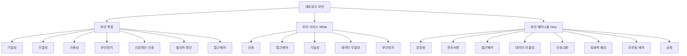
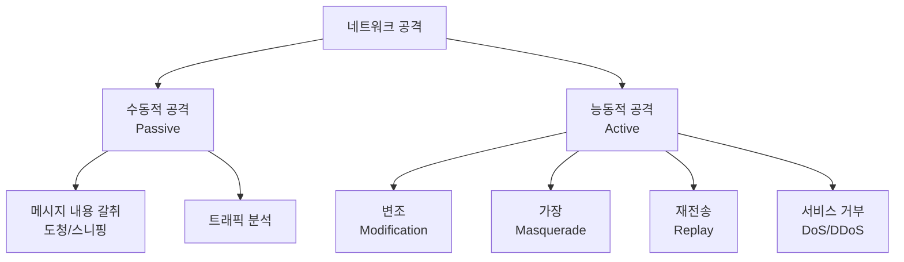

# 6강. 컴퓨터보안: 네트워크 보안

## 🔗 선수 지식 (Prerequisites)
- [ ] **필수**: [5강. 서버 보안](5강.md) - 서버 침입·공격 유형 이해 완료?
- [ ] **필수**: TCP/IP 4계층 모델(링크-인터넷-전송-응용), IP/TCP/UDP 헤더 개념
- [ ] **권장**: 암호화 기초([3강](3강.md)), 정보보호 3대 목표 CIA([1강](1강.md)), 전자서명·인증
- **관련 단원**: [5강 서버 보안](5강.md), [4강 사이버 공격](4강.md), [3강 암호화](3강.md)

---

## 학습 목표
1. 네트워크 보안의 개요를 설명할 수 있다.
2. 네트워크 보안의 목표를 설명할 수 있다.
3. 네트워크 보안 모델을 설명할 수 있다.
4. TCP/IP 보안을 설명할 수 있다.

---

## 🧠 메타인지 체크 (학습 전/후 자기 평가)

### 학습 전 자기 평가
| 소주제 | 자신감 (1-5) |
| :--- | :--- |
| 네트워크 보안 개요(통신회선상 정보 보호) | |
| 네트워크 보안 목표(기밀성·무결성·가용성·부인방지 등) | |
| 네트워크 보안 모델(서비스·메커니즘, X.800) | |
| TCP/IP 보안(IPsec, SSL/TLS) | |

### 학습 후 교정 (학습 완료 후 작성)
| 소주제 | 학습 전 | 학습 후 | 실제 정답률 | 과신/과소 여부 |
| :--- | :--- | :--- | :--- | :--- |
| 네트워크 보안 개요 | | | | |
| 네트워크 보안 목표 | | | | |
| 네트워크 보안 모델 | | | | |
| TCP/IP 보안 | | | | |

> **활용법**: 학습 전 1분 → 자신감 기입, 학습 후 1분 → 나머지 기입. "과신" 영역이 실제 취약점.

---

## 📝 요약 (Summary)
1. **네트워크 보안의 목적** 🔴: 네트워크 보안의 목적은 **통신회선상의 정보를 보호**할 수 있는 방법을 찾는 것이다. 컴퓨터 네트워크는 정보교환의 편리한 창구이지만 불특정 다수의 접근을 허용해 침입자에 의한 보안사고 위험을 내포한다.
2. **네트워크 보안의 목표** 🔴: **기밀성, 무결성, 가용성, 부인방지, 사용자의 신분확인 및 인증, 데이터 발신처 확인, 접근제어** 등이다.
3. **네트워크 보안 서비스** 🔴: **인증, 접근제어, 기밀성, 데이터 무결성, 부인방지** 등이 있다. (ITU-T X.800 보안 서비스)
4. **네트워크 보안 메커니즘** 🔴: **암호화, 전자서명, 접근제어, 데이터 무결성, 인증교환, 트래픽 패딩, 라우팅 제어, 공증** 등이 있다.
5. **TCP/IP 보안** 🟡: TCP/IP 보안을 위해 **IPsec**(인터넷 계층)과 **SSL/TLS**(전송 계층)가 있다.

---

## 📐 핵심 정의 및 원리 (Key Definitions & Principles)

| 정의명 | 내용 | 키워드 |
| :--- | :--- | :--- |
| **네트워크 보안** | 통신회선(전송 매체)상에서 오가는 정보를 도청·변조·위조·차단으로부터 보호하는 활동 | 통신회선, 전송 중 보호 |
| **기밀성(Confidentiality)** | 인가되지 않은 자에게 정보가 노출되지 않도록 보장. 전송 중 도청(스니핑)으로부터 보호 | 암호화, 도청 방지 |
| **무결성(Integrity)** | 전송 중 데이터가 인가 없이 변조·삭제·삽입되지 않았음을 보장 | 변조 탐지, 해시/MAC |
| **가용성(Availability)** | 인가된 사용자가 필요할 때 정보·서비스에 접근할 수 있도록 보장. DoS/DDoS의 표적 | 서비스 연속성, DoS 방어 |
| **인증(Authentication)** | 통신 상대방(개체)이 주장하는 신원이 맞는지 확인하는 서비스 | 개체 인증, 데이터 발신처 인증 |
| **부인방지(Non-repudiation)** | 송신/수신 사실을 사후에 부인하지 못하도록 증거를 남기는 서비스 | 발신 부인방지, 수신 부인방지, 전자서명 |
| **접근제어(Access Control)** | 네트워크 자원에 대한 접근 권한을 정책에 따라 제한 | 인가, 권한 정책 |
| **보안 서비스(Security Service)** | 보안 목표를 달성하기 위해 제공되는 기능(인증·접근제어·기밀성·무결성·부인방지) | X.800, 무엇을 제공하나 |
| **보안 메커니즘(Security Mechanism)** | 보안 서비스를 실제로 구현하는 수단(암호화·전자서명·트래픽 패딩 등) | 어떻게 구현하나 |
| **트래픽 패딩(Traffic Padding)** | 트래픽 분석을 막기 위해 의미 없는 더미 데이터를 삽입해 트래픽 양·패턴을 은폐 | 트래픽 분석 방어 |
| **공증(Notarization)** | 신뢰할 수 있는 제3자(TTP)가 통신의 무결성·발신 사실 등을 보증 | 신뢰된 제3자 |
| **IPsec** | 인터넷(IP) 계층에서 패킷 단위로 인증·기밀성을 제공하는 보안 프로토콜 (AH, ESP) | IP 계층, VPN, AH/ESP |
| **SSL/TLS** | 전송 계층에서 응용 데이터의 기밀성·무결성·인증을 제공하는 프로토콜 (HTTPS의 기반) | 전송 계층, HTTPS, 핸드셰이크 |

### 주요 원리

**원리 1. 수동적 공격 vs 능동적 공격 (Passive vs Active Attack)**
> **직관적 해석**: 통신회선 위협은 두 부류다. **수동적 공격**은 *내용 갈취(도청)·트래픽 분석*처럼 정보를 "엿보기만" 하므로 탐지가 어렵지만 **암호화로 예방** 가능하다. **능동적 공격**은 *변조·재전송·가장·서비스 거부(DoS)*처럼 데이터·서비스를 "건드리는" 것으로 완전 예방은 어렵고 **탐지·복구**에 중점을 둔다.
> **AI/실무 적용**: 수동적 공격은 TLS 암호화로 예방, 능동적 공격은 IDS/IPS·이상탐지 모델로 탐지하는 식의 역할 분담.

**원리 2. 서비스 ↔ 메커니즘 매핑 (X.800 보안 구조)**
> **직관적 해석**: "무엇을 보장할까(서비스)"와 "어떻게 보장할까(메커니즘)"는 다르다. 예컨대 **기밀성 서비스**는 *암호화 메커니즘*으로, **부인방지 서비스**는 *전자서명 + 공증 메커니즘*으로 구현된다. 하나의 서비스가 여러 메커니즘을, 하나의 메커니즘이 여러 서비스를 떠받칠 수 있다.
> **AI/실무 적용**: 보안 요구사항(서비스)을 먼저 정의하고 구현 기술(메커니즘)을 선택하는 보안 설계 사고법.

---

## 📊 개념 시각화 (Visual Guide)

### 분류 체계도: 네트워크 보안 목표·서비스·메커니즘


### 공격 유형 분류도 (통신회선 위협)


### TCP/IP 계층과 보안 프로토콜 매핑
| TCP/IP 계층 | 대표 프로토콜 | 보안 프로토콜 | 보호 범위 |
| :--- | :--- | :--- | :--- |
| 응용 계층 | HTTP, FTP, SMTP | S/MIME, PGP, SET | 응용별 종단 데이터 |
| 전송 계층 | TCP, UDP | **SSL/TLS** | 응용 데이터(소켓 단위) |
| 인터넷 계층 | IP, ICMP | **IPsec (AH, ESP)** | IP 패킷 전체(투명) |
| 링크 계층 | Ethernet | WPA2/3, 링크 암호화 | 물리 구간(hop-by-hop) |

### 보안 서비스 ↔ 메커니즘 매핑표
| 보안 서비스 | 주요 구현 메커니즘 | 달성하는 목표 |
| :--- | :--- | :--- |
| 인증 | 암호화, 전자서명, 인증교환 | 신분확인·발신처 확인 |
| 접근제어 | 접근제어 목록(ACL), 권한정책 | 접근제어 |
| 기밀성 | 암호화, 라우팅 제어, 트래픽 패딩 | 기밀성 |
| 데이터 무결성 | 암호화, 전자서명, 무결성 검사값(MAC/해시) | 무결성 |
| 부인방지 | 전자서명, 공증 | 부인방지 |

---

## ✏️ 심화 학습 (Study Subject)

### 1. 가상 시나리오: "공개 와이파이에서 로그인은 안전한가?"
- **상황**: 사용자가 카페 공용 와이파이로 쇼핑몰에 로그인한다. 같은 와이파이에 공격자가 패킷 스니퍼(Wireshark)를 켜두고 있다.
- **문제**: ① 평문(HTTP) 전송이면 어떤 보안 목표가 깨지는가? ② 어떤 보안 서비스·메커니즘으로, 어느 TCP/IP 계층에서 막아야 하는가?
- **해결**:
    1. 평문이면 ID/PW가 **기밀성** 붕괴(수동적 공격: 내용 갈취). 공격자가 세션을 가로채 변조하면 **무결성**, 사용자를 사칭하면 **인증**도 붕괴.
    2. **기밀성 서비스 → 암호화 메커니즘**을 **전송 계층**에서 적용 = **TLS(HTTPS)**. 서버 인증서로 서버를 **인증**하고, 핸드셰이크로 세션 키를 교환해 이후 트래픽을 암호화·MAC으로 보호.
    3. 전사적 원격접속이라면 **인터넷 계층의 IPsec VPN**으로 IP 패킷 전체를 터널링해 보호할 수도 있다(범위·투명성 차이).
- **AI 학습 포인트**: "TLS 핸드셰이크에서 키 교환에 쓰이는 (EC)DHE가 '순방향 비밀성(Forward Secrecy)'을 어떻게 보장하는지, 그리고 서버 개인키가 후에 유출돼도 과거 트래픽이 안전한 이유를 설명해줘."

### 2. 관점별 비교 및 오개념 분석
- **핵심 비교**: 혼동하기 쉬운 쌍을 정리한다.
    - **보안 서비스 vs 보안 메커니즘**: 서비스는 "무엇을 제공하나(기밀성·무결성…)", 메커니즘은 "어떻게 구현하나(암호화·전자서명…)".
    - **IPsec vs SSL/TLS**: IPsec은 *인터넷(IP) 계층* — 응용에 투명, IP 패킷 전체 보호, VPN에 적합. TLS는 *전송 계층* — 응용이 소켓을 통해 사용, 웹(HTTPS)에 적합.
    - **수동적 공격 vs 능동적 공격**: 전자는 도청·트래픽분석(예방 중심), 후자는 변조·재전송·가장·DoS(탐지·복구 중심).
    - **무결성 vs 기밀성**: 무결성은 "안 바뀌었나", 기밀성은 "안 새었나". 암호화는 기밀성을 주지만, 그 자체로 무결성을 보장하지는 않는다(MAC 별도 필요).
- **오개념 분석**
    - **오개념 1**: "데이터를 암호화하면 무결성도 자동으로 보장된다."
    - **분석**: 암호화는 *기밀성*을 위한 것이다. 암호문도 비트 변조(특히 스트림 암호/CTR)될 수 있고, 복호화는 여전히 성공할 수 있다. 무결성은 **MAC·해시·전자서명**으로 별도 보장해야 한다(그래서 AEAD가 둘을 결합).
    - **오개념 2**: "IPsec과 SSL/TLS는 같은 계층의 경쟁 기술이라 하나만 알면 된다."
    - **분석**: 둘은 **다른 계층**(IPsec=인터넷 계층, TLS=전송 계층)에서 동작하며 보호 범위·투명성이 다르다. 함께 쓰일 수도 있다.
    - **오개념 3**: "부인방지는 인증만 잘하면 자동으로 된다."
    - **분석**: 인증은 "지금 상대가 누구인지" 확인이고, 부인방지는 "나중에 한 행위를 부인하지 못하게" 하는 것이다. 대칭키 MAC은 인증·무결성은 주지만 키를 양측이 공유하므로 **제3자에 대한 부인방지는 불가** — 송신자만의 개인키로 서명하는 **전자서명**이 필요하다.
- **AI 학습 포인트**: "암호화·MAC·전자서명이 각각 기밀성/무결성/인증/부인방지 중 어떤 목표를 충족하고 못 하는지 표로 정리하고, AEAD(예: AES-GCM)가 왜 등장했는지 설명해줘."

---

## ❓ 연습 문제 및 해설

> **블룸 인지 수준 범례**: [기억] 정의·나열 → [이해] 설명·비교 → [적용] 계산·구현 → [분석] 구별·디버그 → [평가] 판단·비평 → [창조] 설계·제안

> 📌 본 강의는 원본 연습문제가 제공되지 않아 학습목표·학습정리를 전체 커버하도록 10문항을 AI 출제(📌)했다.

### 📝 문제

**1. ⭐ [기억] 📌 [네트워크 보안의 목적](#prob-1)**
> 네트워크 보안의 가장 근본적인 목적으로 가장 옳은 것은?
> ① 컴퓨터의 처리 속도를 높이는 것
> ② 통신회선상의 정보를 보호하는 방법을 찾는 것
> ③ 네트워크 케이블을 물리적으로 교체하는 것
> ④ 데이터베이스의 저장 용량을 늘리는 것

<br>

**2. ⭐ [기억] 📌 [네트워크 보안의 목표](#prob-2)**
> 다음 중 학습정리에서 제시한 네트워크 보안의 "목표"에 해당하지 않는 것은?
> ① 기밀성
> ② 무결성
> ③ 부인방지
> ④ 코드 컴파일 최적화

<br>

**3. ⭐⭐ [이해] 📌 [보안 서비스 vs 보안 메커니즘](#prob-3)**
> <보기>
>
> 가. 암호화
> 나. 기밀성
> 다. 전자서명
> 라. 부인방지

> 위 보기에서 "보안 메커니즘"에 해당하는 것만 모두 고른 것은?
> ① 가, 다
> ② 나, 라
> ③ 가, 나
> ④ 다, 라

<br>

**4. ⭐⭐ [이해] 📌 [보안 메커니즘의 종류](#prob-4)**
> 다음 중 네트워크 보안 메커니즘으로 볼 수 없는 것은?
> ① 트래픽 패딩
> ② 라우팅 제어
> ③ 공증(notarization)
> ④ 서비스 거부(DoS)

<br>

**5. ⭐⭐ [적용] 📌 [목표-메커니즘 매핑](#prob-5)**
> <보기>
>
> 가. 메시지를 송신자의 개인키로 서명하여 발신 사실을 부인하지 못하게 한다.
> 나. 데이터를 암호화하여 도청으로부터 보호한다.
> 다. 의미 없는 더미 트래픽을 섞어 트래픽 분석을 방해한다.

> 가, 나, 다가 주로 달성하는 보안 목표를 올바르게 짝지은 것은?
> ① 가-부인방지 / 나-기밀성 / 다-기밀성(트래픽 흐름 비밀)
> ② 가-기밀성 / 나-무결성 / 다-가용성
> ③ 가-무결성 / 나-부인방지 / 다-인증
> ④ 가-가용성 / 나-기밀성 / 다-부인방지

<br>

**6. ⭐⭐ [이해] 📌 [수동적 공격과 능동적 공격](#prob-6)**
> 다음 중 "수동적 공격(passive attack)"에 해당하는 것은?
> ① 메시지 변조(modification)
> ② 트래픽 분석(traffic analysis)
> ③ 재전송(replay)
> ④ 서비스 거부(DoS)

<br>

**7. ⭐⭐ [분석] 📌 [TCP/IP 보안 프로토콜의 계층](#prob-7)**
> IPsec과 SSL/TLS가 동작하는 TCP/IP 계층을 올바르게 짝지은 것은?
> ① IPsec-전송 계층 / SSL·TLS-인터넷 계층
> ② IPsec-인터넷 계층 / SSL·TLS-전송 계층
> ③ IPsec-응용 계층 / SSL·TLS-링크 계층
> ④ IPsec-링크 계층 / SSL·TLS-응용 계층

<br>

**8. ⭐⭐⭐ [평가] 📌 [기밀성과 무결성의 구분](#prob-8)**
> "전송 데이터를 암호화했으니 변조 여부는 신경 쓰지 않아도 된다"는 주장에 대한 평가로 가장 옳은 것은?
> ① 옳다. 암호화는 무결성을 자동으로 보장한다.
> ② 옳다. 암호문은 절대 변조되지 않는다.
> ③ 틀리다. 암호화는 기밀성을 위한 것이며, 무결성은 MAC·해시·전자서명으로 별도 보장해야 한다.
> ④ 틀리다. 암호화는 가용성만 보장하기 때문이다.

<br>

**9. ⭐⭐⭐ [분석] 📌 [보안 서비스-메커니즘 매핑의 오류 찾기](#prob-9)**
> 다음 "보안 서비스 — 구현 메커니즘" 매핑 중 가장 부적절한 것은?
> ① 기밀성 — 암호화
> ② 데이터 무결성 — 무결성 검사값(MAC/해시)
> ③ 부인방지 — 전자서명, 공증
> ④ 부인방지 — 트래픽 패딩만으로 충분히 달성 가능

<br>

**10. ⭐⭐⭐ [창조] 📌 [네트워크 보안 설계](#prob-10)**
> 한 기업이 본사-지사 간 인터넷을 통해 내부 시스템에 안전하게 접속하게 하고, 동시에 외부 고객에게는 웹 서비스를 안전하게 제공하려 한다. 학습정리의 보안 목표·서비스·메커니즘과 TCP/IP 보안(IPsec, SSL/TLS)을 활용해, 두 요구사항 각각에 적합한 기술을 선택하고 그 근거(보호 범위·계층·달성 목표)를 설명하시오.

---

### 🔑 정답 및 해설 (먼저 풀어본 후 펼치기)

<details>
<summary>정답 보기 (클릭)</summary>

1. ②
2. ④
3. ①
4. ④
5. ①
6. ②
7. ②
8. ③
9. ④
10. [풀이형 정답 — 아래 해설 참고]

</details>

<details>
<summary>해설 보기 (클릭)</summary>

<a id="prob-1"></a>
**1. ⭐ [기억] 네트워크 보안의 목적**
> **정답: ② 통신회선상의 정보를 보호하는 방법을 찾는 것**
> **해설**: 학습정리 1번 그대로. 네트워크 보안의 목적은 전송 중(통신회선상)의 정보를 보호하는 것이다. ①·③·④는 보안과 무관한 성능/하드웨어/용량 이슈.

<a id="prob-2"></a>
**2. ⭐ [기억] 네트워크 보안의 목표**
> **정답: ④ 코드 컴파일 최적화**
> **해설**: 학습정리 2번의 목표는 기밀성·무결성·가용성·부인방지·신분확인 및 인증·데이터 발신처 확인·접근제어다. 컴파일 최적화는 보안 목표가 아니다.

<a id="prob-3"></a>
**3. ⭐⭐ [이해] 보안 서비스 vs 보안 메커니즘**
> **정답: ① 가, 다**
> **해설**: 암호화·전자서명은 "어떻게 구현하나"인 **메커니즘**이다. 기밀성·부인방지는 "무엇을 제공하나"인 **서비스/목표**다.

<a id="prob-4"></a>
**4. ⭐⭐ [이해] 보안 메커니즘의 종류**
> **정답: ④ 서비스 거부(DoS)**
> **해설**: DoS는 보안을 무너뜨리는 *공격*이다. 학습정리 4번의 메커니즘은 암호화·전자서명·접근제어·데이터 무결성·인증교환·트래픽 패딩·라우팅 제어·공증이다.

<a id="prob-5"></a>
**5. ⭐⭐ [적용] 목표-메커니즘 매핑**
> **정답: ① 가-부인방지 / 나-기밀성 / 다-기밀성(트래픽 흐름 비밀)**
> **해설**: 개인키 전자서명은 부인방지, 암호화는 기밀성, 트래픽 패딩은 트래픽 분석을 막아 흐름의 기밀성을 보호한다.

<a id="prob-6"></a>
**6. ⭐⭐ [이해] 수동적 공격과 능동적 공격**
> **정답: ② 트래픽 분석(traffic analysis)**
> **해설**: 수동적 공격은 정보를 엿보기만 하는 도청·트래픽 분석이다. 변조·재전송·DoS는 데이터/서비스를 건드리는 능동적 공격이다.

<a id="prob-7"></a>
**7. ⭐⭐ [분석] TCP/IP 보안 프로토콜의 계층**
> **정답: ② IPsec-인터넷 계층 / SSL·TLS-전송 계층**
> **해설**: IPsec은 IP(인터넷) 계층에서 패킷을 보호(AH/ESP)하며 응용에 투명하다. SSL/TLS는 전송 계층에서 동작하여 HTTPS 등 응용 데이터를 보호한다.

<a id="prob-8"></a>
**8. ⭐⭐⭐ [평가] 기밀성과 무결성의 구분**
> **정답: ③ 틀리다. 암호화는 기밀성을 위한 것이며, 무결성은 MAC·해시·전자서명으로 별도 보장해야 한다.**
> **해설**: 암호문도 비트 변조가 가능하며 복호화가 성공할 수 있다. 기밀성과 무결성은 별개의 목표로, AEAD(AES-GCM 등)처럼 둘을 결합하거나 MAC을 함께 써야 한다.

<a id="prob-9"></a>
**9. ⭐⭐⭐ [분석] 보안 서비스-메커니즘 매핑의 오류 찾기**
> **정답: ④ 부인방지 — 트래픽 패딩만으로 충분히 달성 가능**
> **해설**: 트래픽 패딩은 트래픽 분석을 막는(기밀성 보조) 메커니즘이다. 부인방지는 전자서명·공증으로 달성한다. ①·②·③은 올바른 매핑.

<a id="prob-10"></a>
**10. ⭐⭐⭐ [창조] 네트워크 보안 설계 (예시 답안)**
> **정답 예시**
> - **본사-지사 간 내부 시스템 접속 → IPsec VPN (인터넷 계층)**: 사이트 간 모든 IP 트래픽을 응용에 투명하게 터널링·암호화. ESP로 기밀성+무결성, IKE로 상호 인증/키 교환. 다수 내부 프로토콜을 일괄 보호해야 하므로 패킷 전체를 감싸는 IPsec이 적합.
> - **외부 고객 대상 웹 서비스 → SSL/TLS (HTTPS, 전송 계층)**: 브라우저 호환성과 종단 인증을 위해 TLS 사용. 서버 인증서로 서버를 인증(중간자 방지), 핸드셰이크로 세션 키 교환, 이후 트래픽의 기밀성·무결성 보장.
> - **공통 보안 목표 매핑**: 기밀성(암호화), 무결성(MAC/해시), 인증(인증서·IKE), 접근제어(방화벽·허용 IP), 부인방지(필요 시 전자서명/감사 로그).

</details>

---

## ✅ O/X 확인문제 (20문항)

**1.** 네트워크 보안의 목적은 통신회선상의 정보를 보호하는 방법을 찾는 것이다.[(O / X)](#ox-1)
**2.** 기밀성, 무결성, 가용성은 네트워크 보안의 목표에 포함된다.[(O / X)](#ox-2)
**3.** 부인방지는 송신·수신 사실을 사후에 부인하지 못하도록 하는 것이다.[(O / X)](#ox-3)
**4.** 보안 "서비스"는 보안 목표를 구현하는 구체적 수단(암호화 등)을 의미한다.[(O / X)](#ox-4)
**5.** 암호화, 전자서명, 트래픽 패딩, 공증은 모두 보안 메커니즘에 속한다.[(O / X)](#ox-5)
**6.** 트래픽 패딩은 트래픽 분석 공격을 어렵게 만드는 메커니즘이다.[(O / X)](#ox-6)
**7.** 도청(스니핑)과 트래픽 분석은 능동적 공격에 속한다.[(O / X)](#ox-7)
**8.** 메시지 변조·재전송·가장·서비스 거부는 능동적 공격이다.[(O / X)](#ox-8)
**9.** 수동적 공격은 탐지가 어렵지만 암호화로 예방할 수 있다.[(O / X)](#ox-9)
**10.** IPsec은 인터넷(IP) 계층에서 동작하는 보안 프로토콜이다.[(O / X)](#ox-10)
**11.** SSL/TLS는 전송 계층에서 응용 데이터를 보호한다.[(O / X)](#ox-11)
**12.** IPsec과 SSL/TLS는 동일한 계층에서 동작하는 동일 기술이다.[(O / X)](#ox-12)
**13.** 데이터 암호화는 기밀성을 제공하지만 그 자체로 무결성을 보장하지는 않는다.[(O / X)](#ox-13)
**14.** 부인방지는 일반적으로 송신자의 개인키를 이용한 전자서명으로 달성한다.[(O / X)](#ox-14)
**15.** 접근제어는 네트워크 자원에 대한 접근 권한을 정책에 따라 제한하는 서비스다.[(O / X)](#ox-15)
**16.** 인증 서비스에는 개체 인증과 데이터 발신처 인증이 포함된다.[(O / X)](#ox-16)
**17.** 공증(notarization)은 신뢰할 수 있는 제3자가 통신 사실을 보증하는 메커니즘이다.[(O / X)](#ox-17)
**18.** 라우팅 제어는 안전한 경로를 선택해 기밀성을 보조하는 메커니즘이다.[(O / X)](#ox-18)
**19.** HTTPS는 HTTP에 SSL/TLS를 적용한 것이다.[(O / X)](#ox-19)
**20.** 가용성은 인가된 사용자가 필요할 때 정보·서비스에 접근할 수 있도록 보장하는 목표이며 DoS의 표적이 된다.[(O / X)](#ox-20)

<details>
<summary>O/X 정답 및 해설 보기 (클릭)</summary>

> <a id="ox-1"></a>
> **1. 정답: O** — 학습정리 1번 그대로.

> <a id="ox-2"></a>
> **2. 정답: O** — 셋 다 보안 목표(CIA)에 포함.

> <a id="ox-3"></a>
> **3. 정답: O** — 부인방지의 정의.

> <a id="ox-4"></a>
> **4. 정답: X** — 구체적 수단은 "메커니즘"이다. 서비스는 "무엇을 제공하나"(인증·기밀성 등).

> <a id="ox-5"></a>
> **5. 정답: O** — 학습정리 4번 메커니즘 목록에 모두 포함.

> <a id="ox-6"></a>
> **6. 정답: O** — 더미 트래픽으로 트래픽 양·패턴을 은폐.

> <a id="ox-7"></a>
> **7. 정답: X** — 도청·트래픽 분석은 "수동적 공격"이다.

> <a id="ox-8"></a>
> **8. 정답: O** — 데이터·서비스를 건드리는 능동적 공격.

> <a id="ox-9"></a>
> **9. 정답: O** — 수동적 공격은 예방(암호화) 중심, 능동적 공격은 탐지·복구 중심.

> <a id="ox-10"></a>
> **10. 정답: O** — IPsec은 IP(인터넷) 계층 프로토콜(AH/ESP).

> <a id="ox-11"></a>
> **11. 정답: O** — TLS는 전송 계층에서 동작.

> <a id="ox-12"></a>
> **12. 정답: X** — 서로 다른 계층(IPsec=인터넷, TLS=전송)에서 동작하며 보호 범위가 다르다.

> <a id="ox-13"></a>
> **13. 정답: O** — 무결성은 MAC·해시·전자서명으로 별도 보장해야 한다.

> <a id="ox-14"></a>
> **14. 정답: O** — 송신자만의 개인키 서명으로 제3자 부인방지가 가능.

> <a id="ox-15"></a>
> **15. 정답: O** — 접근제어의 정의.

> <a id="ox-16"></a>
> **16. 정답: O** — 인증은 개체 인증 + 데이터 발신처 인증을 포함.

> <a id="ox-17"></a>
> **17. 정답: O** — 공증은 신뢰된 제3자(TTP)에 의한 보증.

> <a id="ox-18"></a>
> **18. 정답: O** — 라우팅 제어는 안전한 경로 선택으로 기밀성을 보조.

> <a id="ox-19"></a>
> **19. 정답: O** — HTTPS = HTTP over SSL/TLS.

> <a id="ox-20"></a>
> **20. 정답: O** — 가용성의 정의이며 DoS/DDoS의 주 표적.

</details>

---

## 🧪 자유 회상 연습 (Free Recall)

> **방법**: 위의 노트를 모두 덮고, 타이머 3분 설정 후 이번 단원에서 배운 내용을 기억나는 대로 자유롭게 적으세요.
> 정확한 문장이 아니어도 됩니다. 키워드, 수식, 관계 등 떠오르는 것을 모두 적습니다.

**자유 회상 작성란:**

```
[여기에 기억나는 내용을 자유롭게 작성]


```

> **회상 후 점검**: 노트를 다시 펼쳐 빠뜨린 내용을 확인하세요. 빠뜨린 부분이 실제 취약점입니다.
> - 회상 못한 보안 목표: [                ]
> - 회상 못한 보안 메커니즘: [                ]
> - 회상 못한 TCP/IP 보안 프로토콜: [                ]

---

## 💻 코드로 확인하기 (Code Verification)

> 네트워크 보안은 이론 중심이라 수식 검증보다 **개념 시연용 Python 스니펫**을 제시한다. 두 가지: (1) 무결성 검증을 위한 HMAC, (2) 기밀성 vs 무결성의 분리 시연.

```python
# 예시 1: 메시지 무결성·인증을 위한 HMAC (메커니즘: 데이터 무결성/인증교환)
import hmac, hashlib

key = b"shared-secret-key"          # 송수신자가 공유하는 비밀 키
message = b"transfer 1000 to bob"

# 송신측: 메시지 + MAC 전송
tag = hmac.new(key, message, hashlib.sha256).hexdigest()
print("전송 MAC:", tag[:16], "...")

# 수신측: 동일 키로 재계산하여 비교 (타이밍 공격 방지)
def verify(msg, recv_tag):
    calc = hmac.new(key, msg, hashlib.sha256).hexdigest()
    return hmac.compare_digest(calc, recv_tag)

print("정상 검증:", verify(b"transfer 1000 to bob", tag))
print("변조 검증:", verify(b"transfer 9999 to eve", tag))  # 무결성 위반 탐지
```

> **실행 결과 (예시)**:
> ```
> 전송 MAC: 3b1c... 
> 정상 검증: True
> 변조 검증: False
> ```
> **보안적 해석**: MAC은 **무결성 + (대칭키 기반) 인증**을 제공한다. 단, 키를 양측이 공유하므로 *제3자에 대한 부인방지*는 불가 — 그건 전자서명의 몫이다.

```python
# 예시 2: "암호화만으로는 무결성이 보장되지 않는다" 시연 (스트림/XOR 가정)
# 한 글자 위치의 암호문 비트를 뒤집으면 평문도 그 위치만 바뀌고 복호화는 그대로 성공
key_stream = bytes([0x11, 0x22, 0x33, 0x44])
plain = bytes([0x41, 0x42, 0x43, 0x44])  # "ABCD"

cipher = bytes(p ^ k for p, k in zip(plain, key_stream))
# 공격자가 cipher[3] 비트를 변조 (키를 몰라도 변조 가능)
tampered = bytearray(cipher); tampered[3] ^= 0xFF
decrypted = bytes(c ^ k for c, k in zip(tampered, key_stream))

print("원본 평문 :", plain)
print("변조 후 복호:", decrypted, "→ 복호화는 성공하지만 내용이 바뀜!")
```

> **실행 결과 (예시)**: `변조 후 복호: b'ABC\xbb' → 복호화는 성공하지만 내용이 바뀜!`
> **보안적 해석**: 암호화(기밀성)만으로는 **무결성**을 보장하지 못한다. 그래서 TLS/IPsec은 암호화에 더해 MAC(또는 AEAD)을 함께 사용한다.

---

## 🤖 AI 연결고리 (Concept → AI Application)

| 보안 개념 | AI/ML 적용 분야 | 구체적 사례 |
| :--- | :--- | :--- |
| 수동적/능동적 공격 | 네트워크 침입탐지(NIDS) | 패킷 특징으로 정상/공격 트래픽 분류(RF, XGBoost) |
| 트래픽 분석 | 암호화 트래픽 분류 | 패킷 크기·타이밍만으로 앱/행위 추론(딥러닝) |
| 무결성/이상탐지 | 시계열 이상탐지 | 트래픽 볼륨에 LSTM/Autoencoder로 DDoS 조기 탐지 |
| 인증/접근제어 | 행위기반 인증(UEBA) | 로그인 패턴 학습으로 비정상 접속 차단 |
| 부인방지/로그 | 보안 로그 분석(SIEM) | 로그 시퀀스 모델(DeepLog)로 공격 단계 추적 |

---

## 📖 심화 학습 예시 답안

#### 1. 네트워크 보안 서비스가 메커니즘으로 구현되는 원리
보안 설계는 "목표 → 서비스 → 메커니즘"의 하향식으로 사고한다.

1. **목표 정의**: 무엇을 지킬지(기밀성·무결성·가용성·부인방지…)를 먼저 정한다.
2. **서비스 선택**: 목표를 달성할 X.800 서비스(인증·접근제어·기밀성·무결성·부인방지)를 고른다.
3. **메커니즘 구현**: 서비스를 실제 기술로 구현한다. 예) 기밀성 → 암호화, 무결성 → MAC/전자서명, 부인방지 → 전자서명+공증, 트래픽 흐름 비밀 → 트래픽 패딩+라우팅 제어.
4. **계층 배치**: 보호 범위에 맞는 TCP/IP 계층에 배치한다(전 구간 IP 보호 → IPsec, 웹 종단 → TLS).

#### 2. IPsec vs SSL/TLS 비교표
| 구분 | IPsec | SSL/TLS | 비고 |
| :--- | :--- | :--- | :--- |
| **동작 계층** | 인터넷(IP) 계층 | 전송 계층 | 보호 범위가 다름 |
| **보호 대상** | IP 패킷 전체(투명) | 소켓 단위 응용 데이터 | |
| **응용 수정 필요성** | 불필요(투명) | 응용이 TLS 소켓 사용 | |
| **대표 용도** | VPN, 사이트 간 터널 | HTTPS, 메일, 웹 | |
| **주요 구성요소** | AH(인증), ESP(암호화+인증), IKE(키교환) | 핸드셰이크 + 레코드 프로토콜 | |
| **제공 목표** | 기밀성·무결성·인증 | 기밀성·무결성·인증 | 둘 다 부인방지는 별도 |

#### 3. 안전한 통신 채널 구성 Best Practice (Bad vs Good)
- **Bad Practice (나쁜 예시)**
  ```text
  # 웹 로그인 폼을 평문 HTTP로 전송
  http://shop.example.com/login   (POST id, pw 평문)
  # → 같은 네트워크의 공격자가 스니핑으로 자격증명 탈취(기밀성 붕괴)
  ```
- **Good Practice (좋은 예시)**
  ```text
  # 1) 전 구간 HTTPS 강제 (TLS, 전송 계층)
  https://shop.example.com/login
  # 2) HSTS로 평문 다운그레이드 차단
  Strict-Transport-Security: max-age=31536000; includeSubDomains
  # 3) 최신 TLS 버전·AEAD 스위트 사용(예: TLS 1.3, AES-GCM)
  # 4) 본사-지사 내부망은 IPsec VPN(인터넷 계층)으로 일괄 보호
  ```
- **설명**: 기밀성·무결성·인증을 **적절한 계층(전송=TLS, 인터넷=IPsec)** 에서 제공하고, AEAD로 기밀성+무결성을 함께 달성하며, HSTS로 능동적 다운그레이드 공격을 차단한다.

---

## 📚 핵심 용어집 (Glossary)

| 용어 (한) | 용어 (영) | 표현/예시 | 정의 |
| :--- | :--- | :--- | :--- |
| **네트워크 보안** | Network Security | TLS, IPsec | 통신회선상의 정보를 보호하는 활동 |
| **기밀성** | Confidentiality | 암호화 | 인가되지 않은 노출 방지 (→ [1강](1강.md)) |
| **무결성** | Integrity | MAC, 해시 | 인가 없는 변조 방지 (→ [1강](1강.md)) |
| **가용성** | Availability | DoS 방어 | 필요 시 접근 보장 (→ [1강](1강.md)) |
| **인증** | Authentication | 인증서, IKE | 상대 개체·발신처 신원 확인 (→ [3강](3강.md)) |
| **부인방지** | Non-repudiation | 전자서명 | 행위 사실을 부인 못하게 함 |
| **접근제어** | Access Control | ACL, RBAC | 자원 접근 권한 제한 (→ [5강](5강.md)) |
| **보안 서비스** | Security Service | X.800 | 보안 목표 달성 기능(무엇을) |
| **보안 메커니즘** | Security Mechanism | 암호화·서명 | 서비스 구현 수단(어떻게) |
| **트래픽 패딩** | Traffic Padding | 더미 패킷 | 트래픽 분석 방어 |
| **공증** | Notarization | TTP | 신뢰된 제3자의 보증 |
| **수동적 공격** | Passive Attack | 스니핑 | 도청·트래픽 분석(예방 중심) |
| **능동적 공격** | Active Attack | 변조·재전송 | 변조·가장·DoS(탐지 중심) (→ [4강](4강.md)) |
| **IPsec** | IP Security | AH, ESP, IKE | IP 계층 패킷 보안 프로토콜 |
| **SSL/TLS** | Transport Layer Security | HTTPS | 전송 계층 보안 프로토콜 |

---

## 🤖 AI 학습 파트너를 위한 추가 자료

### 1. 개념 이해를 위한 심층 질문 프롬프트
> **프롬프트 예시**: "네트워크 보안의 '서비스'와 '메커니즘'의 차이를 '음식점에서 제공하는 서비스(무엇)'와 '주방의 조리 방법(어떻게)'에 비유해서 설명해줘. 그리고 ITU-T X.800이 정의한 5가지 보안 서비스와 8가지 메커니즘이 어떻게 매핑되는지 표로 정리해줘."

### 2. 문제 해결 능력 강화를 위한 시나리오 프롬프트
> **프롬프트 예시**: "당신은 보안 아키텍트입니다. ① 본사-지사 간 내부 트래픽 보호와 ② 외부 고객 대상 웹 서비스 보호라는 두 요구사항이 있을 때, IPsec과 SSL/TLS 중 각각 무엇을 선택할지, 동작 계층·보호 범위·투명성·운영 비용 관점에서 비교하고 최종 선택의 기술적 근거를 설명해줘."

### 3. 개념 검증·반박 프롬프트
> **프롬프트 예시**: "다음 주장을 비판적으로 검토해줘.
> '데이터를 강력하게 암호화하기만 하면 기밀성·무결성·인증·부인방지가 모두 자동으로 보장된다.'
> 1. 암호화·MAC·전자서명이 각각 어떤 보안 목표를 충족하고 못 하는지 구분하고,
> 2. 이 주장이 어디서 틀렸는지 지적하고,
> 3. AEAD(AES-GCM 등)가 왜 등장했는지 설명해줘."

---

## 🔄 복습 체크 (Spaced Repetition)
- [ ] 1일 후 복습 (날짜: 2026-05-30)
- [ ] 3일 후 복습 (날짜: 2026-06-01)
- [ ] 7일 후 복습 (날짜: 2026-06-05)
- [ ] 14일 후 복습 (날짜: 2026-06-12)
- [ ] 30일 후 복습 (날짜: 2026-06-28)

### 복습 시 자가 평가
| 회차 | 날짜 | 이해도 (1-5) | 취약 부분 메모 |
| :--- | :--- | :--- | :--- |
| 1차 | | | |
| 2차 | | | |
| 3차 | | | |

---

## 📚 참고 자료 (References)

- KNOU 교재 — 컴퓨터보안 6강(네트워크 보안) 본문 및 학습정리
- ITU-T X.800 *Security Architecture for OSI* — 보안 서비스·메커니즘 분류
- W. Stallings, *Cryptography and Network Security* — 수동적/능동적 공격, X.800 보안 구조
- RFC 4301 *Security Architecture for the Internet Protocol* (IPsec), RFC 8446 *TLS 1.3*
- NIST SP 800-77 *Guide to IPsec VPNs*, SP 800-52 *Guidelines for TLS*
