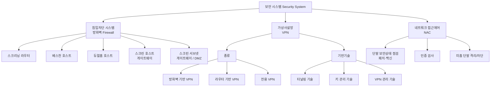

# 7강. 컴퓨터보안: 보안 시스템 I

## 🔗 선수 지식 (Prerequisites)
- [ ] **필수**: [6강. 네트워크 보안](6강.md) - 네트워크 위협·프로토콜 이해 완료?
- [ ] **필수**: TCP/IP 계층 구조, IP/포트/패킷 개념, 라우터·게이트웨이 역할
- [ ] **권장**: 사이버 공격 유형([4강](4강.md)), 암호화·인증 기초([3강](3강.md)), 정보보호 3대 목표 CIA([1강](1강.md))
- **관련 단원**: [6강 네트워크 보안](6강.md), [8강 보안 시스템 II](8강.md)

---

## 학습 목표
1. 보안 시스템의 개요를 설명할 수 있다.
2. 침입차단 시스템의 개념과 주요 내용을 설명할 수 있다.
3. 가상사설망의 개념과 주요 내용을 설명할 수 있다.
4. 네트워크 접근제어 시스템에 대해 설명할 수 있다.

---

## 🧠 메타인지 체크 (학습 전/후 자기 평가)

### 학습 전 자기 평가
| 소주제 | 자신감 (1-5) |
| :--- | :--- |
| 보안 시스템 개요(공격 진화, 시스템 필요성) | |
| 침입차단 시스템(방화벽)의 목적·구축 형태 5종 | |
| 가상사설망(VPN)의 개념·종류·기반기술 | |
| 네트워크 접근제어(NAC)의 개념·동작 | |

### 학습 후 교정 (학습 완료 후 작성)
| 소주제 | 학습 전 | 학습 후 | 실제 정답률 | 과신/과소 여부 |
| :--- | :--- | :--- | :--- | :--- |
| 보안 시스템 개요 | | | | |
| 침입차단 시스템 | | | | |
| 가상사설망(VPN) | | | | |
| 네트워크 접근제어(NAC) | | | | |

> **활용법**: 학습 전 1분 → 자신감 기입, 학습 후 1분 → 나머지 기입. "과신" 영역이 실제 취약점.

---

## 📝 요약 (Summary)
1. **보안 시스템의 필요성** 🟡: 웜·피싱 등 사이버 공격이 진화·증가하고 악성코드와 결합된 형태도 등장함에 따라, 새로운 악성코드·공격을 **탐지하고 방지하기 위해** 다양한 보안 시스템이 개발되고 있다.
2. **침입차단 시스템(방화벽)** 🔴: 주 목적은 네트워크 **외부→내부, 내부→외부 접근을 정책적으로 제어**하는 것이다. 신뢰 네트워크와 비신뢰 네트워크 사이의 단일 통과 지점(choke point) 역할을 한다.
3. **방화벽 구축 형태** 🔴: **스크리닝 라우터, 베스천 호스트, 듀얼홈 호스트, 스크린 호스트 게이트웨이, 스크린 서브넷 게이트웨이** 등이 있다. 뒤로 갈수록 구조가 복잡하고 방어가 견고해진다.
4. **가상사설망(VPN)** 🔴: 인터넷이나 ISP의 **공중망(public network)을 자사의 WAN 백본처럼** 사용할 수 있게 해 주는 기술이다. 공중망 위에 암호화된 사설 통로(터널)를 만든다.
5. **VPN의 종류** 🟡: 크게 **방화벽 기반 VPN, 라우터 기반 VPN, 전용 VPN** 등으로 나뉜다.
6. **VPN 기반기술** 🔴: **터널링 기술, 키 관리 기술, VPN 관리 기술**이 3대 기반기술이다.
7. **네트워크 접근제어(NAC)** 🔴: **패치가 제대로 안 됐거나 인증을 제대로 거치지 않은 장치**의 네트워크 접근을 통제하는 시스템이다. 단말의 보안 상태(무결성)를 점검해 접속을 허용/격리한다.

---

## 📐 핵심 정의 및 원리 (Key Definitions & Principles)

| 정의명 | 내용 | 키워드 |
| :--- | :--- | :--- |
| **보안 시스템** | 진화하는 악성코드·사이버 공격을 탐지하고 방지하기 위해 개발된 하드웨어·소프트웨어 체계의 총칭 | 탐지, 방지, 다계층 |
| **침입차단 시스템(방화벽)** | 신뢰 네트워크(내부)와 비신뢰 네트워크(외부) 사이에서 트래픽을 **정책에 따라 허용/차단**하는 시스템 | 접근제어, choke point, 정책 |
| **스크리닝 라우터** | 라우터가 IP/TCP/UDP 헤더(주소·포트)를 보고 패킷을 필터링하는 가장 단순한 형태 | 패킷 필터링, 라우터 |
| **베스천 호스트(Bastion Host)** | 내부망과 외부망 사이에 위치해 모든 트래픽이 거치도록 **요새화(hardening)** 한 전용 호스트 | 요새, 프록시, 로깅 |
| **듀얼홈 호스트(Dual-homed Host)** | **두 개 이상의 네트워크 인터페이스(NIC)** 를 가진 베스천 호스트. IP 라우팅(포워딩)을 차단해 직접 통신을 끊고 프록시로만 중계 | 2개 NIC, 라우팅 차단 |
| **스크린 호스트 게이트웨이** | 스크리닝 라우터 + 베스천 호스트를 **결합**한 형태. 라우터가 1차 필터링, 베스천 호스트가 응용 게이트웨이 역할 | 라우터+베스천, 2중 |
| **스크린 서브넷 게이트웨이** | 내부망과 외부망 사이에 **완충 지대(DMZ)** 를 두고 2개의 스크리닝 라우터로 감싸는 가장 견고한 형태 | DMZ, 2개 라우터, 완충 |
| **가상사설망(VPN)** | 공중망(인터넷) 위에 암호화 터널을 만들어 **사설 전용망처럼** 안전하게 통신하게 하는 기술 | 공중망, 터널, 사설망 |
| **터널링(Tunneling)** | 한 프로토콜 패킷을 다른 프로토콜로 **캡슐화**하여 공중망을 통과시키는 기술. VPN의 핵심 | 캡슐화, IPSec, L2TP |
| **네트워크 접근제어(NAC)** | 네트워크 접속을 시도하는 단말의 **보안 상태(패치·백신·인증)** 를 점검해 접근을 통제하는 시스템 | 단말 무결성, 격리, 인증 |

### 주요 원리

**원리 1. 단일 통과 지점(Single Choke Point)과 정책 기반 통제**
> **직관적 해석**: 방화벽은 내부·외부 사이의 모든 트래픽이 반드시 거쳐 가는 "성문" 역할을 한다. 통로를 하나로 모아야 그 지점에 정책·로깅·감시를 집중할 수 있다. 우회로가 많으면 방화벽은 무력화된다.
> **실무 적용**: 모든 외부 연결을 방화벽/프록시로 강제하고, 직접 인터넷 연결(rogue AP, 모뎀)을 금지하는 정책.

**원리 2. 다층 방어(Defense in Depth)와 비무장지대(DMZ)**
> **직관적 해석**: 외부에 공개해야 하는 서버(웹·메일)는 내부망에 직접 두지 않고, 외부망과 내부망 사이의 **완충 지대(DMZ)** 에 배치한다. DMZ 서버가 뚫려도 내부망까지 한 번에 도달하지 못하게 한다.
> **실무 적용**: 스크린 서브넷 게이트웨이 구성에서 공개 서버는 DMZ, 핵심 DB는 내부망에 두고 2중 라우터로 분리. (→ [5강](5강.md) 다층 방어 원칙과 연결)

---

## 📊 개념 시각화 (Visual Guide)

### 분류 체계도: 7강 보안 시스템 전체 구조


### 방화벽 구축 형태의 발전 (단순 → 견고)


### 핵심 비교표: 방화벽 구축 형태
| 형태 | 핵심 구성 | 동작 계층 | 보안 강도 | 특징 |
| :--- | :--- | :--- | :--- | :--- |
| 스크리닝 라우터 | 라우터 1대 | 네트워크/전송 | 낮음 | 주소·포트 기반 패킷 필터링, 빠르지만 로깅·인증 빈약 |
| 베스천 호스트 | 요새화 호스트 1대 | 응용 | 중 | 프록시·로깅 집중, 단일 장애·표적점 위험 |
| 듀얼홈 호스트 | 2 NIC 호스트 | 응용 | 중상 | IP 포워딩 차단으로 직접 통신 단절, 프록시 필수 |
| 스크린 호스트 게이트웨이 | 라우터 + 베스천 | 네트워크+응용 | 상 | 1차 패킷필터 + 2차 응용 게이트웨이, 흔히 사용 |
| 스크린 서브넷 게이트웨이 | 라우터 2대 + DMZ | 다계층 | 매우 상 | 완충지대(DMZ)로 내·외부 완전 분리, 구축 복잡 |

---

## ✏️ 심화 학습 (Study Subject)

### 1. 가상 시나리오: "어떤 보안 시스템을, 언제 배치해야 할까?"
- **상황**: B기업은 외부에 공개하는 웹·메일 서버와, 절대 외부 노출되면 안 되는 고객 DB·내부 ERP를 함께 운영한다. 또한 재택근무자가 외부에서 내부 자원에 접속해야 하고, 사내에는 노트북·BYOD 단말이 자유롭게 네트워크에 연결된다.
- **문제**: 공개 서버 침해가 내부망으로 번지는 것을 막고, 외부 원격접속을 안전하게 하며, 패치 안 된 단말의 사내망 접속을 막으려면 어떤 보안 시스템을 어떻게 조합해야 하는가?
- **해결**:
    1. **스크린 서브넷 게이트웨이(DMZ)**: 웹·메일 서버는 DMZ에 배치하고 2개 라우터로 감싸, 공개 서버가 뚫려도 내부 DB/ERP까지 직접 도달하지 못하게 한다.
    2. **VPN**: 재택근무자는 인터넷이라는 공중망 위에 **터널링**으로 암호화 통로를 만들어 내부 자원에 접속 → 전용선 없이도 사설망 수준의 기밀성 확보.
    3. **NAC**: 사내망에 연결하는 모든 단말의 **패치 상태·백신·인증**을 점검해, 미흡한 단말은 격리망(remediation VLAN)으로 보내 패치 후에만 정상 접속을 허용.
- **AI 학습 포인트**: "방화벽 로그(허용/차단 트래픽), VPN 접속 로그, NAC 단말 상태 데이터를 통합해 SIEM에서 이상행위를 탐지하려면, 어떤 특징(feature)을 뽑아 어떤 머신러닝 모델(지도/비지도)로 anomaly score를 정의해야 할까?"

### 2. 관점별 비교 및 오개념 분석
- **핵심 비교**: 혼동하기 쉬운 쌍을 정리한다.
    - **스크리닝 라우터 vs 베스천 호스트**: 전자는 *네트워크 계층에서 헤더(주소·포트)* 만 보고 필터링, 후자는 *응용 계층에서 콘텐츠·세션* 까지 검사·중계.
    - **듀얼홈 호스트 vs 스크린 호스트 게이트웨이**: 전자는 *한 호스트가 2개 NIC로* 내·외부를 잇되 라우팅 차단, 후자는 *라우터 + 베스천 호스트 2개 장비* 의 결합.
    - **스크린 호스트 게이트웨이 vs 스크린 서브넷 게이트웨이**: 후자는 추가로 **DMZ(완충 서브넷)** 와 **2개의 스크리닝 라우터** 를 둬 분리가 한 단계 더 강하다.
    - **VPN vs 방화벽**: VPN은 *기밀 통로(암호화)* 를 만드는 것이고, 방화벽은 *통과 여부(접근제어)* 를 결정하는 것 — 목적이 다르다.
- **오개념 분석**
    - **오개념 1**: "방화벽만 설치하면 내부에서 외부로 나가는 트래픽은 신경 쓸 필요 없다."
    - **분석**: 방화벽의 목적은 외부→내부뿐 아니라 **내부→외부 접근도 정책적으로 제어**하는 것이다. 내부 감염 단말이 외부 C2 서버와 통신하거나 데이터를 유출하는 것을 막으려면 아웃바운드 통제도 필수다.
    - **오개념 2**: "VPN을 쓰면 인터넷이 아닌 별도의 전용 회선을 깔아야 한다."
    - **분석**: VPN의 핵심 가치는 **기존 공중망(인터넷)을 자사 WAN 백본처럼** 쓰는 데 있다. 물리 전용선 없이 터널링·암호화로 사설망 효과를 내므로 오히려 비용을 절감한다.
    - **오개념 3**: "NAC는 외부 공격자를 막는 방화벽의 일종이다."
    - **분석**: NAC는 외부 트래픽 차단이 아니라, **네트워크에 접속하려는 단말(주로 내부·BYOD)** 의 패치·인증·보안 상태를 점검해 접근을 통제하는 시스템이다. 초점이 '단말의 무결성'에 있다.
- **AI 학습 포인트**: "AI에게 '방화벽·VPN·NAC가 각각 막지 못하는 공격은 무엇인지'를 표로 정리하고, 세 시스템을 함께 써야 다층 방어가 완성되는 이유를 설명해달라고 요청해보자."

---

## ❓ 연습 문제 및 해설

> **블룸 인지 수준 범례**: [기억] 정의·나열 → [이해] 설명·비교 → [적용] 계산·구현 → [분석] 구별·디버그 → [평가] 판단·비평 → [창조] 설계·제안

> 📌 본 강의는 원본 연습문제가 제공되지 않아 학습목표·학습정리를 전체 커버하도록 10문항을 AI 출제(📌)했다.

### 📝 문제

**1. ⭐ [기억] 📌 [침입차단 시스템의 주 목적](#prob-1)**
> 침입차단 시스템(방화벽)의 주 목적으로 가장 옳은 것은?
> ① 암호 키를 생성·분배하는 것
> ② 네트워크 외부↔내부 접근을 정책적으로 제어하는 것
> ③ 단말의 백신 패턴을 자동 갱신하는 것
> ④ 디스크의 데이터를 백업하는 것

<br>

**2. ⭐ [기억] 📌 [방화벽 구축 형태 나열](#prob-2)**
> 다음 중 방화벽의 구축 형태에 해당하지 않는 것은?
> ① 스크리닝 라우터
> ② 베스천 호스트
> ③ 스크린 서브넷 게이트웨이
> ④ 레인보우 테이블

<br>

**3. ⭐⭐ [이해] 📌 [VPN의 개념](#prob-3)**
> 가상사설망(VPN)에 대한 설명으로 가장 옳은 것은?
> ① 물리적 전용 회선을 새로 포설해야만 구성할 수 있다.
> ② 인터넷 등 공중망을 자사의 WAN 백본처럼 사용할 수 있게 해 준다.
> ③ 단말의 패치 상태를 점검해 접속을 통제하는 시스템이다.
> ④ 외부에서 내부로의 패킷을 주소 기반으로만 필터링한다.

<br>

**4. ⭐⭐ [이해] 📌 [VPN 기반기술 분류](#prob-4)**
> <보기>
>
> 가. 터널링 기술
> 나. 키 관리 기술
> 다. VPN 관리 기술
> 라. 디스크 조각모음 기술

> 위 보기에서 VPN 구성의 3대 기반기술에 해당하는 것을 모두 고른 것은?
> ① 가, 나
> ② 가, 나, 다
> ③ 나, 다, 라
> ④ 가, 나, 다, 라

<br>

**5. ⭐⭐ [이해] 📌 [듀얼홈 호스트의 특징](#prob-5)**
> 듀얼홈 호스트(Dual-homed Host) 방화벽의 핵심 특징으로 가장 옳은 것은?
> ① 두 개 이상의 네트워크 인터페이스를 가지며 IP 라우팅(포워딩)을 차단한다.
> ② 라우터 한 대로 주소·포트만 보고 패킷을 필터링한다.
> ③ 완충 지대(DMZ)를 두 개의 라우터로 감싼다.
> ④ 단말의 인증 상태를 점검해 격리한다.

<br>

**6. ⭐⭐ [이해] 📌 [NAC의 역할](#prob-6)**
> 네트워크 접근제어(NAC) 시스템의 역할로 가장 옳은 것은?
> ① 공중망 위에 암호화 터널을 생성한다.
> ② 패치·인증이 제대로 안 된 장치의 네트워크 접근을 통제한다.
> ③ 두 라우터 사이에 DMZ를 구성한다.
> ④ 데이터를 압축해 전송 속도를 높인다.

<br>

**7. ⭐⭐ [적용] 📌 [보안 시스템 매핑](#prob-7)**
> <보기>
>
> 가. 재택근무자가 인터넷을 통해 본사 내부망에 안전하게 접속하게 한다.
> 나. 공개 웹 서버를 내부망과 분리된 완충 지대에 배치한다.
> 다. 백신·패치가 미흡한 노트북의 사내망 접속을 격리한다.

> 가·나·다에 가장 적합한 보안 시스템을 올바르게 매칭한 것은?
> ① 가-VPN / 나-스크린 서브넷(DMZ) / 다-NAC
> ② 가-NAC / 나-VPN / 다-방화벽
> ③ 가-DMZ / 나-NAC / 다-VPN
> ④ 가-방화벽 / 나-VPN / 다-DMZ

<br>

**8. ⭐⭐⭐ [분석] 📌 [방화벽 형태의 보안 강도 순서](#prob-8)**
> 방화벽 구축 형태를 일반적으로 보안 강도가 낮은 것에서 높은 순으로 가장 옳게 나열한 것은?
> ① 스크린 서브넷 게이트웨이 → 스크린 호스트 게이트웨이 → 스크리닝 라우터
> ② 스크리닝 라우터 → 스크린 호스트 게이트웨이 → 스크린 서브넷 게이트웨이
> ③ 베스천 호스트 → 스크리닝 라우터 → 듀얼홈 호스트
> ④ 스크린 서브넷 게이트웨이 → 스크리닝 라우터 → 베스천 호스트

<br>

**9. ⭐⭐⭐ [평가] 📌 [잘못된 설명 고르기](#prob-9)**
> 다음 보안 시스템에 대한 설명 중 가장 부적절한 것은?
> ① 방화벽은 내부→외부로 나가는 트래픽도 정책적으로 제어할 수 있다.
> ② VPN의 핵심 기반기술 중 하나는 패킷을 캡슐화하는 터널링이다.
> ③ NAC는 단말의 보안 상태와 무관하게 모든 장치의 접속을 무조건 허용한다.
> ④ 스크린 서브넷 게이트웨이는 DMZ를 두어 내부망과 외부망을 분리한다.

<br>

**10. ⭐⭐⭐ [창조] 📌 [중소기업 보안 시스템 설계](#prob-10)**
> 외부 공개 웹 서버 1대, 내부 DB 서버 1대, 재택근무자 5명, 사내 BYOD 노트북 다수를 운영하는 중소기업이 있다. 7강에서 학습한 방화벽 구축 형태·VPN·NAC를 활용하여, 우선순위가 높은 보안 시스템 구성 방안을 각 시스템이 어떤 위협을 막는지 근거와 함께 설계하시오.

---

### 🔑 정답 및 해설 (먼저 풀어본 후 펼치기)

<details>
<summary>정답 보기 (클릭)</summary>

1. ②
2. ④
3. ②
4. ②
5. ①
6. ②
7. ①
8. ②
9. ③
10. [풀이형 정답 — 아래 해설 참고]

</details>

<details>
<summary>해설 보기 (클릭)</summary>

<a id="prob-1"></a>
**1. ⭐ [기억] 침입차단 시스템의 주 목적**
> **정답: ② 네트워크 외부↔내부 접근을 정책적으로 제어하는 것**
> **해설**: 학습정리 그대로, 방화벽의 주 목적은 외부에서 내부로의 접근과 내부에서 외부로의 접근을 정책적으로 제어하는 것이다. ①은 키 관리, ③은 NAC/백신, ④는 백업의 역할.

<a id="prob-2"></a>
**2. ⭐ [기억] 방화벽 구축 형태 나열**
> **정답: ④ 레인보우 테이블**
> **해설**: 방화벽 구축 형태는 스크리닝 라우터, 베스천 호스트, 듀얼홈 호스트, 스크린 호스트 게이트웨이, 스크린 서브넷 게이트웨이다. 레인보우 테이블은 패스워드 해시 크래킹에 쓰이는 자료구조로 방화벽과 무관하다.

<a id="prob-3"></a>
**3. ⭐⭐ [이해] VPN의 개념**
> **정답: ② 인터넷 등 공중망을 자사의 WAN 백본처럼 사용할 수 있게 해 준다.**
> **해설**: VPN은 공중망 위에 암호화 터널을 만들어 사설 전용망처럼 쓰게 한다. ①은 오개념(전용선 불필요), ③은 NAC, ④는 스크리닝 라우터의 설명.

<a id="prob-4"></a>
**4. ⭐⭐ [이해] VPN 기반기술 분류**
> **정답: ② 가, 나, 다**
> **해설**: VPN 구성의 3대 기반기술은 터널링 기술, 키 관리 기술, VPN 관리 기술이다. '라. 디스크 조각모음'은 무관하다.

<a id="prob-5"></a>
**5. ⭐⭐ [이해] 듀얼홈 호스트의 특징**
> **정답: ① 두 개 이상의 네트워크 인터페이스를 가지며 IP 라우팅(포워딩)을 차단한다.**
> **해설**: 듀얼홈 호스트는 내·외부에 각각 연결된 2개 이상의 NIC를 갖되, IP 포워딩을 끊어 직접 통신을 막고 프록시로만 중계한다. ②는 스크리닝 라우터, ③은 스크린 서브넷, ④는 NAC.

<a id="prob-6"></a>
**6. ⭐⭐ [이해] NAC의 역할**
> **정답: ② 패치·인증이 제대로 안 된 장치의 네트워크 접근을 통제한다.**
> **해설**: 학습정리 그대로 NAC의 정의다. ①은 VPN(터널링), ③은 스크린 서브넷, ④는 압축 기술의 설명.

<a id="prob-7"></a>
**7. ⭐⭐ [적용] 보안 시스템 매핑**
> **정답: ① 가-VPN / 나-스크린 서브넷(DMZ) / 다-NAC**
> **해설**: 원격 안전 접속은 VPN, 공개 서버의 완충 지대 분리는 스크린 서브넷 게이트웨이(DMZ), 단말 보안상태 점검·격리는 NAC가 담당한다.

<a id="prob-8"></a>
**8. ⭐⭐⭐ [분석] 방화벽 형태의 보안 강도 순서**
> **정답: ② 스크리닝 라우터 → 스크린 호스트 게이트웨이 → 스크린 서브넷 게이트웨이**
> **해설**: 단순 패킷 필터링(스크리닝 라우터)에서, 라우터+베스천 결합(스크린 호스트 게이트웨이), DMZ와 2개 라우터로 분리한 스크린 서브넷 게이트웨이 순으로 구조가 복잡해지고 방어가 견고해진다.

<a id="prob-9"></a>
**9. ⭐⭐⭐ [평가] 잘못된 설명 고르기**
> **정답: ③ NAC는 단말의 보안 상태와 무관하게 모든 장치의 접속을 무조건 허용한다.**
> **해설**: NAC는 오히려 단말의 패치·인증·보안 상태를 점검해 미흡한 장치의 접근을 통제(격리/차단)하는 시스템이므로 ③은 정의와 정반대다. ①·②·④는 모두 옳은 설명.

<a id="prob-10"></a>
**10. ⭐⭐⭐ [창조] 중소기업 보안 시스템 설계 (예시 답안)**
> **정답 예시 — 우선순위 구성안**
> 1. **경계 방화벽 + 스크린 서브넷(DMZ)**: 공개 웹 서버는 DMZ에 배치하고 2개 라우터(또는 방화벽 인터페이스)로 내부망과 분리 → 웹 서버 침해가 내부 DB로 번지는 측면이동(lateral movement)을 차단.
> 2. **내부 DB 서버는 내부망 최심부에 배치 + 아웃바운드 통제**: 외부 직접 접근 차단, 내부→외부 비정상 통신(데이터 유출·C2)도 방화벽으로 제어.
> 3. **VPN 도입**: 재택근무자 5명은 인터넷을 통해 VPN 터널로만 내부 자원에 접속하게 하여 도청·세션 탈취를 방지. 키 관리·VPN 관리 정책 포함.
> 4. **NAC 도입**: 사내 BYOD 노트북은 접속 시 패치·백신·인증 상태를 점검, 미흡 단말은 격리망으로 보내 패치 후 접속 허용 → 감염 단말의 사내망 확산 방지.
> 5. **로그 통합·점검**: 방화벽·VPN·NAC 로그를 통합 수집해 이상 징후를 모니터링(다층 방어 완성).

</details>

---

## ✅ O/X 확인문제 (20문항)

**1.** 침입차단 시스템(방화벽)의 주 목적은 외부와 내부 간 접근을 정책적으로 제어하는 것이다.[(O / X)](#ox-1)
**2.** 방화벽은 외부→내부 접근만 제어하고 내부→외부 접근은 통제하지 않는다.[(O / X)](#ox-2)
**3.** 스크리닝 라우터는 주소·포트 등 헤더 정보를 보고 패킷을 필터링한다.[(O / X)](#ox-3)
**4.** 베스천 호스트는 모든 트래픽이 거치도록 요새화한 전용 호스트이다.[(O / X)](#ox-4)
**5.** 듀얼홈 호스트는 단 하나의 네트워크 인터페이스만 가진다.[(O / X)](#ox-5)
**6.** 스크린 서브넷 게이트웨이는 완충 지대(DMZ)를 두는 구성이다.[(O / X)](#ox-6)
**7.** 스크린 호스트 게이트웨이는 스크리닝 라우터와 베스천 호스트를 결합한 형태이다.[(O / X)](#ox-7)
**8.** VPN은 반드시 새로운 물리 전용 회선을 포설해야만 구성할 수 있다.[(O / X)](#ox-8)
**9.** VPN은 공중망을 자사의 WAN 백본처럼 사용할 수 있게 해 준다.[(O / X)](#ox-9)
**10.** VPN은 크게 방화벽 기반, 라우터 기반, 전용 VPN 등으로 나뉜다.[(O / X)](#ox-10)
**11.** 터널링은 한 프로토콜 패킷을 다른 프로토콜로 캡슐화하는 기술이다.[(O / X)](#ox-11)
**12.** 키 관리 기술과 VPN 관리 기술은 VPN의 기반기술에 포함된다.[(O / X)](#ox-12)
**13.** NAC는 패치·인증이 미흡한 장치의 네트워크 접근을 통제하는 시스템이다.[(O / X)](#ox-13)
**14.** NAC는 단말의 보안 상태와 무관하게 모든 접속을 허용한다.[(O / X)](#ox-14)
**15.** 방화벽은 신뢰 네트워크와 비신뢰 네트워크 사이의 단일 통과 지점 역할을 한다.[(O / X)](#ox-15)
**16.** DMZ는 외부에 공개해야 하는 서버를 내부망과 분리해 두는 완충 지대이다.[(O / X)](#ox-16)
**17.** 스크리닝 라우터는 방화벽 구축 형태 중 가장 견고하고 복잡한 구조이다.[(O / X)](#ox-17)
**18.** 다양한 사이버 공격을 탐지·방지하기 위해 여러 보안 시스템이 개발되고 있다.[(O / X)](#ox-18)
**19.** VPN과 방화벽은 목적이 동일하여 둘 중 하나만 있으면 다른 하나는 불필요하다.[(O / X)](#ox-19)
**20.** 듀얼홈 호스트는 IP 라우팅(포워딩)을 차단하고 프록시를 통해서만 트래픽을 중계한다.[(O / X)](#ox-20)

<details>
<summary>O/X 정답 및 해설 보기 (클릭)</summary>

> <a id="ox-1"></a>
> **1. 정답: O** — 학습정리의 방화벽 주 목적 그대로.

> <a id="ox-2"></a>
> **2. 정답: X** — 방화벽은 외부→내부, 내부→외부 접근을 "모두" 정책적으로 제어한다.

> <a id="ox-3"></a>
> **3. 정답: O** — 스크리닝 라우터는 네트워크/전송 계층 헤더(주소·포트) 기반 필터링을 한다.

> <a id="ox-4"></a>
> **4. 정답: O** — 베스천 호스트의 정의.

> <a id="ox-5"></a>
> **5. 정답: X** — 듀얼홈 호스트는 두 개 이상의 NIC를 가진다("dual-homed").

> <a id="ox-6"></a>
> **6. 정답: O** — 스크린 서브넷 게이트웨이는 DMZ를 둔 가장 견고한 형태.

> <a id="ox-7"></a>
> **7. 정답: O** — 스크리닝 라우터(1차 필터) + 베스천 호스트(응용 게이트웨이)의 결합.

> <a id="ox-8"></a>
> **8. 정답: X** — VPN은 기존 공중망(인터넷)을 활용하므로 전용 회선 포설이 필수가 아니다.

> <a id="ox-9"></a>
> **9. 정답: O** — 학습정리의 VPN 정의 그대로.

> <a id="ox-10"></a>
> **10. 정답: O** — 방화벽 기반/라우터 기반/전용 VPN으로 구분.

> <a id="ox-11"></a>
> **11. 정답: O** — 터널링(캡슐화)은 VPN의 핵심 기반기술.

> <a id="ox-12"></a>
> **12. 정답: O** — 터널링·키 관리·VPN 관리가 3대 기반기술.

> <a id="ox-13"></a>
> **13. 정답: O** — NAC의 정의.

> <a id="ox-14"></a>
> **14. 정답: X** — NAC는 보안 상태가 미흡한 단말의 접속을 통제(격리/차단)한다.

> <a id="ox-15"></a>
> **15. 정답: O** — 방화벽은 단일 통과 지점(choke point)으로서 정책·로깅을 집중한다.

> <a id="ox-16"></a>
> **16. 정답: O** — DMZ(완충 지대)의 정의.

> <a id="ox-17"></a>
> **17. 정답: X** — 가장 견고·복잡한 형태는 스크린 서브넷 게이트웨이다. 스크리닝 라우터는 가장 단순하다.

> <a id="ox-18"></a>
> **18. 정답: O** — 학습정리 1번 그대로.

> <a id="ox-19"></a>
> **19. 정답: X** — VPN(기밀 통로)과 방화벽(접근제어)은 목적이 달라 상호 보완적으로 함께 쓴다.

> <a id="ox-20"></a>
> **20. 정답: O** — 듀얼홈 호스트의 핵심 동작.

</details>

---

## 🧪 자유 회상 연습 (Free Recall)

> **방법**: 위의 노트를 모두 덮고, 타이머 3분 설정 후 이번 단원에서 배운 내용을 기억나는 대로 자유롭게 적으세요.
> 정확한 문장이 아니어도 됩니다. 키워드, 수식, 관계 등 떠오르는 것을 모두 적습니다.

**자유 회상 작성란:**

```
[여기에 기억나는 내용을 자유롭게 작성]


```

> **회상 후 점검**: 노트를 다시 펼쳐 빠뜨린 내용을 확인하세요. 빠뜨린 부분이 실제 취약점입니다.
> - 회상 못한 핵심 개념: [                ]
> - 회상 못한 방화벽 구축 형태: [                ]
> - 회상 못한 VPN 기반기술: [                ]

---

## 💻 코드로 확인하기 (Code Verification)

> 보안 시스템은 이론·실무 중심이라 수식 검증보다 **개념 시연용 Python 스니펫**을 제시한다. 두 가지 예시: (1) 방화벽 규칙(allow/deny) 평가 엔진, (2) NAC 단말 보안상태 점검 시뮬레이션.

```python
# 예시 1: 간단한 방화벽 규칙 평가 (스크리닝 라우터식 패킷 필터링)
# 규칙은 위에서 아래로 평가, 먼저 매칭되는 규칙을 적용 (first-match)
rules = [
    # (방향, 출발IP, 목적포트, 동작)
    ("in",  "203.0.113.0/24", 22,  "ALLOW"),   # 관리망에서 SSH 허용
    ("in",  "any",            80,  "ALLOW"),    # 웹은 모두 허용
    ("in",  "any",            443, "ALLOW"),
    ("out", "any",            53,  "ALLOW"),     # 내부→외부 DNS 허용
    ("in",  "any",            "any", "DENY"),   # 그 외 인바운드 차단(기본 거부)
    ("out", "any",            "any", "DENY"),   # 그 외 아웃바운드 차단
]

def in_subnet(ip, rule_ip):
    if rule_ip == "any":
        return True
    # 데모용 단순 프리픽스 비교 (203.0.113.x)
    return ip.rsplit(".", 1)[0] == rule_ip.split("/")[0].rsplit(".", 1)[0]

def evaluate(direction, src_ip, dst_port):
    for d, rip, rport, action in rules:
        if d == direction and in_subnet(src_ip, rip) and (rport == "any" or rport == dst_port):
            return action
    return "DENY"  # 명시 규칙 없으면 기본 거부

tests = [
    ("in",  "203.0.113.10", 22),   # 관리 SSH → ALLOW
    ("in",  "198.51.100.9", 22),   # 외부 SSH → DENY
    ("in",  "198.51.100.9", 443),  # 외부 HTTPS → ALLOW
    ("out", "10.0.0.5",     53),   # 내부 DNS → ALLOW
    ("out", "10.0.0.5",     6667), # 내부 IRC(의심) → DENY
]
for d, ip, port in tests:
    print(f"[{d:3}] {ip:15} :{port:<5} → {evaluate(d, ip, port)}")
```

> **실행 결과 (예시)**:
> ```
> [in ] 203.0.113.10    :22    → ALLOW
> [in ] 198.51.100.9    :22    → DENY
> [in ] 198.51.100.9    :443   → ALLOW
> [out] 10.0.0.5        :53    → ALLOW
> [out] 10.0.0.5        :6667  → DENY
> ```
> **보안적 해석**: 방화벽은 규칙을 순서대로 평가하고, **명시적으로 허용되지 않은 것은 차단(default deny)** 하는 화이트리스트 정책이 안전하다. 외부 SSH는 막고 관리망에서만 허용하며, 내부→외부 아웃바운드도 통제해 비정상 통신(예: 6667/IRC C2)을 차단한다.

```python
# 예시 2: NAC 단말 보안상태 점검 — 통과/격리 판정
def nac_check(device):
    reasons = []
    if not device["os_patched"]:
        reasons.append("OS 미패치")
    if not device["av_running"] or device["av_sig_days"] > 7:
        reasons.append("백신 비활성/패턴 노후")
    if not device["authenticated"]:
        reasons.append("인증 실패")
    verdict = "ALLOW(정상망)" if not reasons else "QUARANTINE(격리망)"
    return verdict, reasons

devices = [
    {"name": "laptop-A", "os_patched": True,  "av_running": True,  "av_sig_days": 1, "authenticated": True},
    {"name": "byod-B",   "os_patched": False, "av_running": True,  "av_sig_days": 2, "authenticated": True},
    {"name": "guest-C",  "os_patched": True,  "av_running": False, "av_sig_days": 0, "authenticated": False},
]
for d in devices:
    verdict, reasons = nac_check(d)
    print(f"{d['name']:9} → {verdict} {('사유: ' + ', '.join(reasons)) if reasons else ''}")
```

> **실행 결과 (예시)**:
> ```
> laptop-A  → ALLOW(정상망)
> byod-B    → QUARANTINE(격리망) 사유: OS 미패치
> guest-C   → QUARANTINE(격리망) 사유: 백신 비활성/패턴 노후, 인증 실패
> ```
> **보안적 해석**: NAC는 접속 단말의 패치·백신·인증 상태를 점검해, 기준 미달 단말을 **격리망(remediation VLAN)** 으로 보낸다. 패치·복구 후에만 정상망 접속을 허용하여 감염 단말의 사내 확산을 막는다.

---

## 🤖 AI 연결고리 (Concept → AI Application)

| 보안 개념 | AI/ML 적용 분야 | 구체적 사례 |
| :--- | :--- | :--- |
| 방화벽 트래픽 정책 | 네트워크 트래픽 분류·이상탐지 | 패킷/플로우 특징으로 정상·악성 트래픽 분류(RandomForest, CNN) |
| 침입차단(IDS 연계) | 침입탐지 머신러닝 | NSL-KDD/CICIDS 데이터셋으로 공격 유형 분류 |
| VPN 접속 로그 | 사용자행위분석(UEBA) | 비정상 접속 시간·위치 탐지로 자격증명 탈취 식별 |
| NAC 단말 상태 | 단말 위험도 스코어링 | 패치·백신·행위 특징을 종합한 risk score 회귀모델 |
| 통합 로그(SIEM) | 보안 이벤트 상관분석 | 방화벽·VPN·NAC 이벤트 시퀀스 이상탐지(LSTM/Autoencoder) |

---

## 📖 심화 학습 예시 답안

#### 1. 방화벽 구축 형태의 내부 동작 원리 (단순 → 견고로 발전하는 이유)
방화벽 형태는 "어디서 어떤 계층의 트래픽을 얼마나 깊이 검사·격리하느냐"가 발전한 결과다.

1. **스크리닝 라우터**: 라우터의 ACL로 IP/포트만 보고 거른다. 빠르지만 응용 내용·세션을 못 보고, 로깅·인증이 빈약하다.
2. **베스천 호스트**: 응용 계층 프록시로 트래픽을 중계·검사·로깅한다. 단, 이 호스트 하나가 표적·단일 장애점이 된다.
3. **듀얼홈 호스트**: 2개 NIC로 내·외부를 물리적으로 갈라놓고 IP 포워딩을 차단 → 프록시를 거치지 않은 직접 통신이 원천 불가.
4. **스크린 호스트 게이트웨이**: 라우터(1차 패킷필터) + 베스천(2차 응용검사)으로 **계층을 중첩**. 라우터를 통과해도 베스천에서 한 번 더 걸러진다.
5. **스크린 서브넷 게이트웨이**: 외부-DMZ-내부를 **2개의 라우터로 3분할**. 공개 서버는 DMZ에 두어, DMZ가 뚫려도 내부망까지 한 단계 더 막는다. → 다층 방어의 정점.

#### 2. 방화벽 vs VPN vs NAC 비교표
| 구분 | 침입차단 시스템(방화벽) | 가상사설망(VPN) | 네트워크 접근제어(NAC) |
| :--- | :--- | :--- | :--- |
| **목적** | 트래픽 허용/차단(접근제어) | 공중망 위 안전한 사설 통로(기밀성) | 접속 단말의 보안상태 통제(무결성) |
| **주 대상** | 내·외부 경계 트래픽 | 원격 사용자/지점 간 연결 | 네트워크에 접속하는 단말 |
| **핵심 기술** | 패킷필터링·프록시·DMZ | 터널링·키 관리·VPN 관리 | 단말 점검·인증·격리(VLAN) |
| **막지 못하는 것** | 암호화된 악성 통신·내부자, 단말 위생 | 접속 권한 자체의 통제 | 외부 경계 트래픽 필터링 |
| **AI 활용** | 트래픽 이상탐지 | 접속 행위 UEBA | 단말 위험도 스코어링 |

#### 3. 방화벽 정책 작성의 Best Practice (Bad vs Good)
- **Bad Practice (나쁜 예시)**
  ```text
  # 기본 허용(default allow) + 위험한 것만 사후 차단 → 누락 시 그대로 노출
  allow any any any          # 일단 다 열고
  deny  any any 23  (telnet) # 위험한 것만 막기
  ```
- **Good Practice (좋은 예시)**
  ```text
  # 기본 거부(default deny) + 필요한 것만 명시 허용 (화이트리스트)
  allow in  mgmt_net  any  22   (ssh)    # 관리망만 SSH
  allow in  any       web  443  (https)  # 공개 서비스만
  allow out internal  dns  53            # 필요한 아웃바운드만
  deny  in  any       any  any           # 그 외 인바운드 차단
  deny  out any       any  any           # 그 외 아웃바운드 차단(유출·C2 방지)
  ```
- **설명**: 화이트리스트(기본 거부) 정책은 새로운 위협 포트가 생겨도 자동으로 막힌다. **단일 통과 지점** 에 최소 허용 규칙만 두고, 인바운드·아웃바운드를 모두 통제해 **다층 방어** 와 **최소 권한 원칙** 을 구현한다.

---

## 📚 핵심 용어집 (Glossary)

| 용어 (한) | 용어 (영) | 표현/예시 | 정의 |
| :--- | :--- | :--- | :--- |
| **침입차단 시스템** | Firewall | iptables, FortiGate | 내·외부 경계에서 트래픽을 정책에 따라 허용/차단 |
| **스크리닝 라우터** | Screening Router | router ACL | 주소·포트 기반 패킷 필터링 라우터 |
| **베스천 호스트** | Bastion Host | proxy host | 요새화된 경계 전용 호스트 |
| **듀얼홈 호스트** | Dual-homed Host | 2-NIC gateway | 2개 이상 NIC, IP 포워딩 차단 후 프록시 중계 |
| **스크린 호스트 게이트웨이** | Screened Host Gateway | router + bastion | 패킷필터 + 응용게이트웨이 결합 |
| **스크린 서브넷 게이트웨이** | Screened Subnet Gateway | dual-router + DMZ | DMZ를 2개 라우터로 감싼 견고한 구조 |
| **비무장지대** | DMZ (Demilitarized Zone) | 공개 웹/메일 서버 영역 | 내·외부 사이 완충 서브넷 |
| **가상사설망** | VPN (Virtual Private Network) | IPSec VPN, SSL VPN | 공중망 위 암호화 사설 통로 |
| **터널링** | Tunneling | IPSec, L2TP, GRE | 패킷을 다른 프로토콜로 캡슐화 |
| **키 관리** | Key Management | IKE, PKI | 암호 키 생성·분배·갱신 (→ [3강](3강.md) 암호화) |
| **네트워크 접근제어** | NAC (Network Access Control) | 802.1X, posture check | 단말 보안상태 점검 후 접근 통제 |
| **단일 통과 지점** | Choke Point | gateway | 모든 트래픽이 거치는 통제 집중 지점 |
| **다층 방어** | Defense in Depth | 방화벽+VPN+NAC | 여러 계층에 통제를 중첩 (→ [5강](5강.md)) |

---

## 🤖 AI 학습 파트너를 위한 추가 자료

### 1. 개념 이해를 위한 심층 질문 프롬프트
> **프롬프트 예시**: "방화벽의 5가지 구축 형태(스크리닝 라우터, 베스천 호스트, 듀얼홈 호스트, 스크린 호스트 게이트웨이, 스크린 서브넷 게이트웨이)를 '성(城)의 방어 구조'에 비유해서 설명해줘. 성문·해자·이중 성벽·내성(內城) 같은 요소가 각 형태의 어디에 대응되는지 짝지어 주고, DMZ가 왜 '바깥마당'에 비유되는지도 알려줘."

### 2. 문제 해결 능력 강화를 위한 시나리오 프롬프트
> **프롬프트 예시**: "당신은 중소기업의 1인 보안 담당자입니다. 외부 공개 웹 서버 1대, 내부 DB 서버 1대, 재택근무자 5명, 사내 BYOD 노트북 다수가 있고 예산은 제한적입니다. 방화벽(DMZ 포함)·VPN·NAC 중 무엇을 어떤 순서로 도입해야 비용 대비 효과가 큰지 제안하고, 각 시스템이 어떤 위협(외부 침투·측면이동·도청·감염 단말 확산)을 막는지 매핑해줘."

### 3. 사례 검증·반박 프롬프트
> **프롬프트 예시**: "다음 주장을 비판적으로 검토해줘.
> '우리는 경계 방화벽이 있으니 VPN과 NAC는 굳이 필요 없다.'
> 1. 이 주장에 깔린 가정을 분석하고,
> 2. 방화벽만으로 막지 못하는 시나리오(원격근무 도청, 감염된 BYOD의 내부망 확산, 내부→외부 데이터 유출)를 제시하고,
> 3. 다층 방어 관점에서 세 시스템을 어떻게 조합해야 하는지 설명해줘."

---

## 🔄 복습 체크 (Spaced Repetition)
- [ ] 1일 후 복습 (날짜: 2026-05-30)
- [ ] 3일 후 복습 (날짜: 2026-06-01)
- [ ] 7일 후 복습 (날짜: 2026-06-05)
- [ ] 14일 후 복습 (날짜: 2026-06-12)
- [ ] 30일 후 복습 (날짜: 2026-06-28)

### 복습 시 자가 평가
| 회차 | 날짜 | 이해도 (1-5) | 취약 부분 메모 |
| :--- | :--- | :--- | :--- |
| 1차 | | | |
| 2차 | | | |
| 3차 | | | |

---

## 📚 참고 자료 (References)

- KNOU 교재 — 컴퓨터보안 7강(보안 시스템 I) 본문 및 학습정리
- NIST SP 800-41 *Guidelines on Firewalls and Firewall Policy*
- NIST SP 800-77 *Guide to IPsec VPNs* / SP 800-113 *Guide to SSL VPNs*
- IETF RFC 4301 *Security Architecture for the Internet Protocol (IPsec)*
- IEEE 802.1X — 포트 기반 네트워크 접근제어(NAC 인증 표준)
- Cheswick & Bellovin, *Firewalls and Internet Security* (방화벽 구축 형태 분류의 고전)
