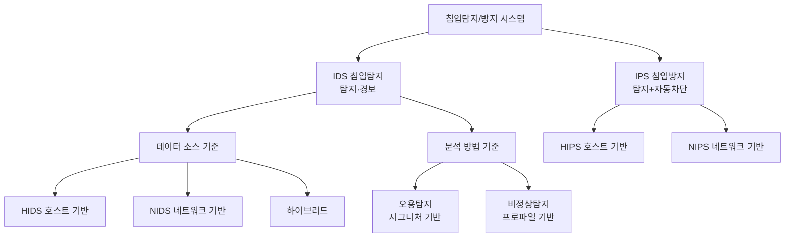
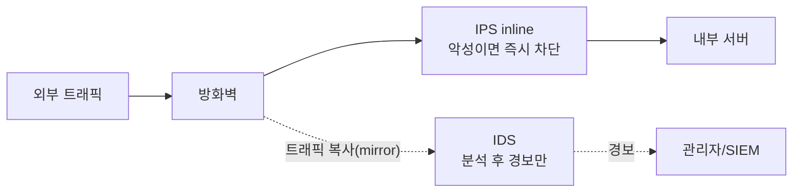

# 8강. 컴퓨터보안: 보안 시스템 II (IDS / IPS)

## 🔗 선수 지식 (Prerequisites)
- [ ] **필수**: [7강. 보안 시스템 I](7강.md) - 방화벽·VPN·NAC의 역할과 한계 이해 완료?
- [ ] **필수**: [4강. 사이버 공격](4강.md), [5강. 서버 보안](5강.md) - 공격 유형·침입 4단계
- [ ] **권장**: 정보보호 3대 목표 CIA([1강](1강.md)), 분류기 평가지표(정밀도/재현율) 기초
- **관련 단원**: [7강 보안 시스템 I](7강.md), [6강 네트워크 보안](6강.md)

---

## 학습 목표
1. 침입탐지 시스템(IDS)의 개념과 주요 내용을 설명할 수 있다.
2. IDS를 분석 데이터의 소스(호스트/네트워크/하이브리드) 기준으로 구분할 수 있다.
3. IDS를 분석 방법(오용탐지/비정상탐지) 기준으로 구분할 수 있다.
4. 침입방지 시스템(IPS)의 개념과 IDS와의 차이를 설명할 수 있다.

---

## 🧠 메타인지 체크 (학습 전/후 자기 평가)

### 학습 전 자기 평가
| 소주제 | 자신감 (1-5) |
| :--- | :--- |
| IDS 개념과 방화벽과의 차이 | |
| 데이터 소스별 분류(HIDS/NIDS/하이브리드) | |
| 분석방법별 분류(오용탐지/비정상탐지) | |
| IPS 개념과 IDS와의 차이 | |

### 학습 후 교정 (학습 완료 후 작성)
| 소주제 | 학습 전 | 학습 후 | 실제 정답률 | 과신/과소 여부 |
| :--- | :--- | :--- | :--- | :--- |
| IDS 개념·방화벽 차이 | | | | |
| 데이터 소스별 분류 | | | | |
| 분석방법별 분류 | | | | |
| IPS 개념·IDS 차이 | | | | |

> **활용법**: 학습 전 1분 → 자신감 기입, 학습 후 1분 → 나머지 기입. "과신" 영역이 실제 취약점.

---

## 📝 요약 (Summary)
1. **침입탐지 시스템(IDS)** 🔴: 컴퓨터가 사용하는 자원의 **기밀성·무결성·가용성(CIA)** 을 저해하는 행위를 **실시간으로 탐지**하는 시스템이다. 방화벽이 막지 못하고 통과한 침입까지 잡아내는 것이 목적이다.
2. **데이터 소스에 따른 IDS 분류** 🔴: 분석 데이터의 소스에 따라 **호스트 기반(HIDS)·네트워크 기반(NIDS)·하이브리드**의 세 가지로 구분된다.
3. **분석 방법에 따른 IDS 분류** 🔴: 분석 방법에 따라 시그니처 기반의 **오용탐지(misuse detection)** 와 프로파일 기반의 **비정상탐지(anomaly detection)** 로 나뉜다.
4. **침입방지 시스템(IPS)** 🔴: 침입 **탐지**에 더해 자동으로 대응작업을 수행하여 그 행위를 **중지(차단)** 시키는 보안 솔루션이다. (탐지 + 능동적 대응)
5. **데이터 소스에 따른 IPS 분류** 🟡: 분석 데이터의 소스에 따라 **호스트 기반(HIPS)·네트워크 기반(NIPS)** 으로 구분된다.

---

## 📐 핵심 정의 및 원리 (Key Definitions & Principles)

| 정의명 | 내용 | 키워드 |
| :--- | :--- | :--- |
| **침입탐지 시스템(IDS)** | 시스템·네트워크 활동을 감시하여 CIA를 저해하는 침입·오용 행위를 실시간 탐지하고 경보를 발생시키는 시스템 | Intrusion **Detection**, 탐지·경보 |
| **침입방지 시스템(IPS)** | IDS의 탐지 기능 + 탐지된 공격을 **자동으로 차단·중단**시키는 능동적 대응까지 수행하는 시스템 | Intrusion **Prevention**, 탐지+차단 |
| **호스트 기반 IDS(HIDS)** | 개별 호스트(서버/PC)에 설치되어 시스템 로그·파일 무결성·프로세스·감사기록을 분석 | 로그 분석, 파일 무결성, 단일 호스트 |
| **네트워크 기반 IDS(NIDS)** | 네트워크 세그먼트에 설치되어 지나가는 **패킷(트래픽)** 을 캡처·분석 | 패킷 캡처, 트래픽 감시, 세그먼트 |
| **하이브리드 IDS** | HIDS와 NIDS를 결합하여 호스트 정보와 네트워크 정보를 함께 분석 | 통합·상호보완 |
| **오용탐지(Misuse Detection)** | 이미 알려진 공격의 **시그니처(패턴)** 와 활동을 비교해 일치하면 침입으로 판정 | 시그니처 기반, 규칙(rule), 블랙리스트식 |
| **비정상탐지(Anomaly Detection)** | 정상 행위의 **프로파일(통계적 기준선)** 을 학습하고, 이를 크게 벗어나면 침입으로 판정 | 프로파일 기반, 임계치, 행위 기준선 |
| **시그니처(Signature)** | 알려진 공격에 고유하게 나타나는 패턴(특정 바이트열·요청 형태·문자열 등) | 패턴 DB, 룰셋 |
| **오탐(False Positive)** | 정상 행위를 침입으로 잘못 판정(거짓 경보) | 거짓 경보, 알람 피로 |
| **미탐(False Negative)** | 실제 침입을 정상으로 잘못 판정(놓침) | 탐지 실패, 가장 위험 |

### 주요 원리

**원리 1. 탐지 성능 지표 (IDS는 본질적으로 이진 분류기)**
정상/침입을 가르는 IDS의 성능은 혼동행렬(confusion matrix)로 평가하며, 다음 지표를 쓴다.

| 지표 | 수식 | 의미 |
| :--- | :--- | :--- |
| **탐지율(재현율, TPR)** | $\dfrac{TP}{TP+FN}$ | 실제 침입 중 잡아낸 비율(높을수록 미탐↓) |
| **오탐률(FPR)** | $\dfrac{FP}{FP+TN}$ | 정상인데 경보를 울린 비율(낮을수록 좋음) |
| **정밀도(Precision)** | $\dfrac{TP}{TP+FP}$ | 경보가 실제 침입일 확률(높을수록 알람 피로↓) |

> **직관적 해석**: 임계치를 낮추면 더 잘 잡지만(TPR↑) 오탐도 늘고(FPR↑), 높이면 그 반대다. 보안 운영의 핵심은 **이 둘의 트레이드오프**를 조직 상황에 맞게 조절하는 것이다.
> **AI 적용**: 비정상탐지 IDS는 곧 머신러닝 이상탐지 문제다. ROC 곡선의 AUC, Isolation Forest·Autoencoder의 재구성 오차 임계치 설정이 이 트레이드오프를 정량화한다.

**원리 2. IPS = IDS + 능동적 대응(inline 배치)**
> **직관적 해석**: IDS는 트래픽을 **복사(mirror/TAP)** 받아 "구경하며 경보만" 울리는 수동적 장치이고, IPS는 트래픽 **경로 위(inline)** 에 놓여 악성으로 판정되면 그 패킷·세션을 **즉시 차단(drop/reset)** 한다.
> **실무 적용**: 잘못 차단(오탐)하면 정상 서비스가 끊기므로, IPS는 오탐 관리가 IDS보다 훨씬 더 중요하다.

---

## 📊 개념 시각화 (Visual Guide)

### 분류 체계도: IDS / IPS 분류


### 배치 흐름도: IDS(수동) vs IPS(인라인)


### 핵심 비교표: 오용탐지 vs 비정상탐지
| 구분 | 오용탐지(Misuse) | 비정상탐지(Anomaly) |
| :--- | :--- | :--- |
| **판정 기준** | 알려진 공격 시그니처와 일치 | 정상 프로파일에서 벗어남 |
| **기반** | 패턴/규칙 DB(블랙리스트식) | 통계·학습된 정상 기준선(화이트리스트식) |
| **알려진 공격** | 매우 잘 탐지(정확) | 탐지 가능하나 상대적으로 약함 |
| **신종(0-day) 공격** | **탐지 못함**(시그니처 부재) | **탐지 가능**(정상에서 벗어나므로) |
| **오탐(FP)** | 낮음 | 높은 편(정상 변화도 이상으로 봄) |
| **유지보수** | 시그니처 DB 지속 갱신 필요 | 프로파일 재학습·튜닝 필요 |

---

## ✏️ 심화 학습 (Study Subject)

### 1. 가상 시나리오: "방화벽을 통과한 공격, 무엇이 잡아내는가?"
- **상황**: B기업은 외부 공개 웹 서버 앞에 방화벽을 두었다. 방화벽은 80/443 포트를 정상적으로 허용하는데, 공격자가 **허용된 443 포트의 정상 HTTPS 요청 안에 SQL 인젝션 페이로드**를 실어 보냈다.
- **문제**: 방화벽은 포트·IP 기준으로만 판단하므로 이 요청을 막지 못한다. 어떤 시스템이, 어떤 분석 방법으로 이 침입을 탐지·차단할 수 있는가?
- **해결**:
    1. **NIDS/NIPS**가 443 트래픽의 페이로드를 검사한다(방화벽보다 상위 계층까지 본다).
    2. **오용탐지**: `' OR 1=1 --`, `UNION SELECT` 같은 알려진 SQLi 시그니처와 일치 → 즉시 탐지.
    3. **비정상탐지**: 평소 이 URL 파라미터에 들어오지 않던 비정상적으로 긴 문자열·특수문자 빈도 → 프로파일 이탈로 탐지.
    4. **IPS라면** 탐지에 그치지 않고 해당 세션을 즉시 reset/drop하여 공격을 **중지**시킨다.
- **AI 학습 포인트**: "비정상탐지를 위한 '정상 프로파일'을 학습할 때, 정상 트래픽만으로 학습하는 One-Class SVM·Autoencoder와 정상/공격을 함께 쓰는 지도학습 분류기는 각각 어떤 상황에서 유리할까? 레이블이 거의 없는 보안 로그 환경에서는 어느 쪽이 현실적인가?"

### 2. 관점별 비교 및 오개념 분석
- **핵심 비교**: 혼동하기 쉬운 쌍을 정리한다.
    - **IDS vs IPS**: IDS는 "탐지 + 경보"(수동, mirror 배치), IPS는 "탐지 + 자동 차단"(능동, inline 배치).
    - **HIDS vs NIDS**: 데이터 소스가 *호스트 내부 로그/파일*이냐 *네트워크 패킷*이냐의 차이.
    - **오용탐지 vs 비정상탐지**: *알려진 공격 패턴*과 비교냐, *정상 프로파일*에서 벗어남이냐.
    - **방화벽 vs IDS/IPS**: 방화벽은 주로 IP·포트 기준의 **접근 통제(누가 들어오나)**, IDS/IPS는 통과한 트래픽의 **내용·행위 분석(무엇을 하나)**.
- **오개념 분석**
    - **오개념 1**: "방화벽이 있으면 IDS/IPS는 필요 없다."
    - **분석**: 방화벽은 허용된 포트로 들어오는 **정상 형식의 악성 요청**(SQLi, XSS, 악성 첨부 등)을 막지 못한다. 그래서 방화벽이 통과시킨 침입을 잡기 위한 **다층 방어**의 보완 장치가 IDS/IPS다.
    - **오개념 2**: "비정상탐지는 정상 프로파일을 쓰니까 오탐이 거의 없다."
    - **분석**: 오히려 반대다. 정상 행위 자체가 시간·업무에 따라 변하므로(예: 월말 대량 트래픽), 평소와 다른 *정상* 활동까지 침입으로 오탐할 수 있다. 다만 **신종 공격 탐지**에 강한 것이 장점이다.
    - **오개념 3**: "오용탐지는 정확하니 신종 공격도 잘 잡는다."
    - **분석**: 오용탐지는 **알려진 시그니처가 있어야만** 탐지한다. 시그니처가 없는 0-day 공격은 원리상 놓친다(미탐). 신종 대응은 비정상탐지의 몫이다.
- **AI 학습 포인트**: "AI에게 '오탐률을 낮추려고 임계치를 높였더니 미탐이 늘어 실제 침해를 놓쳤다'는 상황을 ROC 곡선과 운영비용(알람 피로 vs 사고 손실) 관점에서 어떻게 의사결정해야 하는지 설명해달라고 요청해보자."

---

## ❓ 연습 문제 및 해설

> **블룸 인지 수준 범례**: [기억] 정의·나열 → [이해] 설명·비교 → [적용] 계산·구현 → [분석] 구별·디버그 → [평가] 판단·비평 → [창조] 설계·제안

> 📌 본 강의는 원본 연습문제가 제공되지 않아 학습목표·학습정리를 전체 커버하도록 10문항을 AI 출제(📌)했다.

### 📝 문제

**1. ⭐ [기억] 📌 [IDS의 정의](#prob-1)**
> 침입탐지 시스템(IDS)에 대한 설명으로 가장 옳은 것은?
> ① IP·포트 기준으로 접근을 허용/차단하는 시스템
> ② 자원의 기밀성·무결성·가용성을 저해하는 행위를 실시간 탐지하는 시스템
> ③ 통신 구간을 암호화하여 도청을 막는 시스템
> ④ 단말의 네트워크 접속 자격을 통제하는 시스템

<br>

**2. ⭐ [기억] 📌 [데이터 소스에 따른 IDS 분류](#prob-2)**
> 분석 데이터의 소스에 따른 IDS의 분류로 옳지 않은 것은?
> ① 호스트 기반(HIDS)
> ② 네트워크 기반(NIDS)
> ③ 하이브리드
> ④ 시그니처 기반

<br>

**3. ⭐⭐ [이해] 📌 [분석 방법에 따른 IDS 분류](#prob-3)**
> <보기>
>
> 가. 시그니처 기반의 오용탐지
> 나. 프로파일 기반의 비정상탐지
> 다. 호스트 기반 탐지
> 라. 네트워크 기반 탐지

> 위 보기에서 "분석 방법"에 따른 IDS 분류에 해당하는 것만 고른 것은?
> ① 가, 나
> ② 다, 라
> ③ 가, 다
> ④ 나, 라

<br>

**4. ⭐⭐ [이해] 📌 [IDS와 IPS의 차이](#prob-4)**
> IDS와 IPS의 차이에 대한 설명으로 가장 옳은 것은?
> ① IDS는 트래픽을 차단하고, IPS는 경보만 울린다.
> ② IDS는 탐지·경보까지, IPS는 탐지에 더해 자동 차단(대응)까지 수행한다.
> ③ IPS는 호스트 기반만 존재한다.
> ④ IDS와 IPS는 기능이 완전히 동일하다.

<br>

**5. ⭐⭐ [적용] 📌 [HIDS와 NIDS의 데이터 소스](#prob-5)**
> <보기>
>
> 가. 서버의 시스템 로그와 파일 무결성을 분석한다.
> 나. 네트워크 세그먼트를 지나는 패킷을 캡처·분석한다.

> 가와 나를 각각 알맞게 짝지은 것은?
> ① 가-NIDS / 나-HIDS
> ② 가-HIDS / 나-NIDS
> ③ 가-오용탐지 / 나-비정상탐지
> ④ 가-IPS / 나-IDS

<br>

**6. ⭐⭐ [이해] 📌 [데이터 소스에 따른 IPS 분류](#prob-6)**
> 분석 데이터의 소스에 따른 IPS의 분류로 옳은 것은?
> ① 오용탐지 기반, 비정상탐지 기반
> ② 호스트 기반(HIPS), 네트워크 기반(NIPS)
> ③ 방화벽 기반, VPN 기반
> ④ 화이트리스트, 블랙리스트

<br>

**7. ⭐⭐⭐ [분석] 📌 [오용탐지 vs 비정상탐지](#prob-7)**
> <보기>
>
> 가. 알려진 공격 시그니처와 일치 여부로 판정한다.
> 나. 신종(0-day) 공격 탐지에 상대적으로 강하다.
> 다. 정상 행위의 프로파일에서 벗어나는 정도로 판정한다.
> 라. 일반적으로 오탐(false positive)이 적은 편이다.

> 위 보기 중 "비정상탐지(anomaly detection)"의 특징에 해당하는 것만 고른 것은?
> ① 가, 라
> ② 나, 다
> ③ 가, 다
> ④ 나, 라

<br>

**8. ⭐⭐⭐ [평가] 📌 [방화벽의 한계와 IDS/IPS의 필요성](#prob-8)**
> 방화벽이 허용한 443 포트로 정상 형식의 HTTPS 요청 안에 SQL 인젝션 페이로드가 전달되었다. 이에 대한 설명으로 가장 옳은 것은?
> ① 방화벽이 포트 기준으로 모든 공격을 차단하므로 문제없다.
> ② 방화벽은 허용 포트의 정상 형식 악성 요청을 막기 어려우므로, 페이로드를 분석하는 IDS/IPS가 보완 역할을 한다.
> ③ IDS/IPS는 암호화 트래픽을 다루지 못하므로 아무 도움이 안 된다.
> ④ VPN만 적용하면 이런 공격은 모두 차단된다.

<br>

**9. ⭐⭐⭐ [분석] 📌 [오탐과 미탐의 트레이드오프](#prob-9)**
> 어떤 IPS의 탐지 임계치를 **더 민감하게(낮게)** 조정했다. 일반적으로 예상되는 결과로 가장 옳은 것은?
> ① 탐지율(TPR)과 오탐률(FPR)이 모두 낮아진다.
> ② 탐지율(TPR)은 높아지고 오탐률(FPR)도 높아진다.
> ③ 탐지율(TPR)은 낮아지고 오탐률(FPR)은 높아진다.
> ④ 임계치와 탐지율·오탐률은 아무 관계가 없다.

<br>

**10. ⭐⭐⭐ [창조] 📌 [IDS/IPS 도입 설계](#prob-10)**
> 한 중소기업이 외부 공개 웹 서버와 내부 DB 서버를 운영한다. 학습한 IDS/IPS의 분류(데이터 소스·분석 방법)와 배치(수동 mirror vs inline)를 활용하여, 어디에 어떤 유형을 두고 오용탐지와 비정상탐지를 어떻게 조합할지 근거와 함께 설계하시오.

---

### 🔑 정답 및 해설 (먼저 풀어본 후 펼치기)

<details>
<summary>정답 보기 (클릭)</summary>

1. ②
2. ④
3. ①
4. ②
5. ②
6. ②
7. ②
8. ②
9. ②
10. [풀이형 정답 — 아래 해설 참고]

</details>

<details>
<summary>해설 보기 (클릭)</summary>

<a id="prob-1"></a>
**1. ⭐ [기억] IDS의 정의**
> **정답: ② 자원의 기밀성·무결성·가용성을 저해하는 행위를 실시간 탐지하는 시스템**
> **해설**: 학습정리 1번 정의 그대로다. ①은 방화벽, ③은 VPN(암호화), ④는 NAC의 설명으로 모두 [7강](7강.md)에서 다룬 다른 보안 시스템이다.

<a id="prob-2"></a>
**2. ⭐ [기억] 데이터 소스에 따른 IDS 분류**
> **정답: ④ 시그니처 기반**
> **해설**: 시그니처 기반(오용탐지)은 "데이터 소스"가 아니라 "분석 방법"에 따른 분류다. 데이터 소스 기준은 호스트 기반·네트워크 기반·하이브리드의 세 가지.

<a id="prob-3"></a>
**3. ⭐⭐ [이해] 분석 방법에 따른 IDS 분류**
> **정답: ① 가, 나**
> **해설**: 분석 방법 기준은 오용탐지(시그니처)와 비정상탐지(프로파일)다. 다·라(호스트/네트워크)는 데이터 소스 기준 분류다.

<a id="prob-4"></a>
**4. ⭐⭐ [이해] IDS와 IPS의 차이**
> **정답: ② IDS는 탐지·경보까지, IPS는 탐지에 더해 자동 차단(대응)까지 수행한다.**
> **해설**: IPS는 "침입탐지에 더해 자동으로 대응작업을 수행하여 행위를 중지시키는" 솔루션이다(학습정리 4번). ①은 IDS/IPS 역할이 뒤바뀌었고, ③은 IPS도 호스트·네트워크 기반 모두 존재하므로 틀리다.

<a id="prob-5"></a>
**5. ⭐⭐ [적용] HIDS와 NIDS의 데이터 소스**
> **정답: ② 가-HIDS / 나-NIDS**
> **해설**: 호스트의 로그·파일을 보는 것이 HIDS, 네트워크 패킷을 보는 것이 NIDS다. 데이터 소스가 어디인지가 판별 기준이다.

<a id="prob-6"></a>
**6. ⭐⭐ [이해] 데이터 소스에 따른 IPS 분류**
> **정답: ② 호스트 기반(HIPS), 네트워크 기반(NIPS)**
> **해설**: 학습정리 5번 그대로다. IPS는 데이터 소스에 따라 HIPS·NIPS로 구분된다(IDS의 '하이브리드'에 대응하는 항목은 학습정리에서 제시되지 않음).

<a id="prob-7"></a>
**7. ⭐⭐⭐ [분석] 오용탐지 vs 비정상탐지**
> **정답: ② 나, 다**
> **해설**: 비정상탐지는 정상 프로파일에서의 이탈로 판정하므로(다) 신종 공격에 강하다(나). 반면 가(시그니처 일치)와 라(오탐이 적음)는 오용탐지의 특징이다. 비정상탐지는 오히려 오탐이 많은 편이다.

<a id="prob-8"></a>
**8. ⭐⭐⭐ [평가] 방화벽의 한계와 IDS/IPS의 필요성**
> **정답: ② 방화벽은 허용 포트의 정상 형식 악성 요청을 막기 어려우므로, 페이로드를 분석하는 IDS/IPS가 보완 역할을 한다.**
> **해설**: 방화벽은 주로 IP·포트 단위로 판단하므로 허용 포트(443)로 들어오는 정상 형식의 악성 페이로드를 걸러내지 못한다. 이를 보완하는 것이 IDS/IPS의 핵심 존재 이유다(이번 강의 학습개요). ③은 TLS 종료 지점에서 복호화 후 검사가 가능하므로 과장된 주장.

<a id="prob-9"></a>
**9. ⭐⭐⭐ [분석] 오탐과 미탐의 트레이드오프**
> **정답: ② 탐지율(TPR)은 높아지고 오탐률(FPR)도 높아진다.**
> **해설**: 임계치를 민감하게(낮게) 하면 더 많은 것을 침입으로 판정하므로 실제 침입을 더 잡지만(TPR↑, 미탐↓), 정상까지 침입으로 오판하는 오탐도 함께 늘어난다(FPR↑). 이것이 탐지의 본질적 트레이드오프다.

<a id="prob-10"></a>
**10. ⭐⭐⭐ [창조] IDS/IPS 도입 설계 (예시 답안)**
> **정답 예시**
> 1. **경계(인터넷 ↔ DMZ)에는 NIPS를 inline 배치** — 외부에서 들어오는 알려진 공격을 자동 차단. 오탐 시 서비스 중단 위험이 있으므로 처음에는 *고신뢰 시그니처만 차단*하도록 운영.
> 2. **내부 핵심 구간에는 NIDS를 mirror(수동) 배치** — 차단 부담 없이 측면이동·이상 트래픽을 폭넓게 탐지·경보.
> 3. **DB·웹 서버 호스트에는 HIDS/HIPS** — 파일 무결성·권한상승·로그 변조 같은 호스트 내부 징후 탐지(NIDS가 못 보는 영역).
> 4. **분석 방법은 오용탐지 + 비정상탐지 병행** — 오용탐지로 알려진 공격을 정확·저오탐으로 잡고, 비정상탐지로 신종(0-day)을 보완. 두 방법의 강점이 상보적이다.
> 5. **경보는 SIEM으로 집중** — 오탐을 줄이기 위해 상관분석·튜닝, IPS의 차단 규칙은 오탐 검증 후 점진 확대.

</details>

---

## ✅ O/X 확인문제 (20문항)

**1.** IDS는 자원의 기밀성·무결성·가용성을 저해하는 행위를 실시간으로 탐지하는 시스템이다.[(O / X)](#ox-1)
**2.** IDS는 분석 데이터의 소스에 따라 호스트 기반·네트워크 기반·하이브리드로 구분된다.[(O / X)](#ox-2)
**3.** 오용탐지와 비정상탐지는 데이터 소스에 따른 IDS 분류이다.[(O / X)](#ox-3)
**4.** 오용탐지는 알려진 공격의 시그니처와 비교하여 침입을 판정한다.[(O / X)](#ox-4)
**5.** 비정상탐지는 정상 행위의 프로파일에서 벗어나는 정도로 침입을 판정한다.[(O / X)](#ox-5)
**6.** 오용탐지는 신종(0-day) 공격을 시그니처 없이도 잘 탐지한다.[(O / X)](#ox-6)
**7.** 비정상탐지는 일반적으로 오용탐지보다 오탐(false positive)이 적다.[(O / X)](#ox-7)
**8.** IPS는 침입을 탐지만 하고 차단은 하지 않는다.[(O / X)](#ox-8)
**9.** IPS는 분석 데이터의 소스에 따라 호스트 기반(HIPS)과 네트워크 기반(NIPS)으로 구분된다.[(O / X)](#ox-9)
**10.** HIDS는 네트워크 패킷을 캡처하여 분석하는 것이 주된 역할이다.[(O / X)](#ox-10)
**11.** NIDS는 네트워크 세그먼트를 지나는 트래픽을 분석한다.[(O / X)](#ox-11)
**12.** 방화벽은 허용된 포트로 들어오는 정상 형식의 악성 페이로드까지 모두 차단한다.[(O / X)](#ox-12)
**13.** IDS는 일반적으로 트래픽을 복사(mirror)받아 분석하는 수동적 배치가 가능하다.[(O / X)](#ox-13)
**14.** IPS는 트래픽 경로 위(inline)에 놓여 악성 트래픽을 즉시 차단할 수 있다.[(O / X)](#ox-14)
**15.** 미탐(false negative)은 실제 침입을 정상으로 잘못 판정하여 놓치는 것을 말한다.[(O / X)](#ox-15)
**16.** 탐지 임계치를 민감하게(낮게) 하면 탐지율과 오탐률이 함께 증가하는 경향이 있다.[(O / X)](#ox-16)
**17.** 하이브리드 IDS는 호스트 기반과 네트워크 기반을 결합한 형태이다.[(O / X)](#ox-17)
**18.** 오용탐지는 시그니처 DB를 지속적으로 갱신해야 효과를 유지한다.[(O / X)](#ox-18)
**19.** IPS는 오탐이 발생해도 서비스에 아무 영향이 없으므로 오탐 관리는 IDS보다 덜 중요하다.[(O / X)](#ox-19)
**20.** IDS/IPS는 방화벽이 막지 못하고 통과한 침입을 탐지·대응하기 위한 보완 장치이다.[(O / X)](#ox-20)

<details>
<summary>O/X 정답 및 해설 보기 (클릭)</summary>

> <a id="ox-1"></a>
> **1. 정답: O** — 학습정리 1번 정의 그대로.

> <a id="ox-2"></a>
> **2. 정답: O** — 데이터 소스 기준 3분류(HIDS/NIDS/하이브리드).

> <a id="ox-3"></a>
> **3. 정답: X** — 오용탐지·비정상탐지는 "분석 방법"에 따른 분류다.

> <a id="ox-4"></a>
> **4. 정답: O** — 오용탐지는 시그니처(알려진 패턴) 기반.

> <a id="ox-5"></a>
> **5. 정답: O** — 비정상탐지는 프로파일(정상 기준선) 기반.

> <a id="ox-6"></a>
> **6. 정답: X** — 오용탐지는 시그니처가 없는 신종 공격을 원리상 탐지하지 못한다. 신종 대응은 비정상탐지의 강점.

> <a id="ox-7"></a>
> **7. 정답: X** — 비정상탐지는 정상 변화도 이상으로 보아 오탐이 많은 편이다.

> <a id="ox-8"></a>
> **8. 정답: X** — IPS는 탐지에 더해 자동 차단(대응)까지 수행한다.

> <a id="ox-9"></a>
> **9. 정답: O** — 학습정리 5번. IPS는 HIPS·NIPS로 구분.

> <a id="ox-10"></a>
> **10. 정답: X** — 패킷 분석은 NIDS. HIDS는 호스트의 로그·파일·프로세스를 분석한다.

> <a id="ox-11"></a>
> **11. 정답: O** — NIDS의 정의.

> <a id="ox-12"></a>
> **12. 정답: X** — 방화벽은 IP·포트 기준이라 허용 포트의 정상 형식 악성 요청은 막기 어렵다. 그래서 IDS/IPS가 필요하다.

> <a id="ox-13"></a>
> **13. 정답: O** — IDS는 mirror/TAP로 트래픽을 복사받아 수동 분석하는 배치가 일반적.

> <a id="ox-14"></a>
> **14. 정답: O** — IPS는 inline 배치로 즉시 차단(drop/reset)이 가능하다.

> <a id="ox-15"></a>
> **15. 정답: O** — 미탐(FN)은 침입을 놓치는 것으로 보안상 가장 위험하다.

> <a id="ox-16"></a>
> **16. 정답: O** — 민감도↑ → TPR↑, FPR↑ (탐지의 트레이드오프).

> <a id="ox-17"></a>
> **17. 정답: O** — 하이브리드의 정의.

> <a id="ox-18"></a>
> **18. 정답: O** — 시그니처 기반은 DB 갱신이 생명.

> <a id="ox-19"></a>
> **19. 정답: X** — IPS는 inline에서 정상 트래픽을 잘못 차단하면 서비스가 끊기므로 오탐 관리가 오히려 더 중요하다.

> <a id="ox-20"></a>
> **20. 정답: O** — 이번 강의 학습개요의 핵심: 방화벽이 막지 못한 침입에 대응하는 것이 IDS/IPS다.

</details>

---

## 🧪 자유 회상 연습 (Free Recall)

> **방법**: 위의 노트를 모두 덮고, 타이머 3분 설정 후 이번 단원에서 배운 내용을 기억나는 대로 자유롭게 적으세요.
> 정확한 문장이 아니어도 됩니다. 키워드, 수식, 관계 등 떠오르는 것을 모두 적습니다.

**자유 회상 작성란:**

```
[여기에 기억나는 내용을 자유롭게 작성]


```

> **회상 후 점검**: 노트를 다시 펼쳐 빠뜨린 내용을 확인하세요. 빠뜨린 부분이 실제 취약점입니다.
> - 회상 못한 핵심 개념: [                ]
> - 회상 못한 분류 기준(소스/방법): [                ]
> - 회상 못한 IDS vs IPS 차이: [                ]

---

## 💻 코드로 확인하기 (Code Verification)

> IDS는 본질적으로 정상/침입을 가르는 이진 분류기다. (1) 시그니처(오용)탐지와 (2) 통계 프로파일(비정상)탐지를 Python으로 시연하고, (3) 탐지 성능 지표를 계산한다.

```python
# 예시 1: 오용탐지(시그니처 기반) — 알려진 SQLi 패턴 매칭
import re

SIGNATURES = [
    r"'\s*or\s*1\s*=\s*1",   # ' OR 1=1
    r"union\s+select",        # UNION SELECT
    r"--\s*$",                # 주석으로 쿼리 종료
]

def misuse_detect(request: str) -> bool:
    return any(re.search(sig, request, re.IGNORECASE) for sig in SIGNATURES)

requests = [
    "GET /item?id=10",                       # 정상
    "GET /item?id=10' OR 1=1 --",            # SQLi
    "GET /search?q=union select password",   # SQLi
]
for r in requests:
    print(f"{'⚠ 침입' if misuse_detect(r) else '정상'} : {r}")
```

> **실행 결과 (예시)**:
> ```
> 정상 : GET /item?id=10
> ⚠ 침입 : GET /item?id=10' OR 1=1 --
> ⚠ 침입 : GET /search?q=union select password
> ```
> **보안적 해석**: 시그니처와 일치하면 즉시 침입 판정 → 알려진 공격엔 정확하지만, 시그니처에 없는 변형/신종은 놓친다(미탐).

```python
# 예시 2: 비정상탐지(프로파일 기반) — 정상 요청 길이의 통계 기준선에서 이탈 탐지
import statistics as st

normal_lengths = [18, 20, 17, 22, 19, 21, 18, 20]  # 평소 요청 길이 프로파일
mu = st.mean(normal_lengths)
sigma = st.pstdev(normal_lengths)
THRESH = 3  # 평균에서 3σ 벗어나면 이상

def anomaly_detect(length: int) -> bool:
    z = abs(length - mu) / sigma
    return z > THRESH

for L in [19, 21, 95]:   # 95: 비정상적으로 긴 요청(페이로드 삽입 의심)
    z = abs(L - mu) / sigma
    print(f"길이={L:>3} z-score={z:5.2f} → {'⚠ 이상' if anomaly_detect(L) else '정상'}")
```

> **실행 결과 (예시)**:
> ```
> 길이= 19 z-score= 0.36 → 정상
> 길이= 21 z-score= 0.75 → 정상
> 길이= 95 z-score=39.2 → ⚠ 이상
> ```
> **보안적 해석**: 시그니처가 없어도 *정상에서 크게 벗어난* 요청을 잡는다(신종 대응에 강함). 단, 임계치(THRESH)를 낮추면 정상 변동까지 오탐할 수 있다.

```python
# 예시 3: 탐지 성능 지표(혼동행렬) 계산
def metrics(TP, FP, FN, TN):
    tpr = TP / (TP + FN)          # 탐지율(재현율)
    fpr = FP / (FP + TN)          # 오탐률
    prec = TP / (TP + FP)         # 정밀도
    return tpr, fpr, prec

tpr, fpr, prec = metrics(TP=85, FP=30, FN=15, TN=870)
print(f"탐지율(TPR)={tpr:.2%}  오탐률(FPR)={fpr:.2%}  정밀도(Precision)={prec:.2%}")
```

> **실행 결과 (예시)**: `탐지율(TPR)=85.00%  오탐률(FPR)=3.33%  정밀도(Precision)=73.91%`
> **보안적 해석**: 미탐(FN=15)이 곧 놓친 공격, 오탐(FP=30)이 곧 알람 피로의 원인이다. 임계치 조정으로 이 둘의 균형을 잡는 것이 IDS/IPS 운영의 핵심이다.

---

## 🤖 AI 연결고리 (Concept → AI Application)

| 보안 개념 | AI/ML 적용 분야 | 구체적 사례 |
| :--- | :--- | :--- |
| 비정상탐지(anomaly detection) | 비지도 이상탐지 | Isolation Forest·One-Class SVM·Autoencoder로 정상 프로파일 학습 |
| 오용탐지(시그니처) | 텍스트/패턴 분류 | 페이로드를 특징화해 악성/정상 분류기(예: 랜덤포레스트) 학습 |
| 로그·트래픽 시퀀스 분석 | 시퀀스 모델 | DeepLog·LSTM으로 syslog/netflow 이상 시퀀스 탐지 |
| 탐지 성능 트레이드오프 | 임계치·ROC 최적화 | ROC-AUC, Precision-Recall 곡선으로 운영 임계치 결정 |
| 경보 상관분석(SIEM) | 군집화·우선순위화 | 다수 경보를 클러스터링하여 알람 피로 완화, 우선순위 스코어링 |

---

## 📖 심화 학습 예시 답안

#### 1. IDS가 침입을 "탐지"하는 두 가지 방식의 내부 동작 원리
IDS의 판정은 결국 "이 활동이 침입인가?"라는 이진 결정이며, 그 근거를 어디서 얻느냐가 두 방식을 가른다.

1. **오용탐지(블랙리스트식)**: "나쁜 것의 목록"을 갖고 있다가 일치하면 차단한다. 알려진 공격 시그니처 DB와 들어온 활동을 정규식·패턴 매칭으로 비교 → 일치 시 침입. 정확하지만 **목록에 없는 신종은 못 본다.**
2. **비정상탐지(화이트리스트식)**: "정상인 것의 모습"을 먼저 학습한다. 트래픽량·요청 길이·접속 시간·명령 빈도 등으로 정상 프로파일(평균·분산)을 만들고, 새 활동이 기준선에서 통계적으로 크게 벗어나면 침입 의심 → **신종도 잡지만 정상 변화에 오탐**이 난다.
3. **두 방식은 상보적**이다. 실무 IDS/IPS는 오용탐지로 알려진 공격을 저오탐·정확하게 막고, 비정상탐지로 그물을 빠져나가는 신종을 보완하는 하이브리드 구성을 쓴다.

#### 2. IDS vs IPS 비교표
| 구분 | IDS (침입탐지) | IPS (침입방지) | 비고 |
| :--- | :--- | :--- | :--- |
| **핵심 기능** | 탐지 + 경보 | 탐지 + 자동 차단(대응) | IPS = IDS + 대응 |
| **배치** | 수동(mirror/TAP, out-of-band) | 능동(inline, 경로 위) | |
| **오탐의 영향** | 경보만 늘어남(알람 피로) | 정상 트래픽 차단 → 서비스 장애 | IPS가 오탐에 더 민감 |
| **데이터 소스 분류** | HIDS / NIDS / 하이브리드 | HIPS / NIPS | |
| **AI 활용** | 이상탐지·경보 상관분석 | 실시간 분류 + 자동 차단 정책 | |

#### 3. 시그니처 vs 통계 탐지의 Best Practice (Bad vs Good)
- **Bad Practice (나쁜 예시)**
  ```python
  # 단순 부분문자열 매칭: 대소문자/공백 변형에 쉽게 우회됨
  if "or 1=1" in request:           # "OR 1=1", "or  1 = 1" 등은 못 잡음
      block(request)
  ```
- **Good Practice (좋은 예시)**
  ```python
  import re
  # 변형을 흡수하는 정규식 + 다중 시그니처 + 비정상탐지 병행
  SQLI = re.compile(r"or\s+\d+\s*=\s*\d+|union\s+select", re.IGNORECASE)
  def detect(req, length_zscore):
      if SQLI.search(req):              # 오용탐지(알려진 공격)
          return "misuse"
      if length_zscore > 3:             # 비정상탐지(신종/변형)
          return "anomaly"
      return "normal"
  ```
- **설명**: 단순 문자열 매칭은 공백·대소문자 변형으로 쉽게 우회된다. 정규식으로 변형을 흡수하고, 시그니처가 못 잡는 신종은 통계적 비정상탐지로 **이중 방어**한다 — 오용탐지와 비정상탐지의 상보성을 코드로 구현한 것이다.

---

## 📚 핵심 용어집 (Glossary)

| 용어 (한) | 용어 (영) | 표현/예시 | 정의 |
| :--- | :--- | :--- | :--- |
| **침입탐지 시스템** | IDS (Intrusion Detection System) | Snort, Suricata(탐지모드) | CIA 저해 행위를 실시간 탐지·경보하는 시스템 |
| **침입방지 시스템** | IPS (Intrusion Prevention System) | Suricata(IPS), 차세대 IPS | 탐지 + 자동 차단까지 수행하는 능동 시스템 |
| **호스트 기반 IDS** | HIDS | OSSEC, Wazuh | 호스트의 로그·파일·프로세스를 분석 |
| **네트워크 기반 IDS** | NIDS | Snort, Zeek | 네트워크 패킷을 캡처·분석 |
| **하이브리드 IDS** | Hybrid IDS | HIDS+NIDS 통합 | 호스트·네트워크 정보를 함께 분석 |
| **오용탐지** | Misuse / Signature-based Detection | 룰셋, 패턴 DB | 알려진 공격 시그니처와 일치하면 침입 판정 |
| **비정상탐지** | Anomaly-based Detection | 통계 프로파일, z-score | 정상 프로파일에서 벗어나면 침입 판정 |
| **시그니처** | Signature | SID, 룰 | 알려진 공격에 고유한 패턴 |
| **오탐** | False Positive (FP) | 거짓 경보 | 정상을 침입으로 잘못 판정 |
| **미탐** | False Negative (FN) | 탐지 실패 | 침입을 정상으로 잘못 판정(가장 위험) |
| **탐지율(재현율)** | TPR / Recall | $\frac{TP}{TP+FN}$ | 실제 침입 중 잡아낸 비율 |
| **방화벽** | Firewall | iptables, NGFW | IP·포트 기준 접근 통제(→ [7강](7강.md)) |

---

## 🤖 AI 학습 파트너를 위한 추가 자료

### 1. 개념 이해를 위한 심층 질문 프롬프트
> **프롬프트 예시**: "침입탐지 시스템(IDS)을 '건물 보안'에 비유해서 설명해줘. 오용탐지는 '수배자 사진과 대조하는 경비', 비정상탐지는 '평소와 다른 행동을 의심하는 경비'에 빗대고, IDS와 IPS의 차이(경보만 울리는 경비 vs 직접 제압하는 경비)도 함께 설명해줘. 마지막에 방화벽·NAC([7강](7강.md))과 IDS/IPS가 다층 방어에서 어떻게 협력하는지 정리해줘."

### 2. 문제 해결 능력 강화를 위한 시나리오 프롬프트
> **프롬프트 예시**: "당신은 보안 운영(SOC) 분석가입니다. 새로 도입한 비정상탐지 IDS가 하루 수천 건의 경보를 쏟아내 '알람 피로'가 심합니다. 오탐률(FPR)을 낮추되 실제 공격은 놓치지 않기 위해, ① 임계치 조정, ② 오용탐지와의 병행, ③ 경보 상관분석(SIEM), ④ 화이트리스트 튜닝 중 어떤 순서로 접근할지 비용 대비 효과로 제안하고 각 조치가 TPR/FPR에 미치는 영향을 설명해줘."

### 3. 사례 검증·반박 프롬프트
> **프롬프트 예시**: "다음 주장을 비판적으로 검토해줘.
> '우리는 최신 NIPS를 inline으로 깔았으니 오용탐지든 비정상탐지든 모든 침입을 막을 수 있고, IDS나 HIDS는 더 이상 필요 없다.'
> 1. 이 주장에 깔린 가정을 분석하고,
> 2. NIPS의 한계(암호화 트래픽, 호스트 내부 행위, 오탐에 의한 서비스 차단 위험)를 지적하고,
> 3. 다층 방어 관점에서 HIDS/NIDS와의 조합이 왜 여전히 필요한지 설명해줘."

---

## 🔄 복습 체크 (Spaced Repetition)
- [ ] 1일 후 복습 (날짜: 2026-05-30)
- [ ] 3일 후 복습 (날짜: 2026-06-01)
- [ ] 7일 후 복습 (날짜: 2026-06-05)
- [ ] 14일 후 복습 (날짜: 2026-06-12)
- [ ] 30일 후 복습 (날짜: 2026-06-28)

### 복습 시 자가 평가
| 회차 | 날짜 | 이해도 (1-5) | 취약 부분 메모 |
| :--- | :--- | :--- | :--- |
| 1차 | | | |
| 2차 | | | |
| 3차 | | | |

---

## 📚 참고 자료 (References)

- KNOU 교재 — 컴퓨터보안 8강(보안 시스템 II: IDS/IPS) 본문 및 학습정리
- [7강 보안 시스템 I](7강.md) — 방화벽·VPN·NAC (IDS/IPS의 보완 대상)
- Snort / Suricata / Zeek(Bro) — 대표적 오픈소스 NIDS/NIPS
- OSSEC / Wazuh — 대표적 HIDS
- NIST SP 800-94 *Guide to Intrusion Detection and Prevention Systems (IDPS)*
- MITRE ATT&CK — Detection 관점의 탐지 기법 매핑
