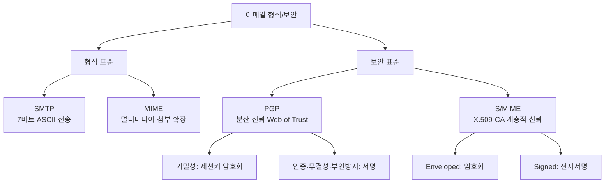
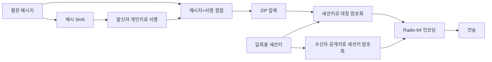

# 9강. 컴퓨터보안: 이메일 보안

## 🔗 선수 지식 (Prerequisites)
- [ ] **필수**: 대칭키·공개키 암호와 전자서명 개념([3강](3강.md)) - 이해 완료?
- [ ] **필수**: 해시함수와 무결성, 정보보호 3대 목표 CIA([1강](1강.md))
- [ ] **권장**: 네트워크 보안·프로토콜 계층([6강](6강.md)), 인증서/PKI 개념
- **관련 단원**: [3강 암호화](3강.md), [6강 네트워크 보안](6강.md), [8강](8강.md)

---

## 학습 목표
1. SMTP와 MIME을 설명할 수 있다.
2. PGP의 보안 서비스(기밀성·인증·무결성·부인방지)와 키 유형을 설명할 수 있다.
3. S/MIME의 개요와 보안 서비스에 대해 설명할 수 있다.

---

## 🧠 메타인지 체크 (학습 전/후 자기 평가)

### 학습 전 자기 평가
| 소주제 | 자신감 (1-5) |
| :--- | :--- |
| 이메일의 구조적 취약성(엽서 비유)과 위협 | |
| SMTP와 MIME의 역할·차이 | |
| PGP의 4가지 키와 동작 절차 | |
| S/MIME의 목표·보안 서비스·신뢰 모델 | |

### 학습 후 교정 (학습 완료 후 작성)
| 소주제 | 학습 전 | 학습 후 | 실제 정답률 | 과신/과소 여부 |
| :--- | :--- | :--- | :--- | :--- |
| 이메일 위협 | | | | |
| SMTP / MIME | | | | |
| PGP | | | | |
| S/MIME | | | | |

> **활용법**: 학습 전 1분 → 자신감 기입, 학습 후 1분 → 나머지 기입. "과신" 영역이 실제 취약점.

---

## 📝 요약 (Summary)
1. **이메일의 구조적 취약성** 🔴: 이메일은 여러 호스트를 거쳐 전달되며, 보내는 주소뿐 아니라 **내용까지 노출되는 "엽서(postcard)"와 같은 구조**다. 전송 도중 얼마든지 도청·변조될 수 있어 보안기술이 필요하다.
2. **PGP의 보안 서비스** 🔴: PGP를 이용한 이메일은 **기밀성, 인증, 무결성, 부인방지** 등의 기능을 지원한다. 공개키·대칭키·해시·압축·인코딩 기술을 결합한다.
3. **PGP의 4가지 키** 🔴: PGP는 **① 일회용 세션키, ② 공개키, ③ 개인키, ④ 암호구문(passphrase) 기반 관용키**의 네 가지 유형의 키를 사용한다.
4. **PGP의 신뢰 모델** 🟡: PGP는 신뢰를 공개키와 연관시키고, 신뢰정보를 활용하는 편리한 수단을 제공한다(이른바 **신뢰의 웹, Web of Trust**).
5. **SMTP와 MIME** 🟡: 전통적 이메일 형식 표준은 **SMTP** 방식이며, **MIME**은 SMTP의 한계(7비트 ASCII)를 넘어 멀티미디어·비ASCII·첨부를 지원하도록 확장한 인터넷 이메일 형식 표준이다.
6. **S/MIME의 개요** 🔴: S/MIME은 인터넷 이메일 형식 표준인 **MIME의 보안기능을 강화**하기 위해 **공개키 암호기술**을 적용한 것이다.
7. **S/MIME의 목표** 🟡: 강력한 암호화, 전자서명, 사용용이성, 융통성, 상호운용성 등이다. 신뢰 모델은 **X.509 인증서와 CA(인증기관) 기반의 계층적 신뢰**다.

---

## 📐 핵심 정의 및 원리 (Key Definitions & Principles)

| 정의명 | 내용 | 키워드 |
| :--- | :--- | :--- |
| **이메일의 "엽서" 구조** | 송신자→수신자까지 여러 MTA(중계 서버)를 경유하며, 헤더(주소)와 본문이 평문으로 노출됨 | 도청, 변조, 다중 경유 |
| **SMTP(Simple Mail Transfer Protocol)** | 메일을 송신·중계하는 전통적 표준 프로토콜. **7비트 ASCII 텍스트**만 직접 전송 가능 | 메일 전송, 7비트, RFC 821/5321 |
| **MIME(Multipurpose Internet Mail Extensions)** | SMTP의 한계를 보완해 **이미지·오디오·바이너리·비ASCII·첨부**를 표현하는 이메일 형식 확장 표준 | Content-Type, 인코딩, 멀티파트 |
| **PGP(Pretty Good Privacy)** | Phil Zimmermann이 개발한 이메일 암호화 도구. 대칭+공개키+해시를 결합해 기밀성·인증·무결성·부인방지 제공 | 세션키, 서명, Radix-64, 압축 |
| **일회용 세션키(Session Key)** | 메시지마다 새로 생성되는 **대칭키**. 본문 암호화에 사용되며 수신자 공개키로 다시 암호화되어 함께 전달 | 1회용, 대칭암호, 기밀성 |
| **공개키/개인키(Public/Private Key)** | 공개키는 세션키 암호화·서명 검증, 개인키는 세션키 복호화·서명 생성에 사용 | RSA, 비대칭, 서명/검증 |
| **암호구문 기반 관용키(Passphrase-based Key)** | 사용자가 입력한 **암호구문(passphrase)**으로부터 유도해 디스크의 **개인키를 보호(암·복호화)** 하는 대칭키 | 관용(대칭)키, 개인키 보호 |
| **신뢰의 웹(Web of Trust)** | 중앙 CA 없이 **사용자들이 서로의 공개키에 서명**하여 신뢰를 분산·전파하는 PGP의 신뢰 모델 | 분산 신뢰, 키 서명, 신뢰도 |
| **S/MIME(Secure/MIME)** | MIME에 공개키 암호기술을 적용해 서명·암호화 기능을 표준화한 보안 이메일 형식 | X.509, CA, RSA |
| **X.509 인증서** | CA가 발급·서명한 공개키 증명서. S/MIME의 키 신뢰 근거 | PKI, 계층적 신뢰, 인증기관 |

### 주요 원리

**원리 1. 디지털 봉투(Digital Envelope) — 하이브리드 암호**
> **직관적 해석**: 큰 본문은 **빠른 대칭키(세션키)** 로 암호화하고, 그 세션키는 **느리지만 키 교환에 강한 공개키**로 암호화해 함께 보낸다. "대칭의 속도 + 공개키의 키분배 편의"를 결합한 방식으로 PGP·S/MIME 모두 채택한다.
> **AI/실무 적용**: TLS 핸드셰이크, 디스크 암호화 키 래핑(KMS의 envelope encryption) 등에서 동일한 패턴이 쓰인다.

**원리 2. 서명 = 인증 + 무결성 + 부인방지**
> **직관적 해석**: 본문의 **해시값을 발신자의 개인키로 서명**하면, 수신자는 발신자 공개키로 검증해 ① 정말 그 사람이 보냈는지(인증), ② 내용이 변하지 않았는지(무결성), ③ 나중에 "안 보냈다"고 부인하지 못하게(부인방지) 한다.
> **AI/실무 적용**: 모델 가중치·소프트웨어 패키지 서명(코드 서명), 트랜잭션 서명 등.

---

## 📊 개념 시각화 (Visual Guide)

### 분류 체계도: 이메일 보안 기술


### PGP 송신 처리 흐름도


### 핵심 비교표: PGP vs S/MIME
| 구분 | PGP | S/MIME |
| :--- | :--- | :--- |
| 기반 형식 | 독자 형식(후에 OpenPGP 표준) | MIME 확장 |
| 신뢰 모델 | **신뢰의 웹(분산, 사용자 상호서명)** | **CA 기반 X.509(계층적)** |
| 키 관리 | 사용자 직접 관리·서명 | 인증기관(CA) 발급 인증서 |
| 주 사용처 | 개인·커뮤니티, 파일/메일 | 기업·기관 메일 클라이언트 내장 |
| 인코딩 | Radix-64(base64) | base64 (MIME) |

---

## ✏️ 심화 학습 (Study Subject)

### 1. 가상 시나리오: "어떤 이메일 보안을, 언제 사용해야 할까?"
- **상황**: A씨는 공개 메일 서버를 통해 민감한 계약 문서를 거래처 B씨에게 보내려 한다. 메일은 여러 중계 서버를 거치며, 도청·위조 위험이 있다.
- **문제**: (1) 본문 내용을 B만 읽게 하고(기밀성), (2) B가 "이 메일이 정말 A가 보낸 위·변조 없는 원본"임을 확인하게(인증·무결성·부인방지) 하려면 어떤 기술을 어떻게 조합해야 하는가?
- **해결**:
    1. A는 본문의 **해시를 자신의 개인키로 서명** → 인증·무결성·부인방지 확보.
    2. **일회용 세션키**로 (본문+서명)을 대칭 암호화 → 빠른 기밀성.
    3. 그 **세션키를 B의 공개키로 암호화**해 함께 전송(디지털 봉투) → B만 자신의 개인키로 세션키를 풀 수 있음.
    4. 전체를 **압축 후 Radix-64로 인코딩**해 7비트 SMTP 경로로 안전히 전달.
    5. 기업 환경이라면 동일 목표를 **S/MIME(X.509 인증서 기반)** 으로 메일 클라이언트에서 자동 처리할 수도 있다.
- **AI 학습 포인트**: "PGP의 '신뢰의 웹'과 S/MIME의 'CA 계층 신뢰'를, 분산 시스템의 신뢰 모델(예: 평판 기반 vs 중앙 인증) 관점에서 비교해줘. 어느 쪽이 키 폐기(revocation)와 확장성 면에서 유리한가?"

### 2. 관점별 비교 및 오개념 분석
- **핵심 비교**: 혼동하기 쉬운 쌍을 정리한다.
    - **SMTP vs MIME**: SMTP는 *전송 프로토콜*(주고받는 절차), MIME은 *메시지 형식 확장*(무엇을 담을 수 있는가). MIME은 SMTP를 대체하지 않고 그 위에서 콘텐츠를 표현한다.
    - **세션키 vs 공개키**: 본문은 빠른 *세션키(대칭)* 로, 세션키 자체는 *공개키(비대칭)* 로 보호한다. 본문 전체를 공개키로 암호화하지 **않는다**.
    - **서명 vs 암호화**: 서명은 인증/무결성/부인방지(누가·무엇을), 암호화는 기밀성(누구만 읽을 수 있는가). 목적이 다르다.
    - **PGP 신뢰의 웹 vs S/MIME CA**: 전자는 분산·사용자 상호서명, 후자는 중앙 CA 계층 신뢰.
- **오개념 분석**
    - **오개념 1**: "PGP는 본문 전체를 수신자의 공개키로 암호화한다."
    - **분석**: 공개키 암호는 느리고 데이터 크기 제한이 있다. 실제로는 본문을 **일회용 세션키(대칭)** 로 암호화하고, **그 세션키만** 수신자 공개키로 암호화한다(디지털 봉투).
    - **오개념 2**: "암호구문(passphrase)이 곧 본문 암호화 키다."
    - **분석**: passphrase는 **디스크에 저장된 개인키를 보호하는 관용(대칭)키를 유도**하는 데 쓰일 뿐, 본문을 직접 암호화하지 않는다. 본문은 세션키로 암호화된다.
    - **오개념 3**: "S/MIME은 SMTP와 무관한 새로운 전송 프로토콜이다."
    - **분석**: S/MIME은 **MIME 형식에 보안을 더한 것**으로, 메일은 여전히 SMTP로 전송된다. 전송 프로토콜이 아니라 보안 콘텐츠 형식이다.
- **AI 학습 포인트**: "AI에게 위 세 오개념이 실제 메일 보안 설정 실수(예: 평문 첨부, 잘못된 키 사용)로 어떻게 이어지는지 사례로 설명해달라고 요청해보자."

---

## ❓ 연습 문제 및 해설

> **블룸 인지 수준 범례**: [기억] 정의·나열 → [이해] 설명·비교 → [적용] 계산·구현 → [분석] 구별·디버그 → [평가] 판단·비평 → [창조] 설계·제안

> 📌 본 강의는 원본 연습문제가 제공되지 않아 학습목표·학습정리를 전체 커버하도록 10문항을 AI 출제(📌)했다.

### 📝 문제

**1. ⭐ [기억] 📌 [이메일의 구조적 취약성](#prob-1)**
> 이메일이 일반 편지가 아니라 "엽서"에 비유되는 이유로 가장 옳은 것은?
> ① 전송 속도가 매우 느리기 때문
> ② 주소와 내용이 모두 노출된 채 여러 호스트를 경유하기 때문
> ③ 한 번에 한 명에게만 보낼 수 있기 때문
> ④ 반드시 종이에 인쇄되기 때문

<br>

**2. ⭐ [기억] 📌 [PGP가 제공하는 보안 서비스](#prob-2)**
> PGP를 이용한 이메일이 지원하는 보안 서비스가 아닌 것은?
> ① 기밀성
> ② 인증
> ③ 무결성
> ④ 가용성(서비스 거부 방어)

<br>

**3. ⭐ [기억] 📌 [PGP의 4가지 키](#prob-3)**
> PGP가 사용하는 네 가지 키 유형에 해당하지 않는 것은?
> ① 일회용 세션키
> ② 공개키
> ③ 개인키
> ④ 인증기관(CA)의 루트키

<br>

**4. ⭐⭐ [이해] 📌 [SMTP와 MIME의 관계](#prob-4)**
> <보기>
>
> 가. SMTP는 7비트 ASCII 텍스트 전송을 전제로 한 전통적 메일 전송 표준이다.
> 나. MIME은 SMTP를 대체하는 새로운 전송 프로토콜이다.
> 다. MIME은 이미지·바이너리·비ASCII·첨부를 표현하도록 형식을 확장한다.

> 위 보기에서 옳은 것을 모두 고른 것은?
> ① 가, 나
> ② 가, 다
> ③ 나, 다
> ④ 가, 나, 다

<br>

**5. ⭐⭐ [이해] 📌 [디지털 봉투 원리](#prob-5)**
> PGP에서 본문(메시지)과 세션키를 처리하는 방식으로 가장 옳은 것은?
> ① 본문 전체를 수신자의 공개키로 암호화한다.
> ② 본문은 일회용 세션키로, 세션키는 수신자의 공개키로 암호화한다.
> ③ 본문은 발신자의 개인키로, 세션키는 발신자의 공개키로 암호화한다.
> ④ 본문과 세션키 모두 암호구문으로만 암호화한다.

<br>

**6. ⭐⭐ [적용] 📌 [PGP 서명 절차](#prob-6)**
> A가 메시지에 PGP 전자서명을 생성하는 올바른 순서는?
> ① 메시지 해시 → 발신자 개인키로 서명
> ② 메시지 해시 → 수신자 공개키로 서명
> ③ 메시지 → 세션키로 암호화 → 서명
> ④ 메시지 → 수신자 개인키로 서명

<br>

**7. ⭐⭐ [분석] 📌 [암호구문의 역할](#prob-7)**
> PGP에서 암호구문(passphrase) 기반 관용키의 주된 용도로 가장 옳은 것은?
> ① 본문(메시지)을 직접 암호화하기 위해
> ② 수신자의 공개키를 검증하기 위해
> ③ 디스크에 저장된 사용자의 개인키를 보호(암·복호화)하기 위해
> ④ 세션키를 네트워크로 평문 전송하기 위해

<br>

**8. ⭐⭐⭐ [평가] 📌 [신뢰 모델 비교](#prob-8)**
> PGP의 "신뢰의 웹(Web of Trust)"과 S/MIME의 신뢰 모델에 대한 설명으로 가장 옳은 것은?
> ① PGP는 중앙 CA가 모든 키를 발급한다.
> ② S/MIME은 사용자들이 서로의 키에 서명하는 분산 신뢰만 사용한다.
> ③ PGP는 사용자 상호서명 기반 분산 신뢰, S/MIME은 CA·X.509 기반 계층적 신뢰를 사용한다.
> ④ 두 방식 모두 키에 대한 신뢰 개념이 없다.

<br>

**9. ⭐⭐⭐ [분석] 📌 [S/MIME의 개요와 목표](#prob-9)**
> <보기>
>
> 가. S/MIME은 MIME에 공개키 암호기술을 적용해 보안을 강화한 것이다.
> 나. S/MIME의 목표에는 강력한 암호화, 전자서명, 사용용이성, 융통성, 상호운용성이 포함된다.
> 다. S/MIME은 X.509 인증서와 CA 기반 신뢰를 사용한다.
> 라. S/MIME은 대칭키만 사용하며 공개키 암호를 쓰지 않는다.

> 위 보기에서 옳은 것을 모두 고른 것은?
> ① 가, 나
> ② 가, 나, 다
> ③ 나, 다, 라
> ④ 가, 나, 다, 라

<br>

**10. ⭐⭐⭐ [창조] 📌 [상황별 이메일 보안 설계](#prob-10)**
> 한 중소기업이 (1) 외부 거래처와 민감 문서를 주고받고, (2) 사내 직원이 표준 메일 클라이언트(Outlook 등)를 사용하며, (3) 키 관리는 IT 부서가 중앙에서 통제하려 한다. PGP와 S/MIME 중 어느 것을 권장할지 고르고, 기밀성·인증·키관리 관점에서 근거를 제시하시오.

---

### 🔑 정답 및 해설 (먼저 풀어본 후 펼치기)

<details>
<summary>정답 보기 (클릭)</summary>

1. ②
2. ④
3. ④
4. ②
5. ②
6. ①
7. ③
8. ③
9. ②
10. [풀이형 정답 — 아래 해설 참고]

</details>

<details>
<summary>해설 보기 (클릭)</summary>

<a id="prob-1"></a>
**1. ⭐ [기억] 이메일의 구조적 취약성**
> **정답: ② 주소와 내용이 모두 노출된 채 여러 호스트를 경유하기 때문**
> **해설**: 이메일은 봉인된 편지가 아니라, 주소와 내용이 그대로 보이는 엽서처럼 여러 중계 서버를 거치며 도청·변조될 수 있다. 그래서 PGP·S/MIME 같은 보안기술이 필요하다.

<a id="prob-2"></a>
**2. ⭐ [기억] PGP가 제공하는 보안 서비스**
> **정답: ④ 가용성(서비스 거부 방어)**
> **해설**: PGP는 기밀성·인증·무결성·부인방지를 제공한다. 가용성(DoS 방어)은 PGP의 보안 서비스 범위가 아니다.

<a id="prob-3"></a>
**3. ⭐ [기억] PGP의 4가지 키**
> **정답: ④ 인증기관(CA)의 루트키**
> **해설**: PGP의 네 가지 키는 일회용 세션키, 공개키, 개인키, 암호구문 기반 관용키다. CA 루트키는 X.509 기반인 S/MIME의 개념이다.

<a id="prob-4"></a>
**4. ⭐⭐ [이해] SMTP와 MIME의 관계**
> **정답: ② 가, 다**
> **해설**: 나는 틀렸다 — MIME은 SMTP를 *대체*하는 전송 프로토콜이 아니라, SMTP 위에서 콘텐츠(멀티미디어·첨부)를 표현하도록 형식을 *확장*한 표준이다.

<a id="prob-5"></a>
**5. ⭐⭐ [이해] 디지털 봉투 원리**
> **정답: ② 본문은 일회용 세션키로, 세션키는 수신자의 공개키로 암호화한다.**
> **해설**: 디지털 봉투(하이브리드) 방식. 큰 본문은 빠른 대칭(세션)키로, 그 세션키는 수신자만 풀 수 있도록 수신자 공개키로 암호화한다. ①은 공개키로 본문 전체를 암호화한다는 흔한 오개념.

<a id="prob-6"></a>
**6. ⭐⭐ [적용] PGP 서명 절차**
> **정답: ① 메시지 해시 → 발신자 개인키로 서명**
> **해설**: 전자서명은 본문의 해시값을 발신자의 *개인키*로 암호화(서명)하는 것이다. 수신자는 발신자의 공개키로 검증한다. 서명에 수신자 키를 쓰지 않는다.

<a id="prob-7"></a>
**7. ⭐⭐ [분석] 암호구문의 역할**
> **정답: ③ 디스크에 저장된 사용자의 개인키를 보호(암·복호화)하기 위해**
> **해설**: passphrase는 개인키 파일을 보호하는 관용(대칭)키를 유도한다. 본문 암호화는 세션키가 담당한다(①은 오개념).

<a id="prob-8"></a>
**8. ⭐⭐⭐ [평가] 신뢰 모델 비교**
> **정답: ③ PGP는 사용자 상호서명 기반 분산 신뢰, S/MIME은 CA·X.509 기반 계층적 신뢰를 사용한다.**
> **해설**: PGP는 중앙 CA 없이 사용자들이 서로의 공개키에 서명하는 "신뢰의 웹", S/MIME은 CA가 발급한 X.509 인증서를 신뢰 근거로 삼는 계층적 PKI 모델이다.

<a id="prob-9"></a>
**9. ⭐⭐⭐ [분석] S/MIME의 개요와 목표**
> **정답: ② 가, 나, 다**
> **해설**: 라는 틀렸다 — S/MIME은 공개키 암호기술을 적용한다(서명·키 교환). 본문 기밀성은 대칭키를 쓰지만 그 키 교환·서명에 공개키가 핵심이다. 가·나·다는 모두 학습정리와 일치한다.

<a id="prob-10"></a>
**10. ⭐⭐⭐ [창조] 상황별 이메일 보안 설계 (예시 답안)**
> **정답 예시: S/MIME 권장**
> 1. **키 관리(중앙 통제)**: IT 부서가 CA/사내 PKI로 X.509 인증서를 발급·폐기 관리하기에 S/MIME의 계층적 신뢰가 적합하다. PGP의 신뢰의 웹은 사용자 자율 서명이라 중앙 통제·일괄 폐기가 어렵다.
> 2. **사용용이성**: S/MIME은 Outlook 등 표준 메일 클라이언트에 기본 내장되어 일반 직원도 추가 설치 없이 서명·암호화를 쓸 수 있다(목표 중 '사용용이성·상호운용성').
> 3. **기밀성**: 본문은 세션키(대칭)로 암호화하고 세션키는 수신자 인증서의 공개키로 보호(디지털 봉투) → 거래처도 표준 S/MIME 클라이언트면 상호운용 가능.
> 4. **인증·부인방지**: 발신자 개인키 서명 + CA 검증으로 거래처가 발신자 신원과 무결성을 확인.
> *(반례: 거래처가 PGP만 쓴다면 상호운용을 위해 PGP를 택할 수도 있음 — 상대 환경이 결정 요인.)*

</details>

---

## ✅ O/X 확인문제 (20문항)

**1.** 이메일은 주소와 내용이 노출된 채 여러 호스트를 경유하는 "엽서"와 같은 구조를 가진다.[(O / X)](#ox-1)
**2.** PGP는 기밀성, 인증, 무결성, 부인방지 등의 기능을 지원한다.[(O / X)](#ox-2)
**3.** PGP가 사용하는 네 가지 키에는 일회용 세션키, 공개키, 개인키, 암호구문 기반 관용키가 있다.[(O / X)](#ox-3)
**4.** SMTP는 기본적으로 7비트 ASCII 텍스트 전송을 전제로 한다.[(O / X)](#ox-4)
**5.** MIME은 SMTP를 대체하는 새로운 메일 전송 프로토콜이다.[(O / X)](#ox-5)
**6.** PGP는 본문 전체를 수신자의 공개키로 직접 암호화한다.[(O / X)](#ox-6)
**7.** PGP에서 본문은 일회용 세션키로, 세션키는 수신자의 공개키로 암호화된다.[(O / X)](#ox-7)
**8.** PGP 전자서명은 메시지 해시를 발신자의 개인키로 서명하는 방식이다.[(O / X)](#ox-8)
**9.** 암호구문(passphrase)은 본문을 직접 암호화하는 키다.[(O / X)](#ox-9)
**10.** PGP는 신뢰를 공개키와 연관시키고 신뢰정보를 활용하는 수단을 제공한다.[(O / X)](#ox-10)
**11.** S/MIME은 MIME의 보안기능을 강화하기 위해 공개키 암호기술을 적용한 것이다.[(O / X)](#ox-11)
**12.** S/MIME의 목표에는 강력한 암호화, 전자서명, 사용용이성, 융통성, 상호운용성이 포함된다.[(O / X)](#ox-12)
**13.** S/MIME은 X.509 인증서와 CA 기반의 계층적 신뢰 모델을 사용한다.[(O / X)](#ox-13)
**14.** PGP의 신뢰 모델은 중앙 인증기관(CA)에 전적으로 의존한다.[(O / X)](#ox-14)
**15.** 전자서명은 인증·무결성·부인방지를 동시에 제공할 수 있다.[(O / X)](#ox-15)
**16.** PGP는 전송 전 메시지를 압축하고 Radix-64로 인코딩하기도 한다.[(O / X)](#ox-16)
**17.** 디지털 봉투 방식은 대칭키의 속도와 공개키의 키분배 편의를 결합한 것이다.[(O / X)](#ox-17)
**18.** S/MIME으로 보호된 메일도 결국 SMTP를 통해 전송된다.[(O / X)](#ox-18)
**19.** 가용성(DoS 방어)은 PGP가 제공하는 핵심 보안 서비스 중 하나다.[(O / X)](#ox-19)
**20.** 일회용 세션키는 메시지마다 새로 생성되어 한 번만 사용된다.[(O / X)](#ox-20)

<details>
<summary>O/X 정답 및 해설 보기 (클릭)</summary>

> <a id="ox-1"></a>
> **1. 정답: O** — 학습개요의 엽서 비유 그대로.

> <a id="ox-2"></a>
> **2. 정답: O** — 학습정리 2번.

> <a id="ox-3"></a>
> **3. 정답: O** — PGP의 4가지 키.

> <a id="ox-4"></a>
> **4. 정답: O** — SMTP는 7비트 ASCII 전제. 그래서 MIME 인코딩이 필요하다.

> <a id="ox-5"></a>
> **5. 정답: X** — MIME은 SMTP를 *대체*하지 않고 형식을 *확장*한다. 전송은 여전히 SMTP.

> <a id="ox-6"></a>
> **6. 정답: X** — 본문은 세션키로 암호화하고, 세션키만 공개키로 암호화한다(디지털 봉투).

> <a id="ox-7"></a>
> **7. 정답: O** — 하이브리드(디지털 봉투) 방식의 핵심.

> <a id="ox-8"></a>
> **8. 정답: O** — 해시 + 발신자 개인키 서명.

> <a id="ox-9"></a>
> **9. 정답: X** — passphrase는 개인키를 보호하는 관용키를 유도할 뿐, 본문은 세션키로 암호화된다.

> <a id="ox-10"></a>
> **10. 정답: O** — 학습정리 4번(신뢰의 웹).

> <a id="ox-11"></a>
> **11. 정답: O** — 학습정리 5번.

> <a id="ox-12"></a>
> **12. 정답: O** — S/MIME의 다섯 가지 목표.

> <a id="ox-13"></a>
> **13. 정답: O** — S/MIME은 CA·X.509 기반 계층적 신뢰.

> <a id="ox-14"></a>
> **14. 정답: X** — 중앙 CA 의존은 S/MIME이다. PGP는 분산 신뢰의 웹.

> <a id="ox-15"></a>
> **15. 정답: O** — 서명은 인증+무결성+부인방지를 제공한다.

> <a id="ox-16"></a>
> **16. 정답: O** — PGP는 ZIP 압축 후 Radix-64(base64) 인코딩을 사용한다.

> <a id="ox-17"></a>
> **17. 정답: O** — 디지털 봉투(하이브리드)의 정의.

> <a id="ox-18"></a>
> **18. 정답: O** — S/MIME은 보안 콘텐츠 형식이며 전송은 SMTP가 담당.

> <a id="ox-19"></a>
> **19. 정답: X** — PGP는 기밀성·인증·무결성·부인방지를 제공하며, 가용성은 범위가 아니다.

> <a id="ox-20"></a>
> **20. 정답: O** — 세션키는 일회용 대칭키로 메시지마다 새로 생성된다.

</details>

---

## 🧪 자유 회상 연습 (Free Recall)

> **방법**: 위의 노트를 모두 덮고, 타이머 3분 설정 후 이번 단원에서 배운 내용을 기억나는 대로 자유롭게 적으세요.
> 정확한 문장이 아니어도 됩니다. 키워드, 수식, 관계 등 떠오르는 것을 모두 적습니다.

**자유 회상 작성란:**

```
[여기에 기억나는 내용을 자유롭게 작성]


```

> **회상 후 점검**: 노트를 다시 펼쳐 빠뜨린 내용을 확인하세요. 빠뜨린 부분이 실제 취약점입니다.
> - 회상 못한 핵심 개념: [                ]
> - 회상 못한 PGP 4가지 키: [                ]
> - 회상 못한 S/MIME 목표: [                ]

---

## 💻 코드로 확인하기 (Code Verification)

> 이메일 보안은 이론 중심이라 수식 검증 대신 **PGP/S/MIME의 핵심 패턴(하이브리드 암호 + 서명)을 시연**한다. 디지털 봉투와 전자서명을 작은 코드로 재현한다.

```python
# 디지털 봉투(하이브리드 암호) + 전자서명 개념 시연
# 실무에서는 cryptography/PyNaCl을 쓰지만, 여기서는 원리를 표준 라이브러리로 단순화
import os, hashlib, hmac

# --- 1) 대칭(세션) 암호: 간단한 XOR 스트림으로 개념만 시연 ---
def sym_encrypt(key: bytes, data: bytes) -> bytes:
    stream = (hashlib.sha256(key + i.to_bytes(4, "big")).digest()
              for i in range(0, len(data) // 32 + 1))
    ks = b"".join(stream)[:len(data)]
    return bytes(a ^ b for a, b in zip(data, ks))

sym_decrypt = sym_encrypt  # XOR는 대칭

# --- 2) 송신: 메시지 서명 + 세션키 암호화(디지털 봉투) ---
message = "계약서 v3: 금액 1,000만원, 납기 6월 30일".encode()

# (a) 발신자 개인키(여기선 비밀값)로 HMAC 서명 == 인증/무결성/부인방지 개념
sender_priv = b"sender-private-key"
signature = hmac.new(sender_priv, message, hashlib.sha256).digest()

# (b) 일회용 세션키 생성 → 본문+서명 대칭 암호화
session_key = os.urandom(32)
payload = signature + message
cipher = sym_encrypt(session_key, payload)

# (c) 세션키를 "수신자 공개키"로 보호(여기선 수신자 비밀값 기반 래핑으로 단순화)
recipient_secret = b"recipient-key"
wrapped_key = sym_encrypt(recipient_secret, session_key)

print("암호문 길이:", len(cipher), "/ 래핑된 세션키 길이:", len(wrapped_key))

# --- 3) 수신: 세션키 복원 → 복호화 → 서명 검증 ---
unwrapped = sym_decrypt(recipient_secret, wrapped_key)        # 세션키 복원
plain = sym_decrypt(unwrapped, cipher)                         # 본문 복호화
recv_sig, recv_msg = plain[:32], plain[32:]
ok = hmac.compare_digest(
    recv_sig, hmac.new(sender_priv, recv_msg, hashlib.sha256).digest())

print("복호화 본문:", recv_msg.decode())
print("서명 검증:", "유효 ✅" if ok else "위조 ❌")
```

> **실행 결과 (예시)**:
> ```
> 암호문 길이: 73 / 래핑된 세션키 길이: 32
> 복호화 본문: 계약서 v3: 금액 1,000만원, 납기 6월 30일
> 서명 검증: 유효 ✅
> ```
> **보안적 해석**:
> - **디지털 봉투**: 본문은 세션키로, 세션키는 수신자 키로 보호 → PGP/S/MIME의 핵심 구조.
> - **서명 검증**: 본문이 한 글자라도 바뀌면 HMAC(실제로는 RSA/ECDSA 서명)이 불일치 → 무결성·인증 확인.
> - 실무에서는 XOR/HMAC 대신 **AES-GCM(기밀성+무결성)** 과 **RSA/ECDSA 서명, RSA/ECDH 키 래핑**을 사용한다.

---

## 🤖 AI 연결고리 (Concept → AI Application)

| 보안 개념 | AI/ML 적용 분야 | 구체적 사례 |
| :--- | :--- | :--- |
| 이메일 위협(피싱) | NLP 기반 스팸·피싱 분류 | 헤더·본문·URL 특징 → BERT/트랜스포머 분류기 |
| 전자서명·무결성 | 모델·데이터 무결성 검증 | 모델 가중치 서명, 데이터셋 해시 검증 |
| 디지털 봉투(키 래핑) | 연합학습/MLOps 비밀 관리 | KMS envelope encryption으로 학습 키 보호 |
| 신뢰 모델(분산 vs 중앙) | 분산 신뢰·평판 시스템 | 연합학습 참여자 신뢰도, 블록체인 PKI |
| MIME 멀티파트 파싱 | 첨부파일 악성코드 탐지 | 첨부 바이너리 특징 → 악성 분류 모델 |

---

## 📖 심화 학습 예시 답안

#### 1. PGP 메시지 처리의 내부 동작 원리
PGP는 "서명 → 압축 → 대칭 암호화 → 세션키 공개키 암호화 → 인코딩"의 파이프라인이다.

1. **해시 & 서명**: 본문을 SHA로 해시하고 발신자 *개인키*로 서명 → 인증·무결성·부인방지.
2. **압축(ZIP)**: 서명 후 압축하면 ① 전송량 감소, ② 평문 패턴이 줄어 암호분석 저항이 높아진다.
3. **세션키 대칭 암호화**: 일회용 세션키로 (본문+서명)을 빠르게 암호화 → 기밀성.
4. **세션키 보호**: 세션키를 *수신자 공개키*로 암호화 → 수신자만 자신의 개인키로 세션키를 복원.
5. **Radix-64 인코딩**: 7비트 ASCII만 통과하는 SMTP 경로를 위해 바이너리를 base64로 변환.
6. **개인키 보호**: 디스크의 개인키는 *암호구문(passphrase) 기반 관용키*로 암호화되어 보관된다.

#### 2. PGP vs S/MIME 비교표
| 구분 | PGP | S/MIME | 비고 |
| :--- | :--- | :--- | :--- |
| **신뢰 모델** | 신뢰의 웹(분산 상호서명) | X.509·CA 계층적 신뢰 | 키 폐기·확장성 차이 |
| **키 관리** | 사용자 자율 | CA/조직 중앙 발급 | 기업은 후자 선호 |
| **클라이언트 지원** | 별도 도구/플러그인 | 주요 메일 클라이언트 내장 | 사용용이성 |
| **AI 활용** | 분산 신뢰 평판 모델링 | 인증서 이상 탐지 | |
| **기밀성 방식** | 세션키 + 공개키(봉투) | 세션키 + 공개키(봉투) | 동일한 하이브리드 |

#### 3. 메일 보안 적용 Best Practice (Bad vs Good)
- **Bad Practice (나쁜 예시)**
  ```text
  민감 계약서를 평문 본문 + 무암호 PDF 첨부로 전송.
  발신자 진위 확인 수단 없음(서명 없음). 도청·위조에 무방비.
  ```
- **Good Practice (좋은 예시)**
  ```text
  1) 본문/첨부를 S/MIME(또는 PGP)로 암호화 → 기밀성
  2) 발신자 인증서/개인키로 전자서명 → 인증·무결성·부인방지
  3) 수신자 인증서(X.509)의 유효성·폐기(CRL/OCSP) 확인
  4) 키/인증서는 조직 CA가 중앙에서 발급·폐기 관리
  ```
- **설명**: 암호화(기밀성)와 서명(인증·무결성·부인방지)은 *서로 다른 목적*이므로 둘 다 적용해야 완전한 보호가 된다. 키 폐기 관리(CRL/OCSP)까지 포함해야 탈취된 키의 악용을 막을 수 있다.

---

## 📚 핵심 용어집 (Glossary)

| 용어 (한) | 용어 (영) | 표현/예시 | 정의 |
| :--- | :--- | :--- | :--- |
| **SMTP** | Simple Mail Transfer Protocol | RFC 5321 | 7비트 ASCII 기반 전통적 메일 전송 표준 |
| **MIME** | Multipurpose Internet Mail Extensions | Content-Type, multipart | 멀티미디어·첨부·비ASCII를 표현하는 형식 확장 |
| **PGP** | Pretty Good Privacy | GnuPG/OpenPGP | 대칭+공개키+해시 결합 이메일 암호화 도구 |
| **일회용 세션키** | Session Key | AES 키 | 메시지마다 생성되는 본문 암호화용 대칭키 |
| **공개키/개인키** | Public/Private Key | RSA 키쌍 | 세션키 암복호·서명/검증에 사용 (→ [3강](3강.md)) |
| **암호구문 관용키** | Passphrase-based (symmetric) Key | gpg passphrase | 개인키를 보호하는 대칭키 유도 비밀 |
| **신뢰의 웹** | Web of Trust | 키 상호서명 | CA 없이 사용자 상호서명으로 신뢰 전파 |
| **S/MIME** | Secure/MIME | Outlook 내장 | MIME에 공개키 암호를 적용한 보안 형식 |
| **X.509 인증서** | X.509 Certificate | CA 서명 인증서 | 공개키를 신원에 묶어 증명하는 PKI 인증서 |
| **디지털 봉투** | Digital Envelope | 세션키 래핑 | 대칭 본문암호 + 공개키 세션키 보호 결합 |
| **전자서명** | Digital Signature | RSA/ECDSA | 인증·무결성·부인방지 제공 (→ [3강](3강.md)) |
| **Radix-64** | Radix-64 / Base64 | base64 인코딩 | 바이너리를 7비트 ASCII로 변환 |

---

## 🤖 AI 학습 파트너를 위한 추가 자료

### 1. 개념 이해를 위한 심층 질문 프롬프트
> **프롬프트 예시**: "PGP가 본문을 보호하는 과정을 '편지를 금고에 넣고, 그 금고 열쇠를 받는 사람의 우편함 자물쇠로 잠가 함께 보내는 것'에 비유해서 단계별로 설명해줘. 그리고 이 비유에서 '서명'은 어디에 해당하는지, 왜 본문 전체를 공개키로 암호화하지 않는지(성능·크기 이유)도 함께 알려줘."

### 2. 문제 해결 능력 강화를 위한 시나리오 프롬프트
> **프롬프트 예시**: "당신은 한 병원의 보안 책임자입니다. 외부 협력기관과 환자 진료기록(민감정보)을 이메일로 주고받아야 하고, 직원 대부분은 표준 메일 클라이언트를 씁니다. PGP와 S/MIME 중 무엇을 채택할지 결정하고, 기밀성·인증·키 관리·사용용이성·법적 추적성(부인방지) 관점에서 각각의 장단점을 비교해 최종 권고안을 작성해줘."

### 3. 개념 검증·반박 프롬프트
> **프롬프트 예시**: "다음 주장을 비판적으로 검토해줘.
> '메일을 S/MIME으로 암호화만 하면, 별도의 전자서명 없이도 발신자가 누구인지와 내용이 위조되지 않았음을 보장할 수 있다.'
> 1. 암호화와 서명이 각각 보장하는 보안 속성을 구분하고,
> 2. 이 주장이 어떤 속성을 혼동하고 있는지 지적한 뒤,
> 3. 올바른 설정(암호화 + 서명 병행)을 제시해줘."

---

## 🔄 복습 체크 (Spaced Repetition)
- [ ] 1일 후 복습 (날짜: 2026-05-30)
- [ ] 3일 후 복습 (날짜: 2026-06-01)
- [ ] 7일 후 복습 (날짜: 2026-06-05)
- [ ] 14일 후 복습 (날짜: 2026-06-12)
- [ ] 30일 후 복습 (날짜: 2026-06-28)

### 복습 시 자가 평가
| 회차 | 날짜 | 이해도 (1-5) | 취약 부분 메모 |
| :--- | :--- | :--- | :--- |
| 1차 | | | |
| 2차 | | | |
| 3차 | | | |

---

## 📚 참고 자료 (References)

- KNOU 교재 — 컴퓨터보안 9강(이메일 보안) 본문 및 학습정리
- RFC 5321 (SMTP), RFC 2045–2049 (MIME), RFC 4880 (OpenPGP), RFC 8551 (S/MIME 4.0)
- Phil Zimmermann, *PGP(Pretty Good Privacy)* — 신뢰의 웹 개념
- William Stallings, *Cryptography and Network Security* — 전자우편 보안(PGP·S/MIME) 장
- NIST / 공개키 기반구조(PKI)와 X.509 인증서 표준
