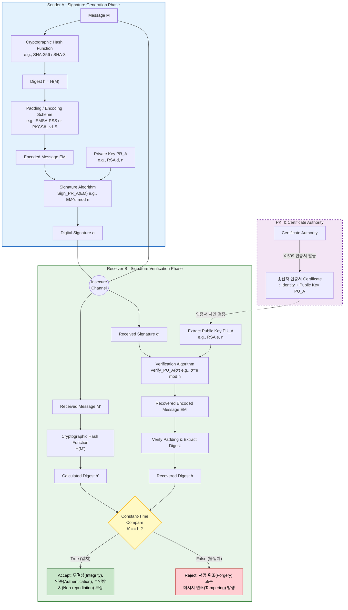

# 2026 학년도 1학기 중간과제물(온라인 제출용)

| | |
|---|---|
| **교 과 목 명** | 컴퓨터보안 |
| **학 번** | 202334-153257 |
| **성 명** | 양희석 |
| **연 락 처** | 010-4340-2326 |
| **과 제 유 형** **(공통형/지정형)** | 공통형 |

---
## 목차

- **문제1. 정보보호의 핵심목표인 기밀성, 무결성, 가용성에 대해 설명**
  - 1. 기밀성 (Confidentiality)
  - 2. 무결성 (Integrity)
  - 3. 가용성 (Availability)
  - 4. 기밀성을 준수하기 위한 방법
  - 5. 무결성을 준수하기 위한 방법
- **문제2. 대칭키 암호와 공개키 암호에 대한 특징**
  - 1. 대칭키 암호 (Symmetric-Key Cryptography)
  - 2. 공개키 암호 (Public-Key Cryptography)
  - 3. 대표 알고리즘의 종류
  - 4. 두 방식의 차이점 비교
  - 5. 하이브리드 암호 시스템 (Hybrid Cryptosystem)
- **문제3. 전자서명 동작 원리 및 과정 설명**
  - 1. 공개키 기반 구조 (PKI) 및 키 분배
  - 2. 송신자 측: 서명 생성 단계 (Signature Generation Phase)
  - 3. 네트워크 전송 (Insecure Channel)
  - 4. 수신자 측: 서명 검증 단계 (Signature Verification Phase)

---
## 문제1. 정보보호의 핵심목표인 기밀성, 무결성, 가용성에 대해 설명

정보보호의 핵심목표는 일반적으로 CIA Triad라 불리는 기밀성(Confidentiality), 무결성(Integrity), 가용성(Availability)의 세 가지로 정의됩니다. 이는 ISO/IEC 27000 및 NIST SP 800-12 등 국제 표준에서 정보보안의 기초 원칙으로 채택하고 있는 모델로, 정보 자산이 보호되어야 할 속성을 정의합니다.

#### 1. 기밀성 (Confidentiality)
인가되지 않은 주체(사용자, 프로세스, 시스템)에게 정보가 노출되지 않도록 보장하는 속성입니다. 즉, "알 필요가 있는 자(Need-to-know)"에게만 정보 접근을 허용하는 원칙입니다.
* 위협 사례: 도청(Eavesdropping), 스니핑(Sniffing), 사회공학(Social Engineering), 숄더 서핑(Shoulder Surfing), 무단 데이터베이스 조회 등이 기밀성을 침해하는 대표적 공격입니다.

#### 2. 무결성 (Integrity)
정보가 인가되지 않은 방법으로 변경(Modification), 삭제(Deletion), 생성(Insertion)되지 않고 원본의 정확성과 완전성이 유지되는 속성입니다. 데이터 무결성뿐만 아니라 시스템 무결성, 출처(Origin) 무결성까지 포괄합니다.
* 위협 사례: 중간자 공격(MITM)을 통한 패킷 변조, 악성코드에 의한 파일 변조, SQL Injection을 통한 DB 레코드 조작, 로그 위·변조 등이 해당됩니다.

#### 3. 가용성 (Availability)
인가된 사용자가 필요한 시점에 정보 자산과 서비스에 지체 없이 접근하여 사용할 수 있도록 보장하는 속성입니다. SLA(Service Level Agreement)에서 정의하는 가동률(예: 99.999%)이 정량적 척도로 사용됩니다.
* 위협 사례: 분산 서비스 거부 공격(DDoS), 랜섬웨어에 의한 데이터 암호화, 하드웨어 장애, 자연재해, 전력 차단 등이 가용성을 위협합니다.
* 보장 방법: 시스템 이중화(Redundancy), RAID 및 백업 체계, 부하 분산(Load Balancing), 무정지 시스템(Fault Tolerance), 재해 복구 계획(DRP/BCP), DDoS 방어 솔루션 등이 활용됩니다.

#### 4. 기밀성을 준수하기 위한 방법

① 암호화 (Cryptography)
* 기밀성 보장의 가장 핵심적인 수단으로, 평문(Plaintext)을 암호문(Ciphertext)으로 변환하여 키(Key)를 보유하지 않은 자가 내용을 해독할 수 없도록 합니다.
* 대칭키 암호: AES-256, ChaCha20 등을 사용하여 대용량 데이터를 빠르게 암호화합니다(예: 디스크 암호화, TLS 세션 데이터).
* 공개키 암호: RSA, ECC 등을 사용하여 키 교환(Key Exchange) 및 소량의 데이터를 암호화합니다.
* 적용 계층: 저장 데이터(Data at Rest)에는 디스크 암호화(BitLocker, LUKS) 및 DB 컬럼 암호화(TDE)를, 전송 데이터(Data in Transit)에는 TLS 1.3, IPsec, SSH 등을 적용합니다.

② 접근 통제 (Access Control)
* 주체(Subject)가 객체(Object)에 접근할 때 인가된 권한 범위 내에서만 행위를 허용하는 메커니즘입니다.
* 식별·인증(I&A): ID/Password, OTP, 생체 인증, FIDO2, MFA(다중 인증)를 통해 주체를 검증합니다.
* 인가 모델: DAC(임의적 접근통제), MAC(강제적 접근통제), RBAC(역할 기반 접근통제), ABAC(속성 기반 접근통제)를 정책에 맞게 선택 적용합니다.
* 최소 권한 원칙(Principle of Least Privilege)과 직무 분리(Separation of Duties)를 함께 적용하여 권한 남용을 방지합니다.

#### 5. 무결성을 준수하기 위한 방법

① 암호학적 해시 함수 (Cryptographic Hash Function)
* 임의 길이의 입력에 대해 고정 길이의 다이제스트를 생성하며, 충돌 회피성(Collision Resistance)과 역상 회피성(Preimage Resistance)을 가집니다.
* SHA-256, SHA-3 등을 사용하여 파일 다운로드의 체크섬, 패스워드 저장(솔트 결합), 블록체인의 머클 트리 구성 등에 활용됩니다.
* 단, 해시값 자체가 별도로 무결성 보호되지 않으면 공격자가 메시지와 해시를 함께 위조할 수 있으므로 키 또는 서명과 결합하여 사용해야 합니다.

② 메시지 인증 코드 (MAC, Message Authentication Code)
* 송수신자가 사전에 공유한 비밀키 K를 입력으로 하여 메시지에 대한 태그(Tag)를 생성하는 대칭키 기반 무결성·인증 메커니즘입니다.
* HMAC-SHA256, CMAC, GMAC 등이 표준으로 사용되며, TLS 레코드 계층, IPsec AH/ESP의 ICV에서 채택됩니다.
* 메시지 변조 시 수신측의 재계산 태그와 불일치하므로 위·변조를 즉시 탐지할 수 있습니다.

③ 전자서명 (Digital Signature)
* 송신자의 개인키로 메시지 다이제스트를 서명하고, 수신자가 공개키로 검증하는 비대칭키 기반 메커니즘입니다.
* RSA-PSS, ECDSA, EdDSA 등이 사용되며, 무결성과 더불어 송신자 인증(Authentication) 및 부인 방지(Non-repudiation)까지 동시에 제공한다는 점에서 MAC과 차별화됩니다.
* 코드 서명(Code Signing), 이메일 보안(S/MIME), TLS 인증서, 블록체인 트랜잭션 서명 등에 광범위하게 활용됩니다.

---

## 문제2. 대칭키 암호와 공개키 암호에 대한 특징

현대 암호 시스템은 키 사용 방식에 따라 크게 대칭키 암호(Symmetric-Key Cryptography)와 공개키 암호(Public-Key Cryptography, 비대칭키 암호)로 분류됩니다. 두 방식은 상호 배타적인 관계가 아니라, 각자의 장단점이 명확하기 때문에 실제 시스템(TLS, S/MIME, PGP 등)에서는 두 방식을 결합한 하이브리드 암호 시스템(Hybrid Cryptosystem) 형태로 운용됩니다.

#### 1. 대칭키 암호 (Symmetric-Key Cryptography)
송신자와 수신자가 동일한 비밀키(Secret Key) K를 공유하여 암호화와 복호화를 수행하는 방식으로, "관용 암호(Conventional Cryptography)"라고도 합니다.
* 수식: C = E_K(P), P = D_K(C)
* 안전성의 근원: 키 K의 비밀성에 의존하며, 알고리즘 자체는 공개되어도 무방합니다(Kerckhoffs의 원리).
* 장점: 비트 단위 연산(XOR, S-Box, Permutation) 기반으로 구현되어 연산 속도가 매우 빠르고 하드웨어 가속(AES-NI 등)이 용이하므로, 대용량 데이터의 암·복호화에 적합합니다.
* 단점: ① 통신 당사자 수 n에 대해 필요한 키의 수가 n(n-1)/2 로 폭증하는 키 분배(Key Distribution) 문제, ② 사전 키 공유가 필요하므로 안전한 채널이 별도로 요구되는 문제, ③ 키 자체에 송신자 정보가 결합되어 있지 않아 부인 방지(Non-repudiation)가 불가능한 한계가 있습니다.
* 동작 구조에 따른 분류:
  * 블록 암호(Block Cipher): 평문을 고정 길이 블록(64/128bit)으로 나누어 암호화. Feistel 구조(DES) 또는 SPN 구조(AES)를 사용하며 ECB, CBC, CTR, GCM 등의 운용 모드와 결합합니다.
  * 스트림 암호(Stream Cipher): 키 스트림을 평문과 비트 단위 XOR하여 암호화. 일회용 패드(OTP)를 근사하며, 무선통신·실시간 스트리밍에 적합합니다.

#### 2. 공개키 암호 (Public-Key Cryptography)
각 사용자가 수학적으로 연관된 한 쌍의 키, 즉 공개키(Public Key, PU)와 개인키(Private Key, PR)를 보유하며, 한쪽 키로 암호화한 결과는 반드시 다른 쪽 키로만 복호화할 수 있는 비대칭(Asymmetric) 방식입니다.
* 수식 (기밀성 모드): C = E_{PU_B}(P), P = D_{PR_B}(C)
* 안전성의 근원: 큰 정수의 소인수분해 문제(IFP), 이산대수 문제(DLP), 타원곡선 이산대수 문제(ECDLP) 등 일방향 함수(Trapdoor One-way Function)의 계산적 어려움에 기반합니다.
* 장점: ① 공개키만 배포하면 되므로 n명 통신 시 키의 수가 2n 개로 선형 증가하여 키 분배 문제가 해결되며, ② 개인키 서명을 통한 인증·부인 방지 기능을 제공하고, ③ 사전 비밀 공유 없이도 안전한 키 교환(Diffie-Hellman)이 가능합니다.
* 단점: 모듈러 거듭제곱 등 복잡한 수학 연산을 수반하므로 대칭키 대비 약 100~1,000배 느려 대용량 평문의 직접 암호화에는 부적합합니다.
* 사용 모드: 동일한 키 쌍을 ① 기밀성(수신자 공개키로 암호화), ② 인증·서명(송신자 개인키로 서명), ③ 키 분배(공유 비밀 도출)의 세 가지 목적으로 활용할 수 있습니다.

#### 3. 대표 알고리즘의 종류

① 대칭키 암호 알고리즘
* DES (Data Encryption Standard): 1977년 NIST 표준. 64bit 블록, 56bit 키, 16라운드 Feistel 구조. 키 길이가 짧아 1990년대 이후 무차별 대입 공격에 취약해져 현재는 사용 권고되지 않음.
* 3DES (Triple DES): DES를 3회 반복(EDE 방식) 적용해 실효 키 길이를 112bit로 확장. 호환성 목적으로 잔존하나 신규 시스템에서는 폐기 권고.
* AES (Advanced Encryption Standard): 2001년 NIST 표준. 128bit 블록, 128/192/256bit 키, SPN 구조 기반의 Rijndael 알고리즘. 현재 전 세계 사실상 표준이며 하드웨어 가속(AES-NI) 지원.
* SEED / ARIA / LEA: 한국 KISA 및 국정원이 표준화한 국산 블록 암호로, 공공기관 및 금융권에 사용. LEA는 IoT 환경을 위한 경량 암호.
* RC4 / ChaCha20: 대표적 스트림 암호. RC4는 취약점 발견으로 폐기되었고, 현재는 ChaCha20(+Poly1305 MAC)이 모바일·TLS 1.3 환경에서 널리 사용됩니다.

② 공개키 암호 알고리즘
* RSA (Rivest-Shamir-Adleman, 1978): 큰 소수의 소인수분해 문제 기반. 암호화·서명·키 교환에 모두 사용 가능한 범용 알고리즘. 현재 안전성을 위해 2048bit 이상의 키 길이 권장.
* Diffie-Hellman (DH, 1976): 이산대수 문제 기반의 최초의 공개키 키 교환 프로토콜. 암·복호화 자체보다는 공유 비밀(Shared Secret)을 안전하게 도출하는 데 사용.
* ElGamal: 이산대수 문제 기반의 암호화·서명 알고리즘. DSA의 이론적 기초.
* ECC (Elliptic Curve Cryptography): 타원곡선 이산대수 문제 기반. 동일한 안전성을 RSA 대비 짧은 키 길이(예: ECC 256bit ≈ RSA 3072bit)로 달성하므로 모바일·IoT 환경에 적합. 변형으로 ECDH, ECDSA, EdDSA가 있음.

#### 4. 두 방식의 차이점 비교

| 비교 항목 | 대칭키 암호 | 공개키 암호 |
|---|---|---|
| 키 구성 | 단일 비밀키 K (송수신자 동일) | 공개키/개인키 쌍 (PU, PR) |
| 암·복호화 키 관계 | 동일 키 사용 | 서로 다른 키 사용 |
| 안전성 기반 | 키의 비밀성 + 혼돈/확산 | 수학적 난제(IFP, DLP, ECDLP) |
| 연산 속도 | 매우 빠름 (Gbps급) | 느림 (대칭키의 1/100~1/1,000) |
| 키 길이 | 128~256 bit | RSA 2048~4096 bit, ECC 256~521 bit |
| 키 분배 | 사전 공유 필요 (분배 문제 발생) | 공개키 자유 배포 (분배 용이) |
| 키의 수 (n명) | n(n-1)/2 | 2n |
| 제공 보안 서비스 | 기밀성, (MAC 결합 시) 무결성 | 기밀성, 무결성, 인증, 부인방지, 키 교환 |
| 부인 방지 | 불가능 | 가능 (전자서명) |
| 적합 용도 | 대용량 데이터 암호화 | 키 교환, 서명, 소량 데이터 암호화 |
| 대표 알고리즘 | AES, SEED, ARIA, ChaCha20 | RSA, ECC, DH, ElGamal |

#### 5. 하이브리드 암호 시스템 (Hybrid Cryptosystem)
실제 보안 프로토콜은 두 방식의 장점을 결합하여 운용합니다. 대표적으로 TLS 핸드셰이크에서는 ① 공개키 암호(RSA 또는 ECDHE)로 세션 키(Session Key)를 안전하게 교환하고, ② 이후 실제 응용 데이터는 빠른 대칭키 암호(AES-GCM, ChaCha20-Poly1305)로 암호화합니다. 이때 GCM·Poly1305는 암호화와 무결성 검증을 하나의 연산으로 동시에 제공하는 **AEAD(Authenticated Encryption with Associated Data)** 방식으로, 별도 MAC 결합 없이도 기밀성과 무결성을 함께 보장합니다. 이를 통해 공개키 암호의 키 분배·인증 능력과 대칭키 암호의 고속 처리 능력을 동시에 확보할 수 있습니다.

---
## 문제3. 전자서명 동작 원리 및 과정 설명

전자서명(Digital Signature)은 디지털 환경에서 데이터의 무결성(Integrity), 송신자 인증(Authentication), 그리고 부인 방지(Non-repudiation)를 보장하기 위한 암호학적 메커니즘입니다. 본 문서에서는 공개키 기반 구조(PKI)와 패딩 기법을 포함한 현대적 전자서명의 동작 방식을 순서대로 설명합니다.

#### 1. 공개키 기반 구조 (PKI) 및 키 분배
전자서명의 검증이 안전하게 이루어지기 위해서는 수신자가 사용하는 '송신자의 공개키'가 위조되지 않은 진짜 키임을 보장해야 합니다.
* 인증기관(CA, Certificate Authority)의 역할: 신뢰할 수 있는 제3의 기관인 CA는 송신자(A)의 신원(Identity)과 공개키(PU_A)를 바인딩하여 X.509 표준 인증서(Certificate)를 발급합니다.
* 수신자는 검증 단계에 앞서 이 인증서의 유효성을 검증(인증서 체인 검증)함으로써, 중간자 공격(Man-in-the-Middle Attack)을 방지합니다.

#### 2. 송신자 측: 서명 생성 단계 (Signature Generation Phase)
송신자 A가 원본 메시지 M에 대한 전자서명 σ(시그마)를 생성하는 과정입니다.

① 메시지 해싱 (Cryptographic Hash Function)
* 송신자는 임의의 길이를 가진 메시지 M을 SHA-256 또는 SHA-3와 같은 암호학적 해시 함수에 입력하여 고정된 길이의 메시지 다이제스트(Digest) h를 도출합니다.
* 수식: h = H(M)
* 목적: 메시지 전체를 비대칭키로 연산하는 것은 비용이 매우 크므로, 충돌 회피성(Collision Resistance)을 가진 해시값을 사용하여 연산 효율성을 극대화합니다.

② 패딩 및 인코딩 (Padding / Encoding Scheme)
* 교과서적인 RSA 서명(Textbook RSA)은 곱셈적 준동형(Multiplicative Homomorphic) 성질을 가지므로 공격자가 기존 서명을 조합해 새로운 서명을 위조할 수 있는 취약점이 있습니다.
* 이를 방지하기 위해 다이제스트 h에 난수(Salt)를 추가하고 규격화된 포맷으로 변환하는 패딩 기법(예: EMSA-PSS 또는 PKCS#1 v1.5)을 적용하여 인코딩된 메시지(Encoded Message) EM을 생성합니다.

③ 서명 생성 알고리즘 (Signature Algorithm)
* 송신자 A는 자신의 개인키(Private Key, PR_A)를 사용하여 EM을 암호화(서명)합니다.
* RSA 알고리즘을 예로 들면, 개인키 지수 d와 모듈러스 n을 사용하여 다음과 같이 최종 전자서명 σ를 계산합니다.
* 수식: σ = EM^d mod n

#### 3. 네트워크 전송 (Insecure Channel)
* 송신자는 원본 메시지 M과 생성된 전자서명 σ를 안전하지 않은 네트워크(Insecure Channel)를 통해 수신자 B에게 전송합니다. 
* 전자서명은 데이터의 '기밀성(Confidentiality)'은 제공하지 않으므로, 데이터가 노출되어도 무방하거나 별도의 세션키로 암호화되었다고 가정합니다.

#### 4. 수신자 측: 서명 검증 단계 (Signature Verification Phase)
수신자 B가 네트워크를 통해 수신한 메시지 M'와 서명 σ'의 유효성을 검증하는 과정입니다.

① 수신 메시지 해싱
* 수신자 B는 전달받은 메시지 M'에 송신자와 동일한 해시 함수를 적용하여 계산된 다이제스트 h'를 얻습니다.
* 수식: h' = H(M')

② 서명 복호화 및 패딩 검증 (Verification Algorithm & Unpad)
* 수신자는 CA로부터 획득한 송신자의 인증서에서 공개키(Public Key, PU_A)를 추출합니다.
* RSA의 경우, 공개키 지수 e와 모듈러스 n을 사용하여 서명 σ'를 복호화해 복구된 인코딩 메시지 EM'를 계산합니다.
* 수식: EM' = (σ')^e mod n
* 이후 EM'에서 패딩 포맷의 유효성을 검사하고, 정상적이라면 패딩을 제거하여 복구된 다이제스트 h를 추출합니다.

③ 상수 시간 비교 및 결과 판정 (Constant-Time Compare)
* 수신자는 자신이 직접 계산한 h'와 서명에서 복구한 h를 비교합니다. 이때 타이밍 부채널 공격(Timing Side-channel Attack)을 방지하기 위해 연산 시간이 일정하게 소요되는 상수 시간 비교 로직을 사용해야 합니다.
* 판단 로직:
  * 일치 (h' == h): 검증 성공(Accept). 데이터가 전송 중 변조되지 않았음(무결성)과 송신자 A의 개인키로 서명되었음(인증 및 부인 방지)이 수학적으로 보장됩니다.
  * 불일치 (h' != h): 검증 실패(Reject). 제3자에 의한 메시지 변조(Tampering) 또는 서명 위조(Forgery)가 발생했거나 네트워크 오류가 있었음을 의미하므로 패킷을 폐기합니다.

