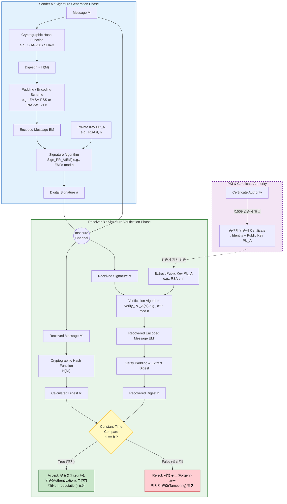

# 2026 학년도 1학기 중간과제물(온라인 제출용)

| | |
|---|---|
| **교 과 목 명** | 컴퓨터보안 |
| **학 번** | 202334-153257 |
| **성 명** | 양희석 |
| **연 락 처** | 010-4340-2326 |
| **과 제 유 형** **(공통형/지정형)** | 공통형 |

---
## 목차

- **문제1. 정보보호의 핵심목표인 기밀성, 무결성, 가용성에 대해 설명**
  - 1. 기밀성 (Confidentiality)
  - 2. 무결성 (Integrity)
  - 3. 가용성 (Availability)
  - 4. 기밀성을 준수하기 위한 방법
  - 5. 무결성을 준수하기 위한 방법
- **문제2. 대칭키 암호와 공개키 암호에 대한 특징**
  - 1. 대칭키 암호 (Symmetric-Key Cryptography)
  - 2. 공개키 암호 (Public-Key Cryptography)
  - 3. 대표 알고리즘의 종류
  - 4. 두 방식의 차이점 비교
  - 5. 하이브리드 암호 시스템 (Hybrid Cryptosystem)
- **문제3. 전자서명 동작 원리 및 과정 설명**
  - 1. 공개키 기반 구조 (PKI) 및 키 분배
  - 2. 송신자 측: 서명 생성 단계 (Signature Generation Phase)
  - 3. 네트워크 전송 (Insecure Channel)
  - 4. 수신자 측: 서명 검증 단계 (Signature Verification Phase)

---

## 문제1. 정보보호의 핵심목표인 기밀성, 무결성, 가용성에 대해 설명

정보보호의 핵심목표는 CIA Triad로 불리는 기밀성(Confidentiality)·무결성(Integrity)·가용성(Availability)의 세 가지로 정의되며, ISO/IEC 27000과 NIST SP 800-12 등 국제 표준에서 정보보안의 기초 원칙으로 채택된 모델입니다.

#### 1. 기밀성 (Confidentiality)
인가되지 않은 주체에게 정보가 노출되지 않도록 보장하는 속성으로, "알 필요가 있는 자(Need-to-know)"에게만 접근을 허용합니다.
* 위협 사례: 도청·스니핑, 사회공학, 무단 DB 조회 등.

#### 2. 무결성 (Integrity)
정보가 인가되지 않은 방법으로 변경·삭제·생성되지 않고 원본의 정확성·완전성이 유지되는 속성으로, 데이터·시스템·출처(Origin) 무결성을 포괄합니다.
* 위협 사례: 중간자 공격(MITM) 패킷 변조, SQL Injection을 통한 DB 조작, 로그 위·변조 등.

#### 3. 가용성 (Availability)
인가된 사용자가 필요한 시점에 정보 자산과 서비스에 지체 없이 접근·사용할 수 있도록 보장하는 속성으로, SLA의 가동률(예: 99.999%)이 정량적 척도로 사용됩니다.
* 위협 사례: DDoS, 랜섬웨어, 하드웨어 장애, 자연재해 등.
* 보장 방법: 시스템 이중화(Redundancy), RAID·백업, 부하 분산, 무정지 시스템, 재해 복구 계획(DRP/BCP) 등.

#### 4. 기밀성을 준수하기 위한 방법

① 암호화 (Cryptography): 평문을 암호문으로 변환해 키 미보유자가 해독할 수 없게 하는 핵심 수단. 대칭키 암호(AES-256, ChaCha20)는 대용량 데이터에, 공개키 암호(RSA, ECC)는 키 교환·소량 데이터에 사용하며, 저장 데이터에는 디스크/DB 암호화, 전송 데이터에는 TLS·IPsec·SSH를 적용합니다.

② 접근 통제 (Access Control): 주체가 객체에 접근할 때 인가된 권한 범위 내에서만 행위를 허용하는 메커니즘. 식별·인증은 ID/PW, OTP, 생체 인증, MFA로 수행하고, 인가는 DAC·MAC·RBAC·ABAC 모델을 적용하며, 최소 권한 원칙(PoLP)과 직무 분리(SoD)로 권한 남용을 방지합니다.

#### 5. 무결성을 준수하기 위한 방법

① 암호학적 해시 함수 (SHA-256, SHA-3): 임의 길이 입력에 대해 고정 길이 다이제스트를 생성하며 충돌 회피성·역상 회피성을 가집니다. 파일 체크섬, 패스워드 저장, 블록체인 머클 트리에 활용되며, 단독으로는 위조 위험이 있어 키 또는 서명과 결합해야 합니다.

② 메시지 인증 코드 (MAC, HMAC-SHA256/CMAC/GMAC): 송수신자가 공유한 비밀키 K로 메시지 태그를 생성하는 대칭키 기반 무결성·인증 메커니즘. TLS 레코드 계층, IPsec AH/ESP의 ICV에서 채택되며, 변조 시 태그 불일치로 즉시 탐지 가능합니다.

③ 전자서명 (RSA-PSS, ECDSA, EdDSA): 송신자의 개인키로 다이제스트를 서명하고 수신자가 공개키로 검증하는 비대칭키 메커니즘. 무결성에 더해 송신자 인증·부인 방지까지 제공한다는 점에서 MAC과 차별화되며, 코드 서명·S/MIME·TLS 인증서 등에 사용됩니다.

---

## 문제2. 대칭키 암호와 공개키 암호에 대한 특징

현대 암호 시스템은 키 사용 방식에 따라 대칭키 암호(Symmetric-Key)와 공개키 암호(Public-Key, 비대칭키)로 분류되며, 각자의 장단점이 명확해 실제 시스템(TLS, S/MIME, PGP 등)에서는 두 방식을 결합한 하이브리드 암호 시스템(Hybrid Cryptosystem)으로 운용됩니다.

#### 1. 대칭키 암호 (Symmetric-Key Cryptography)
송수신자가 동일한 비밀키 K를 공유하여 암·복호화를 수행하는 방식으로, "관용 암호"라고도 합니다.
* 수식: C = E_K(P), P = D_K(C)
* 안전성 근원: 키 K의 비밀성에 의존(Kerckhoffs의 원리 — 알고리즘은 공개 가능).
* 장점: 비트 단위 연산(XOR, S-Box, Permutation)과 하드웨어 가속(AES-NI)을 통해 매우 빠르므로 대용량 데이터 암·복호화에 적합합니다.
* 단점: 키 분배 문제(n명에 n(n-1)/2개 키), 사전 키 공유를 위한 안전 채널 필요, 부인 방지 불가.
* 분류: 블록 암호(평문을 64/128bit 블록으로 나눠 Feistel/SPN 구조 + ECB·CBC·CTR·GCM 운용 모드와 결합)와 스트림 암호(키 스트림과 평문을 XOR, OTP 근사).

#### 2. 공개키 암호 (Public-Key Cryptography)
각 사용자가 수학적으로 연관된 공개키(PU)와 개인키(PR) 쌍을 보유하며, 한쪽 키로 암호화한 결과는 다른 쪽 키로만 복호화할 수 있는 비대칭 방식입니다.
* 수식 (기밀성 모드): C = E_{PU_B}(P), P = D_{PR_B}(C)
* 안전성 근원: 소인수분해 문제(IFP), 이산대수 문제(DLP), 타원곡선 이산대수 문제(ECDLP) 등 일방향 함수의 계산적 어려움.
* 장점: 공개키만 배포하면 되므로 키 수가 2n으로 선형 증가하여 분배 문제 해결, 개인키 서명을 통한 인증·부인 방지, 사전 비밀 공유 없이 안전한 키 교환(DH) 가능.
* 단점: 모듈러 거듭제곱 등 복잡 연산으로 대칭키 대비 100 ~ 1,000배 느려 대용량 평문 직접 암호화에는 부적합.
* 사용 모드: 동일 키 쌍을 ① 기밀성(수신자 공개키 암호화), ② 인증·서명(송신자 개인키 서명), ③ 키 분배의 세 목적으로 활용 가능합니다.

#### 3. 대표 알고리즘의 종류

① 대칭키 암호 알고리즘
* DES / 3DES: 1977년 NIST 표준 DES(64bit 블록, 56bit 키, Feistel 구조)는 키 길이 부족으로 폐기. 3DES는 EDE 3회 반복으로 112bit 실효 키 확장이나 신규 시스템에서는 폐기 권고.
* AES (2001년 NIST 표준): 128bit 블록, 128/192/256bit 키, SPN 구조의 Rijndael. 현재 전 세계 사실상 표준이며 AES-NI 하드웨어 가속 지원.
* SEED / ARIA / LEA: 국내 KISA·국정원 표준 국산 블록 암호. 공공·금융권에서 사용되며 LEA는 IoT 경량 암호.
* RC4 / ChaCha20: 대표적 스트림 암호. RC4는 폐기되었고 ChaCha20(+Poly1305)이 모바일·TLS 1.3에서 활용됩니다.

② 공개키 암호 알고리즘
* RSA (1978): 소인수분해 문제 기반. 암호화·서명·키 교환에 모두 사용되는 범용 알고리즘으로 2048bit 이상의 키 길이 권장.
* DH / ElGamal: 이산대수 문제 기반. DH(1976)는 최초의 공개키 키 교환 프로토콜로 공유 비밀 도출에 사용되며, ElGamal은 DSA의 이론적 기초.
* ECC: 타원곡선 이산대수 기반. RSA 대비 짧은 키 길이로 동일 안전성 달성(ECC 256bit ≈ RSA 3072bit), 모바일·IoT에 적합. 변형으로 ECDH·ECDSA·EdDSA가 있습니다.

#### 4. 두 방식의 차이점 비교

| 비교 항목 | 대칭키 암호 | 공개키 암호 |
|---|---|---|
| 키 구성 | 단일 비밀키 K (송수신자 동일) | 공개키/개인키 쌍 (PU, PR) |
| 암·복호화 키 관계 | 동일 키 사용 | 서로 다른 키 사용 |
| 안전성 기반 | 키의 비밀성 + 혼돈/확산 | 수학적 난제(IFP, DLP, ECDLP) |
| 연산 속도 | 매우 빠름 (Gbps급) | 느림 (대칭키의 1/100 ~ 1/1,000) |
| 키 길이 | 128 ~ 256 bit | RSA 2048 ~ 4096 bit, ECC 256 ~ 521 bit |
| 키 분배 (n명) | 사전 공유 필요, n(n-1)/2개 | 공개키 자유 배포, 2n개 |
| 제공 보안 서비스 | 기밀성, (MAC 결합 시) 무결성 | 기밀성, 무결성, 인증, 부인방지, 키 교환 |
| 부인 방지 | 불가능 | 가능 (전자서명) |
| 적합 용도 | 대용량 데이터 암호화 | 키 교환, 서명, 소량 데이터 암호화 |
| 대표 알고리즘 | AES, SEED, ARIA, ChaCha20 | RSA, ECC, DH, ElGamal |

#### 5. 하이브리드 암호 시스템 (Hybrid Cryptosystem)
실제 보안 프로토콜은 두 방식의 장점을 결합해 운용합니다. TLS 핸드셰이크의 경우 ① 공개키 암호(RSA/ECDHE)로 세션 키를 안전하게 교환하고, ② 이후 응용 데이터는 빠른 대칭키 암호(AES-GCM, ChaCha20-Poly1305)로 암호화합니다. 이때 GCM·Poly1305는 암호화와 무결성 검증을 하나의 연산으로 제공하는 **AEAD(Authenticated Encryption with Associated Data)** 방식이라 별도 MAC 없이도 기밀성과 무결성을 함께 보장합니다. 결과적으로 공개키 암호의 키 분배·인증 능력과 대칭키 암호의 고속 처리 능력을 동시에 확보할 수 있습니다.

---
## 문제3. 전자서명 동작 원리 및 과정 설명

전자서명(Digital Signature)은 디지털 환경에서 무결성(Integrity)·송신자 인증(Authentication)·부인 방지(Non-repudiation)를 보장하는 암호학적 메커니즘으로, 공개키 기반 구조(PKI)와 패딩 기법을 포함한 동작 방식을 순서대로 설명합니다.

#### 1. 공개키 기반 구조 (PKI) 및 키 분배
검증의 안전성을 위해 수신자가 사용하는 '송신자의 공개키'가 위조되지 않았음을 보장해야 합니다.
* 신뢰할 수 있는 제3 기관인 인증기관(CA)이 송신자(A)의 신원과 공개키(PU_A)를 바인딩하여 X.509 표준 인증서를 발급합니다.
* 수신자는 검증에 앞서 인증서 체인을 검증함으로써 중간자 공격(MITM)을 방지합니다.

#### 2. 송신자 측: 서명 생성 단계 (Signature Generation Phase)
송신자 A가 메시지 M에 대한 전자서명 σ를 생성하는 과정입니다.

① 메시지 해싱
* 메시지 M을 SHA-256/SHA-3 등 암호학적 해시 함수에 입력하여 고정 길이 다이제스트 h를 도출합니다 (h = H(M)). 메시지 전체를 비대칭키로 연산하는 비용을 회피하기 위함입니다.

② 패딩 및 인코딩
* 교과서적 RSA 서명은 곱셈적 준동형 성질로 위조 가능성이 있어, 다이제스트 h에 난수(Salt)를 추가하고 규격 포맷으로 변환하는 패딩(EMSA-PSS, PKCS#1 v1.5)을 적용해 인코딩 메시지 EM을 생성합니다.

③ 서명 생성 알고리즘
* 송신자의 개인키(PR_A)로 EM을 서명합니다. RSA의 경우 개인키 지수 d와 모듈러스 n에 대해 σ = EM^d mod n 으로 최종 서명 σ를 계산합니다.

#### 3. 네트워크 전송 (Insecure Channel)
* 메시지 M과 서명 σ는 안전하지 않은 채널로 전송됩니다. 전자서명은 기밀성을 제공하지 않으므로 노출되어도 무방하거나 별도 세션키로 암호화된다고 가정합니다.

#### 4. 수신자 측: 서명 검증 단계 (Signature Verification Phase)
수신자 B가 수신 메시지 M'와 서명 σ'의 유효성을 검증하는 과정입니다.

① 수신 메시지 해싱
* 수신 메시지 M'에 동일한 해시 함수를 적용하여 다이제스트 h' = H(M')를 계산합니다.

② 서명 복호화 및 패딩 검증
* CA가 발급한 인증서에서 송신자의 공개키(PU_A)를 추출하고, RSA의 경우 공개키 지수 e·모듈러스 n에 대해 EM' = (σ')^e mod n 으로 인코딩 메시지를 복구합니다.
* EM'의 패딩 포맷 유효성을 검사한 뒤 패딩을 제거하여 다이제스트 h를 추출합니다.

③ 결과 판정
* h'와 h를 비교(타이밍 부채널 방지를 위해 상수 시간 비교 사용)하여 일치하면 검증 성공(무결성·인증·부인 방지 보장), 불일치하면 변조·위조로 간주하여 패킷을 폐기합니다.

