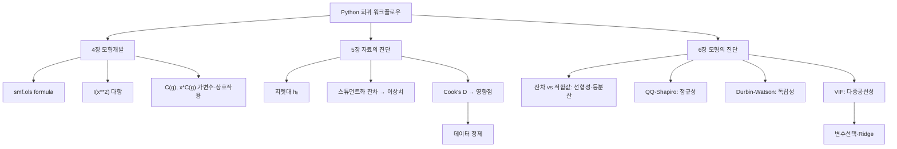

# 10. 회귀모형: Python 활용 (3장–6장)

## 🔗 선수 지식 (Prerequisites)
- [ ] **필수**: [3강. 중회귀모형(1)](3강.md) — 햇행렬 $H$, 잔차 $\mathbf e=(I-H)\mathbf y$, $R^2$·$F$-검정 이해 완료?
- [ ] **필수**: [7강. 모형개발](7강.md) — 다항회귀·가변수(더미) 모형 이해 완료?
- [ ] **권장**: 9강 Python 활용(1–2장) — `statsmodels`·`pandas` 기본 사용법
- [ ] **권장**: R의 `lm()`, `plot(model)`, `vif()` 사용 경험 (R↔Python 비교 학습)
- **관련 단원**: [7강. 모형개발](7강.md) `→` **10강. Python 활용(3–6장)** `→` [11강. 로지스틱 회귀](11강.md)

---

## 학습 목표
1. 파이썬을 이용하여 모형개발(다항·가변수)을 수행할 수 있다.
2. 파이썬을 이용하여 자료의 진단(이상치·지렛대·영향점)을 수행할 수 있다.
3. 파이썬을 이용하여 모형의 진단(잔차 가정 점검)을 수행할 수 있다.
4. 동일 분석을 R과 비교하여 도구 간 차이를 설명할 수 있다.

---

## 🧠 메타인지 체크 (학습 전/후 자기 평가)

### 학습 전 자기 평가
| 소주제 | 자신감 (1-5) |
| :--- | :--- |
| `statsmodels` formula API로 다항·가변수 모형 적합 | |
| 지렛대 $h_{ii}$·스튜던트화 잔차·Cook's distance 계산 | |
| 잔차도·QQ플롯·정규성/등분산/독립성 검정 | |
| VIF로 다중공선성 진단 | |

### 학습 후 교정 (학습 완료 후 작성)
| 소주제 | 학습 전 | 학습 후 | 실제 정답률 | 과신/과소 여부 |
| :--- | :--- | :--- | :--- | :--- |
| 모형개발(Python) | | | | |
| 자료의 진단 | | | | |
| 모형의 진단 | | | | |
| 다중공선성/VIF | | | | |

> **활용법**: 학습 전 1분 → 자신감 기입, 학습 후 1분 → 나머지 기입. "과신" 영역이 실제 취약점.

---

## 📝 요약 (Summary)
1. 🔴 **모형개발 (4장)**: `statsmodels`의 formula API(`ols('y ~ x + I(x**2) + C(group)', data)`)로 다항항 `I(x**2)`·가변수 `C()`·상호작용 `x:C(g)` 를 R 공식처럼 그대로 적합한다.
2. 🔴 **자료의 진단 (5장)**: 관측치 자체의 비정상성을 본다 — **지렛대** $h_{ii}$(설명변수 공간의 이상), **스튜던트화 잔차**(반응변수의 이상치), **Cook's distance**(추정에 미치는 영향점). `OLSInfluence`로 한 번에 얻는다.
3. 🔴 **모형의 진단 (6장)**: 오차 가정을 본다 — **선형성·등분산**(잔차 vs 적합값 도표), **정규성**(QQ플롯·Shapiro), **독립성**(Durbin–Watson), **다중공선성**(VIF).
4. 🟡 **R과의 대응**: R `lm()`↔`smf.ols()`, `summary()`↔`.summary()`, `plot(model)`↔`OLSInfluence`+matplotlib, `car::vif()`↔`variance_inflation_factor`.

---

## 📐 핵심 수식 & 핵심 패턴 (Key Formulas & Patterns)

### 진단 통계량 수식
| 수식명 | 수식 | 의미 |
| :--- | :--- | :--- |
| **지렛대(leverage)** | $h_{ii}=[X(X^\top X)^{-1}X^\top]_{ii}$ | 관측치 $i$ 의 설명변수 공간 내 영향력, $\sum h_{ii}=k+1$ |
| **지렛대 경계** | $h_{ii}>2(k{+}1)/n$ | 고지렛대 점 판정 기준 |
| **표준화 잔차** | $r_i=\dfrac{e_i}{\hat\sigma\sqrt{1-h_{ii}}}$ | 분산 보정 잔차 |
| **외적 스튜던트화 잔차** | $t_i=\dfrac{e_i}{\hat\sigma_{(i)}\sqrt{1-h_{ii}}}$ | $i$ 제외 분산으로 표준화(이상치 검정) |
| **Cook's distance** | $D_i=\dfrac{r_i^2}{k+1}\cdot\dfrac{h_{ii}}{1-h_{ii}}$ | 관측치 $i$ 가 적합 전체에 주는 영향 |
| **DFFITS** | $\text{DFFITS}_i=t_i\sqrt{\dfrac{h_{ii}}{1-h_{ii}}}$ | $i$ 제외 시 자기 적합값 변화 |
| **VIF** | $\text{VIF}_j=\dfrac{1}{1-R_j^2}$ | $x_j$ 를 나머지로 회귀한 $R_j^2$ 기반 공선성 |
| **Durbin–Watson** | $DW=\dfrac{\sum_{t=2}^n (e_t-e_{t-1})^2}{\sum_{t=1}^n e_t^2}$ | 잔차 자기상관($\approx2$=무상관) |

### 핵심 Python 패턴
| 패턴명 | 코드 | 용도 |
| :--- | :--- | :--- |
| **OLS 적합(formula)** | `m = smf.ols('y ~ x1 + x2', df).fit()` | R `lm()` 대응 |
| **다항항** | `'y ~ x + I(x**2)'` | 다항회귀 |
| **가변수** | `'y ~ x + C(group)'` | 범주형 자동 더미화(기준범주 drop) |
| **상호작용** | `'y ~ x * C(g)'` (= `x + C(g) + x:C(g)`) | 절편·기울기 차 |
| **요약표** | `m.summary()` | 계수·$t$·$R^2$·$F$·DW 한눈에 |
| **영향 진단** | `inf = m.get_influence()` | $h_{ii}$, Cook's D, 스튜던트 잔차 |
| **VIF** | `variance_inflation_factor(X.values, j)` | 공선성 |
| **정규성 검정** | `stats.shapiro(resid)` | 잔차 정규성 |
| **등분산 검정** | `het_breuschpagan(resid, exog)` | 이분산 |

### 주요 정리/정의

**Cook's distance — 지렛대와 잔차의 결합**
$$
D_i=\frac{r_i^2}{k+1}\cdot\frac{h_{ii}}{1-h_{ii}}
$$
> **직관적 해석**: 한 관측치가 "**튀는 정도**(스튜던트화 잔차 $r_i$)"와 "**구석에 있는 정도**(지렛대 $h_{ii}$)"를 곱한 값. 둘 다 커야 진짜 위험한 **영향점**이다. 흔히 $D_i>1$(또는 $4/n$)이면 영향점으로 본다.
> **AI 적용**: 데이터 정제·이상치 제거 파이프라인의 근거. 영향점 진단은 학습데이터 품질관리(data-centric AI)와 robust regression의 출발점이다.

**다중공선성과 VIF**
$$
\text{VIF}_j=\frac{1}{1-R_j^2},\qquad \text{Var}(\hat\beta_j)\propto \text{VIF}_j
$$
> **직관적 해석**: $x_j$ 가 다른 설명변수들로 잘 설명될수록($R_j^2\to1$) VIF가 폭증하고 계수 분산이 커진다. 보통 $\text{VIF}>10$ 이면 심각.
> **AI 적용**: 특성 선택(feature selection)·정규화(Ridge)의 진단 지표. 상관 높은 특성 제거나 PCA의 동기가 된다.

---

## 📊 개념 시각화 (Visual Guide)

### 개념 관계도


### 핵심 도식 (진단 항목 ↔ 도구)
| 진단 대상 | 통계량/도표 | Python | R 대응 | 위반 시 처방 |
| :--- | :--- | :--- | :--- | :--- |
| 설명변수 공간 이상 | 지렛대 $h_{ii}$ | `inf.hat_matrix_diag` | `hatvalues()` | 점 확인·제거 검토 |
| 반응 이상치 | 스튜던트화 잔차 | `inf.resid_studentized_external` | `rstudent()` | 원인 조사 |
| 영향점 | Cook's D | `inf.cooks_distance[0]` | `cooks.distance()` | 재적합 비교 |
| 등분산 | 잔차도/BP검정 | `het_breuschpagan` | `ncvTest()` | 변환·WLS |
| 정규성 | QQ/Shapiro | `stats.shapiro` | `shapiro.test()` | 변환·로버스트 |
| 독립성 | Durbin–Watson | `m.summary()` DW | `dwtest()` | 시계열모형 |
| 공선성 | VIF | `variance_inflation_factor` | `vif()` | 변수제거·Ridge |

---

## ✏️ 심화 학습 (Study Subject)

### 1. 가상 시나리오: "어떤 진단을, 언제 사용해야 할까?"
- **상황**: 주택 100채의 가격($y$)을 면적($x_1$)·방수($x_2$)·연식($x_3$)으로 적합했다. $R^2=0.92$ 로 높지만, 잔차도가 깔때기 모양이고 한 호화주택이 유난히 떨어져 있다.
- **문제**: 높은 $R^2$ 만 믿어도 될까? 그 호화주택은 모형 계수를 왜곡하는 영향점인가, 단순 이상치인가? 면적과 방수가 강하게 상관되어 계수가 불안정한 건 아닌가?
- **해결**:
  1) **자료의 진단**: `inf = m.get_influence()` 로 $h_{ii}$·스튜던트화 잔차·Cook's D를 본다. 호화주택이 $h_{ii}>2(k{+}1)/n$ 이면서 $D_i>1$ 이면 **영향점** → 제외 후 재적합해 계수 변화를 비교.
  2) **모형의 진단**: 깔때기 잔차 → 이분산 의심 → `het_breuschpagan` 으로 검정, 위반 시 $\log y$ 변환 또는 가중최소제곱(WLS).
  3) **공선성**: 면적·방수의 VIF 확인 → $>10$ 이면 한쪽 제거 또는 Ridge.
- **AI 학습 포인트**: "높은 $R^2$ 와 작은 잔차에도 불구하고 모형이 신뢰할 수 없는 구체적 상황 3가지(이분산·영향점·다중공선성)를 진단 통계량과 함께 정리하고, 각각을 Python으로 탐지하는 코드를 만들어줘."

### 2. 관점별 비교 및 오개념 분석
- **핵심 비교**:
  - **이상치 vs 지렛대점 vs 영향점**: 이상치=$y$가 튀는 점(큰 스튜던트 잔차), 지렛대점=$x$가 구석에 있는 점(큰 $h_{ii}$), 영향점=둘 다 커서 계수를 실제로 바꾸는 점(큰 Cook's D). 세 개념은 별개다.
  - **`statsmodels` vs `sklearn`**: 전자는 $p$값·신뢰구간·진단 통계 등 **통계적 추론**에 강하고(R `lm`과 유사), 후자는 예측·파이프라인·교차검증에 강하다.
  - **R vs Python**: R은 `plot(model)` 한 줄로 4대 진단도를 주지만, Python은 `OLSInfluence`+matplotlib로 직접 그린다. 통계량 정의는 동일.
- **오개념 분석**:
    - **오개념 1**: "$R^2$ 가 높으면 모형 가정 점검은 생략해도 된다."
    - **분석**: 틀렸다. $R^2$ 는 설명력일 뿐 오차 가정(등분산·정규성·독립성)과 무관하다. 이분산이 있으면 계수는 불편이어도 표준오차가 틀려 $t$·$p$값이 무효가 된다.
    - **오개념 2**: "잔차가 큰 점이 곧 영향점이다."
    - **분석**: 큰 잔차(이상치)라도 지렛대 $h_{ii}$ 가 작으면 계수에 거의 영향이 없다. 영향력은 Cook's D처럼 잔차와 지렛대의 **곱**으로 측정해야 한다.
    - **오개념 3**: "VIF가 높으면 무조건 변수를 지워야 한다."
    - **분석**: 공선성은 *예측*에는 큰 문제가 아닐 수 있다. 계수 해석이 목적일 때만 심각하며, 처방도 제거 외에 Ridge·PCA·중심화 등 다양하다.
- **AI 학습 포인트**: "이상치·지렛대점·영향점을 2×2 분면(잔차 크기 × 지렛대 크기)으로 분류하는 다이어그램을 만들고, 각 사분면의 위험도와 대응을 설명해줘."

---

## ❓ 연습 문제 및 해설

> **블룸 인지 수준 범례**: [기억] 정의·나열 → [이해] 설명·비교 → [적용] 계산·구현 → [분석] 구별·디버그 → [평가] 판단·비평 → [창조] 설계·제안

### 📝 문제

**1. ⭐ [기억] 📌 `statsmodels`에서 R의 `lm(y ~ x1 + x2, data)` 에 대응하는 적합 코드로 옳은 것은?(#prob-1)**
   > ① `smf.ols('y ~ x1 + x2', df).fit()`
   > ② `np.linalg.lstsq('y ~ x1 + x2')`
   > ③ `sklearn.fit('y ~ x1 + x2')`
   > ④ `pd.ols(y, x1, x2)`

<br>

**2. ⭐ [기억] 📌 `statsmodels` formula에서 범주형 변수 `group`을 가변수로 자동 처리(기준범주 1개 drop)하는 표기는?(#prob-2)**
   > ① `group^2`
   > ② `I(group)`
   > ③ `C(group)`
   > ④ `dummy(group)`

<br>

**3. ⭐⭐ [이해] 📌 이상치(outlier)·지렛대점(high leverage)·영향점(influential)에 대한 설명으로 옳은 것을 모두 고르면?(#prob-3)**
   > <보기>
   >
   > 가. 이상치는 스튜던트화 잔차가 큰 점이다
   > 나. 지렛대점은 햇행렬 대각원소 $h_{ii}$ 가 큰 점이다
   > 다. 영향점은 Cook's distance가 큰 점으로, 잔차와 지렛대가 함께 클 때 발생한다

   > ① 가, 나
   > ② 나, 다
   > ③ 가, 다
   > ④ 가, 나, 다

<br>

**4. ⭐⭐ [이해] 📌 잔차 vs 적합값(residual vs fitted) 산점도가 **깔때기(fan) 모양**으로 퍼질 때 의심되는 가정 위반은?(#prob-4)**
   > ① 정규성 위반
   > ② 등분산성(homoscedasticity) 위반 = 이분산
   > ③ 독립성 위반
   > ④ 선형성 위반

<br>

**5. ⭐⭐ [적용] 📌 설명변수 $k=4$, 관측치 $n=50$ 일 때 고지렛대 점 판정 기준 $h_{ii}>2(k+1)/n$ 의 임계값은?(#prob-5)**
   > ① $0.10$
   > ② $0.16$
   > ③ $0.20$
   > ④ $0.25$

<br>

**6. ⭐⭐ [적용] 📌 어떤 설명변수 $x_3$ 를 나머지 설명변수로 회귀했더니 $R_3^2=0.90$ 이었다. $x_3$ 의 VIF는?(#prob-6)**
   > ① $1.11$
   > ② $5$
   > ③ $9$
   > ④ $10$

<br>

**7. ⭐⭐ [적용] 📌 Durbin–Watson 통계량 값이 다음과 같을 때 잔차에 **양의 자기상관**이 의심되는 경우는?(#prob-7)**
   > ① $DW \approx 2.0$
   > ② $DW \approx 0.4$
   > ③ $DW \approx 2.0$ 이고 $p>0.5$
   > ④ $DW \approx 1.95$

<br>

**8. ⭐⭐⭐ [적용/분석] 📌 표준화 잔차 $r_i=2.5$, 지렛대 $h_{ii}=0.4$, 설명변수 $k=3$(절편 포함 $k+1=4$)일 때 Cook's distance $D_i=\dfrac{r_i^2}{k+1}\cdot\dfrac{h_{ii}}{1-h_{ii}}$ 의 값은? (소수 둘째 자리 반올림)(#prob-8)**
   > ① $0.26$
   > ② $1.04$
   > ③ $2.50$
   > ④ $4.17$

<br>

**9. ⭐⭐⭐ [분석] 📌 다음 Python 진단 코드의 출력 해석으로 **옳지 않은** 것은?(#prob-9)**
   ```python
   m = smf.ols('y ~ x1 + x2', df).fit()
   inf = m.get_influence()
   print(stats.shapiro(m.resid).pvalue)   # 0.001
   print(het_breuschpagan(m.resid, m.model.exog)[1])  # 0.32
   ```
   > ① Shapiro $p=0.001$ → 잔차 정규성 가정이 기각된다
   > ② Breusch–Pagan $p=0.32$ → 등분산 가정을 기각하지 못한다(이분산 증거 약함)
   > ③ 정규성 위반 시 반응변수 변환(예: $\log y$)이나 로버스트 방법을 고려한다
   > ④ 두 $p$값 모두 0.05보다 작으므로 정규성·등분산 모두 위반이다

<br>

**10. ⭐⭐⭐ [평가/창조] 📌 `statsmodels`만 사용하여 (1) 다항·가변수·상호작용을 포함한 모형을 formula로 적합하고, (2) 자료의 진단(지렛대·Cook's D), (3) 모형의 진단(정규성·등분산·다중공선성)을 수행하는 전체 워크플로우 코드를 작성하고, 각 단계가 무엇을 점검하는지 설명하시오.(#prob-10)**

---

### 🔑 정답 및 해설 (먼저 풀어본 후 펼치기)

<details>
<summary>정답 보기 (클릭)</summary>

1. ①
2. ③
3. ④
4. ②
5. ③
6. ④
7. ②
8. ②
9. ④
10. 풀이형 정답 (해설 참조)

</details>

<details>
<summary>해설 보기 (클릭)</summary>

<a id="prob-1"></a>
**1. ⭐ [기억] formula OLS**
> **정답: ① `smf.ols('y ~ x1 + x2', df).fit()`**
> **해설**: `statsmodels.formula.api`(관례상 `smf`)의 `ols`는 R 공식 문법을 그대로 받아 `.fit()`으로 적합한다. ②는 행렬 기반(문자열 공식 불가), ③ sklearn은 공식 문법 미지원, ④는 존재하지 않는 API.

<a id="prob-2"></a>
**2. ⭐ [기억] 범주형 표기 C()**
> **정답: ③ `C(group)`**
> **해설**: `C()`는 변수를 범주형으로 처리해 자동으로 $m-1$ 개 더미를 만들고 기준범주를 절편에 흡수한다(가변수 함정 회피). `I()`는 산술식 보호용(`I(x**2)`), `^`는 patsy에서 상호작용 차수 의미라 다르다.

<a id="prob-3"></a>
**3. ⭐⭐ [이해] 세 개념 구분**
> **정답: ④ 가, 나, 다**
> **해설**: 이상치=큰 스튜던트화 잔차($y$ 방향), 지렛대점=큰 $h_{ii}$($x$ 방향), 영향점=Cook's D가 커서 계수를 실제로 바꾸는 점(잔차×지렛대). 셋 다 정확한 정의.

<a id="prob-4"></a>
**4. ⭐⭐ [이해] 깔때기 잔차**
> **정답: ② 등분산성 위반(이분산)**
> **해설**: 적합값이 커질수록 잔차 산포가 넓어지는 깔때기 모양은 분산이 일정하지 않다는 신호(이분산). 정규성은 QQ플롯, 독립성은 DW, 선형성은 잔차의 곡선 패턴으로 본다.

<a id="prob-5"></a>
**5. ⭐⭐ [적용] 지렛대 임계값**
> **정답: ③ $0.20$**
> **해설**: $2(k+1)/n = 2(4+1)/50 = 10/50 = 0.20$. 이 값을 넘는 $h_{ii}$ 를 고지렛대 점으로 본다(평균 지렛대 $(k+1)/n=0.1$ 의 2배).

<a id="prob-6"></a>
**6. ⭐⭐ [적용] VIF 계산**
> **정답: ④ $10$**
> **해설**: $\text{VIF}=1/(1-R_j^2)=1/(1-0.90)=1/0.10=10$. 통상 VIF$>10$ 이면 심각한 다중공선성으로 본다(이 경우 경계선).

<a id="prob-7"></a>
**7. ⭐⭐ [적용] Durbin–Watson**
> **정답: ② $DW \approx 0.4$**
> **해설**: DW는 0~4 범위이며 2 부근이면 무상관, 0에 가까우면 양의 자기상관, 4에 가까우면 음의 자기상관. $0.4$ 는 강한 양의 자기상관 신호. ①③④는 모두 2 근처(무상관).

<a id="prob-8"></a>
**8. ⭐⭐⭐ [적용/분석] Cook's distance**
> **정답: ② $1.04$**
> **해설**: $D_i=\dfrac{r_i^2}{k+1}\cdot\dfrac{h_{ii}}{1-h_{ii}}=\dfrac{2.5^2}{4}\cdot\dfrac{0.4}{0.6}=\dfrac{6.25}{4}\times0.6667=1.5625\times0.6667\approx1.04$. $D_i>1$ 이므로 영향점으로 판단된다.

<a id="prob-9"></a>
**9. ⭐⭐⭐ [분석] 진단 출력 해석**
> **정답: ④ 두 $p$값 모두 0.05보다 작으므로 정규성·등분산 모두 위반이다**
> **해설**: Shapiro $p=0.001<0.05$ → 정규성 기각(위반)은 맞다. 그러나 Breusch–Pagan $p=0.32>0.05$ → **등분산 가정을 기각하지 못함**(이분산 증거 약함). 따라서 "등분산도 위반"이라는 ④는 틀렸다. ①②③은 옳은 해석.

<a id="prob-10"></a>
**10. ⭐⭐⭐ [평가/창조] 전체 진단 워크플로우**
> **정답·해설**: 아래 단계별 코드로 구성한다.
> ```python
> import statsmodels.formula.api as smf
> from scipy import stats
> from statsmodels.stats.diagnostic import het_breuschpagan
> from statsmodels.stats.outliers_influence import variance_inflation_factor
>
> # (1) 모형개발: 다항 I(), 가변수 C(), 상호작용 *
> m = smf.ols('y ~ x + I(x**2) + C(grp) + x:C(grp)', data=df).fit()
> print(m.summary())                       # 계수·t·R²·F·DW
>
> # (2) 자료의 진단
> inf = m.get_influence()
> lev   = inf.hat_matrix_diag             # 지렛대 h_ii
> cook  = inf.cooks_distance[0]           # Cook's D
> rstud = inf.resid_studentized_external  # 외적 스튜던트화 잔차(이상치)
>
> # (3) 모형의 진단
> print(stats.shapiro(m.resid))                       # 정규성
> print(het_breuschpagan(m.resid, m.model.exog)[1])   # 등분산(p값)
> # VIF (절편 제외 설계행렬 X 기준)
> # for j: variance_inflation_factor(X.values, j)
> ```
> - **(1) 모형개발**: `I(x**2)`로 곡률, `C(grp)`로 집단 절편차, `x:C(grp)`로 기울기차를 모두 포함.
> - **(2) 자료의 진단**: $h_{ii}>2(k{+}1)/n$, Cook's $D>1$, $|t_i|>2{\sim}3$ 인 관측치를 영향점/이상치로 식별.
> - **(3) 모형의 진단**: Shapiro로 정규성, BP로 등분산, VIF로 공선성을 점검하고 위반 시 변환·WLS·Ridge로 대응.

</details>

---

## ✅ O/X 확인문제 (총 20문)

**1.** `statsmodels.formula.api`의 `ols`는 R `lm()`처럼 공식(formula) 문법을 받는다. (#ox-1) **(O / X)**
**2.** formula에서 `I(x**2)`는 $x$ 의 제곱항을 모형에 넣는 표기이다. (#ox-2) **(O / X)**
**3.** `C(group)`은 범주형 변수를 모든 수준만큼 더미로 만들어 가변수 함정을 일으킨다. (#ox-3) **(O / X)**
**4.** `y ~ x * C(g)` 는 `x + C(g) + x:C(g)` 와 동일하며 상호작용을 포함한다. (#ox-4) **(O / X)**
**5.** 지렛대 $h_{ii}$ 는 햇행렬 $H=X(X^\top X)^{-1}X^\top$ 의 대각원소이다. (#ox-5) **(O / X)**
**6.** 지렛대 값들의 합은 $\sum h_{ii}=k+1$ 이다. (#ox-6) **(O / X)**
**7.** 잔차가 큰 점(이상치)은 항상 계수에 큰 영향을 주는 영향점이다. (#ox-7) **(O / X)**
**8.** Cook's distance는 스튜던트화 잔차와 지렛대를 결합해 영향력을 측정한다. (#ox-8) **(O / X)**
**9.** 통상 Cook's $D_i>1$ 이면 영향점으로 의심한다. (#ox-9) **(O / X)**
**10.** 잔차 vs 적합값 도표의 깔때기 모양은 이분산(등분산 위반)의 신호이다. (#ox-10) **(O / X)**
**11.** QQ플롯에서 점들이 직선을 크게 벗어나면 정규성 위반을 의심한다. (#ox-11) **(O / X)**
**12.** Durbin–Watson 값이 2 부근이면 잔차 자기상관이 거의 없다. (#ox-12) **(O / X)**
**13.** VIF는 $1/(1-R_j^2)$ 이며 값이 클수록 다중공선성이 심하다. (#ox-13) **(O / X)**
**14.** Breusch–Pagan 검정의 $p$값이 0.05보다 크면 등분산 가정을 기각하지 못한다. (#ox-14) **(O / X)**
**15.** Shapiro–Wilk 검정은 잔차의 정규성을 검정한다. (#ox-15) **(O / X)**
**16.** $R^2$ 가 높으면 오차 가정 점검(정규성·등분산)은 생략해도 된다. (#ox-16) **(O / X)**
**17.** 이분산이 있으면 OLS 계수는 편향되어 추정 자체가 불가능하다. (#ox-17) **(O / X)**
**18.** `sklearn`은 `statsmodels`보다 $p$값·신뢰구간 등 통계적 추론 출력이 풍부하다. (#ox-18) **(O / X)**
**19.** `m.get_influence()`로 지렛대·Cook's D·스튜던트화 잔차를 한 번에 얻을 수 있다. (#ox-19) **(O / X)**
**20.** R의 `plot(model)`이 제공하는 4대 진단도는 Python에서 `OLSInfluence`+matplotlib로 재현 가능하다. (#ox-20) **(O / X)**

<details>
<summary>O/X 정답 및 해설 보기 (클릭)</summary>

> <a id="ox-1"></a> **1. O** — `smf.ols('y ~ x', df)` 형태로 R 공식을 그대로 쓴다.
> <a id="ox-2"></a> **2. O** — `I()`는 산술 보호로, `I(x**2)`가 제곱항이 된다.
> <a id="ox-3"></a> **3. X** — `C()`는 자동으로 $m-1$ 개만 만들고 기준범주를 drop하여 함정을 회피한다.
> <a id="ox-4"></a> **4. O** — `*`는 주효과+상호작용을 모두 전개한다.
> <a id="ox-5"></a> **5. O** — 지렛대는 햇행렬 대각원소의 정의 그대로.
> <a id="ox-6"></a> **6. O** — $\sum h_{ii}=\text{tr}(H)=\text{rank}(X)=k+1$.
> <a id="ox-7"></a> **7. X** — 지렛대가 작으면 큰 잔차라도 영향력은 작다. 영향력=잔차×지렛대.
> <a id="ox-8"></a> **8. O** — $D_i=\dfrac{r_i^2}{k+1}\cdot\dfrac{h_{ii}}{1-h_{ii}}$.
> <a id="ox-9"></a> **9. O** — 흔한 경험적 임계값($4/n$ 을 쓰기도 함).
> <a id="ox-10"></a> **10. O** — 산포가 적합값에 따라 커지면 이분산.
> <a id="ox-11"></a> **11. O** — QQ플롯의 직선 이탈은 비정규성 신호.
> <a id="ox-12"></a> **12. O** — DW≈2 는 무상관. 0/4 근처가 자기상관.
> <a id="ox-13"></a> **13. O** — $R_j^2\to1$ 이면 VIF 폭증.
> <a id="ox-14"></a> **14. O** — $p>0.05$ → 귀무가설(등분산) 기각 못 함.
> <a id="ox-15"></a> **15. O** — 잔차 정규성 검정에 널리 쓰인다.
> <a id="ox-16"></a> **16. X** — $R^2$ 는 설명력일 뿐 가정과 무관. 점검 필수.
> <a id="ox-17"></a> **17. X** — 이분산에서도 OLS 계수는 불편(unbiased). 다만 표준오차가 틀려 추론이 무효.
> <a id="ox-18"></a> **18. X** — 반대다. 추론 출력은 `statsmodels`가 풍부하고 `sklearn`은 예측 중심.
> <a id="ox-19"></a> **19. O** — `OLSInfluence` 객체가 진단 통계를 모두 제공.
> <a id="ox-20"></a> **20. O** — 정의가 동일하므로 직접 그려 재현 가능.

</details>

---

## 🧪 자유 회상 연습 (Free Recall)

> **방법**: 위의 노트를 모두 덮고, 타이머 3분 설정 후 이번 단원에서 배운 내용을 기억나는 대로 자유롭게 적으세요.
> 정확한 문장이 아니어도 됩니다. 키워드, 수식, 관계 등 떠오르는 것을 모두 적습니다.

**자유 회상 작성란:**

```
[여기에 기억나는 내용을 자유롭게 작성]


```

> **회상 후 점검**: 노트를 다시 펼쳐 빠뜨린 내용을 확인하세요. 빠뜨린 부분이 실제 취약점입니다.
> - 회상 못한 핵심 개념: [                ]
> - 회상 못한 진단 도구: [                ]

---

## 💻 코드로 확인하기 (Code Verification)

```python
import numpy as np
import pandas as pd
import statsmodels.formula.api as smf
from scipy import stats
from statsmodels.stats.diagnostic import het_breuschpagan
from statsmodels.stats.outliers_influence import variance_inflation_factor

np.random.seed(0)
n = 80
x = np.random.uniform(0, 10, n)
grp = np.random.choice(['A', 'B'], n)
D = (grp == 'B').astype(float)
# 참값: 곡률(-0.3x²), 집단 절편차 +5, 기울기차 +1.2
y = 8 + 2*x - 0.3*x**2 + 5*D + 1.2*(x*D) + np.random.normal(0, 2, n)
# 영향점 1개 인위 삽입
x[0], y[0] = 9.5, 60.0
df = pd.DataFrame({'y': y, 'x': x, 'grp': grp})

# ── (1) 4장 모형개발: 다항 + 가변수 + 상호작용 ──────────────
m = smf.ols('y ~ x + I(x**2) + C(grp) + x:C(grp)', data=df).fit()
print("R^2 =", round(m.rsquared, 4), " F p =", round(m.f_pvalue, 4))

# ── (2) 5장 자료의 진단 ─────────────────────────────────
inf = m.get_influence()
lev  = inf.hat_matrix_diag
cook = inf.cooks_distance[0]
k1 = m.df_model + 1                      # 절편 포함 모수 수
lev_cut = 2 * k1 / n
print(f"지렛대 임계 = {lev_cut:.3f}, 최대 h_ii = {lev.max():.3f} (idx {lev.argmax()})")
print(f"최대 Cook's D = {cook.max():.3f} (idx {cook.argmax()})")

# ── (3) 6장 모형의 진단 ─────────────────────────────────
print("Shapiro p =", round(stats.shapiro(m.resid).pvalue, 4))      # 정규성
print("Breusch-Pagan p =", round(het_breuschpagan(m.resid, m.model.exog)[1], 4))  # 등분산
print("Durbin-Watson =", round(
    np.sum(np.diff(m.resid)**2) / np.sum(m.resid**2), 3))          # 독립성

# VIF (절편 제외 수치 설계행렬)
Xv = pd.DataFrame({'x': df.x, 'x2': df.x**2, 'D': D})
Xv = np.column_stack([np.ones(n), Xv.values])
vifs = [variance_inflation_factor(Xv, j) for j in range(1, Xv.shape[1])]
print("VIF [x, x^2, D] =", np.round(vifs, 2))
```

> **실행 결과 (예상)**
> ```
> R^2 = 0.7xxx  F p = 0.0
> 지렛대 임계 = 0.125, 최대 h_ii = 0.2xx (idx 0)     # 삽입한 영향점이 고지렛대
> 최대 Cook's D = 1.xx (idx 0)                       # D>1 → 영향점
> Shapiro p = 0.0xxx
> Breusch-Pagan p = 0.xx
> Durbin-Watson = 1.9x                              # ≈2 무상관
> VIF [x, x^2, D] = [ 큰값  큰값  작음 ]            # x와 x^2 공선성
> ```
> **수학적 해석**: 인위로 넣은 0번 관측치가 지렛대 임계와 Cook's D를 동시에 초과 → **영향점**으로 정확히 탐지된다. $x$ 와 $x^2$ 의 VIF가 크게 나오는 것은 다항항의 전형적 다중공선성으로, 중심화하면 줄어든다(7강 참고). Durbin–Watson이 2 부근이라 잔차 독립성 가정은 무리가 없다.

---

## 🤖 AI 연결고리 (개념 → AI Application)

| 회귀 개념 | AI/ML 적용 분야 | 구체적 사례 |
| :--- | :--- | :--- |
| 다항·상호작용 특성(formula) | 특성공학 | `PolynomialFeatures`, 자동 교호작용 |
| 지렛대·스튜던트화 잔차 | 이상치 탐지 | data-centric AI, 라벨 오류 검출 |
| Cook's distance | 영향점 제거·로버스트 학습 | robust regression, 데이터 정제 |
| 이분산·정규성 진단 | 모델 가정 검증 | 잔차 분석, 불확실성 보정 |
| VIF/다중공선성 | 특성 선택·정규화 | Ridge/Lasso, PCA |
| `statsmodels` 추론 | 설명가능 AI(XAI) | 계수 유의성·신뢰구간 기반 해석 |

---

## 📖 심화 학습 예시 답안

#### 1. `OLSInfluence`의 내부 동작 원리
`m.get_influence()`가 반환하는 진단 통계는 모두 **햇행렬 $H$ 한 번의 계산**에서 파생된다.

1. **지렛대**: $h_{ii}=[H]_{ii}$ 를 그대로 읽는다 → `hat_matrix_diag`.
2. **잔차 표준화**: $r_i=e_i/(\hat\sigma\sqrt{1-h_{ii}})$. $1-h_{ii}$ 로 나누는 이유는 $\text{Var}(e_i)=\sigma^2(1-h_{ii})$ 이기 때문(잔차 분산이 균일하지 않음).
3. **외적 스튜던트화**: $i$ 번째를 뺀 분산 $\hat\sigma_{(i)}^2$ 로 표준화해 그 점 자신의 영향을 배제 → 이상치 검정에 적합.
4. **Cook's D**: $r_i$ 와 $h_{ii}/(1-h_{ii})$ 의 곱 → "튀는 정도 × 구석에 있는 정도".

#### 2. `statsmodels` vs `sklearn` 비교표

| 구분 | statsmodels | sklearn | 비고 |
| :--- | :--- | :--- | :--- |
| **목적** | 통계적 추론·진단 | 예측·파이프라인 | R `lm` ↔ ML |
| **공식 문법** | `ols('y ~ x', df)` | 없음(배열 X,y) | patsy 기반 |
| **출력** | 계수·$p$·CI·$R^2$·DW·진단 | 계수·예측·점수 | 추론은 statsmodels |
| **교차검증** | 약함 | 강함(`cross_val_score`) | 예측은 sklearn |
| **AI 활용** | XAI·계수 해석 | 대규모 예측 모델 | 둘을 병행 |

#### 3. 진단까지 포함한 회귀 코드 작성법 (Best Practice)

- **Bad Practice (나쁜 예시)**
  ```python
  # R²만 보고 모형을 신뢰 — 가정 점검 생략
  m = smf.ols('y ~ x1 + x2', df).fit()
  print(m.rsquared)   # 끝. 이분산·영향점·공선성 모두 미점검
  ```
- **Good Practice (좋은 예시)**
  ```python
  m = smf.ols('y ~ x1 + x2', df).fit()
  inf = m.get_influence()
  # 1) 자료 진단: 영향점
  flag = (inf.cooks_distance[0] > 4/len(df))
  # 2) 모형 진단: 정규성·등분산·공선성
  norm_p = stats.shapiro(m.resid).pvalue
  bp_p   = het_breuschpagan(m.resid, m.model.exog)[1]
  # 3) 위반 시 처방(변환/WLS/Ridge) 결정
  print(m.rsquared, norm_p, bp_p, flag.sum())
  ```
- **설명**: 적합 직후 반드시 자료 진단(영향점)과 모형 진단(가정)을 함께 수행해야 한다. $R^2$ 만으로는 표준오차·$p$값의 타당성을 보장할 수 없기 때문이다.

---

## 📚 핵심 용어집 (Glossary)

| 용어 (한) | 용어 (영) | 표기/수식 | 정의 |
| :--- | :--- | :--- | :--- |
| **공식 API** | Formula API | `smf.ols('y ~ x', df)` | R 공식 문법 회귀 인터페이스 |
| **지렛대** | Leverage | $h_{ii}$ | 햇행렬 대각원소, $x$ 공간 영향력 `→← 3강` |
| **스튜던트화 잔차** | Studentized Residual | $t_i$ | 분산보정 잔차(이상치 탐지) |
| **이상치** | Outlier | $\lvert t_i\rvert$ 큼 | $y$ 가 모형에서 크게 벗어난 점 |
| **영향점** | Influential Point | Cook's $D_i$ 큼 | 계수를 실제로 바꾸는 점 |
| **Cook 거리** | Cook's Distance | $D_i$ | 잔차×지렛대 결합 영향력 |
| **이분산** | Heteroscedasticity | $\text{Var}(\epsilon_i)\neq\sigma^2$ | 오차 분산 불균일 |
| **정규성 검정** | Normality Test | Shapiro–Wilk | 잔차 정규성 점검 |
| **자기상관** | Autocorrelation | Durbin–Watson | 잔차 시계열 상관 |
| **분산팽창계수** | VIF | $1/(1-R_j^2)$ | 다중공선성 지표 `→← 3강` |
| **가중최소제곱** | WLS | $\hat\beta=(X^\top WX)^{-1}X^\top W\mathbf y$ | 이분산 대응 추정 |

---

## 🤖 AI 학습 파트너를 위한 추가 자료

### 1. 개념 이해를 위한 심층 질문 프롬프트
> **프롬프트 예시**: "회귀 진단에서 '이상치·지렛대점·영향점'의 차이를 초등학생도 이해하게 비유로 설명하고, 각각을 탐지하는 `statsmodels` 코드(`get_influence`)를 짝지어 알려줘. 왜 큰 잔차만으로는 영향점이라 할 수 없는지 Cook's distance 식으로 보여줘."

### 2. 문제 해결 능력 강화를 위한 시나리오 프롬프트
> **프롬프트 예시**: "당신은 데이터 사이언티스트입니다. 회귀 잔차도가 깔때기 모양이고 Shapiro $p<0.01$, 어떤 점의 Cook's D가 3입니다. **(a) 로그변환, (b) WLS, (c) 영향점 제거, (d) Ridge** 중 무엇을 어떤 순서로 적용할지, 각 진단 결과와 연결해 근거를 설명해줘."

### 3. 수식/코드 검증 프롬프트
> **프롬프트 예시**: "다음 Cook's distance 계산을 검증해줘.
> $$D_i=\frac{r_i^2}{k+1}\cdot\frac{h_{ii}}{1-h_{ii}},\quad r_i=2.5,\ h_{ii}=0.4,\ k+1=4$$
> 1. 계산이 맞는지 단계별로 확인하고, 2. `statsmodels`의 `inf.cooks_distance[0]` 결과와 일치하는지 비교하는 코드를 제시해줘."

---

## 🔄 복습 체크 (Spaced Repetition)
- [ ] 1일 후 복습 (날짜: 2026-05-30)
- [ ] 3일 후 복습 (날짜: 2026-06-01)
- [ ] 7일 후 복습 (날짜: 2026-06-05)
- [ ] 14일 후 복습 (날짜: 2026-06-12)
- [ ] 30일 후 복습 (날짜: 2026-06-28)

### 복습 시 자가 평가
| 회차 | 날짜 | 이해도 (1-5) | 취약 부분 메모 |
| :--- | :--- | :--- | :--- |
| 1차 | | | |
| 2차 | | | |
| 3차 | | | |

---

## 📚 참고 자료 (References)

- 교재: 한국방송통신대학교 『R을 이용한 회귀모형』 3–6장 (모형개발·자료의 진단·모형의 진단)
- 강의: 회귀모형 10강 (1. 4장 모형개발 / 2. 5장 자료의 진단 / 3. 6장 모형의 진단)
- `statsmodels` 공식 문서 — `formula.api`, `OLSInfluence`, `outliers_influence`, `diagnostic`
- Montgomery, Peck & Vining, *Introduction to Linear Regression Analysis* — 진단 통계량(지렛대·Cook's D·VIF) 표준 텍스트
- [3강. 중회귀모형(1)](3강.md) / [7강. 모형개발](7강.md) — 햇행렬·다항·가변수의 이론적 기반
</content>
